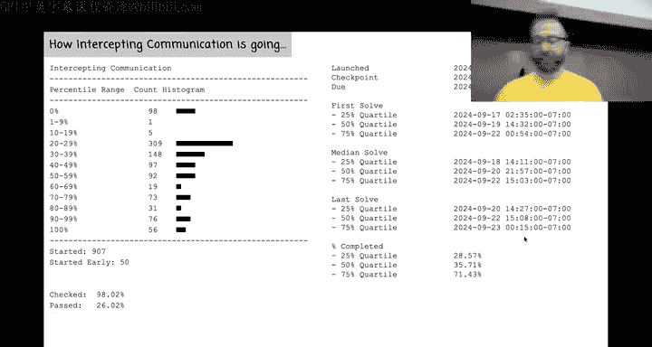
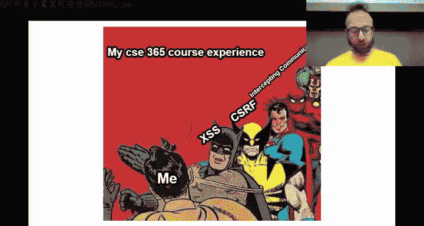
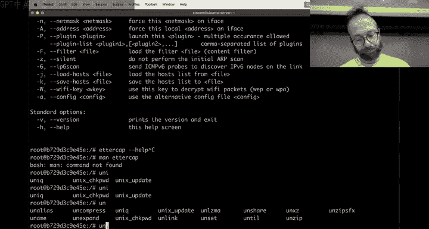
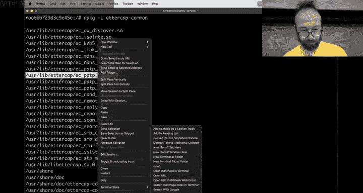
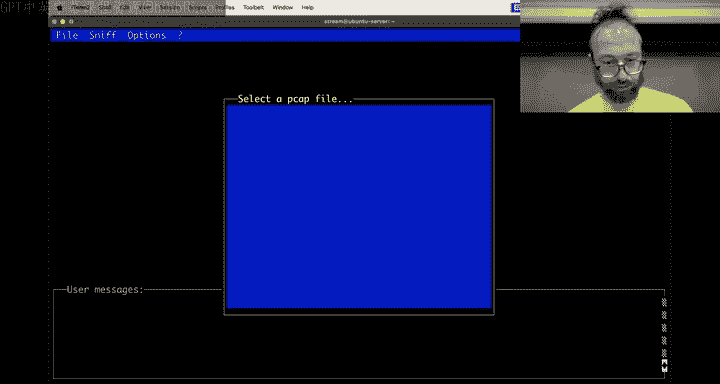
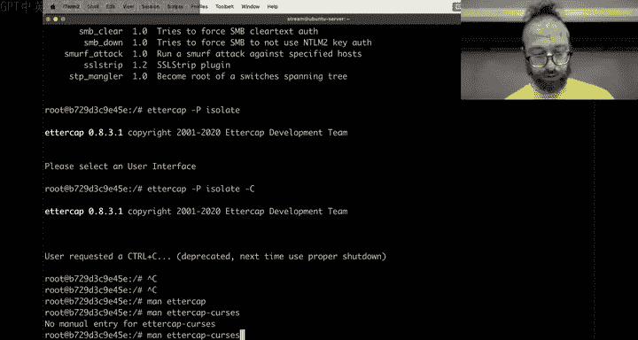
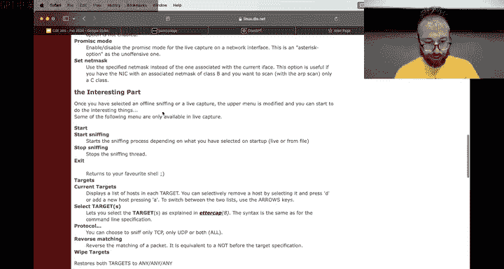
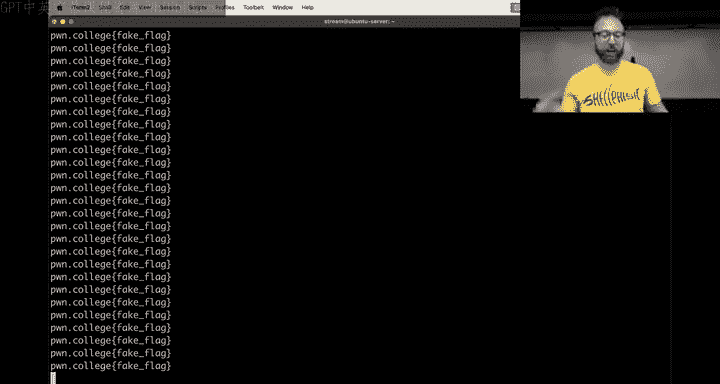
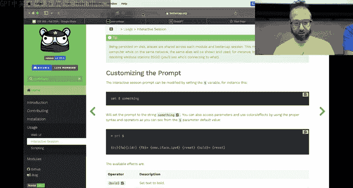

# ASU《网络安全导论｜ASU CSE365 Introduction to Cybersecurity Fall 2024》中英字幕deepseek翻译 - P10：-11-Intercepting Communications - CSE365 - Yan & Connor - 2024.09.25.zh_en - GPT中英字幕课程资源 - BV1nVCVY9Ehy

What is。Int three。Why is it not automatic All right， now there's audio。Cool， all right。amazingm。

 okay， so basically。I don't know， you'll have to this is the benefit of coming in person。

 that's right， okay。TlDR。Use the resources at your disposal when you're gonna start running to problems because three quarters of the class hasn't touched Poone College since the checkpoint deadline and it's Wednesday it's not the end of the world。

 still plenty of time but。

Don't delay too much longer。 And when you do delay too much longer and then hit。

Problems in later levels。Keep in mind of the resources around there for this module。

 unlike web security that really got way too tricky for， for sensei to be of， you know。

 significant use and was like。This module is。还 as。A different type of knowledge that's required。

 It's much more general knowledge about how networking works。 and sensei knows that fairly well。Also。

Come to the recitations and。Hang out on the Discord watch other threads as well if you can beat Hanto to the answer。

 there's some extra credit for for you in it， but we are also in previous years when there's been the like a hero helper from outside of the this ASU student population we have actually distributed their extra credit to the students with their consent and like Robin Ho sort of scenario So maybe we'll do something similar with Hoto if if he can hit or they can hit  a thousand0。

Extra credit help and then we'll maybe do that but Ponto is not pressured to hit us。 Yeah。

 yeah yeah yeah。Don't worry， well you can do it anyways， right。

 because I guess non invents will work just fine too so。Yeah， okay， perfect。All right， as a reminder。

 as you're using all the health channels， please do not seek help in direct messages that's an academic integrity violation for ASU students some people have figured out ways to escape the meme jail。

That's a cool hack I we， you know， I didn't re jail share with 2。0， but just keep in mind。

To properly link your new discord or old discord or whatever， probably。

 if you escape out of meme jail and start making good memes。

 you'll eventually be fined from like a when Connor does another jail break。 But the key thing don't。

Don't do。 don't ask for help in Dms it it。Just robs people of good hauntto answers in the actual threats。

All right， awesome。Okay， most people are finding intercepting communication much more approachable than web security。

 It is much more of a question of。Understanding the concepts and understanding the tools。Rather than。

 except for a couple of of levels here， rather than like， truly。

Figuring out the tiny minutia of this giant JavaScript thing like。

Network attacks are really interesting in this way and I think。Is this what you guys are finding？

Silence， okay， maybe not。 All right， cool。A couple of network specific me technology specific I really like this this our broadcast over here that's really great。

 I think the bottom pan could be you know maybe slightly there。

 but it's it's an awesome meme and then。The various two memes are great。

 here's one of them for following TP flows and wire Sha。

We had a question earlier about wire shark versus T shark。

 Do you want us to show off wire shark or you're good with wire shark now， you're good。 Okay， okay。

 cool so you。Probably figured out there's there's kind of more than one way to follow a TCP stream here wirere shark is a good route forward T shark is a text interface to wire shark as I kind of mentioned earlier when asked about this like if you if I need to analyze one network stream I'll reach for wire shark or one Pcap if I have to analyze 10000 Pcaps I'll script it in T shark that's kind of the。

😡，The difference between wire shark and T shark， but they have the exact same functionality on the back end using the exact same code base and then there's a lot of other cool network tools we'll go into some of them today all right。

 as I mentioned most people just pieceed out right after the checkpoint deadline I like people's dedication to memes to do。

Checkpoint or to make memes instead of doing challenges， but please do the challenges。

 this is the as you figured out the main source of learning in the class we are up here in these lectures to you know。

😡，Meam of the community， but then answer kind of missing bits of the lectures。

 but there are intentionally missing bits of the lectures that you bridge by walking through these challenges。

 so if you don't do the challenges not only will you fail the class but you'll also miss the knowledge。

😡，Um， all right， a couple of u challenges that that people run into that that just by looking at the memes。

 we see which challenges have maybe u pain points， interesting， interesting problem areas。

 et ceter cetera， by far the most means still about level four， of course level four。

 it's the base solution that will take an hour to run is not hard。It the the and。

 and it's so cool to see people optimizing more and more。

 We should actually make this a challenge Now that I think about it。

 you should have a level 5 after level 4。 like now do it in a minute。 Yeah， something like that。

 That would be super cool。😊，Yeah， it's really cool to see people doing this one thing I wanted to call out and now。

 oh yeah， it's right here。It's great。If you engage with the material and now that you're writing custom tooling to solve the challenges。

 that's what we want to see， that's awesome， but you know as long as you get the flag with the tooling you got at your disposal。

 that's awesome too all right。😡，嗯。There's a lot of pylon memes about this。 And the。

 the reality of meme generators is that you end up with a lot of identical， some identical memes。

 we're not gonna jail you for a。Meme that covers a topic that's been too too heavily topic they're too heavily covered。

 we're going to jail you for mean you copy based off on Twitter。

We might stop at some point upvoing level four interrupting communication intercepting communication means。

 but you know what？You're not going to get jailed for it， you just。Probably a waste of time。

Couple of other challenging levels， level 6 and level 11。

 getting that that handshake correct the first time can be a little tricky， but it is。

Hopefully the people that have pushed through it， it's a cool。

A way to understand the low levels of how networking actually works， right so。😡。

There's a common job interview question you get at at。These like， you know， large companies like。

And depending on the role you're interviewing for， what the hell？Why did this thing？

Completely leaves me behind。Every time， a right， there we go， we're back。All right， all right。

 we're back， okay。One of these days it's going to like start going in on a be or something and to a common interview question is what happens when you go to Google。

com in your web browser？Right， and I'm sure that if you interview somewhere that's， you know。

 it'll be whatever dot com their website And then you， you might ask them， you know。

 at what depth right， like how， how， how deep should should I go say as deep as you can， like。

 you know， by the time you you you'， you， you know。I mean， depending on where you go with it。

 the TCP handshake is an important part， the aRP thing is an important part。

 it's a very cool way to demonstrate that you know this stuff at a very。

 very deep level and hopefully by the time we are through the other end of the next module which youll be crypto you'll be able to also talk about the encryption and cetera。

 etca etc ce right and so youre you're kind of building up through this class the understanding of how all of that truly works deep down by interrupting and breaking parts of it the reverse engineering and X86 I think this class is inspired by that exact question Yeah yeah so it's。

I think one of the。Kind of on philosophical note， one of the。

Unfortunate parts of how computer science is taught today is we start out in the clouds writing for loops in Java or something。

 and then you have to fight your way down and build a foundation as you go and that's just not how。

We tend to teach anything else。 I mean， imagine， you know， teaching a， a newborn how to。

Be a person by tossing him out of the airplane with with a parachute attached to them。

 It's like it's not gonna know work very well， but that this is exactly what we do to you through the computer science education process And it didn't used to be that way at some point early。

 early on in in computer science， we're talking like， you know。

 decades and decades ago probably 80s or so， do you remember when， when when was that shift。

 This is your education。那我さん。诶。Computer science was taught from a bottom up perspective。

And then at some point， there was a shift to a top down perspective。And there's from that era。

 there were papers comparing the two， et cea， et cetera， et cetera。

 And then the bottom up perspective kind of just lost out。 computer science 101。Should be。

Assembly language。 and then you build up everything from first principles。But we have the opposite。

 And so this course is about。Basically， you've been standing on this foundation of sand and we're just taking you just just shoving you down into the sand until you lower all the fundamentals by the time you are on the other side of this course。

 you'll be able to spend your entire Facebook interview talking about how this connection to Google。

com happens。Al right， anyways， that was a big tang。 sorry about that。

 But it's only three minute tangent。Luckily， there's a clock right here telling me the tangents。

 Alright， the big boss is， of course， intercepting communication level 14。😊。

I made this combined beam on the right here。It's a。

The awesome thing about these these harder levels is how awesome it is to get that flag。

 So who hear So 14？Nice， was it cool， Yeah， all right， we have a very assertive yeah， so that's good。

And it was like， yeah， it was okay， but yeah boom， all right。It's it's very tricky， actually。

Like the first four levels are very like the first level is you receive a packet right and then the 14th level is is is much more crazy and then you could go farther。

 but then you get like actually more points for the first level than the last level I don't know there's no way good way to to。

Grraade these things reasonably like we could make the 14th level be worth half your grade。

 but then that would fuck everyone up so anyways。I love this meme every year I teach a course like this。

If 466 has been what I I typically taught。 There's always every next concept is is more and more and more。

I think。We are。Hopefully at a point where the difficulty curve of intercepting communication is a little more reasonable than web security。

 I don't really know how to correct that for web security probably what we'll just do is in the future intercepting communications will get roughly to the difficulty level of web security there's more to do in terms of intercepting communications we haven't really gotten into rerouting traffic and like all this this fun stuff but yeah hopefully curpto will be back at the。

At， at， at。I don't know。 something in between， maybe I don't know。H。Questions。Questions on Twitch。

Who's got switch open？I need。I ran out of batteries， Nope， didn't。All right， let me open switchitch。

 I forgot。Which I guess will， do you have to switch up anyway， I mean my laptop？Okay。

 I got Titch open。Let's get these questions。哎。嗯。Can't hear anything。 Yea， sound。

K Huntto is willing to distribute their extra credit。嗯。Okay。

 and then a lot of discussion of the camera。 All right。

 so today we wanted to talk about some other tools that are our need for networking and then dig into basically problems that people are having with SI specifically so SI is a really cool toolkit。

But of course， you know， there are。Like。The whole networking thing involves。with web security。

 you have to think about Python， you have to think about flask， you have to think about JavaScript。

 you have to think about your web browser when network communication。

 you have to think about multiple hosts on a network。

 you have to think about how the kernel does TCP handshake， you have to think about a lot of things。

😡，And S I interacts with all of these。 And so that can be a big pain of ass。 So we're going to。

7个。Go， and。Look into a couple of things here。Where is that。Here。up。That's a safestone。All right。

 yeah，cca。Okay。Boom， okay。Are they， Oh yeah， yeah， perfect。 So then we we all right。

 so if we were using T mugs before， that's what hipsters use。 we're gonna go move to screen。

Screen is is is。Good old eye w。 But now。You don't have a screen Irc。This is going to be a nightmare。

No， but all we need is that all right， I have a screener see， how do we get to my screen， Al right。

 fine team months。Damn， screen with a correct screen RRC is a beautiful experience， all right。嗯。So。

 let's。Create a host。 This will just be the host， where you'll。We'll have a like before。

 we'll have a server。We will have a。嗯。Interceptor。And this is the scenario that we ran through。

On Monday we have a client right and the idea is that the interceptor will redirect traffic from the server to the client and it'll be very cool to see。

 oh my God， I really need my screen I see。Okay， so。We have the server。That it's just。We have， the。

Attacker， whatever。And we'll have the client。And we just didn't clap from the hoster in De。

Oh whatever， well， we'll have。The victim， okay， so the victim。

 let's rename this this pen to the victim， Okay， now you can see it the the star on the bottom is the host I'm looking at the minus like where it says interceptor minus that's the previous one that I was looking at boom oops。

Here we go， I switched to that and now I'll。I'll actually you rename it to attacker， Okay。

 awesome and。Last time。We use Spi to Arpo， excusecus me to intercept the packet and it was。

All very awesome and very。A hacker like well。Let's。Do that again。 So we're gonna。

Do have the server serving up the flag， has anyone used the yes command here？

It's awesome you run it and just literally print this thing over and over and over it is used by defaulted print yes。

 so you can pipe it into something that like let's say some installer that ask you a bunch of questions you just want to answer yes to them like this is such an annoying thing that there's a。

😡，Built in like a standard Linux command shipping with everything that that is called yes。

 And you can have it， say whatever。 So like， let's just say， we'll get the flag out of it。

 Po College， some flag。 Okay， cool。 and then it'll。😊，Have it listening。

On port 137 and the dash K is it means fuck。是。All right。

Dashk means keep listening for new connections。All right， here we go that from the client。

 we're just going to write a little loop。Wait， we're also going to install。Mat cat open BSD。

Incredible， all right， now we're going to write a little loop。That'll just Netcat。to。呃。

What's our address？IP routes too。Alright， so if you're that 5。

 probably the attacker is that 4 and the server is that3。 Let's just yo。 So 1，7，2， that 17。

 that0 dot 3 or 1，27。 yeah， here's our flag。 we can keep connecting perfect。

 So if you're just gonna listen get。One line from here。 but the fuck。OhThat's interesting。This guy。

 to head。Why。To make it immediately disconnect， they didn give you send empty standard in。

Re I don't think I think it's buffering on the other side。그。It's buffering on。The this side。So。Okay。

 something even crazier。 we're going to say， okay， while we read into the flag argument。

 you' to echo flag through。Metca。Done。😊，Oh， do a flag。This is some。

Bash scripting who who here recognizes this style like this bash scripting？Okay， got like two people。

 all right， they'll add some Linux luminarium challenges， probably not this semester， but。

This can be super useful to accomplish crazy things on the command line。

As you're messing around with challengers。 So what what we're doing here is we're using yes to print this over and over and over。

We have a loop going that happens you know while。Do is the start of the actual code that happens in the loop done is the end of it。

 and this is the condition。Read is a， you know， read， right？

 And so while we read into the flag variable。We just that could back out。To a server。

And now we can just。Connect back to it。Without any sort of fear of getting flooded by the flag。

And everything is good。And as Connor said， if we do dashq0， then the moment we don't write anything。

 nope， all right just。There the keys are on the other side。Maybe  Q zero on the other side。

 maybe there we go， all right， perfect， so the receive time out is zero and then burst probably but then we just。

Deveol is a way to say。There's no reading from standard input。Boom， done， okay。So， we're going to。诶。

Have the client connect to the server and what we're going to do。😡。

Is intercept this connection right it's like intercepting communication， we're going to intercept it。

 we're going to man in the middle and instead of some flag。

 we're going to return to the client to the victim of fake flag， all right。Awesome。

Connor showed you how to do this with all of the various， let's install life forgot to here。You know。

 if we go IP neighbor， we see that we have this server that that， you know， blog Live。

 maybe create a if we do an art poisoning attack with SI， awesome。That's a lot of manual steps to。To。

 to， to。Carry out this attack， you have to manually craft art packets and you know that was a pain in the butt and it wasn't such a pain in the butt。

 but there are automated tools to do this。Now。The type of hacker that just grabs tools and exploit scripts off the internet and runs them against。

Victims or whatever without understanding what these scripts do， this is called a script kidding。

Right， script kitties。All。I don't know perfectly reasonable thing to be。

 but you probably want to understand the underlying things and that is why what I'm about to demonstrate isn't actually installed in the dojo So you have to do the hardware。

 but I have root access on this little container。😡。

And I can app install a cool program called EdtterCap。Or not。E aap text only。哈哈。Cannot be stopped2。

Etterap is like a a。Kind of TCPIP Swiss Army knife of attacks。 It is super cool Ed a cap。😊。

When I was in high school， kind of getting into hacking。

Eica was like magic I was at Deffcon one year looking for a friend of mine in the age before cell phones。

 before everyone was always connected all the time。we had agreed to meet at Dfconhan。

 then there were。My friend was going had to miss it for some reason and I was trying to find a some some internet access to get on A listen and Mesenger。

And I am him that Dehan is so cools a bummer that he couldn't make it。

 This was my first time at a hacker conference。 was it was wild， right I。😊。

Get on the Dcon network always a bad idea if you don't know what you're doing。

 again an Ason messenger， which thankfully encrypted its password at the time。

 but not the actual messages。And I。Type messages to him and。

He unbeknownst to me last minute could make it to Devcon and he is wandering around looking at people doing network shenanigans on the Decon networks and the person whose shoulder he was surfing was sniffpping the network and saw my screen name Rammeo is the messenger pop up as I was messaging him It's like oh Janwn is here and then he went around the room and found me。

 it's crazy stuff and it's thanks to Edcap So here we go， he launched up Ecap。

And now things are more complicated。 Now I have to remember how to。Launch up。The interface。

the user interface。Not the network interface。Okay， you guys get to see me。Adapting live to changes。

 Oh my God， what is unminimized？Yeah。This seems to be。

Okay， that's fine， we go here and we say。

At her cap。And curses interface。Etterap curses So what I's just a different Ed cap。Hope。Okay。

 that's fine。At her cap。Dash capital C， which helpful isn't in the D dash help and。Beautiful。

 all right， here's the Ed cap， be no love。So be line choppped。You can immediately see this isn't。

You're。You know， grandpa's scpi actually Spi is much， much， much newer than Eap， as I mentioned。

 Eap was around。In 1999 already and quite developed art。 So let's find。Uh what's going on here？

Plugins。Yeah。Pluins， no plugins， okay that I。This got installed， right， Yep， Okay。

 let's see what this better cap think is。 Just out of curiosity。And。

You'll install it for a future reference。 We appear to be missing some header cap。

Is it possible that some of these plugins now only ship with a graphical interface？Yeah。

 this is concerning。There should be a lot of stuff here。Okay。No， come on。 Okay， how does。

 how does this work，oooh， cool。All right， better cap。Is interesting， we'll look at this later。

 We're not going to deal with this thing right now。네。Let's see if there's something that we're not。

Okay， here we go。 Let's see what exists in the Edcap common package。Here are our plugins， probably。

Yes， okay。So， can we。切。That's annoying。Okay， anyways， we want to。My guess is we want this plugin。

As a cell strip。Sssing around with samba， that's Windows file sharing。All right。

 so do Ed cap that dash plug in。And then。I don't know how to copy paste this on Mac。Helpe。Oh。

 wait  till that， let's do。Yes， okay。

Perfect， let's see what happens if we do。Dash dash plugin。This。Okay。Plugins， nothing， okay。Okay。Okay。

 not great。 There's no way to bring up the goy， right。有点は。Not an easy way。狗9点。And I't know。Man。

 command not found a Gils。Install man to see why it's asking me to go get the man page， okay。Ah。

 okay。Okay， I see that was a help for the plugin， so now there's。

 I know there's a man page for Edap plugins。Which。Why if we don't have less， I see what's going on。

Okay。Which I can now read reasonably with less。Okay， Ed cap。

Secret option for2 dash P is list All right， here are our plugins， repoison ap。

Is what we probably want。 We can fingerprint a remote host。We can isolate a host。 Let's。

 let's start with that。Do these shenanigans。Okay。Okay。See is。AhWhat happened？ok。

Now， that's for Pcaps。Okay， I've clearly forgotten。This is what the Gui does to you， man。

 we don't have a goi and now you're。VR Edicapped curses， na need to relearn how to like。

Use。Tools， this is why guies are no good。Okay， file， open them to file， SNF。

It's the learning process in action。Intercept interesting part， okay？

A okay， okay， we have to start sniffing first。All right。So to summarize where we are。Oops。

There to summarize where we are， the this guy is going to just be constantly  querying for the flag。

We'll do this and then we will sleep a little bit。Boom， all right， that's the victim， the attacker。

Well。呃。Just sniff on everything。对。Okay。So， we're sniffing。Boom， start sniffing。 Okay。

 we've already started。 Now let's look at the hosts list that we have。That's weird。

Let's make sure that we can see traffic from here。Right， obviously is R。Why is that？So startNo。

 I understand。Because。Shet， is this some Linux Oh yeah yeah， of course， of course， what am I doing？

Okay， so。The packets aren't hitting me， right， So we need to。Do。Our。Let's get the。

Let's see what we've got here， we need to arp poison everybody。Yeah， let's do。

 let's see if reply Ap is is enough。First of all， what is this， yeah， yeah。

 So now we do dash P and we do reply Ap。 Can we just do all plugins。

 Is that like can it dash P all or something。I don't know， let's try it unified sniffing on E zero。

Okay， it cannot be okay， fine， What about these plugins？OhA lot of plugin， great。And it crashed。

 Okay， that's fine。 That's fine。 D speed reply A。 So first thing we're gonna do。

Is load up the art Relier。嗯。In the console， okay， sniff。Flight sniffing boom。

 Why can't we load the reply ap globebes？God。We will get this working。 Rely A。

 It's right fucking there。😡，This is worse than studying through put。嗯。那里。Thank you。Thank you。

10 points to that bad guy。Okay， reply our plugins activated， all right， do we have hosts？No。

 we still don't have hosts。You's still happily getting the flag， okay？Okay。Can I get host。

Man in the middle， okay， here we go。Prameterters remote。And now it's gone。No， come on。Okay。

 we're still working just fine here。Okay， this is kind of buggy。Did we get hosts？No。Come on， man。

Come on， okay， let's try this again。What are these parameters？All right， you know what。

 let's see what BetterCab has to offer us。All right， here we go， better cap。Here we go on helpp。

Let's just try ap dotpoof。Or not that sniff。Help net that sniff， okay， perfect， net that sniff on。

Okay， let us sniff on。Okay， and point。This guy， that's fine。Nt that sniff。Okay。

 what else we got So now that sniffNF is running and that recon is running。What about ap？That's poof。

Help。Help ap thatpo。Arp， that's poof。 aha okay。Perfect， that targets。10 that or 17。

 So we want to target。Spoooth the server and the client， let's say what is 10 that1，7，2， that 17。

 was it That's your， Oh yeah， perfect。 That0 that2。3， and then 1，7，2， thats 17， thats 0。That  for。

Now we're three， we're four， that five。Invalid。Okay。

 our that's boothof that targets comma separated list。Okay， maybe a dots po on。ok。😊，Okay， we're just。

Just yo probing everybody。Okay， let's see what's going on here。curse's interface is so nice。

 Maybe better cap has a curse's interface。 if they're not going to mess with this right now， Okay。

 help。ArRP， that's spoof is there a。Nope， help。是。Thatts that recon。And add that recon， not that show。

 okay， perfect。All right， we have detected。Us， I great。And other guy， okay。

M's cap eye is way easier than the shit。Not that。The experience of a script kidding， Yes。

 it really is， I have like no idea what's going on with this tool。

Okay， Arbit that with that target it it should be。Art doess proof that targets。Unknown syntax。

 I typed help。What about equalss？Marri just a shy random shit。72， thats 6170 that 3。啊。Okay， this is。

Okay， that's fine。 At this point， you say， okay。AMan。Better cap。Let's just figure out。

Swiss Army knife for eyejacking。Yeah， yeah， yeah， we're supposed to use it with a gooei。

 I know you don't have a gooei here， you don't want to rebase on the dojos this late in the game。

 okay。Better cap。Do we have a at least though？A curse's interface。No， it's not so nice。Okay。Okay。

About interface， Okay， nothing， if you need the gooei man， no one uses the command line anymore。

 The shit is outdated。嗯。😊，Okay what if we have EdC？

But with a command line， were just just specify everything we need。Okay， you know what， actually。

 let's just search for。呃。Command line。Usage whatever， yes， interactive mode， script。

 interactive mode， yeah， on the terminal， okay。Clear， not that show clear semicom。

 Then we have capts， Very cool。Then， we have。On the command line itself。We have all sorts of others。

 Okay， okay， okay， there's gotta be like a set。 Yes， set。

Okay， now we're now we're cooking， all right， better cap。

I think everyone has now agreed that Sc eye is the way to go， but that's fine。

 we're determined to make this work Okay， we're going to do net sniff on。That do recon on。Okay。

 that's good， let's see what else we got。Arpspo sounds really cool。On。😡，Now。Get a spo targets。

Entire subnet boom。 that's what we like to see， okay。Now。Now what。But then why do we have。

Help net that recon Na that Ricon。At that show。Why are we still？Okay， is there a sniffer guy？

And that's。And the Ps proof， that's cool we can。ok打。Where oh， I just missed it， Okay。

 I that sniff on。Okay， Na sniff。Oh yeah， we already turned it on， help and that that sniff。Okay。

Let's see。Yeah。Yes， okay， perfect。 Add that sniffnF。To get net that sniff that ver。

Said Na that sniff that were both on。Okay， or true。Okay， awesome， now we both。Help events。

Avent that log。今晚。Help。Help events that stream。

是。Events that。Print the list of filters。 How do I actually see the events？

Do they just show up because they're not showing up？Clear events stream。Read， clear。Good and。

Oh my god， all right， this is。K said Arar Scon。Re can select the target to spoof。

This is why there's no way to x forward out of this thing。Yeah， there's， not an easy way。

What if he str the stream to my art。What is the path forward here？Clearly。

I am failing to figure out better cap。Because after all of this。This guy， I am sure。Is still。啊O。

Is this the right， did we manage to at least？嗯。Did we manage to at least our poison this guy？Yeah。No。

No， we didn't。We have are we not ourpoing this okay？Do we have to be stale to our？No， no。

 shouldn't be。This is insane。Okay。Start out too friend。아。Default is internal spoofing false。She。Okay。

 see， this is why it's just， you should just do things the right way with sc I。

So you just you aren't。Using if。Tool that you barely understand， not a script kitty， okay？Now。

 are we here？No。Gs try this a go off。Okay， I move on。ok。Okay。

ABoth the targets and the gateway only the target。Okay， that's fine。Okay， internal， this is fine。

Skiper store。😔，Apspoof is their whitelist here， no。

And the targets are all exactly what we want them to be， okay。

And this is still a because we haven't observed that this guy。是。啊。唔屎。Delay。Okay， are read on like a。

And sick。It help help Ibspo。Okay。A that ban is not a right， our help。Let's see Ap dot band。

U bent off。I see you were banning it yes， okay。See now never。He stoppedpoofing。 Okay。

 we had a timeout。 That's unfortunate。Nope， we have not archpoofed at the moment。

But we also can't connect to anything。A C 11。What is our IP address？Or our Mac address， A C 11， Oh。

 yeah， yeah， okay。You'all have。Okay。We are connecting again。

Let's do our set ap that spoof that targets， 17， 172， that 17， that0 that 3，172， that 17。

 that0 that 5。Arp spoof off。Apspopoof on。Could not findpoof targets。 Okay， this is just a。Okay。

We you run TCP dump't also see packets happening correspond to your intent。Oh my， let's just。

Let's just just get this thing。The attack running。And。On。That's true。Okay， on。Okay。

 syntax error could not parse target。It said comma separated， didn't it。Okay。

Com a separate list of IP address Mac addresses orle assistpoof。Do we just do slash 32 here？

Just move these guys。 Okay， perfect no that。Oh， the equals， there's no equals。Okay。Okay。

We're almost there。So， let's see our our。Ah， we've smooth it。

Only in about 10 times them amount of time that it would have taken us a scpi would if he didn't have to write any pyon。

 who here thinks that's a win？Yes。It is a win for my personal。Yeah。

 it's not really a win because we still now we need to forward things on， oh。

 that's because our dot band is on。Okay， now。Wait， no， this is wrong now。Arbds po should be on。

 and Ard van should be off。We still don't have well。

 whatever we have the intersection what I' really wanted to show is EderC can do a thing where it'll grab the packet and then forward it on。

To the original recipient。And then you don't have to deal with。Interrupted network。Traffic。

Like we have right here。Is there？Something that is isolating us。Anyways， just to finish the attack。

 we're going to docker ex into the attacker。And then we're going to。Echo fake flag。And of course。

This will work。If we。Install it。企。Yeah。It didn't work。

Are there any packets currently happening to your？Yeah。Yeah， here's our wait what the fuck it。

 it's only supposed to do。s it don transport。哦。It's only supposed to do these guys。그。

Why is it slamming me with a。So what we're seeing here is bettercap flooding the network with our replies。

😡，诶。To。It's called a gratuitous art reply basically even though no one is asking。Where I。

Whatever this one，17，2， that 17， that 17，8， that 229 is bettercap is just telling everyone， I'm here。

 I'm here to poison everyone's arc cache。Right， because ap is。Kind of is a stateless protocol。

You just。It looks like you're asking for for who has this and someone responds， but in reality。

 those two events are kind of unrelated one causes the other。But when you receive a reply。

 your kernel happily ingests it even if it didn't ask for a request， otherwise。

 when you're trying to seek out host that aren't there。

 you would leave resources allocated the host in the kernel while waiting for a response and this would lead to potential problems you can see it' sending up two replies per IP address so it's probably telling those two hosts that everyone on a sub that is me Yeah。

没。Yeah， but if you added the third to set about three reply it's yeah， yeah， Yeah， okay。

 this is cool， but it still doesn't explain why we can't actually poison this guy。

This should receive a connection。Okay， that thing is now dead in the water。Yeah。Okay。

 let's just do a TP dump without aRP。Yes。On that attacker。And just see。Okay， here we go。One sec。

 its just once。One nut cat。Okay。It succeeded connecting。This guy didn't get a。

 What happened to packs。Where is this connection to？What happened with the packets？Let's print out。嗯。

不。Okay， it's connecting， it's connecting， it's connecting， it has connected。

 You know what I bet is happening。It's not packet。Maybe it is forwarding the packets， but Net catt。

Is trying to resolve。To print out that it got a connection。

 it is trying to resolve the domain name and the DNS is unreachable and now it's failing。 All right。

 here we go。 now it'll work。 Okay， now we're Ro。Okay， so boom。Boom， so you can still connect。

Things are working。Connection received。Right the D and Flax and Necats says。

 forget about the stupid DNS。DNS causes 90% of the issues in your life。Um。

 like no matter I had a crazy issue where u websites would take a while to lot of course my first thought it's going be DNS。

 I searched through everything DNS settings all look correct set set it's not DNS search through the rest of my kid and it will only happen every once in a while。

It was DNS。It's， it's everything is is DNS， Okay， so we can now sniff。

Because we are poisoned everyone， but if you're also forwardting all of that connection traffic。

And so。Qu not this guy。 when this guy runs。We can see。It hits the server。But we can see。Yeah。U。

Why don't we see the response？No， you see the response。 Oh， there it is。 Yeah， here's the response。

 boom。 Al right， so now we're sniffing next， let's actually。Iollate this guy， Soavvier sniffing。Okay。

 now。How do you intercept with this guy？So we can spoof NDP， we can spoof HTT。P。Um any that proxy。

 okay， what is this？Start the custom proxy direction， okay， so you got the proxy address。

To ourselves。We got the port， 1337。Okay。Interface is probably fine， Pro fine case source address。

Is empty to any source out of source port。Remote port to redirect when the module account separated default is 80。

 so we want source port。To be 1337， oh it shit。That's all fucked up。 Okay， this guy de this guy。Okay。

 and now we do any proxy on。And Holan， before we do that， let's look at the victim is。

Still happily receiving the flag。 Let's confirmed that the victim is still a poisoned。 All。

 So that's now going through us， which。You might be thinking， oh。

 it took a long time to re duplicate what S it does。

 but S I doesn't forward these packets on now we've got some cool shenanigans going on we turn on our any proxy boom applied read what the。

I。Puck that up sorry， I no one mentioned that I wait not， Yeah， I， I'm writing prox instead of proxy。

 and it just silently happened to work。 Maybe it maybe does work。 Okay， let's just try this。

 Ar thatt proxy test address Ar that proxy dot。Desport。Yeah。Okay， and sourceport。Okay。

 and any proxy on。Okay， applied to redirection， let's see what happens， the victim boom。

The victim is getting the fake flag。Why didn't only get the fake flag once？Oh。

 because I only have this running once。So let's just run this in a loop。

Why did I do the insane yes of the flag， et cetera， et cetera？I have no idea why I did that。

Why would I do that， what was I thinking？I was probably thinking whatever I was thinking to end up in a one hour fucking u better cap session。

 Okay， anyways， all right， here we go， victim is being poisoned。Any proxy off？Boom。

 forwarding the traffic， any proxy on？Boom， proxying the traffic， who thinks that's cool？Yeah。

 almost the whole class things that's school， okay now。Let me see if Twitch thinks that's cool。

 we get validation。I fell off the internet and lost all the tweet I， okay， fine， fine。

 we were streaming， right， someone would have screamed。Okay， I think okay， we got one very cool。

 perfect， right。So。😡，Couple of things I want you guys to take away from this one is。

My entire process of running into something very unexpected that's Ecpped。

Does't work as well as I remember。Figuring out how to crawl around documentation， of course。

 by now you should be experts at this pivoting to a better tool that I just happen to notice while app searching for EdC。

😡，And then we figured out live how this tool will work enough to be able to do the traffic proxing。

That we got all right， and a little bit of swearing along the way。

Someone onto which says perfect example of try harder。That's hammermerhead on Sw， exactly so。

But first， you don't succeed。Hope that you're on screen so you have no choice。All right。

 three minutes is cap。ok诶。😊，Better cap。It seems actually pretty cool。

 it's a nice little interface once you figure it out otherwise。Please keep in mind。

 interecting communications do Sunday night。There will be no downtime in the server。

 so there will be no extension。We'll try to get some time to do a sc ice stream if that helps and then otherwise please reach out to the the Ts。

 come to the recitations and hang out on just going put to this module you will know how to build a tool that does exactly that exactly so only thing we don't quite cover is the forwarding of the track right but the forwarding on traffic you can derive by yourself Al right。

 thank you and goodbye hackers。

Amazing。How do we handle this？Now there's this， this like the opposite of the millennial plot is the millennials。

 the millennial disaster。

