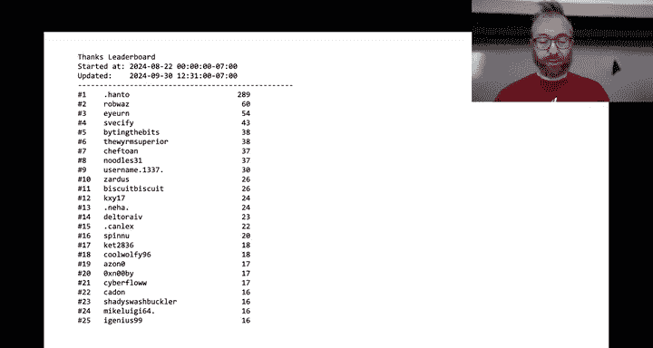
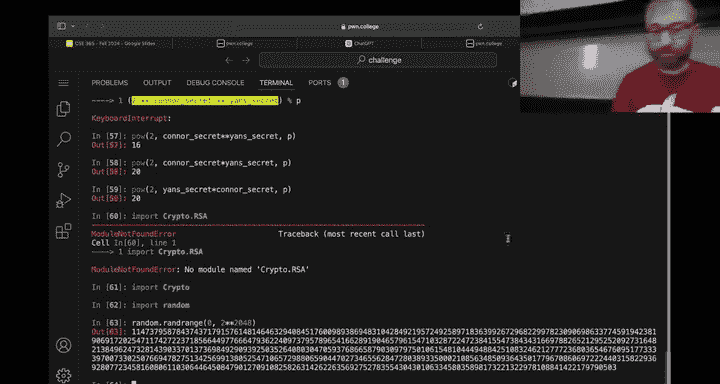
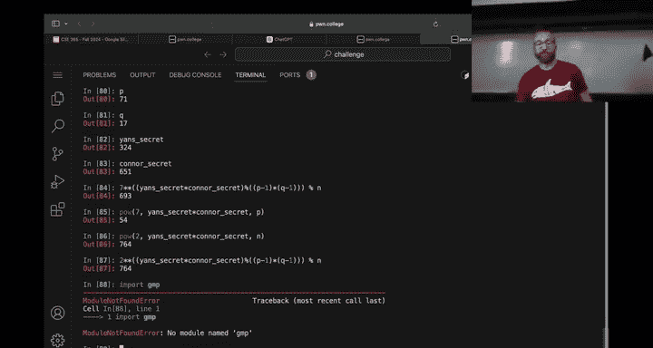

# ASU《网络安全导论｜ASU CSE365 Introduction to Cybersecurity Fall 2024》中英字幕deepseek翻译 - P11：-12-Cryptography - CSE365 - Yan & Connor - 2024.09.30.zh_en - GPT中英字幕课程资源 - BV1nVCVY9Ehy

All right， let's get started。诶。Do you see that lack of millennial fl straight probably we missed the hell。

 How do you know when to start talking Okay， we are live on Titch。嗯。Perfect， okay。We have。

When even seconds into the session。 Okay， so。What everyone think of which we don't have a there's one the screen's off God damn it。

 we've almost had a flawless lunch。Oh yeah， you haven't， I hope this doesn't destroy the stream。

I'll be will hopefully Mayor just let's see if Apple works this is going to be the ultimate test you the next week。

 but why did you start me in because there's no point in starting the other one switching three seconds into the stream。

 of course there is。AsomeOkay， awesome sweet。Because the point is for the YouTube thumbnail yes。

 how else are you going to thumbnail it someone thumbnail which is like the thumbnail officer all right。

 all right。Awesome， so we are now on the other end of intercepting communications。😊。

Congratulations， you made it well 88。7% of you made it。

 this is actually the highest pass rate so far， right no， not the highest Yeah， okay。

 other than the the first modules， the highest pass rate。

 last pass rate a of kind of a real security module。

 not a backup module or a not backup catch up or whatever refresher module。All right。

 let's dig in a little bit。 First of all，71 people are still not attempting any of the challenges。

 That's not a not it's not great。 It's like functionally dropped people， I guess will。Probably again。

 reach out to。actually administratively drop you just as a heads up please let us know if there's been something preventing you from doing any of the challenges and double check that in the course setup there are five green check marks I'll go through that in a sec because someone reached out yes and said when are things do so we're going really quickly see when things are due but on the other hand。

😡，When I went through， what did I go through。I went on a big rant about something。To class ago。

 better cap better Better cap is， is great。 But oh， I was talking about like the brought like。

The dangers of using the LLM to think， right， And someone said， yeah。

People that need this message the most probably aren't showing up to your lecture so anyways all right it's just the reality of modern education actually it's the reality of any education I think I showed up to probably 10% of my lectures in undergrad。

😡，m，Anyways。Except for。The security type course showed up to every single lecture。

 even if I had to fall asleep in the front row because it was in the morning all right。Sorry。

 I am not running on a lot of sleep， so this is going to be an extra yan sort of lecture and then if I pass out Connor will smoothly take over okay。

Oh， we're getting mailed and Ed cap shirt and coffee mug Nice see， this is great。 All right。

 what other things can we sell out for。😊，Okay， we wanted to dig into the numbers of intersing communication5 one deals started early。

 but but with the exception of level 14， people actually did quite well。

 so I mean it's it's we're not。Really expecting everyone to complete every level of every module right if our median student gets a 92% for the assignment。

 that's great it's things to get really complicated later on。It would be awesome if everyone。

 of course， had the。You know， experience of hijacking connections。

 but you know you you'll get it next time and you can of course continue to go back and solve it for half credit and we would encourage you if you have you know copious amounts of downtime this module to go back and look at things you missed because they will come back in the putting it together module。

 not these specific challenges， but it could be that challenges relying on these。

Well capabilities come back okay， u， anything else you want to say about how neuro communicationmun went was easy for people was this easy to security？

Okay， that makes sound let's not say it was so was it as fun as web security？好。It's better。 Okay。

 awesome。 Sos just like the grades。 Well， that's too。 But I think there's something really。

 really cool about doing this。😊，Mastery of the network。It's hard for us。

 I mentioned this when we launch the module。😡，Because of the environment we're operating in and constraints on security and scalability that we have to consider。

 it's actually very hard for us to do these network challenges in the same way which prevents us from exploring some additional concepts we want to do。

 maybe they'll make an appearance in putting it together or in future semesters。

 but I think there's room for maybe you know good 30 challenges here as well would people have liked to see 30 challenges in this module。

😡，released crypto well， yeah， crypto u crypto goes back past that。 all right。

 let's talk about paint somehow Hanto has continued their epic run I should have put the unfortunately。

Pushing to get cryppt already， there was no time for you where you should have put in the Hanto powering up meme。

31 challenges in in crypto means 31 good opportunities to help people and get extra credit for all of you out there please make sure to upvo people that are thanking you Huntto I think has agreed to donate their extra credit since they're not an ASU student to everybody else。

 but divided among a thousand0 people that's not that much so you know keep keep upvoing those who are helping。

And the big kind of surprise in the top five is that we have。I yearn and biting the bits， joining us。

 pushing out the warm superior and noodles。Pretty pretty epic competition let's also look at the top five for the actual completed module that you even forgetting to do that。

13 hacking last night it was like hundreds。All right。In oops。

Would you mind launching the crypto？In the class。With laptop with my laptop。Go go Yeah， okay。

 you're right it doesn matter。 All right， so let's see who's got now we we're part way into the class basically the top performers or the fastest solvers in 365 for the why not not goose here。

How is not Ba Blue here？Oh should up doing it。 You just decided to。All right， awesome。

nnav Goose is an old timer back back for round two the the top people。

 let's see if you got C Prakash K Senobnav Goose V Hiishcheti and who knows Good job Will。诶。

If you're here， come up， do you still have coins？All right， well come up eventually yeah。

 come up on Wednesday and we'll give you， we'll give you coins you stole my camera somehow， yeah。Oh。

 it's just nowhere。 No one has it。 No one has it。Therere these cameras to work better。That's。Okay。

 awesome， all right。So with that， me say goodbye to intercepting communications until the final module of the class。

Or maybe you'll see some concepts coming back if we get things enhanced and we move on to cryptography。

2。Wu here has watched all the cryptography lessons。Godd it。All right。😡，As a reminder。

I know this is actually a tall order。But well， I guess we also didn't launch it so that's on us the next module coming up is cryptography。

Right here， please well launch this right after class into the class dojo， please。😡。

Go watch the lectures。 The lectures cover。What cryptography is？

An introduction into symmetric and asymmetric encryption。

 and basically everything you need to know to tackle the challenges。 I think these challenges。

There are 30 challenges， 31 challenges。For crypto。These are。m unique in。

A slightly different way than inter cyber communications was than web security was a lot of security relies on。

Different knowledge of。The technology that you're。Evaluating the security of right。

 So in Web security， you have to understand jascript。 You had to understand。HtM。

 you have to understand HtP， you have to understand a lot of Python， probably for some of you in。

Network intercept communications and network security。

 you have to understand networking right and a lot of you had to learn networking the equivalent for cryptography is going to be math。

So who here knows Matt？All right， we got four people that know math， Who knows Ed。All right。

 about two thirds of the class， how about multiplication？Actually， more than addition。

 that's great exponentiation。All right， we got got maybe have the class。 What about。

Moular arithmetic。Okay， a little bit， so。Again。😡，These lectures。Cover crypto itself in this lecture。

 I want to cover some of the underlying mathematical concepts。😡。

To reason about some of the crypto that you will see here。Let's dig in。U。We'll just launch a random。

Oh my God， not in communications。I was just there。Launch a， I'll just fast forward a little bit。

Launch something much later at just the AS module Okay， for this one。

 because a lot of this is new in addition to videos。

 we also have some pretty thorough descriptions for about two thirds of the module right。

 We have big descriptions for AES。Dipy Heman。And RSA。A lot of good stuff， read， watch the lectures。

Read the descriptions， please。Trying to learn from the paines of previous modules。But for now。

Let's get rolling。Oops， probably you didn't want to make clear of that。Okay。So， I wanted to。

Talk about math。And the first thing that I will。Say about math。Is that。是。

We are kind of putting you on the spot。To use。A lot of the math。

That you may have learned in discrete math， so who here is taking discrete math？

I'm pretty sure it should be everybody， okay？And。Depending on what actually was taught。

 do they cover fields？I think so yeah， to to remember that and put it into practice， all right。

 now I understand that it it it since more than， you know。

 a week has passed since then things might be， how do I full screen this？H， that's not good。

Things might be hard， that might be hard to do that didn't help at all。我条过。

Just getting rid of this guy， really， but is a street。はいはい、そ十円。Yeah。Okay。

 so if you're going to talk about the math of crypto。

 assumingum that you vaguely remember a lot of of discrete math， but not perfectly。Crypttoysts。

Rely on either math or dirty hacks。That happened to work， right in the ancient times of。

 I don't know。 before the 1960s， let's say， crypto systems。Were kind of like， hey。

 what if we start swapping random letters with random other letters and then the resulting text looks like crap and no one can read it and it turns out。

That this might work against， you know， your middle school teacher that catches you passing notes with your friends。

 but it doesn't work against a determined。Adversary that can collect a bunch of cryptographic messages and analyze them for patterns。

 right， So if you replace。The letter T with A， the letter H with F， and the letter E with Z。

And you encrypt the entire。I don't know what's a hip book。

No one reads same one I'm the reader if you， if you take a cool scifi like u。Fire upon the deep。

 Who heres red fire upon the deep。Allright， new assignment。

 everyone should go read Fire upon the deep， really cool scifi by Verner Vingji。

 who's actually a computer science teacher。 So imagine if I wrote a。 well。

 that would be probably pretty terrible。 But this guy is that actually good writer if you go and take that book and you encrypted it and you replace the with A F Z。

😊，And you replace all the other letters with， you know。Similar sort of mutations。

And you take that book and you see a three letter A F Z word that occurs all the time。 Well。

 you know， that's likely going to be the right， It's the most common three letter word in the English language。

😡，And now you know the mappings for TH and E。Likewise。

 if you see a four letter word occurring all the time。

 well you might get ideas on what that might be but。That was the old crypto。

 the new crypto is all about math。All right， so somewhere after the 60s。

 we started math harder and harder and harder in cryptography。And。We have。Basically， invented。

Maybe three or four main families of cryptoy that all of society relies on。And by all society。

 I mean， in a very real way， our society runs on the security of cryptographic algorithms。

Consider one of the things we'll cover。

In this module。Is shot the secure hashing algorithm。

Right shot 256 is fully and directly and solely responsible for the security of Bitcoin。

If shot 256 is。Turns out to be broken。Bitcoin is。Even more imaginary than it is right now。Basically。

 the entire Merkle tree concept and everything underpinning that breaks down。

If there is a break or collision found in Cha 256。And we're talking about a huge sector of the economy by certain measures that basically just relies on the security of this one function。

Right。And so this is really serious stuff in an extremely complex way。

And and and in a even more complex way than the previous two modules in intercepting communications。

 you realize that， hey networking is broken right there's no security built in。

 you can violate a bunch of security economy， you can intercept these communications。

 you can hijack that， you can change things， well guess what the world。

Kind of gave up on network security a long time ago。

 We assume that what you're doing on the network is intererceptible， modifiable and un sniffable。

And we make do with that， using cryptography。The reason we moved away from HTTP port 80 being the default way to interact with everything。

 back in my day， we sent our Facebook password over port 80 to authenticate to Facebook when we connect it up。

😡，I guess people don't really send anything to Facebook anymore， but anyways。At some point。

The entire web switched over to HPS。Where we are now。Exchanging encrypted data。

 generally encrypted by something like AES。Using authentication and and and et cetera。

 provided by Tls， all of which you attack and this powers。

This is what enables the security of modern communications over the web。😡，If you find。

 so intercepting communication kind of has security issues， the world's accepted them。

 moves to crypto to protect that， right？Web security， Well。

 these were flaws that you're exploring in individual applications， right if。😡。

Facebook or myspace back in the day， and I bring this up because it was one of the first kind of examples of a runaway crossey scripting vulnerability that had huge impact。

 these things have flaws， well they fix the flaw and they move on these are individual applications。

😡，That can fix bugs if there's a flaw。In AES。Or like I said， shot 256， you can't just fix。

Shot 256 shott 26 is an algorithm that has a million different invitations。

By a bunch of different people， some of the implementations are。Very stateful in that。

 even if you fixed shot 286 to fix against a。Hash television that could sink all of bit。 Well。

 you still have the entire。诶诶。My mind just went't blink the entire。CorpousBlockcha。

 the entire Bitcoin blockchain that uses。The potentially old vulnerable shot in86。

U all throughout until the beginning of blockchain， right， you can't just。

push a patch and change that algorithmically and so in some sense。

 what we're exploring here with crypto is much， much， much。

 much more fundamental and potentially ruinous。If you find bugs in underlying algorithms and what is even more terrifying。

Is we have。Very few security proofs。About these algorithms。We have proofs。

Where you assume that AE itself， the core algorithm of AE is。

Cryptographically secure from an information theoretical perspective where without having the encryption key。

 you can't decrypt an encrypted message。We have to assume that and building on that assumption。

 we can prove the security of other crypto systemss。

 but no one has created an actual information theoretical proof of the security of AES。

 the one thing that we have proven the security of is a one time pad。😡。

But as you will find out in the course of this。呃呃。Module， the one time pad。

Is not a real viable crypto system in the real world。So。

It's kind of scary in this module you're exploring。Casts built on this foundation of sand。

And even in the module here， you'll implement several very real world attacks against these systems。

😡，That are actually very hard to defend against and prevent that are still kind of a。

Attacks against the limitations of crypto， not necessarily。The crypto algorithms themselves。

But you can imagine the kind of brutal effect that an attack against the crypto algorithm itself would have。

Okay。Let's。Catch up on switchitch real quick。哦哦。They're skipping scream as we might have bandwidth problems today。

And。Wow， Fire upon the deep is free on Kindle unlimitedlim and there's an audiobook free on YouTube super。

 super awesome scifi for real， we should have sci-fi reviews I don't know。

 well we probably waste enough time as it is all right， awesome。Okay， so。Cryptpto algorithms。

 the top algorithms that we'll cover in this module。That are used again， all over the real world。

Is ASS？Diffy Heman。RSA。Swa。And then it's use and implementation in TlS。Right， and。Reheel again。

 for the most part。Cover them from the same perspective as as the people that prove these things cover them from。

 say， okay， let's assume ASS is secure， we're not going to actually dig into what makes AES tick in this class and then。

😡，We go and implement a bunch of crypto systemsems with AS and see how the implementation flaws。

Caususe these systems to be broken。Al right， how are they actually implemented。

 I'm going to very briefly talk about this at a high level for， for AE。 AE is basically a bunch of。

Cursed match matrix math。That。Results in。Taking a key and a block of data。呢边。Some 16 byte chunk。

The block of data being a 16 byte chunk。And at least the key being 16 bytes and the AS we're using and then。

Doing a bunch of。Permuts， bla，h， bla， blah on the。Block of data to come up with an encrypted。

Block of data right and again kind of goes deeper into this in the lectures， but at a high level。

 AS takes a key and a plain text and produces a cipher text。😡，And without having the key。

 you can't go back。From the。U cipher text to the plain text if you flip one bit。In a plain text。

 if you encrypt yawn with a capital Y and yawn with a lowercase Y。

 the Cyphertext will be completely indistinguishable from each other。

 It's a property called Cyphertext indistinguishability。

 So if I have a server on the internet where you can encrypt stuff。😡，At will， chosen stuff。

And I give you the encrypted version。It doesn't get you any closer to either having the key or being able to decrypt other encrypted version。

 other encrypted data without boot forcing it fully。 and of course， with 16 bytes。

 you're not going to。😡，Brte force 2 to the 128。Characers in the block to recover that encrypted value without other implementation errors that you'll explore in this module。

So I he us， takes a key。And that key is used for encrypting sync key is used for decrypting if I want to exchange data with you over a yes after class。

 we need to agree on a 16 byte key， I write it down a piece of paper， write down a newspaper myself。

😡，I give you one of these papers I have the other one。

 and we can encrypt and decrypt symmetrically right we have the same amount of power。😡。

Being having that key， we can both equi， we can both encrypt。Diffy Heman。Is a way to。

Agree on an A key without you having to come to class because people don't like doing that。

 We're down to maybe， I don't know。40 people in class out of and I don't know hum me on stream。

63 viewers on stream， so like。Most of the class watches this， of course。

 diligently after it's posted on YouTube。And so that makes it hard to come up and actually。

Exchange keys。 Diy Heman allows you to exchange keys。Over a network safely。

 even if your network is being monitored and as you saw in network communications。

 you should just assume that your network is being monitored。😡，Right。

Who here thinks their home network is not monitored？😡，Nobody。 al right。 so people are are thoroughly。

Thoroughly terrified， but you should assume that， you know， the the the data you send on a network。

 maybe not your home network， although if you're running enough you know， smart devices。

 maybe that too， but you should assume that data on a network is。

As you send it over the wire is probably being listened to by somebody。

 it's a good good assumption to have I actually， my advisor for grad school。

 I don't know if he still does this， but he used to there are there's a really cool tool called DNF。

 we can spend another 50 minutes of me failing to use it if you're interested。

 but DNF monitors the network and just looks for interesting things like hey。

 here's a username and password that just came across or here's an image that came across。

 I'll save it。My advisor used to always run DnF on himself at all times so that。

If there was some credentials leaked in the clear， he would notice it。For in himself。

 not not against other people in his own traffic。Because， you know。

 it's better to know right away so you can change passwords。 All right， anyways。

 should assume that network traffic is being monitored。

 Diffie Heman allows you to even under that assumption。Perform a really cool cryptographic algorithm。

To come up with a shared random number that you can then use as an AES key。

Super cool and you'll implement that from scratch。And learn very deeply about it in the lecture。

That A S， plus Dffy Heman。Will allow you。Already to build a real crypto system。 Basically。

 you could have a。Web application。😡，That's someone or whatever， an internet application。

 online app that someone connects to。It uses Debbie Heman to generate a key with， to change a key。

And。Then encrypts traffic over as。If you implement it yourself， the likego scenarios。

 you'll make some mistakes somewhere。And itll be the grid will be broken。

That's kind of one of the lessons I want you to take away is like。Leaking one bit of data。

 for example， in these patting oracle attacks levels。Basically means that the crypto system。

Can be completely broken， it turns out that leaking just one bit of information kind of analogous to when you were doing the blind SQL attacks in SQL 45 SQL I5。

That one bit of data compromises the entire integrity of the system and actually allows an attacker to decrypt and encrypt data。

Arbitrarily without having the key at all。 Prety crazy。

 So it's very easy to break to mess up crypto in a way that it is completely broken。

It's actually very hard to mess up crypto in a way that is completely broken。

 but only just in the way that you need students to solve it。 But that's a separate thing。

 And we can maybe。Have a class about building long college modules when when you want to talk about it。

 but。U， one of the the takeaways that I hope you get from this is it's better to leave the crypto mutation itself to people that know what they're doing。

And then use it right in this course， there's an introduction to cybersecurity course。

You're not going to come out the other end knowing how to build an infallible crypto system。

You'll be able to test the crypto system for some weaknesses， but generally speaking。

 rolling your own crypto is a bad idea。All right。So that's dipppy Heman。Plus， AES。After that。

 we'll move into RSA。RA。Is a asymmetric crypto system。Where。With with AS。

 we agree on a shared secret and you can use it to encrypt and decrypt its symmetric the same key with RSA。

I have。Kind of two keys。I have my public key that I hand to you all。

 and you can use it to encrypt data that only I can decrypt。😡，And I have my private key。

That allows me to。Incrib data。To decrypt data， you encryptpt and to encrypt data that you all can decrypt with my public key。

 asymmetric， right？😡，For the public key， it's many to one encryption with a private key it's one to many encryption and there are use cases for one to many encryption it sounds kind of silly。

 why don't I just give you the message in plain text without encrypting it。

 but if I encrypt my message and give it to you then and I do it properly which you know we don't do it properly in these levels and you can break things but if I do it properly。

 you can be fairly sure that I made the message。So， if I post a。Send out a mass email saying， hey。

 good news。 The deadlines extended。And I sign it cryptographically by encrypting it in a way that only I can encrypt。

 but you all can still decrypt。 You know that I am。

Telling you that the deadlines extended and not that it's some mischievous student that just wants the server load to go down。

Right。Okay。That's R， and then building up all of that。We start covering。

A couple of other things questions on this before we dig into the math。All right， let's。Twitch。

 a cool。All right， digging into the math。Talked briefly about AES。

 it's a bunch of curse matrix stuff I won't actually dig into the math of AES because。😡。

This is probably math that you haven't seen。We don't teach it and yeah， it's。

 but if we'll talk about the man and in fact， these challenges don't require you to dig into the math of AS。

 one thing that if you're really interested in crypto。

There's a platform crypto hack that does go into the math more of AS。

 there's a link from the description if you're really interested， you have some spare time。

 highly recommend digging into that， this is more AS applications， the RSA levels。😡。

Dig into the math a little bit more， and so I want to cover the math of RA and maybe the math of Diffy Heman。

😡，Both of which are based on a similar ish concept of finite fields， okay？😡，Let's dig into ipyython。

Yeah。Let's。Is this soon then enough。Yes， very good。系。😡，So。We have a。

I highly recommend getting very familiar with I Python for this module。

 so previous modules you got familiar with Python itself。

 you've gotten whoier has gotten familiar with P tools。😡，Through the course of the class yet。

 no that's another tool that I really recommend for。

 especially some of these challenge we have to interact with them a lot， but you'll figure it out。

Okay， modular。Arithmetic in a finite field。Both David Hemon and RSA。Operate in a world。

Where numbers just don't just keep going up right， So what's the highest number you can think of in real life？

😡，Whats the highest number you can think of Connor trillion a trillion right， But then I can say aha。

 well， Connor， I can think of a higher number。 it's a trillion and one。

 Can you beat it trillion Yes Connor said trillion and two， that's pretty good。

 but I can go higher trillion and three。Right， but。In Diffy Helman and RA， people like whoa whoa。

 whoa， that's， that's absurd。 These， you know， elementary grade school playground tactics， no good。

 We're gonna say the biggest number。Is。And this is an example。 The biggest number is。I don't know。31。

Is that prime feels prime feels primy。 All right， you typically want this in P Heman。

 You want one prime to say this is the biggest number， right， So say， okay， our biggest number。

It's 31。Boom， I say 31， I win， in fact， I can't even say 31 because it's kind of like saying。

 you know， the biggest number that there what you're really saying is there are 31 numbers。From zero。

2，30。Not by saying p equals 31， but by saying we are operating in a finite field defined by module under the mod 31 right so from zero to 30 our numbers。

 so all our math，😡，Is modular what does modular mean or under a modular mean。

 it means that anything we do， if we go over 30， we're just wrap back around like like in an old video game or something。

 right so。😡，I say one is our number modo P。No problem， one。Okay。

 Conor was the largest number you can think of。4747， that's too big。 Let's start with like 15。

 Connor says 15。 Okay， no problem， I say， well， hey， Connor， I can think of a way larger number。

 I'm gonna say I don't know， 27。 Okay， Connor， what's the large number you can think of like 29 Yeah。

29。Connor thought that's pretty good。I'm going think I'm going say， okay， well， hey。

30 is a big number， all right，30 is the largest number， your turn，31， 31， Soconors trying to win 31。

 no。31 doesn't exist。31。Is。Off limits。There is no 31。

It's like saying what's the biggest digit you can think of well10s not a digit right you go to nine。

 you add one， you're just looking at that last digit， guess what you're back at zero。Right。

But the really cool thing is we can still do math。Right。

 I guess it could be a terrifying thing depending on your viewpoint， but I can still say， okay， hey。

 what's 17 plus 52。And can still get an answer。Right， it's seven。

And the really cool thing is I can loop back around。 So if I say， hey， what is7 minus。52。

And what happened， okay， it's 17。So plus and minus their relationship still holds。

 why did this thing stop tracking me？I like the camera to follow me around。 Okay。

 there we go what happens do 17 plus 2 All right， that's a great idea。 So what if I do 17 plus 52。是。

Okay without the mod world， we're at 69。And then you do 69 and mod P。Rebe at7。And so。

The moddlo can kind of be applied。At any point。Within a reason， we'll talk about it in a second。

But at any point。Be can just say， hey。Let's teleport into our modular world。

Doing the opposite is hard。right surpriseice say。I don't know what is Europe or actually。

 that's not if I say。17， time 17， time 17， time 17， modular B。 I get 7。

But they are probably something else。Co more time 17s eventually。I'm bound to get seven again。Yeah。

Okay， well， this is a silly thing it was just。-20 is7 boom， okay。嗯。

How do you tell the difference having just the output of this of seven between？This case。

And this case， oh， you can't。You are truly restricted to 30 unique。31 unique numbers， zero to 30。

The knowledge of what came before them is kind of lost， but it's okay。

 This crypto system still works as long as you only want or the the finite field is still useful as long as you only want to reason about 30 things。

 I mean， how many numbers can you really keep track of anyways， right？So。That's cool stuff。

 We can do mathematical operations under a modo。 and now we can come up with some sort of a simple crypto system。

 Well， let's say our。😊，Modullo。Was a。Not a prime we'll talk about primes in a second our module was 26。

And。I gave you a。Me and Yuka agreed on a key， let's say 13。Right。And when we encrypted things。

We basically would if we wanted to encrypt text， so let's say。Of course。

 if you only reason about 26 different numbers from 0 to 25。

 you say every number is going to correspond to a letter of the English alphabet。So。Ex ABC D， E F，G。

 H， I JLM and OP or S TUV。X Y and Z。 now we know our ABCs， let's just make sure I didn't type it。

Oops。There's some network latency。ok。😊，And we're gonna to say。To encrypt a letter。Letter C。

We're going to return alphabet。We get the index of the letter C in the alphabet， and we add the key。

This encrypts a letter C with the key。Okay， so now I can add letter A。And the key of， let's say 13。

 whatever。Booom， cool and deck letter。Yeah。The opposite。

Okay and actually I forgot a very important thing because if I in letter Z here。

 it's going to give me an index error， what I wanted to demonstrate is the whole point of the modulo because it just allows us to easily loop around。

Can。And I guess we should take the mod as well。ok。😊，And then if we。Get enough response。

 it's going on here， okay。For deck ladder， we do the same thing。I still got everyone following along。

企。Now we can then Z with K。And P。Okay， here goes our M。Z translates to M， and then we can decrypt it。

With the same key。呃。Whatever I forgot to pass B And we get Zva。 Asome。

 So using the power of modularrithmetic， we managed to。

Implement the crypto system that I talked about earlier where the it just gets translated into three other letters。

 but you can still trivially break it by actually reading the。

Looking at what the most common three letter word is and so forth， right？

But the cool thing is we can do other stuff。😡，Right， but in the case of Diiffy Heman。

We can get our prime back。Okay， and。Hi。Can come up with。A secret。Number， and I like， I don't know。

What's a nice number，15。be my secret。 No one knows this number。And what I can do。Is compute。Unexial。

Of this number。To a large power。Sorry， computer exponential of。

 let's say the number two to my number。Okay， it's a big number。Kind of big， right？I modulated with P。

And get one back。That's probably not good。That's not， that's not great。

That's going to break the crypto system。Yeah， we're not going to do one， we're going to do three。

Over we're now going to do 15， we'll do three， okay。That's going to be eight， of course。嗯。

Let's make slightly bigger numbers to drive a point across left 71， that feels prime， right？He's 71。

 my favorite number is going to be 25。And we're going to。Do two to the 25， which is a big number。

 bigger modular P。 so I have a secret。I raised two to that power。And then， I。Have a number of 45。

Which is。诶 my。I don't know。Public number。Okay， that's cool。So now I have。Number 45。On number 25。

 that's only I know and a 45 that everyone else knows。But if I just say， hey， my public number is 45。

You don't have before we， we did this thing where。You have all of these ways to several different ways to get number seven was the same thing you don't know。

What my original number was that I raised two to that power to get。45 Of course。

 if there's only 71 options， you can bru force it。But realistically。

 we're talking when we do this in practice， we have numbers that are。

Massively large outside of the real of root forcing。 All right， then we move on to Connor。

 we're going to do a dipy humm and key exchange under this。 So Connor， what's your favorite number。

4our。😡，Okay。So Connor's secret is four。And Connor public number is two to the four。Modullo。比。Okay。😊。

And that。Is 16。Okay， so now。Me and Connor。Exchange these public numbers。Right， so Connor。

Knows his secret， which is for and my public， which is 45。 And I know my secret， which is 25。

 and his。Public。Which is。16。And now let me show you。A magic trick。It take my。Connor's public number。

Which I know， and I raise it。To the exponent of my secret number， which only I know。Modullo P。

I get the number 20 and Connor。Takes my public number。And raise it to his secret number。Modlo P。

And he gets 20。And an attacker that just knows our two public numbers。Of course。Get some other shit。

So Connor and I just came up with the same secret number。Without exchanging。

We came over a shared secret without exchanging our personal secrets。Pretty bad ass。

 And it turns out that we're more or less because of this property that we can't。You know。

 map this back。In a normal world。Where we weren't operating under this modo。You could just take。

This number and take the base2 logarithm of it。So if we import math。

 you'll need to do some important math and in this module and we do two turn5， we trivially get。

25 back。But if we do。抹屁。You get some random stuff。Right because we're。

Loariththms in a module are under in a fine field defined by a modulus。Act extremely differently。

Then logarithms in normal integer space or real space。And， in fact， as embarrassing it as it is。

 the human race does not have a good， efficient algorithm。

That doesn't rely on quantum computing to compute。These discrete logarithms。Under a modulo。So。

An attacker。Can't recover my private number for my secret number。 Can't recover Conors。

Private number from his secret number。 but now。So， so， so this is secure at this point。

 but why the hell does it work， this is kind of crazy right， well。

 it works because Connor's public number。Is two to Connorors。Private。南。Drive pirate number。

Connor secret， yeah。And then Id raise that further to my secret。Right？Okay， there's 20。

What is going on？Oh shit， you're right， am I bad number Okay。

 that's a this is going to be a massive number And so Python is is working on now turns out that。

We actually have a very， very efficient way。To compute modular exponiation。

 so we can't do modular logarithms， but we can do or discrete logarithms。

 we can do discrete exponentiation using the how built in， we put the base， the exponent。😡。

And the exponent is also a power in itself。And。Well， that's going to get into a lot of complexity。

Let's just do this for now and hope for the best。And the modo and boom is wrong。Well。

 I don't want to get into the P minus1， you're going to have to get into Eers。just do the oh sorry。

 sorry， sorry， ya， ya， ya， of course， okay， who here remembers from middle school dad？

A to the B power to the C power reduces to a to the。B times C power， Do you remember this？Okay。

 we got one。 Anyone else remember it。All right， couple of you remember sweet。

 so if you're just going to go do that directly。Where did my ps go。Oh， here it is right okay。冇om。

Correct。ok。😊，So Connorors。Public number to my private number reduces to two。

To the Connor secret Time my secret， Mauud P。And then my private number。

 my public number to connor secret number reduces to。Two to the my secret times Connor secret。Boom。

 of course， a times B equals b times a also for middle school。Awesome， so。This is why。Under modo。

 we can compute a shared secret。Without being worried。That。

Our conversations out in the open will disclose。Too much information， right？Now， of course。

 all this depends on P being larger than like two digits， quite large。嗯。But we can do it， right。

 So in the homework， for example， the Pve you're using。Is 2048 Bs， which is 256 bys long。

It's a very large number you're not going to be able to just iterate through and guess our secrets unlike this kptosis yes let's see。

不是。Just have to find well， okay here。Here is。그。Lets grab a random number， not a random prime。

 that's fine。From zero to2 to the to 248， this is the number you're dealing with。没。

An example of the number you're dealing with。 You're just not going to be able to go and try every single one before the universe ceases to exist。

I。😡，嗯。And， you know。To give you an idea， there's optimizations you can do to compute these discrete logarithms faster than just brute force。

But realistically， they might get you a little bit below having to bru force  two to the 2048th entries。

 but not significantly below that。If I remember correctly， the biggest number。

The biggest number that didn't have like special。I'm trying to remember there's a Wikipedia article with records for discrete logarithms。

 Yeah， 700 something by 761， I think。

Like you can actually， yeah， hear discrete logarithm records。Heurned record as of 2022。

is a 1051 bit finite field。Pretty coolhu people compete Yeah， so this is like a sport。

 You can be the the the， I don't know。The Conor Nelson of discretereet loggers。嗯。Okay。

 so that's Stiffy Heman。Very neat。But one interesting thing that I kind of。诶。

Got worried about initially。Is。When we do do times， so。Just as a reminder。

 here's where we're at Jann secretcr Time Connor secret。Modullo P。20， all right。Yn secret。

Sence Connor' secret itself。Is 100。With the fuck， that's more than P， right？ So obviously。

 any numbers that are more than P yet。Shift it around and that's what happens up here and so if we say okay。

 that's okay， let's say we have yan secret thats Connor secret since you're operating under our modo。

 we should be able to do this here， right？100 Moular 71 is going to be 29 or something。

And that's fine because it's under the module， and we had answering we get something unexpected。

It doesn't。Line up。 It should line up。 Does everyone agree it should line up at first glance。

We're operating under the modo we had previously shown that you can operate outside the module a little bit。

 but or you can mod at any point， and that's all good。Right， it turns out that that is slightly。

More naive。Then reality， in reality。 and this just a weird way that math is。Modular operations。

Are all fine and good until you。Slide into the exponent。

Moular operations in an exponent work a little differently。😡，And honestly， to understand why this is。

 you really have to be Euler who is。Mathematician that is。

Pro probably that's definitely long dead from like the 1700s。

 but Euler explored this concept that hey， for some weird reason in the finite field。

 operations in the final field in the exponent。Under P actually takes place in a final field of。

Under the modular of p minus1。And we're back。Crazy。All right， so this seems like， okay， it's a minor。

Minor annoyance or whatever not annoyance， just a minor detail you have to keep track of。

But this is actually the Mamatic foundation。Of the RSA algorithm。😡，And also， actually。

 it's a good demonstration that P is prime because if P wasn't prime。Let's have something called n。

 which is a product of two primes， a P and a  Q， and I never define  Q，q will be 17。All right。

 so you have two primes。And now we have a new finite field。

Friendship ended with P N is my new best friend。And now。We're going to have。An operation under N。

Are we still And now we need bigger secrets， right？ So we're going to say。UFrom zero to。

And it will be my secret， so if you don't get to choose anymore。Connor's secret will be。Yeah。Okay。

 so my secret， I'll tell you because I trust you all， Connor's secret of this close form because he。

Didn't stop me， All right， bigger secrets。And。Is pretty big。

 obviously Yn secret times Connor secret is going to be bigger than expected now。

Let's say you're doing diiffy Hemanish stuff。And then then we do kind of yawn's secret times Connor's secret。

皮。54 will be our shared secret value right after we do all our little meing。

 like I raise mine to the two two to my power， he raises two to this power and every the exchanged and that's it reduces to this。

 right？Okay， let's double check over here。Where we have modular n。

 and then here we do modular n minus1， and we hit enter， and it's wrong again。😡，Why。😡，Well。

 Ouler kind of fucked us here。😡，啊。No， Ouler saves us， but。Our understanding。Is not fully correct。

 It's not。That operations in the modo。Just happened with n minus1。

It's that they happen under a module defined by something crazy called Euler's toion function。

 which basically says。You take n， you compute the factors of n。

You subtract one from every factor and you multiply that back。

And that is what operations in exponent operate under。 and again， this is a crazy math thing。

 but we know the factors of N。It's P and Q。 We take them。We subtract one from each one。

Moullo and we hit enter。And we messed something up what the oh， I then put it at times。

And it still doesn't match up what。That's P and what's cute。Is Janon Se and Connor secret， correct？

17 and 71 are both prime。Is it to a generator。啊。I mean， let's， let's try seven。Okay。

 so we have this guy。And we have this guy。How's this still 54。Oh。Sorry， I did P here。 And 7，64。And。😊。

Going back to two。764。哎。So。We can。RSA basically goes from one prime to two primes。

And using this knowledge。That's something very interesting。Diffy Heman。In a modulus， under a。Prime。😡。

Anyone can do operations the next one， and then that's how dipy Helmand works。

It assumes that when I give my number to Connor， my public one， it gives says to my me。

We can both do exponentation， and we can do that anyways。 I guess there's not really。

I guess it's an implicit assumption anyways。But if it was any more complex。

And I needed to do something。Weirdder in the modulus。And I needed that to be secret。

 that's where RSA excels。Our essay allows us。In a modular way。And now I'm trying to think of。

How to implement this。Do we have GMPY installed？Hello。The second don't have sorry。

Demo does not have internet。All right， well， we won't be able to demonstrate it now。

 but it'll demonstrate this by Wednesday。OhGo， I don't want to figure that out live in five minutes。

Dis ability for only the person that knows P and Q。

To do operations in the modulars and in the exponent。😡，Is what makes RSA tick RSA。Has。An encryption。

That raises to the power of E and a decryption that raises to the power of。1， divided by E。

You era the power of V。And then you raise that to the power one dividedr by E。This cancels out。

And you get your message back。But that one divided by ye。Can only occur。

Can only be done by some one that knows P and Q。Which is super cool。 All right。

 that's a very quick crash course into our say， we'll talk more about R say on Wednesday。

 but it's a flow from all the way from。😊，别人。Maybe let's say playground math。

To at least through Diiffffy Heman， okay。

Let's talk specifics class specifics and then you and I'll go there's 31 challenges。

 this means that the checkpoints like 9。2 something。

 nine challenges for the checkpoint puts you at these first four just like working with different data so now you're talking about hexadeimal basically 64 etc。

 everything that or the first five， everything that you'll need to like actually exchange data with this stuff。

😡，Then two more about this one time pad meme that we we。

 you know should understand because XOR is important， that gets us to seven， right。

 and then you get into just your very first baby's first crypto attack。My suggestion。To you， my。

 my very， very strong suggestion is to。Try to push here for the checkpoint。 if you can push here。

During your first week， you're in a really good spot to implement one more attack and then dig into a lot of cool stuff in the second half。

But。😡，If you get here， you get credit for the checkpoint or wherever the checkpoint actually is last time I counted it was here but。

Either way。滚。Questions， comments， my tablet shut off。 Oh there here go。 Al right， wait， we just。

Anyways， cool， all right， see you Wednesday， don't delay do the challenges today。Goodbye， hackers。

Right， how do we turn this up， there we go。