# ASU《网络安全导论｜ASU CSE365 Introduction to Cybersecurity Fall 2024》中英字幕deepseek翻译 - P12：-13-Cryptography - CSE365 - Yan - 2024.10.02.zh_en - GPT中英字幕课程资源 - BV1nVCVY9Ehy

Let's get rolling。 So were in the midst。 man， were once again not streaming the right hold on。

Come on， you got to start here。What do I mean。No wants it。Sorry， technical issues。Okay。

 we're going to like that is that's fine， butll it'll be okay for now， okay。So。

Last time we started out。Talking about crypto， we launched the crypto module and we dug in to Diffy Heman。

Did some Da Human work in I Python and started in on RSA。This class。

 we're going to keep pushing forward on RSA and then talk about AES chaining。😡。

Eerm cipher block mode operations。All right， any questions before we get started about dippppy Heman or the parts of R that we covered？

All right， who here's gotten to the R levels yet？Nobody who has's gotten to the AES levels yet。

All right， who has gotten through the AS levels。Not yet， okay， hopefully by the end of the day。

 you'll have everything you need to push through， but I guess it depends also on how many。

Crazy tangents we go off on two let's。We are started， we got the desktop up。Everything is great。

Maximize this not。这对。We really can't maximize this one or we can maximize guy wait wait what you can't。

It's points point Susan。Now it's there so you can click it， top right。

Oh this guy this guy about this guy？There just should be a full screen mode it doesn't matter Okay。

 okay so so。We're back in 94。Which says there's an echo one second。T， oh yeah， yeah。

 there is an echo。All right。This should be better。Let's。Wow， a lot of people complain about that go。

 okay， it's gone perfect， all right， soum。As a quick。Ramp up through the last class to this class。

 we had M， M was our message。Maybe you wanted to encrypt with RSA。

We had N was a mod under which we were operating and N was the product of two primes P and Q。

And BNQ were just a bunch of large primes， but we're going to back up a little bit and recall with Dibby Heman。

We had just one prime that we were operating under the modo of。And that prime was P all。

 and if you recall with David Heman， we had P equals some prime， say 71。

And me and Connor each came up with numbers， my number， I don't know， 15， Connor's numbers 25。

 we exchanged with each other to two our number。Moullo。P。To to Connor's number。Modlo D。And then。

We raised that。So Connor would receive this， not knowing what Low case Y was。

And he would raise it to his number。Moullope。And I would do the same receiving Connors。Number。

Not knowing what the original number was， just knowing what is public。

Number was module P AndV arrive at the same shared secret。 That's Davy Heman， in 10 seconds。

now all of this works。Because it's very hard to do a thing called discrete logarithms to recover from two to the conner number back to conner number。

 normally I would be able to take the log two of two to the con number。Right。

 so if I did just normally two to the Con number without。唉妈逼。And then I did this。And I did math。

 at lock two。I could recover Connor's number。But I can't do that。

Because they're operating on your modo and in conceptually speaking。

 we keep looping over at 71 right so this 35 33 million or whatever this is。

 it's really just like through a bunch of times around。😡，Our 71 numbers and it's。

Hard to understand where we started。We don't have a good。嗯。Algorithm to do that as as， you know。

 computer scientists and so we just can't really carry this out without a。😡，Quantum computer。School。

 you know， we have algorithms that we're on a quantum computer。 We just don't have。

Publicly known quantum computers that are good enough to run these algorithms so they actually make a difference at the size of data that you're typically operating under。

Awesome， that's Diy Heman， and then we said， hey。What if we didn't just want to come up with some random number。

 like Connor and I came out with a shared random number。 What if you wanted to come up with。A。

What if we wanted to pass messages back and forth we wanted to control the contents of this Well D Hus no good because all that we have control over。

Me as ya， the information secret to me is just this low case why。Right。

 I don't know Connor's lowercase C， so I don't really know or yeah， lowercase C。

 so it's hard for me to。Figure out。Privately， I guess now I'm trying to think of the crypto system as I'm saying this。

 but basically this isn't a data exchange crypto system， it's a signal， like a key exchange。

 a key generation crypto system， okay。If we wanted to exchange data， we need a scenario where。I诶。

The correct solution， by the way， to exchange data is what you do in the challenges。

 which is you use。Dbby Heman to create a。Key to exchange a key that is used by AES to secure the rest of the communication。

Right， but。If you wanted to maintain this certain other properties where。

 let's say without having to come up with a key exchange interactively。

 I wanted Connor to be able to send me encrypted information， I wanted decrypted。

Right for this asymmetric cryptography。你 need。Something else and that's something else is RSA and we're going to dive through RSA yesterday we kind of hit RSA it was like 240 or something and and we have to speed through。

😡，We're going take a little bit of time right now and go through it calmly， all right。

So you recall the discrete lock problem is pretty tricky。

Kind of one tricky problem that happens on neuromodulus。

 the other tricky problem is factoring and we'll get to why that's relevant for RSA。

 but RSA is basically this。In the modulus or index an exponent。

UOh I'm trying to this would be much better after the lot at the tail end of the last class we could just maybe。

Put the two classes together when we upload this。And。When you're operating under a modulus。Right。

 you can， we went through why， you know， you could take， I don't know。If if I are。

Modulus our field operating under our modulus of 71 or defined or modulus 71， we can multiply。

 you know， two numbers。And take a modulus of these boom。21。

 you can multiply them and do whatever operations on them and then take the modulus and that works out great as well。

But then we mentioned， oh， there's this one kind of special case。Right， if you wanted to say， okay。

 we got10 plus。27 times 35， mod pe。And then we did 27 times 35。And we did。That's mightty。Cool。

 and so then we did 10 plus 22 mod P。 I mean， it doesn't even need to be monitored， but yes。

 the same 32。Going step by step and first modding out。

Calculating the result under the modulus of all the individual components and then putting it together as it is first calculating out the large number without the modulus and then taking the modulus。

😡，Right。But there's one place where that's not the case and that's exponentiation。 So if you do this。

27。Times 35。 So this is 10 to the 27 times 35 power。Modp。You end up with one。

 let's do a different example， 11。Okay， we end up with 70。Very cool。If we do again。

 27 times 35 mod P is 22。So if we do 11 to the 22nd power， mod P。We get something different。

Why do we get something different because of a interesting？

Tricky part of basically finite field math。Where exponentiation。Happens。

Expeniation and a finite field under modular P happens。Under a different modulo， right。

 So if normally we're under mod P。😡，In this case， the stuff that's in here that's in the exponent。

Happens under。What's called the Toceient？Of P and the toient。For a prime is just defined as p minus1。

 All right， so then if you want to compute this， this same thing。😡，Here we got 70。

 we take 27 times 35。And we moded。By P minus-1。That's 35 now， 22， not 32， as if you were mo by Pete。

And then， we do。T to the。35。There's our 70 back。All right， and the world makes sense again。So。

When we are working in a finite field。We can typically。Split up our different operations。

 modularize them early， modularize them late， it's not a huge deal unless we're working with an exponent。

In indeedham， we don't work with exponents， we're just multiplying and life is nice and easy and we don't even have to think about Ouler's toion function in our worst nightmares。

But in RSA， we do right because RSA works on this exp and they'll dig into why this exp maybe basically makes RSA work so outside of an next exp exponentialonent might be variantientient to B which is p minus1 inside of an exponent。

Sorry， outside that exponent， you're just mo pe inside that exponent if you're mo toion to pe。

That's when P is prime， so let's design a crypto system， let's look at R say。😡，With a prime P。哎。RA。

Is based around this， this concept of。Exentiating a message to encrypt it。

 So my public key is gonna be a large。 we'll start with a large P。 So this is single prime RA。

 This doesn't exist。 We're using this for teaching purposes。 So our P again is 71。

 and we're gonna to say， hey， we're going encrypt。Going to take an encryption key I know let's make it through you。

Right， so now you have 71 and three are our public key， but I'm telling everyone is， hey。

 if you want to encrypt the message and send it to me。These are the numbers that you need to do it。😡。

When you send me a message， if you want to send me the number five。Let's， let's do something bigger。

 I don't know， Let's do 11 again。You would raise it to the E power。You'dmid by tea。

And you'd shoot it over。All right， that's 53。Is the encrypted message。And I。Would compute。

What is known as the multiplicative inverse of E？A D。Such that。D times E equals1。

So then if I do M to the E to the D。抹点。😡，This would equal again， little school。Arithmetic here。

 E times D。Motpe， which would equal。M to the one power mod Pete， which would equal M。万 be。

Deecryption E is the encryptrypting key， D is the decrypting key。😡，And because I only know D。

 then all you can do is encrypt to me because if you share the public key， that's fine， it's public。

 whether you shared an AES。😡，Public key or there's no public key。 He sharing an AS key。Then。

YouAnyone could decrypt。The data or someone hacked you un leaked they Yes key。

 they could decrypt the data that you are sending to me encrypt encryptpton。

 whereas with this with just E， they can't。 They need this D。 Now， what is D in this context。

 We don't even have it， as you can tell， is not defined if we need to come up with it。😡。

D is a number。Where E times D mod P。Is one。Now with 71 numbers。Defined by P， right。

 we can just start guessing so we can say， okay， well， hey。

 what is we can we can very quickly brute force this for D N。Range P。

 so every number from0 to p minus1。If D times。二。Mp。Is one break right？

Sn now we've loop over a bunch of numbers found。A number D is 24 d times E。My P is one。Cool。

All right。Of course， another way to to find it if B is just a symbol prime， right。

 so you do basically p plus one。Will this work？Divided by E， yeah， 24， cool， okay。

So we brutefor the number， the multiplicative inverse。In the modo。Under the module P of E。And so now。

We should be able to do this。Right， if M。Is 11 m to the E。My p。Is 53 and E to the D。

And to the each of the D might B is。Not 11， why。Why didn't we decrypt correctly？是。Exactly。

 I spent all this time talking aboutolion and actually I messed up。

 I realized that a couple commands ago。That I was computing the multiplicative inverse under P and not under the toceient of P。

 what I need。😡，Is the multiplicative universeverse under the To P。

 If we change this to encryption as M times E。Instead of to the E power mod P and decryption is multiplying it back out by D。

 then this works。This gets us back to 11。But that exponiation， it doesn't work。

So now we need to redo our。D search here。And what we actually want。Is a multi kind of inverse。

To find the multiplicative universeverse of E under the toch of p， which is for prime numbers。

 p minus1。Awesome， okay， now。We try this again， so M to the E， old news it's 53。

Empty the E to the D back to 11， imagine。Right mathematical magic now let's say you wanted to encrypt like the number five mean you if you're trying to tell me。

 you know， what day your birthdays on or something， you can encrypt the number and send it along。But。

😡，Realistically， you want to send。Like data right， how do you send data， Well， you send data。

By taking the ASCI values。And just converting data into one big number。😡，So for example。

 that's one way you can send data。 So if we have I don't know， come to my birthday party。

This is our data to byte string here， every one of these bytes。诶。

We can actually convert this to a list of numbers。Right of the ASI values of these letters。

 and then you just kind of combine them。And actually。

 there's a helper function here to we need to assign this first two thing。

So M text is this and M is M text that is it two int。Andt that from bites。Yes。So we。Well， okay。

 then we get to do that。 Okay， come to my birthday。Party。Okay， and then。We have to。Pass in。

 what is the order？Like。😡，When you lay this out into a number。Hypothetically speaking。

 are you going to do 99111，109101？Con is being or。Starting to then back one，2， one，1，1，6， one，1，4。

 and there's number of reasons for one over the other， ceter， ceter， ceter。

 we'll get to in maybe in a module and a half。But real is but you know。

 you just pick one and it's called little Indian。Lay it out in this direction。

So this the why of party first or big Indianan。Coming from the sea of come to my birthday party first。

 Alright， and this gives us a number。 Now， this number is very large。It's larger than our 71。

Modulus and so it's not going to be good it's not going to be good as not very specific。

 but we won't be able to actually express it。In a。In numbers from 0 to 71 or from 0 to 70。

 no matter how heavily being encrypt this thing。 But， of course， if our P was much bigger。嗯。

Do you remember。Crypto。 R。Inport crypto， let's grab a key generator from here。Yeah。Okay。

 import crypto that。All right， this is。

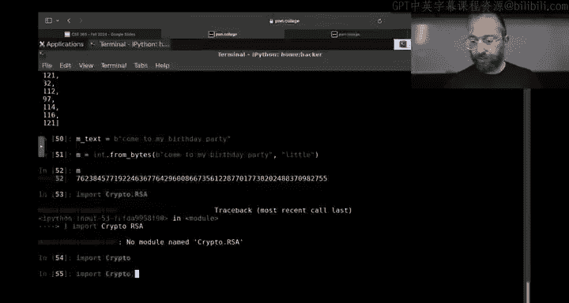

嗯。Pie crypto dome areage and rich。

That public key。 Yeah， yep， okay。

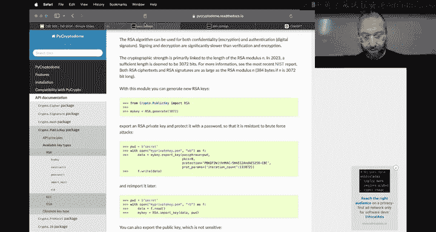

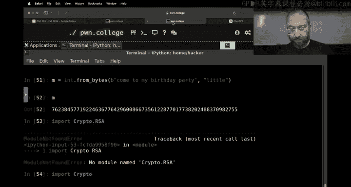

So。At public。P dot R say。Do you see what's happening？Next is happening。m okay。

We're going to see how big。Our message is。Our message is。About 100， almost 199 bytes bits long。

 So we need， let's say a 256 bit prime。 I'm just gonna Google for one。 This is a terrible idea。

 Don't Google for your primes。

But we're just going to grab a prime off the internet。

Booom， okay， someone has very nicely given us。Let's grab a 256 bit prime。hy。

Why does the number look like this？Oh，1010 least case for which this is not what we want。

 that's not a prime。

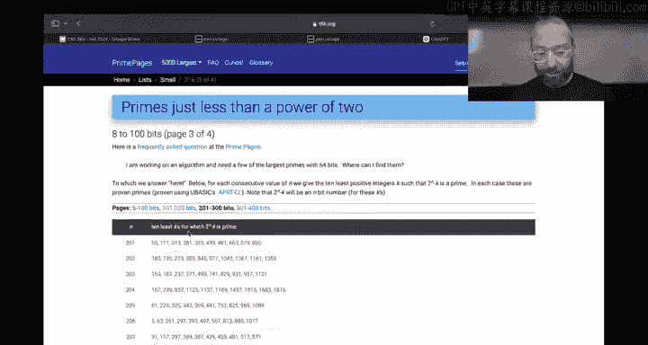

Oh， my god。

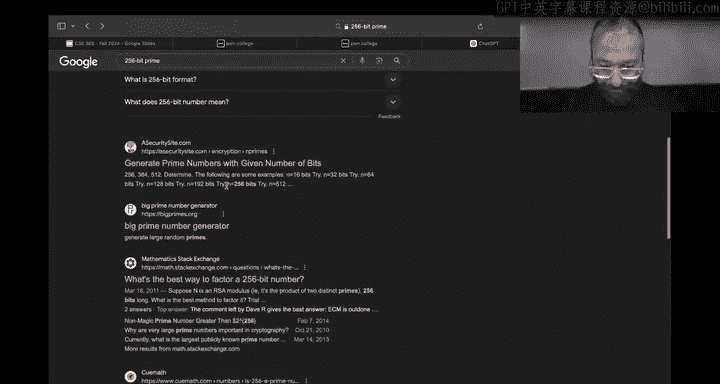

Here we go。Yes， give me primes number of bits。 Don't do this for your primes。

Perfect， okay， nope， here we go。 This is one of our primes。 we're gonna take this prime， copy it。

Generate primes in the safety and comfort of your own home。You're going to paste it in here。Okay。

 and we're going to paste it here， so our newie is this monstrosity。

Our M is the encoded number as a reminder， it was this。Our E remains three。So M to the E。Mot P。

 theres gonna be probably very Oh， no it was faster calculate。 this is our encrypted。Our cipher text。

And then if we raise cipher text， or we need to compute RD now if we do our old four loop again。

 this will never terminate because we are looping through 2562 to the 256 possible combinations of the inverse of P。

 so that's not very nice Now again， given that P is prime。😡，诶。Wait， what does keep us from？

Doing this。Nothing right， so if we do D equals， just don't want people to get into this habit。Oh。

 that doesn't work not for real numbers， for big numbers， I don't believe it you the models。

watchch watch what will happen。 Okay， so we compute that multiplicative inverse。

 which is E to the negative one So that then we if we do E times e to the negative one。

 that's e divided by e equals one。Modp。Oh， shit。But if B was composite， that wouldn't work。Yeah。

When you make attention about it。Well， yeah， I need a toion but。Okay， anyways。Mind blown， maybe。

Maybe this is a bit of a。It is for real， Python does this natively now。Back in my day。

You needed crazy libraries to do。 All right anyways， doesn't matter。

 So now you have the multiplicative inverse of P。😡，There'll be a quiz in a second。几。Oh。

 I didn't do D equals okay。D equals that。Boom， alright。 So again。

 we have our crypto Cypher text and C to the D。😊，妈屁。😡，Okay， don't do that do。

This does a very inefficient thing where it computes， takes C， raises it to the D。

 which is a massive number and they'll never finish。Oh， maybe it will。

 but just use the intelligent algorithms that that Connor mentioned earlier。

 just Python's power function， boom computed instantly， this should be our decrypted message。

So here's our decrypted message and what we want to do， we say MD message decrypted。

 and then we is it two bytes？Two bys。Let me say how many bytes and I don't know if it was 200 businesss。

 let's just 256 bytes， whatever， it'll be a bunch of zero，ops。

6 zeros padded and then it was little Indian， so started encoding it then， boom。

 and we get come to my birthday party。Or do we？We got a bunch of garbage even after we strip away all of the zeros to that that pad。

Um， because we stress that out to 256。Bys。What happened？Why did the decryption go haywire？

So I'm going to bring up all of the commands I ran。Here's where I encrypted。Okay， and to the E。

Then I realized oh， shit， I need to compute a D， I computed the inverse multiplicative inverse of E under mod P。

And then， I。Raised C to that power。Yes。这是这个东西。Yes。I again didn't use the Toshion。All right， so again。

 D is not the multiple givenverse of E。Mod P is's the inverse of E mod， the toient of P。

 which for a prime number is P -1。啊。It's a factor of when is it？Does this make sense？So P。Yeah。

Is be prime。It's possible that our our like since we copied this prime of internet。

 which you should never do under any situation， any scenario。

You can ask chat GT if it's prime no that's a terrible idea。

 of course factor Db is actually a cool idea， here's a cool website you put in numbers and it will try to factor them。

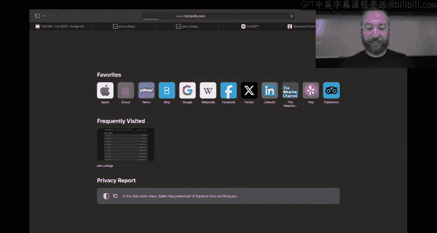

This is a prime number。What does PRP mean probably prime。

Wait， did they say probably or prorovvably， probably？What if it's not prime？

All right。Since we don't need a sense power can do the multipl derivative versus we are logging out of this i Python。

Oh， what's going on， okay？And we are hitting normal Python， where I have access to。Boom。

And then we're just going to generate a key。Okay。256 bit。Here's our key。No， come on， fine， fine。

 it doesn't matter， 10， 24 bit。We've left the the land of easily understandable numbers。 Okay。

 here's our。P that we're going to be using from now on。Now E remains 3， M is our encoded guy。

And now we need to compute D。😡，Booone， all right， so the previous thing was probably not prime and then。

😡，Still that， whatever， we're not going to draw。 Al right， we have an M to the E。😡，Mod P， again。

 let's not do it this way you'll get in the in the practice of going E to the M。My pe boom。

 that' arm。Enncrypted message。And to get。Now that we've computed the correct D。

 we get the decrypted message back。C to the D Mar P。And。There's the decrypted message。

 and then we do。UMd that two bys boom。That's unexpected。好。

Is it a problem if E shouldn't be upon the feast as small？是。He hopes， what did I do wrong？

Here's the history， all right。What did I do wrong？是。M to the E， not E to the M。Okay， here。Yeah。

 here is where I did went wrong， so we raise M to the E power modP。And then to decrypt it。

 we raise that to the deep power。 And then when we decrypted。Come to my birthday party， okay？Now。

We're in business。 We can encryptpt。 We can decrypt。And when we operate under the modo。😡。

In an exponent。We do so with the Toulsion function。Awesome。Now the public information is P and E。

I just hand that out to everybody， Connor has it， you all have it。

 you can all send me birthday party invites。And only I know。你。Because I could calculate it from。

The multiplicative inverse under the tosion function。😡，What's the problem here？Security issue。

What if。😡，You intercept the message， you know， P and E， because I gave it out to everybody。

So if you want to see going invite me to your birthday party without inviting the rest of class。

 no problem。Just encrypt your message with this and send it over。 And Connor grabs that message。

 The encrypted message。 Connor grabs C。What's the issue here？被告的证面。Yeah， so can Connor subtract one？

I think so he thinks so， and clearly Connor knows how to use the P function to invert E because he just did that。

 just told me to do it， whereas I was reaching for the old elegant tools of the past。

So he just graphs P， subtracts one， takes E， raise tonight negative one power might p minus1。

 and you're done， and he has D， and he decryptps the Mason he shows up at the party and both of us are there and it's really awkward。

Soup。What do we do。The toion function。Is。Very simple to compute。For a number。

 when it's a prime number。But and this is just how mathematics work。If it's not a prime number。

 if we are operating under a modulus， that is the product of several numbers。

And we use two in the RA case， so we have key that P that we had。😡，And we also have key dot Q。

 it's another very large number。And if we have P and we have Q， and we have n equals p times  Q。

 and we do everything under the modo n。Which is a product of two numbers。 Again。

 we have our M that is come from my birthday party。 We have our E。 Let's keep it at three。 real R。

 real our modern RSA uses a hackx 1，0001。 It doesn't。

For for extremely complex cryptographic attack reasons。 but three was perfectly fine for a while。

 then they made it seven。 then they now it's very big anyways， doesn't matter。

 And then we do boom M to the E mod N now。Right。Yeah。啊some。And now we need a D， So we do。

Compe the multiplicative inverse。Under the modular n minus1。And it doesn't work。

 and it might even work for certain ones。But it doesn't work here。

What should we actually be computing？For our D。Exactly， the toient of a composite number。Is。

Think of it like the exponent of a composite number， if I do five times two to the third power。That。

Simplifies or distributes into five to the third power times2 to the third power。In the same way。

 the toion of five times2。Is going to be the toion of five times the toion of two。

So the toient of what is fundamentally p times  Q。It's not P time S number minus-1， it is。

P time a minus1 times  Q minus1。So keep in mind when we did the encryption。We didn't need PMQ。

 we just needed at。But to do the decryption to calculate D， we need P and Q。

And then once we have that， we do a power of a C to the D mod N。And then oops。

 I overrode my message one sec。Let's get the message back。Our decded message is C to the Dimond N。

And then。We can get the bites back and boom， you're all coming to my birthday party again， okay。

In order to do that， the only place in this whole thing here。

Where we needed P and Q was to calculate the decryption key。Everything else。All you need is end。

 so I calculate P and Q， and I tell you all。The key add and the number E。

Of course it's time the number E is nice fixed。Commonly globally known numbers， so I really。

 I tell you N， but I include E just out of， you know， convenience for you。

And as of huge number is the product of two primes。Or some amount of primes。

 there's also such a thing as multi prime Ra for various reasons where n could be the product of I don't know five primes。

 there's various security issues with that， et ce cetera。

 but normally speaking PMq or two massive primes， I keep them secret。😡。

I don't actually even need P and Q， I just need D， right， like I just use P&q as to compute D。But。😡。

Either P And Q or just D alone are my private key。 and is the public key and E。😡。

And then you can send me messages and unless you know PMQ。

 you can't or someone else can't decryb those messages now。

What keeps you from just taking an and factoruring it， right， if endless 25。

What are the prime factors of N？Okay。Five and five， what if it is 15？Three and five。What if it was？1。

1，1，1，4，7，3，7，6，9，3，5，5，6，9，2，8，2， et cetera， et ceter， et cetera。 right， Obviously。

 you're not gonna be able to do it。 But hey， guess what， a computer won't be able to do it either。

 I mean， a quantum computer cant。But just like we discussed。

That last time that there is a world record in the discrete logarithm problem。 Did we discuss this。

 And it's like discrete logarithm under the mod 761 bit。

 There's also a factoring world records around the same。Maybe a little bigger。

 maybe a little smaller。 I honestly don't remember。 You can look it up on Wikipedia like you can。

Get into Wikipedia for beating this， but。Realistically。

 where ourss are at nowadays is more in the two thousands of bits or whatever and。

Without a breakthrough in mathematics or a breakthrough in physics to build。

Functional quantum computers that work at this scale。

 you're not going to be factoring these numbers out now。

 once we get quantum computers that work at this scale， R is cooked。Dbby Heman， gone。Right。

 so these are。When you hear the words post quantum crypto， these are not post quantum。These are very。

 very much pre quantumum crypto。But it's effective and it runs basically the internet today。

 R saying things like it， much of the internet。hi。😡，Anything else we want to？Say about RSA。

Possibly we just don't know Yeah， that's right， I just to be very clear。

 there is no proof that we can't factor this without quantum。

We just don't have an algorithm for it so， you know， if you're bored late at night。

Try to come up with an algorithm to factor this thing。

If if your algorithm has a loop where you remember by one and tries to divide and see if it clearlyly divides。

 that's not quite it， okay。Now some really cool stuff does happen This is a bit of a tangent。

 but you'll just do it real quick， you know， if you， for example。

 generate an RSA key and then your computer glitches。Or you're running in in a lower。

Like a really constrained computing environment and like。

I don't know it's like in space at a satellite and feel like a cosmic ray hits your memory and flips a bit。

 well guess what it's very likely that if you have a prime number and you flip a bit。

 your number might no longer be prime and then you might end up in a situation where。You know。

 you you're using。Maybe thiss more of a problem in dipppy Heman than an RSA。

 but suddenly you're using unsafe values。All right， Tent aborted， let's move on to A。

 Any question about our say before we move on。I think one other the things worth pointing out is that finding large primes is you can do that fast。

 Yeah， that's right。 So come with Yeah There are very cool algorithms that will come up with very large prime numbers。

 And it's not any prime numbers。 It turns out that there are certain primes。

 certain prime combinations that are unsafe with RA that have certain mathematical properties that extremely smart cryptographers have。

😊，figured out how to do shenanigans with， but realistically if you use。Again。

 to reiterate an earlier point。An earlier point from last lecture， don't roll your own crypto。

 use a library。😡，Python' Cpto dome library， it's going to generate。Fairly reasonable keys for you。

 And if it doesn't， well， you can blame them， at least you didn't mess up。All right， awesome。

What next， So that's R， that is asymmetric cryptography again。

 cryptography where you can send me messages， you can encrypt them。

 but for you it's a one way function because of that toion that you cannot compute。😡。

All right you can all encrypt it， you can send me message。

 I can decrypt them all the inverse is also true， by the way。

 I can take my message and I can raise it to the D and I can send it to you and you can use E which is the multiplicative inverse of D which you already have to decrypt it so I can also broadcast out messages。

😡，That everyone can dec correctpt， which sounds kind of silly， why would I do that， But then。

 you know， if I'm giving you messages that only I can sign and it's like， hey， the the， you know。

 you got to cancel your birthday party because I made the assignment due right on that day。You know。

 it's from me because I encrypted it with it。The value of D。Or P and Q that only I know。H。

 and this is also like how， you know。GPG signatures， for example， work on the internet。So。

You have your public private key I my public private key， you don't need to do these key exchanges。

 be just boom， I encrypt the key my message with a key I send it to you， you do the same why。

Wouldn't we。Basedase all of our encryption。Crypttoographic technologies on this model。是。啊。

It's because it's slow because you saw it， we have fast algorithms to do certain things。But。😡，hos。

But when you saw I accidentally did once the numbers got large， accidentally did this。

 and then it just kind of sad there for a while， working very hard like the optimized algorithms are much faster but。

They're still。On the slower side， the reason one of the reasons that E is so small。

Like it used to be very suppose used to be three or seven or whatever and then it。😡。

nowadays is still small compared to the rest of these numbers， hex10001 is 65，537。

That's still pretty small。 This is for performance， especially， you know， not on your desktop。

 but on like a super constrained process or running a satellite， all this fun stuff， right？

With symmetric crypto。Things are typically much， much faster， so AS， for example。

 is a lot faster than doing all of this stuff。And so typically what happens。When you。

Want to exchange a whole bunch of encrypted messages。

You use something like dippppy Helman or even RSA， basically to exchange the key。

 and then you switch to AES。Or something like it。So now let's talk about AES or something like it。

Yes， RSA is very approachable and De Helman is very approachable with kind of middle school math right like。

 you know it's multiplication， expentiation modo is the one complex thing。

Did you talk about what the module is last week or on Monday？Yeah， we did， right。

 talk about division and。Remaining。Who here is unclear on what the modulus is。My度 okay。Sweep。

 that anyone who here is clear on it。Better question。 All right， Also nobody。

 So we're all in kind of a quantum state。 a couple of people clear on it。

We have 10 and be divided it by three。There is all this 363。 Everyone with me so far。Awesome now。

3333 doesn't if you don't want to work with fractions for many， many reasons。So if if， if you were。

In middle school or， I guess， elementary school now you're going backwards and like you 10 over three。

 and they say， well， that is three and one third。Right， so three is。去。

The whole number division result and one is the remainder。Modulus is the remainder of the division。

And so when you are operating under the modulus 71。Every number gets divided by 71。

 and the remainder return。是。Okay， cool now。Have to reconceptualize， called earlier。Discusion in that。

 but for the next 25 minutes， we're in AES La。All right， A S。Unlike our essay， which is all about。

Division multi， et cetera， et cetera， et cetera， AES is a whole bunch of matrix paths。

Who here remembers addition and multiplicationation？Nice， almost have the class， all right。

How about major？All right， we got a couple of people about half as many。

Not going to dive in and make you remember and live all of your matrix X math。

 We're not going to go into。Implementation flaws within ASES。Maybe you' going to say， you know what？

A yes works。And realistically。All the information that we have right now。Is the ask words。

 It's possible that somewhere， some， someone somewhere in a secret room。

Has a magic wand that they just like。Tap against the computer and break AES， but。

We're just going to assume this isn't the case。 So for us， a yes。Okay。Is going to be。Just。

Something that takes a message and a key and it returns。Something， the something and returns。

How did that compile？嗯。It must be eyeyth and stuff。 Okay。

 it does something weird and returns the cipher textex and， and。

 and the weird stuff that it does has to do with， you know， a bunch of matrix stuff。

 and then you ship some rows and then you you make some columns and then you。

 you do some crazy stuff。 and that's。That's fine。A takes。128 bits of input， 16 bytes。😡，And。He。

 that depending on what flavor of aasse is either 16 or 32 bikes long。

And then it returns an encrypted block of data。That is 16 bytes long。

，And now I'm going to go and just launch an AS level so I can just crib off of the source code there。

😡。

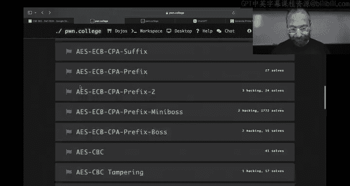

ok。😊，Boom， boom。是。Aes。Okay， here's AS。Create a key。We create an AES instance in P crypto doome。

 and then we encrypt stuff。Now， the caveat with AS yes is it takes 16 bys。No more， no less。RA took。

A number。That we encode our tax into。AS takes 16 bys。And if you give it less than 16 bytes。

It tells you that you're a bad person。Like this。

And just pasting all of this stuff， I should Okay， and here we go。 So let's say if you want encrypt。

Birthday。Boom。Data must be aligned to block boundary。 Now。

 there are modes of AEs where this isn't the case。But。

Or rather applications of AS layers built on top of AES that will support encrypting a single byte at a time。

 because for some things you actually need to do that if you're streaming video and you don't have a nice clean 16 bys Val to send。

😡，Realistically probably not video， but if you are， I don't know。

 streaming some sensor data in some constrained environment， you don't want to waste bandwidth。

 but for just normal everyday day a yes， it's got to be 16 bytes。

 so of course you can just use the Pythonons like hell just， which will justify the string down to。三。

Or up to some size。 So this will left justify bird exclamation point with probably a bunch of spaces。

 right Oh yeah， let's see there is okay， so we encrypted it and then we decipher that decrypt。

Ccipher text。And the result， yep， with a bunch of spaces。

 results or of a bunch of spaces now you can do that。That's fine again。

 we're trusting A has to do its thing here。One interesting thing you're not learning about the internals of AES。

 we're learning about how the existence of AES is then applied to build crypto systems。

The interesting thing with this is in all of these levels。Here。

This entire challenge series from AES all the way down to AES， CBC， POA， and crypt。You can。

Substitute AES with any other symmetric cycle。You want to go back 20 years， you can use DES。

 no one uses DS。But you could， and these challenges will remain the same。

Just a different block size you could use。然后。Any other of the like like super hipster block ciphers that。

 you know， realistically you should just use AS in your everyday life but。

These attacks apply to any block snier， which is super cool， okay？U。

 so cyber attacksack some random stuff。When we decrypt it birthday， but if we had with spaces。

How do you tell the difference between encrypting bird estimationlamimation point？

And encrypting birthday estimationimation points， space， space space。

 they encrypt to the same thing once they're paded。And you shouldn't have that。 You should strive。

To avoid a situation where two different。唉。Two different messages encrypt to the same string。

 This is one such message。And this is another such message。 Sam strain。 No good。Right。

 so what you want is a better pad function。That。Tots things in a way that's kind of。

Very clear to unpad and unique to unpad。 And then， and we have it。

 And it's provided by Phi cryrypto dome。 And it's called PKCs 7。

PKCS7 is a a public key crypto system PKCs standard probably key crypto standard Anyways。

 PKCs 7 is a standard with a bunch of different things。

 including a padding style and so we imported this pad function from pi crypto dome and we can just pad。

Birthday。And you can see what it does。A， and of course it needs to know how much to pat it to。

And basically， it figures out how many bytes it needs to pad to get up to the block size that's 16 for A。

And then it paths with that many bytes， each of which has that value。😡，So that when you decrypt。

 it just looks at the last byte it says， is this a number going 0 and 16 if it's the last block that is decrypted when you're sorry。

 when you're unpatting it。Let's encrypt or import un padding as well。Here's the pad。Here is the unpa。

Also block size。And it just removes it nice and easy， okay， one caveat。

If you already have something that is 16 bytes long。Let's say I am encrypting a terrified scream。

Right， if we try to unpa our review encrypt this， we don't need to pad it to get it onto the block side if we try to unpa it。

😡，When we decrypted， read。When we decrypt it， we want to know， should we on path this thing。

 you look at the last bike if it's the last block， right and we。Say， okay， well。

 that's bigger than 16。 so we're not going un pad it。

 but what if I was encrypting instead a bunch of new lines？是。A new line。You can use the ord。

Now function to get the ASCI value of the new line， that's 10。Or hacks A。

That is a valid padding amount。 If we actually did this and we had this as our。Tex。

 and we tried to unpa it。From block size 16， we're actually on passing sound And now if you're encrypting a bunch of new lines。

 like， for example， you have to document your're AS encrypting and there's just a blank page。

Suddenly， you have things going a little haywire。So。

What happens when we had something like this with BKCS7 or any real padding standard？

we try to pat it， it'll actually give us a whole extra block with nothing but pattern。

Hx 16 or hex 10 is decimal 16， so there's 16 bytes here all with padding this gets important in the later As levels。

😡，Because of how。You are。Careful you have to deal with padding there。Okay。

So padding in AS fairly important， but right now they're kind of AES again。

 is a magic box that encrypt 16 bytes， and now you have。32 bikes。So what's going on here， right。

 well why what do we do with 13 bytes if you try to stuff this into AES？And actually。

 AS is not used in this way to the extent that I can't do to actually demo this error because there is no way to run AS。

In a real crypto library， like by crypto though't to my knowledge in single block mode。

 I'm sure someone will say， this is how you do it， that's awesome， but by default。

 the interface that I'm using won't even automatically deal with this stuff， but。You know， if you。

 I want to。I encrypt 32 B。 I encrypt them separately。Right， and realistically。

The encrypt function deals with this automatically， so if I encrypt。My patented version。IPad。

All my new lines to 16 that returns results in 32 bytes， the last 16 of which are padding。

This gives me 32 bytes of output now AS and clip 16 returns 16 bytes。How the hell did I get 32 bucks。

Well， it has to do。With how I defined my cipher here， said， hey， let's create a new A cipher。Object。

That has that key。And as a mode of PCB。Now， this mode。Is the。Block chaining mode。Basically。

 how a block cipher deals with multiple blocks because in order to do anything most useful things。

 you're going to have to encrypt more than 16 bytes。All right，16 bytes， even。

Birthday party invites gonna to be more than 16 by long。

 Come to my birthday party was more than 16 by long。 And so in order to。

In encryptry that I to figure out how am I going to split up the data at Barisi to 16 bys at a time？

How am I going to？诶。Enncrypt every block， how am I going to combine the output， et cetera， right？😡。

There's a bunch of modes that are created by a bunch of cryptographers and the meme one that is never used in practice should never be used in practice。

 but it's really nice for the classroom is ECB mode， the electronic codebook。

ECcB is this brilliant thing that says， hey， you got two blocks， you just encrypt them separately。

Right， so。This guy encrypted in ECV mode。Is this， there are two blocks here。That's the first。

That's the second。And in fact， if we didn't instead of patting this thing。

We had two blocks that were the same， so times 32 here。And we took a look at the first block output。

And we looked at the second block output， where is it？Must have passed it。They're the same。

Just chffled the blot， and he trip heavily now。There are problems with this。

 We don't have time to actually carry this out。 Maybe we will tomorrow。

 I'll show you a preview of it。 So if you look at the Wikipedia article for。

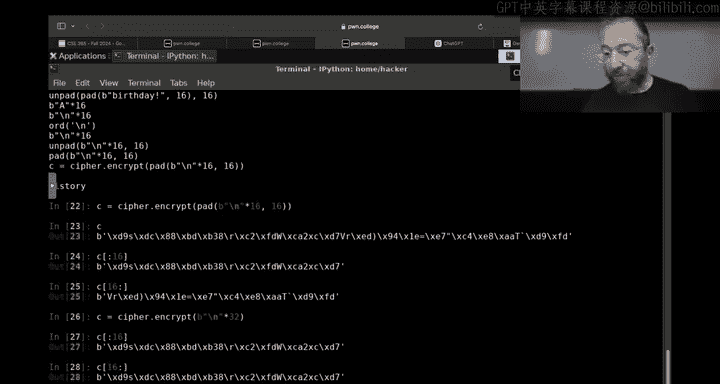

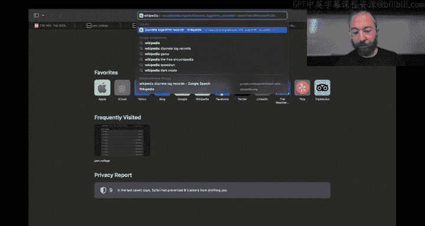

Block cipher modes of operation and you look at ECB because we have to talk about ECB it's a good meme。

If you encrypt using ECB， something like this image of the Linux Penguin mascot。Using ECB。

 all of these black parts and all these white parts。16 bys at a time and cry to the same thing。

 And you can just take a look。 You can see oh this message of this image was。The penguin。Right。

 you get a pretty good idea，16。Bs at a time， except for in places where there's like high difference。

 but even there。Are patterns that you can kind of see over here。Right， that's what ECB gets you。

And where's my phone college？And it's from exactly this from the fact that we have。The same。

Multiple duplications or what have multiple instances with the same block。Value。

In plain text resulting in the same value in cybertax mode。This。

See if we have like seven minutes left。哈哈啊。😊，On switch， we have a comment。

 So ECB is like the 90s cable scrambleler for cinemas。 That's， that's exactly it。

 So it used to be that。And I honestly don't know how things work now。

 but if you had premium channels， let's say sports channels or something in cable and your parents didn't pay for them and you're scrolling through the channels。

 well， you would still get some image。But it would be a scramble the color it would look like that tang and I don't know if it was specifically CD I I well。

 oh definitely not because this。Predated A yes。But it could have been some conceptually similar thing。

 but yeah， basically the effect is like that。 And then then it's a problem in real world crypto the nice thing about ECP is it's so simple。

So you can reason about it very simply， but also so you can。

the encryptor and the decryor are both basically random access， you can encrypt anything。

If I have a 10 terabyte file and wanting encrypt just。One， I don't know， if I have a 24 hour video。

 I want to encrypt just one minute of it and send it along， easy to do。

 pull it out random and cr the blocks， send it。It's a bad idea。Better to have other thing。

 but but ECB can work for thatum same with decryption if I receive a 10 terabyte file encrypted。

 I can see into the middle of it and just decrypt one block。

There are other modes that are much safer that allow that to happen。Steth。Point is。

Block ciphers themselves。For the purposes of this module are just magic boxes。

 Have you combined the output of those magic boxes。That's really where we are going to be focusing。

On the challenges here。Questions about A yes。Conor， do you have any questions？All right， so say yes。

 that's RSA。

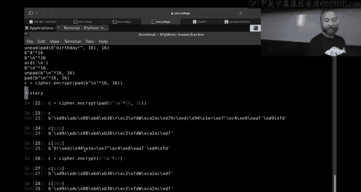

Other parts of this homework are figuring out how to。Mess with data。

One thing。That we haven't talked about in the context of RA because it doesn't apply there。

 but it does apply in the context of ASES in other Cypher modes of our operation is x sort。😡。

An axor is basically a。Control bit flip， so we have something like hex。1，1，1， oh，1，1，1。 Actually。

 let's do the number。The letter A。So we have this hexadeadecimal number， which is。Hey。Not x， sorry。

 this， not hexes and this binary number。That's in。That's a。And we exor it。With。Mh， let's say0，11，0。

呃哦。Let's say 1110， we actually with some bit mask。We get our forward slash 2F。是。And if we look at。

The binary value of this。This cuts it off at the at the largest one， but basically。

Every in every pair of bits。That were。The same。It puts into a zero。

 it makes a zero and every pair of bits that are different， it makes a one。Right， so this bit。

Got flipped to zero，This bid got flipped to a one。Ca they're different here。

 and Ma this controlled where bit flips is。Undoable。So in the same way， if we。

Get the ord of a forward slash， and we exor it。With。O， B，0，1，1，0，01，1。1，1，10。是。

And we transform that back into character right back to our A。Right， so in some sense。

This is encryption with a key of some crazy bit string。

 We make that key big enough and random enough， and secret enough。

And this is our only proven safe crypto system。😡，A yes has no proof of security。

 RA has no proof of security。 In fact， we know that our will fail once possible computers get up and ride。

 But to morrow， in your spare time to night。One of you could invent a factoring algorithm and change the world and break R essay or get really curious about how AES works。

😡，And do a Wikipedia dive and realize some fundamental flaw deep。

 deep inside and destroy modern secure communications。But we have a proof。But if I have a long。

Lly random。By bit string。And I shared with you， secretly。That data is unbreakable。

But then I have to keep refreshing my secret bits with you and it's just not functional in practice。

You might say， hey， well， what if you used Ditpy Heman to？Come up with these bits。

 secret bits or now you build a crypto system on top of the ymen。

 so which we don't have a proof of security for。So you you have reduced the。

Security of the one time pad to David Hemon。 That's exxor now。Say。

 why am I talking to you about this mean crypto system of a one time pad where， you know。

 no one's going to be exchanging these pads in more advanced as cipher block modes of operations？

We use Exxor， for example， to solve the penguin problem。😡。

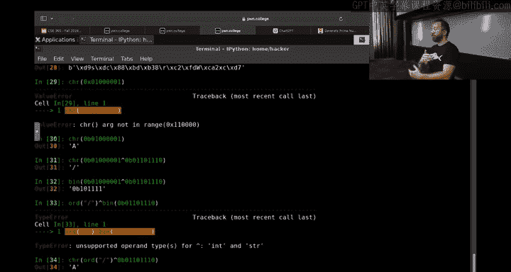

I could solve I could use a penguin problem solution for some other situations right now。My。

We're keep having to scream on Connor's laptop because my Linux laptop isn't all right， anyways。

 you can solve this penguin problem by。With the way that they。

Next textbook way to solve it is what is called cipher blocklock chaining。

Where we take the plain text and before encrypting that plain text into the Cyphertext， that block。

 the xed with the cipher text of the previous block。Which is some random shit。

And so then we basically eliminate。The penguin pattern。And things are secure。 And you will then also。

Learn through the challenges。How to break。Certain situations in Cypher block chaining。

 which is what that's called。One more thing I want to say about that。Oh， the downside。

In order to send you。Say the penguins Tommy。I can't with ECD。

 I could just encrypt the Tommy and send it over， right with。Cyberblock chaining。This next one， CBC。

I have to encrypt from the very beginning。Because I have to exor in the previous block。

to generate to to encrypt the block the previous cybertex to encrypt the plain text and to get the previous cybert I have to exert a cybertax before that and so on so you lose this random access encryption。

 but you still have random access decryption。😡，You just have to send me the previous block block。

 anyway as we go into all of this in the challenges and you'll talk about this next week。

 I think you should now be。😡，Fairly equipped。Tackling some concepts of hacks and AS in Bay 64。

To dial in all the way through the checkpoint。系。Let's do it。我行。

And you have the millennial pause at the end as I search for the stop here， you got to have a coffee。

 it doesn a cough。