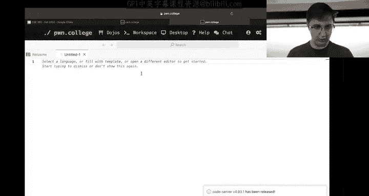
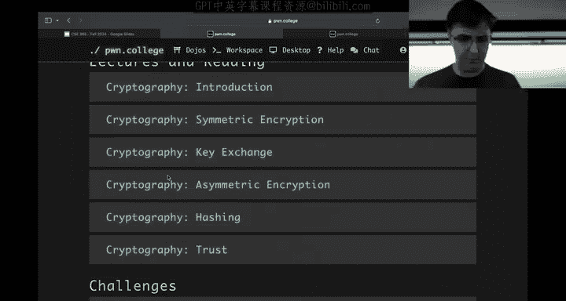
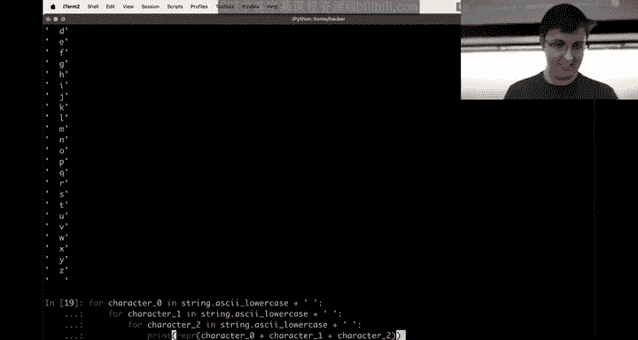
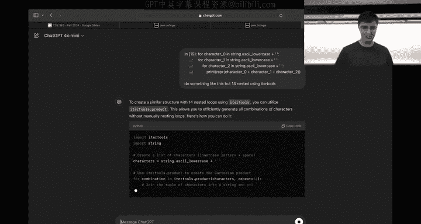
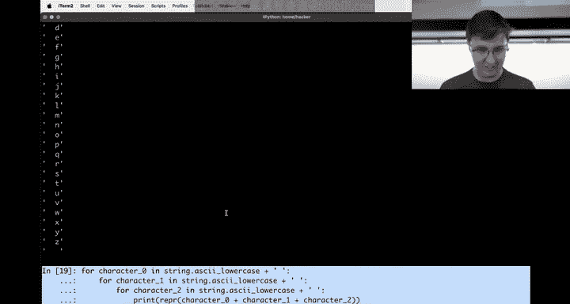
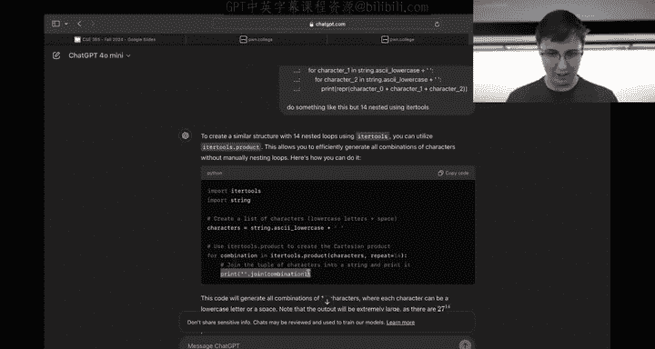
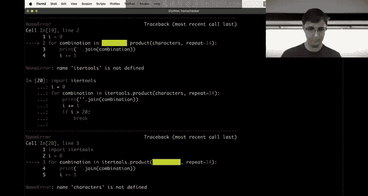
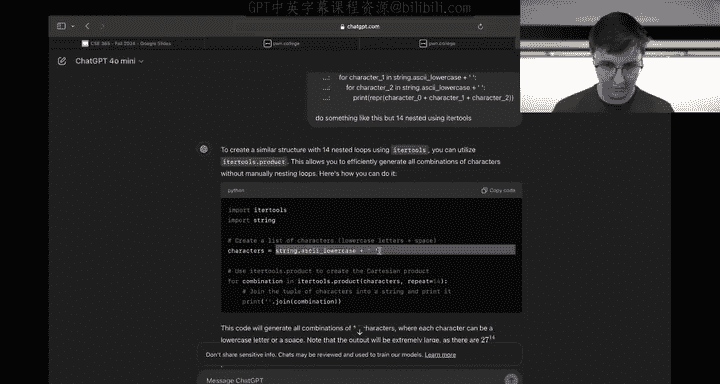
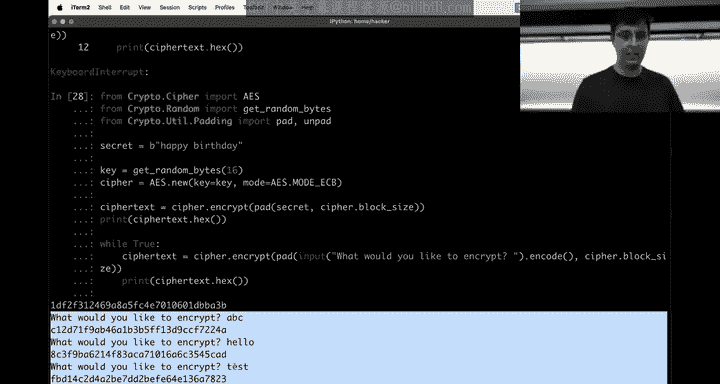
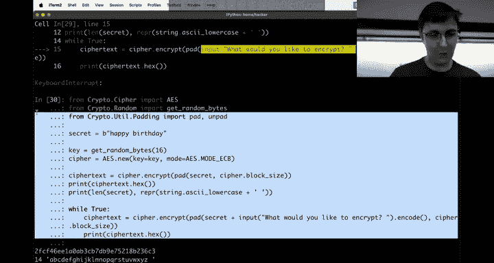

# ASU《网络安全导论｜ASU CSE365 Introduction to Cybersecurity Fall 2024》中英字幕deepseek翻译 - P13：-14-Cryptography - CSE365 - Connor - 2024.10.07.zh_en - GPT中英字幕课程资源 - BV1nVCVY9Ehy

Alright， hello everyone， welcomecom to today's class。 We're making progress through the semester。

 We're done with the first week of cryptography。 We're onto the second week of cryptography。

 Let's jump into it。 So who's liking this module， Does anyone like this module。

 Are we've got some hands。 Who who thinks this is their favorite module。😊。

Couple hands Who thinks this is the worst module Also some hand Well maybe it's the worst because it's the current one I'm gonna maybe kind of assume that might be true。

 but maybe you really do like it less than web security or something like that anyways well sorry this is the math module if you thought like hey。

 I got to I guess Calalc3 is not even a requirement for CS anymore but you got through your math and you're like wow。

 we're done with math Well sorry math does occasionally show up in computer science and cryptography is definitely one area where math shows up a little bit。

Hopefully it's not too bad of math。 Okay， before I jump into it。

 does anyone have any questions about the course or about cryptography， any the concepts。

 otherwise we will。Jump into the topic of brute forcing。Not seeing any hands。

 not seeing anyone in the Twitch chat saying anything。

 hopefully I don't lose the Twitch chat I got on my phone， I don't know if it's going to vanish。

 but we're attempting to have Twitch chat this stream。Okay， well I don't see any hands。

 well then we will jump into it。

So one of the。Kind of big oh， there's a， There is a hand， sorry。Yeah， go for it。

这三个不用加是吧。这个应该是。Challenge nine is that three， four，5，6 CP。

This guy。啊。We will。Look at a very related concept， I will say。

 I'm going to look at something that is。Somewhat very similar to even actually this boss level。

 So it'll touch on these topics and kind of。I think one of the big things that makes some of this stuff difficult is wrapping your head or wait。

 it can hear we can't hear you， I can， okay， never mind。

 people can hear one of the topics that kind of shows up is understanding AES。Andm kind of。

I think a lot of this， especially this prefix boss and kind of the series building up to it。

Is kind of putting yourselves in the mindset of efficient brute forcing if there is such a thing。

 it turns out in cryptography， yes， this is such a thing。So。Before I actually go over brute forcing。

 though the first thing I want to talk about is it's in the lecture videos。

 hopefully we've all seen the lecture videos， but we haven't covered it in class yet as one of the cryptography primitives and the concept is that of hashing so hashing is yet another kind of fundamental idea within cryptography we've seen diffy Heman Key exchange。

 we've seen symmetric encryption we've seen asymmetric encryption。

One other concept that kind of is fundamental within cryptography is the idea of hashing。

 so encryption allows you to kind of go backwards and forwards with your data right you have。

Someit piece of how do I want to represent this？嗯。How why is this not working？Nope， that's not it。

There we go。 Okaypparently， I don't know how to use the max anymore。

 One of the concepts is is encryption。 So we have some piece of data like。

Join me at my birthday party or whatever I think Yahan was using as a thing you might want to encrypt。

 and that turns into some sort of gibberish， right， It turns into this。

 We'll say it's even the same length or something。 And the critical property within encryption is that you can go both directions。

 whether it's asymmetric or symmetric， you can go either way。 So I encrypt some text It becomes this。

 probably I don't know what cipher is going produce something that looks like this。

 but we can pretend there's a cipher that could do this。 And then given the key。

I should be able to take this message。RightAnd oops， that's my public key that I just added。

Why is this being weird？

Okay， we are giving up on Eax because I have。Apparently forgotten how to use EmmX。

So we are going to switch to he has code so that we don't have to let that get in the way Okay。

 so the critical idea right is first we get rid that critical idea is I can take some plain text。

And produce some cipher text， which is given the key， we can do this transformation on the data。

 and I should also be able to do the other direction that given the key and will kind of gloss over the idea for a second that there is both asymmetric and symmetric cryptography。

 which are a little bit different。 But let's say given some key。

 at least I should be able to go the other direction。 And in the case of symmetric encryption。

 this key is the same in the case of asymmetric encryption。

 the direction you're going has two different keys， right。

 this is kind of what we have gone over Okay， well， hashing is a little bit of a different concept。

 and the idea with hashing。Is that I should be able to take this message。

 join me at my birthday party， and I should be able to throw it through a hashing function。

 and it produces this some blob， and in this case we're just going to show that this blob is smaller than the original blob。

And the property that kind of really differentiates it from symmetric and asymmetric cryptography。

 the encryption is that we can't go the other direction。 There is no function。

There is no even key to even pretend to insert into this。

 but I could pretend to give you a key that maybe does something。

 but there is no function even given a key that allows us to go the other way。

 there is nothing that does this。And this is the idea of hashing and you might say。

 well why would I ever want to do that， that sounds absolutely useless， it's not。

 it is extremely useful， it has a whole bunch of properties。

 and it's actually this property that you can't go the other direction that is extremely valuable。

 so maybe even unintuitively as I say that it is that property that is super valuable。

That if I give you something， some blob of data that you can't go back to the original is just how hashing works。

 so let me show you an example of that real quick and then we'll kind of dive a little bit more into it a very popular hashing algorithm。

 so we've looked at AES as an algorithm for symmetric cryptography we've looked at RSA as a something that allows us to do asymmetric encryption。

😡。

The common the common go to function for hashing， let's say is Sha 256 or at least that's one of them and I can hopefully do this correctly if I say。

Join me at my birthday party， and I throw that into Shaw 256 some， because why not？

 It produces this blob of data。 And you might say， well。

 this blob of data looks like it might be bigger than this。 Maybe it is。 I don't know， right。

 It's hex。 So it might not be。 Well， it also。😊，it's always going to be the size。

 it's always 256 bytes that are 256。Yeah， bytes that comes out and if we keep typing a whole bunch of nonsense right。

 the size is the same， it always produces 256 256 bits sorry。

 256 bits that comes out here right we can maybe sanity check ourselves real quick that if we look at this。

 the length of this is 64 divided by two that's how many bytes times8 right， 256 bits of information。

Okay。So it always produces this small thing。 so even if I had out some， you know。

 larger file like Etsy password， for example， and I throw that into Shaw 256 some。

 it produces that the other important property though。

Of Sha 256 before we kind of go into a little bit of a deeper dive of it。Is that at。

Small changes to the input。Makes it so that the output looks nothing like the original output right so if I do maybe if we can write this in more mafi terms。

 if I say some input one thrown through a hash function produces hash1 and then I do input two which is very similar to input1 that produces hash2 hash1 and hash2 look nothing alike even if input one and input2 look alike and so for example。

 if I throw this through here and I make the y at the end of capital Y or something。

 you'll see that these two things look nothing alike and this is very important because this is one of the properties that preserves the integrity of that weight。

 that idea that you can't go backwards so if this wasn't the case if just changing this y to an uppercase y produce something that looked similar I could slowly start sending input。

😡。

At my hashing function until I get into the vicinity of the original and start working my way towards it。

 but you can't do this。 A small change in the input produces a dramatically different output。

 and so all that really matters of this hashing function is that it's a one way This property is critical and this property is used in all sorts of things。

 So one of the reasons that this is actually used is in a concept known as proof of work So proof of work is a concept within you know Bitcoincoin and some other cryptoco or blockchain schemes proof of work is basically just asking your computer to sit there and do a lot of work that's literally all proof of work is it's proof to me that you've done a lot of work and the standard way that you might implement that is using a hash function the fact that I cannot recover。

Given some input， I have no idea what the output is going to look like and I have no way of shaping it。

 they're almost entirely uncorrelated other than the fact that it is deterministic right every time I throw this through。

 truly that is the same output that comes out every time。😡，And so one of the kind of ideas of。

 you know， proof of work that uses this property that it is hard to figure out an input that produces this output or produces。

 let's say I might ask the question， give me some input that produces。😡。

10 leading zeros or something like that within this hexadecimal output。 So how would I do this。

 Well I would brute force right， there's actually no better way to do it than to brute force that question。

 If I ask you a question， give me， let's say some decimal integer represented as ASI to keep this nice and simple that when hash produces a hash with 10 leading zeros。

 the best you can do is just naively brute force this So let's show that real quick。😡。

So we import hashlibb， that's how we can start getting ready to hash things in Python and just as an example。

 let's use zero and let's do hex digest okay， so the hash of the ASII number zero produces this and the hash of the ASII number one。

Produces this， right， completely unrelated。 And neither of them starts with a hexadeimmal0。

 So we've kind of gotten unlucky。 But how do we， you know。

 find one that just starts with one hexadeadeimmal 0。 Well。

 you brew For and brew For maybe is just a fancy word for a for loop。So。Or actually， in this case。

 we'll do a wild true loop and just increment forever， so let's start off at zero。Let's。

Let's convert that I to a string， so let's maybe take this very slow here。

 make sure we all understand what's going on here。 if I print stir of I。 well。

 that's obviously spamning it， maybe we don't we'll just say if true for the moment that produces a0 and then we want to hashlib do Shawl 256。

 This thing maybe you're going to try to do something like this says strings must be encoded before hashing。

 This is just this python thing of bytes versus strings being a little bit different。

 The way we get around that is we encode it and we want the hex digest。

 we are like halfway there to brute forcing this。 we get that five F value that we saw before。

 We're going to I plus equals1。And then we will while well actually before we do wild2。

 let's just do 4 J in range 64， right we'll do 64 numbers。Oops， we're needing to write this。

 so we're going to do 64 loops of our brute force， we get all of these hashes and maybe to make it real easy for ourselves。

 we will also print I over on the side right so this is the hash of 0，1，2。

3 all the way up through 63。 if we look here manually 51 seems like it starts with a0。

 So eventually we got one， I guess there's earlier ones as well that start with a0。

Where is this， where's our first one？嗯。Maybe right here 39。 Well。

 instead of looking at the screen right， we're writing Python。

 let's let's keep developing our thing for us， let's just say。That are our hash output equals oops。

Equals this right here。And then what we're going to do is we're going to print hash output I and then we're going to say if hash output starts with a zero。

We are going to。We are going to break out of this loop， right？

Okay so 39 in fact is the first one right so 39 iteration or 40 iterations of this loop and finally we get something that starts with a zero Why does this matter this matters because this is for example as I said the idea of proof of work I want you to prove that you just made your computer do a whole bunch of work and I can ask you all sorts of questions that make it so you can't precompute this work。

 but in this case we'll use this simple scheme of you know just it needs to be a decimal number encoded as ASI that starts with one zero well maybe then I'm going to ask go for two zeros。

😡，And。Where is it starts with 00， lets see here。Why are we。Start with0， zero。 we've got an issue。 Oh。

 I know the issue， the issue is we didn't say wild true， we want to finally go to wild true。

Rather than only do 64 loops， Okay， let's see here now we just made our computer do work on the 286 number。

 that means the trial 256 of ASI 286 starts with two zeros。

 we want to make someone do even more work we add another zero and it looks like 886 is there and you can see that a computer can do this pretty quick。

 but as we go on to adding more and more zeros。This is going to take our computer longer and longer。

Maybe， maybe we'll get there。Oh， look at that，596，138 hashees to a value with five zeros。Very cool。

 so we just forced ourselves to do work。Now， the way you might actually traditionally implement this sort of thing because you could imagine that if this was the question。

 someone could just go ahead and precompute all of this work。

Which would be super lame The way you would actually do a proof of work is you'd ask them to do it with a prefix。

 So for example， I'm going to say happy birthday has the prefix and we will instead do prefix space I as our thing that we're going to encode and let's go back here and。

Let's actually say our hash inputs equals this thing。And we will put hash input here。

 We'll encode that。And we will say。Starts with00 and we will print our prefix okay。

 note not a prefix our hash input。Hey， whoa look at that。

 our first one that had two zeros also had three zeros。 How lucky are we right。

 what in 16 chance that was going to happen？And so happy birthday 16 hashes here and then again。

 if we go back to four zeros right now we've got that so you really you're gonna to come up with a random value and as I said。

 the whole idea here， the whole name of the game is make them work。

 prove that they did some work and this is basically you know half of the technology that Bitcoin relies on。

 I would say， it is this mechanism that is， you want it to be unlikely and of course， you know。

 you're going jack up the proof of work really high。Right， and this， you know。

 is's going to take specialized hardware working on this rather than just some boring， simple Python。

 But that is the idea。 And if we wanted to， you know， maybe do a smaller granularity， right。

 we don't have to rely on ASI 0， we could do a bit of0。 but that is the idea。 So let's actually。

 while I continue。We'll just see during the course of this class， you know。

 what is the best prefix we can get just to show you， you know。

 maybe how how good an hour of brute forcing is so we'll say，Best prefix equals none。

 or we'll say best。Hash inputs， equal equals none。Let's actually also get rid of the prefix。

 we'll just do a nice decimal number。And see what the coolest number we can get is， so we will say。嗯。

We'll say best has input leading zeros equals zero， and then we'll say。We'll say if hash output。啊。

Starts with。Zero times。Leading zeros plus one。If we found something that's better。Then let's print。

 well， we'll do this actually。Then we'll get to that， and we will do leading。Zeros equals。嗯。Well。

 we'll just assume it only goes up by one。Maybe it's a bad assumption。

 but we will say leading in the large law of large numbers， it will be probably true。

 good enough for us， we will do that just so we can get on with this leading zeros plus equals1。

 let's see if this works， okay， we're at four。That's a lot of zeroes。Hash output。 okay。

 so we'll just let this run in the background。And we'll see at the end of class how many leading zeros we can get in one hour。

 very fun， okay。So this is kind of， I said that one of the big concepts maybe within cryptography has to do with。

With brute force， this is kind of a very naive brute force， right。

 We are truly just enumerating the entire search space， which is this massive， boring。

 like decimal incrementing space。This isn't very intelligent， so for example。

 let's actually lay SSH in again and get back to the world of AES here for a second。

Oops。I will assign into the own college。Okay。And。If we want to think about this question of brute forest。

 we can imagine the question of brute forcing， let's say AES so。And this is， in fact。

 what this challenge series kind of has you do it to some extent， is brute force。AE。

 but it's a smarter brute force is not like this naive brute force where we're just like literally searching over this boring input space and trying them all。

 And the reason we can't do that is if I look at， let's get AE going real quick。

If I give ourselves some AE。Yes， yes。We will do。Well on we will。😔。

Very very convenient to steal from the challenge how to actually use AES in Python feel free to look at the challenge source code right when you're doing this。

 it will be very helpful for you。If we。Take our import AES here。

We import AE and we want to create a new AE。 So we'll do this thing right here。 This looks good。Okay。

And we'll import one more time。 Okay， so now we've got almost got Es there What all we need。Nope。

 not that one。We need get random bites as well for nice random key。2。That and。

One more thing we need is pad and we'll take unpaD also。Okay， well， now we just need flag。

 We'll say secrets equals happy birthday， and we will make that a bite string to make this nice and happy。

😊，And we will put the secret here。 Okay， and one last thing we will do is print cipher text。

 print cipher text， Okay， and。One more thing we will do。Is hexify that。 Okay， so let's say I want。

 Yeah， there's a question。Yeah。Parallel， yes， so that that's a very interesting question and actually bringing that up right。

 you could definitely make this， for example， parallel you'd have to kind of think about how you want to do it actually hold on。

Well， I got lucky with my zeros that what happened。 Okay， you would have to， for example。

 start one thread off at， you know， 10 trillion and then the next one off at 20 trillion and then 30 trillion and assuming you're not going exhaust your entire search space。

 You could have this running against several cores that is definitely true。😡，It becomes very quickly。

 and that's definitely true， I should say for the question of， you know。

 how many leading zeros can I get， what's the most leading zeros I can get from a decimal ASI integer being hexed。

 right？That would work great and you can see， for example。

 that I have already searched through at least 81 million numbers and if I had this running on 10 cores and you know this is naively or paralyizzable。

 I would be already at 810 million executions if I was going across 10， you could bump it up to 100。

 bump it up to 1000， however many cores you're willing to throw at this thing， could write this in C。

 for example， or write this in assembly and have this go a lot faster。But at some points。

We run into an issue so for example， with AES right we're operating under 16 bytes of output let's say we don't know the key and in fact I haven't printed the key out for you yet so you don't know the key Obviously we could type print key we'd know the key let's say that I want to reverse back to secret。

😡，Okay I give you this and I ask you the question， tell me what the secret is。Because， you know。

 I didn't actually。S you the secret。 You don't know the secret， right， This is all you know。

 and I say， give me the secret。 What is the secret here， You don't have the key。

 You just have the ciphertex go right， and at some point in your thought process。😡。

We're going to arrive at the thought of。You know， throw more cores at it right This is going to be an idea you might think about。

 but before we can throw more cores at， let's say this question why we need to reverse this back to the ciphertex or back to the secret The question is how am I brute forcing this Like what what mechanism。

 what is my for loop going over right in order to brute force this So for example。😡。

Let's say I tell you the length of the seeker right I'm very generous for some reason I leak that out to you。

 maybe you don't have to do this， but let's just assume that we know that it's a 14 byte value that I'm going to brute force over and。

Let's even be nicer。 I'll tell you it is only spaces and lowercase ASI。

 right we know that from the secret。We're going to you know hide that again because we don't actually know the secret and I tell you that the search space is 14 bytes。

And I tell you， furthermore， it's 14 by， and it is。A lowercase ask you。 So our search space。

Let's say or our let's say character set character set in the worst case。

 it would be all 256 possible byte values for each one of these bytes。

 but I'm being very nice and I'm making it easy for you because I know you would only speak to me in lowercase ASI。

 actually let's just do import。String and make this nice and easy for ourselves。

 String ASI lowercase。 Okay， it's this。And also what's going on here。And also a space。 Okay。

 so I tell you this is the search space。 And so you're thinking， all right。

 I'm going to write my for loop for I in range。14， for example。Well， I guess it depends。

 What is our our our for loop we might do。Let's say four character。In string。askci。 lowercase， this。

Why is there there we go。 And then， you know， we're going to write this， you know， very。Bingly。

 actually， we're going to do this。 And then we're going to say for character one in this， right。

 And this would nest 14 times。 We'll keep it simple for ourselves。And just do， you know。

 three and call it day， right there smarter ways to write this， but we'll keep it nice and simple。

And we'll say that our guess， right as we gets ready to guess what the secret is。

 is going to be character zero。Plus character one plus character two。Right。

 and these are going to be all of our guesses you'll see at the end we have a lot of spaces。

 so this is all of my things to guess。系。And actually， I'll put a wrapper around this。And right。

 so this is all of my guesses for three characters， imagine extending this up to 14。

We have a very big issue here。 My question to you is what is the secret and we're going through and brute forcing all of the possible things that the secret is。

Now the question is， how do I know if I'm correct？Does anyone know。

 let's say we extend this out to 14， how do I check that I'm correct that I have guessed the secret？

Yeah啊。Yeah exactly so we would we would take our input so actually let's maybe we'll figure out how to write this more efficiently this is where we're going to use a nice chaty PT and tell it what we want to do because I know that there is a thing called inner tools that would do this very nicely。

Do something like this， but 14 nested using inner tools。

Hopefully it will just spit out to me what I'm looking for that looks correct to me。

OkaySee， I told you there's a smarter way to write because I just didn't know what it was。

 but live in the world of Chat E PT very nice， so let's do this and just to keep it simple。

 we'll say I equals zero， I plus equals1 and then we'll say if I greater than 20。

Break， right， and we need to import。Itter tools。

And。For some reason， Cha EptT decided to do that， I liked it like this before。

Simple enough though。And we can see， right， probably if we continue on， we could， you know。

 get rid of this if thing and just let it keep going。

 It looks like it's going over our entire surf space。 So the first thing， right， I I。

I told you let's pretend time we wrote this correctly。 All right， now we've written this correctly。

 Now we have the ability to go over our search space。 The next question is。😡。

How do we determine it's correct and you said right we hash it or we in this case we're using AES so we will encrypt it。

So I will do ASES。Yes。New， right， how do I encrypt it， I would do this， but we have an issue。

What's the key I you also don't know the key so I can't just go and encrypt it because encrypt it with what key So this is an issue So maybe then you say all right。

 well brute force all of the possible keys。And then， like。What。

 so I think we're going to quickly run into multiple issues with this approach。

 The first issue is bruforcing the key。Doesn't really make sense because it's too big。呃。

The key can be 16 random bytes。Which means that if I do 16 random bytes。

 there is 256 possible things that one byte can be。 We're going to do 16 of those things。

 This is how many things I'm going to have to search over。 Now。

 you'll notice that this number compared what happens in my， my nice so much for that。 All Hol on。

 we're going。I'm going to start this back up also。Either way， it doesn't matter too much。Well， true。

 and we'll start off at this number minus-1 because。ThatAnd then how many leading zeros， one，2。

 three，4，5，6，7。7 leading zeroes。Okay， and we will resume that actually set it to six because we just made it so it quickly finds that either way。

 more of the story is in Python， we have only searched 813 million things right。

 is that math correct， no 81 million things with this for loop and I'm asking you。

To search this many things， it's not even close it's like orders and orders and orders of magnitudes bigger。

 And so right if we write 81，1，2，3，1，2，3， right these numbers magnitudes apart。

And so what you said also earlier was， all right， let's multi process this thing。

 And there's times for sure where throwing more cores at the problem is going to be very useful。

 you have a search space that you can。Easily parallelze and it takes an hour and you throw 60 cores at it right now it takes a minute。

But throwing more cores at this， these are like。You don't have this many cores， right。

 If we threw this many cores out of it， it's just not going to happen。 We cannot search this space。

 It's too big。 The number is literally too big to search。 and so。😡。

That's kind of like the first issue of this brute force problem。 Let's go back。

 so we have no idea what's a brute force。With the key， this is like， what key are we going to use？

And the other issue。Actually， maybe if' not an issue。

 Let's see how big of a search space we have for this thing right here。

 So we have like multiple for loops， right， we， we're imagining maybe writing a for loop over all keys。

 and then for every key， we're going go through this。 But let's see how big this search space is。

 Well， this search space would be。The length of this， which is 27。

So there's 27 possible values to the 14。Okay， so this is also a very large search space。

 so just of ASI lowercase plus a space。This is also too big of a search space。

 Our key search space is too big。 Our message search space is too big。 You just can't do this， so。

It was kind of a trick question at the start when I said I will give you the length of the secret and tell you the alphabet that it might fall into and now tell me what the secret was。

 you can't do it there is A it's unfeasible computationally and B， there's actually a worse problem。

You might have a situation where。You don't even know how to detect。That it's correct as in。

What are you comparing against like we might have a situation where multiple things will encrypt to the same value even because you're searching over multiple keys。

 there's just there's no way to approach this There is no way to do it and that's a good thing okay。

 the reason that's a good thing is the property of symmetric encryption that we rely on is that you can't go the other way without the key it just can't be done。

😡，And so we're fine because cryptography is working as it's supposed to。

 you are not able to get back to this secret。 You need the key to go back。Okay， so in this setup。

 there's nothing we can do。 There's just， there's no way to do this。

 but there are other setups where you might be getting more information。 In this case。

 I gave you the information of。Here's the size of the the secret。 and here's the character set of it。

 That's not enough。 if I told you。The key Now， at the point that I give you the key。

 you can just go backwards。 So that's kind of boring。

 And you're not allowed to give out the key if you want this system to work correctly。

 but you have might have other setups。 You might have a setup， for example。Where if I give you。

A wild true loop。And I do cipher encrypt。Pad secrets， or we'll say。Input。

 what would you like to encrypt？And。I do dot encode on that。 We're just going write this out。

 We might end up in a situation where we have something like this。 and then we will say。

Ccipher text equals that。And I print ciphertext。 Hex back to you。Okay， so。

 and also the very first thing I'll do again is。Print we'll say cipher text equals this print cipher text。

 not text， okay。We might have a very strange at this point in time setup where I give you the secret in Crypton。

And then I also give you the ability to encrypt things just randomly with the key。

 so you can encrypt ABC， you can encrypt hello， you can encrypt test right and every single time you do this it's encrypting it using the secret okay so we have the ciphertex that we want to recover。

And now， instead of being told the length of the secret and being told。那么。

The being told the length of the secret and being told。The character set of the secret。

 Now I'm giving you this。 and maybe I'll also give you the original stuff。

 Well maybe it will be very nice。 We'll also say print length of。

Seccrres and we'll also just say 27 because or we'll say。String dot lowercase。

 Where is this string dot。I think it's ASCI lowercase。String dot ASI lowercase plus this。

 and we'll re this we're giving you all sorts of information。Right， this is the search space。

Given this setup， which might seem a little bit contrived right now。

 but you end up in situations like this where you know you have an HP server running and it's encrypting data because it wants it wants you to not be able to forge certain things that when you send to the secret。

 So for example， the cookie it wants you to not be able to go and mess with the cookie so it's going to send you an encrypted version of the cookie and maybe for some reason the cookie。

 the encrypted thing that it's doing is you know we want to put into the cookie what is your favorite color or something and you get to tell the website your favorite color it encrypts that using its key and then it sends the result back to you as a set cookie and suddenly you have this setup where。

It's using the server's secret key， encrypting your favorite color and sending it back to you as a cookie and it's like。

h， what's the big deal， who cares I encrypted something for them。

This is no more information now I have the ability， I don't know the key。

 but I have the ability to use the key and immediately what this has done for us。

 if we think back to our idea of brute forcing immediately what this has done for us is it has chopped off a massive part of the search space it has chopped off this whole where is it this thing we have just reduced the search space by this much if I am able to no longer need to search through the the key space and now I just need to search through the possible plain the text space。

😡，Suddenly， this is the search now this is still not good enough， as you can see here。

 this number is still also way too big， but it's kind of nice。

 right we reduce the search space quite a bit。And so I could， you know。

 suddenly my brute force has sped up， it hasn't sped up enough， but cool。Still not doable， though。

 still cannot solve this in any way。Now， there are other things， though， that might happen。

 And what else might happen is a setup like this。 If I give you this encryption right here， secrets。

Well， now we get a。Type this correctly。 I think that's typed correctly。 I might give you this setup。

 which looks very similar， and you might also be thinking to yourselfselve。

 what the heck this is so contrived。 Why would you ever end up in a situation where you have this thing that will give you the encryption of the secret that you're after plus whatever the heck you want but it does happen again。

 think back to the cookie example， We might have this weird HP server set up where。

I give it my favorite color and。Let's say I give it my favorite color and then it also has u。

 let's say my password or something and it wants to give me a cookie that contains both my password。

And my favorite color and the way it does it is it takes those things in， it encrypts it。

 it sends it back to me and now it knows that I can't mess with it because I don't have the key so I couldn't produce something like that I can't even read this it's totally fine。

 but it's able to maintain state with this sort of weird cookie setup and you might be thinking well who cares if the secret is your password do you already know your password？

We're chaining together a lot of ideas here hold of me for a second。

 let's imagine now we're in the crossside scripting context where you don't know the user's password。

 but you do have this capability to make requests as them to the server using their cookie and you can send a pass a favorite color and the server will send back to their password encrypted followed by their favorite color it seems crazy but these setups do really occur in the real world。

And。It turns out that this setup finally。Is abuable。 We have a very serious issue。

 and we can see what that serious issue is， for example， if I send an empty string， what happens？

What happens is I get the original secret right so initially it encrypted the secret and gave it to me and it told me the size is 14 and this is the search space as I said before。

 you don't actually need to know this。Information， but maybe it makes it feel a little better that you do know this information。

 And if I send that my favorite color is empty string， suddenly I get this encrypted still fine。

 I don't have the user's password because right this is what we started with we already have this information。

Actually， hold done。Take a step back。 There's a， there's a reason I'm making this change。

 but I'm going to。Change this to be actually what I really meant to do is that I put the secret at the end。

 turns out this is the the real issue here。 and either way do that right and it still says the same thing。

Just imagine that you know the color goes first in the cookie and on the password。Well。

 maybe I'll leave it as an exercise after we go through this discussion for you to think about why the order of this matters but for now we're just going to say this is the order and we have this very cool thing。

That occurs once this happens。Where we get to start thinking about what is this actually doing right。

 we have this AES cipher going in mode ECB and what mode ECB does is it breaks it up into 16 bytes。

 encrypts that goes to the next 16 bytes， encrypts that goes to the next 16 bytes， encrypts that。😡。

And so if that's true。I should be able to， for example， thinking about that。

 I should be able to send 16 A's。 And if I send 16 A's， I should see some garbage。

 right some random encryption followed by this again， because that's how ECB works。

 right If I send it 16 A's。 it'll encrypt those 16 A's。

 And then it'll encrypt the secret because the secret follows。

 And so we'll see my message followed by the secret。 Let's actually see that。 Okay，1，2，3，4，5，6，7，8，9。

1011，12，13，14，15，16。 okay， that's my favorite color。 And what comes out。😊，This writes here。

 Look at this。 Okay， and we'll add a space to this to make it even more readable。 but sure enough。

What I said would happen， happen right because it's ECB， this is how it should happen。

 The first half is just an encryption of my 16 A's。

 and then the second half is an encryption of the secret。 and then also， of course。

 there's padding at the end of the secret， but let's just roll with that for a second。Okay， cool。

 But what difference does this make Now I still just have the secret that I have and now I have the encryption of 16 A's this is。

Still seemingly useless。Things get more interesting。Once you start。

Is shifting things around a little bit Where you start putting the secret in。To like partial。

 like part of the secret into one of these blocks。 So， for example， let's just think about。

 for example， what happens if I send a single a。If I send a single A happy birthday is currently 14 characters long。

 I just added a 15th character to the beginning of that。

 now we're at 15 characters and then there's one padding bite because the padding works such that we we all remember how the padding works right we can show this real quick。

If we show。Prince。We'll just print this。😔，If I can get my parentheses correct。Yeah。支持。

Prenheses are so difficult。Okay， that is there， that is there。 Now we want ripper there， there， okay。

Cool， so if I send a single a。While we missed our block size。嗯。😊，Plus， secret。

This cipher dot block sizes is just 16， but will be very explicit。

 I send a single A and what is it encrypt Well it encrypts a。Happy birthday X 0，1。

 because there is one bite of padding that needs to be added。 If I do nothing， right， if I just do。

 why did I not get， Did I get this。There we go if I just do an empty string then I get happy birthday with two two Jan talked about this in the la lecture。

 this is how this padding scheme works， a very common padding scheme called PKCs7 or it's part of that standard it's just how many bytes do I have left put that at the end。

Hey， so if I put a A in here， we will see why is it Oh， I see。

 it's alternating between encrypting and。And showing the。What's getting padded。 If I do A A。

 suddenly I have  two plus 1416 bys。 I filled my block， and now I have an empty block full of。

A full of these padding bytes and so what that means is that this second half of this somewhere in here。

 I don't know if I selected that correctly， I guess I could do it correctly。

 probably add a space in here to make it real easy to visualize that means that this 2F876 E thing is the encryption of Hex 16。

 hex16， Hex 16， Hex16 or you know Hex 10， whatever however you want to say that but it is this value encrypted with the key。

Okay。We're just going over， you know how those properties work。

 There's nothing necessarily too interesting yet， but I encourage you while you solve these challenges。

 for example， to constantly be testing your assumptions that you know that's how that works。

 So for example。Let's see。How do I want to show this Let's， if I， for example， cipher encrypt。

Just this right here。And I do that Do Heckx。Right， we get。This， right。

 is's just the second block that empty block encrypted。 That is definitely true what I just said。

Okay， let's get rid of this padding thing， though I think we know， oh maybe we don't know yet， let's。

 let's u let's make this。Easier for ourselves to see what's going on。

 We're going to ask what wants to be encrypted。Two we'll just say plain text or yeah。

 plain text equals this。Okay， and then what we're going to do is we're going to print the padding of this。

We're going to make some nice visuals for ourselves so we can see what's going on here。No。

 that's not actually what we want。 We want to。And we do want that。Actually， we'll say。

We'll say full plain text equals。plain text plus secret。

 then we'll say paded plain text equals pad full plain text。Ccipher dot block size。

And then what we'll do。As well print our padded plain text for ourselves。And we'll do it as。

They will do it as that。And then we will encrypt for ourselves， cipher text。Equals cipher。

Dot encrypts。Paded plain text。That's right there。That， that， that， okay。So now if I say enter。

 it says that it is going to do that。 Okay， let's add some more， we will say。And puts。And。

We'll just say output。Yeah。Okay， we do that and every time I'm rerunning this right we're losing our key。

 we're regenerating a new key that's fine just hold pretend that the key is being held constant because that's once we're in this while loop that is what is true right the key is held constant okay。

So we have that we have that Okay， now one more visualization I think I would like to see for this is split it up into 16 byte boundaries so that we can actually see the parts of this right so that when I do AA I can see which block is which okay。

 so we're going to add more debugging for ourselves so that we can kind of see this happening and we will do。

Paded plain text。We'll say at length of that。And then we will divide by 16。And we'll do4 I in range。

This is how many things we've got。To go through。And then， we will do。Paaded plain text sub。

16 times I 2，16。Times I plus1， I think hopefully this is correct。

 we'll see if it's not correct in a second and we will print inputs that。And we will。呃。Reippper。

 that thing。And there's a lot of stuff going on in a single line of Python。

Maybe some highly obscure Python for many of you。But we will see if I wrotete it correctly and then we'll understand what it does if I had my parentheses here correctly。

Got a reper for I in range length of that。 Where is my app parentheses。 We need one more。What。

He wants that's， that's， that's okay。Let's see here if I hit enter， we see input is happy birthday。

 if I do Aa， we get Aa happy birthday and the second block。 Okay， and if I do some long thing here。

 we can see we got this input， this input， this input， this input， this input。

 and it produces that up。 Okay， we wrote our crazy loop of breaking up our blocks for ourselves correctly on the first try。

 which is very fun， minus some syntax errors， and then let's just do the same thing here for this output。

We will。We'll just put the hes here。And we will basically copy this logic right here。Hopefully。

 except Python is kind of annoying in this ripple。We want。Divided by 16。K。

 and instead of padded plain text。This is like use a text editor。 it's probably way easier than this。

 but here we are cipher text。And cipher textex， okay， we have almost made it。

 so it's very easy to visualize what's going on here。And you'll see why in a second。Okay。

 if I type En input that well， what the heck up in here。Cciphert。Oh。

 we don't actually want to go by 16， we want to go by 32 because it is two he characters per okay。

 so we'll just change that。232。Because it is two characters per byte instead of one。

 Okay And then if I do a。We see that。 And then if I do A A， we see that， right， Okay。

 which means this lines up with。Well no I guess that doesn't line up。

 but if I hit enter this still lines up with this guy and so we're starting to be able to visualize some of these blocks and actually we're going to add one more thing。

 we're just going to give ourselves another new line okay。So we can see that if I encrypt a。

 it produces this， which produces this output block。If I send nothing， we get this， right。

 the original message。Well， what happens if I send AA well， as we said before we get this encrypted。

 which produces this block followed by this， which produces this block。

 and if we just encrypted this somehow， we would get just this block， as we said before， okay。

 the first interesting thing happens once we type three A's When we type three A's。

 this is what happens。I get AAA happy B doh。And then the Y ends up over here。

So we just moved one bitete of the secret into the second block， and you might be saying big whoop。

 who cares that is so boring that doesn't do anything for us。

 who cares about the encryption of Y FFF F FFF FFFF。

The reason you care about the encryption of Y followed by these Fs。Is。冇。We're thinking again。

 take a take a step back。 We're thinking about brute force and our search space。

 The big problem of brute force is how do we deal with our search space。 And also real quick。

 I'm gonna check not we lost our We're not going to figure out how much you can brute force over the course of a class because I keep losing。

Whatever right， maybe we'll have something later about that。Back to this。

 The reason this is interesting is it backs to that discussion of brute force。 This entire time。

 we've had a problem that our search space was way too large。 I lost the numbers。

 but it was like 256 to the 16。 and then also like 27 to the 14， right， if I do。

27 to the 14 is too large of a number。We've begun to change the characteristics of our brute force search space and the way that we've done that is we've got this thing that is willing to encrypt anything for us。

😡，And now we also know what the encryption of the secret followed by all these F bytes is。

 So we know that this right here。Enncrypts to this。Now， we don't actually know what this is， right。

 We just know that this Y is the。Last bites of the secret。 That's all we know。

 We don't actually know that's a why。 So quick， quit pretending， you know that's a why。

 You don't know that's a why。 You just know that this is。The last bites。Of the secret。

 and you know that the last bite of the secret followed by 15 F's produces this hash right here。

If we go into kind of brute force mode， this is brute forceable。

 I can search all 256 possible bytes that this could be。

foollowed by 15 Fs and one of them has to produce this output block。

 it just has to because you know it's deterministic so we can try all 256 possible values。

 one of them is guaranteed to produce this block。Now we have a little bit of an issue。

Which is that actually， we can't send something like this as our， as our our search thing。 right。

 If we send this， this is going to be a disaster。 It's not interpreting this correctly。

 So we're going to。Do a one more change， which is we're going to bring in this input。

 And then what we're going to do is we're going to。Just eval。

 We're gonna we're gonna make it so that we can send arbitrary data to this。

 if you think back to the cookie example， we would be able to send those F bytes。

 but over standard input to this program。 theres no simple way to send that So we're gonna do this And so if we do。

 let's make sure this actually still works。 if I send an a now it doesn't work。 But if I here we go。

 if I do an a now well that doesn't work。 But if I send a byte string a， it does work。 Okay。

 so now we're just slightly changing how we send input to this thing。 If I want to send an a。

 I do that。 if I want to send3 a' is like we were before we send that and now。

What I would do is I would send a single a。Followed by all of these Fs。Oops。

Excepts that didn't copy correctly。All on， we would send a single a。Followed by all of these Fs。Okay。

 and so a followed by all of these F's。Enrys to this E18。That is not 4742。

 so we know that the last character of the secret is not an A。Okay， we could send a B character。

 And if we do a B。We could send all of these Fs as well and we send this。

 And now we know that B followed by 15 F's produces this， which again， is still not 4，7，422。

 Our goal right now。 we got to think what are we trying to do。

 Try to figure out we we see this glimpse of a chance to figure out the last bite of the secret。

 which would be huge。 That's like infinitely more information about the secret than we had before。

 we would know the last bite of the secret。Which is very cool。

 But what we need to do is we need to just try all 256 options。 We've tried a。

 We know it's not a tried B。 we know it's not B。 You might be thinking， all right， this is silly。

 we know it's y。 we don't know it's Y。 We do not know that it's Y。

 The other reason we know it's Y is because we have this very nice input debugging thing In reality。

 all you know is the outputs。 Okay so we know 4，7，42 is the hash of the secret， followed by 15 F's。

 This is what a followed by 15 Fs。 This is B。 and then we could do X followed by 15 Fs。

And we know that that turns into that， which is still not 472。

 and then eventually our brute forcing very nicely goes all the way to y。And suddenly we get a match。

 this equals this。Right。And this is huge Now we know that the last bytes of the secret is an F。

 The reason we do that， we know that is because we brutefor it， but we brutefor it intelligently。

 we had a search space of 256 things。 We didn't have a search space of 72 trillion quadrillion whatever many things。

With a search space of 256， you can write a four loop that goes over 256 things very fast。

 it'll run basically instant， and now we know the last character of the secret is a lie。

As not the secret though， that's only the last character of the secret。So now what， well。

 now we have to think， is there something we can possibly do to get， you know。

 the first character of the secret or the second to last character of the secret or some other character of the secret。

 if there's some like iterative process we can follow， right？ It's kind of nice。

 we send three A's and suddenly the last character was in its own block followed by things we know。

 Well， we now know this last byte is a why。 What happens if we just send four A's。

If we send four A's？This is what's going in。 It is now8 Y followed by E many Es， right。

 hexademly speaking。We know the last character of the secret is a why because we already discovered that we know that because of how padding works。

 that this is going to be a bunch of E characters，So we just do it again。

 We know that the thing that we want to test is some unknown thing followed by y because we discovered y followed by a bunch of E characters。

 And so what we're going to do is in this case we're going to get very lucky。

 We're going to do our guess。 our guest character isn't a in this case。

 And in the next character we're gonna type in is a Y。 this is not a guess。

 we know it's a Y because we previously discovered that it's a Y。 This is also not a guess。

 this is how padding works。 We know those characters have to be ease because that is what the padding is going to do。

 And in this case our brute force is very lucky。 you know it's fine。

 though you can write a for loop over 256 things You're not always going get lucky and little your first guess is going to do it but in this case。

 look at this。 We got 160 lines up with 16， which means our guest of a was correct。

 We now know the last two characters of the secret is a Y。And so what do we do next，4，5， We send 5 a。

 Now， that's not how we do that。 We send 5 A's，3，4，5， and suddenly。This is what happens， right。

 This goes in。 you'll see is very inductive algorithm here。 We've got unknown character。

 Qui pretending you know the character， you don't know the character。 We got unknown character。

 We do know this character because we previously brutefor it。 We got an A。

 We'd know this character because we previously brutefor it and we got a Y。

 And we know these characters because this is how padding works。 And so we're going to do it again。

 We're just going search over all 256 options。 And eventually you'll get a D character。

 And now you'll know the last three characters of the secret。 And suddenly。

 this search space that was massive， right， we said before it is 27 to the 14， right， because。😊。

You know， our thing was very nice and told us that the password was 14 characters long and that the alphabet that it could be was these 27 characters and suddenly this search space that was 27 to the 14。

Is no longer 27 to the 14， it is now actually， I said 256。

 256 or 27 depends if you know the alphabet， if we know the alphabet's 27。

 then it's 27 to 14 if we didn't know it， but somehow we knew as 14 characters。

 this was the search space。But let's go with the 27， somehow we know it's lowercase plus space。Now。

 instead of being 27 times 14， each time we're guessing 27 things， we just have to make 27 guesses。

And then we have to make another 27 guesses and then another 27 and another 27 we have to do this 14 times The search space just went from 27 to the 14 which is entirely infeasible to 27 times14 So this is the kind of like a nice little discrete math thing right of what is our search space that we're going through。

 This is how we've transformed the search space。This is extremely feasible。

 Your computer can go through 378 things extremely easily。

 Your computer cannot go through this many things this easily。And so。

This setup works very nicely like this where。You know， we we have this oracle is what it's called。

 It's called an oracle。 If you have this thing that will give you answers to something。

 and it's kind of very similar to the blind sQL injection challenges that you've solved in web security。

 In that case， you have this blind sQL oracle。 In this case， we have this。

AP text prefix oracle or this prefix， there's AES prefix Oracle going on here where we have our chosen prefix we get to control whatever the heck the prefix is right we choose the plain text。

And then our secret is apped on， and then that is encrypted。 we get the result of that。

 we can do that however many times we want and suddenly。Things become tractable。

 Does anyone have any questions about this。 This is like。

 it turns out you're gonna be solving a level that looks very similar to this。

 So if anyone has any questions about that， and this is often one of the hardest levels。

 If anyone has any questions about this， now would be a good time if。

 if something about this process doesn't make sense， I'm happy to answer。😊，Yeah。😊，多了少。Yeah。Yeah。😊。

Question。对。Yeah， so in Python the question was what's the difference between a byte string and a regular string in Python the difference is so syntactically it looks like this right byte string just starts with a B regular string does not The reason for that is when Python change from Python2 to Python 3 they decided that Uniode characters are very cool so for example。

Let's see here if I can get an emoji to come out。Right， for some reason。

 Python decided being able to represent something like a smiley face is like。

Critical to the language。 All right， then there's arguments for as sure。 I mean。

 you also can get stuff like you know， an accented E or like an Ne for Spanish。

 like there's all sorts of characters you want to be able to represent beyond this standard。

 you know 128 characters of ASI and you do that with UTF 8。Slash uniccode we'll say。

In Python this thing right here， each one of these character points is what they're called each one of these things is not actually a 256 byte value thing There are more than 256 things that can go in each one of these spots for example。

 you can put a smiley face in here and if I do encode this to we'll just say Latin。How do I do this？

How do I guess。Can I do this？No。Can I that is what I can do though。The smiley face。

Is a Mote in here with an F6 in here and a 01 right。

 This thing takes like three bytes worth of information。 So in Python。

 it's called a character point at each one of these things that my cursor can literally select。

 Each one of these things is called a character point。In Python， a string， a character point can be。

Many bytes long。 a byte string hold on actually before I say that， I don't want to lie to you。

 Let's see。 No， yes， you can only contain it。 Okay， good。 A by string。

 each character point is literally just a single byte。

 So the idea is literally if I want to look at data as a series of bytes。

 or do I want to look at data as a series of unode character points。

 And so normally when you're talking about things like ABC， you know， they're like the same right。

 they're like this a as a byte is the same thing as this A as a byte。

 and ABC is three bytes as a string。 And as a byte string， it's also three bytes long。

But once you get into arbitrary Uniode character points like a。Smiy face or Na or， you know。

 like the whole Mandarin character set or all sorts of characters that want to be represented。

 Sudden， each character point can be multiple bytes。

 And this is why there two different things in Python。 Long winded answer for our purposes。

 we are almost always just working with byte strings。 And it's also。😊。

mIt's also why if I do like for example， import hashlibb， hashlib Shaw 256。

 this thing takes bytes because。These。Cryptoals。Are designed to work with bytes right。

 this's the same reason I can't put a one in here without。I can't put this because well。

 that's certainly an error message and I can't put this either。

 And the reason I can't do this is these algorithms specifically work with bytes and it doesn't want to guess how to turn this into bytes right I could turn the number one into this as a byte or I could turn it into this as a byte I could represent it as ASi or I could represent it as a one byte integer and I could do big Indian integer versus little Indian。

 we're not gonna to get into that for now， but there's all sorts of ways I might want to represent one or that I might want to represent a string and so things work off of byte strings because these algorithms work off of bytes is very annoying。

 but it's kind of make sense if you think about it for a while， but it is annoying。

 That's the difference though。Any more questions。For we wrap it up。Cool， all right。

 so critical thing to think about add debugging to the the scripts if you want to know more information。

 see how the data is moving around。And also think very， very， very， very smartly about brute force。

 You're gonna be thinking in your head， oh， I should just brute force this。 What is the search size。

 Do the math to figure out what the search size is， See how many iterations you can do in one second。

 you can compute how long it's going to take to walk that whole search space if it's yours。

 Probably you're not doing the right search space because you're not going to get it done in time。

 Okay， thank you all for attending， and I will see you all on Wednesday goodbye。

