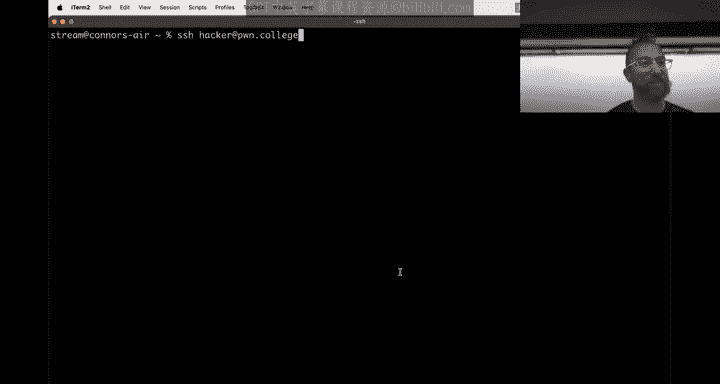
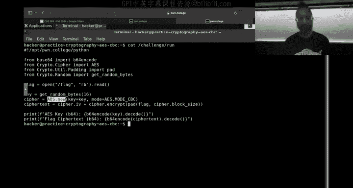
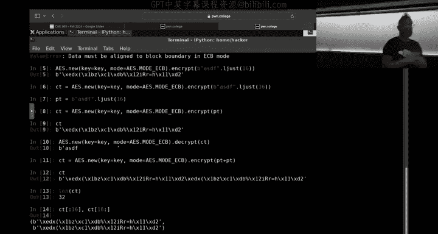
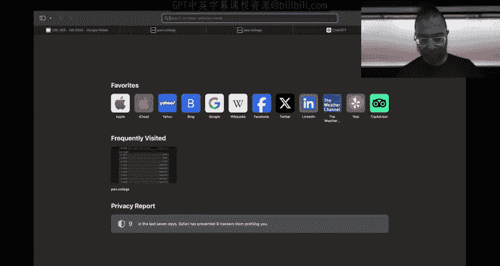
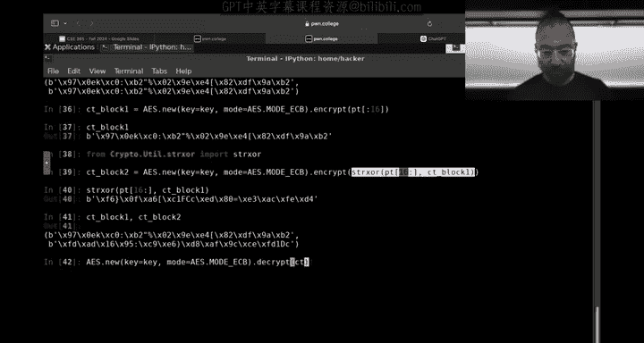
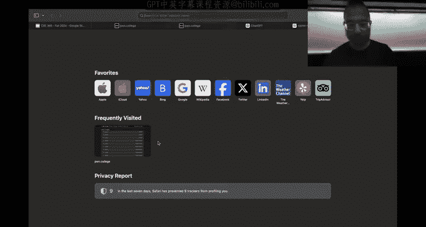
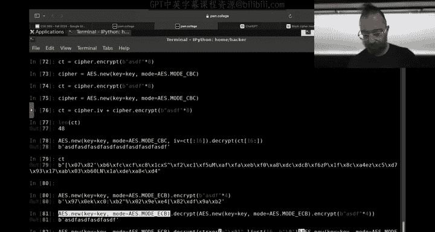

# ASU《网络安全导论｜ASU CSE365 Introduction to Cybersecurity Fall 2024》中英字幕deepseek翻译 - P14：-15-Cryptography - CSE365 - Yan - 2024.10.09.zh_en - GPT中英字幕课程资源 - BV1nVCVY9Ehy

ers。Let's get started， All right， was that a now in response？

All right， okay， are we all on live excellent， Okay。

 we are in the depth of intercepting communications。Sorry， crypto， the camera is not following me。

 let's try to get it to follow me all perfect to keep up。Kind of， okay， awesome。

 during' the in the depth of crypto。😊，I think。People are really diving in and finding a slightly different way of thinking。

Then maybe you are used to definitely。Very math heavy probably more I should say it's definitely very math heavy。

 it's probably more math heavy than what you're used in a typical CS curriculum who here feels very math engaged。

Map out。All right， just。One person， everyone is is math， math okay。Good， okay。U。The crypto。Today。

 if you wanted to dive in and look at。A couple of specific concepts that you'll need for some of the later challenges have you already talked about RSA。

😡，We talked about。m，AES ECB， we talked about the block sizes and the shifting of data between blocks。

UWe talked about Diiffy Heman， today， we're going to talk about kind of the remaining two concert that you haven dived into in live lecture。

 which is CBC。😡，Let me pause the switch because it' screaming at me CB CBC， which is。

We talked about briefly at that end of last Wednesday's class， but we' dive in and then。

If you have time Tls okay， first a couple administrative things right now。

 cryptographyies due on Monday， it's been pointed out that Monday is also fall break Sunday sorry sorry do Sunday at 1159 59 pm so Sunday it's been pointed out as fall break which is。

Unfortunately placed， but I guess any time in the semester it would have been unfortunately placed so there's。

Who here considers that fall break starts on Saturday？All right， see。

 so so so you are starts on Saturday。Oh really， so we have to yeah， anyways。

 fall break starts on Saturday。 So Saturday and Sunday overlap with the deadline right。

 and typically Saturday Sundays when everyone dives in and does the cryptos those two days。

They're going to extend。And we'll stunnedmed。Not into the rest of fall break because there would be a point to that youd just lose more fall break we're going to give you until next。

So we'll add Wednesday and Thursday。Which is not part of Albring。

 So we're going to extend crypto to Wednesday and Thursday。But。😡，So that's， I guess four days total。

 but if you're assuming that you literally vanish the fall four fall break。

 so in our mind we're giving you a two day extension that doesn't overlap with any ASU holidays okay。

 aside from this。Now we have a problem with the schedule。

Because to get everything we need to get conveyed to you， we have a very tight unyielding schedule。

 So what we're going to do， let me pull up the syllabus。Where is the schedule？嗯。

Right now if you're in crypto， these dates are backwards， but that's fine。

 we're going to launch access control。That's unfortunately， do you have a calendar。

 the 14th through the 27？Yes， but no。I think there's a calendar of Macs。 Yes， see。

 I let you launch the calendar。 Hopefully it doesn't actually launch my。 It' have to go calendar。

 It's just of。 It's a guest。 It's a， okay。Great， all right， boom boom， so we are right。

We were going to be due here， we're pushing the due date to here。诶。We still have to run。A nice。

 short。Like consider like a little snack module。Just a little， I don't know。're a little。You know。

 if， if， if you had like a multi course meal， they'll bring out like， I don't know。

 some weird little do Hickey， you know， like a little pretzel or something with like。

Consider that we're going to run access control。As a one week module。

 you all did the Linux luminarium。 You know all who who here remembers about。Groups in Linux。

Users in Linux。Filile permissions in Linux。The said GI bit， the said GI bit。

 You're going to review all of that a little bit。 maybe dive in a little bit more。

Hopefully not going to be crazy and it'll still run overlap。喂。

Cryptography with the extended cryptography and it'll be due。On the 20th。All right， you'll send out。

 put on an announcement， update the syllabus， this is our best。

Attemp to accommodate the fall break while still being able to cover everything you need to cover in class。

So basically， the assignment was going to start on Monday and the other one was going to be due on Sunday。

The one that's what's going to be do on Sunday is now due on Thursday。

 but the one that started on Monday still starts on Monday so there's an overlap it'll put out the date so it's very crystal clear but there's an overlap of assignments now put the second assignment way easier than crypto like way。

 way， way， way， way easier than crypto。Cool。Yep， you're welcome， all right。Awesome。So moving on。

 hopefully this will let everyone still enjoy their their fall break and go from there as a reminder also how many responses to the surveys do5 Yeah so there's 1000 B in the class that end the module surveys we send out。

😡，End up getting a response rate of about half。This is free extra credit。 Please do the survey。

 It's good for for us to to tweak the class， for example。😊，You know。

 maybe we overshot with crypto and difficulty and and need to correct future years。

 maybe web security should have been double its size， you know。

 but we won't know until people tell us in part， okay。And just as a reminder， those surveys are。

Add up to something like 3 or 4% extra credit， which is the equivalent of being able to。You know。

Miss a couple of challenges still getting an eight plus。Anything else we're forgetting。

 That's all the administrative。 All right， that's all the administrative stuff。 So let's dive in to。

Home college。All right， so if you're going what， what just happened。 Oh， yeah， that Okay。

 so if you're going to。Tackle。Some concepts here， one is Cypher block chaining， one is。

The padding oracles and padding in general they're going dig a little bit farther into padding and then if we have time。

 we're going to talk about TLS and the whole kind of well Connor talks about the root of trust than everything in the lecture。

 but will'll go a little more hands in hands on one thing we forgot to mention is the stream on Monday。

😡。

Yes。Monday isn't as we discuss Monday's fall break。

 you will still have a stream during normal class time like an offs stream instead of a class that Connor will just talk about remaining concepts if any and crypto and then it'll be totally optional you don't have to watch it。

 but I'll do a deep dive on concepts that people are struggling with the most on the assignment so that's what Monday's bonus office hours of lecture things be All right。

Awesome， let's roll。 Okay， we talked about AES in a。

ECcB way mostly and at the end of the last of the Wednesday lecture， I mentioned， okay。

 and then there's this cipher blocklock chaining that solves the problem where you could see parts of the penguin despite encryption。

 right？So let's dive in and start looking at E CBC。啊 very not that account。Oh yeah。

 that's right because we need what is Lisa like internet？Oh， that's right。 nice， it is。 Go her that。

 Okay， cool， Oh boy， nice to took the candle。Yeah。Home。

We're getting very good at the camera snatches。 Okay， so let's dive into。😊，Ccipher block chaining。

Boom， okay。All right， Cyblock chaining， unlike。Electronic electronic code book。诶。

Or like electronic codebook， it's just。An argument that you pass to the AES cipher in P cryrypto doome or whatever AES library you have going on。

That or that you're using， you just pass this argument as the AES。

Chaining or block mode of operation。To whatever A library you're using。

 And then you pass data on and into the object that's returned。

 And then the data is encrypted differently。 If you look at this file。

Compared to the ASECB level。You will have that。 literallyter。

Well， there's very few changes， the first changes this inside of CBC is just ECB。

 and then there is this initial value guide。Talk about how CBC works on the。AI Python。

And we're going to import。Cryptpto， actually， let's just do。Copiied these guys。

Set ourselves up for success。

What just happened。

。Thank。All right。So。We诶。Create a A S cipher guy。 And let's actually start with ECB。

Just as as a blast from the past。Right。ECB。what if we call it ECB？What should we call that's heavy。

ECB cipher。Cifpher， oh how an ECBC， no that's too confusing。Okay， so ECb sipherm。Is a nice。

 simple thing。 Actually， if you don't even have to call it anything。

 I'm just going to recreate it every time for reasons that'll become。嗯。Apparently， a little later。

All right， Oh no。好 on。Yeah。So we have the key。We're just going to put this on its own line so I don't accidentally rerun it in the future。

 then we're going to do this。Okay， this creates a new cipher that encrypt。It is the F？Btes。

 as a reminder will encrypt it except for it needs to be the exact block boundary。

 so we will L it to 16。 This justifies it with a bunch of spaces add spaces basically to the right of the string until it is 16 by long and be encrypted Very cool Everyone is super excited to see this again。

诶。How do I press home on this insane keyboard？the homekey， like， you know and and home。

 you don't use home， you just head leftarrow all the time。A email。I don't， I don't know， Okay。

 all right， all right， so the cybertex is this， the plain text， let's say is is D L just。L just 16。

The cyber text， be put in the plain text。And that's our cyber taxax。 And of course， we can also。

run this in decryption mode。Oh my God， this is insane。 Okay， we run this in decryption mode。

And the reason I'm recreating it is you can't reuse the same cipher for encryption and decryption for not stupid。

 but for reasons we can decrypt this and then we get our ASDF powder spaces back cool。

We all know this。 This is ECB。's like that Jurassic park scene。We know it。 All right， awesome so。

When you encrypt multiple plain text blocks。In ECB。So we did plain text plus plain text， two blocks。

And we printed this out。Clearly you get two blocks back。

 clearly means we can test this here's 32 bytes instead of 16 if we split this up。

Into two different blocks， they're the same， so that's the two hs of of the ciphertex。

 and this is why the penguin shows through the encryption。

Right， because parts of the penguin。That let's just pull up the pengu as a visual aid。

好。Blalock Cypher operation。 We go to ECB。If you encrypt the penguin。Big chunks of it are。

Just the same data， there's black color and a bit mapap。

 And so big chunks of the output are the same as well because it just takes those blocks encrypts it and AE and most ciphers are a。

A very fixed， you know， mapping from。Plat text to cybertex now。

You could tiny tangent we're going to go on to you could define your cipher around ASSP a little differently。

 you say a。AS is block size is。18 by， 8 16 by。 But my block size is going to be。15 bytes。

 and instead of when I encrypt。If my plain text would have been this， instead I just it to 15 plus。

I add one random byte to the end。And so then when I encrypt。呃。对。Okay， I regret this already。

 So if I want to have two blocks， I just。Do this twice。Very cool。Here's plain text。

 so there's one randomte and here's my other randomte， and then if I reenrypt it。

And then I split the cipher texts up。M a pity proity。Oh， okay。Yeah。

 if I encrypt it and I split the Cypherject stop， they're different。

Because there's a random block event， and then I know with my custom protocol。

 if I then go and decryft it。诶。And I will do that right now。

I have these these random values on every block， I pop them off and I have my 30 by long two block thing right very cool。

 all right。And now I fixed the core issue of the penguin not showing up with or。

 the penguin showing through the encryption， except， I happened quite。

Because a random bike can have one of 256。Values。And if I encrypt enough bytes of the same value。

 I'll still have collisions in the Cypherex。Right，It won't be as clear as you see in this penguin。

 but there'll still be some sort of pattern shining through。 And even if your eyes can't pick it up。

 there'll be some sort of a pattern that statistical analysis tools can pick up and。

With a determined enough adversary。This can lead to negative outcomes as you try to have conversations。

 such as at the very least， your determined adversary being able to figure out， okay， well。

 this block is one of 256 possible ways。That。Someone could encode a black pixel this block is and slowly build up with a little more complexity。

 the same sort of code book that they can use to decrypt and that you have used to decrypt the the previous the ECB run of levels Okay。

 very cool so it's。Not so simple to fix ECB， right and。

What we typically use is a completely different block block cyber mode operation called。

Cypherblock chaining， where we do embrace this concept of adding randomness。To a as block。

 but if you do it in a slightly different way。Right， few。Observe the encryption effect。Right。

 so let's actually。Get back to our our this guy here。We observed the encryption effect。It takes。三。

Blae Tax data。And the key。 And it outputs。A completely random。诶诶。Set of strings。

 a resulting block that looks completely random to us。Right。And this randomness。

 this block is something that an attacker。Cannot。Reason about any statistical distribution of fights。

 any underlying meaning， anything without already having the key and being able to decrypt it。

 That's a fundamental property of。Correct encryption of secure cryptography。

 it's called Cypher block indistinguishability and or cipher text indistinguishability， I'm sorry。😡。

And the idea is just having the cipher text。Doesn't tell you anything about the originating plain text doesn't tell you crap unless you already have the key。

 in which case， you are equivalent to the intended recipient of the message。 All right， so now。😡。

A different way of saying that is we have a source of kind of secure。Randomness。Essentially。

 that is the。Outcome of。The encryption of a block。And if you recall。

 have he tried to secure ECB in my random attempt just now， if he added some randomness to it？Right。

And that's what we'll do。But with a much better source of randomness， which is。

An entire block's random output。And the way that we secure it。Is by exoring it。Into the plain text。

Before we encrypt。 So what we do。Is the following we encrypt。 So we have our our plain text。

 and let's say our plain text is actually。What were we saying before？Happy birthday。We need。

 we need more。Maybe happy。Uh， they're pretty close， maybe I don't know， let's do eight more。

 eight more Yeah， happy birthday， happy birthday students。All right。

 and not that you all have the same birthday， that would be hell of a coincidence。

 probably that point we start wanting are dreamreing。m， let's look at the plain text， Okay， perfect。

 then we're just going to adjust that to 32。So here's our plain text， happy birthday students。

 all right， now if you really want to fix ECb。Oops， oops oops， there we go。We're going to encrypt。

The first block， right？Actually， no， you don't want happy British students， be want。

The much more approachable。AsDF times。8ight。This says 32 bytes。Of identical。Plain text。Awesome。

 and now we can encrypt it。And we have the same property that we had observed。

We'll do happy birthday students later。 Don't worry， Go' wish you guys had birthdays。 All right。

 here's our broken EC B。 This is the the penguin showing through the encryption。 No good。

Let's fix it， right， so we encrypt the first block。As as before for now。

 we are kind of getting to the point where we're fixing ECB， but not yet。 So C block1。Here it is。

And then we say， okay， we don't want。The second block to be encrypted to the same thing。

 And you don't want to mess with like， okay， now we're gonna to pretend that the block size is 15 and and insert things that are going to be broken。

 We're gonna do something nice and secure and and and things that that that have been proven。

 And we're going to import stir X or。On god damn where star are from crypto u。You till， not patting。

Stir Xor import stir Xor， Al right， we're going import the the nice string Aor who here remember stir X fondly。

Everybody。As as they should， all right， so we're going to take the plain text。

 the second plane text block。And we're going to stir Xor it。With。The first ciphertex block。And okay。

 what's the Emax thing to go home？You want to go the front control A for。Co and control E。哎。

Kids these days， man， okay。We can encrypt。That。Because we know that ciphert， right。

 we just encrypted the ciphertex and now we can encrypt the plain text here。And control a okay。

 and then we put CT block 1，2 equal goes that right， So what we're doing here。

Is you're taking the plane tax。We're modifying it in a way that is unpredictable to an attacker。

No longer， hey， if you're adding one random bite and the attacker can say， okay。

 well now there's going to be instead of a one to one mapping， a one to 256 mapping。

Now they're completely wrecking the ciphertex here St X。

 or let's just see what the output of that was。That was randomness。

 and thus CT block 1 and CT block 2 are completely different。Securely， completely different。而。

Now when we， of course， decrypt。CT blocklock1。

All is good， there's our AF is DFsF， if we dec CT block2， we get garbage。

But we can exhort that garbage。With CT blocklock1。And recovery is the faith yet。Very cool。 Okay。

 let's take a look at。CBC in its standard diagram， this is kind of the standard way it is taught Here is what happens we'll take a like just a typical block。

诶。We take the plain text。We exor it with the output with the cipher text of the previous block。

 then we encrypt that and we have the output cipher textex of that block。😡，Super cool。

Who here thinks this is super cool？Kll you， all right。

Very cool now one problem。Let's say I am encrypting a bunch of different images of penguins or whatever。

Right， or images of space。 All， So let's， let's image of space。

Boooone， look at all of these things。 Well， one thing that most of these images have in common is right here in the top left on the very first。

😡，16 bytes， it's all black。That maybe not this one， yes， right？And so far。

 my homespun still homespun attempt to improve ECB does nothing for CT block one。

If I do CT block one。If I encrypt a bunch of different images。

 CT block one is still going to have the same value。Because P。

When we encrypt the plain text for C block one， we just take the plain text directly。

Right for later blocks。I'm kind of protecting those later blocks with the values of the blocks of the cipher text of blocks before and that's super cool and that breaks up this problem with ECB。

 but for this block the first block it's still kind of just，Enccrypted in all like this， right？So。

 we need to。Do something， right， And the do something that we do。

Is that we just pretend there was a ciphertt block before that and what does to an attack or what does the ciphert that they can't encrypt。

 it might as well be random data so we say， okay， well let's just do a random data CT block zero that doesn't really exist。

😡，It's just random we call this Nazi cybert box zero。

 but we call this the initialization vector thank you。

 it's like IV so if we call it the initialization vector typically IV and you'll probably just use IV to the point where you like me draw blank embarrassingly in front of the classroom and we just do get random bytes 16。

Here's our C blocks。 here It' just a bunch of random bytes。 right。

 It doesn't matter what it is as long as they're random。 They have no relation to the key。

 no relation to any plain text。 We just make one up。And when we encrypt cybertax block zero。

 block one， when we encrypt plain tag block one into cybertax block one， v stir Xor。The plain text。

 that first block with the IV。All right。And then the CT block2。

We actuallyor a plain text with that previous block。 And if we had a CT block 3， we would X。

The plain text of block three with the CT block two。And now our cipher text。It's three blocks。

The Ivy。Which doesn't decrypt to anything。 It's just there to get exor into that。First。

 Cyphert block。And the first cybert are sorry to be axored during decryption。

Into the the to retrieve the first plain tax block。

 and then the first cybertex and then the second cybertex block。 And if we。Want to decrypt it？

We decrypt Cyphertax block1。By exing it with IV。Booom， and we decrypt Cyt block2。

Or but not by as starting with I。 I apologize， We decrypt Cyt 1。Yeah。By first decrypting it with AES。

And then exoring it with the IV。Because the plain tax that gets exored。

And when we decrypt Cyphertext block2， we first decrypt it with AS， that block。

 and then we exored with Cypher textex。😡，Block 1。To recover that value。And again。

 if you had a cybertax block  three， we would decrypt it with RAS key。😡，And then we would。

Axored with cybertex block2 and so on。And that's the decryption mode。This is actually a very。

 I link this from the challenge descriptions。 So's a very useful。😊。

Diagram that really tells you exactly what's going on。And this works for any block hybrid is。

Agnostic of the block cipher used。It could。conceivably work with with many other things you could potentially you're a little crazy use RSA as a block cipher and then do this exact thing with RSA probably not I mean not a good idea for a couple of reasons。

 but。This this box is just your block sipher， in this case， AS。Orange。

This scheme that I just described， of course， is A S， CBC。A mode CBC here。

 so if we create and now I'm going to create the cipher。If I create AS mode CVC instead of ECB。

It does a couple of things one is it automatically。Generates a random IV。And that's cool。

 you want the random IV to be handled by professionals。😡，Again， if the IV is not random。

Then all sorts of problems arise， one of which is a potential ability for attackers to fingerprint that first block。

For potentially easy droppers， Another thing that happens I mean。A lot of things are bad news。

 as you'll find in the challenges， right。Now。😡，CBC mode is not the only cybertext。Sorry， block mode。

 block Cy mode of operation that。Uses an IV for other modes， use IVs for different things。

 we won't go into these modes。😡，But there is one very cool one called the cipher blocklock chaining。

And here we go， I just said， no， sorry， that's what we're talking， no， not counter。Counter mode。

 which is also not quite used in practice， and I'll tell you why， but it has something。

semi analogous is this nonsense。Actually， I'm gonna read about the countermo operation。

 It's actually very cool it I。😊，The way that it encrypts， here's our AES magic box。

It takes basically the IV and adds the block index to it。To produce a pad。

A one time pad basically for just that block and then exhors the plain text with that into the cyberphertex what's really cool about this。

Is that you can grab the sub key， the pad， whatever you want to call it for any given block just by knowing its index。

😡，And。Because that pad。Just knowing the position of any bite in a stream。You could encrypt with this。

5ive bys instead of 16。For example， this is going completely out there as I apologize。

 I cannot help myself。We do this CTr thing as I recipher。 And then suddenly I can encrypt。A， oops。

Bowman and happily doest and'm freed from the constraints of the block size This is AE running in what is called stream cipher mode super cool stuff Okay。

 but not relevant to the homework just to be very clear。 Al right。

 let's go back to cipher block chaining world。嗯谢。Yeah。

 actually let me say one more thing about the counter one thing that that's very critical with the counter mode of operation here is this Nonce that there this mode's equivalent of an IV。

 if that nonce isn't random， then bad things can happen again。Then I could， potentially。Exor。

What can I do？On the spot here a little bit， if the nos isn't。诶。That's right， then with the same key。

I can recover。This u。The output basically is the only thing that determines。

The output of AS here isn't the plain text at all， it is just the nons。And the counter。Then I could。

 if the no is reused and I had previously recorded a encrypted conversation and showed up at the recipient's house and。

I don't know force the decrypted content out of them somehow or intercepted in some other way。

Then I could exor。Then I'm basically in a many time pad situation that you have done。

 Maybe you should have this as a child， maybe not， all right。

Definitely not this time going back to。Ccipher blocking again， every time we create this cipher。

 we get this random Iv and one V encrypt。Is Df times8， again， two blocks of AS Df。

When we encrypt here。We get。32 bys。That are different。

Using the scheme that we just arrived together with the xoring of the plain text in the previous cyber text box and we have the IV you need the IV to decryb this so if we do this again we want to decrypt something。

😡，We need to pass in， let's actually save the IV first。If you were to。Derypt this thing。

 when we create the cyber， we need to set the diary。And then， we decrypt。Our cipher text。

And everything is happy。If we don't pass in the IV。What's going to happen？

It'll randomly generate an IV。And then we get random garbage because at exor。The wrong thing。Wait。

 why do you Oh no， no no， sorry， yes， you， I missed on that so。

It exported the wrong thing into the first Cyphertex block， the first Cytex block is random garbage。

 the rest is correct。Why is the rest， why is cybert block two correct even with the wrong ideas？

All the previous blocks are still the cybert is still the cybertext， and you know it。

 and it's still correct that just that first block is broken。Sweet， so lesson learned。

Keep that IV on you， so now your ciphertex for two blocks really becomes three blocks long。

 the IV and the two ciphertex blocks。In CBC mode， if you're sending along one bite at a time。

 this can get annoying。You have to pad that by to 16。Bs already。

 and then plus you had another 60 and that's annoying luckily。

 most of our communications nowadays are much larger and so something like this is okay as we see it as other problems。

I am， very cool。So basically， what the challenges do and what some。

Libraries do when you encrypt with this is for your cipher text。You do， we do this， right。

 cipher dot encrypt。 Let's recreate our cipher， actually。Yes。

We do cipher do encrypt and then our our cipher textex， what we really do is。We preended。With the Iv。

😡，And here it is 48 by long。 And then when we decrypt it。

We take the first block as cipher text as as the IV， and then we take the rest as a cipher textex。

And everything is great。是。Very cool。Any questions on cipher block chaining？All right。Now。

 we're going to dig into。The one of the fatal flaws。Of cipher blocklock chaining。

And this is super interesting。For a number of reasons。And actually， now I'm， I think。

Maybe missed an opportunity to have another cool kind of explore cool concept on the way to here。

 but basically。An interesting。Thing about cyberblock chaining。

Is that the cipher text is completely public。Right。And if I， as an attacker。

Can intercept this ciphert。I' the way to you， so it's not just。

 I'm not just an eavesdroppper anymore。I'm a misreant that gets the text on for example。

 you mail Connor birthday invitation。And。I intercept that birthday invitation in the mail。

 I am the mailman。And I。Carefully tweak it。And then it goes to Connor。Well， what can I do？Well。

 it turns out I can do some really， really cool stuff because I have full access to mess with deciphertexts normally。

If the Cyphert gets messed up。If even a bit changes in the ciphertext。

The entire plain text gets wrecked。If you're in ECB mode。And in most cases， in ECB mode here， no。啊。嗯。

Okay， if you're in EC me mode and I encryptcraft。Is Df times4 one byte of A is Df boom great now I want to all。

Also decrypted。This is going to get a little crazy。If I decrypt that。Okay， but if I decrypt this。

Stir Xor with something。嗯。And that's something is。X01 left。

 so it's just one bit on the very left side， left justified by 16 with a bunch of nullbittes doing the justifications。

 one byte and 15 null bytes。

And we exhort that into our cipher textex and then decrypt that。嗯。On sec。Then what we get is garbage。

We don't flip one bit in the plain text。 We flip all or not all the bits。

 but we do unpredictable random damage to the plain text。 but with。CBC mode。

 we lose this property in an interesting way。Again。

 let's create a cipher because I don't remember if you messed this up anymore。

 and then we get the cipher text to encrypt the SDF。And the first。

8ight bytes of that 16 bytes of that ciphertex。Is the IV。

 and the IV is exored into our plain text after。AES is done。

The use of the IV has nothing to do with ASS itself。

It doesn't benefit at all from AES's awesome properties。Why don't they encrypt IV？Makes no sense。

 design Yeah， CBC ya mode。All right， but Ivy is just yolo used。2。

Xor the plane to expose the encryption， and again， if we decrypt。是。This， we get normal things。

 but now I can start messing with Ivy。And check this out。 What if I X or Di V。With。Hex 20。

Multiplily by 16。 actually， let's do hex hex 1。 let's do our old， our old friend。

 if we just use hex one byte。Justified with 15。Zero bytes。What happens here？

I make very precise corruptions。To the resulting plain text。The IV got changed slightly。

 I exored into the IV。And so when。Let's go back to CBC。When the decryption happened。

 I exhort into the IV here。Here's the decryption。Took the ciphertex of block one。

 decrypted it with ASS。Xor with IV with which I had xored a one which caused the plain text basically to be exored with a one and returned as the plain text。

So I， as an attacker， without needing to know the key， just knowing the cipher text。😡。

Exort something into it。And then when it was。Deryptted by the recipient， knowing the key。

I made controllable changes to the plain text， this is a disaster。

And it's a disaster because I can make very controlled， controllable changes， for example。

Does anyone remember the ASCI value for lowercase a？97 is the decimal， 61 is the tax value， awesome。

 good job。So Hex， 61。What about uppercase aid？That one's pulling up the man page。41。Ld case B 62。

 hexadeadeimmal。Oppercase B 42。The lowercase letter started at he 60 plus the index。

 uppercase letter started at Hx 40 plus the index to go from one to the other you exhort it with taxx 20。

So if we do Hx 20。Time 16 here for our exor。You can controllably change things。😡，For example。

 I just swapped the the casing of all of these characters if you're inviting Connor to your birthday party。

And I carefully swap all the casing and he sees his name not capitalized。

 feels disrespected and doesn't show up。That's a real world consequence。

Of just my ability of messing with the IV。Now， here's an interesting thing。

 I can also mess with other parts of the cipher text。 So let's say I leave the IV intact。And I say。

 okay。I want to master with the first part of the Cyphertex。

I take the first part of the cipher textex， and I exor it with my。Capital guy。Awesome。And。

Leave the rest， wait， it is6。This is cybert block1。The first 16 bytes word IV。

 second to 16 bytes is typephert B1， I exhort that with x 20， I take the sphertex block 2 unchanged。

What will happen， So I am now here。I've exored this guy。

So now my corrupted cybertax goes through AES， I lose control of that。

 it's going to be random garbage。Right here is going to be random garbage。

 but then here it'll get axor。Into the plain text with my modifications intact。

And have the same result on the plain text right here。Now。嗯。Now you might say， okay。

 but who cares you just wrecked your previous cybertext， but there's plenty of。

Situations where that's that could be fine Imagine that you encrypted to Connor an entire birthday invitation with an image。

 maybe an image of a penguin， probably something more birthday like， unless you really like penguins。

But I know how big the image is。Because I， for example， you encrypted all of these invitations。

 you sent it to everyone， including me。But I want to lu Connor。

Into some nefarious place instead of your birthday。

Now he trusts you because you invited him to birthday party you're a student。

 he trusts students and blizzly he fights for the students。

 he's the one that caused this extension for cryptography to even happen。I was going to say， well。

 let's just make it do on Friday instead。The Friday before， oh， two days。 and he said， no。

 we can't anyways。 All right。 so he， he's on on good terms with the students now。

He gets your invitation， it says， Connor， come to my birthday party， here's my picture of penguin。

 my birthday party is at such and such and such a place at Coors 170 at this time and I want to lure Connor instead of Coors 170 to College Avenue Commons where here's a completely different birthday party。

 I wanted to go to different birthday party for some reason。So what do I do。

 I know because you sent me the invitation， where in the cipher text？The address is。

 anchor the previous block。To exhort that very carefully So instead of。Cos 170， it says CABC。

 whatever。I can do that very controlably only corrupting。

The image of the penguin so all he sees is the penguin looks weird right on the very end of the penguin。

 he might not even notice it if you like print that or something right or if he doesn like oh。

 that's a funny weird thing in the penguin doesn't think about it a second longer shows up to CAVC。

Ends that the wrong birthday party， all because。I was able to not care about this block in that particular context。

And I was able to care about this block。Turns out this is shockingly common。

 shockingly common clip cases where。There are parts of the data you don't care about。

And it's worth corrupting one block to control everything you think about， comment and code。

If you start tweaking code， you start your corruption in a place where there's a comment。

You don't care about corrupting the comment， you care about corrupting the code after right cool。

So that's an attack against TC， I can tweak things very controllably。Um。

 the one on Twitch said that every day they learn more things about the terminal from me mistyping something。

It's it is one of the best ways to learn is to make mistakes Okay。

 we have we have 20 minutes I don't think we'll have time for TlS until Monday okay so。

I can tweak things and I can get CBC mode。U encryptpted text the decrypt to something controllable at the cost of a corrupted block。

What else can I do？Well， it turns out that this ability to control the decryption of CBC is absolutely fatal to security。

Now， how have I been？Patting my blocks。 I been patting my blocks with L just。

 but no one does that because。If I have AS Df。Left justified by 16。 And I have an actual asdf with。是。

12 spaces。 How do I know which is which when I decrypt the block， do I know that hey。

 this is just padding or that。This is something that's part of the plane tax。

 and we talked about this last Wednesday， we talked about the PKCs。Had。Function where we say SDf。

 we pad it to the 16 byte cipher size。And it figures out how many bytes it needs to add to get it to the correct block size rather to get it to the correct block size。

 and it adds that many bytes with that value。Awesome， now。When it unpas。It looks at the last byte。

 make sure that there are that many bytes of that value and then unpas them and I have to import。

Unpad。Excellent。Now， of course， if we unpa something bogus。呃。What's it going to do here， I mean。

 you might say。And again， this we we we touched on on Wednesday， you might say。

 there's just no padding here， but how does it know that it just says padding is incorrect。哎。

Throws an exception potentially crashes the program。And if it。Even if it is a correct value。

 and we looked at this on Wednesday as well。But if it is a correct padding that I craft myself。

I can get it to correctly。On pad。Okay。So now they're onto something。Let's get。

To a slightly more realistic。Situation。Of encrypting and decrypting。Because so far。

We've been patting ourselves， patting everything by ourselves right here。We're now going to pad。

Happy birthday students。Using。Actual。PKcs paning。You had it。To。16， the next 16 by boundary。And then。

When we decrypt it， we're going to remove all this s， yeah。

 we're just going to do our normal decryption right now without any attack， here's here it is。

 happyapp birthday students。And then we had added， we had paded with seven bytes of value7 each。

 and were going to unpa that。With a maximum on block size of 16 and all is good。

 happy birthday students indeed。All right。Now。Let's recall what we were able to do。We are able to。

Mass with。The value of that last。block。We' were able to exhort it directly。😡，And we were able to。

Do crazy shenanigans。So let's。诶。Go back to this scenario。Okay， wait。 no， this scenario。 awesome。

 And let's say Im an。😊，W the attacker， and I exor。That cipher text。

The second to last Cyphertext block where the last Cytext block is what has the padding。

It's this guy， this is seven bytes on the last ciphertext block。

And I actually a second to last Cypher text block with。Let's start with our01 plus。Ns 15。

We start Xor this guy。I but it would just happened。啊。Okay， if you stir ex this guy。And。We。Fs。

Plus the unadulterated previous one， and we decrypt it。And we unpa that。All right， be corrupted。

The first。Block there。 and then we exor。A1 into S is our old attack。So instead of students。

 we saytudents。Right， and， you know， if we can come up with the exact correcting here。

 then instead set of students as something mean and then you think Connor's birthday wishes are。Not。

 not as honorable as they might be。But we can do something else。We can say， you know what？

We're going to start corrupting some other stuff。You get。A bunch of zeros and。A one here。

So instead of a one on the very left by， the first bite of this block。😡。

BXor1 into the last bite of the block。Modify the plain text， which then gets unpaded。And now。

 because。A padding error。All right， what can we？Do with this。 Well， one thing that we could do。Is。

Change。The whole rest of the padding。To remove。A letter， a block。

Remove a bitete from the cipher textex。And this is super cool。We take。This。

So at the end of this ciphertex。Again， as a reminder， if he don't un pad， he just decrypted。

It added7。诶诶。Bs of 7。What if he tweak this so carefully that it becomes an eight？And。

Let's go back to。How much time do we have， We have 10 minutes。 let's， let's just stick with this。

 Alright， so we can tweak it so it becomes an8。Okay。Wait， no， seven is。Binary。in is hex 0，7。

 which is in binary 0，0，0，0，0，1，1，1，8 is 0，0，00，1，0，0，0。So we need to exor。To go from 7 to8。

 green checks are with 0，0，0，0，1，1，1，1。Which is。F， and we need。If you do one of these。

Maybe we don't un pad， let's just。Confirm that it works。Awesome， we flip the eight。

Let's make this carefully paded so we need seven of these guys。Okay， for in our。X or block。

 So we do are doing now Wait，9 nullbys and 7 Fs，0 fs。All right， now we have this 888。

 but we need 8 bytes of8， so we also need to change this exclamation point。Into an8。

 So we do 8 nu byte plus。And whatever。A。Exlammation point， exhored width。

An8 is theor excation point out basically using the transitive property of XO。Oh no。

Running out of time， starting to panic。It'sStart Xor。Exlamation point with。Hx08。Okay， boom。

 now we have eight eight and now if we when we unt that。嗯。We just cut off that sumation point。Crazy。

 we corrupted the padding in a controlled way by being able to control the ciphert。 And in this case。

 since we are operating on the last block of the ciphertex。

 we could have to corrupt some ciphertex to do it some some of the resulting plain text。

 the first block to do it。 But hey， if the entire message was just one。Cyberts block。

 We'd only be messing with the IV。 We wouldn't corrupt shit。Right。All right。

So that's cool in order to do that， notice that I needed to know the last。Plight of the cipher text。

In order to pull this off， if I didn't know it。If I thought， okay， maybe it's a and I hit enter here。

 boom， error padding is incorrect。Fi guest。I don't know， maybe it is a question mark。

Padding is incorrect。Now。What would I have to do if I didn't know that was an excation point？他事情。

I brutefor it。That's correct。How many values can a bite have？256 that's trivial。

 we could do it if I had more than five minutes left in the class， we could do it here by hand。But。

 of course， we wouldn't do it by hand。 We would。Say4 C。Range 256。Its a unpa this。是定。Bys C。

 so we convert that into a byte。Crap， control hope。Yeah。Okay， see if I can type this in a。

Five minutes， okay。哦， no。Oh my god。Okay， okay， this is not good， yes， this is good。Okay。

 why is this matter？Control O。 No， I hit the wrong button。 Allright， control O。

 don't panic four minutes。 No one's counting。 Okay， there we go。 And now we do a try loop here。Okay。

 control E， and then accept exception and。Not。Ord by sea。Okay。And I don't like doing this。

 but we'll just do an else here， this is if there is no exception。Yes。Okay。

 and we very quickly try everything and we can go up and。Should see aha。Yeah。

Bte force and find that bike。 So what did we just do。Using our ability。To mess with that。

Pytext and trigger decryption now it's very important。

 you still need to be able to trigger this decryption this required the key to decrypt。😡。

But just by triggering decryption without looking at the output of that decryption。

Just by sniffing for this exception here。We were able to decriib the last bite。

Once we decrypt the last byte， nothing stops us from changing that 8888888 to 999999999 decrypting the second to last byte。

And abide before that。And in fact。We could do the same thing。On a full unpattered block。

Because the full unpattered block。Well accept odd when you try to decrypt it。

And when you exor that last bite to where to one， it'll unpa successfully。

This is called a pattern oracle and it is。An insanely fatal fl。In CBC， unless CBC is used very。

 very carefully。And in fact， in the challenges， you'll find that not only can you decrypt。

Stuff without having the key just by being able to trigger and observe that exception。

You can also encrypt stuff。😡，Which is super crazy。Cool。All right。

 I think we'll end it here one minute ago， any quick questions？

For us。一个。Nope， all right， let's keep pushing forward。 we got until。Thursday。Keeping in mind。

 the overlap with access control， please。Don't delay despite the extension。

And we'll see you on stream on Monday， if you want。 But as modules a lot of work。

 definitely don't delay。 Don't delay goodbye hackers。

