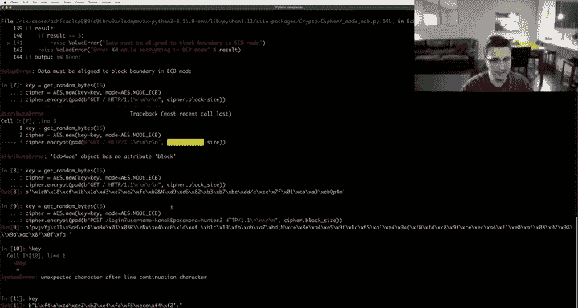
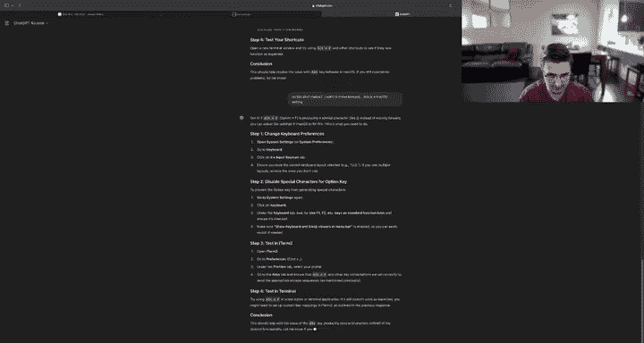
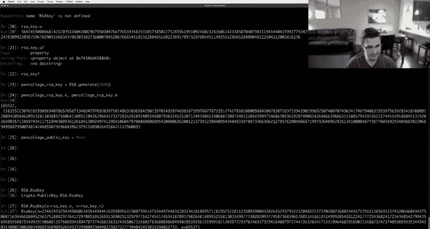
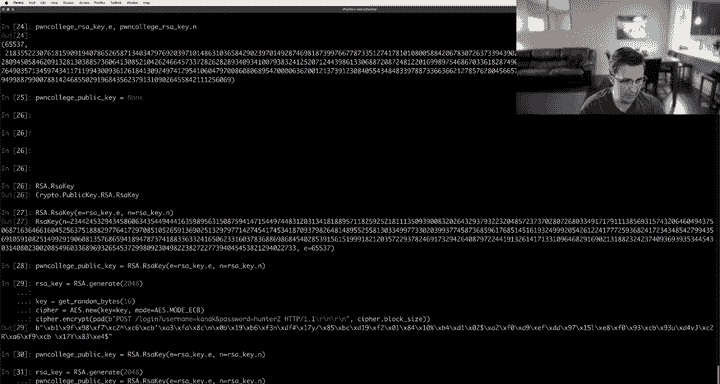
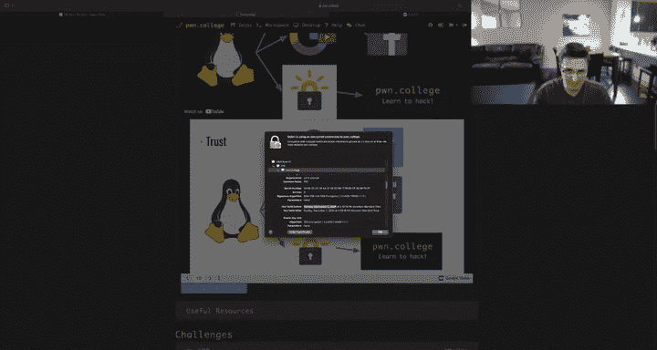
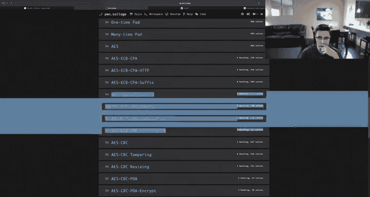

# ASU《网络安全导论｜ASU CSE365 Introduction to Cybersecurity Fall 2024》中英字幕deepseek翻译 - P15：-16-Cryptography - CSE365 - Connor - 2024.10.14.zh_en - GPT中英字幕课程资源 - BV1nVCVY9Ehy

Hey， hello， everyone。 I've started the stream。 Hopefully， actually， we're gonna。

Sanity checked that since I。Don't remember the last time I streamed here。Let's see here。

 How do I want to check this。嗯。The twitchwitch app， of course。This。Says I'm live。

 Does the audio sound good。 Hopefully I'm not like dropping frames or something insane。Audio。

 I see a hello， okay。Cool， someone says it sounds good。

There's at least one other person that can see this， let's get started。All right。

 so currently ASU is on fall break， started Saturday goes through Tuesday。

But we figure since normally there's class anyways on Monday that we would bring in a bonus live stream。

 that's， you know， it's optional。 It's not necessarily expected that you see this live stream。

 though hopefully it is helpful for your understanding and completion of the current module and the current module。

Is。Let's see here。

A cryrypto， okay， also， I guess as a， as a good announcement here， the hookck captain in my account。

Oh。That's。What。There。There。Yeah， so we launched the access control module。 So that will also be due。

 or I guess I should say that will be due on Sunday。 cryptography， of course， As we said。

 there was an extension。And it is due on。Believe it's on Thursday， whatever the heus actually says。

 though， that's what I' due。Yeah， okay， let's jump into it。 then。

 Does anyone have any questions about cryptography， Anything at all。

 This is going be kind of a little more， hopefully， hopefully question LED。 If not， you know。

 I'll figure out something to， to fill an hour with。 But， you know， this is。

 we're trying to maximize the benefit here。 Probably the best way to do that。

Is to answer questions that people have。So I'm looking at the Twitch chat。

 I'm awaiting a nice question。Ideally， not in the form of how do I solve level 7， you know。

 ideally in the form of。I don't understand。How I can abuse CBC to achieve bh， you know。

 a little more substance to the question or。Yeah， something like that。

So I'm giving people a moment to ask a question。Very hopeful that someone asks a question I it going be。

Chill in here for a while， awaiting a question。I'm pretty sure people have not gotten very far。 Okay。

 all this is the question I was gonna。Fall back on anyways。 if， if I。If I didn't get a question。

 So was even better。 All right。 Some asked， I don't understand how T L S Handshake works。Allright。

 this， this was the emergency plan。 So it even on， I'm very excited。 Okay。

 we'll start with that question。I will。Mention again， though， that if you have a question。

 please ask your question in the chat and I will get to it after we talk about this。Um。

It's an interesting comment。 I see I'm stuck， but do not have an intelligent question。

I don't know how to respond to that。 It's like。Something I think about a lot。

 is intelligent questions。 It's tricky， right， Ca if you're stuck on the problem and it's like an unknown unknown。

 it does become tricky to ask a question。 But you can think of a question to ask。 I mean。

 well give you some grace on on that question asking process。嗯。But yet， try and。

 try and think of of what， like， try and think a little bit about why you're stuck and then。

Askking me a question that addresses that in some way。 well see。 we'll see where that goes。

 But for now， let's， let's look at this Tl S handshake。Okay。

 to make this easy for not access control cryptography， to make this easy for myself。

 I'm going to start the last challenge， which actually deals exactly with this。

 but I'm not going to directly get into that last challenge。As it my way of approaching this。

Let's make sure this is zoomed in。That that's okay。Okay， so here is， here's the setup of TlS。

 I guess from when I read the chat sometimes if I switch my background， I can see the chat。

 even though the chat's not on screen OBS very fancy， I can see the chat when I'm on this screen。

 So going forward when I switch this screen， I'm quickly looking at chat Otherwise terminal。

 we're looking at what I'm talking about。Okay， we'll roll with that set up for now。嗯m。

In order to understand。The Tl S handshake。 I think what we really want to understand is what is our goal and one of the really cool things。

About this module is we get to combine together， certainly in this Tl S handshake。

 combine together a number of cryptography properties into what's called a crypto system。

 You kind of build up a crypto system derived from a number of little elements， little， little。

Little。A little。Sub componentson that kind of build into your broader system， Right。

 So we might want to reach for symmetric encryption， where we know that with symmetric encryption。

 we get the property that the ciphertext is unreadable unless you have the key。 So if。

 if both parties have the key， they can both read。If they don't have the key， they can't read， right。

 we can also look at properties like asymmetric encryption where we get to kind of change up a little bit from symmetric encryption where instead we have this asymmetry。

 you can。Encrypt something that the person receiving it knows how to decrypt and you can kind of like send this out to everyone and other people can read it just like in symmetric encryption。

UmBut。You you can actually use their public key to encrypt it。

 So you get everyone gets to know the key but not everyone gets to decrypt because there's two different keys。

 right， You have the two sides of this this key。 So everyone gets to know the public key so I can encrypt。

 but only the person has the private key can actually decrypt and you can actually do the reverse。

 where the person with the private key can encrypt and then only people with the public key can decrypt。

 which you might be thinking， of course， as we've talked about。 I mean。

 probably you've heard this line a little bit probably a few times now。

 you might say like you know why do that， you kind of get this property called a signature out of that。

 you get to sign something。 So only the person。That has the private key could have possibly encrypted this thing。

 And now everyone can decrypt it because in theory。

 everyone has the public key and that the property you actually get out of that is。

Kno that this person with the private key generated this message in the way they sign it。 Okay。

 so in order to understand Tls， we got to understand what our goal is。

 Our goal Tls is kind of not necessarily restricted to Https other protocols go on top of Tls。

 So for example， I believe it's true to say that SSH is on top of Tls， If not。

 the SSH has its own protocol， but really Tls is kind of building on our IP stack is kind of really the right way to think about it right where you have something like ethernet。

 which has its properties， you put IP on top of that， which has its properties。

 you put TCP on top of that， which has its properties。

 and then kind of the next layer that you put on top of TCP is Tls and Tls just means like now we have this communication channel that is encrypted。

So。In order to do this， our， our top goal or our， you know， our kind of。

Maybe starting point of thinking about T L S is that we want to have an encrypted communication channel。

 right， So I think symmetric encryption very directly。 think AE， S， right， we want。

Two people to be able to talk back and forth。Over an encrypted channel， think Ae S。

 Now we run into an issue， which is an issue we've kind of talked about a few times。 So first。

 I'm going to， how am I going do this。 Also， I got a。How do I do this。我对得。Okay。

 my monitors making sounds。 no more sounds Monit。 Okay， what I want to do。

Is get some import section I'm going to do。Hats。Actually， we'll just do。Head in 30 challenge。

 I want to get my imports。 I never can remember these imports。 I think it's challenge run。 Yeah。

 okay， we're just gonna take all of these things。 I don't know what I want。

 but we are going to take all of these things。 And the critical 1 I'm looking at here is Aes S。

And it looks like we have some history， but we will kind of ignore that for a moment。

 We know the situation of using A S is something like get ran bits。 and we want， let's say。

H28 random bits， and we'll call that the key。Right， so。What。Actually。

 we'll make this simpler for ourselves。 We won't do get ran bits。

 We'll do get ran bytes becauseuse really， we're thinking in terms of bytes here。 But obviously。

 they're pretty identical。 So now we have a key， and then we do A S new。

K equals key mode equals A S mode， ECB， We'll just kind of keep this。Real simple。

And now let's just specifically think in terms of HtTPS。Right now。

 what I can do is I can encrypt and say。Get slash HtP 1。1。New line， new line。Nice and simple。

 very boring thing。 And， of course， this yells at us about must be aligned。

 So we will deal with that。We will pad this to cipher dot block size oops。Okay。

 and now what do we get Well， we're we're kind of starting down the path of HtPS。

 starting down the path of Tl， or we're just going to think about this as HDPS。

 Now what we've gotten is that if we send this over the network。To the HtP server。

 let's say I'm the client I send this over the network now someone snooping on my traffic has no idea what the heck I just said to this server right they just really have no idea what's going on。

Maybe they can infer that we're talking to an HP server because when they get these packets。

 they can see that these packets are destined for port 80 on some remote IP address。

 and maybe they can even see， you know that IP address Facebook's IP address and they see you're talking to port 80。

Or in this case， often， I will say SS L H T TPS will be running on port 4，43 instead of 80。

 That's the standard。 So they can see his's running on port 4，4，3 or running on 80 whatever。

 But they have no idea what request I'm making。 And that might be important because I might be posting my password instead of getting slash。

 And I don't want my password going over the wire and plain text or people snooping can see it。 So。

 you know， maybe I say。Will make this even more fun。 Why can I not do Al B。

Go to figure out why my alt B is broken we're posting to log in with username。

Equals Kanak and password equals Hunter2 the famous， the famous password。

 And we don't want someone over the wire to see this。 And so we encrypt it。

And then Facebook decrypts that everything's good， except， of course。

 we immediately run into the whole key exchange problem。

 How the heck does Facebook know that this is。That this is the key that they should be using， right。

 this one now I can show you， oops， I can show you the key right， we're using this key。

How do I get that to Facebook or how does Facebook get that to me？ And， you know。

 we run into the issue of exchanging the key。 So we've got the first property we want。

 which is encryption。 If， if only somehow we could exchange keys， we could do that。

 I'm just gonna also checking in on the chat。 make sure there's no follow up questions。 If there is。

 by the way， while I'm speaking if there's a follow up question。 I'll keep checking the chat。

 All right， we will continue then。So we we have the property where we can encrypt things。

 but we don't have the property where we were kind of missing this element of our crypto system of transferring the key Now how do we do that。

 We know how to do that we've seen or hopefully you will see as you do this module we have various systems for that。

 So for example， we have Diffy Heman， Diffy Heman gives us the ability to exchange the key。

 but Diffy Heman actually faces this issue。Where you can still get men in the middle。

 We're assuming some adversarial person sitting on our network。

 And in the case where our adversarial， like our threat model。

 in the case where we're assuming our threat model is such where they're just passively listening to all the traffic。

 We would be totally fine doing diiffy Helman。 we can do a diiffy Heman key exchange。

 as we talk about in the lectures。

Right， we go up here。 we go to key exchange。Got this nice video where we show with paint。

 but then also show with math how you do this you do this exponentiation under a modulus and turns out that we can exchange a key。

This works totally fine if Mallory here， this malicious person on the network is just passively listening。

 To fine， we can exchange it and Mallory will never know what that key is that we exchange we're good to go。

But in the case of T L S， it assumes a threat model that's a little more aggressive。

 It assumes that Mallory is not just sitting on the network。Passively listening。

 it's assuming that Mallory start might start messing with the traffic。 right。

 Alice is trying to talk to Bob。 Mallory is going to change what Alice is doing。

 Change what Bob is doing。 It's all the traffic is flowing through Mallory。

 and Mallory can kind of do this thing。

Actually， I believe it's in the trust lecture here。

Mallory can do this thing where Mallory sets up two diiffyhelman key exchanges， right。

 Mallory does a key exchange with Alice。 Mallory does a key exchange through with Bob。 Now。

 Mallory has both keys， and Mallory can let Alice and Bob talk to each other。 But through Mallory。

 where Mallory has both keys。 and Mallory can just kind of do the the necessary encryptions and make the whole system work。

 So Alice and Bob are none the wiser that this is happening。

But that Mallory can still see it because Mallory ultimately gets both keys because Mallory is playing an active role in this network。

And is just decrypting everything here on Mallory side because Mallory has both keys in this case。

 right， So we talked about that here。So instead， as we talk about in trust。

 trust is kind of an important element。And we start to begin to talk about trust in the context of RSA。

We assume。Let's see here。 We assume。诶。That。Well， you know。

 hopefully you've seen this trust lecture video。 We assume that somehow we already can do RA knowing someone's public key。

 right， So the problem being。Let's see here if we get back up to this。

 We assume let me get a nice RSA key。And let's for a second， pretend that we're talking to。

We're talking to Poone College。 Okay， so we'll say RA key equals RA new。

Hopefully I can do this right， is it just new。I don't think it's gonna be dot new RA dots。

 I it just RA。Or a a key。What do we need。How do I get a new key。Okay， simple， simple solution here。

How does this get a key。RC do generates， okay。RSA dot generates 2048 bits， okay， we've got this。

We've got this RSA key now right so we've got this N， we've got this E， we've got this D。

 we've got this P value， this Q value。And so on。I don't actually know what the heck it is。

 is you value。Doesn't matter。 We don't care about you。 I've never seen you before in my life。

I识 you打 you。I say key dot U。The heck is you。对不。In。P。😔，Okay， it's。

I think it's related to efficiently finding this D value， I believe， based on this。 Does it matter。

 We know how to do RSA。 We don't need you to do RSA。 We talked about RSA and RSA。

 we can assume here for a second。

Actually， we'll say that this is the Poone college RSA key。It is RSA dot generates 2048。

And so I know I'm sitting here as a client， right， trying to talk。

I'm trying to talk to Poone College and log in， right， And I need to know what the key is。

 So we haven't figured out how to exchange the key yet。

 but we have this thing that I do already know， and I trust。 I it's built into my trust。 I know。

m what do I know I know RSA Poone colleges or I know Poone Colleges RSA key of values E。And RA。

Its RA。Key dots and these are the two values I need to know to operate here。

And so this is super cool。 I could， for example。😊，Let's see here if I can generate alone in college。

Public key equals。If I do RSA do Ais。Or aq。この。Hold on， we got a。

 we need to figure out how to change this， this alt F not working。

 My Emax key binding is not working as a disaster。It's somewhere in here。嗯。

Here's what we're going to do。 real quick， quick pause。I term2， macacs make。Alt F and control a。

E cetera， in key binding work。生的。😔，How can I make。Work for all of them。No。

 there's no way it's going to tell me to configure out。 It is an option in here。 I'm so sure。No。

 there's a way to make it。 So。 Oh， no， no no， this is a mac OS thing。 J K。

 this is a mac OS issue in settings to make stop like alt F not make a sigma。

Or whatever the heck that thing is。嗯。Yeah。

春电不。是。Sboard。So anyone， let me see if anyone in the T chat knows。 and nope， not yet。 Key shortcuts。

Oh， this is destroying my mind function。ち。吃鸡死。Keyboard。Okay， what's the issue。

No， like alttz F makes， I want to move forward。 This is a macs setting。Soia is a macs setting。

It's not making a very。

Convinced。Maybe it is an I term。Eax。つけない。Lookpe。嗯嗯。怎份证。Okay。

 I think we're just going to have to do this。Another time in this guest account。

I don't know what the setting is maybe someone will tell me in the Twitch chat， no worries if not。

Alright， is this。 Okay， there we go。 Alright， we're just gonna roll with it。 Okay， RA dot RA key。

And we want to say that E is RSa。 E and n is RSa。 N Okay。

 so Po College public key is this thing Okay， taking a step back。

Back to here， okay。What the heck happened there。Well， we just destroyed our RFSA key。

 So we're going fix that for a second。Here's what we're gonna to do。

We'm going to put this in its own block， okay， we got a public key now。

D away this thing。Okay， we got this thing。So I know the P College public key and you might be wondering why the heck did you write this out like this。

 The reason I did that is because this contains the private key also I want to assert that I as the client trying to do this。

 do not know the private key， right， I only know the public key one way or another and we're going to ignore how for the moment of dealing with TlS。

Somehow I know that Poe College's public key is this， and so what I can do。Is I can。嗯。

Hold the key encrypt。Let's see。 Does this take a number。行。什。Okay。Okay。

 we're going to keep it real simple。 We're just going to do the actual math。

 So we're going to generate a key。 So we're going to generate a new key when we're going to do get。

Rand bits， a hundred28。Okay，1，28 divided by 8，16 bytes， right， So we have this key。

 which is just an integer， right， we can move between an integer and a sequence of bytes， right。

 key2 or let's see。W， it's from ints， ins。Key，2 bys。 I always forget which way it is。

 And this is a 16 by key。 We'll say you can pick whether it's big or little。 we'll just do that。

 And so suddenly， we have a key。 right， These two things are equivalents。 And so Im the client。

 a reminder。 I'm the client。 I'm trying to send this。H P。 S request encrypted。 I want this encrypted。

 No one on the network should be able to see this。 No one on the network should be able to mess with this。

 I don't want someone changing my user name or doing something weird。

 I want to send this to Po College。 I want to log in。Okay， so now what I can do。Is I can。

Say that the key。Is this thing。 Well， I lost my key di I key equals I get rip on。 We need。

Gar rid of that for a second。 No more making up the key there。 Okay， key equals。W equals gets。嗯好的。

All right， we'll go back to get random byte 16。Thanks， we got a key。2 ins。Or you know what。

 ignore to end。We're going to。Or this is a mess。 we're going to make this work， watch， okay。

We've got our key， we can do this。 We send it。 Okay， we generated a key We're the client。

 we generated a key。 We send this off to P College。 There's an issue， though。

Pong College has no idea what we just sent because P College doesn't have the key。

So we just send garbage to P College， it has no chance of dealing with this， but what we could do。

Is we can turn our key into an integer so that we can do RSA on it so we can do。嗯。

Is it in from bytes？Yes， and from bytes key。And we'll just make it a big endian integer doesn't really matter。

 We just need some consistent way of turning this into an integer。Hey。

 so we do this and what we're going to do is we're going to take the Pong College。Public key。

And we're going to do RSA math on this。 So we're going to。Let's see here。We're going to take this。

To the E。 So if we do。嗯。Pone Collegepkey。 e。And mod it by Poe College public key。Dot N。Okay。

 suddenly we've got this big number。Okay， and what is the property of this。

 Well first let's turn this into bytes， so maybe it's a little easier to look at。We will。

Keep forgetting which way And nope， this。Two bys。뭐。I think we got to say the size。The size is。

 I think it's like 128。What you mean too big。Not256。What do you want to be 256， nice。

 got ourselves there eventually。 Okay， we've got this thing right here。

 which is the key encrypted with Poe College's public key mod N。

 And so what we can do now is we can just imagine we start up a TC P connection with the Poone College server。

😊，We got this thing。 We ship this thing。 First thing we do over over TCP。 we send this， Okay。

 and then what do we do。We send this case， we send this。

 and the server knows that it's going to the very first thing it's going to do because it's in a crypto system。

 It's all well defined。 It understands what's about to happen。

 It understands that someone's connecting up to them and sending them 256 bys。Of the public key。

And so and then what they do， this is not actually how TLS works， but we're getting there。

 we're building together a crypto system。And then what happens is they send the cipher text using that key。

 And so now they're totally chilling。 If Mallory is sitting on the network and doing bad things under this cryptoy。

 what is Mallory going to do Like at best， Mallory can disrupt this by changing some bys。

 But everything's going to fall apart。 right， If Mallory changes this。Suddenly。

 the wrong key shows up the server doesn't get the right key。And so suddenly。

 the server can't decrypt this correctly。 it's all just garbage and nothing works。

 But at least Mallory can't eavesdrop and see what's going on。 And Mallory also can't。嗯。

Mallory can't eavesrop and see what's going on。 And Mallory can't actually forge stuff to be weird。

 Okay， Mallory has no way to do that。 Of course， that's not exactly true。 We're using ECB mode。

 So probably we won't want to use ECB mode because we've already learned some ECB related issues。

 right， if if we had duplicated data in here。 We could see the same block appearing twice。

 that wouldn't be great。 So probably we would want to move away from ECB。

But with those issues in mind， right， we could move past that and use a different mode。

's keep things simple as we build out our crypto system。

 We're just going to stick to ECB for the moment。 And so kind of we're。

 we're doing pretty well here because then what does Mallory do。Well， Mallory receives these bites？

So this is， so this is me on the clients trying or excuse me， not maled。 Now I'm on the server。

 This is the client getting ready to send the， the client sends。Let's say over TCP equals this plus。

This， right， we send this plus this。All these bytes come in over TCP。

 And now let's pretend I'm back on the server， I'm the server Now。

 how does the server deal with this， Well， the server takes over TCP， takes2 first 256 bytes。

And then we need to turn this into an integer。 So we're going to do ints from bytes this。

So now we've got a number。Okay， and then what are we going to do。

 We're going to take that number and take our private key。 Remember now we're on the server。

 we have the private key。 We can do RSA math to get this back。Okays， we got this thing that came out。

And then what we want to do is we want to。Turn this into Btes as well because our AES uses bytes or we're just manipulating data to make sure it's in the right format for all of our libraries that we're using to work。

呃。So now we turn this to bytes。And we will say that this is 16 B， because it is。

And so now we've got this thing right here。 So now I can make a cipher。Where my key。

 Remember I'm the server now。The key。Is this thing right here， We take these bites。 We put that in。

We've got a cipher。 we got。So now we's used the first 256 bytes， okay。

 we want the remaining stuff that we got over TCP and we cipher decrypt this。And。Of course。

 we also unpa that。And say this。And here I am on the server。 I got the request。

 Look how cool this is， right， we we brought together RSA and AES。

 and the reason that we switched to AES， you might be thinking to yourself。

 and if you are thinking this way， it's a good thought。You might be thinking why bother with AES。

 Why not just do everything over RSA Well， it turns out that RSA is comparatively much slower than AES So you might imagine that we want to send an encrypted movie over HPS right。

 we have a full YouTube video going over HPS lots and lots and lots and lots of data。

We just want to switch to AES， it's faster， it's way more performant。

 and so that's why we bring AES into the mix。Okay。So now we've got this situation where Mallory can't do much。

 but Tl S assumes another threat in this all。 Okay， so we're not done yet。

 You might be thinking what the heck else could Mallory do。 Why is this。

 Why do we need to keep going。Mallory still has another trick up her sleeve。Mallory。

 and in the context of T L S and what our threat model is， we are concerned that at some point。

 who knows how， but somehow we are concerned that this is possible that somehow the Po College server is going to be stupid。

And they are going to leak their private key。 Okay。

 this is another assumption that T L S bakes into the model。 You might be thinking， okay。

 it's game over。If the server leaks its private key， what the heck are we supposed to do with that。

 Mallory can go crazy once the private key is leaked because then we're exchanging this key。 right。

 The client came up with a little secret。And send it over using the key。

 And as soon as Mallory has access to this thing， Mallory can go back into being a man in the middle and manipulating things。

 messing with things， causing havoc。 And you're right。 But there is something we can prevent。

 We can prevent the situation where Mallory is just eavesdropping and collecting all these bytes slowly over time。

 just terabbytes of data that Mallory has been sitting on waiting on collecting。 right。

 Mallory can't do anything with this。 but Mallorys collected this data。 It's useless。

 It's all encrypted。 there's no use of Mallory。 But then suddenly。

 the Po College server is stupid and leaks its key。

The next thing that TlS tries to prevent is this situation where Mallory has terabytes and terabytes of data。

 And as soon as the Po College server is stupid and leaks their key。

Now Mallory can go back in time and decrypt everything and so now Mallory knows everything that's happened for the last three years that Mallory has been sniffing and can totally just get everyone's passwords and know what they've been doing for the years and so on and so on and so on TLS also tries to address this problem。

And so we're building out a crypto system， we have various tools in our tool belt to mess with。

Here's what the next step is that we're going to do in our system。 right， So far， so far。

 we're using RSA。 We know who we're talking to。 We know we're talking to P College。Interior before。

 let's say we's say we're doing this before the P College server leaked their key。

 as soon as they leak the key going forward， you're kind of screwed。

 but were we're trying to deal with this problem of mallory collecting data for years and years。

 we want all that data to be useless， right， we're fined。

 we're going to accept the limitations that if the public key or the private key gets leaked at that point going forward。

 you're screwed。 but we want all that historical data to not be relevant。Okayy。

 next thing we're going to do。In our system。We have our home College public key again。

 right we're using this to know that this is P College because we're again。

 we're doing this before the private key gets leaked。

We're going to mix in an extra step to prevent this。

 and the step we're going to mix in is this is where a diffy Heman key exchange is actually going to come into play what we're going to do。

What we're going to do。Is and I need to get ready for Diffy Heman。嗯。R， this thing。Okay。

 I need this P and this G value so that we can get ready to start doing Diffy Heman。Okay。

 so how does Diffy Heman work？Well， we take this generator number G equals 2。

 raise it to some random value mod P。 That's a reminder。

 This is how it works a little similar to RSA， but not quite similar idea， though。

 of doing exponentiation under a modulus in this case， though， these are both public values。

 So the only thing that's like private is this a value。

 And then we do the same thing on the other side。 B also does that。Okay， so。

Let's copy this so we have this to work with。

Okay， we've got P， we've got G。And now what we're going to do is we're going to generate a。 so again。

 I'm back on the client， I'm the client getting ready to do my crypto system setup or almost TlS of sorts。

And what I'm going to do。Is I'm going to get random bits 2048。 And that's a。

 I'm never going to tell anyone A track pretty in a second here， we can just delete a。

 But for the moment here， here we go， we got a。 And what I'm going to do is I'm going to do G to the A mod P。

 right， We're doing diiffffy Healman。This thing right here is going to get sent over the network。

Okay， actually， not true。 I've misspoke there。 It is not going to go over the network。

What's going to go over the network is going to be another pal。

It's going to be this to the Poone College public key。 E。Pone college， publickey do end。

 right public key。This is what's going to go over the network。 And so I am doing this extra step。

 right， If you think back to Diffy Helman， we said that it was totally chill to just send this over the network。

 right， So why are we doing RSA on top of this。You' right， it's a very good question。

While we're mixing together RSA and Diffy Heman in order to still have this property。

That the only person。That could decrypt this now。 So the the only person that could decrypt this value that's being sent in theory。

 I mean， there's， there's nothing to decrypt。 right normally we're just sending this。

 but we're making it so that not just anybody can see this value。

 only the Poone College server can see this。 And by doing this。

 were we're making it such that as we build out this protocol。

The only person that can do this correctly is Pone College and so the kind of like spice we're adding here to this protocol。

Is that only Poone College could do it correctly because only Poone College is going to be able to decrypt this value to get this right again。

 diffyhelman normally doesn't care。 You can just send this over plain text。

 but by making it so that only Poone College even can get this we're actually changing it a bit。

 we're making it so that this this element that we know it's Pe college we're talking to is intertwisted。

 Okay， so just roll with me for a second here。 that's that's what is kind of the essence of what's going on here。

 let's we've got this value now。Okay， so and then we're going to do the whole thing where we turn this into bytes。

Okay， this two Bs。2，56。Okay， so。We'll say TCPA equals this， okay。

So we send this over TCP to the Poone College server。 We're not done yet， though。

 The Poone College server is going to do a bit of a it's kind of going to be a back and forth， right。

 So whereas before we had built out this crypto system where we just send this massive blob at once and then the server dealt with it。

 Now we're gonna have a back and forth interaction here。

 we're actually not going to be good enough to just send all the data and walk away， I mean。

 obviously you would probably want to read the Hp reply anyways， But what we're going to do now。

Is we are going to。Actually， taking a step back， this came to my mind now。

 another reason we couldn't just use RSA is what is the。

What is the server supposed to do when it wants to send that HTP reply。

 the HTP reply should also be encrypted， and if we're just doing RSA and we're just doing let's say。

 only Po College has an RSA key， what is going to encrypt it with its private key and then everyone now can read the reply because everyone has the public key。

Or I mean， I guess you could do an RSA where both sides。Each have public and private keys。

 And then you're good to go， but。E，S is just fast。 That's， that's the real reason we do that。

 But that's something to think about。 Okay， so we generated this right here。

 this diiffy Heman encrypted thing o RSA。 We took a diy account or part of the diiffy Heman thing。

 We took the G to the A mod P and did RSA on it and we send that off to the server。

 and the server doesn't read this。 The server doesn't really care yet。

 The server is going to read this， of course。 But what the server does in reply。

Is it goes and generates B。 So remember we think back to Diffffy Heman， we do this， but instead。

 we're going to call this B。And this is a private thing that no one is ever going to read。

 I'm going to show it to you because， you know， it's just a number。

 but normally no one would ever see this thing。What the server is going to do is it's going to do P of GBB mod P。

And it's going to get ready to send this out。Except again， it's not going to send this out。

 It is going to really just merge the RSA and the diiffy Heman together to kind of get them intertwined into this way where the only person that truly could be sending this out effectively signing it is that the server is going to take pal of this。

And they're going to compute。This to the p call it， or I guess we had that thing called。

We'll say that P College。Private key is the poem color is the RSA key just to make this easier to follow。

So we're going to take this and we're going to sign it。 We're going to basically。

 instead of raising it to the E， we're going to raise it to the D and anyone that has the public key。

 A K， everyone is going to be able to decrypt this。

 So our our client is going to be able to decrypt this just fine as is Mallory to be clear。

 But what the client is going to know is that it is definitely the Po College server that did this。

if everything's going to fall correctly into place。

 otherwise things will just fall apart very quickly and nothing will be readable if Maory starts messing with things。

Otherwise though we're going to know that it's the Po College server。

 we're going to do this and then Po College groupsops。I'm meant to say Pe College private key dot D。

 P College private key。That end， of course， you know， this is also public key information。

 that end value。Okay， we're going to take this and then we're going to do dot2 bytes。2，56。即系。

And this， I'm going to call TCP B。 Okay， so the client sent this。The server sent this in response。

Now， both sides have just done the important parts of a Diffyhelman key exchange under RSA。

And so both can now both have the right information to work with this。And generate the key。

So now what we're going to do is that the server is going to take this， it's going to take TCPA。

 it's going to do ints from bytes this thing。And then it is going to， it's going to finish out。 Now。

 first of all， it's going， the server is now going to decrypt this。 So the server is going to。

Take this value， use its private key home college private key。So we're on the server。

 they receive this from the clients。They are going to what do we need to raise this to。

 we need to raise this to the D power。And P College private key dot N K， this value pops out。

There's a lot to be tracking here。 This is now the G to the a mod P， right。

 So now we need to finish out our diiffy Heman。And what we're going to do to finish out diiffy Helman is we're going to take this。

And raise this to the B， which is our were again， we're on the server we generated this thing。

 We're going to raise this to the B。Moud P， right， We're going to finish out the diiffy helmet because right now what we just received was G to the A mod P。

 We're going to raise that to the B。And now we have the key。

 Once we put this into a nice little form， the server is about to now have the key。

 So we're going to do。Two bys。256。Okay， well， we have more。Key probably than we need。

 but we'll roll with this value for the moment。And now what is the client going to do。

 Will the client remember the client received TCPB？

They are going to take this and theyre going to do in from bytes because they want to work with math now we're going to take this thing。

 they are going to designsign it or whatever you want to call this。

 you want to raise this to the Poone college public key remember this is now under RSA still we need to unpack the RSA layer。

😡，Public。Key dot E。Pone College， public key dot N。Okay。

 we just unwrapped the RSA layer of this and now we want to finish out the diiffy Heman。

 So what we're going to do is we're going to take this and raise it to the a value。And then。

 we're going to。啊。Maud P that to finish out Diffy Heman。And then what are we going to do。

 We're going to take that 2 bys，256， and hopefully。Hopefully， hopefully， hopefully。

If we didn't mess anything up。But I'm worried that we may have messed things up。

Because we did not get the same thing here。 Why did we not get the same thing。

This is why you don't implement this on the fly。 Okay， what happened here somewhere。

 we have a wrong assumption。Okay， let's go back in time， how do we generate TCPA？

It's a good refresher Anyways。 K， we took G to the a mod P。Okay， diiffy Heman。Do that under RSA。

 which means raise it to the E， mod and mat。2 bys， to56。Okay， then we generated B as well。

G to the B mod P。Raise that to the D value mod N that convert it to bytes GP to the D mod n 2 Btes。

Okay。And that thing。Since TCP B， that is TCP。 Okay， so we just replace B and a。E and D。

 which makes sense。Okay， and then we got TPA， we got TP B。He， TCPA。

 we're looking at this from the server side now。Okay， so we unpack the RSA layer。By doing that。

And then we raise it to the B mod P。We get that。嗯。And then we turn that to bytes。And we get that。

And then here we take TCPB， raise it to the E。Unpack the RSA layer。 Ra that to the a mod P that。

2 bys。 And that looks correct。 But' see if anyone that Twitch chat may be caught the issue。

Nobody seems to have stated the issue if they notice the issue。

I'm a little bit worried that we overflowed some things。Thinking probably we shouldn't be。Operating。

 doing diiffy helmet。 that's like the same size as our RSA。

 I'm a little worried that we're going to get a weird interaction there。Okay。

 here's what we're going to do。Going to run it again。We're going to do clients。

TCPA equals this thing right here。Did the diy Heman。Put that under RSA， put it to bys。不。Wait。

 what is。边。我。撇。因为。😔，Okay， so it is。What is less than 2，56 or 24。 know， it's 2048。 Okay。

 we're gonna try anyways a。This K， TP B， So the server is going to do the same thing。

 And we're gonna see if it works under 1024。TC P B equals。

 I'm worried that the numbers overflowed in there in some bad way。

 This is my initial assumption here。Okay， otherwise， everything's symmetrical， we use A， we use E。

 we use B， we use D under N under boom boom， boom boom boom。Okay。😊，And then what did we do with TCP。

A on the server side， the server took that thing。It's。Did RSA， we unpack the RSA。

 We finish out raising to the B， mod P。And we get that。And then the clients。O起。

Client does kind of its side of that。 It uses B。So I got that from the server。

 It uses the public key mod and raise it to the a to do its side。 Okay。

 and these two things match up。 Very， very promising， okay。So then what we do。Is 2 bys 2，56。 Okay。

 I'm going guess what happened here。Is that。We somehow we must have。

 I think we had too large of A and too large of B。 And at the math overflowed under RSA or overflowed under the diffy helm。

 I don'n know。 A of 1024 bit， B of 1024 bits。 Obviously。

 this little crypto system would be well defined。 You'd have the right sizes in place。

 I think but I think that's what happened if you're at home wondering why did this all fail。

 Is this magic or what's going on here，s not magic。There are。Reasons things happen。

 Don't know the exact reasons。 That is my speculation for now。Okay， and so now as the server。

 I received this on TCP。Unpack the RSA。Finish out the diffy Heman。And I've got a secret， okay。I mean。

 we don't even need to call it secret。 We're， we're just gonna look at what happens， right this。K。

 the client does its side of unpacking TCPB。Uses the public key。嗯。Public he， hopefully。

 that's not destroyed。Public key dot E P out its diiffy Heman for this like crazy intertwined diiffy Heman RSA thing。

k。Arbitrarily， both of them are just going to take the first 16 things and call that the key， right。

 This thing's first 16。And this thing's first 16， they are now the same。 There is no way that。

Mallory could have messed with this， or if Mallory did mess with this。

 these two things won't line up and then you'd have different symmetric keys。

 and if you have different symmetric keys， everythings just not going to dec crypt is going to be a disaster。

And。That is now our key。 So let's say key equals this。All the way back up to AES。Right。

 we take that key I the client， we both arrived at the same key now under TCP， I send this， so TCP。

 we'll call this TCPC。So the client sent TCPAA off to the server。

 the server sent TCPB off to the client， and now the client is sending TCPC off to the server。

And now the server receives TCPC。It of course， knows the key because we just talked about how it knows the key。

And so it does the same thing， and it does cipher。 takes its thing where I guess this is how it generated the key。

So it does， you know， this right here。 it says， oh， the key is this thing。 and then it does a cipher。

Cpher equals that， and then it does cipher decrypts TCPC and unpads it。And。Cciifpher block size。

And suddenly。This server can read my post request， right。 And so you might be thinking。

 you may have followed that。 We may not have followed that at home。Ultimately。

 all we did is we kind of intermixed R S A and difffihel。 We did both， right。

 We just on the inside of， we kind of have this nested doll thing， right， on the inside。

We have Diiffy Helman on the outside。 We did it with RSA。 So we just did the exchange over RSA。

 The reason we did that is now we know we're talking to P College。

 because only P College has the private queue。 Think back to trust。

 We already are asserting somehow that we know this happened。 But here's the really powerful thing。

 Here's what changed from our first crypto system。This key。Mallory's been recording everything。

 right this whole time for years and years and years， Mallory's recording everything。But， Mallory。

Did not record。The key Mallory doesn't have the key。 Mallory doesn't have the key encrypted over RSA。

 Mallory has the key encrypted over RSA as part of a diiffy Heman key exchange。

 And the important thing is that these A and these B values， you delete them。 A and B are gone。

 We're never touching those again was as soon as we set up this Tl S handshake to do this thing。

 we generated them quickly。 And then we throw them away。 A And B get deleted forever and ever。

And now there is no way to recover the key as Mallory。

 because both sides independently generated the key doing the diffyhelman key exchange。

But Mallory lost the ability to look back at time through history and recover the key。

 There's no way to recover the key in the same way that if you just did diiffy Helman over a network and and Mallory was a passive eavesdroppper。

 Mallory has no way to recover that key， it's only once Mallory plays an active role in the network。

 that Mallory can set up two diiffy Heman key exchanges and be a man in the middle。

Needs that active role， but Mallory can't be active because Mallory doesn't know Pong College's private key during the moment。

 So the best that Mallory can do is passively eavesdrop and record everything。

But recording everything， you can't undo that diffyhelman key exchange。 So you're screwed。 It's gone。

 And so this property is known as forward secrecy。 This is yet another property we bring in。

 So this is one step closer towards T L S， where we use Ae S to be our symmetric fast encryption channel。

 but we need to get that key。We get that key by doing RSA diiffy Heman。

 it's called actually ephemeral diiffy Heman， because this idea of you throw away A and B because you have no reason to keep them。

 obviously in the case of RSA。It kind of relies on the one side keeping its private key around long term。

 And then everyone needs to know the public key。 These RSA keys are long term things。

 The diy Heman key does not need to be long term。 It can just be thrown away into the wind with no one ever knowing what it is。

 So that gets us forward secrecy， And that is one step closer to diiffy Heman。Or two TlS。 Okay。

 I'm going to see if there's any questions in the chat。

I'm more confused now than before we start all， I don't think I'm going。

At least I got to the checkpoint。 I crypto expert work。 got to watch recap Tl S。 Yes， okay。

So this is just this still is not yet TlS and in fact。

 this challenge doesn't actually do to TlS because TlS gets lots of properties baked in。

 there's all sorts of things that you consider in your threat model the next thing though。

That Tl S addresses。 And the final thing that we talk about in this module， that Tl S addresses。

Really， that has actually less to do with TlS， but more of how the TlS broader crypto system works。

Is this problem of Po College public key？How the heck do I know this is the public key。

 right this is the the hardest problem of them all， really， how do I know this is the public key。

The reason I know that this is the public key。Is because someone else tells me that's the public key。

 And you might be thinking， well， that is stupid。 What if Mallory told me that's the public key。

 And then， in fact， it's not Po College's public key， It's Mallory's public key。

 And if it's Mallory's public key， that means Mallory also has the private key and Mallory can mess with me。

 and it's all a disaster。Good question。Again， this gets back to。Trust， k。It is the root of trust。

 the the web of trust， I should say， I may not know who the heck Poone College is because I don't know who that is I you know。

 think about this class we never told you Poone Colleges。S， S H or R S A key。 I'm trying to think。

 how do I get this， this， this button right here。 Show certificate。 Look at this thing。

It's not very zoomed。 It Can zoom in。 I can zoom in。 sorry， Hopefully it's visible to some extent。

 Look at this thing， the details。Now， there's a whole bunch of details。Look at this right here。

 we got RSA encryption， you know what shot to6 is we're going to ignore that for the moment。

 but we know what RSA encryption is。And look at this Xon at 6，5，5，3，7。 fact。

 that's actually what I said it was home College public key dot E。 Look at that。 We were even right。

 It is 6，5，5，3，7。 Now， that's not magic。 Everyone uses that number as its public key。

 It's figuring out the private key。 That's the interesting thing。

 And it's different because everyone uses a different n。😊，嗯。And in this case， I did doing RSA 2048。

 this is saying P College's actual key is 4096。And。This right here， this is an。This right here is。

 And I think it's N。 it might be N and also E。 but I don't think it is。 I think it's。

 I think that's just n。And so in of course， it's in hexadeadecimal。

 we could turn that into an integer。 We could turn that into bias。

 We do whatever the heck we want this thing。 but ultimately everyone knows how to parse this。

 It's a public key。This is Pong College's public key， but when you went to HGPS Poong Do College。

You never， like mailed us something asking us what our public key is。 You never like said。

 please give me your public key so I can know if I'm talking to the right pun College in the future。

 You never did that。Instead， we have this root of trust， this web of trust thing。

 And the reason that you believe that this is actually， in fact。

 P College's public key and not some random website's public key or some malicious person's public key。

 It's because this person right here called R 10。Said， so it's our 10 said。

 yet this is Pc's public key。 And you might be saying it to yourself。Well， who the heck is R 10。

 Why would I listen to them？ that R 10 sounds like Mallory to me。Well。

 the reason you trust R 10 is because I S R G Ro X 1 said that R 10 was to be trusted。

 and you might be wondering to yourself， well， what the heck is I S R G Ro X 1。

 What am I supposed to be doing to trust them。 How could I possibly trust them。Well。

 the reason you trust RsG root X1。Is because I'm not actually sure which one。

 but either it probably it's the same person Safari told you that you get to trust this or your operating system。

 Mac OS told you you get to trust this。And then if you're going to say， well。

 why would I trust Macs to tell me who I can trust， Well。

 now you're kind of like leaving the crypto realm to some extent， if you can't trust your computer。

 if you can't trust Apple， really， this boils down to Apple， you trust Apple。嗯。

Apple says that they trust this person who trust this person who trusts P College。

 If you can't trust Apple， well， you have already lost the game because Apple could be running arbitrary code on your system。

 Do all sorts of crazy things， Apple is already fully in control of your box。And。Plus， or minuss。

 we'll say that thats to keep it simple， right， It's running all sorts of code on your system that you have no idea what it's doing。

 You better trust Apple， otherwise you're screwed。And so at some point， we just declare trust。

 And the common place that you declare trust is at your web browser， is that your operating system。

 You trust your operating system。 You trust your web browser and they tell you who you who to trust。

 Obviously， you could start revoking certificates If you're like， you know， I really trust Apple。

 but I don't know about this I R G Ru X1 business。 I don't want to be trusting those people。

 Otherwise， I believe Apple， but that one's no good。Sure。

 you could modify your system and delete that out of your web of trust if you really wanted to。

 The that is why， you know， P College is public key。And so。全。

How do we encapsulate that in all of this math？Well， the way we encapsulate that in all of this math。

 in all of this crypto system。Is that we have some root key。 So I'm going to do RA。

Dot generates generate， generate。 We're going to generate nice 2048。

 And we're going to call this the root key。And in fact， we're going to have root public key。

 and that is going to be RSa。 RSA key。Roots key dot E， root key dot N。 I think I need to。So sad。

 not having my key bindings。N equals that E equals that K root public key。Think of this。

For our purposes， think of this as IS R G root X1， or you can think of this as R 10。

 Pre these two people are the same person as just merges into one certificate。

 you'll see that once we do this that you could hopefully maybe we'll leave this as an exercise to。

 but although it'll be clear after we go through this set up that you can chain this pretty easily to kind of get an arbitrary depth to this。

Okay， so I already trust this person。 And the reason I trust this person is because it's baked in as my root of trust。

 My operating system says you trust this person。 Obviously， the person you trust。

 you don't get their private key， that doesn't make any sense。 You don't need their private key。

 And in fact， it would be kind of terrifying if you did have their private key。

depending on the setup， but assuming Apple is baking this thing into everyone's computers。

 if you had the private key now you could start signing stuff and then other people would trust A is going to become a quick disaster。

 so you have the public key that Apple baked in。And let's say， somehow。

 we'll gloss over it for the exact moment。 for this exact moment。 Some， the root public key。

 this root person。They go and talk to Pe College and they say， okay， P College。

Let me like Po say Po College goes to them and says， hey， root public key person。

 I know that you are sitting on a lot of people's machines and that if you were to declare that you trust me。

 suddenly， everyone would trust me as well。 Can you please， please， please， please。

 please tell everyone that you trust me。Well， there's kind two questions to that。

 How does root public here root， How does root declare its trust， and also， how does。

How does Root decide that they're actually willing to trust phone College。

 Well ignore the second question for a moment， or just imagine， for example。

 you show up to a nice government building or a nice Apple building or something and you bring your driver's license and you're like。

I'm Connor and look at my bill with godady or whatever。 And look。

 I really paid for Poone Dooc College's website。 Like， you gotta trust me， this， I'm the owner。

 I want you to。To to delegate and trust to me。Just pretend it's something like that for the moment。

Okay， well the way that roots can declare this is pretty simple。

 I generate my Pg College private and public key。 So we've got the public key。

 really all I need is somehow for everyone to be able to trust this public key and trust that I have the private key。

 et cetera。 The P College public key is associated with Pong College。What I'm going to do。

Is I am going to？Generate some file format。 We're not really interested in the file format right now。

 but we'll just kind of keep it really， really simple。 We'll just say it looks something like this。

 how are we going to pack this data。 This is what we need to get in， though， Public key public。

Let's take E。Public key dot N。And one final thing we're going to take up fronts is。The name， right。

 who， Who are we trusting with this， This domain name shall be associated with this public key。

 right， Its kind of the data we're packing here。 And we'll。That's not gonna work。 We'll do。

Stir of this tuple。And then， we'll do。En code， right。 Okay。 now we got some bytes。 Now， this is。

Proably now what the file format actually looks like。 But here's a sequence of bytes。 And hopefully。

 you know how you would parse this sequence of bytes。 So I show up to root， and I say。

Here's my driver's license or whatever way that I'm going to make you trust me。

 I really want you to declare to everyone that Poone Doc College can be found with this public key。

 This is Poe College's public key。 I am Poe College。 You decided that you trust that。 I am， in fact。

 Poe College， somehow。Now how do we sign this？Well， the way that we sign this。

We're going to say that this is my certificates， this is actually in fact part of my certificates。

The certificate that I will present to people when I go to P College and they say。

 what the heck is Po College is public key。This is the first bit of it， right。

 it's the public key and the name。Now what we're going to do， do I have hashlibb？

This is kind of like。A big certificate。 You could think that this might be like arbitrarily big 641 bys。

 We might want to pack other information in here。 Like they got their certificate on October 14，2024。

 And it's only good for one year。 And well， let's see what。

 what kind of information is baked into these things。ちち？Well。

 we might also say well the public key that you're looking at is RSA because we might have things other than RSA。

 turns out there's things other than RSA that give you the same properties as RSA。

 but so one other thing we're going to say is hey， this is RSA， let's bake that in， why not？我知道。

Certificate， we're also going say。Yeah。ora。When you do math with this。

 when you want to build this into the crypto system， No， it's RSA。

 And it's not valid before September 2，2024， and it's not valid after December 1，2024。

 The certificates no longer going to be trusted in a month or two at this time， right。

 This is not a valid certificate before this or after this time。

And。It's used for digital signatures in key encipherment， and it's critical， I guess。

 but it's not a certificate authority， what this means is that this person cannot sign off on other people。

Its purpose is for server authentication and maybe also for client authentication。And。

It's got some DNS names， it's DNS name Dojo。pon College and Po college and www。pon college。And。

I don't know。 It's got a whole bunch of things。 We don't really care about all these things。

 More of the story is， you might bake a lot of data into this certificate。

 as long as people know how to parse it and know what it means， we're good to go。

This is my certificate。 we're just going to say， it is this。Now lots of arbitrary size data。

 and we're about to do some RSA on it， really the simple solution here。

 before we do that actually willll make it simple。Let's say we've got our roots。Key， right。

 Root's about to sign off on things。 Root has roots private key， right， So we'll say， actually。

 root private V equals。Roots key。 Everyone knows about root key。Ro privateiv key。

 well root actually has the private key。Well， what they're going to do。

Is we're going to take the certificate。We're going to do oura。We're going to sign it。

We are going to say a certificate。And this is going to fall apart very quickly。Roots key dots D。

Roots key dot。 and actually， I'm going to be explicit since I set it up private key dot D roots。

Privately dot n， obviously the same thing as the public。

 Ma doesn't work because this isn't an integer， but we can do ints。Bmbits， this thing right here。And。

Well， we'll say it's。1024 bys long or something。Nope， just kidding。Maybe it'll figure it out。嗯。

It figured it out and frombys certificates， really。Cool， well， we do that。 Here's the issue， though。

 this thing's too big。 It's not going to work under RSA。 This numbers too big to work under RA。

Falls apart， right， this certificate might be arbitrarily large。

 okay real simple solution to the problem。We just shot 256 it right。

 Shaw 256 a is going to have the same data effectively under hash properties because no one can undo the hash and it's not forible。

 et cetera。We just import hashlibb。We shot 256 that thing。If we can type correctly。Dot hash。Ashlibb。

 Shaw 256。呃 bites。Oh I guess digest， yeah。Hashlibb dot Shaw 2，56 of this thing， dot digest。

Turn that into an inse。G rid of that extra dot。And suddenly， we have signed off on the certificate。

 and then， of course， we're rapidly going between integers and bytes。 Let's go back to bytes again。

 two bytes。I don't know。 What is this like2，56 bys or something。

I think that's 2，56 bys。 And then this right here is the signature。 And so the certificate。Plus。

 the signature is I ship around to people。If I'm P College and I want someone one to trust me。

 This is how I tell them to trust me。 and anyone one that receives this blob of data。

Can work with it。 Right， I mean， it's a little bit of a weird file format。 Obviously。

 the real file format's a little bit different。 It's some sort of parsable。Blob of bites， right。

They can take this and what they can do。Is。傻冇 say。Full c equals this thing， right？Really。

 what we should say is data equals certificates。And I think what we would really say is that the certificates。

Certificates。Is the data plus the signature， Okay， I think this is really how we would describe this。

 Okay， so I go around telling people this is the certificate。What they're going to do。Is， well。

 it's like I said， it's a mildly awkward format。 We're going to ignore we're going to take up to the last。

Negative 256， I guess it's a workable file format。This right here is that RA bit of info。

 and this right here is everything else。 So I'm going to do。Is I'm going to take this？

I'm gonna hash it。 So I am now someone that wants to see， should I trust this。

 I trust root and if root trust this， I can trust this。 They are going to Shaw 256， this bit of info。

And we're just going to say hex digest for now。 We'll see why in a second。 Okay。

 so I take the data part of the certificate， and I。Shot to 56 it。 And then what I do。Actually。

 that's a lie。 We don't want hex digest。 We want the real digest。All these nice plates。

And then what we do is we do two bytes。Just kidding。 as you can see。

 I am very bad at converting between integers and bys。 And from bys。

 I really wish both had like symmetric operations on them， so that。You don't have to think。

But they don't int from bytes， and then what we're going to do is we're going to do some RSA。

We're going to take this roots， public key。To the E roots。Public key and boom， boom， boom。And then。

What we're going to do？Is two Bs。没边。2 Bs。我。256， we're just assuming everything's 256。

 and hopefully that doesn't bite me。 Okay， we got this blob。 Okay。

 so the person wants to see if they should trust this certificate does all of this。

 and then what they do。Certificates， they take the last 2，56 bytes。What。The last 256 bytes。

And they take this and they do ints from bytes。This thing。And。Hold on。

 let me make sure I'm not doing this wrong。Okay， so what is this， This is a signature。嗯。

I think I went too far in how I did this。I think all we needed to do。

 I think we were right about that hex digest guess。I think we just need this。

I think the client actually just does this。Let's see if this is going to work。

Now that I'm saying all this， K， the client did this who wants to check this。 Now。

 the client also does this。 They take this thing。The end。And then they undo the signature， right。

 So they are going to p this thing to the root public key dot E root public。K dot n。This thing。

And then what they're going to do is bites。This。2 bites。2，56。That's too many bytes。

How many bites do we need 16？32， how many bites you want 32。Look at this。 Okay，32。 Okay。

 go back to the hex digest。 We're not doing the hex digest。 We're going go to digest。This right here。

 Okay， look at this。 These two things are the same， which is what we're trying to finally get to。

 So what we did。Is we took the。嗯。The signature。And we unsigned it， right。 And when you unsign it。

 what you go back to is the original data。 And what did the， the。What did root sign， Well。

 they sign to the hash， So we go back to the hash。So we get the hash。

 and then we just take the data and we hash it and turns out。That the。

 the hash of the data is equal to the unsigning of the signature， right， which is what it should be。

 which means it's a valid signature， which means root signed off on this。

Which means we're good to go。Now， how this actually works。

 so that what I just said is all very accurate。 that's basically what this chain structure is。

 and you could arbitrarily sign things and delegate the authority to sign to other people and so on。

 And then you just bundle all this data， including the signature of the signature of the signature。

And so forth。There's one more detail， I guess we'll just throw as part of this， which is。

 how did Po College actually get their certificate。

 I did not go to Apple with my driver's license or something crazy like that。 Instead。

 I went to this certificate authority called let's encrypt。

 and they're willing to sign things and delegate trust to you and they're able to do this because Apple of ultimately delegated trust to them that their system is sound。

😊，What they do。Is they say， okay， you're in control of Podoc College， right？ Well。

 if you're in control of Poone dooc College and you want me to sign that you're in control of Po doc College。

 what I'm going do is I am going to tell you that I want to see the website。

 Podoc College slash ABC to E F G1， Q2，3，5，9， Z， whatever random value that I tell you it should be when I access that over H G T P。

 It had better return Z 1，3，9，2， F Z， Z， Y， blah， blah bla， blah， blah。And if you do that。

 then I know you're actually， you mean business。 You're in control of Po College。 And guess what。

 you got 5 seconds to do this。 If you do this， I can trust you。 I will sign for you。

 Here's your signature。 and a malicious person。That wasn't in control of the server could not do this。

 And now going forward for the next。You know。Three months。

 people can trust that you're really this server。And that is what happens。对对对。Okay。

 so that's that that gets most of the TlS。 Now， obviously。

 I didn't talk about this whole not valid before， not valid after。

 Hopefully it's clear how you'd implement that properly just put that data in the certificate。

 And then when you're looking at it， you don't trust it， etc cetera。

Okay， so I see a comment in the chat is just a CSR public key term attributes before Ro C A signed it。

 Another CSR will have signed。 We will get a certificate， right。For。Yeah， exactly。

 we just keep signing things。 I mean， this is how。If if you're willing to。

 this is how the the whole point of the signature is with RSA is that now Root can say that they've signed off on something。

 some bit of data and there's。Room for issues in there， et cetera。 Yeah。

 certificate signing request is what that acronym is that the this person in the chat is saying。系。

I see another comment。 This module is extremely humbling。 congra to everyone who is。

Picking all of this up within two and a half3% material stuff。 Okay， yeah。

 so some advice to people in the ASU class。 this module definitely has a lot of stuff。

 I think relatives like last semester。We added this first， like these first five levels。

 these are new， I think。They should be pretty straightforward， I think， yeah。

 almost everyone's already solved them， they're just encoding data， basically。U。

What has been added this semester， I believe。I think it's this CBC series。

 So really the critical thing is this last one。And then everything else is just building to it。

 So it might be like， oh， no， there's a disaster you added like 10 levels relative to last year。

 Well， these first five。Pretty should be pretty straightforward。 I think everyone agree with that。U。

And then this is， you might say this is five levels。 Well， really。

 it's five things building towards this guy， It's really just one level。 iss really， I think。

 the more accurate description。 But it helps you out by helping you build towards it。

 But my my advice to everyone。 and you'll actually see this reflected in the solved count。

 So maybe I don't even need to give this advice。 If you're stuck on a challenge and you're like。

 what the heck is this， S it and come back。Just yet。

 don't burn yourself out on a single challenge where you're like， I cannot figure this out。

 This is impossible。 Like， you'll see that， for example。

 this level right here is probably the hardest level。 A E， S， CBC， P O A encrypt。

 And you'll see that only 38 people so far have solved it。

But then you'll see the next level has 533 solves。 Okay， this level is easier。 Just。

 you might even want to just look at the solve counts directly and just go in order of solve counts。

 if you're like。If you're worried about your grade， et cetera， which is fair。

 But it's not necessarily expected that everyone's going to solve everything like there， I will be。

Amazed if more than half the class solves this challenge。 But you ought to think。There's。

Math is hard。 There is 31 challenges。 If you get 30 out of 31 challenges， right。

 it's not the end of the world。 It's going to be okay。 You've got it 96。7。

And we have lots of room for extra credit in this class。

 And in the absolute worst case at the end of the semester， if we see like。You know， we。

 we made this class harder than it needed to be or maybe not harder than it needed to be。

 but harder than we anticipated or harder than we intended。 And grades are suffering for that。

 I mean， we'll institute a curve。 Now， obviously， I say that don't rely on a curve， blah blah， bla。

 bla， blah， But we're gonna be pretty reasonable people here。 So don't panic too much。

 Get a head start。 and don't expect to solve every level。

 It's totally fine if you don't solve every level。 This class is built in mind that you may not solve everything。

 And that is totally okay。Go to the easier challenges。

 Go solve those because it's kind of more important to some extent that you get familiar with like R S A and Shaw and T L S。

 et cetera。 than the exact nuances of how to break this crypto system right here。It's。

 it's fine if you don't solve it。 You're still gonna have a very good conceptual understanding of this material。

 even if you don't solve that。 and your grade will still be fine Also。 So highly， highly current you。

 if you get to the state where you're like panicking or like you're like this class is really。

 really， really， really hard And this module is really really。

 really hard and you're like looking at this， don't spend 12 hours on this level。

 unless you've already finished everything else and you're like really enjoying the material like I'm gonna to beat this level。

 which is hats off to you。 That's why we That's why we have all of these levels。

 That's why we' to some extent we create some of these more difficult challenges for people to aspire to。

 but。😊，It's fine if you don't， right， This is we try to be reasonable people here。

 just don't solve the level。 It's gonna to be okay。

 but encourage you to start as soon as you possibly can work on the easier ones。 Let's see。

 iss there any more comments in the chat。A妈。Someone says that they skipped all the hard ones。

 and now all I have left is six hard ones。Well， that's probably not too bad。Why did I get auto moed。

Oh， we can allow that message。There we go。 A Twitch does not like POA， I guess。Yes。

 POA stands for padding oracle attack。 So someone has declared that there are six difficult levels。

 now， whether we believe them or not， I mean， sure it's true for them。

 whether it's true for you or not， we'll find out in the worst case， you know， you lose 6 levels。

 you 80% It's not so bad。 Lots of room for extra credit in this class。

 And you know what gets gets some of those difficult levels also。Yeah， so probably， I mean。

 let's see what are the difficult levels。People struggle with TlS2， everything I just said。

I don't think TLS2 is that difficult， I will say。You got to read the source code very carefully。

 but basically， you're going to do what I talked about in this。Twitch session。

You're gonna do everything I just said。 And that's gonna be Tl S 2。

 You're gonna be doing the diiffy helmet in the RSA and the signature and bh， bh， blah blah blah。

 blah， blah。 And you're just gonna be carrying it out。 It's a very algorithmic thing。

 You're just carrying out a Tl S handshake。Yeah， I， I I mean。

 it's not the easiest thing in the world， but I really don't think it's so difficult。 Obviously。

 it's the last level。 So it may sound scary。 But I think like this one。

This one's actually a little tricky。This I had to think about for a little bit。 not too long。

 don't worry， I'm not gonna to say it's too different I'm。You know。

 crypto is not necessarily my strongest area。In this， in the realm of cybersecurity。

But it is a tricky one， but I think you'll like it if you want to put in the time to solve it。嗯。

And if you're looking at these solves with me and you're like panicking。

 I think most people haven't solved any challenges。Since the。What's it called the the checkpoint， so。

Like， I don't think a lot of people made progress over the weekend。

 I think less than a quarter of the people in the class worked over the weekend， which is fine。

 We put in an extension and it's fall break， et cetera。 So very。

 very reasonable that a lot of people didn't work over fall break。

 But keep in mind that if you're like。There's a low solve counts， I mean， it's difficult。

 but also most people just like haven't worked on this in a while。I see if there's any more comments。

Okay， the person who is saying the difficult ones they're declaring。The4 AE S， ECB， CPPA prefix， A S。

 ECB。But they don't like， okay， so they're saying these prefix guys are tricky。And they're saying。

The CBPOA， these two。 So yeah， they're saying this person is saying。

These four challenges are difficult。And these two， which I think probably lines up with the solve counts。

 roughly speaking。 Well， actually， kind of are higher。 but I think people probably just。

Aren't optimizing for their grades。 They is good。 You don' mean do it all。

 But if you're worried about your grade， if that's the big thing you're panicking about。

 go solve other challenges。 Yeah， these。

Like for sure。This challenge， I remember last semester， was very tricky for a lot of people。

And it makes sense this one also。A lot of the other challenges are just kind of using and implementing and working with cryptographic things。

 These ones have you really breaking cryptographic systems。

Or breaking some property because of how it's set up。But if you can break these， as this one says。

 like just a few weeks ago。There was a。CVE， talking about。Literally， like this sort of thing。

 a padding oracle vulnerability and Apache druid extension did pack for。

J could allow an attacker to manipulateative pack 4 J session cookies。

 that's really how this stuff normally comes up。 Is it lets you mess with cookies。

You can start foraging cookies as soon as you can forge a cookie， You can start impersonating people。

 And now you can like log in as the admin when you never even had the admin password。

 but you broke the crypto， et cetera。 I don't know if that's what happened here。 But this stuff。

 this stuff really happened。 So like， if you're going through， I mean。

 it's difficult if you fight through this， like， you really do understand。Some real crypto it。

Is breaking real world systems， even today。Okay， cool， any final questions， otherwise。

 I'm going to wrap this up。My biggest advice。Don't wait too long to solve this。

 I know it's fall break。 Don't wait too long to solve this。 You wait till Thursday。

 You're gonna be panicking。And go by solve counts or something like。

 don't get stuck on levels for programming。 Okay， if a company doesn't post that a vulnerability exists。

 not how to exploit。Do you trust them less。Yeah， I think it's。Bad， well。It's。

 it's a nuanced question。 this is like a philosophical question。

 I feel like I'm being asked if a company doesn't post that a vulnerability exists。

 not how to exploit， Do you trust them less。Companies should it it， it depends is the real answer。

 dependss what's going to lead to the。Least painful outcome。

 There are times where it actually doesn't make sense。It depends。 It depends。 In general， yes。

 you should， in general， companies should be posting about their vulnerabilities and just taking responsibility。

But there are caveats to that where sometimes a vulnerability exists。

 and it's actually not just like a vulnerability that you can roll out a patch for。 So， for example。

 a website can just go fix their website。 Now all the users using the website。

 there's no longer an excess S attack or whatever。 and you fix the excessSS。 And then afterwards。

 you tell people， hey， there was an excess attack here。

 You could have been compromised bad things could have happened。But it's fixed now。

 and it's fixed for everyone。 On the other hand， there's times where you can't really patch things。

 So， for example。No I don't。 I don't even know how I haven't really thought about this。 but if。

 for example， if someone were。Well， I don't know which way I would go on that。 It's a good。

 It's a good question。 I'm thinking in my head， if someone figured out how to break。RSA， right。

 You figure out really how to factor those prime or how to factor N。

 which means you can break RSA as we learned in this module。 You factor N。 RSA is dead。

 So if someone figures out like a linear time algorithm for。Factoring numbers。

You have all this data out there that's like。Relying on this and already encrypted And that immediately。

 there's like no patch。 I mean， you can fix things going forward。

 which is why it would be good to announce， though， like， you know。And RSA is dead。

 you definitely want to make this known。 But I mean as you're saying you don't leak the attack like the exploit。

Yeah。Yeah， if you want to send me a discord DM with the details， sure。But I。Yeah， sure。

 we'll see where that goes。Okay， thank you all for attending。啱啊。I see someone saying。

 can you go over signature oracle， please， Which one this。Signature or ale。

But the heck is signature oracle。Yeah。This one must be in the signature oracle。嗯，对。Or I cannot。

 I'm going to have to wrap up because I've been。Streaming for almost two hours。

 when we have to wrap it up if you want to ask on the discord， though， highly encourage it。嗯。

I'll see if I can get some time to answer it on the Discord。

 otherwise hopefully someone else help you， but I'm gonna to have to wrap up this office hours。

 unfortunately because we've been all go in for almost two hours So thank you all for attending good luck and goodbye。

