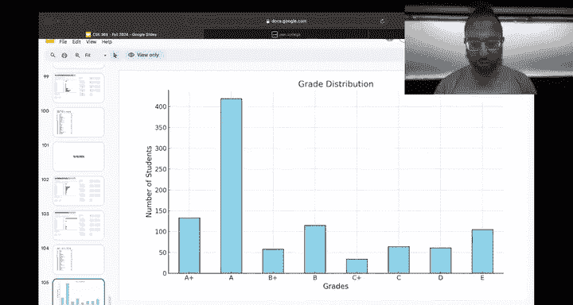
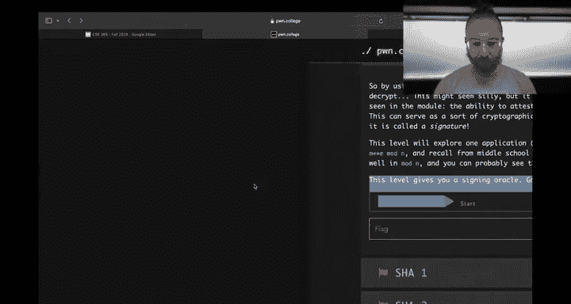
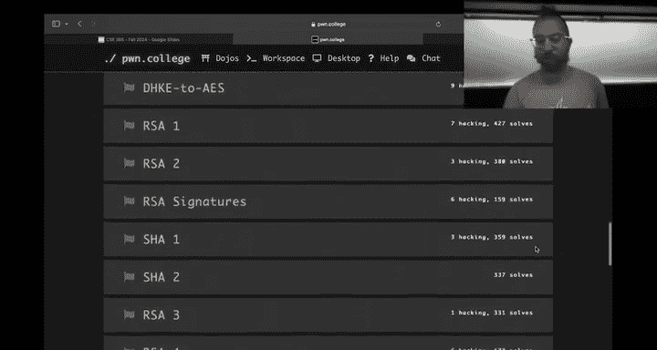
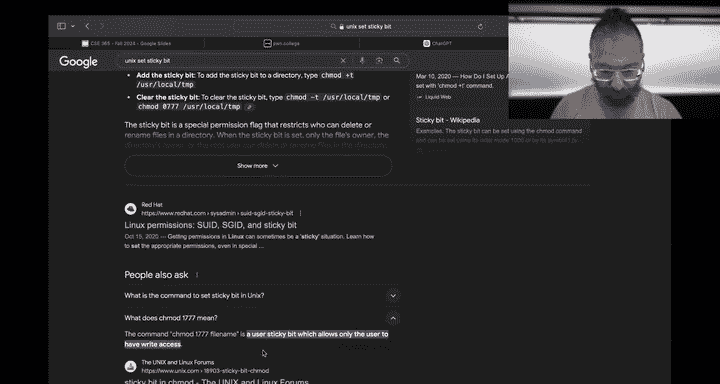
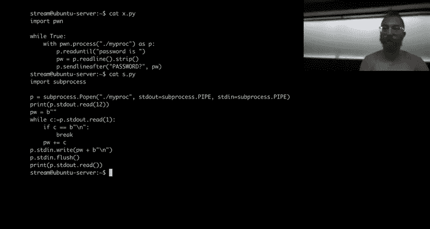

# ASU《网络安全导论｜ASU CSE365 Introduction to Cybersecurity Fall 2024》中英字幕deepseek翻译 - P16：-17-Access Control - CSE365 - Yan - 2024.10.16.zh_en - GPT中英字幕课程资源 - BV1nVCVY9Ehy

We'll deal with the slow animation。

Hopefully things work。Alright。Hello， hackers， it's a。Access control and cryptography time。

 which is actually kind of interesting the camera is not following。

Let's get it following gesture based cameras， awesome， okay。

It's an interesting combination because then you know， you have。

Clear connections between these two topics。 and maybe a more。

Strong way than in a similarly strong way as intercepting communications and cryptography。And so on。

 so hopefully everyone has had time to review the access control lectures by guest Professor Adam Dupe。

 he's our access control guy controls access to a lot of things。

 including some part of your grades now，And hopefully the material has been pretty approachable right。

 maybe even compared to previous things， speaking of this。

 so let's take a quick check in on how crypto is going it is going in this sort of inverse exponential over here。

 fashion。Crypto is definitely much harder than anticipated。 weve are always tweaking the modules。

 of course， in crypto we added a couple of extra。😊，Challenges this time and。

The difficulty is definitely there。 So 18 people saw the whole thing so far。 That's great。

Everyone else keep pushing the deadline is tomorrow night。So now is that final push。I guess。

If you've been procrastinating， you know， the procrastination is over anyways， but。系。

IThink it' would be difficult to。Go from here to solving crypto in， in。A day and a half。

 do you think you could do it？I mean all if I spend my entire time so Connor thinks that if he spends his entire time doing it。

 he could do it。All right， awesome， so so far we have most people with a 58% of challenges solved now if you solved the checkpoint。

 which mostly is in this module data encoding decoding。

 etc ceter and then some like crypto if you solve the checkpoint which 91% of is that the checkpoint on time or just checkpoint is just checkpoint。

 okay， well if you solve the crypto checkpoint。That's already 3% to your crypto grade that the median 38% completion of crypto of the module is due this minute and we're not going to make it do this minute。

 that would be a funny joke， but I won't even make the joke if it was due this minute with 3% of your grade or。

Three out of the 10 points， basically of your module grader determined by the checkpoint and the other and 38% of the other seven。

 you have over half of the。Of the points you're going to get from this module， but anyways。

 keep pushing and keep doing crypto access control， on the other hand。

 very few people have started it， the people who have started it have sped through it very。

 very quickly you can get 80 to 90% of access control done very straightforwardly。

 especially with the Linux luminarium。Under your belt and with the lectures。

 later on there is a challenge or a series of challenges that relies on automatic interaction with the challenges which we'll cover today。

 but access control should be。Kind of bit of a， of， of a。The straightforward for you guys， all right。

 let's look at u helpfulness now， why did this happen because we changed the way this was being calculated？

No， its the old way like just a total number of unfolds。 All right， so the tables are turning。

 so I am somehow managing to gain on Robwa。 This is， this is a maybe a。Example of work work smarter。

 not harder， Rob was on the Discord every hour of every day。

 only Hanto is more present than the Discord and Koak in fourth place on helpfulness and I turn in fifth place so great job I turn and obviously Hanto and everyone else keep keep zooming up there。

Do we oh， can Leus？Number 24th here for also we recognize。ASome of our brilliant Ts。Awesome， okay。

Anyways， let's roll on。How are people currently doing in the class。

 So if you haven't had one of these， we'll start having them more now that we have some amount of of。

modules under our belt， this is if the crypto module is due today right this is ignoring ignoring crypto and so ignoring crypto and access control。

Most people in the class are doing pretty well， we have a fail rate currently of about 15， maybe 17%。

A common fail rate at the 300 level is what like 30 so you know。

Things are seem to be progressing realize crypto is going to probably change this distribution significantly。

 but you know we'll see redo this graph again on Monday and see where they're at extra this also does include extra credit but we're about to launch a feature where we'll actually automatically pull in your meme and thanks extra credit so there's less ambiguity around that and maybe you could expand it actually to pull in the CTF extra credit as well and then that'll cover the majority of extra credits。

Okay。cool。Sounds great， any questions on this？Awesome， alright， while we are here， let's grab a。😊。

A scoreboard。

Of the whole class。And we'll see。I see who the crypto。Crypto super people are here。All right。

 we got shadow shadow immune sounds familiar They were on top of another score board recently wing deans black dog。

C， Steeed man。Great job and Navi ready， great job in the top five， and then if we scroll down。

 there's still three slots。Left in the top2 so you can。Have your。

呃。You can， you can。Soliify your glory。 What's interesting here is the lowest number of solved challenges。

56 here， but we only have 18 people that have solved 100%。 It depends on when they solve， yeah。

So it's okay， cool and overall scoreboard， if we go for how people are doing in the class all time。

Oh there shadow unitser。Better at crypto than than average thing when we got our our top five。

Eli allegedly reached Richard Shamune， Caden and。Specific， good job。

 And this is interesting in that only the。The top three is determined here。Yeah， on all time。

 so there's you can still get。Up there in the South five， okay。

What did I want to say about all this Oh yeah， if you don't want to show up on these scoreboards。

 you can go to settings。And change yourself to hidden visibility。

 and then you won't show up on scoreboards and won't it back to anything else。Okay。嗯。That's it。

 That's all the administrative stuff。 All right， just remember， crypto is due tomorrow night。

 access control is due Sunday night checkpoint of access control is the same time as the due date of access control and。

Yeah， that's it， okay。Let's talk about some access control concepts that are interesting that apply to modern world systems that we don't yet cover in in lectures or challenges necessarily。

 and then we'll also talk about。😡，The most complicated part of access control。

 which is interacting with。The challenge programs automatically。 Okay， just going use the stream。

From the beginning if that's okay。I so。Savior on a on a box here。 We all know that， you know， if you。

Create a file。It has some permissions。This as it's user readriable， group readriable。

And world readable， we can cut it out if we say， hey。

 we want to remove all permission from this file。We count it out。You get permission to nine。

 All right， everyone's on board here， right？Should be 100% reviews so far， perfect， all right now。

Let's make this root。Owned root and and and and group root owned。

 here's the file now F still permission denied， of course， if we say， okay。

 the file is readable again。 so this is a different type a way of specifying the。

Uh permissionermissions that you have learned in the lectures。

 the second or third lecture for this module， Linux luminarium。Taught you this style。

Of specifying them with symbolically with these letters and numerics。

Permissions Adam discussed in the lectures and youve practiced in the in the homework， All right。

So here we are。 The file is readable again。 Allright。

 awesome compared to showing off crazy crypto stuff or web wallss。 This is not。😊，Rocket science， yet。

 okay。Now a cool thing here。Is that if？We。s see， what order do you want to do this in。

 Let's make another。Let's bring this back to。Us。So this is now our file， okay？And at it。

 that's great。Again， we C H model to be。No permissions。Can't read it out， but。If we become rude？ops。

 we still have。No permissions。It's not even owned by us If someone else is filed with zero permissions。

 but。We can cat it。This is an interesting property of Linux。诶。Is it a Posseex property？Anyways。

It's an interesting property of Linux where root。Can basically override permissions checks。

For certain things and these things include reading files。They include。Writing files。

Even if the file has no read or write permissions and they include entering and listing directories。

 they don't include executing files。😡，嗯。I'm assuming as a safety precaution because if， you know。

 you could accidentally start executing randomifiess route， that's not great。

 but reading and writing。I'm actually a little bit surprised。

From a security design perspective that root is allowed to override， override the right permissions。

 That seems like a safety issue as well， right， because if you。you know。

 trickrick a process that runs us route into writing random files that we had an infrastructure level of vulnerability just recently where people could escalate privileges on every challenge in Po College as long as they could trick a challenge to writing to a directory okay。

So T LDR， Ru gets to。Override file permissions。Super interesting。 How does this work， Well。

 it used to be in the old， old old days。That in the Linux kernel somewhere and the Linux kernel is open source。

 you can look up the source code to the Linux kernel used to be that there was just a check somewhere if the user ID was zero。

 just return that， yeah， you have access to this resource。😡，That's not the case anymore。

 I'm pulling this number。Out of my head just based on vague recollections。

 but somewhere like in the late 2000s。Linuxin moved to this capability model even before that。

 actually， probably in the mid 2000 anyways。What every process。Has a set of capabilities。

That allow it to do various things。 Set up network you might have seen in the network module。

 Do you have anywhere we mentioned cap net， Yeah， so that all these cap underscore in in in all caps。

 These are capabilities。 These are properties of a process that granted special access to certain resources。

 and you can。Get the capabilities of your process using get caps。And。

If you recall from Linux luminarium， every process as a process ID。

 our shells process ID is stored in this special dollar sign variable。So if you get。Cas。

 dollar signed。 we can see。That we have no capabilities。Why。We should have。

Tack override capabilities。就是。So， as usual， we。Are demoing something that's so basic that we don't need to practice and it turns out that we need it to practice all right。

Okay。Current， nothing。We are rudes。So these are all of the possible capabilities that we could have。

This is the capability that we're interested in capability of。Data access control override。

Why is it not showing up。It is is the。One second。When we are confused here， of course， we can go to。

Oh my God， Yeah， now I'm getting the the lag and yourre。We're using Mac Ester stream。

 it's not as turnkey and reliable as Linux but。It happens sometimes， okay。Let's do this。

 Here we are now。Cus H。Okay。Let's。So ease。The eagle二。help。よ。Is it。Yeah。

But we should have all of these capabilities right now， right？What is the cat process status。

Let's go straight to the source。Yeah。Okay。Yeah。We should have all these capabilities， right？Okay。

Yeah， we don't have these capabilities in。In our user shell， Yeah， yeah yeah。

There's irrelevant stuff that。It becomes relevant， okay？So we printed out current equals Ep。

 What do we do when we have a brain dot， we go to Google？And we type in。

And I'm going to claim we meant to do all of this confusion stuff so that you can see how to figure this out。

 but you know， don't listen， don't believe that what is EP in CA H？All right。

If the process set shows equals EP， that means that has all the capabilities to the bounding set。

Awesome， okay。

Let's go a little deeper into stack overflow。😡，This is looking ahead。E is effective。 What is P。

 P is permitted， permitted， okay。Awesome。Cilities are put put in the permitted set and all permitted capabilities will be copied to the effective set。

 So this is。mIn the。

啊。Are we still streaming I might have fucked there something nope， you're still streaming， okay？ok。

 in the诶诶。这。It。In the lectures， Adam discussed something called roll based access control。 right。

 Do you remember the lattice with the whole thing。This。Similar。

 that same theory is being used here in Linux capabilities。Right， in where。

We have a set of all potential capabilities。A set of capabilities that a process is allowed。😡。

To take on and then a set of capabilities。That the process does take on。And in this case。

 going back to the sources。Each capability is a bit in in in。In this field。

 is that actually that's a lot of capabilities， that's not？Okay， yeah， yeah， yeah。

 And then the capabilities that we are permitted to have is。

But our process permit to have bits in this field and the capabilities that we have are bits in this field。

 okay？This。Is a bit of a。Bross her situation looking at an interactive shell of a user。

 But the interesting thing about Linux' capabilities。Is that they actually live。Not just on users。

 but they can be granted。To processes spun off launched using specific files。 So for example。

Going back to my user。I don't have the ability to read this file， but if I。Copy in。Then cat， right？

Cat is just the program that cats files that I've been using this whole time。

 It doesn't have the permissions。Of course， the file has no permissions。

 but what we can actually do in Linux。Which is pretty cool。Is。Something you're used to。

 Let's start with that。 We can tell Ka that， hey， you're running。Yeah。

You're going to run as when I launch you as whatever。User owns the process。

 This doesn't help us because stream owns the process。 But then if we。Make cat owned by route。

And reapply that saiduid bit， which is removed as a precaution when ownership changes。Now。

 when CAD runs， it'll run as root。And now， we can override。The data access controls again， okay。But。

😡，Running things as root is dangerous。 It's the violation of the security boundary that that you implicitly do every time you interact with the challenge。

 the reason that our challenges can read the flag whereas your normal user shell cannot as the flags unreadable by root and the challenge are set you ID root。

 So when you run them， they run as root just like cat in this case。So。You you you don't。

Always want to send you ID everything that needs some special access to the system。So let's back up。

嗯。Weve reset cat back to being owned by us， Cat once again cannot read my file。

 but what's really cool。Is we can actually set the data access control overriide capability onto CA itself。

😡，And now。We're going to fumble a little bit with this and。

Learn what how to make this work so we have a couple of there's the set cap utility that will do this for us。

😡，We can have。We have to specify the file name。Okay， that's great then。

We can specify a bunch of capabilities。So cab decked override。And of course。

 this has to be done as root because it it itself needs some capabilities to do。

Let's see if this works In valid argument。 We need to。Yeah。Maybe it's the other way。Oh yeah。

 it the capability and then the file。Invalid argument。Said cap。

Capabilityities specify the form described in cap from text。Maybe we。I mean。

 my guess is CA underscore is going to be take okay， then mine move recapability text cap。

What what does cap H does suggests to here？Dash dash suggest。Search CA descriptions for text， okay。

Okay， now here it is cap。Dack override。See， it has。

This capability caback override is this this bit in the capability bit mask。Very cool stuff。

Can we just use CAs H？Now this is， okay， what is？I mean， this is fine， we can， all right。ち。Dash。

R dash or the caps list。nameAll right， let's just check it out。Set cap。Uage example。

Plus， okay。Plus okay， here we go。So that's。Oh my god。I clicked something。This， this。

This Mac OS stuff is a meme。What do you want to do with CaD override here we're just specifying it？

What we actually want to do is， hey， and actually if we don't want my file， we want cat。

If you want to say。Add this capability。And the into the effective list。The inherited list。

 there is our capability being passed on to children going to actually care about that for cat and the permitted list。

Right。For cat。 So if we do that success and now。Cat is just a normal file。We run cat。On the flag。

And even though the flag。Or even though our file that we're reading has no read permissions。

 we as a user can override these permissions。😡，So we have granted。To the cat program some。

Additional permissions that our user doesn't have。That the。Original copy of the CAT program。

 for example， doesn't have。But this one does。And this is cool。 So we， we've granted that to。Um。

 the effective and the permitted。St。Right， we can also instead。Just grant it to the permitted set。

And actually， first we need to probably。Zero out all the capabilities， and then I we do。Yeah。

 so it only has it now in the permitted set。And now， if he tried to run it。

We have a permission to not because。Cat。😡，Yeah。Doesn't have it as an effective capability only as a permitted capability。

And from there。Cat itself can。我。Grant itself the effects of capability when it wants to use it as a sort of security measure。

 right， so it can adopt the role or not adopt the role。 Likewise， we can grant an inheritable。

Property。Of DAC override。And。In this case， cat can give its children。Its child processes。

 permissions。Permission the capabilities of D over， right。

 which is also useful in certain contexts Now this is。I like you might say， okay， well。

 why do we really care about this， Well you can use this to build very cool systems。

 You can use this to create a program that can run as a user。

 but interact with funky stuff with networks。Or funky stuff with other Linux。

Craaziness such as namespaces and so on。 These capabilities are。Kind of an an interesting。

Roole based access control measure in the Linux kernel that that people really know very little about。

 They know that， hey， when I'm Ruth， I can read any file， but they don't know how。 And this is how。

Now files on the system that have capabilities granted to them。

Are there any files actually It's an interesting question。 So let's， let's script to this。

 let's just do getcap， everything in user bin。 Okay， ping。Ping， you can be a user。

But still paying Googleo。com。Okay， and that makes sense， right， Of course we should be able to pay。

Might have pg in the。What's it called in the intercepttic communication module？That's great。But。

 it used to be。Back in the day， that ping。Was a set UID binary。

 and now it's not Now it just needs the capabilities to be able to talk over the network in a way that's not TCT or UDgi。

😡，Which is， let me think about if this accurate more or less。

 the only way that you can talk over the network as a user process。

 typically or the non-root process Now to talk ICmpP， which is the protocol used by Ping。

 you need to be you need to have the cat cap net raw capability。 and in fact。

 if there is a security vulnerability in ping。As a result of this cabinet raw， is this true。

 would you be able to sniff traffic or do you need net admin？Andan admin， okay。

 but you'd be able to craft arbitrary network packets you'd be able to apoof all of this fun stuff if you could take over ping as a through some some bug。

 but you couldn't read arbitrary files， but you couldn't read arbitrary files because unlike back in you know。

 my days when I was hacking ping I wasn't hacking ping， but back in my days， you could。Use ping to。

And。You know， if if you took ping over somehow， you could use it to readoc fs， et cea。Okay嗯。😊。

A coupleup of things I wanted to cover， other interesting Linux shenanigan。

 you recall the concept of a file descriptor from a number of modules now。

 but including the Linux luminium originally， where you were Linux files you were passing Linux file descriptor between Pro redirecting you know filescriptor one。

 standard out to standard error， ceter cetera， an interesting thing with Linux。😡。

Is that it applies permission checks generally once when you first access the resource。Once you have。

 for example， opened the resource for reading。😡，The resources always opened for reading。

 So let me show you something interesting here。We're going to。Make this。 How do I。Okay， let's do。

 oh no。I made a terrible mistake。We need I need a second a， I'm just going to see like this。I don't。

 do we have cream。Yes。To， I remember how to do vertical splits。Okay。全。

So now we have two terminals here in one terminal。Going to look at my my file and run up。

Run an ipyython version here。嗯。😊，Here we are an I Python。Here we are。

The machine line driven the cameras in the top。Camers in upgrade。 Thank you。

 So here we are with the file。I can cad the file right now。And if I， I can， of course。Open。

The file in Python。If I can type。And all is good， right？Can read it， awesome。Allright。

Once I open the file。It's too late for me to protect this file。 If I see H mod de 0，0。

Can we shrink this a little bit so that we fit on？There we go。 if I C H mod 0，00， my file here。

I can't cat it anymore， oops， shit。Oh， my god。I think I oh， it's back， okay。

 see this my screen is good， it comes back after after a disaster like that。

We're just gonna reset the terminal， don't cat randomom divide to your terminal， Okay。

 I can't cat it out anymore， but since I've already opened it despite the fact。That it is。

No longer readable， I can read it just fine。Access control checks are performed when opening a resource once a file descriptor is open。

It's too late to kind of。诶。Fox is in the hen house or whatever scenario applies all right。

 this is something very interesting because it also applies to directories。Right， so the。呃。

The read the executable permission of a directory controls what users can enter into it。

 The read permission of directory controls what users can。And。

list it and so if I enter this directory and then I create a sub。给。I can， you know。

 and then I move my file into here。This is all very cool。All right， if I C H mod 0，0 to0。

 this directory and I try to do。Ft out the file， I can't。 I can't enter that direction anymore。哎。

But if I。A， fuck。If I Cd into this directory and into the subdirecty of it。And then。是这样。Okay。

 I'm in the directory and subdirecty。And then， if I。C Hma 0，0，0， D。I am still here。

 and I can still operate。Despite the fact that I can no longer get into this directory from another process。

I am perfectly happily。Messing around。Writing files。Canning flags。And so on。

In a subdirecty of that directory。Now， I can't do this。I can't enter the directory any。

 That'll tell you permission denied。But I no longer need to。Because I'm already there。

Very cool another interesting。😊，Qurk of Linux is filed permission。

Structures that that that's separate conceptually is the fact that。In order to。Mass with a directory。

Okay。Like to create files in a directory， to rename them in that directory。

 I need right permission to the directory。 The interesting thing is that I don't need right permissions to the file。

And so if I create a file。Let's say in this subdirectory。I have two files here。 I have one file here。

All right， I can。Make this file completely unreadable， but I can still mess with it。

 I can still move it around。Because。I have right access to the directory itself。

And you can think of situations where this might be a security disaster。Such as shared directories。

Right， like the TM directory。The T directory has。U filesileles。

From Connor's account has files from SA's account， has files from the stream account。

And if I could just go in there。And。好。Rename。One of Sam's accounts。This is my or one of Sam's files。

That。A。Another process one of SA's processes is using and then SA's process goes to read that file and reads the。

File that iron moved into its place that could be very bad。So I can move my files。

Let's try to see what happens when I move some of SA's files。So I'm going to move Sam's Tms。

Operation not permitted。How， why。I can move my files。 Why can't I move Sams And， then。

 and let me just prove to you that normally speaking。In this case， here， I could。

wn move someone else's files。I DF is now owned by Ruth。

 but since I have right access to the directory， I can move it around just five。

I've actually used this to root systems。😡，That I was permitted to root in real world environments。

 in real corporate networks。It's these vulnerabilities are very， very real。But this doesn't work。

 and the reason it doesn't moving SAs file in sTamp sTamp is special。😡，Slash Tamp。

Has this little tea。Here。A T is a flag in a directory。That's the sticky bit。

That means that even if you have right access to the directory。

 you can only mess with your own clients。Not other peoples。And actually。

 Dc override doesn't even override this for some reason， but if I。

Have this situation here where right now my user can overwride or move around rename roots files。

 or I can delete this file if I wanted to。😡，If I apply。I'm just going to try to do this symbolically。

If I apply the sticky bit onto the directory。嗯。그。I did something wrong。To just a user。W。Yeah。ok。

Now we're going to Google for。No shame and Googling for everything。

But the owner director can override it。嗯。But see how to。So first。

 let's say figure out how to set the sticky bit。Tma T。That was an AI summary。

 so let's Nancy see Hman to confirm that。Yeah。I mean， let's just try it， I guess。

Doesn't seem to have said the sticky bit。Yeah。1。7，7，7， Okay， user sticky bit， which allows。

Only the user to have right access， okay？

So numerically four，7，7 or four。And， and the， that extra3 bits is。

The C U ID bit one is the sticky bit。Okay， now is this， I can still override it。

 so let's actually see。Test Connor's hypothesis。So here's the directory my subder is fully is owned by root。

 but is ridriable by everyone， so I can still do this。😡，Awesome。

And now I'm going to add the sticky bit to it。Yeah。And I can't。 Okay， so the user will rise it。

Learn something new every day， I am sure that I've had that in my head before and it has fallen out okay。

What else？Let's spend the last 25 minutes talking about poll tools unless there are any questions about Linux access control。

Mechanisms。Im swear wondering。他。But。All right， there was a question about the padding Oracle attacks now。

 we we went through the padding workacle attack last Wednesday， right？Did you watch that stream。

 or you were here？Okay， we'll take that one offline，'ll do。Right now we'll do the pawn tool stuff。

All right， let's dive in， who here's been using p tools？All right。So。Hopefully。We。Can。Clear up any。

 any craziness Home tools that， I it in the reos for some reason， Yeah， no， Python 3。On to。It's fine。

What box。As long as you stick to a， nothing can go wrong。Obviously。

 all of this is already installed in the Dojo。Okay。要。Pone tools。Actually。

 let's run this from Python P tools allow you to interact with processes， right？

You can use it a number of ways people sometimes do this， I hate this， so I do this。

 but you can do whateveryon whatever you feel console with with Python。

Poone tools allows you to start processes， read from processes， write to processes。

 and I wanted to point out a couple of things here so first。You can launch a process， right。

 and you can launch a process by。Sayingum。We're going to create that in a second。this is all review。

You run this and says okay。What syntax there？Op。Let's just manually run this in Python。So here we go。

Okay。Boom， the process doesn't exist。Okay， that's fine， we're going to create it。给。

Here's the process。Hello， and now we can run our。Boom， all right。

 we launch the process and what the number one issue one of the top issues people have with phone tools is they launch the process。

 they do start with the process and then the Pyon interpreter。The Python script is done。

 The interpreter terminates and kills the process， and they didn't get what they needed out of the process。

 A good example is。嗯。You know， it does something and then it， you know。

 sleeps for 10 seconds and then it does something else and。You know， the launch。This guy， and。

You can see this was a lot faster than 10 seconds。 All right。

 so now we can do stuff like wait on the process。Wait for it to terminate。

Very helpful this will take about 10 seconds you can do stuff like read everything that the process has to offer。

And let's change the 10 to one。And now it'll read and it'll actually wait until the process is gone。

 boom。Versus we can just say read one line。Who versus we can say if the process is a little more complex。

嗯。可以。Read。There's again， common thing you read one line， you forget to do stuff with it。

 your process terminates and you're kind of out of the game。You can。Going into interactive mode。

Where it'll drop you in。Boom， now you're interacting with the process， what is your name yawn。

 and then in a minute says hello Yn and exits cool。Okay。Now， what if over here we do read all？

We're waiting for the process to goes all of its data。

And we're waiting and we're waiting and we received 21 bytes of some shit and and the process is interinating because it's waiting for input。

 we didn't sc that And this is all very frustrating P tools。

It gives us some nice capabilities to easily add debugging if you just add。

Debug in all caps to the command line， andvocation of your script。

It actually will print out what it received。 And you can see at a glance。 Oh。

 that's what's going wrong。 It's waiting for input。Right， so now。We'll do this。Then we can say。

 you can send line。Yeah。Yon。And it's better to stick to bys or strings。 And then we can。

Ped that read all。Okay， and let we run this go debugging boom。It all works， okay。

I oftentimes unless there is an absolutely unmanageable amount of debug output。

I mostly run my tools with debug。Just to get that output。So that if something goes wrong。

I don't have to deal with it。Or。If。You know， you actually solved the challenge。

 but you forget to print the flag。Right this， do we have a fake flag in here？No哎。

This happens to me so depressingly much。 I once lost an exploit race against fish。

The one of my colleagues here because。I literally didn't print out the flag and in between running that the first time and the second time they solve the challenge because he was smart enough to monitor the network traffic so he didn't have to print out the flag all right anyways。

Here we're going to see。嗯。Okay， if my name is Jan here。It'll give me the flag。And in this x pi。I。

 if I do this， I just print the next line。I don't。Gaded the flag。And even if I。

I careful and wait for the project to finish， or I might do this and forget to print it。

 and it's just all very， very frustrating。 Allright， if I do debug， I don't miss this stuff。Boom。

 as a matter of course， I have the flag here and you know what， if something goes wrong。

 I can see it going wrong right away。Awesome。Okay。Another thing。That often happens with poem tools。

 is you。Leave this out by accident。If all I had was this， debug wouldn't help me at all。

Because I don't even ever see it receiving。Anything here。

 so oftentimes what I do when I'm writing phone tools script is I add a flush。sorryrry， a clean。

This will clean the pipe。It'll listen for anything that's still left over。And discard it。 Well。

 it returns it from the function。 But otherwise， if you don't save it off， it discards it。

 Do you do a clean。You can often catch with debugging mode on weird issues where there's data that you're not reading afterwards。

Save could in certain situations save you hours of banging your head against the wall。Yeah。😊，Um。

 the other thing。Is obviously all these reads are returning data if we start。

Complicating things a bit。Echo password is。You'll have a P variable here。That would be random。

What is the password？你。We'll read by default， read。嗯。Creates an input variable， nope。

 an input variable， nope， a apply variable。Yes。Okay， so we see if the。Reply is the password。

AndCa the flag。So if we do 28，812， boom， the fls catted， awesome， okay。Now。

 interacting with this automatically is more complicated。So， we need to。诶。We could， for example。

Read the line。And then， split it。And then take the last。Argument。That's our password。

Too many and then print it， let's try this。Yeah。Yep， that take gets a password for us。That's cool。

 And then we。Sendline that password。And then we read the rest and we're golden set for oops。

 I forgot to print it out。 that's annoying。 Hey here we go debug works all right。So this works。

And it works because there is a predictable amount of spaces and whatever。That。

Home toolss way to do this。That handles more complex situations is we first discard。Everything。

 all text until。The word is space。can。And then we can just read the rest of the line。

Striip out the new line and that'll be our password。And this works great， too。 It reads this。First。

We can print it out so you can see it。So it read the password or password is space。

 and then it read the last thing。9。All right， now。I think the Pos way to do it is readline after。

 So Po has lots of functions。 Yeah， Po has a lot of Yeah， there's like readline after it。

 let's try it。 Okay， read line under or just just after read line after。😊，Password is。

And then we strip it just in case and let's see what happens here。

Sandline after there's no red line after。Yeah， right。So but but this is interesting we can。

Go back to our working solution without the memes here。Read until。Password is。

 then you read the password。 And then we can， if you want to wait to send at the right time， it will。

Ask what is the password？So， if we say。So wait until it ask us for the password and then sell it the password。

And boom， in this case， it doesn't really matter。The program is simple， in complex cases。

 it can matter。嗯。Now。Failure mode， You typo this。Bom， pass rod equals。

 You run this thing without debugging it infuriating。 It's terrible。😡，It's going to drive you crazy。

 it can take you hours to realize you typo the stupid word。It has， I've been there， it suck。

Hard to say how to avoid it debug definitely helps。

 You can at least say what's the latest thing that my program sent to me。

And then you can kind of see， okay， cross correlate this to your script。

 What is your script doing at the time and realize what was going on。

 Do you know how I solve these issues。Print afterbuging。嗯。Booom， I know after A。The fact。

And so I can go over here and I know it's here， the other way you can do it。That's less insane。

If you run this in I in I Python。It has a dash dash Pdb flag。

That means when you hit control C instead of killing the script it drops you into a debugger now this debugger is inside Plib。

 that's kind of annoying you need to learn how to use the Python debugger。

 but it is eminently usable， you can walk back up the stack。

 or actually if you just do back choice as's too nice you can walk all the way up the stack。

To see where you are in your process and you can see exactly what read until is hanging。Very。

 very useful。Alternatively， even without that。If you do this and you hit control C。

 here's the stack race。Here is。Going all the way up here。 here's whats what's failing。

It's not always so simple to see what's going on from there。For example， you might have。

 I mean they're just complex scenarios where print debugging is still something that you want to do。

 I do quite a lot of it。Um what time is it， we have seven more minutes so pontchoos this should be enough。

For you to use phone tools to interact with these things， but you don't have to use phone tools。You。

 oh， wait， one more thing I want to， to do。 If you do this in a。Rll here。

Let's say we just keep going。And you are， don't carefully clean up。You can run into a situation。

Where let's remove that sleep from my progue。 Oh， it doesn't exist。Oh yeah。That was this。

This is hanging on purpose。You can easily run into a situation where you're creating too many processes and you're not waiting to clean up it can be a disaster。

 there are two ways to avoid this。You can wait on your process。Which waits for it to finish。

 so you are not spamming the system with processes。You can kill the process。Which。Also kills it。

 or you can use Pythons built in。With。Statement， this opens a resource。

Lets you interact with it and when you leave this block， it'll close the resource clearly。

Pong collar P College P tool supports that functionality as well。

That's probably all you need for this module in P tools。

 you don't need to use P tools in this module， I'd recommend it。😡。

Because it is good for the rest of the course。But you can use a different。嗯。

Python P tools is a hacker library， it's all very hip and awesome。

 but like it is specifically most used in cybersecurity context subproces is the built in Python library for dealing with subprosses and the way that and P tools use subpros under the hood the way that you launch a process with subprocess is using P open。

Um， you can launch your my Proc and I'll show you how this failed and then of course。

 I'll show you how this fails。It doesn't。It doesn't fail。Oh， I guess that okay。Yeah， anyways。

 you launch your process？And then one thing that you might have noticed is the process started sing output right into our terminal rather than into the Python grid。

 So now you need to。Do complex stuff。 not complex stuff。 You need to explicitly redirect output。

This is a special placeholder value that says create a new。Pippe for me to interact with。

 pipe this into。Into Python basically where or into a file I can access from Python。

 it becomes SDD out and you can read from it here。Okay， now what's going on。

 Why is Reed not returning？Because it is trying to read。This print something， right？Well。

This is why phonee tools is created， it's annoying things like that。

 so let's limit our read to some amount of bytes yeah。So。Let's all， okay， let's。Say， we read。그。是。

So you have to read 12 bytes because it was trying to read until there's no more to read。

That's like a read allll， of course， it was hanging because the process is waiting for input。

 So now we manually have to read out 12 bytes， and then we have to build a string。

The password string。Reading one character at a time。Until you have it a new line。Okay。

 and now we can at least print the password out。What？Why didn't it like that？

All only concatenate string， okay。These have to be bites。It Python 3 with this string。 Okay。

 so we can get the password。 And now we can do。P。 SCdN that right。

 so we write into the process standard in this password。And since we don't have a send line。

 we need to add a new line。停。booom。Non type SDDN is none。 Why。 well， we， we didn't intentionally。

Explicitly， say， readdirectact asian。So we also need to do that。

So you can see this is getting annoying。Okay， now we。

 it doesn't automatically converge strings and bytes。 now we as okay， this is bites。 This is bytes。

 Okay， boom， password。 and then we S to get out that read the rest。Run this。Pe that SDD out。

 not the password， the process， all right。We're hung。 Why the hell are we hung？No one knows。

And there's no debugability。So this gets very， very annoying， but you can't use it。

 We're hung in this case。Because。I sent。Well， that shouldn't matter。 One thing that I did。

 I sent the string P W instead of the variable P W。A have you still hung， you're still hung？I mean。

 let's read out some bytes instead。唉。Okay， let's wait on this guy。What's going on here， it reads。

Maybe we didn't flush， I it possible that we didn't flush？Yes， because we didn't flush。

You have to buffer the read， you have to flush the re， Otherwise it sits in a buffer。

 It's just really annoying。To use sub processces。For this sort of one off arbitrary interactions。

 I highly recommend using poll tools。Look at this comparison。 Here is。The Pon toolss version。

Here's the sub processces version I'm not I not， they're not equivalent script。

 but as you saw sub processces。More complex。No deba I。 It， is it。It's built for a different purpose。

No debug ability， et cetera， All right， any final questions？All right。Go forth。

 finish Crypton access control， and we'll see you next week for Comp 101。

Goodbye。