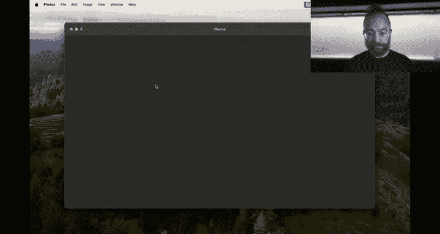
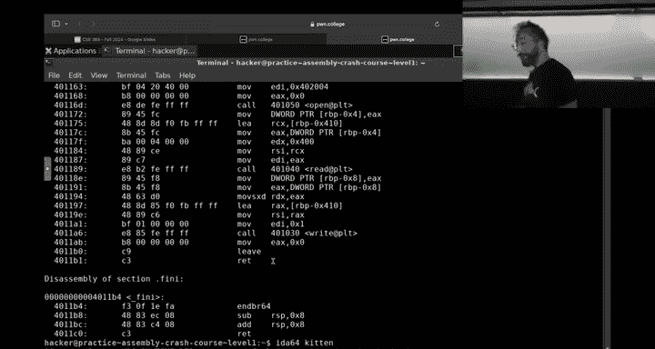

# ASU《网络安全导论｜ASU CSE365 Introduction to Cybersecurity Fall 2024》中英字幕deepseek翻译 - P17：-18-Computing 101 - CSE365 - Yan - 2024.10.21.zh_en - GPT中英字幕课程资源 - BV1nVCVY9Ehy

Let's switch over to wait。It was smooth I did We'll see it all work done all right。

We are now in a brilliant new week of。U。Compututering 101。

 So let's let's take a quick look back where where we just came from。

Starting with how cryptography went， I think the TLDR is it it went。

 it could have gone a little better。Definitely as we。Refreshed the modules， maybe we overshot here。

 the median grade was a 54， but the nice thing is the majority of the students hit the checkpoint。

 the vast， vast majority。 so 93% of you。Hit the checkpoint。

 likely then the median actual grade out of the 10% that this module is of your grade is closer to7 and a half or something。

 which I guess is actually not bad， bad thinking about it that way。

 but definitely on the harder side or what is expected we have some good idea well release the survey soon hopefully that will give us more ideas to improve that。

Approachability in the future。 but you can see this。This kind of bell curve over here。So。

It's a module， all right， who loved cryptography？All， who I hated cryptography。All right。

 most of the hands for those at home。 Yeah， most of the hands hated cryptography， but that's okay。

 it cryptography truly is the type2 fun， right， this most of this classes type2 fun。

 type  one fun is the fun that you know， you're having while you're having it。

 type 2 fun is when you。😊，You don't know that you're having fun until you look back on it later。

While it's happening might not be so fun。 So crypto definitely type2 fun。

 The camera is not following me。 Let's try to get it to follow me， awesome。😊，There we go， okay。

Alright， so that's crypto。 definitely overshot on the difficulty level。

 or maybe the approachability level。 Maybe we've been talking about， okay。

 maybe we remove base 64 from this。 Maybe we make reimplement this， not in Python anyways。

 There's a lot of different different options。 TLDR， though， for this。Semester。

 we're going to change the late penalty of crypto from you get 50% credit to 75% credit。

That's through the day that grades are due， which is the 16th of December。

 so if you have some spare time and you want to revisit some crypto， please revisit the crypto。

It'll still be worth it in a lot of ways。 So if you do。

 if you hit the checkpoint and then did did the rest of crypto wait with this。

 you'd still get a pretty reasonable amount of points on that。 All right， that's crypto。

 How did access control go， which was due on Sunday。 access control went very， very。

 very differently。 the median。Score and access control of 94。

74 so that's everything but level 19 that was the median performance on it oh pretty good yeah great job on access control a very different curve here of course access control is way。

 way， way too easy we have ideas to rectify that as well for next semester and to get everyone learning a little bit more things all right。

Questions on that。Sweet。I don't think my。Chat has actually loaded on twitchwitch。

 unless no one's chatting。It's just possible， oh， there we go。Okay， cool so。Yeah。是。

Let's roll onwards， okay with that out of the way how are people doing in general on this the current grade distribution by percent in the class。

 you can see at the is that blue on the right that is passing at the blue there is people that are passing the course that is a C minus or above。

 I guess there' is no c minus a C or above and then on the left of that the yellow green is yellow is people that are not passing the course。

And you see we have the left side of a bell curve right。

 and the height of that bell curve is probably around 95。

 so this tells me that maybe the glass is a little too easy。What do you think。mabe。

Make things a little more challenging， so that the。

Hide of that bell curve is right around a solid bee。是。All right， people are saying no。 All right。

 anyways。m， but it is somewhere in a reasonable spot， there's definitely a hard class。

 but people are u doing fairly well。If we look at it from just the letter grades and the left there。

 on the right， we have a failing rate of about。Probably 16， 17%， that's D and E altogether， which is。

Somewhat within an expected range for a third year course and then。嗯。

We have a good distribution of people getting A's， B's and C's so pretty and all of this is still without extra credit Yeah and this is still without extra credit applied。

 which we are working on automating the application of soon。诶。Yeah。Oh嗯。

The chat doesn't refresh completely。That's weird， okay， awesome。All right， and then we of course。

 have the helpfulness battle that Hzhou continues to dominate。Robob and then me and Connor。

Poining the way forward there and then shout ask you iron biting the bits and Chapt on user name 1337。

 specify cool Wolfy 96 many of those names are new on the leader board here。

 good extra credit and good good helpfulness， thank you。And with that。

 we're moving on to computing 101。

Computing 1，01 has。Basically absorbed all of our introductory。Material to。To assembly。

 to how your computer more or less truly works on the inside， how the programs are actually running。

 etc。This is stuff that ideally you learn before hitting this class in computer organization。

 but there are a couple of problems with that that hope and they kind of conspire together to make it so that we have to give you a crash course into computer organization in this class before hitting the rest of the material。

 So the rest of the year is going to be。诶。Pushing through。Computer organization。

 basically assembly and so on and then。Going into reverse engineering of software。

 going into exploiting memory errors， and then putting everything all together。

 everything is so far in the class。Um， to really pull off some awesome hacks。嗯。Cool， any questions。

All right， so let me show you did we added it to the class itself yet all right。

 we'll add this to the class itself shortly so it'll show up over here， but for now。

You can grab it。Over here， Comp 101 at the top of the page， this is if you click on Dojos。

 Comp 101 and Comp 101 has six modules。😡，The first three。

Get you through writing your very first assembly program and we're going to actually tackle one of these just to show you how to interact with these challenges。

😡，唉。Assembly Cr courseur goes into a bunch of different scenarios。

 different assembly instructions that you'll practice。

 different types of logic you might implement with assembly debugging refresher will show you how to debug your assembly code when it goes wrong。

And building a web server is a。Awesome end to end projects where you will actually build a web server if in your assembly。

 that'll allow you to serve up pages that you。are kind of well familiar with the Python equivalentvalence of。

This is all computing one to one。Over the next two weeks， we'll tackle all of these。

The checkpoint is on Sunday。And then we'll go on from there。

 The checkpoint for these 65 challenges is at 20。How many 21 sound like 21？That'll get you through。

Into assembly crash course， my advice is to push us far in as possible on the checkpoint because。

These are。Especially later on， not easy concepts， like。诶That都。

We give you two weeks to work on this and most people they rush through the check when they ignored until the final weekend。

 that's going to work about as badly here as it did in crypto。Um， so please don't uh。Push it back。

 okay。Questions on this assignment， before we move。Into actually messing with assembly。All right。

Okay， let's get into some assembly stuff， why is switchwitch not working well？

Once that let me restart my。Twitch chat here。All right， I think this should be organ。Yeah。Now。

 I can at least。See if reasonably， okay， awesome。😊，Soum。Let's dive in， grab our first program。

 first of all， please， I'm going to not cover the concepts in these lectures。

 please go through and catch up on all of the lectures。😡，Starting from your first program。

And going through all of them， there's， you know， some of these lectures are attached to more than one module。

 watch all the lectures in all the modules。😡，It'll really， really， really help you there are。

Probably about 12 mini lectures in total， each of which is how long is this one。 Yeah，13 minutes。

10 to 13 minutes long。 So please watch all the lectures， okay。Let's dive in。

 So if you're going to dive in to setting our first register。

There's a lot of good documentation and information for you to go through， don't ignore that either。

What's the our special demo guy？Nice， awesome， all。Hopefully stole the camera now， it's good。Okay。

 so。Let's learn about assembly。We're all familiar。With CAD slash flag， right。

 let's make the flag readable in practice mode。Cas slash flag。Reads the fl， red cat。

Is a program that。This what might be your favorite program， who hears favorite program is cat？

One person， All right， too， Okay， we got some cat fans。啊。Because， you know。

 eventually you do cat flag and you get the flag， but what actually happens？With cat flag。

 what is cat， Well， one way to implement cat。Because you've all been writing Python script as let's implement it in Python。

嗯。It's。If we import this to get at arguments and well just implement a very simple one。

And we'll print open system our A one。Go readed。 and we got a cat。And we should。Actually。

R make it runable。Okay， we can run Cad。t pie slash flag and we're good to go here as well， awesome。

 okay。So that's one way to implement CA。But what does all this actually do at the end of the day。

 right at the end of the day。CD talks to our operating system。It asks the operating system， hey。

 please open this file。不意。Write this file to the terminal， write this。

Please give me the content of the file， please write this data to the terminal and you can actually see interactions between the operating system。

And the program。If we use something called esrays。Right， an asteriskts here。

You can see all the interactions。That cat。Has with the operating system and it's a bunch of stuff。

 But if you scroll all the way down， we can see something really。Nice here's open。Says hey。

 please open slash flag in read only mode。And then it opens it。 and then says， hey， let's read。

From the flag and then this is what it actually ended up reading。 and then it says， hey。

 please write。This these contents， and here is that data up appearing。Very cool， so。

Kat talks to the operating system using something called System called。

 you'll learn a lot about these in this module。But what does it actually do。

 What's the internal logic Now we've talked about the external interface between cat and the world is the system calls that it uses to talk to the Linux operating system with。

 but what about inside cat？Well， inside cat， just like inside you all is。

A big hodgepodge of organs and stuff inside cat。It's a bunch of computer instructions。

It's all computer code。And we can look at it。We can do this。Whoops。And actually。Well， yes。

Let's do this。We will disassemble cat。Into his constituent instructions and print them out。

And now we can actually start seeing what is cat， This cat as a as a program。

 even though it's very simple。 it just。Print files to standard out。 It's actually pretty complex。

 There's a lot of instructions here， right。So let's write our own cat， not in Python， but in C。

It's a little u。Should we write our ownca and see let's yeah， let's do it， you're right。

What are you afraid of？Okay。Here we go writing it in C， who here has ridden C before？Perfect。

 allright， almost everybody， I don't have to teach you guys see。 Okay。

 so we're gonna use who is use half open F close。We're not going to use that stuff。

 that's higher level things we're going to talk straight to the operating system， the beautiful。

 beautiful language of system calls。Say， okay， we're going to get a father scriptor by opening slash flag。

And read only mode look familiar。 more or less what we saw with the Srays。 we're going to。

Have a buffer。And no one needs to read more than 10， 24 bytes。

So now we're going to read from this father scriptor。Into this buffer 1024 bytes。

And this is how much we've read。 And then we're going to write to standard output。

 Who here remembers from links in the area。 Standard output is spellscriptor 1。Nobody。Alright。

 what's。Couple people。 Okay， awesome。 well put that on a test one day， okay。😊。

From the buffer of however many much be read。 And now we are basically good to go。

 we'll exit for good measure cleanly。 Oh it's return 0。 Okay， perfect。 we got everything。😊。

Probably uniSTD that age， it'll tell us if you don't have something。

 So if you're going to make this program， my cat actually，' it's a little mini version of cat。

 we'll call it kitten。Okay， it wow， beautiful， okay， kitten slash flag boom。Amazing。All right。

 now we have our own little mini version of cat。That we've compiled。 That's much simpler than。

Big cat。 Big cat has all this crazy stuff like dash， dash help， right。

 And that prints out its like all of this is code that's in that binary that we're just scrolling through。

 So now if we disassemble kitten。Here is Kitten。That's it。 It's much， much smaller。

 It's got a bunch of of administrative stuff。 But the key thing of kitten。Is here。

 Here is our function main。And， here are。The assembly instructions。That implement all。

Of the operations。That kitten does those four lines of seed that we wrote。These are all of those。Rt。

 you can kind of imagine， especially because the last instruction it returns from the function that's our return zero the kind of glance at this just like not knowing anything about it。

 just just trying to pattern match a little bit that zero is probably what we returning and it is。嗯。

If you look， there's something a read here， right， and you remember in our C code。

 we read from the fossil script， here's an open。Awesome， there's a right。 Here's the right。

 There's a one。 our standard input， right， And you see these zeros and ones。😊。

They are arguments here arguments to the move instruction。

so if you're moving a one into some storage， which is a register and et ce， right。

 none of this makes sense yet。But watch the lectures start tackling these challenges。

 and this is what you learn step by step instruction by instruction until you are building your own。

😡，唉唉。Web server。RightOkay， so let's take a look。At。😡，This level。

 I'll show you how to write the assembly that this level needs。 And then over time。

 over several different modules， we'll go through different ways of creating。

Writing assembly creating。Assmbled binary files like cat and kitten。

And passing it into these programs。 All right， so first things first。

We're going to talk about registers， right？Here。They're all these different three letter words。

There's RSI， RCX。EAX。RVP。RRSP， and this sounds very， very confusing， right？

These are all different registers inside your CPU。What's a register Who here has short term memory。

Probably everybody。You have long term memory。 You have short term memory and you have working memory。

 right， as a human being， your working memory。Holds about seven items。Right if I rattle off。

Seven words at you and then have you recite them back to me。Statisticically speaking。

 you'll do fairly well。If I rat alo。12 words at you and have you recite them back。

 You're going to drop a lot of those words。 Forget them。I do 30。

 it'll be harder and harder and harder， you'll have to start writing things down。

You'll have to start coming up with mnemonics to put in your short term memory and so on registers for a computer。

😡，Our working memory。A computer， your CPU running inside your laptop， your phone， your microwave。

That CPU。When it executes logic。It tracks small amounts of data。To。Make decisions。

To reason about its work， et cetera， et cetera， it tracks that data in registers。

And these registers are physical things inside the CPU。唉。This RCX。Actually。Has。😡。

A physical set of transistors that makes up RCX in the CPU。Right。And those transistors。

Because they are so centrally and located in the CPU， therere。

CPUs nowadays are fast enough that like light speed effects come into play that that heat dissipation is a big problem。

You are very few。A very limited。Budget for， for， for stuff that you can stuff into a CPU。

 So there's very， very few。Of these。诶。Working memory type registers。Very few of these。And。

Modern systems， depending on the processor。You might have on the order。30，40。If you really。

 really scrape the barrel on Act 86， you have about 1516 easily usable。

General purpose registers these and these hold data， right， and you store data into these registers。

😡，Using。An instruction to the CPU。I'll move。You say， hey， I want to move。Hx 420。 no。

 that's not a move。 I want to move 0。Into EAX。Everything。That cat。

Tries to do internally within the CPU is an instruction。It moves。

Zero into EAX using an instruction here， it's preparing to make this right。To the terminal。

 it moves one for the standard out。Follow the scripture number and Linux。Into EDI。As an instruction。

And this instruction that we've disassembled cat into or this instruction that's one of the many types thatve disassembled cat into is stored in the cat file or the kitten file in this case as a bunch of bytes。

That's B F 0，1，0，0，0，0，0，0 is move EDI 1。It's a mapping。Almost direct mapping from the assembly。

To the bite。 And we have taken kitten。 and let me actually show you。嗯。嗯。Come on。

 I want another we go。啊。Another window。Okay， there we go。s just loading。 Okay， we have taken。

Here we are。Here we are disassembling。This kitten file， we can also hackx dump it。

 you're now very hopefully well familiar with hacks and looking at things as binary versus hacks versus etc ceter and we can hackx dump kitten。

 and here's the kitten file。And somewhere， if we pipe theres through less and we search for B1。

Was it B one？Oh， B F01， okay， if you search for Bfo01， search for Bf。There it is。 Here's our move。

Here's that instruction。아。BF01000000。Is right here our move EDI0。

Maybe there are multiple occurrences of that instruction。Here's one。

 and then the next one is E885 FeE， blah， blah， blah。So let's look here， E P E885， F E， blah， blah。

 bh。That part of the。Program file。Translates directly back into this assembly。

 which is generated by the compiler when it compiles C code。😡，Onon its way to becoming binary。Right。

 so if you look at kitten， let's move。Cat that seems you kitten that sea。 There we go。

 So if you look at kitten that sea。We have。A our program， right， We compiled it into the。

Binineary here。咁。Awesome， the odd done that back into assembly。 But， you know。

 the compilation itself。😊，Goes through an assembly phase。

And you can actually just tell GC stop at assembly。An output。The assembly for the。Dash capitals。

And output the assembly。For a cat， instead of。The binary， right。

 And this is the assembly for cat slash flag。 Now， you might say， hey。

 we were just looking at Abdddom。At the assembly that we got from the binary。

It's reading reading the file。Okay。And this is badass。This is super readable， here's move。It moves。

Data flows， that way it moves RCX into RSI and you'll read all about this and view the lectures and do this a million times in the homework。

😡，But。😡，When we actually look at the produced assembly file， this looks like crap。

There's a bunch of weird things， Moable， there's percents， what does this mean？

These are two different assembly dialects， unfortunately。As we'll discuss in the。

Material historically。When X86， the modern great operating system running many of your laptops unless you are living in the future。

X 86。Was created by Intel。In their eye。Brilliant wisdom and intel。Created the Intel assembly syntax。

 which is what we see here， which I selected specifically using this flag。Right， and then。

Some shenaticgans were pulled at A T and T， which was one of the early researchers into operating systems and。

The people that created。And AT&T Bell Labs created C and so on。

 and they created their own assembly syntax。Called A T and T syntax。 And that's what Gcc produces。

 Unfortunately， in this class。The the official class position is that this syntax is no good AT and T syntax。

 bad Intel syntax good all right， who here。Loves Intel syntax。Awesome， who here loves AT& T syntax。

 No， bad， bad。 we like Intel， not ATNT。 All right， Intel。Alright， good。 This is the。

The college brainwashching you'll get in this class， Intel syntax， okay。Awesome， so。Both syntaxes。

Represent the same file， if I was。A worst mentor to you。I would delete this， hit enter。

 and you would be exposed to this AT&T syntax。 And that's not very fun。 Doesn't look very good。

 It just makes you sad。All right， where's this？This makes everyone happy。讲。Might seem small。

But there's a very important philosophical。Position that that we should all take。 All right， awesome。

啊。So， we now have。Instructions。Making up logic of the program。

And then this program eventually interacts with the Linux operating system to actually make things happen。

 such as characters appear on your screen。Right？And what happens？To cat that pie。Is， of course。

 cat thatt pie。Is。Executed using Python。And actually。Yeah。

This also ends up executing assembly instructions， because。We can disassemble userr bin Python。

Where's Python？And that。His python。Dassembled， you can see it's quite large。

 You can be here for a while。 In fact， if you wanted to get a rough count of the lines of assembly in userr bin Python。

 it is about 682000。 That's actually less than I expected。But that the Python interpreter。

 which interprets Python files。And executes Python logic。Is written。

In C and compiled into binary code。😡，To which assembly is basically a one to one mapping。

So your CPU reads this binary code。These binary。These these bys。

 this is one hexadeammal by at a time， and this instruction is four hexadeamal bytes。

 and you can actually see this eight， that's right here。Just the direct mapping， this one。

That is added to RBX。Here's the one。Right it's。Pretty。Cool view into what your CPU is actually doing。

 And at the end of the day。Whether you're running Pthon， JavaScriptscript。

What have you Then of the day， your CPU。Is frantically executing instruction after instruction after instruction after instruction by reading bytes for a memory。

 interpreting them。As assembly。And carrying out。What it needs to do。Any questions on this concept？

Awesome， okay， so now how do you write this stuff， Right， So we created cat dot。😊。

or kitten that that C， we can also create， of course， kitten that s。

 we already have a kitten that s we generated from the C file it's not a bad way to start。

Here's our kitten dot S。 A lot of this is unnecessary。 And actually。

 we're just gonna throw it all away because it's all A T and T syntax。 We don't like that。

 So we're going to。嗯。Steal small parts of it。Well。We'll just show you how to write it。So。

Low this away。Should we。 Yeah， we should。 We should。 Yeah， let's write it。Okay。Kiding that as。

We write it very， very easily， we go， okay。We want to move some stuff， set up some registers。

We are going to。Do something you will learn maybe five challenges in。

 which is how to actually talk to the operating system。This might be jumping a little ahead。

 let's do this on Wednesday。Okay， we're gonna do that on Wednesday。 What out。

First show you is just how to make。How to interact with the actual challenges， right。

 so in this in this level。We write our first assembly。

And we must move the value 16 into the registered RAX。All right。

 we do this using the move instruction so when we run。😡，The challenge。Okay。Yeah。It says， okay。

 please input our assembly。😡，We can move into RAX， some value。Hit control D when we're done。

And it says， oh， I move the wrong value。N， so that's how I interact with the first。

8 or so challenges。Of computing 101。These first， again。This whole thing is what's assigned。

All of computing 101。These three I can interact with just by typing assembly into。

 and they're very nice。And they will。Do the right thing with my assembly to make it into a runable program because again。

 your CPU interprets binary code。Whereas this interprets。

these levels interpret the assembly directly， but let's say I wanted to turn my assembly into runable code directly。

 which I do for later levels。I can do。Move ourx。s and I can write this to a file。Okay。Now。

There are multiple ways。2。Create。A binary file out of assembly。

 I cover one such way in the lecture where you will need in the module。the part of this module。

 part of computing 101， will you need to do that， which is assembly crash course。😡，唉。

I'll show a slightly different way here， just for completeness sake， there is a function function。

 a program called ASS， the asler。And AS。Can， let's see if you can。Do something。Can we have a。

Interpret Intel syntax directly。Yes， right。But let's see that M intel64。

Does this work and let's read in on standard input or。Move ourax that S。Okay， see， it didn't work。

Does it support D M in towno？Ah hopepe， okay， can't open until for reading。There is a syntax rate。

 man AS。Syntax。Nisanceax。thens。그。Yes， m mnemonic equals intel。 Is that enough， let's see。

We got to get this spa system。嗯，哦原元。It still didn't。Do it Oh， dashham syntaxtel， Thank you。

She knew it was there。What's going on， okay。All right。

 we're moving to temp because the fast system axis should be faster in temp。 What's going on here？

Okay。Dash M syntax equals intel， Oops， not GCAS。Move RAx at S。Nope。All right。

Heres what we're going to do。Of course， what's happening right now is that。

Our standard tooling all expects AT&T syntax。It's not easy。

To be correct and use assembly syntax sometimes， but we don't do it because it's easy。

We do it because it's right。So we can do dot。Intel。Syntax， no prefix， right？We。

 I would give a directive to the asmbler that， hey， what's about to follow is Intel syntax and then。

We just assemble things。And it all works and now you have an a dot out。That we just created。That is。

 if we disassemble it。是。Contains。Our， if you disassemble it in Intel syntax。Contains our awesome。😊。

Asmbled instruction。 and this。Is moveve RAX 123， which is 7 B and hexadadeimal。9。And now。Be can。

Has this？To our program。And it doesn't work。Can you be wait。嗯继去。嗯。嗯。啊。Okay， let's try this。

Some bug here。Maybe this only year。These first three pilot。Only take some。Okay， okay， okay。

 because I'm on the wrong level。 Okay， so these first three。Submods。Of computing 101。

You will just be writing assembly directly into right challenge check， move REX  one，2， three。

Control D。Bve。Awesome， and then tells you you messed up。 Of course。

 if you want to do it the right way， it says。😊，It told me to move 60 into RAX。Here。

In the Cha description， if I implement that。You control D。は。Fam tells me I'm a good boy。

Shows me that the program crashed。And then tells me to keep going because the program is supposed to crash。

 It's the first level is your first assembly instruction。And it's all good， yes。Can I what？This。

 this step will。I'll redo this a couple levels later right now， where we actually need it for this。

 these first couple of of。Challenges where we are interacting。

 giving it assembly that it assembles itself， we don't need it yet。

 and then we get to the assembly crash course。😡，And I'm going to run a challenge here and show you the same challenge here。

 setting Rx to a value。We're going to do it in a slightly different way and I will push an updated description later today so that it's not confusing。

So。Here we are。You'll need to do this as well for the checkpoint。😡，嗯。

This series of challenges implemented slightly differently。When we run。

 the challenge gives you a lot of instructions and it actually gives you。

The instructions on exactly what we were doing there。How to write your assembly and how to extract。

 assemble the assembly and how to extract the assembly into。诶。嗯。Into a dedicated file to pass into。

啊。

Oh my god。Into this program so。Let's do this again here。

 We want to set the register RDI to the value Hex 1，3，3，7。 So if we're going to。

Create a solution script。In slash Tamp this we need to fix this， okay。Slash temp。

We created our solution script。This is our assembly， do our Intel prefix， no syntax， Intel syntax。

 no prefix。Okay， this is。A directive that tells the asler again。

 that we're going to be using a specific sub dialect of Intel assembly。

and we want to set our D to x1，3，3，7。 So now we're going to move our D X 1，2，3，7。Okay。

 and then we'll follow the instructions here， we'll use ASS and we will extract the bytes。😡。

Of the actual assembly and pass it into the challenge。Let's do ASs。 So if we do ASS， solve that S。

This assembles are assembly into binary。Yeah。Okay， if here had created this a that out。

 we're going to。Actually， pass。 what is going on？We're going to pass a。诶。Solve that O。Okay。

 now extracted it into solve that or assembled it into solve that O。

 and then we're going to use this crazy command。😡，To extract。Just our。Assembled。

Code out of this file。 First， let's take a look at it。是。So if we just can disassemble。

The assembled assembly that we assembled。Pretty cool。But if you look。

And the actual hex value of this file， this file is actually surprisingly big。Right。

 there's only one，2，3，4，5，6，7 bytes of。Vinary code in this file。 But the file itself is huge。

 If you hacks dump it， there's a lot of metadata。In binary file formats and this metadata。

We can read。With Ob dumpump， which is the program we've been using to disassemble so far。

 But it's so much more。 It is a general。Analyzer of these files。😡，For example， in our solve。

t O file that we compiled that we assembled from our assembly， there is a dot text segment。

 which for historical reasons is the name of the segment that has。😡。

Looked up why it's called it outside I would not forgot。 There's a cool reason for it。

 But this is the segment of the file that contains the actual assembled binary data。And then。

 that size is 7。And that is what's actually disassembled right here。

 that text when we run Odump in disassembly mode。Pretty cool stuff anyways。

 there's a bunch all this metadata takes up space and because of that these files are kind of bigger than expected。

 but we can extract just the dot text segment using something called O copy。

And O copypy has a funky syntax。That we can copy here。So we say， okay。

 we want to output a binary file from this section text of solve。

 O and we want to output into solve that bin。😡，This is just our。Assembled。

Assembly are the binary that resulted from taking the assembly and converting into this binary presentation using the AS command。

And then we can he dump this。And we see our seven bytes。Awesome。Then we can take this seven bytes。

And catch them， pipe them into challengege Run。是。And。It'll execute our code。

 this is the code we sent it。And heres our flag。佢。😮，Yes。What。嘅。So。When you're working with assembly。

There are a couple of different concepts and different data representations that you have to keep track of one。

The assembly code you' writing。These first three modules are just that。

You write your assembly code and you just paste in。That code。

 so you don't have to think about how to convert that to binary set the challenge does that。Awesome。

😊，Then。There is。Actually， making a program。Out of that assembly code and running that program。

RightThe first step of that is you take your assembly and you convert the assembly。The text。

 the move space， R X， whatever into。Binary data that your CPU interprets。

That is closer to what we explored here。 We truly explore it in building a web server。

 in building web server， you create。Binary。Executable。Like bin Ka。

Over the 11 levels of building a web server of that challenge series。

You create more and more and more complex programs that in then implement the web server that can accept request。

In the assembly crash course。We're just extracting we don't have the full program。

 we're just extracting snippets of assembly code。From these binary files。

And testing their core functionality。Not the whole program， but really just the instructions。

And assembly crash course。This challenge series is a stepping stone from you just write your assembly to your running。

Your programs on your own。Here we are we are still executing the code。

 but you can assemble it and extract it for us。😡，Cool。Okay。Now。Assembly Cr course。

It exposes you to a bunch of different assembly topics。

And then the next step is for you to learn how to debug your assembly when it inevitably goes wrong。

 right？Assembly Cr course gives you。A slightly easier way to do this。

 you'll learn the true complex way in this challenge run。But in assembly crash course。

 if something goes wrong and you want to。Debug， just get a quick snapshot of what was going on in the code。

You can。Use a special instruction。Called N 3。Historical reasons for why it's called N3。

But this instruction。We'll interrupt our emulator in the assembly Cr course， our evaluation program。

And it will give you the state。Of registers and memory at that point in time。

 and so if instead of 1337， we put in 1338 by accident and it didn't work。

 let's see what happens here。I don't know why the emojis popped up。Slash temp doesn't help why Yeah。

 okay， and then we do as and then we do O。Copy。And then we do this cat。And it says whoops。

It didn't work and here G tells us why， but you're not always so lucky。

So if you're going to look at what we can do。To add some debugging to just the assembly Crash Co series of modules。

 we can use this int3 instruction。😡，操。Wait for it to save。Assemble that。Extract that。

Run it and every time that we hit an in three instruction。

The assemblyly Cr course will give us a full dump。Of。All of our register values。

And here's our 1338 that we wrote to the register RDI。Give us。

Our the data on our stack and we'll talk about this in the lectures of the module and you'll explore it in the soundly Crash course。

And then。Contents of computer memory。 And you will tackle all of this in the assembly crash course。

 But I just want you to be cognizant。Of this in3。Functionality for debugging。

So when you tackle this later， you get to this point， you're like。

 I really wish I knew what the value of this register was here。Remember， in。Okay。

Debugggging refresher once you make it through the assembly Cr course。

 will teach you how to debug programs how to use a debugger called GDP， the new debugger。😡。

That will become one of your best friends for the rest of the module or for the rest of the class。

And building a web server will put all of your assembly knowledge altogether together。😡，2。

Truly understand how you go from assembly all the way to programs that run in your computer。 Again。

 ideally， much of this。Conceptually is review from computer organization， but for various reasons。

We still need to make sure to go through this， make sure you have。This solidified in your mind。

And we have two weeks for it。65 challenges？Each individual challenge。It's pretty simple。

 you solve challenge one， you saw how easy that was。But。Don't put them。Off too， too far。Okay。

 any questions？Yes。So my time see just。是。From系。这 so that。Righting directly。All right。

 the question was。If， as we saw， if you wrote kitten。c and it created kittten， the binary。

 we didn't even have to think about assembly。Why are we bothering to learn assembly the answer is that going backwards from there？

Is harder。Right， so you can go from sea to assembly to binary very easily。

But in a cybersecurity context。If I give you。Kitten。The binary program。And。Of course。

 you can disassemble it。Wow。再讲。All right， well。You can disassemble it as you've been disassembling。

And that is a very。Well supported thing to do。The tooling is very mature here。

 you can also try to decompile it and for simple programs like this， it'll work。😡。

We have an application called itemem。Oh my God， come on。Okay。

 so we have a application called Ida that you can。Run on this kitten binary。Actually。

 there are several different programs like this， these reverse engineering tools that are installed here。

一个一。And if this loads up， what it will try to do is analyze this binary and recover some semblance of the original C code。

Even without the code， but it's a very imperfect process。And oftentimes， the process。

Breaks down altogether。 And you can't actually get back to the sea code， in which case。

 if you're reverse engineering。To find bugs in compiled software。Then。You have to look at assembly。

The same way if you are writing exploits。

Or trying to understand the impact of vulnerabilities that you find in compiled software and binary software。

😡，The assembly is a critical part of that。So here we are writing assembly。Writing assembly， I mean。

 you will write assembly。In the course of writing exploits， outside of writing exploits。

You won't be doing an enormous amount of assembly writing in your day to day lives。

 but in cybersecurity might be doing a good amount of assembly reading。

And the goal of this module is to make you understand assembly。Basically as fast as possible。

I think we are might be at a。Performance。Leveled at。Makes opening this file impossible。

That's unfortunate。Did that answer your question？Ah okay， here we go loading。

Just work the home director paper all these id。 Yeah， it is。Should have thought that through better。

是。Cool， other questions， while this loads。Yes。是。See on Twitch。啊。

Yet to Titch had a mini discussion about this decompilation topic。

I don't think this will finish okay， so。Willll push。Probably over the next couple days， some more。

 you know。Oh， here we go， hold on。是。Okay， here's the assembly in our Ida reverse engineering tool。

If I had tab here。It is going to do its best。To convert this。Into C code。

 and it'll do a pretty good job for this small thing， right， It gets it pretty good。嗯。

This is incorrect， we didn't pass into the open call。An NFP variable。But it gets it pretty。

 pretty close sometimes as you can see， even on this small things it messes up and there are reasons behind why this Ive messed up in this way。

 but it does。But sometimes it messes up real bad。Um， sometimes it u。

And then then even when it is correct， and you can use this to spot vulnerability so I understand exactly how they work means you go to the assembly。

Yes。😊，确实。给。可以嗯。Yes。是。It's tricky that the question was is there something that we can look to see if if the conversion from C to assembly was or from assembly to C was correct。

 you can trust that your conversion from C to assembly as you're compiling you can basically trust your compiler I found in all of my times of saying the compiler messed up here and that's why my code is crashing that has been true once in my entire life but the decompilr is a different matter。

 you can assume that any decompilation that you look at。😡。

Doesn't match the original code for even this four lines of C doesn't match the original code。

 right so。Now how to know in what ways it doesn't match the original code。😡。

In the next module we'll look into this and it's it's oftentimes basically if you see code structures that just no one will make like tons of nested while loops。

With breaks all the way out。That's likely a。Incorrect recovery of some code structure I think part of the issue is as we'll learn the reverse engineering module is that this deation is technically not incorrect it's technically as you'll see in the reverse engineering technically passing it be it's ambiguous if that's happening right now but that will be next module yeah cool Okay this module we learn assembly next module be reverse engineer some incredible stuff。

All right， let's do it。All right， catching up on final did that yeah。

 So someone on Twitch asked me if I received an Edcap mug and I did。 Thank you very much。

 So I I'll bring my othercap mug to did I post that on Discord， I didn't。

 I'll post my new Edcap mug on the discord now that I'm an Edcap pro。 Alright。😊。

Goodbye， hackers。