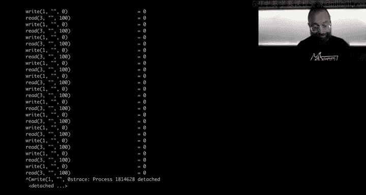
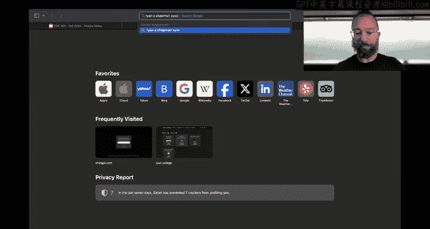
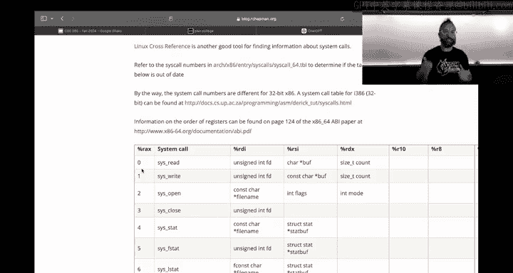
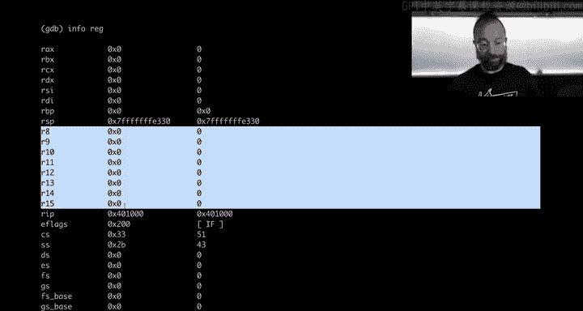

# ASU《网络安全导论｜ASU CSE365 Introduction to Cybersecurity Fall 2024》中英字幕deepseek翻译 - P18：-19-Computing 101 - CSE365 - Yan - 2024.10.23.zh_en - GPT中英字幕课程资源 - BV1nVCVY9Ehy

， let's get rolling。Allright， this is。Week one。Day two of the Comp 101 module。And of course。

 my tablet started let' pause this。All right。Test， hopefully the Twitch chat works， okay。

So today you're going to dig into assembly a little more， actually writing stuff with assembly。

 which is what you'll be doing all module， how to debug things how to you know make more complex programs last time all we really did was write something in C。

 compile it into assembly and then pretended that we wrote assembly。

 but now they'll actually be writing assembly。😡，And I basically， hope to have a。诶。Cool。

Sort of class without too much embarrassment where things don't work。 And we don't understand why。

 Okay， first， a couple of。Kind of administrative things。

See the surveys for access control and cryptography are still out there we've been looking at data so far。

 I think it's pretty clear that we overshot the difficulty on cryptography the median time spent on cryptography was 25 hours which is higher than than we'd like and more concerning like if you look at the 60 percentile even or the 65th。

 75th percentile things start ticking up into really crazy like 35 hours。

 40 hours spent on cryptography and we use median because there are some mems here that put in you know thousands of hours spent on cryptography which might feel like that but the assignment was wasn't even live for 300 hours or I guess just over 300 hours so hopefully people got a little bit of sleep during that we have also you know kind of for the future it spend like one minute。

Your feedback matters sort of thing I've been looking at cryptography One thing that's happening is that next semester there's a graduate crypto course also built on Po College that's launching and I think it's pretty clear that some of the challenges in the current crypto course are much to complicated for you know undergrad junior year level two weeks especially with only two weeks right so yeah of course if we had a whole crypto course and you know we're also starting to develop at ASU an undergrad crypto course that would be very fun but in the meantime probably moving forward stuff like the padding oracle attack might move to later course you know we'll try maybe one attack on ASES probably the prefix suffix stuff and then you know things like that so looking at。

Strelining that access control on the other hand， very clearly needs to be pumped up a little more。

 especially。And that with the Linux luminarium much of it is review so yeah thank you for your feedback if you haven't filled it out fill it out the survey is worth 0。

3% extra credit that means all surveys altogether can make up for a missed checkpoint for example。

Alright。And Satan。My ninjas says good afternoon。 The good afternoon， Satan， my Ninjas。Okay。

Let's roll on anything else we need to announce， oh， right。

 I just launched an additional challenge on computing 101， let me show you what that is。

if we pull up dojos。Computing 101。And under your first program。

Building executables so you can build executables。You will need to build executables anyways as you hit the assembly Cr Cour part of this module。

 so now you have a level dedicated to that so you can practice just that instead of having to do it kind of on the fly now。

😡，Tweek one tweak two coming this afternoon for the assembly crash course right now you have to do this crazy stuff where you assemble your executable and then you have to extract the actual binary code we're going to remove the need to do that assembly crash course will be able to take your actual binary executable so then you learn how to build your binary here and then you can just build binaryaries and use those all the way through the rest of the module apologize about that being a little bit oneka at the beginning the class is always evolving so these sort of things。

😡，Unfortunately， crop up real quick in terms of the impact on grading， we click into CSC 365。

 the new challenge and maybe I should have been more explicit with we say the new challenge doesn't factor in to the grading we need to add that。

😡，Because it also doesn't factor into the checkpoint anymore。YeahHow would you import anyway。

 so there's a bit of a lag of importing it here， but the new challenge doesn't factor into the checkpoint grid and you still have 19 levels required on the checkpoint okay。

Awesome。Mubn said that creating and executable require you to extract the dot text chunk as well。

 it should not require that。😡，That is not expected。Dme on discord， I'll take a look。

 but my test case doesn't require that okay。With that， out the way， any questions on that？Silence。

Everyone is perfectly。Perfectly caught up， understands everything we can go home。Beautiful， okay。

 awesome， let's roll on to writing real stuff in assembly。 all right。

 who here has written web servers and assembly already。All right。Well， we won't write a web server。

 but if you recall last time we wrote kitten。s， well we're going to write kitten or sorry。

 we wrote kitten。c。😡，We're going to write kitten that as for real and then talk about things that that can go wrong and how they go wrong。

 where do S。Uly history。All right， here we go SS in， we're going to。I recall kitten that C。

 which isn't here， but we'll just rewrite it and see real quick。Of course， right， so。

Who here is a big fan of C？Does anybody need to be zoomed in just slightly？Does it？Can this good。

All right， there's also twitch， but I guess that's slightly time to lead。对。Yeah。All right。

 let's write this up。We'll read 100 characters at a time。And。cat。😡。

Or kitten that see is just going to read from。The file and then write to standard out。And。Oops。

 that's hilarious， I wrote some Python in here by accident。

But we almost had a first shot compilation， we can cat the flag， we can cat Esy pass WD。

 but unfortunately we can't cat all of it because we don't have the logic to keep looping and catting right。

I swear you'll get to assembly in a second， but in see how do I， how do I solve this problem。

 I want to read out all of Etsy passW do instead of just the first 100 bytes。Yeah。What would I do？

Yes。Keep reading until I get to the null character。 so here's an interesting thing。If。

Let's say I keep reading。So keep reading typically， maybe you're talking about a Y loop， right？

So let's announce all of this outside。 Yeah， we've opened this here and then。While something。Do this。

 And this is while。We didn't get a null。Character。I guess what we could do is say， okay， while true。

 we keep looping。 And when we read， we can check。We can check every byte and now we're going off in the tangrum and we need to cut this off as soon as possible。

If this bite is an all character， then we exit。Okay。So then we recompile it。

We have a lot of complaints。You need STD lab for exit。Beautiful。

Still works on It never exits never exits slash E C pass WD。 It gives us the whole thing。

 but it never exits。 Why， well， we can actually look at the values of every byte inside SC pass WD。

 None of them are nu， The only exotic bytes we have are the new line 0 a。There it's it's。

Right there then end of every line right， There's no null bytes in here。

 a null byte terminates a string in C， a string in in in also typically how it's sort in in assembly program and stuff like that。

 and you deal with those a lot in this module， but that's not how you know when you're done reading a file。

 how you know， when you're done reading file is actually something different。 And if we。

Recall maybe whatever the fourth or fifth challenge in computing 101。

 we can actually see what the interaction that the kitten is having with the environment by S tracing it。

嗯。And here。We can see every system call that it makes， we did that last time we'll do it this time。

 but this time we will see something interesting。Here it is infinite looping trying to read。

 It reads。 And if you recall， the return of Reed。As we're using it here is the number of bytes red。

 we can figure that out by looking at the man page。Boom， you do man2。

 section two of the man page database has to do with system calls。

 documentation on all these system calls， and if you look at man2。

 you can say the return value section it says on success， the number of bytes read is returned。Sweet。

So if we etrase this， we get an infinite loop which matches our observation that this kitten never terminates。

嗯。And。Yeah， that's a bumer。 All right， so our our challenge here， of course， we're almost there。

 we we have a kitten that can get us Esy password long files in general， but it just never， never。

 never， never ends。 So how can we make kitten die。

Right， well。We。Can do our Sts and if you remember the Linux luminariums， various piping modules。

 et cetera cetera， we can take the Sts outputs to standard error， all of these logs。

 we can redirect standard error to standard output redirect that whole thing to the less command okay and now we can scroll up and down。

To see what the hell happened， right， and so here we see， okay， it red。😡，Where does it it opens。

It opens， E see password， it reads from it， it writes。

So it reads 100 bytes and resulting in 100 bytes。 It rides these bytes。

 resulting in this garbage spewed out on our screen。 So what we actually want to do is redirect。

What's the redirect standard out be explicit to Dev null now you only see standard error you don't see all of the standard output of the process itself and now you can see okay。

 here it is reading parts of Esy pass WD。And the last one is interesting。We try to read 100。

And it returned 71 by threat。All right， and that's how you know。That。😡，We're done with the file。

 We get less than what we try to read。 And Then later on， when we try to read， we get 0， right。

 That's another way we can know either way， whether。We check for， so let's to move this guy。

 we can check for if numbm red less than 100 break or we can check for if numbm red is just plain zero。

 which one do we like better？One or two。0， all right， perfect。So if we didn't read anything。

 we break。In fact， that is the right answer because。The previous one would have caused us to miss a。

Since we did it before the writing， it would have cost us caused us to miss one of our lines。 Okay。

 so now。Hitten runs， getses the password file and dies。Done， awesome。Sweet， okay， so。

Now we've written this in C。Let's write this exact thing。A mini cat in assembly。All right， well。

 one thing we can do that and this is what we did last time。Is we created a kit in that S file？

Just by。Right。Just by compiling it。But not assembling the result fuck dash S not dash C。Okay。What。

capitalist， not that。Okay， and here's our kidding that。As file。Here is the assembly。

Of the kitten program。Very cool stuff。 You're going to look at this in a second later。First。

 we're going to write it from scratch。And then we'll compare the two。 All。

 so this is kitten that S kitten that S is fine。 We need our bare bones。South built kitten。

 what should be called？mickey。My kitten。How about Popppy？We'll do poppy dot S。 Al right。

 so now we have popy so we want to。Read。open the file， read the file。And do this in a loop。And exit。

Nice and simple well， first things first， let's get the exit down。Okay， because。Yeah。

Because then we'll know if we've even got this far right so this is like a nice little mini program if you if you have looked at at the the lectures and the first maybe three levels of computing one to one。

This sets two registers。RDI， which is used as the first argument to a system call an RAX。

 which is used as the system called selector。60 selects the exit system call and cis call invokes it。

 right， and we assemble this。Into an object file。😡，That has。呃。嗯。

That has binary code in it except where it didn't work because it gave us some crap。

Because unfortunately， these tools by default use AT& T syntax， as we discussed last time。

We give a directive。That we're using a variant of an intel syntax that， you know。

 makes our eyeballs not bleed。 and now we assemble it。And now you have this puppy that oh。

As an object file。😡，Assembled from our。The assembly that we wrote。

 we can disassemble this object file。And you can see here's the stuff we wrote and unfortunately。

 AT&T syntax。Here it is an assembly syntax。Very cool。

 but this doesn't run yet when you build real software。

You oftentimes have multiple source files in your software。

 so who here has built a program with more than one source code file。😡，Yeah。😊，A lot of people。

When you're building programs using compile languages， or at least using C plus plus assembly。

 no one really。Builds programs directly in assembly， typically。

 but who years played roller coaster tycoons？Yeah， roller coastertycoon originally was written in raw X86 assembly。

 Chris Syer is is a genius， I actually really like his other game transport tycoon。

That game is incredible， anyways。That's neither here and nor there。

So these object files are an intermediate result from source code。😡。

Toward a final runable executable。 What happens typically is you create a bunch of different。

Source files。You compile or assemble them all individually and then you link those together and of course by you。

 I mean your IDE or your tool chain links those all together into final Executable and we're going to do that right now here is Pouppy linked from puppy。

😡，All right， here's a minor warning that this outputs that it doesn't know where our code starts。

 so it's just going to assume that our code starts at the very first byte。

 which is correct for us so we're refine with this。

But sometimes if you wanted to put some other crap over here， like， I don't know。

 some error handling code， right， for example。In the case of an error。We can。

We can have a little label here。 this is where the error is。

 and this is where the start of the file is。 And then later on， if something goes wrong。

 we can jump to this error and it'll exit one。While we can put this underscore start。Say that hey。

 there's there's a underscore start guy over here that you should look out for and that air will go away。

 that warning will go away， but we're not going do that。 we'll just deal with our little warning。

 Okay， now we can run poppppy It does nothing except for return an exit code of zero and we can s trace this。

To see that that's what it does。Just return on Ex of zero。 awesome， roughly speaking。

 this is the first like four or five levels of computing 10，1。 But now let's write。

A much better popy， a puppy that actually does its job， right， which is getting us etsy past WD。

 Al right， or the flag。 So what do you want to do， Let's， let's write this down First。

 we want to actually， let's write it down in a。Different way。 Let's say kitten that sea。And。

Copy this guy in。And translate it line by line， do what the asmbler does。Or what the compiler does。

 translate it into Popivas。😡，As well， as best as we can。So first things first。Yeah。Open。All right。

How do we get the How do we open a file using。呃。Assembly well be used a cis call and then anything that needs interaction operating system needs a system call How do we find。

The number of the system call here。 Well， there's a number of resources。

 The meme resource that we've historically used is。

A sis call table。嗯。

Maintained by the great Ryan A。 Chapman of Ryan A。 Chapman fan fame。 And he just says， hey。

 here's all of the different system calls， here are their argument meanings。

 and then here's their number。Ryan A Chapman's flaw is that is very X 86 specific there's a really cool resource。

 cisco do S。

That has。All of the different architectures， and I might actually recommend this nowadays over Rye Chapman。

 but here's a thiss call table for 64 bit x86。And we can see that number zero is called zero is read。

Very cool。 So now we are working backwards， we know that。😊，Hoops， not 9， but 0。

 what would 9 have been That typo would have had us calling a map to map memory。

 and you can read all about these man to read。 Here's how the reads his call works。

We need a file descriptor， wait， if we don't need read here。WeI just realized we need open， not read。

No one stopped me， open is number two。Okay。Sweet， so we have a。A。Open Cisco。

 and let's just see what happens when I just compile this and run or assemble this and run it。

 So I have my A and I'll actually on the tail end of it， do my LD。Yeah。Awesome。And then just。

Let's do our Straray pupppy。Okay。We opened。Nowll， or read only。So we opened some。

Noll address for reading， whereas if we look at what。Yeah。Kitten did。It opened。

 it used a slightly different form of open。Called open a these are two different variants two different system calls that do similar things。

 And when you write a program in C nowadays， Gcc the compiler chooses the open a system call。

 that's fine。 You'll just use the open system called。And if we search。

This page for the O read only it is one of the following access modes。

 read only write only read write and these requests open the file and read only write only or readr mode respectively cool so。

Why was it read only Well， Because the second argument here。

 the mode happened to be set to something already， right， and what it happened to be said to。

Was zero。Zero is read only。So， if we。To that sending it explicitly， Of course， it's already0。

 and we can。Asphs this。Not kitten， but puppy。Boom， we got the flag， okay， or we didn't get the flag。

 but we got our read only guy， awesome。So now what's missing？

What's missing is the name of the file that we want to open。😡。

Right and the name of the file that we want to open。Is。We can get it in two ways first。

 let's hard code it into the file。😡，Okay， and the way that we hard code into the file is somewhere after our our。

 our final exit， whatever， we can say。Here's a file name。

 anything with a colon an assembly is a label， we learned this part way through the assembly crash course。

 but basically here's our label。And in this label， we're going to。

Have a the label is just something that we can reference later on。

 and in this label we're going to put a string that is the file we want to read。Allright。

 and thesmbr will do the right thing here and actually put these bytes directly into the file at this location。

 And here we want to set。Oh wait。My bat for open， it wasn't the mode。

 It was the flags we needed to set。So， of course。That RsI was already zero。

 So setting to zero doest nothing。 And that's why everything worked the whole time。

 But now let's focus on setting RDI， which is the。The name the file。 And so what you want to。

Do is we want to move。Into RDI。Address of this。String。

 can we do this without a stupid load effective address？是。Offet is。Like this。一。Let's try it。

It worked， Let's see what what it actually disasse assembled to。Now， it's 0。It's a it's way。我。

ThisYeah， it has happened this this will screw everything。So good。 Well， it works here。 But okay。

 let's， let's， let's deal with it。 All right， so。And like it。

For for various reasons that'll become clear later， but for now they'll work with this。

 So we're writing an assembly we want to reference the file name the byte stored at the file name label。

 we can use this keyword offset to get the bytes at the file name label。😡。

To get the address of the file name label。With the caveat that that address。

The actual like address of memory is only known after that final executable is created because it depends on what other object files are LinkedIn。

 et cetera， et cea， et cetera。 But it's fine because we create that final object。

 and now if you etrace it，😡，We open the flag。Boom， we'll dig into why this is perilous in a second or it's toward end of the class。

 But for now， we got this offset and everything works。 Okay。

 it's important to say that offset is not like an X 86 thing。 Yes， its an asse if we if。

The asmbler does stuff， for example。In the actual final code。

 there is no such thing as the file name label。 It's just had an address。

 and this gets replaced with that address。 And you can actually see this happening if we disassemble。

Pppy。😡，And we see here， I mean， there is in this case， the label does stay around。

 we can strip the label out and things will still work。😡，So we stripped the label out。

 this code still works just fine。The label was just there as debug information， but here。

This is our offset file name。It's an address into the binary at 401027。

 and that starts right here right after our last system called。Right。

 so offset is an assembler direction， a directive that。In the end。

 oh during linking causes the linker to look up the address and plop it in here。All right。

 there's another way to do this that doesn't depend on the actual address and that works out a lot better in cases where you're shunting assembly around。

 for example， injecting code in the course of an exploit and what you can do here，😡。

Instead of this is using an instruction called load effectiveive address。

 you can say set RDI to the address relative to my current instruction pointer。

 the instruction pointer， the address of an instruction in memory。

 is stored in a register called R IPP， and you can just do IP+ file name here。😡，And。

If we assemble it this way。This， you can see also points of the file name。对。

And we can still run this just fine。 coolol， just another little。

Another method to do this that doesn't rely on the specifics of the linking process。Okay。Awesome。

 and and you will see this syntax of this RIP plus situation。In the assembly crash course as well。

 can we do this？No， right， this one fine。Yeah。This one flat。 Okay， awesome。 So now we've opened。

Now we have opened the file。😡，Now we're going to read the file。

 so let's ignore the while loop for now。Let's just handle the reading and the writing。

 and this is going to be super easy。The return。啊。Value of the open call is the father descriptor。

And that return。Value gets passed from a cis call back to your program by setting the RX register。

 So when the kernel， the Linux operating system。Does the system call carries it out， finishes it up。

It gives you a return value into RAX that you can use。 And here that is our intfD that we wrote in。

In our。C code， right， so let's do this here。😡，We'll use that and read our file。 So we need to move。

Our。RX value， that's our file descriptor into ourDI， which will be。

 if you look at this called that S， the first argument of to read the file descriptor。We need to。

 for the second argument， put the buffer。To which we want things red。

 there is a nice location of memory prepared for us already。 that lives。

 It's called the stack we shouldn't be using the stack in such a Willy nilly fashion。

 but we will now and you learn about the stack as well in。The assembly crash courseers。

And then we want to know how much to read， and that's the third argument that lives in RDX。

Then we want to set RAX to0。 That is the read system call number here。And then we do our cis call。

 and this should read 1 hundred0 bytes。From the file。And it does。

 it reads from the Fl file Po College， yeah。18een bytes of it。And then exit。 Al right， next thing。

Let's do this right we'll get this in the Y loop in a second。 So here's the right。Sys call ofright？

Is one。Okay， RDI is the filescripture to write to， which will be standard out， which will be one。

The buffer， which is our stack pointer and the amount of bytes to write so let's set all that up Rsi we have the value of our move the value of the stack pointer and there the value of the stack pointer contains the address of our stack and that just happily lives in memory somewhere gifted to us by Linux it's easy to say write 100 bytes。

 but we didn't even read 100 bytes， we only read 18 bytes right there are only 18 bytes in the file so we move RAX。

 which is the return value of the cis call of the Reis call。

 which is the number of red bytes we move that into RDX as that third argument for the number of red bytes and then we move。

This cis call of right into reX， which is one。And then we ciscal。And this thing complains。My bad。

 okay， the assemble。The ats。And the right succeeded。 And if we run this without estrace。冇。

We wrote an assembly， pure As Ppy program。All right。Now， of course。There are two problems。

 One is if you want to。Puppy out Etsy PasWD， it's still slash flag because slash flag is hard coded here。

So let's rehard code things and we'll fix this later。And here we rehard codeded it。We run it。

 the argument doesn't matter， of course， we run it。

 and again we're only hitting the first hundred bys。So now you want to implement that loop。Right？Sot。

😡，Let's implement this loop how do we implement loops， well， we can implement loops。Like we did。

In sea。I mean， sorry， conceptual like you didn't see， but in assembly it's a little bit different。

 there's no wild directive。The CPUU。Technnically does have a loop instruction in X86。

 but it does something slightly different it loops one instruction over and over and over。

 but if we have a bunch that we want to loop and so what we actually want to do here for this Y loop。

Is we want to add a label。So our wild header is our label and。We want to jump to it。

Rather than of the loop。So we can jump to our while header。And if you compile this， assemble this。

And if we run it。Well， it not only did it hang， but it didn't print anything extra。

 So what the hells going on， Well， let's etce it and we'll do this et with like that so that we are looking only at。

The trace output。 So here we go。 We started out so far so good。 We read 100 bytes from the file。

 We wrote 100 bytes to standard it out。😊，And then we tried to read 100 bytes from。

Five script to 100 and then all hell breaks loose。What the hell。

 Why did we read 1 hundred0 bytes from Father scriptripure 100？No one knows。

What do we do when we don't know this？ Well， we start digging into a debugger。Normally。

 if this was all Python， I'd put print S statements everywhere or print statements everywhere。

 print different obscenities at different places to see what's being hit and when。

But this is assembly and printing stuff out is hard。😡，In fact。

 that's what we're having trouble with right So one thing that we can do is use the new debugger G。😡。

On our puppy program。And I'm going to use vanilla GDP。

 This is a very basic version home College also ships various extensions。 there is Jeff the the new。

Exploit framework， something like that。 And then there's poem debug two extensions to GDP that。

Make debugging a lot less painful， but we will。Focus on vanilla to be right for this lecture。

 Alright， so what do we do if you can run things in here and observe cis calls， memory values。

 all of this fun stuff。 So first we start the program start I。starts the program。

And breaks to the very first instruction。 Okay， and now we can do stuff like。

 let's look at the next instruction。诶。On our that we're about to execute。 And this is familiar。

 It's our load effects of address， yada， yada， yada。but it's ugly because it's an AT&T syntax so。

You can do Sa flavor intel。呃。Assembly dash flavor， assembly syntax， disassembly flavor。

Disassembly flavor intel， dash flavor in， all right。

Usually I have this in an init file and now this looks。Like what we love to see， we can say， hey。

 X is examined， Sla force slash I is instruction， examine 10 instructions starting from the。😡。

The instruction pointer that we're about to execute in here our instructions， and then I can say。

 hey， give me the value in hexadecimal that's currently an RDI and that's zero or give me all of the register values。

Right， very cool。 I can also say， hey， every time。I stop for any reason。 Give me the next。

I don't know。 Let's say five instructions， S， and then I can step S I， step instruction。

 I start executing instructions。 Al right， now we're about to execute this cis call。

 What is the cis call， I can do BX， R A X， R D I， R S I and R D X。Wops。Alright， thats silly。

 Al right， R X is 3。 R DI is。The address where if we examine the string located at。

The address pointed to by RDI， we see that it's Sey password。And so on， right， So this is fine。

 this all works。 I know from the S trays that this works， I continue executing。

This is our first read， right， So we go right before the cis call。 And I see that RDI is 3。

 That's the father descriptor for our。😊，Return to by our exit， our S is。Some big， scary value。

 but this is our old value of our stack pointer。That got moved into RSI。

 that's where the right is going to go to。 if we look at what is there right now and we say give me the00 bytes。

At RSI bytes in Hex at sorry yeah pointcho RSI， this is what's currently there。

 a bunch of garbage it looks like a bunch of different pointers stored in little Indian format。

 we'll talk about this all later if I step over to Cis call。And I see what's there Now。

 There's a bunch of principal ASI。 if I print it as a string。Boom is the first hundred bytes。Of。

The Esy pass WD file。Very awesome Okay， so then we continue going this is the right that' called bad to happen and if I stepped boom here it is got written now to my consult it's awesome and then we jump back to the head of the loop。

Okay， so far so good， right， and then we move onwards。And this is that read that's about to happen。

 And I know from looking at the es that the read is messed up。

 that the read will read from standard or from fatherscripture 100。 And I can see that it's moving。

Into what will be the file descriptor specification， it's moving RAX。 I can see what is RAX。

RX is hex 64， if I look at it in decimal， it's 100。And that's where the problem started。Right。

Our reX is。Being set to 100 at some point。 Allright， so now I traced through this with a debugger。

 I got some insights tonight I staring at this and where am I setting R X to 100。

 And I could go back through in the debugger。And I can say， okay。

 display the next five instructions anytime I stop。But also display。In hexadeadeimmal。

Or let's say in decimal even the value of RAX。Awesome， so now I start I。Okay。

 and here's the next five instructions and here's the value of RX RX starts out as zero。Okay， oops。

 and I also want to sat。I don't have my history saved， set disassembly flavor and tell， okay？Yeah。

Okay， here's the open this call about to happen boom now R axis 3 okay。

 if I just hit enter on a blank input line it'll just react to the previous command so here we're moving forward okay R axis is zero for the cis call oh。

 but it's not R axis it's RDI if you' interesting my bad， let's add a display to RDI。😡，Okay。

 RDI is three。 that's the father scripture return by open。

 and we're interested in why does RDI become 10， We keep stepping， We keep stepping， stepping。

 RDI is one。We keep stepping。Okay， we jump backwards。RDI still won， and then boom。

 we see RAX RDI became 100。Because it got set from ours， and here we can actually scroll backwards。

And say， when did RX become 100， RX became 100。Right here after this cis call。

Right before that final jump， right， So what is this cis call， this cis call is。No， this is all。

And what was before that ci call is our X1。 That's our right cis call。So right returns。

The number of bytes that had read that it wrote。Into REX and kloomers are file descriptor。

 that sucks。So clearly we need to not be using RX as long termm storage because every Sis call messes it up and as soon as we have our file descriptor return from ourX。

 we want to save it off， we want to save it off to another general purpose register and there's there's a bunch of them even just ones that have arguments to cis calls here is our 10 our8 R nine。

😡，There's R 14。 There's R 13。 We're going to use R B X。 It's a nice。

Register that is not used in any of the argument registers， it's not clobbered。

 it's just it's a nice happy register， and we will store our father scriptor into RBS。

And then we can retrieve it when we need to retrieve it out of RBX outside as we store this as soon as we do the open。

😡，So this is。Yeah。That part of this guy， okay， actually。

 let's just just put it all the way right up there and then here we when we every time we need the filescriptor。

 we look into R Bx。And。Now， it should be irrelevant that Siscal clobbers are at right now。

 we should be able to。Assemble this together。And execute it。And we get our file as he passed WD。

Using a puppy written fully inasse。Amazing， now was the problem。It's not dying。

If he atrays this thing。We can see here's it writing out， reading 10 at a time。

 and then eventually it gets that 71 bytes instead of 100 bytes and then all these zeros。

So we need to。Do that same sort of interruption break that we did here。This one， implement that。

 and we should be done。 How do we do that， What we do it the same way we did our loop。

 We just have a jump， right， And there is a key thing about assembly all while for all of this stuff。

 even if， to an extent。These are C syntax things。In assembly。

 all you really have is jump and jump if， I guess conditional jump。 So how do we do this。

 We set another label。😡，Are labeled done。And here we check if。The number of bytes rat is zero。

The number of bytes read at this point is in RAX return by the Reis call。Right？And so here we。

Can even test。RX， RX， So this test RX against itself， it's a little。Qurk of Assely。

 I talked about this in the lectures。😡，And then we can say， hey。

There's a number of conditional jump instructions talk about this in the lectures that check the output of this test。

😡，And jump if certain conditions are met。 So J Z jump 0， will jump if R X was 0。哎。

We can also do other things。 So this is the this thing J Z done we can also。Do， for example， compare。

RX number of bytes red against 100。And then we can say jump if。The reX value is below 100。

Right that's the other route than if nu red is less than 100。 All right， but let's do this。

 we just test ourx and if it's zero， we jump to the done label， which is where our exit is。😡。

Let's assemble this。bom。As trace it up。Let's just run it without us tracing。It exits。

It exits cleanly， we can arate this as well。And we can see it tried this read。 The reader turned 0。

 and it cleanly exited。 And now we have written。The equivalent of our kitten Daras。In assembly。

 I'll move these up a little bit so they're right below the commented lines。There。

 here's the wild Haer。Here is。Where we read this spa scripture now， there are two missing things。

 One is this buffer declaration that we declared in C。 Well， in C， when we do declare this。

It actually puts。The buffer on the stack。 We are doing the same thing here， almost。

That see does when we declared this buffer。The slight differences and and we'll discuss this much later like the reverse engineering the next module is it actually makes safe space for that buffer on the stack because there's other stuff on the stack stuff that we don't want to mess up。

So this is the one kind of slight difference， and then the other difference is this， it's this A V。

Where does the argument come from？Right now， we have it hard coded in。In the file name。

 but that's not where we want to。What we want to do， right？The arguments。To kitten。

We passed on the command line。Ey pass WD versus slash flag， art， and in C。

This is in the AV argument to Maine。And if you remember when I was writing this。

 I accidentally wrote Python instead of C。It's accessible via the cis V in the cis argument。

So how do we do this in assembly， assemblymb doesn't have these fancy things。

 such as function arguments necessarily， it just has registers and memory and the arguments you pass to your code exist。

😡，In memory， when the program starts up， so let's grab GDP again。

And here's how to pass arguments to let me check on switch Okay， perfect。

 how to pass arguments to an invocational program in GDP if we did this。

GDB will read this argument and try to act on it。 So that's not how you do it。 But when we。

Start I the program。We can pass arguments here。So here's start I slash flag， okay。

 so Gb ran the program this way， a poppy slash flag。

 where did that slash flag end up actually let's do something different than slash flag。😡。

Let's do slash A just so we recognize it easy。 Okay， here， here we are。 We just started our program。

This argument is going to be somewhere。Is it going to be in a register？No。

Because the registers hold 8 bytes。ThisThis would fit， but this argument could be very large。

So of course it's in memory somewhere， how do you find it？There's two options。

It's either being pointed to by values。In memory， it's that we know where they are memory or。

It's being pointed at by a register。So what registers here look like memory addresses。

 Well these are all zeros， they're not very fun。These are all zeros。

This is our instruction pointer， This is the next instruction that's going to be executed。Okay。

 these are other these are not even general purpose registers。

 this this holds the flags that are set and discussed this in lectures by the test and comp commands and other commands not commands instructions。

😡，This is our only address， the stack。And， in fact。What we need is going to be on the stack。

 So let's look at a。E byte word on the top of the stack。This axe is examined。GX is8 bytes。Okay。

 we have a two。That's interesting。What would happen if？We had two files。Then passed in。Okay。

 it's a three。That is Arc C right on the top of our stack is ArcC。ok。😊，What's after that。

 eight bytes away？Something interesting。 Another memory address。What's at this address。Hoops。

What's at this address？What does this look like？Looks like something printable。

Let's try this as a string。啊哈。That is our。The path to our program， that is R V0。Okay。

 so we looked at RSB plus 8。And that contained the address of Rv0。

 will RB plus 16 contain the address of Rv1？That's like eight bytes later。

 all these addresses in a 64 bit。Um， processor， all the addresses are 64 bits。

 which is8 bytes long and so。Let's look here。Yes。😊，So at RSP。Plus 16。There is an address。That。诶。

Points to our string， it's not the string itself。That's all garbage， it is。你。Address。Of our strength。

Okay now we need to wrap our head around all of this in direction。

 if you did the memory part of computing 101， of course， you are a little more prepared for this。

 but basically we have art。RSP plus 16 here has the address of the first argument。And here。

We need to move。The address of the first argument。Into RDI。That so we need to do this。

So what we need to do is something like。The add instruction。

 which you cover in the assembly Cr course。Well， the move instructions， so first we set RDI to RSP。

 and then we add 16 bytes to it。😡，What do you think？Worth a try？诶。😊，Let's assemble。Let's Strace。

And things go badly。Let's see what happens。嗯。This looks like。Theocal interpretation of an address。

 so something is not right。几。We can try to think through this。And I know what's not right。

I'm going to claim to or we can launch this in G。Okay。

 and we're going to start I and now actually one thing let's。

We've eliminated the need for this file name。 It's not used anywhere in the file anymore。 Alright。

 so let's。Bm get rid of that so that we don't have to confuse ourselves。 All right。

 let's run or let's start I with slash flag。Okay。嗯死。We dive in here。And then we。

Can say what it shows the next five instructions from RP。Said disassembly flavor intel， okay。

Let's see when the Ciscal happens， what's in RDI？So if we stop， all right， let's look at our D XgX。

RDI， there's a pointer in RDI， that's great。A memory address。 Where does it point to。Oops。

It points to。The string。Slash flag。Yes。Looks right to me。See。But RX fails。Say， okay， okay。Sorry。See。

 I got confused again。All right， start， start over。Okay， let's go through。What's an RDI。

It's an address。RDI is this value。Is set to this value？So this is what's in RDI。

And what RDI is pointing to stored at this address in memory。Is this value， that's not our string。

The value is pointing to our strength。 So we need to do a double D reference。

So what we need here is this。And you've done this in your。In the memory challenges。And now。

We've read that， dear earth said one more time。And we can give it our。

The files we want and now we have the actual。Cailities of kitten。そう。

What happens when the program starts up is on its stack。Is first the number of arguments。And then。

Oops， I think I turned out the camera。All right， first， the number of arguments。And then。

The string pointers toth each argument in sequence。And then actually。

 the environment variable strings in sequence as well。 but the string arguments。

Is what were interested in here， and we were interested in that second one first is Ogv0。

 the near the program， then Agv1 and onwards。Awesome。Okay， so today we have thus far。

Writing the program in C compiled it， looked at the assembly。Reimplemented pieces of it in assembly。

From scratch more or less。 until we got the logic we wanted。 And I used C here。

 but I could have just as easily written。哎。诶。Ha yeah， I could have just as easily written。

Notes written in English and implemented them。We implemented first the very basic logic。

 first we implemented an exit so that we knew if we reached it， right。

 and then we implemented all of the different logic and finally we implemented complex control flow。

😡，And all through that， anytime we ran into an issue。

 we used a combination of Sts to look at what we're doing at the Cisco level and GDP to see what we're doing。

I add deeper。Any questions on this？Awesome。All right。Um， anythingth we are missing？So。Cool。

 all right， I let you go a little early this time remember checkpoints do this Sunday。

 there was a question on what does the extra challenge do for the checkpoint。

 it just makes it kind of easier to reach it checkpoint still 19 challenges。

 but now there is one challenge that you would have to have solved implicitly anyways to build programs now you get credit for it。

그。All right， good luck and yeah， reach out with questions。

嗯。Goodbye， hackers。