# ASU《网络安全导论｜ASU CSE365 Introduction to Cybersecurity Fall 2024》中英字幕deepseek翻译 - P19：-20-Computing 101 - CSE365 - Connor - 2024.10.28.zh_en - GPT中英字幕课程资源 - BV1nVCVY9Ehy

Wel to another week of 365 we're rapidly approaching the end of the semester I think I don know there's like what month and a half left。

 something like that we gotta be well past the halfway point We are doing computing 101 assembly who's liking this module so far。

Is better than crypto？Definitely better than crypto， all right， who likes X86 more than MIps？

Who likes nips more the X 86？No one see， you don't have to nice。

 you don't have to withdraw anyone from class， everyone gets to stay。All right， okay。

 so today we're going to focus on some of the ideas in building a web server， so I don't know。

 probably most of you are well I guess looking at the hacking count most of you are somewhere in assembly crash course which is awesome continue to learn all these X86 instructions another interesting module coming up though for many of you will be debugging refresher and building oh boy the cameras just not pointed at me at all just gave up。

I it just froze also as a very interesting facial expression also。All right。

 we're going to try and unplug this Oh O is good。I's going to lose， no， it's a Mac。

 it'll work for Mac。Now it's struggling a little bit s files yeah I don't know if that was Mac to blame there okay the camera's working again cool Yeah we're still and Mac it works so we're going to go over a lot of the concepts in building a web server and maybe if there's time we'll go over some of the concepts in debugging refresher。

 we'll definitely be using G throughout this and then maybe on Wednesday。

 we'll do more specific G stuff， maybe like some G scripting or something on Wednesday but for now we're going to go into the concepts of building a web server so last week we wrote you know kitten and it did this very nice interaction we wrote it from scratch。

 made some sis calls， it opened a file， it read the file。

 it wrote out the file I think at the very end we had it in a loop where it would like read all the data and then give up and then it just was a wellform version of cat minus like dash dash help and I。

Multiple files and you know， there's more features that you could have added。

 but it was a kitten or no， I guess it was popuppy it was popy was popy wasnt C it was poppy so you know。

 to get to a full cat guess the next time you should iterate through all the that would just be in one more loop All right。

 let's let's see if we can do that actually let's see if we currently still have I think we do no no no。

 it was on your stream server wasn it yeah。Let's see here， Cause the dojo wasn't on。

Oh before let's yeah， a couple of updates about。The module。

97% of the people that started it checkpointed so that's great good job and then real。

Keep or you should keep pushing。 don't don't leave everything till last weekend。

 That's going to be very， very difficult。 I remember some people struggled with building a web server in the past。

 So I I definitely encourage you to not wait for the last minute。U I think it's not as bad as crypto。

 but I know people definitely struggled in the past， so， you know。

 get ahead of it as soon as you can， okay。So we have this， let's see here。

 We have puppy puppy dot S that we wrote。 and we can see here kind of looking back at this。

 I guess at the very end， we figured out where on the stack R V1 was， right。

 We determined that it was at RP plus 16 and then dereence it to get the pointer to it。 In fact。

 actually， let's。

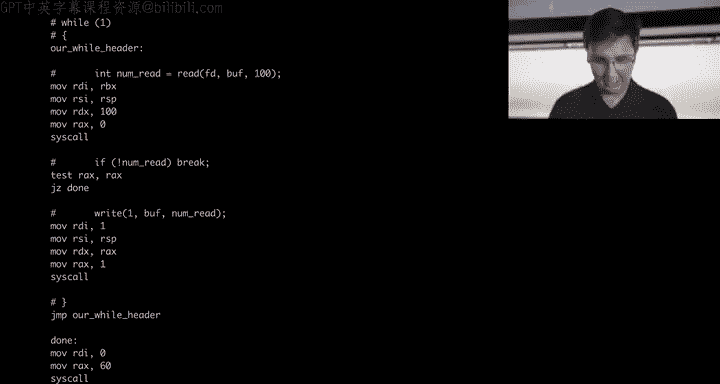

Let's look at that with GDP。 Let's just watch it happen to show ourselves we remember how this works。

 but how do I want to do this， We will start up Teamworks。And we will cat kitten dots， nope。

 not kitten， cat puppy。Hpy8。s。We will G actually， before we G， let's show that it works， puppy。

 flag and Po College yeah comes out。And the very first thing it does。Let's see here， oh boy。

Why is this。Here's what we're going to do。Cats puppy dot S into less。

 I scroll now Teamworks and scrolling。It's always a nightmare。请。Cat puppy dot S。 Okay。

 so the very first thing we do here is this cis call。 right。

 So we basically have everything broken apart into cis call chunks。

 You should think of this when in building a web server or in this demo in these kind of simpler programs。

 All we're doing is we're writing a program that's like making cis calls。

 Our objective is to make cis calls。

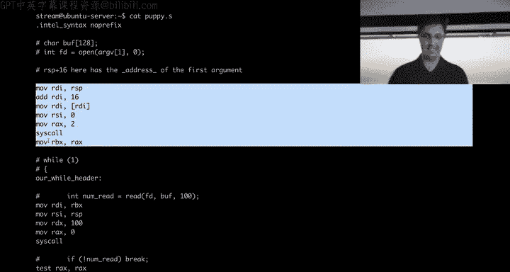

And then there's some like simple logic on top of that like a simple loop。

 of course more advanced programs might do more advanced data manipulation。Ultimately。

 we are producing this machine， the cis calling machine， Our goal is cis call。

 So in each of these cases， we'll see we write a block that has a cis call Cis call Cis call。

Control flow is not a cis call and this makes things interesting Cis call， and then Cis call。

And as a reminder， if we want to know what Cs call is being made right before the Cis call instruction happens。

 it's whatever the heck is in RAX so we made it very easy for ourselves to read this program and so as you write assembly programs you want to write them to make them easily readable for yourselves and so probably what you want to do is right before you cis call you specify what RAX is probably in every case in this module。

 the thing right before your cis call should be a move RAX technically it could be higher up it could get more complicated make it readable though put your move RAX right before your cis call so move RAX to cis call is and let me move that there。

😡，Ss call number two is open Open takes three parameters。 We've got RDI RSI RDX。

 probably you haven't memorized this yet， but maybe by the end of this class。

 you will memorize the fact that it's RDI RSI RDX。 This will just be secondhand。

 You'll have to memorize it。 You're always welcome to reference it。

 but you're going to be doing a lot of cis calls RDI RSI RDx that's the first three parameters So in the same way that RDX selects the cis call。

 this determines the arguments to the cis call。 So whatever the heck is an RDI should be a file name and if we look up here。

 we can see this is where RDI gets set it gets set to whatever is at RD So let's use GDP。😡。

To I keep typing kitten there's too many animals in this class， puppy。And we will start the program。

And we will use some cool features that we previously talked about， like the display thing。

 which will allow us to constantly see every time the program stops something and in this case we're going to have it display four instructions at RIP in this case。

 we don't like the syntax style， we're going to remember set disassembly。Flavor Intel。

And if we want to look at these instructions again， we can always just do that ourselves。

You'll learn in this module that GDP is basically a language in and of its own right。

 So you're kind of simultaneously learning X 86 and GDP GDP is might as well be considered a language for your purposes here right We gotta learn this weird syntax。

 That's so bad， but you'll get used to it， which says。😡，Whateverever you start with an X。

 you're dereferencing memory。 So dereference memory and print me four instructions。

 as we discussed in the past， I could do print me for bytes。 I guess this is not bytes。

 B X would be bytes。 So print four bytes at this location。

 or I could say instead of X to dereference memory， I could do print as hexadeadeciimmal。UhRIP。

 and this just tells us that RIP is currently 401000， okay。Let's look ahead。And see our ciys call。

 So this right here is maybe something that feels initially unintuitive。

 what the heck is going on here。 G is very nice at seeing exactly what's happening。

 This is why GDP so cool。 I can look at any instruction and fully examine the state of the program。

 So for example， let's say I want to watch this happen。 So we can read this like statically。

 we can just read these three instructions and think in our head， what the heck is this doing。

 This is putting RSP into RDI。 So whatever the current value of RP is。

 which is currently this crazy number that got started up by the kernel。

 the kernel set RSP somewhere for us before it started our program it gave us a little stack we'll see that RDI is currently just zero。

 So hopefully in your head， you know what this single instruction is going to do。

 You shouldn't even need GDP for this。 but you know what we all make mistakes。

 GDP is great for confirming。RDI should now be this number after I step， let's step。And sure enough。

 R DI is now that value。 That was the effect of that instruction。 Okay。

 now we're about to add hex 10 to it。 So this thing right here。

 you should be able to predict in your head。 you will run an X 86 machine in your brain and understand what's going on here。

 right， We know that this should now have a 60 after I step。Let's step。And sure enough。

 it is a60 Now this might be the first instruction that you're like trying to reason about in your head and depending on your familiarity with X86 at this point。

 you might be struggling slightly more with this one right this one's a little more interesting This one is pulling out of memory at memory it's going to pull from RDI so RDI is specifying where in memory。

😡，This Qword pointer thing is like why is it called Qword pointer， I don't know historical reasons。

 really I should just say like8 byte pointer that'd be a real nice thing to say but that's what it's saying it's saying  eight byte pointer pull8 bytes out of RDI we could also for example pull one byte if instead this was a byte pointer we'd be pulling one byte out of RDI but in this case pulling8 bytes out of RDI and that's makes sense because the destination of where it's going。

 it's going to an eight byte register right RDI is an8 byte register that think can hold 8 bytes so it's good that we're pulling eight bytes of memory out there's a question yeah。

Very good question， so the question is， is this the default？😡。

You could write your X86 and just say move space RDI comma space bracket RDI without specifying keyword pointer in this case in this case。

 that's not always true， but in this case the size can be inferred because the destination is an  eight byte destination and that's the only option。

 you cannot do a byte pointer here and pull one byte of memory out and make that go to an8 byte destination the sizes have to line up and so the asmbler can infer the size for us In fact。

 I think if we will look after it， I think if we look at our source code that we wrote we might not have even written。

😡。

Let's see。 no。

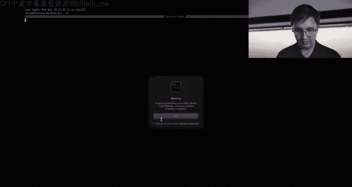

How do I want to do this？We're going to shrink this。Just to be。Sure about that。

Maybe Yon did be explicit， you could be explicit。You'll see how did Janon do this you see Yon didn't even write keyword point here。

 you could write it， it would be more explicit， but the destination size is known if we had this flipped if instead we were rating into memory right pulling。

 let's say maybe we put square bracket RDI here and then just RDI on this side we kind of reverse the opera。

Then you would need to specify because a location and memory is ambiguous of how big that destination is。

 We might be saying we want to pull one by or four bys or eight bytes。Hold on。

 let me confirm what I'm saying is true。Is it ambiguous， pull if we flip this， would it be ambiguous。

 where's the case where it's ambiguous？So it can be ambiguous if it's an immediate value Yes if it's so I think this is what I just said。

 I think is not true about test in the audience。 if we flip this。

 I think it's still not ambig I not a because the source is8 bytes so we know we're pulling eight bytes the problem would be if we did move square bracket RDI square bracket comma 0 for example。

 we wanted to put a0 into that location and memory now it's ambiguous because we don't know if that0 is a1 byte0 a 2 byte 04 by 0 and8 by 0。

 I think those are really the only options and that is where you would need to be explicit because you don't know how big zero is you might be thinking in your head will obviously0 only takes one byte to represent but what if I wanted to know out 8 bys just the way the architecture works or I guess the way the assembler works in this case is when it's ambiguous you have to be explicit about it。

You could imagine writing your own asmbler where it just decides something and resolves the ambiguity by making something up。

 but the way that this assembler works， ambiguity has to be explicitly stated how big it is， okay。😡。

Let's keep rolling then。诶。And let me make sure that when I've been doing full screen。

 yeah it looks like that still works cool。 Okay， so we're about to pull out of memory from RDI again。

 look at this。 RDI is this value right here。😊，At memory， if we want to see。

 let's say one byte of memory， we can use GDP to do that X slash 1 Bx。

And what we would say is RDI and what this means is pull one byte out of memory at RDI。

 this is the GDP way of saying that。And we'll see that it's an old byte， one byte at RDI。

Is this we could do 8 bytes instead and we'll see these eight bytes is just all null bytes and I'm realizing now that how I started this program。

 we didn't specify a path and that's gonna to actually be very important here So what we should expect to see now now that we've printed 8 bytes for ourselves at RDI is that a zero should end up in RDI so currently as a reminder RDI is this value。

 we're pulling8 bytes of memory out of RDI after we step through this instruction because we already like prelooked at it with GB they're better be RDI better be equal to0 unless you know I'm making everything up and what I'm saying isn't true let's find out the GDP is great at finding reality and if we print RDI RDI is now a0。

Cool， this one easy zero going into RSI RSI is going to be zero when I am going to print it for ourselves because we know how move RSi0 works It's just going to set RSI to0。

 You're unsure print RSI right， can always print RSI。 RSI is definitely zero。

And then we're going to set RAX to2。😡，RX is two and now the interesting thing。

 the interesting thing is the cis call， the cis call is very cool and what we're going to do is we're going to step through this。

And we're going to investigate the result of this Cs call， which is now in RAX。

If you ever do a cis call and you see a value like this come back where there's a bunch of Fs right。

 we print RX after a cis call and you see a bunch of Fs。 It's not all F's， technically。

 there's a little two at the end here。 This is a negative number right twos complement。

 this is a negative number and what happened here， whenever the cis call returns a negative number into RX。

 the cis call failed every single time Cis call negative number basically a bunch of Fs cis call failed。

 So unless you intended for that cis call to fail， something's gone wrong。

 And if we look ahead or maybe don't even look ahead。

 if we think about it right what did we put into this cis call， we did RDI RSI RDX all three were0。

 what cis call did we make。

We made the open Sys call， which takes a file name， flags and mode。

 we just passed a null pointer as our file name。😡，You do this。 What what file is supposed to be open。

 I mean， we can go read the man page for man open。 So we'll type man open。 obviously。

 you could do this in your terminal， but we're going to be kind of crazy here and just look at it here。

Some in here I'm sure right is going to say， you know you pass a no pointer as the file name what's supposed to have it it is not going return a good value and so that is why this is call just failed and let me flip this around and the reason that happened is because the way that I started the program I started it with no arguments we could see this also happen with S trace I do S tracece slash puppy。

😡，We'll see actually， in fact， something is very unhappy。

 we've got an issue here where you know there's a bug in our program probably right probably puppy isn't supposed to just spin forever。

 in fact， we type it without Sts and get no output we'll see we're not getting our terminal back there's a bug in puppy that I don't think we explored until now and ultimately if we do Ssts puppy redirect to standard out and just look at the beginning。

We will see right here this line， exactly as I said， we passed null as the first parameter open。

 right？Probably you know that this was not your goal。

 your goal is not to pass null and the reason that happened again is because we didn't specify an argument the way we wrote this is that RV one's going there。

 we don't have an RV one instead of we do puppy test like this。😡。

We'll see now test correctly is getting passed。 it still fails because there's no such file and probably in fact。

 if I do H test here。This is going to spin forever because how we wrote this program is it doesn't check errors is nowhere in here is a checking errors。

 It doesn't know the fact that this failed。 It just assumed， okay cool。

 my file descriptor is negative one and it's going to well actually in this case。

 negative2 and it's gonna pass negative2 is the file descriptor to read and then of course read is now pissed off because read should have a positive value or zero right should not have a negative file descriptor so it's mad and it messes up and then write is completely lost because nothing is doing their handling and suddenly we're passing this massive size because this is just whatever the heck is in RDX this program is just like exploding rapidly because nothing makes sense。

😡，And it's just coincidely trying to read 100 bytes。 And if we remember， right， if we look at。Puppy。

s。The check that we tried to implement here for when we stop spinning is。

We have this test RAX RAX jump zero done and this is basically just checking if it's zero。

 so if it's zero， we're done， but what's happening is every time we're reading we're getting a negative number and so the negative number is showing up and it's not zero and it's spinning forever and it's never going to end。

😡，So that's what's going on there。Does anyone have any questions so far。

 whether it's GDP or X86 or anything I've said so far that makes no sense？

Because this is about to be your life on building a web server is like living and dying by GDP。

I guess I have a question。 How would。Students put in。Expected return values like。

You kind of expect that every Cis call succeeds Yeah is there a way to check that Yeah。

 so we could check to see if every Cis call succeeds and what we're going to do is check to see if the return value is ever negative we ever do a cis call and the return value is negative。

Now we're in an error state and you know you could write your program it's up to you how you write your program what should happen when a cis call fails。

 you might say put out an error message saying， hey。

 the open cis call failed or you might just decide to exit with a error code of one or you know it's up to whatever the heck this implementation is supposed to look like so。

😡，Let's see here。 Do I have Emax。 We do have Emax， very cool so but my Emax。Something is a disaster。

Why can't I whatever roll with this what we would do， for example。

 is right here right right after this cis call， we have a return value in RAX。

 we want to check to see is this error right， we want to check now is RAX negative。

And one way we could do that。Let's see here， I personally don't like the task instruction。

 I have a vendetta against the task instruction because every time someone writes a task instruction。

 I has to start thinking what the heck is a test instruction， I like the compare instruction。

Personally， and so what I'm going do is I'm gonna compare you know， if you like the test instruction。

 go ahead use the test instruction。 I think the compare instruction makes more sense。

 The reason you see a lot of crazy things like test test reX reX this insane line literally just because it takes less bytes so GCC will emit something like test reX RX because Gcc knows what it's doing and can get it done with less bytes of instruction turns out people really like smaller programs and that's ultimately why you see this terrible code but we don't care about the size of our binary right now or how many how big and in single instruction is so we're just gonna compare reX with zero and。

We are really sad about。Eax is very upset that this isn't all indented because this is badly formatted assembly。

 but we'll keep rolling with it and what we're going to do is we're just going to say jump less than we could also do jump less than or equal if we wanted to include the zero case。

 we're just going to do jump less than。😡，Because if you compare Rx with0 and it's less than right if the answer is that it's less than it's a negative number right So jump less than and we're just going to type error for now。

 and now we need to figure out where the heck error is。

 we're just going to put error at the very end。😡，Probably there's all sorts of ways you could imagine writing this。

 Maybe we really just want to jump to done and like put RDI in a value。

 and now this things not in control of RD you have options for how you write this。

 but we're going to do this in the dumbest possible way nice and simple we'll have code duplication。

 The error state is going to move RDI and we're just going to put one。

 this is a common in convention for an error is that your program return something other than zero。

 normally the convention says not zero， that's an error and so that's the convention we're going to follow we're going to move RAx 60。

 again， y 60 Well， we know maybe we know that this was our exit call from before we could double check that though if we search for 6060 right here。

 this is exit we're specifying our error code again convention says that a zero exit code is a clean exit a not zero exit code is batty you could make up。

Your own convention， I guess if you wanted to， but the rest of the world says this is the convention for programs for programs。

 Yeah， exactly functions is the opposite。 Yeah， for exactly very， very fun。

 I guess basically probably the convention is that way because you might want to have different error conditions right There's only one thing that is good。

 And so we'll just say zero is good。 And then there's multiple ways of being bad So you give all the other values bad。

 It's probably why they did it。 and then we cisco。So as a reminder， we added this error state。

 this is just a label， now we can jump to this label。

And we added a compare R X0 jump less than error right after the cis call。 And in fact。

 we could put this after every single cis call if we want because。

We will never want as call to return a negative number There might be times where your program is totally cool with assist cis call returning a negative number。

 for example， maybe you opening a file and if that file fails to open you want to notice that and you have a fallback file you're like well this file doesn't exist so now I'm going go try this file and then I'll try this file and this file you might have written a program that takes in a huge。

😡，It takes in a config， for example， and it's going to try like seven locations。

 And so you write your control flow to account for that In this case， our program is nice and simple。

 no bad cis calls， Okay， let's。Reassemble this。Okay， right， assemble it， produce the object file。

 link it， produce the actual runable。We got our warning， we don't care about our warning。

 and now if we run Pouppy， it exits， right， we'll see here。We see it gets a negative number。

 and we exit with one， right， We can also check。Echo dollar sign question mark it returned a1。

 however， if we do puppy slash flag。It returns zero So now we know right you just think of this as like programs working with programs working with programs。

 you might have a program that wants to call puppy and then check to see if it failed or succeeded and it's going to check its exit code and that's kind of what's going on there Again。

 any questions so far。 I anyone have any questions。

 This is going to be your life in building a web server everything I'm doing and you hit a problem and you're confused。

 Everything I've done so far。 This is how you're going to get through that problem。😡，No questions。

 we'll keep rolling then。I will keep rolling。 I gotta run。 Yeah， all right， good luck， yep， see。Yeah。

 Janwn has to run her late today， picking up baby Janwn from preschool scheduling mix up。

I will keep rolling then。 So let's go ahead。And how do we want to take this？嗯。Yeah。

 let's keep let's keep editing puppy so currently our puppy program。Does all of this， right。

 And actually now that we have it a working， let's， let's again show。

Let's go ahead and show this instruction again before the first time we ran it with GDP。

 we saw nullbytes going in and RDI was going to zero and then everything was failing。

 Let's start it correctly by specifying a path that exists and watch what happens when it actually succeeds。

 Let's do GDP。Dot slash puppy we'll do start I and we'll specify an Ag V1。

 so this is the way in GDP that you can specify orgVs， so start start I s flag。

We'll just say no to that and we'll do our set disassembly flavor Intel。

 and we'll do display for IRIP。And that's probably good enough for now。Okay， let's just step， step。

And we're back to this instruction。Again， if I want to look at what the heck is RDI and I want to print 8 Bs at RDI because this is my。

 I'm trying to like confirm everything， right， I'm writing a program and there's been bugs。

 and I want to double check that I don't have a bug and everything's working as I expect to work。

 I'm gonna use GDPB to do that。 I am going to print out 8 Btes here。

 And we'll see now it is not little bytes， right， It's this crazy E3， E 5， F F FF F F 7 F 0，0，0，0。

 right， These are the8 Btes at RDI。And this might look maybe in some ways worse to you than a bunch of mill bitetes。

 you're like why theck with the heck is E3 and E5？Don't panic。

 This is if we want to look at it a different way。 we could print it as an8 byte value X slash G X。

 I know this syntax is terrible。 I wish it was like dereference 8 bytes at this address。

 You can just type English。 The G syntax is a little。Attle arcane。

 but you're going to get used to it。If we do this now we can see it's this and maybe this looks a little more reassuring This is a pointer。

 this is a pointer to the stack。As you continue throughout this class between this current module。

 the reverse engineering module， eventually the memory corruption module。

 you're going to get very comfortable with raw bys。

 You're going to get this intuitive sense that if you ever see So before I said if you ever see like a bunch of FF F F FFF。

 It's a negative number。 and if that comes after a cis code that's bad probably in this case we have some zeros and then a7 F FFFFF。

 you ever see something that looks like this， this is going to be a stack address，7 F FFFF。

 this is the stack。Okay， so and we could even know that it's a stack， for example， if I print RP。

 which is the stack pointer， these things aren't exactly the same。

 but they look pretty similar right This is the stack If I want one more way of getting an intuitive sense for this。

 I can do let's see here。Info proc maps， even sometimes I have to think about this arcane G synax。

Nope， info proc map， map， not maps map。 info proc map。

 This is gonna give us information about the process。 and it's going to look at the memory maps。

 That's what this all translates into。 And this right here。

Is all of the memory allocated to our program if we ever reference a pointer and try and dereence it。

😡，And it's not in this range。 So for example， from 4000，0 to 4，0，100。

00 right It has a size of hex 1000。 This is one page of memory。 This is another page of memory。

 This is four pages of memory right So 40，00 page of memory is size hex 10004 of these as's four pages。

 you ever have a pointer that is not inside of one of these ranges。 That's a segmentation fault。

 If you've ever seen Seg faults right， you wrote a C program， for example。

 and you accidentally de-reference a null pointer。 That's because guess what null is not defined in here。

 There's no address that's valid between here。 There's actually ways to define the null page And if you defined the null page that you need some permissions to do it and we're not going to do it here。

 But if for example and it's very unstandard to do this But if you defined the null page。

 All those null pointer errors would no longer be null pointer errors。

 It would just pull from the null address Again， you need some special。

Privileges to do that doesn't really matter for us。

 but that's what's going on segmentmentation fault always means you got this memory allocated to you're dereencing memory somewhere else。

Hey， and as I said before， we have the7 F F F FF thing。 and that right here is in the stack。 Okay。

 our size of our stack is currently 21 pages and stack is willing to grow。 You start。

There's reasons that the stack might need to grow right you start using more space。

 the stack size is willing to grow， the kernel will take care of this。

 but ultimately we have a pointer in here pointing to it okay， as a reminder。

 taking a step back the open cis call。Which is what we're currently setting up for。

 takes this file name pointer。😡，The file name pointer needs to go into RDI。

 We just set RDI or actually， I don't think we technically stepped through this instruction。

 Let's even step right So we're expecting RdiI， which is currently equal to zero Nope just kidding is currently equal to this。

 remember the previous instruction did something with RSP and then increased it by hex 10。

 but let's pull out of memory。 what we're pulling out of memory is this thing right。

 these look similar， they are different values， though I if we understand how this instruction works。

 RDI is now going to have this value。 Let's step let's print RDI and sure enough， it has this value。

 we've got two more instructions in MSs call。 and neither of these instructions mess with RDI。

 We just set RDI going into this this call。 We just set the file name It is a pointer。

 you've written and see before。 You know what a pointer is in terms of like this visualization right where we have car star。

 the star right being a pointer。This is a pointer。 This does not look like slash flag， right。

 This doesn't look like slash flag， but at RDI， So if we use RDI to reference memory， if。

 for example， we pull one by of memory right from here。😡，Guess what that is。

 that's a2 F Does anyone remember from web security what a 2 F is？No one's remembering 2F。Yeah。

It's not a space， so it space is 20， good guess， though， it's very close，2 F。Not quite。

 So2 F is a wait I see hands。 Yep it's a slash exactly2 F is a slash again。

 I'm like saying this like you need to memorize this。

 you don't need to memorize this It's totally fine if you didn't know that as you do this more and more just like this sort of knowledge is bakes into your brain because you have seen the 2F a million times we can also use GDP to kind of more nicely show us instead of saying I want one by as a hexadecial character I can say I want one by as a character and we will see that it says sure enough it is a slash character。

We could look at one character at the next address， so currently we're looking at 5 E3。

 let's look at 5 e4 then byte sequentially right after it， it's an F。And then an L。And then， an a。

Another G。And who knows what the next bite's going to be？

Does anyone know what the next bite is going to be here when I type this a？Curly brace， not quiet。

So this is our path yes， I heard someone say null it is going to be a null byte。

 so there's kind of two ways when you're referencing memory that are pretty common。

And you're're basically there's this question， right。

 you reference memory and when you're referencing memory in some sense you're pointing at just like one byte。

But you're not necessarily you're pointing at like the start of some sequence of memory right and that sequence of memory might be one byte in size。

 it might be 20 bytes in size， it could be 7，000 bytes in size。

And there's kind of two ways to represent the size right， really in some sense。

 a pointer is just a location in memory， but normally when you're dealing with a pointer to memory。

 there's two things you're interested in， the location and how many bytes we're talking about。😡。

There's two common ways to do that one is to give a pointer at followed by a size you've probably seen this in see there' are certain APIs。

 for example， they if you write mem copy right mem copy is going to take a location it's going to take a pointer and also how many bytes are we talking about about。

😡，But there's also kind of the very similar to me copy。

 but a little bit different is stir copy and in that case you don't actually pass around a size。

 you just say it's here and keep going until you see a null byte。

Ps in this case follow this nullbte convention right。

 and that's because basically the kernel decided it's totally cool and you don't get to have a path with a nullbite somewhere in the middle。

Whereas if you think about something like mem copy， right。

 you might be copying 20 nullbytes off to somewhere。

 You can't use this nullbyte trick of just go until the null by right These are two very related things slightly different。

😡，That's really important and they have different performance gains right if you think about like 310。

 for example， CSC 310 data structures， algorithms， if you pass around the size。

 it's all of one complexity to know the size because guess what。

 you just got to pass to you you don't pass around the size you pass around this thing that ends in a null byte you want to ask the question of how big is this thing。

 you got to walk all of memory until you get to the null by is data structure considerations here but it's simple enough and in the case of something like a path paths not gonna be so long the path is not going be more than like 256 bytes probably it's gonna to be a pretty small thing。

 if you have to walk memory to find the null byte is not the end of the world and ultimately open uses this convention If we look at read instead right So I just said this is the null byte guy。

Read and writes are the other style right a location and a size and the reason for that is you might read in nullbyte and you might write out nullbytes。

 you can't use this like nullbyte to mean something。

 So there's kind of like a little bit of a something to think about a little bit two standard paradigms here of talking about memory one is the C string thing ends in a null byte。

 The other pass around the location and the size both very common both have tradeoffs。😡，系。

And so now we've specified RDI， which is a pointer to these bytes in memory。

 so the kernel is going to read from memorys see that we're talking about slash FLAG null byte and it's going to try and find that on the file system doing its kernel things and it knows the file system and you don't have to worry about how the kernel does it the kernel is also just x86 assembly running at the end of the day interesting little thing to think about and then we have our second argument。

 second argument is RsI we're thinking about the second argument this is flags。😡。

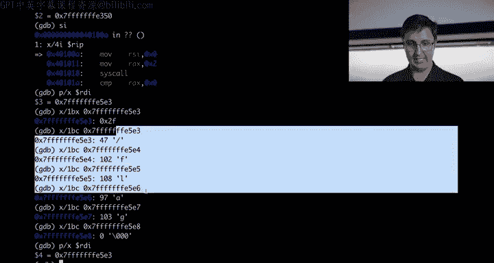

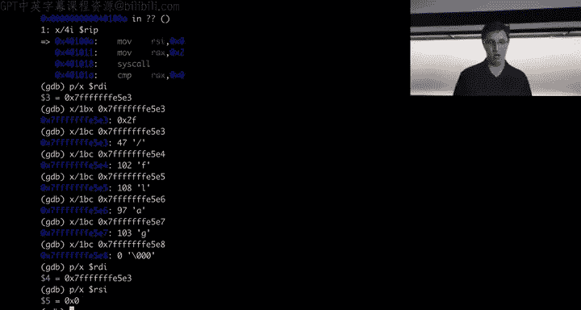

So we're passing whatever the heck flags are and we can read the man page that talks all about these flags。

 there's like0 append0 aync O Ch exec， all these things mean different things that's the flags and we're just passing zero turns out zero means read only so we're opening the file read only and if you wanted to know this good question that a preemptively assuming how do I know that zero is read only if I read this man page。

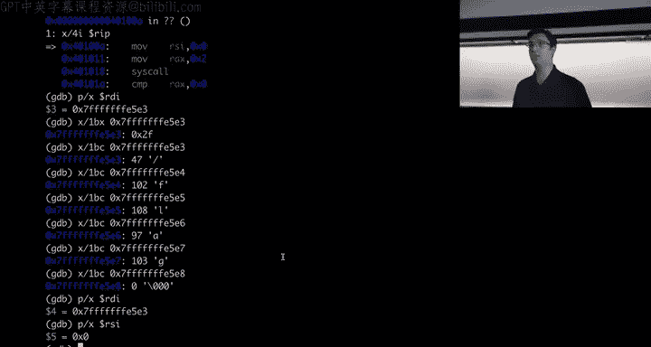

It's going to say it's going to talk all about O read only， but I'm not going to do it here。

 nowhere in this man page Does it say O read only is the number 0。 These two things are identical。

 O read only just means zero Okay but the man page doesn't talk about it's very sad to be cool if the man page talks about the fact that O read only is0。

 There's another one O read writes， This also just has a number associated with it。

 And also the man page doesn't say what number O read write is。😡。

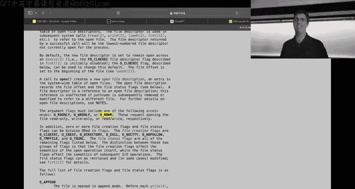

Here is how we can figure that out。oops。Let's minimize this for our quick little side tangent that will become very relevant in building a web server。

 you need to be able to figure out these constants and what their numbers are。Okay， there is。

 here's how I like to do。 there's like 20 different ways to do it。 This is my favorite one。Inside of。

Instead of the file system， there is this directory called user Inc， okay？😡，You're probably whoops。

Probably pretty familiar with user include， and the reason you're familiar with it if you start looking at this。

Right standardlib do H exists and string do H exists。

 these are all things you've like pound included in a C file before when you've written C when you pound include。

 it is just looking at user include by default， user include slash whatever the heck thing is that you specified here。

😡。

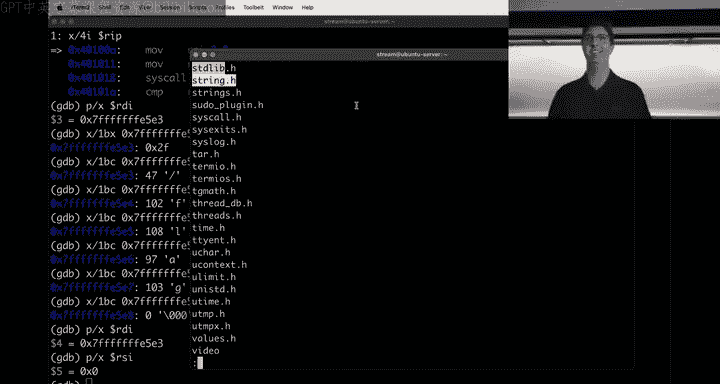

And what these header files specify is what the values of these constants are okay。

 so user include is on the user space side of things and your C program when you specify an all caps O underscores read only pulling in from that header file the fact that O read only is a zero there's probably somewhere in there a pound defined0 read only zero it turns out that is definitely true。

 if I gr through user include for0 read only。😡，Here is every location on the file system that references O read only。

 and we will see define O read only0。This is the best way to do it unfortunately no one has at least that I know of the Man page doesn't save these values。

 there's not like x64。scal。sh， but like what are all the constants maybe like constants。sh。

 maybe you want to create that website that'd be a cool website to a point people at the simple thing is to just do what Gcc does when you do a pound include and follow its logic at least that's the style I like pound to find Oread only is a zero。

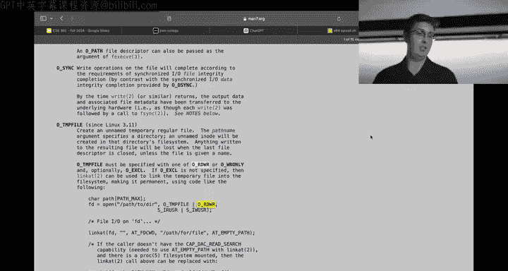

And in fact， if you want it to be more specific， generally this will work out for you。

 you can grow specifically for pound define oh read only， and now you might ask the question of well。

 what is read write？ReadWrite is two。And what is another one of the flags O creates？It is this。

 You'll notice also that it starts with all of these zeros。 This is ocal Okay。

 just some reason and someone decided that they want to define these in ocal。That's fine。

 We can deal with that。 But this is how you find those values。 And so ultimately。

 we're passing0 there。 And then there's that third thing to open the mode。

Fooprint RDX that's also zero turns out the mode doesn't matter for it。

 like there's lots of things to refer to it a user include is what are the values the main page talks about how everything works。

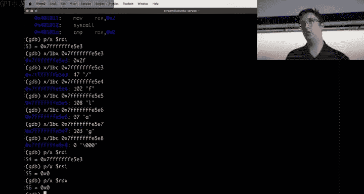

If I search for mode in here。😡，It says here， the argument flags must include one of the following access modes。

 read only readwrite this is a different mode than what they're talking about， we could keep reading。

Keep reading somewhere in here。This right here， Yeah， if it's basically， if you do O creates。

O create lets you create a file on opening and the question that the kernel is going to immediately ask you is well what permissions should this new file have。

 That's what the mode is， The mode just deals with do I want the user to be able to read it。

 do I want other to be able to read it all of that sort of thing and that's what the mode is you only need it for creating the file So we set zero because it doesn't matter I actually am not sure if the kernel would yell at us if we set it to something or if it would just silently ignore it couldest it if you wanted to it doesn't really matter for us I guess unless we got an error in which case we'd see the mode is something other than zero and maybe we should be safe and set it to zero。

And so ultimately。Let's see here where are we， We're setting RSI to0。 okay， we set that。

're setting RAX to2。 Now we're about to do a cis call， we set up RAX， which is selecting R cis call。

 we set up RDI， RSI， RDX， which are our arguments。And the result comes back in RAX。 It return3。

 You might be thinking y 3。 Well， first thing you should be thinking is it's not a negative number。

 which is very cool。 That means it didn't air Y3。 Well， because as open talks about。

In here。Where does it talk about it？嗯妈。Let's see if I search for return。 Yeah， there we go。

 The return value of open is a file descriptor， a small non negative integer that is an index to an entry in the processes table of open file descriptors。

Ultimately， this is just a number that you're going to reference later on。😡。

Whenever something is asking for an FD so for example， read wants to know what file to read from。

 you reference that file that you're going to read from through a file descriptor。

 the way you get a file descriptor， you open a file。

 you open the file you get a file descriptor now you can read from it using the read system call turns out open is not the only thing that will return a file descriptor there are other things that will return a file descriptor So for example kind of a boring one but there's also the open a system call which is very similar to open but has this extra first arguments kind of shifts all the arguments by one and it has this this open a system call lets you。

Open a file relative to another directory so by default you're kind of always opening things relative to the current working directory and so that's what open kind of implicitly uses here but open at would allow you to do something where you open let's say like slash Etsy open that which you can open you can open a directory there's nothing stopping you from opening a directory you might be thinking into yourself like why would I do that Well this might be one place you would do that for so I could open slash Etsy get a file descriptor and then pass that file descriptor to open at and then I might say a file name of password PAwD and now it's gonna open password relative to Etsy and that's the behavior of that And the reason I know that。

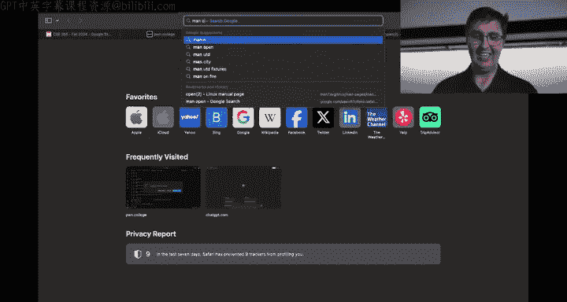

Is I've read the man page for Open at and this will talk about that who the heck is that。

Ads served by Google。 And yeah， so that that's what's going on here。

 We don't need to care about this。 right， There' is just another system call。

 There's a lot of system calls， right， There's 332 of them， according to this person。

You're not going to learn all of them here， but you're going to learn a few of them。

So open returns a file descriptor open at returns a file descriptor in building a web server。

 you're going to use the socket system call The socket system call is how you start doing networking stuff if you want to start talking TCP for example。

 you are going to do the socket system call and so in building web server watch the lecture videos a talk all about the socket system call。

😡，You're going to use the socket system call and that， as it turns out， if we read man。Sockets。

。And we search control F for return。嗯。😊，And yep， I guess it's the very first sentence。

 Socket creates an endpoint for communication and returns a file descriptor。 So you could。

 for example， call socket， and that is going to return to you a file descriptor。

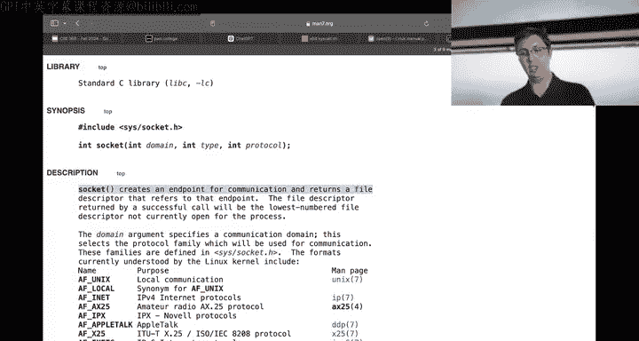

And then ultimately what you're actually going to end up doing is reading from it's not necessarily that you're reading immediately from it you'll see in building web server there's a few more system calls you're going to make turns out at some point you'll make the accept system call the accept system call。

😡。

Here we go。Guess what， the accept system call。Return returns a new file descriptor。

 and everything' is just returning file toscriptors， at least that we're looking at。

 except returns a file descriptor and this the accept system call deals with finally receiving a connection when someone connects up to you。

 you accept their connection， it returns a file toscriptor。

 and if you want to read what they said to you。

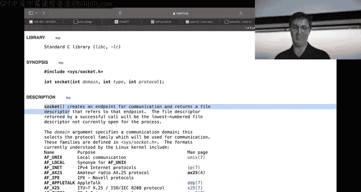

Now you can just use the read system call， so it's kind of nice these file descriptors a lot of system calls emits a file descriptor that means this thing is now readable and writeriable。

 it's kind of nice because the open system call deals with files on your file system。

 the accept system call deals with for example， a TCP connection and then ultimately you can just read and write from these things because they just take file descriptors and it's very nice setup。

Okay， taking a step back， any questions so far on anything I've said， I know I've said a lot。

But this is。This can be your life， building a web server here。Not seeing any questions。Okay。

Let's do what we set out to maybe at the beginning of class here， we talked about how very briefly。

 we talked about how for example， a cat flag can take multiple arguments right we can do cat flag flag。

This is just a problem of control flow， right， we're going to be writing some control flow。

That is going to be walking over orgV and doing our current puppy operation puppy slash flag's happy to print one。

 Of course right now there's no logic in there there's no control flow to handle the idea of well。

 what if there's more arguments we didn't implement that is' just not baked into our program we want to handle this。

 This is just a loop right， we need a loop somehow。

 we want to do the current logic of puppy that works against Rv1 but also make it go against Rrgv2 and then if there's Rv3 right cat can take a whole bunch of things。

 you could also throw an Esy password in there。 and then another flag right the whole point of cat normally you're just passing one argument to cat is outputting it。

 The reason it's called cat for those of you that don't know This is for concatenate This is actually what cat does is it concatenateates files together but obviously most people adjust to use cat to print out one files that's why they're like why the heck is this named after like an animal it's concatenate。

So that's really what cat is， I'm currently puppy。Well with non s cat does not do this。

 So if we want to add this。It's just thiss is a problem of control flow and figuring out。

Where is RV2， where is RV3， where is RV4， and then also figuring out how do we know how many arguments there are？

😡，Okay， so。Let's go ahead， and。Let's actually figure this out with GDP。 Let's if we do。

GDB is start slash puppy， and we do set disassembly flavor Intel。And we do display8 I or AP。

 and it says nothing's there， but then we start I on slash flag and then we'll do ABC， D EF。

 and let's see if we can find these things in memory。Okay。Cool。Okay。

 so we know that this is about to successfully find slash flag and ultimately it's going to take RSP。

It's going to do RSP plus 10， which again， I guess maybe not again。

 GDPDB lets you add things together it's kind of convenient right I can do RSP plus 10。

 I can start like predicting what the program is about to do and start reasoning about it before the instructions take care of it kind of nice。

😡，And then ultimately it's going to dereence it。诶么。Well， we'll keep it simple。

 let's just take this address now。And I can do X slash S to print it as a stream that'll follow that logic of just go into a nullbytes X slash S willll do the whole nullbyte thing and we can see somewhere in here I messed up I messed up because it's a pointer to a pointer right RV when if you've written a C program。

 it's star star or star RV bracket， it's a double pointer if I want to figure out what is here。嗯。

What的。Wellold on， RP， all I'm doing。Very fun mistake to make， I am doing decimal 10。

 we know though that it's doing hex 10。Okay， so we want to see what is at this address at this address is a pointer。

And then at this thing。Is slash flag。 Okay， so the question then is， well， where the heck is。

 what else that I passed， ABC， Where is that guy， where's D EF， maybe where's Rrg C。

 I need to figure out where the heck is my data so I can start doing control flowy things using this data。

Okay。So I think we kind of showed this on Wednesday， let's let's double check， though。

 that if we look at instead of plus hex 10， if we do plus8。Maybe plus zero。嗯ん。😊，Yeah。

That I was gonna be there。 Here's what I'm gonna do Ily do not know where argc is or I have an idea of where it is。

 but I truly don't know the answer to this question。 We're going to use GDP to answer this question。

 Here's what we're gonna do We're going take the stack and we're just gonna print a whole bunch of data on the stack 100 Gx So it looks like at the top of the stack or right at the start of RSP let's's say is the number four。

 So probably that is where argc is because4 sounds like what argc would be。

 And I think we showed last week that that is in fact。

 And then we decided that this is argv in here we could see even more So this is a bunch of our stack。

 we just like。Tumped a bunch of this stack and we're just looking at it。So we have this four here。

 and then we have this E 5 DB guy here。 So let's look for E 5 D0。

And you'll see right in here is like a whole bunch of ASI。

 So let's just roll with this then right the whole bunch of ASI is in here。 And for example。

 if I wanted to like see all this ASII and I wanted to。

 we could print 10 string starting at this address and we'll see all of this data right in here and here and just keep going I've got the environment in here。

And then eventually GDPB starts yelling at us saying memory is not mapped here This is like almost the equivalent of a se fault except G doesn't crash。

 It's just like no you can't go there。 And so we can see all of this stuff is on the stack。

 Now we've got to play a game of how do we reference it I've got a good feeling here that we saw here。

That at RP plus 16。So at RSP plus 16， which is this guy right here， right。

 this is plus 0 plus 8 plus 16， this guy right here。Was slash flag？

Go a good feeling that maybe the next guy is our next argument。 Let's see。 Yep， ABC。

And then this guy right here is D EF， and then it's null。Okay， so this is。

When I talked about how you're referencing memory and you're either going to include a size or you're going to be null terminated。

 this is not just true of C strings， C strings are definitely one place where you use null termination to represent like a path。

 for example。If you think back to see maybe you remember， Arg V ends with a null pointer。

 so it's not just again， it's not just like C strings that end with nullles。😡。

You can also end with a null point term Now in this case。

 we're doing both styles right so this four is the size right so I told you you can pass location plus size Rg V。

 I guess how the kernel sets everything up for us all of this data just showed up from the kernel。

Arg V is doing both， right， It's kind of redundant。 You don't need both。 You just need one。

 It's both telling you the size。Which is saying this four things。 And here's the first thing。

 This is the program name。 This is RV1， RGV2， RGV3。 and then it also no terminates。

 It just did them both。 Maybe some people want to walk until an old pointer。

 maybe some people want to pren the size。It decided to do them both。So what we'll do is。

I don't know we could pick either way right ultimately what we need to do is loop through all of our arguments we could choose to so we want to start Rv1 right we're skipping RV0。

 we're not trying to output RV0 that's just our program name for the purposes of our program we don't care about the program name RV1 though we do care about and that's what we're currently outputting we can either start walking these pointers until we get to a null pointer or we can just use this thing either implementation is going to work just as well。

😡，Let's go ahead and let's just use AG C， I like AG C。Okay。

So we have discovered that ArgC is right at RSP RV1 is at RSP+ 16 before we start writing this。

 does anyone have any confusion or questions about what I'm saying right it's critical that we know where the data is before we start using the data and that we understand this。

😡，Not seeing any questions very okay， hopefully that means everyone understands。

I can quickly check the Twitch chat， maybe。See if there's questions， No， it looks like there's。

Discussions going on in here， but no one has a question， okay。So we're going to in our heads。

 we're thinking about what this program is going to look like， we're going to turn that into X 86。

 you've done this， you've thought about what program should look like and you've turned it into C or you've turned it into Python or turned it into Java just' doing the same thing we're thinking through okay。

 at RSP is ArgC。😡，What we're going to do is immediately derements。Arg C by one。

 And the reason we're going to do that is because we don't care about this guy right。

 So there's only three things。 If Arg C is4， there's three things we want to look at。

 we want to look at this。 want to look at this。 look at this We could think about the edge or not the edge case。

 the default case that we were initially implementing for is where it's just one thing。

 And Rrg C would be two， right， It would be two。 and we just start here instead it's four。

 We got three things to go over， okay。😡，We're just going to control flow for that right take this。

 put it in a register， decrement it immediately， so just take from RP， pull out of memory。

 pull that number into a register， sub that register by one。

 Now we have how many things we're going to go to。😡，Then set some register to RP plus 16。 Okay。

 that's our starting thing。 And each iteration of this loop。

 whatever this register is that has RP plus 16， we're going to add 8 to it because we want to look at the next pointer。

 We're going start at RP plus 16。 add 8 to it， add 8 to it and。😡。

We're going to do that three times because we pulled out of there。

 So we're going to do this until whatever that thing is that we pulled out of here and decremented by one until we compare that with zero and at zero。

 right we're。😡，Sketching what this is going to look like in our heads。

 and now we're going to implement it。 Let's implement it now。嗯。Huppy dot S。Okay。

And when we inevitably make a mistake or maybe we won't make a mistake。

 but probably we're going to make a mistake， we're going to discover that mistake with GDP because I'm going to assume something and I'm going to think about it slightly wrong。

 we're going to see how I thought about it wrong with GDP。Okay。Let's do move。

We want to grab straight out of RSP and throw that into a register。 I am going to use R 10。

 R 10 is a register。 It's a cool register。 We're going to use it。

 And what we're going to do is we're gonna pull out of RSP RP。

 as we just showed in GDP looking at memory is our Rrg C And what I say I wanted to do with R with this thing I wanted to immediately sub R 10 by one Okay。

 so it was for pull out that4 out of memory lives now in R 10。And then we have a sub by one。

 so now it's three if you think about that example we had before。系。We want to open a file。

 and then we're going to output all of the files。😡。

We're going to output the file and we're going to do all of this stuff。And we jump to our wild。

 Heer right， we have this previous logic。What we want to do now。Is well， let's think about the case。

hold on how do I whatever， What do I keep rolling with it。

 Emax is making me a little bit sad right now， but we roll with it。We want to think about the case。

 I mean， there's number ways to write this right The first thing that I'm going to do though。

 is deal with the base case， we know we're about to write a loop。

The loop is going to end as soon as R 10 is0， so compare R10 with zero。 If R 10 is0。

 that means there's nothing to output Now what we should do is jump to done。😡，We have our done label。

 our done label exit zero right so right away， we checked org C after decrementing it by one。

 if it's zero we're done。And this is about to be a loop， we'll call it our big loop。Okay。

 we're going to eventually jump back to this thing。Let's see here， currently we。Actually。

 here's what we'll do instead of jumping to done， we're going to jump to exit。

 which currently doesn't exist。And we're going to rename or we're going to add a bonus label here called exitit。

And we know right now， based on how we previously implemented this。

 I'm not even looking at the whole thing， but someone jumps to done when it's like done processing that one file。

😡，Instead of what we're going to do is jump to。Jump our big loop is that I call that thing a whole big loop。

 okay， so someone jumps the done when it's done processing that file。Instead of exiting。

 we're just changing the logic， we're no longer going to exit。 We're going to jump to our big loop。

 and our big loop is going to decide when we get to exit。 Okay。

 this is this is how we're implementing it。 But there's one thing I want to do。

Before I jump to our big loop， I want to decrement R 10， sub R 10，1， okay。

Because we're basically doing a four loop， right where you could think in C terms I'm doing like four I equals0 I less than arg C minus1 I plus plus right。

 that sort of thing。😡，This is what I need to do at the very end of my loop when someone jumps the done this thing that actually knows how to read a file。

 open the file read the file， I'll the file when it's done。

 it was jumping to done And now what I want to do decrement R 10 by one jump to our big loop if we only had one thing R 10 would have been one it would have compared against0 we need to。

😡，There's an issue here， I said jump exit。This jump exit is not dealing with the compare。 Okay。

 Ju isn't using the results of the compare。 I want to jump if equal J E if exit， right。

 Otherwise it just immediately acts as we see that in GDP or we'll just fix it right now。😡，Okay。

 compare R 10 with0。 if it's equal exit， otherwise go into our logic。 Now。

 there's one more thing we're missing right in here。We are taking RP。 We're adding 16。

 We're pulling out of memory， right， That's what this right here is doing。

 This is always looking at Ag V1。 instead of looking at R Ag V1。

 I want to look at the current arguments。 So I might need to add。

A little bit more so you've read C before you've heard another program there's a million ways I could do this in this case。

 we're just going to do the simplest thing that comes to mind and we're going to basically have two trackers instead。

We're going to instead of adding 16。We're going to oops。Move R 1116。And add R 11。

 we could write this way more efficiently and not use so many registers and do math and stuff。

 but we're going to write this in the dumbest way possible， it's okay。

 this assignment does not ask you to write clean assembly。

 It asks you to write working assembly totally fine if you're being like inefficient with things。😡。

Add R 11 to RDI。Okay， now there's just one more thing I need to do in this loop。

Is add R 118 right so now I'm going to look at the next pointer and the next pointer and the next pointer and so on。

And let's assemble it。Let's so I dis we didn't have a syntax error， which is kind of nice。

 Let's just see if it works for our initial thing。Looks like it works for initial thing。

 does it work for no things and return zero yep？What if I say slash flag slash flag doesn't work darn was。

 I was actually a little bit worried there that I was going to write this correctly on the first try。

 It doesn't work。 This is a disaster。 now I have to debug things。 This is your life。

 You get to debug things This is the most important skill。First thing I'm going to do is S trace it。

 What did I mess up， Can I see from the cis calls and all this cis call is working as I'd expect And in fact。

 instead of flag， I'm going to do Etsy password here so that maybe this that'll show up differently just in case I can see it with S trace。

 Okay， so we open flag， which is what we'd expect the very first system call we'd make is open flag So we're handling that we read right。

 we read。And then look at this。 S trace is very helpful。 It's so nice and Stra is helpful。

 You don't have to figure out everything in GDP。 and Strace tells you something is often going be the case。

 We made a bad system call。 instead of opening Etsy password as we had hoped for we opened 0 x 20000。

 very sad。 and a complained that。 Okay， this means what we're going to hone in on。

 our control flow is like kind of correct。' it's correctly going to an openex， which is nice。

 but for some reason， we're looking at the wrong thing。 And so we are going to GDP。Hoping。

Start I flag。Flag Etsy password， no display8 I RIP。Setets disassembly flavor。

Until we are going to disassembi。X 100 IRP， I want to just set a break point on this open。Okay。

 this open is right here， so actually， I'm going to start at the beginning of this open。

So I'm going to break right here。And I'm going to continue to it and then I'm going to continue to it again so this is the first time it's opening the first file If if I continue again we're going to be looking at the second file so for example。

 print R 10 that was our tracker of how many things we have left to do print R 11 well this immediately looks not good R 11 is pointing at 20 E so whoever the heck is incrementing R 11 right now I would expect R 11 to contain 24 right we initialize R 10 or R 11 to 16 but for some reason it's not pointing at 16 or 24 it's pointing at this weird thing。

😡，And so ultimately， we'll see。诶。Oh， you know。Mmhmm。Ultimately， we've got an issue， right。

 something's going on wrong with R 11。We also have another issue though。Actually。

 the real issue is we're out of time。So we will continue debugging this next week in class or not next week on Wednesday in class and we'll figure out what's going on you want to think through what's going on maybe you'll prefigu it out。

Debugging is going to be critical。 We're going to go over debugging on Wednesday。

 continue our debugging， make our program work ultimately this is your life now for this week。

 Thank you all for attending Good luck and goodbye。

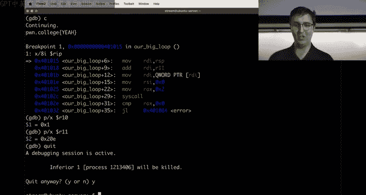