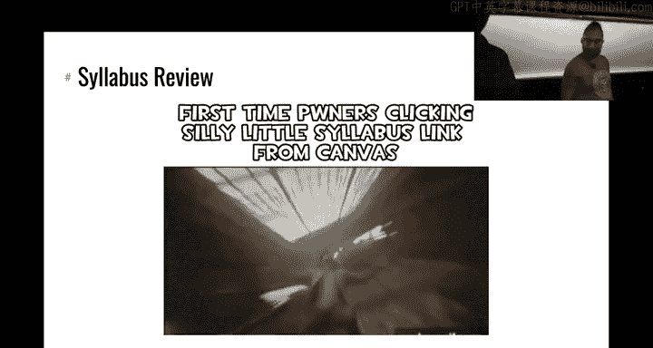
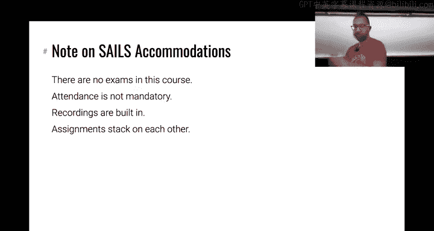

# ASU《网络安全导论｜ASU CSE365 Introduction to Cybersecurity Fall 2024》中英字幕deepseek翻译 - P1：-02-Intro & Syllabus - CSE365 - Yan & Connor - 2024.08.26.zh_en - GPT中英字幕课程资源 - BV1nVCVY9Ehy

I。咩东先。On the sun。I don't know。 It's wrong。S。Hello hackers。

Let's get started oh we need to have said this thing to follow mode let's do this。There we go。

 awesome。All right， welcome to CSC 365 Inuction to cybersecurity。Everyone excited。Yeah， me too。

 Alright， good。 Allright。 So if you're gonna kick the class off today。 First things first， I am Jan。

 this is Conor。 I'm Conor， willll do the camera。 So just everyone knows we're also streaming this on T。

 Oh boy， this handle。 Also now you captured the。 All right， yeah。

 we're start're live streaming this on。 because this is a hybrid slash online class slash mega section as we'll talk about。

 So funds of people are watching at home and obviously people here in person or here in person。'。😊。

You know， doing， doing our best。I'm freshsh from ear surgery， so it's gonna be gonna be exciting。

 I might start spouting off crazy anesthetic derived stuff when I told the doctor that I was。😊。

Going in afterwards to teach， he laughed at me。 So we'll see how this goes。 Okay。

 Connor is here authorized to。😊，Remove me。If things go off the else， okay。So。

Let's talk about cybersecurity' going to dive into an example first of cybersecurity going wrong and cybersecurity by example up there。

 and then we'll go and talk about this class quick， I'm going to switch the thing。

So that people can see it nice， all right， so cyberse。This。

Is the picture a picture of a very famous hacker。 It's not the anesthetics going crazy yet。

 This is Fance Fisher， or F Fisher's avatar。Fance Fishcher is a。

Kind of hackiv that has since faded into legend。诶。And we're going to use some of her exploits。To。

Look into how cybersecurity breaks down and how basically small security issues can just pile on on and on。

And these are the kind of issues that actually for real， you guys will be looking at in this course。

Right。All right， the legend goes and this isn't just legend。

Connor and I were there when this was written and a lot of this kind of source from an interview that Phus。

I actually did via puppet with was it Vi magazine Yeah。

 this is a on the right there is a dude from Vi magazine interviewing this puppet and Fse Fisher had taken。

Offence at。A some business practices of a company called Hacking teeth。

 a cybersecurity company that at the time allegedly and in the course of this hack turned out in actuality was assisting。

嗯。Regimes around the world， with kind of。诶。To using offensive cybersecurity to carry out things that F Baishcher felt was unethical。

So。As a activist， Vas Fisher。Brrooke into hacking team and one sunny day in July of 2015。

Through hacking teams Twitter account released all of their dirty laundry， all their source code。

 all of their internal emails， all of their audio and video recording of their internal security systems。

 everything right all right， so we're going look at this kind of as an example of a cybersecur attack and an actual cybersecur event that that happened in practice and that。

We can really dig into deeply because Vase Fisher then wrote a very。

 very detailed write up about what she did exactly step by step and published it on the internet。So。

How does Benez？Go about doing this。 First things。 Actually， I just realized this link is on the page。

 It should be static thattonda college slash all of that。 You can read the write up。

 I mirrored it here， or it's also available on the Internet， so。😊，Finance fisher。

Decided to hack the hackers step one of the hacker hacking the hackers was reconnaissance hackcking team was a cybersecur company。

 actual very， very elite group of hackers that took security seriously that had very little and carefully curated network facing infrastructure had a really low profile and just。

Really took security seriously， right so。Finance Fisher did a bunch of reconnaissance and realized。

 okay， these people are careful but。No one's perfect。One of the very few external facing servers。

 devices that hacking team ran。Had a available firmware on the internet。

 the code running on these devices was open or not open。

 but available to download finance Spishr downloaded this code。Look through it and by code。

 I mean compiled binary software running on that device。

 looked through it and found a zero day vulnerability。😡。

This is something that you will be doing approximation of in this course。

 learning about how this can occur。Once she found this vulnerability， she had her way in right again。

 as far as anyone knew， including hacking team。That security was flawless， but one vulnerability。

An Fez had her foothold。She got into their network。UAnd started doing internal reconnaissance。So。

Since she was in their network using a zero day that literally no one else knew about could scan for。

 could。Kind of try to watch out for a compromise up she had all the time in the world。

 she casually looked around the internal network， being very careful。

 starting out with just listening on the network passively。

 which is something that you will be doing in this class， then doing careful， slow network scanning。

 which is something you'll be doing in this class， maybe not as careful， not as slow。

And eventually found an unsecured server。Of the physical security system。

Because the security of these types of。Embbedded network systems， you know， the closed circuit TV。

 et cetera， et cetera， is terrible。But it's something that。

If you are a company with a physical presence， you're going to run a physical security system， right。

 you're going to buy it from a vendor， they're going to set it up。

 and then their security issues become your security issues。😡，So already。

 right off the bat off of one exploit that no one else knew。

Sez Fisher managedly grew out into their network。And retrieve all of their。

Internal physical security recordings， which is already pretty brutal， right。

 if that was the only thing in the league， it would have been a massive embarrassment and probably a lot of。

Very secret phone calls that were recorded would would have been leaked， but。Of course。

 she went farther。She started increasingly gaining influence in the network。 So first。

 Venez looked at。Uh， the servers that she had easy access to and she found a backup server that was not well protected。

And from the backup server。She managed to extract the backup of the mail server。Basically。

 and as hacking team had careful IT practices where they made backups。

They made backups to the mail server， they stored that in the backup server by retrieving the mail server backup for as Fer was able to extract credentials。

From the mail server。And it turns out that these credentials were still being used。😡，By hacking。

All right， now。If you are a company with a whole pipeline of complicated technological networks and et cetera。

 et cea， et cetera。Making backups is a very reasonable thing， right。

 and not a lot of people think very， very， very carefully about okay。

 but what happens if someone guess on our backup server。 All right， so now finance Fcher had。

The password of the domain administrator for hacking teams and kind of Windows network。

But she still didn't have kind of the holy grail that she was looking for。

 the source code of hacking teams security software that they sold to their clients。And using。

Her access that she retrieved by cracking the mail server。She installed key s sniffpers and the。

Computers of the developers。Snnied keys until she found。

The password for a security monitoring system， ironically。

 that was connected to this development network that hacking team used and managed to jump into that security scanning system using that password。

And then spread from there to leak out all of the source code of hacking team。And then。

By using her control of the mail server， she sent herself a reset。

The password reset email from Twitter， resets the Twitter password uploaded the leaked documents to an online upload service and tweeted。

Compflete compromise。 This was a shit show。I remember I was a graduate student when this dropped and it was chaos。

 There is one of the largest acts。In terms of， of kind of。

This very unique impact in that it was a security company that I got at。And also。In that。

 there was this really in depth write up where you could see step by step how this security broke down and it all started despite the fact that hackcking team actually had a very。

 very good security posture， much， much， much， much better than your typical company's security posture。

1，0 the vulnerability in one embedded device。That Fse Fisher was able to。

Leverage into a complete compromise of their whole network。Eggs。Now， we could look at。

Really deeply at the postmortem of this of this hack and say okay yeah。

 but they they were using a physical security system that didn't have hetero security but you know what most likely so is ASU right most likely so is anyone here that has a physical security system at home these things are typically pretty terrible you can say they didn't isolate their backup storage system。

 but you know all of these things that we could point to they reuse passwords。

 they didn't have too fat authentic all of this stuff is easy to point out。In retrospect。

But the fact that we continue seeing。Comproises on this level or more just。Two or three weeks ago。

 there's another massive compromise where everyone's Social security numbers got leaked again。嗯。

Shows that these are all hard problems and in this class we're going to dig into the problems。

 we're going to look at cybersecurity by example， we're going to exploit these vulnerabilities to understand how they arise。

 how they're used。😡，And potentially how to try to prevent that。Sweet now。诶。

Preventing these compromises。😡，That last part is TLDR， very， very， very， very hard。Right。

 as a defender。You have to get lucky every time， you have to block every shop。As an attacker。

 you just need that one zero day to land once。And you got a good plan on what to do once that happens？

Then you can leverage that into a situation like this。All right。

 so that's kind of the frame of the class。唉。Before we go harder。

 we're going to talk about something very near and dear to all of our hearts。

 especially conor ethics。Connor， all right， take it away。 Thank you， Jan。All right。

 let's switch over to the ethics discussion here。高。嗯。😊，All right。

 this is kind of going to be an interactive thing here。

 so we're going to discuss what are the ethics here of what happened with hacking team so。

I guess let's actually just leave that as an open question。Did hacking team do anything wrong？

Would you have done the same thing， Anyone have any thoughts on the the story that Janwn elucidated for us。

 You were in that situation。 Let's say you you know， this hackivist group， you go in。

 you find all this information Is what they did okay。Anyone morally chill， yeah。是。Yeah。

So maybe I think on service they。行楚。Oh。啊。也什么。东西。Do you think that。

The hacking and releasing all of the source code on Twitter was not okay。Okay。

 so you think it's good， okay。97。Yeah， it's not an easy question。Don things。

There's a whistle blowlow around。Yeah，ez Fisher as a whistleblower as a whistleblower yeah。

 Does anyone agree， disagree。Is it okay to do that？

Like where are your personal ethics currently and it go for it or you know。

 it doesn't have to be your own personal ethics， what are your thoughts on it？A地址。困了。Okay。

 so maybe it was ethically fine but legally good luck to you。Like you said just。是的。Yeah， I mean。

 it's interesting sometimes when maybe your own personal ethics framework disagrees with the law or something like that。

 but you still are taking into consideration the law。

 does anyone else have any thoughts on what happened here yeah？So。Mmhmm。没。

I think they probably could been to in the law。It。小人。Still need some of these will to say， hey。

Because are。嗯嗯。😊，owSo you think maybe you would have。

Potentiialally done the same thing but not literally release the source code。

 maybe some sort of release of something that indicates clearly I have the source code but not actually release the source code。

 for example， Okay， does anyone else have any thoughts on this。

 you know the ethics of this situation yeah？So。嗯哼。😊，就在其他。

And it's not exactly the same admit as so organized。啊，没。of something。 and they。

So in this case me here。other case。It really dependss。 And you could even say。是。少。

So maybe like other examples like the GTA 6 hacking is not in any way morally righteous or something。

 so it's just it's just bad straight up。Yeah， yeah。😊，Right。Yeah， go for it。Yeah。我提示两句。对。What。对。哦。嗯。

Yeah。Okay。我先嗯。Yeah。Sah。Against someone that you view is good now they're doing the same thing against that is now is it okay。

 Yeah yeah， I guess that's an interesting thought Okay so。

Regardless of what you believe here in this ethical situation。

 I think I would personally agree there's。Some level of complicatedness to this ethical situation。

 But what we're gonna you know right off the bat start by saying here is you know our opening ethics lecture of this class is as you kind of mentioned。

 some things you might view as maybe ethically okay。

 maybe we'll convince you that there are more relaxed ways of doing these things that are you know the security community has determined to be the correct ethical decision if there is such a thing as correct ethics but the first rule。

 you know， we have to get out the door with is you know some of this stuff is definitely legal like what they did。

 I mean almost certainly its illegal And so you know we have to stress。

 don't do anything illegal in this class and what does that really mean is kind of a very simple rule as this says right here。

 you know， never， ever， ever， ever， ever hack into a system that you do not have explicit permission to hack as it turns out in lots of know bug bounty programs。

Security gets more and more modern the industrys kind of realized that it often appreciates lots of different people going into their systems and actually taking a look at it。

 but they'll outline exactly what this is allowed and what's not allowed so you know for example I believe like Facebook has some sort of guidelines on what it looks like if you want to attempt to you know hack Facebook I think they have like a。

😡，A separate server setup that is running very similar code to the same code。

 and they outline what is permissible in that situation。 you're ever unsure。

 don't do it right if it's not your system and you haven't found the guidelines and explicitly what that server is saying is acceptable as part of an investigation never。

 ever， ever do it it's likely illegal so yeah， so the question then is how do you practice right we're here to learn this is you know CSC 365 at ASU or're in a learning course and we're about to do kind of applied hacking in this course So the way that we're going get away with this is that we are going to tell you what is permissible and as it turns out we'll see there's a bunch of challenges in this course and those challenges are free re you know you get to investigate them hack them as you see on the other hand。

 you know we also have this course running on a server that lots of you will all be accessing there is。

Ination on there like you know student information that is not permissible right so the challenges as we'll see as you know we kind of explained this course a little bit more are permissible going after the core infrastructure of our servers is not permissible with limited bug bounty exceptions So as it says stick to software and service with bug bounties you know there's kind of a fun loophole in some of this if you become an academic you actually get some limited exceptions you want to talk about any interesting you know studies you've able to do because of that I'll let you slide into the here So it still wants to follow。

干完。If you're looking which this camera like follows us so that's why we're being weird we're going to have to wave to it again。

 my camera follow me nope。Connor， you have to hide there we go， all right， perfect， Okay。

um oftentimes something that that stops your security research。

Into things is the worry that a company will sue you for it right hacking software is that you set up and that you know you own the systems on which it's running and so on is typically not illegal but it's oftentimes against terms of service and companies can sue you in civil court for violating that the digital Millennial Copyright Act actually carves out an exception for researchers。

 which we use quite a bit so for example， I've done research that has led to the cracking of copyright protection on for example Netflix and Spotify and streaming services like that and we' were able to do this safely because your academics doing this for research to publish papers so a cool way to really open the。

Amount of things that you can safely do and if you do well in this course。

 I'm going talk about what that looks like in a sec then。

My lab oftentimes has research positions open so you can work with us to do some cool security research。

Cool。The TLDR is be careful， be careful about ethics， you will learn a lot in this course that。

 you know， it's an intro course in some sense the techniques we're teaching you。😡。

A introductory techniques， I mean they are introductory techniques。

 but you'll be shocked at the sad state of cybersecurity out there。

 someone set on twitch as you're talking about Phas Fisher that as the saying goes the S in IoT in and of things stands for security right there is no s there is no security。

 oftentimes still people design protocols and systems without actually thinking about security and then have to try to retroactively add that and it doesn't work super well。

All right， so let's move on next，'s let's talk about what this class actually is。All right。

 scam's on me right now， right sweet。Okay， so welcome to 365。We're going to have this slide deck。

 it's actually already， I think， pushed to the website that you'll keep adding to throughout the。

The year you'll prefo every kind of section beyond with the dates today is the 26th。

And we're gonna start with a syllabus review， right， so。This course。

We'll send you down the rabbit hole， this is a meme straight from Discord。

 one of my favorite meanss so far this semester right off the bat。

 so you'll notice when you open canvasva， there's one announcement from me saying we will not be using canvasva and the syllabus link here to the syllabus which is hosting on Tco。

How many people have now read that syllabus。All right， well they're going read it again。

 So let's follow this。Individual down the rabbit hole and pull up the syllabus。

And see if I can take whoop。

， baby， I got it， All right。Cool， I guess this camera is hidden from all of you maybe at the top you can kind of barely see the camera with this camera is pretty wild。

 Okay so yeah， we're going to talk about the syllabus。

 the structure of this class this class is unlike a lot of other classes in its format you'll see we have some strange ways that were set up the number one first thing you're gonna notice is we're not using canvas we technically have a canvas I'm going try my best to put assignment deadlines and like synchronize your grade to canvas because I don't know what it is with modern students I'm kind of blaming you all I guess Can is just it seems baked into education now so we're going to try our best to mirror things to canvas from a grading and assignment deadline perspective because I know well if you rely on that but the Pone college website is the authoritative source in this course so let's jump into the syllabus and the structure of this class。

You'll see that on this Dojo's page we'll talk about what the heck of Dojo is we've got CSE 365 Fall 2024。

 This is where the entirety of the class will take place this， this this room right here。

 the discord， these are like the only places and the recitation room as we'll talk about okay。

So let's go ahead and first things first， actually， how many people。Wellold on as soon as it loads。

 maybe a couple seconds。 the issues it gets your grades also it's okay， this， this right here。

 this is the setup page。Yeah I think does the announcement link to the setup page the announcement links to the setup page Okay。

 this is the very first thing you should do you need all five green check marks you'll see I don't have all five because I'm not officially in the class so I can't link my ASU student ID you will have all five green check marks raise your hand if you already have all five green check marks All right。

 if you don't already have all five green check marks your job like right now as I'm talking slash immediately after this class is to get all five green check marks if you've recently signed up for this class as in like in the last I think hour I think I just updated the the thing I'll need to update the roster so that your student ID can be linked but otherwise you should be good to go message me on the discord。

You're struggling with this。 Hopefully the five things tell you what to do well enough。

 But if you are unsure， join the discord， message me on Discord。 I am k on the Discord。

 He is Zardis on the Discord， as we'll see in the syllabus here in a second message us。

 but this is your first responsibility。 If you do not do this。

 we will withdraw you from the class and you will not get any credit for this class。 Okay。

 so like in one or two weeks。 we'll see how generous we're being。

 We will withdraw everyone that has not joined with this。 It takes you one minute。

 it's gonna be very simple。 but this is how we can grade you。 so if you don't do this。

 we have no way to grade you。Okay， so do that。 Now let's talk about the structure of this class。

 See's a whole bunch of good stuff。 I want to start though talking about we want to talk about let's talk about the first and foremost thing the first foremost thing there are four sections for this class。

 There is a Monday class Probably all of you are in the Monday class。

 maybe some of you are not in the Monday class。 that's probably fine enough。

 there is a Wednesday class。 there is an entirely online class and there is an ASu online class。

 However you have signed up for this class。 you are all the same Okay we are doing one mega section on Wednesday。

 we will not be repeating this lecture。 we will be going to the next lecture。

 This is all one giant class。 I'll say probably for the first week or two unless you have the day assigned So unless you are the Monday or the Wednesday。

 Probably don't show up to class because I guess we have some amount of open seats。

you can show up to a different class， but if you see that the room is full unfortunately we're gonna ask you to leave I mean。

 poor people sit on the or people however we can do this we don't want to get in trouble with the fire marsll otherwise we don't care but that is gonna be normally as the class goes on some people decide they really just prefer online so seats will open up and in general throughout this class you'll be able to show up whatever days you want and when we say don't feel like you need to show up we don't mean you can miss the lecture you are still responsible the lecture live or packing up right afterwards on on YouTube if it's really boring just wait for YouTube two times speed it'll be great but hopefully we're doing something valuable in this class where you know maybe it's got to be 1。

2 times speed or something that't know but you are responsible for all the material on this class next interesting things so I'm saying that however there are no exams。

What we're going to be discussing in is most of these classes the exception kind of like today is going to be talking about the concepts related to the assignments 100% of your grade is assignments。

 we're going to be discussing the concepts surrounding the assignments。

 hopefully our discussion of those concepts about the assignments helps you with the assignments。

 even if in some points you know we're a little more theoretical than applied。

 we're not going to show you how to solve level7， but what we'll talk about the concept in level7 100% of your grade is assignments and specifically we look at the syllabus here。

😡，Right here。Okay， there is going to be probably， I guess we don't guarantee it。

 but probably there will be 10 assignments， so the first two assignments in fact。

 have already been released and are due on Sunday at 1159 pm。

Who here has already started on the first two assignments？

All right about half the room you have not raised your hand， it's not the end of the world。

 obviously this is the first class and maybe you know you didn't get your announcement。

 but this class is going to move very quick please， please， please。

 please please start on the assignment today if you have not already or you're going to be very sad yes。

To calibrate。The first assignment is 840。 The second assignment has 39。

 So these aren't necessarily say even small assignments。 they're not difficult assignment。

But they're definitely not small Yeah， and especially， you know。

 everyone kind of comes at this class with a different background to some extent。

TheThe modules and assignments are。Designed to kind of hold your hand along the way。

 especially these first two assignments so they'll teach you。

 but some of you might be able to know solve this first assignment in an hour some of you might take you know I don't know 6。

7，8 hours So start now so you can figure out which category you fall into no worries if it takes you 15 hours to solve this assignment maybe that's hopefully it doesn't take you 15 hours but if it takes you a long time that's a good thing that means you're learning something if it takes you an hour probably we kind of wasted your time for an hour a little bit。

 hopefully not too much to waste of time this class will cover a lot of concepts。

 but please just start now so you'll see that on the syllabus we have checkpoints and challenges is like kind of two categories for assignment1 assignment2 etc。

The checkpoint is a pass fail at approximately one week into the assignment being released。

 the checkpoint hits and I believe the checkpoint requires that you have completed at least 30% of the challenges for that assignment so this is to make sure we just have to make sure you're starting early especially on like a two week assignment so at the one weekek mark you will have to have completed 30% of the assignment this is a pass fail hopefully honestly this is just like helping your grade that means like the first 30% of the assignments kind of work double so this is just kind of helping your grade but also making sure you're staying on track。

If you are ever confused about when an assignment is due。

 what you're going to do is you're going to go to the grades page。

 you'll see I am currently failing this class， whichs is just fine， it's pretty sad。

But you will see that we have the deadlines for these assignments。 Okay， so 2024，9，1，23，59，5959。

 always Arizona time zone，-7。 you'll see that I need to complete 25 of Linux luminarium to get that checkpoint and 84。

 if I want to get 100% on Linux luminarium， 11 for the second1，39， you know， etc ceter。

 Okay so look at this。 This will just be a summary of what you need to do I1， etc cetera。

 This is the truth of your state in the class as far as grades are concerned。Okay。

Does anyone have any questions about what I've discussed so far， the structure of this class。

 is anyone confused about the fact that this is a mega section？

Hopefully there's a question in the back。才机。Let's read Yeah So the question was。

 are these assignments due every week or every two weeks depends on the assignment So these first two assignments were simultaneously released and they are due on Monday So one week Well。

 I guess Sunday at 1159 it'd be very clear I'm ever if you' ever confused check the grades page they're due Sunday at 1159。

 Some of the assignments and in fact most of the assignments in this class will be two weeks and that's where the checkpoint makes a little more sense because the checkpoint will be one week in So yes。

 it depends on the assignment。 you can see our rough estimate right here on the schedule part of the syllabus。

 This is kind of our rough estimate of the timeline of the assignments。Yeah。

 so hopefully that answers that question I saw there's another question question on which was the difference between assignments and checkpoints Okay。

 so checkpoints are a component of the grading of the assignment so。The way that it works， as I said。

 checkpoint， you complete 30% of the number of levels。 So for example， we will see。

 let's let's go to the grades page。 We will see that the very first assignment。

 which is called Linux luminarium， has a total of 84 challenges。

 So so far I have solved one of the 84 challenges。The checkpoint is a subset of them and you technically can do any subset you want。

 you just have to do 25 of them， so 25 of the 84 challenges you do that by the checkpoint deadline。

 you get your pass fail grade of that you either get the 30% or you don't get the 30% and then the other grade is just at the actual deadline deadline and that is just how many divided by how many are there that you did。

Okay。S there's maybe a question over here， nope good， okay， any more quite yeah question yep。水一。Yeah。

 we're not going to repeat this lecture on Wednesday as a reminder if you're in the Monday section you're in a hybrid course so some of this will be online or if you prefer to also show up on Wednesday that's fine。

 it's a hybrid course which means were not repeating lectures you can watch it on Twitch live or you can watch on YouTube after the fact if you're busy during that time on Wednesday either way you're responsible for watching all the lectures regardless so which section you're in you're responsible for the live lecture on Monday you can catch up after the fact the live lecture on Wednesday which you can also catch up after the fact and all prereed lectures and all thes。

Yeah。So question in the back， yeah。Okay， there's a question of how many attempts。

 there's a good question about the structure of this class。

 There's not really a concept of an attempt in this class。 you either get the flag。

 so we'll see here in the syllabus， let me show you if you want to read more about it。

This right here， challenge based assignments with flags as rewards。

You either get the flag or you don't get the flag。 You can continuously try to get the flag until you either give up or you get the flag。

 So there's no concept of you get one attempt。 You get to attempt until you're done with the challenge。

 So yeah， hopefully that's kind of nice。 You know， there's you work on it until you're done or give up。

 hopefully you don't give up。which maybe brings me to my next point。

 so we've kind of discussed the structure of this class of omega section， et ce。

 there's one other critical component of this class which I have not yet mentioned。

Wch is where is gonna be the best part Well you can look at a typical week in this course。

 which is the recitations every single weekday from 4。

30 pm to 520 pm in brickyard engineering 209 we will have recitation I believe you probably technically signed up for one of the days for recitation it is entirely optional it's entirely for your benefit and you can show up any day So the whole ASU I signed up for Tuesday recitations that doesn't mean anything at all or if somehow you didn't sign up for recitation that also doesn't mean anything at all every single day 430 every weekday 4 30 pm Byard engineering 209 the purpose of the recitations is to have a bunch of people that know the material the Ts ready to help you you'll like raise your hand with the question' I encourage you to just show up and just start working on the assignments and if you get stuck。

 we raise your hand that's kind of the format It's very relaxed。Like I need help when I want， blah。

 bh blah， blah， blah。Yeah。The alternative way of getting help in this course is the discord so when you do this setup you'll join the discord。

 the Discord is an asynchronous way so it's not just 430 to 520 it is you know whenever you decide to send a discord message it's going to be a way for you also to get help Okay I see there's a question in the back yeah。

It's a good question so the question was is the recitation in person or online Monday through Friday at 430 in brickrickyard engineering that is in person there is no that that one is not online I believe we have a recitation however。

😡，On I guess we need better upside is right here Saturday。

 we will have a synchronous recitation of sorts not in person only on the discord at 430 to 520 we have。

 I think a recitation voice channel and we'll have TA or maybe multiple Ts depending on how things go in that voice channel to assist you as well for a more synchronous thing However。

 remember that the discord is always there asynchronously you can always just like ask a wellform well thought out question and hopefully someone helps you eventually someone will help you etc。

yeah。So those are kind of the modalities of help。Question。It's up to you。

 you're welcome to show up to multiple I will say with a very。

 very slight caveat that if the recitations become like so overwhelmedhel that we literally don't have space。

 we might have to change course on that， but probably you can show up to any recitation for now we'll say yes。

 if we hit a problem， we'll adjust in this course with how we're going run that。

We do have an overflow room which I'm not going to announce so that people don't get confused。

 but we do have a bonus room available that we might split the recitation into two and we'll figure out things。

 but we'll do that as needed for now BYEG 430 is your place 209 B oh yeah BYENG 209。

 check the syllabus 209209209 Okay， questions on T。

Can someone pass the class by just doing the check class？No。

 unless you have unless we decide to institute a very aggressive curve。

 which we will not know the checkpoints are 30% of your grade in total so you're going to get if you only do the checkpoint。

 you'll get a 30%， hold on wait a second。Why what would it be the math。

 you would also then get 30% of the 70%。 So whatever the math is， technically。

 you could get maybe a 50% still a failing grade， but I guess it's better。 I don't know。

 I don't know exactly the math， but almost certainly not do more than the checkpoints。

 but do the checkpoints。So Conor， yes， if you can do so well， just doing partial credit。

 Why would anyone power through every single challenge， That's a good question。

 Why would you do all the challenges， We have a very fun reward in this class。

 with a little bit of a caveat that's slightly different than exactly the course。

 But if you do everything in the course， you will be eligible， I believe， right。

 there's nobody that's not true。 Yeah， Yeah， definitely true。

 If you complete every single level of the assignments。

You will be eligible for a very cool orange belt。 So if you've seen the P College website。

 there is belts at the top， these belts are real。 There are belts。

 You can wear these belts to graduation， walk into an interview with these belts， whatever you want。

 you know， we've actually heard reports of people interviewing。

 I don't know if anyone's actually worn their belt to an interview。 I don't know。

 But some people have I don't know that they have talked about the fact that they have a Poe college belts at like random interviews across the country the world。

 and some subset of interviewers know about Po College and they will be like， wow。

 you did P College belts。 So it's explain some traction。 You can brag about it。 Yeah。

 it'll be very cool。 just I'm an introduction cybersecurity course。

 you're embarking on a way of life。 Yes， Yeah， some way of life。😊，Awesome。

 can be whip the professor with a belt which probably probably not。And。So another question， Ka， yes。

 let's say you don't make the checkpoint on the very last weekend you focus your own letters you get 100% by the due date。

 will your grade not be 100%？Your grade will not be 100%， so it won't be a0% though。

 fortunately for you。 we do have a late policy。 let's find where it is so this isn't late this is by the deadline by the deadline okay so if an assignment is due which two assignments R do let's actually go to the grades page for clarity if you you know it's a little bit weird for this first two assignments。

 but once you know the checkpoints and the normal assignment deadlines diverge。

 which they will eventually you'll see if you complete everything by the deadline。

 but don't do the checkpoint， you will not get anything for the checkpoint grade。

 So if you do 100% of everything after the checkpoint， but before the deadline。

 you will get a 70% on the assignment。 you will have done 100% of the challenges。

 which gives you you know that 70% grade， but you will get a 0% on the checkpoint because you did not follow through with the checkpoints。

 you gotta do the checkpoints more likely than。Not the checkpoints will help you they're a little bit of a。

 you know a fun grade inflation thing probably unless you don't follow along and do the check by the checkpoint is making the early assignments worth more as long as you follow along at a good pace make sure to start early Yes explicit go to the checkpoint is the four season。

With a stick because you can go through and solve every single time and burn your belt。 glad。

 You get the belt。 you get the belt， but you're going to get like a C Z minus C minus。 Oh。

 you don't have minus Let。Okay， awesome。Let's see question on Twitch。

Will grades be updated automatically as we keep doing the challenges。 Yes， always。

 if you're ever wondering， what is my status in this course， as far as grades are concerned。

 check here。 This semester， for the first time， we are attempting to also synchronize your grades to canvass live。

😊，It might not work out， it might have bug because we'll figure it out this page right here is ground truth and if you think there's something wrong with that then message me you think there's a bug in this page but this should be ground truth this is' when we're running stats reports on the course to see how everyone's doing this is what we're looking at。

😡，If the canvas is wrong and it's showing that you get an a plus， it my。Will God be honor， Yeah。

 honor this debate Hol College website。 Let us know， though。

 if it canvass is lying to you in a mean way。 But Poland College website， this is the ground truth。

 Canvas is like we're gonna try our best to support it as well。Okay， final thing late policy。

 what happens Yes， people are late so we also， I guess we want to go back and I honestly don't remember if we forgot to close that to the Oh。

 I'm sure we did， right。You know you'd expect？Laiate。Yeah， every fuck。 now we didn't include it。

 Okay， we will update it's only to your benefit。 The syllabus is about to get more generous。

 after the assignments deadline， everything is still worth 50%。

 So that only applies to these little 7% guys。 Again。

 the checkpoint is past fail at when that checkpoint is due。

 You're never getting the credit after the fact。 But for 70% of your grade。We have a 50% late policy。

 so if you do everything the last day of the class， you will get a 35%。

If you wait until the last weekend before grades are due and you solve everything willll give you a 35% it'll be great probably you won't pass。

 but you won't have a zero Okay， and then finally let's talk about actual second Yes， all right。

 next point again， this is there's a question go for it。So let's see。说那个。agent to go back。Exactly。

Yeah， yep， so even the assignment that we released last week and is due on Sunday at 159 PM。

 if you wait two months before， you know， you go back and solve some of the later levels。

 it's still worth 50%。 Y，50% all the way up until grades are due。 I believe is December 16。

 So probably what's gonna happen。 It's December 16。 I'm gonna click a button。

 the grades will synchronize and that'll be that。 So all the way up until grades are due like December 16 and。

That doesn't apply to the checkpoint once the checkpoint's gone， its gone。 Yeah， the checkpoint。

 though， is。The whole point of the checkpoint is to make sure you're following along with the course and reward you with grades for doing that。

所。Okay， extra credit， So not only do we have 100% of your grade being assignments。

 but there's an extra 15% possible potentially we'll see how many of you actually get 15% extra credit but you can earn up to 15% extra credit。

 Yes a whole like letter and a half of grade of extra credit in this course the way that you earn that well we have a few ways。

 is this is probably the most fun way and for many of you maybe the most approachable way to get a lot of extra credit。

 you can get extra credit by making meme。 so we have the discord。

 we have a memes channel on the Discord。 if you'll post a good on topic educational。

 not bad meme you will get up to half a percent of extra credit every week so you can get half a percent per week that will reset at Sunday at 1159 pm will I think need to update that to say that but。

Sunday 1159 pm every week， so that means you can get like I don't know， maybe 8% extra credit。

 I'm not sure exactly how that aligns maybe it's eight and a half%。

 but you can get half a percent of extra credit per week for good meansme these memes have to be good though。

So what is a good meme a good meme is an on topic So right now the first two assignments have to do with like Linux command line and HttP。

 hopefully there's like a certain like insightful snarkiness or something in your memes something that like it's conveying that you understand the material and some like interesting way that means that you know God over here laughs at his computer sees that and marks you down for a good meme There's a liked memes channel for like logs of this we're try and also make sure update your grades as often as we can to make sure you understand there's a like memes channel that has a log of if your meme was like or not it also have an emoji on it post good memes do you want to talk about bad memes so there's a lot of people posting memes and some of them are terrible even that limit someone goes up to Twitter finds。

Some random low effort me and puts in the channel。😡，B me in jail。So。Thank。

We are trying to keep the quality of meats relatively high。Bad means you get one shot， one strikee。😡。

You go to Meme jail， you're no longer allowed to post meetings。

 potentially for the rest of the semester。You lose this entire tro。This route turning back credit。

 There are others， and you'll have to take down its。 Probably a couple times about this semester。

 you'll have a jail bridge where you just。Release people from meme jail but people make that meme straight to jail straight to jail。

 don't pause bad memes， you will go to jail meme jail Okay there are other ways though so if you find yourself in the unfortunate position I think they're unfortunately maybe a few students already in meme jail Very sad don't worry maybe two people are already in meme jail we will probably be the extra generous and release you in like a week since maybe you didn't read the syllabus or something we'll probably be nice to you and release you soon if you find yourself in the unfortunate position of meme jail Don't worry。

 there's still 15% you can earn it entirely without memes though meEmes might be the easiest way you can earn extra credit for helping other people So on the discord。

 we'll talk a little bit about the collaboration policy the discord is meant to be a collaborative environment for helping each other understand the concepts presented in this class。

And so if you are kind enough to go and help your fellow student and also maybe encourage them to thank you in case they forget to thank you。

 hopefully this culture develops nicely， you can receive extra credit we have a very complicated formula for how you earn your extra credit you get。

 oh boy this plus to not you get 1。337 times log base two of the number of banks you based to the log based。

Wait raised。 Yeah， that's an it's raised Okay， even more complicated。 1。

337 to the log base two of things。 In other words， you get 1。

3% extra credit if you help what two people。 I think that's how algorithms work。

 If you help two people， you're gonna get 1。3% extra credit。 And if you help on 256 occasions。

 maybe you're so helpful， you send this like very insightful post that discusses a concept concept and like six students thank you for that post。

 Well that's like six occasions immediately off the bat。 if you do 256 help interactions or whatever。

 you get 10。2% extra credit。 That's how the math works， plug it in a calculator。

 you'll figure out how it works， even though' it's a little bit of a mess of a formula。

 but that's how helping other people for extra credit works。 will point out abuse of the system。

 I know what you're thinking this is a security course。 I can abuse the course。

 No you cannot Fortunatelyly， we have the hammer that ist。

the integrity policy do not abuse the system if you start messaging your friends about how you're going to trade things or you're going form these crazy think circles or something。

 I don't know， don't do it， we will detect it， we're gonna run statistical analysis on this we're gonna run the entire discord through chat E to see is this actually helpful We will find you don't abuse the system This will don't abuse the system basically this is like you know we want a nice collaborative environment。

 it'll be nice for everyone just don't abuse the system。Okay。

 another way to earn extra credit new this semester is CTTF challenges， you'll see that on the Dojo。

 if I switch over to the Dojo。We have this cool CTF archive Dojo thing that hosts a whole bunch of challenges if you solve a challenge in here that's half a percent of extra credit you can do this it all the way up to the 15% max you will need to submit a detailed original write up alongside to show you understand what happened as part of you solving this。

We'll put a Google survey link or something in the syllabus immediately after this class so that you know where to submit that right up to。

 but in theory you could get all the up to 15% extra credit just solving these challenges these challenges are probably going to be hard so this won't be the easiest way to earn extra credit but it is a very educational way to CTFs are cybersecurity competitions for those that don't know they occur roughly every weekend or so and if you scroll down this has CTf challenges archived running back over a decade you click into one。

Pull up the challengesrs themselves， you see scores going from anywhere from 10 to 500 or thousand0 or so the higher the score。

 likely the much harder the challenge so keep that in mind they're not putting a minimum score you know。

 et cetera， et， et cetera， in in Po college itself they all count from one point。Yeah。

 maybe you can also go through and analyze how many people have solved the challenge that might also indicate some level of difficulty。

 but this is another way to earn extra credit。 a lot of the topics or some of the challenges might have overlap with educational material in the course。

 some of the challenges might be super advanced and not covered until a graduate course here at ASU it's kind of up to you but you will submit write up alongside the show kind of what you did to solve that All right。

 that's extra credit Yes that should be oh the final one is if you find an actual log in the phone college infrastructure and you reported responsibly rather than exploited then we'll also give you extra credit up to what was the maximum to up to the full 15。

 you find a critical bug and this happened then you get that that bonus All right。

 other stuff is pretty standard except for。Let's talk we about collaboration real quick if you're an honors student want to do an honors contract read the syllabus email us we do have an honors contract try and get out new this semester that is on the syllabus and the deadline for you know signing up is probably soon right Yes I really don't know how bare it works but your deadline hopefully you know how it works is probably soon email us ASap to sign up for an honors contract。

Cool， all right， Jan， do you want to talk about the collaboration Yes Yeah。

 was I've been answering questions on switchitch in your name。Did you get the camera。

 You got the camera。 I got the camera。 All right， so。Here we go again， okay。

And we have 10 minutes， I think until the end10 minutes is that correct Okay。

 then we'll do the meme review on Wednesday。Awesome。

 quick note on academic integrity don't cheat last semester people didn't get this memo we had something like over 300 students get busted for academic integrity。

This is a lesson in itself if you don't catch you right away and you cheat， we might catch you later。

 the Sta of limitations is something like five years。

 you could be a millionaire at Microsoft and then suddenly w。And the luckily not mean jail。

 but something almost as bad a， song。Please do not cheat。 obviously。

 we'll be monitoring we have some pretty advanced monitoring now it's。

And even if you slide under the radar， the radar might change and the radar can look backwards in time。

Um we've never， ever had a problem with public help discord。

 don't be afraid to help a discord we will tell you if you're being way too helpful and specifically the Po college disc that's right DMs not a private server that is not okay so what is okay you can collaborate publicly on the Po college discourse publicly on the Po college discord。

Warn recitation。On a conceptual level， right， don't share code， share ideas， share hints。

And you'll get extra credit for it as people thank you。

Do not go to any other discord if there is a discord for 365。

 and there can be that there usually is everyone on that discord is cheating if they discuss any assignment stuff at all。

Even on a conceptual level。It is not allowed to use any other discord， we have a discord。

 use our discord if you have suggestions for improving our discord， please tell us。

Any other discord I would suggest leaving right now。嗯。Any other digital channels， don't do it。

That goes for SMS， all of that fun stuff。 don't collaborate in person outside of recitation。

 Come to recitation and definitely don't collaborate with prior students of the course that。

Almost surefire way to get flagged because again our radar sees backwards in time we have the eye of Saron installed in our servers literally like everything is being recorded is laish thing about it you sit down on your laptop and you enter Po College think there's a webcam pointed at your screen everything is being recorded when here last Okay we will find you awesome all right。

You might want to work ahead， you're welcome to do so keep in mind that the material is very likely to change。

 we update things， we tweak things probably about 60% of the material to change。

 but you're welcome to work ahead if you're really interested。

 but consider that being out of passion rather than out of potential necessarily optimizing your grade。

All right， if you work ahead， very important， you will not end up on the leaderboard。😡。

For the course， because the leaderboard only starts counting solves after the assignment launches。

So if you want that， you might want to wave， but you can still get a be and you will still get the grades if those assignments don't change。

😡，Some people here have accommodations through the student。I forgot what sales stand for。

 but through sales， there are no exams， so any exam accommodations are kind of orthogonal for the course。

 attendance is not mandatory and there are automatic recordings。

 which I think meets a lot of other accommodations。😡。

Some people have flexible assignment deadline accommodations in this course。

 assignments stack on each other。Right so as an assignment expires 14 hours later。

 the next assignment launches。😡，系。That has some implications for these flexible assignments。

Accommodations that make them not really make sense。 I also say like in the past。

 we've like tried experimenting with like giving people that request these deadlines for these reasons by extending their deadlines。

I think 99% of the time is a disaster like if you let these assignments get your deadline extended far it's going to all build up it's going to be a lot of anxiety for you。

 you're going to fail the course anyways。😡，You don't want it trust me we've also tried like incomplete grades。

 we have never seen an incomplete grade work it just doesn't work just follow along at the right pace if you need a withdrawal。

 you can withdraw and take it again next semester etc cea but just follow along yep When you done at we've got five more minutes five more minutes All right。

 so we saw one meme let's look at some more again。

Rather than extending assignments extra credit is actually much more helpful， help people。

 etc cetera， you it will add up， it can add up whether it will is up to you now。

Reminder， as you make memes， show up over here。But likely if youve made it to this slide。

 you gotta like meme if you didn't make it to the slide， it's not bank of the world。

 if you didn't get a like meme， it's not done of the world。

 it doesn't actually necessarily mean immediate meme jail just means your meme wasn't very good。

Alright。Now， again。You post bad， low effort copy paste memes。Great to meme jail。you know。

 some some there was a HTTP request meme with the three dragons that's a very common meme people make。

 but it was a kind of covergent inspiration situation that's fine that person didn get sent to meme jail。

They can mean again， they can mean multiple times with multiple good， high effort attempts。

 and eventually they'll get the meme like me for the wheat。

 but you start copy facing straight to jail。Arm。Good memes。

 These are awesome examples of means that are related to the material。

 These are awesome means of the file system quest， which may be a little too long。

 And you know what I wrote the damn thing and I didn't really think， oh， it's too long。

 It used to be longer。But， you know， the more memes we get about that， the more I start thinking。

 yeah， maybe it is a little too long。

All right。啊。Keep in mind， other courses are also using the Pone College framework for their other courses at ASU and beyond for their education。

 so for example， CSE 466 CSE 598， these are using Pone College as well if you get a notice that Pone College is live on Twitch and you click in and there's a guy there that looks like Jesus。

 you're in the 466 streamam and you're watching Rock， amazing instructor great guy。

Highly recommend watching it a bit too relevant to this course so keep in mind you might also see some memes like that's a 466 meme they're going to be in basically debugging hell for the next semester。

😡，You will not be doing the same stuff they'll be doing。

 even though you share some of the same computing resources， Po。 college and the Po College Disc。

Alright。The key thing about you know， you're gonna wait till the last second right before the checkpoint and guess what's gonna happen。

 Our server is gonna fucking melt This happened even already。

 we had an insane situation where our server just decided it was tired and went to sleep a couple of times literally just went to sleep This could happen before I fixed that specific situation but it can happen and it usually happens right up against the deadline and guess what the deadlines stack up against each other and we do not extend them。

 it is up to you。😡，To not put yourself in the situation where a easilyas 12 hours of downtime are going to cost you your grade and typically it's not 12 hours Connor's always awake。

 he actually sleeps in the server room in a cod by the server to make sure that the moment he hears the fans stop。

 he's up and he's pushing buttons。😡，But do not put yourself in a situation。

Where you miss the checkpoint or you miss solves because the server last few hours of the assignment。

 it will just be sluggish and slow and miserable and you'll say why didn't I do this yesterday it is guaranteed to happen I am actively working on making it so we have like 10 x the computing resources so that this happens less or does not happen That is not in effect yet。

 I'm trying my best to make this happen It will happen at Sunday if you wait until Sunday at 8 PMm。

 it will be slow and miserable I will be there fixing the server putting out fires as fast as I can It's going to be miserable Ha of you are not listening to me right now it's okay You' are going to deal with this is gonna be miserable I highly encourage you to not be one of those half of the people in the world it will do terrible。

Some more things， right， keep in mind that。As things are slow。Again， ideally。

 you don't put yourself in this situation。We have very finite resources to keep things up。 So if。

 for example， Connor is basically manually typing requests into the database to I don't know。

 fix things。 He's not gonna have the bandwidth to。Help answer questions and you know who knows I might be getting my other ear operator on or something so please。

Don't expect that in the last minute。The Prof N TA team is going to go insane。

 there's only two profs。There's only I don't know 18 or so Ts。

 but there's a lot of students and and when things are on fire and the last second is a difficult time I think last semester we made the server stable but it will still be sluggish at the end like you probably will still be able to type LS very slowly it's just going to feel painful Yeah。

Cool。Connor was gonna demonstrate the doubt you will do that on Wednesday。 Hopefully by then。

 it will be irrelevant。 If you are completely confused in this course before this ends， so flu me。

 whatever。 doesn't matter。 Okayy， if you are confused in any way， go to Poen dot college。

Go to the getting started Dojo。 This is it the setup link we shared at the start where you watch this stream on Twitch or YouTube go to the setup thing and go to this getting started。

 This will explain how the Dojo works。 You can do everything in your browser。

 You can do VS code in the browser desktop and environmentron browser。 It's super cool。

 It can be awesome。 but this will make things make sense。 and just because the class is almost over。

 We want to stress this very aggressively。 two assignments currently active。 do this Sunday 1159 PMm。

 These are the two assignments start today。 start right now。😊，Yes， okay。 cool， that's it。

 See you Wednesday， See。