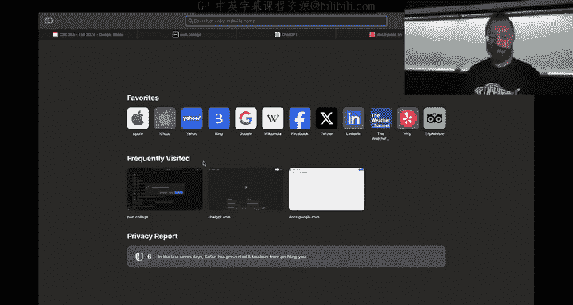
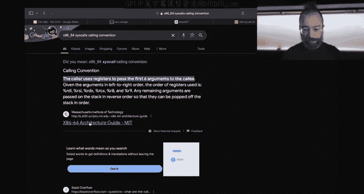
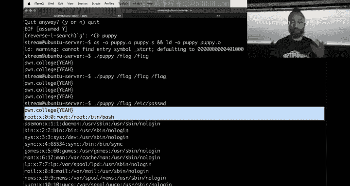
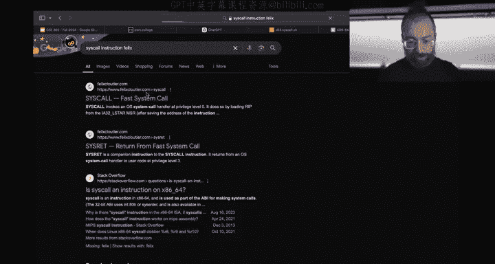
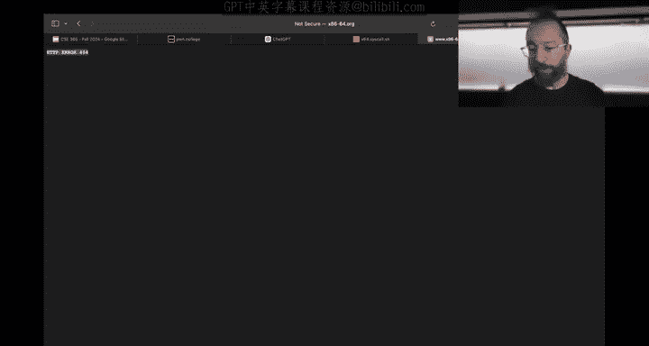
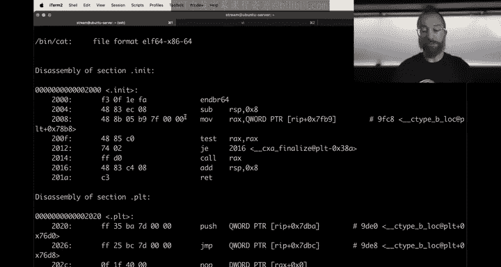
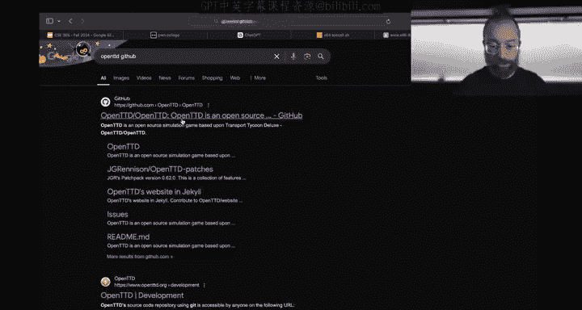

# ASU《网络安全导论｜ASU CSE365 Introduction to Cybersecurity Fall 2024》中英字幕deepseek翻译 - P20：-21-Computing 101 - CSE365 - Yan - 2024.10.30.zh_en - GPT中英字幕课程资源 - BV1nVCVY9Ehy

Hello hackers。 Let's get this camera as I waved to you all。😊，Awesome， al right。Let's get rolling。

 We've got a big challenge for us because last time I had to run and Connor nuobed up our awesome。

Hppy that ass。Where apparently it doesn't work。 So now this is super awesome。

 You're going see me trying to debug。Cd。😡，That I don't remember writing in this case because I didn't write it。

Trying to figure out a bug and fix the bug in assembly with the tools available to us。

 So as a reminder， we got puppyas。And Poupppy that S implements this basically cat， right。

 if with cat， you can cat a bunch of files like slash flag。😡。

Or you can cut multiple files or just multiple instances of the same file and。

It just prints them out the standard out。 And this is all great。 We went to write Cat in assembly。

 First， we wrote a mini version called kitten。😊，And then in C。

 then we tried to reim that in assembly and it all worked on。Till。嗯。Until。We try to add。Okay。

 original file may have been changed。I would just see what's going on here。Okay。

 we're just gonna pretend not what oh did you do that， Yeah， yeah， this is your code。

 our wild header， our big loop， yeah， so be。R into issues where we tried to go from just opening the first argument to supporting。

Multiple arguments on the command line in this style flagged et pass WD。You know。

And this should print out both the flag。And the contents of it it see has WD， but if we。

Crum build Popppy。And do flag it works if you do two things， it only does one。Interesting。

 so now we're going to try to figure out what the hell's going on。嗯。And first。

 we're going to basically reverse engineer。Poppy because now I don't know this code anymore。

 so I'm going to go through and I'm going to try to make comments about what's going on and see if we can spot the bug this way。

 If not， we're going dive into GDP and figure out what is going on there actually before we do this quick update on where the class is。

 this is the last half week of the。😡，Computing 101 module。 so if you haven't。Done the assembly。

If you haven't started on building a web server yet， you are。A little bit behind the curve。

 please make sure that you can start un building web server。

 giving yourself enough time to get through it， okay。Awesome。So that being said。

 let's dive in here so a couple of two sessions ago， we figured out that when the program starts up。

RSB is pointing to the stack。😡，And again， if that。Is a mysterious concept to you please watch。

The videos of this module。RSP is pointing to this stack and。Two quad words that is 16 bytes。

Into the stack to the right where RSP points is the address of our of the first argument of Rv1。

 So8 keyword words into the stack is the address of RV 0， which is our。The name of our program。

 awesome， so here。We did， we grabbed this RSP value。For some reason， if we put into R 10。

 for some reason into R 11， we put the number 16 and。We subtracted one from R 10。

 So I have no idea why this occurs， but if we're going to。GDB didn't try to understand。

 Let me enter this big loop called our big loop。 We compare R 10 against zero。And if our 10 is zero。

AhThe accent， okay。So。I already had confused myself。

 assuming that here we're loading the address of the RV1 string， but if we GDP this。😡，And we start I。

 oops， and we。Said dis assembly flavor and tell。And we just3 I。All right， P。

 and actually while we're here。What happens if I put in a？Emojigene here doesn't like it。 Okay。

 while we're here， let's just take this and put it in。GDb in it。

So you can do set disassembly flavor Intel， this three instructions every time we stop and you know what？

If I remember correctly， history saved on。Is this going to work？嗯。GDb popuppy。Awesome。

 what would do is Y， and then did it save my history。 Yes， now we have a history saving。 Okay。

 perfect。 So now we can do start I。😊，Perfect， it's an entel。 Everything is good， so。

If we can do info Ra， but let's just Px RDI Px。Are our 10。Of course， all zero。

 if you just started out， here we go， the only thing that said is the stack pointer。

And our instruction pointer。And。Here's our first moving of RSP， not RSP plus 16。 moving of RSP。

 What is RSP。 Let's step over this。And then。Let's see what R the。R 10 is。Our1 is the value one。

Awesome。So there is number one in our 10 now what is this。

 I know that this is the number of arguments including the program name that's the first thing on the stack so if you go ABC launch this program popy with three arguments。

😡，We restarted， restart why is my display not for you？We step here。And we。Look at what RSP is now。No。

 not RSPR 10。It's four。Pppy， A，BC。Four arguments。All right。

 now things are starting to make sense about the code。That Connor rode here into my beautiful puppy。

He is reading。The number of arguments。That are passed on the stack。Loading you into our tan。

Some reason loading 16 into our 11， Not sure why yet。

And then loading the subtracting one from Mark 10。 I'm guessing the subtraction of one from Mark 10 is to get rid of Arc V0。

Right， AV 0 is。The name of the program if you don't want to cat out the program itself。

 that's going to mess up our terminal so here there's a malicious comment that's trying to mislead us。

I mean it's not false， RB plus 16 has the address of the first argument。

 but you know if were not that's not hyper relevant here， what what we are doing here。

So this is kind of like general notes， right？But what we're doing here。Is something like An args。

Which is our1。Equals。Arc C。In C+ plus terms， right， awesome， that's now this guy。

We the hell's going on here， not sure yet。Let's see how it's used and then here。It's mark c minus1。

 so let's do that。 and then this one we don't know what's going yet， so let's keep going all right。

So if you compare our 10 against zero。 So I'm guessing Connor wants to keep outputting stuff。Until。

We and probably there are more subtractions。From。Here somewhere。A 11 at our sub R 101。

 So as he ticks down the number of。Uh， every time he outputs a file。

 he's going to decrement this guy now， Sabar 101 is great。

But we can also do something like deck R10 this decrements R10 by one it is such a common operation incrementing and decrementing that Intel designed it into the instruction set architecture you might fear a lot of misguided reduced instruction set architecture versus complex instruction set architecture bullshit arguments。

And people say， yeah， in X86 is bad because it's sick， whereas arm and whatever other crap。

 mips and so forth is's risks， so they're better than fewer instructions。

 so it's easier to work with， it's all crap。Right。Reality is all of these instructions of modern CPU are interpreted into microcode that does whatever the microcode does and all of this risk。

 ci， whatever arguments you heard in。Is it computer organization or in computer architecture。

 whatever is all complete bogus。Bull crap， but。The upside is we have really cool instructions to work with like ink and deck。

 These are cool instructions。 Alright， anyways， that's just we'll we'll leave this a minimally modified for now。

 But， you know， if you're true X had， you would。😊，You would do deck， deck R 10。But it's fine， we'll。

 we'll sum。 Okay， so here， here we have this guy。 Okay， perfect。So here。

 our big loop right off the bat。And this isn't quite numb as。 This is numb files remaining。

Is in our 10。 And so this loop will say while numb。5 remaining are 10。 This is the condition。Right。

 and let's call this the looping， well， let's stick with our big loop， it's fine， Okay。

 so while nula remaining R 10 awesome。We still don't know what the hell this is， but that's fine。

 we keep going。Here we compare r 10 against zero and exit if there equal。Awesome， and that's。

 that's this。 That's this while。 And let's see where we exit every jump right to the exit。

 where we exit with a0。 Awesome， okay。😊，So that all makes sense。 Now we get into。Here， now。

It might be tempting to just read the assembly linearly。What's actually better is to jump around。

As you notice semantic anchors that you can anchor yourself， for example。

 I remember writing this code and it also has comments that I wrote。😡，Right， and this。

 I remember is our wildheader， our wildheader。Is this while loop that reads from a file？

And if it read。0 bys。 if the file is exhausted。It jumps to Don。Which is right after the wildheader。

 otherwise it writes those bytes to standard it out。And jumps back to the head of the loop。

 so let's rename this loop， I wrote this loop， you can rename this loop。Adamam Dupe。

 the coolest cybercurate professor at ASU ask on Twitch， why are comments and code the same color。

 I don't know， this is some default Lubuonu configuration。We， we can， we can try to change the well。

 we're not going do that， but we could anyways， all right。

 so let's take our wild header and change it to output file loop。아some。Here we go。

 We got to change both output file loop。 Okay， so now we've。

Refamiliarize ourselves with that output file loop all right that all seems to be in order Now what's left that we didn't read is what the hell of this whole situation is right Of course。

 this whole situation is probably opening this file descriptor。😡，Right。

 so I'm going to more make a comment， preliminary comment probably opens a file descriptor。Right。

 so how does it do it Well， here。And by now。Several sessions into computing 101。

 I've memorized that Cis call2 is open on X8664 Linux， so that's cool。 This is the open。

RSI is the second argument to open。 That is the mode or the flags with which open and zero is open file and read only if you've done this before as well RDI is the。

A pointer or the memory address of a string and memory that is the file name。

 so here it is being dereenced out of RDI so RDI should be an address。That。😡。

Points to a memory location where an address。Is stored， and that address that is stored。

It points to the string。And here we go。 Here's have a compute RDI， So we move。

The stack pointer to RDI， and then we add R 11 to RDI and R 11 here。😡，Was 16。And that。

Is where this node comes from。RB。At the beginning of the program has the address of the first argument。

Boom， awesome， okay， now you know。All right， so。We have the address of the first argument。Or sorry。

 we have the offset from the stack pointer RSB to the address of the first argument。In R 11。

 this is great。And then。Remove。We move RSP into RDI， so RDI points at the beginning of the stack。

 we add R 11 to it， so now it points to the first argument。And then be open。

And if the open succeeded。So if the father scripture returned was not less than zero。

If it's less than0， we jump to error， otherwise we put it into RBX。 So here's what this is。

 it is Fd that's an RBX equals。Open。AguV。Basically， more or less， our 11 ish。Right。

 or let's say our 11 divided by。A， we haven't talked about point arithmetic and we're not going to right now。

 so whatever our lemon dish。Somehow， you know， sought into by R 11。U。I'll read only。And there。

 And this is。Let's separate this out。If。FDRBx less than zero。Exit。

Or whatever error we don't know what error is yet， but we can of course。

 jump down and read this and this exits one。Cool， so let's just add that here。Exit one， all right。

 awesome。So。And then otherwise， this is， yeah。 this ends up in RBX。

 Let's do that up here just to keep things together here。 RBx。

 and we're not clobbering RBx over here。 That's fine。 All right。

 So now the father descriptors is open。 And so this our big loop is。Loop over arguments。

Let's rename it Now that we understand it better loop over arguments。 Okay now。

We go through this output file loop。😡，We just talked about it。

 so that's how RBX gets put gets the file descriptor and then it gets put into our our DI。

 which is the first。Argument of the cis call。倾。Awesome， this is all very good now。

When we are done reading， as we discussed， we jump to Don。Done here。

We subtract R 10 subtract one from R 10。 So what was this， This is after we were done reading a file。

 these intract one from nu files remaining， which was what is stored in R 10。😡，So， let's say。

This does。Noob files remaining are 10 minus minus。And then we add。R 11。

 and this is basically our R 11 is guy that is。The pointer， sorry， this is obsolete now， okay。

Where was it right here， this is where the open happens。That our 11 is the offset。

From RSB that's going to be used to open the next file。😡，So our 11 is guy。Incremented somehow。

My eight， okay， whoops and。We jump back up to loop over arguments， at which case。

 at which point we check if we still have any non file remaining。And then open。The next file。

 this all looks quite good to me。And we keep doing that until the loop guy exits jumps to exit over here。

And this exit will exit zero。Okay， this all looks great。 So let's just assemble it。We run it。

It I puts one thing in。 And if you do two files， it doesn't work。

 So now you have to figure out why doesn't it work。 First thing that I do personally。Is try to say。

 okay， is there anything obvious I'm missing。 So let's estrate this guy。Should we open flags twice？

Instead it opens flags once， it reads， reads， and then it tries to open some weird crap。

And that's not good。So what happened here？Our next open。Failed。And when it failed， our air checking。

Caught that， and exited。So this Cis call returned a negative one bad address because we passed some weird address instead of the address of a string and our address here is text 20000。

 I have no idea why that's happening。And now the key thing is to understand what is going on。

 So one of two things could be happening， three things， so let's create three hypotheses。😡，Okay。

We're going to make a notes doc。Hypotheses。One。The stack pointer getting messed up。

Why could this happen I don't know， but it could be causing this because what we pass into open。

 what we know is by the end of this whole thing。RDI is hex 20。

000 and it shouldn't be RDI depends on a couple of things。It depends on what was stored。

At this load and this load depends on this， this address depends on。

The value of RSP and the value of R 11， so RSP could have been getting messed up。A 11。

Could be getting messed up， and。What else？The value。So the pointer to this string。

 the address of the file name could be getting messed up the actual memory contents that it reads from RDI。

All of this could be happening， so now you're going to disprove it one by one。

When we eliminate the impossible， whatever remains。No matter how improbable we'll be。Our issue。

 So if we're going to start I。I don't know why this doesn't say， but we're gonna just IP。

 And we're going to basically。Actually， disassemble the whole thing。 I find we're gonna。

Look at 10 instructions I want to understand right here。😡，Right when we compute this address。Yes。

 this is the let's u。This is our open cis call。 I want to break right here。

And here I want to figure out what R IP or sorry， I know what Rp is what RP R D I R 11 and the that value is just going print out everything Now I could do this manually did you do breakpoints last time Okay。

 so let's first do it manually。So I'm going to say break。Add this address。Ps 401-015。Okay。

 that tries to look for a symbol name， something like loop over arguments I could do break。

Loop over arguments。That's awesome。 And then I， I can hit continue here， and it'll rot until it。😊。

Breaks here。 And so this would be fine for now。 Then I can step， and I can step。And it jumped to Ait。

 oops。So why did it jump to exit now I'm somehow in this exit zero call， well。

 it's because when I ran it。AhWhen I ran it。Okay， when I ran it。I didn't give it any arguments。😡。

Oops。's that's silly， so， of course。Our our 10 starts out at zero。

 this is the numb arguments left and it exits right away， Okay， cool。Inferior process exited。

 let's try this again。We're going to run now that we have a break point already set。

 I'm not gonna start on break on the first instruction。 doesn't matter。

 We're going to just run straight up with the argument slash flags like lets you。Yeah。

 slash flag and add C pass Wd。Okay， here we go now what is R 10？It's hack 2。Let's step。Stff boom。

 Okay， all is good。 So now what do I want to do， I want to display。RSP R 11， and the。诶。

And the result of RSP plus R 11， so RSP。A 11。And RSB plus R 11。Yeah。Let's see。 will this work， Well。

 this will work， sure。Yeah， that makes sense。 RP plus R levelss R 11 is hex 10。 That's R 16。

 That's great。2 Q words。 and then RP is the base of the stack。 and that works。 And now I want to。

 and this unfortunately is a little bit of an awkward syntax。 It's C syntax。

So we want to display something that。We're going to。呃。

do you reference RB plus r 11 view I want to know what's stored there， the problem is when I do this。

 it doesn't know how many bytes to get。Out of what's stored there， so I need to give it a C。Type。😡。

I will do unsigned long， long， this is an eight byte。Like this guy， integer。boom。Okay。

 and this is what's stored there。That's a very weird address。 Why is。是。We can also just X to G X。

 RSP plus R 11。That's correct。Why doesn't it like this， this should have worked。Oh， yes。Onign long。

 long pointer， so I treat these as a memory address to an8 byte thing。Boom， there we go。

 So this is what's stored there。 And then this whoops。It should be the address of our next string。

And it seems like it might be。Awesome， that's the address of our first straight。 Okay， so far。

 so good。 All right， first loop， no problem。 Then we're gonna continue。 Here all my displays。

 I can undi。😊，Six， this was a typo， I don't want to see it anymore。几。😊。

So here something really weird。Is this really weird？This address looks strange。

Because our 11 is really fucked off。Why is our 11 fucked up？So our 11s started out as。Hacks10。

 and if you recall。If we get another。As a sage guy。And weca poppy。 Vpopy。s。To our 11 be。Added 8。

That's all we ever do to our 11， right， We move 16 into it。 We use it as a。As an offset。

And we add 8 to it。 And yet。When we go here。H 11 got really messed up and went from Hex 10 to Hex 2 E。

That's really not great， that's not good at all， okay， so something is messing up our 1。

How do you figure out what well？We can run the whole thing from the beginning。

Or start eye at from the beginning， actually， let's run it to the first。Break point。

 So here we're about to open slash flag。 and now we're gonna to step instruction。

 We're going to keep an eye on our 11。 We'll figure out what the hell happened that it got messed up。

😡，So we step， step， step， so here's our we're going to do our open， we do our open and oh God。

The open cis call destroyed the value in our 11。Yeah。Why would that happen？Well。

There is。An agreement。That you have。With the operating system。

 you as a process as with the operating system called the application binary interface， the ABI。😡。

Our part of this is the calling convention， so if you do x86， 64 calling convention。

Okay， we can go on Wikipedia。Let's say there's one specifically for cis calls。

 we can go in Wikipedia。Or we can MIT people probably know what they're doing except they're using fucking u AT& T syntax。

 but that's fine。 All right， but calling convention is defined in this crazy document。

The caller uses registers best to first six arguments here。

 the registered we know all of this stuff the callee is responsible for preserving the values of registers。

 RBP， RBX and R 11 to R 15， as these registers are owned by the callers by the caller。That means。

That if he had stored a value in art 12。It's up to us。To save it。No， the other way around。

 the call E is whom you're calling via the call learn。So the callee， the Cis call。

 the kernel in this case， the Linux operating system。To whom were begging， please open this file。

Will guarantee to us。By contract， by this calling convention that it will not fuck up RBP， RBX。

Or R 12 through our 15， but it gives no guarantees about R 11。So Art 11 is up to us to save。Right。

 we can do this。The typical way to do this is by pushing R 11 to the stack and popping it off。

We're not going to do that right now because。I don't know what else we use the stack for in this super crazy thing。

 For example， if you probably read onto the stack here and you for sure。We read onto the stack。

So that's our that's a bad idea anyways， oh， well， if you read 1 hundred0 bikes behind us on the side。

 but if you start messing with a stack。And we're storing。We're reading。

Data from the file onto the stack。 and at the same time， we are pushing。

R 11 that we want to save off onto the stack as well because the kernel is going to collaborate and then we read some data over 11。

 it just going to call cost problems anyways we'll end up with parts of the file in R 11 and you'll see these sorts of bugs。

Two modules from now in memory errors。 But for now， we're just going to switch to R 12 because R 12。

Is one of these awesome registers that the kernel guarantees or that the call well behaved functions also guarantee that they will not wreck So instead of R 11 we'll do R 12 and actually R 10 is also susceptible to this this makes no guarantees about R 10 we're also going we're going to change our 10 to R 12。

I'm going to use a regular expression here。In Vm， we're going to change our 10 to our 12 and our 11 to our 13。

And yes， yes， yes， yes， yes。Yes， yes， okay。 and our 11 to our 13。Yes， yes， yes。Yes， yes， okay。

 awesome， and now we're going to recompile it。Yeah。Awesome。And。😊，Let's see。😊，嗯。Awesome。It works。

You read multiple files。 We've just recreated。

Cat。And。71 lines of assembly， including comments and everything。How cool is that？All right， so。诶。

one bonus detail it looks cloud here cis call。 Oh， yeah， yeah， Okay， totally that A V。哦， yeah。

This is your next 86， your favorite architecture。 So Connor claims。

I've remember the so Felix called Cltre has。

These awesome basically par Intel instruction manual that explains what each instruction does。

Down to like pseudo code。And if we search here for R 10。

A 11。Ah， our 11 gets your register flags， your conditional flags saved to it。A。

 RCX is also weird the RCX are just dangerous。RCX also gets clobbered Yeah， so。

 but it chooses these registers to clobber。Because it is not responsible for saving them。Right。

You will not see this cis construction clobbing R 12， for example。

It's the little hardware that's doing it， not a convention that's doing。 It is the coupled together。

Oh， it is the hardware doing okay， that's right， that is the hardware doing it。

 but also this calling convention is defined by understanding by a hardware HPR44， but yeah。

Yeah， that's a good point。 So it's not Linux is fault。 necessarily。

 it's that Intel's X 86 cis instruction that's collaborating our registers。 Okay。

 so now we have puppy now。We talked about Aage dump， so we can disassemble puppy。And sure。

 let's do in in syntax here is these should be familiar loopover arguments。Here's our loopau。

 this is our start。Here's our output file loop。

Don exit air。 I， awesome。Andvy pass it into it so oh great， so excluding comments。

 but including some of this new line crap。Pbys 53 lines of assembly。

 so probably it's I have 40 lines of assembly or so let's see what cat is。4，280 lines of assembly。

A lot of waste right， So if it takes some amount of time for your CPU to execute every line of assembly course。

 not every assembly instruction and the file cat is going to be executed because。😡，Like this。

Probably eats up a lot of lines of assembly， the help output， etca， eta。

 but you know you can just see the difference in efficiency now of course anytime you add abstract and cat isn't written the next 86 assembly it's written in C。

And their efforts to replace that， even with a version of cat writtenden in rust。Because rust。

 as we'll learn in a few weeks， is resistant to the type of errors where you actually clobber stuff in your memory space。

Anytime you add this these abstractions， you write something in C， you write something in Python。

 you write something in Java， you add more and more and more inefficiency。 And in most cases。

 that's fine。 In some cases， if you're a video game developer in the early 90s and you want to create something revolutionary you out every every potential bit of performance out of the hardware。

 that's not fine。 you need to do a。Get pretty raw down into that or if you're you know。

Building some embedded thing with a raspberry， pie pile or whatever， right？

But most of the time nowadays， when you interact with assembly。

 you're going to be interacting with assembly either to operate in extremely constrained environments like you have managed to fool a program into executing some tiny injected a bit of assembly。

 you managed to injected somewhere into its memory space in those cases。

 you need to craft things very finely， or when you're trying to understand what a compiled program does。

 for example， if you actually。😡，Disassembled cat and try to understand it on a low level。

As we talked about， maybe three sessions before。Okay。Yeah， and so as Hanto says Titch， you know。

 insert roller coaster tycoon was coded in assembly， so was transport tycoon， awesome games。

 but what's interesting now， so transport tycoon。Originally it was writtenden in assembly。

You can verify this。 This game was amazing。 I used to go back and like， spend a week in in。😊。

Inside this game every year， every year， Trans tycoon， you search for assembly here。 it well。

 it's part of an assembly language software X 86 doesn't Oh yeah， so anyways。

 it was written in assembly， but the Wikipedia page doesn't really talk about this much anymore came out in。

94， then it was gradually reversed engineered and reimplemented function by function。

Into a game called Open TtD， which exists today and is still very active and is awesome。

 But if you go and you look at。😊，TtD code， Where's TtD code， We don't want to download it。

TtD， open TtD GitHub， if you look at Open TtD's code。

What's it's written in now？They implemented it。Function by function now into C++。Bom。

It's not X86 assembly anymore， it's relatively modern C++。That allows them to move fast。

 they added abstraction as they no longer needed the same performance improvements I've worked on games in high school in the late 90 in the early 2000s。

Where most of the game was written in C， but like just the video code was written in assembly right so you reach for the tool that you need。

😡。

An interesting thing here is， if everyone。Properly supports the calling conventions。

Which instructions or which registers are used for arguments and et cea， et ce， et cetera。

 then you can mix these languages quite well。😡，And this is how things like the function foreign interfaces between rust and C。

 Python and C， and this sort of stuff works。Because。A function。Implemented in。

A language shouldn't necessarily care。What language its caller was written in。

 as long as they speak a common calling convention？Cool。

Adam is trolling me on switch that's actually。Possible， but now he's。

Saying if I program on punch cards or stone tablets。All right。

 so that is a deep dive into a successful reimation of cat first as kitten that sea and then it puppy that as Nar golden。

 okay？Mouth。This gives you a lot of what you need for。Building the observer。

 there's one concept that is missing， and this concept is for king。Right， so。You might have wondered。

Where do processes come from？Right， and。Thelinus luminarium。You have a shell and you type。Puppy。

Slash flag。And Poppy starts up as a process。And we can ats here。Hoppy gets exact and Ex the E。

I don't remember， did I put an exactly level into thelin there and no， probably not。

Exact E is a system call。That executes the program referenced to by path name that was our popat。

 it causes the program that is currently being run by the calling process to be replaced with a new program。

😡，so who's the calling process， it's our shell。And when we。Execute。Poppy。

 it exactly is here and in theory。According to the man page。

 our entire shell should go away and puppy should live in its place。

 But somehow that's not what's happening here。 You still have a shelf after puppy exits。So。In Linux。

 every process begins life by exec。But。😡，And the exact morphs， a process that already exists。

Into a different process。Wips the board clean on it。Except for it。Permissions， it capabilities。

 et cea， cetera， it's owner， groups and so on， and it's file descriptors and just swaps in another process。

But then why is there more than one process running on this Linux box， how does that happen？Right。

 well， it happens。Let's look at how it happens。 actually， Let's etce， not puppy， but a shell。

I'm going to do something crazy， I'll do that。I have a follow child here is。The ets of this shell。

And。Actually。Let me exit the shell， I'm going to do something else。I forgot the syntax dash。 Oh， no。

 not capital O is it okay。 So yeah， dash。 Okay， right， I' gonna eray。

 we're gonna save our cis calls into this file。 Okay， so here's my shell。😊。

Let's see if this works tonight。How do I make it part of the screen on the right？I drag。

 I just dragged。Right from the right to the left。喂。There's no。

 there's no magic to abandon so I'm dragging。Pull from the right and make it smaller。Oh。

 there's no magic。I see， that's what you mean get your old laptop。I don't want my own laptop。

 I have a laptop， it just sec fault when streaming， okay。So here we go。 here's our shell。

And we're going， we're going to shrink this。Man， come on。 How do you live in like the my stuff。Yeah。

 it's a's。I'll leave it when I see it， all right， and here we're going to cat。Our cis calls output。

 All right， so here's the cis call so far。 And actually， already this brief， you can see。😊。

if you're getting a bunch of signals， these sig winch， this winch is stands window change。

 a process gets a signal every time the dimensions of the terminal is running in change so that it can like adapt its interface and stuff。

 but that's fine。 So if we're going to tail。Ssco's here。 All right now。

This guy's reading file so we can hit enter here。 So awesome it， it read。嗯。Let's retail this。

 It read a new line and it wrote the prompt going hit on again， it did that again and again， awesome。

 Okay， what happens？When I launch a program。Now I'm going to launch Popppy。Slash flag。Puppy Ram。

 okay， what happened here？It read in popppies slash flag。 It did something weird。 It did a V fork。

 that's something weird。 It did something weird again。

 did something weird again and then it ran this weight， and then it received a sick child。

A sick child。Is sent to a parent。When。A parent process when a child process。

Thus something in this case， the child process exited。Okay。Well the hells a child process？P点。Was。

Launched somewhere here， but we didn't see it。Why not？And what the hell is V fork。

 So these two things are related。 So if V man V fork。VFork creates a child process。

And blocks the parent process， and you will be using an older， simpler。

This is called called fork Fork creates a new process by duplicating the calling process。

And the new process is referred to as a child process。 So processes are like bacteria。

When you call fork。They multiply by mitosis。Now you have two， after the shell forked。

 there are two shells。Two bin H processes。 and one of these processes。Said， all right now。

I am going to become puppy。And if you look here。Fort returned this guy。This value。

And this values the process idea of the new child process。And here's what it did。

It did some clean up， blah， blah， blah blah， blah， did some work， and then it exactly eat popppy。

And it became popy。For all intents and purposes， it ceased to be been S H。Its memory space got wiped。

It kept the file descriptors that there's ways to make file descripts go away。

 but it kept the file descriptors。That were。Let's such a standard in， standard out， et cetera， et ce。

And now popuppyies running after this。And Poppy opens the flag， reads Poe College， writes Po College。

 reads some more that returns zero bytes red， and so it exits。So processes start off。

When a parent process fors。And most common so far for you， that parent process has been the shell。

Good forks。And one of the copies。That are otherwise identical。 One of the copies decides， well。

 good bye， I'm going to become puppy。How does that？😡，Dsion get made。 right。 How do you know。

Which process is going to be which。 Well， you know， based on。The return value of fork。

 the only difference。Between the two processes。Other than the。Well， the only two differences。1 is。

That the child's process。So。Whoops， the things stop following me， but that's fine。

 I feel like you have。The one process splits into two。

While the process ID of the pan process sticks around。With one of them， that's the parent process。

 the child process gets a new process ID。And that's the biggest difference。

From an operating systems perspective， from within the process's perspective。

The Fork system call returns into As。For the parent。

The R X becomes the process I of the child for the child。 R X becomes 0。

 So the child after four kings can look at。The process I。And or sorry。

 can you look at the return value of the cis call， look at reX and if it's zero。It's the child。

 if it's non zero。Then is the parent process looking。 But otherwise。

 the process can't tell as if if you are suddenly cloned into the seat next to you in a split second。

You would have to figure out who is the original and who is the clone or maybe you wouldn't。

 there's a very cool scifi by Alta Reynolds called House of Sos。

 where the protagonist clones themselves。Like a ton of time。

 but does it in a way where it is impossible to German who was the original because they wanted。

All of the clones to feel agency over their lives， just pretty cool concept。Ca typically in a scifi。

 like if you read like the Bobbuverse series， it's also about a bunch of。

Clloning of intelligences and。There they explicitly know who the parent and who the child is and so on。

 I recommend both both books slash series， by the way， I think just to reinforce that。

 So all the changes is R X， Yes， registers the only different from all the other registers are the same。

 All of memories the same。 The file descripts are the same。 Everything is the same。 Co。

 just R X is Allright， so now。😊，We're going to write this in assembly。

And see if you're going to write a shell。In 15 minutes。In assembly。And it's gonna be awesome。 Okay。

 let's see if we can do it。 All right， so shell that F。😊，What are we going to do， You're going to。

Read。Exact， now fork。Exact。Okay， so let's read。ButTo be fast。

 move our DI be able to read from standard input onto the stack directly。G to only support 100。

Bs of things and we'll only support。Like。😡，Just RV 0， al right。So move RS y， move R thex 100。

 move RAx0 cis call that reads onto the stack now fork。

 let's see what fork is from a cis cause perspective， fork 57。Okay， and now after4 King。

 one of us is the parent， one of us is the child。Okay， so the parent。

So we're going to compare reX to zero。And if it is0。We are going to say child。Otherwise。

 very're apparent。And this is just for， for ease， Okay， the child will exec。 So the child will。

 let's look at exec。59。So if we need the file name and then we need RV and then feed。

 these can be null， these are the arguments， this's the environment pair we're not going to support any of that shit。

 we're going to move RSB to the file name， RSi is going to be0 and Rdx is going to be zero and we call here and then the parent so this exacts out and the parent。

😡，Is going to move is just going to jump back to the。Start。Okay， looks good。 This is our shell。

 We just wrote a shell and fucked in。In two minutes， flat， All right。Okay， nothing works because。嗯。

We were using the evil AT&T syntax。Okay， so here's our shell。Okay， we didn't write out a shell。

 but let's run Id and it didn't work。 Okay， all right。

 no problem let's e trace this to see what's going on， Al right so we read。Refork。

And something went wrong。That's Stray F so we follow the children， so if we read。

 we run a ID for the record ID， we lost connectivity here， ID returned to your user ID。

And groups and stuff。So what's going on here， So we forked。Okay。And our child started reading stuff。

 okay， except I the IDd new line and no such father directory aha。Okay。

 so we need to trim off the new line。That's okay。 So here when we did the read。

 we can just just assume the last character is a new line， we'll just。Move。

So if you're going to move into RBX， whatever RDI or okay， Rx is number of bytes， RSP。

Is where we started reading2， we'll add。Our react， this is now pointing beyond the new line。

 and we're going to move。Into the byte pointer。Of REX。RDI。Oh， if we have to decrement our DI here。

 so now it's pointing at the new line and we'll null it out。Okay， let's see AS and LD。

And now did it work？No， okay。A let's S trace it now we had IDd。 Okay， now Id。

 and now there's no such father director。 Well， because if you remember thelinarium。

 there's this path variable and the shell sees like goes and look none of that happens with X V with X V。

 we actually have to pass。The file， and it works。If you have a shell。

 we just wrote a shell in four minutes。And there's cool things that don't need arguments like。

 who am I， awesome we can launch bin cat and now bin cat is going to just echo stuff out at us。

I isn't echoing every other thing。 Oh， yeah， here we go。 That's weird。

There's probably a reason why it's out of order。But that's pretty cool。

the parentss also reading so you know， the parents and the child have the same standard input and so forth。

 So there's there's a lot of of whackiness if you really want to be a good shell。

 the parent needs to wait on the child to complete。Right。

Because if I do like sleep too in a normal shell， it actually sleeps。But if I do in my shell here。

 sleep 10， sleep 10。And I look， it launched both sleeps。 Where did they go。 Oh， well， of course。

 it doesn't support sleep time because it doesn't support arguments and it doesn' support a path。

 But we aren't waiting for the child to exit in a good shell We should be。

 And this is actually very easy to， to see because if we do。Like right before we read。

 we write a prompt。Let's do this。 Let's move Rs。P。5。0 RSP。嗯。And RSB plus one。

 we're going to build a little prompt here。And then。RP plus 2 will be 0。 Okay。

 here's our little prompt。 We're going to write， move RDI1 standard out， move RS I， RSP， move RD X。

3 bytes of a two bytes of a prompt Ciscal move R X1 is right。We're going to build it。

We're going to launch our shell boom， we have a pro。

But our prompt printed out before our program ran。Because the parent forks。

 and now there's a race going on。Between the parent and the child。And that's no good。

 So if we are a well behaved process， if we are a well behaved parent， we wait for our child。

 So here。Instead of looping， we're going to。Call， wait。And wait。

Theres a lot of scary things that you're almost certainly not going to be able to do in four minutes。

Is there an easier wait？Is it W Id？嗯。Maybe pass all right。

 let's try that we'll just pass an all to everything we'll pass the process ID which was returned in RAX that's that's how you know they're not the child so the parent has a child's ID in RAX so we're going to move that into ourDI we're going to move zero out everything else。

Are 8。R 10。ok。😊，And what was the weight， 61？And we do a cis call， okay， boom。Bm。W。

 we waited for the parents。That's awesome。And of course， we can write a shell script。That here。

His full bash。And it'll wait， then we can now see。That we properly wait。So we just wrote a shell。

 a very， very simple shell that doesn't support program arguments and so on。😡，And。49。

Lines of assembly， including some light comments and spaces。And new lines。Using fork and weight。

And you'll need to do this。 This fork is used by the shell， of course， but fork is often used by。

Basically， network servers。Like a web server。To spin off a child' process that handles national connection。

 a very common model is a4Ks network server。Which sits listening on the network and every connection that it comes in It forks off a child to handle it conceptually similar to here where every request that comes in。

It forks off a child to become that request。Cool， you'll need to do that in building a web server now you know how。

😡，诶。And。That's all。Questions。Yeah。No questions。 All right。

 wait a couple of seconds for questions on Twitch。 Any final administrative thanks。

Ss do Sunday night， Yeah， assignment is due Sunday night。And。I guess yeah。

 so for those like joining right at the end of today's lecture， what we did today。

 live debugging of a very interesting bug related to calling conventions。

using some slightly advanced E stuff like this display thing， which you know。

 lets us just rapidly step through things and notice when things change with our eyeballs。

 there are also ways to script that， which we'll probably deal more with in the next module。😡，2。

 we talked about fork。 and we wrote a shout。Anything else that we did？

Itit talked about video games and talked about video games a lot。 Awesome。 Al right， thank you all。

 make sure to get those challenges in。 If you haven't started on building Webster， please start。😊。

As you can see， a lot of the the content， a lot of the assembly wrangling can be done very rapidly once you get a hang for it。

 but you got a。First get the hang of it and that can take days。

 so please if you haven't gotten to building a web server。

 get to it as fast as possible and then get through it all right。

Good luck。And we'll see you on the other side。Goodbye， hackers。

