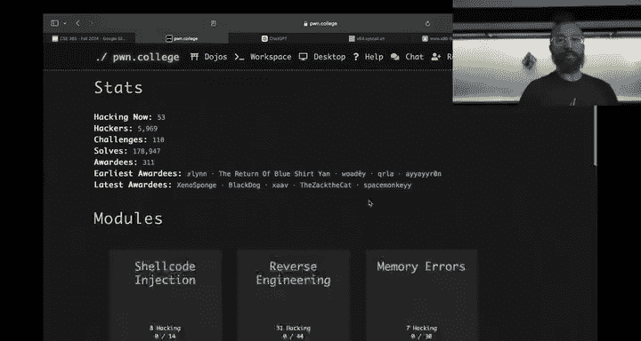
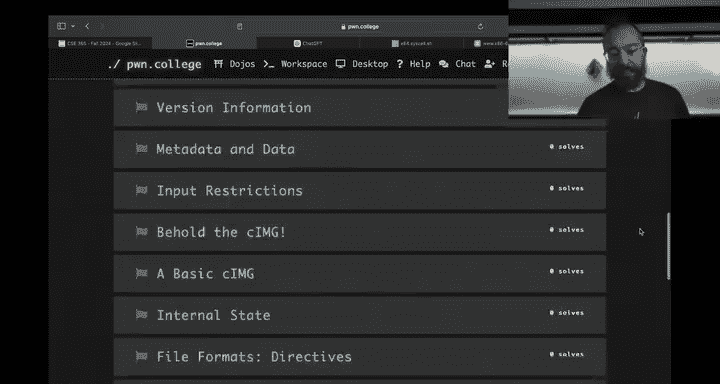
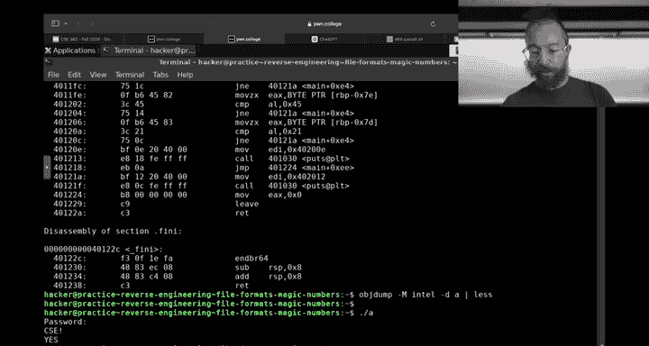
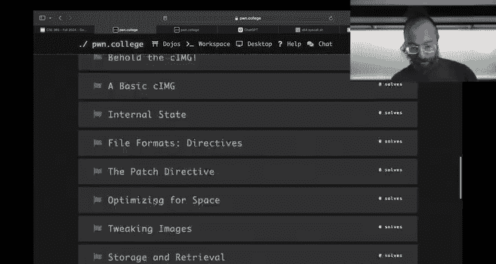
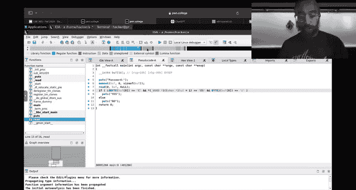
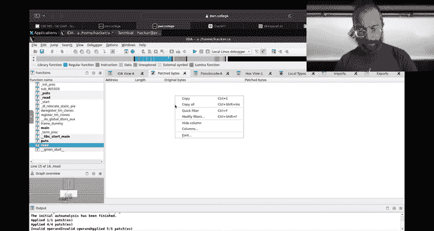
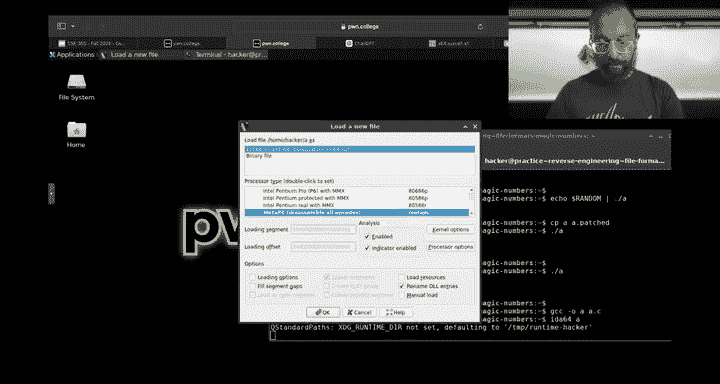
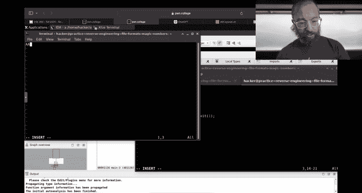
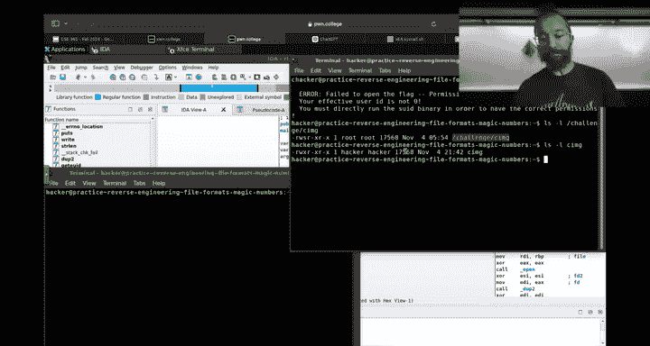

# ASU《网络安全导论｜ASU CSE365 Introduction to Cybersecurity Fall 2024》中英字幕deepseek翻译 - P21：-22-Reverse Engineering - CSE365 - Yan - 2024.11.04.zh_en - GPT中英字幕课程资源 - BV1nVCVY9Ehy

Pckerers。Let's get rolling。Do our best here to try to figure out。

How to do how to reverse engineer binaries maybe live。Yeah。Are we live， should be live。 All right。

 I'm just going to assume we're live toitch you just taking a while。Let's come on。Pone college。

 boom herere live。 All right， perfect。Awesome， we got boom here， one viewer。On Tw。

8 people in the classroom。 good more like 15 people in the classroom。 good late semester showing。

 okay。So。Computing 1 to one is almost over， it's over tonight， of course。

 why is it over tonight well the the platform melted down yesterday are we up right now。

 Oh brilliant we are up the platform melted down yesterday。

For yet another novel reason every time it's some new thing that we've never seen before because。

 of course， we've fixed old issues。 it's been a little bit of a lacka mold So for those interested weve。

In the beginning of the semester we were running on one node， all of phone College， the entire world。

 1404 10 year old server， we finally hit the limit of that this year so we split out to multinode but to synchronize all your home directory across these nodes。

 we used NFS， the network file system and it was an absolute shit show。In terms of performance。

 so we moved to But Fs。With shifting around of some advanced organization on top of that and some really cool way to integrate that and something in there is failing right now。

 So that's the new fire。😊，So we were working on it。

Connor is working on it live right as we speak in his head and we'll hopefully keep the Dojo stable tonight。

Now this being said， we got a one day extension from computingut 101。

 but reverse engineering is live。I didn for。Nice reverse engineering is live here it is。

 this is in the computing one on， but we forgot to push the actual assignment and the the link to the the thing Anyways。

 we'll do it if you go to intro to cybersecurity right now。Intro to cyberse boom。

Reverse engineering now if you。Started。Reverse engineering early， I'm sorry。

 but the copy pasta that we send out when people ask， can I start early？Applies。

This reverse engineering module for the intro to cybersecurity for the orange bug material is completely new。

Before。We add reverse engineering over in Y belt， this is the first half of CSC 466。

 and we would import it import parts of it into CSC 365， the orange B material。

 but now we've created a completely dedicated separate introduction to reverse engineering ramp。

New this year for 365。嗯。It is a bit of a。Wouldn't say a doozy but it's got some got hands potentially it starts very simple they're going to tackle very similar challenges right now。

 I maybe should even do level1 in class I don't know and then it moves on to more and more tricky concept but still in the realm of introductory reverse engineering but you'll be reverse engineering over time from several different angles is the Conor image format or C image。

😡。

Connor conceptualized this awesome image format that we will have。

Probably see throughout the semester， you'll probably see it when we explore memory errors next module。

 you'll probably see it when you put everything back together and over time you'll see it in the rest of the material as well just like yawn 85 has。

😡，Infiltrated a lot of different concepts throughout the con image format。Is a really neat。

Image format for the future of computing。😡，We've had JPgs， we've had gifts， We've had PGs。

 That's all in the past。Haakes or hikes， or however you're supposed to pronounce Apple's weird thing。

Now it's C image。 You'll be saving your childhood memories in C image。And。

The really cool thing is after this module， you'll be able to look at every bitete of a C image。😡。

And understand exactly what it's doing。Cool。This tries to capture the magic of like a true reverse engineering experience。

In terms of youre getting something completely new， but it's not just there。

For the sake of being there， it's not just。The old little crackmes that I wrote in in one evening for the original reverse engineering module in phone College。

 this is an actual format that actually has stopped by the end。

This image format is going to be used as a graphics engine for a video game。😡。

That you'll have to understand。诶。So it's a natural thing。

 you'll build it out bit by bit and hopefully learn a lot of reverse engineering along the ways。Now。

Please also watch all of these lectures。 There is a decent amount of lectures。

 but it will help you understand how how to reverse engineer。

 I think we have about three hours of lectures in this module。😡。

So watch them offline on your own time， it'll be fun， all right。Catching up on Twitch。诶。Yeah。

 someone said NFs can be bad， maybe butter fs will be better well I'm here to tell you that butterfs has problems too。

 but that's okay， everything does。And。Yeah， awesome， okay， so reverse engineering。How do we do it？

Let's start out by seeing if we can launch a challenge。And then we will well launch level one。

 we might not do level one。But。Let's。Wait， what was the。Yeah。Honor will sign us in。I should not it。

 No， did Sand。So find out。Right now， one of our nodes is having issues again， so we might have to。

I tried a couple of different accounts， but just before class， okay， great。Let's hope it stays good。

是。And it being heard。Yeah。Yeah。Greats strong。Great start。We think it's logging in。

Just now I hit another tab。Oh。Yeah。Yeah。Got to redirect。 That's true。 Such should work now。嗯。不。嗯。

All right， well， maybe you'll install Ida on stream。And just now it's ready， oh hell yeah， all right。

 perfect， see hopefully it's actually logged in Okay， a beautiful the system works。All right。

 so he head up on college。Now。The reverse engineering module， of course。

 is full of these little slash hand size sewage files you have to reverse engineer them。

Understand what input you need to provide for the flag and provide it。 How you do you do that。

 Let's not reverse engineer the actual sew file。 Let's create a new file that will'll reverse engineer right on I let me。

Have this track me， beautiful all right so。Let's create。A file here。U。Yeah。

 we'll include SDIO that age。Here's our main。Yeah。There's a question on whichitch。

 what's the keyboard key to hide the pun called UI in the Gui desktop there is no key。

 I clicked this little uptick。On the right side。Allright， mean man， okay。

 so now we're going to do hi。Or let's say we'll do password。And we're going to。Have a password field。

That we'll read into。Yeah。10 bytes or whatever。 Let's do 4 bytes。

 I don't know whatever I have a4 byte password， and we'll compare。Password。Against。

CSE exclamation point。And we will do four characters there。Okay。And if that returns 0。

 which means it is successful。We will。Yes。Otherwise。No， all right， nice and simple。

And we failed to include string that age。And we also need uniSD。For read， right？Perfect， all right。

 here we go， password。CSE boom， no， that's not what is supposed to happen is D F yes。诶啊。

Stern comp returns zero。When it successfully matches and it returns the difference in values of the unmatching the first mismatching by if it doesn't match。

哎。Ws。Here we go。That works。 Okay， so if you have a little program。We started out with our C file。

We compiled it。And we ended up with this。Health。Right nothing we haven't seen before we've we've gotten over。

 you know， assembling assembly into this， we could have easily written this an assembly we wrote it in C because you'll be。

Looking at it from the perspective of decompil C， Okay， now let's say we want to reverse engineer it。

And understand what。Input doest take。First thing， I do。Nowadays。

 because I am older and lazier than I used to be。Is I see， hey。

 can I somehow avoid having to open this binary to understand what it's doing so。Do atrays。

Here you go。 it says， you know， password。 All right， I'm going to say， I don't know， maybe it'll。

If I do this here， it I'll read from some password file and I'll observe it in that Grace。

 and then I can go look in that password， that didn't happen。Right。That's fine。Now。

I will try to run strings。On this and see， is there something here that looks like a password？

And well here there's a string and password right below it。There's a string CSc excation point。

 So strings is a utility。That will go through and look at all strings that it can recover from the file。

 There are a lot of strings that weren't in the source code， all of this。You know， this stuff。

 here's some stored debug information， the name of sterncom， But that's kind of cool。

 There's like a lot of stuff that is inserted in the compilation process。 And then， of course。

 there is。😊，Data that I passed then to the application， all right， cool。

Now I I let's say I look through this and I'll try a couple of these first I'll try。

 I don't know this BSS start guy。So it's。Start， okay， I don't know， I don't know。 BSS start。

 obviously， this is wrong。 And also， I ended up typing part of that into the terminal。

But if I do CSD bang boom， so without opening the binary you're able to recover something not going to really be able to do that in this module。

 maybe you should have put a level zero where you can do that could we could add it but later no。

Cool， but that's kind of cool。All right。What if we couldn't do this， so for example。If this。

 instead of doing a stern comp。Did character by character。Checking， so for example。

 if he a password0。Has to be equal to C。We're just going to copy this on its own。はい。Hate the default。

 there we go。Whatever then have password。Okay， character by character。All right。So let's。Compile it。

Run it， be still， that passer still works， but if he strings it。And scroll up。It's gone。

 that string is gone。哎。Farmer so now how do we have Of course， we know the pastor already。

 but if it was different， how would we find it Well， now we have to start diverse engineering things。

So let's complicate things just one， nine。Something we've already done after we assembled code before we had disassembled it。

 right， so we do our a dump。😡，Dash D to disassemble， and then we give our file。

 and here is all of the assembly。In our file， and there's a lot that again。

 the compiler puts in as we compile this when we disassembled our assembly file。

 they were much cleaner。When when we were writing an assembly。

 like what you saw really is what you wrote， but heres more complicated。

 so here's our the start of our code right that we're very familiar with。

from writing an assembly。Let's see what we did。 This should reflect our C code。

 except for it doesn't。 when you write in C。You create a function called main。

 that's where your initial your beginning code of your program is。😡。

And the compiler inserts a start stub that calls a function in Li C Li C start main that eventually calls main。

 ceases to way too complex。But that's fine。 The point is， when we implemented our A dot C。

 we created Maine， we can search for Maine。 Here is Maine。 This is our。诶。Our。

Function that we wrote and in assembly， we can see here， all right。

 we there's a prologue of a function。 we allocate a stack frame。

This is discussed in one of the lectures， the data and frames lecture。

 or functions and frames lecture please。Make sure to listen to that lecture'll help a lot with understanding how these functions work。

 then we do this craziness， we write zeros to here。All right。

 so we're zeroing something out and then we go through and here we see a bunch of comparisons。

Against a bunch of ASI values。Right， so we see a read。Okay， this reads the data in。

 this is a C wrapper for the RE system call。And then we see it going。Backwards。Bite by bite。Loading。

Things into the EAX registered as the first half of RAX。And comparing against。43，53，45。And 21。Okay。

 oh， it's not backwards。 This is minus。 So this is。

It's taking the end of the stack frame while it's the stack frame lecture to understand that it's seeking backwards first hex 80 bytes。

 then hex 77 F bytes， then 7 E then 7 d right and so it'll eventually read the 4 bytes in sequence starting from hex 43 what the ASII value for that。

Capital C， great。Hex 53 was basket value？45。And 21。Sweet。

 so now we know we reverse engineered it now we know。Csc Bang， yes， okay。Now。

 this is reverse engineering with Op。 No one does this in， in， in， in。

No one in the right mind does this I do this sometimes when I just something is makes sense I need to have a quick glance at something and usually I do it in a very targeted way instead of just having the whole program and grabbing through it like that's what I did in like the early 2000s before I got access to Ida in the classes where I learned to reverse engineering college we were using Odud but typically nowadays it's like I'm too lazy to load up Ida or I don't have or whatever or a reverse engineering tool of your choice because Od is not a reverse engineering tool。

😡，Then。嗯。Wait， Hanto solved the first rule thats impossible。

Not even Hanto can solve reverse engineering in 53 minutes。

Unless we have a memory corruption bug that you didn't catch。And while that loads。

 you'll keep talking and just。

Cross our fingers。 Okay， anyways。嗯。Anyways， if you just need to check something real quick。

 what's the the assembly that was generated here or whatever you can。Not dash， have dash。

 dash disassemble。

It goes main and it'll just get you。Just that one。嗯。Function and can just。Glance at it real quick。

right， pretty useful。 the this load， still load。Okay， so oh， Hanto did them early。He solve them。

They have public and Github， of course。Clever， I was wondering if anyone would do that， all right。

But he hasn't submitted them all yet。 anyway， cool。

m， okay。Anyways。So。Obsject dump is one possibility before I get into other more advanced reversing tools。

 we're going to revisit。Another way。To I I。U。Solve this specific challenge or to reverse and understand challenges in general。

 you all know and love it it's GDP， so you know if we need to provide data that's accepted by。

 for example， this A program，😡，We can GDP it time。So in GDP， what am I going to do here。

 I'm going to say， hey， I'm interested in any time this challenge reads data and I want to understand what is being done with that data。

We didn't discuss this in the in the debugging refresher。

 but we're going to discuss it here catch points， so breakpoint put a break point in the program。

 you intercept some instruction， replace it with the break point， the In3 instruction。

 and so GDP can break there。You can also catch this calls， I'm going to catch the read cis call。

Catch cis call， read， there we go。 and every time that this challenge reads。

 I'll be there looking over its shoulder。So I'm going to run this。Okay， first， it reads in。

Some library。 all I'm looking for is a read that is。诶。Called from my challenge。

 So my challenge is going to call the read function in lip C。

 which is gonna to call the read system call。 So I'm going to。Skip this one。

 this is probably if you scroll back up to where weestrays this guy。

Way back when you can see when we execute this。It first reads the whole elf。

 That's probably what's happening now， and then it reads the next thing it reads。

Should be reading some。Lipsey， Oh， this is Lipsey。 So it reads Lipsy。And then it will yeah， read our。

Code， and then we can step forward from there and see what what happens to our code， our password。

So I can do a back trace to see where this being called from and it's all these lib basically if you see the loader doing your you're probably stepping through loading code which I've done on stream for 10 minutes before and don't want to embarrass myself like that again so we're just gonna skip this one All right。

 here's another we also from LD。Okay。You continue， here's a third read now from Lib C， Okay。

 so if you back trace。We see Ha， we had a read from Maine。I called Re now in Libpsey。

 Reed triggered a read system call awesome。Okay。Let's。

 if you can walk the the the frame up and down at the。Exact set point where we just stopped here。

Let's， let's actually add。Som just okay， here's what oh god。I apologize。Okay。😊。

So here is our what we're about to do。A， this is。嗯。Here's where we did our call to read。Okay。

 and then presumably。Here is where we stop right now。By the way。

 if you're tired of GDP interrupting you to hit returners， you can set set height。0。And now。

We disassemble it won't have all of these enters to nerve。 All right。

 here is our move keyword pointers that we saw from Ob Da。

 This is that initialization of password of the password field to0。 And then here we have a read。

Very cool。 And when we return， we'll return to here and this is what。

We're going to be comparing stuff against。 Al right， very cool so。😊，Were in this read， if you sorry。

 if you disassemble this read it' actually pretty complicated lives these read function。

 but it basically rear the ciscal。Catching the Cisco All right， cool So now from the cis call。

 we can continue stepping step instruction now it's executing the Cis call and it is reading input。

Right， so now you say ABC， D， E， F， G， H， I， J K， L M， N O P。Awesome， well。

 it seemingly only read ABCD， and then Gb read the rest。That happens， but that's okay so。

We should have checked， let's actually redo that。 We're going to start from the beginning。

Here is Lds read， Lds， here's the read and Li C。 Let's see how many bytes we are going to read。

Third argument。It is going to read four bytes now you know。

 now we're going to only give it four bytes， ABC D， all right。Um so。We。

And we actually stopped an extra time， but that's fine， so we read our four bytes。

We're going to step until we're back in main and here we have。Comparing actually step one extra time。

 So we step back out。 We are comparing our the data that we have。

 Let's see make sure this is the data that we have。Yep， here's our ABCD。

 that data that we've inputed， we moved something into EAX。It's our capital A。

 We're comparing it against Hex 43。 If I don't remember my hex， I can do this。 Okay。

 it's supposed to be C， be step。Navavi jump。Oh yeah， and now you're jumping if it's not equal。

Somewhere else。 So presumably， we've already failed a check。 And so we can， we can walk through in G。

And figure out what's the value supposed to be， redo it， give it the right value， et cetera。

 et cetera。 cool， all right。Let's actually do one example where we give it one correct value。

 Here's here is our。BCD， okay。We step away， we didn't give it the right value。Continue， continue。

Step CBCD。Okay， step， step here。 We move it into。All X， great。Stepop boom and it passed。

 So now you can look at the next one。Here's our B， and it's supposed to be。S。

 and so this is going to fail and jump out and so we can of course。

Dynaically step through things just like you might have done in the debugging of refresher to understand what the program is doing。

 all right？😡，Pool self。哎。That is。Another way to reverse engineer dynamically。And of course。

 just like it's debugging a refresher， I can G script this so I can actually put break points on each of the compares。

And say， hey， this is the value that is being compared against， et cetera， et cetera。 And。

 and so could have a lot of。Kind of a script that really helps solve this。Cool。

How do more professional reverseers tend to reverse well。

 they used very expensive professional tools of which or free open source tools used by professionals。

 of which we have a bunch installed on the Dojo， so one of them the kind of go to standard is called IA。

😡，诶。The interactive disassembler， and so you can launch item。

On our binary。Here we go。嗯。Did you hear the audio just？

Do we do audio over or No What do you mean Oh now we turned it on can I play MP3s and stuff。

 So we can make a like a Adam Adam tune format All right awesome， okay， cool。 Allright。

 so Ida opens up something very similar。 You're familiar with this situation。 Here's our main。

 you know， et cetera， et cea， ettera。 So it's all。😊，All makes sense now。

Can I get away with zooming out here， will you still see everything？Why can't they amount？

Control shift minus。M shift minus。No， optimize。对。喺呢呢啲度。Bring the backOkay， okay。Yes。

 so we're going to zoom out a little bit so if you have more screen in real estate。

 I apologize Every should still be able to see that， right？Okay。

 this looks pretty familiar right here's our initialization to zero。

 but an interesting thing here is instead of inlining all of these here， all of our different checks。

 instead of inlining them all， It up puts them into a graph， which is super cool right because。😡。

We zoom out a little bit more。Is this still doable， Yeah， you can probably。Can people in the back。

 they'll see all of this？Kind of， okay， well we'll， we'll zoom in in a second。

 Then you can see the the the logic of the program kind of at a glance right， And over here。

 it actually has a zoomed out view of it， right there we can you can click to scroll around and you can see that it does something。

 and then there is a。😊，Some decision tree。And then there's two potential outcomes and then it it returns right and then thats reflects the logic of our program and this is still looking at assembly just in a slightly。

More refined format， right， and we can， of course。Now let's zoom back in so that everyone can see a little better。

And we'll leave it at that， Okay， and we can， of course。You know， switch back if you hit space here。

 here's the view you're more familiar with from GDP。 some people prefer this。

 some don't hear that's all in line， but you can still see like these little jump targets here where these。

These jumps will go。 But， you know， if you're gonna to look at assembly， look here Now。

 one thing that's missing here is addresses。I really like having address so you can go to options general。

 put in the line prefixes and it'll display your addresses again， here they are。Cool， okay。

So that's pretty neat。 Here's our various comparisons and the other thing that。

More advanced tools like I to do is put in。Some interpretations right so if you you can see this comment over here that says。

 hey， this comparison against is against the letter S and so just at a glance here。

 we compare against CSE exclamation point boom， you don't have to do GB you don't have to remember how to convert askI very。

 very basically golden。Great。Now what？We can do even even better in some sense。

 for the majority of things that we're trying to reverse engineer。We can use a decompilr。Decompilrs。

Used to be a。A tool of the very， very。Very privileged hackers that could pay an enormous amount of money or find online leaks of IDda。

 but decompilation over the last decade or so has become very， very。

 very democratized where basically everyone has access to it， including the free version of IDda。

 including Gira， openman source alternative and so on you hit tabab。In Ida。

 it'll decompile things for you， right？And now。It has done its best to recover the original source code as close as it can。

By analyzing the。binaryary。Understanding what。The binary。Looks like。And trying to pattern match。

Common actions taken by compilers when compiling C to understand what the original C might have been。

 Of course， the original source code in the compilation process， it's discarded。

 It's not stored in the L file or anything， so。You know。

 eitherda has to do its best or decompilrs have to do their best and as you can see their best is even in this extremely simple case。

 pretty shit。Right， where the hell is CSE， if we can kind of see it over here I'm going to click here。

 I'm going to click R to interpret it as a char。So that's a C， that's our C。

 and then this is our estimationation point， this is terrible。

So it optimized during decompilation or maybe during compilation。

 no not during compilation because we saw the assembly。

 but optimized during decompilation this into into a single comparison， we can hit R and get it back。

 but nows some little Indian。😡，Right and so it's not great for readability， right？Decompilrs。

Aren't always a a silver bullet if you tab back out， here's the the disassembly。

It's a lot more approachable in this specific case for high level logic。

 so for like individual bite a bit operations， oftentimes the is often to look at for higher level logic。

 even in this very simple program， sorry。😡，Disassembly sometimes necessary even for someone like this reasonable program for high levelve logic。

 decompilation is typically the thing to look at right。

 It's going to be a lot easier to understand this at a high level than this for small programs。

 you might argue you can read the disassembly find for larger ones you're going to want to decompile Now what can we do about this。

 this disastrous situation that that it isn't。Properly showing us the logic， right。

 It's doing some de optimization that it， it thinks that the C originally was something crazy and then it optimized it down。

 Well， one problem here。With。Ida with any decompiler is that during the compilation process。

 the original types。😡，That are present in the source code are lost if you look back at the source code。

😡。

For this guy。诶。We said char password 128 equals0。Password is a 128 byte buffer。Of characters。

If you go。Into our。Disasse。And scroll up。I should bring up this real quick first。

 it's 128 buffers by buffer of zeros。Of characters that was initialized to zeros。

And when we did this， what the C compiler emitted was this。Sing， which moves into。

Every eight bytes of the buffer，8 bytes of zeros， and it does it8 bytes at a time， this is。

 I guess the fastest way to zero out of buffer on X86。

Or at least it is the way that GCC chose with the default optimizations。

And what I interpreted that as because it doesn't have the original source code， no one told it。

That this is 128 byte buffer of characters it gets that's 128 buffers correct， 128 bytes。

But it thinks that this is 16 entries。Of 64 B integers， still 128 B。 It got that right。

 but it got the type wrong because it saw things being accessed to 8 B at a time because the compiler optimized it that way。

 And it said， oh， shit。😡，This is a array of long integers。And that's why it did its best here。

 but produced this monstrosity because it thinks that we are accessing parts of integers instead of characters in an array。

哎。And we can fix this。 We can say， hey， I actually you're wrong if you click click here and hit why we can give it a new type。

We can this is why it's interactive if it was just a decompilr。

 there's much easier interfacer to this if we you had the object where we could do the same thing with with。

Well maybe I'll show it with anger management for for decompiling， but here。

We can say this isn't the 16。Eleement。L integer， silly。 This is。A。128 bit buffer。Hit okay。And we。

Well， oops， no， I don't want to enable this dictation。We regenerate the disassembly by。

Hitting F5 again。I was hoping it would do better than this it disappointed me。

 but at least it doesn't look asly。You're going to hit R， and here is。Our。

Asend the sea still in little Indian E and exclamation point， at least is more approachable。

 There's no like bite extraction macros and stuff。 It looks more like normal C that you would read。

 still not as nice as I was hoping。 Can we do more。Split expression。Interaction for the wind。

 So we split out that weird composite expression that it was insisting on doing。

 and here we have something that is shockingly eerily close to the original source code。

Right if you look at this。Side by side。With the original source code。It's very， very。

 very close so B of course it doesn't know what the name of the variable is that's discarded during the compilation process。

 let's actually help it along we can click on this as we understand what is what， for example。

 we see hey， it asks for a password and then it read in a buffer so this buffer must be a password。😡。

Okay now what did I just do， I just did another fundamental thing in reverse engineering probably I will add a lecture to the recorded lectures about this。

 I just used a semantic anchor in the program。😡，To extract some understanding。

This program wrote out Pass colon。That means it's waiting for a password。 The colon is a prompt。

By looking at the pastor Co and looking at the read next to it and seeing what？诶。

Where where that read was reading too。I could understand。

That destination variables purpose semantically。And then I hit add and rename it to pass。

These semantic anchors， as you proceed through the reverse engineering。

 a module are going to be critical。 Use every single error output， oftentimes。

It might not have asked for a password， it might have just read。

But here in the areas you could have said password incorrect。Again， semantic anchor。

 I see the air message。 I would look backwards。What did it check to produce that error。

 what variables were involved in that， and I could go and rename those variables。All right， awesome。

So having renamed that。You can see that the decompilation view and the original are almost identical。

 The only difference is here I use see shorthand for the20 out this password and here I。

Reversed it into。What it thinks。Was the original code？Because it's more， the more common usage。

There's a mapat function that will set a range of。Btes to a specific value。 people often use that。

 the C compiler tends to replace it with a macro if the number of bytes is constant to reduce the overhead of a function call and so I' have figured that that's what happened and undid it。

 but really this source code after some tweaking is extremely similar and the tweaking I did was change the types。

😡，Change the type of password。诶。Uncombin this expression。

To split it up to make it look more reasonable and rename the variable to password。😡，Um。

 and that's a very simple example of reverse engineering， a very simple program， right？Now。嗯。

I am going to。Dive a little bit deeper and say， hey， what if？I was doing something else here。

 What if I wasn't trying to understand what input。I need this program to take。

What if I would just wanted to。Understand if this program。What if I just want to run it？

What if the program was a cool video game。And I don't want to deal with this password。

 I wanted to accept any password。没。Well， here is another interesting part of reverse engineering。

Which is understanding things enough to start fucking with the binary itself， right。

 So we can start messing with this binary。😡，Be full control。 I have the file。I have the game。

 the file image， parser， whatever， right， and it's telling me something and I wanted to tell me something else。

Well， let's。Look at all of these。Checks。In the assembly， because this is what the CPU executes。

And say， okay， where can we go from here？Here， it doesn't compare。And then it says if it's not zero。

 jump somewhere else。All right， well。We are going to。Change this。We have the technology。

I'm going to right click here。And I'm going to say。I wish this was。Now， I go to the edit。

Patch program。I'm going to say。Instead of this J And Z， we're just gonna to assemble something new。

 It used to be a J And Z。 No more。 So this means it compared A L against C。And if the result of that。

 comparison does a subtraction， if the result is zero， that means they're equal， jump to the next。

 or if's they're not equal， jump to the failure case。We're actually going to instead say， hey。

If it is。Equal， jump to the failure case if it's not equal， keep going。urgeon San Bo， J Z。Okay。

And then it wants us to keep going with the next instruction。

 I can just hit cancel to get out of that。 So now we have changed the binary Now。

 instead of accepting only Cd。We flip that condition except anything buttsy。All right。

 now we go and we say patch program， apply patches to input file。Okay， boom， we applied the patch。

Let's go here。Now we run this。 So if I do C。It no longer likes it。But if I do anything， but see。

 it does。What if I just do random stuff， still doesn't like it？Why， well。

 because this might now pass。But oops， I just messed that up。

By dragging it or I be careful what you drag because I just。Mesed up the display of this whole thing。

Okay。Awesome。Then it checks the A， and I still need to get the a right。 right。

 So I'm trying to crack this program to accept any input here。 So I'm just gonna。Modified this guy。

 as well。This is a bit of a tangent。That maybe you should't have gone into， but it's fine。

 We're there now。 Alright， so now we're gonna jump 0 here。Okay。

 we changed this check to accept anything。嗯。Real check， this， change this check to accept anything。

Okay， and then we'll change this check。You accept anything？Okay。😊，Now we have four changes we made。

 one， we flipped the check for C so that anything but C is right and C will be wrong。

 did the same for S， E and excation point。We're going to。Apply this to the original program。And。

Bring up our terminal again。Oops， if you put an exclamation point here， that's not good。

 it still failed it， but if you put a。We succeed now。Very cool， right， soavviir。

By reverse engineering and understanding what the program does， we can actually make modifications。

And we can， of course， now refresh our decompilation。Doing a 5 here。 And this should。Yeah。

The kind the decompilation updated。 So now if。Any of our。Password matches。

 any of the individual characters， No， otherwise， it's a yes。 this this is still kind of dumb， right。

 Like， I want to be able to put in anything。 So realistically， what I can do here。

Is instead of this comparison。And then jumping to the failure only if it succeeds， I'm just going to。

그。Make sure this comparison fails。 How about that。Have it really getting？That's gonna。

 that's gonna give us a go go down a can of worms。 What if we。Create this， change this jump to be。

Kind of like to just stop me from this this and say thing all right， we're just gonna jump here。

 Will this work。Yes， re jumped。 Oh shit。We're always failing this， Okay， well。

 we don't want to jump to 1，2，1 a， we're going want to do them 1，2，0 E。We could， I'm just good at。

I'm just going to do this。2。O E， here we go， we changed this jump invalid operaand。哦。12，1，0E。

Is that right， let's just double check。1，2，0 E，401，2，0 E is the yes。 Give me the 101，40 E。All20。

 yeah， that's what I said。Inval opera， it does not like that。Okay， though will no worries。

Don't panic。Let's。对。Why doesn't it like that。You should like it just fine。There isn't a label， okay。

Well， that should still be fine， Who cares。Oh， I am putting in a label。 Okay， so yes， so the jump。

 if you have rid enough assembly， like in the web server。

 you jump to a label and the asmbr figures out what number to put in the jump。

 So we have to make a label here。And we can do that。

 There's a label for no because there are lots of jobs there。

 So Ida recovered that this was supposed to be a label。 There isn't a label for yes。

 so we can name this address。 I clicked on that address。 I name。 We're gonna name it。 Yes。

 Now there's a label for yes。 and now。Gonna say， screw you。 I want to。Jump。2， yes。Yes。And it works。

 And we have jumped over to yes， This code is now orphaned。 We can now decompile again。

 We've disabled the checks altogether。 We're going to apply patches to input program。😡。

We're gonna go here。 It'll run it。 And no matter what I put in。It'll say yes。

I can echo a bunch of random numbers。And put it to the program and it just accepts any password now。

Again， I reverse engineered the program， I understood what different parts of it did。

 and I was able to modify it。😡，And in the later， later， later levels。

The very end of the module is this， it's cracking。Or modifying software for interoperability this is how some old games are updated from modern systems。

 especially when source code is lost。😡，For example。U。Okay。Hopefully。

 he didn't just bring to its terms of service。Yeah， we'll get our account deleted。What else。

 any questions on this so far？Yes。真很熟悉。We can force items。

So if we're not having Ida edit the source code， so the question is they don't have access to the source code。

😡，How are we modifying this source code？Or we're not modifying the source code。😡。

What we have is a binary that we can run。 That binary is made out of assembly instructions。

Those assembly instructions。Our processed by IDda and other tools。

 I'll show maybe in the last 15 minutes， I'll show the other ones processed by IDda or other reverse engineering decompilation tools。

😡，To recover the original source code。Some approximation of the original source code to guess at what it might have looked like based on。

What the assembly looks like？没。系。And this is like a true forensics operation， like like， you know。

 it just。You have a bunch of investigators walking into a crime scene。

 they don't know the original events。But they look at evidence and piece it together。

 So Ida will say， hey， there was， I mean， before I messed all this up。

 there were two was there's a conditional jump。And the conditional jump went here and the conditional jump went there。

 And before the conditional jump， there was a compare instruction。 And so in C。

 this tends to look one second， Let me。Let me undo all of these pasted bytes。

I think it's also worth showing though that it is just patch bys。 like Yes。

 done is changed Sp bytes original file，5 mites have changed。 Yeah， but again， in in in C。

Let me back up the PH file。And undo these batches。Rvert， revert， revert。

 apparently delete is revert button。You don't have it the wki revert。Rvert， al right。

 we go back here and。This is not reverted。You can be compiled。Okay， yeah。

I've never actually reverted patches。Interestinglyly enough。 What if we。There patched bys。

At cans found you own up。This is really interesting。

 I've never actually done this F5 decomps applied patch toput file。Apply zero to zero patches。

 let's make sure our input file is back to normal。一。No， it's not okay。

 so we fucked up our input file beyond， we're just going to quit。

Make sure always save your database I maintains the。

You're reversing results in a database that you should save frequently。

 We're not going to save this because we messed it up。 We're going to recompile。

And I'll get back to your question， open up our idda。

。Some performance issue。哎。You compile that all right， we're back。Yeah。Let's real quick。

Do our little tweaking here。Split expression that was why to change the type and to change the name。

 right click split expression， and then highlight all these and hit R。2。There we go。

 all of this is not changing the program。 Yeah， this is just changing the analysis exactly。

 I'm not changing the source code。 I am changing Ia's understanding。

Of what the binary code is trying to do。That that buffer that was being mysterious as you out is a character buffer。

 et ceter， cetera。 And Ida， all of this stays the same。This is the ground truth。

 the actual bites of the program， and Ida is interpreting this as best as can to recover some semblance of the original code。

 just like a crime scene investigator looking at a crime scene。Based on certain evidence that， hey。

 this buffer was zeroed out eight bytes at a time， and this buffer was passed in to read and so on and so on。

Based on this information。Ida reverses the source code。Some approximation of it。

 so when I modify things， when I applied those patches， I wasn' modifying the source code。

 I was modifying the assembly。😡，Because that's all I have access to and IAag was redo the decompilation step。

To recover a new approximation。Yeah。Other questions did that answer your question？

I just understanding what the goal is，So much say like。しね。You can。By。Of us modifying this program。

Yeah， so the question is， why did we bother to do all of this？Yeah。

Surgical commenting out or whatever， removing。One piece of functionality out at the time。

 until at then， we just had something that returned true。 This is a toy example， right。

 so you can imagine。 and， and， and this actually toy example is。

Pretty common， for example。For example， nowadays video games are sold， are not sold their license。

And a video game will start up， check with a central server if it is allowed to run on your game console and run。

😡，Right。So there's a preservation concern here， like a cultural preservation concern that in 10。

 15 years， maybe five， two years， the company will either go out of business or stop supporting that game。

 they will turn off those central servers and you'll never be able to play your old childhood games again。

Right。So if he had a game。That。Had a。Main program here and then do D RM check here。

And this did stuff。You know， let's say it connected to whatever server。And just verified。

And then it returned。If you are authenticated or whatever is authorized to run the game and here。

几。It exists， right， and otherwise it plays the game。That DRM server goes down。 It goes away。

 There's the game becomes abandonedware， and there's a digital preservation argument to be made for。

 hey， we need to， we don't have the source code for this。 Oftentimes。

 not even the original company as a source， you'd be shocked at how often source code gets lost。

 iss not like an。Apidemic， but it happens enough。So someone on Twitter just mentioned good old games。

 it's a vendor of a legal legitimate vendor of old games that they buy the rights to distribute。

 but the source code for many of these old old games doesn't exist。

 and the copy protection measures are still there and the copy protection measures in this case。

 something that checks the central server， old old games have copy protection measures that look at a specifically corrupted sector of a floppy disk。

To make sure you have the original floppy disk。 Well， even if you have the original floy disk。

 we no longer have。Common availability to the technology to be able to pass that hybrid protection check。

 And so you need to。Pach it out of the binary by modifying the assembly this is just one specific taste of of this situation in that case。

 like in a very simple cognitive action check like you said。

 why did we bother doing all of this very surgical modifications we could have just replace this with return turn true right？

😡，And in some cases， that's all that you need to do。

 You still need to reverse engineer to binary to understand what to replace。 There's a famous。

joke that， you know， someone's washing machine broke and they called the washing machine technician and the washing machine technician came in and you know。

Baanged on the like specific part of the washing machine started working again。

 said that would be $200， say well $200。 all you came in and all you did was come in and kick the washing machine like。

 yeah， but the $200。Is because I knew where to take the washing machine right。

 So it's the same sort of thing， understanding what function to disable。

 you still have to understand it。In more complex DM。Or more complex scenarios where you， for example。

 are good old games， and you are trying to resurrect an old game on a modern system。

 or forget the game scenario。 This happens in banking。 I used to work for a large bank。😡。

And you would have situations where you had software。

For which either the code is lost or even if the code isn't lost， the code itself。

Is in some archaic language。That is very hard and a variants of that language that are very hard to compile from modern systems。

 For example， you're using some ancient version of Fortranran or cobal to run your business logic。

 and you want to upgrade the hardware。But now you can't just recompile that source code until what you have to do。

Is look into the binary figure out where it's failing。

 why it's failing and what is the surgical modifications I can make to make it succeed in running Girlga does this a lot。

 They I should go through and and and and find， hey。

 this API call on modern Windows returns something slightly different or doesn't work as expected。

 And so we're going to hook it to。Tweak things so that it works right。Yep， other questions？

Maybe a related question someone in the audience ask why not just patch all the challenge programs to print off a black All right。

 so someone in the audience is looking at this and says， okay， well， why do I have to。

 you know in in this in this challenge， for example， there's this。😡，C image program。

I run it with a ASDF that C image。Right， and。Why is it still？啊。Ca there is not easy a sea image。

 said Dr。 So I okay， I give it a sea image and it's say， okay， failed to read this sea image。Haer。

 that's interesting。 And so okay， well， I asked Ra it。And okay， it opens。

 says the have that sea image。And then it reads it and then it's okay。

 so it tries to read four bytes。So I do it。

Okay， now four bytes in there， read4 bytes air invalid magic number， well。

 what if I copy challenge the image？Open it up inidda。And this is what。

You should open it up an I to reverse engineer it。 But here I'm going to try to basically says， say。

 hey， instead of。You know， having this whole sea image check。Let's we could decompile it。Okay。

 this is the first level instead of having this whole CMm check， I see a win function， right。

 What if I just jump to the win function？So if I go here。

And right at。I don't know somewhere near the beginning here instead of all of this bull crap。

Here I'm just going to。At it。Patch program， assemble。Going to say call the win function， boom， done。

I'm done calling when， That's it。All right， let's file sorry， edit patch program。

 apply patches to input file， Okay， go grab a terminal。Here's my patched C image。It jumps to win。

 it does。And then it fails to open the file permission mission denied because when I copied it。

MyThe original challenge image is set U ID。It runs as rude。My copy is not。

And I don't have right access to the original。So。I just。诶。

Modified the sea image to my heart's content。But。The resulting binary no longer has read access to the flag。

对。Yes。Change the。Yeah some。Yeah， so the question is， what's your goal for the first challenge And。

 and I'm sorry， I， I shouldn't have talked about patching this early because it's patching will come up the last three levels you have to patch your goal as a reminder in every single level is to get the flap。

However you do that is valid。Now， in。In your kind of security proof to yourself。

 where the security property that you're trying to disprove is that you can't get the flag， right。

 So in order to dis proveve that your goes to get the flag。Then。You have to ask yourself， okay。

 how can I get the flag， Well， there's a send you I D binary C image that will get you to flat。 Okay。

 then the next step is， how do you。U。

It how will the binary allow you to get the flagler you look in here and ignoring the fact that just calls win altogether。

 you know， there is。A win function in the binary。 right， So I double clicked on that win function。

 It opened up this thing。 And here's the win function。 But T LDR。

 You can read this all through and understand it， but it will。Give you the flag。

 If you click on a name in I and hit X， it'll tell you the references to that。

 There are two references。 One of them is the one we inserted。 The other one is the authentic one。

 Let's reload this。This program， because we messed it up now。We're going to reload the original one。

Okay。Here is our main。Okay， here's the failed CRac。Here's the other whim。How do you reason that。

 Well， in this program， we avoid。Exiting here。And that's it。

And we just have to make it there and we get the flat。 right。

 So now your security proof is being filled in from from the end。The end is， get the flag。

There's a said you binary， the said binary is a wind function。

 the wind function is called right in main as long as you can reach it。😡。

Okay， and then you say， okay， well， how do I reach it， you have to pass this check。

And whatever all of this code has to survive， you have to avoid exiting before you get there。没。Now。

 in most of these。Challenges。Though the challenge will have some way of getting the flag in some of them。

 it will not。And you' have to figure out how to get the flag。In other ways。图。哎。

That's all our time today， we will see you on Wednesday。

Start reverse engineering Now the the checkpoint for this is six challenges。 I highly recommend。

Not to start on Saturday to the checkpoint and then on Saturday again for the final deadline。

 this can be a tricky module， you have to wrap your head around a slightly different way of thinking。

 start now， hit the checkpoint fast and just keep going。Good luck。And goodbye， hackers。

