# ASU《网络安全导论｜ASU CSE365 Introduction to Cybersecurity Fall 2024》中英字幕deepseek翻译 - P22：-23-Reverse Engineering - CSE365 - Yan - 2024.11.06.zh_en - GPT中英字幕课程资源 - BV1nVCVY9Ehy

Welcome to today's class。 I hope that is there。 That is we're auto you audio I。 Okay。

 we are in the reverse engineering module before we jump in， does anyone have any， you know。

 kind of immediate questions。 Maybeve started a couple of the early challenges and you're like。

 none of this makes any sense at all。😊，Now's a good time， you're like， what's the question？

Ma the question all boy。Okay， no one's saying anything。

 so we're going to go off of what I've been seeing quite a bit of in in the discord and。

Yan added a lot of good information that is hopefully very useful to addressing some of these things。

 but we're going to kind of just quickly dive in and look at that and then we will do some demos after kind of exploring these concepts Okay。

 so I am going to just start up the first challenge。

And we're going to mostly ignore it for the moment so one of the questions I've seen a lot of people talking about is how do I put like non ASI input into something so for example。

 if I have some sort of program and let's say you know create test。 C。

It is a program and it takes in inputs。 we'll say buffer 128 bytes and it gets input or we'll just say read0 buffer 128。

 right， reads 128 bytes of data from the buffer。 and let's say it says if mem compare。Bffer。

 hello X FF， X0，1， x 02 or something like this。And your goal then and we'll say if this is equal to zero。

Poets。Yes， let's see if I can write C correctly。 I think that looks correct。

 So it's comparing and I think we also need a length for this mem compare1，2，3，4，5，6，7，8。

 So this is8 bytes， right， we have five bytes of nice simple ASII。

 which I'm sure you have very well figured out how to input something like hello in followed by some less simple bytes。

 And then let's just say if mem compare will do。We'll do like。Else。If。

We'll just compare with five bytes， we'll say like。Kind of， right。 So if you can just get。The askI。

 you get a nice kind of just for illustrating this this here。 Okay， so let's compile this。

We'll call this test， we don't care about all these worn oil， you know it will fix the warnings。

 string and standard IO。Include stirring。th， include standardIo。h。And well。

 let's just see if it works。 Okay， so I do test。 It's reading some input， right， It's blocked。

 waiting for input。 I say hello， and it says kind of， I do nonsense。 it does nothing。

 How do I get those weird looking bys in that are non you know， simple ASI。 In fact。

 XFF definitely not ASI if the high bid is set on the byte， It's not ASI technically， I think 0。

1 and 02 or you know， would you say theyre technically considered ASI because they're part of the ASI table。

 So they're not printable ASI， but it's not It's not it's certainly not printable it is not enterable on your keyboard。

 Yeah， they're like， how do I type X I mean， obviously I can do right， we can imagine。

I run the program and I put this and it says kind of right because I got the hello part。

 but I didn't get this part in。 how do I enter that。 Hey well。

 if we think back to Linux ex luminarian with some nice pipes that's one way of easily doing it so we can do you might maybe think initially let's do echo hello into dot slash test and it says kind of and then maybe you're like okay well echo lets me do this right And the answer is no it does not let you do that and maybe you're like I need some single quotes No still the wrong syntax。

 but we will show it anyways， it doesn't work we can see what bytes are coming in if we use Xxd we can see here that this hello which ends at H E L L O and then it's like literally a backslash character and a backlash character again and a backslash character again is literally is not the single byte of XF if it was the single byte of XFF。

See right here where I have it highlighted， let's even zoom in a little more this guy right here would be an FF that's like the byte we want to input instead it is four ASI characters of literally backslash。

 literally X， literally F， literally F。Oh。The way we can do that here is we put a dash E。

 D E is going to make it actually put those bytes。 It's going to like interpret it similar to Python or C or these languages that support this notation of back slash X FF or backslash X any two headeimal characters echocho with dash E we'll do that So we can see here now we've got an FF then a 01。

 then a02， we get this bonus 0 a， that's our new line character。

 we really didn't want the new line character we could put an n there。

 And if we get rid of our new line character And now if instead of piping its X X D Xx D again。

 hex dumpump， let's say C， though we're actually input inputting what we want to do。Instead。

 we can pipe it into dot slash test and it says yes， alternatively。

 we could write this out to like a file like my file dot。😡。

Bin or whatever and of course I could write X X D， my file do in and see that it has those bytes in it now I could cat my file into dot slash test or I could do dot slash test。

 my file bin， you know all very similar ways of doing this Ay you have any questions on this specific detail of like entering binary data in。

Okay， no immediate question Oh we have a question Why do we care Why do we care Well we care because。

 you know， very directly， I don't know if it's level2 or level three。

 but one of these very early levels as you start constructing a file format， you know。

 not every file format is just readable ASI so。We thing about protocols。

 we worked with HGTP and HGTP is super cool at the beginning of the semester。

 it's super cool because it's all human readable， it's just， you know the printable ASCI characters。

Most files are not that way。 So for example， we look at bincas and we're just going run XxD XxD is great。

 It's hex dump you can also run I think hex dump and then there's third XD。

 I know there's like a million ways of hex dumping something I like XXD we can see for example binca which is just a file filled with a bunch of binary bytes it is you know filled with these nonprintable characters In fact the very first one。

 the7 F is non principle and then it goes ELF turns out in this module is you build out a file。

 a lot of these challenges are going to have you creating a C image those C images have nonprintable characters you need to be able to craft a file with nonprintable characters Yeah so that is what I will say about that。

😊，Yes， now the bonus question。 Would you be very happy if the entire class used echo to create their binary files for the rest of the course。

 I think it'd be totally fine。 Yeah， So here's another option。 You might like something like Python。

 if I was going if I was in your shoes right here， getting ready to do this assignment where I am about to have to create maybe on the order of you know。

 was this 20 challenges or 21 challenges， however many challenges。

 I would be writing a lot of files and crafting these C image files specifically， Of course。

 what I'm saying is all general here， I would probably start writing some python codes and Python code that's going to allow me to start crafting something。

 So for example， I might want to say if I was gonna write something that started emittingels。

 and we can see here the elf starts with 7 F followed by E LF。 I might do。😊，U。

 I might start writing a Python script where I would say with open outputs dotl or we'll say file equals that。

And we'll open it for writing in binary mode， that's kind of the Python way of saying I'm working with bytes here。

😡，And then I would say file dot writes x7 F， ELF。And it would tell me it wrotes。

 and now I could look at my output。 E or not file dots flush。Yeah， there we go。

 And now I can see that I have written this。 And I would start slowly building this out， you know。

 using Python to do various things。 So， for example， I might have， you know。

 width equals 80 height equals 24 and I might need to start writing out more stuff。 So for example。

 file dot right and maybe。😊，Maybe we're going to do one by of width and one by of height。

 I don't know， it depends what kind of file we're about to start writing out。

 I might do something like width height。And now we can see。And then we'll do file。

 flushush again and we can always confirm that we're emitting what we expect to be emitttting with XXD you can see we got our 7F4。

5，4 c46 and then we wrote two more bytes and we wrote hex of 80 which is a 50 hex of 24 which is an 18 and we wrote those out。

 so you might just start slowly building out a Python program which can emit your binary data depending on what kind of binary data you have。

Cool， any questions about this or anything you know， getting started in this module？

Not seeing any questions。All right， do you want to jump in？My turn， all right。

 he's been writing a nice program， writing a nice program to demonstrate this concept in general。

um let me hit up the Dojo。

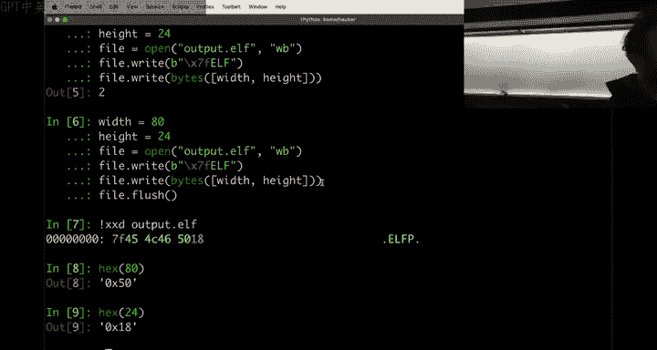

I uploaded to my wrong account， but that's okay， we'll log out here。Log into my secret account。

All right。The camera is not following me。Beautiful eye。Awesome。So， I。

Writing binary data， right， that's all great and fun。You can write these files。

 you can read the file for kind of advanced uses of this， you know。😡，Typically speaking， you you。

Don't analyze and interact with toy programs that kind of read the spoke formats you。

Interact with things that that will， I don't know， read a zip file or whatever like complex formats that you might even have other libraries that produce them and so forth。

 So， you know， as you。Mess around with kind of data inputs here。

 Think about the more general case of。You have a binary。

 It expects something right now that something happens to be bys， but it that something could be。

 you know， bites through a network connection， bytes wrapped in an HCB header。Right in which case。

 instead of。Pythons open， write， whatever you might be using request or curl or something to upload that data's there's a lot of interesting subtopics there that we'll explore over time right now。

 though。😡，Let's talk about how to get。Um， the data that you should be writing， we talked about， okay。

 if you can look at a binary。And I reverse engineer it。And。诶。

Go and like click on the different comparisons and see， okay， hey。

 it's comparing byte one against the letter C， byte two against the letter capital I and whatever。

 right， And then we can grab that。 You can go and look at， okay， it's。

Comparing these two bytes as a short integer in little Indianian format against some version number right and figure out what that is and that's all cool too。

But at some point， you start seeing more and more complex comparisons， right。

 So let me talk about how to。Pull out at least one case of this comparison and understand what's going on。

I created a little program called Secr for us， the program。Has a secret value that it will read in。

And it'll tell us it's wrong。And if you run strings on it， you remember from our first lecture。

 nothing in here that obviously stands out as。The secret value。That we could answer like。

 for example， there's some suspicious stuff like this that this isn't it。

Right so there's nothing very clear from this， of course dive in。To I。

More and more complex methods of reversing。 Let's etce this guy。 See what's going on here。

 we can see it， it sets up， you know， the process as as normally does。

 And then here it reads something。AsDf is what we put in。

 so it reads out asDf enter and then nothing much happens。

 there's a get random call that's interesting， not super relevant。

 and then it writes out that our CQ was wrong。All。We've exhausted our options now we have to actually have to dig in to the binary。

 we can do this in one of two ways。A lot of people are approaching this module in general with Obd for some reason。

 I think these people haven't watched the Monday lecture， so they disassemble。U。

 some people even worse than using objects dont forget to put it in intel mode， but that's fine。

 all right， so you disassemble this。And we started looking through this code， et cetera， cea， ettera。

 I can tell you right now that if you rely on an objectum for this assignment。

 you will fail this module。There is no way to get through this module without using Ida。

 as probably is a way， but not in the amount of time you have to get through this。 much time doing。

 You'll probably spend two to five times as much time if you don't use。

A tool that is more advanced than ob。嗯。That。Being said and in fact， Obdump。Is a nearly。

Unjustifiable tool on this assignment you can't get through this whole assignment just using GDP。

 but there are cases where you want to use GDP there is no case in this whole assignment where you would use Opidd rather than reaching for a better tools such as one of the reversing programs like Ia Gedra。

 minorinja， etc ceter that's installed in the nodejo all right。😡，So if you have typed oddd。

 something is wrong。But if you might say， okay， hey， let's approach this with GDP。Right。

 and we start here。And we do our。Display of the next couple instructions and I just start just kind of。

Reading through this。 And， and， and。I don't know， it's it's not very comfortable。

 I know because I' reversed a billion fucking binaries that， you know。

 this is a making space on a stack frame for something large。

This is saving off the argument one and argument two onto the stack so that these。

These registered become available for later use and， you know。

 you can disassemble this and now're looking at something like Optump， right and again。

If you're trying to understand the high level logic。Of something by looking at the assembly code。

It's important to be able to do that。But looking at the high level odd， Dick。In assembly。

Is not the optimal thing to do。We have， or at least in an obdom。We have technology。

That。Fix helps us do this。And that technology is called。A graphical reverse engineering tooling。

 such as IDda or Giidra or etc。All right， we pull up eitherda。吓。Now。Everyone else says， hey。

 what do I click here， well I ran through this real quick in the previous lecture。

 leave everything as default， Ida knows what it's doing。😡。

When you know what you're doing better than Ida， then you can change these options。

 So if we load the the thing with default options in Ida， you can see， okay， again。

 we talked about this on Monday。 It loads up the assembly parched a little bit better。

 we got a good graph First thing you do and I。I hate making these sweeping。Statements because。

 you know， there are different scenarios for everything。 But the first thing you do when you。

Open up some small little challenge or a typical program。

For reverse engineering in Ida is you hit tabab。To go and decompile it。

Because no matter how many web servers you written in assembly this。Is less approachable。

Thenhan this。Just by lines of code。To understand the high level logic。

 you want to see things at a glance as fast as possible。Right， so you decompile。

 you look at the decompilation and now you see very clearly what this program is doing。

And we already kind of had an idea from playing with it right。

 is checking a secret and's it's comparing that secret against。8。😊，But it's whatever， it's fine too。

And。嗯。That's annoying。 It's supposed to be much longer， but I guess it didn't。And why is it8？嗯。嗯。

I know。嗯。I know let me fix it real quick because， okay， no， no， no， we'll stick with it。It's fine。

 it's fine so it compares an eight byte secret and then tells us it wrong or not and of course。

 on Monday， we already kind of went through this not quite this because on Monday when we this some decompile the source code we saw the comparisons right there we pulled out byte one should be this by two should be this by three should be this So this is a slightly different case。

😊，The comparison。Is being done against some variable secret and where's this variable secret coming from？

We can double click on this， Enidda。And it takes us to the dot data segment。

It's another part of the binary。Where there's a secret。Pointer。Pointing to some offset。

 And if we go into this offset。We see a bunch of random data。This is our。Secret。Meat。😡，So。Again。

Going back。To man， I hit is。From。Main， I saw that there's some data being passed into MamComp and MamComp。

Takes a pointer and how do I know this？Well， I know this because。I can do man mamcomp。

Because I know Memcomm。 And if you don't know Memcomm or don't know some。

binary that is some library function that is being used by the program。

 you can look it up Memcom takes two pointers。And a size。And returns zero if they are the same。

How do you know that Mem comp is a library function。

 or you can double click on Me comp and the decompr complains。 That's a using inside。

 This is a entry in the secret binary， which then。Caused into an external function in a library called Memcompamp Co。

I hit escape to go back that portion takes me to do disassembly hits tab again， source code。

So Mecom has a pointer buffer that's the where I read my data into a pointer to a secret value。

Double click on the pointer list in the dot data in a global variable it's a global variable in the program。

Here it is。And it starts out pointing to here in the read only data segment of the program and this read only data。

😡，Is。Has a bunch of stuff here now。There are two ways for me to extract this data。Yeah。

 what's a D B thank you。 All right， so。Let's talk about this in general。MMComp pointer。

 double click to look at it in Ida。In the data segment。

Trying to understand what this pointer is right here， it has a Dq offset onk。Something， something。

 all right。Let's tackle this one by one first， this secret thing。

 this is the the secret value there was a symbol in the binary since it's a global variable。

 identifying it as a secret value。佢。What's DQ？It is a。Qudwor。Why is it a data quadword？

Qudword means8 bytes， so if you recall the data sizes lecture。

 there's this weird situation where a byte was8 bits。😡。

Then when we move to 16 bit computing rather than make a byte 16 bit。They made a word，16 B。

 and a bite。Remained 8 bits。Then when they moved to4 byte， 32 bit computing。They being humanity。

We made the double word， That's4 bytes。And when we moved to。64 bit computing， we made the quad work。

E bytes，64 bits。Which is the size of a memory address。And secret here。

 you can see I'd identified it correctly as a。AAPoer。

Because it is an argument to Memcomp and so it knows。

 I don't knows that Mamcomp takes two pointers as an argument， so it knows secrets a pointer。

 so it knows that this is a point the value in secret is a pointer somewhere。

That's why I marked this offset。So it's an offset into memorymory。With this onc， blah， blah blah。

 blah， blah， onk blah， bh， blah， blah， Itda says it's an， it's a。Data。

Some data at address 402008 in memory， and I have no idea what what it's called doesn't have a name。

So this we call secret data， I clicked on it， and I hit add to rename it， just made my understanding。

😡，I double click on this and here the secret data has a bunch of Db data bytes。

And this secret data at 402088， 402008 in memory。Is a single byte and then there's another byte right after that an 09。

0 A0 B， et cea， et cetera。 And all of these have different values。 This is D F0 D5，8，0 D。

 I don't know why Li does sometimes prepens an extra0。 It's very annoying， but。That is what it is so。

系得。Sees this as some data。Cool。嗯。We don't care how I heed， we care how the program does。

 and the program ma'm compares eight bytes of this if I hit escape， escape again， go back here， tab。

It takes eight bytes of this， compares it and gives us the correct if it's correct。

 So what we want to do is figure out what those eight bytes are。

ItsD F0 D58，0 D， this is an yeah， just a01， I guess for for low enough values， it doesn't hex them，0。

7， etc cea， cetera。 So now we have something now we can start looking at this idea。We can run。Secret。

And we can pass into it。Let's not be。Let's just。Build up good practices from the beginning and do this in Python。

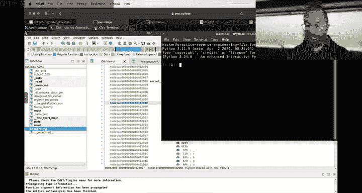

And what we're going to do is import own。And we're going to。Launch this thing and then write to it。

And really just gonna manually copying these out。 Hax D F， Hax0， D， hackx。5，8。Hs0 D again， Hax0，1。

 Hax 0，7。And now it might be temping to just put a one here。H what's the screen up there？

How is that possible。It I'm guessing this is there。Um。

It might be tempting to put a one here because hey。

 there's a one here instead of this like zerovol this is。Not ASI value one if you put a one here。

 it's equivalent to an ASI at 31 right no， this is data bitetes， it's not ASI。0，7， we need8 bytes。

 right，1，2，3，4，5，6， two more。E8。And hacks，8，9。 All right， And then we just read everything。

And we got， oh， we forgot forgot to print out what read。是。And it's wrong。All right， so now。

Rather than staring at it， I wasn't expecting to be wrong。 Now。

 we're gonna to figure out why it's wrong。 rather than staring at this， I'm going to。

Open another terminal， and I'm going to GDP it and get to the bottom of things。 So GDP this。

All right。Let's go back to what' going on here Memcoms a secret。

 let's look in the disassembly that was me hitting tab to go back to disassembly if I click somewhere in the decompilation and hit tab。

 it tries to go roughly to that disassembly spot and here I see this call to MemComp Memcom this is at 401。

1，9， a， I can see this on the bottom there。ok。诶。And。Where's my terminal。

Why do I have five terminals open？

That's not， I don't know what that is。Last terminal。 Okay， here we go。 So I'll break at 401，1，9， a。

啊森。I'm going to run。And。It's asking me for my data， of course， I haven't。Here's our advicete of data。

 Okay， now it's checking the secret。 Now you're at our break point。And now。

What are the first two arguments to a function， It's RDI and RSI。

 So RDI looking back here is our buffer。 So if I print the string at RDI。Theres what I answered。

Are D Xs。Is the size oops， I can't。Examine the memory stored or yeah。

 the memory stored at that value， I can just print。Ed our Dax is。8。

 so we're looking at8 bytes and I can look at because I don't know if it's string then or not。

 I put an s that'll stop printing at the first null byte。 I can print8 bytes in hacks at。R SI。Hey。

 D F0 D。5B looks familiar。D F 0， D， I misread 5 B S 5，8。Miscopiied it。 Is that correct，5。

Double click， double click five， ha ha yep， that's a B， I read it as an eight。Common mistake。

Alll the streak in the book，5 B， let's see now if this works。Still wrong， okay。

 what else did we get wrong？Yeah。5 B than 0 D。Then 01， then 0，7。

Then where the fuck did this come from， Did I just skip a 7，4， I just skipped a 74。

 and no one told me。You guys just letting me suffer up here。 Okay， cool， so 7，4。Okay， great。

We're going remove that we' needed， just eight bytes。And finally。Complex airprone process。

Where I went back and forth to the Ia， GDP and Python。To figure this shit out。

 that's really annoying。Right， and if it was not eight bytes， if it was like I wanted to do。

 which I am about to do， I'm gonna， I guess the people in class will see this。

 the people out of class。Won't， we're going to right now， wait， wait wait。

 I can even cut you guys off，' going to change my secret source code hold on。How did I fuck this up。

 Oh yeah yeah。Size of secret instead of size of u yeah。

 it's the the whole secret shouldn't be a so I'm changing now in my source code secret with a pointer。

And you saw that it was this pointer that pointed to the data region because of that my size calculation was bugged in the code。

 I now fix that classic size of mistake yep。That is a nice bug that we should introduce in memorys。

Cool， so now。Perfect， I've redone it。Now I'm plugging everyone back in。Okay。Perfect， alright， now。

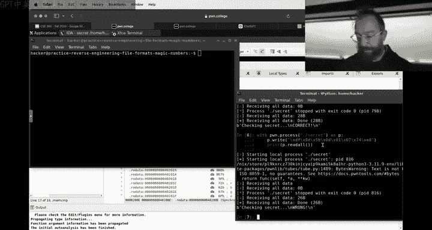

You can see it run this。Secret is not wrong。 No good， all right。

Let's quit this I has no way to like reload a changed file and I'm gonna to save the database。

 be careful with these idda databases if you save it and you reload the existing database and the file is different like slash chance I image you might have a kind of obsolete。

😡，Information in your database。 and that can be very very annoying。 So if we reload Ida。

We don't need the M comp。

Okay， reload item。Here it is， so again， I just hit answer to accept the default settings。Hit tab。

 let's see what changed。Ah， now there's 21 bytes。That's weird， why there 21 bitetes。Okay， we'll。

 we'll just roll with it。 All right， there's 21 bytes。And now we are taking a reference to secret。

 So secret is no longer a pointer in itself。 It is the actual data in that data。

 Not much changed here。 Here it is。 Here's our old 0 D。Why are there two zero days。W there two oh no。

 no， sorry Df， see that leading zero messes me up， why do they do that？Yeah， I mean。

 we can we can change the type of this this data， but we we'll deal with that later if if if this data and I should have done this back when we were only comparing aid bytes if we know that this isn't a。

Just a bunch of of in， like， for example， let's do this。We know that this is a pointer to 21 bytes。

That Memcompamp is comparing。 We can double click here in this secret。

 we had why and the type declaration。We say this is actually a 21 B long character string。 It O。

 And here is now our secret guy。And this doesn't look much better。But it's。Yeah。

 we didn't really gain much， it's technically more correct。Because now you have。I don't know。

 we didn't really gain much from that but。Gue there are cases where we can gain a lot。

 The other thing that we can do is say， hey， we know that secret is being used as an integer。

 for example， so I can hit D to cycle between data width so this is a byte。

 this is those two bytes at 40 combined in little endian hit D again that's 4 byte that's an integer now little endian you know here you see it goes from 40 now the next one is 44 Hi D again。

You can get the next one as well right。helpfulpful sometimes if you're back in the case where you're checking against an integer。

I。But if we're not， we're in this case where now we have to manually copy paste 21 bytes and we saw what an errorprone process not already was So how do we do this without having to like manually translate things There are two ways。

😡，One way。And this， I always have to。嗯。Remember， so if you double click again onto this guy。No。

 sorry， if we。If we switch over to the hex view of the same program， this is at this 4040。

 where the secret starts。 This is the hex view of secret。

Um now you might gain something by saying that it is a 21。 oh， it's still。Still thinks that already。

Ah let's just define it to be an array， size 21。And okay。

So I'm trying to get Ida to display this in a nicer way。 right。

 It knows its type is character secret， But I guess because I was messing with it。

With this hitting D to change the width of the data， I messed it up again。

 just going to try to say it is an array。 I know it's 21 by long。 I hit Okay。 Here it is。

 We're back to this。 All right， can I just。If I hit， click here， click， Yes。 Okay。

 So now in the hex view， it'll highlight everything that。Belongs to that variable。

 I highlighted this。😡，A right click。Tax， nope， edit， nope。

U I always have to remember how to do export data。Right。Export data and boom。 Here's my data。

RightAnd I can export it as Robs。I can make an output file called Se that B。I can click exportport。

And now。If we hackx dump secret that bin。

Look familiar， Df，0， D， 5 B，0 D that here's the  seven4 I missed。And now we can just run secret。

Give it the secret that been。 and we're wrong。GDb。Yep， back to GDP， all right。No。

 I know what happened。No one caught it。It's Hex 21 classic。Allright。Heex 21。Boom， okay。

 we switch it from hacks by heading H。 That's 33。So back to the drawing board bay， it's not so bad。

 we hit we changed this type to 33 instead of 21， but if we fuck better Okay so did we go toward the type。

 I hit Y to change the type， but I no longer listen to me here， I click right click， say hey， no。

 this is in 33 with array which if you remember when I first pulled out this array。

 I suggested 33 Why did it suggest 33 because the next thing that it knows about。😡。

Is this thing at 4045 F？Which is the endom of the segment。And so it had automatically suggest like。

 hey， why don't you just go all the way to the end of the segment？

But I didn't listen to it And in my hubris， I messed that up。 all right。

 so now click here I go to edit export data。Oops， I missed my click edit， export data。

You know they say you miss every click you don't take。

All right， secret that bin again。Export， yep， override。Let's go here。 Oh， I't know。

 we're going to end up with a million terminals again。 Al right， here we go。

So now secret that bin is is longer at training trailing null bitete， maybe a good sign。Secret。

 secret that Ben。And boom， correct， All right， so if you have。A program that is。

Reliant on some complex data。Then you can。诶。Export this data from Ida or from GDP。

 as I'll show you in a second。To。Figure out what's going on and so on， right。

So here I exported from Ida， and that's because this data。Was being stored。Inside。

The binary statically， it was right there。 And in fact， if I click on this。

 I can see where it is in the file。Over here on the bottom on the left， it is at 3040 in the file。

 so another way I could extract it。😡，Is by reading that entire freaking file。In Python。In bite mode。

Reading it all and。Where was it 3040 seeking from 3040 to 3040 plus 33？And。Nextax。All hacks。

Always think， yes， yes， yes。 That's a new， new mistake。 And there it is D F。

0 D is a backslash R it's a character turn character585 B is an open square bracket then there's a0 D again。

 here's our one， here's our seven Yeah， I could even do that Hex。

 but of course keep in mind to unhx it before sending it along here is all in He I can read it right out of the file。

I can use Ida as a fancy file parser to read it out of Ida。诶。Or。I can read it out or GDP。

 And now now that we've reversed the shit out of this file， I'm gonna to actually。

Pull back the curtain and show it to you。 here was that file。All right， and conceptually。

 conceptually， this isn't too dissimilar than some of the reversing levels。Right。

Ting the reversing levels， typically what you need to do to match this guy。是。Is。

Give some data that the program mutates。All right， so let's see。Where we are。Wait， wait， wait， wait。

 wait。Oh， someone on T said that all they see is a giant yan portrait， is that still the case？

Prob briefly I guess。Another question on T， are we planning to having to have a lecture on Monday。

 probably should。You have to be live stream， yeah。All right， we'll figure that out。 Yeah， okay， so。

Here's our secret right now you're just ma'm combing that truth， but what if it wasn't that simple？

What if we did something to the entry？And then Ma'm Compted， or if we did something to the secret。

 and then Ma'm Compted， let's do that right now。Right now in the challenges。

It's your input that gets modified。Order gets devolved， parsed， ceter cetera， the sea image。

But here we're going to modify the secret so。Right。Let's do this。

We're going to decrement every bite of the secreters。 So there's something that's stored。

And we read it out and when we try to run it with this program。

It's wrong。Why is it wrong， Well， we know， because what we actually need to put in is is something。

That will get modified。To this。Or sorry， something that'll match the modified secret。

If we reload this an item。一。Rload this an idda。Here is that modification。

 but if we go ahead up the secret， it's still those old values。 If we extract that secret。

 itll be the same as the one we extracted before and it is no longer the correct inputs to the program。

 even though it's the correct value of the secret variable。Now， what can we do？Well。

If you want a reason about the dynamic properties， the runtime properties of a program。

 this is where we reach for GDP。So here's the memcomp。 It is at。

The call to MComp is that I hit just hit tab to switch back to the assembly。

 the call to M Comp is at 4011c6。Can your GDP this secret？We break at 4011 c6。

We run with our secret that Ben as an input， which is gives some input。 I here we have a break point。

We know that we have 33。Bytes of input at RDI。 This is what we provided。Ourai is the storage secret。

Here's it is at DE， of course it's。I it zero C。Oh yeah， yeah yeah， Yeah， sorry D E is D F minus1，0。

 C is0， D minus1， etc cetera cool。How do we this is what we need to input and again。

 I restock copy pastcing this crap no。GDB also allows us to dump memory and here I have to remember the syntax dump。

Bineinary。It's like the format you're going to be dumping the same as we were choosing the format in Ida and we chose raw binary here that is。

And then I think is the file name。Lets just yo on it。 Okay， here is new secret that been。

And then the start address is this。For Rsi， and then is it the lengther and address， let's shy 33。

Okay。😊，Undefined binary command。Y help dump binary one in doubt。Dump binary memory。

So you can also dump binary a value， okay， here's memory。

Invalid memory address start is greater in the Rangr case so。This is the and， okay。

Boom seems to have worked。Let's quit hex dumpump， new secret success， D E O， all right？

And here it is。Can't stop us。Cool。嗯。Okay。So。We can look at。The dynamic properties of a program。

In GDP， as long as we know， where to break to check these properties。

And we broke right here at the mamcompamp。I the call to Mecom。And we know what to dump。

 and we knew where to dump。 We knew that RSi holds our secret value because we looked around an ida and we reverse engineered it。

 and we understood。And then we were able to dump it out。嗯。Now。

There are two concepts I want to convey。Wch。Two concepts I want to convey。

And we only have 20 minutes。So which concept is more important？ Well。

 one thing that we'll do very fast is I've been using Ida。4尔。I don't know。15。Close to 15 years so。

I reach for a versioning2， I reach for Ia。The problem with Ida is it's a very。Commercial product。

 this is a free version of it。And the free version of it， the commercial product costs。I don't know。

 Tens of thousands of dollars，$10000 a year。 The free version， of course， is free， but。The decompilr。

 when I hit tab， it uses a cloud service。So， this deadline。Even if P College stays off。

 which we fixed all the bugs， things are good now， even if P College stays off。Ida will not。

U be able to cope with the raw amount of decompilation。

 whether their shit goes down or they just start layer limiting us because everyone's hitting them from the same I。

Ida will become progressively less reliable That is unfortunate because it's really a great tool。

 but there are lots of other tools in the Dojo you go to ask that are also great go to applications。

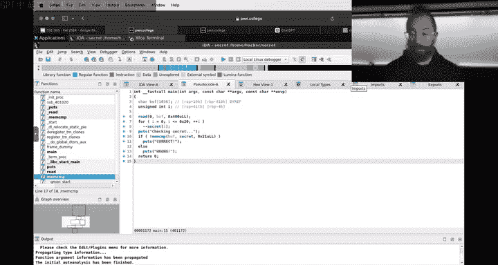

My suggestion is to use Giidra。 Gira is a tool developed by the essay。That。

I was open sourced a couple of years back。

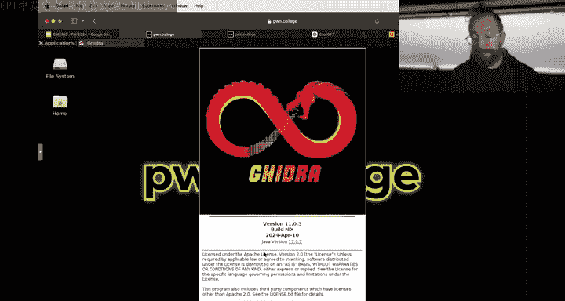

And it is。A really badass tool just unfortunately written in a very Java way with very Java interfaces。

 and so I don't like the interface， but the tool is very powerful。😡，So if we quit the tips。

 turn off the tips， you can read all these tips is great， okay。Now。

 how do we do this whole Gira thing， you have to create a new project in Gira。Cool。Project name。

Secret stuff。Okay， now we have a project now we。

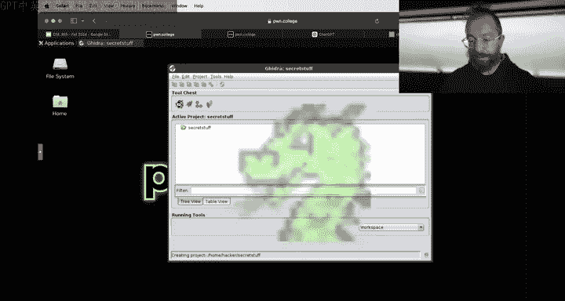

Click the dragon that I already mess up。No， okay， good。 Now you go open。

veryIt's very Java because I don't want this secret stuff old， no， no no， that's the project file。

 import file， import file， yes。That's an import file like this。 Yeah， okay， here's our secret。

Hit okay。The dragon think for a bit。Mom。We hit yes， we want。

 we want the reversing tools to do everything they can to make our job easier。

 which includes analyzing the binary。I just I just。I assume they know better what's going on。

 All right， import results summary， I have to zoom out in my browser to get this to。

Display properly hopefully bar so that screen。Oh really that that would be clever。 Al right， Anyways。

 I hit okay here。 So it's just the the， the logs of all the analyses。 I don't know I。

I mean， I could read this to you， but。TLDR and analyze the binary。 and it's very good at its job。

 Okay， so we're gonna now zoom back in。 now， now this is， is really a bit of a。Pain in the ass。

Now there we go full screen。 Okay， so this is what。Gidro looks like for the same binary。

 Here's Ida when we first loaded it up。Fairly clean graph， et cea， et cetera， Gira。

 slightly different。Opens it up and it didn't even take me to Maine， that's okay， Gurez。Maanswear。

Right in the middle all right， so now I click on main and here it automatically decompilles。

Decompilation， it it has different values for its。The variables it recover。

The my biggest complaint with Gira is I don't like the assembly view， but like I said。

 for the most part。I wish that scrolling was a little easier for the most part。

 you're not going to be looking at the assembly a lot。

 you'll look at the assembly in cases where the decompilation messes up or is hard to read for data mangling specifically that's the most common failure of decompilation on these simple programs。

😡，But you know you can you can recognize this here's it it calls read it's actually a lot easier to see that hey。

 it's a library call because it annotates it with external So if you scroll down enough。

 we're gonna see our external puts if you click on this Me comp here we see external M comp and now it's it's side by side that that's we can do a similar thing with I we can take the pseudocode and drag it。

😡，Um， well， that was a big mistake because now I need to。You all right， why did I do this？

Drag it here， yep， y， y， drag it boom。 So we can do a similar thing， but it it's not quite as smooth。

 You still have to hit tab。Anyways， Gira。It's all nice and synchronized。

 And there there's a lot of really cool about just if， if you've been using。A tool for 15 years。

 the little differences are hard to adapt to Gira will not fail。Unless Po college fails。

 but you're not going end up in a situation where you can't decompile because idL rate limited us or or their cloud decompilr crashed so that's a benefit super cool highly recommended all the same things you can do with Ida you can do with Gira it's just。

For me， it takes like eight times as long because I don't remember how to do everything in muscle memory。

All right， real quick just show binary ninja also I think the binary and ninja interface is very all right。

 there's also two other decompilrs， there's binary ninja there's binary ninja free Now Gira is fully featured everything binary Ninja and Ia these are free versions with limitations right and you can go through and learn how to use everything that's awesome TlDR you click on open。

We go to our secret here。

And here is binary Ninja， and so it opened us up to start， which recall in a C program start。

runs Lipsy star main which is Lipsy program that launches main。

 we double click kind of here's our main and here you can see binary ninjas decompilation and binary ninjas decompilation。

 it looked like it failed to recover the type。It failed to recover that this is a。

Is the secret variable， why is that？Yeah， you can hit tap to go back to this sound。

In this specific case， binaryages decompilation a little worse typically it's a good tool as well finally。

Last but not least。There's anger management， anger management is produced by our research lab。

Anger is a binary analysis framework that can。

Can it solve all of this stuff now we're talking about anyways。

 anger management is a binary analysis project among other things we do decompilation research same sort of thing we open it up hit okay with the default things This is probably the most similar to Ida very very similar here's the read here's。

The blah， blah blah hit tab， we do the decocompilation and here's anger management's decocompilation。

You notice all of these are slightly different decompilation results， Ida。你砖。Vinener ninja。

Anger management， all of them are slightly different because the original source code is lost。

 discarded during the compilation process， and when we're decompiling， we makeake guesses。

 informed guesses based on the binary code， but still guesses about what the original source code looked like。

😡，There is no deterministically correct way to make these guesses。

Some decisions made during compilation。Are really data destructive。Right where multiple different。

Types of source code can compile them to the same binary， think a four loop versus a Y loop。😡。

Or an if versus an if not。Oftentimes， semantically， they can be identical if you just swap the the。

The the you know then and the else。So these sorts of decisions and other decisions to roll back compiler optimization stuff lead to different results。

😡，What I typically do my workflow is， even though。My lab is responsible for anger。

 I've been using Ida long enough first I use Ida if that fails， for example。

 there's high load on their server， et ceter， et cea， et cetera。

 or I need some advanced functionality that I know how to use in anger I reach for anger。😡。

The workflow I suggest to you is either standardized on Gira。😡，Or try either than D。

If Fida doesn't workum or give binary Ninja a try binary Ninja is really cool in that if you want to pay for a product as a student。

Bineer ninja is the only really affordable of the commercial option Actually。

 Ida has a student version now， don't they Yeah I Ida student。

 I think they do people can look into it Yeah， look into it， okay， oops。

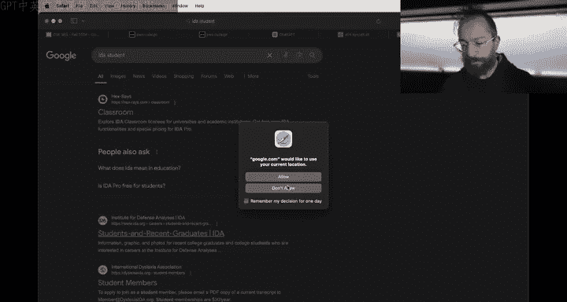

Did we just know， And that was a different thing。 Okay， awesome， so。😊，Uh。

 the last thing I wanted to convey and hopefully 10 minutes is enough。This types， right。

 So here so far， we've just been saying， I have。 we have this。Blob of stuff you need to match。

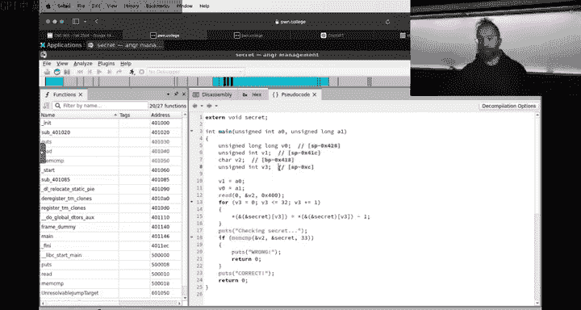

And we want to。Match it， where are my terminals？What if our secret was a little more complex？

Did we zoom in or something more if we did？What if our secret was a little more complex？And。

We got a structure here。Instead of this this secret。We had。A structure。

Will we be able to do this in 10 minutes？Something is， okay。

 this is going to be some insane sea code， but。Yeah。All right。We have a structure of。Andre。

 they scored entries。This would just be too confusing。In 10 minutes。Good。Beic size data。Hosstate。

Data size data and the size and the data。Postable。W明。You want to do it Okay。

 I so when Janon's talking about types， he's saying basically astruct right and see that is a type。

 So a type is really just how are we arranging some bytes of data or're in them Oh God。

 I gonna do the meme of how do I quit them All right。

 we will open up V code like a sane person for editing code。

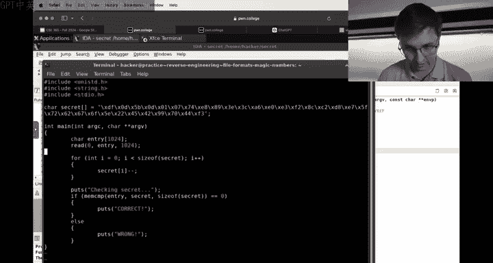

あ么。And what the heck， okay， whatever secret dot C， open。 Okay， so let's say， for example。

That we have somestruct where we have。You know， ins a， and then it's going to be a car buffer of 16。

And then。诶诶。We'll put another buffer up here。 car buffer for or buffer first。 You know。

 there's terrible sea code。 but basically a bunch of laid out data， right。

 So we have  four bys followed by 32 or followed by another 4 bys followed by 16 Bs。 And let's say。

And we'll call this my data。And we read in。To my data。And percent。And get rid of that。

 And we will say if。Buffffer first。Oops， my data。Yes。Offer first。Stir and compare。ABCD。4。And。

Let's see here。My data dot A equals 17 and。Stir and compare buffer。Buffffer。zero，1，2，3，4，5，6，7，8，9。

 ABC， D， E F。16。是。And we say puts past right， Okay， this is our new check。 Basically。

 it's a little contrived。 doesn't really matter。 It's pretty standard though。

 for a program to usestructs right， La a bunch of data in some interesting way。 you know。

 realistically there's gonna be some semantic meaning to these sorts of things But for some reason we have a layout of data where we want four bytes followed by an integer followed by another 16 bytes。

 And if I type this right， my data。Dots。Buffffer？If we pass all of these。Why are we failing on this。

 this， Well， we'll just do it all on one line so I can see。

I have no idea why VS code is in this insane style， but。We will roll with it。

 Someone changed their style Oh， I'm forgetting a semi Michaelcha， and that is why it's complaining。

 okay， and then we compile this program。And we'll say， oh， secrets。And hopefully it passed。 Yeah。

 Okay， so what does this look like now in Gira， this mess of comparisons。 Well。

 what it looks like in Gira。

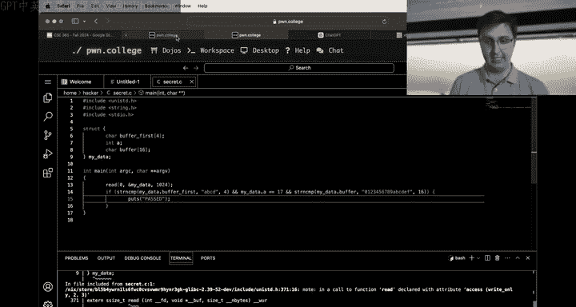

Or actually， we'll do Ida， Why not Ida 64。Secreets。Data bias corrupted beyond repair。

 I think that is probably because we still have IDda open。And be careful with the IdaA database。Okay。

 you know what I'm just gonna save it by accident， right， Whoops， I accidentally saved it。

 Here's what we do。 Remove secret dots Ida I 64。 by the way， saving the database is fine。

 Yeah normally it around for your different channel your program isn't changing If you had access to the source code because you're constantly compiling the program。

 probably you don't need a tool like Ida。 So this is a little bit of a contrived problem that likely you will not run into。

 But if somehow you do that is what you can do， just remove the database。😊，Okay。

 so what does this decocompilation look like？Well， what it looks like。

Is this It's actually not so bad。 So we have my data being compared with ABCD。

 and then we have whatever the heck this thing is getting compared with 17。

 And then we have this other thing getting compared with01，23 blah blah， bla， blah。

 blah So it actually doesn't really have any understanding that these things are laid out next to each other in memory right it's basically calling this three different things that are not like astruct dot right if we think back to the original source code in case you know you forgot we have these things laid out next to each other。

 And how could it possibly know this。 it knows where they are。

 but it doesn't know that they're part of somestruct So it's just saying， you know well。

 I have my data and then I've got this other location and memory at address 40，40，4。

4 and then I've also got this other thing called that it decided to call S1 And if I double click on it。

 we can see that it actually put them all next to each。

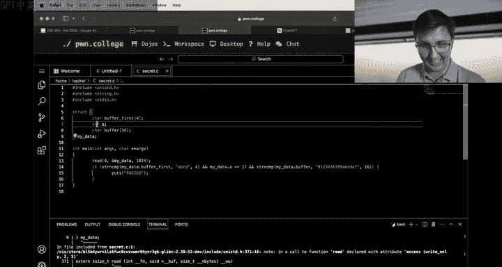

It recovered that there's this my data thing that's four bytes and then there's this thing and then there's this thing。

啊。But what we can do actually， if I remember the syntax here in IDda。Let's see here is it。

How do we create a newstruct？Do you remember Jan？What's our。

 what's our newstruct and you want to turn this into a structure show Yeah， go all right we are。

Want to make this data。A specific type。 And this change didn't。 I know。 That's why。 That's why。 Okay。

 let's go to。At it， is itstruct， no。Did a window。 Yeah， yeah。 window， local types。 Yes， there we go。

 Okay， here's our different trucks available。 We're going to add。Create a type。 It's， yeah， add type。

We're gonna call it ourstruct。Okay。Okay， here's ourstruct。

 and here we now go back and forth between the idda window。Yeah。诶。Here we see， okay， we。

We know ourstruct is。Hacks 400， we don't know that。Well， its random size。 Oh it's random size。

 All right， Well， we might suspect that it's X 400。 So now we add a。

 I head D to add a character field。 I hit Y to say， okay， it's X 400。That's 1024。

And this is something I don't know what it is， it's padding。Bad declaration。Oh。

 because I messed up my C batting1 24， All right， here it is。

Go back here now I can actually go back here and say， okay， my data is going to bestruct。

 what is ourstruct？And boom。Changes the decocompilation to where we have our struct here。

And we stir copy field zero with ABCD。😡，4 bys。 So field0。

 the first four byte is a unique field that's being reasoned about differently。

 So here I'm going to hit D Oops， cancel， hit Well， now I messed it up。 create a 32 Bte field 0。

First。Well， whatever， field。La， maybe ABC D， let's say you'll end up with a lot of these like。

 I don't know what's going on， I had D again。Make 1020 remaining bys here。 This may be ABC D。

 I go back。 I hit F 5 to refresh this。Does sound， okay， here we go。We send along my data。

And if we change。嗯。I wish this was saying struck zero。诶。What is S1？These are all in instruct。

All in the this cannot be done in 10 minutes Yeah and 10 minutes is away。

 we'll save this for either our next lecture or a little。Um， video willll upload， this is good stuff。

 but we are out of time the next fast coming。

We'll cut it here， we succeed in some things faileded than others。But we'll get this video to you。

Asap and we'll keep going from there。 Al right， Monday stream。

 we'll figure it out and announce it Otherwise， good luck the checkpoint is due on Sunday first six levels。

 you should have everything you need for that even without this type stuff。All right， let's roll。

And then keep going beyond that because this is a tough assignment。Goodbye。

