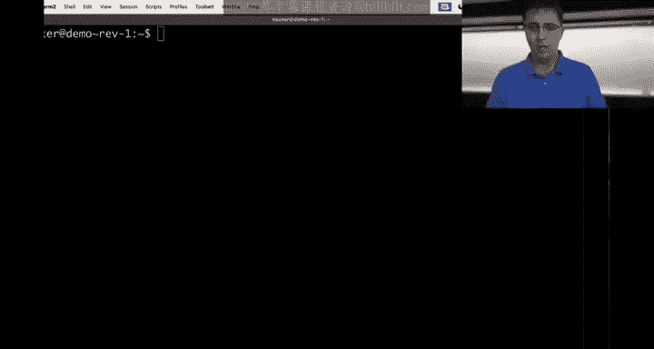
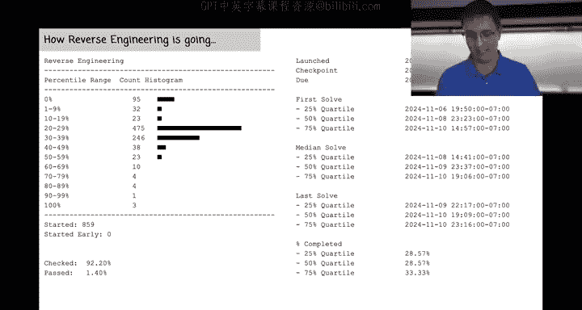
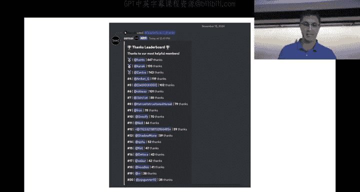
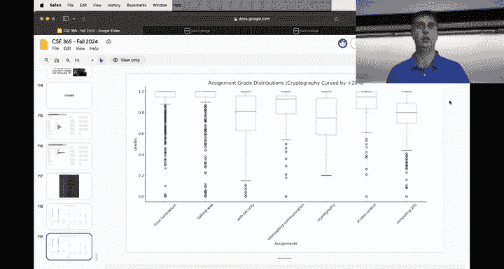
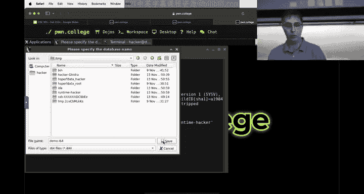
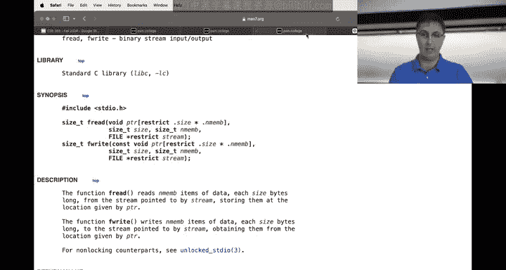
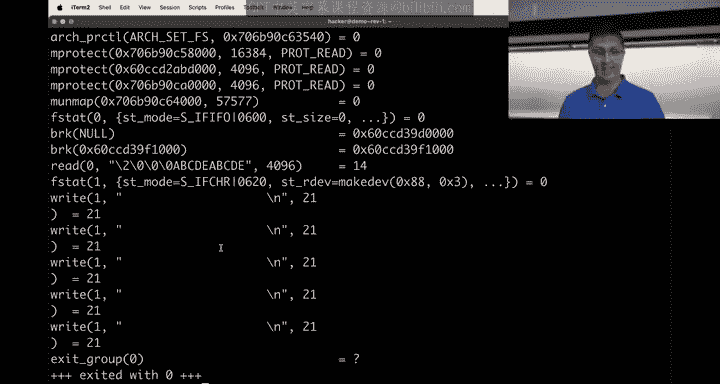
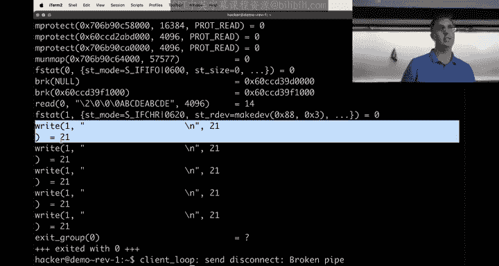

# ASU《网络安全导论｜ASU CSE365 Introduction to Cybersecurity Fall 2024》中英字幕deepseek翻译 - P23：-24-Reverse Engineering - CSE365 - Connor - 2024.11.13.zh_en - GPT中英字幕课程资源 - BV1nVCVY9Ehy

Al right， hello， everyone。 may get the camera to follow me。

Maybe be and I hit start stream。 hit Start stream。 Okay， hellello， everyone。

 welcomel to today's CS E 365， Getting closer and closer to the end of the semester。

 I think there's like one less than a month or something。 Okay， Janwn is not here today。

 He's not feeling super well。 So what we're gonna do today is we're gonna dive into。😊。

A sort of demo problem that is heavily inspired by the ideas in this module that should hopefully further clear up any。

 you know， confusion about how to approach this sort of task of reverse engineering。 Okay。

 before we do that， we're just going to do a quick course like what's going on in the course。

So this is how Comp 101 went， pretty good， certainly compared to cryptography， for example。

 looks like the median student got 80%， which is pretty good and most of the class passed。Okay。

 this is how reverse engineering is currently going。

 A lot of people finished up the checkpoint makes sense。

 The few challenges after the checkpoints are difficult。 Okay， so highly， highly， highly。

 I only say this every single week。 But I highly， highly， highly encourage you to start now。

 and there's also the bonus issue that we talked about last week。

 which is that on the day of the deadline。 Home college will not go down。 right。

 We're finally stable。 It's good to go this this time for real。But Ida。

 if if you're liking Ida and you're liking IDA's decompilation almost certainly that will fail on the last day because everyone is going to swarm into the server。

 work on the assignment and here's the issue with IDda we didn't build IDA we have no control over IDda I don't know if we're crashing IDA decompilation servers or they' rate limiting us。

 whatever it is that decompilation thing goes to the cloud and it's going to fail so if you like IDA decompilation start early alternatively feel free to use Gira decompilation or anger management decompilation or finding an Nja decompilation there's other decompilation tools out there that work very well especially on these challenges but if you feel like you like IDda。

 maybe you started this assignment using IDda keep that in mind Ida will fail on the last day so that's what we'll say about that additional I know a lot of students。

or struggling with kind of some of these middle challenges and then I've seen some people talking about right it's a new module so I can't say like oh this is how people did it last semester you know we deployed this new reverse engineering module what I've seen as some sort of consensus is you know these next few levels after the checkpoint are difficult but then maybe you kind of like build up an understanding and then like the later levels action end up getting easier there's kind of like a hum of reverse engineering that you need to get over where you understand kind of the core of the program a bit better and once you've kind of developed that understanding you have an easier time it seems with some of those later levels whether or not that's true hard to know for sure because it's our first time running this module but I've definitely seen some people saying that。

Okay， so yes， please， please， please work on this before this weekend。

 you want to get through some of these middle levels sooner rather than later where you will be very sad this weekend。

Okay， here is the status of things in this course。 Hanto， of course， dominating。

 but seems like we've got some new people kind of climbing the ranks a bit， which is cool to see。

 and lots of very helpful people on here， hey。😊。

We did an analysis of cryptography， we still have lots of thoughts about how cryptography went and you can see right here that you know your frustrations with cryptography are you know backed by data right like if you thought cryptography was terrible you already know you're not alone right everyone in the class that knows they're not alone on that but here's the hard like data about how cryptography went right the median grade was a 55% on cryptography。

We wanted to adjust that to kind of you know aid with cryptography a bit and what we did is we deployed a change for the late policy on the cryptography assignment where every single challenge you solve late normally it's worth half credit but for cryptography we made it worth 75% credit highly encourage you to go back if you find some time to do that but we also understand right this course moves at a fast pace。

 Most of you will not find time to go back and do it so this you know solution of hey。

 75% of you go back and do it it probably doesn't really help the people that。

This assignment being difficult hurt the most so we are addressing that and we are addressing that with a 20% curve on the cryptography module。

 So everyone is just going to get 2% extra credit added to their overall grade so you solved everything Good job。

 you are like not getting punished for solving everything probably if you solved everything on crypto you're going to do fine this course regardless。

But if you struggled， we're giving you a 20% no matter what we're giving you a 20% curve on the cryptography module to bring it at least a little more in line with。

 for example web security which was a difficult assignment computing 101 you know maybe the next most difficult after that so we were adding a 20% curve to the cryptography module so really simple math there's 10 assignments each assignment is worth a total of 10% we wanted to boost everyone's cryptography grade by 20% to account for the fact that we added new difficult challenges that people really struggled with so 20% of 10% we are giving everyone 2% overall extra credit in the class kind of make up for the fact that you know there were a few challenges for sure on cryptography that were harder than intended。

Yeah， does anyone have any questions about that hopefully it just makes sense。

 everyone's going to get 2% overall extra credit， it'll show up on your grade sometime this week。

Any questions about that？Cool， yeah。Hopefully we don't have to do that for any more assignments。

 but we'll see you know reverse engineering is a new module。

 I know some people are struggling start early， but you know worst case scenario。

We we understand we're trying to work with you guys， you know， if if something is way too difficult。

 that is not our goal， but sometimes， you know， we miss the mark on what we're aiming for and you know。

 realistically， most of these assignments， you know， you solve。😡，60。

70% of the challenges you're really getting the gist of the idea that's great and we want to encourage you to strive towards that 100% but even generally speaking 100% is not like what we're expecting。

 but we understand the cryptography was more difficult than anticipated so that's what's going on there okay I just realized I don't have the Twitch chat open so if there's people on Twitch chat。

Saying something about this， let me see if I can pull it up。Just in case there is any confusion here。

嗯。Well， it's not loading the past chat， if there's any confusion message on Discord in the on topic for the course and I will address that confusion after class。

Okay。So that is the state of the course hopefully we all know though that maybe understand that and just to kind of put into perspective how far along we are in this course right we are on assignment I believe number eight yes we're on assignment number eight reverse engineering there will be two more after that and yeah that's that's how it's going go hopefully the next module will actually be。

😡，A little bit easier than reverse engineering or crypto possibly even easier than web security in some ways depends what kind of topics you know resonate with you The last challenge or the last module though after memory corruption so memory corruption will be the next one the last one is gonna to be a bit of it putting it all together module is kind of expected that that might be a little bit tricky and that is intentional in a lot of ways but we're gonna to constantly monitor you know the state of grades in the class anything we do that goes rogan is crazy。

 we will make sure that grades are looking how we like to see the grades looking in the class but yeah that last assignment probably will be a little tricky because you'll be doing you know something like cryptography over a web server and man in the middle link some network traffic it is going be combining all the concepts so every concept you hate is coming back at the very last module maybe not a padding oracle attack though maybe we' not include that in the last module okay。

え？Cool， any questions about the course or high level questions about reverse engineering more specifically before I jump into a demo highly inspired by the current assignment？

Not seeing any， okay， cool。Let's see here then。Okay。Okay。So， is this camera following me， it is okay。

What I did here is I created a bonus challenge Dorian。

 you're not required to solve this bonus challenge， in fact。

 you probably won't even be able to find this bonus challenge if someone wants to find the bonus challenge。

 let me know and I can make it more public。But what I did in I hope to demonstrate reverse engineering as I approach this topic。

 what I did is I' kind of tricky to teach reverse engineering if you write the source code for the program。

😡，You're not really reverse engineering， right， you're like pretending to reverse engineer。

 So in an effort to kind of combat that at least a little bit。

What I did is I wrote to Cha EptT and said createate this program modeled after this idea and it's sp out a bunch of source code。

 I didn't really look at it， compiled it and that's this challenge so I don't really know how this program works I've got you know some high levelvel understanding of how it works because you I prompted chat ET with what it should do but what we're gonna do is with that in mind jump into understanding what it looks like we're going to define somestructs in Ida maybe we'll jump into GDP if we need to test some things and that's kind of what we'll do and if there's questions along the way please just raise your hand or shout out what your question is and we will roll with that。

Okay， so Im going to start up this demo challenge。And。I guess we're going to want the desktop。

 aren't we because we are going to want items so doing SSH isn't really going to help us very much。

Here's what we got。We have this demo program and the demo program just to kind of double check。

Is a set U ID L。 So it's just like。The challenges you're working on right。

 It's not like a Python script like many of the other modules might be。 It is an elf。

 as in in other words， you know， if we obbs dump this thing。

Wch is going to make yaon very upset that I object dumped this thing。

 but I'm doing it anyways right we just have a whole bunch of assembly。 have this main function。

 it was written in C and compiled right it wasn't just handwritten assembly。

 It was a C program that was compiled， It's got a main function and maybe it's got some other functions。

The reminder， don't approach this assignment in OD you're gonna to want a better tool or you're just kind of wasting your time Okay so I did O dump just to show hey。

 there's X 86 instructions you really， really， really want to use Ida or Gidra or binary nja or anger management or something to kind of dive into this a bit better will save you time and believe me you want to save time on this module Okay so what we're gonna do then throwing away Ob dump we're going to type Ida 64 you could also type I think Gra。

😡，you could， well， I guess it's just going launch Gra now because Gra is not very nice with argument。

 you know， you could launch Gr， I'm going launch Ida and you know。

 I think in a previous lecture video last week we showed off kind of loading a program into Gra。

 as I said though， I am going to go to IDda。Okay， I a 64 challenge demo。

 A lot of people hit this issue。 Hopefully everyone has gotten past this issue。

 but I I think I still maybe got a message like two days ago about this。 Hopefully。

 you're done getting this。Being panicked by this， right This is just a warning。

 So' permission denied。 Please specify another file path for the database。

 All this is saying is that it wants to create a file called challengede do i64。

 and it can't do that because you don't have right permission in the challenge directory。

 It's a warning。 Just hit okay。 And then it's gonna to ask you where you want to save it。

 You can save it in your home directory。 You can save it in temp。 doesn't really matter。

 Just save it somewhere。 you have the ability to write， which would be your home directory or temp。

 Okay， just do that。 And then just hit okay， don't worry about options。

 It's gonna to have smart options here。 Okay get。

All right， now we're loaded in。And we can see a whole bunch of instructions。

 and we're in this nice graph view that we've seen in last week's lectures。

 I don't really even want to look at this right now。 Maybe we'll decide that， you know。

 I want to really understand the low levell control flow of the X 86 instructions。 And maybe。

 you know， I'll appreciate that more later。I'm not really excited about that idea right now though。

 what I want to do is I just want to hit tab and this is what's going to fail in Ida on Sunday so you know。

 start early or use Gira。Okay， I hit tab and it gives me information I don't know。

 Maybe Ia should just chill out on giving so much information。

 but probably there's people that appreciate this message。 I don't know。

 I'm not one of them just hit okay whenever you're unsure just hit okay okay and now we've got some sort of C right。

 it's not very good C， we've seen last week what does decompilation looks like right we've got variables like V3 and V4 and V5 and V7 there's not very good variable names almost certainly the original program did not have variable names that looks like this。

 but that's what we're working with。Okay， so what I am glancing at right here trying to understand this program and again。

 I told Cha UT about this program I haven't even read the source code for this program。

 I just told Cha UT create a program that does this sort of thing。

 so I don't know what this is going to look like totally。😡。

What I am looking for just on first glance is function callss and strings and like comparisons。

 These are like the like control flow， like if for a while or four。

 just like very subtly glancing at this just high level 10000 feet picture of what's going on。

 strings are nice because as Janwn talks about last week is strings might provide some sort of like semantic anchor。

 I think is what he likes to call it。 So for example， we can see this string right here。

 says failed to read number of rectangles。😊，I mean， we'll we'll see where that thing comes up。

 In fact， it's V5。 maybe I'll even want to rename this。 So when V5 shows up later。

 I can see it better。 we'll say like。Arror rectangles。Message。

 and what I did to rename this is I just hit N。And you know， you don't have to rename it。

 but maybe we're going to see this variable get reference later and it'd be helpful to have something better than before when it does just so that at this high level view。

 I can see things better。😡，We've got this V3 thing。

 honestly I'm pointing at it because you know my natural brainwell lecturing is to go top down。

 but this is not how you actually reverse engineer Who cares about top down we're like as high up in the clouds as we can for looking at this thing I'm literally just looking at strings I'm seeing like for example。

 and function calls I'm seeing like some F reads in here seeing whatever this F print F CHK thing is I see this render rectangle I see this string right here。

 I see frame buffer matches It's kind of nice that there's some symbols in this program that are you know kind of strings give us semantic anchors function name symbols give us semantic anchors I can see this right here this looks very exciting As soon as I see the string for slash flag I'm like okay so this is the goal If somehow I can reach this F open for flag I mean I guess we'll have to double check that it opens it reads it and then outputs it。

 but probably as soon as you see it's opening the flag。know it might be promising and let's see here。

 you know， we will call this flag file because I just want to quickly look at this and then I don't know。

 this is like some slightly optimized code。That GCC emitted， for some reason。

 it's like V8 equals flag file and you're like， why would we do this？

And that's a good question that basically the compiler did that slash Idas decocompilation analysis is just trying its best here to like figure out what's going on。

 This decocompilation effort is really just best effort， like。

This we can already see here like why why V8， Why do we need to do V8 equals flag file for us to close it。

 that doesn't really make sense like just cut this line out and then just close flag file。

 but here we are it's decompilation， it's best effort so we'll just say like flag file again maybe there's a more interesting reason that it does this。

 but probably it has to do with registers moving around and it decided that in this case。

 yeah we can actually see if we hover it says RAX I bet this one's like a different register RBP。😡。

Why， why did the compiler decide to both put it in RAX and RBP Well it put it in RAX。

 I guess when F open returns right， if F open returns， the value goes in RAX。

 it decided to put that then into RBP probably to save it off because it's worried that it's going to call another function and we know when we call a function。

 the return value goes into RAX， so they wanted to put it somewhere else。😡，In fact。

 if we really want to， you know， just quickly dive in here， right， we can see here， remember。

 just keep remembering this this decompilation is best effort。

 it's not necessarily going to be very clean code call F open and then we see move RAX RBP。

That's what happened。 And then I guess it also tested off RAX。

 maybe that's what really confuse it So it checking if RAX is zero or not。

 probably because it would be zero if it failed FO we could read the man page。

 but it returns a null pointer if it fails， we would test RAX RAX and jump not zero to basically have that error state and I guess in analyzing this it ass decompilation。

Gave us this massive flag file and flag file again，'s thats just what's going on here。

Looks like here my error rectangle message isn't very good because it gets reassigned later。

 So I guess it's not really just error rectangle message。

 It's I guess maybe just like error message because other people want to use it。

 so maybe I'll make that slightly more accurate this nonsense here again。

 just like the flag file again， we've got V4 equals standard error。

 And then we use V4 like just past standard error here， best effort with this decompilation。

 So maybe we'll say like standard error again， right whatever we want to call it。Cool。

 and in this case， you know， I'm getting more specific with analyzing this flag functionality。

Realistically， again， if I wasn't lecturing， I would see open flag and I would just like ignore it。

 I would immediately jump up。 I'd say what is this condition I want to get here。

 I want control flow to go to the open flag and， you know。

 probably it's going output and we can see right here， we F gets against F or V12。😡。

We're reading from the flag file and then we're put where we're reading so you know this is this is high level of the logic that's going to now output that flag cool。

So what we want to do is we want frame buffer matches to be true somehow this needs to be not zero。

 so this is a function。This function， if I double click on it to get the decompilation of this。

 it does some stuff， I guess at the very end does a stir compare at the end。

 it says returns stir compare equals equals0。 if stir compare equals0。

 that means that the strings match so compare0， they match。

 And so this is checking ultimately that two strings match and you know what are those two strings。

 we're going to have to dig further in， but kind of building up this mental model。😡。

If I want the flag， I need two strings to match。 again， we don't know what those two strings are。

 but working backwards from our objective。 We need two strings to match。

 That's what we've learned so far。 Maybe we want to look in the middle a little bit more to kind of really kind of get an understanding of what kind of computations going on in the middle that might be related to those two strings we want to be equal to each other。

 Probably this stuff in the middle is somehow related to that。 It could be totally unrelated。

 all this logic in the middle。 might have nothing to do with those two strings being equal。 But。

 you know， as we continue our high level glance。 Let's just kind of see what's going on here。

 So we have our error message。 Did I not change this the error message。 What happened here。嗯。😊。

I did rename error message。做。I like descriptive， correct things here。 So error message。

 So if V3 does not equal1， again， we're looking for strings， we're looking for functions。

 We're looking for conditions and control flow。If V3 does not equal1。Well， what that would mean here。

Is that the output of F read。And we're reading into this pointer so we'll call this pointer like my first read。

 I guess， because this is the very first read I see in this。

 so this is kind of the first place my inputs going into this program is's reading four bytes one byte at a time from standard in I think that's true that you know I didn't actually expect to see four arguments to F read。

 let's go ahead and do man F read。

呃。F read takes a。Location， I've never seen this syntax before。 This is mildly terrifying。

 but we'll say it's a buffer， takes a buffer， takes a eyes， takes a number of members。

 That's kind of what I was guessing。 and then where to read from So what are we doing here we're reading from standard input。

 we're reading into this location four bytes just four bytes Basically it's reading this argument times this argument many bytes Co So we're reading in four bytes。

 my first read we'll even say of four bytes who cares it doesn't have to be the same type of variable name that you'd write in a real C program if you're writing it yourself just make it descriptive for yourself so that if I see this thing reference later which I see right here。

 I know that this is my first read of four bytes just make it a nice long variable name okay。

And then this is first read。Result。Okay， so then we can see that our result is later referenced here and it's checked to be if it is not equal to one。

 If it is equal to one， then we're gonna go to label 11， whatever the heck that is。 You know。

 remember C technically has go tos。 You probably don't use go tos when you write C。

 but it is an option。 you cant go to something。 It's just like an assembly jump just aggressive control flow go over here。

 which is going to print an error message， and then it'll fall through because you just fall through labels and then it'll exit。

 So we definitely don't want to hit that。 In fact， I don't even know。It doesn't equal1。

 I would have guessed that Fried would return the number of bytes red， what does it return？

Let's see here。Return value number of items red。 Okay， so I guess that makes sense since technically。

 we have an item size and then a number of items。 And we said。

Here that we're doing one item where each item is four bytes。

 so basically this means I read my four bytes right so you better give it four bytes otherwise you're going into the air case。

😡，coolol。And it looks like that error case is going to have this error message of fail to read number of rectangles。

 So if you don't give it four bys， you're gonna to fail。 Okay， cool。

 high level understanding just like locked away in the background。 If I'm unsure of this。

 maybe I don't trust my reversing ability to read this。 we could test it。 In fact。

 it might be a good idea in general to test as much as possible。

 So what I'm going do is I'm going to assesssation。I'm going to clear this and I am going to do。

 we're going to test for4 byte。 So let's start with I'm going to。

 So the way I'm going to test this quickly， you could use Python。 You could use。

Like create a file and redirect that file， whatever you like the most。 Okay。

 I kind of like echo dash N E dash N means don't print a new line。

 And the E part means interpret stuff like this like this would be a capital a and this would be a space right。

 the hexadecimal thing that you're used to maybe in Python。😡。

Um what I'm going to do is so if we do this， right， it's just nothingness if I do x41， right， 41。

 which is an a hopefully。We understand how this works Okay。

 so I am going to send it just three characters right， if I send it three characters。

 I think we should get failed to read number of rectangles in the program shift exit。

Let's see if that is true。Faiil to read number of rectangles。 What if I give it one more byte？

We'll change this to an A， so it's really easy to see。Well。

 we get a different error message It's not happy with us， but our understanding is correct。

 You give it four bytes。 it's happy。 you give it less than four bytes。 Well， it's not happy。

 And then you know we can give it five bytes probably yeah。

 we get the same error message here So we're at least making it past this failed condition right so right here。

 we know that our program at least got to write here We don't know what this thing does yet。

 but it got here， which is kind of cool。We also don't know what the heck these four bytes are supposed to be Now that's not exactly true。

 Think back semantic anchor and it says failed to read number of rectangles。

 there's a good chance that these four bytes， at least some of them correspond to a number of rectangles。

 and if we want to immediately answer that question of，😡，Well， what is this。

 We can see that at least Ida Ia's decompilation， which， you know， has its pros， has its faults。

 It thinks that my first read of4 Bs is an int and an int is a4 Bte value。 We're passing 4 Btes。

 It's a4 Bte value。 we're just reading straight into that int。

 we got a pretty good feeling that what we have here is a little endian integer。 So， for example。

 if I wanted to say，😊，That it is one rectangle， one number of rectangles。

 I might do this right I've got a pretty good feeling。 we'll confirm that later。

 but this is being read in here， which is an answer always stored as little endian integers in little endian architectures which x86 is and so these four bytes now is just you know with XxD。

Little ending in one as size4 bytes， if we do challenge demo。Well。

 we don't know necessarily that what I said is true because this error message doesn't somehow confirm that it didn't say like failed to read rectangles zero of how many rectangles maybe it's going to try to read。

 but we'll assume that right now we just pass a number of rectangles as4 byte little amient integer。

Hey， for loop， for loop always makes me a little nervous。

 I means there's gonna be like stuff going on in a loop is's gonna be。

 you know multiple things happening probably it's not so scary， right。

 you've written a four loop before four loops aren't the scariest thing in the world。

 but you know it's it's more complicated control flow than we've gotten to so far。

 So it is going from I equals zero。It is， you know this right。

 This is how many times is going to happen， right You've written a for loop before。

 This looks like a pretty standard for loop where the goal is to do it。

 My first read of four bys number of times right So whatever the heck's going on on the body of this for loop right all of this well。

 the number of times that this is gonna happen is whatever we passed in to our first read。

 So this we're just going call this number of rectangles right。

 let's make it even more specific before we only knew it was my first read of four bytes。

 Now what we're gonna get a little more specific。 It's my number of rectangles and we're about to do the inside of this that many times。

K。Um don't know what the heck this is， this looks terrible。

 what do you mean file pointer using Ampersand of byte5 and thatnal V4？

I'm just going to ignore this for right now。 That looks terrible。

 but maybe not so consequential right now。 In fact。

 it's not even being used on the inside of this for loop。 So that's a later problem。

 we'll even rename this to later problem， okay。Then we're going to read。Into this location。

 So right now， Ida has decided to call the location。

 we're going read V 11 and Ida's decompilation efforts。

 It's automatic fancy analysis has decided that this is five characters right we can kind of see it I I hover over。

 it says V 11 character or bracket 5 bracket。 It thinks this thing is a five byte buffer which makes sense because it is doing a size of five and one of those things and from standard in。

 This is my next read， and we're gonna do this in a loop。 I guess we can fail out。 In fact。

 we see right here， failed to read rectangle bh， which we saw here， failed to read rectangle b。

 So this is where we're failing right go to label 6。Again， this is like。Here's what we'll do。

 We'll say this is label error。And what。We'll call this error， and we'll call this exit。

 I don't know why these are two separate labels， but they are， I guess。However。

 the you got a lot of things at play， we have like the decompilation analysis that's best effort。

 we got GCC that's emitting code in some kind of chaotic manner。

 I guess somehow whether it's GCC or IA's analysis。

 it decided that in one case we put an error message here and then we F puts it and then in this case we do this。

I don't know， but that is fine。 We air here if we did not read our five bytes。

 So our next thing is we got to read five bytes。 Let's even call this my5 byte buffer I red again。

 variable names don't have to be like you would actually write in a program。

 Just make them descriptive。 my five byte buffer I read。Hey， so we need to read in five bytes。

Let's test this kind of theory， right so I need five bytes。 If I don't read in five bytes。

 I get failed to read rectangle， let's get past this error message here。

 I failed to read rectangle 0。 Let's assume so far that we're correct here that this means we're gonna to read one rectangle。

 we can test that also。 and then let's give it five bytes。 We'll just say ABC D E。

 don't know what those five bytes are going be。😡，Well， we didn't get an error message。

 something happened， so that's kind of cool。Well'll have to figure out what the heck these five bytes actually are。

 but at least according to the program， we're not erroring and let's actually test maybe we can do two rectangles right。

 let's go from one to two。 Now it says instead of failed to read rectangle0。

 we failed to read rectangle1。😡，So then let's do another ABC， D， E， B C， D， E。

 because we saw this thing in a loop and now we're still happy Okay we figured out like how many bytes。

To give it in a kind of formulaic way in order to at least not get a failed message。

 And we also figured out what to do with these four bys that these four bytes determine how many bytes are going to be later read these four bys are a four byte little endian integer。

 and it is going to then read five times that integer number of bytes later， right， So we got this。

 And then we got5 bys。 then we've got another five bytes。 That is what we have learned so far。

 We're just slowly collecting facts。 Do you think back to our like zoom way back out again。

 doesn't feel like we've necessarily made progress on that like stir compare thing。 right。

 We had to compare two strings， and they had to match。

We haven't necessarily made very good progress on that。But that's okay because you know。

 we're kind of you're kind of guessing in your head like where your effort is well spent and probably like understanding the structure of my input is probably going to be relevant knowledge for me to collect towards meeting this condition hopefully maybe I'm wrong。

 maybe this is all a side tangent and actually it has nothing to do with the flag but probably it has something to do with the flag。

Okay。Faied to read number of rectangles， failed to read rectangle number and then one more thing happens in this loop。

 which is it calls a function， and it calls a function called render rectangle and it passes in my five byte buffer I read Well this to me means this is a rectangle now right if we're gonna render a rectangle and we're passing one argument to it。

 I got a good feeling that this thing right here we're passing to it is my rectangle could be totally wrong。

 could be totally wrong， in which case we rename our variable。

 but let's just you know assume that we're not wrong okay。What does this function do。

 It does a whole bunch of stuff。We've got a for loop。We've got some if in there。

 We got some while in there。 This might be some like。You know。

 optimized code that GCC emitted that Ida is kind of struggling to recover the structure of in a very nice way。

But we'll roll with it for now。 and we're going to rename this thing right here。 our parameter。

 right by default， it decided that the parameter's name is a1。No， this is my rectangle。Okay。

 so now we can quickly see everywhere that rectangle is used。 We can see that we're using offset 3。

 So remember，s our0 base。 So it's the fourth byte。We've got byte number five used right here。

 got byte number two used right here， byte number three used right here。

 and probably byte number zero used right here， yeah。

 it's using it as a one byte value and dereferencing it so byte number zero right here。

And something is going on with this And one more thing that I kind of jumped out to me is whatever the heck this frame buffer thing is if I double click on this looks like this is off in global memory and it is going to be。

 I don't know， this thing called frame buffer。 It's gonna be a whole bunch of bytes。

 one thing I'll point out that I think is in the lecture videos， but I'll point it out anyways。

 this is in the BSS segment of memory that sounds fancy it probably doesn't matter for us。

 the only thing that I'm going to say about the fact that it's in the BSS。

And you can see there's all these question marks in here。

 The BSS is different than the data segment of the program in that it is just all initialized to zeros so the data section normally has like you know a whole bunch of programspec bytes the BSS is kind of just an optimization of the data segment where instead of just having like a bunch of nullbytes in your elf it just has and then give me a BSS that's this size it's just a efficiency thing because I can specify how many nullbytes I want rather than a bunch of nullbytes that's what the BSS is it's just a bunch of null bytes。

Okay， and that is where this frame buffer thing is。Ohoops， okay。So， somehow。Our rectangle。

 somehow these five bytes。Are being used with render rectangle。

 I'm not even going to look into it right now。 We're going to ignore render rectangles for。

 for our purposes right now， it render renders the rectangle。 Whatever the heck that means。

 if it becomes relevant to us， we will look into it。 In fact， it probably will become relevant。

 But you know what， allocating our time and energy towards just summarizing this as it's the rectangle renderer。

Okay， and then we print frame buffer。So I noticed here that when I do I got disconnected。

I noticed here that we it's not just that it exits， it also gives me a whole bunch of empty space。

So someone's outputting， if we wanted to see who the hex's outputting we could。Or you know。

 is this all happening once， no， it looks like in fact we have。

Or read and then a bunch of 21 byte write。 So not even just a single right。

 It's a bunch of rights Co something about this feels very intentional， right。

 like it almost feels like we have like an empty board or an empty canvas or an empty frame buffer。

 an empty something and you know， is being represented as a bunch of spaces。

 new line bunch of spaces， new line as just the guess looking at this， but we will dive in。😊。

Hey， what does print frame buffer do Well， it does， in fact。

 use that frame frame buffer that our render rectangle was somehow touching or using or。I don't know。

 we saw a render rectangle， you know， I can type G to jump to something G rec render。Rectangle。

 we can see that I uses frame buffer， right， Probably these two things are related。

 It makes sense their function names are related。 We have render rectangle print frame buffer is feel very related things。

 This does in F right。It is actually， let's jump back。 What are my arguments here。

 I'm getting three arguments to print frame buffer。 Let's go back to main G for go。Go to Maine。

I don't know this， I guess it's using my later problem。

 so maybe I need to understand this it's using my error message this error message variable that we've been using looks like it's kind of all over the place we can see。

 for example， that it this error message variable that Ida decided is a variable is just our RDI register。

 which is also our first argument so。😡，Maybe we'll say or first ag because it looks like this decompilation isn't very good。

 our error message。For example， right here and then we go to error and then at F puts error message or first R guess what this is the first ag。

 so it looks like this variable is kind of a little bit overloaded。

 it's just RDI so RDI is getting past here and that is that I guess and then later problem is also getting past here。

 which I just seems to think is a file pointer which is kind of interesting。😡。

And then one more interesting thing， this is where like decompilation。

 it feels like this decompilation is just failing us。

 we're gonna have to really think a little clearer here on this it's passing two arguments。

 but then this thing thinks there's three arguments so we're not even passing the third argument something's off about this decocompilation is are just kind of the things you have to deal with the alternative is just reading the X86 assembly which you can do but probably are like kind of weird decompilation in a lot of cases is easier to read even when it feels very broken like this than just a bunch of x86。

 but we need the ground truth X86 is the ground truth。Okay。

So we are taking a pointer to our frame buffer， which is often the BSS， our global memory。

 we're just going to say frame。Buffffer again， because if no one ever changes this thing， well。

 it does look like someone changes it。 So maybe we'll say in a do while。Frame buffer plus 100。

 it looks like it's going over。1 hundred0 bytes of this thing just kind of do while a glancing at this thing。

We've got frame buffer again， maybe we'll say frame buffer currents or frame buffer I or whatever feels good to you because this thing is changing。

 it's changing by 20 every time through this loop。And we're seeing if it goes to frame buffer for plus 100。

 if we just kind of glance and squint at this thing is going through a loop like five times right it's adding 20 and then it's adding 20 and then it's adding 20 it's checking until it's gone to plus 100 I might be off by one there you know maybe it's doing four。

 maybe it's doing six but I think it's doing it five times right because yeah I guess we can be very specific here do while the first iteration always happens then we add 20 eventually the while gets checked at the very end because it's a do while when we hit 100 so it's doing it five times。

And we can see in here there is an F right and a put car if we think back put car 10，10 is new line。

 we can make this crystal clear to ourselves by changing it to a character instead of a decimal。

 it's a new line， it is printing Hex14 This is like a mess right like why are you showing me decimal here Opal here。

 decimal here just make this decimal so because I have a pretty good feeling Yeah these two things line up So it's giving us V4 which。

This is a yeah， is not great， we'll say。Frame。Offer。Actually。

 we're going call this reading this structure。 Here's what feels right to me。

 We're gonna call this like frame buffer next。 and then we're gonna call this one frame buffer current。

 and the reason I'm going to call it that is because it saves this off here and then it adds 20 here like you would imagine this happening at the end and then just using one variable best effort Does anyone have any confusion like what I'm saying here is using a lot of variables when probably the original source didn't quite use so many variables。

 but technically this logic works like we can save off frame buffer next and then increment at the beginning of the loop instead of the end of the loop as long as we keep track of the it's not very good。

 but does anyone not understand what I'm saying here with like this multivariable mess。Okay， yeah。

 like sometimes it's literally just a matter of like staring at these six lines for like five minutes until it makes sense like。

The decompilation here is not lying to us， it's just not clean。Okay。

 so frame buffer current is frame buffer next。 Then we increment to go to 20。

 And then what we're doing is we're outputting frame buffer current。 We're doing one of those things。

 Each of them is size 20 standard out new line。 So 21 characters total。

 including the new line is written out five times。 Look at this。

Five times 21 characters right so this right here corresponds to these right system calls。

F right put car。If you're wondering why it's like maybe you have a natural question might be。

 why is it doing a right of 21 instead of a right of 20 followed by a right of one？

Should be a pretty good question。The reason it's doing that is because we're not actually calling right。

 we're calling Lib C functions， we're calling F right and put car。And LipsC has an internal buffer。

 it's buffering things。 So what Libpsy is actually doing when we're calling into all of these functions by default。

 it's set up to line buffering mode and what Liby is doing is it's just like filling in this buffer and waiting for a new line character and as soon as there's a new line character。

 then it does a right system call to output everything up to and including the new line character and then it starts filling up the buffer even more so that's why these two things are getting collapsed into a single cis call' because LibpsC has fancy buffering stuff going on here。

Okay。So here's what I'm going to do just because this control flow is terrible。

 I'll show you another thing in Ida， I think if I hit slash says please enter comment。5。will'll say。

Outputs 20 characters and a new line。Do that five times right， This is like the。

 this is how I would summarize all of this logic。 In fact， maybe we don't even want that right here。

Maybe we'll did I lose my comment， I don't want to lose my comment。Can I not copy as very said。

 but if I right click copy， okay， cut， okay， put the common at the very top of the function because that's what this function does。

Right， maybe we want to leave little notes for ourselves because we're going to forget what the heck print frame buffer does。

 but outputs 20 characters and a new line do that five times。

 and it's indexing based off of frame buffer。 So it seems like this frame buffer guy。

Let's see here it seems like this guy's 100 bytes， right。

 because it's doing like 20 bytes and then the next 20 bytes and then the next 20 and it looks like it's like 20 bytes。

And then another， so it's like 20 and then 20 and then 20 and then 20 and then 20。

 It seemed like this is like a Y x grid， right， You could kind of think out of it as that seems like it is。

like basically， what do I want to say， basically， it feels like it's frame buffer。

What is the right C syntax for this car frame buffer of the。Um five of 20。

 I think that are the right syntax。I'm pretty sure， it feels like this is like what this type is。

 It's five things of 20。Or you could say it's one thing of 100 if you prefer that。

 but let's be even more explicit， it's five things of 20。

So let's see maybe we can even change this frame buffer。 why we'll say。Car frame buffer。

 and I said it is five of 20， okay。Well， it decided that it's going to make it 100 for us。

 guess it doesn't like this whole nested thing， but fine。

 it's100 in our heads though we're going remember it is 20 and 5 also。Co。

So let's go back then to main。So we print the frame buffer。

 it seems like these arguments are entirely irrelevant， like including this later problem。

 we'll even call this like not a problem。Because we don't care about this thing。

 this is just an artifact of the X86 or something。Hey， this right here looks super interesting。

 This is a big string that has hellello world in it and a bunch of star characters and some more star characters。

😊，This seems pretty interesting， we're going to call this hello world buffer because。

These bytes are getting copied into hello world buffer。

 and our frame buffer matches is actually comparing hello world buffer with。

Whatever the heck this is。Wai what？What is this guy？嗯。This global is read only that up。

This is here wait， what the hold on。It looks like this thing。Is the same as this thing。Right。In fact。

 if I hit tabab。We could see， yeah， it's actually using a hello world。

 this thing off in the data section and the data section again is not zero initialized。

 it's initialized to whatever the bytes are。Okay， so。This thing is 106 bytes。

 kind of interesting that it's close to 100 bytes。In fact， actually。

 if we think about the fact that we're outputting 21，5 times， that would be 105 bytes。

 so maybe you know， a null byte at the end or something like that， so it seems very related。啊。

Start copy hellello world bufferuff。 So it's taking this data， putting it in here。And then。

 also doing。This。What is this frame buffer matches， It's taken a lot of arguments。

 I'm a little bit skeptical here。 So the stir compare ultimately goes off of V5。This goes off of S1。

Oh I guess all of this is getting passed through the frame buffer two string。是。Okay。Okay， so hold on。

 let's zoom out here。So we have。There's kind of a few things in my head right now of what's going on。

 worth investigating to understand this program。So ultimately。

 we're really interested in this frame buffer matches thing。Which is receiving 2，3，4，5 arguments。

 Allly， let's see here also。嗯。I don't know what these arguments are。

 but we've got this whole frame buffer matches direction。

 which inside a frame buffer matches calls frame buffer two string and then ultimately does a stir compare and then frame buffer two string uses the frame buffer and then does a whole bunch of stuff。

嗯。And then we also have the whole render rectangle thing that maybe we need to understand as well。

Okay， let's， so we could go in either direction。 We could either now work on understanding renderer rectangle or work on understanding。

The other thing the。Frame buffer matches， Gu。 I'm going to work on frame buffer matches。

 I got a feeling we're gonna have to understand render rectangle。

 but this guy is more directly related to the flag。 So I'm gonna work on understanding it first。

 and then we'll go back to render rectangle。Okay， this guy frame buffer two string。

 I'm just high level looking at this stroke compare S1。This is part of my comparison， or it will say。

Compare。One， and then we'll call V5 compare two， these are the two guys I really care about。

So compare one gets passed in here。Value may be undefined for compare 2。 That's unfortunate。

 we're have to figure out what the hecks going on here for our star compare because star compare is definitely using something。

Compare one though。Frame buffer two string。 Okay， so compare one is getting set up to be 106 bys on our stack。

 It's a local variable inside of frame buffer matches。

 And then that location in memory on our stack is getting passed to frame buffer two string。

 So I got a pretty good feeling。😊，That if this function is outputting。

 it's putting bytes into memory here， right， if this is 106 bytes is passing that pointer off to this function。

 I got a good feeling that the like the return， the result of frame buffer two string is going in here。

 So we'll say like。And string result or something。So this seems to be probably where it's going in。

 this is saying 106， probably that's like the size， right， it's passing the size。And then a3， a 4。

 a5， a1， I don't know， maybe these things will do something could again be Ida messing with us a little bit and passing more arguments where there are none okay。

 frame buffer two string。This， I think is going to be my input buffer slash output buffer。

 it's like this is my buffer， as we'll just say。And then let's quickly look at this V2 is frame buffer。

 We're going to do the thing where we say frame buffer again。Because it is based off a frame buffer。

It looks like it's going up 20 every time。Right we've got this loop while results is not equal buffer plus 105 result equals。

B， okay， so we're taking our input buffer， we're soing it off into this results variable。

 which is a pointer Every time through this loop， it's going up 21。

 which is our 20 plus our one new line character probably related。

 frame buffer again goes up 20 every time。 So one of them is going up 21 every time one of them is going up 20 Every time one of them seems to be like our frame buffer of our raw characters。

 and one of them seems to be the thing that gets printed out to the screen。Result minus 21 equals V4。

嗯。Okay， so this right here is messing with results。 So ultimately。

 everything is going out through the result。 This right here is writing to memory。Okay。

 it's writing V4， if the heck is an O word， I've never seen an O word in my life。Moward。I mean。

 I would guess quad word being4 and then O word maybe beingoctaward。 maybe this is 128 bytes。

 Let's look at， okay， yep， it's this XMM nonsense， you might notice this in the disassembly。

 This is 128 bits of data， these XMM registers。You know， someone decided 64 wasn't enough。

 they moved to 128。 that's in this XMM stuff it has to do with vectorized instructions。Honestly。

 we don't really care too much other than the fact that it's an O word， which is 128 bys or 128 Bs。

 It is 16 bytes of data so we are taking。We'll just say this thing is 16 bytes of data in fact。what。

 you don't like that。呃。Data 16 bytes。In fact， we can see right here that IDda says it's an int 128。

 so yeah， so we're taking 16 bytes out of frame buffer s frame buffer again。Okay。

And then we're looking at results minus 21。This whole business where we increment at the beginning and then subtract after the fact。

 basically we're looking at results and then just pretend that result plus equals 21 happens at the end。

We're taking a result， we're looking at 16 bytes of it right so we take results again。

 just pretend that minus 21 isn't there because there's a plus 21 up here。

 Turn this into a 128 bit pointer。And then define it。

 So we just took 16 B of data from frame buffer and wrote it out to result。

 So this just copied 16 B of data from the frame buffer into。

My output buffer slash input buffer and then looks like we go 16 bys into that because it's result minus-5 instead of result 21。

 which is 16 bytes further。 And then we cast this to a d word pointer， which is four bytes。

 So a D word pointer， look at four bytes， subtract one blah blah， blah， blah， blah this is。

 I think copying the last four bytes。 So I think between this and this。

 This is how it's doing 20 bys of movement。 And then what is it doing at the very end is kind of probably as you might be expecting based on what we've been seeing。

It is then assigning the very last byte to be a new line character。 So it's like taking 20 bytes out。

 adding a new line character。 And ultimately， what we're doing is we're transforming this thing where it's five rows of 20 Bs。

And it's turning it into five rows of 21 bytes where the very last byte is a new line character。

 So it's done here is' just added a new line character to the end of each of these rows 20 to 21 add a new line 5 of those things And then as we guess。

 remember， if you think a little bit back， we're talking about how there was one extra byte and we're thinking maybe you know based off of our size calculation guesses it might be a null byte。

You know， we don't have to look at the exact math here。 Probably this is lining up with what we said。

 It's a no byte， a null byte。 So ultimately， and we get more specific。

 we could dig deeper into this to see if we were wrong about things。

 It seems like it's just turning our 100 bytes into 106 bytes。 Okay， so we had 100 byte thing。

And now we have 106 byte thing because five new line characters and a null byte was added to the end。

Let's go back to Maine。Frame butler read。This thing frame buffer matches。

 So we did frame buffer to string。 This thing right here now contains my 106 bytes。

Which is based off of the frame buffer， but with new lines and an null byte at the end。

This looks like。I don't know。 We don't care about this。 Thats what happened。 Okay。

 we're just going assume that's true。 And then we're getting a comparison against this undefined thing。

 We got to figure out what the heck this guy is。 If I look at the actual X 86。

 this stroke compare needs to be taking in。RSI is my second argument， right， RDI first argument。

 RSI second argument that comes from R9。R 9 comes from R D I。

 and that is the beginning of the function， which means that our very first parameter into this。

 So this is where you kind of got to sometimes look at the X 86。

 This is actually the first point where the decocompilation is just wrong。

 everywherewhere else it's been like confusing ish。 In this case。

 it says compared to value may be undefined。 It has no idea who the heck this is。But。It's this guy。

 It's a1， because， as I just said。Look at this again。 RSI is R 9。 So Ida thinks that compare2 is R9。

 we look at the hover the very right。 it says it's R 9。 We look into this R 9 becomes RsI。

 which is the second argument past to stir compare and R9 comes from RDI RDI comes from being the first argument past to whatever this function is because that's the calling convention。

 Okay， so this thing right here is frame we'll just say it's my first R past。😡，Okay。

 even though it's like confused and nothing makes sense， we'll say。Compare two。Hey。

 so whenever it gets past here。The second thing passed to this is my part of my comparison。

 So let's go back here。 What is my second thing past。Well， it is。This thing right here。Okay。

 so I honestly looking at this， I'm a little confused， I'm like the heck is this。

 what the heck is this， my next step is going to be to look at render rectangle and hope that it makes some sense of this。

And I realize we're running out of time， so worst case scenario， if we run out of time。

 I'll do a bonusus stream tomorrow while we get to the bottom of all of this。嗯。

I think what we're going to want to do is figure out。The frame buffer here， so actually hold on。

 let's let's take a step back。If we go to Maine。I'm realizing now maybe I'm not so confused with this comparison。

All we said that we care about for frame buffer matches so far is this harsh arguments， okay？

Hello world buffer， which came in being copied from here and it ended up here。

 I think that the rest of these arguments。Aren't actually getting past1。

 I have a feeling that frame buffer matches。Really just takes one argument， because。

Compared to my first a past， right， at least this is identical to this。Right， I think。

All it's taking is one argument。 And then we have that global memory buffer thing that was containing the frame buffer。

 I've got a feeling that it's just comparing against that because it's taking our frame buffer。

 converting it into a string。 And then that ends up here。

 that ends up on this side of the comparison。 This ends up on this side of the comparison。

 which we said is our first argument。 These things are identical。

 I think these extra arguments are just a lie。 There's no extra arguments。 So if I hit Y on this。

To change the type definition of this function， I can actually just。Whoa， what the heck up there。

 Okay， I can just say。There is no other arguments。I think I can do that。Maybe， maybe not so much。

It's not liking that actually， hold on lets try。Bad declaration， well。

We can also just not dig into if there's a way to represent this in item。嗯。😊，And funk。

OkayWe'll just add a comment instead。There is actually only one or we care about the first one。

So we'll just leave that as a note for ourselves。And that this is this and this are all the same。

 It ultimately gets compared with our frame buffer converted to a string。

And so my frame buffer converted to a string needs to be equal to whatever the first argument is that got passed in。

 so let's go back to Maine。😡，That something is this because it's hello world buffer。

 the first thing past， it's this。 And this right here looks like it could totally be 106 characters。

 In fact， if we copy this and we open another terminal。Maybe that will help。Clear things up。

 open terminal。Ae， Python。Paste。Wops。Hundred05 plus a null byte。

 So somehow we need to put this into our frame buffer。 Now， unfortunately。

 we're out of time and also， unfortunately， we haven't figured out exactly the render rectangle functionality。

 right， If we think back to when we were actually interacting with things。

We figured out how to like pass something， but we didn't figure out what this ABC DE。

 ABC DE actually represented。Probably it represents what's going go on and render rectangle to fill this in。

 And once we figure that out， can figure out how to make the state of the buffer be this hellello world business。

 In fact， if we print this instead of take the length of it。

 We can see that this looks like it's the same size。

 right we just have to figure out how to make this be hello world。

 we'll finish that out in the stream tomorrow。 I'll run a stream tomorrow where we get to the bottom of this and that is that。

 okay， thank you all for attending and good luck on the assignment， please start early。

 or it was like start now， it's gonna be difficult The first。

 few challenges after the deadline are difficult or after the after the checkpoint are difficult。

 then maybe it gets a little easier。 goodbye。

是。