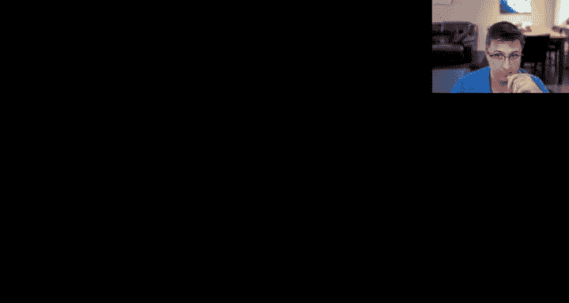
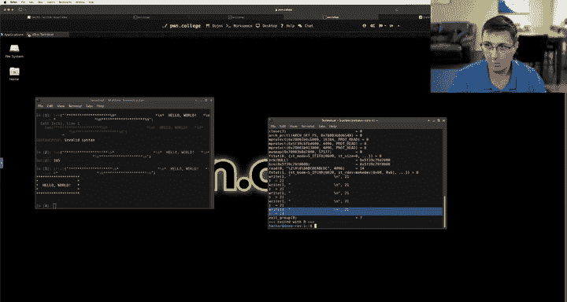

# ASU《网络安全导论｜ASU CSE365 Introduction to Cybersecurity Fall 2024》中英字幕deepseek翻译 - P24：-25-Reverse Engineering continued - CSE365 - Connor - 2024.11.13.zh_en - GPT中英字幕课程资源 - BV1nVCVY9Ehy

I've decided I'm going to continue the live stream right now。

 just double checking since we are streaming from home that。Things work。Let's see here。Pone College。

On college。Voice， yep， okay， very cool。 All right， Hopefully， the setup is good enough。

 Let's go ahead and continue where we left off today in class where we were reverse engineering art demo program。

ok。So we left off here where we were talking about how it seems like the output we want to produce is this hello world。

Box， and we determined。That frame buffer matches， you know， it really just takes one argument。

 These other ones seem to be kind of fake。 In fact， let's quickly。We're going to give it one more go。

To see。If we can change this。Can we edit the function oh。嗯。Well。

 what if I right click on an argument， can I somehow delete。Undefine it， a 5。我不开。😔，嗯，ち。

We were looking at print frame buffer。 not。 we were looking。Ats。嗯。

Frame buffer two string who the heck calls that X on this to see who calls it， double click there。

Print frame buffer matches。Oh， I think I just。啊。Oh oh。

 I think undefined just yielded my function out of existence。Well， that's not what I wanted。

 Can I undo。File， edit。Undo， undefin。 Okay kid， we're not messing around with that。

Undfined is a little aggressive。we're going to try one more time if I get rid of。

Just this last argument。No。Okay， we're not going to dive into it right now。

There's got to be a way to say， like， hey， you're just wrong about these arguments existing。嗯。

But we're not going to do a deep dive into that。 Actually， if I do F 5 again。嗯。嗯。Wait a second。

 It says in the thing here for syntax air near Bo 8。 we don't need to return a bo 8。 We can return。

In end。Okay。Can I get rid of this argument now？I can。 O。

 The issue was it was returning something that was nonsense。Okay， let's get rid of all of these guys。

Okay， boom。Okay can we。Recompile。No。Okay we will call this。嗯。Pair2 again。I don't know why。喂。

Compare to again。Compare to again， there we go， okay。All right。

 we're not going to mess around with that too much then let's go to who calls this。

 I'm just hitting x to go to the X ref， which is basically references to calling this。

 Let's see if we update the decompilation now， so I just hit F5 to refresh the decompilation。 Yeah。

 now it's just passing one guy in。Okay， so this is a little bit better。 and then also want to say。

Here's what we're going to say here。 we're going to say that this。Is a character pointer。

 You can kind of get as tedious with this as you want of being like more correct。

 right in 64 versus character pointer， right， They're both8 bys in size。Technically， we know， though。

 that this thing。Is that okay， And then if we update that still not like in this。

 I don't know why it's not able to resolve that compared to again and compare to are the same thing。

 but。I'm thinking it has to do with this fast coal thing。 Not really sure about that， though。 Okay。

 let's go back to Maine。Let's update decompilation again。 Okay。

 and now just hitting F5 and now it's not casting to an in 64 because it knows that it's a character pointer coming in。

Good to go。 Okay， so we want again， reminder。 we want to emit this as output。

 And it seems like if we do， we're going to get a flag。 Now。

 we haven't figured out yet how to admit anything as output。 So if I go。Where was I。没有。😔，We will。

Can I bring us over。How can I switch this to a different workspace， Mo to workspace 2。嗯，哼。Very cool。

Okay， and then we're going to do this。This。Nice， kid， that's just my ida terminal， okay。Now。

 let's go back to here here。 So we have this and we know that this is doing two rectangles for byilanian integer。

And then it's using five bytes as a rectangle and five bytes as another rectangle。

 and we haven't figured out yet how to create a rectangle。

 create a character or somehow produce output。I think in order to determine that we need to now look into render rectangle。

 which， as we discussed earlier in class。We read in a rectangle，5 bys。

 and then we pass the rectangle right here。 So this thing right here， in fact。You know。

 maybe I'm being premature here， but I almost think that instead of saying this is eight or this is five bytes。

 right it says in8 rectangle bracket 5， bracket 5 when I hover this。

I think I'd like to say that this is a type， you know， rectangle， like struck rectangle or something。

 And that there's  five bys in there。 So let's see。

Let's see if I can remember how to define a struct in idda。Let's see here。Local types。

How can I add a type， We wanna add a type。Looks like we get a bunch of default types。

We want a new type。 And we're going to say that this is。A rectangle。In fact。

 we're going do it C syntax style。 that sounds kind of nice because I know C。I think， hopefully。

And I'm going to say you went8 t very explicitly， this is a one by thing unsigned because I don't know whether to think it should be anything else。

Oh boy， that is not what I want。Uent HTB。Unent ATC。You went't eat TD。Us 8 T E。

 And I feel like when we were looking at very briefly this make rectangle thing。

 we saw that each bite was being accessed individually。 We need to， though。

 we can merge two bys together， right， We can have a Un 16 T D， for example。 But for now。

 we're just going to keep all five of these bys separate until。You know， we decide maybe we we want。

We want specific sizes in here。 right We're just laying out each of these five bytes individually。

 We could also have done something like this， right， and then just had one thing got rid of these。

 But I remember seeing each of these bys being accessed individually。

 and so we're going to lay them out individually。Okay， and now what we want to do。In here， G main。

We are going to say that this guy right here， heading Y on rectangle。

 And I'm going to say that this is astruct rectangle rectangle， right。Because this is the type。

And this is the name。Okay， look at this。 Okay， and then we can see it's doing this weird thing where it's grabbing the first byte rectangle a and grabbing an ampersand of that to do it as a pointer。

 Really， what we want to say in here is that this takes a rectangle pointer。Strt rececttangle。

 pointer rectangle。And then we're going to hit F5 to update our deco compilation。

 We're going to hit escape to go back here。 We're going to hit F5 again， to update this。And。Oh， boy。

 I just saw it， someone say。That my。Screen is not updating。That is wonderful。All right。 here we go。嗯。

Why is it not。Changing my screen。 Thank you for pointing that out and messaging me on discord。

 Always helpful when you messaged me on discord。 gotta get a good way to see Titch Cha。

 Unfortunately， I am not fancied like yawn with an iPad。It's put off to the side。 Let's see here。

 I'm going to get rid of Macos screen。We're going to add。Maus screen。

Maybe we'll just create a new one。Okay。We are going to transform it to fit it to the screen。And then。

 put that there。Looks very promising。If we go left， right， I can see that it's changing。

 Our I'm pretty sure we solve this。 We will。Double check on Twitch。All right。 here we go。

We're rollingin。Okay， what was I doing here？Fine now， O。

 let's go through and make sure we're all on the same page about what I did while my screen was hidden。

What I did。Was。Can recap here。 jump， jump to this point。

 Hopefully maybe we'll a time stampamp in the YouTube video。 jump here。

 This is us redoing things with this the screen visible。 Okay， what we did， the first thing we did。

Frame buffer matches。This thing right here， I hit Y on it to change it before this int was bo 8 or something like that。

 I changed it to ints。 And then I to stopped complaining。

 and then I could delete the remaining arguments。 Okay， so before I couldn't delete the arguments。

 Turn out the issue is actually the return type， Turn it to an int。 delete the rest of the arguments。

 Now， we've said， just takes one。Updated decompilation with F5 Good to go now a little less confusing。

 still Ida is failing for some reason here to track that this flows all the way through。

That this compared to these two things they're really the same thing。

m not really sure why you know what， actually， what if we make this not be a con？

Is it failing because it's cost？Let's see。 F 5， no。No， that's not why。 Okay， it doesn't matter。

 Either way， we know for ourselves that this is the same thing。 Okay， so we fixed this。Okay。

 then what we did。Is we went over to local types？Or maybe we did window local types。

 Don't remember if it's there by default， but window local types。 We scrolled down to the bottom。

 We right clicked， We hit add type， and then we switched fromstruct to C syntax。

 And I typed out this beautiful struct right here。 If we do， let's see edit type C syntax。

 Yeah you can see here， right rectangle。 you've defined a struct in C。 Hopefully this is the syntax。

 We decided we're going to make each by separate because I remember earlier on when we were looking that I saw each by being individually accessed。

If that wasn't the case， probably what I would have done is delete this， delete B， C。

 D and E and just had that A was five bys long， kind of as maybe the most generic way of representing a structive five bytes。

 And then we're going， you know， go through here and edit this struct。As necessary。 So that's fine。

 But we decided we're going to make each of our five bytes unique。 Sw back to main。Tab。

 what we did here is we went into render rectangle。 We clicked on this。 We hit y。

 and we made it astruct rectangle pointer before it was like。A UN 64 or it was like an end pointer。

 or I don't remember what it was， but instead of being an endt pointer or something。

 I made it a struck rectangle pointer， okay。Then we came here， and I hit Y on this guy。

 And I made sure that I said this is a struck rectangle。 This isn't a struck rectangle pointer。

RightBecause the rectangle is actually being stored on the stack， right。You know。

 we're reading into to the stack， this local variable reading into it。

And then we are grabbing the address of it so that we have a pointer to it。

 That's what gets past here。 And that's what we did the beginning。 and also， I guess real quick。

 we're talking about how it seems that we want to get this output based off of our stir compare analysis so far we know how to control the number of rectangles but we don't really know presuming that each one of these guys right。

 this is this five bytes here is a rectangle。 we don't know how to make it do anything on the screen right。

 we know that there's 20 spaces here followed by a new line，20 spaces new line。

 we've seen this we see it again with the S trace and we saw it when we're reversing it in class right that we had that like frame buffer two string function。

 for example。

That was taking in our 20 bytes and turning it into 21 bytes， where it was just copying the 20 bys。

 adding a new line character to the end，20 bytes， new line character to the end。

 and then a null byte at the very end。 It's not actually outputting that null byte。

 but the null byte is useful， I guess， for stir compare。

 which we've seen and we want to successfully match that stir compare to get the flag。

Okay， one more comment text is pretty small， though， although readable。 Okay。

 we can hopefully fix that， right， I'm on a bigger monitor versus in class。 So that mid make sense。

But this might be a little bit， hopefully this is better。Okay， so。

We're going to roll with this so we want to get this output。Sweet， okay。

 so now we've got ourstructs defined。 We're passing things in。 you know。

 you don't have to do this wholestruct business， but it kind of makes things a little bit more readable。

 And in fact， now that we've defined each of these five bys， we look in here。

 now we can see that we're doing rectangle arrow D， right。

 So we know that that's grabbing the fourth by。 And maybe that's a little bit easier to read what I expect we're going to do once we understand this function a little bit better。

😊，Is we're going to rename D to something that semantically means something that this is some part of the rectangle。

Okay， so render rectangle。 This is our last guy。 we really need to understand。 and we can see。

I guess V5 is grabbing。Addres， frame buffer 20 times V3。

 I randomly just jump partway through the function。 Maybe this is not always the best way to go。

 But I'm very interested in seeing how we can influence the frame buffer。

 And the fact that we're grabbing an address to the frame buffer really stands out to me as。

An interesting thing， because if we grab a address of it right。

 Or if this frame buffer thing had been on the left side， right。

 we want a left side expression to start writing to memory or grab a pointer right。

 and then V5 of V6 right This right here is writing stuff to memory。

 So what's interesting here is that this is 20。 again。

 we know that each row is 20 bytes followed by a new line character。 Let me output that this is V3。

 which is I'm just looking at like the highlightlight like we see V3 must be less than or equal to 4 V3 equals bla。

 bla， bla， okay。This is， let's call this like。Frame buffer。Current， right。

 because this is grabbing the address of the frame buffer。

 And I got a feeling that this is like my row somehow， right，20 times row， right。

 It would be indexing further and further along into my frame buffer。Will it really not let me do 20？

Or。I think 25， I always get my bras backwards。I think we want 5 and then 20。 Will， this not work。

 It feels like Ida said no。 Oh， wait， it worked。 Okay， cool。Okay， look at that。

 See now we don't have to have that 20。 It's just like the。It's the same thing。

 right if instead of doing 20 times the row， we just say that frame buffer 5 rows of 20。 Now。

 it just has to index in the row。 Things are getting a little more readable。

 The only reason we're going through and editing things to make things more readable is then it's more understandable。

 And then we know what we want to do。 So it's kind of the game of make things more readable as we understand and kind of these twists together to form our。

😊，Decompilation effort， or I should say， a reverse engineering effort。 Okay， so this is I。Okay。

 so we're looping and we don't really have a loop condition。 This is some weird。

Decompilation here as we started 0。 We keep incrementending this guy。

Whenhy are we stopping this would be a good question。Also， I'm putting Twitch chat off to the side。

 just in case I see something pop up。But my phone， the screen turns off it's very sad。 Okay。

 so somewhere in here， we got a break。 Okay， yeah， here。 So really。

 this guy seems like it should be moved up into here。 But you know what。Let Iag do its best。Okay。

 result。Equals rectangle D。So if rectangle D is less than or equal to I。

I don't know what that's about， but basically we got a loop。

 all of this is happening in my loop and I is going up each time we go through the loop。 so I is0。

 let's just keep it simple in our head， start with zero。Bm。So if the result。So if this fourth byte。

Is less than or equal to0， for example， in the first time we would leave。Okay。Can。Roll with that。

 So what that's telling me， oops， not what I want to do。Nope not that either。 Click over here。

 what that's telling me is。This guy， this D character， we want it to be。

Greater than 0 in the first loop， right or something like that。

 I don't Probably we got to read a little more。That doesn't really seem semantically meaningful to me right now。

 let's say。And then we do rectangle， we grab the second bitete， we add that I。

If row is less than or equal to4， okay， this is interesting because we know we have five rows。

 So that would mean that if it is five or higher， as in you kind of have gone out of bounds on your number of rows。

 you know， we're not going to execute this。 So this is kind of a good bounds check。

 We're making sure we're looking at a valid row number。And that is dictated by i plus rectangle B。

V4 equals0， we're about to have another nested loop。Okay， we grab the current row。

OkayThe current row is dictated by B。Right， at least for the first access to the row。

 So this second by is influencing what row is being accessed here。 right。

 rececttangle B determines influences row。And then。We grabbed that row。Okay， so this。

We're just going to rename B。To be like。Row or something。

 I think is's going to be something more interesting than that because there's also this eye component。

But， we're gonna。We're going to do that for now。 Okay， that second bite is somehow my row。

Influences myel。Okay， then this third bite。While my third by is greater than zero to start at least。

 and then it's going to increment each time through this loop。We are going to grab。This guy。Okay。

 here's what I'm going to do， we' were going to take a quick step back。We are going to realize here。

That this right here is where memory gets written to。 Okay I want to work backwards from this。Okay。

 so we've already selected our row。 So this is going to be my column V6 somehow。Must be my column。

 right， because we said that it is5 rows 20 columns。 We've already。We'll say frame buffer row， right。

 This is selecting my row。Then we select the column that gets set to the fifth byte。 Okay。

 so we write a memory based on the fifth byte。So we're just going to call this like。You know。

 I don't even know what to call this。 Like my， my dad or my。My data， Le will say it's a one by data。

 Maybe you know what we have this stuff called frame buffer and we're like potentially going to be drawing out to the screen。

 We're going to call this thing a pixel。It's just like one bite。

 it's a single byte character that ends up in my frame buffer， call it a pixel for now。

 maybe we'll call up by a fancier name later。K。My column is dictated by V4。Okay， look at this。

C and A have this like relationship， right， in the sense that right here， if I'm looking in here。

We've already figured out that fifth bite， which we've called P， is what ends up in memory。

 No one else uses the pixel。 the fifth bite。 No one else cares about that inside of this。

Piece of logic that we're kind of interested in， which is accessed after we've grabbed a row。Now。

 we're using rectangle C and rectangle A。 So the very first bite and the third by are somehow。

Doing things， right？ So this third bitete。This third bite is influencing。嗯。

It's influencing how long this loop counter is going to go for。So we're going to say like。Inner。Loop。

 like。Or something there's going to be， I think， something that makes more sense here。

 but we're going to call it the inner loop length。And we're going to call this。

 I think we have I right here。 So we're going to call this J。 right， This is like my inner loop。

So J starts off at 0， keeps incrementing。And。Basically。Well。

 we're going to do this what at the J many times or， I guess， inner loop length many times， right？

Yeah。So let's say this was one。So if this bite here had been a one。J would start off at a 0。

 One would be greater than 0。 That's cool。 And then J would go up。

 and then one would not be greater than one。 So we'd fail out。 So this is， yeah。

 the inner loop length， or we'll say。Inner。Loop counts or something like that， basically。

So we're going to do this。And this is what the third byte。 Yeah， the third by offset2 third byte。

 the third byte determines。Oh， and then look at this J plus rectangle A。 So this is my。

This very first bite is。What call it like。Inner loop ait right， It's like the initial thing。

Plus 0 plus1 plus2 until we get to inter looped count。 And this is dictating my column。

 We've already grabbed a row， right again， this is on the outside here。We already got a row。

But looking in here， this loop。We're now doing column stuff。 So somehow， you know。

 I guess we haven't figured this guy out yet， but it's probably going to be similar， right。

 resultsult here less than or equal to I。 This is like my。I think this is like my outer loop counts。

Outder loop counts。嗯。And then， rectangle。I mean， if we want to be， you know， we could call this。

 oops。Outer loop and it's right。 There's like， we've got our initial thing plus I。

 How many times are we going to do it。 It's the outer loop count many times We've got this inner loop。

Which is。We do an inner loop count many times。 we start off here。

 So this bite plus my count and then this by plus my counts in a nested loop， right。

 hopefully always， you may have to pause the video if you're watching this after this live stream and kind of stare at this for yourself to really make sense of this logic。

 right， It's kind of a mess that we've got four loop and a while loop。

Kind of don't assign too much meaning to the fact that they chose a for loop or a while loop。

 The the decocompilation analysis is just trying to do something here。 Really。

 these loop constructs are。Basically identical， they're following a very similar pattern where we use this initial thing。

 We have some number of many times that we go through the loop as dictated by this bitete。

Add those two things together on each iteration of the loop。

 then we got an inner loop can start at zero。Go。This many times， the inner loop count many times。

Add this that may， you know this。 And then also we've got another bound check。

 So our row needs to be less than or equal to 4。 Well。

 our column needs to be less than or equal to 19。 That makes sense because the the columns。

 there's 20 of them。 It seems like we've determined， right，20 columns，5 rows。

And then we write out our pixel。 Okay， so this guy right here， outer loop an determines my row。

 So maybe I'll call it actually instead of outer loop will do， you know， likes and row ands。

And then we'll do n throw count。 And then this guy。

 my inner loop is responsible for my column selection， so we'll call it。Column count。And。

Column in it。Okay。So my row in it。My role counts。This many。

 and then this is the pixel that gets written into memory， the bite that gets written into memory。

 We've got five bys we're working with here， right， These are my five bys。Myionit picks， you know。

 how far our columns in column count is like the width。 actually。 So maybe we should call this this。

 So let's call this。You know。Column width or right， I guess the column width is just a width， right？

So this is because this is determining how many we're going to go 1，2，3，4， if it was four。

 wed do the four starting at in knit， so maybe we'll actually call this instead of column them a knit。

 let's call this X because if we're thinking about like an X Y coordinate system we're starting somewhere and then we're doing with many of them and so we also have this row basis right so maybe instead of row in knit。

We should call this why。Okay， and then this should be height。Right， every。

 every time we're changing the this， we're just getting closer to an understanding。 So we have an X。

 Y。Coordinate thing， right， because look at our frame buffer。 we， we decided that it's 100 bytes。

 and it seems like they're logically chunked where there's each thing is 20 bys long。

 There's five of them。 So it's a 5 by 20 array。So the first time we index in would be my x coordinate。

 my Y coordinate。My second time indexing in would be my X coordinate。

Row would be I how far along walking this height we are plus my Y。 So this is defining a rectangle。

 I mean， it makes sense， right， It's called render rectangle。

 So it makes sense that we might have like an X a Y， a height and a width。

 And then what gets written into memory。 Well it's the same thing every time。

 It's always whatever this fifth by is。Okay， so here's what I want to do。

I want to make sure that my understanding is correct because， you know， always。

 always test your understanding。What I want to do is I want to create a one by one rectangle starting at 0。

0， right， I want to like， I want to basically put a capital a。In the upper left。

RightSo I want to say that my x， which is my zeroth byte。That I specify in a rectangle。

This should be a zero。My y should also be a0， right， which is offset one。 so 0，0。

And then I don't want like a width and a height of 0 because I I want it to be  one by we want something to show up。

 right， So we need some width and height。 So I'm going to set each of those to one。 So x， so 0，0。

And then offset two， my width one， so 0，0，1 height。One， and then pixel the next byte， okay。嗯。

Let's set that to an A。 So here's what I'm saying。Let's make this concrete。I want to。

Get rid of the S trace。 Don't care about S trace。I wants。0。Z。1。1。A。

 and let's get rid of my theoretical second rectangle。 And let's just say we have one rectangle。

 See like based on my reverse engineering， this should put an A in the top left corner。

And maybe I'm off on that side and maybe it somehow is putting it in the bottom left corner or something maybe my coordinate thing is wrong。

 but I think that's where it's going to show up， let's see。Okay。

Don't worry about the fact that there's three letters here。 This is just continuation of the line。

 Ey to trick yourself about that。It seems like， well hold on， did this drop down a line。

 let's do it one more。No， okay， this is just a bug of resizing the window。Okay。

 so there is an A in the top left corner， okay。So the first two bytes， again， let's go back here。

 or actually， we could even go to。嗯。Local types。Can X， Y with height pixel。

 So if I want to make it a two by two， for example， I would set。With。To two and height to2。

 so that would be by bytes three and four yeah。So， okay。One bite，2 B，3 B，4 B。Okay。

 this is my rectangle now，0，0， and then2。2， and look at that。 We've got ourselves。2 by two rectangle。

 And if we change the width， let's say to you know， five or something。

 just make sure we got width versus height， correct， that should be my third by。看。

So I think this guy， if I set this to a5。 Yeah， so we got that。

 and then I could set each of these guys to one and one。Yep， Anne look at that。 It puts a gap， okay。

So it seems like reading this， this render rectangle thing very useful for understanding what the heck's going on。

 and then it seems like we determined we want to match with this。So。We could do that， I think。

Probably we're going to want to be a little less crazy here and we'll just write some Python。In fact。

 we don't even need to use the fact that rectangles can be like big。

 Like you can imagine that we define this as a rectangle or define like this guy as a rectangle。

 Care define these as a rectangles。 I guess L and L could be a rectangle。

But we can just make everything a one by one rectangle right， why not keep it simple。 Okay。

 so what I want then。Is。How this go。Okay， Prince goal， we want this。Okay。

So how many rectangles are we going have， Well， we're just going to have length of goal， right。

 actually， length of goal， but get rid of these new line characters。

 This is like the distinction here， right， We don't input new line characters。

 That's just automatically happening in that translation when we converted it to a string。 right。

 There was that function reverse that converted to a string that brought this  hundred0 byte buffer thing to 106 bytes。

 We don't need to worry about these new lines in here。 So we actually want to。Maybe we'll say go。

Equals this dot split lines。Right， yes so look at this。 we got。Goal sub  zero。Goal sub 1， goal sub 2。

 we want this。Okay， so。4our。Well， how many rectangles？We're gonna to have。Numb rectangles equals。

Length of goal times length of goal sub0， right， grab one of the rows。 however many row。

 however many rows Yeah， that so number but rectangles。Hundred makes sense， right。

 We're going have 100 rectangles because we're even we're going to do each space。

 We could optimize this， but so far， we haven't seen any like length restrictions or something like that。

 So let's just even draw out each space by itself。Okay。

Then what we're going to do is we're going to say output equals。啊乜。

We're going to say rectangles because this is less than 255。Otherwise， well， let's do it correctly。

 actually， let's convert numb rectangles to a 4 B little Indian integer。 So numb rectangles。

But two bys。We'll say the length four， it's a little Indianian integer that is how we would represent。

 there is 100 rectangles。So we are going to do this。

 We're going to say data equals this data plus equals。And this herbs。P。Nope， not there yet。宝不。😔。

Data plus equals nu rectangles。 Wait why can I not copy this？Copy this thing。Copy。Paste， okay， cool。

Then we want100 of these rectangles。 So what we're going to do is we're going to go。4。嗯。

So if we enumerate， the first thing we're enumerating is my rows。 So we'll say4。Why comm a row in。

And goal。And then we'll say for x comma pixel in row， I think this is the right way to express this。

 Let's just double check。Crince X， Y。Pixel。Doesn't like that。Oh， we need to enumerate these things。

Python， if you want the index also of like a list that you're enumerating over。It's en nuine。

 you'll see。 Watch， watch with this purposesface。Okay， so it produces。You know what is my Y。

 what is my X。And what is the character that goes there。 So at 0，0， we want a star。At 100， right。

 coordinate。 This is my y and then my X。 Wait no no， this is my X。 And then this is my Y。 So 10 in。

 we want a star。And so on， I think I got this right， we'll double check if not。

 but this seems pretty good。Right， if we wrote our loop correctly。Okay。

 now we just want to extend data， so we're going to say data plus equals bytes。

And let's go back to Ida。Just to make sure we do this right， X， Y width height。

 So we're all to set width and height to1， keep it nice and simple。

 We're not going to be fancy with this and then set the pixel to whatever that value is X Y。 Okay。

 so X Y 1，1 pixel。喺。😊，Not happy about that one。We need to encode this to bytes。Or not。

Cannot be interpreted。 Oh， we need。 This needs an integer。 Actually。

 it needs to be the character of my pixel。 This will make it a number。 So real quick。

 Let me show you， whoops。This， this， this or not Okay。

 hold on show me a pixel character of pixel Nope， we want the order of the pixel。

 see you look at that order of pixel， it just gets the ASII value。

And we need integers going into here ord of P。K data， this huge blob of things。

Open。Data。Rights， data boom， now we got that in a file。X， X， D data， okay， and then。

We want challenge， demo。Data。播吧。Look at that。 We solved it。K， I'm capturing my flag。 S my flag。

This is my demo challenge。 I don't think anyone else is able to even work on this challenge because you don't have access to this sweet demo Dojo。

 but I am going to enjoy my solo solve on this challenge。Give me my solo solve。

She's can be me on the leaderboard， refreshing。Hold me in rank1。 nice。 look at that。 Okay。

 so we could give fans here with this。 Of course， you know。

 it feels like we maybe abused the program a little bit into defining these rectangles as little  one by one things。

 but。You know， nothing said we had to be fancy about it。If we needed to be fancy about it， we could。

You know， try and collapse things together。 So， for example。This could all collapse together。

 We could collapse these columns on the left and the right。 collapse this together。

 We don't even need to define rectangles for these spaces。 We could just leave those out entirely。

And looks like we could put these two Ls together。 I think that's about as fancy as we could get。

If we wanted to be fancy。But I don't want to be fancied because that is just a matter of writing a fancier python that goes and finds these rectangles。

 You could imagine this algorithmic problem of figuring out how to collapse columns and rows into the you know。

 pressing it as much as you can based on this format。But you know what， we just want the flag。

 And for our demo purposes， we got our flag。Okay， I am going to take a look at Twitch chat。

To see if there is any questions， otherwise， we're going to wrap this up now that we have finished our demo challenge。

Does Mar view show me past check。Maybe I can still see the chat。Not seeing any messages。

Which is fine。Okay， so real quick， just a reminder， you know， we just kind of。

High level started at Maine。Look for functions。 Look for strings。 Look for comparisons。And then just。

 you know， started digging into things， we started renaming variables。

 just kind of even to these absurdly long variable names。We started retyping things where it helped。

 You know， we really didn't even need。To play this whole game of。You know。

 turning this into astruct and then accessing it。 But it's kind of like easier to read if you can do this。

 Like， we slowly discovered that this was the height by just like refining the type to like。

 you know， I think at one point， we had。What do we have like？

Row count or something or outer loop counts， you know， and then before we knew it。

 we realized that outer loop count was just the height。

And slowly refining that meant that when we glanced at these 10 lines and tried to like squeeze these 10 lines of logic together into like a semantic meaning。

 Well， it kind of helped a little bit when we saw height here and we saw X here and we saw width。

 So it's kind of nice to add types to things and to slowly add。😊，Names， but you know。

 you also could have just done， for example now。Now I'm dealing with a single row rather than the entire frame buffer。

You know， you could add comments and then read the comments and stitch that again on your head。

 That works better for you。 is really whatever works for you works。

 This is kind of how I like doing it。 though。 Don't let the tool get in your way if it's。😊，You know。

 if it's not working out， you can't figure out how to tell Ida that you want to express it in this way and you know。

 just add some comments or something， keep it simple。Okay。I'm not seeing any questions。

 This is really the high level view of kind of how you approach a lot of these challenges in this module。

 So hopefully you found it helpful if there are more questions， as always， ask on the discord。

Thank you all for watching this bonus， finishing up of our demo。

 didn't want to let this challenge beat us。And start early。

 Start now work on these challenges This weekend， It's going to be hard。 Don't， don't wait。 Okay。

 goodbye by， everybody。