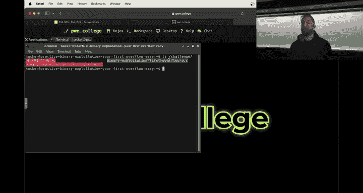
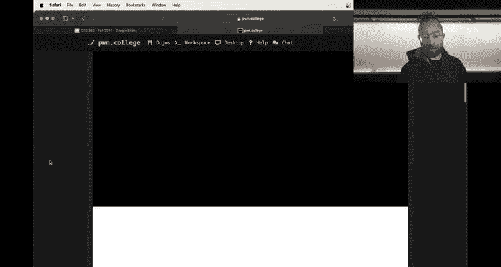
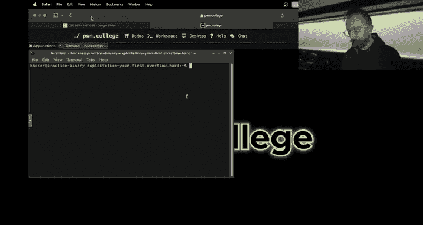
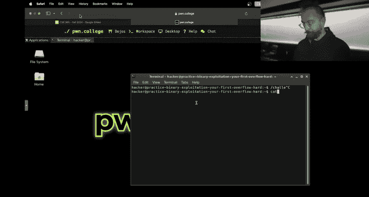
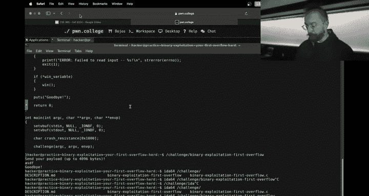
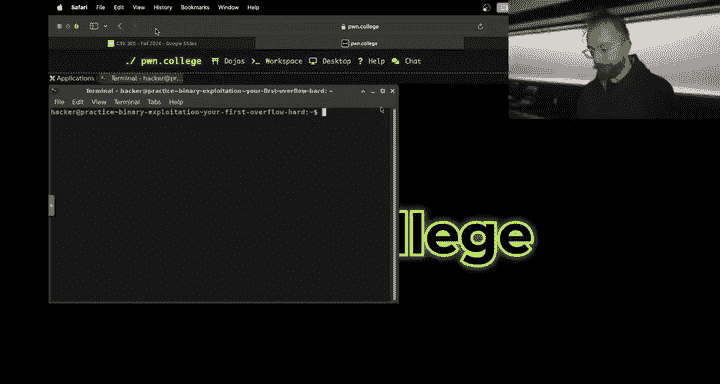
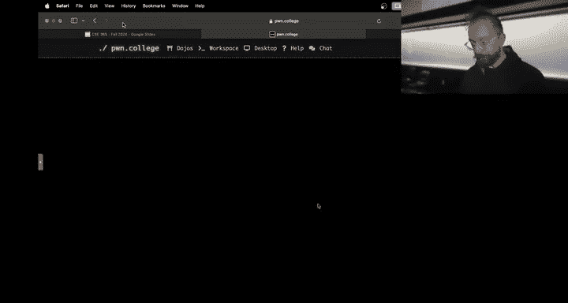
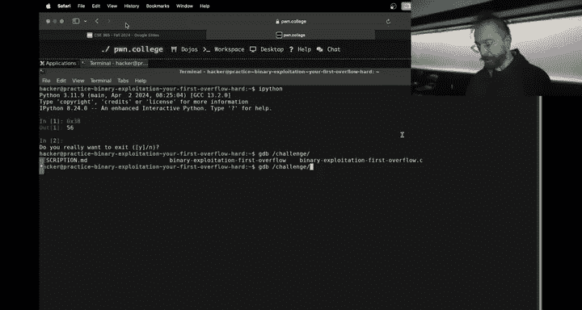
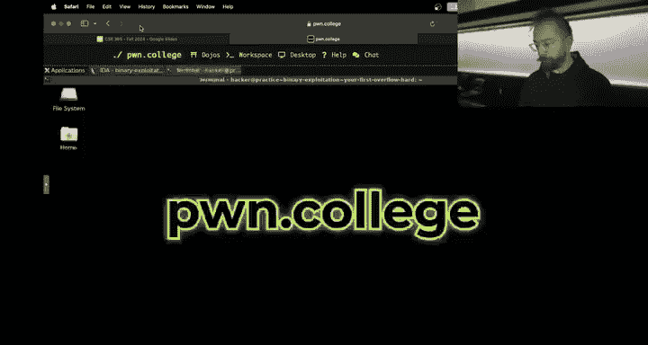
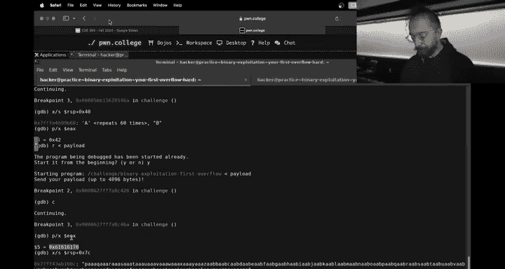

# ASU《网络安全导论｜ASU CSE365 Introduction to Cybersecurity Fall 2024》中英字幕deepseek翻译 - P25：-26-Binary Exploitation - CSE365 - Yan - 2024.11.18.zh_en - GPT中英字幕课程资源 - BV1nVCVY9Ehy

Very' exciting。This， this， a， we'll go here， slidehow。

Are you want me to click or you got I got things Yeah， one good hand。What's come on here？Pison it。

 There we go。 All right， Ho hackers。😊，Let's u let's get rolling， well I'm going pause my。

 there we go， okay。So we have arrived on the 18th of November， just like。That one， be beware。

 beware the 18th of November because reverse engineering was due yesterday。Everyone did awesome。

 let's take a look。So the median in the class was 33% not。Completely a a win。

 but these things happen。And you know what we do when we get knocked down by module or we。

That's right。We pick ourselves up and we keep going so。A couple of。

Interesting things about reverse engineering。Early on when we were designing the module。

 other modules in。You know， anything involving reverse engineerings often have a lot of randomization。

 so we put you know random offset， random values， et cea， et cetera。

 early because this is an image format and we wanted people to be able to produce and share C images and thus have a canonical C image format with canonical headers and so on we didn't do randomization this turned out to be a big mistake because it really facilitated a lot of spoiling in。

😡，Help which， which。From what we observed on the discord really sapped the ability of earlier levels to prepare people for the later levels that was one issue and theres a couple of levels that had very big difficulty jumps it's you know first iteration on a Nitro to reverseersing module and we have a lot of ideas for improvements going forward such as I think it's going to be in the future partially source available module that'll be pretty cool you can you have source code and then it's hey here's a new version of the program with something additional implemented it so you can use the source code to help understand parts of it reverse to other parts this sort of stuff we'll keep iterating on none of that helps you right now except for this realization on our side that you know maybe if you went a little too hard by comparison the median on crypto was 54。

Pcent of the challenges solved so this is just a tad more brutal than crypto。

 as a lot of people observed on the Discord。え？Unlikemic crypto。

 which explored a lot of different topics， and so you could， if you hit a wall。

 jump a couple challenges ahead and be on something completely different。

Re engineering really built on itself almost， almost fully linearly， which made a。Jing head。

Impossible， and despite。Everyone's best efforts。This is where you ended up so。Cool， what now。 Well。

 first， let's take a look at where this puts the whole class。 Well。

 the whole class is actually doing。😊，Fairly reasonably if I submitted these grades to the dean。

No one would bat an eye right we have 80% pass rate and this includes students that that never attempt any challenge ever in the entire course。

😡，And the kind of top of that bell curve is at a nearly a B plus or B plus depending on where you look at the exact top and that's actually pretty freaking good right this is uncurd fully no crypto curve no nothing so we're going take away the crypto curve no I'm just kidding。

 I'm joing so this。Clasasses is extremely hard， I think in order to fight this far and get these grades。

 I realize that you are all putting in on the upper， upper limit of what's reasonable in a class。So。

Much of that upper upper limit is due to of course well actually we go to that in a second if you split out per module。

 we see this hilarious oh， this is with crypto plus 20% so we see a hilarious drop in reverse engineering not hilarious for you in the trenches of course but unfortunately in reverse engineering the 100% solve rate is statistically an outlier 60% Yeah even well60% you were an outlier Yeah that's。

😊，That's that's not great。 we'll definitely again fix it up so so of course， you know。

 crypto counting the checkpoint crypto reverse engineering have a 6。8 median and a 5。

4 out of 10 possible percentage points median and for this we。😊。

I actually excluded for this calculation the students that didn't solve anything in the module and you know it's a big ask of you to tackle this we make that ask and nonetheless but we also of course got your back when things are too much so how do we fix this of course slap a curve on it we're putting a 30% curve on reverse engineering there's a 20% curve on crypto again。

This is three points， crypto had two points to this median， that's 8。8 median。

 and we put three points to the median on reverse engineering。8。4 out of 10。

 that's including the check including the checkpoint so the the typical student。A median student。

From their final grade。Dueuter reverseverse engineering loses 1。2% or sorry， 1。6%。嗯。😊。

Which hopefully there's enough extra credit to make up for that。 All right， awesome。

 what does this look like， Well， pull reverse engineering up And now again。

 these numbers have people that didn't even attempt it So they are the medians are lower than otherwise。

嗯。It pulls people up from a 06。Something or sorry， up to  a。6 something median still。

The hardest module， even with the curve， but。That's where we are。

 and it boils the great distribution of the class to a nice solid a minus being the top of the bell curve。

And then 86% pass rate。 This is actually a significantly higher pass rate than a typical C class。

 So hopefully I like to think that is reflective。 it reflects the。😊。

Lack of dumb bullshit where it's like there's a group assignment and my groupy person disappeared into a different dimension or something。

 or like， there's weird assignments with weird work requirements。 I don't understand。But here we are。

 All right， Que on Tw is the 5% curve on top of the global 15% extra credit。

 It is on top of the global 15% extra credit， and this graph does not include extra credit I think we had a preliminary graph that does include extra credit。

 you might be asking like why the fuck one you just show us our extra credit It's just a lot of different math that needs to happen and different sources of data that needs to be correlated and this will all happen。

 but as we run around putting fire putting out fire after fire， it's it's a lot as I realized。

Theer day， if you。There's1 thousand students across the different sections of this class。

 and if you assume that a student requires only 15 minutes。

on average of individualized attention per semester。

 which is a hilariously low assumption right so if I have to spend just 15 minutes with each student that's already over three solid weeks of full time work of。

😡，ThisCl is we are doing。We were getting to the EC as soon as we can。 Trust me。

 when we applied our best。Current estimate of extra credit for everybody。

 the top of the bell curve was at 100。So things are。People are doing quite good。 All right。😊。

So another question is with will we will binary exploitation be curved think binary exploitation。

 we finally got it right， right， so I'll talk about it in a second， I think everyone will do great。

嗯Oh。And the late policy also for reverse engineering because of course。

 we worked hard on all these challenges and it's a bummer that people typically didn't even see 60% of them。

 we upping the late， just like with crypto， you get 75% of the points for submitting a late challenge。

In of 50%。So if you'll make that apply that as well。curveve should be live on your grades page。

 The 75% isn't yet， I forgot if you push that enough。It should also be， if not。

 it'll be applied and retroactively applied so。Booom， awesome。Okay， any questions？那不关。

Do we sleep or did we sleep？So the question is， do we or did we sleep， I think I'm averaging about。

Probably just around four hours a night this semester。 It's not just of course。

 I think one one challenging thing is that as faculty。

 we have like research requirements and everything。

 not just requirements we get into this or cutting edge research and teaching and everything and you know the research just doesn't magically decrease when the teaching increases and then when you have kids and you can no longer go to sleep at you know or you can you can go to sleep whenever you want。

 but you're still waking up at 6 a it complicates things quite a bit。

 So in some of my early lectures， I you know the baby on the now that that baby is running around and like will hammer down my door if I'm not up ins it's。

There's some challenges， but you know what？We're almost through it。

 we're in the trenches in a similar on the other side of the battlefield， you guys。

 but we're also in the trenches， All right， awesome。Let's roll so。Other questions？Sweet。嗯。好。Great。

 oh， wow， someone's oldest baby just started driving。Well。

 I hope she can read or he can reach the pedal。Awesome， okay。Let's roll into binary exploitation。

 So binary exploitation， I think， like I said， we got a little bit of a better approach to。

Making sure that people can actually like。Grasp the what we're expecting them to do from third。

 I'm sure we messed up from other directions if we grab a。You met your fish。There we go。 Okay。

 awesome。 If we grab this 73 people already hacking， that's awesome。

 I think the other thing that that was brutal with reverse engineering is。😊，诶。

Some of these concepts take a while to sink in， and so there was a huge rush， actually。

 I'll point this out in the slides real quick。In the last weekend。

 this is very unique and the last weekend no that media student did not solve a single challenge。

I think people build into， let's say， internal state on Saturday and。

That's。That's how， I mean， it was definitely too tough。

 but I think the time distribution is is very tricky。 So it's awesome to see people starting early。

 So binary fltation。We used to have。And CSE 466， an in depth dive into。A couple of topics。

 including three of them being memory errors， shell coding。

 and then putting that end to end all together。 we have taken the introductory concepts of that。

And created this binary exploit module actually， Connor did this last year。

 and now you just basically refined it a little bit based on lessons learned from reverse engineering。

 from this run of reverse engineers。 So you're suffering。

Will help future students Uni engineering and will help you on memory errors or on binary exploitation。

😡，Three concepts that this module really two concepts that this module kind of covers one of them the second one is shell coding right you rid an assembly well。

 it turns out that under certain scenarios you can inject，😡。

Assembly， or you're can inject binary code into a program's process space。

 and then wedirect execution to it。😡，When this happens。

 the code that you inject and redirect the execution to is termed shell code。

 because typically what you want to do is achieve a command shell in the Po college case。

 what you really want to do is to get the flag， so maybe you should call it flag code， but。This is a。

Basically， an applied version of。What you've been doing in terms of writing assembly？

And then there's this question of， okay， but how does this shell code。

Get injected into a process and get executed。 And this is where memory errors come in。 It turns out。

That a typical program written in C or C++ is going to have some insane bug。

That will allow an attacker to overwride control data and redirect control flow。

 and that's what we'll explore in this module。😡，We go through a big ramp。Of。Understanding。What。

The actual memory errors。Can be and how to。Achieve some cool exploitation。

 And then when you've got all of this figured out， you go into how to write the shell code that will eventually。

 you will eventually inject into the process。 and then。

You do some light exercises in an end to end exploit。Of。Triggering a memory error。

Injecting shell code and jumping to it。 This is。The kind of ninja。You know。

 coming out of the shadows to just boom， take the program over and now you are the program like the the meme。

So。It's kind of。Everything you've been doing has been true hacking， right， web security。Very。

 very serious issues you explored that affect。Websites today。Right， crypto。

Very real vulnerabilities that are seen in real world deployed crypt cryptographic systems。

Reverse engineering people are all the time to find bugs now mes。

 this is these are some of the biggest causes of security issues， for example。

 in the IoT space and in legacy code。All of this we deep dive into in memory errors。

 in shell code injection and in the。Expitation lectures， I know there's a lot of lectures。But please。

Go through all of them， some of them stack canaries and ALR。

These are lectures about how memorys are protected against。Right， if you。

Our intent on skipping some lectures skip those， do the rest。Awesome， okay。

 now what lessons did we learn from reverse engineering that we're going to。

Hopefully make Bi expectation less of a shit show。One lesson that we learned is。

And in reverse engineering， this is tricky because。There's kind of two things。

 there's understanding the program that sort of requires reversing and then there is carrying out what the program wants you to do and this typically requires implementing an attack。

😡，Right in reverse engineering， these are vary their twine， but for many levels。

 still two different things。Of course， because the point was reversing the program that was a hard gatekeeper to the second thing we've kind of relaxed this in binary exploitation based on lessons learned last modules so if we look at every single level。

嗯。You have an easy version。And a hard version。The easy version。If we。Started up。

And we look at the challenge。The easy version。That's a couple things， it gives you source code。Right。

 so you don't have to reverse engineered。 You will still need to refer to the binary for specifics such as addresses and all of this stuff。

 but。

You can get a lot， and this might be easier to look at through VS code。

Because it'll do syntax highlighting。嗯。He open it up。Here is the source code of the。Easy challenge。

The other thing you see the easy challenge will give you an enormous amount of output。

 debug output that is intended to help you understand your exploit。😡，And actually。

 you know what we should do。For these ones， we should also give them the version of the challenge without the debug output。

We might add that so that， you know， you can pick and choose what what you want to attempt。And maybe。

Maybe we'll give you the source code without the debu output put at please because the binary cant have differences All right。

 anyways。So here is the source code of the challenge。Right。And you can refer to it。

 You can understand。What is going on by reading this？should be a little easier than reading。

Decompilation， and then。Once you understand what's going on， you can launch。The challenge。

Or even before no one's forcing you to understand first。

 there's not a quiz when you first launch this challenge。And the challenge。

We'll talk to you all about its internal state， hopefully those words aren't triggering。

It'll talk to you all about what's going on。 It'll tell you。On a high level。

 what you have to do to solve this challenge。And then it'll allow you to attempt your attack。

And if I。Why why can't they just hold this be down？

This is terrible because you live like to do that I always want， I I。

 I put in this many age like a couple times a day。You will you just sit here and hit A's， copy case。

No， but now I have to figure out。This is crazy。 You can't just hold down a on Mac F。 accent A。 No。

 I wouldn't。 When do you inject accent A's， That's unicode stuff。 All right， anyways。😊，Um， so。

Every challenge here follows a certain。UPattern， you'll dive in in a second when you interact with a challenge。

You know， you give it input and it。Tll you， okay， Hey， you， you didn put her a bunch of As。Well。

 here's the state of the internal state of the program now and you can see。

My A's ASie 41 are over here。And then here is the memory state。 and just by putting in a bunch of As。

I simply walked through the challenge on stream。 That's my bad。 We got the flag， alright。

Now that's cool now we need to actually understand what happened and we'll dig in in a second。

 I made the assumption that we understand the source code。😡，And we were interacting with the binary。

Once I have the easy mode。I can go to the hard mode。The hard mode is identical to the easy mode。

 except。There's no debug output。There's no source code except at the very first level。

 so you can see the difference。And。诶。The randomization involved is different。The sizes of variables。

The ordering， the offsets。Things can change。If we dive in here。We got a hard mode。

We wait for this to refresh。Just refresh it。哎。If you look at the challenge now。This one。

 just the first level hard mode has source code so that you can see。The difference。In the chat。

 my bad， that's this。You can see the difference in the challenge， much smaller。

 Here's the whole challenge function， No debug output。No， nothing。系。Just gets input。

And does whatever the challenge does， all right？After the first level。

 you won't get the source code for hard versions。That's where Ida comes in。But now。

 you know the security of vulnerability。That you're looking at because of the same vulnerability as the easy version。

Hopefully， this will make reversing an understanding and extracting just the pieces you need。

Much easier。All。So。If you run this。Very different。Do the copy paste and apparently。

 this operating system is too advanced for us to hold down a。All right， and boom。Very different。

Experience of interacting， the same vulner。Awesome。This pattern。

 and I'll finish talking about the pattern， and we'll dive in to understanding and and figuring out what the errors are and so forth。

 This pattern repeats for most of the module。Each exploration of a different scenario where your're triggering memory errors。

 etc。 has an easy and a hard version， the shell code levels are just。Shell code levels。

 They are rerite the shell code。 The challenge runs it。

 gives you the flag If your shell code is good。 This is just for you to create your shell code。

So that you can use it down here。And then these ones are back to the easy and the hard versions。

 They are a memory error thing now that won't give you the flag unless you hijack control flow and get the flag through the shell code。

Questions on the high level design of this module。Sweet， all right， you got this， there's 21 levels。

诶。It's a nod number because there's three shell coding levels and everything else is in pairs。

The checkpoint is six， right？Something like that， we can go to the great page。To double check。

Should really have like a。Like an arrow to the checkpoint。You know what I mean？And in the list。

 we should， it it be good。は。No， at this point， people know how to find the checkpoint。Do they。

 we get questions how many is the checkpoint multiple times a module， the checkpoint。

 if you got a grade， oof the stream account is not doing well in this class。Checkpoint is 6。

 Al right， so it's three of these things。Should be get you started again。Like in reverse engineering。

 I would urge you to keep going beyond this checkpoint。I'm not going。 We're， we're not。

Your parents are not going to hold your hand and make sure that you go past the checkpoint。

 we're not going to set the checkpoint to have the challenges or something。But。😡。

It will behoove you to get through that checkpoint， a。Awesome。So now some people are asking， okay。

 they have some of the previous challenges or sorry。

 some people bring this up and it already shows that it's solved for them again， that's because。

These challenges we moved from 466 material back to 365。

 if you have already worked ahead or you tackle these last 365 duration and they're solved。

 they're tweaked but fundamentally the same。嗯。All right。No other questions going once。Yes。😊，完了。

Question was， is this the last module， let's check。So we go back。We pull up the syllabus again。是。

This takes a long time because of some。Computation it's doing in the background。

If it hasn't sunk in throughout the semester， we are。Not the best web programmers。All right， so。

We scroll down for the tentative schedule。Binary security is where we are on right now。

 we should update the name here。 Reversion engineerings would we just finished。

 There's Comp 1 and1 before that。 ya yada yada yada。 This is due on the second。

 and there's one additional module that goes live on the second， the final module。

This is the second to last module。And then， you're free。Then you can of course。

 get so inspired by the typey 2 fun in this class looking back that you're like， you know what。

 I want more of this。Let  zero 466。Who's going do it？Oh， wow， all right。

That was more than I expected， okay。嗯。On Twitch， someone said。

 how about showing the checkpoint inside the module itself is a brilliant idea。

Great minds and have all that。 you know， I learned the other day there's the great minds think alike and the fall onto that。

 but fools rarely differ。Yeah， anyways， okay。Great stuff， so。That's the high level of the module。

 Now let's dig in to the type of mes you're talking about and the type of binary exploit that you'll be doing。

 I'm going to as always create a proxy challenge rather than walk through one of the challenges that that。

Is actually on display here。

But again， I'll urge you。2。Go， and， and， and。Yeah。W watchch these lectures。

 Many of these lectures are， you know， modern， short self contained lectures。

 If you look at causes of corruption one。

Here's a much younger me。 It's 11 minutes long。You can， you can you can sit for 11 minutes and。

 you know， we all binge watch like a million episodes that are like。

 I don't know however the long episodes are nowadays， you can binge watch this entire thing。

 It'll be great。嗯。Awesome， okay。Let's dig in。 So if you're gonna。

 we already have a challenge launched。 I'm going to。

Move to my laptop that I can use both hands I managed to slice my thumb open during a faculty meeting earlier today that's how that's how crazy faculty meetings get and I don't want to bleed all over Connor's。

Laptop pun college is up， good。Alright， I'm logged into the stream account。 So if we。

Go to the desktop here。Okay。诶。Okay， awesome， Aaron sees that。And then， if we go to。The desktop here。

I should be able to just double oh oh I need to refresh this guy。好啦。That's pretty good， Alice。

Let's do this and then we refresh this guy and then all this good， All right， awesome。So。

Fof， I'm driving this from the other laptop。 awesome and now I'm not going to bleed all over Connor's keyboard。

 okay。

诶。So。Bining exploitation。You saw that I。呃。

Cat's out of the bag that if I run this minor exploitation overflow guy。

 And I put in a bunch of As by holding down a button like a reasonable human being。All right。

Put in a bunch of As。Boom， I get a flag。Why the hell does this happen？Let's dig in first。

 a quick anecdote about seven years ago， eight years ago。In 2016。

 DARPA ran a DARPA is the Defense Advanced Research projects Agency known for many things including funding the creation of the internet。

 and so on， they ran a competition about autonomous hacking and creating fully automated systems that can do this style of hacking that we're studying this module。

And in the there was a qualifying event， there was a huge prizes you know。

 our team won a total of one and a half million dollars in this competition。

 there the theoretical ceiling was like 4。75 million， I think， or 2。75。2。75 anyways。诶。lott of money。

 a lot of cool stuff in the qualifier event， there was a wide range of difficulties for what your automated systems of challenges that your automated systems had to tackle and for several of them。

And for many， many， many real world programs， if you just launch it up。And。

Send a bunch of A's at them， They will crash。Software is that bad。H， so a you。If we。

Do something like。Like this。Okay。We。Crash this guy。 No problem。We can also。

Probably crash something here。Watch this。What else。I'm going to put。Log this。是。Okay。H on， sorry。

 this became way too crazy， all right。We're going to say what we're trying to crash。

 and we're going to run it。 and then we will say what it returned with。Andridge is gonna do it。

 What do you think， Oh， let's put a time out'cause some of these programs will just hang。うん。😊，Yeah。

 time out。Okay， one second time out with a one second kill afterwards。Why didn't？Sorry。

I need to do this in the other way too and then。Okay。Okay。

 things are erroring but not crash aha 124 was a no， 124 was a time 127 might be a crash。

What's the crash， 130？Before。Yeah we need to do one thing。This going I'd be complaining that。Yeah。

Aborted。Big crash。Not the biggest crash。A bunchun of different return codes。Ws， w。All right。

 another abort。So it's not going to be， it's going to be 130 something a hope that's。

That's a timeout。We don't have D message permissions in interdo。吹 no边 sir。Okay， you know what？

Mis a lot of aborted。We need a segmentation fault。 I just need one segmentation fault to show you guys we're in the eyes。

Let's do search。Would the Hol search。No。A segmentgament。To read into a sanitation fault， No not yet。

Oh， come on， this always works。Maybe software is getting better。그。All right。

 here's what we're going to do。 Maybe A's aren't good enough we're going to just do some random。嗯。

Input and then we'll leave in the background while we do the rest and it'll go back and collect the segmentation faults。

So if you're going to。Read。110，000 characters out of D view random。There we go。

 that maybe will be better。哎。Moobby do this？To look for looking for memory errors and things and actually once one more thing I want to do is uns the display variable so they can't talk to my screen。

Yeah。Perfect。Boom， all right， while that's running。Let's roll， okay， so。Um we have。Something that。

Frashs。And it gives us the flag when we give it a bunch of As。And otherwise。

Seems to be a well behaving program。That if we just do asdf， it says goodbye， all right。

What the hell happens here？😡，Well， it starts up。It does some。

 I guess I am walking through the first level， because that's fine。I guess it's fine all starts up。

That's a little bit of of setup that you've seen before in terms of disabling buffers。

 that you don't have data sitting around and and fight stupidly。 And then the key thing is。Here。

 where it has a structure that has 59 characters of input。And then， some variable。Yeah。

That's the wind variable and scrolling down， just reading this thing if the wind variable is a non zero。

So there is a wind variable field under the datastruct， then there's wind variable top level pointer。

That is set to the address of this variable， and then。If the de reference of this pointer。

 which is the value of this guy， is zero as non zero we win。All right。

 where does it get set to non zero？This whole structure is initialized to zeroes， scrolling through。

 it's never set to the nonze。And when， of course， if we scroll up。

This is the same function that you might have reversed engineered in reverse engineering。

That is responsible for giving you the flag。Cool。All right。

 so this obviously got called because with enough A's， we can get the flag。But。呃We。Don't。😡。

Have the wind variable。Seeth anywhere， I。Now。We're stoppedom。How are we able to get the flag？

Let's open this guy up an item。Well actually， first。

 let's look at the source code and understand how。And then you'll open this up in IDda to get offsets and addresses where we're going to break and inspect the state and so on。

Maybe it'll go from there。哎。So。What happens？Initializes the data。Set size to0。Then sets it to 4096。

Then ask us for our input。Then read our input。He read then put with this size of size。哎。And。

The size is 4096， so it'll read from standard input。4096 bytes， why that amount， that's hex 1000。

 it is。One memory page of input。And。It will read it into input。😡。

Which you can see from the sea source is only 59 bytes long。So what happens when you read？In sea。

1000 bys。E tax 1，4096 bytes into a 59 byte buff。What do you think？

Let's see if anyone on Twitch knows。No one on Switch knows， anyone in person？Overflow。So。

Fascinating thing about C is it's almost assembling。If this was Python。If I。

 it's hard to implement something like this and Python is the way Python works， but if this was。

Something like rust。And we had a 59 bite buffer。 and we tried to read 4000 Bs into it。 Ru would say。

 what the fuck are you doing。😡，RightThere's only 49 bytes in here。 This was Java。

 this was Python and some analogous thing was implemented this was。

Even go like most modern programming languages。They will look at this。

 even Sa C++ or CC++ or safety features。We'll look at this and we'll say no way。 You're。

 you're crazy。And。😡，There are ways in see some kind of sanity check things that I did when writing C image。

 as far as I know， there isn't memory corruption in C image。But。

There's things you can do to prevent this turning into a bad day， but but typically。Normal see。

 what you see is what you get。😡，we see a read of 4096 bytes into this variable。It's going to do it。

And when it runs out a variable， it's going to keep writing。

It's going to write into the wind variable it's going to keep writing and clobber everything。😡，and。

The local function frame， the area on the stack that is allocated for a function to have its local variables。

And after that， those variables。There is extremely critical control information， such as。

After this function is done running， what function do I return to？you can overwrite that。

 you can overwrite anything。So。Let's dig in in Ida。To understand the address involved。

 and we'll dig it in GDP to understand what the hell's going on。And they will probably be done。

Alright， so we launch up Ida。 Wait first， before we do this， let's see if we。Found any。

Segmentation fault。User bin RVm。Our v is restricted them。The fuck is our them。

Because that would be great。Yes。Like the above with restrictions。Not possible search shell commands。

 suspend with Vim。 So this is the version of Vim。That you give untrusted users to added files of apparently。

And。It has memory corruption， a segmentation fault。

Is the error that's thrown and it named segmentation falls for dumb historical reasons。

But a sex fault is the error that's thrown when you fuck up memory to such an extent。

That the program accesses。For return tries to execute， rights， Rier tries to execute。

A memory address that doesn't exist。Typically， this happens in a security scenario because you've overwrittenden that address with some other thing。

And now the program is crashing， so just by two minutes of writing a script。

That literally grabs random data。10，000 bytes of it。And shun it into。Every program。In。

Our little install of Uuntu here。We found。Cashes that are't potentially exploitable。

This is crazy right this is real software that's the reality of things so everyone always ask yes。

 but where's this ob practice right here？😡，That segmentation fault means that。

The many of the mitigations that try to prevent the exploitation of these vulnerabilities already failed because if you look at what happens。

 even the challenge。If you take this。And we do。が them。IfWe do this to the challenge。

And things will make more sense when you read about the mitigations and the stanary lecture and everything。

If you run our binary。With that input。Yeah。hy。tid。Run。On then。I'm puzzled。It's stuck on the read。Oh。

 because。I forgot to give the source app this doesn't this detects。That we overflow the bo。

 we smash through tons of stack。Of control in on the stack。 And it safely aborts。

 Arvem didn't even do that。 Arvem just crashed out。T often you can take that。

Unmit a crash and craft the next as you will work on in this module。Let's see what else crashed。Wait。

 oh no。Hopefully， I didn't lose the history there。Okay， Rvin。对。Now might be it。 Oh， no。

 I lost too much of the history。 Anyways， that's just from P on words。 We found a crash， right。

 And that's just with one random input。Oftentimes you give more and more random inputs and you'll trigger different edge cases in the program that'll cause crashes。

啊。Pretty cool stuff。 So hopefully that's a good demonstration that demonstration has not failed me yet。

Hopefully it's a good demonstration that what you're doing here is applicable in real scenarios。

 All right， anyways。Back to our example。We have a suspect in terms of the vulnerability。

There is a buffer overflow。We read too much data from the user into a buffer on the stack。

Envy cloer things And this is where the easy mode comes in。

 if you' a recall where it showed you the stack layout， et ceter。 and I put a bunch of A's。

 And then this whole stack has 41，41，41， you can play around with what you input and see what it outputs and so on All right You can see what happens as you produce more rays。

 your As。Other letters， if you are so inclined and so on all right。

But let's reverse this thing in Ida and figure out what's going on。

All right， here it is。Here's main， here our saidbuff calls， of course we hit tab。

 we decompile who had Ida decompile errors？On the， we have a couple of people。

 Id have did a lot better this than than a typical de maybe yeah。

 I was shocked at how well it was working。

Here's our challenge。 Look familiar。The same as the source code conceptually just decompiled in sometimes fucked up ways。

 but here's our wind function， here's clearly our wind variable。It's initialized to zero。U here is。

Where's the read， Oh， here's the read。Here's hex 1000 B。 Here's standard N。 Here's V3。

 That's our buffer。 And we can see V3 over here。 It thinks V 3 is。V3 is not our buffer。 V3 is the。

B3 is our buffer yeah。Yeah， all right， so。Here's V3。

 for some reason I think V3 is only seven bytes long。Of course。

 this sort of type information is lost during compilation and so when you're decompiling。

Inferences have to be made， and they're often correct。 But the point is that Ida tells us， okay， V 7。

Is located。On a function stack frame。And if you recall the functions and frames lecture of reverse engineering。

Functions back frame gets allocated。When the function is called。On the rightmost side of it。

 as things enter as the function begins execution， there's the return address where the function will return2。

And then， gradually。The sg gets filled in with data。Growing left。

 if you think about reading from left to right， where address 1 is all the way on the left and address very high is all the way on the right。

The stack grows to the left。Quick recap of the function and frames lecture。

 If this is news so you go back and rewatch the function of frames lecture in reverse engineering before watching the memory corruption we go very deep into the stack in memory corruption as well okay。

So。we read into this V3 V3 is at。An address of RSB plus Hex 40。Our wind variable。

Is that an address of RSP plus hex 78 that is to the right of the start of our buffer。

So if we can read。Ins amounts。Of user input into that buffer。Then after Hex 38 bys。

We should be writing。Into our one variable。 What is Hax 38。Let's。Grab another terminal and find out。

H 38。Is 56。hy。😊，Am I wrong。X 40。Ax 38。That seems incorrect。We have the sea code here。This is size 59。

At size 56。He ate。We ate。It can it， it it。It misdetected the variables if it thinks this is an aid byte。

 Ia thinks this is an aid byte。Integer somewhere on the stack frame。 It's actually。

The end of my buffer。And the next4 byte integer。 So here I'm going to force Ida to realize。Well。

 let's actually just do this。Okay， can I force this to。

I think this is better done in the disassembly。 Let's find the here's our buffer。

And then what was it， This is。R BP minus something。 so it's。

This the frame pointer that points all the way to the right of the frame， minus a hex 18。Was here。

 Al right， Now we're saying this is gonna be。2。Now， I fucked。 I destroyed the， the home。

Destroy the whole analysis。 And I just lost our。Okay， very good。

Well then this is going to mess everything up here。 I really do this， well okay， perfect。

Okay。UI have to reload this。Or undo。there we go， good。 All right， I'm having a brain fart。

Who on this guy。Let's just do this。 We're going to make it2。Very most good， here's here we go。So。

 and now we're going to， can we undo this into？So this guy。Let's change this to characters。

This was 64 bit was 7 MZ56。And this will be char。You make this single bitebe guys。 Okay， man， we say。

 you know what， This isn't 56。This is。What was hex 40 Hex 78 minus hex 40 is hex 36， they're just 56。

 and then we say actually it's 60 because I think four bytes of this guy are getting shunted into that。

 say do it。Okay， and I we redo the decompilation and everything is broken。No， but it's kind of。

Kind of okay。Local variable allocation has failed， the output may be wrong。All right， anyways。Yeah。

 there there any way I can quickly solve this GDP Yes， as I was about to say。

 ita is starting to give us some issues。 but we figured out that likely this V thing。

 which I written variable appears to be located at RB plus 7 C。Notob 7，8， as we thought。

 because Ida was just grabbing the。I writeite most D word out of it。And we。嗯。

And then our buffer is located at RsB plus 40 H。 This is actually all we need out of it。We got。

Distracted， trying to make the decomilation beautiful。 You don't give a shit about the decomilation。

 We just want our flag。 At this point， the next step， once I identified the bug。

 which we already identified and where things are， which we just got out of itda or。

In the easy versions， the program will just tell you once we have。Where things are。In GDB。

 we can start looking around at what things should be。We got our challenge。

Where do we break， Well， one thing that we can do is we can break at the read。

And look around before and after the read。 I click here。Oh， no。

 this PIe might have to regenerate them。We can see what security measures are enabled fuck。

Unintended， I'll regenerate these without。I thought I'd disabled that。I must have only done it for T。

fuck， okay。It's fine within two hours or so this will be this specific step will be ignored。

 we don't want you to have to deal with this until a little later， but that's fine。

So GDP this。We。诶。Start I， All right， program is started。Or actually， let's just do。Start。

Start I gives us the very first instruction of the program start takes us straight to Ma。

 We want to go straight to Ma and at main， we want to break at。😡，This call to read。

Which is going to be challenge plus hex B 8。It's Hs be8 bytes into the challenge function。Okay。

 we continue， boom。Let's see where we are now， we're about to call read。To read our input and now。

We can。Just out of curiosity。好。We should just have this by default in all the GDP units。Alright。Okay。

 so。We are here。What do we want to do， we want to look at。The wind variable。All right。

 said Rsp plus7 H。Or 7 C， sorry。And it's not a。If we look at here it's hard to tell。

 we can hover over it and see that it's an int。 if we tab over， you can see what it's testing is EAX。

And what it's loading from there from RSP plus hex 74。His As。🤧ふふ。😊，H， it's load a pointer。

 and then it's reading four bytes from it。 So that is a four byte。Variable。

Why is it still giving me bys？There。Yeah，4 by。Vable。That's all zeros。And our buffer。

Is what is being passed to read as the first argument as the second argument。So it is our SiI。

That's our buffer。 If we compute the distance between the read variable and。Our buffer。That's Hax 3。

 C。 Hax 3 C is。Okay。60 all right， and we have the source code if you recall that tells us。

That this thing is 59 bytes。Long， so why 60？Well， because。

For a large number of computer organization reasons。Computers like to keep some data aligned。

And so the compiler just added one byte to this， nothing wrong with making it a little bigger。

You can increase。Bffer sizes typically accept unless you have structures that are directly read in and out of files。

The actual size of the variables can be paded without much chaos。There are。If this was if I。

Depended on this being read in and out of files without the sizes changing。

Then I could add a packed attribute to thisstruct and it wouldn't do this。

 but that causes a lot of performance， some performance problems dealing with the stack Was there a question somewhere？

All right so。Awesome， let's dive back in so we have 60 distance of 60 between。

6ix0 bytes between the start of our buffer， which is the second argument to read。Was R D I over here。

RSI and our actual variable that is checked for the wind condition。And if we do。Well。

 what am I doing if you print。Hey， times 60 plus。B， this should fill up our input buffer。

And then write a B into the wind variable。So let's copy this。We continue here， actually， let's step。

Here we'll step over。The read function， okay。We'll put in our buffer here， we hit enter。

And it did not。 Well， we won， but it didn't freaking。We're on our breakpoint。

 so if we're going to restart this， here's our breakpoint。

We're going to break at where it checks the wind variable。That's right here。That's challenge plus Fa。

Okay， we're going to continue now it's waiting for our input again， boom， all right。

 here we are in this break point。This is where it's about to jump to giving us the flag after checked for the flag。

 and here an EAX should be our wound variable。是。A。Let's head Ta it。 It's stupid a good thing。

Can't they。Whatever our EA X is。诶。42。As a value of B， and then an A。Why is there an A here。

Let's look at this a different way。Let's look at our。RSP plus 7 C buffer。是。That's， sorry， that's our。

Where was RS I， it is nine， all right， this this guy， no， this guy's our buffer， right？Yeah。

We got this from the what RSI was。Yeah， that， okay， let's copy that。Let's view this。是。What。What mean。

 you can't access memory。Why can't it access memory at。It's a different page。

If it's de allocated the page， I already know。theOkayYeahep。Copy the address。This works。

 This isn't where a wind variable is。Oh， it was a different run of the program。 God damn it。

 All right。Let's go back to Ida to get its RSP plus X 40H is where。Is where our buffer started。

 here's all of our A's， this is our input buffer a repeat 60 times just like we planned it。

And then a B and a new line。And if we look at RSB7 C。

This is where Ida is telling us that this wind variable rests。What happened to the wind variable？Is。

This B and the new line。That is where the one variable is。The stack is just one long。Aray of bites。

Where certain ranges of it are reserved。By like a gentleman's agreement for certain variables in C。

When there are bugs， nothing stopped you from breaking that gentleman's agreement。All right。

 wanted to show one last thing。as you just saw computing all these offsets and and so on。

 it can be a pain and that two things one is。Figuring out this new line made it in here because I typed A B on the keyboard and hit enter so the new line made it into the program。

😡，A better way to go。Would be to create a file， probably in Python aation， I with Python。

 but I' just do it here。Here's our our our payload or a even better way to go is just interact with the program through phone tools。

 you'll want to do this anyways， But for the purposes of this demo， I can do。This。Run with a payload。

Now， here's break point2。 Here's break point 3。 Here is my。A and just1 B。

And so then I can see that what is now in。What was it EAX？Is my hex 42， no new line， right。

 If you need to set things to specific values and everything， be aware that new lines can get in。

 the other thing is。It can be hard to properly。Figure out all of these ranges。

 We got confused several times， even on this toy example。Pone Tool has a really cool thing for this。

 so P Tool has a command line interface called Pone。Say z， I can zpon cyclic。

And Poncyclic will generate a large string。That is constantly slightly changing。Where if I。

Pick out any four bytes of that string， as long as。Dash and oh， yeah， it is for。 Al right。

 If I pick out any four bys of this string and query it， it'll tell me how far into the string it is。

 So check this out。 Po sic， I want to。Synthesize 300 bytes。

Here is a 300 character string where if I take any four of these let A BVA and I look it up。

It tells me， oh， that's 182 bytes into the strength。

Pretty cool So I'll lupon sigic 300 into my payload now。😊，I rerun this。In GDP， I continue again。

 this break point is where it is checking the wind variable the wind variable is currently in。He AX。

 the win variable is this guy。 this is little Andan。 so I have to reverse it。

An easier way to do is just look at the string of。Our。Yeah。😊，不是。The string of the wind variable。

The characters add the wind variable memory location itself， we just need four of them。It's PAA A。

We go back here。And you say， hey， where is PAAA located 60 bytes in？

Booom purely dynamically with GDP the hex value I think Oh， if it can handle the hex value。

 it's even， yeah， it probably can even better， maybe it automatically does the endium conversion donepacking boom。

60 characters in， just。By spkeewwing my input。Into the program in GDP。

Looking at the right place at the right time， using information I derive from Ida。

 I can save myself a lot of tedious and error prone offset calculations。And I recommend you do this。

I know you guys will try to avoid GDP at all costs and we'll try to do this purely anidda。But。

When that doesn't work， think about GDP and the cyclic patterns。All right。

That puts us right at the end of the class any。Final questions。Yes。What？Okay， I'd recommend。

Rereading reviewing that up， I see， that's a job。That's good。 Was that a joke？对。

It's a little triggering from observing the discord in the last two weeks， amazing。 that's a good。

 That's a good one。 We should start handing out like upvoing in class。 Yeah。

 in person means that was a good me。 He should， He should take a snapshot of my space。 Yeah， yeah。😊。

But like one of those wore helmets over it， okay， any other questions？Good stuff， all right。

 good luck， everybody。I believe， oh， someone asked， how's my year， my earss much better。

 just a bit of tintus leftover， but we'll see if that goes away。They said， oh， the question was。

 what is Zda for those on switchwitch。 A， good luck。 We'll see on Wednesday。And goodbye， hackers。

