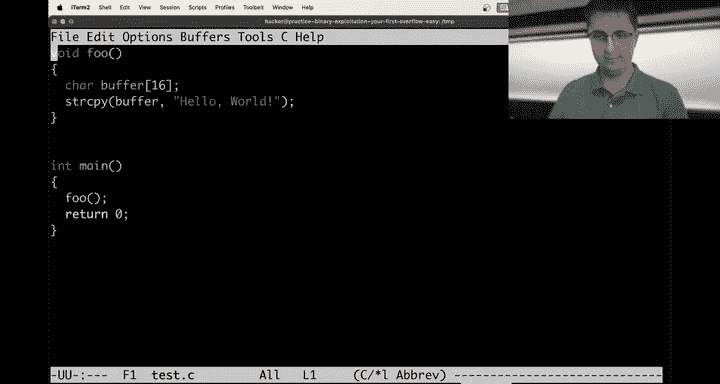
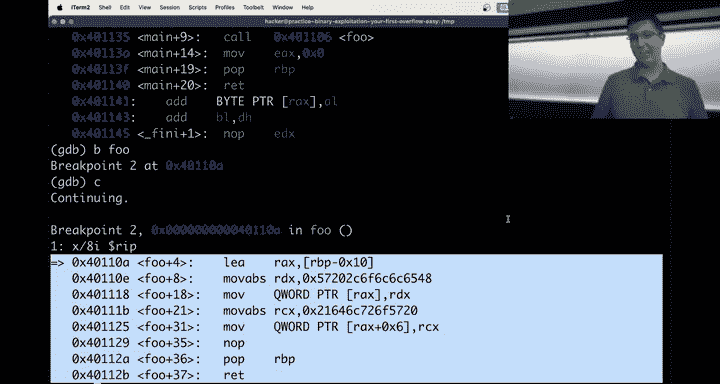
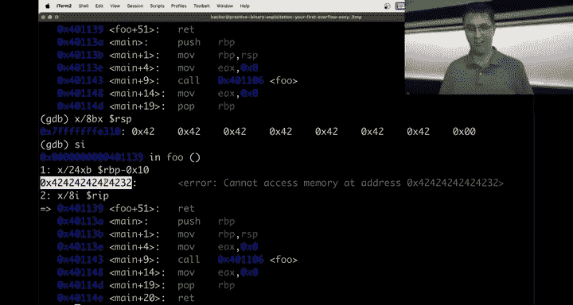
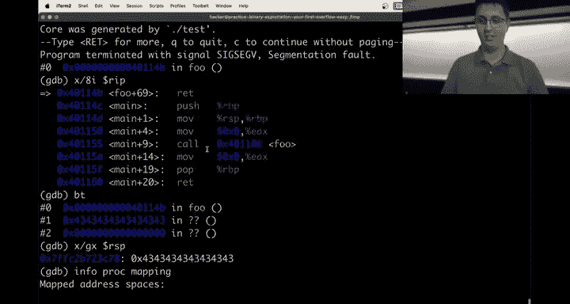
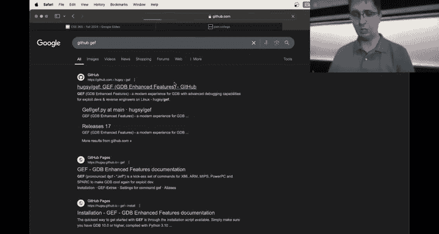
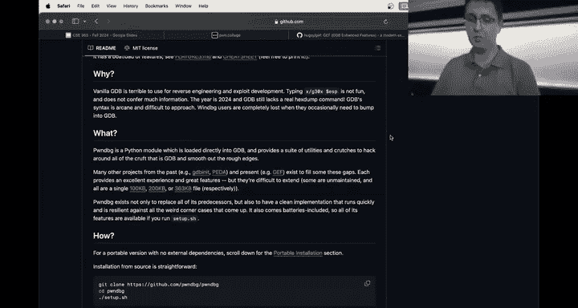
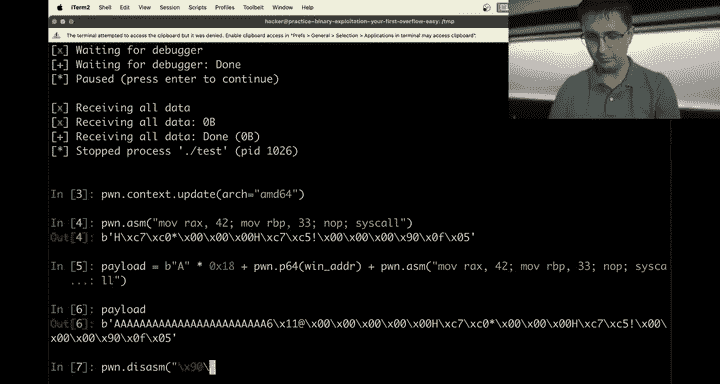

# ASU《网络安全导论｜ASU CSE365 Introduction to Cybersecurity Fall 2024》中英字幕deepseek翻译 - P26：-27-Binary Exploitation - CSE365 - Connor - 2024.11.20.zh_en - GPT中英字幕课程资源 - BV1nVCVY9Ehy

Everyone。The the numbers are extremely dwindled today。 We've got， let's see。

 I can literally count it six people。've got six people here today in person in a lecture hall built for。

 I don't know，300 people or I don't know something like that。 pretty， pretty amusing。Which is fine。

 hopefully the people that are hopefully most of the people then are watching this either live on Twitch or after the fact on YouTube。

Or otherwise， good luck， I guess。Um， okay， let's jump into it before we jump in， though。

 does anyone have any questions about anything？Nope， no questions。 All right， well updates。

 I guess on course logistics still working on getting the reverse engineering survey out I've been。

Busy with other things。 Finally， I think this afternoon， I'm be able to get to creating it。

 It's actually， I've realized， so I've been creating all these like five multiple choice questions。

 and maybe， you know， that doesn't sound like anything to you。

 But it turns out like it's actually difficult coming up with good multiple choice questions just in general。

Where there's not like an obvious answer unless you you know understand this stuff。

 it's actually extra difficult to create reverse engineering multiple choice questions because hopefully the questions in the end。

 I don't know haven't created them yet， that's what's going to happen this afternoon。

I can't really ask you questions about C image because C image is not the point。

 The point is reverse engineering。 and that's like a very。Experiential task， I don't know。

 I'll come up with five fun multiple choice questions。

 but that has been the biggest blocker I'll get to it this afternoon。

There have been people that have requested extensions for various reasons。

 whether it's you know being sick or personal stuff or whatever。

 I think I'm behind on the order of one to two weeks or something like that。

 hopefully going to process those this afternoon as well and then I know we're missing survey extra credit。

 CTF extra credits， me extra credit and helpfulness extra credit。

And also somewhere in this afternoon， hopefully that will also be processed otherwise as soon as I possibly can。

Okay， so that is course logistics as everyone hopefully knows we have our ninth assignment live right now。

 it is binary exploitation it is due or the checkpoint is due on Sunday the deadline is Sunday after that hopefully everyone understands that format by now and then there will be one final module after it that's putting it all together lots of concepts all intermixed in very exciting ways。

Hopefully people that have started on binary exploitation would agree that this module is thing following。

 that's not hopefully people would agree that binary exploitation is a bit easier than reverse engineering。

 do people agree with that or disagree agree， raise your hand。Only one person agrees， All right。

 maybe binary exploitation if you're at home is harder or maybe people are waiting for Sunday to start。

Either way， hopefully you'll agree in the end that binary exploitation。

 I think maybe on the order of two times easier， you know。

 maybe this is like a web security slash I don't know what else have we done in this course。

 web security intercepting communication is not going be as easy as access control you know。

 it's an average module is's not going to be like crypto or reversing hopefully you'll agree。

Fortunately this is not a brand new module on our end。

 so we've seen people hit pain points and smoothed it out and you get to enjoy those improvements and you know next。

 as Jan said last class， next semester students will get to enjoy your suffering of reverse engineering as we figure out how to improve reverse engineering Okay。

 anyways， let's jump into conceptual stuff I'm just going to start up a random challenge。

So I guess I should make sure Twitch chat。If there is any。Issues。Oh。

 people in Twitch chat say definitely a lot easier than are， okay， that's it no， no issues though。

 the audio is working。The stream is showing， okay， cool。 So yeah， let's， let's jump in。Okay。

 so let's do a quick recap of what the heck is memory corruption right。

 this is the one of the primary topics in this module。

 Hopefully you've watched the videos If not we will get people caught up to speed real fast with a quick sample program。

 we'll do test。 C。Maybe。What。What the heck is in here， What did Janwn do to this。Poor。

 poor thing again， we'll go to temp， I don't care。Eex Cu test。 C。

 and we will write a nice little program and this program will have one other function。 It will be F。

And foo will have a buffer that is size 16。Now， what we're going to do is we're going to keep it real simple。

 we're just going to call a stir copy。 We're going to stir copy buffer。Hello world， okay。

So we're all on the same page here。 This is a very boring program， but this is a， you know。

 introductory level C program， right， We got a buffer。

 We randomly decide to copy hellello world into this bar。 There's real no effect of this。

But what we can do is now use Gcc to compile it， we will call this thing test， test。c os。我。

 we don't know how to type。GCC。This， it complains about star copy will just。Guess we be。

Correct for it。I am just not typing correctly。Test。

Hey， we'll give it its include。Gcc test， nothing happens， of course。

 but what we can do now is we can watch this happen in G。 And in fact， I'm going to set this to。啊妈。

Okay。GDB dot slash test， and we can start the program。

 we can set it up so that we do set disassembly flavor Intel。

We can set ourselves up where we will constantly see the next eight instructions I feel like that's kind of a nice thing to have going what else do we want。

 I don't know， we don't really care about anything else， let's just continue。Oh no。

 we didn't set a breakpoint。 So continue is a bad ideal。

 Let's do start instead of start I So difference between start and start I if you haven't caught on haven't used GDP a whole lot start I starts at underscore start start starts at main so that's the difference here sometimes you don't have a program with main so start breaking on main doesn't mean anything because it's not a C program and there is no main but for our cases right we got a nice simple C program with a main with the symbol for main there so we get a breakpoint now let's break on fo。

 let's continue we can see this is fo right these8 instructions。

 I guess8 it was a good number if we didn't know that it was8 though we could do disassess DIS and see the entirety of it so we can see right that we have our function prologue here which is we've got this RBP register we are bound contractually to save。

RBP because we might mess with RBP and you'll see very quickly that we move RSP into RBP so we got to save RBP。

 we save it， we push it on the stack You'll see at the very end the epilogue of the function does a pop RBP So this is the prologue epilogue and then we give ourselves some we move RSP into RBP。

 This is kind of just part of shifting the stack frame。And then we do this。 and in fact。

 we can see Star copy didn't actually it optimized for us。

 We didn't even tell Gcc to optimize it all， I guess this optimization just happens automatically maybe star copy is pound defined to do this operation probably rather than do the call unless it's some length or something like that and we can see that we grab an address at RBP minus X10。

 This is our buffer pointer our buffer that was size 16。 that is at location RBP minus X 10。

 that is the first byte if we want to see every the entire contents of our buffer。

 we could do x slash 16 Bx RBP minus0 x 10。And here's the current contents of our buffer。

 You'll see that in our buffer， there is stuff， right， It's not zero initialized。

 We didn't initialize our buffer to 0 C does not zero initialitialized things。 Often， you know。

 the most likely byte that's gonna to be hanging around in memory happens to be an null byte。

 So often you might accidentally have a bunch of null bytes there。

 but unless you explicitly zero out your buffer， it is just a bunch of uninitialized data。

 And this is the uninitialized data that is right here。 So we have that pointer。

Then we take these8 bytes， we put that into RDX then we take RDX。

 move it into Qword pointer RX Rx is R pointer， so we moved8 bytes into here and then we take another8 bytes。

 we move that into RCX we take RCX and we go to offset RDX plus hex 6 and dump that into memory as well I guess does that mean that this was only。

My byte says this too。3。Or I think this is 8。 Let's just watch。

 I guess this is the simple way to do this so we can add display 16 Bx。2 RBP minus hex 10。

 Now we get to see the contents of our buffer every time we step。

 so we're going to step in instruction。 Nothing very exciting has happened yet。

 we haven't updated our buffer。 We know that updates to our buffer will only happen here and here after these execute we step again and then after we step on this guy we should see eight bytes filled into memory。

Let's see that we can see eight bytes just filled into memory before it was a bunch of nullles and now it is a bunch of stuff that got moved into memory。

 In fact， we could do x slash S RBP minus X10 to view it as a string and we would see hello comma W and then this uninitialized junk that's in here X slash S is just going to go until we hit a null byte。

Now we grab some more data， we put that into RCX， and we get ready to move RCX into RAX plus hex6。

 kind of a little bit confused how the heck is it。Now let's see what is RAX pointed to， it is here。

Well， let's see what happens。6，5，4，8。Before we had this， this a six。How did that just work。

 So we had this number here that we wanted to move in。 So we wanted to move in。Well。That goes here。

21。21 and then 64， and then 6 C， then 7，2。And then，6 F。And then 5，7，2，0。 was it already 5，7，2，0。

 This might just be some weird thing that Gcc did。 Yeah， look at this，5，7，2，0， and it also put 5，7。

20 here。 Like put the constant into both instructions and then went to plus  X。

 I have no idea why Gcc did this like the what why I was confused into my head is I would have expected R X plus hex 8 to be the next location because we wrote 8 bytes。

 Then in theory， we're gonna get ready to write another 8 bytes。Oh， you know what it is。

It had to do this because when we move this like when we do this operation。

 we're always moving 8 bys and we're not moving 16 by total。 We're moving 14 bys total。

 And so if it hadn't put this duplicated let's see here this 5，7，20 and 57，2，0。

 it hadn't duplicated those bytes。 those would just be like what null bytes or something。

 And then you'd be writing null bytes。 but the behavior of stir copy isn't add bunch of extraneous null bytes to the end。

 you can add1 null byte to the end。 In fact， you have to， That's how stirir copy works。

 But it can't add like 3 null bys to the end。 And so I guess this is how Gcc resolve this is it did duplicate within those 8 bys。

 and then did an overlap kind of。Kind of crazy， but hopefully we can see now， for example。

 very easily that if we do X slash s RBP minus hex10。

 we can see our hello world is definitely in there。Okay。Now， as we this of course。

 was not a buffer overflow right， we wrote 14 bys into a 16 by buffer。

 not a buffer overflow if we had written 17 bys in or actually even if we had written 16 because of the trailing null by。

 that would be a buffer overflow but we did not do that。

 and so nothing kind of disastrous happens here so let's go ahead then and make something disastrous happen。

We will do hello world， and this was 14 bytes I think we think we decided。And then we will do。1516。

 and then 1，2，3，4，5，6，7，8。 So I'm just filling in the rest of the 16 and then randomly doing another 8 Bs just kind of because 8 is a nice number。

 And then just always remember in this context in the challenges。

 you won't really see us using star copies， I don't think。 But in this case。

 there would be an extra null bite at the end that is also getting transferred into the buffer。 Okay。

 let's G C see this as well。In fact， you can see that GCC has gotten a little bit smarter over the years。

 it's actually telling us that this dangerous thing is about to happen。

 that we're about to write more than 16 bytes to our buffer。

 but it's just a warning can continue on and there are certainly ways to cause a buffer overflow where your compiler will not warn you that this is going to happen。

Okay， Gb dot s testest， let's break on F， let's run。D sets， disassembly flavor。

Intel x6 or let's do disasses fo。 We want to constantly see。This， and it actually， let's do 24 bys。

 even though our buffer is only 16 B。 Let's show the next 8 Bs after as well。Do that as a display。

And then we also want RIP Okay， so now we can always see our buffer and we can see the next two execute instruction we can see it puts this into RDX。

 this into RCX moves RDX in there， RCX in there here's R 8 Bs goes into RSI RSI goes in here and we filled in memory。

Any questions so far about like everything we've talked about， hopefully this， you know。

 we've you've written C in the past。 you've looked at assembly for a few weeks now。

 hopefully this operation makes sense， right， This is our stir copy。 So now what is it that happens。

 Well， what happens is if I step and then step again， did I not do I did not do display8 I。

Display8 I， and we keep stepping， stepping， stepping， stepping， and then x slash S RBP minus X 10。

 We can see we've got hello world exclamation point A A so buffer overflow definitely just happened here because the length of this string is。

Too long。 It is more than 16。 Not good。 I think can we do call St length。RBP minus x 10。

 will that work？うん。😊，Is it just like。Yeah， we're not going to worry about it Some we could do that or we could just copy it however you wanted to do。

 But okay， so let's see what's about to happen now， There's more going on here in this function。

 we had a buffer overflow。 Does anything matter。 Well so far， nothing matters。

We're about to pop RBP so we can look at。What is going to get popped into RBP that's going to be at the top of the stack So these B characters here。

 right B B BB looks like we had a little byte at the end also this is about to become RBP So we did just do a buffer overflow and we're about to affect things because when we started this program up we had an important bit of data that was here in our uninitialized data this uninitialized data was in fact not really I mean。

 uninitialized from the perspective of the buffer is not really uninitialized from the perspective of the stack frame this location and memory was holding our saved RBP So we wrote Bs over our saved RBP and so now this value here that's like7 F This thing is an address right here we can't really show it anymore but we just overrote this address here and in fact this is a stack address that was living here。

And now that stack address is going to go back into RBP。Is gone right now is a bunch of B characters。

 So if I step again now we're going to do a re so we can see， in the fact。

 you can see my display function broke because my display function was printing X slash 24 x B。

 and it was always just using whatever the current value of RVP was minus X 10 RVP is an important register。

 And so now my GDP is kind of broken here for displaying this。

 it can't show me valid memory because now it's looking at all those B characters minus X 10 pretty interesting。

 and then we're gonna to do a RE。 This is where with buffer overflows。

On this memory corruption， understanding how everything works is critical。

 So the way that RE works is you can think of RE， maybe in your head as a pop RIP。

 which maybe sounds like a really weird instruction to you， But this is equivalent to pop RIP。

 So we are going to update the instruction pointer with whatever is at the top of the stack。

 So what is at the top of the stack。Well， currently it is here。

 And if we look at eight instructions there， we can see that this is like the end of main。

 we move zero into EAX。 We pop RBP and we read right this is main finishing out to do its return zero。

 So what is at the top of the stack is that location。

 This is how our program knows how to get back to main is that this a is just literally is sitting there on the stack saying。

 hey， when you're done， call Re and make sure， you know our stack has been adjusted correctly。

 So when you we do our pop RIP correctly with that RE that we go back to where we came from and call does the reverse call is like a push RIP it's really a push。

 Well， yeah， it is push RP looking at the next instruction that would have executed。

 it involves a push RIP followed by a jump to whatever it is that you were calling。

 That's kind of like a double instruction is a call。 Re is just pop RP。

So if we step， we can see we're back in Maine， back in Maine， back in Maine， back in Maine， Okay。

 let's edit this a little bit further then。So I think I was slightly off here。Let's see here。嗯。

So want to make sure I've got yes yeah I had there was an extra null bite in there because I was off by one。

 so we'll put an a character in here as well， and then we've got our As B's which now we wouldn't have that null bitete in there。

And then let's do eight Cs，3，4，5， six，7，8， hey， Gcc that G that。We will break F display8 I。

RIP and then we will do display hopefully it didn't move around。

 I don't see why it would have display 24， actually， let's do 32 BX RBP minus Xx 10。

 which hopefully is where our buffer will end up being once we hit our break point。Let's do a run。

 Okay， now we are info。 We've got one thing here。Flavor intel。Okay， let's start stepping。

 we can see it's going to put this， this， this， this。

 it's all going into memory it's our stir copy all in line， let's do disassess fo。

 we can see this is our whole function that's going to execute， let's start stepping。Okay。

 we are updating our memory。 We haven't yet put these B characters and C characters in yet。

 We can see this right here and this right here。 So let's actually look at this thing。

 So if I look at X G X right here， This is an address and why is this an address。

 you'll get used to it in this module， but something that looks like7 F at the start right here。

 this is very， its just very aacy。 It's in fact， it's very stack addressacy。

 we wanted to confirm that for ourselves。 we could do infoproc mapping。And we will see some here。

Right in here you'll see from here to here， this is the stack。 So in fact， this is the stack。

 I will also see that our code lives specifically in this Rx permission page of memory it lives from 40。

1000 to 402000。 So if you see something that looks like that that is going to be code address E So let's do what do we want to do So yeah。

 so we can see here we printed this address。 this is a stack address， which makes sense。

 the RBP that we saved off RBP is normally a stack sort of address。

 it's the base pointer of the stack frame And then if we look at this guy right here。

 you'll see that it has a 40 lurking in here which kind of spoiled that there we will see os didn't copy it correctly。

If we look here， this is a code address and if we look at eight instructions right here。

We will see just as before this is the end of main。 So if we keep stepping。

 we're about to mess with those two things， we don't really care about our buffer right in this case。

 as an attacker trying to maybe exploit this buffer overflow， of course。

 you know this is all just an example way to stir copy there's no way for an attacker to even influence this program but imagine it's a read for example this part of data we don't really care about just still it was something this though is very is interesting it's our saved base pointer and this is really。

 really， really interesting as we'll see here in a second if we step and then step and then so we just filled in all of the B characters we step one more time now we filled in all of the C characters。

 our saved RIP and saved RBP just got destroyed。Now we're going to do step step。Hey。

 RBP just got popped， we did P RBP and now our GDPB is failing again as before。

 and the real interesting thing though now is this RE and as I said， RE is just P RIP。

 So if we look at X GX RSP the top of a stack， we're going to pop this into RIP。

 this effectively means we're going to jump to this address。And hopefully， it is no surprise。

 But when we go to do that， when we jump to this address， we get program， receive signal。

 Sg Seg V segmentation fault。 You cannot jump to this address， because this address。

Is not mapped if it was in here by chance， you know。

 maybe there was this weird address located in our memory space that was just a bunch of C characters。

 Then we wouldn't have crashed。 We would have just started executing there。

 assuming it was an executable page of memory。 But in this case， not so lucky。

 And so we crashed the program。 We got a Se fault and I think we'll see if GDP actually。No。

 GDP is not so smart。一。Yeah， it lost。 It lost that。 but what we could do。Let's see here。嗯。😊。

If I run test， right， we get a segmentation fault even without GDP。Let's see here now， okay。

 so you'll see that a file just got added。 it's this core。 So when a program crashes。

 if your system is configured for producing core dumps when the program crashes。

 you'll get one of these core files This core file can be loaded up into GDP。

And you'll see the core was generated by dot slash test。And now。厳し？嗯。😊。

You can see that our RIP is still there， I guess it doesn't update RIP at the point of crash。😡。

But if I look at the top of the stack， those C's are there so we can see that we crash on a RE instruction still at the top of the stack is RSP and in this case。

 I didn't even need to use GDP right I just ran the program and it says segmentation fault core dumped this is the core it's talking about so I can just load that core into GDP and actually you have to do。

 as I did before dot slash test and then core to the program and then the core dump associated with it and I can just look at all of memory at the time that the program crashed so this gives me a lot of interesting information right it tells me what instruction did I crash at I can run that G command like BT which is the back trace because our backt got kind of destroyed because it doesn't know that it doesn't know that main called fo because the way that back trace works it's looking at our call stack the way you normally。

Analyze to figure out your call stack。Is you look at the stack where all those saved RPs are。 And so。

 you know， I guess our back trace got destroyed。 But now， even without GDP。Yeah。Analysis， you know。

 throughout the crash， we can look at a postmortem of the crash and see what the heck was going on。

 We were on a rat instruction and always look at the top of the stack。

 When you crash on a rat instruction， this is where we were trying to go。

 And I wonder info proc mapping。 I bet that works。 Yeah， and we could see。

 you know that that is not mapped into memory。 Okay。

 any questions so far at 8 I've7 also pull up Titch judges in case。Okay。

 I'm doneling GDP a lot because GDP is。Like if the stuff just makes sense to you。

 you could probably just fly by without GDP， but as soon as you're confused and things aren't making sense。

 G is going to be your tool I don't see any questions in Twitch chat yet either。Yeah。Okay。

There's a lot of directions to go here。The first one I'm going to do。

Maybe you don't like this whole you know set disassembly flavor Intel and display8 R or8 IRIP and display8 BX。

 you know RBP minus Xx10 and constantly typing this over and over two options or a few options。

 GDP and knit， hopefully you've learned about GDP a knit because I think Janhan has talked about it several times you can do a GDPB script。

 hopefully you understand some idea of a GDP script because the GDPB portion of computing 1011 over that。

Kind of a third and easiest alternative that maybe you'll see a lot of people doing。

 especially a lot of people that do this sort of analysis where they're sitting in G looking at this register。

 It's kind of like a lot and GDP is like defaults aren't so good're like they're basic。 they're fine。

 but there is an easier sort of nicer wrapper around GDP that makes a lot of this even easier。

 So let's see what that is。 So there's two popular tools。

 one of them is GEF so I could actually go Github GEF。

 These are just projects out there that you know a community of people have maintained。 this is GEF。

 the G enhanced features and then there's a second popular one called P debug。

 which makes exploit development and reverse engineering with G， It's made easy。

So these are two very popular tools， they're just wrappers around around GDP you can run them by just typingpon debug dot slash test。

Okay， now you will get some color， maybe this color isn't so exciting。

 but what we can do now is we can start the program and we get a whole lot of info dumped to us and it's not very good because I'm zoomed all this way in。

 but if you're like on a big monitor and you know you've got space to work with。

 I'll zoom out a little bit just for， you know showing this off a little bit more。嗯。While it's clear。

 I' going to bug。Start。Yeah， you can see that it's kind of nice。 We can see all of my registers。

 I can see what code is about to execute。 I can see my stack。 I can see my back trace。 You know。

 that underscore star called into Liby start main Iple， which called into Liby start main。

 which called into main。 and I could break on fo。 You know， it's still just GDP。

 I can set break points。 I can continue Now we can see that fo is in my stack trace and， you know。

 it's kind of。😊，It's kind of cool。 We can see， for example， in my registers。

 well zoom in because I recognize streaming， zoomed out is even worse。 We can see， for example。

 that Rx is0。 We can see that RB X is this address。

 and this address actually points to this address and this address is this string of memory。

 So we have a pointer to a pointer which contains this data right， So it kind of is very cool。

 we can see， you know RDx eventually through a chain of pointers makes its way to the shallow environment variable。

 Yeah， so we can also see R 9。😊，Ultimately is a code pointer right it's pointing at this DL fy function we can see RIP。

 of course， is also a code pointer， it's pointing at the next to execute instruction。

Our 15 is a code pointer。 We can just kind of quickly see things without having to con type Xlash blah。

 blah， blah， blah， blah。 a lot of things you might just naturally wish I could see it's already set up to be displayed for you。

 and it does color coding。 I guess red is code yellow must be the stack。

 Maybe there's other colors out there too， I don't know。

 maybe some of these are like askI versus non no I don't think that's what it is。 I don't know。

 it is very cool， though， and there's a lot of really advanced features that we won't even actually need in this class。

 but if you go on to take 466 to some advanced features in here that make just various tasks easier。

 there's like another tool to learn。 you don't have to learn that home tobu。

 I mean you can as you want。 the crucial thing here really is just you know you get all this stuff displayed to you for free and every time I step。

 I can see what's going on。So for example。Let's see here RAX ends up becoming my buffer so we can see that RAX is this guy right here。

 Let's watch what happens。It's very difficult doing this in a。

A zoomed way we can see that we're about to write to the buffer， which is pointed to by RAX。

 so we should see that this gets updated with a string because we know it's a string getting written here。

Yeah， so you can see now that R A X points to hello comma space W。 And if we step one more time now。

微屈。嗯。😊，Why did it not update？Well step one more time。Oh maybe it like constrains how much of this no。

 but it shows more this string there I don't know if you like it。

 feel free to use it if you don't like it， don't use it just user vanilla。

 G one other thing I'll just quickly show off is GEF instead。

 same idea just a little bit difference if I start。

You can see very similarly we get colored stuff and if I break on foo， we continue。

 can see my upcoming executed instructions， we can see that if I step。Step， step， step， step。

I don't know why。Doesn't give me the whole string， but whatever。 either than this one doesn't。

 But either way， this is， you know， two options that I figured I would point out now while you're。

 you know， maybe about to be embarking on using GDP a lot。

 that these are two options that you might like。 Okay， so that's what I'm going to point out there。

 So I'll see。Is there any questions about that P debug or Jeff， you don't have to use them。

 It's just like fancyci or GDP with lots of features that you don't need to learn。

 but the default is also kind of nice。No questions， all right。

 and I don't see any questions in Twitch chat， so we will keep on moving。ok。So。Let's。

Edit the code here。Let's make this a little bit more interesting。

 So we've gotten this program to crash so far right by putting these C characters in here。

 I'm going to change up this program where to be a little more in line with how these challenges actually work so that I have control over what my buffer overflow is rather than just start copying an a static string。

 I am going to read from standard in into buffer 4096 bytes。He。So that is that。And I'm going to add。

A fun little function here， oops not called main called win。

 which you'll see that many of the challenges in this module will have。

Ours won't be as cool as reading the flag instead we will just put。

U1 and leave it at that because that is just as good as the flag， nice U1 message。

 and then we will Gcc test。 C， we listen to our warnings， at least this one。

I don't know why I choose to listen to some warnings， but not others。

Because I guess maybe because my foo。My missing。Who gives me foo man to read？This guy gives me read。

We'll fix that warning too。🎼嗯ん。Is this just it figuring out that there's a buffer overflow Y。

 this one， this warning we're not going to fix because this is the whole point it is warning us that there is a buffer overflow at play or potential for it。

 it's a warning Okay， so if we launch up dot slash test wait what。Oh， I didn't do oh， test。

Thus slash test， it hangs Now。 I can't and will'll zoom in a little bit more。Oops。

I can say A A AA and it does that as Janwn showed famously。

 you just type a whole bunch of A's and programs crash。

Now we know why the program crashed very directly right the saved instruction pointer got overwritten and that is never good But what if we want to do something cooler than segmentation fault core dumped what if we want to win for example right so we saw that there is no way to call win but we also just said that we're in control of where fo goes to after this function execute So you know what there actually is a way to effectively call win it's called return to win right instead you know we don't get to modify our source code but we get to modify saved RIP pop RIP and effectively jump anywhere we want a very cool place to jump would be to win and then you would call this return to bh return to win is kind of a name for this type of exploit there's other very related things there's like RE to LibBC so you might return to a LibBC function we're not going really get in。

To that right now， but Libib C might have somewhere very cool for you to jump to anyways。

 well let's let's go ahead and R to win first。So before we can do that。

 I feel like we kind of maybe hopefully if you've been paying attention of kind of a good idea of what we're gonna do。

 we're going to send it something like 16 a's to fill up this buffer。

 which there's definitely 16 bys of space sitting in there and then there's like some distance until we reach the saved instruction pointer before there was like another 8 bys。

 which was the saved RBP we didn't really care about saved RBP it still we could influence the saved instruction pointer and return somewhere but the either other way there's those8 bys we have to deal with。

 So if 16 bytes， then another8 bys and then at least if it's going to look the same as before。

 if Gcc didn't like change stuff up and add padding or do something weird then in here the next8 bys would be our saved instruction pointer sitting on the stack that this implicit return at the end of this function we'll go to here is where we would use IDda or。

You know I think it's going to be okay if you want to use Ob dump here。 you know。

 Ob dump is nice and simple。 In this case， I would say Ob dump is going to be a quick way to look at this。

 Let's look at F。We can see that we push RBP so the thing to think about in your head when F is starting the very top of the stack as soon as before this instruction even executes at the top of the stack right now is the saved instruction pointer because someone called us the saved instruction pointer is at the top of the stack we push RBP now the saved instruction pointer is eight bytes away okay from from RSP。

Then we sub RP hex 10。 So what this did， it didn't you know do anything that fancy except it allocated 16 bys of space on the stack for us This is。

 you know if you've used Malik on the heap for example， to give yourself you know 16 bys of memory。

 This is the local variable stack equivalent of Malik。 it's literally just。

 you know give yourself some space on the stack。 subP Hex 10。 And then well， this is， you know。

 maybe a little less intuitive。 here's kind of a little bit of an issue is that we're working with RP and RBP。

 which means our math isn't so simple But at this point right here。 We actually put RSP into RBP。

 So we can kind of ignore this instruction to some extent。 right RBP minus hex 10。

Right here at this point， RSP is 8 bytes away and then we subtract a further 16 so we're 24 bytes away maybe that's like you know gymnastics of reasoning about this and doing math and like this goes into this and like subtract this maybe you don't want to do that which is you know fair。

 but that's kind of how you could do this static analysis a different option actually I'm going see this one's kind of cheating。

 you don't actually have this option I think if I compile it like this it won't use RBP let's see。嗯。

嗯。Yeah， and you'll see we also don't even save the base pointer。

 This just compiled the program optimized for space。

 which means a bunch of constants that can get like folded together。

 get folded together turned out that we didn't actually need to save the base pointer if we just never mess with the base pointer。

 kind of a nice little saving of space And so all we do right here is we just sub RP Hex 18。And then。

Ultimately， we call in read at RSP 18 and we can see right here。That at this point。

 right this is probably easier to look at， in fact。

 maybe we'll recompile these challenges with OS because it might even be a little bit easier to think about well we'll decide on that but you can see here that we subtract 18 from RP at RP before this subtract is where the save instruction pointer is this is going in to be our buffer to read our second argument the saved instruction pointer is hex 18 bytes away this is like very easy to look at but of course。

 unless we recompile things you can't do that So we won't consider that analysis one final thing we can do to not have to do math。

 and this is probably my general favorite way to do it is nice simple GDPB or poem debu or Jeff。

Thought slash test， break fo， run。Seets。Disassembly flavor Intel。Disasses who okay， right here。

We've got XG X RSP， So I guess when you break food， it actually breaks past these two guys。

 So that's kind of lame。 But at RSP plus 8， this guy right here。

 so at RP is our saved base pointer that happened here when we pushed RBP at RSP plus8 we've got this guy。

 So this address right here， this blue guide， 7 FFFF E318。

 this guy is where our saved instruction pointer is。Now， all we need to do is break at read。

 so we will break here。😡，And we know that at this point actually we got to continue at this point we're about to read and what that means is RSI contains the location where we're going to read to RSI okay。

 and we already figured out where our save instruction pointer is so if we just print this minus this。

😡，18 it's 18 bytes away。 This is my preferred like you can't mess this up this is where data is coming in after read。

 It's coming into the location specified by Rsi just print out where that is and then also print out where the saved instruction pointer is at the start of the stack subtract the two you don't have to statically analyze and read idda or read Ob dump or like do subtraction I mean I guess you have to do one thing of subtraction but just very directly where is your first byte of data going to go to and where is the first byte of the saved instruction pointer that difference Hex 18 We need to fill in hex 18 bytes and then the next bytes is the saved instruction pointer High encourage you to do it this way It's like foolproof。

 you can't mess this up reading this and trying to do math you can mess this up you can always recover with GDP but that is going to be my tip for you all okay。

え？So then now what well？We need to figure out where we want to go to So before we were just returning to a bunch of seas。

As's grab O jump or Ida or whatever。 really， all we want to know right now is where the heck is when。

 Win is right here。 This address right here。 If we redirect R IP to this location， suddenly。

 we are going to start executing push RBP， then this， then this， then this。

 you might be thinking to yourself。And it's a good thought。 But what about that saved RBP。

 We like messed with RBP and now RBP is all destroyed And if someone like look at this。

 people might start using RBP and like how is this code going function we've already messed things up Well don't worry because when is very nice like every function in this program it immediately just saves off RBP and then clos it with its own thing So the fact that you destroyed RBP it actually doesn't matter at all because the first thing when does is gets rid of it。

 it just saves it off even though it's a broken bad value。

 it saves it off and replaces it with a good value So not an issue there So we just need to go here。

It's very simple， right，18 by that address。 Now the question is， like， how do we properly format it。

Here's how you properly format it。8s are hex。18 bytes of padding， okay？And then， well。

 we have a couple of options。 We're just gonna to immediately go to the simple one。

 Let's not even mess around。 How do we type that， How do we correctly do this， right。

 This address right here， Don't forget your' 0 x。 This thing right here， right， I can't do B。

 A times hex 18 plus。This Python will tell you， nope， you can't do this。That's the same thing， right。

 can't do that if you do this。Very silly。 Don't do that。 This is also completely incorrect。 right。

 This is like you're putting ASI bites in here。 This is not。 you're trying to get these。

This 64 B little Indianian integer into your payload， right， 18 bytes here， this should be 8 bytes。

 and we can very clearly see that this is way more than 8 bytes。

The way that you do it very simply is you import Po， this is Po tools。

 maybe you've used it so far in this class and you do P64 of this thing and what this does is it gives you your eight bytes correctly put into as a little inian integer right。

 This looks like nonsense looks like nonsense， that's good because it should look like nonsense right。

 the very first one should be whatever the heck 36 is Wait what。Oh， Hex 36 is， which is a6， right。

 And then this 1，1 here。 Remember， we're doing a little ending integer。 Well， there's our X 11。

And we've got a 40 in here。 There's our at。 And then the rest is null bites。

 So there it is very nice。 Don't even have to think about it。 And so what we can do。

Is import P BA times？Hex 18。Plus P P64。Of the addressers of when。Okayy， very cool。

 there is our payload now how do we get the payload into the program？We could of course。

 open payload for writing as bytes dot write this thing out。Now I've got a payload。 that is my data。

 and then I could do。Dot slash test payload， right and this will work。U1。

 so we we successfully diverted control flow now it wasn't clean， right， the program crashes after。

 and in fact， we could see why it crashes after we get a core dump now dot slash test core。

 What happened here。Well R IP is one。 So that's not good。 Probably our back back trace is gone。

 I don't know。 bad things happened。 We actually can't so easily see what happened because our R IP got destroyed。

 We have some state。 We could run the payload and step through and set break points and like watch this destruction happen at the end。

 In fact， let's actually just because we're we're gonna really hammering the importance of GDP here。

 We will do that。 We're gonna run with payload。 We're gonna start with payload。

 We're gonna break it through。We're going to break at when。

 we're going to set disassembly flavor intel。And then， we're going to。We're going to continue。

 we're in F， we don't need to watch F happen and we know that we hit win let's do display8 IRIP。

 let's watch what's going to happen here So we step or next instruction I should say we skip over puts。

 there's our U1nob pop RBP， this isn't going to crash us that's fine。Hey。

 what is at the top of the stack now， right， we've messed with the stack in weird ways。 What is here？

Is whoops we just want one word。Well， there's a one there， why is there a one there？I don't know。

 your exploit did some weird things， and that is just what happened。Yeah， so。Yeah。

 we're not going to figure out why there's a one there because we don't really care right now if you're interested in answering that sort of question。

 maybe we'll get to it or if you're really interested in that question。

 466 might be the class for you。 There is a very interesting thing with this rec that happens now at wind that is。

A very real way that people exploit software that， you know it's not just one RE。

 you want the next REt and then the next REt and the next REt And it turns out there's this whole。

 I'm guess I'm spoiling it thing called returnturn oriented programming where you can rent to RE to RE to RE。

 you have all these small little snippets of code that execute and you come together like Legos because no real program has a function called Win。

 but it does have all these Lego blocks of code and you stitch them all together with a bunch of REs。

 it's called returnturn oriented program there's the spoiler there if you're interested in that take 466。

Okay。There was one more thing I was going to show though。

 because this is actually super lame that we just create a payload file。

 no one in their right mind would do this， I guess unless you。

Only halfway no P tools and you want to use GDP but there's an even better way to use GDP with P tools。

 so you would still be a little bit crazy for doing that， we will say that this is our payload。

And we would say with。Hone dot process dot/lash test， this starts up a process。

Object and then we can write our payload to it。And then， we can。Prince par。

readall capital S to convert it from bytes to a string so that I can nicely print my U1 message and we will see a U1。

Come out at the end。 and we'll also see。And I lose my， yeah， we'll also see that process dot pull。

 which gives me the exit code of my process was a negative 11。And negative 11。Is Seg fault。

 I guess you' see it's pause of 11 here， but just take my word for 11 is a Seg fault program crashed with a sg fault。

 I think we could also actually。Do process dot weights at the end。嗯。I don't know。

 I feel like there's another way to get it to show that it's se vaulted， but good enough。Okay。

 I will once again ask any questions so far。And I guess I'll open up Twitch chat。

To see if there's brand new questions。Alright， cool。 Alright， let's show。

Some more fun things that we can do with Pils。Okay， so which one do I want to show first？Okay。

 here is a fun thing that you can do in P tools， so before we used ObD to figure out the location of wind。

Poone tools can do that so if I do elf of test， what P dot elf of test。

Now we have this elf object that it looks like Po tool is automatically analyzed to determine that it's an MD64 X8664 little Andan architecture with this thing called raililroad。

 which is set to partial railroad and this thing called stack canary。

 there's no canary found in this thing called Nex， there's it's enabled these things don't necessarily immediately matter to you。

 but all of these things actually。These three， I think it covered within this module。

I guess technically we don't talk about Nx Nx is the idea of whether or not the stack is executable。

 or I guess more generically if any page of memory is both wriable and executable。

 but I think probably this in this case is just talking about the stack。

 I don't know if it's analyzing more broadly。You could think about the case and in fact you will at the end of this module。

 think about the case where there's no win function。

 but if you're in a situation where the stack is both writeriable as in memory there can be modified and executable you can just write your own win function and then jump to that thing So this is the idea of NX in general。

 you should never have a page of memory that is both writeriable and executable。

 like why would you ever want data that can be modified and interpreted as code at the same time。

 generally speaking， you never want that。Except there are exceptions to that。 First of all。

 older hardware just made all memory readable， writeriable and executable。

 So there just wasn't hardware to facilitate this idea of different permissions on the memory。 Now。

 of course， modern hardware supports whether that memory is readable，riable。

 executable or some combination of them。And then there is a more。Interesting reason that this exists。

 and that is。just in time compilation。 So there are programs like， for example， your browser。

 your jascript that's running its as it's running decides at some point as it's interpreting right it's just like Python JavaScriptscript they're just interpreted languages it's interpreting。

 it's interpreting at some point the engine decides that this code is being executed a lot。

 It's being interpreted a lot。 and it just plays this game where it takes that logic of that。

 It analyzes it and it just converts it into X 8664 and says， okay。

 now I don't need to do this interpret over here。 next time I want to execute this logic just jump there and then jump back in to the engine。

 And so in that case， you want to both write out X86。

 if you're compiling on the fly you're writing and then you also want to execute it。

 and then there's a whole security game of like I mean。

 there's an obvious thought there of why doesn't need to be both writeriable and executable at the same time。

 and it doesn't you could just。Make the memory writeable and then make it not writeable。

 but then make it executable， and then it's neverritable and executable at the same time。

 which is very good。Except JavaScript， for example， is doing this all the time。

 and there is some performance overhead to changing the permission of the memory。

And so they just said screw it， we're just going to leave it always writeriable and executable and now I don't have to pay that overhead and people like to not pay overhead because just don't have a buffer overflow or memory corruption and then no one can abuse this anyways。

 so that is the performance game。😡，And then， you know。

 I think I've heard recent things about there's some hardware thing that allows different perspectives on the memory where from one perspective。

 it's wriable and in another perspective， it's X， I don't know， security is a cat and mouse game。

 That's Nx。And we will look at pi and stack throughout this。 Okay， anyways， we've got this elf thing。

 If I want to get the address of when。W what is this thing I don't even know what that is I guess that's the where probably underscore start is funks。

C。I could read the documentation。Functions， here we go when。Address。Hes。Look at this。

 Now we can make a real。1。Way of doing this。Elf functions， when。Address。

Now we can put when ater here。And now it still wins and we didn't have to have this random magic hard coded value。

There is P dot pack。 How does this one work， No， that's not what I want。Ppon。嗯。All right， that well。

 the next  one I was going to go over。 It doesn't really matter。 There's a way to basically。

The way somehow to specify that at offset 18， I want this thing right here and then it'll just automatically fill it in with other bytes that who really cares just do it this this is fine Okay。

 one more thing though that I will show off。😡，Is this let's say that youre you're writing your payload and you you did this。

 right？You didn't even realize it， but you put a7 there instead of an8。 And you're like。

 my exploit is not working， and you're like。But what happened here？Oops， not weights pull well。

 it did say fault， something went wrong and you're like， what the heck is going on。

 I need to use GDP， but like what do I need to now take my payload write it to a file run it through GDP？

No， let's just poll GDP attached to the process。And you're going to see that that fails， right。

 so it is almost cool， but it says could not find a terminal binary to use。

If I launch this up in Team Mus instead。It will now work。So now at the top， I've got my i Python。

 the bottom， I've got GDP。So this is a pretty cool way of doing this and now I can。Set up a。

 or I guess I can see， where am I right now。I'm currently in Reid。And if I look at my back trace。

 I'm currently。Waiting in time at this read function。Because it attached and then it sent the data。

 but when it attached， it did a break so it attached and did a break point it's paused right there and Po toolss has technically already sent the data。

 but GDP in the process won't continue until I tell the debugger to continue So we're like frozen in time at this read。

 So what that means is that I could set disassembly flavor in。And I could。Look。

 so I did a back trace， so Fu was calling in here。啱妈。是为。Back trace， if I go up the back trace。

Now we can see right after the call is finished， I will go to here and then here。

 maybe I decide like。You know， generally speaking， when you're you're crashing the program。

But you're not like winning the thing you want to do is watch the red happen because。

If you're crashing the program and you're not winning or you're like your win code's not executing。

 it means that you definitely overflowed the save instruction point or probably technically there's other ways it could crash。

😡，But you may have overflowed the save instruction pointer， but overflowed it with the wrong value。

 So what I would do here in this case to figure out what's going on is I would break it this red because this is the RE that I'm trying to mess with。

 and then I would continue。And now I can see that the thing I'm about to execute is this rent and so if I look at the top of the stack。

And， you know， maybe if you train your eye a little bit more， you'll see like， oh， it is a 40 thing。

 That sounds like a code address， but it's shifted off right It's definitely not 4011 right It's supposed to be one more over。

 So this this just immediately tells me and in fact， maybe your eye isn't trained。

 You can second guess that as well。 What you can do is you can say all right。

 what are the instructions right here。 I better see my wind function instructions right here and it'll say no。

 you cannot see that。 But what I could do。Is print the address of what？Well。

 I could do X8 I win for sure and see right。嗯。So the issue is now we're in Team Mus and that means if you want to really use this。

 you got to figure out TeamMs a little bit， if I want to scroll up。

 I can't just scroll up because TMux like just has this portion of my screen and now I'm scrolling like outside of Team Muux almost but if I hit control B left square brace。

 you'll see that now there's this yellow thing over here which says zero out of 86。没 what。Well。

 I can must be able to do， oh， I can uparrow for sure。And you can see here。Right， that I had 4011。

And this is clearly， we're missing a 3，6 in there。 So this， the answer to this is right。

 we're off by one。 Hopefully， you'll be able to jump to that conclusion that you're off by one。

 I could have gone the other direction。 In fact， before I go the other direction。

Let me show one more thing， you know， this bag of tricks lecture stream。There is。

Way to make it so that TeamMs is way easier to use。Uppt Pung College T Muux Kf。

 this thing just like a G in it， has a TMux configuration file that just does one thing and it makes it so that the mouse works。

I am going to copy this thing into。My home directory and now teamms。Will work a lot better。

 So we're going to do this。 We're going to do this， this。Backact trace。Seets disassembly flavor。

Intel X8 I， or let's disassemble F。We wanted to break。Right here。And then continue。

And print the top of the stack。Which is off by one。

 But now I can like click between and I can also scroll。

 My like track pad is working so that that you want you to to be more usable。

 take that Teammux configuration， rewatch the stream and go to that frame or whatever。

 It's not so difficult。 It's just like set dash G mouse on in your Teamms do com。

 And now we can use this and this。 And it is very cool。 You might also。😊，Pfer instead。

Like that you don't like that it's like this feels very scary or something。

 like in terms of timing things， right， I'm attaching， and then I'm immediately writing。

 I can make it so we don't immediately write。 I can say Po dot pause。😰。

And now I haven't actually sent the data。 I can continue now in GDP and you'll see GDP is still hanging because P tools is paused and paused is just read1 byte。

 It's just waiting for you to say enter。 And then if I hit enter the data send and I get my Seg fault。

 So that is another cool thing you might like。Any more questions before。

We're running out of time quickly as I try and show you tips and tricks for getting yourself unstuck on these challenges。

The entire game is going to be GDP， either you know how to solve it in one shot or you make a mistake almost guaranteed。

 and you use GDP to fix your mistake。Okay， no questions。Okay。

 is there anything else that's worth showing in the next four minutes？That I'm missing。嗯ん。😊。

There's a whole bunch of other really cool things in pollen tools。So， for example。

 later on in the module show this part later on in the module。

 my hesitation is that some of these things in poem just make things too easy。

 So like my solution to that is to just not show it to you because otherwise it's too easy。

 we'll show you this one， though， I think maybe you've already seen this。 In fact， poll dot ASM。

First， I need to do。Say that my arch is AMV 64， and then I can do like move RAx 42。

 move RVp 33nob Ciscal right， something like this and it will emit the raw bytes for that later on in this module will be shell coding and you might be like used to running the asmbler and like ob copy or like weird ways of getting the bytes out you're already using Po tools for interacting with these challenges。

 You probably just want to use Po dot ASM because guess what now， if I have my payload right。

 I might have like a payload equals。This and you know this payload doesn't really make any sense。

 but hopefully you'll see where I'm going with this。

 you might do something weird like this right where this weird payload that's a bunch of A's and then a win address and then a bunch of assembly right you're crafting this complex payload And so if you're already using poll tools rather than like switching tools and then switching back in Po do ASM if you need to emit some bytes of shell code very nice。

 Also real quick Poone do disasseM。

Does the reverse so it takes the bytes。And。Shows you what the heck you just had。Okay。

 I think that is all I will show for now， good luck on the module。

