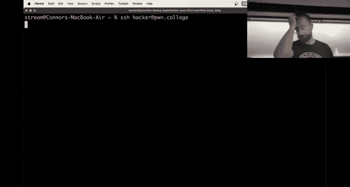
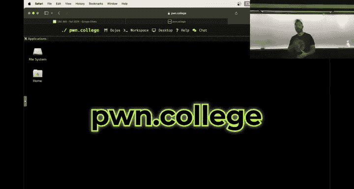
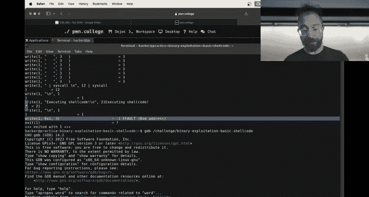
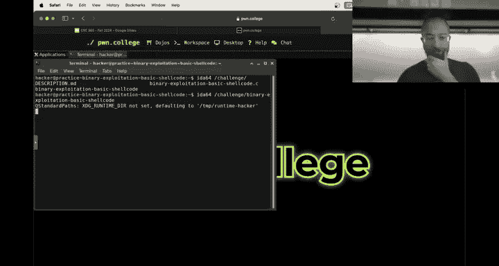
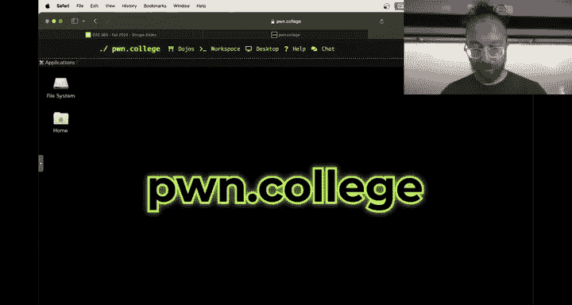
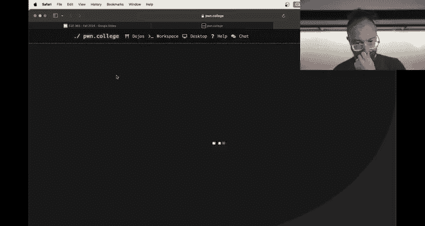
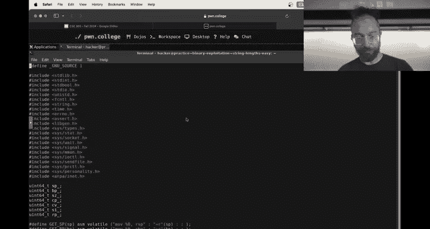
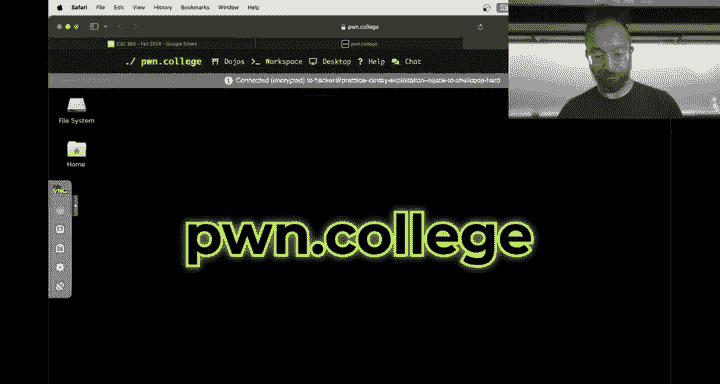
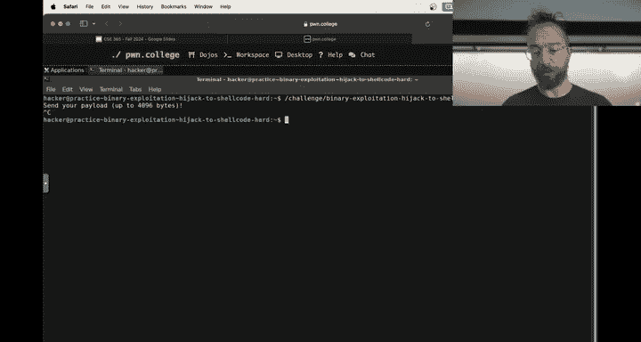
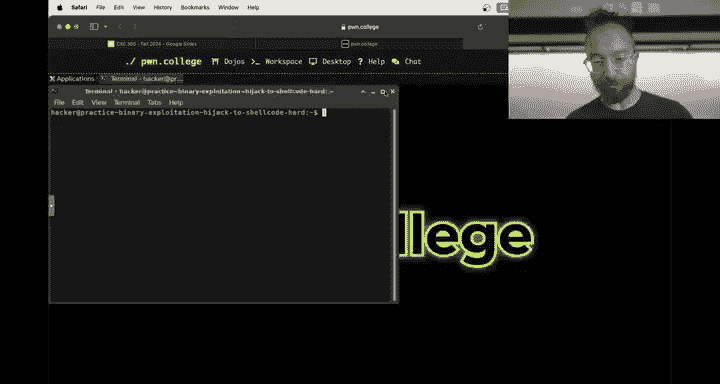

# ASU《网络安全导论｜ASU CSE365 Introduction to Cybersecurity Fall 2024》中英字幕deepseek翻译 - P27：-28-Binary Exploitation - CSE365 - Yan - 2024.11.25.zh_en - GPT中英字幕课程资源 - BV1nVCVY9Ehy

Hello， hackers， which shit as usual。We're not following。 We're not。We're not on the。What's it called？

They have the switch。Okay。Awesome， now we're on the twitch。Are we we audible and maybe perfect？Okay。

 we got the chat， we need to get followed。The camera needs to like and subscribe here。

What is this I solemnly swear I' want to no good There we go no， no， no， that is you think so。

Awesome， okay， very are live to。Nice，7 people in person and。17 on twitchitch。

 everyone else will fail。 Okay， cool。Welcome to week two of binary exploitation。

How did the checkpoint go， Let's see。How the checkpoint went。

Let's refresh this。Okay，1，2，3，4，5 sticks。 Oh， it's a little tricky。 Okay。

 because we had people going through the easy ones。 It's hard to actually tell how to went。

 what I'd guess。about three quarters of the class checkpointed cool。Awesome。

 so you've now kind of dived into understanding。牛。The kind of integrity of memory in software breaks down when。

Things like buffers are overwritten and so on。What you have to look forward to is putting all of this into practice and so far。

 23 people， let's say have solved everything。

Not quite actually 12 you solved everything for the rest of the class。

 you're staring down a deadline during Thanksgiving weekend。

Especially the eighth person that just walked in。That might be a little daunting。

Similar to what was the the other one， yeah， fall break， similar to fall break。

 we're going to try to reduce the pressure on you by giving a three day extension to reverse engineering to reverse to binding exploitation。

With the understanding that you'll still launch the next module on Monday。

 but binary expectation will be due on Wednesday evening all right， so it's up to you to manage that。

Our strong advice has always been finish the module as soon as possible and about 20 or 30 people take this advice but。

😡，Do with this extension what you will。 So by an expectation to。

Take some pressure off of Thanksgiving and and let you have some Thanksgiving time with family in。

Will be due on Wednesday， but the next module is still launch on Monday。So。

If you don't have any Thanksgivinggiving。Activities planned or whatnot。

 or if you have a free day or two around then。That you're not spending doing Thanksgivinggiving you or family stuff。

 please don't neglect binding exploitation should。Do your binary exploitation exercises every day。诶。

What else？Oh， we also applied。哎。Extra credit， almost everything should be in。

 There's still a couple of the very last surveys missing iss a semi manual process。

And everything else should be right， including extension。 Yeah， everything。

 all extension should be applied all。Uh CTtF archive， extra credit， all helpfulness， all needs。

 everything should be good to go。If you check your grades page。

 you see your new upgraded and updated grade， I think the median now in the class course this class is hyper hard。

 etc cea， ceter。 I think our median is 90%。89 or 90。 they'll have better numbers for you next class。

 but overall， between， you know， curving when， when it's a。诶。You know。

When we made challenges or modules overly difficult and extra credit to help reward the me the peer to peer help and the。

嗯。Applying your skills by by tackling these kind of。Free form CTF R exercises。 We've got。

A good amount of people doing really well。 So take a look at your grade。

 realize how hard you worked for such an awesome grade。 and then。😊。

Full of this energy go and do your teacher course evaluation please so the teaching course evaluation is launched on Friday you probably got an email about it they're open until for another like 10 days until December 5th so go do them that's important for us it's good feedback for us。

😡，And also good feedback for the department。 you know， it's one thing for us to go in and say， hey。

 look， you know， we need to。Do teach more Python earlier on in the computer science curriculum。

 for example。If I just go on and say this and say my students of。

Cars a little more weight if that shows up in in Evals like， hey， this class was super awesome。

 We loved it。 It's great。But， I wish I'd。Had more Python early on See that's actionable feedback。

 for example， you know， delete this class from ASU it's also actionable feedback。But， you know。

 the important thing is everyone gets a chance to voice their feedback。All right。

 and then hopefully we can improve things。Next semester and the semester after so that we can show an upward trajectory。

Um。And argue for our continued existence， okay。Awesome。Was that anything else administrative？哦，没事。

Anyone got questions binary exploitation， the next module。

 there is one more module for some reason this is very unclear let me just show you。😡，The syllabus。

I just want to make sure that we have the extra module on there， the last module。It's floating。

Then should have be improved。Yeah， why is this this takes so long to？I like computing all the grades。

 okay？嗯。Yes， so。But hell's the schedule。There it is， all right。

We have we're currently in what is called binary security we need to update this name because we have put binaryaries today I'll update it to binary security rename the actual thing。

 And then the next module is going be into to end crazy exploitation using multiple things that you've learned throughout this course so you will corrupt some cryptographic。

 you'll intercept。Communications that are using cryptoographic channels to like corrupt the crypto to overflow a buffer to execute She code。

 like it'll be crazy stuff。嗯。And and you will feel like absolute rock stars I've been， yeah anyways。

 all right， it's gonna it's going to be awesome， okay so。But in the meantime， let's try to get you。

Through kind of surviving binary exploitation。So far， with binizationization。

 we've covered kind of the basics of opening up a binary and looking at potential areas where an overflow might occur。

Calculating out offsets using both static and dynamic techniques and overflowing the buffer。

And you covered hijacking to return address。And hijacking the return address。

What we haven't gone into too far is the later levels that people are now starting to get to。Um。

W whichch is。UShell coding。And then actually putting it all together。

 having shell code that's injected into a binary into a process memory space and then jumps to so we're going to talk about this today。

 talk about approaches to debugging shell code and go from there。😡，And。To avoid。

 that's interesting to avoid。

All right， it's a start challenge to avoid giving away too much we're going to make shell code that。

I don't know， print high instead of making shell code that。Gs says the flag。

But we will go through kind of an end and how to write。Shall could。Which should look very。

 very familiar。

And how to inject that into software， right？Sounds good。Everyone am？Everyone's amped。

Silently amped。Okay。Shell code level one， we have a challenge that。呃。Read your shell code。

And execute it。 I'm just going to put a bunch of A's because that's what you're probably used to now。

And。It says， oh， shit， our shell call didn't。Disassemble and when it tries to execute it。

 gets a segmentation fault。You can't just type shell code in I mean， you can actually。

 but it you know， its very hard to type useful shell code in。

 although it would be awesome to memorize an alphanumeric shell code and just be able to type it out that's goals for next semester but what I can tell you is if you。

If you just type poop over and over， these are actual instructions that u。Disassemble into something。

 right， So this pushes a bunch of registers to the stack and then crashes。

So you can type in bytes and even printable bytes are like x 86 instructions， but the point。

With She code is to create an actual program that is injected into the process memory space and runs right now。

 when you create an actual program， let's create a hello world in assembly。Okay， what do we do。

 thatt Intel syntax， no prefix。Here's our start。Now， we're going to。Move RAX one。

 that's the right system call we're going to。Let's move into the into RSB。嗯。Okay。How do we do this？

Is there a，m I'm drawing a blank。 We can't do this， right， Of course， we can't do that。

 We're just gonna put。a bunch of As， so in little Indianian， there should be 41， 41， oh， oh。

 now let's start the way。So this should be AAA with a nullbyte afterwards that you're writing to the stack pointer。

 we're going to put this the rightis call。Hopefully this is all review from。Computing 101。

 the writes is call to RDI first argument is the father scripture to write to second argument is the buffer。

That's our stackg that we just wrote AAA to。 this is should print AA A。 And in fact。

 let's just print AA with a new line just to。Make things even nicer for us。 And you know what。

 instead of A A， let's print high。 So A B，C， D， E， F G。I missed something I just faileded at a ABC。

 D， E， FG I， Okay， perfect， no 48 and 49。Should be high Wow， that was awesome。

 So that's in my defense， I was in Spain two days ago， so。😊。

I'm a little u jet laggged yesterday my my night just was me laying and bed saying and ceiling。

All right， and then the number of bytes to write RDX。Three bytes， H， new line。

 and then we do a cis call and boom。Everything works all right， you've done this in computing 101。

 Who here has done this in computing 101？All right， everyone is amped。

 We've done this in computing 1，0，1。 We assemble。We link。And we run。

And it says high and then crashes out。Amazing， let's actually stop the crashing。Just feel。

 you'll exit out with whatever other value， all right， assemble。Link。Boom， all。

 so this is all review now。When we run。This program， and I'll do this in GDP。And I do start I。

And I print these instructions。 Here is our。Here is our She code， right。

 or here's our program that we wrote in assembly。It's loaded in the process' memory space at this 401000。

And then it justs， right， How does it end up in 401000？嗯。It ends up here， because when we。

Assemble it and link it。 Relink it into this ho file that is an elf executable and the elf executable。

And here， I wish that we had。嗯。Did we have the Al file lecture assigned for Comp 101， right？

You all watch the elf file lecture， you know what an L file is and everything。😡，嗯。An al file。

Is much more than just these instructions， These instructions we have， I don't know。

 some small amount of bytes， maybe。It is 24， a couple more than that， right？An al file。Read of。Yeah。

 an L file has a bunch of metadata。And one of these。Pies of metadata。 So it says， you know。

 for example。This L file is for UniX operating system that follows a system 5 ABI。

 which happens to describe Linux as well， it is a 64 bit X 86 binary the entry point where execution should start is at 401000 and it has in the file a bunch of other information that describes here。

What to load and where into memory from the file， and so it says okay。At。😡，UMem addresspo0，0，0。

I want you to load。150 bytes from the very beginning of the file。And this is all hacks hacks。

150 hacks for into 150 bytes at。This memory address and。

If you recall our entry point into this program at 401000 and we saw this when we were running GDP where our execution started。

We can say。We have a directive here， and they'll file to load from file offset。

Hex 1000 to virtual address Hex 4，010，00， which is where our execution starts our entry point to load。

Hex2 a bytes。Into this address， Has2 a bytes and make it executable。 That memory。

 That is where our actual code is。 So we wrote our code and assembly and assembled to Has2 a bys。

 That's 42 Bs。That it then will load。When this L file runs。Into this 4，0，1，0，0，0 address。And。

All is good。 And in fact， if the S trace。The execution of Ho。嗯。No， I guess it won't。If it was loaded。

 additional libraries would see but。The colonel loads that guy， right， yeah。Anyways。

If you write a program that loads other L files， we would see it actually reading out parts of the L file。

 noting into memory， but we're not they didn't do that so we're not going to do that right now。

 but anyways。😡，This L file has these program headers。

 and if you actually just like hackx dump this L file。😡，嗯。We see a lot of stuff。

 including these program header somewhere in here， is going to be hex and coded。The addresses。

Here it is 4，0，1，0，0，0 in little Indian。 That is literally the low directive。

To load data into memory， here's the 2 a。 That's the size in the file。Here's the size。

In virtual memory， the same 2 a here is the size of the offset in the the in virtual memory。

401000 somewhere over here is probably going to be the entry point if we scroll around。Yeah， but。嗯。

Anyways， it's not a huge， but you know， all of this data is there。 and then if you recall。

Add Hex 1000 in this file。Right here。Nope。X 1000 in this file right here should be。

The star entry point。The start of the data it gets loaded into memory add entry point of the program。

😡，And here starts out4，8。 That's a good sign。 That is a instruction prefix for 64 bit operations。

 C 7， C 0，1，0。 Let's remember that。 Sc up to where we disassembled。😊，If you don't have the bytes。

 let's disassemble。The binary。Hello。This assembled to start Here it is，4，8 c，7 c，0，0，1。

 Sound familiar。 This is literally where the bys are stored。In memory。Right here。Super cool huh。

 so now we have。Written the program。But a program is not shall code。If we。Inject。

 if you look at what the shell code is doing， this this challenge。

And it kind of simulates what you will be doing later this program。😡，是。P。Will read in your She code。

To2。Where is it。Allocated reading， it reads in She code。

It'll disassemble it so you can be sure that you included you sent what you want and then it'll just execute it straight up。

Um， it basically treats。Poinner to the She code data as a function pointer and jumps there。Cool。

If I send along my entire elf。是。Like that。Then what happens is。There's a lot of data here。Including。

 if I just had less here。Including some crazy stuff。Starting with 7 F4，5。

That I can see is actually at the beginning of my L here。

 Every L file starts out with 7 F and then an ASI EF。

And that's what it's trying to execute metadata in my L file。Right。

But it's trying to treat my shell code as a function。 and that is what your shell code is， really。

 in some sense， it's just a function that you're trying to inject into the process's memory space。

But instead。Of a function。We。Brought enough to a function fight， right。

 And it's trying to execute de。 and it is failing because whatever this is will probably immediately crash。

 Or if not， this stuff， these aren't intentional， careful instructions。

 This is garbage that's being executed。 So what we need to do is extract。Just。The code。And have that。

Executed。In the process memory space， in order for that to happen， we need to grab。

Those bites that are right at the beginning here。Or not at the beginning。

 that would be loaded at that load like these bys。These 42 bytes and send them in， okay。

Howd we do that， there's a number of ways to do it。😡，One way is。

We can actually do something createt don't do it this way。

 This is the everyone's gonna do it this way now， but it's fine。 go back to our readellf。

 it's our nice interpretation of the elf headers。 You see that at the file at O X1000 there's 42 bytes of shell code so we can do。

We can use the DD， what does DD stand for I used to know this data dump。

 maybe do we could divert and copy a file。Anyways， all right。We can go at。

Dumb data from the hello file。 This is the output of our。Asmbmbling。Into。

Or our our binary into our kind of raw， let's say， shell code。And an offset of the file。

Of Hex 1000 Can I do Hex here， There is going to be a disaster。 Alright， It's fine。 Hex 1000。

 And we say。If you need a block size of one byte， this offset is specified in。Blocks。

 and then we say dump 42 blocks。And we hit enter and it says。X， X is no good。 Alright， it's fine。

 Here's what we can do。That's bash will interpret the hex flos。Unrecognized opera and offset 4096。

Ist that offset？Am I crazy？I've been using DD。Half my life。Skip， skip。See。

 we skipped the first hex 1，000 bytes。And boom， we copy out 42 bytes into hellello that shellll code。

We're going to dump this to make sure it works。Here it is，4，8， C7， C 00，1， freaking awesome， alright。

Now we do that again with our shell code。And it disassembles properly and it executes properly。

And where she roseose。咁。So what did I do， I use Dd， which you should not do。It this way。

 but I use DD to extract the bytes I need right out of the file by interpreting the headers。

 figuring out where they are and typically in a small elf like this without additional additional option they'll be at X1000。

😡，And， and pull them out now。That's because I'm a crazy person you shouldn't do that there's really good tools such as Obco。

And Op copy has an insane usage。But there' is a reasonable usage and then there's what I usually do。

 which is an insane unreasonable usage， but here we have an awesome reasonable usage。

 so if we just say object copy。And we say copy into this hello。

 that shall willll do shall code2 just so we can compare the two。

 and we say only copy what is called the dot text section of the binary that is。The elf。

Has some other metadata that actually says a all of the code text doesn't stand for， like， you know。

 reading text。 It stands for。Something egg。Because。I knew this recently。I'm fading。

 just maybe I have's what it is maybe I have some， some just a couple of extra semesters in me。

 And then it's over。 Al right， anyways， the text section is where yourre。Code gets put in。

 You can see this is the section that's executable in the binary。 And that section is at 401，0，0。

 as the lecture explains。The real。Workhor of the elf are these segments that say the programme headers that say。

 be load into this part of memory from this part of the file， the end。The sections。

All of this stuff that that gives you more semantic information that， okay。

 here this is the text section that starts at this 401000。

That's loaded by this load directive that that's all。This is all for for for human use。

 None of this matters。 The point is let we take the a text section and。Oh， no no， no no。

 dash Os the output format。 My be said you're going dump this in raw binary。

And we're going to say what we're going to dump it from， and you can use either hello。

O or either the raw assembled version or the linked version。诶。And。

I think it shouldn't matter for these challenges and then we dump it out into H Sheco2。And。

We can dump out X dump hello shell code two， and we have the same shell code， here's two， here's one。

2， one。Same way of doing things， what Ochcopy does。Is it reads？Myellfs headers。

And does carries out what I did。 It looks at well， where's the text start， where's that。

 and it dumps that out。All right， the two are equivalent and in the same vein。

 of course they're equivalent， so this is a foregground conclusion。

 but here it is executing just fine，So now we've executed our first shell code， right。

 but let's say that we did all of this。😡，And in the end。I messed up。And I。

 instead of moving RSP here， moved RDI for some， I just didn't notice right。

 what's going to happen here， we're going to crash。So let's assemble。Link。Dump。And rh。嗯。And。

We didn't actually crash。 We just didn't get out of。Why， because we put some bizarre。诶。Well。

 why because we did something wrong？First thing ye I do personally when my shell code goes wrong。Is。

Okay。How do I do home again with Eax binding control Oh that's what I tried All right。

 it doesn't matter right control first thing I I do is S trace。So as something goes wrong。

 I erayce this。And I see， okay， it says executing my shell code， and here is that shell code。

And it's wrong。 Something is off。 I can clearly see。That the right fails with a bad address。

The exit succeeds。But this right fails。Now， I know what happened because I just broke the She code。

 But what if you didn't know what happened， how would you debug She code。

When you to debug your program， you know how to do it。

 You have your good friend G that everyone uses。Very enthusiastically。And I would G this program。

I would run it。

With。Hello， that shell code。Oops， hello that shell code two is the broken one and then you just kind of execute the shell code and fails that's really annoying。

And so。Say， okay， well， that's fine。 Let's figure out。嗯。Where the shell code gets launched。

 and now I can reach for a number of tools， I'm going to reach for Ida。😡。

ok。Here we are。Here it is。This is where the shell code gets launched。

 this is the actual indirect call of the shell code and if I look down。

 I can see that it is at main plus 29 D。Also known as， oh。

 this is position independent binary academicamt art to be used the。The symbol offset main plus 29 D。

All right， then we run。Now we have our breakpoint。And。Here it is。Call R X call RDX and boom。

 look familiar。 This is our shell code all right， so I can break where the shell code is about to be run。

 and then I can just start stepping through it。😡，step， and then I can see， oh， well， that's weird。

Are the eyes being set to one here， or if it was set to some other output of something。

 I could figure out what's going on。And then I can adapt my shell code as I understand what's what's happening。

 right， so I step， I say， okay， well， what is？A D I。 Oh， it's weird。 It's one， et cea。 Okay， cool。

Sn nowap， we've kind of gotten into debugging our She code。

 The the the key thing is when you are running。The program， when you're looking at the program here。

 this RDX that this stuff doesn't exist in the binary itself。

 your shell code is something gets injected at runtime。Which you can still。

Introspect and debug with GDP because GDP works at runtime。

 you can't debug your shell code with Ida or under S， I mean， Ida has a debugger。

 but you can't debug it by reverse engineering the original binary in Ida。Something that you have to。

You know， conceptualize in tandem with the running process。Now。That was a pain and ass。

 I had to reverse engineer the original program figure out where things are getting hijacked。

 break their step if my shell code is long or involved in any way。

 it's going to be get really old stepping through my shell code the first couple of instructions every time。

 etca， etc， and actually I don't want to keep figuring out where to break and so on。

So here's an interesting thing。When you。Set a break point in GDP。 All that GDP does。

Is drop in a special instruction。There are different settings for this， but all that GDP does in。

In this case， is a drawing a special instruction。That says， hey， there's a break point here。

 And that instruction when the CPU executes。It'll pause the program that just executed it。

 and it'll say， is there a debugger attached to this， Then it'll wake GDP up and say， hey。

 if you just put a breakpoint in or we just hit a breakpoint。 That's how GDP works。

 When you put a break point somewhere， It has a。呃。A special instruction。 And in fact。

 I'm going to show you。I'm going to show you this in actual practice。

 which is probably a terrible idea。 But if you're going to do it。

 So instead of moving instead of this。We are going to。Move。I load。RSI， RIP。This is a tab idea do。

We're not going to do it。But it would be cool to do it。Yeah。

 we're we're not going to go off the standard if the binary wasn't position dependent。

 I would show you， but it is position dependent， so it's too much of a pain to that。嗯。No， I got it。

 Okay， all right， all right， we can do this without any shenanigan。 So if we're gonna do it anyway。

 All right， so。We're going to break at man。Oops。We're going to break at main in the shell code runner binary we're going to run。

그。

WThis is going to blow your minds， all right， so if we're in a breakpoint here。Let's。

Drop in here， see what we're running。Okay， we're running。Addtter 6，7，3，7。

Might need to be rude for this art。Not address， Pd process I 6737， so every process。

And we get to use D。 This is awesome。 Every process exposes its entire memory space。

 or Linux will expose its memory space in the proc file system。😊，It's hi。

There's a bunch of information， for example， you can see all of the files that it has opened。

So standard input is being redirected from this shell code， standard output goes to the terminal。

 standard error goes to the terminal， you can see a lot of stuff， you can see what executable is。

That's cool， just an enormous amount of。Information about processes here。

 a lot of shenanigans that you can get up to here。You can see what its current working directory is all of this fun stuff all right a very interesting thing that you can also see is its memory。

Now， I can't just cat out its memory。Because there is no memory at address zero。But what I can do。

Is U DD to seek to a specific address。And print the memory out， so。I know that Maine is at。

U this address。那 gonna呢。Prnt it to standard out。Skip this many bites。But。Okay。

And let's just print out。I don't know， 16 bytes。And we'll have dump it。 And here it is。

 We read straight from the process memory space， you can， we can confirm this。

Here's sub RSP hackx 1000。 you can print。16 bytes。From RIP。4，8，81 EC0，0。For 8，8，1， E C 0，0。 Am。

 right。 So we are able to actually introspect the process's memory space。

Where to fuckox my break point gets rid of the brake？Fucking piece of shit， J， but that's fine。

We're going to restart this。😡，Without。Redirecting something to standard input。 then it'll wait。

 All right， here's our break point out。 We have a new address because this is position independent。

And a new。1en。是。5，2，4。Okay。And here we have。Your address。嗯。Here's our 4，8， Okay。

 so this is our normal memory。And we've， we put a breakpoint right here at start。Right。

And here it is。Okay， now。This is GDPB's view event， this is where we have a breakpoint。Wait。

This is not where we have a break。We want actually to split into main， main。

Is that a different address， This is where we should have a break point。Not that这。

How why didn't it paste a copy？Oh， it it cut me。 We're 7。47。Al right。

 here's where our program starts F 3 OF， L， E，FA 55。 Here it is OF1， EFA。Would the hell。

 Why it different。OF， oh， no， no， yeah， here it is。 F 30 F，1 of all。 I perfect。 So we have our our。

 that's where our break point is。And in fact。No， it broke。 Oh， a break coin is at Main plus 8。

Because it automatically breaks past where you save the。Base pointer right。

 where did we do a break point boom？1，5，4 f， one，5，5，4 f， okay， my bad？

It was no one's going to follow this anymore， but we'll do our best。 we'll soldier on， all right。

 here's the code。That we。Also see here， let's just pretend all is fine。

 everyone understand what's going on if I continue in GDP。God no， I don't need a loop。

 I just it it's still redirected the same thing because if you hit Ron it uses the previous。

 it's fine， we will。Seend this assembly flavor and tell。Breake at Maine。Run。All right。

Here's our break point。 Here's our new。Our new address of Maine。We have a new P。8205。Okay。

 let's take a look at。Here is our bites in memory。Like the actual binary that we're executing。

The actual memory space of the process and then you're not looking at this in Ida。

 these are the actual bytes it's amazing and now if I continue here。

 it's waiting and it's running and it's reading my shell code now when the program is running the way that GDP again implements breakpoints is it plotlops special instructions。

To replace。What it is the instruction at which you have a breakpoint。

 so let's take a look at this memory again。It used to be 4881 EC， that first instruction。

 now it's CC81 EC。😡，CC is a single byte X86 instruction。That。😡，Well。Break。In GDP。

 add that memory location。And that's how GDP does break points right when you say break at Ma。

 it'll look it up and say， a I'm going when the program is running。

'm going to rewrite that byte with XCC。😡，And then when that's executed and the CPU executes that it'll。

Pop back into GDP into the debuger and say， hey， the program hit a break plant。On X 86 by default。

 that's how。Breakpoints are implemented， there's other ways to do it。

But this is the simplest all right， and this is what's used by default。

 So now you've observed this in fact， is how what this this have to do with shell code Well。

 we can put gratuitous breakpoint in our shell code to help us debug stuff。 This is incredible。

Check this out we exit out of this whole thing。That's all behind us now， what the hell， all right。

 we look at hello that S。And say， okay， somewhere here。

 things are getting messed up and I suspect that it's happening at this ci call already。

 and I'm going to stop right here and look around。The instruction。

That hexCC then goes to HxCC is called int3 interrupt 3 it's a historic you know。

 part of the X86 CPU architecture specificification。

 It is an instruction that interrupts your program There are many different interrupt this one causes a break point to occur。

And again， just as before I can assemble it， I can link it。And if I run this now。

It tells me that it had a break point。If I ob copy it out。And then if I do my binary。

The shell code runner and I am。Insert my shell code。Okay， I hit my breakpoint， here's my instruction。

 and if I GDP this。Then without having to do anything else。Boom。😡，We are in。My shell code。

In a breakpoint that I inserted。At about to execute a cis call。Pretty cool huh？

If I look at the instruction right before that， here's my breakpoint here I can now say so I'm like right here。

 I can now say okay let's look around what is RDI or our SiI， whoops， ourI is the wrong thing。

 it should be the address of our buffer et， etcter， we can debug our shell code。

 fix it or poke around， modify something at run time to see how they'd work and then hit continue。

So for example， if I have a hypothesis。Let's run this again。He， very not break point。

I can look around。Can say， oh our D our D doesn't look or RsI doesn't look so good。

 Maybe it I wanted it to be the the stack at is like， let's say。

 what if I say that RSI should be the stack at pointer okay？冇。That's cool。 Looks better。

 I hit continue。 Oh， look the shell code printed。 That must be the issue。

 Then I can go back and fix my shell code。 Of course， in GDP。

 you're not running as as rude anymore and so on。 That's fine， but。

You can fix your shell code and then rerun the program。All right。Now that weve power through。

 let's see。What people are chatting about on Twitch？诶。Okay， so the question is。

 why didn't I just GDP the shell code as in。About hello。Bineary here。And just， you know。

 start eye and so on， I can do that as well。Right， I can， I can definitely do that。

 That's a perfectly valid thing to do。 Someone pointed out on switch or as Hozo pointed on switch。

 sometimes your。Binary， your shell code。Runs in the context of the main binary and uses that context。

 It always runs in the context of the binary that you injectsted into。

 but sometimes actually uses that context。 for example。

 sometimes you use file descriptors that that the binary had opened。

 and so it would be nice to have your shell code。Also have that。That same context。

typicallyically the best practice is to debug things in as realistic an environment as possible。

 and so this helps a lot with keeping the environment realistic。😡，Al right。Let's see。

Someone said something， a， okay。And then some。Confusion， but。Bll sort it out。Over office hours or。

Resciitation， any other questions？All right。嗯。They have a request for calculating。

Opsets for a challenge， like string length hard。Okay， we make a proxy challenge for that。On the fly。

Yeah。Let me show you string length easy。So。Offset calculation in general。

 let me let me think if we want to you showed offset calculation。Yeah。

 I'd say my hint for this for offset calculation that。What string length does？

For offset calculation is add additional constraints onto your buffer， right， where your buffer。

When Stirland is run on it and all Stland does is looks for the first nullbite。

Which read doesn't stop at。For input， right， so you can happily send in as many nullbis as you want for input。

Stirland。Adds that additional constraint onto your buffer for the Strlings challenge。So。😊。

String length， easy and string length hard should be equivalent for offset calculation。

My advice on all of this offset calculation stuff， if you are confused。

Cackate offset for the easy challenge as if you didn't have source code or the debug output。

And then you can guess and check your work。You can calculate and check your work people should do that for any Yeah。

 and in general， this is the point of the easy challenges。 It's not just to give you easier flags。

It's so that you can。Try to ignore。The诶诶。Challenge。Debug output and still solve it in the normal way。

But then you have ground truth that you can compare against。All right。诶。I guess there。是。

There was general， okay， in terms of string lengths， people don't know how Malik and Mem copy work。

It's the problem with。Let's take a look at。String lengths to see if we can offer some wisdom here。对。

All right， let's take a look at what this is。

Okay。So。Sure。A couple of things on this challenge， right？That I guess we will give out as hints。

 So first things first， like the other challenges， this challenge。Will allow you to sand。Uh。

 four kilobytes of the entire memory page of input， but unlike these ones。The other ones。It will。

Do a pretty。Common thing。It'll allocate a buffer perfectly sized for your input。It will be careful。

About checking the length of your input。Right， and again。Star length。well。

 we'll go into what these individual things do and then it'll copy your input。From that safe。

 temporary buffer。Onto the stack。不是。Now。Where's the disconnect？The disconnect。

Is that it'll copy as many？Bs， as you send。As long as。The string length。Is shorter than。

Some safe amount， so this 118。Is。If we scroll up。Is the size of your input？

And that is what it makes sure that Sterland。The string length of your input doesn't go up。

 but it doesn't check。That it received less than 118。 you can send up to 4096 bytes。

As long as Stland returns a small amount。All right。

 a couple of functions that you might not have seen， but that。

You should have seen before in your As U experience， writing C Malick。Alloccate。Memory on the heap。

And were given size that your program can use。 So all this does is give you。

A buffer safely away from the stack， there's other issues with heap memory safety， which we would。

 for example， go into in CSE 466。But it plops buffer somewhere safe in this scenario for you to just use as your initial input。

 and it's correctly sized and all of that stuff。😡，Starland。Kath is the length of the sea string。At。😡。

That temporary input buffer。 And what it app does is it just sees how many bites。

Until the first nubin。In sea， strengths terminate on a null biteite。

 and issues with null bites are a very common problem in memory corruption in sea binaries。

With withing length specifically。And then。Yeah。It mem copies your input mem copy。

We'll copy this much。Data， so the exact amount of bites you received from this buffer。

 your temporary save buffer to this buffer。 The stack buffer that we just confirmed was only 118 bys long。

 So as long as you can pass。This string length check。You can trigger this vulnerability。

Now just past this string line check， Otherwise， all of your offset calculations and all of that are exactly the same。

As they were before。You just have to pass that string length check。Sweet。All right。

 other questions on binary exploitation， yes。为。别人聊跑的。Yes should。Okay。Perfect question。

 So the question was we we now wrote。This shell code。Hijacked to Map shellll code。呃。Is。

I'm trying to think if you have time to go through it step by step。 So if you wrote shell code。

 say we， we figure out other。Ways to do it， lets you're talking about hardja shall code hard。这。

Just shall go down。So。Just take a look at this challenge real quick。

Oh， fudge， got damn it。She。

And。没是。Now requires you to。Send your payload。Including。Your shell code。

And overriding the buffer this， your only injection into the。嗯。Program。

And if I remember correctly。Yeah。You are。You know where your She code is because be disabled ASLR。

Right。So we。Run。This。Gy。UOkay， practice mode is a good way to do this。We run。This challenge。Okay。

 I'm going to show you one other really cool thing that it lives in slash proc。

And now we have to be rude since we're running this legitimately。

 till let's not run this as we're going to。Just run this challenge by now。Okay。As root。

We're going to look at where it's pi， it's 608。Why is to say it's running us hacker？Okay。

 we're going to dig into that later， okay， so it's in Proc 608。Here we are。 We cat out。Maps。These。

Are the memory addresses？Of everything in the process is memory space for process IG 608。Right。

Here's where the binaries loaded。Cter， cea， cea， and here's the stack。At4 F F F FF， Dd00。

 that's where the stack starts。Now， normally。With。Modern programs。

You have a process memory layout that is randomized。So， on a typical。诶。Like， if I run。Cat。Right。

There's a pe Gr cat， there we go。If I cap out。Cats address space mappings。

It's stack pointers loaded at something random if I let's just grab for stack。Here it is。

I ran cat again。It's completely different。 It started out as 7 FF D0 F0 here is 7 FF D AA0 right address space layout randomization means that every time the program runs。

 its address space is randomized。That means that you can't count on the stackg being at the same place。

 which is the whole point so that when you overrite a return address。

 you don't know where to return to as an attacker。In these challenges。

 the way to bypass this is you need a memory like an addressure disclosure。In some way。 and we have。

In the 466 material， we have a lot of challenges that explore this concept in different ways。In 365。

 in this very initial introduction to memory corruption， we just disable asLR。 So if we do this。

And we pregra for this guy。And we do the same thing。Ade gets to the full path。

Seriously can'topy Gr for this guy。Will this work？Mo a switch。好。AndOkay。So if I cat Pro 1315 maps。

And grab that for stack。No， 1237， sorry。几。😊，It's here the first time I run it。

And if I do that again with 1449。It's at the same place as the second time。

It's always at the same place。For this challenge。Because we explicitly disable ASLR and we do that。

With this crazy。呃。Bit of code。That you can see the facts of right here。Where we run。AsLR。

 no randomized and then re executeec ourselves。Which is a crazy thing to do。

 but it disables ASLR for this challenge。诶。You can see it in the easy version。

 you can see how it does that， what the code looks like in C， but the TLDR is when we run this guy。

Um，Let's just make a big cyclic pattern just to u。Do we already have acycl pen here？On stickl。2 L。

 2048。Or， let's do the whole。But。Oh， that is the lookup， sorry。Okay， here's our cyclic pattern。

It's4 kilobytes。If we run it with a cyclic pattern， we have a crash。

The crash is at the return the return， so we over the return address。And we're crashing。And we can。

See what。그。This is some part of our cyclic pattern and。Where is our stack right now。

 our stack is at this location。Where is our， if we。Actually just started up。

Where's it reading our shell code into， we can break here。This is the read call。If we。Look at。

RP minus2， it was at the Cis call that it was， it was sitting and waiting on input and。

If we see where RsI is， that's the stack， that is where our input buffer starts。

If he rerun this again。Which normally would randomize， but since we disable ASLR will not。

It's the same。Addres。Is that correct， yep， and it's correct？So without ASLR。

 you can recover all of these addresses。In the same way that you look at non PIe added they're all fixed addresses。

Execution after execution。 And that's the way things were。Until really the lateaughts。

I remember participating in a hacking competition。In the early 2010s。

And they had address space ladder randomization on， and I messered organizers and they said。

 you have address space ladder randomization on， they're like， oh， shit， and they turned it off。

Because it was considered a very， very， very effective mitigation。But it's very new。 Very new， it's。

You know，20 years ago， everything was in fixed locations and memory。

 No one even dreamed about randomizing memory addresses。 Well， people dreamed about it。

 But now it's a reality， but we're kind of。Um。In a。

Learning about things from the historical context of where we can easily operate。

Once I come back to you， there's an interesting question here。

 can Shell code set disable SLR and re executeeccutute itself？Yes， you could。

 but there's a chicken and egg problem in order for your shell code to start executing you need to know where it is to redirect execution to it。

Once your shelf code is executing， you don't really need to it can there are other ways that it can figure out where it is。

 for example。Using a rip relative addressing or a number of other ways to access the instruction pointer。

So it's kind of too late。you need to know you need either ASLR off or to know where the shell code is before the shell code runs。

对。没。Yeah。短一点。All right， so here's a question。We were run this thing in GDP。

 we look at the s pointer like I just did， we get one value。Were on that outside of GDP。

 nothing fucking works， why？😡，Because GDP does a couple of things to the stack。

That end up shifting a little little bit， and it's really frustrating and specifically the things that GDP does is add a couple of environment variables。

Environment variables live on the stack。 And so the addition of environment variables shift the stack a little bit。

 This is really annoying。How to fix this Well， you run the challenge。

And then you attach to it in GDB。In Praxi mode。So we can start G and instead of saying run。

 you say attach 2800。And here we are。 You've now attached to GDP。And we can look at its。

Stack address or sorry if you're interested in our SI here。Here's RSI， and it is BE D0。

 I think in this case it actually matched up。Nope， it was BEC0。When we launched the process in GDP。

 because GDP added some freaking environment variables。And it is be E。D0 when we run it ourselves。

 so GD， it's x 16 off。It's most likely going to be some multiple of 16 or not 16 x10 it's most likely going to be some multiple of 16 bytes that's the error here。

 but that's the key thing is that you can get the exact situation and practice mode by running the thing and then checking it in GDP。

😡，And then in。Non practice mode， you might have to guess at the error between GDP and non GDP。

Subtract 16， add 16。This is a， unfortunately not rare occurrence earth。

The one you've solved it in practice mode it'll work No， of course No， the host name is different。

 that's in the in the environment Sure yeah， the same offsets will occur between practice mode and real mode What about your environment you could So one thing that you can do is figure out exactly what the environment is or what goes wrong and you can。

Itdu an。Dash I for wiping your environment。And run it。

 And this runs this program with completely blank environment variables。

Which helps assuage this issue。诶。And then it should be the same between practice mode exploits Yeah。

 yeah， you need to adapt your exploit， but then it。 All right， I think we just ran out of time。

 The next class is invading。嗯。Let's see。 I think we covered。

The one thing we haven't covered that you should maybe do a stream about。

 maybe we'll cover briefly on Monday or is the whole concept of putting the shell code on S and redirecting it's covered in the lectures。

But we'll try to cover it in practice as well， All right， awesome stuff。

 we will see you all next week have a happy， great Thanksgiving and please don't delay the childs。

Good luck。Goodbye， hackers。