# ASU《网络安全导论｜ASU CSE365 Introduction to Cybersecurity Fall 2024》中英字幕deepseek翻译 - P28：-29-Integrated Security - CSE365 - Yan - 2024.12.03.zh_en - GPT中英字幕课程资源 - BV1nVCVY9Ehy

All right， hello， hackers， Are we following， Oh， you're not following。We have to do the。

Inet 360 shuffle art。 Let's get a switch set。There we go。Al right，0 viewers on switch。

Just have you like it。Okay， and we have one， two， three， four， five f crap。Why is it。Okay。

 why is it go， why is in fast It yeah。How do we have chatters if you don't have viewers。

 people just sit into？Great， all right， and we have  one，2，3，4，5，6，7，8，9， amazing recent record。

 Okay， welcome to the last week of class。Very cool stuff of course normally you'd have like how did people do on the previous module。

 but the previous module， as you all know got extended。You're still on full screen。

 I'm still on full screen。 That's perfect。 That is how we want to be。

So previous modulecho got extended but is due on Wednesday。

 we didn't want you to have to hack during Thanksgiving dinner， give you a couple extra days。

 let's see how things are going there。The answer is not as well as we would like to see at this stage。

 so 60 people have solved the entire thing many people about two thirds of the class have at least gotten through control hijacking which is cool that's kind of the。

The the moment of truth for the memory errors part。

 and then then you go into She code a couple of announcements on this one。

U please look at the end of the first lecture of this module as in the first live lecture of this module for tips and tricks on computing offsets。

😡，Youing the distances between your buffer and the return address， specifically。

 there are three main ways to do this。 I'm saying it to everybody to like 28 viewers now and you know。

There is。Looking at things in Ida statically， there is computing these offsets in GDP。

 as in you break at the read， you look at where RsI is pointing。😡。

You continue until the return you look at what RSB is at that point you'll compute the difference and that's the distance from your buffer to the return address。

 and then there is cyclic patterns， really cool technique enabled help by phone tools that allows you to compute this without having to fus around and GB in Ida much。

Much more straightforward。 I mean， I guess you do need to mess around GDP。

 but it's still much more straightforward， all right。Those three ways。We covered them in the first。

And or maybe the beginning of the second live lecture， go back， check it out。As Hanto says on Twitch。

cyclic is brute forcing， but slightly smarter。someoneone asked what did they just brute forest offset。

 that's also a valid route， I think。a good chunk of our。

 we have verification scripts for all of these challenges。

 a good chunk of these verification scripts， maybe even brute force， but you know。

Bte forcing。Bte forces are easy to write， when you're sure。That。When you get lucky。

 it'll actually work。Much harder to debug when things don't work， for example。

 if your shell code is broken。Or when you're writing the challenges。

Happened to me over the weekend as I was writing the final module。

 you forgot to make the stack executable in the challenge and you're trying to figure out why the fucking She code doesn't work and you're adding all and you're also dealing with a brute force at the same time。

😡，Can be a painted out in the butt。嗯。Okay。Uh， someone mentioned they got really comfortable with G in this module。

That's great that's a great comment on switch it's great to see All right awesome let's see who the top exploiters are we got red one congrats is red one issue soon do we know no idea anymore we should really revamp these icons originally these icons were they just go off your email and and you know people had to sign up with their email because that's how we link this up now you have the new linking up process and you completely lost the the you know I guess the email isn' in the board what we should do is maybe like either let people pick a profile picture or just have that member or non-mem of the Dojo。

All right， awesome stuff。 I'm getting。嗯，哎嗯。Awesome stuff。

 So followed by red ones followed by O that's that's good。 And then Matt Costan Akahi 22。

 Shiki 9 N the fish。Look out， Vic， and you have。And then bread period in1 place， great， great stuff。

I we got， let's see how many of these。Individuals are。Top of the Dojo list itself。Computing。

 this got slow again， you should speed it up。 It was very fast。はい。All right。

 number one in 365 buy a lot， actually， holy cow， how' is this possible？

It's the last 30 days oh the last 30 days， okay， well， hey。

 that's a hard work over the last 30 days probably actually they were behind now they've gone all right。

All time。 Mattathon， we got a seven way tie right now for first， Mattathon， allegedly。

 Richard J N biting the bits。 That's clever。 A Vince 12， Maxtrap， Eli Hoffman。Cool， great job， okay。

Binary exploit。 We're done with binary expectation。 B have launched， but not imported yet。

 We'll do that right after this class。 the final module。Oops， Linux luminarium， no。Okay。

 what's going on？Why can't I use this ridiculous operating system， This is a toy operating system。

 All right， if you go into the orange belt material and this will soon show up in the class dojo。

 we have integrated security。😊，How does this have a solve， but not the other one？

I fucked something up。What likes you。Or they really like the image。

 but I almost certainly fuck something up。 All right， X 64， you could。DM me， how you solve it。

 I mean， it's not that it's unsolvable， but。I didn't expect that to be the first solid one， so。

The final module is integrated security。😡，What does this mean。

 this means that we've been learning a lot of individual topics sometimes。The mixed concepts。

But for the most part， we。Dig very deeply into one specific direction， web security。Cryptography。

 right， though cryptography levels had nothing to do with cookies with ba， right？They。

HeExpl the concepts that the specific concept they they want， and specifically。

We design them to explore these concepts individually and in depth。

 there's until now a missing bit of cross conceptual breadth。

 and that's what integrated security brings to the table。 Fi module and and unfortunately。

 there's only so much sleep we can lose so we weren't able to finish all of the levels on time。

 we're gonna to launch two more levels It'll be 10 total in this module right now。

 there's8 two more are coming like tonight or tomorrow morning。系。

It's not impossible that people will get there and be blocked and waiting for us。

 but it most likely well launch this before there's a full sweep solve。😡，嗯。Each challenge。

Combines two or more concepts。 For example， the first four。Our cryptography and binary exploitation。

Then we have reverse engineering and binary exploittation。

Then we have web security and binary exploitation。😡，And。More less secure by anticipation。

 The two that we add will pull in network security。

 That's kind of the missing link also accesss control， but， you know。Will。

 there's some work that needs to happen on that module to pull everything in。 Well， so next semester。

 people will probably have the。Privilege of tackling 16 or 32 or maybe 64 challenges for the final module。

 maybe you'll just generate challenges and just see how how far people can go as I sort of Stanford Prison experiment ask module but probably not probably well stick to maybe 16 again by tomorrow there'll be 10 challenges here right now there's eight that's nice and simple Every challenge will be worth1% of your final grade this is the final module。

And it's due。Two weeks from now at。Typical right， normal time Sunday。Evening。At the same time。

 everything else remains open for solving， I think crypto and engineering or 75%。

 well the late penalties halveed， 25% penalized for being late。

 everything else is 50% penalized for being late。And today， we're going to kind of dig in。To。

On a high level how to approach these challenges， how to approach multiple conceptual。

U multiple concepts that are being mixed to try to understand what is going on and and how to do that is to actually decompose things back down to one concept that's。

And tackle them individually。嗯。All right。yeah， someone on Titch point out。That。

Stanford Pri Expiment ask is probably not a positive description just that was a joker。

Not going in that direction， of course。Even though sometimes。The workload， you know。

 sometimes we miss the mark， but yeah， we， we try to。Try to hit our。

Arizona Board of Regents recommended three hours per credit hour。perer week。Workload， okay， anyways。

Am I missing anything before we move on？公司。All right， awesome。

 so there will be 10 challenges checkpoint will be three challenges as usual and we will。Uh。

 launch two more today or early tomorrow。Awesome， let's dig in so。We had。The first level。

I'm going to pull up here。

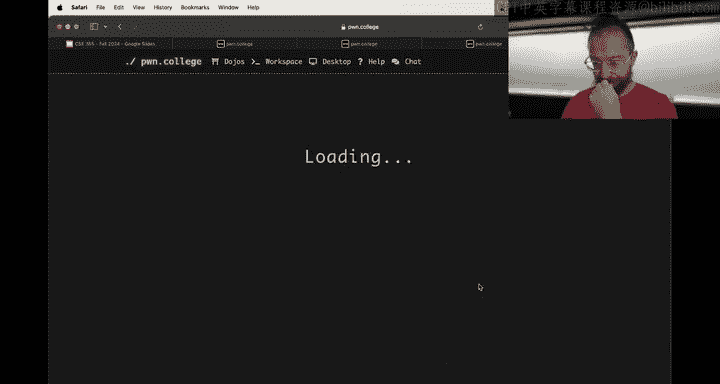

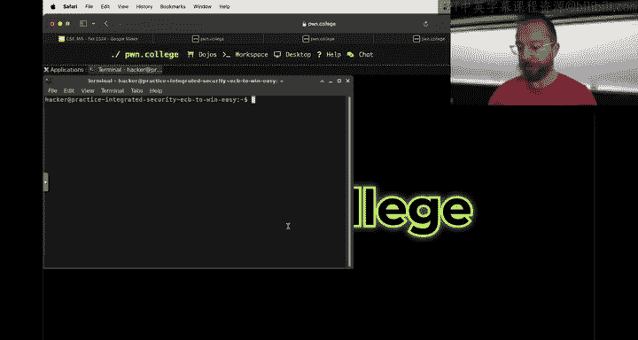

And the first level。Is。诶。A combination of a。You've seen this dispatch and worker before in the crypto module。

And then the worker is vulnerable。In a way that you need to do some crypto magic to trigger， right？

We're going to take a quick look at this since you've done。That。Bineinary security thing。

 or at least definitely enough for the binary security thing。

 like so two thirds of the class has done control hijacking。 So if you're going to look at。This。

Challenge and。Look at how we might tackle it so it's going to be a rare， you know。

 the actual challenge is open in in class sort of thing， so let's grab the challenge。

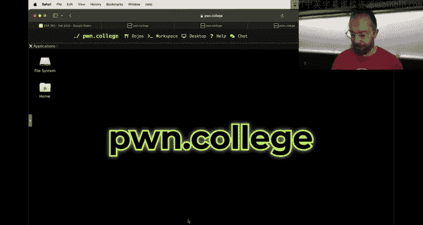

Let's first take a look at what's going on。First， we have this dispatch guy。Basically asks me to。

It'll encrypt the message as long as the message is less than 16 bytes。

 and if it's more than 16 bytes， it tells me to go away。

Similar to the dispatch stuff in the crypto module now。

Because everyone in crypto had trouble with Bay 64。And。😊，There isn't really at it。

A really solid need to put you all through that and now you're much more used to shunting around binary data on the command layer bubble b bh。

We got rid of basic 64， so you enter what you want to encrypt and encrypt it straight to the terminal。

And just eat binary data right to standard out。 You can hack dump it and you can see， okay， here is。

The encrypted。version of。Is the F？And you can see that it at the point text says verified。

 and then it gives the length of the message， then gives ASF sweet，right。

And then there's the other side。Of。U， there's no way to get the flag from this guy。

 only way to get the flag， of course。Is。Um the other challenge。

 this vulnerable overflow and in the easy version。As per tradition， we give you the source code。

And the source code is a little crazier。Then， you might have。Been used to before， the source code。

Uses。诶。The key to。De crept。Your create a decryor， This is Lib as Hael。

Implemented or this is a C a implementation of the decryption of a S EB implemented in Lib SSL。

 It does all this stuff and decrypts the message。 I tried to leave comments in here for you to make it more understandable。

 It prints a decrypted message。 It gives us our walk through of the stack and then it it exits All right so。

There's this one two punch。Right。And there's a very nice， very convenient。Wind function。

 if you scroll up， that's awesome。So we just have to trigger the wind function。

 but if you grab for the wind function。Nothing actually calls it again。Controlful hijack， right？系。So。

In mes in binary exploit。You create a cyclic pattern， you spew the cyclic pattern into your buffer。

 you see where things crash， you query the return address， and then you know， you just， again。

 one concept at a time， nice and w I was about saying nice and simple。

 obviously there are challenges。But。😡，There is a typically。More or less a single step。

 maybe when there's shell code involved， you can say it's different。 Obviously。

 AS had a lot of or crypto had a lot of different， you know， things you to pull off web but but。

Here there's multiple concepts to get through， right in order to even communicate with this guy。

You have to。Past this decryption。And it has to successfully extract the verify string。

And and the only way you can create that is by using the dispatcher who won't。

Inc messages that are too long， all？So how do we do this？Let's。Start keeping track of what we know。哎。

Soong。Notes。1。😡，The decryptor。好。Or the dispatcher。And actually， let me even back up a little bit。

All right， recall all semester semester Kening case， cyberse。Ass it almost geometry proof。Right。

 so we start out with。You know。I think therefore I am。And we。And up with。Submitting the flag， right？

Or really， we end up with。Security violation provenn。 What's the security policy。

 mean violating at and minus-1 for Po College。It's always， you can't。Submit the flag。

 Can't know the flag。 So it's know the flag。 All right。

Now that's the template for every single challenge Now， how did you fill this in All right。

 you start filling it in from both ends。 And in this case when there are multiple concepts at play also from the middle。

So， from and。Minus1， right？How could we possibly get the flag， you know。

 we did it already just kind of ad hoc， but if we go to challenge and regret grab Flagstar。Obviously。

 there's a bunch of occurrences in the source code。 and if we take a look and just go to flag。

 a here's the win function， right， and I mentioned oh， look， there's the win function。 Well。

 here it is。All the currentss a flag and the entire binary and the wind function。

Now you might be able to get the flag without the binary having the wordt flaggging and right when you will experience this。

Or have experienced this in binary security。But。Here we know one potential proven way。And minus2。

Trigger the win function， alright。Fillling in our proof。Okay， how do we trigger the win function？

Well， there's no way to call it directly。In the program。Here is the declaration itself。

 and then here's its only reference。At runtime is printing out the address and the walkthrough all right。

 so it sounds like。One potential way。As redirect control flow。To the win function。

Question mark initially， but let's take a look， is this possible？Well。

 one thing that we can check for is。What are the security properties of this file and there's a checks program or there is a depending on your personal preferences。

 there's a checks plugin in for P tools。All right， we run it and Ponttu says， hey， great news。

 there's no canary。That's great。But NnX is enabled， the stack is not executable， there's no canary。

 there's no pi， we know where everything is。So what this tells me is， hey。

 since there's a wind function， we know where the wind function is because there's no PIe and this there's no canary stack overflow。

 maybe。Right let's do n minus4。Stack overflow， all right， we're going backwards。Now。

This fact that program itself is called vulnerable overflow right it's a good hint that we're on the right track。

 but of course， in the real world。You're not going to have things named after the vulnerabilities that they're going to exhibit。

 but you know， here we are。So where is the overflow？There's one。

 scenariona filling in the thing backwards。And and again。

 I'm walking through this because this is a functionally identical scenario too。

The previous things that you've already been doing for a couple weeks， so now yeah。

 where's the stack overflow？Yeah， let's try to find it。It's going to be a stack overflow of a buffer。

Right why isn't there a length here， this is terrifying。What's that length by default？the zero。

There's got to be a bug point。No。It's impossible you I can check an ido， but Im I。Would you mind。

 all right， let let's take make a note to fix this book？呃。Yeah， I am。Anyways， here's a buffer。

Should face the bug live？Sa terrible idea。Probably we should fix it so that things make sense。

 let me just or probably it's a terrible idea。换。All right， one sec， let me fix this bug real quick。

And you can see how cool it is， how fast we can regenerate these challenges。嗯。Yeah。

Everyone's rushing to exploit the bug。Okay， hold on， don't panic。Talk to myself there。Yeah。

Ecrypt overflow。Message buffer length。And I bet I named the fucking thing messageed buffer。

I probably didn't。Didn't call super that in it。De crypt the overflow。Now。

 there's no explanation for this。Message underscore buffer， underscore length。Message and sc of。

South incentive of challenge。Okay。One sec。Just just bear with us for one second。嗯。

And this guy's called。No。嗯。It's building。No wonder。我六客。Or maybe no， no， it's solvable。 It。

 It verifies it's just a。Yeah。Okay。I might。Okay out now。Dragging on。I just want to show the correct。

Bicking thing。Yeah。We're going to disable the randomization for a second。Or at least reduce it。See。

 this is the problem with having really cool autogen challenges with。

Guaranteed saw a solvability is sometimes the guaranteed solvelvability。Doesn't。Actually。

that the challenge isn't trivialally solvble。My worry is。If this message is like8 bytes long。

 this challenge might be truly solvable without breaking the crypto， right。

 and I'm not sure it depends on the exact stack they have。 but once this gets regenerated。Then I。

It'll be all good to go。 I'll push it。It'll auto update and everything will be great。

But in the meantime， you're waiting while it builds。What's going on， Why is it taking so long？

it's building。Hundred binaries have been built。H04。How many of we have 16 exams？Oh， it's done， okay。

行。Let's make sure that we have good difference， yes。Allright。Rebuilt， redeployed。

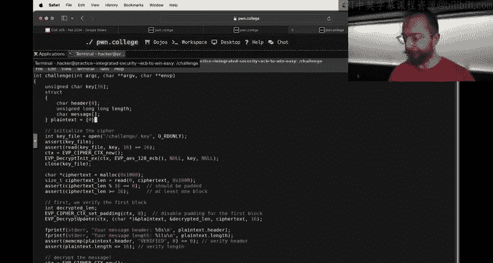

And now we will relaunch the challenge。And that is the simplicity of Poe College。I lost my notes。Oh。

Doess swap sign。

It does if you have' it configured to do so。Yes。Fim is。Good， eye。Okay。Yeah。Here is the challenge。

Here is our new message length。Amazing， all right， so we were saying， hey。

 maybe there's a stack buffer overflow。Make sense， we were covering stack buffer overflows。

It's the only overflow that you've really explored。Um。

 and there's a buffer on the stack called Message。Right？And there are two bs on the stack， right？

It might be。Header might be message， Let's first look at header， all right。Attter。

Gets printed out here。And seemingly gets decrypted right here。In the beginning of our plain tax。And。

That's the first place plain text is even mentioned before the header。It's printed out。哎。So。

It could be。This guy。Causing an overflow if you don't know yet。The other possibilities， so here is。

And-4， option 1。Haadtter overflow。TheAnother possibility is this message。Okay， message。Gets。

Reference right here。As a argumented decpt update right here as an documented decpt final X。

And then it's printed out so clearly this does something to the message on reverse engineering the source code。

😡，trying to understand what is going on。Just because I have source code doesn't mean everything is cleared。

You almost certainly have not seen this bizarre。EVP underscore decrypt update shenaags。

What the hell is that。 We'll find out in a second right now， we know， that's the only place。

That message is being used before it's printed out。And then after it's printed out。

And the walkthrough text shows us where it is， we're back looping around。Cool。So。That's interesting。

Option one and option two is message overflow ae。To dig deeper。To verify her or dismiss。

These potential options， hypotheses， let's say。We can study further。 So let's look here。Both cases。

 the header and the message。The message。Both of these cases。Are using this EVP decpt update。

So what do we do when we。Encounter a function or something that we are not sure the functionality of。

How do we figure out what this EVP decrypt update does？How would you do it， kind。

For a man page or just boom， look for a man page。Look for Man page， Google it， or askSi。Right。

 so I hit help。Oops。

I had help。We have to filter this out from the study， but that's fine， all right， I'll head help。

 I'll ask yo。😊，What is EVP。Deecret update。嗯。Sanse thinking。All right。

To function in the open SSL library used for decrypting data it part of the EVP API。

 which provides a high level interface to cryptographic functions。

And this is how you use it you prior to encrypt to data， it can handle， but this doesn't like。

Really explain enough， I can also。

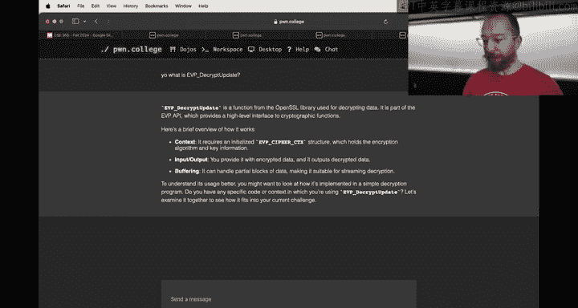

Man， EVB。I can do this on in the Dojo， and I should。To be a good citizen， man， EVP decrypt update。

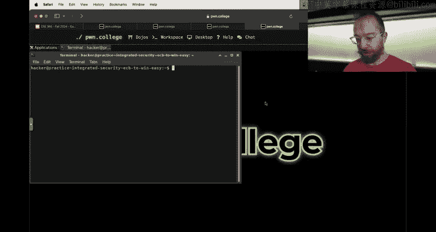

No manual entry， well that's fun。Iith why isn't there manual entry， Okay， that's fine。

 So now youll go and Google it。😊，You find some docs， EVP decrypt update。All right， here we go。Oh。

 because I。For real， it's all our。EVP decrypt update。No， still no。You really don't have that， okay。

 well。Cool， all right。Here it is， EVP decry update。A bunch of stuff。

 let's actually just search for just this file here。Okay。Soul。Derypt tonet decrypt and decpt final。

 all three of which we saw in our source code are the decryption operations。

 decrypt final return and error code if padding is enabled and the final block is not directly formatted。

Man if this was a padding oracle level， that would be great， maybe one might launch who knows。

Parameterters and restrictions are identical to the encryption operation。

 except that if addingtting's enabled to decrypt the data buffer。

 out past the decrypt update should have sufficient room。Unless the cipher block is one， okay。

Cypher block size of AAS， we know is 16。We no it's A S because we saw it in the source code I just didn't point it out。

 maybe we'd go and actually take a look。 where's the。Where did they say a yes？Descript to right here。

128 bit， 16 byte AS。ECB。But the cipher of allA is 16 bytes all right。Awesome。Okay。

 so there's something a little scary about should have sufficient room。All right。

 what is this sufficient room？Like this decryptse。诶诶。

EVP encryptry updatedate where has my source code there？诶。Derys something。All of these。

Arguments are confusing， let's ask sensei。So。第一。happ it。Why can't they because。Okay， copy this。

And we take that， oh， I didn't copy。

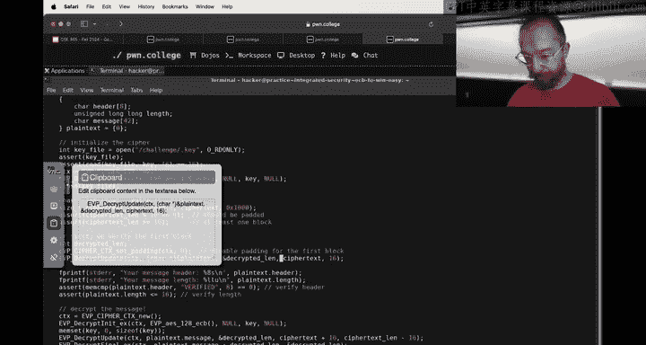

There we go，Copy this。All right， let's try to figure out what's going on here。哎。

Break down the arguments of the decrypt update function call。

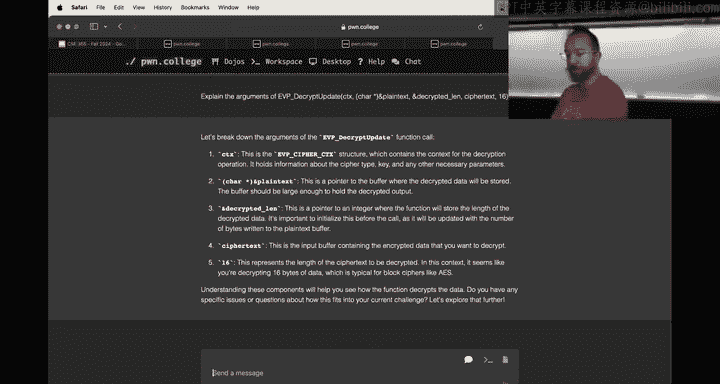

So if we have a cipher structure， the context for the decryption operation， actually。

 this makes sense if we look at。Where the cipher came from， the CTtx。Ctx here。Is that。

The result of EVP Cypress CTtx new， we can look at the page。

 but presumably it creates a context for for。Open SSL。

 it initializes it to be this AS ECB mode with the key that we read out from slash key。

 all of this makes sense。Cool。Oh yeah， here's the read that that actually initialized that key buffer。

 that's great art right。 So that's the context then。

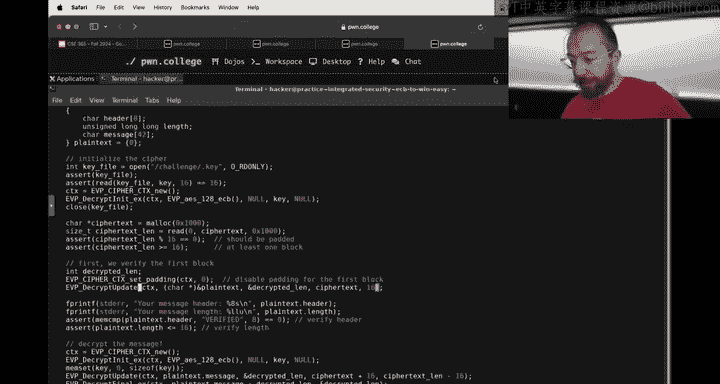

Where the sense I go too many tabs， too many levels of tabs all right pointers to the buffer where the decta data will be stored。

 So if we hypothesized that that's where。The plain text cuter initially is actually set and that's true the buffer should be large enough to hold the decrypted output alarm bells。

Deryptted length， appointed point to an integer where the function will store the length of the decrypted data。

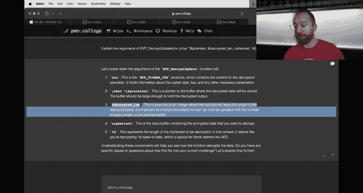

It's important to initialize this before the college will be updated with the number of bytes written to the plain tax buffer。

Okay， and then what is this， the cipher tax is the buffer， of course？The data you want to decrypt。

 so that's our cybertext， 16 is the length of the cybertext to be decrypted。All right。

 so if you're getting somewhere here。All right。So that will decrypt 16 bytes。

Ofpsidepher text into the plain text。Sttrouck here， the beginning of it。

 It's the headter and then 8 B of the length。All right。That's not an overflow。

 16 bytes into something that can hold 16 bytes。We struck out on option1。That's。Delete option1。

 Alright， option 2。 What about the message。Okay， take a look at the message。

Here is where this call is。And this is a little。Right here's a little bit more interesting。

Because the length。Is dynamically calculated， Cyphertax length -16。

And if we see where that comes from。It's checked to make sure that it is greater than 16。

That theres some message。Presumably， it's checked that it is。A multiple of 16 that is a block。

But otherwise。The length of the ciphertext is the result of how much ciphertext。

The data was able to read。 There's no bound。不是。And of course。

 if the data reads more than 42 bytes plus whatever padding。The compiler applied of Cyphert。

 we have a problem。Or rather decreases more than 42 byte a plane tax， but a yes is one to one。

B the cybertax to by the plain tax， mine is spaping。Right， buts。No length bound。

 So this seems like it could be our winner。Cool， so we're working backwards， okay。Now。

The new requirement。How to。Create a。Or let's say， let's state it and improve。We need a。

Encrypted message that is longer than。42 bys， all right。At this point。是。We figure， okay。

 if we have an encrypted method that's longer than4 to bites your gold。

There's maybe two ways we can do it。Option one。嗯。그。Is。Full the dispatch function。Option 2。Its fooled。

Vulnerable overflow。Mineary。But that。Is。Yeah， all right， and then option three。Is something else。

Okay。So。Let's start with option one。Folll the dispatch function。Because that that's the guy that。

Generates our。Our。Sign messages， right？Okay， so。What have we got here， can we move this？Okay。

That's a。hoops。Fuck。😡，I unmimize this thing。

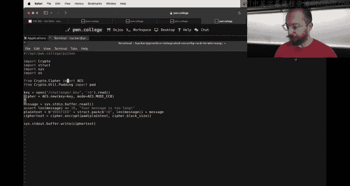

Yeah。So that it doesn't there we go， right。

How to fool this guy， it seems pretty straightforward。系。Take our message。Reads it from Standard N。

Make sure that the length is short enough and then ver it okay。All right。So let's cancel that。

Option2。Fuolll the vulnerable overflow function binary。Like， for example。But there。

 there's nothing really to fool。 It'll happily read as much encrypted。Data as we provided。

There's no real fooling。Of this guy， and we're down to option three and that option three is。

 of course， cryos shenanigans。And I leave you there in terms of。Crossing the concept。

I'm going to focus on。What to do to。Ignore the Kt shenanigans。And。Work with。And of what we've got。In。

Just a binary to at least get to a point where we can。哎哎。Triggered the memory corruption。

And reason about the mam corruption。And happily work with amendment corruption。

To prove to ourselves that the memory corruption exists and then do the curthtonagan。All right， so。

The memory corruption， as we decided， happens here in decrypt updateate because we can give it as much plain text。

 as much cipher text as we want up here where it reads it。

And it'll happily decrypt it all onto the stack。All right。Let's。Flayil around with that concept。

I'm going to give it。100 bytes of cphertext。But I'm going to do it in a cyclic pattern。All right。

 so we have our cyclic pattern。And then we will run the vulnerable overflow。

With the sic pattern and it tells us。Oh， we need Cyphert length to be a multiple of 16。

 so let's do 128。

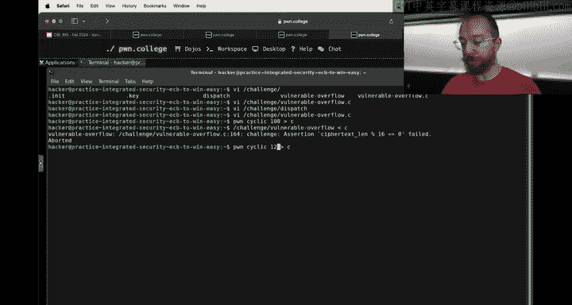

And it tells us， a。The hatter didn't decrypt properly。 Our hatter is garbage。

And our message length is garbage。Because。The header。Is broken。That's unfortunate。Yeah。

So what do we do， I can， of course。Create a proper header。This will decrypt into a proper header。呃。

Let's do it all in one thing。对。Okay， here's our message length is high exclamation point or high new line rather。

 let's actually。嗯。Do echo code dash N without new line， alright。the code message is high。😊，Lengths 2。

The header is nice and verified。But， you know， this doesn't get us any closer to overflowing the buffer and if we do the cyclic pattern into this whole guy。

Then the dispat refuses to sign it Stan we read this really annoying standstll。

 and you know what I'm going to do？I'm going to say， you know what， I don't care。

That my message length is wrong。I'm just going to force this binary to keep executing Now there are two ways to do this。

One way。Is。I run this in GDPB。While having an open， of course， an ida to see where to break。

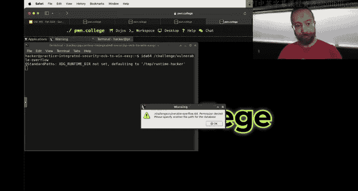

嗯。Yeah。Okay。Let's see this looks familiar， of course。This is what it is。Getting upset at。

So I could break here。And all right， break right before this test and set EA X。

 So it the uses Mecom to compare 8 by of the string S1 against the string verified S1 is。

Based on our memory of the actual source code S1 is the header， all right。

 and if the header doesn't match， then it kicks us out。 All right， great。

 so here's what we're going to do。 We're going to take this verified guy。

Or we're going to check this check and we're going to just neuter it。

The check works by testing if Mecomp returns0 that what it does when the memory matches。

 you're going to break at 401 C1 D and。Just set EAX to1 there。U to 0。 and then everything will work。

 You'll be able to explore things and continue reasoning about the overflow， so。We're going to。

Break at O x 401， What did I say 1 Cd，401， C1 D。Okay。

In to run with my cyclic pattern that I generated。And it。Didn't like something。

Or it couldn't read the key file， okay？Am I in practice mode？Yes， awesome。

 I we just going make the key readable。Couldn't read the key file， right。

 because the key file is hidden from the user。 Now it's not。 All right， so now。I bro。 seriouslyly。

 why isn't， Why don't we have a GDB net set history save on said this assembly flavor in tell。

 said height 0。 Okay， awesome。All right。That makes you to be a little more livable。

 so now break at 401 C1 D。Ron with this。 All right。 Here's our breakpoint。It's our task the AiaiaX。

Our message header is nice and corrupted， Why is it corrupted because we decrypted random stuff with a cipher that we don't know。

 but actually we just made the key。'll show a different way to mess around and neuter stuff and。

And play with things， all right。So we are here， I'm going to set RA X equals 0。And just continue。

All right。Now we got another assertion that failed， plain text minus 16， so of course。That is。

The next check immediately， it checks that the header is verified and the plain text is less 16 that the value in the in the text。

 So we're going just。Skip that。Okay， so we're gonna。Bak。At。Right here。This compare RX has 10。

 And you're just going to set RX to something else。401， C 4，4。啊。Okay， we're going to run again。

This is our breakpoint one。Continue our break point2， this is the length check。Boom。

 and we triggered a tech fault。So be successfully。Change the binary， I mean。

 change the behavior of the binary using GDP。To。Make it。Basically， trust us。And。啊。

Trigger a sec fault。 And if you look at。Where we're about to return to see a bunch of random crap and all of this is actually random crap and why。

 because if you look at the source code，Our overflow does indeed happen。Hence。

 the S fault happens right here， we could confirm that with GDP and stepping through the program。

And it happens because we're decrypting。Too much stuff as we hypothesized。

But here we lost control and we lost the ability to debug because we were decrypting thecyclic pattern。

It turns into garbage。Because you're decrypting something that's not encrypted data just。Basically。

Turns into garbage。And we can't work with this， right， we can't debug it， et ceter， et ceter。

 et cetera， but at least we've confirmed that there is an overflow。😡，So。Confirmed that。

 if we have it this。Some cool crypto stuff， we could craft a message。That gets by。The checks。

 and that wood。Fgger an overflow。 And what are the checks we need to get by。Yeah。1 is。First。

8 bytes decrypt to verified and second8 bytes decrypt to a little Indian number less than 16。

You can double check the source code to verify， but that's what we need to do， all right。

How do we do that？We're working our our backwards。 And now we've had kind of the point at which。

We're going to neuter the dispatcher because we have practice mode practice mode is going to be your friend in this module we can do pseudoviI slash challenge slash dispatcher。

And say， you know what？We're going to get rid of this check。And you know what else？This stuff。

 I forget about this length。 This is gonna be 160 and always， always 16 bowl。

And have you have a dispatchcher that' friendly to us？Using a key that we are happily。

Made read fully readable and whatever。 And again， you're in practice mode。

 The flag is fake is for us to explore how to do this stuff。 So now we can。Do our bone cyclic 128。

 pipe it through challenge slash dispatch。And now you're cooking。

Now the dispatcher is happily signing messages。Abbly encrypting messages for us that violated the security。

Of。The program。 So if we do pipe that directly into the。Overflow， the V overflow guy， set fault。

Saavve return address。Is that 818， here's 818， here's what it is。Was this， it's a cyclic pattern。

All right， let's grab this guy， owncyclic dash L。And so we patched off the crypto to exhibit the behavior we need。

We'll need to figure out later how to bridge those concepts， but for now。

 you're just pretending the crypto doesn't exist。😡，Now if we have our offset。

 why the hell is this so big？I don't know。Should only be slightly more than 42， but okay。

 that's what it is。 So now we need that we need to redirectact this thing to win。That's fine。

 so you're going to put 104 bytes of padding。Yeah。104 bytes of padding。Aley let's。That okay。

 and then we're going to put。Of course， you want to use phone tools like an actual adult。

 but we're going。Do as as as I say not as I do at the moment right now。

 we're going to do the address of when here it is。Okay， to the payload。Here's our payload。

 we hadd the payload。We sign it or encrypted。And we launch it， and we win。Cool。What did he do？

We abandoned this for a second here。What did we do， we used。Reverse engineered things。

As he made additional backwards inferences。To understand。What？诶。

Was the next backward step in the chain eventually we hit a thing where you started slicing and dicing the state of the program at runtime to check our hypotheses。

 weconfirm the hypothesis。And then we did a crazy thing。That's kind of like u。

 I don't know what's the， but basically。Sheheet。And the cheat was。Change the dispatcher。

To ignore that half of the problem。So this is a big to do， right， and I leave the to do for you。😡。

And then。Working backwards。We found offset。We did all of our typical things。

Craft at a payload with the win at her and， and， and all good， right。

And so that was a terrible format of proof， of course， but but。

The basic idea is we started with some concept of approval， then we started filling in and slowly。

And when things got tough rather than bashing our head in one concept that are， you know。

 at a time like， okay， we're going to put the memory correction on hold and we're going to focus on how do we actually trigger this。

We cheat it。And in practice mode， you can do that。Now you still have to get the real flag， of course。

Still have to go back and。Say， hey， how do I do what I did here without these modifications？And the。

Other big challenge is sometimes these modifications take you off the path of the challenge。

 Maybe you can't。Or maybe you can。Awesome top comment on T。 Right now， I don't understand a thing。

 but I love it。All right。Questions。I can't stress that enough。

 use practice mode to help these challenges in practice mode。

You can craft them to your your your your。Your will， right， If you wanted to。

 you could take this in Ida and actually patch out。 you've done this in reverse engineer。

 You can patch out。Parts of these challenges， if these checks are annoying。

 you can change this jump of below to jump of above so it'll only accept long messages or messages a claim to be long。

Um， young， why don't you change the program in that way rather than just hoping to flag and puts it up？

As in why did you make that right You could change the dispatcher to open the flag and then print the flag Right。

 right， Yeah， So you know， I could say， hey， you know what， I'm just gonna change the dispatcher。

 Forget all these shenanigans。 I'm going to open slash flag。That readed and print that crap。 All。

 And then I just launched the dispatcher。 and here's my flag。You can do it in practice mode。

You can't modify the dispatcher。In the real， if you actually launch the challenge for real。

 the practice flag isn't going to。Give you any points。

And that's a perfect example of taking yourself off of the path of the challenge。Right。

 what you want。Is for this cheat。

Step of your proof。To be viable。 So if you did， we ignore that half the problem。By generating。

A message that has the words verified。A length of 16 and a message that is longer than 16 bys。 Okay。

 awesome。Now。This let us go from here all the way to security violation。Cheat number one，-1， really。

Is。Is this viable？Can we actually。Generate this。Can we kind of turn this cheap one into just another step？

Can we do this？Right now we did it by cheating。But if you can then。

Take that and keep building out steps earlier and earlier in that truth。To not need to modify。

The dispatcher。That's how you solve the actual actual challenge if we have done this。Yeah。

We modified the dispatcher to bring the flag。 There is no farther back。

 There's no way to make it do that， at run time。Without my vicationcious。

And it also just doesn't connect to the rest of the proof Yeah， and as Connor mentioned。

 also the way it can't go backwards and it also can't go forwards it has nothing to do with the rest of my proof。

I found this bug， I'm trying to exploit that bug。Now maybe they'll come a time。

 maybe it's not impossible， we're not infallible and we sometimes have bugs in our bugs。

 so maybe there's like some scenario that's not exploitable now again we verify all these challenges for exploitability so there is a path to solve the problem。

😡，But。This is just not it， not connected to anything we were looking at and also。

Not connected to going backwards。Without practice mode。Awesome。Cool。系。Other questions？

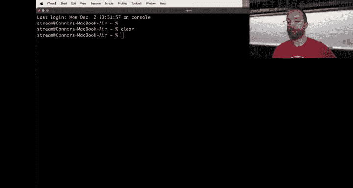

All right。That's the general way to merge these concepts， General speaking。

 use practice mode make things easier on yourself， some of these concepts are tricky to merge。😡。

For example。In。Merrgging of reverse engineering and minor exploitation。

re goingYou're going to have to reverse engineer。See image to find the Mariners。And exploit them。

How does this match to that there's only one binary， there's nothing necessarily to neuter。You can。

I would encourage you to。embracebrace and maybe you'll cover this next next class， embrace GDP。

 break at the place you suspect there's a memory and induce it manually in GDP， test it out there。

They'll cover how to do that next time actually next lecture is our last lecture right awesome。

 so we'll also do a little bit of a close out lecture next steps in cyberseity。

Little plug for CSE 466 if you love this style of education。Otherwise。

 go and tackle the final module。Goodbye， hackers。