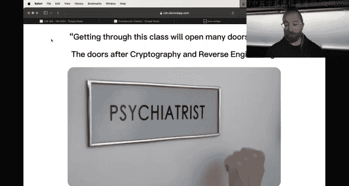
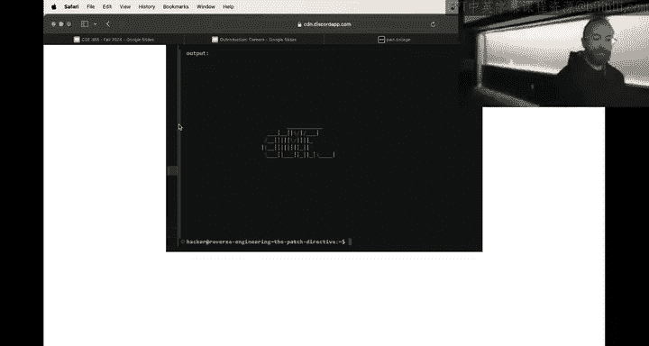
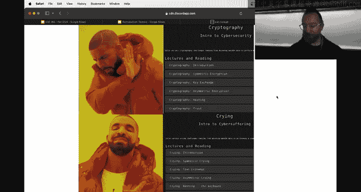
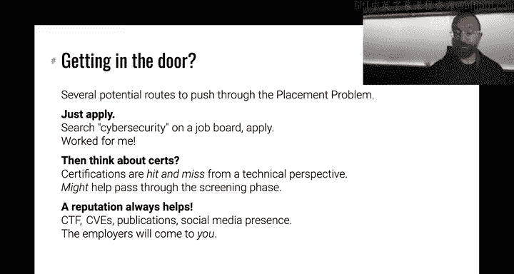

# ASU《网络安全导论｜ASU CSE365 Introduction to Cybersecurity Fall 2024》中英字幕deepseek翻译 - P29：-30-Outroduction - CSE365 - Yan - 2024.12.04.zh_en - GPT中英字幕课程资源 - BV1nVCVY9Ehy

That's just for you class。these guys don't see right in there。 Is this also。 okay。

 we've got audio on both these now。 Alright， perfect。 All， you guys missed out on all the good memes。

😊，All right， awesome。嗯。Hello hackers， for the last time this semester。

 we're going to do some some good stuff and glad ahead and do a meme review。

 we'll talk about next steps forward beyond 365 and then we'll dive into other questions on。

The challenges。 So first things first， meme review time。Alright。

 so the meme reviews is we used to have these traditionally every。Every week or so。

 we do like a review of is this thing not following me？Classic art right。Every week or so。

 we do a review of the top memes of the semester。Someone emailed the department chair and said there's tons of class I've wasted with meme reviews that are useless and so you know we we didn't have to but we stopped doing meme reviews which is a big bummer but on this last last day we'll do the meme review one last time。

Awesome， so we have a list of the top memes。 This is a terrible format。 But I。

 I was working with raw data that I was working with。

 We have a the the the top memes of the semester， all。😊，Soed by react time。

 So we're going to go through a bunch of these。Take a reasonable amount of time。

And then I have some good hype but。Sored by the react counts means some of these are meme jail reactions。

 so we're going to accidentally hit a bunch of meme jail ones， but that's cool。All right。

 first things first， top meme of the selection。Is that's pretty。 is this an actual， that's an actual。

😊，诶。诶。You think the actual songs probably Yeah probably Yeah， cryptography too hard。

 And I reverse generic。 Oh hell nowh， give me that curve。 please， please， please， That's pretty good。

 If he did give the curve。 Thanks to this meme。😊，All right， will this work no， oh， yes。

I just downloaded， okay， I don't know where video meme。🤧嗯。Don't understand reverse engineering。

Dont understand reverse engineering。I don't get it。

Maybe needed the audio Yeah audio All right next meme All right， next meme， that's cool or wait。

 and maybe I no， oh nah， nice the the thing was covered nah， yeah。

 exactly sensei Saner uses have its the one why we told sensei just meme at the students instead of helping No。

 I'm just kidding， that's a joke another video I meme what's going on here。Oh know， Okay， Yes。

 all right， that ever present Hanto Hanto is a is an honorary professor here at SU was definitely been has has permanently conquered the top of the scoreboard it's actually really cool to see interested members of the community dive in and and and。

Be involved in the education process。We've， we've had kind of top people every semester， like。

 you know。There are people from outside of ASU that are either really involved in the class。

 really involved in helping， it's been pretty cool。Okay。Yeah， should we announce the trophy？Yeah。

's over here there's someone on wish send Hanto a paycheck for his efforts we're sending him something cooler。

 we're sending Hanto a trophy that we're having made for being the top helper at the going way。

 way above and beyond so thank you Hanto you' have been awesome hopefully your trophy is is a good reminder going forward of our gratitude and the gratitude of the students。

 So if you want to put it might be too late well anyways。Give us a message。

 Maybe we'll print out a card along So like， just send send some hauntto messages of things。

 It'll be good stuff。 Allright， awesome， next me。😊，See。AsU really fucked up their wifi recently。

 it's bad Oh boom。 Oh，y， it's my meme。Yeah， this is。The， the progression of the semester as， as。

 you know， students。😊，Tackled harder and harder material and everyone's nerves started getting more and more frazzled。

 you know had we had good dreams in the beginning and the and then you know at some point all you can really do is meme and curve。

嗯。Then of course， we had the classic classic insane server issues at the beginning of the semester。

Um， have really， I mean， I'm，'m， I'm very psyched how stable things are right now with that same load。

嗯。It's actually been pretty crazy。But in the beginning of semester， it was rough and you know。

 it's just。The things you learn building these platforms that suddenly take off turns out scaling。

 there's a reason why site reliability engineers get paid like a million dollars a year at at serious things。

 Awesome next meme， someone got their summer internship。Um。

 from the knowledge of cybersecurity for realo。This this course is hard， 466 is even harder。

 potentially CSC 598 and we'll talk about future course and curriculum even harder than that。

 but these courses are probably some of the most。I don't know not to pat our own backs， but。

 but we really tried to make sure that。You come away with extremely applicable skills and real knowledge of computer science。

😡，I think that。You know， alumni of these courses have。

Good shots and good leg ups at at a number of organizations。 And that's pretty cool。

 And that directly has to do with how hard it is。 How much you have to figure out on your own。

 because， of course， we could sit you down and guide you through。Step by step。

 how to exploit whatever or how to reverse engineer whatever。But。😡。

The learning process will be very different then no pain， no gain， exactly， no pain， no gain。

 All right， that note， you know， that pain reflects in some GPs as well。 But， you know， that's。

 that's what it's like， that's what the curve is for。And extra credit。Allright。😀Yeah。

that's pretty good deal is evening plans I'm happy to have entertained。Um， and Connor。

 I'm sure is happy to have entertained。Have we got a gift， all right， what have we got。

 what have we got， oh， this was probably captioned on like yeah。

 I should have had the the discord while be with rude not like then。You have to guess what the means。

 Yeah， you have to guess whether probably the whole class。Um， all u 16 weeks。

 we forgot toum mention that we're launching a bonus， a surprise module， now I'm kiding， al right。

 um， what have we got？Oh yeah this is this， this is a meme jail。

 This is the top meme jail of the semester。 That's awesome。

 So someone went to meme jail for this meme。 classic Q A tester meme。😊。

It plastic of the semester Yeah， the most most jailed meal of the semester， All right。

 this is pretty good。あ。This is the network communications packet injection meme。

 that is a great meme。I。That's a great network communications is one module that we kind of were weren't super able to revamp for technical reasons。

 it's just it's difficult to stuff hold networks of things into the container now are at the point where I think for next semester we can we can you know make it the。

Hardcore difficulty that you've come to expect from from modules so you know next semester 38 network interception challenges。

 What do you think all right？Then we've got。466 meme， yeah， the top 466 meme。That's pretty good。 I I。

 I think that this was， was this after a curve an extension， might just be because it was weird。

 It might just be because it's weird。 Yeah， maybe it's weird， but I think this was relatively recent。

 I want to say was it has something to do with micro architectureit。😊，It's pretty good。

 So that's Rob from 466。 So those of you interested in continuous cybersecurity。

 as we'll discuss 466 is a good next step。 It may or may not be Rob， but it will be。

The nice craziness that that you've come to in expect。And then we've got this one， this one。

 I think this was the last meme review actually that we did and yeah this one is great。

That is the solution for command Eject 6。Um， pretty good， I love the the the technical means。

 all right。Here is a sensei realizing that you lied to the L O M。About the $1 million。For sensei。

Yeah， who who。Has been doing like a lot of good prompt engineering to get sensey to be more and more helpful？

诶。It's， it's， it's good if if you can learn alongside doing u the prompt engineering。

Then that's fine， right。The process， the hacking process in movies versus in the real world。

 very different。It's a。Yeah， but you know what， it's still very fun。Awesome。What have we got here？啊。

Yeah， so the classic people approach binary injection and end up with unexpected characters。

 That's one thing I。Had an even worse situation on the back end， generating all these challenges。

 right， because especially some of the binary exploitation challenges。Have slight variances。

 So solutions can be shared directly。 For example， Everything is is， is slightly differentiated。

 The problem is， as we generate these， we need to make sure that they're still solved。

 Sometimes slight differentiations can cause things to become unsolvable。

Especially when there's input restrictions。 And for example， if I use scanf to take your， your input。

 but。Critical address that you need to reference ends up at with a value that contains in space。

 you might not be able to send that a right and then you know things are no good。So。对。For。

These sort of situations， we have verification scripts that run every time a challenge is generated。

 and for various reasons， sometimes they run。The verification script runs Docker。

 launches the challenge in Docker and then talks over the socket to the thing and the socket does some stupid stuff that really messes up passing arbitrary binary data。

 so I promise I've run into this more than you have this semester， but it is an annoying issue。

All right， what else we got？Alright， that's， that's pretty good。Man， the good old man。Yeah。

 this is pretty good。This is the second second semester， or third semester of GT。thinkYeah。

 the third semester of sensei availability， but there was a time before sensei was available。

 very different world。Probably a better world， but very different。I。This one， this one。

 I guess is a good。Add on to I said about， you know， this， this。People that。Go through 365。

 466 and so on， have a leg up。mThey， I guess also have a a leg up in other areas of life。 Of course。

 our goal isn't to torture you just a side u unfortunate side effect if I。😊。

I would make more jokes if we weren't screaming to this to the world， but yeah， it's。

If he knew a way to get all this knowledge conveyed。And the skills without the pain， we do it。

 but there's no downloading。More knowledge dot com situation。 This is a good meme。 Someone's first。

 first step at sea image。 It's， it's not bad。Um，You can you can all see Cm， pretty good。

I think the C image module specifically is something that that we'll really heavily revamp for next semester we have some ideas on making it a much more guided ro through a reverse engineering I think we can we can do some cool stuff there All right。

 what do we got here。

Yeah嗯。The concepts keep building， getting tougher and tougher。

 so who thought web security was pretty hard。Nobody that's good And then who thought that integrated security is difficult。

Alsowesome， nobody。 listen。 All right， well， maybe this meme is fake。That's cool。 onwards。 Al right。

 another video meme。😊，Okay， got the win address。This is 466 meme。This's pretty good。

 thiss a high effort meme。H。That's really good。😀。😀はは。😀ふ。😊，あか。Pretty good。 That's great。 Al right。

 that's， that is a high effort for66。 So in in 466， the critical thing， unlike in 365。

 where you have not had to leak memory。😊，In CSE 466。Third。Huge sources of randomness。

 big mitigations applied against exploitation， modern defenses that you have to bypass。

 and in bypassing them， of course you understand their weaknesses。😡。

So if you're interested in this sort of stop， definitely take 466。All right， what have we got here。

 another video meme？Maybe wrap up the meme view at the top hour。I didn't click， oh， that is for some。

 the videos don't。Yeah， here's the next meme， I。Yeah。At some point。

 people started realizing that they can bypass meme jail in exciting numbers of ways and that was pretty good。

 this was a redemption， good redemption。U this one is a good video， meme。

I recently I was trying to find something else on the discord and I stumbled back onto this meme。嗯。

Professor Janwn， the wise。嗯。I guess we should probably have audio in the future。

I love the head turning that this kid does。Anyways。We're running out of time。

 we'll cut this one short。This sounds pretty good， though。系。What do we got here。Ah。

 this is also a 365， 466 meme。I don't get the meme。s becauseOh， I do get the me， Okay， yeah。

 it's because I was a bit of a boomer moment， but yeah， it's definitely， all right。

It wasn't the standard image。Al。诶。Nice， so it's interesting in in in capture clock competitions。

 you have different。😊，诶。Abbreviations right so web for web security that makes sense rev often for reverse engineering and most of the time crypto challenges are just called crypto but sometimes they're abbreviated to cry so I like this meme because of that that's pretty good crypto was definitely a module where I think we overshot clearly the difficulty level。

 the ended up curving it you overshot it mostly because of kind of the padding oracle attack levels I'm sure the people that did them thought they were super awesome and then after the type 2 you know fun manifested or resolved let's say but probably don' need to pull out patting oracle attack or somehow ramp it up a little nicer。

Well have to think about it，e。Yes， this is the。The integrated security module。

 the only module you haven't didn't manage to pull in。Really is the intersing communication。

 So I think this says the only true module， of course。

 computing  one0 one is a ramp module into reverse engineering and Linux luarium and and and talking web or ramp modules into web security。

 but。😊，Yeah， it's good I I all on this note。We had earlier said we're going to launch two more challenges because we're trying to get that that networking stuff in there。

I think it's probably going to be right tonight， but we won't launch it for the class。

 we'll give it a couple of weeks after the class is over。

 we'll add it to the module for future orange belt Hopes to encounter it's going to be awesome。

It's good for your grade。 We're not launching。 Yeah， it's very， very good for your grade， but。Um。

 I I when Connor's designing it when he's， u， he， he told me about it。

 I told him most Hanto is going to have a good time solving this one，um， but it's very cool。i。😡。

This is pretty good this class of means yeah， so binary exploitation of course we talked to reverse engineering for a reason a lot of reverse engineering happens for intercompat or interoperability and all of this you know other good。

😊，Noble goals for bug hunting and that's what you were doing kind of in reverse engineering for specific exploitation subtleties。

Or in exploitation Yes， that was pretty fun yeah， this was this was a good moment maybe maybe keep everything as hard as it was and make things even harder so then we can curve and like yeah。

 I've also had an idea to revamp some extra credits so that instead of like just a pot right then it explicitly made up what you missed in modules。

😊，It could have the same effect， but。A different we often hear like it's unreasonable to require all of the challenges。

so why don't you like make 100% like you get an A if you solve。70% shy。

 well then why have the others Id like。all right， and then probably last meme。This was u。

One of the holidays for fall break， probably fall break and it's you know。

 the time spent indoor at your computer suffering with 365， that was actually its own reward。

When when when the smoke clears and all said and done。I， I， this can be the last one。What is it。

 I think it's another one we're missing the caption。Looks like the wizzle。All right， anyways。Cool。

what have we got one more？So got， so got a minute。 Oh， that's the same one can I tell。This guy。Oh。

 this guy got me jailed。 Yeah， there is the second top jailed。Mim。

That's a good 466 mean real'll end there as a little preview to 466 when you know。

 your exploits don't work and sometimes it is fundamentally impossible to debug them。

Here in this class， it's been fundamentally possible to debug。

 Most people avoid debugging things like the plague， but it's possible。 All right， awesome stuff。

 If you too want to do your own meme review at home。Do it， and。Go through。Yeah。

 have fun Tell us what your favorite meme is All right， on that note， let's talk about。

What to do beyond 365 this class ends I think everyone's going to be very sad probably most of the class wanted the modules just to go on and on Of course the good news is they do go on and on you can go on。

To get an early start on 466 material as people frequently。诶。Go off in the discord。Complain circles。

 you don't teach anything anyways， so you might as well go on and move on to the next material and keep keep learning because when。

there's this one of my initial philosophies when I started as a professor that you can't teach cybersecurity。

 it has to be learned right and that influenced some of the design of phone calls did these challenges。

 et cetera now。I do think we teach， but you know， there's obviously that's a subjective viewpoint。

 but the whole thing was designed so that you know， you didn't really need us。

 you just need the challenges that's。And they're there， they'll stay around， all right。

 so somehow through some fundamental failure of ours， even after this entire semester。

 you still want to be a hacker。Right， I wanted to。Convey a couple of options your。

Trejecty moving forward and what you can expect out of cybersecurity as a lifestyle， as a career。

 as a passion or as a hobby。Um。哎。First， we'll cover how to keep learning because what we've taught you is a lot of cool fundamentals。

 but as the course says， it's an introduction。😡，And that is an introduction。

To enable you to go further， right。How can you dig in so who here did any of the CTF archive for extra credit？

😡，Nobody。 all right， awesome。 Well， presumably someone else did because we've been handing out CTF archive extra credit on phone College。

In the CTF archive。You go punk College， you scroll down。You click， nope， that's the wrong archive。

 you click here。And you have 541 challenges。From cybersecurity competitions。Over the last 10。

 12 years or so。Rehosted an accessible inp College。And each one。There's some poning ones。

 by exploit exploitation， there's some reverse engineering ones， some crypto ones。

They all have descriptions。They all have。Links about， you know。

 the CTF with all sorts of good information。All of this stuff remains available for you。

 and if you want to continue building your skills。You can go look at older CTF challenges or。

 and I'd highly recommend this。Dive in to live CTF challenges。As they happen。

 CTf is captured the flag， you're familiar with the concept of capturing the flag now very painfully familiar。

 go to ctftime。org。Here is the next。呃。Weekend of CTF right here， so there is snake CTF coming up。

 platypone， a bunch of other stuff。Make a team with your friends。Compe in Etf。 It's super fun。

 Or go and tackle the archives。 There's also other sites that have practice and educational problems。

 I maintain a list of them on。😊。

get here or at wargame。nexus for a nice better rendered version of it， go to the wargame Nexus。

 if you're interested， for example， in learning about crypto。

 there's a site cryrypto hack that will teach you a lot of awesome stuff。

About crypto and also has crypto challenges， crypto courses。

 all of this good stuff if you're interested in learning about。

AI security stuff。 Here's a bunch of prompt injection。 All sorts of things， right， are here。

 All right， cool， So this is for continued practice of the skills。

 like this isn't these aren't classes， these aren't theres all selfguided， super awesome stuff。

 But as we'll talk about， you know， as you dig into CTf more and more and more。

 you really build up knowledge。😊，Reputation and， and and more and more passion at the end of that journey is the Olympics of hacking Deafcon Ctf takes place every year in Las Vegas and。

😊，We used to host it me and Adam Dupe and Tiffy B and our awesome team。

 those are theU professors and an awesome team of just incredible hackers at ASU and beyond and now。

As we， after we retired， it's hosted by a team that includes Fish Wing。

 Another awesome Asu professor who here has taken a course from fish。 Well。

 probably nobody because yeah， he must。 Yeah， anyways。 So also an awesome ASU professor， but。😊。

Involved in organizing the Olympics of hacking， this is what that looks like this photo is I think from 2019 and some of these are ASU students。

 this guy is now an ASU PhD student then an undergrad teams of hackers descend on Las Vegas and just to sit at this these computers for 72 hours。

Quietly typing at their keyboard and staring at their screen。 It's awesome。😊，So。

CTF is the journey to that this。Yeah。It it's an awesome way into the cybersecurity community again。

 that that pays not only is its own reward of pays dividends beyond that all right。

 how else can you learn about cybersecurity where you can start。

Applying the skills you've built up to actual cybersecurity。😡，Not quite challenges。

 but like realistically challenges so。We have a bug Manny program for this course someone。

I should have to go back and make sure that we've applied there。Extra credit。 But we， someone。

Submitted a really cool vulnerability to us， for example。

 that would have allowed anyone to leak all flags on the platform， for example。

 or less insane vulnerabilities went our way as well。Many other organizations have bugman programs。

 so if there is an organization that has a bugman program， for example。

 Facebook and you find a bug in Facebook and you report to them。😡。

Following the rules which usually say， hey， you have to report them to us no one else， et cetera。

 et cetera， et cetera， basically look up the the bug boundary rules for those。Platforms。

 you they can pay you good money right， you might get $300 you might get $30，000。

 you might get a million dollars if you find a zero click remote exploit against the latest iOS version start taking and gain the capability takeover iPhones。

 you report that to Apple their bugman cap is huge。You're probably not going to do that with。

Knowledge with just the knowledge you learned from 365。

 but especially like web security and these sort of stuff things you can start。

Reasoning about security and these platforms， especially as you dig in further and further in your skills。

 this could be a great way to both keep learning。And turned this into a cool side gig。All right。

 if you do that， you start looking at vulnerability。

Programs at systems and trying to find vulnerabilities。What do you do， Sa E fond of all。

There's a quick tangent， I think we covered this at the beginning of the semester and the ethics lecture I want to cover at the end of the semester。

Just to reiterate that if you find a vulnerability， if you can hack someone's Facebook。

 don't hack someone's Facebook。That is a。A very。Good way to kind of end your career before it begins and it's just not an ethical thing to do you can do a number of things with that vulnerability that have various levels of。

😡，Acceptance and kind of global ethical judgment。And of course。

 some of these are intentionally inserted as unethical things， but。you have a bunch of options。

 One option。 And this used to be kind of the typical thing you would do is you found a bug and you just tell the world。

There are mailing lists for tracking these bugs， there's Twitter， there's all sorts of stuff right。

 so you find a cool bug and you say hey， here's the bug boom。

 drop it on Twitter nowadays this is considered to be bad form。Maybe from a given perspective。

 you can have arguments that it is or isn't ethical， but it's considered kind of a。Not a great move。

 right， Because it puts。A lot of people in bad situations， right if the bug you find as， you know。

 a vulnerability in an iPhone， well suddenly you've put a lot of people at actual risk of harm。Right。

 people living in oppressive regimes that might worry about their own government hacking into them。

 people getting hacked by cyber criminals， et cea， et cetera。 everyone is。Watching these， you know。

For these sudden disclosures， right， so not typically done nowadays。诶。But you can argue that， hey。

 you're giving everyone the same you' giving the Apple the same runway to fix things that you're giving the attackers to attack things。

 you know， it's typically not done。 nowadays， the typical thing is responsible disclosure。

 So you find the bug and you tell the company about it。 and sometimes they will compensate you。

 and also， they will award you with。Basically， scores on a global scoreboard of bugs found。

 which is called CVE， a common vulnerability enumeration number。Right so they'll say， hey。

 congrats you found bug number 202403975 right and that becomes something you put on your resume that' like。

 hey， I found this awesome bug right， and that'll be like oh， shit。

 this person's found this awesome bug。Its can be useful， you know。

 it'ss good resume fodder and of course， as we just said。

 they often reward you with cash money as well I know people that make a living doing this right because of course finding that $1 million dollar bug is rare。

 but I know people for whom finding an $80，000 bug is not where and you find a couple of those a year and that's a good living。

Now， interestingly， responsible disclosure used to be not done。Why， because back back in my day。

 So back when I was early college or something， if you found the bug。And。For example， Adobe PDF read。

 I don't know something。And you disclose it to them。 They would sue you。

They're like why the fuck are you hacking our shit， right。

 we're gonna sue you for So people didn't disclose things responsibly。 and then of course。

 as a result， weird situation started out where people would disclose things irrespons full disclosure etc。

 So then companies realize okay well they're making things worse by having the hardlight stance So now theres really by the time I was in grad school responsive disclosure was a nice well accepted process and remains so today。

 There are other things you can do there's actual kind of responsible zero day contest。

 you don't want to disclose it to company and be kind of at their mercy for like how much they'll pay you or whatever their contests like one of them is pne to own that say。

 hey， here's a list a set of devices that you know the vendors have agreed etc。

 Here's that gear router here's a Tesla etc etc ce。

 if you can hack these things on stage in like you know。Big event。 Then you will。

Award you with some predefined award formula。😡，And。You probably still get to see the I。

 I'm sure you do but。And the promised that like your bo is。

Or where your bug will end up on typically right to the vendor to get fixed And it's super cool an interesting thing about these these contests is it's also the vendors will rush to find and fix as many of their bugs they own because they don't want to fail on stage either because it's kind of you versus them and so oftentimes like the day before the competition there's like a security patch release per nu gear fixes like。

Thousand bugs and like half of the contestestineants that just flew to whatever。

 wherever Pontone happens to be held at that point。Their bo is dead now。 just are super interesting。

 All right， cool。 of course， something you shouldn't do is sell the bug on the black market。

 There are entities I also have， let's say， friends of friends that have been in like shady nightclubs。

 the Cd individual selling， you know， like the the the the opening see， you know。

 the matrix or whatever one of them where you know。

 they knock on Mio's door and he's selling them a USB stick or whatever Cd with an exploit like。😊。

That stuff actually happens in real life， which is crazy， but there are also intelligence agencies。

That might fit more into your ethical framework that are also interested in this informationform and so on。

Alld。Things that really need to be considered in the framework of legality and ethics That's too often。

Things that often agree sometimes disagree all right。

 but how do you get good enough for all of that if you're not good enough to find if you don't have enough skills。

 you're all good enough， but if you don't have enough skills to find real bugs to make a living in security and other ways that we'll talk about well。

 you can keep taking classes actually， I would say。

If this course has given you enough knowledge to start tackling Captain the flag contest。Do that。

Don't do that instead of classes， but make sure to do that that is redesigned our classes based on our experience。

 learning security and our experience learning security is predominantly through casual flat competitions。

😡，The classes。Our class are designed。With inspiration from that， but you can still go to the source。

They're daunting， but they're awesome。Oops， I meant to put this in 365 if you。

You not have your CSE 365 grade？Of course， were welcome to come back next semester。

 we got some good changes planned， that'll be fun。Otherwise。AsU has a lot of security courses。

 a couple of cool shout outs CSE 466， I mentioned it before。 it is， let's say a direct continuation。

Of the last four modules。We did Comp 101， reverse engineering， binary exploitation。

 integrated security。That's what you'll start with in 466， and you'll keep going into much。

 much more。 Like I said， advanced mitigations， bypasses。Whole the security of entire systems。

 It's very fun stuff Later down that ramp for a direct continuation of that。 Look at。

Software exploitation， CS C 5，98。 It's a graduate course。

 but anyone that has done for 66 and done well can take it as well。 It is。

Very deep into really cutting edge mitigations， other security ideas。Just。

 just crazy exploitation stuff coming out of 598， you can the the the goal is that you can sit down at any security job。

And boom， it'll be cool， ae。嗯。Another cool class to give an eye out for it grant this semester。

 but maybe by the time it runs again， you guys will be ready applied vulnerability research talking about real code here you've been tackling small programs we wrote。

Right， even the biggest C image， the source code was maybe 300 lines of C， right。

 and that's limiting in terms of how much。Knowledge you can truly get。 You don't have experience。

 for example， reverse engineering， a real giant program。

 That's megabytes or tens of megabytes in size。Applied vulnerability research deals with targets of this magnitude。

Right and that is a super cool thing that I highly recommend if you run a bunch of other security classes on an ad hoc basis。

 if you're interested in data security and privacy。

 there's a 400 level course on this softwareq and testing approaches has security process approaches it much more from the developer point of view。

 then the security analyst point of view network forensics， if you are interested in a security。

As it's often done in the law enforcement， for example。

 world where you just like busted a criminal and you have their computers and what do you do。

 how do you extract information that's where you go there lot of really cool stuff to keep an eye out just basically search the course catalog for security and every chance you get because I know everyone here now is like desperate to do more security stuff and let us know oh。

 I forgot we have a forgot to put crypto on here next semester。

 I'll just give crypto a shout out 539， I believe cryptography。

Being revamped next semester it'll be on Poone College if you enjoyed the patting Moracle attack。

 this is the course for you if you are a very advanced undergrad and you just really want to take that course。

Let let us know and and we'll。re there are ways for you to be allowed to take a grad course， okay？

Awesome stuff now。What else can you do in school？To dive in and move forward with cybersecurity。

 well， you can actually join us。Join the dark side join our research lab and do some cool research。

 I mentioned this at the beginning of the semester， anyone that gets a belt。In Poong College。

 I want to talk to you if you're interested in doing research。

 seeing what undergraduate research is like at ASU。😡，It's it's really cool。

 you got a lot of neat projects that hopefully are undergrad sized， a lot of them have to do。

 for example， with home college and teaching cybersecurity a lot of them have to do with analyzing programs automatically to find bugs a lot of them having to do with understanding what cybercrimins are doing on the internet in terms of ph and scamming and all of that fun stuff。

 So anyways you got your orange belt and are。😊，Interested in this material， let us know。All right。

 and this actually also applies to non ASU students following along worldwide。

 so if you guys are out there。嗯。Let us know okay， question on Titch。

 do you get a belt from passing the class or is it a result of solving all challenges。

 it's a result of solving all challenges that were assigned except for computing 101 is not a belted material it is from the white belt material and Linuxux luminarium。

But I'm sure that if you have solved。The later levels of buying exploitation， than。

Computing 101 is not a。Difficult for you fine。Awesome。

So keep that in mind now talk about more ways to make a living out a cybersecurity。

 like an actual living， not a side gig where you， you know。

 might earn some money finding bug boty things。Number of different group。

 this is far from an exhaustive list。 It is a couple of options that you can consider digging into One option is something called the penetration test。

Right。Pen testers are。Hired to。From the outside， as an external entity， like an attacker。

 evaluate the security of a company system。And you evaluate the security。By breaking into。

And it can be a really cool job like， you know， their pan testing stories where yeah， you know。

 I was hired by this bank and so I dressed up as a like a new employee and convinced them I was an employee and then I got access to you know their network and then I started scanning for vulnerabilities and I found this and you can do like movie style stuff typically you don't do movie style stuff that the reality of any job is a little less glamorous than than the you know craziest scenarios of course。

 but。The the pros is that it can be actually pretty cool and diverse。

 The cons is that the day to day reality can get boring you know your。😊。

It's rare that you find absolutely new types of vulnerilities， et cetera， cetera。

 You typically a typical penetration testing finding is like oops。

 you're running an outdated or a misconfigured system in this very standard way that I've seen a million times over。

 and the people that I typically。Talk to who leave penetration testing for different career path。

 That's their biggest complaint as it's scanning a lot of scanning for unpatch system and writing up reports and the time pressure could be stressful but。

It is a really cool hacking career with a local president。

 there are local companies that do penetration testing。All right。

One alternate career path and this was me before graduate school actually is large companies have in house security engineering teams right I used to work for a large US bank and it was a really nice cushy job。

That that was like， hey， you have this big system in the bank that does something very critical for legal and financial reasons。

 and we need to make sure that this thing is safe。And the downside of it for me was I was dealing the entire time for years with basically one system。

 multiple components， but one system。You know， can get a little old at some point and and。

 and even in a much bigger organization， let's say。We lost this thing。

moving so much in a much bigger organization， you know， like u I don't know。

 let's say Adobe's security team， there's still a finite number of things to look at the larger organization。

 of course， the larger Microsoft security people probably don't feel like they're。Unless they are。

 you know， it is like a team like you guys are looking at Microsoft office all day， every day。Yeah。

 it's the other con is internal company politics， as with everything can get in the way。

 but the type of stuff you typically do depending on。Exactly what the job entails。

 oftentimes you're scanning the company's network to kind of do something similar to what a pen tester might do。

 Sometimes you're actually building custom tooling to you know， interact with with company products。

 all of this stuff and many， many， many companies， any any sufficiently large company is gonna have a security team。

 Look at any bank。Any large software vendor， they all have security engineers。

It's a pretty reasonable job the government also has the public sector has security engineers as well I have a big need for them。

Of course， the big pro is it's an extremely stable gig， traditionally at least。

And you typically have。The time that you need to tackle stuff and mostly the resources。

 but of course the public sector has cons， compensation is different in the public sector than private sector and a lot of these specific specifically in cybersecurity。

 a lot of those careers require US citizenship which is an additional hurdle or a security clearance and the things you do are similar to the internal you know industry security engineer case。

Now we talked about bug bos。People that that make a career。In that。

Tend to build or join companies where there's nowadays。

 especially a group of people that all want to find bugs in various software， novel vulnerabilities。

 these are like。You know， the， the， the cyberse rock stars like。A very。

 very high level technical ability wider amount of targets to explore it is it just。It's a cool。

Seeing with， you know， you， your brilliant colleagues。

 and you're trying to break into Chrome stuff like that， right？The con， it's probably。

Very close to what you've been doing so， you are a one person vulnerability research team looking at these tiny programs。

More people， much more complexity on the targets， you get kind of the idea。

We have some iterations of our 598 applied vulnerability research class we actually split into teams and every into groups every group was a vulnerability research team and they picked targets that class runs in various ways。

 but you know it's it's good stuff the downside is。Depending on。The structure of the team。

 if you don't find the bugs you， you don't get paid。 Some of these teams depend。Directly on。Getting。

Money for these bugs。 and then money for these bugs。 There's a huge。

Temptation to sell to increasingly far away entities from the original vendor。

 and that has a big potential for drama so。An example of drama that you covered in the beginning of the class is hacking team。

 right， which sold tools containing exploits for other for for the technology they found exploits in to。

Potentially shady clients。 And this all blew up， right， but it。

blowlows up more frequently in less spectacular ways I think another example is。😡。

What's the company that？NSO。recently sanctioned by the US for selling exploits to various entities。

 You know， it's there's just a lot of different groups。 But there's also kind of a。West。

Extreme examples of of of。These groups Cisco Talo， Cisco had the presence in Phoenix at some point。

 Cisco Talo did but it's a vulnerability research lab basically inside Cisco， nice big company。

 not the same profit motive that。Causes situations like hacking team to happen and it's's a cool career probably to pursue that。

466。Some of these other courses is the path there。Awesome。And of course， you can do that。

 but go freelance fully on your own， go to Po to own et ceter and mentioned this several times。

 you don't have audio。 But if you'll play this， this is my friend。嗯。

Should I it's his name Paul anyways， handle ACces he hack the Tesla and one with his teammate and won Po to on Vancouver a couple of years ago and there's a whole thing and is much more impressive with epic music and actually hear what this guy has to say。

 but if you here we go。If you， yeah， Florate is his team， that's his。

Teammate and he's in the backseat。There'saces right there。Right there。

 and they're about to hug this Tesla and boom， they hug the Tesla。 everyone shaking hands。 day one。

 get plenty of money。And they also win the Tesla。 I don't actually know they them。

I think either of them lived in Canada so I don't know if they got the Tesla or they left the Tesla there but very fun stuff and it's it is a viable career。

 but it's also a stressful one right you you know again。

 don't find the bugs you don't get money and the other interesting thing is there's。

On the face of it's like， hey， you could go and you can analyze any software out there and like find bugs in it and figure out。

 you know whom to report it to and so forth。 But the reality is as you get more and more familiar with one piece of software。

There is this incentive for you to keep looking at it。

If you know so much about Google Chrome that you can find all the bugs much faster in Google Chrome or the Linux kernel or whatever。

 and there's an entity， Google will pay you for bugs in Google Chrome。

 you might look up a couple years later it' like all I've been looking at is Google Chrome because that has the most return on investment for my time。

 but maybe I'm bored of that right now you have to start over anyways。😡，Some cons。All right。

A really cool career， of course， is a cybersecurity professor。A lot of a lot of pros there。

Academic freedom you're going to work on whatever the heck you want as long as you can get someone to fund it luckily cybersecurity is a very hot topic right now and potentially in the foreseeable future so there is funding to do really cool research in cybersecurity another pro it's unfable once you get tenure right so it's very you know secure position it gives you freedom to experiment with for example。

 learning styles。Right嗯。If I。You know， a student。Or several students get。

Upset about a teaching style and email the department chair that's。

Much more scary if you don't have tenure for example right。

 but if you have tenure it gives you some freedoms experiments so teaching staff and with research areas。

 you can pursue a research area without worrying thaty if it doesn't work out。

 you know my employer will let me go for not having results。There are cons to that， of course。

 Anyways， it's super awesome， super awesome to constantly be like involved with awesome research pushed forward by brilliant students。

 you get to do stuff like Po College right， So that was Connor's dissertation work as a PhD student and I got to oversee。

 it It was super awesome。 But of course， the con is that the。😊。

Public market pay public et cetera again pays a lot worse early academia is a complete shit show you have to get tenure to get tenure you basically have to work yourself to death and then you know when students do email the department chair and say that this course is a piece of shit and the professors are asholes then you have to spend a couple hours。

Explaining how the class works to the your department chair that can be。

You know cost you some concrete number of hours of sleep unfortunately throughout the semester anyways。

 on the other downsided of course， I want to say that the tooling that the stuff I get to do on a daily basis is school hacker stuff。

 but for the most part I make slides and I write papers and I write reports so good stuff but it's。

A very fun career。I love it。 High recommend。And everyone here becomes a CS professor。

 but then we'd have probably a job crisis， but。嗯。是。

The path toward there is probably start doing some undergrad research and the path to that is get your orange belt。

All right， anyways， tons of other choices。 that's all that we really have time to cover。 actually。

 I think we what time is it Okay， yeah， so the class is basically at an end。

A lot of career path that don't require the crazy stuff that you've started doing toward the end of the semester。

 right， you can be a cybersecurity professional without doing any binary exploitation。

 believe it or not。😡，Various， various things that you can do。 You can。

Be a threat analyst like in a security operation center or。

Something like that where you oversee the security of a company like an internal security engineer。

 but you're not analyzing the security of their actual products， etc ce cetera。

 analyze the security their actual network right the actual everyday security like hey。

 here's a connection that we can't explain this sort of stuff this is a huge sector you don't discuss it much take network security and maybe to a smaller extent forensics to learn more about this it's a very cool viable career path with a lot of availability in cybersecurity you can also go into management。

Right， there's a huge demand for people that。Have managerial skills and know at least some technical amount of cybersecurity。

 Right， So probably the skills you have from 3，65 coupled with an。

MBA could potentially be a successful combination。And then at the tail end of the far end of that career path is emerging C suite position。

 the chief information security officer who。Overseas kind of the leadership of the cybersecurity posture of a company。

Their main。job is to get fired when the company inevitably inevitably gets hacked。

Because you got to have someone to blame， but somehow that's definitely not career ending for them they just like。

 all right， you go， they take that that bullet， they move on to the next company because。

 you know the best Caw in the world or the best security team。

 the best everything can still get hacked right and these hacks can be pretty brutal as we saw with the hacking team example at the beginning of the semester anyways。

Whatever you do， cybersecurity is a very， very。Lcrative。

 rewarding and realistic direction for your career。There is something called a cybersecur skill gap。

 right， There are millions of unfilled security jobs。including in the US， probably I don't know。

 I don't have that latest number， but I wouldn't be surprised if like there's a million on unfilled security jobs in the US like postings。

There's a lot of potential there and it's growing constantly。

 you more and more and more so it's it's a cool feel to get into。

Um how do you get into cybersecurity I got cybersecurity professionally just literally by searchingging for cybersecurity。

 I actually didn't think that cybersecurity was an actual career path my dad tried to convince me took me to one of his colleagues who。

Sad cybercurity of prevent。 I， you guys are all old people。

 You don't know what you're talking about or what do you know about。Computer science。

Other than when I was graduating because I had been doing cybersecurity stuff。

 I searched cybersecurity and boom。Tons of jobs applied。Got an offer grape。 you give it a try。

 If you think you're not ready。Probably it's imposter syndrome talking flood if you really want to。

Build up skills。 again。 We talked about how to do that。 If you want to build up your resume。

 their certifications that may or may not help。 I'm not a big certification fan， typically。

The more technically capable someone is， the less they care about certifications when they're hiring people。

 but certifications。Do help。You get through less technical kind of HR。

People that whose job it is to filter out your， your Cvs， the biggest。

 most important certification remains to this day， your bachelor's diploma。 right。 So focus on that。

I had no matter what anyone one else tells you。For sure。

 there are places and job directions and so on that you can get without an undergrad's diploma diplomaman。

But by far， the biggest differentiator between I got filtered out of this job application and I got this job application is an undergrad diploma。

😡，And I've I've been on multiple。On other side of the table where there was someone I wanted to hire。

 but we couldn't because they didn't have that degree。 So get， get your undergrad。

Get some search if you feel that you need them。Keep going。

 Do your CTfs build up a reputation in the scene。And employers will come to you。

Any questions？

Yes。What should we do over winter。Oh it's a great question， what should you do over winter break？

I would overwin a break。There's a number of CTFs， One is typically there's a big German。

Conference CC chaos， communication Congress， they have。Typically run a CTF。Just go to CTF time。

Monitor the upcoming cs it's typically on like the 28th of December it's it's like the worst potential scheduling of any event you could possibly imagine。

 but it's。It's， it's there's a whole bunch of Efs。 That's one thing。

But CTFs are one of the goals of this course was to gradually ramp you up to CTF level。

Probably that's more true than a 466 or maybe at then a 598。

 but actually what we even have at then of that is a little mentorship Academy where we take the blue bouts and then we rampm them off to CTF。

 so CTF can be quite done。I would still recommend doing it。

 maybe you are have that that that grit to still bang your head against the wall， right？If not。

 there's also other Morgan type size。 So what was your favorite modules in。The class。

Crypto so go to crypto hack complete crypto hack over the holidays that will will take you much more than the career break or and if it doesn't。

 then come talk to me， I'll introduce you to some crypto cross that would love to work with you， but。

😡，That's the next step for crypto。Actually you should probably have next steps per thing。

 the next step for crypto is crypto hack， if by the was your favorite one。

 the next step is the later Po college material。The yellow bug material or sites like pawnable dot Kr and pawnable dot T W a lot of pawnable sites reverse engineering has。

 there is well， go to war game Naez and check it out。 There's a reversing that。

whatever it's all I'm going next， yeah， so it's it's these sort of things。

 but also sprinklely and CTFs in there that's especially if you have a group of people that want to do something。

Cool， other questions？Allright， final thing， belt ceremony on Tuesday next Tuesday at 3 pm。

 we'll announce a time on the discord so if you have your belt by then。

 if you earned it earlier in the semester or if you earn it between now and then，Come and get belted。

 You'll see some awesome yellow belts， green belts。

If you have any blue belts locally since last time maybe yeah and hopefully plenty of your peers getting their orange belt so Tuesday。

 3 pm you know hold the time if you can't make it you won't be participating the same when you can still get your belt。

 just let us know anytime between now and the heat death of the universe will get your belt to you we ship belts once you earn your blue belt。

 we just ship you all the belt， but in person you can come by anytime。Cool， al right。

 question on Twitch。 what about try hack me or hack the box， Those are cool options as well。

 Absly do them。 I don't have much experience with them directly There are I think three or four。

Of this genre of war game site like box style war gameme sites on War game Nexus I have another one hack this VM or something。

😡，Check it out yeah， they they vary greatly in what they explore。

 a lot of them are misconfigurations or CVE vulnerable like like known vulnerabilities in software。

 a lot of them are zero days that you have to find and exploit to check out some high rated boxes。

 yeah， absolutely。I think the the downside is there's less of a theme is my understanding。

 it's much more grab bag。Yeah。All right， awesome， well it has been an honor teaching you it's been a lot of lost sleep on this side as well as on that side。

 so thank you for bearing with us we will be back next semester So Connor and I and JJ is gonna hop in as well and we'll continue to improve things more and more in the meantime。

Thank you， if you want to say anything， all right？Goodbye， hackers。

