# ASU《网络安全导论｜ASU CSE365 Introduction to Cybersecurity Fall 2024》中英字幕deepseek翻译 - P2：-03-Talking Web - CSE365 - Yan & Connor - 2024.08.28.zh_en - GPT中英字幕课程资源 - BV1nVCVY9Ehy

Momential。

Hello hackers。 Okay， they're live。 just like 10 minutes late。 I think at all technology。

 you can probably blame this entire entire class。😊。

Acknowledge in general， because。

Before， before technology， there was no cybersecurity。

It was due in the 70s one the first hacks， blacksmith would install locks and then for rich lines and then come back and evening and break into whole box。

And other clients， So the success。First。不是我上。

Anyway， get to sponsor。

Welcome my。No，How out terrible。I actually my working， but my working my is awesome。No different。To是。

I think。Its doesn。

You do this。 Is it going up， Is not going up。Yeah， have that。

Well， yeah， but's wake up for too。

完有。那是期业我。别是没有。

one。

And。

All right， now if we're unmuted， the test， test test， how's that， is that better audio？

Good。Perfect， okay， look at that Lenovo comes through a little low， all right。

 lets let's up it up All right， how's that？Okay， let's click on Po College so I can also follow the stream。

Everyone's saying person。Okay， I accidentally started the mod view block， okay， whatever。All right。

 awesome。

Welcome back to 365， who here is amped up on Linux。😡。

All right， weve got one person tooth all right， a couple of people， that's good。

 that's what we like to see。Dive in to the vortex boom， Poone College will pull up 365。Okay。

 that was depressingly a long low time， hopefully that's the dojo crashing and not。

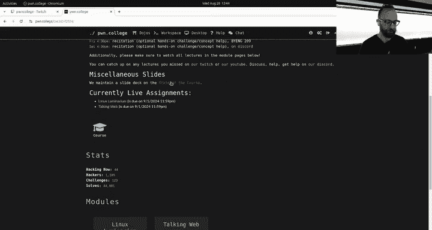

哎。So a couple of things。😡，To kind of catch everyone up。This course。Has。Four sections in it。

They're all co taught by Professor Connor and Professor Jan。

They are all being treated as one big section。😡，So all of you fresh faces。

From Wednesday should already be familiar with us。😡，From the Monday lecture。

 who here has seen the Monday lecture？All right， a couple of people going to raise their hand。

 so you're responsible for catching up asynchronously orynchronously with the Monday lecture and the Wednesday lecture。

😡，So if you haven't seen the Monday lecture？😡，Then you probably might be behind in other ways。😡。

Strongly suggest that you catch up ASAP。😡，Cool， all right， so I'll leave that to you or should we。

 we're not going to go through the syllabus again， right？All right。

 Monday was all about the syllabus， the structure of the class。

 first two assignments that were already live on Monday and that are due next Monday。

 sorry do Sunday at 1159。😡，And today。We were going to skip all of this。

 we'd already did our first meme review， we do meme reviews every Monday from the Discord。

If you already have six people in Meme jail。Which is pretty exciting。

 so raise your hand if you want to confess that you're in meanme jail。All right。

 no one is messing up。It's good， we might have a jail break。Out of mean jail at some point。

 all right。So let's roll， okay。First things first， kind of state of the class。😡，啊。Connor， actually。

 do you want to do this on you， you generated this data。😡，Yes， you I that。

Here we go this mic following thing is a disaster， Okay okay。

 so who here has already solved at least one challenge on Po College？All right。

 more than half the room if you have not raised your hand， it's not the end of the world。

 but you are behind okay， so your grade is not impacted yet， but we strongly， strongly， strongly。

 strongly encourage you to start as soon as possible。😡，Currently there are two assignments live。

 there is the Linux Luminarium which is going to get you a brief introduction to Linux command line stuff。

 there's Talk web which is going to be a brief introduction to what HP requests look like and how to send them these are both due this Sunday at 1159 pm。

😡，If you're wondering what your fellow class looks like， this is it。

 So 200 plus of you have not yet registered on Poone College there's like。

1070 of you or something like that 200 of you have not yet registered your grades not impacted but you are behind relative to the class。

 I highly encourage you to start today as you can see most people haven't started on talking web I would encourage you to start on Linux Luminarium first highly encourage that technically they're not dependent on each other but most people are working on Linux Luminium first I would encourage it as well and roll with that okay does anyone have any like logistical questions about the assignments。

 not on the content of the challenges but logistical questions about how assignments work in this class or anything like that。

No questions， everyone understands， I guess I can't see the oh there's a T share right here okay。

Good there too。 Okay， sweet， so everyone understands and if you're confused。

Look at the syllabus and then message on the discord All right， Jan。

 do you want to continue absolutely boom nope。Catherine the webca， come on。

Connor you have to hide which extreme to see why we're doing this insane dance Sorry。

 yeah theres there's a webcam that's following whatever Connor you're on camera All right so。No wait。

 I' on my camera now， No， what are you doing Here you go All right， great。😊，We keep stressing。

 start early， start early for multiple reasons One is these assignments are tough they are these assignments。

 these two aren't meant to be tough。 futureture assignments in the course are meant to be tough and very educational。

 These are meant to be extremely handhold and very educational， and they still can take。😡。

On the order of multiple hours for。People depending on their Linux familiarities。

 so someone that is fairly familiar with Linux already coming into the course probably can rush through Linux Li in an hour。

 someone less familiar could take 10。😡，Right。You won't know which category you fall into necessarily until you actually tackle this。

😡，And if you tackle it on the very last minute as everyone is rushing into the server。

 trying to get theirs in， the server will melt down so we've been stressing。😡。

Very heavily to start early， et cetera， et cea， et cetera。

 which luckily people did after Monday so they streamed early into the server。

 the server melted down and we were shocked Piachu so anyways。😡。

The nice thing about the server melting down early is people impacted by that can then go and。😡。

When the server comes back up， they can do it， if the server is up， we maybe， I don't know。

 a couple hours of downtime， you figured out what happened， that's fixed。Go do the challenges early。

All right， now。We dive in all right， so first we want to showcase a couple things that kind of keep coming up for those that aren't aware that the structure of the course is most of our lecture material will be pre recorded starting from next week these sessions are going to be kind of。

Discussions diving into specific topics that are coming up and so on for you know people that have questions。

 so right now we're going to dive into the dojo itself， we're going to go Poone College。

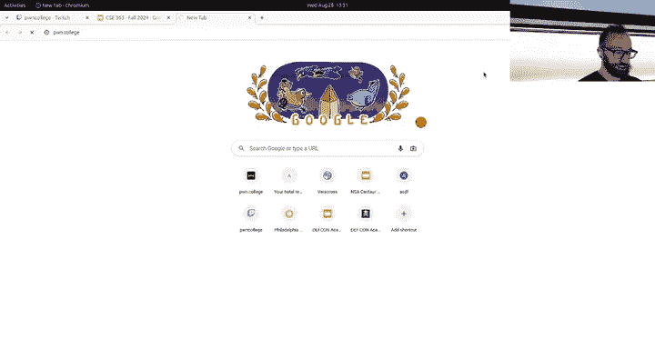

Yeah， that would have been smart spinning circle of death， okay， switch back to this scene。

Let's reselect the monitor。

And maybe it'll restart that。 All right， we're back to the vortex here， the tunnel。

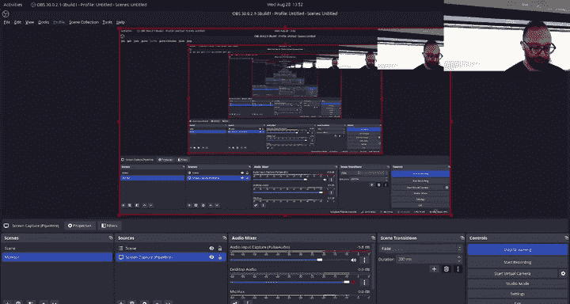

Should be good， okay。We're back。Lesson learned will。Use a real operating system or stream。Of course。

 Linux is the one true correct operating system， but all right， anyways。😡。

For those that aren't aware of where the homework is， this is problematic this far into the semester。

 but if you scroll all the way down on Po College， there's the dojo for the class boom。

 the assignments that are live currently，😡，Are down farther， these two modules。They are all due。

 so if this was my actual student account， these are all due on Sunday night。

 I would be roughly scoring halfway through talking web and 0% through Linux Luminium， all right。😡。

So if you are interested in how to use this freaking platform to begin with。

 we have a whole set of materials on getting you started， you can click in。

 click through using the Dojo and complete the A challenges or so here， and then you'll be。😡。

A pro ad using the dojo， you wanted to point out a couple of other things。

 one is if some people find it annoying to start a challenge。😡，Right。Wait for the challenge to start。

Not much we can do about that。 The load on the server pretty pretty high。

 You're doing some things to fix that。 All right。 So the challenge starts。

 We launch up a guI desktop in the browser。

That starts up。All right， and then I start up a terminal， this challenge。

 the very first challenge it solves itself， I just run a terminal and then。

I actually started in the wrong way， this one is supposed to test me using the VS code workspace。

 that's cool。

Start this up。啊some么。And then I start up a terminal here。

And once again， the challenge solves。Itself and gives me the flag。 All right， I take this flag。

I copy it。😡，I go back to。The form I paste the flag I hit submit this case I resolved it but all this takes some time。

 I go click down to the next one， hit start again， some people get annoyed at that want to be able to just do it straight from this window one thing that is undocumented anywhere and we should make document if you click on this little flag icon there's a really cool spot here。

 you can read the description， you can put in the flag right here， you can hit submit。😡，It'll say。

I already solved this。 and then。Wait， how do I go to the next one from here Oh yeah。

 And then I can go on to the next level just clicking here and it'll automatically do it。

So you don't have to navigate as much through the Dojo website， you sit on one window and you。

You do everything you need to do。As you can see， the dojo is under some load right now。

So that demo kind of failed， actually。What happened there， can we look at logs？Anyways。

 I click it again at alert。There we go and I go back boom and now I'm in the new challenge Okay。

 awesome so that's a fast way to interact with things SS yes for SSH environment let's go on to SSH now。

😡。

So boom。We are here， SSAchinging。If you want to SSH rather than use the web interface。

 you can absolutely do that。😡，Let me。Zoom out a little bit so that the icons come back okay。Perfect。

 so if you want to set up SSH。😡，Their directions are over here in the getting started， Dojo。

 and they're connecting under SSH， I can make a new SSH key。By running this magical command。Boom。

 it generated a new SSH key for me。😡，It has been saved in key。pub。😡，That's my public SSH key。

 I copy that this is a SH key is a cryptographic。😡。

Token for lack of a better term at the moment that SSH uses to authenticate itself。

 to authenticate you to the phone call server， I go to settings over here with the gears。

 I click on SSH key， I paste in。😡，On SSH key here， I hit add。Boom public has been updated。

You can refresh and you can see now multiple SSH keys。

 I don't know who's the other one is presumably connor's now whenever I start a challenge which I。

Just did with whatever I just started， I can SS to hacker at Po。 college。😡，And use my key。

 there's two keyF key。po and key， this is the private version， I upload the public version。

 I hit enter。😡，哎有。Wait， and it tells me no running challenge， that's not true。

 I just started one all right， let's go back to the Dojo and start one。あそきここ。That over Iaki。

 I shouldn't， but we'll figure out。Is it low higherd capital， am I？Yeah。嗯。Yeah， I am。

 I have a started challenge。Okay。This thing exists， it is correct， it was just generated。Okay。

We're going to。Try to get away from。Any SSH config by becoming root？All right， see， little fresh。

Wells perfect， All right， I must have a custom message config locally that messed things up all right。

So嗯。Here we go， I've connected up， so to clarify， I did my S key generation。😡，NIH10。

 you can use SH client of your choice。And now， I am。Inside the challenge。

I can run it or whatever the challenge wants me to do。

 and in this case it wants me to run it in the GuI desktop and obviously I'm not running in the GuI desktop。

 but let's，Look at， I don't know。One level of the Linuxux luminarium。As a freebie。

This hello hackers level。And you can see something interesting， I'm here on one level。

 I click start while connected to SSH。And it。Waits until the challenge is loaded。

And then draws me directly into the shell of the next challenge that I started without me having to reload。

冇om。So I can speed around challenges this way。はいい。instructionsstructions。Yeah。

 there's usually a challenge slash description over here there it's the same。

There's this description right there， just the rawL markdown。

 but I would recommend approaching the description like reading it on the website。

It's marked down for a reason。😡，Okay。This one， level one， we just need to invoke the Ho command。

 so I'm just going to show what hello， it gives me a flag。

 don't copy and submit this flag pointless academic integrity violation。Get your own flag。

 it'll be unique， I submit the flag。😡，It tells me correct， I go， I start the next one。And。SSH gets。

Refreshed with the next challenge and I can keep going。

 So SH is a S in is a great way to interact with these challenges with slightly less。

Kind of annoying。Stuff then going through the website。

 at least until you start needing some of the tools that are installed on our desktop。All right。

 questions on that。Sweet， oh， yes。The question was will this be recorded， yes。

 so for those that missed the Monday lecture， please go back and review it also for those that didn't read the syllabus where we say everything is recorded。

 you can catch up on everything et cetera， et cetera， et cetera。

 please go back through and read the syllabus because you are already。😡，As Connor said。

 a little behind。So every lecture is recorded and every lecture gets immediately becomes available on Twitch。

 and then we archive it to YouTube where you can continue watching it。Cool。All right。

 what did we forget from the initial spiel？Is anyone confused about anything with this platform？😔。

WeOkay， awesome。Now we figured today we're going to dive into a couple of kind of common issues that we have seen people running into conceptually around the Linux command line do you want to do？

Intro Phil diver all right， let me start this thing watching again， there we go。啊some。Okay， perfect。

It was not all right， sweet。There's a question， can you do this using Windows PowerShell。

 the answer is no， this is a Linux based course， there are Windows challenges on Po College that might be currently broken temporarily。

 but no。😡，When those Powerhe， I guess there's a Powerhell distribution for Linux now。

We could have a do joint SSH from Windows Power Oh， I see that might have been the question， yeah。

 you can SSH from Windows into the Doll joint。That's perfectly fine， but in the Dojo。

 you're going to be running Linux。All right awesome yeah。

 that was a question yeah yeah absolutely I don't have a Windows machine to show that but we could no you're not going to switch over to this right now anyways。

 there's a Windows machine right next to me here but it was hard enough getting this all this set up all right so。

Questions that we got a lot are what is Linux， what's a command line， what's a command。

 what's an argument？😡，I。I'll add like。You know， maybe what's a computer。

 These are good philosophical questions and the。Reality of us receiving these questions is why the first assignment assigned immediately on the first day of ASU's semester is the Linux luminarium。

😡，We're going to dive into this right now。I've realized from the amount of question that we actually need a prereded lecture series。

 we have been conceptualizing the Lyn luminarium really as a high level review of something that you would have picked up。

By now in your CS career， but that isn't always the case for everybody。

 and so you'll actually over the next couple of days also launch some prerecorded to kind of cover these concepts。

😡，But in the beginning。Computers。We're interacted with using like。

Toggles and light bulbs right you set little switches to set ones and zeros in the computer and then like little bulbs light up and you know you're talking about the very。

 very， very early days then we moved on to interacting with computers，😡，By programming in。

What they should be doing using punch cards。😡，Where you would poke holes in specific places to set and unset bits and you would feed that into your computer and then the computer would do stop now you're like。

 this is like， I don't know， 70s or so。😡，Eventually。People invented monitors。😡。

Those big crT massive things like televisions that just have lines of text。😡。

And there was a specific kind of protocol that eventually was agreed upon to power these sort of virtual terminals。

To basically facilitate the typing of lines of text on the screen， all right？😡。

And I lost connectivity， Oops，诶。That was。Maybe 40 years ago， let's say。Since then。L and rent said。

 the mouse。The touch screen。Windows， apps， all of this fun stuff。😡。

But that original lines of text on the screen has kind of stayed with us over the decades。

 it's the ancient wisdom that continues to power computing today， why？😡，Well， for one。

 we have a whole lot of powerful， useful utilities that people are very used to using and you will become used to using using the command line。

And two。It's just easier。To write something you using command line then to write a goI app bh blah。

 bh blah bh， blah blah， so command line is king and it will rule your journey through this class。😡。

With exception of maybe。去过是马将。2。Now what is the command line in practice in practice。

 the command line is this little line here。😡，That is waiting for a command。

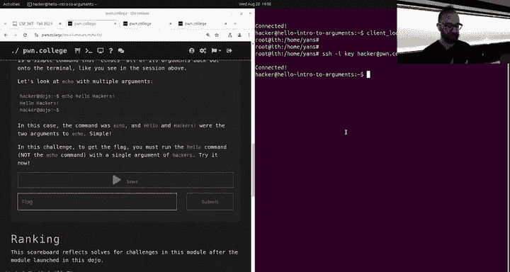

What is this， this is a prompt。😡，The prompt。Shows me my username。

Everyone's username in Poone College is hacker because by the end of the semester， you will be。

You'll have to register your fingers as hacking weapons to the state No but you will learn some cool cybersecurity hacking stuff。

 it tells you the host name usually this is the name of your computer， my laptop here is named if。😡。

Right， that's cool。Your host name on home College is derived from the module and the。

Challenge that you're running， and then it tells you where in the file system you're currently chilling。

😡，And right now they're in our home director， which you will learn about as you go through the Ex luminium。

 and then there is this little block。After the dollar sign says this Dan of the prompt。

 then here's this little block， little block is waiting for me to enter some input depending on your specific terminal implementation。

😡，It might be blinking it might not by the way this is just text the original way to interact with this was printers。

 line printers， you would do something and the computer would print stuff out and then you would type stuff in your the computer would like print that onto paper and then you would end up by the time you solved the phone college challenge in the 1980s you would end up with you know。

😡，Reams and reams of paper full of。Unhingnge the frustration and then finally the brilliant you know eureka moments of solving the challenge。

 but now we don't have to waste all that paper， we just printed out onto a screen now of course，😡。

H college， the website doesn't connect directly to my monitor。

 SSH is a program that connects it that gets a bunch of data and then spkews it out into this little program call that is a virtual terminal and that virtual terminal receives all this data properly formats it outputs it to the screen and as this little blinky guy。

😡，All right， wy Gu says， type some text。And I might type yo。And I hit enter。

And it says yo commands not found， theres no yo command， unfortunately， that would be really cool。

 we should make one but。😡，If you read this。We can see a couple of things。Actually。

 let's read intro to commands。We can see there's a who am I command， very philosophical。

 the who am I command， you enter it in， you hit enter。I think I lost connectivity again。

Oh there we go， all right， I type it in。And what did I just do to get it to pop back up， I hit up。

 can hit up and down to scroll through my previous command。 All right， who am I， I am hackle？

All right， say it， I am hacker， Istand that would be weird and kind of cult anyways。

That's the user that I currently am that's just a command， prints out your username。

 very useful to check if an expert has worked and your route。

 which is the administrative user about whom you will also learn through the Linux luminarium。

 all right。😡，Then well go over here and we say， okay， hey， okay， now you know who amm a command。

 there's also in this challenge， a hello command and the hello command。😡。

Is just going to give you the flag。 Can we go over here。And we typed hello and we hit enter。And。哦。

Let me just start here。I had the wrong challenge up， oops。All。Created。And。Preing。

 I don't know if it's my internet being crappy or up， all right？Boom， okay， the hello command。

 type hello， okay， great， I've executed my first command。In Linux。I typed in。

A word into the terminal I had entered， and the word was interpreted by the command line。😡，A program。

The command line shell， the program running here and printing this prompt and interpreting what I type into it。

😡，It was interpreted as the Hlo command。😡，And boom。It ran and it gave me the flag， This is sweet。

 Okay， so any question on the concept of commands。😡，In the command line。阿香。All right。

 but for example， I can type here。Give me an A in this course， please。I hit enter。

 and what does it say， it says no such command。😡，Give。But what about me and A in this course？😡。

I said just like in English。😡，Any language really， the command line has a grammar。😡。

And the grammar has parts of speech。😡，And different meanings for different words and different parts of the sentence。

😡，The first word。Is the command， hello。Everything else are parameters to that command。

 I could typeHo there。And。It actually gives the hello command with a parameter of there for some weird reason that no one understands and I can't actually find in the history books。

😡，Command parameters are called arguments。😡，Why are they count arguments， it doesn't make sense。😡。

An argument is。Something differentable than ever， it's called arguments， so in this case。😡，IT hello。

And then I type there and there is a parameter。😡，Pass to hello， otherwise。Called an argument to Ho。😡。

So if you go to the second level。And then here it says， okay， hey。

There's something called echocho and it prints all the arguments back to you， so I say echo。😡。

And I'm having internet issues again。We're not so loaded that this is server issues， right。

 this is probably internet issues。All right， we're back。Echo。Hello there。It prints it back to me。😡。

Now what the hell。I thought hello was a command。😡，So what happened here？Exactly。

 because it's the second word。Just like in English， if you put words in different places。

 they mean different things， same with the command。😡，L。The first word echo is the command。😡。

After that， they're just words， they're arguments to the echo command。

 all the echo command does is print it out back at you。😡，So I say echo， hello there。

 it says hello there。 hello there。 hello there。😊，哎。Cool。

Everything you type into this command line is just letters。😡，Just like something you write out。😡。

In on a piece of paper and hand to your friend。Do people still do that？

Maybe you send them a note on TikTok or something， just letters but。😡，It's。在。Grammar。

The protocol that turns those letters into meaning， in this case， the first word is the command。😡。

It's echo。😡，And then after that， it's just all letters Ho on its own as the first word is the hello command that gives me my flag。

😡，Echo hello， just as hello。Cool， there's another command called Cat。😡，Who has a cat at home？So July。

 he's my cat's name porch cat。He started out living on my porch and then basically endeared himself to the whole family and then。

Now kind of rules of the house。But that's a sand that has nothing to do with the win command line。

 neither does this cat command cat is short for concatenate because I can put a bunch of files here as arguments and they'll concatenate them。

 so if I put cat one， two， three it's going to tell me actually none of those files exist。😡，把。If I。

Let's see， let's look at what files are here， a lot of interesting files here， I don't know。

 I have a world file that apparently has the words hello in it all right I can I earlier cadted。

Description。 MD， this is a bunch of letters， they're just letters if I type echo slash challenge slash description。

 MD， it just echoes it out， they're just letters， but the cat command。Kowes that it arguments。

 it interprets its arguments as files。😡，哎。Commands have different arguments that they take different arguments in different ways。

 they treat them。😡，Semantically differently and。They will。

And you will learn about a lot of these different commands in the Liarium all right。

 who's learning something here？😡，All right， awesome， a couple of people， not too many that's good。

s how we like to see it this is definitely extreme review， this whole module is extreme review。

 but we just want to make sure everyone is on the same level。😡，Okay， amazing。So。

What else are you missing， do you think that's enough for people to get started with。

Philosophically and any questions for us about the command line？是咋天。Just John。啊。

The question on his best cat tried to show you what's in the file， yes。😡，There are lots of files。

 there's whole system of files。😡，All files in Linux， who here is familiar。

 more familiar with Linux than Windows。😡，Okay， a couple of people， how about Windows more than Linux？

😡，Awesome， how about your iPhone more than all of that shit？😡，Okay， all right， cool。

On your iPhone and on Linux， but on your iPhone， it's so deep down that you never interact with it。😡。

Unlike windows。All your files make up a single labyrinth。😡，In which they all live。

 make a pre recordedcorded video out of this with some very cool props， but in the meantime。😡。

If you're used to see colon。Backslash and de backslash and so on and Windows。

You leave that all behind in Linux。😡，All roads start at slash。

For slash is the root of the file system under that there's a bunch of directories which are basically just boxes in which。

😡，Stuff lives。There is a slash home。That is where all user data lives。

 slash home slash hacker is where all of hackers data lives， these directories。

Parts of the path they're joined with a forward slash， and this is boxes within boxes， within boxes。

 and eventually there's a world file that contains。😡，The word hello。Cool， and again。

These are just letters you pass to CA and it uses them to denote a file name if I just paste this。

 I'm just echoing it out。😡，그。啊some。All right， other questions？Yes。

Question was if you have to do like you're saying， like write a program or something。😡。

Should you use crazy arcane editors like VI， or did you use VS code， well， you should use VI。

 but you can use VS code。😡，VI harnessed the power of the early computer revolution。😡，It captured it。

😡，And it committed it to code， and you can plug into that。😡，Anytime。Just by running VI。😡，bo。

 now you have。The potential of computing at your fingertips。It's an amazing feeling。

 you can hit colon boom， this is like a whole new world just opened up。😡。

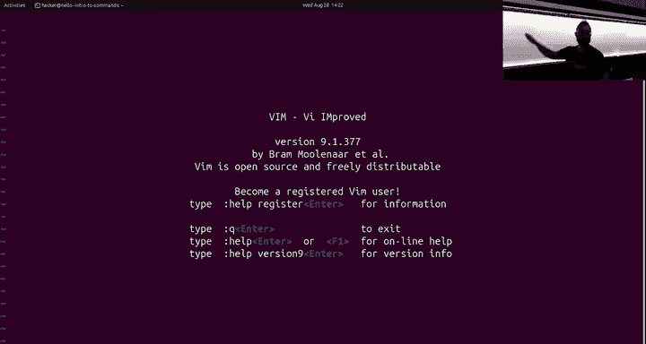

If you want to get out of here， you just hit Col and Q and hit enter and your' ga。😡，Of course。

 you can use VS code like a nice normal modern person。😡。

But I'd highly recommend you to dive in and learn VI。

 but not at the expense of your grade or whatever， you VI could take years of your life。😡，那是。Yeah。

 if you the question was， so I can do everything in EmX。

 unfortunately I can't stop you from using EMX， Connor won't let me。😡。

Con Connor fights for the students。And also for Uax。

So if he was up here and that's why I grabbed the microphone as fast as possible。

 and he would be preaching Ems right now， of course。

 the reality is all this is irrelevant and everyone just uses VS code。

The world has just kind of strayed farther into。Into modernity。Anyways， other questions。Oh。

 and the VS code， the VS code， you click workspace up here。

 you click like when it pops up down here when you start a challenge。

This is an instance of PS code that we are running for you。😡。

And it is running on inside your challenge environment。😡，And if you spin up a shell。😡。

Why am I in slash challenge？VS code is weird anyways。You can also do all of your same。

Fun stuff right here。It's the same environment that you as a to is the same environment that you pop a desktop up in here with this desktop button。

😡。

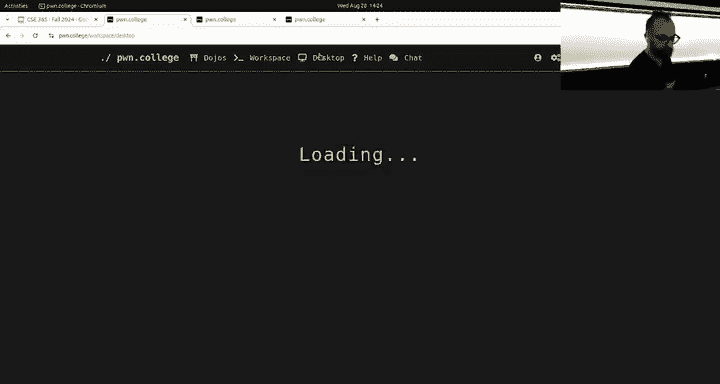

Any modality you want yes。Just like what？

Yeah， so if you notice the question was can you're just SSH in from outside。

 that's basically exactly what I did， this is a root shell on my own laptop。

 this actual laptop it is physically outside of the Palm College infrastructure。😡，And I can do SSH。

Get my key that I uploaded and do hackcker@ponone。colge。And。As soon as the slow internet works， boom。

 it's connected from the outside into the infrastructure。Cool。Any other questions？Yes。But the what？

If I have taken。I have never taken the class， this class， I don't know。

 I could probably get a solid be。😡，Probably。It all depends on when you procrastinate how much you procrastinate or not My first class at ASU was 466。

Which， oh wait no， you obviously didn't take 466， at least。Connor was my first TA。Ask around。

 ask others what our。Average grade last semester。Like what did beltgrade look like？

I would guess it be。Start early okay， that's the other thing one thing you might have missed if you can catch up on the Monday actually already read the syllabus is that every day at 430 pm in BYE and G209。

 we have the phone college power hour。😡，Where you have people standing by eager to help。😡。

You with any challenge issues？All right， other questions？All right， so that's Linux right again。

 let me get back to these slides。😡。

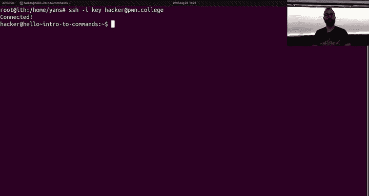

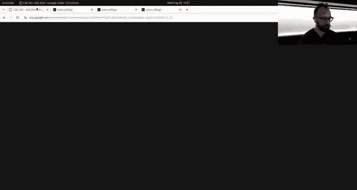

This is due oh we don't have to do data， I these are both due。😡。

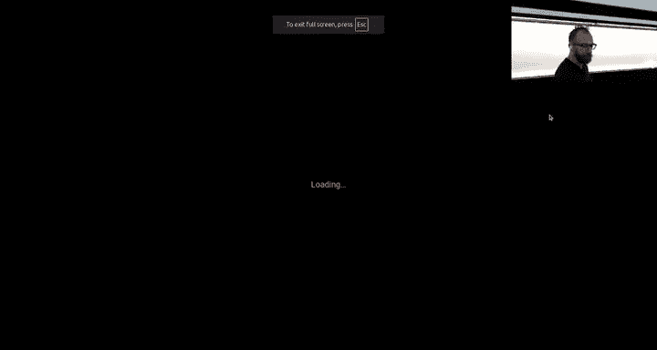

At 11，59 PMm。And。三0。And on Monday， we're going to move on to。Bigger and better things。

So this is our kind of catch up with anything that might accidentally be missing from your early education。

😡，Okay， so Connor， you wanted to do some talking web the demo on the demo account。😡。

Or you're giving yourself。And right don't forget to restart the。Chow， all right。

 I will try to hand the camera off to Connor。

We can do the handoff that。Oh it works it works smoothly all right。

 so Jan discussed kind of some of the introduction to the first assignment and the first assignment really does have a lot of hopefully helpful text to guide you through with the concepts the second assignment is。

Really orthogonal to the first assignment the first assignment teaches you how to use the Linux command line the second assignment talks about HTTP requests you'll see in this course a lot of this course has to do with the web in some way or another the web is you know pretty ubiquitous you've all used it before and we're going to be exploring various properties about the web in security of the web in a lot of different ways of looking at that problem so before we start that though we want to make sure everyone understands the protocol that powers the web so I am going to。

First， start by showing right that we do have a second assignment launched。The。Let's see here。

Eventually， there we go。And that assignment here is on talking web right so the first one Linux luminarium highly encourage you to start with Linux luminium then you're gonna to move on to talking web so in talking web we do have some prerecorded lecture videos that hopefully well have this making sense so you're kind of expected to watch these lecture videos before we begin but in an effort to kind of make sure we're all on the same page about what the second assignment looks like I will kind of speed run some of that content okay so I am going to start up the very first challenge。

By hitting the start， all the challenges work the same， you go to the module。

 you hit the start button you'll see that this module has a bit less text。

 we're going to maybe go through and update some of the text。

 but we do have lecture videos to watch before， I think in total it's less than an hour if you're really wanting to move quick watch that 2XBA I Care but the content in there will explain the concepts necessary for solving these challenges。

Okay， so。Let's go here。嗯。I will do the desktop actually， change my mind。

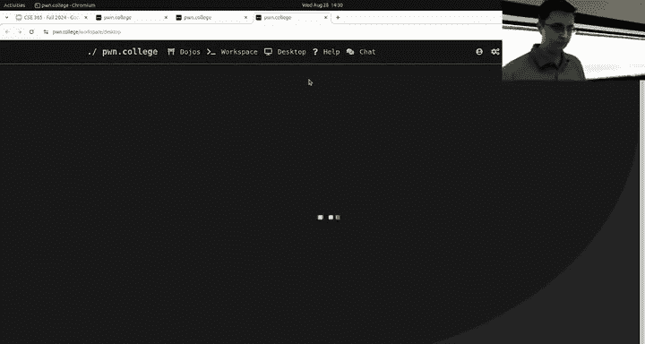

Okay so one of the reasons I recommend getting started first with the first assignment is because guess what this assignment is using the command line。

 you will use the command line as Jan pointed out for almost every assignment exclusively。

 the reverse engineering module you'll do a little bit less command line as when we get to that and the networking module will also have a little bit less command line but also command line command line is going to be ubiquitous in this class。

😡，Okay。So who here has ever before this class made a web request before？😡。

It's a trick question every single one of you has made a web request before I guarantee it。

 I don't think you could sign up for this class without making a web request okay your browser is constantly making web requests that it's Google Chrome on your laptop or Safari on your iPhone or whatever every time you're browsing the web you know you go to Instagram that is making a web request everything on the web is powered by these web requests and it's relatively actually pretty straightforward what this protocol looks like。

😡，So I'm going to open up two terminals here。😡，To oh boy， did I just， oh。

 there's like workspaces in here， Oh boy， switch out of this， okay go back there。All right。

 here we go what I'm going to do is show one of the programs that you're going to be using in this assignment we don't talk about this program in the Linux luminarium module because we can't talk about every program in the Linux luminarium module there is a lot of programs hit tab a couple times hit T all。

Does that work oh yeah you'll see in the Dojo Poone College。

 this says display all 2277 possibilities are on the Dojo 2277 programs that we could run right now and this is just what's installed on the Dojo you can obviously write your own program and then there's guess what now there's plus one so there's a lot one of the very standard。

Maybe that would okay one of the very standard programs when it comes to doing computer networking is the Necat command。

 So Necat and it's I don't know why they like NC versus Netcat。

 probably because it's shorter to type and it's a very popular command。

 So they decide to make it sure。 I'm gonna make up that that's the history of Netcat has a whole bunch of things you can do with it。

 So as we learn in the Linux luminarium， you have a new command， you want to learn about it。

 especially if it's a very popular command。 there's gonna be a man page man N C So this says arbitrary TCP and UDP connections and listens。

If you have absolutely no idea what TCP is that's fine we're going to just kind of shortcut through it for now the lecture videos talk about TCP eventually we'll get to the networking module and it'll discuss it way more in depth but for now you can kind of think of this as we have a computer over here and a computer over here and we want them to talk together somehow they need to be able to talk in some way TCP is one of the layers that enables that and we'll see as we kind of discuss this a little bit HTTP the thing that powers the web lives on top of TCP if that's going over your head don't worry just imagine we've got a pipe right now between two computers and we're going to use NetCt to connect them。

Okay so the way in Netcat and if we read the man page。

 you know we'd find that there's this dashL flag to Netcat。

 the way that we can start listening for a connection in Netcat is N spaceL the dashL argument is for listen and what we can do you know we'll kind of ignore some of the fact of like what the heck is 0。

0。0 this is an IP address and specifically it's like I want to listen on all of my IP addresses and we have a port。

In HTTP， this is a TCP concept， watched the lecture videos again。

We have a whole bunch of computers right and these computers want to talk to each other to different programs right you might have a computer with a bunch of programs Each program that wants to have this network capability is going to be on its own port and so one of these programs you might run is an HtTP server and we're gonna learn all about HtP servers in this class and more often than not that program by just convention is running on port 80 so we are going to Netcat oops just kidding。

 we're not gonna to use 80 because I guess someone is already using 80 but that's not the end of the world which is make up another port well you know commonly if you see 80 is in use and you don't really care you just switch to 80 80 is kind of the next guy。

What？Okay we're going to switch to 4242 of the next， okay， no one's on 4242。

 you'll see a program like took control of that port。

 we'll just keep trying new ports for now because there's a demo we don't actually care what port it's on as long as everyone knows at this question。

It can be any port number as long as the client that's going to now connect to this also uses that same number。

 So we're going to use 4242。 Fortunatelyly， I'm powering both the server and the client in this demo So it's gonna to be all right because I can type in 4242 on the client side So this right here is a server。

 I basically just started up the Instagram server It's great。

 if I wanted to right now I could reply to future people making requests in exactly the same way that you know your Instagram client is expecting responses to look we're not going to do that because that sounds miserable but we could instead what I'm going to do is I'm going to netcat to local host or maybe you've heard of 127001 future modules and lecture materials talk about this。

 this is an IP address。 This is what computer do I want to talk to And in this case，12。

7001 is the special reserved。Ting whichch means I want to talk to myself Okay so this probably makes sense right I'm on the same computer for both。

 I want to talk to myself and what I can do is Necat to local host or 1270，01 on port 4242。

 you may not believe it but these two things are now talking to each other and one kind of maybe slight inkling on that is you'll see。

😡，When Jann was talking about how do commands work normally you run a command and then you get like your hacker@ host name that comes back if you don't have that ever come back and this is true of all commands。

 if it doesn't come back， that means it's hanging something is it's waiting for something or it's running because there's a lot of stuff it has to do maybe I li you but the Netcap program and it's doing like hours of computation right now。

 it is hanging， it turns out what it's doing is it's blocking it's waiting for some sort of input to show up and so we can make input show up I need to do this in a way where it don't go on the other worksmith。

 there we go I just typed in hello。😡，Netcat will not send the input to the other computer until I hit enter。

 it is line based so I hit enter。😡，You see， hello has shown up。 This is very， very。

 very basic networking。 And now I can say cool story and cool story。

 and I can say this is my response to you。 and I get that。 Unfortunately。

 the networking isn't set up in here where。😊，I could like listen on the internet and all of you could connect in and we'd have chaos。

 but there's no reason you couldn't do that if we didn't have firewall rules making it so fortunately you can't get into your isolated container but you could imagine that that's the whole point right now it's kind of boring because it's all on one computer but you could be connecting from your laptop to this right now if the networking rules were set up currently they're not that's okay so this is very basic back andfor communication and so somehow we're going to say it's a mystery for now。

 but somehow we can make it so two computers can talk to each other as soon as I hit control C we talk about control C and the control C soon as we hit control C that's going to kill this program and if I do that。

Wait， can you control seeing the browser？呃Yeah。Oh， I'm hitting FNC， Yanza Laopard。

Keyboard is weird okay control C， you'll see that I basically said I'm done talking it told the server I'm done talking and both of them are done。

 we got our little terminal thing back where we have our hacker at talking La level one， Co。

 I mean my home directory dollar sign this crazy prompt thing that you'll see。

 which means all right we can type another command。😡。

If we want to show what happens when we make a web request。

 we can talk to local hosts 4242 so there's a lot of ways to send a web request。

 you're probably most familiar with a web browser so let's open up a web browser hopefully maybe there we go we got Firefox maybe you don't use Firefox that's okay but it is a web browser just like any other。

😡。

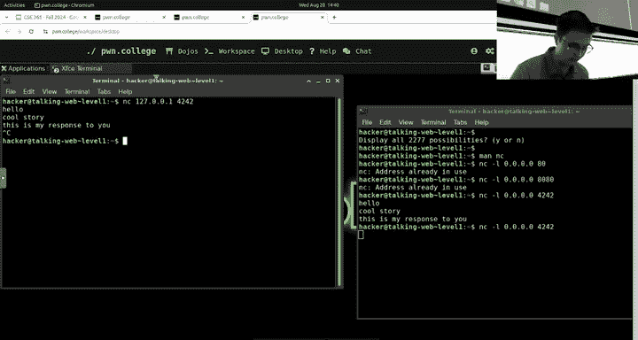

Okay。If I type now into this URL bar instead of Instagram。com or YouTubebe。com。

 I instead type the very cool website domain of 127。0。0。1。😡。

And in this case because we're not on port 80， I got to specify the port。

 your web browser would assume port 80， but that's okay。

 we will put in colon 4242 again if you're confused like why Col 4242 watch the lecture videos this we'll talk about this in more detail if I now hit En look what showed up it is not as quite as readable as hello cool story this is my response to you but it is something and guess what I can talk back to Firefox if I know the protocol and the protocol is HDP and if you want to know the protocol you solve these challenges and watch the videos。

😡，Here's what I can do。 Let's see if I remember。 Hopefully this is going to be。呃。A disaster。

I think I think we're good。 to me。 I'm terrified of realizing I haven't typed a response in like six months now。

 If I type H T T P slash 1。1200 okay， which is like almost like this is my response to you。

 But we're just getting started with my response to you。 And then I type content length。

10 because I am going to send back 10 characters and then I hit enter and then enter and then I say ABC D。

 or actually I'll say my response to you and see what happens maybe that was 10 characters。

 look what shows up in the browser not quite as cool as Instagram but it is the first 10 letters of my response to you and this is what this module is going to demonstrate to you how the heck all of this works。

 okay so we just had this mildly terrifying looking request is really not that bad。

 but there's a whole bunch of stuff right we got this weird get space slash space HGp 1。

1 host blah blah blah user agent except all these like header things is what you'll see they are and then we can respond。

 So the client sends a request。 We send a response。

If you want to be cool and continue on with your Linux luminarium skills and you want to stick to the command line。

 guess what there is a command line way of doing all of this instead of using Firefox。

 I can curl HTTP colon slash slash 127001 4242 and this also sends an HtTP request and it's looking for the same type of response so I could say HTP 1。

1404 not found and if I do that。😡。

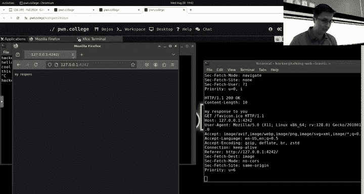

Well， maybe I need a call length。Either way， let's kill the connection。

There D Oh yeah I'm hitting the wrong thing there we go yes you'll see we can pass more flags to curl we're running out of time unfortunately but that would work and so in this assignment you're going to be using NetC program man NetCt curl man curl and you'll also see that the third style is Python requests。

All right， all right， good luck， good luck on Monday we move on to the next module。

 if youre run into trouble with this start now start right now and show up your recitation at 430。

Cool all right， how do we end the stream hello goodbye hackers， we got to end the stream。

Right。

Hi hackers， hopefully oh yeah right。