# ASU《网络安全导论｜ASU CSE365 Introduction to Cybersecurity Fall 2024》中英字幕deepseek翻译 - P4：-05-Web Security - CSE365 - Yan Office Hours - 2024.09.07.zh_en - GPT中英字幕课程资源 - BV1nVCVY9Ehy

Hello， hackers， sorry， we started a little late。 technical difficulties。 Let me actually。

 I just realize I didn't set up my。Uh an iPad or something so I can view the Tw one sec。

 I'll be right back。All right。We're back。Let's get this show on the road。All right。

Which microphone am I using， Am I using。Theyre good mic。Now， I think I'm using the bed mic， oops。

One second。So you might be able to tell it has been a。Little bit。

Without streaming and I'm setting up still a new device here。 Well on let's do this audio。

Iio capture。Method。Okay。Nope。That doesn't work。Taking some advice and trying to stream on Mac OS and this is a terrible。

 terrible experience so far。All right， let me just bring up the chat。

Just so we have something going on here。All right， that's me， perfect， okay。Yep。

 it's 365 office hours。Okay。Let's。Oh my god。Now I'm debugging the iPad just like that XKcD comic。

 okay？嗯。What were you doing， we wanted to change audio settings。Sound settings。Input。Okay。

How do we get this？It doesn't even see that other microphone。

 you might just have to have a relativelyly crappy microphone。嗯。哎， fine。

Someone on Titch says they can hear me okay anyway， so we're doing this。Alright， so。Oops， oops， oops。

 oops， oops， contact it， O， B， S。All right， let's announce on T that we are on a Discord that we are live。

好玩。Okay， let's do this so。Well go。Hit the screen share and just dive in and answer questions along the way。

Okay。Let me actually test something。 if I do this。 Okay。

 that microphone goes away and stops flashing my face。 Al right。moom。Okay。

 we'll have this a little more。Well done in the future， but that's how it is right now。 Okay。

 can people see this？Let's see。All right， awesome。Seems to be working， okay。Let's roll any。

QuestionThis is an office hours stream， so I'm here to answer your questions otherwise I have a couple of kind of things I've noticed that people have been seems to be running into that will kind of dig into some approaches to maybe debugging some of this stuff。

 but any specific questions。To get us started。Feel free to ask on Twitch。

And then I'll also switch over to Discord a little bit here。嗯。Okay awesome。

This course just chatting about how the Twitch stream is live。How do you run the SQL query？Okay。

 okay， so。ASll clerk on Twitch asked how do you run the SQL query。

 they don't need the query just how to do it via Python so are you're saying like for debugging。

 you want to write a SQL query and test out how it affects the database。I'm going to assume yes。

 and then we'll dive in。So let's grab one of the SQL injection。Challenges。So we got。Squey。

 I don't know。3， let's say the oldest this one is 2。Let's do it， all right。

 so you're going to hit practice mode。Log in。Two some while that one is not correct。There we go。

Grab u。Squely2 or Squeealy3。Let's just screw you to。This one。Wow， that starts so fast。

This multin support insane saying， okay。All right， let's load up the desktop。

Okay。Boom， we'll hit up two terminals just to see what's going on here。

 So sQL light sQL light sQL injection to。Has a slightly more complicated challenge file than you one。

嗯。And it basically has a whole application。 and this is really neat because it's。

It's actually a little application that that you could， know fix the vulnerabilities and use。

I don't know to pass messages with your friends or something or to authenticate them， I guess。

In the beginning of the application。We create these two tables。sorry。

 we create the table to for users， we insert a user into the table。 and as when we create the table。

 we created it you know， as with an admin user with a random password， awesome。 And the question。

 as I understand it is， how do we actually interact with this。

 Like there is something that we're supposed to inject in here。 Theres a SQL injection and of course。

 we have this deep query debugging that gets printed here that kind of makes us think that okay。

 well probably this is。Where the the injection happens。 and of course， you know。

 you can kind of see this this probably is where the injection happens。

How do we actually interact with this outside of the context of the application itself。

 because this is a huge kind of pain in the butt to deal with。

The CTTP request and the the SQL injection and so on。 And maybe this is actually a good。嗯。嗯。

Excuse me。 One second。Wipite coffee off my face。 Al right， this is a good。呃。

Kind of practice in debugging in general。 right， So we have this application。 It's complex。

 We've identified where the the bug might be， but we need to like play around with the bug。

With application in a smaller， more confined context so that we can kind of figure out what the hell is going on right。

 Well， this is。Kind of a general pattern， we can copy it over。To。

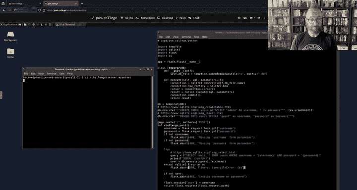

You know， a different file。Okay， and we can trim it down， right。

 We don't want to deal with all the the web stuff over here。 We don't have to。We can take this。

Whole thing。And we have this this database all， perfect。 So why don't we just start deleting stuff。

Here's the query。Okay。Awesome。Just delete everything else or don't delete actual query execution。

We'll keep this。Okay。And basically， we will just。Print。User here， instead of trying to。

Do whatever here， instead of。Using flask， we'll print this。there's already in there。Okay， awesome。

And we just delete the rest of boom。 So now we've taken our complex web application。

 we stripped out the web part and we created something that we can interact with directly。

mWithout having to deal with。He CtP， curl and all of this stuff。 if we run this。

It doesn't work because， of course we don't have a username or a password， so let's take。

The username and password has command line arguments initially。

And we can do whatever we want to pass that。 So now well say username equalss。 Av1。Bastsword。

Equal says。 R2， take them on command line， so username。Is。U and password is P， we hit enter。And。

Here's the debug query output。 You can see our query was created with the U and the P。pretty simple。

 and then the result of the query is none， so no user was found， right？So。

Let's actually add some additional。Result。Okay， there we go， so。Awesome。

 now we can debug this thing if we want it to go even farther。

Instead of taking username and password， we can just take an input for the whole query。Rightい。

So now we just run it。Okay， and instead of fetch one。Let's just put over here。

Ftch all for SQL light and of course I know this API。

 but you can look up the SQL light documentation andll need to do stuff like this throughout the course。

And we run this。And I messed up my Python。Run it。Cool， I've got two rows returned from here。

 I can do a really cool thing if I use i Python。😊，I can pass the dash i flag。

 which will allow me to continue interacting with the。

Python interpreter state even after executing this thing。Okay， I do this。All right。

 now I'm in this shell。Wait， what oh。Ipyython is a little bit annoying one sec。Dash， dash。

This everything before the D dash is argument so I Python itself， everything after the D dash。

I messed that up， sorry。That was me meing， ignore that I forgot my file name。My server。There we go。

 All right， so we got our result， we can check the results。Resolve zero。Awesome。Result 0。Sweet。

Let's do password。Okay， that's the random string username and we can just play around with these things。

 I can just get all of the fields I see if this works。I never tried this before？Awesome， cool。

 so it's pretty interactive here I can execute additional queries。If I want。

 I can see what happens when I insert an additional thing。Insert into users， select。诶。

Beyond as username。Yon pass as password。Awesome， now that that executed。 now I can。Execute。Select。

Start from users。Fresh all now there will be three things here and you can。User S。

And you can just kind of see I'm playing around with the database。Without the pain and as of HTP。

 I can tweak my attack here so I would uncomment this guy。Whoa， what's going on？

Paining their off buttons。I'm coming this guy。诶。I'm going comment this。Okay。

So now here's a username and password。Actually， I can do。Yeah。

 I can just start messing around with this， so here the ASDF here I have DSA。With a quote。

 and I can see what that does to the query right without having to deal with HTP。See， oh， look。

Here it is， and then we got an error from that query。Awesome， so in general。

What did I do to debug and kind of interact with this thing in a reasonable way。

 I stripped out most of the application and I just started interacting with it directly。

 And maybe a good thing for us to do next year is to launch an intermediate challenge that is SQL injection on the command line。

 not on the web。 Maybe that'll be。Much simpler。Cool， okay。

Questions on Twitch while I was going through that。 All right， the first one we'll come to that next。

 this stream will be saved for later。 All of our streams are saved for later。Okay。Perfect。Okay。

Let's answer kind of the big conceptual question here。You start on this challenge。Right。You。Open up。

The challenge file。What are you supposed to do， How are you， How are you supposed to find。What。Your。

 your， your actual goal with the with the level。 your actual goal with the level is always actually quite。

 quite simple。 You have to get the flag。Right， so this sounds kind of dumb because， yeah， of course。

 that's the goal。 That's how you grade the the challenge。 But that is what informs you。

As to how to proceed forward。 So you need to retrieve the flag。Cool， how do you retrieve the flag？

Well， here。You retrieve the flag。By logging in as admin。So starting from this。

 my goal with every level is to get the flag。You look at the program and you step。

 take one step backwards and you say， how can I get this program to give me the flag。

 And there's functionality in here。 You can just search for flag。There's functionality in here。

It only shows up here to get the flag。 And if you hit this thing in a web browser， it'll tell you。

 hey， go。Get the flag， so I'm going to hit this in a web browser。Okay， servers running。

 we're going to start up a web browser。

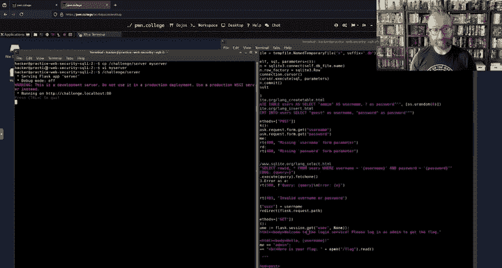

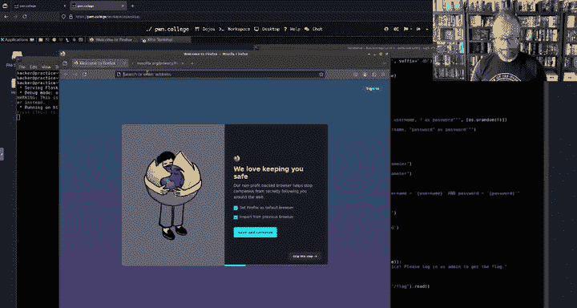

Okay， and says log in as admin to get the flag boom， it even tells us what to do。 Okay。

 so then the question becomes。How do I log in as admin because you have a clear path you get the flag？

Right。How do you log in as admin？You need to either steal the advents password。Okay。

 that's that would be this random8 by string or。You need to。嗯。

Trick the login code so that it logs you in as admin。Right。Given that。

This login code is the unique part of the challenge。 If you。

 especially if you go through these challenges in sequence。

 you'll see this is where things start shifting。 The login code is what to focus on。

Even if it wasn't。The name of the challenge， the。That it's a sQL injection。

 The description of the challenge very clearly point you to a sQL injection。 right。 So then you say。

 okay。Either you rely on them in the challenge to say or and the title of the the topic of the module and you say。

 well， how do I。SQL inject here and then you search through all of the queries and queries are to Db。

 executeute。And you go through and you say， okay， well， how would I inject this？Right。

 and this query uses something called。I'm drawing a blank because I didn't have a lot of sleep。

The fuck。A preparedpared statement key is coming to mind， but that's not it。All right。

 I'll follow up。Anyways。This query。Is put together on the SQL server side itself。It。

This is the query that's passed to my to well， to SQL light， this SQL library here。

 And then this is passed as an argument。 and these things never get combined into a string。

This is not injectable， This is a safe way to use SQL。Okay， so let's say not there。

 this has no parameters at all， I mean， they're all hard coded， so that's not injectable。

This is a third query， looks pretty suspicious because it is a dynamically built query。

 These things are typically a very bad idea。And so over here。Say this is what's injectable， cool。

So you start out with you need to get the flag。You go on to。To get the flag。

 you need to log in as admin， and then you move on to to log in as admin。I need to SQL inject。

 and then you identify the candidate set of SQL statements that are injectable。

 and then you're left with these three lines。 So you've。Simplified this 70 line function。

In two basically three。And then you hyper focus on that for a while。And if only if that doesn't work。

 you're really not getting anywhere as in you haven't even been able to trigger any suspicious behavior。

 then you start looking at other things。But in this case。

 you'll trigger the suspicious behavior pretty quickly。Okay。Lost sound。

Do you guys not hear me anymore？Oh， I can hear myself on thatad。So I think it is。 Yeah， okay。

 soundss good。 Alright， awesome， so。😊。

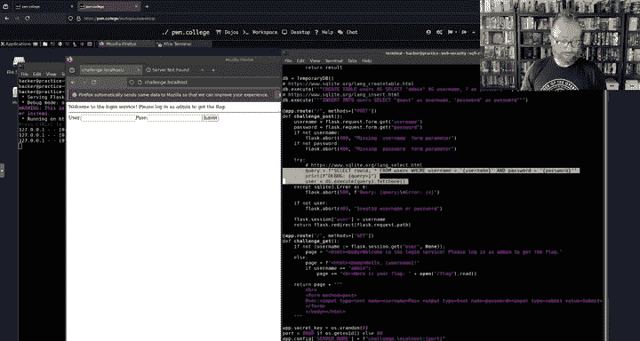

That's how you would approach this So then the question was， okay， what about past traveral？

Where the word flag doesn't show up in the code at all， so let's go back up。

 start up trap past reversal am here。

Okay。Pop up a shell。

Okay。There's so much。A much simpler。诶。Program。And。Also is very interested in that there is。 So again。

 we open this this challenge， we say， hey。What's my goal， Go to get the flag。

 That is your your goal every time in this。Class， right？In an actual cybersecurity situation。

 your goal might be a lot of different things。 Your goal might be to demonstrate that a system is insecure by breaking into。

A user account or by violating any sort of security policy， in this case。

 the security policy relevant to Po College。Is。The flag does not get exposed to the student。

 So that's what you got to violet。 Allright， so here you start out， you search for flag。Say， okay。

 there is no obvious way。To read the flag here。m，Okay， well， that's。Interesting。

 so now we have to start thinking。2。How would we。Actually， get the flag。 Well。

 one way to read the flag is to open the slash flag file and read it。Or in other words。

 you start looking at this application， say。😡，If the application doesn't explicitly and purposefully。

League the flag to me。Like the SL injection case did。How would I trick it into doing so， right？

There's only one place in this application that can read a file that you have any control over。

 right， That's the other thing。 what parts of the application that I can influence。Can read the flag。

 This part happens before you connect all of this。 You have no， no influence。

 You're not going to somehow hijack OS that U random， which gets eight random bytes。

Puts it into the secret key of the application you you just that's that's。Unavailable to， okay？

This happens before。All right， this happens， gets run every time you do a get or post request。Cool。

 so now you can start thinking about， okay， well， well。What here。

 this is all stuff say I might be able to influence what here could get me the flag。没。

Can this read the flag？ No， it's just a string concatenation。

It doesn't actually read files in a sane programming language like Pyth。Can this get me the flag？

Now it's just a debug print。Then you say， can this get me the flag。 Well wait， this opens a file。

 reads it and returns it to the user。This。Seems like a really good candidate。

 So if you add that to our candidate list。And we say， can this get me the flag doesn't look like it。

 this just returns in an error statement， the path。Can this get me the flag？

This can get me the current working directory of the server。

 That's kind of cool except I already know it is going to be。

Slash challenge slide slash challenge directory。 And this gets me an error。 So this。

 let's note it down as a secondary thing。 If we can somehow get the flag into the error message。

And get it returned to us in an error， then we can lead the flag right。

 and this happens just not in this challenge。 So well put it as a secondary on the background burnner and focus on our awesome candidate。

The ability to open。A path and read it。Okay now。One sec， my daughter's passing notes under the door。

失ぱイセごマアなちか。My ideas。We got。Got a note here。She's learning to write a little bit， it's pretty good。

awesomesome。Okay， so keep that note in mind， maybe it's a hand no I'm just gettingd all right。

So someone's asking for this。To be full screen， let's see if we can。Aha，There we go。

 zoom in a little bit。

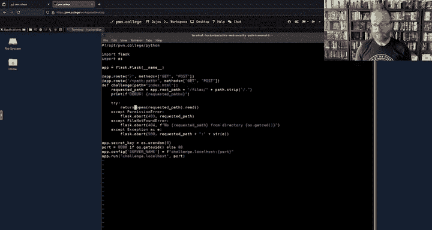

Zoom in a little bit。

Alright， we'll get the streaming set up a little better。 I。

 like I mentioned the beginning of the stream， I'm trying。

To use an IMac here so that we avoid stuff like Wayland killing OBS but。It has its own problems。

 okay。So。What were you talking about？We had identified this as an interesting， suspicious。

thing that that that could get us to flag because you have control over this。This comes。

Spial to give the money one second。我来见。She'sAlso learning to draw stick figures。Pretty good。Awesome。

 okay， so this path。That is is passed to the O function in Python。Is controlled by the user， it is。

Right here。And it is right here。And it is right here as an argument to flask。Cool， so。

The user controls this。But there's limited control。In that right now。In path Traversal1。

 this is just the raw path in path traversal 2， we strip out the dot and the full slash character。

So you partially control this path。So then the question becomes a conditional one。

It's like under what conditions。Could I control this path to the extent that I need to control it to leak out the flag？

And。😊，To answer that question， you really need to understand the strip function。

 So now we go onto to an odyssey to look up documentation， right， pop up Google and say Python strip。

Okay， the strip method， I like the official docs， Here we go。Alright。

So here's like the actual you know data type documentation in Python search for Str。That's L stripip。

 I don't know what that is， we're not dealing with that right now。Striip。😡，All right， what to do。

 return a copy of the string with the leading and trailing characters removed。 The charges argument。

 That's what we had passed in is a string specifying the set of characters to be removed。Okay。

The CharRs argument is not a prefix or suffix， all combinations of its values are stripped。

Well， that's interesting。 So that set tells us that whatever we enter here。

We'll strip out any combination from the beginning event of dots or forward slashes。

And we can play around with this。And we will do so right now。So you pop up a eye Pyon。So you say。

 okay， what if path is as Df？And we can do。Paath that strip。Fceser dot， okay。

 that gets us HDF interesting。Say ASDF。Now do dot slash as you。When you strip it， oh。

 that's what happens， that's interesting。If we。Make path is Df。that。That's what happens。Okay。

We kind of started just playing around random stuff。Oh， that's interesting。

 So you can see it's stripping from the beginning and the end。But not the middle。

I'll leave you at that for past Traversal two。Okay。There's another kind of fundamental question。

 how do you learn about all of this？Right， I was talking about flask。 aboard。 I was like， yeah。

 this just sends an error message。 How the fuck are you supposed to know this， right like。😡。

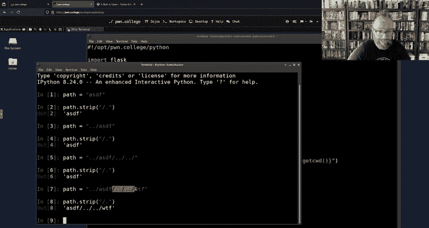

You。'Never had a flask class， there isn't you know。

 flask and CSE 220 or whatever and whatever earlier curriculum。Computer science。

 modern computer science。Is of a breadth that is simply unattainable。In a quick curriculum。

Youve had two years of computer science before hitting this class。And there are certain things that。

I feel you should know by now that， you know， we're trying to introduce rapidly here。

 but flask isn't one of them。 I don't expect you to have ever seen flask before。

But I do expect you with this class。To learn how to rapidly learn。Right，So flask is a good example。

 You see this for the first time。And you can't。If this is confusing from a。

What's going on perspective？Oh， flask。这 don有。

Boom。Last has a tutorial。All right， and we can。Dig in。And see here。Little test application。

We can read exactly what's going on。For every flask。APpiI used in this little application。

 I can do flask abort。

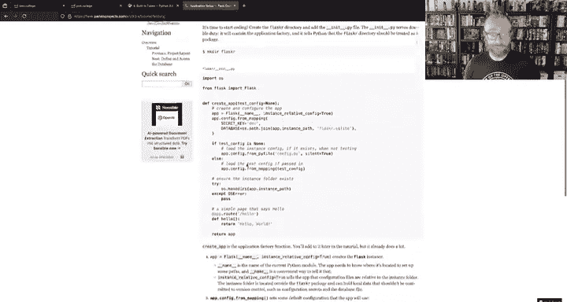

It's Google， there's a stack overflow。 What does S board do？

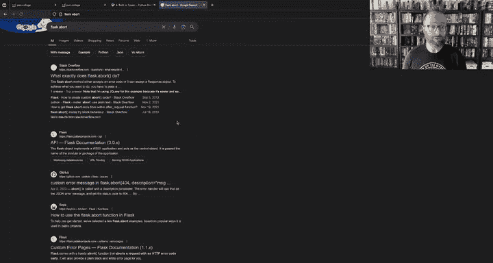

There's an answer。Fask a board method， accepts an air code， accept a response object。Okay。

 that Er answer is not very useful。

So， let's go。

Okay，How to use the flask board？

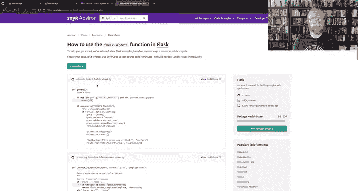

Alright。That's just code examples。Okay， tips and tricks。 Look at that。

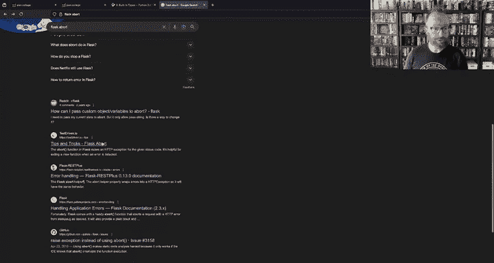

The board function flask raises an HP exception for the given status code to help for writing a view function when error is for exiting a function when the error is detected。

 Okay， that's cool， so it exits the function， returns an HP exception。Okay。

 here's another flash documentation thing。 handling application errors。

 Let's search this for a board。F comes with a handy abort function that aborts a request with an ACP error from I have no idea what this is。

 I'm going to put this in a box in my head for later。And abstract that， so to。

Replacease it with something， right？So if flla cons with a handy abort function that aborts are request with an AB error from something as desired。

 Of course， I know what this is， but you don't have to know what this is。 It of aborts。

A request when they sp from something。 right， Itll all Itll also provide a blank plain。

 blank and white error page for you with a basic description， but nothing fancy。

Okay， that's enough for us to read this code。If there's a permission error when opening this file。

 view board with an ACP 403 error code。 Okay， what the hell is that。

 Well let's search ACTP error codes。

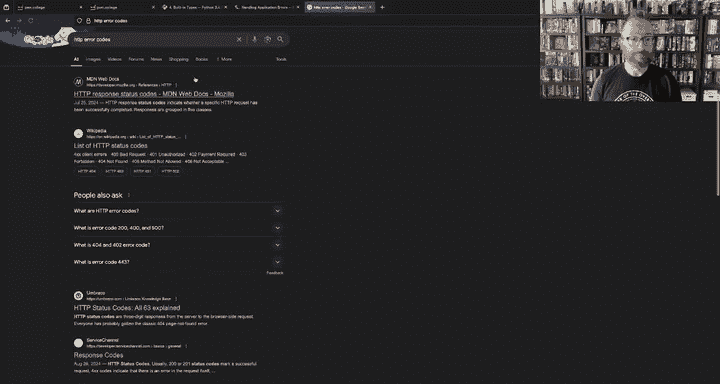

And we come here to this very nice。Documented as a bunch of these HP air codes and 403 forbidden。

Just the narrow code that gets sent to your browser。Okay。

And the message that it sends along is the path that was forbidden。Cool， let's trigger this。

 So if I just run challenge server， it's going to run as rude， et cea， et cetera。 If I copied out。

And run it now。That's really。Okay。Run it explicitly with Python。And。Well， I have to do some setup。

 so it needs a files directory。And then this pause directory。I'll make two files。Okay。

 and I will make one of them。Okay， for version denied， okay， this C mod， you learned a lot of C mod。

 but you mostly taught you the symbolic way of doing things what I just did is user group owner minus RWx2 that removes all permissions。

And now we have a two file that has no permissions， okay？We recreate the scenario here。

The curl challenged that local host when we run it ourselves。It opens up port 8080 here。Practice。

 okay？All right， no index here， so here's 404 not found， that's another one of these error codes。

When there's no file found， okay， that's cool。 And here we see our。Error， no home hacker from。 Okay。

 very cool。 So then if we say， let's get the one file， that works。 That's our high file。

 We try the two file， boom 403 perbidden。😊，Permission denied for this guy。cool。All right。Awesome。

 so now we've learned just from looking at this。

Fask。And then Fl board。 And what's left app do route， I guess， is new。

 A lot of this other stuff is new。 But the key thing。

Is you're going to be exposed to an enormous amount of。呃。Different knowledge， different APIs。

 different frameworks in this class already。In these first several， several。Levels。

 or let's say this first module， you have been exposed to just flask this your first exposure flask in these two levels。

And you've already seen the shell。 so this is nothing new。This you start getting into SQL。

RightThat's a huge thing。 That's a huge additional technology that maybe you've never seen before。

 You ra have to learn enough to understand the challenges。 And that's the key。

 When we were reading this HP handling errors thing。

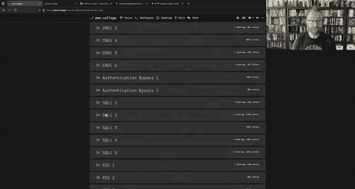

There's this crazy word， wherezug。You can Google this and you can go down the rabbit hole of Python's HTTP server。

Standard APIs， et cetera， et cetera， et cetera， et cetera。But you don't have to。 You can abstract it。

 say this is something。

If I hit a complete that end。And I， with the knowledge available to me， I've stalled out here。

 then I'll dig in。If I have no other promising path to getting the flag。

 I'll go learn what that thing is。And then I'll see if that has a bug。

Or has some security property that allow me to get the flag。 But until then。

I have learned what I need to learn。 oftentimes that is deeper than the average developer of the tool digs in of an average developer using fl。

 you know， you might at some point， this is just an example that doesn't actually hold。

 but at some point you might have to dig in and like understand exactly how a board works。

 there's no challenges and Poca that need you to understand exactly how board works。😡，But。嗯。You are。

you know， you might face an analogous situation where you need to dig in and understand deeper and deeper。

 but a lot of doing this wide security analysis is understanding things just enough to be dangerous。

Cool。All right， so that's for flask， right， you could ask a similar question for SQL。

So if you go and launch up one of the SQL injections。ItsSo fast， it's insane。系。

Launch have one of the SQL injections。And now we're looking at。

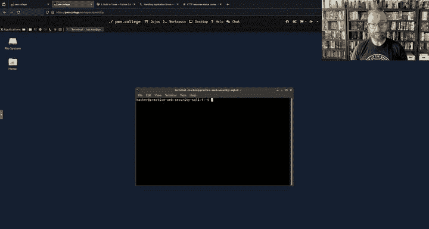

The server here。

That's too big。系呃。

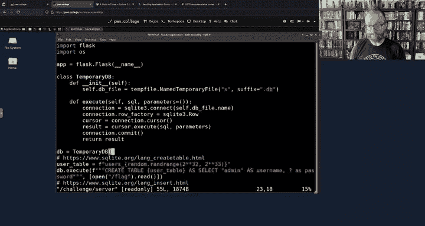

You know， you might say， okay， well， wait a second。 What is。

 what is all of this temporary DB stuff here， you just use it。

And so what I would encourage you to do rather than trying to understand the script line by line is to understand the script at a high level。

And then dig into the part you don't understand， what is Db。 execute？

I mean， the D that execute。

And then you get a bunch of different things for a bunch of different technologies。 that's too broad。

 right， So then we just go in， okay， well Db that execute。

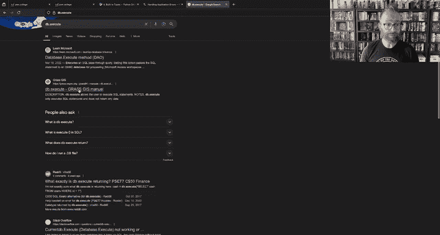

Db is this temporary Db。 temporaryemp Db is a Python class that provides execute method。

 What that actually does。Is do this weird。Here's our SQL query。Okay， we connect to a database。

We do something weird， we do something weird。Then we pass our SQL， aha， that's controlled by us。

So what does that allow us to do？let's look at cursor that execute and cursor is a result of connection。

 that cursor and connection is a result of SQLite 3 connect， so you're going to search for sQLite 3。

 connect， cursor， execute。

And it brings us to the scoite documentation， which we can read here with plenty of examples to understand how this stuff works。

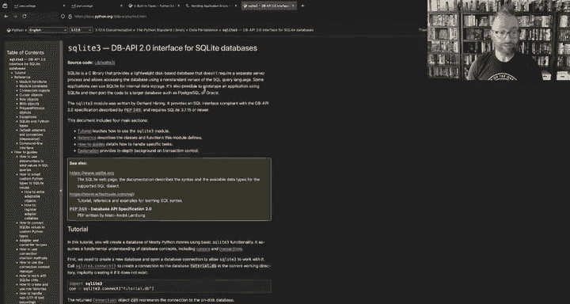

All right， so that reading document or digesting documentation module of the Lix luminarium。

Man pages aren't the only source of truth， right， They're a great one， but。In this。

Module and very heavily in future modules as well， you'll have to Google you have to read documentation and so on。

嗯。Cool。All right， what else do we got other questions？I mean， I think at a high level。哎。

A lot of people are asking me like， how are we supposed to know this stuff， right？ Well。

 I don't expect you to know。

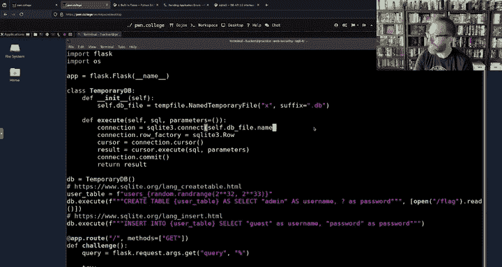

A last。I definitely don't expect to know fast。But I expect you to learn it。To learn it enough。

 to interact with the challenges， to understand those security issues。嗯。In a very real way。

 this class is about learning to learn fast。Learn what you need to approach。

The assignment to explore the security issues。Fast and just enough。To be able to dig in。

 there's a class of cybersecurity competitions， a class being a category in this case， not a course。

 a category of cybersecurity competition is called captureture the flag。

 which is what Po College is modeled after a typical capture the flag。Contest。

We look up the kind of global tracking website of these。

 a typical contestant after the flag lasts for 48 hours。 Here are the ones that are coming up， right。

 So we have。

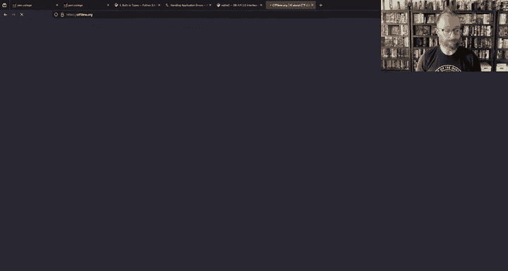

5 contests coming up in the next two weeks。 If you look at at this one， for example。

 this starts on 5 PM。 No。 Yeah，5 PM UTC on。Friday and goes to 5 PM UTC on Sunday。

 So that is 24 hours， a typical contest that's 24 hours long。

 Let's look at one that just finished right now。 Wow。

 there's six of them running one that just finished is。I don't know， let's look at cyberspace CTtF。

 cool。We look at the challenges here。Let's look at something that's running right now where we can look at some challenges。

Does this have its challenges open？Seeessaw is a big undergraduate one that that runs every year that I have to log in。

 Alright， a typical CT TF will have a。

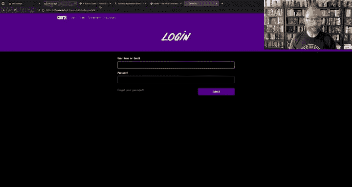

Anywhere from 15 to 30 challenges。That。A team of hackers will typically attempt over the course of 48 hour weekend。

Right each of those challenges might require。The hackers trying to hack them to learn a completely new technology。

 One of my kind of go to examples is to。

Sold the reverse engineering challenges years and years ago， I learned Verlo in one weekend。

 deep enough to implement a timing attack。Against the Verlog circuit。And no deeper and no shallower。

You have to know how to very rapidly learn this tech。To learn a new crypto algorithm， to learn。

 et cetera， et cetera。To deal with emerge security situations。

 40 hour capture the flat competition that's。Not very， you know。Real world， right。

 But a two week long security assessment engagement。 that is。

That happens all the time if you can learn something in 48 hours， you can learn it in two weeks。

At less of a breakneck speed and so on。 And these assignments。

 they're two weak assignments where we do expect you to learn a number of new technologies that we don't explicitly handhold you through。

 We don't have flask lectures。

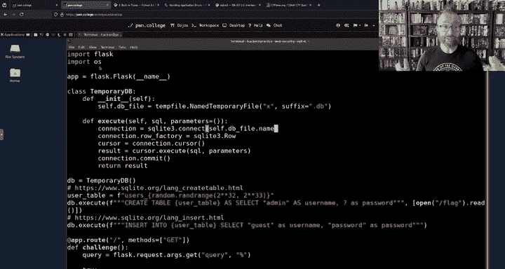

You have to find。The flask documentation and learn that on your own。

 and a lot of the feedback of these this style courses is， well， you didn't teach me flask。

That's absolutely true。And someone on a Titch that experience like this gives you confidence to be able to go off and learn on your own and that's。

Probably the most important skill you'll get out of this class more than how to exploit pastversal。

Patch tra revversals are a real world problem if you actually look at， for example。

What's a good CV search CVEs are the common vulnerability enumeration is a basically a score board for vulnerabilities。

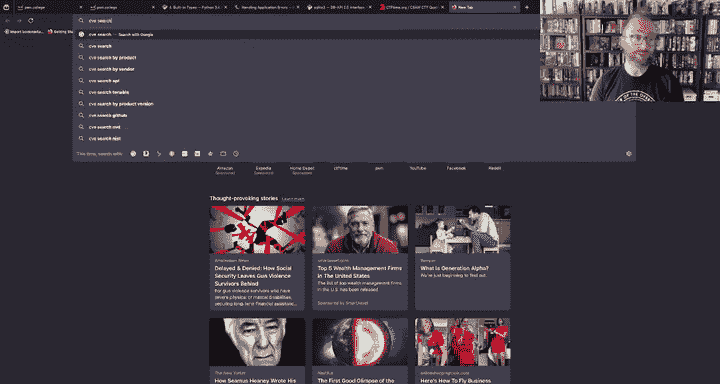

So。

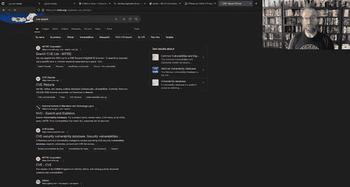

We can search for path traveral。And find recent vulnerabilities that were reported with past traversals。

All right， so there's an application， ABC D2。And in ABC D2 up to version 2。2。0 beta 1。

There's a command patch revveral。 There have been just this year。

An enormous amount of past traversals。 This thing that you're learning to get flags on phone college。

I mean， these are real bugs in real applications。That。That's a lot of fast reversals。 Actually。

 that's more than I expected to see。 That's all from this year。 that's TV 2024。All right， finally。

 even 2023， real bugs that someone was found in real obligation and reported。

And got credit for and put on their CV， see。Vendors， smartty pants。

And the credit goes to Catd father。 Pretty cool，hu。

 So you two can have your handle on a CE if you learn patch reverssals well enough， or let's say。

 sQL injection。There's a better way to search these things than by keyword， of course。

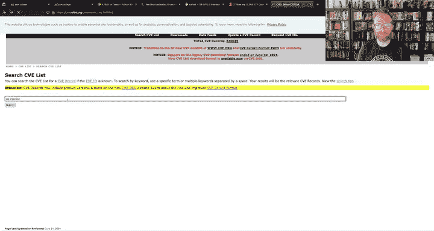

They're like categorizing everything。Boom， sequel injections。In 2024 alone， we just keep scrolling。

Keep scrolling and keep scrolling。This is how many SQL injections exist in the world's software just this year？

That were found just this year。 Oh， leash shit。Wow。Oh， there we go， finally， we're done， all right。

 now we're done last year， okay。So comment on Twitch， yeah。Yeah。Getting building up the skill of。

Like Lu Boy on Twitter says。Quickly learning the， the， the fundamentals and finding the fundamentals。

 You'll notice when I first searched for Db that execute， it was the wrong thing to search for。

 And I got weird results， figuring out what to search for。

How to learn it fast。And how to maintain the right abstraction。 So you don't go into these crazy。

Rabbit holes。That's an important skill。 And I think the only way to teach that skill is to。

Come at you all with 27 crazy hacking challenges。All right。Awesome， any other。😊，Questions。For today。

 let me check Discord。The link in the chat didn't work， that's weird。I but people are here。

 so the stream is working。The link is adding decimation point。 Oh my God， that sucks。

 Let me edit that link to remove decimation point。Disord needs。To be a little bit。

Less equal with links。 All right， link edited。Sweet。All right。Okay。所以。啊。Other questions， comments。

 eta。Like I said， there's an office hour stream。 I'm here to answer your questions。

 Could I please go over。Command injection 6。哎。I'll go， I mean， I'm not going to solve command E 6。

 but I will take a look at it。I mean， obviously I wrote this thing， so I know how to solve it。

All right， so command injection 6 has a pretty， pretty big hint。诶。You'll be stunned for a while。

 but will laugh at its familiarity when you find a solution。Let's take a look。How did I mess this up？

哎。What have we got here， This is bigger than our previous command injection challenge。Well。

 if you were looking at them， they're all pretty simple。 So what is this。

 It's the dear lister service。 We choose the directory to list the files of。 And so， okay。

 we've been looking at this whole thing in in in。You know， a text editor。

 but actually really helps interact with these things and see what do they actually do。

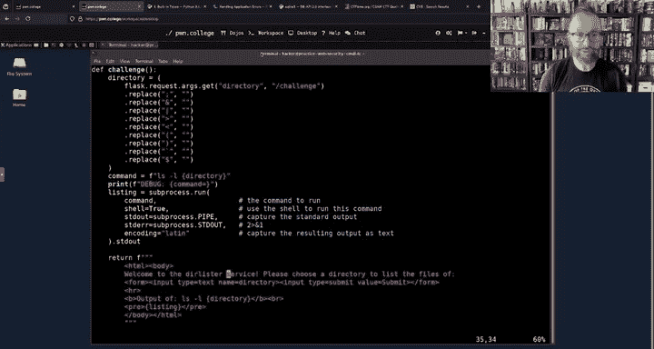

So let's do that， all right， here it is， that's a previous cache page because nothing's running。

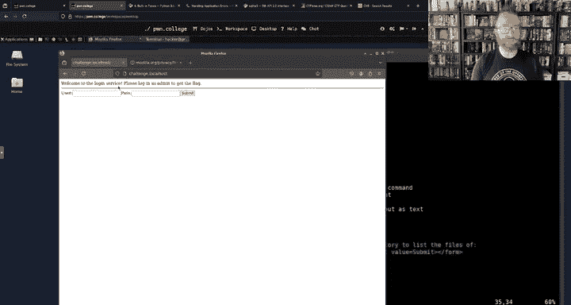

Okay。

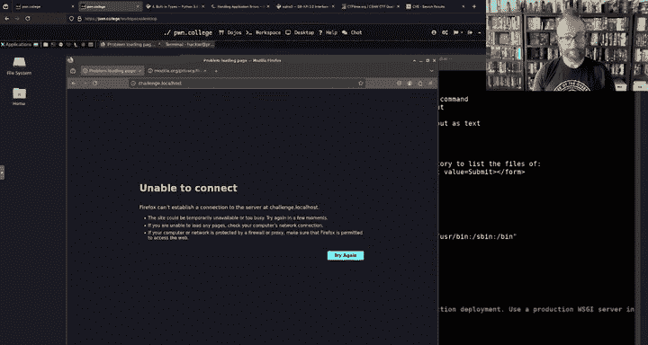

Here we go。Welcome to the De lister servers。Choose it directory to list the files of。

This is a slash challenge so you can do slash， oh that's cool。And this。Might seem like a silly。

thingh， but。If you ever log it into an interface of your WiF router。

It often has a ping like a ping option， you can put in an IP or a host and it'll ping it。

 a trace routeout option， a couple of other utilities like this。Typically。

 this is how they're implemented。 and typically they well， not typically。

 but often they are command injectable in this exact way。 Allright so。Very cool。 You can do slash。

 Now Of course， we could say， okay，y what if you do dott there， Oh。

 that's silly because we can already do slash。 What if we do slash flag or the LS slash flag that doesn't get as the flag。

 unfortunately。😊，And in previous command injection challenges as， you know， the。

Even the hint tells you， you can just just。Put a。A semicolon， right？And what happens there， well。

 you know。There。You would normally terminate a command and start a new one。

 and then you can do whatever you want。 But in this case。

The challenge。Removes。The challenge removes。The characters that you have so far used for your command injecting。

Purposes， right， so if you get the directory。From， from this form， and we replace it with。

We replaced replace all these special characters with all this stuff and that's really annoying。

So now what？Right， so， you know， this semicolon is an obvious one。 pipe you have used this。

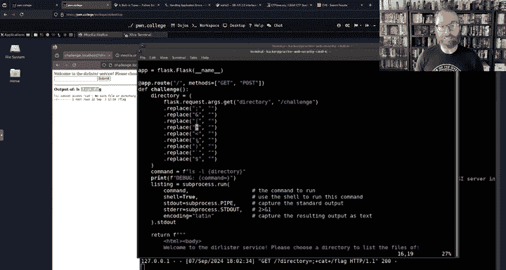

Another command injection methodology that you might have seen from。

 might remember from Linux Luminarium， but all of this gets wiped out。

So。We sit here and we say， well， fuck。How do we command inject？Well， very clearly。

 this is trying to do character filtering。And character filtering is very hard。For two。

 for many numbers of reasons one is。In order for。Well， that's interesting。That was a。

I guess one of those space time effects。 Okay， one reason why。

 why its's character filtering is hard is。The defender needs to understand the exact functionality of every character。

Possible to send。And what it does。 And that's simply impossible。 I've seen。

 let's see if we can find it。 There was an awesome sQel injection technique， where。😊。

People were filtering out quotes and stuff to try to keep their queries safe that they were building。

If you've ever。I'm trying to remember what what's， what's a good example here。

 If you've ever submitted， for example， if if you send money using Zel and you try to put in your description like。

 you know， why the money is for， try to put a quote or a， I don't remember they allow periods。

 but they don't allow a single quotes， et ce cetera。 right So if you。

Send someone money on Zal and you put as a Decman Jan's birthday party with a apostrop he yes。

It'll tell you， hey， no special characters。 That apostrophe is not allowed。 Why do they say this。

 Because Zel is a huge conglomerate interaction between a ton of different banks。

 and that data is going to end up in 100 different systems and whoever wrote Zel just knew We're absolutely certain that one of those systems would be command injectable or special character injectable in whatever context。

 not command injectable。 I might say， they knew that it was gonna to be sQL injectable。

 But or command injectable， or possibly CSV injectable。 there's all sorts of these ins that occur。

 And so they said， okay， you know what， we're just going to filter out any special characters that might be a problem just to avoid。

Has someone having。Command execution inside a major bank， right？Did they filter at all？

There are bugs that occur in。Unicode characters， for example， these are all UTF8 encoded strings。

 UTF8 is actually really complex。 And my sQL， for example， and this， you know， isn't my sQL。

 This is the shell， which isn't as complex， But， you know， sequel。Certain SQL database servers。

This is action information you don't need for any of this assignment And。

 and I wouldn't put too much stock into this。 But certain databases will。Actually。

 treat unicode quotes as quotes。 And so then you could use that to escape and to sQl inject。

 All right， cool so。呃。In this case。We're assuming that the。

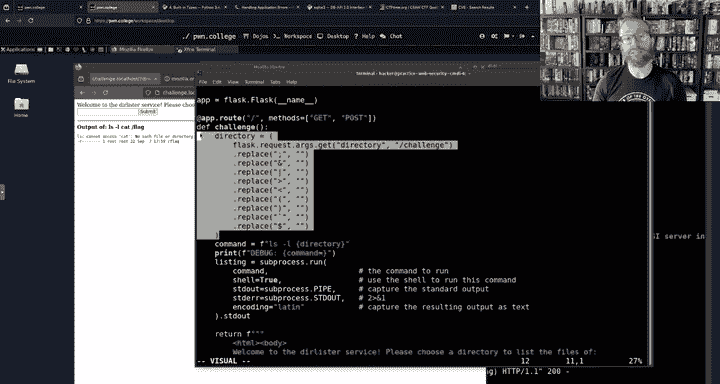

Developer or the developer assumes。That they looked at every character and they know every special character that has any meaning。

In bash。And they wiped that out。Is this really likely to be the case， probably not？Let's take a look。

So you find a list of all characters。

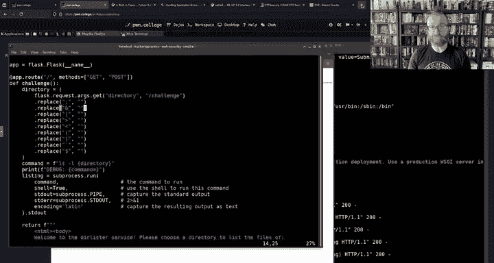

Cool list of Uniicode characters。

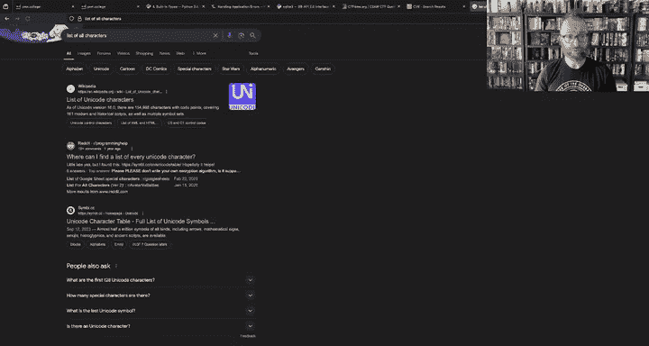

All right， there's 154998 uniccode characters。 We just look at each one of those。Just one by one。

 so let's scroll down。啊。And we just look at each one。

 and eventually we'll find maybe something that's developer didn think。 But， of course。

 this is way too big。 Alright， so Unicode， all of Uniicode， Uniodes are text encoding。

 read about it on。Wikippedia actually read about UTF8 which。Which I mentioned but。

It's not important right now。 The important thing is， hey， this isn't。You know， the web circuit 2024。

 this is the command line， the command line。Has to us from the 80s and the dominant text encoding。

ParaDm of the 80s。Is ASI。And that's a man page。These。A going to be all of the characters。

That matter in batch。So， ASI has。The character codes in different bases of every character。

 So capital A and ASI。Is。Heximal hex 41， that's a representation of an8 bytes of binary and a decimal value of 65。

 a noxyl value of 101。So this is。If we actually were flipping bits in a file， of course。

 all of these things are stored in。Fileles here on the processor， if we。They are all all。

When we open up a tax return and we type stuff， it saves， of course， bits on the file system。

 maybe Hs dump F DSSA。So here A I did AAA here， Hex 41， Hx 41， Hex 41， Hex 41， Very cool， alright。

 anyways。That's not so important。 actually， I went on the tangent。 I apologize。 We're just kind of。

I'm starting to fade after an hour， not enough sleep， okay。

 here are the special characters that could be relevant。

And we can see a lot of them are filtered out。There are some non principles that are also interesting。

Like， what if we send a null bitete？What if we send a backspace character， Well， are those special。

 bash doesn't treat those special。But there are other characters。In this big， long list。

That it does treat special， obviously。The letter G is just the letter G。What about a backslash？

What about， I mean， that's not the answer， But I'm just thinking out loud。

 What about going one by one and proving to yourself。That they aren't important。

You can't disprove their importance， then maybe you should try them out。Cool。

 thank you for the birthday wish that it wasn't my birthday that was just an example， but you know。

 my birthday does happen once a year。Allい。I'm going to cut it here。Had a good hour。 We will。

So okay， very important。If we go。Oops。We go here。You go to your course。And you hit web security。Oh。

 and you are logged in as a student， it will tell you when this is due， that's very important。

Do you have access to this if you're not a student， the checkpoint for web security。

Is Sunday night tomorrow night。At 115959。来。Please get to check one。 You just need8。

Uh of these challenges for the checkpoint， if you're stuck on command injectionjection 6。

Leave it for later。These are roughly。Until much later， quasi dependent。Different sets of of， I mean。

 they're all kind of build up on common concepts in that they're all implemented in flask。

 for example。 But， you know， you get batch traveral  one and you're really not getting two。

Put it around the back burner， move on to command injection and give a try。 You need eight。

Of these challenges for tomorrow， it's the checkpoint deadline。 You get 30% of your credit tomorrow。

 you get it or you don't get it。For 30% of the challenges round the down， that's eight。

So you get eight challenges。You've secured 3% of your grade plus whatever。

30% of the remaining 70% of the grade。coolol。

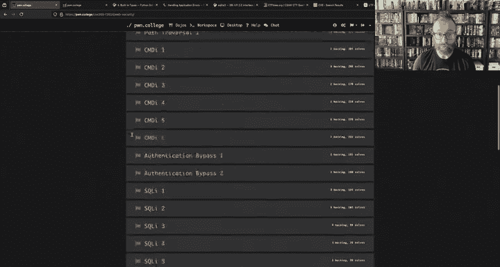

O。Awesome stuff。I will let you all go， Thank you for。Dropping by。

 let's put our back boom full screen and sorry about the technical issues that let to starting late。

 I think the next time will be much smoother， all right。Goodbye， hackers。

