# ASU《网络安全导论｜ASU CSE365 Introduction to Cybersecurity Fall 2024》中英字幕deepseek翻译 - P5：-06-Web Security - CSE365 - Yan & Connor - 2024.09.09.zh_en - GPT中英字幕课程资源 - BV1nVCVY9Ehy

I the memur， alright。Yeah。I'm sorry。the Twitch out is saying no audio classic wait。

 but the audio sets on， we can see the bar moving let me pull this up I good now something let me up。

Al right， perfect， Alright， great， Okay， so I got the Titch chat pulled up here now。

 we're good to go。 Alright， first things first， a couple memes about how hard web security is。

 there'， there's kind of squished down because the point is that Web security is not hard。

 You can do it。 In fact， we've had some pretty good successes。😊，Of people doing web security。

 about almost exactly two thirds of the class hit the checkpoint and a couple of people have even fully finished already still not quite where we would like to see with people kind of starting the assignments earlier。

 I want to reiterate that with these security。Hacking challenges。

They require a lot of depth of understanding that's hard to predict。And，Duration。

That it will take for you to establish that depth of understanding the first solve。For this module。

The median first are， let's say。Most， more than half the students。

I solved this module after Saturday afternoon solved the first solved over the module that's some heavy procrastination still that that ideally wed see people starting earlier so that you can at least get an idea of what is missing there right now I understand Linux lu and talking lab might have been。

😡，Can straightforward forward enough that that。People underestimated web security。

 please don't underestimate the next。Bunch of of modules for the foreseeable future we've kind of hit the level of difficulty where where things will stay for a while all right。

Other things observations on this thing this is first solve not first you know challenge launch if you have that data you said maybe add add that to。

To the。To the data as well， but I do feel like they start a challenge and then don't solve the challenge for。

Two days， plus。Okay， so there is some people are decent analysis。 Yeah Yeah， cool， Otherwise we've。

I don' know， got data if if there's something here that you would like to see， we can。

U try to surface that information and future updates like this。Awesome， okay。Then let's move on。

Again， a lot of people kind of left things。To the last day or or or。You know。

 the last couple of hours， some people。Just depending on how your mind works。

Can rush through and get the checkpoint And， in， you know， three hours。 Some people， it takes longer。

 and it is。A skill that is subtly different than， I don't know。 Good Linux usage or knowing how to。

Program well or something like that it's subly different and it's tricky again。

I want to call out Connor's infrastructure improvements we hit we hit like 900 people more than the Linux luminarium and talking web deadline。

 a higher load and the server was smooth as but it was crazy So yeah great job that was insane I just I was starting things just to check right at that and it was like click two seconds it was insane I did anyone run into any kind of server issues and of that。

Other than sunset， other than not sunset， but there's。Only so much we can do to keep sense safe， Fed。

Okay。Awesome， all right。Of course， instrumental to evidence success were our star helpers and just the population of helpers in general。

 please remember when people are helping you on Discord， thank them。

 you can either react with nuvote emoji or you can go to apps， think message。There is a definitely。

Kind of I don't know， it's not actually the exponential that you sometimes see there's a lot of really good helpers number one of course is。

The unbeatable rob wass and then we got Veify and Hanto noodles and the worm Superior， great job。

Some people。Tend to go for a hint。Get a hint。Go for a hint in the next challenge， get the hint。

 go for the hint in the next challenge， get the hint。The help works best when when you kind of。Use。😡。

The hint that's given or the guidance that's given。

And try to understand the path from where you had your understanding before the guidance was given。

To wear。The guidance takes you。Trying to understand that path and recreate it yourself。How would you。

If you knew the direction slightly better， how would you have gone forward and found that information on your own and then in the future when you're stuck。

 try to reapply that。😡，And I think if you're confused about like， how would I have known to do this。

 maybe ask the person helping you like how would I have figured missed？Very good question Yeah。

 because oftentimes they have figured it out in the past through maybe trial and error。Right。

In some sense。More than learning how to trigger command injections。

 what we're trying to teach you is how to。Jump into。An existing complex system。

 understand vulnerabilities。And reason about their effects。Right， and that is。诶。

A very hard skill to teach that we're。Only really ever been able to convey with。Basically。

 exposure therapy。Ran， this is your exposure therapy to this skill。Awesome， al right。

 I want't spell out this view， It's a little date， and it's about talking web， but I don't know。

 It was。 it just fits the format so well， right， and say time out and。😊。

Since the guy just walks out of it's， it's great just the format is good。嗯。

For the sad States I found， I wish it had come slightly earlier when you were before in the last game review。

 but it's great。S like time out does who walks them out， that's awesome。On the flip side of。

Wanting you to jump into a complex system， understand the things and identify vulnerabilities and stuff would be really。

Also trying to convey is you need to understand the salient points。Of the problem。

 you don't need to understand necessarily every single thing down to the very， very core。

 So you don't need to understand the history of sequel。😡，Mostly。To do a SQL injection。

 you don't even necessarily need to understand SQL all that much。Now， if you lack certain parts of。

The kind of knowledge of the subject material youll miss vulnerabilities。

As long as you have enough of that to know our the vulnerabilities to be able to spot the vulnerabilities。

And reason about the vulnerabilities from a security perspective that's sufficient Now， of course。

 we should all strive to know everything to the maximum extent possible， But if you you know。

 start in reading some Python and end up trying to understand。😡，How I don't know。

 electricity flows between logic gates or whatever've you've。You've gone too deep。

On back too greedily So you got to balance that and knowing that balance is yet another skill that's actually very。

 very hard to explicitly convey so far。 we've kind of been teaching it with exposure therapy again there's also at the same time。

As you're trying to balance all these concepts， etc ce。

 it's very very easy to let something slip like not starting the server and spending hours trying to debug your solution。

 even though the problem is that you didn't want the challenge right who here has been there？😡，Yeah。

 a couple of people it's a common thing， so it's a good beam。Sweet。I right。As you're， you know。

 debugging and run to serve just keep in mind。The server isn't some， you know。

Coloosssus built in bronze that that's that's unyielding to change。 You can。Use that code。

 modify it to help you debug and to help you exploit the challenge。😡，That is。

A common part of this as well if you want to set up the server。

 there's code at the bottom of the server you'll notice that chooses a port and if you're not running it as route。

 if you copy it out， start modifying and running it。

 you'll just choose a new port and you can interact with it on that port just the same as the original server。

 minus the fact that can't read the flag。😡，But this allows you， as we did it on Wednesday。

 to tweak things， to insert debug statements and so on， or to modify it to utilize it in your attack。

So don't。Fel the need to implement all of this stuff from scratch， You can。

Cheat off of our server implementation that's publicly available to。😡，Um， all right。

 the most common meanme category by far was command injection six who here。

Ran into a wall of command E 6。All right， who pushed through that wall？All right。

 who I really enjoyed that process。a couple couple hands。

 That's good I command injection six was much trickier than not necessarily trickier than intended。

 it's intended to be tricky and then it's intended for you to kind of look back and laugh Who look back and laugh。

All right， well， okay， we maybe not everybody， you know， that's fine command injection six。U oh。

 I'll come back to right， commanding action 6 is is where I felt there were a lot of very good。

 actually really helpful memes。Right， these two memes taken together。

Are the solution or the the solution fast to command injection 6， right？ So theres。

Something that's missing in that filter。In this case。

 there's something that's missing in that filter next year。

 there' will be command injection 7 where there won't be anything missing in the filter and then what。

 But for now， there's something missing in the filter。 How do you find it。

 Well you look at every single character， that's the output of a man ASi up there， As CII。

 It's the text encoding of the。It's let's say the legacy tax coding mostly used in the command line。

And it has。About 128 odd characters， and you just look at each freaking one and prove to yourself that it won't help you solve command in action 6。

😡，All right， that's the path。Go walk it。 The memes show the way。 There is some evidence that。

SQL injection five is shaping up to be the next mini boss。嗯。

we'll see if if people truly have a lot of problems with this there are two memes I forgot to face the second memes so maybe next week we'll be seeing all SQL injection five memes that's totally fine and then there are a couple other memes I want to call after making me chuckle in an informative way right like top left is great HTP encoding who here gets that。

All right， yeah， you know you're asking that's good。

 that's good and then top right we didn't have a lot of encoding base challenges for this one because I don't know every once in a while we decide just on kind of vibes that you know what this class of vnerabilities is kind of lame like you know。

 filtering bypasssses due to encoding this is such a。Silly thing。

 It's like format strings in the binary world。 And then you say， okay。

 we're not going to teach you this， you know， it's like you can。Google it yourself。

 but then I don't know， probably we should so probably next year we'll have more encoding these things I don't know。

 you'll see you definitely have a whole format string module again in the later classes anyways。

 all right。Finally， don't rely purely on memes and hints。

 I spoken to a lot of students that have issues， they rely on memes and hints and he said the hints aren't helping the memes aren't helping andm like well did you watch the lectures this slide actually and then oh I'll go watch the lectures I guess right so like the lectures are there for a reason and oftentimes watching the lectures can help you understand the memes and the hints。

😡，嗯。Be kind of pulling back the curtain on the run up to this class， Connor had to like。

Talk me out of making the lectures。Mandatory and locked behind you havent convinced and say that you understood the lecture so don't make us do that that that's going to be a big pain to ask for everybody。

😡，Including our budgets。爱。At the end of the day， you push through like the the the four people that have full solves now or no 4% the 4% of the class like 20 something people that have full solves on web security。

 they can， they can。Sill out like Rob over here， this is the the look a of a man who can do web security in his sleep。

And you can have that look as well if you， I guess， miss out on enough sleep。

Um， and it's just awesome so who here is done with web security if you want to self identify？

All right， does it feel good？Jills pretty good。 Alright， awesome。 Okay， that's our meme review。

 Classm just skin。 Let's move on to kind of approaches and。😊，Kind of the vibe of， is that the right。

 right of u tackling the these u these things， Let me catch up on Twitch real quick。Sweet， okay。

Now before we dive in。Any specific。Questions。That anyone has。Otherwise， we'll just dive in with our。

Predefined programming， okay。So。A couple of。Things I want to once again kind of walk through not the challenge or the challenges。

But walk through the approach to the challenge， right？And I'm going to use command injection one。

 probably for the。

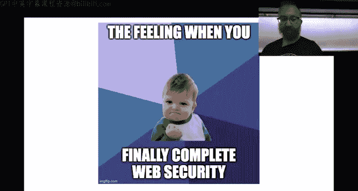

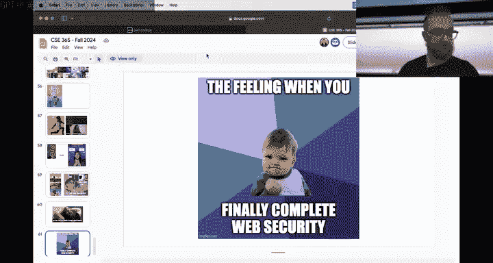

exampleample。And then we'll apply that to a somewhat much later level， okay。Yeah。

Why does this have so many salts Because you click Oh I clicked onm talking about I actually very confused Okay。

 web security a looks more like it All right， let's pull out command injection one first things first as we approach this please read all of this right and then I know a lot of people two thirds of the class in fact have probably solved command injection one 795 so much more than two thirds but I'm using this as an example of how to approach these things。

Maybe should we。Grab a later one like sQL， we'll start with command injection one。

 then I will move on， apply this concept to SQL injection one All right。

 hit practice spins up when seconds absolutely unbelievable performance。All right， now we are。

Seeing a black。Okay。ok。That's cool， but he， it loaded up really fast。We refresh， Okay， good， okay。

Let's start。Here。Okay。Make this big。What， it didn't actually make anything bigger。

 you just removed the bar。Okay， whatever this is， this is。Not a real operating system， all right。

It's fine， we'll zoom in。Yeah。Okay， so。Let's look at the server。Command injection。1， all right。

 our survey here。As you're all familiar with at this point。And I。

Grabs a directory argument and then LS is it， right， and we all know based on the name。

 there's a command injection here and again。I want to start from kind of the beginning of our thought process where。

The thought process from this security class is。From a security perspective。

What is the security policy that this script should adhere to that we're going to find a violation of right and I think probably over the next couple weeks we'll dig into this concept of security policies and and security specifications and violations and so on a lot more do a couple more lectures to convey this。

 but for now let's focus on using this to solve these challenges right so this script should be secure it should allow us。

To。Use its intended functionality， which is the listing of directories， and it should not allow us。

To violate， for example， in this case， the confidentiality of the flag file。😡。

So this script should not allow us to read the flag at all。

 but that's the exact security property that we want to violate。We want to read the flag then。

Having established this， which is just automatic for any Po College level。

 we move on and ask ourselves how right and knowing it's a command injection and also knowing that almost any time you see a string and then just user input get e into that string。

You know that。That's going to be a problem and our attention turns to how do we exploit this problem。

 right？😡，So there's a lot of shortcuts there。Knowing that there is。

This commandag knowing that user input is being put into this string。

 All of this requires us to first。Understand the challenge file。Understand the source code。

 the program that you're trying to attack。As important as the initial security property that we're trying to violate because of our security property that we're trying to violate。

Is that I don't know， there is a whole other computer more in the later levels like the victim that's trying to do to list directories and they absolutely need to be able to list them correctly for a security relevant thing。

Our tag becomes very different。What we look for from a security analysis perspective becomes very different。

But our security property if we're looking to violate is。Leeaing out the flag file。

And what we're trying to do that with is this server that has access potentially to the flag file because it's running as root。

😡，And。To reason about this， we need to understand this server。

 This involves opening up a Python program that someone else wrote me and Connor。😡。

And understanding it， who here before this class？Has understood someone else's code。All right。

Awesome， who has not。Okay， you've got a good amount of people understanding other people's code Fer is understood code more than100 lines written by someone else。

Okay， a couple of viewers still got it awesome， so fundamentally， then you've done this。

You look at this code， you go through all of the。😡，Every line。And you learn。At at least a high level。

Not to understand what it does or to put on the back burner。Right。You look at import subprocess。

 if you've never seen Python， you look at what does import do in Python。

 you look at what is the subprocess module， the subprocess module is a module that lets you interact with launch and interact with processes。

 that's cool。😡，From Linux Limin， you know that a process is the instantiation of a running program。

Right one of these programs can be CA which will allow you to read the Fl file that's neat Flask we covered last time right Flask is a web server module in Python that's how this becomes a web server and so on and so forth right and you read through this and you realize oh。

 what is this。😡，Little F before the quotes， that's a format string in Python。😡，That creates a string。

 where。The user's input is added， and then that string is passed as a command to subprosses。 run。

 So now you're interested in subprosses。ron， you look it up subprosses run spawns processes。Awesome。

 okay， now you understand all of this stuff。Now， you can。

What I would recommend is interact with things dynamically。

Dynaically means actually running things and interacting with them。

I've seen people get surprisingly far in the challenges。Just running。Currentl。At some point。

 if you're just using curl to understand all this stuff， you're going to go crazy。

Who hears just used curl so far through the whole app。 So most of the class is on a surefire path to。

Being not very happy about Carl。Curl is a good tool。

 but it's like if you try to eat every single meal with a fork。And then someone gives you some soup。

 sometimes you eat soup， you need to reach for firefox。Right， and so we've now looked at this。

 of course， again。You've almost all done this。Through various techniques。

 but this is kind of the golden path for it。 we launch the server， it says okay， hey。

 go to the Cha on local hosts， all of this stuff it's web stuff that is meant to be interacted with over the web。

You got to challenge that local host。

7。And here we are。We can interact with this。Normally。

 you can see what happens when we hit slash flag or rather just Ls is slash flag， What happens。

 you know， and so on。 And then eventually。We can interact with it and solve the whole thing。

Right much， much easier than curl， Who finds this a little easier than curl？All right， awesome。So。

Don't get trapped in one approach。

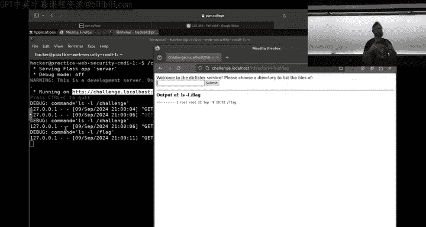

Try using。The the ways that systems， you know， are meant to be interacted with。

And if that doesn't work for that level， it's trivial enough， it'll work if that doesn't work。😡。

Think about， how can。I aid my understanding of this， well。We've identified the problem， right。

 we've seen that we can inject。Input into here。 and it gets run。

 And the name of the challenge in this case is command injection。 So obviously。

 we're on the right path， but don't obviously overre relyly on the。On the name of these challenges。

So。Now you might be trying to pull things off， you might not be using Firefox。

 you might be using curl or Netcapt or you know， and things just aren't working。

 you just don't understand what's going on。Well， now we need to start debugging。Right？

What can you do， There's a couple of things one。Short on， on， on。Uh。

 Wednesday that you can start just editing this this server if you're in practice mode and I am I in practice mode。

 let's check。 yes， all right。If you're in practice mode， you can just start adding。Output， right。

 But there's not actually a lot of debug output to a here， Not a lot of different things。

 But what you can do。If the curl is whats screwing you up。

If if you're having trouble bridging the multiple concepts involved and this holds per later levels。

 especially you're having trouble bridging okay， I have a HTP that that that I have to send the request with that has a。

Htm in the request that then in that HTML， there's a JavaScriptscript that then makes an HTP request that then has a specific HTML inside like this can get absurd doing it all at once and to act。

Right。Then you can start decomposing the problem。Here there's two technologies at play。There's ACTP。

And there's the shell， the command line。Well， once you identify the inner problem。

You can create a proxy challenge。That explores just that without you having to deal with HtP。

 So let me show you how I would do that in this case， I would just。

Identified the specific thing I want to look into is this I want to figure out what the hell is going on here。

And。This。Everything else to me is irrelevant。 I don't care about HGP anymore。I delete this。

And I delete everything afterwards。And I returned this， I change it with print。Listening。好。

And because yeah， print listing， all right， now I'm just going say， hey。

 instead of waiting for each T request， we're just going to keep running this Okay。

 now all I'm missing is this directory thing gonna say directory let's get this as input from the user。

Cool。ok。Booom， I've changed the deal。Now you can run this server。Get the de input。

It tells me the flag。Or it tells me the the command it built and then it runs it。 And now。

 without dealing with curl or in later levels， without dealing with cross cyberf request forgery and this and that and so on。

I can just mess with this to figure out what the hell's going on。

This is incredibly useful for more complex challenges， right， I can say， okay， hey。

 well what is what if we do， I don't know that's this or whatever All right， well that's。

Interesting because it shouldnt have happened。啊。Be careful。When you start tweaking things。Because。

I took out a very important thing here。When I edited that in the beginning。

 I had an OS set UID set RS UID OS。Go E idea。 I had this line in here by taking it out。

 I broke the challenge because there's a this disableds effectively a security mitigation that actually。

Tryice to prevent this exact。Tyro command injection。小。This now should work。But now。

So now things are getting more complex， we've made a bunch of bugs in our code。Okay。

That has to happen before my loop。 Then I have to import Os and fool just when you're slicing and dicing the challenge。

You might break things。And then you have to go back to understand what you broke to unbreak it。

And then that has a whole other thing， what's going on here？I it's just Sa U I。All right。

 now I can do stuff like， okay， well， what if I do try to do this？Okay， doesn't seem to。

Have really changed the output？LS is my home directory here。 What if I you know and so on， right so。

是。You kind of went a little off the rails， a couple of of things。As you。Modify this。

Keep in mind the context。In which each part of your exploit happens。

 the context at which this command eject happened was inside the web server。And the web server。

 when it starts， changes directiony to slash challengellge。

So now I also have to change their director to slash challenge。Now this and this。Have a。Yeah。Proper。

呃。What's it called？Have the consistent output with the actual challenge problem。

This is for command injection one， right， how would we do the same thing for a much more complicated challenge right so let's look at that right now。

All right。So people have been coming here with。Come to us with questions about SQL injections。

All right， start this。Check it out。7。Okay， question on Twitch， how do you open the link？

You're running the challenge on。 I don't quite understand that。 but how did I get on Firefox。

 That one's easy。 I clicked on the desktop。 this little link right here。

And then why is this happening？I think it's just。IThink process to axis is load right now and just taking the slot to load the actual okay。

To launch FireCs， I click this little globebe or go to App's web browser。😡，It's that simple。

And you wait for it to load up。I launch Firefs inside the Dojo so I can go to the exact same。

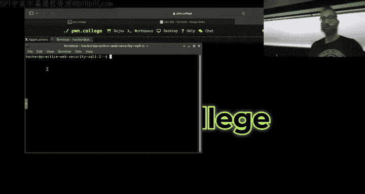

Ul。That's over here， you can even right click on this。😊。

And just said open link and it'll actually open it in Firefox。系。So。Here we are。Wait， I want the hell。

Okay， Firefox is acting weird there， but here we are， here's the index of。This sQel  one。

 And so what a lot of people。What I've observed a lot of people doing to approach this problem is opening up。

The challenge。

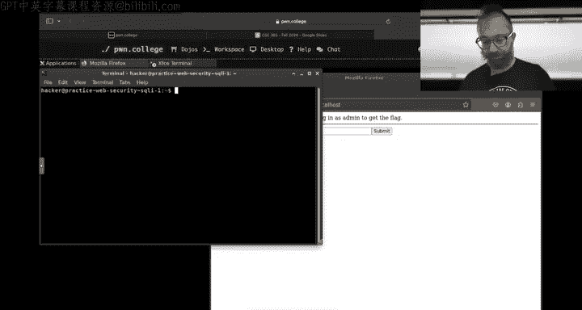

7。Okay， we open up the challenge。We copy。This entire。72 lines of code。

We copy the challenge description。 we paste all that into Chad GPT because sensei hit a limit。

And maybe me just say， how do I solve this and we hitnt？And you know what。

 CadgBT might help you with this one。And I've seen。Several cases now where ChaGb helps you enough。

If you don't learn anything from it。 Then you go to SQL 2。

 and then you monitor enough of the discord and so on to be able to get that。

 And then eventually you hit the point at which your conceptual knowledge has lagged behind so much。

That these challenges become unsolvable。Right don't do that， so if you look at this one and say。

 okay， again， what's the security property that we're looking to violate？Anybody？

Was the security property？Of this challenge that we're looking to violate Yeah， what's。

 what's the goal of our attack So basically no， no， no， no， no。Higher level。

 you haven't even looked at the challenge yet。呃。too deep you haven't。I。Burst into your room。

 screaming， time to hack。 What's your goal？That's not a goal that's a process， what's the goal？Flash。

 okay， if you start out， boom。You got to get the flag， Okay， this informs everything you're doing。

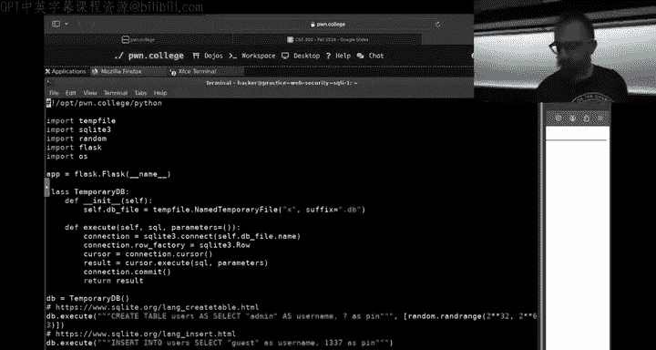

After this， right， so he searched for flag。Okay， easy way to go， okay， look。We can get the flag。

 that's awesome。Okay， how do we get that Well， our username has to be admin。😡，Okay， then。

We might hide back up。hopop back up and then we say， okay， well， hey。

 amin has this pin that's a very large random number that you're not going to guess。Okay。Well。

 how does the login work， let's see。Admin， where's the username。

 the username gets set over here and again， this is something that we need to understand Python for。

 this little what's called the walrus operator， the this sets the username。U。

 and it gets it out from the flask session cookie。Then I go and I look out the lastask session cookie and I realize that。

 hey， all the documentation of last session cookie says that it's protected by。The Flaskka。Sver。

 the flashax server's secret key。Okay， or can I get predict the secret key no？

It's a large random value， Okay， so I can't forge the session。

Then I started looking in at every line。I start reading。What the heck's going on。

 And this is where I need to understand some sequel。And look at this create table。I say， oh， okay。

Admin with a pin I remember this， right， this large pin。 There's also a guest user with 1，3，3。

7 as a pin。So I bet I can log in as the guest user。 Let's test that out。I go to Firefox guest 137。

 enter， says hello guest。Very cool。I can log in。This tells me something about how the program works。

 helps me query my understanding， build a mental model that's equivalent to this program。😡。

So that I can then reason about its security properties I go through here and I look at what I just did this is the post method for slash and it looks like it gets a username and a pin from the form。

😡，That I must have just filled out now I'm making these sort of connective leads between my mental model and the code I'm reading here。

And then I read this very interesting line。And see old format string。

 that's going to go badly for this thing， Not that every format string in Python is vulnerable。

 but a format string that takes user input。Because I just saw that this pin comes from a form and sh it directly into a。

String that then gets actually query。That's， that's not good。Cool。All right， so。

I found a sQL injection and of course， I can test this out by saying， okay， well。

 if there's a sQL injection in the pin and say guess， and then the pin is going be， I don't know。

 some sQL bad sQL like a semicoman hit enter boom。

Cashes the server。So this is the query。That has a syntax air， pinnas semicolon。

So that's where my SQL is going to be injected。😡，That's where I'm going to pull off my SQL injectionnerability。

Now what？Now you might have started doing this in curl， curl， dash dash form data， all of this crap。

You can just do it in the browser， in this case。These web vulnerabilities they're made for the browser are there。

😡，They're not made for the browser， the exploits are made to run on browsers， et， et cetera。

 oftentimes the browser is the best tool to debug this stuff。停。😊，Not always。

I want to debug this I don't want to deal with the browser， let's say。

 even though all of these I did just。Right in the browser， but。I want to understand more。Of what。

The the query does and the query is， so I'm going to do the same thing that I did before。😡。

I'm going to recreate this whole thing。But。Slicing out everything I don't want。So。Let's delete this。

Oops， I need to do pseudo for this。There's a question on Twitch if you can use a regular browser if you're using SSH or you need to use the desktop for this。

 you need to use the desktop， there are various technical reasons why your regular browser won't work that has most mostly to do with the technical reasons behind why the challenges are hosted a challenge that local host。

😡。

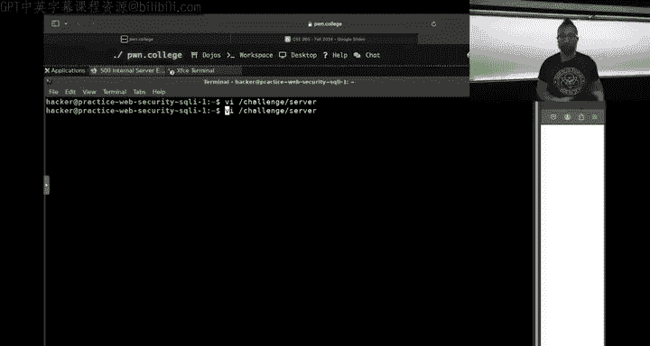

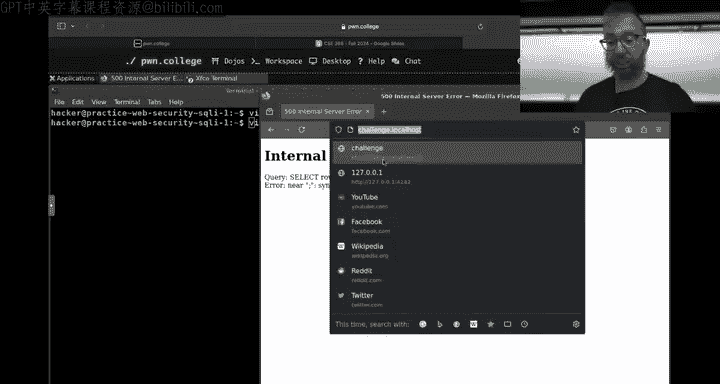

If if you use your web browser。😡，You could， and you can hit that port。

m just peeling back the curtain a bit over here I have。Slash workspace slash desktop。

 I can do slash workspace slash 80。And if you curl at bez， it might work。

If you curl and then set your actual host header from phone college to Ch at localos。But。

There's all sorts of other stuff that'll go wrong if you allow you to do this。

 specifically in the later levels， All right， anyways。Um。

 why can't we use tailscale or wireguard Vpn？The Dojo is open source。 If you want to implement that。

 we are all forward。 We accept PRs right now， this is how you。Interact inside the dojo， okay， so。啊。

once again， I forgot to use pseudo to edit this。 All right。

 so I want to surface the issue that I found I want to decompose it。From the rest of the program。

 because I don't want to deal with ACTP， et ceatera， while trying to understand this SQL。😡。

And of course， this is a simple sQL injection， but this gets more and more critical as time goes on Okay。

 so I go over here， I see what needs to stick around。 None of this needs to stick around。

None of this needs to stick around。 I know that the moment I can log in。As the user。

As the guest user， I can。Let's say maybe' I'll keep this and say。Do print Nope？Else。Print Yip。

 so I modified the success and failure。casesases from HTP to just。

Being printed on the command line Here we have this。The the username equal， I mean。

 let's just say I want to log in as admin， right， because that's how I get the flag。

And then I say pen equals input pen。Okay。Then I delete all of this and none of this matters。

 this does， I still want to have the database， I need to query it。😡，So they'll just do that。Okay。

Change this flask databoard to instead print。The error。Mom。Okay， what else？

This stuff we want to keep this stuff we want to keep， Okay。

 reminder that the Flask app changes the directory just in case， let's just change that directory。

To slash challenge。 Al right， we don't need flask anymore。 do we need random， we still do sQL light。

 yep， O Yep and temp file for the stored clip。Question。Yes。😊，W do you change。

Why do I change Whats print Oh flask， because I'm ripping the web out of this challenge so that I can focus on just the specific place that has the bug。

😡，Yeah。All right。Awesome， okay， so I have。I've ripped the web out of this。Okay， now I run it。

 now I have the pin。Can one？Okay， that didn't work。Okay， now what else？Pen， what's going on？Okay。

 pen semico。Okay， here's my error for the query。That was the query。 and then there was an error。

 All right， there's too much duplicate output that might need to cut it down a little later。

 Al right， so now。Please start playing around with this and can I have basically a little SQL interpreter。

😡，That I can mess with。If I need to dig in and try to understand。

How the sequel even work aside from this， I can。 I can do that as well。I just change this instead of。

Asking me for a pin and building the query。😡，I just haven't asked me for the query。

And then I can understand。What。The query is doing here what the results of these queries are。😡，Right。

Okay， but just print that。And it's not necessarily a user。

 let me just be consistent so if you don't get confused by own debug output。Okay。Result。对。Okay。

 so the query， let's say select star from。Users。Okay。Thenam user is not defined。

How did this disc keep talking up？是。So now we have our our modified script is all messed up。

 this is also no good， Okay， there we go。Okay， run it， select start from users。Okay。

 we got some weird Python object back。That's fine for SQL light。

We can convert it into something more readable just by converting into a Python dictionary。😡。

And that is a piece of magical knowledge。 I will pass to you。That'll tell us the。

Rows are the columns and their values， so select star from users。Cool。So here。

You're getting someone of course， this is in practice mode。The fake， the flag is fake。

 The this number doesn't help us get the real flag。

 But now we can at least understand more of what the。诶。The challenge has deep down inside。

 We can get even farther in， if you just want to。Fire raw SQL queries against this thing。

 we can see where it creates its database。😡，Okay， we have some temporary file called x。db。

We can print。Seub that Db file and we can just go and like query it。😡，诶。I thought。Okay。

 you know what， let's just change this to temp。AsDf or let's say database。Db。

 let's see if this will work。She。Okay， that up。That's that。Waiting for the file system， all right。

So here we go， I changed it from some temporary file to just the okay。Yeah。Clearly。

 this worked out badly， Do you remember what it used to be temp file？

That temporary file you can do what you have before just it connecting all right， well， there's。

 I should have just printed out that name instead of a。Instead of messing with this。 Okay。

 so now I have this thing creating a file， a database file in slash。Tam/tatabase。db。

 let me spin up another terminal。

Okay。Here is database。db， and we can just seeel light directly into it。How he has root。Okay， and now。

You can just launch SEL queries directly against this file。Okay， here's the users。

 Is there a describe or a dot。You can Google for this， you can see what tables are here。

 there's the user table。But you can Google for how to use SQLite on the command line。嗯。

That there's got to be that no that explain is the query。啊。There's a way to get like。

 what does this table look like？嗯。I don't know， but we can mess with all of our queries right here in the same way that you can on the command line in your shell right。

 so it's totally fine and let me actually start up an unmodified version of this guy。

Just keep in mind when you restarted the challenge。All your modifications are gone。

好。In practice mode。嗯。Be wait。 Be wait。 Be wait。

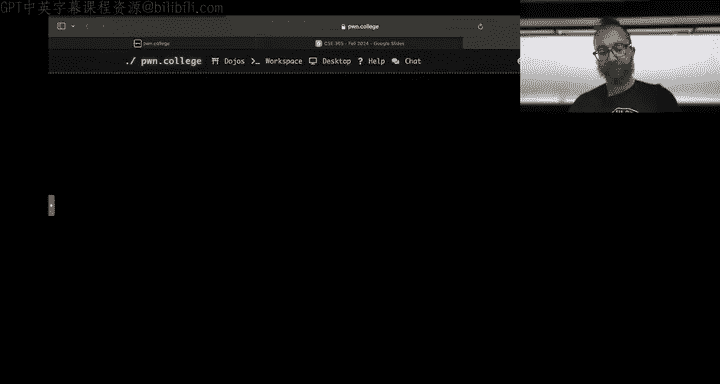

It's gone on。

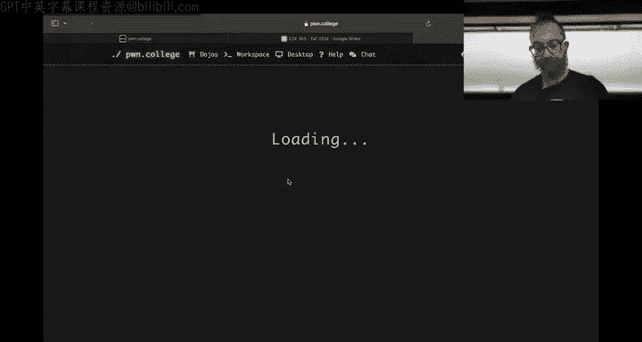

Is it failing to come up just taking a long time？They should all be local， right？嗯。嗯。Maear with us。

Okay， so let's。dive've been here， we're going to start the challenge。And then， we're going to。

Have this other terminal。Where they're going to。Look at where。This temporary file is here it is。

 this is our database， you see that Db， and we can just sQl light it directly。

Without any of that insanity。

And then we just。B， of course this is the practice mode pin it doesn't help us get the flag。

 but it allows us to start messing with SQL directly without jumping through a ton of hoops so。

The other thing is is。Keep in mind。That。These challenges are all。Large， combined。

Systems that have a lot of different parts to them and you can interact with the different parts differently。

Next thing for moving forward and talking about。

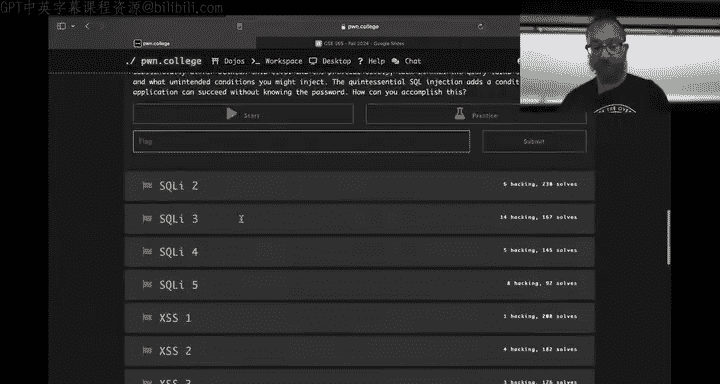

Crossey scripting。in the same way as with SQL， you have multiple things。

 one of them is with the SQL injection here of the web and the SQL database that you're injecting into queries onto。

😡，Here with crossite scripting， you have。These kind of。Diveence is between what the。

A serverver expects to send to the client HTMLYs and what it actually does。

So let's see if we can get the desktop to load up for us。Okay。

And then I'll show you kind of a technique to dive into this to。To try to shortcut。

 isolate the actual security problems away from the end to end process， right。

 isolating things in this way allows you to interact with small， much more constrained problems。

To tweak every step of your attack so that then you can end to end it。All。Let's look at XSS。

Okay， here。The problem is that， of course， we are。Injecting。Let's see in the post request。

The insert post， that was just， whoa， I just launched your Apple TV。YeahBecause the thing came up。

Hopefully you weren't watching anything embarrassing。Yeah。

Waiting on the browser to come up and you're going to interact with it in Firefox。滚。嗯。

Browser is taking a little bit。There we go。All the browsers popped up， okay。

Challenge that local host。It's not running。Let's run it，right。Okay， what's going on here？Fireffox is。

Not actually up。Can you challenge that vocal host？

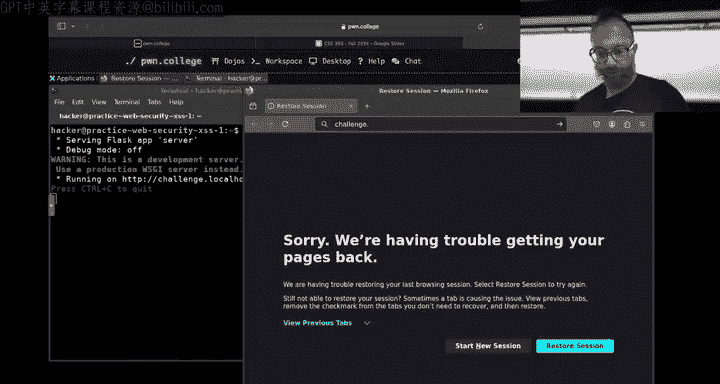

Yeah。Oh， my god。没有。All right， here we go， Pom post's anonymouson posting service。

 We just play around with it， right， It's crossite scripting。

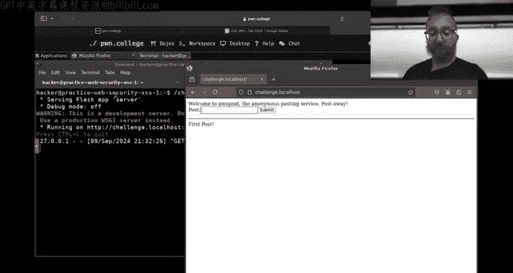

It's simple。You just say as the F， blah， blah， blah， blah， blah。It waits， it posts。Right。

 hello world。Wait， the toast。 awesome， we had。Volume up for some reason。He had。They inspect。Okay。

 fine not inspect。 He hit Why is Apple TV bouncecing。Is going on the rails fast。 We hit use source。

 Okay， source is super simple。 It just。Literally。Puts a new horizontal ruler and our post， right。

 Then we say， okay， well， hey， what if we use some HTML。Turns out that works。

Then the immediate question， of course， is， what if we？Start。

Doing crazy and crazy and crazier things。But if you don't have to do these crazy things over HTML again。

 there's a backhand database here， right， there's that temporary database somewhere in slash Tamp。

And this gets inserted into it。And we can just take this query rather than figuring out how to trigger it。

 of course。This is simple enough that。The decomposed quote unquote way is much harder。

 but instead of figuring out how to trigger this， we can do a number of things One is we can just extract to this functionality。

 write a script that we can call that will open that database。😡，And insert into it。 And two， again。

We can。SQLite 3。The database。And we can。Startar from posts。That's pretty simple。

 is it that described？No。This is not。I space。No， there's there's something where we can see。

That show， nope。All right， anyways。Someone can tell us later， all right， so select start from posts。

诶。We can insert into posts。Values。Test。And see if this works。Seems still worked。Boom， here it is。

We can mess with a database as much as we want。If we have trouble getting into the admin。

 but we know that once we can log in as admin things are over。

 we can change the admin password in practice mode with a fake flag Of course。

 all of this won't let me actually get the flag in practice mode just as a reminder。

 the flag is fake its。😡，Just practice。

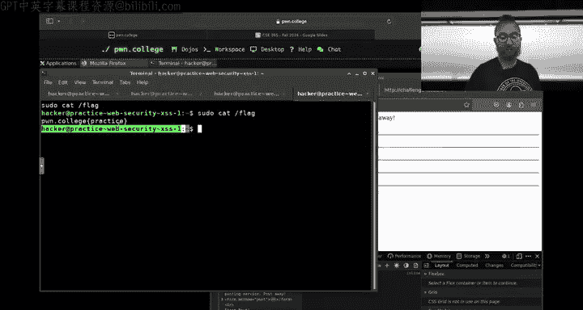

But。😡，This allows us to interact。With our administrative access with different parts of the system so that we can cut out the middleman we are having trouble getting the the Hlta to line up。

 the closer to line up， that's fine。 You can still confirm that your end goal is correct。

 You can work backwards on your solution So if you know we can get this working then we can step one step back。

And encode that in ISCP response and then make sure things are lining up。Query the resulting posts。

At every step to make sure things are working。You don't have to solve these problems in like one big。

Chunk， you can。Dig in， dig out， combine different steps over time。All right。

 and I think the one final thing with that is generalizing that to a slightly harder situation of the crossside request forgery。

Unless we have other questions。Yeah。Other questions？啊。All right。

 so we're going to add one thing here。Okay， you hit up practice。Now。We have the next thing。

 cross side request forger。This is tricky。I guess we could have also demonstrated this in the crossside scripting thing in the cross side scripting there's also a victim browser。

Here， the victim browser is a different script that runs a headless version of Firefox。That。Actually。

 let me instead demonstrate this with excessS because we don't have that much time。

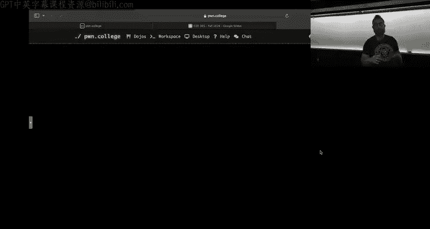

Let's do excessS 2。This we need to make an alert。Seit up the practice mode。Okay。

 there's a question on switch， the methods I just performed。

 which lecture is that covered in the concept of splitting up。😡。

This system and to end is something that's。Partd of the general security approach。

Of analyzing the security of。Any sort of。Relatively complex target and by that I mean 74 lines of Python were one of the things you looked at today。

You have to split problems。 It's similar to。Doing a math booth。

 who here has done a proof in geometry。In like high school or something right how did you do the proof did you patient into G and say prove it？

That would work。But it wouldn't teach you the steps of doing the proof。 You looked at it and he said。

 my goal is slash flag。 How do I get there？😡，Well here are potential steps I can take from first principles。

To my goal。And then you explore them step by step。What we're trying to build here fundamentally is a proof that the security of this system is broken。

 That's our final goal。 How do we prove that Well， we violate a security property。

 which is slash flag， How did we get that Well， that depends on the challenge Now you have to understand this。

This skill of deconstructing things is stuff you've been doing since high school。

Just have to reach back and grab it。Back out。 And then the actual individual steps the。And you know。

Running SQLite， all of this， this all just depends on the technologies involved one thing that this class does。

 which no class until now has really probably done。

Is throw a lot of technologies at you that you'll need to learn to some point on your own rapidly。

That's the digesting documentation part。All right， so。Oh， and yeah， for so for example。

 for SQL the the the as。Hidide Har Hiroantto says on Switch。

 look up Connor's lecture for the Sequel Connor' SQL lecture to understand that Okay， one last thing。

In crossite scripting2。We have our same sort of server， actually the identicalical sort of server。

 I remember correctly。Okay。Here we go。Awesome， we have this server same thing。

 So you can select into bur up。 All right， so。Here and the description explains what you need to do。

 but there is a victim here。 and the victim is a simulated web browser。An actual， actually。

 an actual web browser that will come and visit our server。😡，And。In practice mode。

 just like you can change the server， you can change your victim。Oops。

 I misspell the victim while that's loading， I'll just start loading the server。嗯。Okay。咁。Victim。は。

If you dig into what the victim does。And you Google enough about Selenium。

 it's pretty straightforward。We create a new Firefox。

 we make it headless so you don't see the screen。And then。We。Figure out what port is open。

 wevisit that and we wait for an alert to pop up that's it。So let's do this。

 let's remove the headless part。And maybe we should add an option to do this in practice mode。

Because that could be cool now。If you want to see what the victim does。

Let's add a sleep at the end here。So that we can actually observe things。

It gets the Ch URL import time， or actually， let's just do an。Inputs。Gress enter。To continue。几。😊。

We run it。Run the victim。So what I'm trying to convey is in these challenges that have a victim browser。

The victim is just another part of the end to an attack。

Your understanding of what's surrounding inside the victim， et cea， et cetera。

 and you can mess with it just like you can mess with the server， what the fuck。谢。

Air sending requests to plausible。Okay， I have a feeling we hit a bug that we're not going to be able to fix in the。

7 wait， when is the class over， Oh， in the two minutes available to us， Unfortunately， well。

 we'll do an off so stream to get this figured out。 What did I do All I did was change。

Options that add option。Atdlas。That's all I did， right， All right， we'll try to figure this out and。

It should， okay， we'll figure it out later， but it should work without headless。

 you'll make it work without headless。And do it in。

this scene doesn't haveops that scene doesn't have audio All right， well， anyways， TlDR。

 things are due on Sunday night， we'll do some off hours streams and we'll see you there goodbye hacks。

Do want to say something。Goodbye。