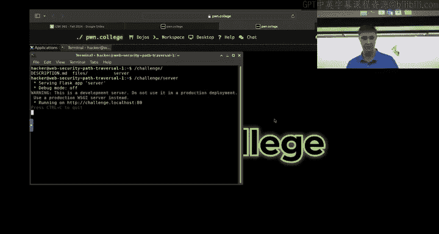
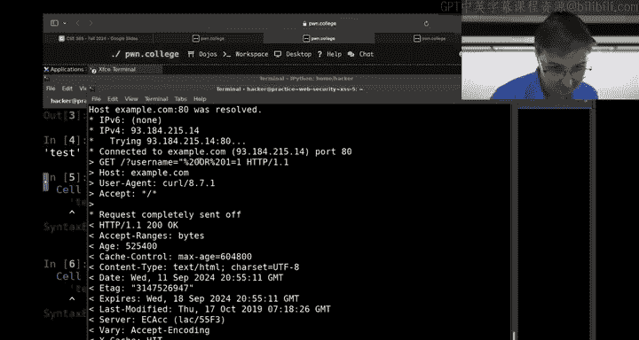
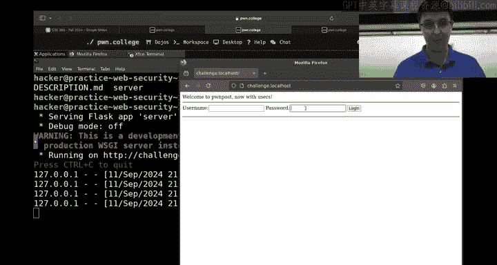
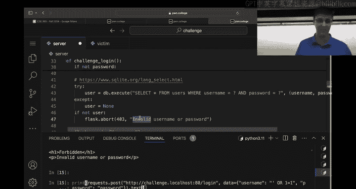
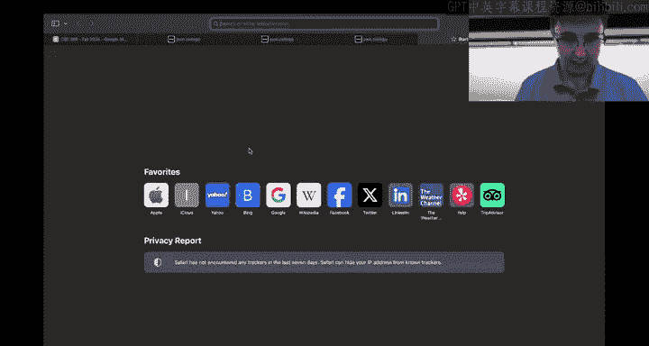
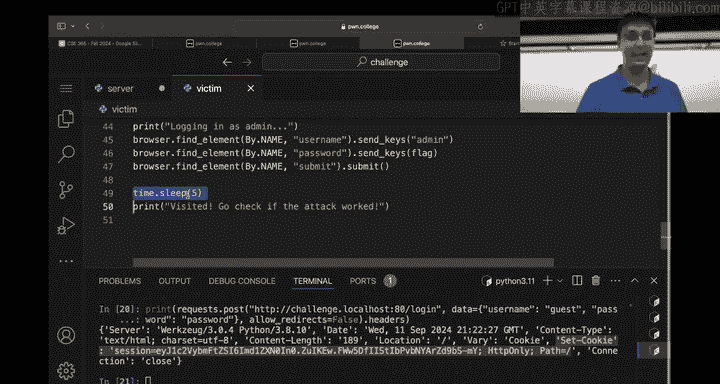
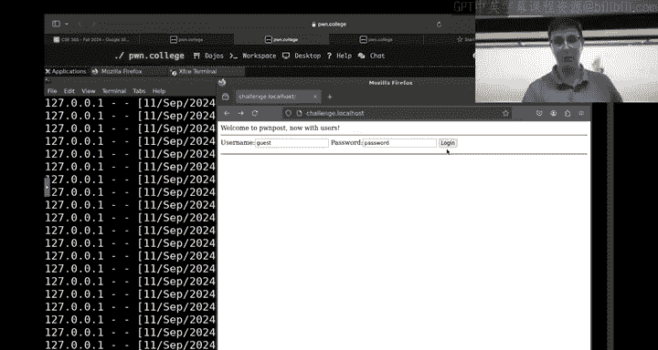

# ASU《网络安全导论｜ASU CSE365 Introduction to Cybersecurity Fall 2024》中英字幕deepseek翻译 - P6：-07-Web Security - CSE365 - Connor - 2024.09.11.zh_en - GPT中英字幕课程资源 - BV1nVCVY9Ehy

Alright， hello everyone， welcomelcome to 365 Ywn is not here today， but I am let's jump into it。

 does anyone before we start have any questions about the structure of this class。

 hopefully the structure of this class makes sense by now。

 but if you're still confused about something， I want to just check in。

 make sure anyone doesn't understand how checkpoints work or me extra credit or helpfulness。

 extra credit or anything。Okay， oh， there's a question， yeah。然后。

So the syllabus has a rough estimate of what it'll be。So if you check the syllabus。

Its not guaranteed， but that's our proposed thing likely I would put 90 plus percent confidence on that。

 but not guaranteed。一。😡，But so be clear， I guess so some of those will list modules and you might be able to find that module。

 we might be deleting some challenges from that module。

 adding challenges to that module that might also happen。

 but that is roughly the pace and topics that we're going to cover。😡，Cool， alright， let me make sure。

 just realize that I have the。Twitch chat open。So that I can see if there's anyone that has questions on Twitch。

Okay。Maybe。There we go， okay it says welcome to the chat， all right， cool。All right。

 so if there's anyone with questions in the Titch chat， feel free to ask now I can see it Okay， cool。

 so no more questions about the high level structure of this class。All right， cool。

 Who is confused about this module， Does anyone not understand this module or is this module super easy？

How does this module compare to the last two modules easier or harder， is it harder？😡，All right。

 so it's definitely a harderer and it takes time to do it。

Does anyone have any idea like a concept that doesn't make sense？

Like I don't understand SQL just full start， I don't understand how to start this challenge。

All right， we're going to start with how to start the challenge just because I know some people have asked about this real quick。

 it'll take two minutes。Here we go。3，6 front full 2024 just to make sure all on the same page。

He past traversal level1。Because it's a little bit different than talking web。

Hopefully you all know this because of the checkpoint deadline， but just real quick。Okayy。

 this is how you start this challenge for those of you who have not at all started yet。

 going to challenge， there's going to be a server。You run the server， make sure you start the server。

 we've seen like at least five people， probably more that are unaware that the server must be started。

 you must start the server， you start curling a local hosts and you say could not find connection you have to start the server okay now it says we have a running on challenge out local hosts port 80。

 I can click on this thing somehow I don't know how to do this in desktop worst case we type it in。

Or I just started or 20 copies of Firefox， very possible。

是。Okay， good enough， start new session， challenge local host 4t 80。

Okay， this is the basic premise of every single challenge here at a very， very high level， right。

 we have a web server running。 Your browser can access it。 Look at this。 Wecom to web security。

 Now the the last final thing just to point out for getting a start on this， this challenge。

 what you want to do for every single challenge。Is look at the contents of the server。

 the server is just Python， maybe Python's a nightmare to read。

 you'll figure it out this is going to describe the entire channel and Janan talked about how you can modify the challenge to start doing debugging you're going to practice most start editing the challenge。

 make it print more useful stuff for you， but this is the structure of every single challenge。

Okay。Now， zooming back out， we've got。A handful of topics here， right。

 we've got path Diersal command injection， authentication， bypass， equal injection。

 crossite scripting and crossite request foragegery。 Is anyone stuck on any of these concepts。

That like they want like you could just。Herear five or 10 minutes about how this topic works or this concept or even 30 seconds。

 so let's see any hands。Likere you're like looking at a challenge。 you're like。

 I have no idea how to solve this。 This is a nightmare。 I don't know how to start on this。 Yeah。

 question。是。Okay。Hasite scripting 5。Okay， so this says， and I guess for context。

 for those who have not started the crossite scripting sequence。

 this will be building on prior things in the crossiteite scripting sequence。

 so you might want to take a look back here， but this says actual crossite scripting exploits。

 try to achieve something more than alert Poland a very common goal is to use the ability to execute jascript inside a victim browser to initiate new Htp requests。

 masquerading as the victim。 This can be done in a number of ways including jas fetch function。

 This challenge implements a more complex application you will need to retrieve the flag out of the admin users unpublished draft after a crossiteite scripting injecting the admin。

 you must use the injection to make an Hp request as the admin user to enable you to read the flag okay so this is like you know two paragraphs。

 always read the two paragraphs， two paragraphs very critical context。

 I also see some people talking about SQL which will maybe discuss at some level I will not be solve。

Any challenges here， but I will be showing you my first impressions or how to look at this。

 And in fact， some of these challenges likely will be my first impression。

 Ywn went through and like added a whole bunch of challenges to make your lifes miserable and。

 you know， make it so you have more stuff to do。 So I don't even know if I've seen cross ice scripting 5 before。

 This might be the first time that I' am looking at this。 We'll find out which one this is。😊，Okay。

 so here is how I would go about analyzing this。 first thing， as I said。

 read the text and you know we're kind of being a little weird here in that we haven't done crossize scripting one through four。

 First thing I would do before I saw cross size scripting5 is almost certainly going to be solved one through four because it's going to be building a foundation and basis and then five is going to have some sort of extra thing。

 it looks like based on the description that one through four had alert poem。

 you got to get like an alert popup whereas now we're not just making a little popup in the browser where're actually going and making additional requests So that's probably going to be the extra little thing。

 So if you haven't you know written ja before， which probably many of you have never written ja before this class。

 you don't need to understand like intricacies of JavaScript you're only like two lines of ja but it's going to be critical in one through four you will have already written ja。

 at least one line of it and interacted with it。

So let's go ahead and take a look， okay， the next thing I would do after solving one。

 through four and reading the paragraph。Besides starting the server。

 we will make sure we start the server， but really what I'm more interested in is what the heck is the source code of this challenge。

 And if I wanted to be like。Extra confident if I'm looking at this as p versus four。You could。

 if you want to literally copy down the source code of four and then。

Compare literally what changed between four and five I have a feeling that five and four might look a little bit different。

 like quite a bit different， but some challenges it'll be like one line of code changed and like that's the thing to hone in on okay。

😡。

Let's see here。Wonder， actually， I'm going to open this in V S code because I think it is slightly easier to read code in V S code。

Yeah。If the S code loads。好。Eventually， nice。Okay， cool。阿妈。Okay， let's open， well， first。

 let's zoom in a lot。A lot， a lot。 Well， we'll see how much we can reasonably zoom in and let's open the server。

Okay， and let's get rid to that。And let's， well now we got a reset， we do that。Som， man。

 let's see how。Much we can show with Gary to this mini map thing。Okay。

 here's what we're dealing with。 now， obviously， as I keep saying。

 you'll have solved the prior challenges first。 So even though there's 104 lines of code。

 hopefully it's not a new 104 lines of code And also before I go any further。

 I think I noticed in fact， I'm pretty confident that the server is not the only thing。

 You've got an extra thing。 We have this victim thing。

 I think ywn talk about the victim thing on Monday you're not only going be using the server and the victim on this challenge or not just using the server on this challenge。

 you're also gonna to be using the victim on this challenge。

 And is this the first challenge where the victim shows up or or use it too。 Okay。

 so you've already seen victim， but we'll talk about it here anyways because maybe you haven't solved for yet but when you solve this challenge。

 you have solved four because you must solve four before you do5， Just make it easy for yourselves。

Okay。So we got two things then to look at， let's get this back。 I keep creating new terminals。

 Let's get the victim open as well。Okay， so the server does a whole bunch of stuff。

 You have seen all of this before。 this is really boring。

 Your eye should just immediately glance past it。If you're really like running out of ideas。

 maybe you go in here and like make sure some line in here didn't change。

 but I'm pretty confident that these lines didn't change， you've probably seen these lines。

On like every challenge or a bunch of challenges。 So we just gloss immediately over that。 Okay。

 this sequence is going to look like a lot of challenges。 But if by now。

 hopefully in cross sky scripting 5， you'll have noticed that these lines likely to always appear。

 but they're kind of changing a lot right This is telling us what is the setup of our database。

 this right here is initializing our database tables。

 So these are this is just information to be collecting as you're jumping into this like we want to build up a mental model of what this application is before we really even worry too much about the vulnerability。

 This kind of like two ways to approach this。You can either start by just like surface understanding everything and I would encourage that honesty for 100 lines of code。

 just surface understand everything， just have like a mental model of what this program is。😡。

Alternatively， you could work backwards， which I think Janwn showed off on Monday a little bit。

 We could control that for flag and see where the heck the flag is and then like what leads to that code block。

 which leads to that code block and you could like walk your solution like backwards you can walk forward。

 you can walk backwards， you can do both right now we're just gonna have a very brief understanding of what's going on here so we create this post table and probably you know these are human readable things Probably we're not lying to probably it really is some sort of post idea。

And it looks like we have this select question mark as content thing admin as author false as published。

 So hopefully by now you will have seen tables get created multiple times。

 but a quick refresher for you and table has a whole bunch of columns。

 we have this post table and it looks like it has three columns。 It has content。 it has an author。

 it has whether or not it's published。 you've used web applications before that have something that like resembles this before。

 like you can imagine a user post something and maybe it's a draft first or maybe it's published already。

 Okay so that is what this is doing。 it's creating that table and not only is it creating the table。

 but it's initializing it with data so we can already see in our quick glance the flag。

Is in the content There's some admin person as the author， maybe in our heads。

 we're assuming probably I can't just be the admin or maybe I can just be the admin。 we'll find out。

 So probably this is like the protected flag secret guarded behind an admin。

 I think the paragraph you know， kind of said something roughly like that as well。

 but this is confirming that is this is reality right here。 We have a users' table。 Okay。

 makes sense。 we got posts。 we got users also an admin is initialized and a password is initialized also at the flag。

Maybe it matters that the flag is the password， maybe it doesn't matter right is it could be a red herring it might just be for simplicity but。

Either way the takeaway is maybe I have two ways to get the flag right now。 Remember。

 our goal is to get the flag。 If I can somehow figure out this admin user's password。

 I have the flag。 If I can somehow read this unpublished post， I also have the flag。

 And I think the paragraph says you want to read the unpublished post。

 So that's probably the way we're going to go。 But if you know。

 maybe I find an unintended solution or find another route where I figure out the admin's password。

 guesss what that is also the flag。Okay？Insert into users。

 looks like we get some bonus users in here。 We have a guest user with a password of password Okay so I should be able to when I launch this web application。

 if I want to like sanity check myself that I am not just completely wrong about how I'm interpreting this web application。

 I will log into a username of guest in a password of password and that will confirm that how I have read this is correct or at least correct enough。

 Here's another user hacker as username13，3，7 as password。Okay。

 so we got three users in this thing and we have an unpublished post by the admin user who we don't know their password。

😡，That presumably we're going to find out， yeah， there's question。Yeah。こなんです。There is no difference。

Probably it should be more consistent and just normally in SQL。

 you you I don't know the exact term for what these these keywords are。

 these keywords normally by convention are all caps， but they don't have to be。So yeah。

 no difference， good question though， but it's exactly the same。 Okay。

 now we know what the structure is， we have three users， one post。

 it's on Po as a question also yeah。你出。See。不是。是吧。Of course means a。Hes been。Yes是。Yeah。

 so the question is basically what is is there a difference or what is the difference of single quotes versus double quotes in these SQL statements right So the answer is there's not really a difference So in Python。

 for example， and obviously SQL is not Python。😡，But if I open up Python and I try to zoom in。

 maybe it'll zoom in。How do I zoom in？Zoom in， zoom in， zoom in。

I can have this string with single quote test single quotes and we will see what comes out is single quote test single quotes and I could do double quote test double quotes and we'll also see that single quote test single quote comes out because that's just how this interpreter is giving us the result back。

 this is how it shows strings if I do reper of this。

 which is a python method for seeing a representation of a string we'll see what that looks like。

Well， this is。Kind of makes it more complicated。 It doesn't matter。 Basically。

 a single quote versus double quote， They're the same thing In C， for example， if you have a string。

 you need to use double quotes， the spec says double quotes are how you do strings。

 And if you want like an individual character， for example， You do a single quotes。

 Python does not do that。 S quote， double quotes doesn't matter。 but you have to match。

 You can't do single quote， test， double quote， that is not valid， has to be matching。

 and the same is true of SQL。 single quote， double quote doesn't matter。

The small caveat to that is specifically in the context of something like SQL injection where you might be inserting an extra quote character in there to like mess with the statement again。

 as I said in Python or single quote test double quote is not valid。

 you have to match your quotes also in SQL So the only real significance there is like in the context of a SQL injection as you're thinking about how do I close this string。

 you got to close it in the same way it was open， but otherwise identical。对。我行。Yeah好。食死啦。哦。Yeah。调方式。

文化地。See some some nations see。That kind。Yeah， so this actually is a good point。

 so I said double quotes only for C single quote or double quote works for Python or sQL bash is also weird they're in bash specifically where you're typing this curl command this single quote versuss the double quote。

Does matter。 So if I do， for example。Echo， let's do no quotes， for example。

 echocho or not who am I user echocho， wait， do I not have a user？What something that I have。

We'll just do term。If I do echo term， no quotes， right， it tells me X term 256 color。

I can do double quotes around this as well， and it'll do the exact same thing。

But if I do single quotes。It will not interpret dollar signs。

 and so in the context of bash where you're inside a curl， I don't know if this is necessarily。😡。

There's a lot of ways that this can impact you in curl in bash。

If you ever start having like dollar signs or question marks。 So， for example。

 if I wanted to curl Google。Docom or let'll just to example。com。Let's say question mark。

Test equals 42 and hello equals world or something。

Maybe you will have tried something like this on talking web。This， you'll see this like weird。

 so we get HTML for sure， we get our response， but we also got this like weird thing at the end。

The reason we got this weird thing at the end。Is in this case。

 this message is coming from the fact that Ampersand is a special character in bash。

 And so when you leave it with， you have this in double quotes or you have this in no quotes。

 that ampersand is being treated as a bash thing。 If I actually wanted to do this。

 It does matter how I do this。 It has to be single quotes。

 Now you'll see I don't get that backgrounded task thing。 But I did double quotes here。Wait what？

 Maybe it only a fix a dollar sign for this one。 actually， it it probably does。 but if I had。

 for example。World。Term， let's say。 And I put this in。 Well， hard to see。 But if I look at。

The request header。You would see that what the request is that went out。

 and I realized this is kind of。Not very big。 You will see that that dollar sign did weird things。

 right， This ended up in here。 whereasas if I did single quotes。It would not。

So that is one part of single quotes versus double quotes in Bsh。

 which you're probably in bash if you're using curl。A different element of it。

Things just start getting。Very specific if you start doing like let's say for example。

 I'm in the middle of a SQL injection and I'm busy doing like username equals and I want to do a SQL injection so I'm like double quotesspace or one equals one or something things you'll see that this is just not a valid URL and so maybe what I do is I'm like。

 okay， space has got to be percent 20s because I did talking web and I know that spaces are percent20s。

And then what you want to do is you want to look， like。

 what the heck is this request that went out if you're ever like。

It's very easy for curl to get in the way of you solving these challenges because of you're like simultaneously using bash。

 which has its own set of special characters and then the HtTP。

 which has its own set of special characters and then SQL。

 which has its own context that it's in it's like at some point you're using the terminal and you're in the bash context which is then in the HtTP context。

 which is then in the SQL context and you have special characters at play here and you need to escape things and。

You want to always， always always， if you're like changing a quote and then changing the encoding。

 add more debugging output for yourself， just like go into the server and start printing values and make sure that what you think the value should be is there or start using curl with this dash V what actually hit the server did this hit the server like this looks good to me that's what I wanted to do but for example。

 I might have messed up here and I maybe chat CT or sensor whatever told me like double quotes double quotes。

 double quote your URL。😡。

But then I do this and you'll see like it's telling me this is the bash's way of saying， hey。

 you're not donetyping your command yet， finish your command and I got into this like context where I'm in the bash context。

And then I'm trying to put a double quote inside of this URL。

 but guess what this double quote just like is interacting with this double quote。

 And then suddenly we put a bonus double quote here and this double quote has not yet been closed。

 That's why it's telling me you've not done with your command。

 It's waiting for another double quote now。😡，Yeah。I would strongly encourage you to check every step of the way in whatever way you can think of checking like curl dash V to see what's the HP request going out。

 modify the flask thing to see what's coming in just keep double checking that what you think is going out is in fact going out and being received so it's a longwinded answer but there's a lot of contexts at play。

 and so these characters do different things in different contexts。😡，好。好。嗯。你个咩。S。Yeah。

So great question so the question I guess to repeat for people is like what does this kind of look like in the Python context where I have single quotes double quotes we'll see I'll see if I can weave that into this otherwise just ask me again。

 but my ultimate answer is going to be the same if you add print statements to the server and you print out what is the actual SQL expression it's about to be evaluated and pay attention to your single quotes first as double quotes that a double quote is being closed by a double quote that there's not like an extra single quote somewhere in there that like this is a valid SQL expression you want to verify at that point that's what I would do because at the point that I've already figured out how to start doing a SQL injection。

I mean， I'm either at the point where I just can do arbitrary sequL with like a little bit of cleverness or I'm very close to that。

 I I just want to see what sQL expression is hitting SQL Like that's all that matters at that point。

 Like I figured out。Maybe I haven't figured out how to use Python to get exactly what I want。

And at that point， you can just start。You want to start adjusting things and seeing how that actually gets reflected to like just ground truth yourself in what is actually happening。

 It is like。The most crucial skill probably in cybersecurity。

Is being able to like ground truth your knowledge。 You like want to。

 you have some set of assumptions in your head and you think you're violating them in some way。

 You want to assert that that is true and you want to assert that with like ground truth knowledge whenever possible。

Because there's a good chance if your exploit doesn't work。

 it's because you're making an incorrect assumption and you want to invalidate that incorrect assumption as quickly as possible。

Okay， let's jump back now to here。Okay， so。Taking a look right。

 we figured out we got three users a post， single post unpublished as the admin user。

 This is our highleve data description of our setup Now the question is。

 how can I influence this database into giving me the admins password or giving me the ability to see this post and we really don't know how we can interact with it right probably in your head you're like guessing and I mean I've already got it highlighted。

 probably if there's users， there's a way to log in， probably if there's post。

 there's a way to create post， probably if there's a published status， there's a way to do that。

 we don't know how that works like you can imagine implementing the system as when you create a post there's a parameter that says should this be a draft or should this be already published and maybe there's another function that will upgrade an unpublished to a published is there a way to go the other way we don't know yet what this program does and that is our goal now。

Okay， so what I want to do first， though。Before I really understand how this program works。

 I'm just going to look at all these app routes and kind of just infer through human intuition what like some sort of high level view of what's going on Okay。

 we have a login thing We haven't looked at the implementation yet。

 but we've all logged into websites before Probably this handles login behavior We have a drafts and we know that there's posts that can be published or unpublished。

😡，My best guess right now without reading the source code yet is that this will create an unpublished post。

 We don't know that that's true。 Maybe it'll turn a published post into an unpublished。 Hey。

 we have a published thing。 My guess is this will create a published post。

 Maybe there's no way to go back and forth。 Once you create a published post。 It's published。

 there's no way to make an unpublished post published。 Wait dont no。

 We're gonna look into the source later。 And then we have this slash thing。 So this is。

The first time you hit the page， like the root URL， it's just going to be。 And we， I mean。

 I'm already looking ahead when I said I wasn't gonna do that， but it jumped out to me。 right。

 It's the welcome to poem。 It's like the hello。 This is your here。 This is H T M L。

 Things are happening。😊，Okay， and that's it， we've got four functions。So we were talking about maybe。

We could SQL inject this password because if we could somehow do SQL injection to leak out the admins password that would be really cool Well。

 the first place I would look and it could happen in any anywhere we're hitting the database that could be SQL injection but I could imagine maybe we've seen this in password levels that this happens in the login route right。

 maybe it's doing something bad And so we see you know。

 we've seen this probably a million times at the point that you're looking at this challenge。

 we grab from the form， the username， we grab the password if there's not a username is missing username and we let them know a bought 400 basically means 400 client made an error。

 you forgot your username same with the password okay nothing super exciting from a feature perspective of vulnerability。

 we're like talking it away in case somehow it becomes relevant like。

Somehow we could like trick the admin into messing up its login and then it gets rate limited for some。

 I don't know， maybe there's some weird way that this functionality is useful。

 but it's going on the back burn， it doesn't sound that exciting。Okay。

 and then we have a way of getting a user。 This is how a login works。 You go and ask the database。

 do you have a row that has this username in this password That's basically how almost every web application is implemented。

 you hit a SQL server and it says does this row exist or not and there's fancy security things to do with that like we'll talk about in the cryptography module where you don't want to actually store the raw password。

 but at a high level that's how almost any login works is like hey does this guy exists。

 this username this password exists not exist okay and maybe at the point that you've seen this many challenges as you hit Xs5 you've kind of clued in because I don't think we explicitly talk about it。

 but maybe you've clued in at this point this question mark thing is like how you avoid SQL injection This is how you make SQL injection not happen at least in this Python domain but this is roughly what it's gonna to look like in any language in the end。

That this question mark operator does is it leaves a little placeholder for a value to be bound to so rather than building up the entire expression。

 what we do is we send an entire templated expression off to the database and then we tell it what to fill it in as and so when it goes through and it parses that sQL expression and builds this like abstract syntax tree of what's going on。

 it just knows to like insert that into that mode and so it's done parsing。

 there's no way to mess with the parser because the parsing will have already been completed at the point that the username goes in And so a long story short this question mark thing this idea of these question marks。

 This is how you stop SQL injection。 So as soon as I see this and the fact that this isn't an F string or that this isn't somehow I don't control the actual expression I control parameters into the expression。

 but I don't control the expression， I have immediately at this point ruled this line out as sQL injection It is not happening we're not going to sQL injectionject at least this line a different Db do execute might。

Construct a string， this one， not so much Does anyone have any questions about that？

It'll be relevant， yeah， questions。The supply in cannabis。That's's。Yeah， exactly。Yes。

 so there's a different way you might imagine real writing this。 and you might imagine writing this。

 This is like， so you've seen the F string syntax。 turns out there's a lot of ways to construct strings in Python。

 You can actually do something that looks pretty similar to this， but will not be secure。

 And that would be if I do。This。And I had spent so long as I've done this because F strings just make this so much better。

 I think there's something like percent S or just percent。I don't know， maybe it's percent S。

 and then you do username。😡，Password here and actually let's well you can just check if I'm making stuff up or not。

I do not know why I am failing to create terminals。

 but we will just keep creating a new terminal every time I want a terminal。If I run this right here。

😡，Oh， username。Equals test， password。Equals secrets and then I run this line right here。Yeah。

 look at this。 Okay， so this almost looks the same， right， It's like instead of a question mark。

 we have a percent S。 and there's no f string。 So we're totally safe， right。

 Janwn said if it's an f string， it's a sQL injection， it's not an f string。

 it's not a sQL injection。 there's lots of ways to build up strings。

 So don't let your pattern matching just be that the username and the password are at the end。

 It is specifically this question mark syntax。 And the fact that these these two things。

 this is a tuple。 So this is just one extra argument that is an argument that's packed for two things inside of it。

 is just one argument， it's specifically an execute， this is the templated expression。

 and this is what to fill that in with。 If I do this instead。

 you will see I'm still just passing one argument。 This is not two argument。 This is one argument。

 and this is just another way in Python to build a string。 This is not secure。

 This is just as bad as the F string。 lots of ways to accidentally build strings。

 And we're making this like。I mean， I know you're all thinking that this is a hard module。😡。

But it gets a lot harder in the real world， which this is why we want to learn。

 right learn on smaller things。It's not so like you might be thinking like how could you make this mistake and honestly in reality with when it comes a SQL injection。

 there's really no excuse to make this mistake， but in the general classification of vulnerabilities。

 you might be thinking like who would ever make this mistake Imagine that this was 100000 lines of code you're running the entire Facebook server you have a function calling a function calling a function。

 we're passing a string here passing it here here here and at some point in here it built up part of the thing over here and it got passed over here and you're like this massive web of functions it's not in the case of SQL injection I am gonna say is not true there's no excuse really for it。

 but as I said， when the general classification of vulnerabilities。

 we're trying to distill the issue down to its core。

 this is easy to do when you build a massive application。

 you're not gonna to have a full mental model of what's going on and you're gonna have to track to lots of layers to see how the heck this data is making its way here and so these sorts of things they really do happen。

呃。Yeah， okay， so this is safe and it's safe because it's got the whole question mark thing and it's got a second parameter。

 the second parameter is what binds it Yeah there's a question。TheThe execute function takes。

I'm going to say at least one， it has at least one argument that's required。

 There's a second argument right here that's optional。

There might be more arguments that are also possible。

 but let's just look at these two arguments slash one argument。

 If you ever pass a user controlled string as the first argument where let's say the user has。

A lot of control in what that might look like。 So， for example。The user does all the。

Be a little abstract here， the user does have control over this string。

The user has control over this string in that the user has control if a username or a password is supplied and if this string ever even gets initialized to begin with okay so the user does have control in some sense over this string。

 but specifically if the user has control over like really building this string in a meaningful way where the user can really get like basically arbitrary stuff into it。

😡，That is a SQL injection， and that happens when you only pass one parameter to Db dot execute from a user built string。

 the way you stop that is anything that should be user controlled like you want to check what the heck the username is that the user is supplying and the password is that the user is supplying。

😡，The way you do that is you say。I am going to also tell you what these values are later。

 but please SQL parse this thing first， build out like this abstract syntax tree where it says basically at some point I have an equality guy over here that's checking if these two things are equal if these two things are equal and then I'm going to just at the very end after you've parse this thing we will shove the username into that little node and the password into that little node rather than as I said before if it happens before everything where it's doing the parsing and I sneak like a username equals hello well we'll do single code so that Python and I do this or one equals one if I sneak this in as the username and I supply that directly as input I build a string in that way I've just influenced the parsing of the SQL expression and that is not good。

 that is where the SQL injection shows up Yeah so in general。

 your pattern matchinging at least in Python and I think most languages that。

OfA Python bind ability to do this sort of thing。 I think they all use the question mark operator like this and then pass the things as a separate thing right here。

 Yeah， so user built strings。 That is the danger because that influences the parser。

 and the user should have no control over parsing this expression。Okay， so this is secure。

 long story short as we're understanding what's going on here， this is not sQL injection。

 you're not going to sQL inject this line。Then we check if there is not a user in what this would do this is truly this is what basically every web application with the login ability。

 it looks something that vaguely resembles this It's saying is the username in the password is there a row for that user in my database and if there's not because we just fetched one we would get this row back that would have a basically an object with the username and password associated with it and I don't even care really。

 I just want to see does this row exist， that's all I really care about if there's not well guess what the reason there's not a row because someone just gave me a pair of username and password that doesn't exist in the database and that is how again almost every login is going to look something like that。

😡，And then we decide to do flask dot session so flask dot session。

 if you think back to talking web whenever we did set cookie， as soon as you see Flask dot session。

 the TLVR of flask dot session is it's doing a set cookie and it's doing fancy stuff to make sure that you don't have control over that cookie that will kind of get into in the cryptography module a bit and how it's able to do that。

 but that is what's going on and there's documentation about flask dot session that'll say just as much and so what from the programmer's perspective。

 the kind of like nice thing that's built on top of cookies is now if I ever get another request that comes in Flask has done all this like abstraction magic stuff that I can just now reference flask dot session username。

And given that session because of the cookie again， because of the cookie。

 I can suddenly pull this data， this username data out in a different request context。

 and remember it's all stateless， but because of that cookie。

 now if draft wants to know the current sessions username and the cookie is correctly supplied。

 it can just go and ask for Fldot session username。

And it can just refer to that as much as it wants in future requests。Okay。

 final thing doesn't really matter， but we get redirected to the root thing。

 so you've probably seen this on most web applications。

 you log in and then it doesn't just give you like a white page at the end it redirects you to the next page that's how most logins are implemented and so it redirects you in this case to the root thing that we saw before it kind of says hello。

Okay， and I guess one thing that's also worth pointing out that I did not point out。Is that？

This is slash login with a method of post。😡，If you get slash login。U。

 I don't even know what's going to happen or maybe we get a 500， let's find out。If I do。

Let me let's so I keep saying things and I keep saying you should sanity check your assumptions like truly you should do this I'm。

Unfortunately at this disadvantage here where like I am highly confident in my understanding of this web application。

 so that's why I'm not testing things if I was in an unknown technology which probably many of you are。

 I would be constantly checking every assumption so let's actually just do that。😡，If I。

Run the server， as I said before， whoa， don't do that， please if I run the server。

We now have the server running。And I can access it so I can open it in my web browser because maybe I like web browser。

 maybe I like curl， maybe I like Python， let's use Python I am going to this well go one larger。

 hopefully。See how much we can fit onto the screen in a somewhat readable way， let's import requests。

And let's access this web application， so it is listening right here， challenge。

 localhost port 80 I do requests。ges。

ACP challenge。t local hosts， port 80。I should see something come back and hopefully we're not panicked when we see this because we did talking web。

 something came back and something good came back， a response 200。

 we got a 200 okay and if we wanted to see what the heck happened。

 we could get the text and we could print it why does VS code spam me so much okay？

And we would see that we have this welcome to poll P， which we haven't really investigated yet but。

Sure， then you know， let's actually open in the browser too just to really connect our understanding here。

Because you're all used to looking at web applications in the web browser。

 which is a very normal thing。

Challenge local host。Okay， this is what that HTML looks like。

 and obviously it's not a very fancy website， but you've seen a website that looks something like this username。

 password login。 Okay， so this is the UI way of doing that。

And as I was saying before， right this is a post method， it is really just spamming this bo and boer。

 stop telling me I know it's on poor80。 Okay， if I do slash login now。This is going to fail。

 it's actually just going to don't， okay， there we go。Now we can see what happens if I hit the login。

 we get this like 405 method not allowed Why do we do that because it says the only methods allowed is post by default if you don't see methods in flask the default is to accept get and you can see that in the documentation or you can trust what I'm saying the default is get but in this case it specifies I want to respond to post how do I do a post request in Python request well I just change get to post。

😡，And now we can see missing username form parameter， and this makes sense。

 we didn't say a username name， we didn't say username missing username form parameter。

How do I set a username form parameter？Well， I do。 Let's see if I can think about this， right。

 if I didn't know I would go read the Python request documentation again until I figured out how to do it。

 but let's， let's see if I remember， I think it's data equals。 I could be wrong on that。

 but hopefully it's right， but we'll see very quickly if I'm wrong。 Usename equals hello。Oops。

WhatSee now I'm messing up my print， all I see。We forgot our curly brace。Okay， well。

 we made progress。 It might not look great， but now we have a missing password。 What does that mean。

 Well， that means I successfully made it past this。 So I know how to pass a username。

 That's pretty good。 Now， let's set a password of。😊，Password。And now， nope， see。

 we must have done something or hunk。Pass O word， pass word， nope， that's still not right。

Pass word invalid username or password。 Okay， we finally made it all the way to this line right here。

 which means all the prior code executed， which means we hit the database。

 and I could confirm maybe like can I get this thing to crash and throw an exception that isn't handled and like put a quote in there because I don't believe Color when he says that question mark is going to stop this。

 and I put or one equals1。 we will see， and obviously this doesn't prove necessarily that it's not SQL injectable。

 but we probably expect a single quote in there to like crash the database or something or somehow we'd see an exception pop up or something bad would happen probably。

 not necessarily you could we could stop SQL injection by doing try except pass。

 And then if the database ever fails for any reason， we just ignore that it failed。

 and then we actually we'd need to make Python correct。 We'd say user equals none。 And now。

 guess what now。This is my I mean we already said its not SQL injectable。

 but if there had been SQL injection here， you wouldn't know it from just interacting with it because I made it so that there's not going to be an error code return to the user I just say in value username or password and now your sanity check of is there a thing good or bad now that you can't do that so。

😡。

Always every context matters。Okay。Let's also while we're here。

 show that we can log into guest username。Guueests， and this might seem kind of sort of boring。

 right， I'm like sanity checking everything。 I'm confirming things work。 This is legitimate。

 This is what cybersecurity looks like。 You are constantly affirming or。

Unconfirming whatever your assumptions， and that's just the whole process。

 you just keep doing that over and over and over and over until。

You violate the security thing you're trying to violate。诶。And so guest and password of password。Okay。

 looks like I was right about this being a user because before I tried random stuff and I got no such username or password and now I'm getting something very different。

And I can see that I logged in it probably did this redirect thing。

 If I really wanted to confirm and watch how this redirect works， I could do like。

I think it's like follow， redirect， equals false or something like that。Follow redirects。

I always forget the name of this parameter。Fask， follow。Redirect， false。

Python or not flask， we want Python requests。

Allow redirect， see if I wanted to make it not follow the redirect because I just said there's a redirect so if I want to not follow it。

I could do allow。Redirects false。 And now instead， I see a redirecting page。

 and I could instead look at。This is if response 302 and now I'm like， okay， sure enough。

 that's how that worked and I'm like， how the heck does HTP work again and this time I'm printing the headers and I'm looking for this location field and we can see。

I guess you might have to read the RFC to understand exactly how this works。

 but this is why it knows to go to the root thing and this is where this slash ends up right here in this location thing and then the good user agent when it gets to 302 it will pull up the location header and then just make a request there。

I also pointed out this flask session thing here is a set cookie that is causing that。

 The reason we get this set cookie is because we did flask username username equals username or flask session username equals username that causes the response to get this behavior to get a set cookie but then the server can later analyzed to understand what the heck was the username for this session。

Okay， that's we'll keep marching on， obviously you can go arbitrarily deep into this。

And I would encourage you to go deep into these concepts if you have no idea what's going on。

 just just start reading and understanding what's going like this is how you understand things。

 you just look at all the angles you can figure out how to look at this problem from。

 but I would first encourage you to do a high level overview before you really actually do that。😡。

Okay， another method exists draft， which is also a post。Here we have to be logged in。

 so I better be logged in when I go to this draft thing otherwise it is going to tell me log in first。

 so let's assume I can log in。 we've kind of already shown for ourselves that we can log in。

 let's keep going。 We can get content from the form。 This is content and here we go。

 Another DB dot execute。 because we're in this Web security module。

 I am hypercritical of every Db execute。 and I'm like I am ready to sQL inject this thing。

 but unfortunately， again， it's got this question mark syntax。

 we make it kind of really easy for you with SQL injection。

 you'll see an f string if it's SQL injection， you'll see this question mark if it's not。

 but as I said， that is not the only heuristic to use。

 but it's a pretty good heuristic in this assignment。 Okay so this is not gonna be sQL injection。

 So I am inserting into post content author published。We're reading this line by line。

 You'd probably already have an idea of how you might implement this， even if you didn't know like。😡。

The Python flask code to write for this web application， you already know in your head probably like。

We have a post system。 We want to be able to publish to it。

 If we have posts that need to be persisted and saved in a database。

 Someone is implementing that somehow this is a affirmation of that。 This is how it's implemented。

 We insert into the post table， content author published values。

 This is just like what we would expect as like a same implementation。 And when I say expect like。

Your mental model of this gets better， the further you go in your CS career as you've built more web applications。

 probably for a lot of you， this is the first time you've ever seen a login page implemented。

This is just what it's going to look like every time and then eventually you just like stop questioning it like this is how you do logins。

 This actually is insecure for other reasons， but。😡，This is roughly what a login looks like。

 and this is what it looks like to have a stateful program where I want to use SQL and insert data into a database and this is what this looks like like if you were going to write this yourself。

呃。Again， maybe you've never used Flask before whichs totally reasonable。

 but as you develop your software engineering skills。

 you'll just like no this is just how you implement this。

 there's like not really a different way to do this。

 ensure there's a minor details you could change but a high level like if I told you to build this program and you I give you like a five or 10 hour boot campamp on how to build web applications in Flask。

 90% of you are going to build something that looks almost identical to this。😡，Okay。

 content goes in username。 we're getting that from the session form published。

 So it looks like the form。 when we post to this thing。 this slash draft thing。

 this right here determines whether or not it's published when I create something So that's what this endpoint does。

 I can decide if it's published or a draft right when I make this endpoint request Plish Go to be logged in。

 This is when you're so that's what I was saying before is you develop your skills as a software engineer and understand how to build web applications and it just kind of becomes very like natural of these core functions。

 This is how you check if someone's logged in。 Everyone that ever does。

 am I logged in the code looks something like this I the user name in the session or is a session I set or is。

It's going to be something like this and if it's not。

 well what you should do is you should 403 them and tell them you don't have permission and in this case we leave a nice little message。

You'll see different web frameworks might be like what is it？Is。Logged in。

 we might do it in this way instead， and then we define a little function calledDe is logged in。

And it's going to do this and Python's kind of fancy and you can take a function as a parameter and that'll get passed and it doesn't really matter all of these these web applications are all going to look like this。

 This is just how you implement this。

Moreoverral the story this is not exciting。 there's nothing exciting about this。

 This is just how you do it。 maybe I'm wrong。 maybe there is something exciting about this。

 but just leave it on the back burn。 come back to it later as you're like running out of ideas DB execute again do we have SQL injection No question mark question mark second parameter past okay but we can set a post to published where author equals question mark so I can set all of my posts to published now interesting detail about this This is actually deviating from at least my mental model of how I build this web application what this is saying is that there is an endpoint that will allow you to turn all of your posts from draft to published It's kind of weird it's not necessarily like a vulnerability but it doesn't actually let me specify which post to publish's again it's not a vulnerability but that actually deviates from my understanding of how I probably。

bu the web application probably I would build a web application but there's like a post ID and I select which posts to publish this web application isn't that fancy though you can just publish everything if you got some drafts we're going to turn them into not drafts that is the only option with this route。

Okay， and then this is probably going to be boring， but。We get a page HTML body。

 welcome to Po Post now with users， we get our username if there's a username。

 this means we're logged in， if I am logged in， I am giving them a form of HTMLP or of HTML saying you can publish your drafts here。

And then what happens if I'm logged in， I will also then go and select all of my or every post。

 actually， not all of my posts， but every post I'm getting every single post and going through them。

 here's a post and I print out the author， I print whether or if it's published， I post a content。

 and if it's not published， I say draft post showing first 12 characters。 Okay。

 does this align with what we saw in the web browser。😡。

Because maybe we don't want to just use Python request。

 we want to have a feel for this web application。Lots of ways to look at this。

 Let me log into an account and see what happens。 I should see the first， what did I say。

12 characters。I should see the first 12 characters of the flag， right。

 because we have an unpublished post that is the content of the flag。

 I should see 12 characters of flag here。Username。不。

Gest password that sounds right to me and we can confirm， of course， but yeah。

 guest password or I could do hacker 13，3，7， do something else and it's going to tell me rolling username or password。

 right？I know it's boring， but in values using your password， check your assumptions。

And at least as appropriate。 you'll build up the skills of which assumptions to check as you go。

 guest password， however， should log me in。 and here we go。Look at this。

 We have a post by admin draft post showing the first 12 characters。 Well。

 Poone doc College curly brace， our assumptions are hopefully like making sense， right。

 This is what we would expect to see because we've seen a million flags at this point and they all start with Po College curly brace。

Probably the rest of it is sitting in the database as the characters past 12 because we put the whole flag in and this functionality only does 12 characters Okay。

 so we've confirmed no SQL injection so SQL injection is not on the table。

We saw a weird thing where like you can publish all of your draft posts。

 but is this a vulnerability or just like a web developer creating weird functionality。

 It's just a web developer creating weird functionality。

 Maybe there's some weird like nuanced way I can abuse that in fact。

 there kind of is is's kind of like a little bit of a clue in general in these like toy problems if you see something that's like why would you implement it that way kind of a clue a little bit and it turns out。

That， if。If I can hit this publish endpoint。😡，I can make drafts turn into not drafts。With a caveat。

 right， it's not just that powerful， right， If I hit， let's see here， if I hit slash publish， if I。

 you know I just said， am I expecting now this to suddenly become from a draft to a posted thing。

No， it doesn't happen because it doesn't just turn every post into a draft。 It specifically turns。

My posts， right， where author equals question mark and I log in as the guest user。

 so only guest posts are being set to publish。😡，If somehow I could get the admin to hit this slash publish endpoint with a get request。

 just get slash publish with a cookie set to the admin's cookie。

I would win like I would so only be able to now log in as the guest account and see it because it's a published post I'm not restricted to just the first 12 characters。

Is this possible。 Well， the answer is， I mean， it depends so far， we haven't seen any way to do that。

 Like， what do you mean， make the admin log in and like hit this endpoint， This is a web server。

 There's no like make the admin do。 Like， I would need to log in as the admin to do that， right？

 And this is where the victim comes in。 This is the other side。It turns out。

 and we can read the source code here， I'll probably just kind of accelerate fast through the source code of this。

Long story short of the TLDR is we start Firefox。And we find the username elements and the password element and the submit element。

 and for the username， we put admin and for the password， we put the flag。

 soundss like we're logging in as the admin Again， this is not enough。

 It's not enough just to make someone log in as the admin admin has to hit that publish endpoint。

We technically don't know that that's possible。 There might be no way to convince the admin to hit the publish endpoint。

But what we have discovered is that if there's a way to do that， this is a route to success。

 So this is like almost us constructing like a proof right that we've just built up this in exploitation。

 we call it a primitive we've got this like thing where we're like we've got the flag。

 we want the flag and we just walk back a node where if the admin hit gets。😡，Suddenly。

 that is the equivalent of the flag because the proof follows from that if the admin ever hits this slash published thing。

 I now have the flag， so now I don't need to just figure out how to get the flag though this might be a dead end as we walk backwards。

😡，If I can ever trigger this， that's the equivalent to the flag。

 So now if not our our scope has expanded， it's not just get the flag。

 it's get the flag or make the admin hit this publish thing because that's the equivalent。😡，诶。

With a little bit of caveat， obviously then you have to log in again and view the posts it's not like the fly just immediately pops out。

 it's like get them to hit that and then view that page to see it now as a published draft。

 but we know how to do that part。 we just don't know how to get them this admin to hit this publish thing but we do we're you know thinking meta level there is a way to get the admin to log in like if I could like modify this victim script like we'd be golden probably you can't do that in fact you cannot do that。

 You're not gonna to be able to modify this code。😡，嗯。But。

That is everything it actually just logs in as admin types in the password to flag it hit submit。😡。

Now there's a lot of things going on here， though this might sound really simple。

 we're just calling this it logged in and like we're leaving it at that this is not the whole story。

It logged in using a web browser， and then it's waiting 5 seconds。

 like it logged in Firefox with Firefox。 and the browser is doing its browser things。

 So what happened when I logged in how do I， There's no log out functions。

 So now I got to log myself out， which is pretty sad。 Fortunately。

 you can log out of what the heck is this。 Fortunatelyly， you can log out of like。

Where how do I？Developer。More tools。Web developer tools。 Yes。

 because I don't know how to type shift command I into the what desktop， unfortunately。

 but I can go over to。Where how do I do this in Firefox storage Yes。

 this guy right here and I know it's not zoomed in super well。

 This thing right here is the session cookie and this is why the browser is deciding every time to send this cookie along and this is like a representation of showing you that the browser is going to do this turns not the browser also just lets me delete it I deleted it Now if I refresh this page。

What I just influence is that it's no longer sending with those HP requests。

 cookie Co in session equals bh。 I deleted that。 I told the browser stop doing that。

 I deleted the cookie。 Now it's not gonna to do that。 I logged out for myself。

 I got rid of the cookie。So as a refresher， what happens when you log into an account it's not just you reach this logged in states。

The browser does much more than that， the browser。Goes and what is the is a guest password。 Yeah。

 guest password is not just logged in Don。 Here's a cookie。 goodbye。 The browser does one more thing。

 It gets a 302 follows the redirect and loads this whole page。

This。U maybe before this class。Seems like who cares， like cool and loaded a page。 Turn out that。

Browsers are very powerful things that they're running arbitrary code like。

You've ever heard of JavaScript that runs in the browser。This website could， for example。

 give JavaScript， and there's this whole classification of vulnerabilities that we talk about in this module called crossite scripting。

😡，The browser will just execute jascript is just going to execute it。 There's some mitigation。

 some like caveats to that， but certainly in this module， it's just going to execute it。

 If I somehow put JavaScriptscript in here and I will show you that I can put ja in here。

 Let's actually start with something slightly simple。 Let's just put boring vanilla H。

 let's say hello world in both the tags to show you and we'll hit this publish thing。

 hopefully this is going to do what we said， if I'm wrong， we could review the code。

 but let's see okay cool author guest hello world I can see the admins post。

 the admin can see my post I just influenced what this admin web browsers HTML response is going to receive and what it web browser will do in response to this。

It is going to and is' really boring here。 It's going to have the。

 the browser is going to read this HTML。 and it's kind of stylize this text。

 I can do way more interesting things。 I can write jascript， as I just said， and the， the classic。😊。

Kind of funny little test。 if you， if you're gotten maybe used to like quotes or one equals one as your like little simple hello world of SQL injection。

 script alert1 script is like the hello world of crossite scripting。

 This is the quote or one equals one。 If I do this。 I forgot to publish it。 Remember。

 that's following the logic。 We're not seeing this because it's a draft post。 Let's try again。😊。

Let's try again publishing at this time。Alert 1。Scrt。And hit the Po button this time and hit save。😡。

Where the heck isn't？Give me my script were one equals one。Did I not have publish？そで、すね。Oh。

 there we go。Boom， okay， so I refresh this page now。

 which is what is going to happen when the admin logs in， when the admin logs in。

 their browser will hit this。 And again， this is boring， right， It's just a pop up who cares。

But it's not just that we can make a pop up show up。

We can start executing JavaScript in the context of the admin。

 and it turns out that JavaScript can do all sorts of cool things and it's supposed to be able to do all sorts of cool things。

 This is like how every web application you probably use today works。

 It's a lot of JavaScript making it work。And fortunately this challenge kind of handset you what you're going to want to look at。

 and it tells you， look， JavaScript's fetch function。

 and maybe this isn't ringing any bells for you yet because you haven't written JavaScript that's fine。

 we can Google JavaScripts fetchch。Using the Fech API。And I could read this， right。

 the Fech API provides a JavaScript interface for making HP requests and processing the responses。

I can make HtTP requests。With jascript， and what did I say as like the cool little thing I found out in the server。

 If the admin ever makes a request to slash publish， we win。 the admin has to do it。

But we just figured out we can run jascript in the context of the admin。

 So now we just need to write jascript that hits this slash publish endpoint， right， That's like。

 that's like the。From understanding the whole thing to the flag to the if I hit the publish thing。

 I just need to figure out what JavaScript to execute。

 which is going to run in the context of the admin to hit that publish endpoint。😡，嗯。

A quick little maybe bonus hint， I'm not going to fully complete the connection because I don't want anyone to just blindly copy what I'm saying。

 even though I have really just laid out the solution for you。Um。

 I will point out in the documentation somewhere in here。

 this is where the boring part of reading lots of documentation。Where is it。Interfaces headers。嗯。No。

 no this doesn't great。Fettch， I want to like， see all of the parameters to fetch。 See the fetch。

 Yes， this guy options。 What are my options。嗯。😊，I request her knit。Arm data。Scch credentials this。

There's a little bit of an issue。 And I actually off the top of my head don't know how this works by default。

 We could， as I said before。Start adding debugging stuff。

 And this is actually a little bit trickier to debug， but it's possible。 In fact。

 I would encourage you， I I bet I don't know for sure， but I bet that you could convince sensei。

That if you want a certain level of debugging。Going on here that you could convince sensei to spit out what code you should instrument this with depending on what you want to check。

😡，Alternatively。And I'm kind of being vague here。 long story short。

 One of the things that I would personally wonder， and I actually don't know off the top of my head。

 I don't know the answer to this。 one of the things I would wonder is what exactly kind of HP request is it making So I said you have to make a request to the publish publish Yes。

 the publish endpoint as the admin to be the admin user that means the cookie needs to go with as well。

 One of the things that you might wonder from like how do I develop secure software thing is this thing sending the cookies。

😡，This is a very important question and I actually don't know off the top of my head。

 but we could dig into it。If by default to fetch endpoint is sending cookies。

 I got a pretty good feeling it does not。This is the documentation yet you're going to want to read to better understand this and here's where we're going to answer this question right now。

 controls whether or not the browser sends credentials with the request as well as whether any set cookie response headers are respected credentials are cookies。

 T blah， bh， blah， basically all we care about is the cookie parts。

It may be any one of the values omits never send cookies basically is what're saying。

 Remember credentials synonymous with cookies， Never send the credentials in the request。

 same origin。 there's a video talks about same origin always include so there's an option。

 So maybe it's not by default， but at least there's an option。

 I better set this credentials equals include thing including credentials in crossorig request can make a site vulnerable to CSsrf well look we're in web security or let's make a vulnerable or let's exploit things。

 if credentials is set to include blah， blah blah， blah， blah， blah， blah。See。

 including credentials for more details， keep reading。

This I'm just going to point you at could be very useful documentation to read about you could instrument because we're running out of time。

 instrument this publish endpoint。😡。

To understand what's happening here。 So when the admin inevitably。

 if you figure out how to make the admin hit this published thing。

 instrument this to see whether or not it's getting logged in。

 So when you have this web server that's doing like I made a request you could add a print in here that says was I logged in。

 And then when you see the admin request come in， you can logged to yourself whether or not they were logged in correctly。

 and you might have to mess around with some of these credentials options。 Okay。

 that's where I'm going leave you at， I know this long-wined one challenge quick question。😡，哦，可以。So。

你该这个。Aash location。呃。Yeah， asking me after class will follow up on that because just because're out of time thank you all for attending hopefully this provides some illumination of this challenge。

 but also just the general thought process of this Thank you all and goodbye。

