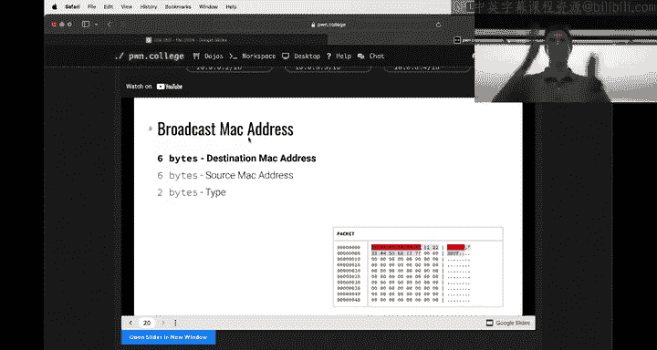
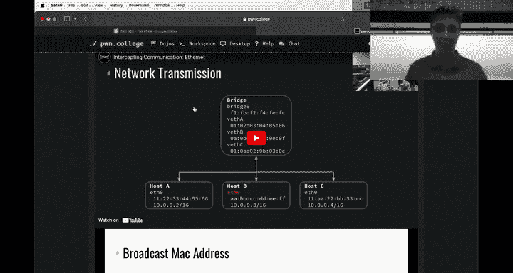
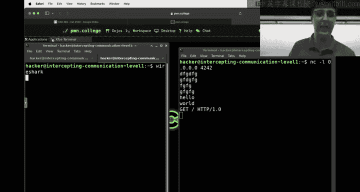
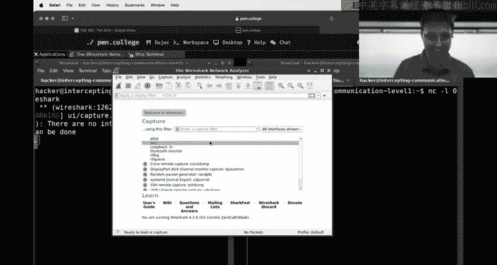
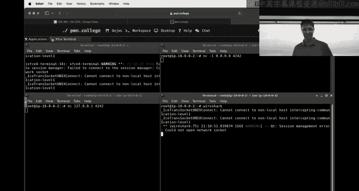
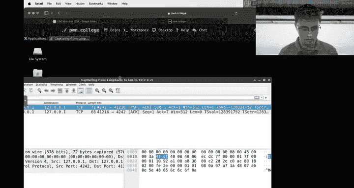
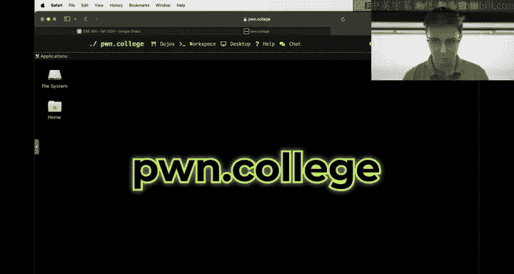
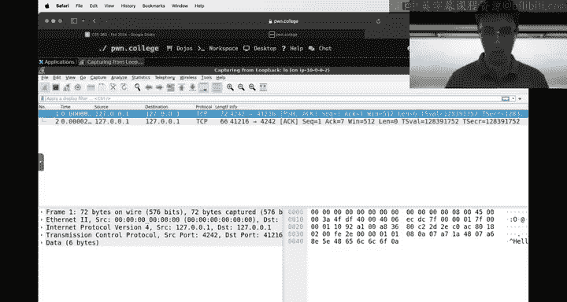
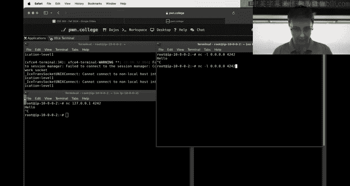
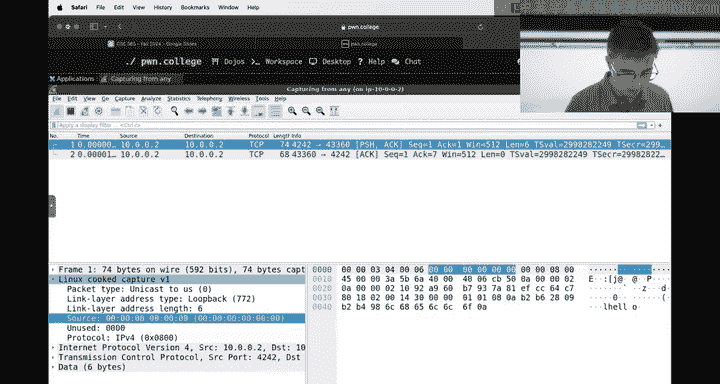

# ASU《网络安全导论｜ASU CSE365 Introduction to Cybersecurity Fall 2024》中英字幕deepseek翻译 - P7：-08-Intercepting Communications - CSE365 - Connor - 2024.09.16.zh_en - GPT中英字幕课程资源 - BV1nVCVY9Ehy

Hello， everyone。 Let's me just pull up the。St's here now that it says it's live， maybe。Chats， okay。

 cool。All right， hello everyone， welcome back to 365。

 We'll you know go into slideshow mode who like this assignment， anyone。Everyone hated it。

Who didn't like this assignment？All right， was it difficult？Did you learn something maybe？All right。

 we'll take it。Okay， so don't worry the next assignment is gonna be probably twice as difficult as this assignment just kidding。

 it's probably gonna be easier， I mean it depends I guess where your mind goes with concepts we're going in a whole different direction but I would assume for the majority of you this next assignment will be easier there's certainly less challenges I think we cover a little bit less ground I think it should probably be easier but I guess we will see it's not going to be like as easy as the first two modules though okay。

So I guess first things first， yawn is clearly not here。 He has some sort of ear post op。

 whatever thing。 He'll be back on Wednesday。 We'll do the meme review on Wednesday because he likes running the meme review。

 But as a quick， quick， quick status update for the class。

 This is the current top 25 helpfulness leader board。 So all of the people that are out there。

 you know， helping your peers。 Thank you very much special shout out to Panto Hanto。

 not sure how you pronounce his name。 He's not in this class。

 He's not affiliated with us in really any way。 He's just a random person。

 I don't even know where he is。 He's just some dude out there like helping all of you。

 who recognizes Panto's name。Alright， so this guy is like carrying the class。

 It seems like other people are also doing awesome things。

 but I decide even though there's no meme review， I would take his one meme where he just has like dozens of threads that he's helping people in。

 And that is super awesome。 I think we're gonna have to figure out how to send this guy a trophy or something okay。

But also thank you to all of you who are not hato as well that are helping people these guys obviously like 141 is mildly insane。

 but thank you to everyone that helps is very， this is critical to this class functioning and I'm sure your peers really appreciate it and hopefully your great appreciates it too。

Okay。This is how Web security went， in case you're wondering。

 There's a whole bunch of stats here as reminder， this slide show is available on the course。 Dojo。

 almost 70% of people pass this assignment where a pass is completing 70% of the assignment。 Now。

 that stat Jan pointed out to me is not very。Accurate in the sense that checkpoints exist。

 So the first 30% of the module is kind of like effectively worth double or I don't know。

 Maybe there's more precise math in that。 but the first 30% of the module is effectively kind of sort of worth double。

 So the pass rate is probably a bit higher on that because this is just how many people did 70% or more of the assignments。

 half the class got an 81% or higher if they started the module。

 I excluded everyone that did not start the module if you didn't start the module is probably not ideal。

 but hopefully you can still continue on with the class if you were part of that group。

We'll see that kind of 25% or less of the class completed the entire assignment。

 at least of those that started， So that means at least the quarter did not complete everything or how missing at least 75% of the class did not complete everything That's okay okay。

 the reason we have the checkpoints is not only to encourage you to keep at it with this class。

 but also to kind of insensivize the first part of the module even more we have lots of extra credit in this class。

 we kind of are my dream is that like somehow there's just like this ramp that goes off forever where like。

No one completes the last thing， but your grade does not get hit by that so you can take the assignment as far as you go。

 it's kind of hard to like actually make that happen。

 but if you did not complete the whole assignment， don't worry about it hopefully I would say hopefully you got at least 70% or more of the assignment completes that would probably be pretty good and it looks about half of you that sort of the assignment got at least an 81% So that' that's looks pretty good to me as a reminder though lots of extra credit recitation Discord。

 lots of things going on and as I said at the beginning of this class。

 hopefully this next assignment a little bit easier。

At one point in this class's history this was the last assignment。

 so we decided to bring this assignment up earlier and kind of flip things around as part of refactorturing things。

 everything's about the same difficulty， but probably from my perspective this is the hardest or one of the hardest assignments again。

 don't make that don't start thinking okay the rest of this class are going be easy mode it's not but this if you're worried we're not gonna get like more difficult than this is unless some sort of concept just doesn't go well with you and maybe it require a little more work。

 but this is about what the rest of the class will look like from here till the end of the semester。

 maybe a little bit easier maybe okay。😡，Cool， so that is the quick status update。

 does anyone have any questions about， you know this， yeah question？The assignment length， okay。

 good question， the assignment length， so the assignment is actually already launched if I refresh。

So the last one had 27 challenges， obviously you know Linux luminium was 84 so just the challenge count doesn't tell the whole story。

 but this one has 14 so it's less I think you'll find this assignment probably takes you probably on average I would guess a little bit less time。

 but do not s I'm just like saying this to like hopefully ease some of your nerves。

But that doesn't mean you should start slacking on this assignment。 It's still going to take work。

 It's going to be harder than Linux luminium。 It's going to be harder than talking web。

 It'll probably be a little easier than Web security， but do not wait for the last minute。

 even though I'm saying that okay， does I answer your question hopefully Yeah。

 any other questions about course logistics or you know anything like that yeah question。😡，Yes， okay。

 so I think I pushed the assignment， but did not actually add a deadline yet I need to update that as well。

 intercepting communication， the checkpoint will be due on Sunday and then which means 30% of this So I don't know what is whatever that math is 30% of this and then a week later will be the deadline。

 So it'll look basically the same as web security timelinewise。 Okay， any other logistical question。

 my phone is no longer looking at chat Okay， there we go， I don't think I got any questions but cool。

Alright。Well， the meme review will be on Wednesday and now we got ourselves another assignment。

So the last assignment talks about web security， which is kind of like a really high level detail。

 like we went really high up in the tech stack for， you know。

 maybe a modern application or modern computing system， we went high up into web。

Now we're gonna take it down a level so this had us looking at you know things like command injection crossite scripting these are like artifacts of your browser or artifacts of the web application deciding to run a command that's influenced by the user in some way Now we're really just going to look at networking and specifically we're going to primarily be focusing on local networks。

 so we're not going be looking necessarily at what happens when you have like this big distributed network of networks that is like the internet but the same core technology exists here so we will be looking at for example the internet protocol which is used in all or a lot of networking communication。

😡，So a whole bunch of lecture is， you know on Ethernet。

 which is gonna be you'll see the first layer then internet protocol builds on top of that TCP builds on top of that and ARP is like a little glue layer So these are kind of the four main protocols we're gonna be looking at so before you know you looked at HtTP as a protocol while HttP lives right on top of TCP so now we're unwinding that peeling back the onion and going down in the layers into TCP into IP into Ethernet So this is kind of like addressing maybe you've heard like don't join a public w-fi network at Starbucks because this is so dangerous this module will hopefully have you understanding what some of the security implications are of a local network。

Okay。I'm going to go ahead and start a challenge。ちちちち。

And we're going to kind of look at some of these concepts in a more applied way。 I highly， highly。

 highly， highly encourage you to watch these lectures。

 but I'm not going to repeat the lectures here this is you know slidehow format talking about lots of things that are absolutely critical you're going to be crafting packets by hand so you're gonna to need to understand how this protocol really looks。

 but we're going to look at this in this you know in- class portion and a little bit more of a handson way to kind of supplement this more theoretical knowledge so highly highly highly if you haven have already watched the lecture videos I understand the assignment got push back and let' do at noon so probably most of you haven't had a chance yet to look at the lecture videos that's fine maybe worst case scenario you'll have to watch back this in-person class to get a little bit more but I'll try and weave through the concepts and the application of the concept simultaneously but highly。

 highly highly encourage you to go and watch these videos。

Okay， so we've got and environments。Cool， okay， so I think at one point while we were talking about like talking web。

 we did this thing where we did Netcat listen and we listened on 0。0。0。0。 It turns out， I mean。

 this isn't an IP address， but it's kind of like pretending to be an IP address format。

And we listen on some port 42， 4242， Let me zoom in a little bit here， can only zoom in so much。

 unfortunately。Hopefully this is decent。There'll go one more， zoom in。Zoom in。Well。There we go there。

Ay good enough。Okay， so we set up this Necat listen on basically all of our interfaces。

 So if you think about a computer and you want to network together a bunch of computers。

 you're going to have literal like ports。 like you can think about like your mouse you plugged into a port。

 I mean， probably you've plugged in an ethernet cable before。

 hopefully maybe I don't know what current status is of modern generation。

 but maybe you've plugged in an ethernet cable before to raise of hands。

 who here has plugged in an ethernet cable before。 All right。

 just making sure or maybe you know you've wirelessly joined a wireless network we're not gonna really think in those terms because I don't know。

 Maybe it's a little bit harder to picture， just imagine literally a cable plugged in from one computer into another computer。

 maybe that other computer you're calling a router， but guess what it's a computer。

 So we just have this cable plugged in。啊。Now when we Neca at this thing。

 we got all three of these layers I was talking about at play where we have Ethernet。

 we have IP and we have TCP this 4242 as we've talked about is a port and that port thing is a TCP concept this 127001 this is an IP layer so 4242 TCP 127001 IP and then there's also ethernet that as part of typing this command we don't actually see the ethernet part。

 but that ethernet part is like the physical cable plugging in to some extent okay。😡。

So I do this right， and now I can talk between these two machines。It back and forth。

 this is how the web security module worked， you spin up a server， it was talking TCP。

 it was talking HtDP on top of that TCP and tons of what I'm going to call and you know everyone that talks about networking probably calls is packets。

 there's packets going back and forth between this and you might be thinking yes I can see that you type hello and I type world。

That is just one part of the packet。 That is the data part of the packet。

 Or when I type get slash HtP 1。0 and that shows up。

 that is the data part of the TCP packet and it turns out this is gonna sound a little obscure but the TCP piece of this all is going to be the data of the IP packet and the IP is the data part of the ethernet packet it is truly an onion here and then at some point if your data layer or your application layer on top as so much popularity that it gets its own name like Htp。

 know we have the Htp layer and then we have things on top of that like the HP body Okay so I'm saying all of this。

😡，How can we like visualize this， I'm saying there's Ether that I'm saying there's IP I'm saying there's TCP。

 Well there is a very cool program。 Let's see here how I'm going to get this very cool program open called wirere shark and then we're going to look at a number of different tools that allow us to see some of this stuff but wirere shark is a nice graphical tools if you want to use wire shark on the Dojo。

 you're going to have to use the desktop thing V code cannot launch wire shark okay。

So I this this nicezoographical program pops up and you can see these things are listed here。

 One of them is like Bluetooth monitor turns out that we're not going go into this。

 but wirere Shark can like listen to Bluetooth packets。

 Bluetooth is a whole separate protocol We're not going into Bluetooth The critical things that I see here are E zero。

 and I know this is， is there any way to zoom this in。Zoom in zoom Nope。

 it says for some reason you cannot zoom in。 I will hopefully it's kind of visible。

 Is it visible enough for people。 Can they， Can you guys see this looks good， all right cool。

 So we have these kind of three things that I'm looking at if zero any and loop back L0 or L O。

 If I open a new tab。

And I type this command here。I said that you know， we have an Ethernet cable。

 We plug it into our computer。 These things are plugging into ports。

 Another related term to port is an interface。 or in this case， a network interface。

 This is like a software representation of that physical port。

 You don't actually need to have physical ports to do networking。

 You might have entirely virtual ports doing the networking， but you might have a physical port。

 or it might be a wireless antenna that's looking at Wii-fi and then that has a software layer that treats this as a network interface。

 In this case， I start up this container or I start up our workspace and our workspace has two network interfaces。

 It has the L， which stands for loop back interface， and it has the Eth0ro interface。

 E0 is very commonly used as a name。 we've got two network interfaces。 And basically like I said。

 think of this as two ports that you could plug in Ethernet cable into the loop back interface is a little bit special。

It is truly just virtual。 There is no port at any part of the Lo back interface。

 It is entirely just the software concept that's fitting into this same abstraction and what this loop back interface does is it lets us kind of just like talk to ourselves。

 which maybe sounds weird， but if you have multiple processes started up and you want those two programs to be able to talk to each other there's a lot of ways to do。

😡，Innerter process communication。 but if we're talking about networking and networking is the idea of being able to plug two computers into each other。

 this idea of being able to plug two computers into each other hopefully extends far enough to where we can also just plug two programs into each other and to some extent that's kind of how you should think about the loop back interface if you've ever typed local host or you've ever typed 12。

7001 this is going over the loop back interface 127001 is an I address that is on the loop back interface and the reason we can see that if I type this I command that lists these two things is right here。

😡，You'll see Inet Inet 1，2，700，1。 This is if I type 127，001。

 those packets are going to flow into this loop back interface。

 which is just going to loop back to itself and see， you know。

 did I bind something to port 4242 on the loop back interface and if I did and I want to talk to 127001 on port 4242 it would go through that interface and loop back to itself and go to port 4242。

😡，Okay， now we also have this other interface and you could have zero interfaces。

 probably most situations that I've ever seen always have a loop back interface technically we could get rid of the loop back interface。

 I don't really know what the behavior of that would be， but you could have zero interfaces。

 you could have one interface， you could have two as we do here， you could have100 plus interfaces。

And this interface is a little bit more interesting。 In this case。

 you'll see that it has an IP address of 1016121。 So this IP address is actually routeable by the Dojo infrastructure itself。

 So when I go into the browser and I hit this little like desktop thing or I hit the workspace thing and we have somehow my browser is able to talk to my workspace that's on a server somewhere else。

 that traffic is actually flowing over this IP address right here。

 The Dojo infrastructure when I logged into and I'm gonna tell you right now。

 this is actually my user I here as well。 I user I 21 that I'm logged into right now。 It just says。

 okay， user 21 is what's logged in， it looked at the cookie in the Http request and said， okay。

 the session is for user 21 and they want to hit the desktop， let's talk to 1016121。 And when I said。

When I said maybe a week ago， if you're paying attention to some of the infrastructure changes where I said you know we're going multi nodeode this right here is the node ID we are right now sitting on node ID 16 There are three nodes one is on 16 ones on 32 and one's on 48 the specifics of this don't matter but we're gonna start to understand networks and subnet and these truly do come into place this is like how the Dojo is able to speak to you the 16 says go to node1 and the 21 right here says talk to user 21 So this is a real IP address it's auto local networks so for example if you're on your computer right now and you start trying to talk to 1016121 this is a local network it's not attached to the internet at large at least in a immediately routeableet What is attached to the internet is Poc college and whatever the IP address is of Podc college actually if I do。

Is going to work because I don't think I have internet access in this environment。Let's see here。

We will zoom in。 this is really on my laptop if I ping Pone College。

 which is just kind of a way to ultimately it's gonna to resolve what Poe College's IP address is and it's just going to send a little 64 byte packet to it every seconds will see that this is 20。

620，6，19，259。 This is the Pe College IP address So you know lots of IP addresses and this is truly a publicly routeable network interface。

 This is attached to the Internet。 Anyone whos plugged into the internet can talk to 20620，6，1925。

9 whereas this is a local area network。Okay， so we've got the loop back interface。

And when you did all of these web security challenges。

 those were binding to the loop back interface If I do cat Hetsy hosts you'll see we have a whole bunch of things in here for example I have example co in here which turns out to have this IP address right here of 9318421514 we also have in here though let's see here hacker local host and challenge。

 local host and you'll see that challenge local host just resolves to 127001 so when you did the web security module all of that networking you were doing was going over the loop back interface when you're talking to the workspace or the desktop vs code or the desktop thing that is going over Eth0 in generally in these challenges you're going over the loop back interface but the infrastructure actually goes over this Eth0 interface and if I wanted to talk to example。

comAs we did in the past， I do curlexample。com， right to talk to this domain。

As I said before with this P command， it kind of is a very quick way to see the IP addresses also its a ways to find the IP address of a domain turns out there's a whole other protocol that unfortunately we just there's only so many concepts we can cover I'm sure you think we're already covering too many concepts this is a whole other protocol called DNS that deals with this but we've got this IP address right here and so I typed IPA before to show you my two interfaces IP route shows me。

Where what interface should I go to when I'm talking to a specific IP address So it turns out the 12。

7001 doesn't need the route in there because it's immediately the same So this is gonna have to deal with subnets will' get there later on but we can see that by default I talk over80 and then it also has this other special rule that if I want to talk to 1000 slash8 which know I'll spoil ahead real quick1000lash8 this slash8 thing has to do with how big is this network。

 how many hosts are in this array of network IP addresses and this slash8 specifically。😡。

If we talk about IPV4， that V4， one of the properties of IPV4 and generally in this class when we talk about IPV4。

 there's a whole other thing called IPV6 which is maybe a more modern version of IPV4 that the world is slowly。

 slowly slowly trying to move towards， but IPV4 has these IP addresses that look like something got something got something do something。

 each one of these things that is separated by a dot is one byte and so what that means is that it can be anywhere from0 to 255。

If I do the fact that there are 256 of such things between each dot and there's four of those right there's four bytes。

 256 to the4， this is how many IP4 IPv4 addresses are available there's 4。

2 billion of them and maybe 4。2 billion IP addresses sounds like a lot to you but it turns out that the world has decided that is nowhere and near enough and this is one of the big motivating examples of moving to IPV6 I're not going to talk about that too much。

 but if you've heard of IPv4 versus IPv6 that is what's going on there there are 4。

3 billion IP addresses so when I say 10。0。0。0 let's say 10。0。0。

1 for example this IP well yeah obviously this is not a valid python but this IP address right here this is referring to a single IP address。

If instead we see a syntax that has this slash here and you see like slash 8 what this slash 8 means is that I'm actually only looking at the first8 Bs of this thing and everything else is a wild card So the first 8 bits aka the first byte is this 10 right here So this means basically if you like the bash syntax of a star meaning wild card。

 this means 10 do star do star do star if you see 10。

0 do0 do0 slash8 this is a whole bunch of IP addresses how many IP addresses， well 256 to the third。

That is how many IP addresses or written another way。 Let's see here， two to the。

Two to the eight because eight bits。Or I guess we have that slash8 there。

 there are in total 32 bits available， 32 bits， we minus we subtract that slash8。

 so that means theres 24 bits of wild card to it and then it'll be 2 to the 24 which is the same thing as 256 to the three and that is。

 I think that's a 1。6 million hosts。Okay， so that's just like a quick discussion of what these IP addresses look like like syntactically and what these IP ranges look like。

Let's zoom back out to all right， let's actually see these packets like I was trying to show before I went on this side tangent here。

Wire Shark， when I launched it up is saying， would you like to capture traffic。

 look at traffic on E zero？Or would you like to look at the loop back interface LO。

 because those are the two interfaces that exist， or would you like to just capture on any。

 And now technically， like I said before， there's also Bluetooth and these other things in this case。

😡。

I'm gonna go ahead and capture on the loop back interface and you're going to see very sadly that you do not have permission to capture on device L。

 So a unprivileged user cannot just go snooping on traffic if you could just see all of the traffic going over your host and the privileged user route。

 for example， is is communicating this very private secret information this would be a issue right an unprivileged user shouldn't be able to snoop on a privileged user for example。

 And so the way what Linux is set up by default is that unprivileged users do not have the ability to snoop on this loop back interface or for that matter。

 this E zeroro interface。 I don't know what's gonna to happen if I do any if it'll just no it also just aggressively says absolutely not okay。

And that brings us to how these challenges are set up。Okay， so whereas before with the challenges。

 you know， I mean， I guess we've seen a few styles。 But before， you know。

 you were running like challenge server and that would spin up a server。

 and then you talk to the server， this module has its own style to it as well。

 that is a little bit different and it's really important to not get too confused about the style of it is really not so difficult But the way that this is set up。

 if we look here， I am hacker at intercepting communication level1。 You're used to this right。

 Haer at whatever the challenge is when I do challenge run。

It is going to immediately what's going to tell me some text。

 And then it's going to drop me into a shell。 You might think for a second。

 if you don't pay too much attention that the command ran and then it exited and it's done。

 The command did not exit。 The command is still running。

 Challenge run is still actively alive right now。 And what it did is it started up a shell。😡。

And you'll see， fortunately for you。That our username changed and our host name changed。

 In this case， we got kind of a little more bare bones with our host name。

 Our host name here is just IP dash10002。 and it says I'm root。

 So if you've been paying attention to the high， high， high level objective of this class。 the high。

 high high level objective in every challenge is to get the flag in the flag is owned by root and only readable by root。

 And I'm telling you right now that the challenge just drop you into a shell where you are root。😡。

It's not as fancy of a root as you might hope for if we cats flag sorry。

 permission is still denied your root from kind of a different perspective and this perspective change has to do with a concept on Linux known as namespaces we not going get super into namespaces here。

 but for your purposes you'll see that home hacker suddenly all of my files say they're owned by roots these are my same files that exist outside of this shell it's the same file system What happened and you'll actually see this right here if I do slash home。

You'll see that home is owned by nobody and no group and you'll see that the flag is owned by nobody and no group the what happens when you drop into this root at IP shell which is what you're gonna do for every single one of these challenges is we create kind of like this little virtual environment we create a namespace and in this namespace all that exists is your hacker user but your hacker user has been mapped to be the root user but the file system doesn't have this same view it has the original view and so that's why all of my hacker files are owned by root and all of the root files are owned by nobody and I know it maybe sounds like a mess honestly you don't need to understand this detail because it doesn't really matter but for those of you wondering why when I get roots I can't cat flag which maybe some of you will think about that's kind of the setup of this challenge and here's why you are now root inside。

😡，Of this little environment。And root inside of this little environment does have permission to sniff on network interfaces。

 which I mean if you brought your own laptop to a local local network you know brought to Starbucks or whatever and you plug in your device that's like has a physical device in your case obviously you're not plugging into the Starbucks w-fi by plugging in in yournet cable。

 which you have a little radio thing that's effectively plugging in you have the ability to do whatever the heck you want with that that port。

 you can sniff your own traffic， there's nothing stopping you from doing that and I keep saying Starbucks as an example I'll take a step back。

 everything we're gonna to show here is not going to work on the Starbucks Wifi there are all sorts of security mitigations but once upon a time the average wireless network maybe look insecure like we're gonna to see in this challenge okay anyways。

Let's run the IPA command again as part of going into this namespace thing where the user has changed a little bit。

 all of our network interfaces changed as well。 You'll see for example， that when Icurlexample。 co。

 it's going to say could not connect to the server。

 it's because this namespace thing inside of this challenge no longer has access to the internet the routing has changed if I do IP route。

 you'll see there is a route here， but ultimately it kind of just became its own little box that's not plugged into the internet anymore。

😡，Okay， and you'll see that there are still two interfaces， but these two interfaces are different。

 This is a new loop back interface that is dedicated to this namespace。

 You always know that you're in this when you see your shell and it says rootot at IP 10002。

And this Eth zero is also different， you'll see that I'm no longer 10。16。1。

21 or whatever the heck it was。Now I'm 10002， you're on a different network。

 you're in a namespace it' changed and I will also point out for the structure and setup of this assignment if I type exit to leave this shell now the challenge program really has ended。

😡，And I， if I want to get back into the challenge and get a shell in the challenge again。

 I just run challenge run again。Some people aren't going to catch this unfortunately。

 but I highly encourage you to listen to what I'm about to say if you start up two terminals。

Here we go， two terminals， and I type challengell run in each of them。

And I look at IPA and I look at IPA and you say， look， I'm root at whatever and I'm root at whatever。

These are not in the same place。 These are completely isolated from each other。

 This thing is in a separate namespace from this thing。 They are not talking to each other。

 completely different networks。 These two things cannot see each other。

 And so when we learn some tools that might be useful for like monitoring the network。

 and that sort of thing just keep that in mind。 that is not going to work。

 I should probably know off the top of my head how we can get a new window。

 there's a way called Tmux that allows you to do terminal multipleing。 and that will definitely work。

 We've ever use Tmux before。 but there's also， let's see here， X phasese terminal。Yes。

 if I manually do that。Well， that doesn't look good if I if I type XFC C E4 dash terminal and we'll write this somewhere and put an ampersand to background that process。

 this guy is now in the same namespace as this guy every process that you start in this shell it's like a tree。

 all these processes are a tree， it's derived from the same tree。

 that means it's in the namespace If you go to the desktop and just start a new terminal。

 the simple boring way， the desktop environment is not in that same part of the tree。

And so this is just pointing it out real quick because it's a common gotcha that some people face。

Once you start the challenge， that network is， it's forming like a tree。 Okay， so if I want to。

Finally， get to the point where we are sniffing some traffic。 and let's go ahead。And close that。

 close that， Okay， let's start from the beginning， actually， just to make this real crystal clear。

If I do challenge run。And let's say I want two terminals。I'm going to do XFC4 terminal Ampersand。

 that'll bring up a terminal over here and I'll do XFCceE4 terminal ampersand again and that'll bring up another terminal Now these two guys are in the same name space。

 they're in the same network they can see everything that's going on。And now actually。

 I'm going to bring up a hit a third terminal here。Okay， three terminals。 Well。

 I guess a fourth one also， but we're we're ignoring that that's going to be our little terminal starter guy。

 And now let's zoom in real quick， zoom in few zoom in。

Now let's do our thing we did before where we Netcat listen 0，0，0， 42 42。And I Netcat 1，2，7，0，0，1，42。

42。 And I say hello right they're in the same network。 They can see each other。

re they're able to talk over loop back as well， because they have the same loop back test right。

 This all works。 Okay， now let's finally see these packets I've been talking about。

 because now we have the permission。 We are root inside of this little namespace system thing。

 The way that we can do that is we're going to type wire shark。 Again。

 wire shark needs to be started from inside of a terminal that's inside of this this setup。

 What the heck hip in there。😊。

Theres a disaster。Oh， boy， I think I know what happened。All done。

 we're going to make it simple for ourselves。I think I'm using a user that lots of people like to use。

She。CSEA 365 guest。C a 365 guest at example。com someone I think started a challenge as my demo user because a lot of us just share this demo user as like a simple thing looks like that doesn't work I've been waiting for this day to come I figured one of you were eventually going to do this。

 but I think it was I think it was someone outside of this class okay。Cool。Now let's do this again。

 but we'll get back real quick。Ch。And this time， hopefully that doesn't happen again。Cool。

Let's hit the desktop。This top starting up。好。Eventually。Okay。From the top again。

As soon as we get a terminal。Challenge run every time you're working in the challenges。

 challenge run， you want a shell inside of the challenge run shell。XFCE4 terminal。Ampersand。

Ampersand。And percent， all right， we started ourselves three terminals because I want three terminals。

We're going to do Netcat， listen。0ero，0，0， 42， 42。We're going to Netcat 12，7，0，014242。

 and we are going to wire shark。And now， hopefully the desktop doesn't die again。

Okay， now we got wire shark again。 and now， unlike before。

 we are going to have permissions because we are root inside of this environment and we just ran wire shark as root inside of this environment。

 If I listen on the loop back interface。And I go a set ahead and say， hello and hit enter。

 Here comes a packet。 These are my nice packets， and I know this probably looks。

Pretty boring and terrible to look at， but these really are my packets。

 let's see if I can zoom in now， nice， zoom， zoom in， oh that's it。Well what are the odds controlled。

 I'll just zoom in again。Yeah the issues， I think is going to make the desktop itself zoom in。是。

Oh， hopefully it is good enough。Okay。These actually， let's put this on， does this work。

 how do I get it onto the second？哇哦。

There's like little virtual desktops here。 So if you look here in this top right。

 right I can switch between my virtual desktops， you might find that useful。 I don't know。

 In this case， we're going to try it out。 Okay， so we have two packets that came through。

And it's a TCP packet。 Turn out that we are partway through a TCP stream。

 which we will see from the beginning here in a second。

 because we started wire shark after the connection was already established。

 but partway through a stream。😊。

We can see here in wirere Shark here， right here， these are the bytes that represent my hellello。

 we can see a little0 a here， that's the hexadeimmal ASCI representation of a new line character。

 and I sent hello in a new line character。We'll also see a whole bunch of bites。Right here。

 this is the rest of the packet。 And as I said before， these packets are onions。

We've got TCP below TCP， we have IP and below IP， we have ethernet we have。

4 layers if you want to count the data layer as its own layer embedded within this packet。

 and that's why this hello new line character is starting at like byte He 42 or something like that。

 We have all these other bytes that are just saying you might think they don't matter。

 but they're saying important things。 They're including IP TCP and ethernet information that we're going to get into And wirereshrk is a very nice graphical program once you kind of get the hang of it and hopefully you'll get the hang of it in this assignment。

That allows you to start viewing the different layers of these packets。

 so you'll see that I clicked on this transmission control protocol that's what the TCP is。

 transmission control protocol， and these bytes highlighted here on the right now。

 those represent the TCP part of the packet。And then I've got I right here。

 These represent the I part of the packet。 and then I click right here and these represent the ethernet part of the packet。

 All of these bytes mean very， very， very specific things。 So so far in this class。

 you've mostly just worked with HGDP as a protocol。 And HtDP is a plain text protocol。

 which means it looks something like this hello where you can like actually read it and will have like literally the ASI forge to mean get。

Ethernet I and TCP are not plain text protocols。 They are binary protocols。

 and what this means is that you don't type out the literal ASI bytes forges when you want to do like a get operation these protocols don't actually have a concept of doing like a get operation。

 but to represent the data that they want to represent iss just packed as bytes at very specific offsets So for example。

😡，Let's look at ethernet first It's kind of a little bit weird because I'm looking at the loop back interface and it turns out that the loop back interface。

 these bytes are all nulled out wellll maybe see if we can look at this over the E0 interface if we do the same thing over E0。

 but these last two bytes of ethernet that are 0，8，0。

0 this right here is type information so these last two bytes of this I believe this is a total of 14 bytes。

 yeah， 14 bytes。The last two of those 14 bytes are the type so these two bytes literally just say when it is 0。

800， and you might say this is arbitrary， it is arbitrary。

 but this is how the spec is defined when the last two bytes of an ethernet packet say 0800 what that means is that I am sending an IP packet so as part of unraveling the onion were're actually starting in the corn。

 I guess going up in this case those last two bytes says what is to come and what is to come is a whole bunch of internet protocol packet information So 0800 and you can see that wireshark very nicely says type IPV4 because wire shark is very aware that 0800 means IPV4。

If I now jump into IP， we have a whole bunch of information here， so for example。

 these two bytes in here say total length it says this 58 bytes。Okay。Let's see here。 We've got flags。

 We've got time to live。 We've got a whole bunch of fields and all of these fields mean something。

 In this case， we're like kind of just glossing over them so that we understand at a high level what's going on here as we look at this in wireshark these bytes right here。

 this single byte it looks like is the protocol that's below this So this 0。

6 that's in here says that the data to follow and actually it's not immediately to follow but is going to follow is TCP。

 So that means that after I get past this， this and this。

 the other bytes of the IP packet Once I get finally to hear it's saying all right interpret this data now as TCP。

 So the first layer said what is to come is IP and then the next one said what is to come is TCP and guess what TCP also has a whole bunch of information and as maybe boring as it is or whatever。

His bys mean things？And we're going to start to get a feel for what some of the important bys mean We don't actually care necessarily about all of them necessarily。

 though they all do mean things， but we're going to hopefully get a understanding of this Now you might be asking yourself why Why do we have three layers here。

 Why is there Ethernet， why is there also IP， Why is there TCP， Why not just send like hello。

 like I should be able to just send hello and call it a day these other bitetes are useless。😡。

They're not useless All of these protocols do different things and the lecture videos。

 which I'm going to repeat highly encourage you to watch these lecture videos to get a better understanding of the functionality of each of these layers。

 but they each serve their own purpose so we can kind of think of the ethernet layer。Here。

 as meaning。I have a bunch of。Wiires plugged into my computer。 You might not just， you know。

 at your home network set up， you probably just have one ethernet cable plugged into your router。

 You call it a day， but a computer could be plugged into lots of things。

 Ethernet is basically a question of。My nearest neighbor。

 I've gotten pluglugged into like six different things。 Who should I be talking to。

 I want to address one of these six things。 Each of these six things will have an an address。

 I almost said I address。 Ethernet does not have I addresses。 Ethernet has Mac addresses。

 If you've heard of a Mac address。 Mac addresses live at Ethernet layer。 And as I said before。

 the loop back guy is a little bit funny because it just has this stuff nued outlet's actually。

 maybe we can get。

A clearer picture of this， if we。And not to go over the loop interface。

 let's see if it's possible here。

Let's IPA， let's listen on 10002 port 4242， so rather than say I'm listening on all of my interfaces。

 which is what the shorthand of 0。0。0 is at 10。0。0。2 should mean I'm only listening on 80。

Effectively， there's some caveats to that。 I'm not being super precise in my language when I say that。

 but it's will say it's close enough for getting the picture we want right now。

 And if I Neca now at 42，42。Let's see what wire shark shows me。

 We'll see a whole bunch of packets showed up。Let's see if I can find the equivalent packet actually I didn't send any data yet。

 let's send hello again。Hello。This guy right here， this packet right here here's our hello again。

 I guess this time it's lowercase hello， but you know， same idea。

And let's climb all the way back it is hiding the ethernet。I'll look into that later。

 well get to we'll get to this part here for now， but moral of the story is we we'll just kind of gloss over it for a second。

 What's going on here is。Let's see here。This interface right here。

 I think it's still going over the loop back， let's it going over the loop back， let's see hold on。

Now I got it now， listen， don't save， continue without saving。Where， how do I。Okay， there we go。

I think it's still going over Lukebeck。Let's see。Hello。Is， yeah， I'm not getting any packets。

 I think the kernel is being very smart and still routing me through the loop back interface because it's on the same host。

 There's not a quick way to resolve that。 Let's see here。 do that， okay。收。

Let's ignore that for the moment then at least from the perspective of wire shark， unfortunately。

 the kernels being really smart and just putting it， I think through the loopbe interface。

 But if you want to know what your Mac address is on this interface willll say without wire shark IPA shows you that we'll see that on the0 interface my link slash ether this thing right here is my ethernet address。

 my Mac address So 2 a75569 d9 c73 not quite as maybe nice to look at as like 127001 or something like that。

 but this is what a Mac address looks like it is6 bytes long and rather than representing each byte with decimal as an I address does by common convention it represents each byte as a hexadeimal value and rather than separating it by dots it separates it by semicolons I actually don't know the history on why they decided you know hexadeimal here。

Deimal there， dot here， Co in there， I really don't know。

 but this is the standard convention for representing a Mac address and so this is our Mac address。

So I'm going to， well， let's see here if I can go back。

To listening on all interfaces since it's going over the loop back interface。

 let's capture that agains。Let's send Ho one more time。Okay， we're going to ignore for the moment。

 it doesn't really matter for our purposes， that those are all zeros。If I go right here， nope。

Internet。Let's see here， sourcers。

OhNow it's getting even weirder。 Okay， let's go back to listening on 1，2，7，0，0。

 The kernel is doing some， some funny things right here。 Let's listen on 0，0，0 and connect over 1，2。

7。 Let's try and keep this as simple as we can。😊，Oh， and we got to send。 Oh， I already send hello。

 Yeah， right here。 Okay， here's my hello again。 So traditionally， within this ethernet thing。

See now it's like cooking it。 What I don't even know what the heck of Linux cooked capture is。

 somehow I doing some weird stuff with the Internet。 Let's jump over real quick to Ip address。

And we we'll resolve that later Okay so some of the bytes here within the IP address layer is the source address and the destination address。

 Each of these takes four bytes to represent So I said that IPV4 takes4 bytes well guess what in the binary protocol for IP。

 Those four bytes are at a specific offset into the packet and they are represented here。

 So you can see right here there is a 7 f7 f is the hexadecial representation of decimal 127 and then 00 is the hexadecial representation of decimal 0 and then 00 again and then 01 right So this is literally 1。

27001 And this is saying this is where I'm coming from So my source is 1，2。

7001 and my destination because we're talking over the loop back interface。2，1，2，7，0，0，1 is also 2，1。

2，7，0，0，1。 So I'm sending it from myself to someone else。 This traditionally， I guess。

 would get a little bit more， you know， you're not always talking to yourself。

 I guess let's say but we will see examples of that later on in here。

 as you might expect when I said that that port 42，42 is part of。TCP。 Well， guess what。

 Here's the bytes for the 4242。 In this case， I sent hello from the guy that's listening。

 I sent the hello from the server kind of part of it。

 So what that means is that the source port here， the person that sent hello out the source was 4242 because the server was bound to port 4242。

 So the source is 4242。We will see maybe coming out of nowhere this destination port。

 this destination port is 49182 why 49182 it's 49182 because this guy over here when he decided that he wants to talk to 4242。

 he had to create a socket and as he created a socket to go start talking TCP。

 the colonel assigned him a port and the reason the colonel assigned him a port is so that when the TCP wants to talk back we'll see here when it wants to。

Receive a communication I a bidirectional communication。 Each side needs support port。

 Each side of this TCP interaction needs a support。

 And so this is very clear right4242 because we said it's going to be on 4242 The client just gets a random number。

 The kernel comes up with a random number for the client gives it to it。

 and now all this TCP traffic when it's communicating and using its source or destination depending on which side of the networking communication we're looking at is happening is going to use that port So this right here happened to be 49182 And the reason it's not just so you can talk back but also so you can follow who you're talking to So one of the properties of TCP。

Is that we might want to， for example， if we look at web security where we might have some multi threaded web server that's running。

😡，It's going to be responding to multiple clients and when it's responding。

 somehow it needs to know what client it's talking to and we'll see as we talk more and more about IP。

 which IP it wants to talk to is one of the things in here and that's why we have a source and a destination IP address。

 but it also as part of the TCP layer on top of IP needs to know what port it's going to talk to。😡。

Okay， and then there is a。whole bunch of other things in here。I'm going to， so again。

 because this is a little bit confusing。 is's going to be crucial to watch these lecture videos。

 I break down all of these bytes， and also kind of。

The meaning behind what this protocol is。Here I'm just trying to show you wire sharks once you start working on these challenges。

 you can start deconstructing it。 But one of the important things within TCP。

 as we'll see in the lecture video， is this push and act。 It's these flags。

 So these flags right here。Allow us to communicate。What kind of operation we're going with。

 So maybe the the the closest example or the closest corollary here might be how at HP。

 we have a get versus a post。 Well， in TCP， we have these different。

It it's a little bit different than like a getppers suppose， but maybe it's kind of similar。

 We have these different operations that we want to do and these different operations embed different things in this case we have the push flag sense in the push flag within TCP when it's on this packet and the client receives this packet coming back it's saying。

 okay notify the application like right away that this happened that's what that push is doing on the other hand。

 you'll see up here in the TCP interaction， we have this thin packet it's thin acts more specifically the thin part is saying all right I'm closing down this connection we are done talking to each other and so I'm going to f in here okay。

So that is kind of looking at some of this with wire shark。And I guess maybe to。

A hammer in maybe a little clearer what's going on here with some of these protocols。

 why the three protocols again。Let's open up VS code。哪边。let's we'll ignore that for the moment。

 what I'm going to point out instead first。Is that wireshark is a graphical tool for viewing all of this。

 and it's a very nice graphical tool if you would rather use a command line tool and kind of you'll get a sense for when you might want to use the graphical tool because you like graphical tool slash you want to use some analysis like breaking down what is this actual byte right here。

 represent， for example， this right here is the sequence number or this right here is the total length。

There is a different program that we can use。 That is a command line alternative。 Let's see here。

 open。Terminal， oh， I can just hit open terminal and it puts me in there Also。 Okay。

 instead of doing that XFC C thing， looks like you can also just hit open terminal from file。

 But don't click the the the terminal at the bottom。 I don't think that'll work。 In fact。

 it definitely will not work。 Okay， a different way that I can view this from the command line。

I I can type TCP dump and TCP dump will allow me to see。

It is network worth traffic again in a command line interface way。

 If I type TCP dump dash Ispace any， this is going to be saying I want to listen on all of my interfaces。

 And if I hit enter now， we are now listening for all TCP traffic。

 So if I say hello Gu what a packet shows up and it's representing it to us again。

 it's in a command line we're not getting this fancy graphical tool in a command line situation here。

 but we can see the packets here。 and we can see that this is going over the loop back interface。

 it's automatically resolving something things。 So for example， it automatically resolve the 1270。

01 to be local host， I can actually turn that off if I want with dash N。

 You want to know where these options come from again， read the man page。

And now we can see it's 1，2，7，0，0，1 and 42，42 suddenly starts talking to 1，2，7，0，0，1，4，9，18，2。

 we can see that for the flags， there is a push。 The dot you maybe saw in there was there was an act flag。

 The dot represents an act flag。 There's this sequence number。

 there's this acknowledgeknowment number， there's these other options and we can see length 6 right here。

 And what that means is that of the data portion of this， there is 6 bytes， right。

 hellello is 5 bytes plus a new line character，6 bytes。 If you want to see those bytes。

 If I do dash X X capital there。Let's see here now I can see the bys coming through this will show me the whole thing like I was seeing before in wire shark。

 I can see all of my bys in here and。Yeah， so right in here， we've got our hello。

 and then here's our new line character， and then it responded。Okay。

 so TP dump is another option that we will get into It give me a lot of。

Like kind of not one off tools， but a lot of tools may be compared to prior modules that you'll be looking at with this。

 So I've already shown you IP is a nice command。 So IP space space A gives us a whole bunch of information about our networking interfaces。

 I think in this assignment you probably won't need IP route。

 but maybe you'll see some use for that we've seen wirereshark。 we've seen TCP dump。

 both of these have lots and lots of great tools。 So for example， actually if I go back to TCP dump。

 if I do let's see here if I right click on this actually let's start a new TCP stream。

Let's do Necat， listen。And then actually， let's do that。 Let's Necat to that。 If I say， hello。

 this is a test。 and you might be thinking you know， you've been listening to all this traffic。

 And you're like， wow， this is a lot of packets。 I just want to know because I don't have access to this。

 I'm not able to see the terminals， right， This wire shark thing is truly just capturing at a networking layer。

 I don't have access to those terminals。 What are all these packets saying。

 what just happened in this interaction， Well， what I can do is I can right click on one of these packets。

And you can see all right here there's a lot of options。

 One of them that you might really like is follow and follow TCP stream。

 I right click on that and I know it's not zoomed in super great but in here you can see color coded depending on whether the client or the server sent it is hello。

 this is a test So I just captured all this network traffic again right you saw me type it so it's not that like mind shattering here。

 but imagine that you were just listening to all the network traffic and you weren't the one on the terminal typing you're just capturing traffic this would allow you to look into one of these entire TCP sessions and see the back and forth Now in this case we have maybe you will call it a protocol the hello exchange protocol or something and it's plain text you might also have other protocols living on top of TCP that themselves are not plain text protocols and。

Themselves binary protocols。 I don't know if this is true。

 but I think it's more protocols are probably binary than plain text。

 The fact that HP is a plain text protocol is like kind of。

Nice for us that it is for that HtP2 is not a plain text protocol if you've ever heard of HtP2 but your browser is actually speaking。

 let's say to Poe College when you go to the Poe College website or when you go to YouTube or Instagram or whatever is' probably not talking HtP 1。

1 or 1。0 which is this nice plain text protocol is probably talking HtP 2。

0 and the semantics of that protocol or almost identical is very similar it's got some upgrades in there but one of the big differences is that HtP 2。

0 is a binary protocol， which means you don't get to see the nice like big allcaps get instead there's like a bit that represents that I want this to be a get。

Okay， but if you were in that case， for example， wire shark， lots of options in it。

 we could turn this into raw， which in this case is just showing me all of the hexadecimal if。

If you were， I don't know， I guess this was written where they imagine。

Programmers wanting to copy and paste this as like C definitions。

 I guess you could copy and paste this into your C code so that you could then say， well。

 this is the first packet。 And it was these bys。 I don't know why you would do that。

 but you can maybe imagine why someone would want to do that。 I guess yeah。

 I don't even know if I've seen Yaml。 Wow， you can do it as Yaml also。

 it kind of depends what you want to do with it。 wirere shark， very powerful tool。

Probably this raw view nope， not raw view， this。The ASI view is good enough for us when we're looking at plain text。

 and so you can imagine that if you were some person on a network and these packets were flowing through your machine for some reason。

And you open up wirere shark and you tell it that you want to listen on all interfaces and these packets are flowing through your machine。

 You have no idea you can't see their screen， for example。

 you don't know that they're typing get requests with Neca or something like that。

Wire shark and just more broadly， for example， TCP， dump。

 you can capture this traffic and analyze it。 And so that's gonna to be one of the things we do in this module right。

 it's called intercepting communication。 We are going to be intercepting communication in this module。

 We're going to be learning more in depth about ethernet about IP about TCP。

And this fourth one that we haven't really shown off yet。

 which is ARP an ap kind of kind of serves as a glue layer in some sense。

 between ethernet and IP address。 And it turns out we're really actually hammering in on this ap layer。

 though in order to do ap you kind of gotta understand these other three as well。

 this ap layer has to do with connecting a Mac address to an IP address。

 So at some point when I am talking to 1，2，7，0，01 or I'm talking to 100，0，2 or I'm talking to。

Example。com，'m talking to 93184-21514。I'm saying and maybe it's not clear yet why there's Ethernet why there's IP。

 why there's TCP， the short answer is they serve different functions。

 but we saw before that we have this idea of an ethernet address a source and destination and an IP address。

 a source and a destination and when you say that I want to talk to example。

com well the first thing that happens is that example。

com gets resolved into an IP address and that's yet another protocol that I don't think we're gonna to have time to explore this semester that's called DNS and DNS actually has its own security implications involved。

 but let's say we can finally just let's cut out that layer of turning example。

com into this IP address， when I have this IP address at some point in all of this process I need to get a Ethernet address I need to know what ethernet address I am talking to in order to talk to this IP address。

And the IP layer in the ethernet layerre they're very different。

 Ethernet has to do with this much more local right right next to you layer， this local。

 local perspective on things， whereas IP address or IP concerns itself with multiple hops。

 So if I want to talk from this computer right here all the way to example do com。

This packet is going to flow to another machine and then that's going to flow to another machine and another machine into another machine in another machine and it might take 20 hops before it finally gets to example。

com that IP layer is dealing with this hoiness of traversing this large internet。

 this large network of networks， whereas this ethernet layer has to do with just my nearest neighbors it's just I need to know what port to send this data through。

😡，And so one of the things that comes up to glue these two things together is this protocol called art。

And ARP is literally going to so we can imagine maybe I talks about the broader internet I talked about like right next to you in terms of these interfaces。

 it's kind of like maybe a little bit of a simpler thing which is your local area network so all of these devices on your home network。

 for example， let's say you go home and you have your router and you have your phone and your laptop and your computer and your firet and all these things all these things have IP addresses but they're also all on the same local area network and depending on how your home network is set up。

You might be。If you have what's called like a switch and all these things are just directly plugged into this switch。

 at some point you are going to be talking Ethernet to figure out how to talk from your your iPhone to your laptop now probably your iPhone well。

 maybe your iPhone and your laptop are regularly talking to each other doing weird proprietary Apple stuff。

 but maybe they don't， but let's just imagine they want to talk to each other。😡，Somehow， again。

 we're going to ignore this up。 Some they know the IP address that they want to talk to。

 but they don't know the Ethernet address that they want to talk to。

 ARP is concerns itself with converting an I address。Into an ethernet address。

 And it turns out that on a local area network， there is all sorts of room for security issues with this。

 because what happens in the A protocol， as we'll see in the lectures， as we'll see in this module。

 as we'll see in more live sessions，Is that when I want to convert an IP address into an ethernet address。

 I literally send out a broadcast packet to everyone that I can talk to and I ask the question who has。

 let's see here。 Let's see IPA Who has the I address 10。0。0。3。

 I really want to know who the heck is 10。0。0。3， I need your ethernet address。

 Otherwise I can't send the stupid onion packet thing that requires me to figure out the ethernet address。

 And so ARP answers this question。 Ap says， all right。

 I'm going to broadcast a packet out to everyone。And I'm going to say who has this IP address and someone is going to say。

 I have it and they will respond and say， I have it。😡。

You might be seeing an issue potentially with this。

 Your computer could say I have the Ip address when it does not have the I address。

 It can just respond to all of these requests to say， who the heck is 100，0，3。

 And if your computer is configured in such a way where it's set up to just say， yeah， that's me。

 you might suddenly， from everyone's perspective， become all of the I addresses on the network。

 And suddenly everyone is sending all of their traffic to you。This is a security concern。

 This is this means now Im receiving all of these packets。 I can see what's going on in the packets。

 I might have wire shark open sniffing all of this traffic。

 So actually let's see one of these ap packets real quick with one minute remaining just to show you I'm not making this up if I do ping 1000 do3。

 we're still listening right I think we're still oh no we got to get rid of this TCp stream filter thing and I say ping 1000 do3 turns out this challenge does have a 10003 out here on my network。

 and I'm sending all of these packets。 look right here。 the very first thing I'm not making this up。

 wireharrk is back in me up。 that's nice to see。 we get this ap packet and you'll see that a wire shark has a nice little description of it。

 there's just binary protocol fields that basically say this is not a plain text protocol。

 you could write ap with a plain text protocol if you really wanted to but it's a binary。😊。

Protocol， you'll see that it says Ap， who has 100，0，2。 Tell 100，03。 Actually， we must have missed。

 Yeah， we missed this one first。 This one came out first。 who has 100，03， tell 10002。

 and it turns out the 100，0，3 is at this ethernet address 10，03 correctly responded。

 And then it probably it looks like 100，03 is like， well who the heck is 100，02。 tell me who's 100。

02。 I might want to talk to you now。 and it sent out a request and 100。

02 responded This part right here， even if it's not obvious that this is what this module is really going to be exploring is abusing ap into becoming other hosts being able to intercept communications at the very end。

 modify communication。 we can impersonate people and modify the traffic partway to a stream of interaction。

 which is very powerful。 All right， thank you all for attending and good luck。Yes。

