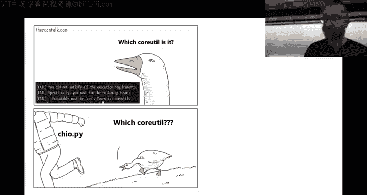
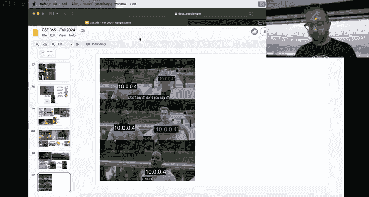
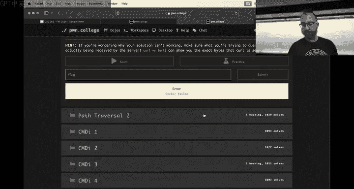
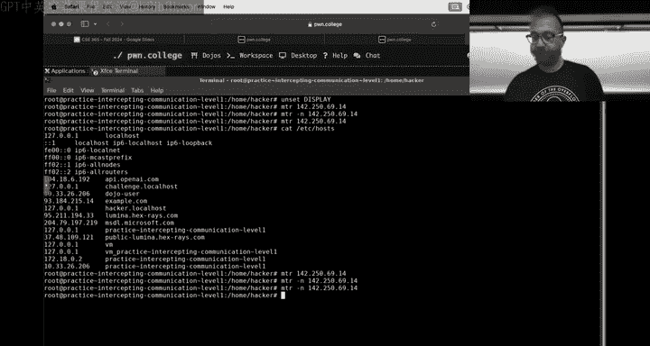

# ASU《网络安全导论｜ASU CSE365 Introduction to Cybersecurity Fall 2024》中英字幕deepseek翻译 - P8：-09-Intercepting Communication - CSE365 - Yan - 2024.09.18.zh_en - GPT中英字幕课程资源 - BV1nVCVY9Ehy

All， we'll put this。We'm got to restart， let's refresh this and。Spoilers。Right there， slidehow。Boom。

 all right you have to all right， wait， what， what about the camera I it it's following me no， no。

 it's not fault。Do we have camera on OS？let's get this things， there we go。Perfect， okay。

Hello hackers， all right， u， I am back， I was at a doctor's appointment last time checking to make sure that I have an ear drumrum。

Which I do once again this， don't take your eardrums for granted。 but it's a long recovery process。

 okay。So， I。We are in I don't know， week like whatever module four of the class now we figured we would first dive in and catch up with the。

State of the class so one takeaway here is we have a a new kind of superfuman helper Hanto is sitting at about like as much helpfulness as the next four people combined so who here has gotten help from Hanto。

All right。Good， good chunk of the class cool， good job， Hanto， we're gonna。

 we're talking about shipping Hanto like a some sort of a YouTube play button analog for helpfulness。

It'll be u， it'll be good stuff， so。And。The class in the large part is very much improveded by the helpfulness。

That everyone kind of provides and consumes a discord。

Gotten a little bit unyieldy andwieldy if you look at one of these memes over there with the list of topics it。

There's a lot of duplication， a lot of confusion we're looking into various ways to kind of streamline things on there。

 probably some changes in the next week or two just to。Help the help。Be more helpful actually。

 as a quick show of hands， raise your hand if it's like hard to find knowledge on the discord。

Raise your hand and if it's easy is it super easy to just find the knowledge we'll say 5050s split but we'll see if we can improve it yeah for maybe maybe 4060 all cool so yeah we'll we'll try to improve some things we have some cool ideas。

Basically。Assuming the technology isn't yet there to just clone Hanto a couple of times。

 we have to work with what we've got。UmIt's actually super cool to see over over the semesters when we've done this sort of helpfulness scoreboard。

It's interesting to see when。Just community members become extremely helpful in the learning process like Hanto has no you know。

 need to be this helpful we had charcoal at one time we had we've had some some really good rock stars so very cool stuff also you know props to ro and specify and noodles and the warm superior。

You know， our usual suspects up at the scoreboard there we're also working to get helpfulness more integrated into the scoreboard itself so you'll start seeing。

Very exclusive helpfulness badges on this scoreboard over the next weeks or so。

 it's going to be pretty awesome All right now。😊，The flip side of that is when people go out of their way to help。

Appreciate that。 You know， make sure if their students give them an up vote if they are。

U helping you out of the goodness of the heart community members。Thank them。

Now this means specifically about help in DMs， if you're an ASU student in this course。

 it is an academic integrity violation to receive help in DMs set floor with the TAs of the course。

So if you DMm。Hanto。Asking talkingking about anything related to the class。

 you are committing an academic integrity violation and I guess you can say hey。

 how cool is this class， but if you're talking about SQL I5 or something， you're cheating。

 don't do that。If someone DMms you， feel free to forward the matter to us。

We want you all to learn and to learn fairly。 And cheating hurts that for everybody。 All right。

 so remember， Dms are not allowed。In the class。They might go crazy evil and have like a bounty you report someone you got extra crap you're not gonna have that Connor says no。

 but， but you know， that would be pretty cool like like it'll be like the mean jail but the hell jail。

Good，All right， anyways， I， I guess you won't have that， but don't do it。

I。Then the next module is up， I would have missed the big launch， but it's cool。

 We had been hoping to revamp this module to expand it， to make it tougher， more。😊，You know。

 in the style that you're familiar with with web security。

Command injection 6 and the CQLI5 and the CSRF4。That would be awesome， right everybody， I see。

 I see people shaking their head in agreement。Vigorously。Um， anyways， we are。

There' are some technical issues that make networking difficult inside of the phone calls container at the moment。

 so're as we're resolving those。Unfortunately， we weren't able to finish revamping the module。

 we'll likely launch some additional levels， probably just as kind of a。

 you know for those interested， not definitely not a requirement for grades or something。But。

 you know， we'll see it might also be something that gets delayed to next semester。Um。

 I think people in general are are doing。You know， the people that are starting on it are finding it fairly straightforward to get to the checkpoint so those percentages on the bottom left they' you know。

 of the people that started the assignment， 70% have gotten to the checkpoint and it's only Wednesday so you two can do it。

😡，The other while we were talking about extra credit in my absence， Conor stage is a jail break。

Congrats to everyone that that that managed to escape。 I would not have been so generous。 In fact。

 I've started putting people right back in that jail。 So youre， you know。😊。

Make a low effort copy pasta beam。Right to jail we got one person back in there。

 see how how my high we can pump that up by next week we'll keep a running tally but to be careful。

 avoid the jail now as a reminder， if you make a actual meme about them you know。

 relevant meme and it's just bad some people some memes are just a miss， you know。

 like I have even made one or two not excellent memes right but you're not gonna jail you for trying to make a good meme and ending up with a bad meme。

 but we will jail you for something you pulled off with Twitter and just dump in the memes channel。爱。

Some cool memes that I've seen over the last week and a half。

There are memes that that that really give kind of a high level hint。For not just。

Individual challenges， but an approach to Linux usage to cybersecurity， etc cea， I mean on the right。

 tablet completion is not something that we ever really taught who here has kind of picked it up on their own。

Awesome， so， you know， that meme， if you didn't know about tap completion。

 you looked at that meme or boom， so that's pretty cool it's also one of these。

Memes that that we've had a genre of meme emerge that's like a meanme conversation。

 people adding I think that's like a TikTok thing。People adding something to the to the bottom of the me。

 it's pretty cool on the left side here， some people have found that， you know。

 looking at later descriptions。The descriptions of this module are fairly lightweight， but you know。

 for modules with heavier descriptions， looking at later challenge descriptions can give you conceptual help with earlier。

Challenges right that's you know， a common technique I'm sure that you've all used that on multiple choice tests or something in the past just scroll down read the whole thing and then that answers some some things earlier but yeah it's it's good stuff okay。

In general， I think you've already started to get the feeling in security that that。

There are kind of right tools for the job。And there are tools for the job that that， you know， could。

You can use but but it's terrible growing up， I didn't have an electric like like a screwdriver drill thing I used a normal manual screwdriver to like build furniture to do all of the the stuff and it's terrible you could get things done it's like Netca。

Or you can use the right tool for the job， whether it's curl or for crossite scripting and so on。

We were。Really shipping Firefox for people to just interact with things the right way that goes for other tech right so a lot of people were doing XS with XmLHP request the technology of like the early 200s right no one does that。

We use spa now， right， so， you know， you could。Use the old method， you could use the new method。

 You could use various but hopefully everyone has kind of gotten a little bit of practice at saying。

 you know what？Its gotta be a better way。 Let's find it。 Let's use the better way。Cool。

Becauseuse and then， you know， like that meme on top in the center there says。Once you get a flag。

 you solve the challenge， I mean， how many people are bragging to their friends that they use Netcat instead of resorting to the Python Hp server。

 probably some people， but。Yeah， it's。I don't know how how， how super relevant it is。 Al right。

 one meme that I really like aside from。You know， memes that that help conceptually with approaching challenge in general。

 this meme for command injection six was awesome。I don't know。

 I laughed at this meme for a long time， it's great。I looked up the template itself。

 I think it'd be awesome if the signature was a little lower in this specific meme。

 but like I don't know it's it's I really like this meme and I think people reacted to this meme when it was posted not super happily because you know if you if you it's one of these if you know you know memes it's awesome good meme all right。

Now， of course， we can finally relax and not deal with with all of the good and bad。Memes about。

You know， the various challenges， the the， the tricky challenges。

We're ready to move on and kind of face face reality as a reminder， as you were moving on。

 Connor sent out a survey for extra credit we would like to understand how。

These this Web security module went I think we have 300 responses so far and there's another day or two you can fill it out and then it'll be gone It's silly not to take this extra credit Most of the questions are even optional。

Right， but obviously we'd appreciate you filling them out so we can continue to improve the class。

Awesome。Then one thing that we。Obbsserved a lot is a lot of sensei usage。 We actually。

Basically turned off all sensei restrictions， right？ yeah， basically。

 we used to have sensei slightly throttled so that you didn't spend all of our open AI credits。

 but we figured， you know what， let's see what happens when we dethrarottle it and what happens。

At least a little bit is that people become extraordinarily reliant。On sensei。 And to me。

 it feels like a bit of a phase shift and and and education where。

GPT came out in some of your freshman years and it's possible that some people make it to this class junior year of of。

Of college。Just。😡，Thinking through G one paradigm being observed is， you know。

 someone will ask a question， I had this happen in in a off hours。That I ran over Zoom at some point。

 like a scheduled one。The student pulls up a GBT session says。

 I don't understand this points of the GBBT session transcript， and I say， well， you know。

 maybe blah， blah， blah， and the student types that directly into GT and hit center， right？

This can get you through lower division computer science classes right GT is very good at lower division computer science。

 It's very good at， you know that that technique can probably get you through a lot of of introductory college and increasingly as AI gets better and better right as。

😡，GPT， I don't know，02 or whatever comes out next couple of months。

 it'll help you get farther and farther， but。There's a limit to it。

 and what we're seeing is people that are that reliant。On sensese G4。All of this stuff。They。

Are not developing their ability to think。And eventually。They hid the limit of what DVD can do。

And then they roll into recitation。And then， they。Show the Ts。The transcripts。

 and then they type the TA's words or sometimes speech to text the TA words directly into the text box and hit enter。

😡，We're asking the Ts to simply walk away when this happens because this only help you solve the challenges。

 it doesn't help you understand the material。Please， do not。

Fall into the trap of letting GT think for you。And actually failing to learn any of the material as a result。

All there's a right way to use。GPT in this class and Suns and so on。 And it's a quick， you know。你。

Quick check of did I implement something incorrectly what concept am I missing？

A quick replacement for Google that can give you more tailored answers。

It's not as a replacement for solving the challenges。 And I know your grade depends on the flag。

But your grade going forward depends more and more on you understanding the material。

And you will hit a limit。To how much G can do。 And if you don't hit that limit。

 then you will hit the real world。Without knowing anything about computer science。Right， and then。

All of this effort getting this degree。Much of it would be wasted all right。

We want to see you learn this stuff。We。We can go and。

Cat out all of your flags by running command on the server。

So it's not that we need you to collect these flags， we could collect them for you。😡。

if you're using GT to collect all your flags， you might as well just do it on the back end。

 but we want you to learn。And the flags are there to encourage that。Awesome。😊，All right。

 we're going to be doing a couple tweaks potentially to sensei to try to detect these situations where the。

 you know， people really aren't learning are just using sensei as a crutch。

 but really the responsibilities on you。You're here again to learn presumably you're not just paying。

Tuition to。Just to get that degree， I mean， you might be。

 but presumably you want to learn something about computer science。Awesome。

 moving on a couple of interesting， I meant to put a couple more memes on here。

 I forgot to go back and do that couple of interesting bugs that that we found in various。

Parts of Po College over the course of and this one is not about this module。

 it's a different module within Po College that someone found a hilarious bugin but someone in this class found an awesome workaround that was applicable to many。

 many challenges and。Web security where the security model in Linux changed slightly。

 at least in containers， I haven't dug in and you know see if like a normal Linux install has changed historically ports below port 1024。

Low port were only openable by the Ruth user。Or by a user with the right capabilities。

This is a security measure so that a normal user and a multi user machine couldn't impersonate the SSH server。

 for example， and ACTP， as you know， is port 80， one of these low ports。😡。

I had assumed that this was still the case and so when the challenges in Web security launched。

 they just launched on port 80 happily you know， served the flag out all lot and when the victim would run the victim would connect to port 80 and what people were finding。

What they could do is。Kill the actual server。 And because the Linux security posture shifted where Linux。

 for some reason that is still， I mean， I understand it。

But it seems like this should been on like the front page of the New York Times or something to let everyone know。

In certain configurations， any user can open up a low port now。

So someone here developed an awesome attack that they just opened up a low port。On the system。

 and we're able to。Just。Talk to the admin user。And led the admin user attempt to authenticate and sent the password that the victim said the password and get the flag that way。

 awesome hack， he gave them a bug emoji， right？I think he did。Yeah。

 we gave them a little bug emo pad for scoreboards I don't think they were a student though actually now I realized the student had a we we had some really cool bugs submitted to us some of them that you haven't figured out how to fix yet so I won't talk about those yet。

 but that one that one we fixed just a setting in Linux that is now off by default on Docker at least on Docker containers just absolutely crazy to me like if you find a like woke up one day and I don't know slash bin was wriable like that's the level at which this is weird to me but it makes sense I mean no one。

on my laptop， it's very annoying when I can't open up a low port， but I'm the only user that anyway。

 all right， moving on。

This one， this me I just found pretty funny。系好。AndWeb security was kind of driven in the point of the usefulness of practice mode and the ability to tweak the challenge to be more helpful in debugging。

 How many people here tweak the challenges over there in the course of doing them。All right。

 maybe one。 Okay， well， you know， you take a look at this meme it's。It's a pretty good。

Pretty good way to convey that sentiment。I mentioned this module isn't as quite as tough in snas possibly as the previous one。

 this module being intercepting communications don't。😡。

Think that that means it's easy and can be put off to the last second。

 There are concepts in this module that'll。Be a while， a lot to。

 to wrap your head around Last module concepts were。Fask， Python， ADP。I SQL JavaScriptscript。

 this module。It's ap。c c b 。I p。Weird。Python libraries like Spi， these are things that。

Could conceptually be tougher to wrap your head around than JavaScript。

 which is just another programming language， right？😡。

Don't put her off till the last second for those that hit walls with command ejection sake。

 sQL like five， Xs， whatever。You know what that can be like。

 you know that it can be your' scrolling shown scroll and then suddenly you hit a gap。

Don'Don't let that happen to you。And then of course。

 Po College went down again right during the deadline this time hilariously not due to anything the students did we were perfectly fine onload ettera。

 eta， et cetera， I was trying to in the course of the improvements I was making to the module that launched now without those improvements I managed to destroy the server so that was unfortunate and I've been。

Chastised accordingly， but we gave a small extension。Don't count on that。

 but also keep in mind if you say， okay， well， hey。

 I can I got this chunk of time to like last minute power through the things。

 that chunk of time might not exist。Awesome。With all that said， intercepting communication is up。

 see all of the memes about how the checkpoint is is not that hard to get， go get it。

You can have the weekend free right or you can spend the weekend finishing the assignment and then not have to worry about it this week。

 so think of this is could be a good。Reduction in intensity。

 but I would knock it out of the way and then move on you already have some good memes on the module people are doing the port scanning and the host scanning levels using them as speed runs that's really cool to see。

And and it actually makes me think maybe we should have some other like King of the Hill type challenges where we have a separate scoreboard like like how fast or how you know。

How well you did that level， that would be really cool。Go。

And then this is the only meme I've seen other than the speed running memes。

 and maybe I noticed something I missed something but。This is a。

Pretty good meme on the inersonnation level。I I like the cool， okay。

Let's roll on， all right， does anyone have do we have the switch open， actually？

So that was an oversight。Let me， oh， we have a streaming though。Mr。 Wats， all right well。

Why would it stop？Yeah， still stream perfect。So let me。Perfect， whoops。All right。Oh。

 we have Adam Dupe chatting。He's the coolest cybersecurity Pro at ASU。

I don't know if you guys know that。All right。Sweet。What is he talking about？啊。

So Adam wants me to know that he did make changes to the Dojo while I was talking and it didn't bring down all the servers。

off。All he's doing is adding an extra entire extra operating system。

 I had to install a new package and the challenge of it。😊，All right， let's roll questions。

 conceptual questions about this module。Otherwise， we'll dive into。Kind of。

A deeper dive into networking from an experiential perspective。We wait for the Twitch stream to。

To catch up with that question， and we'll go from there。哎。Let's go okay。Let's talk about networking。

 So Connor last time I understand correctly， talked about。诶。Wire shark。

And like TCP and these nuts and bolts， right？But what about kind of the higher level， like。You。

 without maybe even realizing it much， have been using networking。Your entire lives。

RightSo how many here were born before 1980？No， not me。 I'm just kidding。呃。If you're born。

Watch after that， you've probably been using networking basically the whole like if you're born in this millennia。

 the hospital was networked and。Just as soon as you were born information about you was sent over a networklalah。

 blah， bh， bh blah blah blah。So now you're just digging into the nuts and bolts。

 Let's bridge those two things。 you you've seen HP headers or sorry。

 you you've seen HB headers for sure， you've seenTP headers in Connor's lectures。But。

 but what does it actually look like in practice， right？ and in practice， let's bring up a term。 Oh。

 no， this is on all on Mac Os。 Well， hold on。 Do you have。

Let's just dive into the Dojo。Does。This account have internet。Can we add in to that account？

From your phone。I can do it from my laptop， potentially。好啦。

We weren't as prepared as we were me on switchitch for a second as we thought we were rather。诶。

I just need to get online。So by default， the Dojo does not have。

Internet access in the various containers。よしなとがとごいでした。We you not be able to send traffic。

I don't you sniff traffic yesterday， we're not sniffing anything right now。I could sniff。

 I don't have covid or would not， but。Not doing it。 Al right， let me just。

mWrit raw SQL to enable internet access to myself。What name is this you see？3，6，5 guest。Actually。

 why don't we， you have no way to。How do we show people what we're doing right now？

 you want to hold this to my。No it's cool， it's sequel in practice。Okay。Are we racing right now？

All right， we're about to lose。Oh I almost almost had it， al right， all right。

 awesome Conor ran the query before I did， so did you actually do it through the interface？That。

 that's smart。 That's the way。 Alright， cool。 So let's bring up。😊。

We don't really need to bring up the inner subject communication， let's just do that。

In case people want to take a look at a。Connor is always faster。That's some。T's melting down。Dam。

Okay。All right， anyways， let's。Swach up， boom。Workshop， okay， workspace。Yeah。We go。Okay， so。嗯。

Let's install some tools。Every gonna。Demonstrate， okay。

Who here has now interacted with an ID address？10。0， that0， that whatever inside the dojo。

 a couple people， awesome。 about half the people who have started on the Simon and this level one。

 of course， we start up the the the challenge。And it says， hey， you know， your IP address is 102。

Theer IP address 10 than are three。 and you got to connect up and and and。

Get the flag on port 31337 and you've been net catting and connecting to port you know。

 like your old hats said this， but what is kind of10002 and what's an IP address and how do you tell other than reading this stringer here with IP address here is well？

The latter thing， there's a Linux utility called IP that you can get the IP address of all of the various network interfaces on your machine right and we do I。

That's a IP， sorry， that's short for IP adder。

And it shows you all of the various addressing and here is12 on our local on our ETH0 network。

 ETH stands for Ethernet， which this is a simulated Ethernet network， not a real Ethernet network。

 and then you can see local host， the local。The loop back network interface。

 which is the network interface where the machine talks to itself on one to7。0 that0 that one right。

 So who is interactive 1 to 7 that0 that0 that one。

 you've probably kind of seen it around at for example， if we actually。Let's kind of put。

Things together， we go back to web security， don't panic。And we launch up， I don't know， whatever。

 anything。What the fuck。

U and we just launched out that oh， Adam broke the nojo。Had a break it though， just。Do you No。

 it' killed it， of course。No， it's still there。Adam is claiming on T he didn't broke the Dojo。

 Adam tried to start a web security module challenge。Just keep rolling。 Okay。

 I'm just rolling with the current container。 Can we write a quick flask app， It doesn't matter。

 anyways， in the flask logs。Where you are interacting with the Web security channels。You are。

Would have seen 12 701 pop up， or you know what even easier。 Let's just spin up two Necas。

Talking to each other。Who's familiar with this？Everybody， awesome。 and we do dash V for verbo。

 So this here is listening on。😊，An I address of 0 that0， that 0， that's0。

And if you just connect up like this， you've done this。

And you see I our connection receive them local host。Local host is。

If we actually will will use this to demonstrate something else。 Local host is kind of the name of。

1 to seven， that's zero， that zero， that one。Okay， a couple of things that we just saw first thing is。

When we started up this Netcat， it says listen on Z， that Ze that Z。

 I'm sure you've ignored this until now。Right and what this says is Gida Gida， Gida Giro is a linism。

When you are starting up a server listening on a TP port says， listen on all IP addresses。

Valid all the interfaces that are valid on this box。So if we do IPA here。

 this is now on the container itself， outside of the simulated host of the challenge。

 there are three。There is the one just have an0 one loop back that's on every more or less every Linux host。

There is。This ethernet address is， of course， simulator ethernet127。18。0。2。

 and then there is this 1033 that26。20。The 206 and one of these guys is going to let me talk to the Internet。

Let's see what this looks like。Actually， first， let's get to the other part of this where when you got a connection。

 it lot connection received on local hosts。😡，What the hell is that， That is a。

Domain name or really a host name for one to 7 that 0 to 0 like1。 And I can look up what。

Address that corresponds with in two ways， I can disable。Host name resolution。In that cat。

 usually network utilities， this dash n。And now when I connect up says， a， there we go。

 we got connection received on 1 to seven， that0 that0 that one over the loop back address。

Because you are just connecting to local hosts。All right。😊，We can， also。And as look， nope。

 do we have digging in here？Okay。That probably won't work。You have to install the right tools。Okay。

 that was mistake all on。Maybe it'll be in Ne tools。是。Patientsience。No。DNS DNS， nice， thank you。Okay。

 there's a utility called dig。That you can put in a host name。And it'll tell you。

What IP address corresponds to that host name？the address 127， that's zero， that's zero。

 not one local host， that is the loop back address。Of a Linux host。

That allows it to reference itself。Right。Awesome， okay。Once70 that001 is basically your home address。

 who here is on board。All right， nobody， that's okay。Okay， so。We got local host， we can， of course。

 listen on this local host。啊。Where's that command， V can。

 I don't know if I curl localhose/lash indexdex。 HTMLt。You've done this。One，3，3，7。And this is just。

Zooming up or digging into one more level where， you know， what's happening over the network well。

It's connecting， it is looking up。The IP address of this host name。

Figuring out what that is by doing something analogous to dig local host and then connecting to this IP。

😡，Awesome， all right， how does it look up local hosts， well， there's a file et he hosts。

That lists a bunch of host names and IP addresses。That correspond to them。 So if we dig。Uh。

 you might be familiar with Hacker， that local host。Booom。Up。

 I guess dig does something slightly different and actually lookss things up。All right。

IfIf it's in this file。At your host。Then。When I。Your program tries to look up a domain name like local host。

Or hacker that local hosts did this file or example。com or so forth。Sees the entry。

 it looks at the IP address and it knows to go and search for there。 So if you try to ping。

 who hear us ping before。Awesome network utility that just sends a little packet on a protocol called ICMP on the same level as UDP and TCP。

 It just says， hey， are you alive so you can paying challenge that local host。That's 1 to7001。

 same way you can ping example。com， it'll search this file， find example。com。

Find the IP address and start talking to it。Awesome。Okay。What if something is not in？This。File。

All right， well， then。We end up。Looking it up using DNS， the domain name system。

So and that is what dig also does so we can do dig， something like Google。com。And dig tells us， hey。

 guess what good news， I went and queried it。And I've looked up， I queryated it on this server。

 so there's a DNS server running locally in this container。😡，provided by system D。

 we use system D resolve inside the containers。This says a talk to。

Local host 53 Do does the magic stuff all right， Do probably hijacks that and and shuns it over to another DNS resolver and it talked to a bunch of servers。

And it figured out that。The IP address is 142， that 250， that 69， that 14。Cool， and now we can。

 of course， netca to that。Yeah。And。Partt 80。And we can do。Get slash。

And it spits out a bunch of stuff。Terrifying， all right， awesome。So。DNS。Takes。Domain names。

 so it does google。com resolves them into IP addresses。And allows you to use the modern web。

 like you do， be able to say。Google com or to H dot TV or whatever。For many， many， many of you。

 chatd。openai。com。And go from there， okay。嗯。Now you've resolved the。自己。The domain name。

 you're connecting to it， trying to retrieve port 80。

Trying to connect to port8 on that host to retrieve index at HTML。What does that look like？Well。

 as Connor talks about it in his lectures， locally we use something called ARP。😡，To resolve。

The hardware address of the machine that you want to talk to。And talk to it。So if I am。

At this machine。10 33， that 26， that 200。And I want to talk to machine。是。Hold on， machine。

That's right。 for the Internet again。 So if I am over at 1，7，2 that 10 that0 that2。

 and I want to talk to 1，7，2 that or that 18 that0 that one。I can。Apingg。Say， hey。

What machine I want to talk to a machine172 1801。I aping it， and I。Get a response。From this machine。

With this ap address。And then again， I'm zooming through this because this is in the lectures for your staff and communications。

😡，We have a protocol aping。That allows you on a hardware network or a simulated hardware network。

 which most networks are nowadays to figure out what is。The address of。My neighbors。

 so I can actually talk to them on the hardware level。All right， then。谢谢。I can。Ping this guy。

And you did， you popped up wire shark and sniffed the bag all right。

 then when when you ping this guy as we did in the last lecture。Yeah。

What actually goes over the wire is this address。That we now know。And we can actually。

Retieve using Ap。Yeah。Using the A command， we can see what hosts we know that are nearby and we can talk to directly。

😡，On the wire。To in to exchange。Information with them to open up port， et ceter cetera。

 Now you'll notice there are two hosts here， one at 10。0。1 and one at 172。18。1。

 These are their hardware addresses that we use to actually。Send data to them over the wire。And。

If you an interesting thing about these hardware addresses。Is。Well， anyways。

 we won't dive into that that's too deep， all right， but you notice there's only two of them。Right。

 and it's。10 do00。t one， which is one local network， it's a network that is the10 dot。

I apologize for going again high level and fast。 this isn in a networking class。

 this is a security class。 these are networks that you won't find on the internet unlike you'll find just locally。

Unlike Google。com。that 142， that 250， that 69， that 14， probably Google owns all of 142， that 250。

 that 69。Or knowing Google， they probably own all of one4 two， that 250。

Right a lot of these IP addresses in this network， whereas we can pretend that we own all of 10。00。

0 and so can you and I actually my home network San 10 that something as well。😡，诶。

These are specific network addresses that are kind of reserved for for use by by people locally。

 All right， but the point is142 250。 69。14。 Google。 co's IP address is not in this list。

Of hosts that we know about。So how do we talk to it， right， I can try to arping it。Say hello。

 where are you？Yeah。And it doesn't respond。 No one responds。 And the reason is right here， said。

 well， shit。There isn't an interface。That has an I address that's on the same network。As 1，4，2。

 that 250 that 69， that 14。And so I don't even know where to our ping to。

 I can our ping to everything。It gets a random interface ETH0， which is。Where we talk to 172。

 that 18。0 that one on。But that's clearly not the right metaphor。But this is where。

I key Internet Pro comes in。His IP supports the routing。A traffic。Through other。Hos。In this case。

 I ran this command earlier and didn't explain anything in this case。Our computer has a routing。

 our container， our workspace here for Po College has a routing table。That tells it。What hosts？

To send traffic through。To get to certain other networks that aren't local。 So it says， okay。

 if you want to talk to10。0 thatt O thatt O。A network。 And again。

You talk about net masks in the lectures， right？Yeah。

 so to figure out how the size of this network is defined。Go talk to go re listen to the lectures。

 I know everyone was already listened to them but could use another listen。

 So if you want to talk to a attend dot。You talk anything at one， you want to talk to 172。18。0。

0 host on that network， you talk through network EthH0， this is where you send out your RPpings。😡。

But if you want to talk to。Anywhere else。0 0， 00。 Any other host。

You need to send your traffic through the gateway 172。18 that0 that one。

And if we install a trace route utility， we can see what this looks like。

So let's say we want to talk to Google。com 14225， but you can also type Google。com here。

 but I'm being more explicit that 14。We had entered our notes。Graphal now。Fuck one second。Screw that。

Beyond set display， that's the variable it knows it uses to talk to。The graphical interface art。

Here we are trace routing。To Google dot com。That is， we're sending out packets intentionally crafted。

To not make it all the way to Google。com in every IP packet， as Connor discusses in the lectures。

 there's a number of headers。😡，One of these headers。Is the time to live。Hetter。

 which is decremented at every hop in a routing chain。And when it。Reaches。0。

It's discarded and an ICMP packet I to sent backwards。So using this， we can map out the path。😡。

That our。Packets take to reach Google do com。 And this is it。 We start out。From the interface。1，72。

 18。0t2。The first hop is 172。18。0。1 that。Is the virtual network for all of our docker containers on。

The node running this particular workspace image on Po College。😡，Then we go to 1，7，2。That' 17， that0。

 that one， which is。One level out of containerization on the same hose。And it's the。

We use this insane docker in Docker。 Se up。 It's the outer docker。 and then。We go to 206， that 206。

 that 192 that2， that is the IP address of the node itself。That sitting in ASu's data centers。

 then we go through a bunch of internal ASU stuff。More internally AS networks。

 another internally assumedU network。The Internet server provider at that Asu uses。

 And then at some point here， we're probably already in Google's network。

 And then here we go Now this is confusing because there's also names here again。

 you can usually use something like that and。 but read the man page to disable name resolution。

 And at the end， you can see this is。That Googleogle。com IP address that we tried to talk to。是。Okay。

 what just happened。嗯。Now if we bring it back up with the DNS resolution。

 we got this weird thing instead of Google。com it's showing us  QO02 S18in F14 that 1e100。net。

 that's kind of weird， that's because an IP address can be referenced by multiple domain names。

 which we already saw when we were looking at ethost。Right you got 127001。

 and it is challenged that local host and it is hacker that local host and it is practice intercepting communications level one。

 which is what the level your're running and it is VM and it is Vmper and so on right so same with Google。

com。That's probably a cloud server that's used by Google for a lot of different things。All right。

Quick update Adam admitted to breaking the Dojo and now claims that he fixed it all。

 but I'll believe it when I see it okay。Let's see。 So that is。Rapid fire， DNS ARP。And trace routing。

 any questions on this because we're about to run out of time？Yeah。

Sweet all right first thing I do when I hit some networking issues at home websites time loadeded is run this stupid thing and the second thing I do is cuss a lot because now it pops have a graphical interface and I on said display and run this again and you can actually see。

😡，Some useful information， right， how many packets were sent and you can see where packets are being lost if they're being lost。

For example， sometimes。All sorts of crazy African issues can occur leading to lost packets part way down the chain then you can see like you know the timing of the transmission so you can figure out there's a wi-fi hop that has a lot of interference for example。

 you need to fix that very interesting tool and alongside ping， dig RPpinging and so on。

A helpful tool in the toolbox， although MR we went on a bit of a tangent。

 not helpful for this assignment， necessarily Help for understanding that for how many people is this their first。

Experience in networking period。Okay， most of the class， I year're in for a for a treat。All right。

 awesome。We'll end it here。And。We will see you on Monday remember the checkpoint is due Sunday night。

You will not have downtime， there will not be an extension， everything's going to work perfectly。U。

 so please do the checkpoint， the checkpoint for inter communications， some extra concepts， but much。

 much more straightforward。From a hacking perspective。The later levels are tricky。

 so don't all also don't sit on your hands after again the type all right。Thank you for tuning in。

 thank you for coming in， the remaining proud few that do， and we will see you next time。

Yeah。Goodbye。All right， how do we。is。Goodbye。