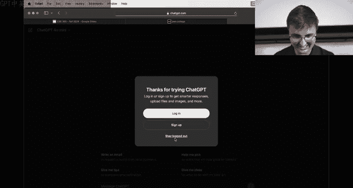
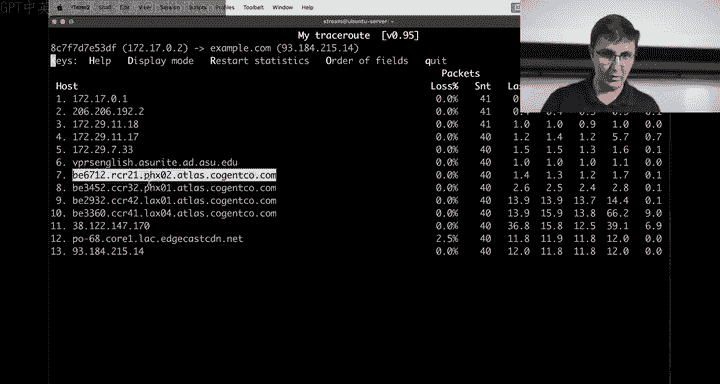
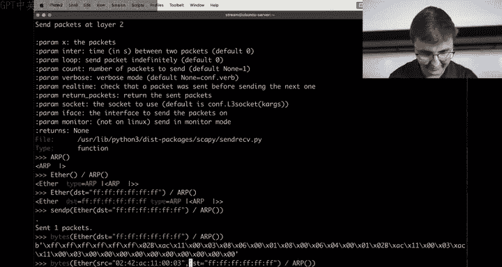

# ASU《网络安全导论｜ASU CSE365 Introduction to Cybersecurity Fall 2024》中英字幕deepseek翻译 - P9：-10-Intercepting Communications - CSE365 - Connor & Yan - 2024.09.23.zh_en - GPT中英字幕课程资源 - BV1nVCVY9Ehy

Did you do the millennium millennialennial？All right， hello hackers。

 camera is not following us classic。All right， now it's followinging us Okay， welcome to week。

I don't know to late September， week two of the intercept communication module。

 where's the slides do we're running late so we'll do the meme review tomorrow or on Wednesday。

Sorry about being late that that was。Uncool but let's we'll try to prevent it in the future let's start over you know the going over the course of the class first the the thanks leaderboard is completely broken Hanto would probably just pass this class despite not not being an ASU student。

The one one meme we'll review today is this one that's just just brilliant Hanto is。

Such a good help for the class that he's making the rest of us look very， very subpar by comparison。

Otherwise， we have the usual suspects bringing up the top five。Good stuff keep a。Keep helping。

 but also keep up votinging， been talking about。Having to post process the discord with like GBbT to detect missing up votes and stuff。

 don't make us do that Thank you friends。And people you don't know who help you。

 not just your friends，How is intering communication going。

 it seems to be going quite well so a fifth of the people who have first of all。

 most of the class has started this already， do these numbers add up？It's it's only have me started。

 The percents are all of you started， including0。The zero is not started not started， Okay， okay。

 but these all add up to  a thousand Oh yeah， okay， I think。Anyways， out of the the 900 oh yeah。

 I guess it must out of the 904 that started Almost everyone has hit the checkpoint Now this module is a little bit tricky。

 The checkpoint is relatively easy to hit and you just have to choose a number for the checkpoint right and chose 30%。

30% in this case is not as hard as the， you know， as getting 70%。 So， so don't。

Kind of sit on your laurels sort of thing， make sure to keep going and don't fall behind for the final push。

That being said， already fifth of the of the people that have started have have gotten enough to pass this size in like 70% or more。

 which is great so to keep keep pushing as before the median first salt was。What the day before。

 yeah， it was it was Friday afternoon， right， the 19th was Friday。Yeah， yeah。No。

 it wasn't the 19th was Thursday it。Yes， because its the 23rd。Yeah。

 awesome the way the checkpoint was the 2 second Yeah。

 the checkpoint so so we actually got people starting the median person started earlier than Friday。

 which was really awesome。And yeah， that that's really cool。 Okay， awesome。

 so keep pushing on intercepts and communications on that note。

 we're going dive in and do some hands on work today do you want to start off Al right， let's do it。

Actually before we start， though， is this still following you this called the classic？Almost。

Now it's gonna。Almost。This is ridiculous。 Okay， there we go。 Al right， before we start， though。

 does anyone have。

Any questions about the structure of the class or questions about the concepts in this module sorry。

 one one thing that I wanted to mention is the hundred and people that didn't start。

 there's like an intersection of， I think about 84 people that didn't start web security and didn't start this at some point。

If you haven't like linked your， your phone college and so on， that includes non linkers。 right， No。

 this is ever they're linked。 Everyone on this。s okay， this not 20 people unlinked。

 So the 20 people that are unlinked。We will start dropping you from the course probably next week We'll send a couple of increasingly forrantic emails at you。

 but please you know double check but your phone college is linked and everything is good cool Yeah。

 you know you know your links if you see the the setup page five green check marks or however many green check marks have all the green check marks Okay。

 cool does anyone have any questions about concepts in this class things that just aren't making any sense about networking。

For we。networking。I'm not see any hands。 Allright， cool。 Well， then in that case， let's go ahead。

And start talking about some networking concepts。嗯。チピチゅ。Yes。

Okay， actually， instead of going through the Dojo just to make it a little bit easier for ourselves in this case with having the ability to do all sorts of networking。

 I am going to SS into a server， but I need another window。And we need a terminal。Oops。Make it nice。

Termin little big text， Okay， and this SSH， cool。 Okay。

 so I have just S into some random 122404 server。 and I think one of the good ways to really think about networking or to kind of。

Demo， some networking concepts is using Docker， who here is familiar with Docker anyone here okay。

 cool so some some number of people。Okay you don't have to worry if you don't know about Docker。

 we'll kind of maybe do a very quick rundown and actually I'm going to kill all of these containers because。

We'll just start from scratch here。Cool。Okay， that was the dojo。No。Nice right。

 Okay so Docker allows us to spin up little environments of sorts。

 you can kind of almost think of it as a virtual machine。

 People they like Docker will yell at you and say it's not a virtual machine they're right It's more efficient it has to do with this thing called namespaces and in these challenges when you do challenge run and it says your root at IP blah blah。

 blah， blah blah the thing that we're dropping you into is a new namespace and it's a new isolated network namespace that then lets us start doing cool networking stuff。

 and Docker operates under the exact same model。 So for example。

 I can do Docker run and Docker run is just going to allow me to start up a container and I'm saying I arm these things they don't really matter if you're curious it's making it so it's interactive as a terminal and it gets deleted after it's killed will create a name and in this case will give it a name of server So I'm going to maybe。

😊，Demo setting up a little HGP web server for networking purposes to analyze that and then we will just say we want the latest version of Python as our thing and the command we want to run in that thing is bash I know this is a big long string of text but actually you know it might be worth as you kind of progress in your CS careers starting to get a little more familiar with Docker Docker is just like one of those tools that turns out to be very useful for a whole lot of things if you've gotten familiar with Git I would say Docker is like not necessarily in the same tier。

 but it's a big standard tool that a lot of things use Okay so now we've got a nice little change to so it's just like the challenge right before we had stream aubbutu server now we are root at I well this doesn't look very exciting but this hash thing。

Okay， and actually before we do that， we're going to kill that， let that die away。

 just like when we exit the challenge and it dies away。

 I am going to start up a program called Teamx， you know， on the topic。

 who here has used TeamMs before？a few。 So the same topic of get being super useful and Docker being super useful。

 Turn out Teamwork is another one that's super useful。

 Or if you're old fashionashed like yan and you like goodoo screen more， that's also cool。 Yeah。

 but it's all depends。 Do you need something reliable or something flashy。😊，Yeah。

 exact honor we're going with the flashy thing in this case and it's the flashy element here is if you look at the very bottom right I type Tmux hit enter and then we're just like back at it seems like almost nothing happened guess unless you're paying close attention this little green bar at the bottom showed up this green little bar is the Tm bar and you'll see that there is a zero colon bash basically Tux stands for terminal multiplexer So if you've ever you know gone into the desktop and you've started up like a terminal window and then another terminal window and another we got like three terminal windows that works fine but terminal multiplexer kind of allows you to have multiple terminals within the same terminal it's multiplexing it's a terminal multiplexer and what that means is that if I type something like LS which isn't very exciting because I am in a fresh account that has no files I type who am I I can start。

a new terminal and it's a new terminal through SSH So SSH is we' still s to this box。

 And if I hit control B C。 suddenly there's a new terminal。

 you'll see that the bottom bar changed now there's zero ba in one bash and if I hit control B0 we go to zero ba if I hit control B1 we go to one ba we got two terminals it's terminal multiplexer and then there's stuff at the bottom right that kind of says where you're shd into what the time is doesn't really matter for our purposes but this is a terminal multiplex multiple terminals。

 so you're gonna see me as we kind of demonstrate this possibly rapidly switching between terminals you'll know that the little star at the bottom is moving around and technically you can name these things I mean I use Teammx but only the basics of Teamm I have no idea how we rename one of these things you can make it so it doesn't say zero ba you know how to do it。

Oh boy see， he titled it。 that's the screen way。 I don't know。

ame okay if you're excited about there's gonna be like a teamms cheat sheet online that'll show you like the 20 popular commands。

Honestly， I haven't spent enough time doing that。 All I need to know how to do is create a new terminal control B and then。

 see for create and then control B0 control B1 control B2 or control B arrow keys to like move left and right。

 That's really all you need to know。 technically， you can also start like splitting the window and half vertically or horizontally you can do all these fancy things what is the rename1 control B comma comma。

 Okay， control B comma， I guess let's you rename。 So we'll say we'll rename this one then to server。

 because we're gonna start up our little server host thing or name space or docker container on this01 control B comma。

'll try and remember that。 Okay， and then you can see there's a star next to server。

 That means we're on the server window。😊，Okay， let's see if my docker。

 I don't think I still have my docker run， we type Docker run again。

We will run ITRM and then we will do a name equals server。

 We're going to say we want the Python latest image basically this is going be like a little file system ready to go with Python in it and we're going to start up the bash process Okay。

 we are now in our container and。When you spin up a new environment just like when you start a new virtual machine。

 you know normally there's not a whole lot of tools in there in this case we have Python because guess what we did the Python image but we don't have。

 for example， the command maybe you've grown used to in in this module so far like the IP command。

 which means we have to you install some stuff so we'll just quickly install some useful tools for doing networking let's see what I can think of off the top of my head IP route2 Ne U tools。

Does that have？There we'll start with high P route 2 oops， app install。IP route2 net U， net tools。

Net tools。Is it dash？And that dash cool and we'll install more things as we need it。

 but right now I just want to be able to type IP space A okay。

 looks just like the challenge environment right， we've got a loop back interface。

 I think this one's a little bit more boring it's not all colorful。

 I actually have no idea why the one on the Dojo is like colorful it's kind of nice。

 but you know it's the same output here we have our loop back interface We have our Eth zero interface that you've maybe gotten accustomed to。

And we can see we have an IP address。 Our IP address is 1721702。

 just like in the challenges when you're 10002， this is our IP address And so if I want to you spin up a very basic web server So for example。

 oh what I just that's a caps like I see if I want to spin up a very basic web server。

 maybe you have used this in the past， maybe you haven't Pythonhttp server spins up a very basic Http server and it says serving htp on 0。

0。0， which means we've learned any interface port 8000 which means I can talk to this thing right here So now because you know I've got my my processes stuck right it's serving it going give me my terminal back this is like where I use Teamworks like this window it's not dead it's like doing stuff I'm just going to leave this window behind。

 I'm gonna to hit control B1。And let's make sure that we can access this IP address。

So if I run IPA on the host， you'll see I have a whole bunch of interfaces。 again。

 this is SSsh into a server。 It's actually Ssh into a server that's sitting right next to the Po college dojo It's like I actually haven't been in the room I don't know if the box is literally above or below but it's touching the same box We'll see we have a whole bunch of interfaces。

 We still have that loop back interface we've gotten used to and then we've got this E0102 we've got this Docker 0。

 I mentioned Docker Docker spins up a network interface so that it can do its networking。

 you'll see here that it's 1721701 And if you remember I don't blame if you didn't This guy was 1721702 right these Is are right next to each other So this is these guys can talk to each other over this Docker0 interface So from the host it's the Docker0 interface from this container it's the E0 interface。

They're technically all in the same box， but maybe it helps you think of them as different boxes。

 we just have these little namespaces， these little networking namespaces that are networked together in various ways so Eth zero on this namespace talks to Docker zero on this namespace they're part of the same network。

😡，And so what I can do is I can curl。Let's see here， we'll copy this IP address。

Curl this 8000 and this is the response。 So if you've ever used the Python HP server。

 I think we've talked about it in the past classes。

It just basically it's doing an LS but returning it with HTMLlon so I could also do slash， you know。

 bin or something， maybe。I thought I could do slash bin。 Why can't I do slash bin。Well。

 I'm not in my home directory， so there nothing that's not possible。Oh。

 it's doing a redirect but Well actually， let's let's see it。

 If I do curl dash V to wonder like what the heck is going on here。

 We will see 301 moved permanently。 And it's redirecting me to slash bin slash。

 So that's that's why I'm seeing nothing。 if I put a slash at the end。

 Now I can see all the files in bin。 It doesn't really matter。

 This is just a service on the network that we can communicate with。😊，And if I wanted to see。

The network traffic happening here， I could let's see here， I could list my Docker containers。

 We'll see I have this server container。 if I want to get another terminal inside right next to this first one right in that same network namespace。

 the Docker way of doing that So unfortunately in these challenges you don't have a way to like enter into the challenge namespace other than just starting up new processes in it。

 Docker is much more convenient， you can actually reenter into that namespace。

 we can Docker Exec IT server and we'll start up the bash process and now these two terminals are in the same network namespace。

And the reason I want to do that in this case is let's just use TCP dump。

 let's see the traffic happening So if I do TCP dump dash I any and it says as I said。

 there's no tools installed in these Docker containers。We will install TCP dump。7。

And then we do TCP dump dash I any。And we start up yet another container or another terminal。

 right this is where Teamm is kind of nice， we just have lots of terminals because this guy's busy。

 this guy's busy， so let's get a new terminal。 let's go ahead and curl oops。

 that' is not what we want。Let's curl this IP address。On 8000。

And now we can see a whole bunch of packets came through right so we've got this the thing that like is drawing my attention right here is the IP address。

 So this came in from dot one and TCB done by default is very nice and tries to do like reverse DNS stuff I going actually disable that real quick with dash N。

We will curl again， we will scroll up here and we will see that dot1 sends a packet to dot2 on port 8000 and dot ones on some random port and we're looking at a TCP packet it sends a S packet SYN packet and if you've watched the videos or you've kind of progress through the challenges you'll know that if we want to start a TCP network connection we have to do this threeway handshake。

 we have to do a S packet。 The server is going to respond with a S act packet well right here this is that S act packet with dot2 talking back to dot1 and this is just a TCP dump format。

 it uses a dot to represent an act because turns out in a TCP interaction you're almost always acknowledging stuff there's like rare cases where you're not setting that act flag like the very first packet is an example of one spot where you're not actually acknowledging but in most spots you are also doing the act so I guess they made it a dot。

to not be too visually distracting and then we complete that threeway handshake with a acknowledgement packet so we could look at all of this information we could。

 as we've shown in previous lectures， we could look at this in wire shark because it's actually gonna be a little bit tricky if we wanted to look at this in wire shark just because we're SS into a box and that SS like we don't have a graphical environment right here。

 which is why the desktop is useful in Po College there's ways to get around that the dash W flag would allow us to do like。

Info。pCAP， and suddenly now we're writing out to this PCAP file and then Wireshark can open that PCAP file if we wanted to。

 but we're not super interested in that right now。TCP dump is showing us all sorts of things。

 it's showing us， for example， the sequence number， the acknowledgement number right。

 we learned in the threeway handshake that the S act packet that comes back as that second packet in the threeway handshake should be one more than the sequence number so this ending in seven now it ends in eight right they acknowledge by incrementing one and every time you send data you acknowledge add that many bytes to acknowledge it。

嗯。Highly encourage you to watch the lecture videoss if you haven't already。

 to just hear about that the theory of that three way handshake。

And then we see all sorts of more data going on here and that is that I think in the past。

 we showed off this IP routes command or actually， I think Janwn uses a different command。

 you you type something other than IP route。 What's your just route or just Oh it does exist。

 Yeah it's very nice I guess mean they're same they're the same thing。

 I guess route is actually kind of looks a little nice Also if you've been using it for long Yeah exactly or maybe eitherre more used to like IF config I feel like ifF config used to be the standard way of doing I space A I don't know at some point。

 Linux decided or Gaoe or I don't know who the heck decided that the I command will just do it all and like you type ap dash N。

 I think you can do IP na I think is the same thing。

fuck IP I don't know neighbors neighbors that would make either way。

 there's a lot of commands to do things and they all do different things depending on。

 you know kind of what your objective is So this tells us right here when I type this I name command what this is telling us。

Is that one of its neighbors is 1721701 and it is on this Mac address right here as it says reachable。

 which is kind of cool， it says this is going to be over the E zero interface so this means that this host currently knows how to talk to 1721701。

When it's setting up that destination Mac address， it is putting this in there and the reason that it knows that。

Is because at some point it did an ap who has and then someone replied。

 ap is at and it was very nice。 and that was the whole a protocol。 In fact， let you show that。

 let see if we can see that the issue is it's still's it's stale now。 Yeah yeah yeah， Okay。

 let's run TCP dump。I， any。Actually， and then we'll also do dash ends who make it so it doesn't resolve things。

Let's go ahead and do a curl back there。Let's see if our。You can do IPna flush， by the way， yes。

 and you'll see right here。Then we get these ap requests who has so we can see right here there's right。

 there's a lot of text going on here and you need to know how they like decipher。

 but maybe it's kind of。I don't know readable hopefully they made it read aable for humans because that was the whole goal is that on the E0 interface going out of that interface so this host going out to the E0 interface we had an ap packet and that aRP packet was a request and the request was for type who has and if you think back to the lecture videos these are all just bys somewhere in that packet I think who has is the operation1 and I think we'll also see there's an is at which I think is op2 these are just hardcoded numbers and it says who has 1721701 tell 1721702 and so this was that ap request happening and it looks like we also received we actually didn't immediately receive a reply to that who has request we actually immediately received another request coming in through our E0 interface saying well who the heck has 172702 tell 11721701。

Unfortunately。Fortunately， it knows how to reply， I believe it's kind of up to the kernel to determine how it wants to implement this。

 but this packet right here that has that who has has the source Mac address so it knows how to reply alternatively if it didn't know how to reply because this almost seems like a chicken and egg problem worst case scenario just broadcast the answer right you can always broadcast this is how this whole process initiates is I don't know where 1702 is so I'm just gonna to send my destination ethernet address to be Fff FF FF F FFF and that's a special Mac address that just means go to everyone I just want to broadcast this packet to everyone。

And so everyone receives the packet。 and then we can get more specific once this ap has。

 what the heck is that has been completed。 And so we see then also， we get our replies。

 We reply saying， hey， you 170，2 is that this guy and we also received that reply coming in saying。

170，1 is at this guy。 Okay， so this is like。This is。The core networking stuff happening right。

 we have TP over IP over Ethernet and then somewhere in there we've also got this like little utility protocol called ARP that's doing that translation between IP and ethernet to kind of bridge that gap of nearest neighbors and the reason that they're near neighbors actually has to do with I think we talked about this on the first day。

Has to do with the fact that they're part of the same network so we have this 1721702 slash 16 so this slash 16 has to do with the subnet which we briefly talked about on the first day and long story short of slash 16 this means that 16 bits are representing the prefix there's 16 bits of prefix for our network and then the rest of them are inside of the network so each one of these decimal values here is an 8 bit value right it can go anywhere from 0 to 255。

😡，So this is 8 bits and I keep long tapping on it。 This is 8 bits。 This is another 8 bits。

 That's our 16 bits。 So what that means is this0 in this two。 If anyone is on 17172。

 17 do something something they are in our network And that means when we want to go talk to them。

 we're going to send out an aquest to go talk to them because they're in our network alternatively。

 if they are not in our network， that's where we go talk to the gateway and we can know about the gateway with this IP route command and the gateway in this case is just default or you can use Jann's older command that actually looks nicer where it literally says the gateway here 172701。

 So what that means is that if I ever want to talk to someone in my network we are going to ap because I need to know or unless I already know where they're ethernet is I need ap to figure out where it is if they're not in my network is going to the gateway and this is where。

IThe IP part of this onion of networking really comes into play because that is where， you know。

 I think Jan showed in his last in the last class the trace route command and we could see。

 let's actually just do it， do we have trace route？

We don't have trace round have MTR just installR to app install MTR。53 megs getting i cats。

 What is this？Oh yeah。 it does ship。 That's what it was。

 MR will go to example do com because we like to pick on example do co right， And so example dot co。

 actually before we even look at this， I like to resolve IP addresses with just ping， I don't know。

 I think everyone has their preferred way。 Ping is a nice easy way to just like I don't if you have ping。

😊，Paying U IP U6 or something。

Chat dot com Staygged out talk about LLM Yeah， so Inet See what I really like this part of chat G when you don't know how to app install something。

 you just say app install what you think it should be so apps install ping and it just comes back to you with the correct command。

See， it's pretty good。 I think apps should just go to an LOm and just。

Correctly install。Okay。That'd be a good CTF challenge。Okay， so if we ping example。

com right this is on this IP address， 9318421514 random numbers right。

 but it's important numbers and if I look at IP routes。

We already talked about this 17217 business so if it was on this subnet。

 we would send out an our request we would like our request out to examplecom and we'd start talking to them because they're on our local network Exle。

com is not on our local network it needs to go to the gateway and as I said before this is where the real power of IP comes in you might be thinking to yourselves right now why do we have IP and ethernet they're like both for selecting a destination This is silly and ethernet is for in network。

IP， the services have to do with being out of network。 I need to hop around the internet right。

 so let's actually go ahead and run that MTR command again。😡，Which Jan showed these are all the hops。

 or at least the hops that are willing to show us they exist that are。

Wellbehaved and nice we can see that once with the first hop goes to as a reminder we're on 1721702 host one。

 the very first thought that our packet goes to is 17211701 and then it goes here I'm not gonna list all these Is over and over and it hops through at some point we end up on an ASu box or at least something that reverse a DNS points at a ASu box with the heck is VPS English you're probably used to ASu right if you're an ASu student and then we end up in some Phoenix boxes and then I guess we end up in LAX So I'm just assuming LAX I'm assuming this server right here is in LA just guessing off of the name and then another box in another box before you know it we are at example com。

Okay， so。This module requires that you understand this basic level of networking。😡。

Unfortunately we don't have the ability to make a networking class be like a prere for this class or something。

 so we try to convey those very varied basics you're interested in this stuff ASU does have a networking class it's for something and it's I think an elective you can take would encourage it maybe it'll be good to really understand networking but we kind of just get into the basics but the very specific basics because。

What we're trying to do in this module is understand this idea of intercepting communication where networking reality and networking facts start to have security implications。

😡，And one of those security implications that we really explore in this module is this whole aRP business。

 so again， right we have Ethernet IPTCP is kind of like this onion and then we got this side guy called ARP。

ArRP brings in lots of security concerns。because if we。Look at our， let's， let's do IP and A again。

 thats stale。 So that means if I do。TCP dump again and we show our ap packets come in one more time。

 maybe。Or the heck of my art packets。Oh， there they are， Okay， here's my art packets。Um。

We get into the very specific details of how this networking works because once you understand the precise details of how networking works。

 precisely the fact that there is this aRP protocol that is facilitating this like kind of glue between Ethernet and IE this security issue arises the security issue is there's kind of like this implied trust in the protocol so some protocols like taken to build up a security model where it's like I don't trust anyone and I am going to know that I don't trust anyone and this is going to be taken into account in this protocol which actually will be explored。

 I think in the next module assuming we do crypto X which I think probably we're doing cryrypto X that whole idea of trust trust will be explored in the next module this is like actually like a thing you can well define what trust is in the context of cryptography at least in the case though here of ARP。

It it's not necessarily that there's a， I wouldn't necessarily call it a vulnerability in aRP the aRP is just designed。

 how Ap is designed， it's through these facts though of how ARP is designed that lends it to being abused and the issue is that when you want to know where someone's IP address is。

 you just broadcast to all of your neighbors and you say who the heck has this IP address。

And under a well behaveved system， the correct person is going to respond the person that truly is whatever truly is as we're going get to means that truly is 1721702 is going to say。

 hey， I'm 1721702 and I'm at this ethernet address when you want to talk to me talk to me over this ethernet address。

But I'm saying well behaved like。If you're a host on one of these networks。

 you can just look at all of these requests and just say it's me， It's me， It's me。

 I am this I address， It's me。😡，And what that's going to set us up for is that all of these people asking where can I find this IP address are suddenly going to be sending their packets to you because if they want to talk to that IP address and you said it's me。

 it's me， it's me， they're going to talk to that IP address。😡。

Which means that if you're wanting to intercept communication， you're getting all of the packets。😡。

Now we can do this， let's actually see how we wanted it to demonstrate this to really show like， hey。

 you can just say it's me， it's me， it's me。What I'm going to do。

So I'm actually going to start up another Docker container。😡。

And this other docker container is going to be named。A attacker。

And I'm going to add in it one extra flag that wasn't there before， that flag is privileged。

And then I am going to say that I want Python latest again because I don't know。

 sounds nice and we're going to start it up。 Okay， this is me plugging into this local network。 Okay。

 the attacker just rolled up and the reason I did privileged。

Ass to do with Docker basically saying that these containers can only do so many operations。

 there's a lot of privileged operations that can't be done by default。

 but if you just roll up to a network， like it's your box， it's your ethernet port。

 it's your radio antennado that's doing the wfi， it's like it's your box， like privileged operations。

 we're assuming a model of an attacker just rolling up into your network and plugging in。

What we can do now？What we want to do， right， we said the theory right the theory is I should be able to just respond when someone says who has this IP address？

And I said that the the issue here is like， well， what if some attacker just rolls up and says it's me。

 it's me， it's me。 Now this is like easy in theory。 Now， how do we put this to practice。

In this module one of the tools that gets explored is a tool called Scpy and you don't have to use Sccappy to do this。

 but I think it's probably going to be the easiest I need to update pretty sure I can app install Sccappy。

And I will do that， which it's already installed in P College there's nothing special about Scpy yeah。

 there's nothing special about Spy other than the fact that it's a convenient tool that's going to allow me to do this task of replying to art replies。

By default in the kernel， when we do these like network operations and we'll explore it further throughout this class。

 there's not like a good user land tool， like a tool like Ping or like well they're actually our tools。

 but we're going to ignore that for now。😡，Once you want to start sending out custom packets。

Scappppi is a tool built to send out arbitrary packets。

 I can just send an ethernet packet with a source Mac address of this and a destination Mac address of this and a type of it。

 I can set any of those bite fields however I want and Scapappi is very convenient for doing that。

Okay， let's see here。She。Okay， so let's remind ourselves here from the host if I do nope IP nay。

 this is our host saying it knows about a whole bunch of IP addresses。

 You'll see a bunch of these 206 IP addresses， these are IP addresses we don't really care about the IP addresses we really care about are these 172 ones。

 In fact， I'm just going to grab for 172 because these are the only ones we care about and。

These are currently stale， which means。The next time it wants to talk to this IP address。

 It's actually not convinced that it's here anymore。 like a new in the past that it was here。

 but this arc protocol， it like times out。 I don't actually know what the default time is in Linux。

 It could be on the order of like 60 seconds。 It says the cache is good。

 you know the time though is it 60 seconds。 I don't know actually into which field to me is 60 seconds。

 It's probably configurable。 Yeah， let's just call it 60 seconds。 doesn't matter。

 You are going to do a new a request every 60 seconds then because you could imagine that one person plugs in has this IP address on this Mac leaves someone else plugs in。

 now they get that IP address because we're just assuming that that port is statically assigned or something And suddenly their a new Mac address。

 So we don't know necessarily that it's accurate forever， We just say yeah。

 it's probably good for 60 seconds and call it good enough。It's in this。 Oh， that is a long thing。

 Pros net Oh， boy， that's why I can't tab pros。Nets。See all of all of these things are discoverable。

 nay， do we think E zero？GC。O E。Oh， one， or I guess technically。

 we're speaking over the docker interface。GC。Stale time this guy 60 seconds。 All right。

 we got it All right。 That was just the intuitive。 It feels like it's about 60 seconds。

 We' find out it actually doesn't matter for our purposes。 You turns out the spoiler alert。

You don't actually care when this request comes in when someone says， hey。

 who has this turns out that Linux by default is configured to just listen to any is at response whatever。

 even if they didn't make the request。 they might have said I'm not even asking who has this。

 but someone rolls up and says hey， this is here， they're just like， okay。

 added to my cash which is kind of convenient， so you don't have to wait for a request in this attacker scenario Okay。

 so now we've got Spy installed， we know that time got this。

 we know these are currently stale and just to show that if I do curl to this port 8000。

 we get our response， I run IPma it is no longer stale， I guess it's delay。

 I don't know guess delay means maybe it's。Good to go until 60 seconds。 Oh， no。

 I maybe delay meant it was still waiting。 Now it's reachable。

 It's gonna to go stay on 60 seconds again though doesn't really matter。

 but that is the evolution here of this ap cache。嗯。😊，Okay， now。

One other thing I should have had TCP dump running， let's see if I get TCP dump running。

 that install TCP dump。Just to see that like， hey， is this request actually hitting me？

I do TCP dump dash I any。On this attacker machine， right on this attacker。

 Docker container attacker namespace。And I run， and I want D N。Let's see if the cache is clear。

 it's still reachable。Actually， at some point， thought 3 came out and said hello， but two is stale。

 Okay， so let's curl for two， and we're going to see。Eventually I think it should show up。

 hopefully I'm not making things up。Live demos。Where the heck is my packet。

How do you clear the cache on？诶。I P nay flush。Flulash dev， dev and then the dev。Cool。Okay， now。

Let's see if we get our packet。We will curl， which is going to force us to。Boom， here it is。

 look at this who has 172170，2， tell 1721701， and we're right now on dot 3。There's no other packet。

 We just got the request。 We don't see we， we saw this came in in bound of I think B， I don't know。

 it came into us。 Someone asked us and our。Default running software， our kernel。

 our kernel that's running our networking stack dealing with all this in the background for us did not reply because it's well behaved。

 It knows。 in fact， it knows because if you look at this， I guess we don't have IP。A anymore。

 let's do IPA。It knows because the kernel is just doing what we told it to do and what we told it to do is know that it's dot 3。

 It didn't tell it to know that it's dot 2。 actually， if I。I can change this behavior。

 Let's clear the。Clear it again。I can convince my kernel because the kernel is just working on my behalf。

 The kernel is mine， right， as we assume that I am， this is my box。 My kernel is running for me。

 I can tell my kernel， hey， guess what I am also do to If I say I route ad or I route adder ad this is a long。

Command， I think this is right，1，7，2，170 dot2 slash 16。Deve E。

 you're writing this is the way we type this Hopefully I'm right otherwise I'm going to ask Chap GT why I'm wrong。

Oh。Is it just add， let's see where I'm going to try it without adder？

We're going to try without slash 16。Now we're going to see if it works。

Why slash 16 Because I thought you had to specify your sum also。I add oh， no， I'm adding routes。

 Yeah， You know what I just influenced。 I just influenced my routing table。

 which means I how do we delete that now， Oh， boy， I just replace a with Dell I P route。

 We're gonna get rid of that routing rule wrong command。

This is again where chat EptT is very nice when you don't type these commands millions of times a day because I don't type these commands millions of times a day。

 we just know the concept that we want to achieve I want to add my IP address now what is my syntax for actually doing that we're going find out IP add or add。

This， I think this is going to be right， and if it's not okay， that looks good。Okay。

 look at this each zero has changed and it's totally legitimate to do this because it's our kernel。

 we are all we've done in doing this， obviously we've changed what shows up when I type IP space a。

All I've really done like the core fundamental thing that just happened is I told the Linux kernel that if you ever get an R request for who has 1721702 to just say yeah。

 it's here that's really all we've done is instructed the kernel that that's what needs to happen now So now if I do TCP dump。

I dash any。And we run that flush flusher IP cash curl again。Well now。Look what happened。

Ap who has 17202， tell 17201， and we replied。Or， you know， whether you say malicious or whatever。

 whatever you want to call this， our host is now replying saying it's here。

 we've got hijacker the hijacker has done it right。

 I mean you might legitimately be configuring a network though。

 where this interface should have two I addresses really like whether or not your malicious is in the eye of the beholder。

 I guess here， but what happens is we've changed the network traffic right。

 we've changed it So now we are replying saying it's here。

 and then we get this syn pack Yeah go for you I want。Pop in for a sec。

 Like this seems like a crazy thing you do in lab settings， But I， I've heard of。

U people using this exact thing to hijack IP addresses on planes， for example， to u get free wifi。

 someone else signs into the wfi， you grab a clone of their IP and just start chatting there's some other things that hypothetically someone might have to do to make that work。

But it's it's something that has applications in the real world。 Yeah。

 this is just what the technology allows for。 And in case anyone's wondering to be extra。

 extra clear back to ethics， don't do this right this is explicitly illegal on an airplane especially it's illegal everywhere that you don't control the network It's extra illegal on an airplane you will end up on a no flylist' don't do it but this we're just trying to understand what is the technology。

 how does it all work， This is how it works and so this is something that you might have to build if you're building up a network someday and you need to defend that network。

 you need to understand how this works to build up your threat model of how things work Okay so then we got another packet Why do we get another packet because now someone's ready to do a TCP threeway handshake with us right we ran that curl command It's ready to start talking to dot2 and it thinks were dot2 now so we're receiving these packets and it starts the threeway handshake with a sin。

Packet and immediately。We respond to the S packet with a reset acknowledge packet。

 which is not a S act packet， it is a reset act packet and what this is saying basically translated through abstraction is I'm not listening on that port like what are you talking about Why are you trying to talk to me right now。

 I'm not listening reset go away and so that is what we respond with。

And so that's why over on this side。We get a failed to connect immediately because this guy over here received a reset act packet saying there's nothing listening on port 8000。

But we could be listening on port 8000。Let's go ahead and flush the ap cache again。

We will open up yet another terminal is the reason I started this with TCP dumpump because I or with T Mux because I want a lot of terminals。

I am going to get another terminal inside of this attacker。Container， whoops， exec IT attacker bash。

And what I'm going to do， do I have Netcat， Nope app， install Netcats？

Aptt install let's open BSD right and cat right any Yeah there you go that cat。All right。

 and what we're going to do is we're just going to listen on port 8000。Everything happened。Correctly。

 we didn't make a mistake here。 Everything that should have happened happened。

 like the computers not lying to us。 there's nothing to connect to。

 If you want to change the behavior of what's going on， make there be something to connect to。

So we will listen on all of our interfaces to keep it nice and simple and we know that this guy wants to talk to dot2 as a reminder。

 just to take a step back， the attacker should be dot chlorine。

 but we've also made it now be also dot2 we're just going flush this cache this is listening we've got TCP dump over here running on the side in case we want to like see what happened with the network traffic and now we are going to curl。

😡，And it's hanging。 Why is it hanging？It's hanging because Netcat hasn't responded。

 we on HtP request， we could say HtTP。1 points or HP1。0，200 okay。What do I want to say？You know。

 real， real fun script alert one or something I don't know is do whatever you want， right？

Think back to XS， which is a whole new context now that we are like literally in control of the server from a networking perspective。

 obviously Carls not going to look at jascript with any interest， but look this is now what happened。

 This guy wanted to talk to dot02 Dot 02 is supposed to be this guy over here。

 A host plugged into the network said I'm also dot 02。

And the reason we did that is because it was the simplest way to make it so our control a kernel that's acting on our best interest。

 the kernel is doing what we want to do is now art replying because we added the address and so now it will reply that not the only way to do this All it needs to happen is that that ap is at packet needs to go up This is one way of achieving that you could also use Scappy to achieve that Scappy is this like。

😡，Python wrappper thing with a bunch of libraries already imported thing that allows you start crafting arbitrary packets。

 So， for example， I can type ether。 And this is like an empty ethernet packet。

 And I could say source， hopefully I get this right。1 do1。

 or let's do like something that looks like an actual thing，1，1，2，2，3，3，4，4，5，5。

And now we've got this， This is just like Python objects right， This is like nothing special。

 but we're starting to encapsulate things。 I can put IP on top of that。

 This is now just a set of bytes right is a Python object we haven't sent any packets out yet。

 we're just like showing a way to start describing what a packet might look like。And then， you know。

 maybe we say destination。Equals FF4，5，6， you know。

 this is about to be a broadcast packet or something with IP that has nothing specified。

Skepppi is just letting us detail out the bytes。 In fact。

 I think we can type bytes of this thing and these are like the bytes。

 These are the raw bytes going out over the network right like this FffffF thing is the destination Mac address as we know those are the first six bytes of an ethernet frame then we've got 00。

1，1，2，2，3，3，4，45，5 that are the next bytes maybe at this point you' you're slowly it doesn't matter if you don't recognize this。

 but maybe you're starting to remember that like IP over ethernet is setting the type to0 x 80，0，0。

 you'll need to know this trivia fact， but maybe you start to recognize that sort of thing and then we have a whole bunch of other things These are just bytes。

 Nothing has happened to the network interface。 We haven't talked to the network yet。

We can start talking to the network with sendP。😡，And there's a whole bunch of documentation for this online。

 but what SP says if I put a nice little question mark next to it is that it sends packets at layer2。

 which means ethernet， I'm sending out ethernet packets。

 there's also a send that's very confusing without the P at the end it sends packets at layer 3 that means not with the ethernet part like because it's just starting at IP。

 We want to start at ethernet， we go to send P。And Skapie also has aRP I can do， of course。

 if I want to send an ap packet， it's going to be， we look at the slides， it's ap over Ethernet。

 there's going to be a destination that's going to be broadcasted。We're going to end up broadcasting。

We want to send this thing out and as a reminder。I've got a whole bunch of windows open。

 Let's make it easy for ourselves。 Let's watch this happen because I might mess this up。 In fact。

 I know I'm gonna mess this up， but we can confirm things with TCP dump。

 I'm gonna run TCP dump I any。😊，Dash N。 And you know what， I'm also going to run it from over here。

 TCP dump dash I。Docker zero just to make it so it's less traffic dash N。Sudo。Okay。

 so we've got this。 I've got this， got this， I'm getting ready to send this thing， send P。

I sent a packet right All I did was set the destination to the broadcast destination address。

 I didn't even specify my source。 I didn't specify anything in this a thing。

 This is probably a bad packet and we can see。What happens here？Okay this if you ever see IP6。

 just ignore it， this is IPV6 stuff going on in the background and nothing in these challenges has to do with IPV6 IPV6 just loves to talk in the background。

 ignore it IP6 ignore it but we see that we send out this packet as interpreted by TCP dump It says who has 0。

0。0 tell 1721703 So it looks like Scie actually filled in that 1703 part chorus automatically In fact I think if I change this two bytes。

Yeah， we would see in here like Skepies trying to hold their hands through this and like fill in things by default for us and actually did what I didn't realize it was going to do very nicely in this case。

 but you always double check， it did actually fill in our source ethernet address in here。

Which is very nice of it。Alternatively， if I wanted to fill that in myself， I could do like IPA。

 Look at this E0 thing。 Go in here， grab my Mac address。

 I think Sccapie has a function for doing this， too。 But， you know， you can always just。😊。

Do it the boring way， just run IPA， you know how to get your Mac address。

Go in here and set source equals that thing。

And now we've explicitly said our source ether address and this is very like you really would refer to the slides where it says these bytes go here here are all the fields。

 we need to also fill in this a pack and I'm not going to do that here in this case but hopefully it's very clear because we can literally see it with TCP dump we are sending packets who has 000 tell 117032 I'll actually maybe we'll hint at it there's this op field and I think the scpy documentation actually bad about this part at least I haven't found it in the documentation but we can test it with TCP dump if I set op equal to1 let's see what went out it says who has and if I said op equal to2。

It says reply is at So it's just one and two one is who has two is at the slides show this though the numerical values of one and two correspond to those two operations。

 and so we didn't necessarily send the correct reply we sent 1721703。

 we wanted to say dot2 but we could just fill in these last little bytes inside of this ap thing and send the packet out and then we didn't need to let the Linux kernel deal with this sending a packets out for us we just do it ourselves。

 and then suddenly this victim is talking to the wrong person we can go way further with this as you'll see in this module we'll actually get in the middle of a conversation and start changing traffic partway through it's gonna be awesome All right anyways。

 thank you all for attending and good luck Any last comments here on Wednesday there's a really cool tool called Edcap。

From way back when I was using this tool in high school to play pranks on my friends。

We'll go through Wecap maybe on Wednesday to see what other tooling there is in this part boomomer tools on Wednesday。

 see you and goodbye。