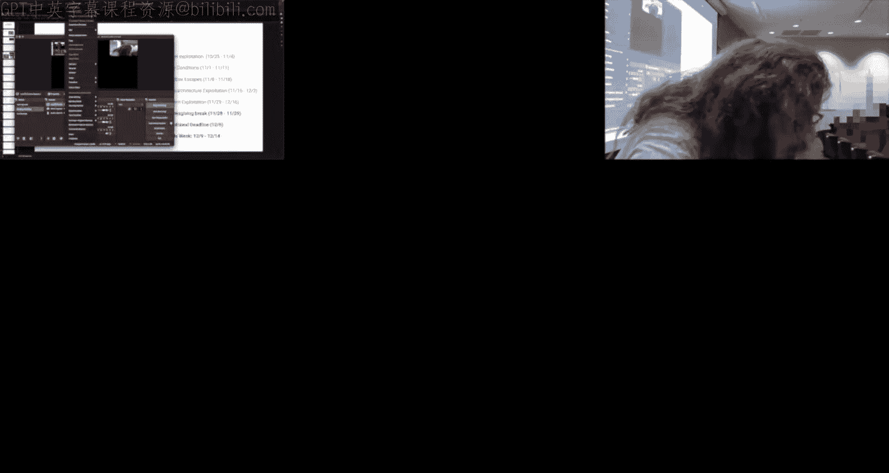
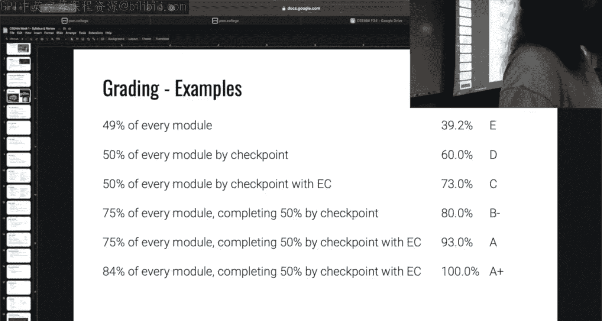
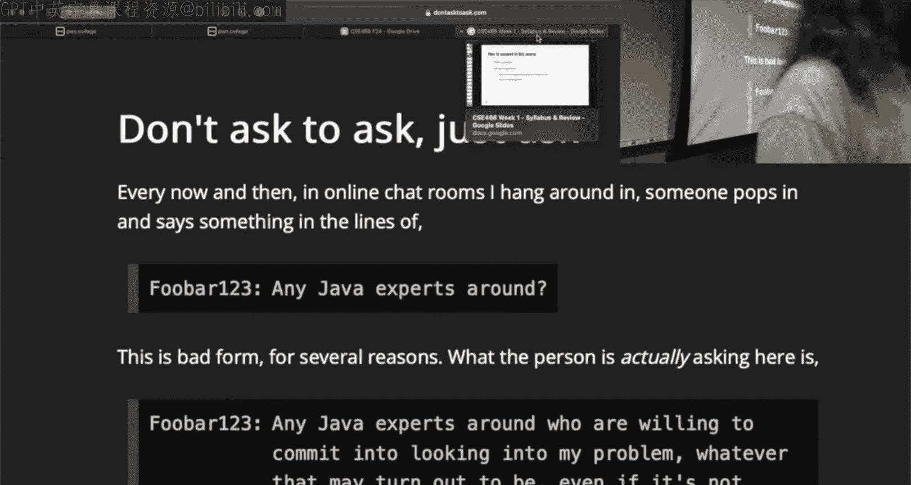
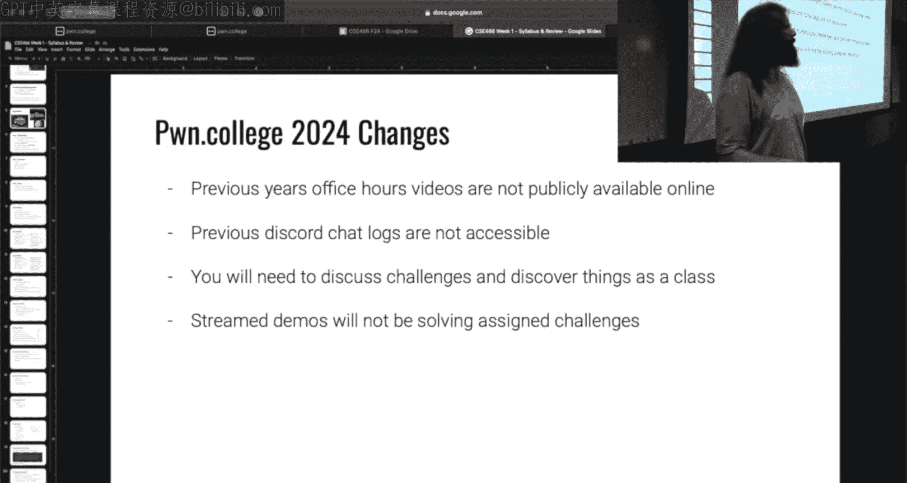
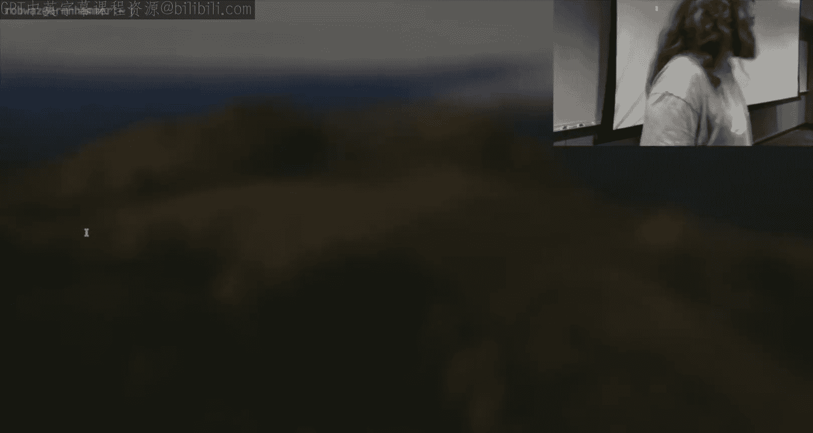
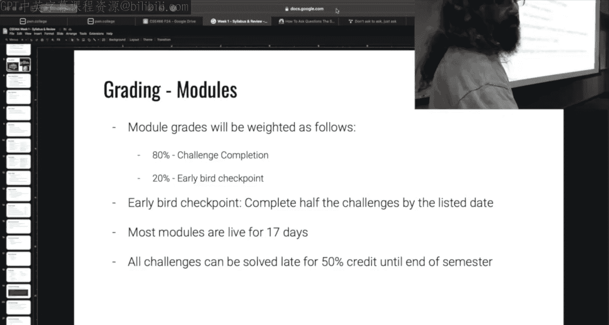
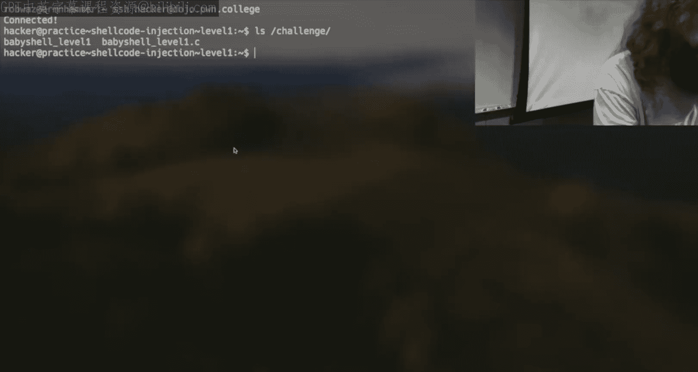

# ASU《计算机系统安全｜ASU CSE466 Computer Systems Security 2024》中英字幕deepseek p01 -02-Intro & Syllabus - CSE466 - Robert - 2024.08.23.zh_en -BV1spCGYZE9D_p1-

That is not the slide I have， there's no text， so we're going to have to do it this way。Okay。

 does anyone have Twitch up， confirm that we this looks like this？Like90% of the time， it doesn't。

Just take a look here。We're good。需要把这。Whereer。You'm going to make look all right， something's live。

 it looks like me， when you're back， we are good， all right。

Towiets you're going to have to beer with me， you live on my phone today so I believe today is August 22。

 2024 we are all here for CSE 466 my name is Robert Wassinger I'm going to be your instructor for the semester if you're not here for that class you are in the wrong room。

Okay， a little bit of background about me， I work in the Secom labb。

 this is kind of the cybersecurity lab at ASU， Im pursuing my PhD and done all my coursework and just kind of wrapping it up I've been with the Secom lab for many years this is not my first rodeo on home College if you did CSA365 you may have interacted with me at some point as everybody here taken 365。

Is anyone not let's try that？Okay， we got kind of the equivalent 365 but a different college okay。

 same same story here， something similar to different college， okay。

 cool as far as I'm aware that is a prerequisite for this course and I'm going to function as if you know that material。

Which brings us here prerequisites， I assume you are somewhat proficient with Linux lynch tools。

 you know how to use a terminal， you will have some familiarity from I believe it was the last module 365 with debugging so this is using GDP some idea of how a disassembler works this to be like Ida。

 Gidra， binary ninja， any of those tools if you don't anyone not familiar raise your hand like you need to know where I'm at。

😡，Okay， we're good couple。We can make it up。You have somewhat fluent in X86 assemblyly so you're able to read X86 assemblyly。

 there's going to be virtually no source code in this class。

 everything that you're going to interact with is going to be a pioneer。

 it's why you need to know how to use GDP， it's why you need to know how to use a disassembler。😡。

And why you need no to readassely。You not only need to know how to read it。

 you also need to know how to write it， which。😡，Will be our first assignment， but it's not。Today。

And lastly， I expect that you are knowledgeable and like how to research Linux cis calls。

 how to kind of figure stuff out on your own， this boils down to how do you read documentation。

 how do you ask a question， and how does the man command work。

 can you read a man page everyone familiar with man？😡，Good。

If you ask a question that can be answered by man， I'm going to tell you read the man page。

Fair warning， historically， this class is one of the most difficult courses in the ASU Comp science。

Undergrad program。It's going to move at a very rapid pace。

 I know there's been several iterations of this course。

 this is like the fifth or sixth iteration of an oncomone College for this iteration I intend I'm moving through 10 modules over the course of 16 weeks and there will be no last minute curve to past students。

😡，All right， you can ask anyone that's taken a cybersecurity course with me in the past。

 I don't curve at the end。The way that I kind of approach this stuff is if the class as a whole is struggling。

 we'll deal with it then and then when we move on we're done with whatever that topic is right so I am willing to you know provide extra time spend more time reiterating a topic but there won't be like a sudden bailout in the last week。

😡，All right， now the flip side of that is you'll always know what your grade is， your grade is live。

 it's 24/7， you can access it in real time whenever you want。

 so you'll always know what your grade is， how you're doing in the course。

 but don't stick around hoping for a last minute bail out because that's not how it's going to work。

😡，As we move through the first module or so of the material。

 if you're having doubts you're struggling you can talk to me。

 but please consider dropping out of the course this isn't meant to be like a super scary thing it's just I don't want to hurt people's GPAs this is a class that people take at the end of their undergrad and if you're looking for an easy course to just hey。

 I want to knock this out and check out don't take this class it's going to be probably the single most demanding course that you'll take in your undergrad but I just want that to be very clear。

😡，Historically， across all iterations， roughly half of students that sign up for the course complete it。

Okay， facts。It's not to intimidate you， but it's to let you know what you're signing up for if you're taking other demanding courses。

 think about fixing your schedule。One way or the other。Cool。

 so why would you go through this grueling material？

Well it turns out this class runs on something called Pone College， which if everyone。

 most of us have done 365， you've probably experienced it in 365 and one of the benefits of Poone College is that we offer belts and incentives and shiny things and we reward people that are willing to kind of go through this great grind。

 right？And you'll truly learn something。Not that you can't learn things in other classes。

 but this will be all hands on very real world applied cybersecurity skills。

How does this course structure， how does it run so today's kind of a muigan just because we have to get everyone on the same page。

😡，The class as a whole runs in a flipped classroom model now a lot of people say oh。

 it's a flipped classroom， but what does that mean for you？😡，The first。Two modules， I think。

 are going to be a little bit rocky just because we have to get scheduling to line up。

 but once we get through the first couple weeks， it's going to be a very consistent pattern。😡，Friday。

New material will go live on Poone College that will include lecture material that will include challenges that will include all of the work that you have to do for that time period a module consists of several prerecorded lectures these will likely include old lecture videos as well as new lecture material that I record。

😡，Thatll be kind of my take on things and then a series of increasing difficulty challenges roughly targets about 30 challenges per module。

😡，The expectation is， so I said this is being launched on Friday。Over the weekends。

Watch the lecture material。Try and mess around with the challenges I don't expect you to solve them all。

Work on them， get stuck All right， you're stuck on something。Then when you show up in class。

 you can say， hey， I'm stuck on this， I don't understand what was said in this video and I will answer your questions here。

Come with question。That is what class time will be， yes。I think with this， I just wanted to ask it。

 so what is the deadline in terms of modules like？So I'll get to that on the next slide。

 the question for Twitch is what is the deadlines， what's kind of the scheduling？

before I believe it's the next slide。Where we'll have the actual schedule of deadlines。

So the idea is you try and tackle the material， you tell me what you're stuck on， we get you unstuck。

It's a hybrid course， so there are two sections， this is the Thursday section。

 there is also a Tuesday section。Content will not be repeated， attend to and or watch both classes。

 it's listed as a hybrid for you it's listed as a hybrid for Tuesday。

 we're doing it by complementing the other there was a question offline if you are allowed to show up on the opposing day。

 the answer is yes， as long as we don't run into capacity issues。😡，As Twitch is aware。

This is being streamed class is streamed at Twitch TV/ homecollege videos are also uploaded usually a couple days within a couple days of the class happening to a YouTube playlist where you can access it there as well attendance is encouraged and appreciated it is not mandatory I greatly appreciate it because like I said the reason I'm here is to answer your questions through live demos so if you're in person asking the question we can go back and forth and hopefully get stuff squared away live in real time it's a lot more fun for me hopefully it'll be a lot more fun for you。

Of course， structure， there are no exams。The course consists of about 10 modules as I said。

 each module is a series of challenges， your course grade is the average of these module scores realtime grading is available on Pone College I will do a little demo of what Poone College is for those that aren't familiar at the end of class。

😡，So question of schedule here is our schedule， this says knowledge check because I failed to update the slide。

 but way it is on the syllabus。Which some people said that the syllabus。Was not available。Fall 2024。

Now mine's going to be a little different than yours， but you should have this po thing。

And we have syllabus， if you were on the ASU class search and it syllabus and should have brought you directly to this page。

 that is my fault Sure， no that's fair， but I want to make sure that if anyone didn't see the syllabus。

 you know how to find it。All right。The same stuff is outlined on the syllabus as far as what the modules are when are the dayss you should match my slides if they don't。

 let me know we'll get a squared away。So course schedule， this says knowledge check on the slides。

 but if we check out the syllabus， it should say something a little bit different。

So it's program security。So I'm assuming that you guys did some binary exploitation 365。

AP iterations of CSE 466， I had， for instance， a shell coding module， had a memory corruption module。

 I had some of these modules where。It's good binary exploitation stuff。

 but a lot of it has been already pulled into or touch on in CSE 365。

I'm not going to rehash that material and so what we're going to do is we're going to kind of sum up everything that was done in 365。

 build on top of it and move forward with a generic program security module。

 it's going to encapsulate all of that， get that out of the way so we can get into some fun stuff。😡。

So that's what that's going to be now prior iterations we have reverse engineering。😡。

This iteration will be advanced reverse engineering。So。There will be a change to the material。

 there will be a change to the lecture， there will be a change to the challenges。

 there will be new challenges。😡，Prior iterations of4 sixX did not cover rock。This iteration will。

Fun fact， I attended the very first iteration of Po College for CSE466。

 the very first iteration followed that have pattern very similar to this。

 we did cover Rob like six years ago。And so we're going to go we're going to touch on Keep exploitation then we're going to have a program exploitation module now I know that there is program exploitation on the Dojo right now and there are modules with these same names on the dojo right now you are welcome to try and tackle them if I reuse the challenges yes you get credit if I don't include them you don't get credit。

😡，And if I add challenges， you have to do them anyways。Okay that is the deal。

We're then going to do kernel exploitation， reef conditions， sandbox es skates。

 we're going to do microarchural exploitation， so we're going to take a look at Specter meltdown。

 if you successfully move through this material you will rank your own specter attack in your own meltdown attack。

😡，From scratch。We're going to have a kind of final examiner major boss in system exploitation。

 and that's going to kind of wrap up the semester question。You know。Good call the statement was。

Twitch is not happy， give me one second， horrible thing to stitch together。我让你个拦上。Well。

 I don't have that setup up at the moment。是为。This is why you show up in person on day one， guys。都喜欢。

喂。You don't see it。Okay。I got one more fix。Yeah。

感谢。

Okay。Give it a minute for the Twitch delay， we'll change a slider two。Did we get there？

I do have one question question there like like are there supposed to be like some overlap like those last sections there that' is a good question and the answer is there's an overlap with all of these yeah so the comment was。

 hey， there's an overlap here。Between， it's not necessarily the first couple。

 this is me getting onto our Friday pace。But starting from here， we have the 930， this launches 927。

 so what happens is every module will be due on a Monday， the preceding Friday。

 the content will be launched of the next thing。😡，All right，So there is an overlap。You are correct。

Now， yes。You mentioned on out home College， there's noils of some of these things。

Ws aren't guaranteed to be the same as。Natural force。

So I'm going to skip ahead here because I really like that I added this slide。

Pone College 2024 changes this is the question that comes up every semester is hey if I do everything early right。

 do I get count do it， does it count， can I work ahead。

 it's got the same name is it the same thing and for a long time now I have been quoting the exact same blur typically saying obligatory copy pasta because because at this point it's kind of me beating a dead horse it says it is always nice to see that people are individually interested in the site's content。

 please keep in mind that there is no guarantee that any existing modules or module content will be used in a given class iteration。

😡，Instructors reserve the right to exclude， modify and add content every course iteration。

 nothing is formally assigned as part of an ASU course until the ASU course instructor assigns it。😡。

走。It's a nice generic blur right and I've been using the same thing for years， not just for。😡。

This class， but for all the instructors that use phone College because it's a common question， right？

that's the answer。And as far as when something is assigned。

 it's not today because I told you what I plan on doing it is whenever the challenges are available。

 so we're here on Po College we're on CSE 466， fall 2024， it's whenever you start seeing these。

Right now you won't， I get to see it because I'm an admin。And these numbers are not active。Okay。

 so it's not worth snapshotting it to get an idea of what's going on。some of them could go down。

 some of them could go up。When the first thing's assigned， we get to reverse engineering。😡。

While you're doing the first assignment， I'll be changing reverse engineering okay I'm building the tracks as the train is moving。

 so nobody knows what's actually going to be there until we get there。😡。

Good question， though。We find where we were。Okay， so the comment was that these these overlap that they do。

 and that is if people are the type of student that wants to work ahead，😡。

You get the material on the Friday， you'll have a minimum I believe it's 10 days except for first one like they're all at 13 I 13 or 17 that sounds right but the general idea is things get launched on Friday you get the weekend plus a week plus another weekend so every assignment you should have at least two weekends to work on but there is an overlap on the weekend。

All right， so the idea is we can move through all this content， which is what we need to do。😡。

You can manage your time appropriately and you get two weekends to do it which I think is a lot better than just heading it once a week like every Monday you get it。

 Monday it's done by giving you the overlap， you have the ability to say， hey。

 I want to have this weekend off， I'm gonna to go hard next weekend or the prior weekend to make up for it。

Now， the other comment was time 17 or I guess 7 to 13。

These are I believe10 days Yeah those look like these are easier topics to go through so 10 days is a week。

 seven days plus a weekend's how we get to 10 the rest of them should be 17 I believe so two weeks plus a weekend Yes question is curious are the deadlines hard the deadlines are hard Now if collectively it' a course you just decide to like or it's a class you decide to rebel and it's hey。

 none of us get it well we'll cross that bridge and we get there but aside from insane。You know。

 scenarios， this will be the pace that we move at。Question。

Sa like a deadline passes and then you revisit the module later do you do that？

There's a slide hiding ahead， good question though。I appreciate the questions guys。

 like if I'm saying hey， it's later， don't take it as I like interaction， so it makes this fun。😡。

Cool， so how is a module graded， module grades are weighted as follows 80% of a module's grade is just whatever percentage you got done okay？

😡，If there's 10 challenges， you do five of them， 50% is in this part right here。Right。

 challenge completion。20% of the modules grade。Is this thing that's called an early bird checkpoint。

So the biggest problem that students have in this course。Is they start late， they say。

 it's going to be easy， right， there's lectures over here， I got this。😡。

And then the last weekend and come， students try and work on it。And it all blows up。

This early bird checkpoint， gray is an effort to try and not penalize you。

 but reward you for starting early。Every。Module。Has a checkpoint。

 we'll start with this one because this is when we get to our Friday。Pacing here we see。

This rock module will launch on September 13， There is a checkpoint of the 23rd。

It's actually due on the 30th。If you get half of the challenges done。

 it doesn't matter if it's the first five or the last five， right， you get 50% of the stuff solved。

 then you qualify through this checkpoint。😡，Get 50% of it done by whatever the checkpoint is。

 you get 20% of the modules grade。😡，Now for modules that are only a week。😡。

Or can it be shorter timeframes， if we look up at this first assignment here。

 you'll see that the checkpoint is the same as the due date。😡。

Functionally what that means is if you solve only 50% of this first module。

 you're going to get a higher grade than if we didn't have the checkpoint。😡，狗。

Now that sounds a little bit complicated， but it's not that bad。

Because I do offer a lot of extra credit。Okay I offer 8% of course extra credit for posting names on the discord this is more than 365 typically does I don't know what they're doing this iteration。

But there's 16 weeks in the course， you can get half a percent of the course grade per mean per week。

😡，Now it doesn't mean just find and Google the most garbage thing you have and throw it on your discord all right。

 that is not appreciated， it must be something that is somewhat relevant to the challenges。

 cybersecurity， the topic， you can dunk on me that's totally fine if there's something something funny that occurs or I have a big o。

Just something relevant to the course。Don't just Google cybersecurity Meme and then throw it up there。

 you only get the extra credit。😡，If the meme is liked by the Po College bot on the Discord。

 there's a little thank you or good meme thumbs up guide。

 little emoji that'll show up on the posting on the Discord and it'll say that it's by Po College bot。

 that's how you know you got the edge。Any of the Po College instructors can trigger this so that's anyone teaching the Po College class this semester doesn't have to be me。

 it could be someone from another class， just post something that any of us find relevant or somewhat amusing。

I tend to be pretty lax with this。You give a little bit of effort。

 I'm going to try and like your means because I want people to pass this class。

I know it didn't sound like it in the first half， but I really do want people to pass this class。

 right。You also get an additional 5% extra credit for answering questions on the Discord。All right。

 but I don't know if I've mentioned that we have a discord。But if you've been in 365。

 you're on there， right？那个就这。こ。So on the Discord you can right click on a message and then select apps thanks。

 this will make the bot perform a little tie little noji to the message and that is you thanking somebody for their answer to your question their contribution。

 they said something that was useful this is all tracked by a bot。😡。

You can get up to 5% extra credit based upon how helpful of a person you are。

 please do not abuse this system and start thanking things that are useless or thanking each other。

 we do keep an eye on that and then we have to like throw out this extra credit which is a bummer because you're going to need it。

😡，The extra credit follows a logarithmic scale capping at 50 if you're not familiar with what a logarithmic scale is。

 that means the first couple helpful things you do are worth more than the later ones right so try and participate and interact on the Discord we're all going to get through this together guys all right and I need all of you to help each other and we'll get to the other side of this class。

Any student can thank another。😡，Quest， I remember this happening last year with 365。

 but are you going to do an extra credit potentially extra free？NSA securityOkay。

 so the question for Twitch。Was if there will be extra credit for special events， for instance。

 participating in a CTF or if there is some cybersecurity event that is relevant right now the answer is no。

 however， if something comes up and it's brought to my attention， I'm open to the idea。

 but we're going to take that as it comes。😡，Go。So grading sounds really complicated， right。

 we have this checkpoint， we have extra credit， you know what does this all mean， yes question？

Okay what does this all mean so the 50% mark is like mission critical all right if you did 49% of every module。

 your course grade will be a 39。2%。😡，However， if you went a little bit further and got that 50% mark。

 right， this is where that checkpoint matters。You're going to jump up almost 20%。

That's the difference here between solving half and solving less than half。😡。

You still didn't pass the course， but you did a lot better。Now， what if you did 50% of the course？

Of every module， and you posted some memes。😡，You know， you help some people， you know， you try。

 you put in some effort。You're going to get a 73% you'll pass the course with the seat。😡，All right。

 so you do not need to solve 100% of all of the modules， of all of the challenges。

 if you just want to pass this class， the extra credit is designed to make it so that you don't have to do that。

😡，If you did 75% of every modules。You get a B， but if you did 75% and。😡，You got the extra credit。

Right well you would also have to hit this early bird checkpoint right。

 so you did 75% of the modules， got the first half done on time。

 and some extra credit you can walk out of here with an a。😡，Now， to get an a plus in the class。

 you's the only need to solve 84% of the challenges。I think that's fair。All right。

 but the key to this working in your favor is that you do this extra credit and you start early if you don't。

That jump there， that 20% edge is going to crush you。Questions here？Yes。

 how many do you do on it without extrapar to get like an A？Without extra credit。

That might be like 90% whatever the egg cutoff is。That's why extra credits your friend。Yeah。

 fully these percentage is becoming down at any point。So the question， no no， sorry。

 I got to repeat further for Twitch because it Mike doesn't necessarily pick up well question was。

 will these percentages come down at any point， the answer is no？The syllabus does state that。

AndIt's kind of left there as an escape patch， but I'm telling you right now I'm not going to do it。

with the exception of the cutoff for an A plus， these cutoffs can be curved downward in the event that students do worse than expected。

I can tell you right now I have pretty low expectations， I don't think you'll do worse than them。Yes。

If you did， say 100% of modules， but not， you didn't do 50% by the cutoff but you did it all before the due date was your。

It'd be 80%。so the question was if I did 100% of the modules， but I did it all last minute， right。

 I procrastated until the end， you would lose that 20% for the early checkpoint。

 but you could get 100% on everything else， that results in 80%。😡，Technically。

 you could do that with the extra credit and come out walk out with like a 93。

But that's how the mouth would work。And if we participant are we guaranteed that 13 points of extra credit？

So the 13 points of extra credit work because this slide is fine you get 8% from posting a meanme that gets the bot to like it right that's 0。

5% per week per meeting totally 8% gotcha the other component for the 13 is being helpful once you hit 50 you've capped out at 5% I understand that just was curious is like。

Are we guaranteed to get this 13 or is that like subjective to the are you going to post means okay then you'll give me extra credit are you going to help people then you're going get health credit right like this I can't tell you that I'm just going to give you 13% that's based on what you decide to do will be next 16 Yes if your're TA for 365 will you do you have specific thanks from other 466 students or we also get thanks credits for helping 365 students Okay the question was if you are also if you are in this class and also a 365 T does your help from being a TA contribute to this class？

I don't have a technical solution， but I will implement one。

 the answer is going to be no all right yeah， it would be too that's a shame for asking that because that might have snuffed by right but that'll definitely have to get fixed。

That's what do。 Yeah， much。N。Okay。So to kind of circle back to what I've already been saying。

 how do you succeed in this course？Watch the lecture videos when they're released and start early。

 you'll notice that all of the incentives， the extra credit。

 the structure of this is start early come here with questions right if you do that。😡，You'll do well。

 ask questions to confirm your understanding as soon as you're stuck and you're like， hey。

 I've spent an hour around here， ask something on the discord。Participate。

 that is where the am I guaranteed the memes extra credit， am I guaranteed this help extra credit？😡。

Participate and you will get that extra credit， I try and be as loose as is reasonable with liking your means。

 if other people are not thinking your messages， I will thank you for them if I see it。All right。

 I want you guys to get this extra credit， but you all can help each other here。That's the design。

Start early。Cannot reiterate that enough。I already said this， read some main pages。

 ask good questions。Start to early ask questions， but does anyone know the difference between a good question and a bad question？

There's some hand waving okay， what do we got Good question。

 something that you might have struggled with that you think someone else might struggle with later on if they come up and come across it。

Okay， so there's。Something that's intended to waste time okay so the statement was a good question is something that is a question about something I struggled with。

 something that other people may struggle with and it should benefit the class right this isn't a write a five paragraph essay on Cans help thing right I want real questions。

😡，And I want them to be things that you're actually interested in。

 but it's not just topically are you asking about something you were stuck on。

 it's how you ask the question。Now， when I first started kind of interacting with Po College and being pretty relevant on the discord here。

 I frequently linked this。

Which I will probably link again this semester。😡，It's a little bit small we're zoom in here。

 it's a very famous link。To a great write up about how to ask questions the smart way。

 this is meant for technical people and asking technical questions。Don't say I tried acts。

 it don't work。I can't answer that， I don't know what you actually did。

I don't want to see your source code。Don't put your source code on the public channels。😡。

That will get deleted and you'll get chastised for it no， it's a very， very， very long readout。

 I don't expect you to read it。Plenty of great information about how to ask a technical question。

 how to frame it， provide information， I tried this， I saw this， what was the error message。

 what man pages have you read， what documentation were you thinking？These should be in your question。

If you just say help， challenge five。Doesn't work， it's egg faults。

You're not going to get a response or you're going to get a response that says， hey。

 you should probably try and provide some more information so that we can answer that question。😡。

It's not meant to be mean， it's to help teach you how to ask questions so that we can help you。

 help us， help you。

The other link。That you may see， so someone's heard this one。

Don't ask to ask。A very common thing that people do on the discord area not just the discord。

 but any technical forum， right is you ask， hey does anyone know X？You're talking to the TAs。

 you're talking like the discord is full of people that know apps， the answer is yes。

 don't ask to ask just ask your question。rite a good question。

 throw it out there and people will respond if you ask something like hey does anyone know how to do level three。

 it's a waste of time， it's a waste of your time it's a waste of my time。

 it's a waste of everyone's time so please be direct with your questions try and be as detailed as is reasonable here so that we can help you。

A lot of the time when I'm answering questions on the Discord， I am not at my computer。

 I'm walking from A to B， I'm on my phone， I look at it real quick because I see there's a message if it's something I see that's well written I can answer right on my phone right now if you ask something that requires a bunch of additional information I'm going put my phone in my pocket and carry on with my day because I can't answer that question while I'm on the go。

😡，So it benefits you to ask good questions， please do so。

All right。Instructor office hours， this is me， I'm Robert Wals seniorer。

 my handle on the Discord is Rob Wz， I am a screaming bill my head hurturling through space。

Because I kind of fight with it。for whatever reason you need to email me， Al Wasingerasu。edu。

 I'm still deciding what I want to do for office hours。I'm going to leave this up to discussion。

 we'll probably have it sorted out by next week， Thursday。You do have other support than me。

hich is the TAs， so I have three graduate TAs who have completed all of this material and the material that follows this。

 which is a graduate level cybersecurity course。And they are available to help you in person。

At the exact same time as this class， Monday， Wednesday， Friday in person。周。

Monday you'll have Michael， Wednesday， you'll have Zach。😡，Friday， you'll have Sam。

 these will not be streamed。Okay， this is in person help， you have something， hey。

 I'm writing this code， it doesn't work， I need someone to like sit down with me and get me shared in the right direction。

 the discord is it helping me。You can show up to BY， E and G 209。

One of these three guys will be there。They'll be able to try and help you。There may be more than one。

 but this is what they are mandated to kind of staff。

A couple of them may show up on off hours to try and supplement that if the need arises。

Now this is BY E and G is we're kind of doing something different here。

This isn't a room that is dedicated for this class， this is just all of Po College， so there's 36。

5 taAs there's sort66 TAs， there's graduate level class TAs right the idea being with everyone that knows things in one room hopefully everyone can get the help they need as rapidly as is reasonable so the same time as this class just cuts off a little bit shorter ends at 520。

😡，This is why I'm not sure what I want to do with office hours because I could schedule。

 for instance， a Friday， hey， come meet me in my office。

 I don't know that that gives you a benefit over showing you up here where I may even try and make an appearance myself。

What I'm thinking right now is I will do some type of office hour stream。

If that is what vibes with people， people agree if they're like， hey。

 I really want something in person， I'll figure it out。

Does anyone have a preference in general you really like in person time with the instructor？Okay。

 we got it， we got a few。Okay， other people like， hey， I don't want to be here。

 I just want to watch Twitch。Okay， so maybe I'll try and get a room and we'll combo it， right。

 I'll stream and be in person。Like we're doing。Yeah， yeah， something similar， but it'll be a smaller。

 smaller setting。All right， but officially TBbD， I got to reserve a room and kind of sort that out。

Questions， really you possible have a time that's like more earlier than the day or not really？

That is a good question。嗯。 so I could do。My office hours sometime earlier in the day， like noish。

 is that reasonable or what is what is earlier here what are we looking for Yeah at noon depends on what day I think we I think I can make that work okay。

And it might be classes are。itLike typically this is， you know later in the day。

 so I like hypothetically and I have to reserve so this is all nothing hypothetically we'll shoot for light day。

 Friday at noon。Most people don't have classes on Friday so that shouldn't be a conflict。

I'm not a morning person， which is why this is all noon noon was the number all right。

 on the Discord and my reviews I'm very very well known for answering questions at like 3 a。 4 a。

 5 a right if you're up grinding odds are I'm up as well。Right did fact。

Butll try I'll try and do a like noon on Friday in person and I'll stream it as well if that's what works for everyone here。

 double check for Tuesday， make sure they don't have a drastically different opinion。All right。

 we already saw this slide so I will be adding and changing challenges this semester。

 you can work ahead but you're doing so at your own risk。

 I'm not going to tell you what's going to be changed because I don't know I haven't changed again。

Adam is here。Oh， I didn't see you， Adam。Is Rob also up grinding or just up？It's a good question。

Where we're going to go with， I'm just working real hard。そ。Home College 2024 broadly。

I kept this slide， this was originally for a spring class。

 but we used to have previous year's office hours available on YouTube。

Those were pulled at the beginning of the year， so if you took this class thinking， hey。

 I can rely on this like vast repository of years of TAs doing things。😡，Good luck。

I don't believe this has happened yet， and now is the time to capitalize。All right。

 but sometime in the next couple days， the previous discord chat kind of set up in history is going to disappear。

 we're going to restructure the discord so that way it's not a giant let's go find the secret nugget on the discord right from previous iterations of the class the goal here is to force everyone。

To talk about the material and interact with each other。All right。

 it doesn't make sense to offer extra credit for help if the answers are already somewhere where you can get them。

😡，So there will be no answers on the discord that's going to get cleaned up。

 so that way people can help each other and get that extra credit。Everything that I do in class。

And in office hours， will not be solving the direct challenges that you will be doing。

Yeah I will create a I'll write up a live proxy example， I'll come prepared with some examples。

 this is why I say try and tackle the material early， ask questions。

 ask questions on the discord if you ask questions on the Discord it's something a lot of people are like hey I'm stuck that lets me know before I come here in front of you all here's something I should build to demo for you to answer that question in greater detail。

😡，The typical slide deck that you're going to get from me outside of today and Tuesday is going to be about four or five slides。

 mostly with your means。Then there's going to be a logistics slide and then here's what I'm doing。

Here's what I brought unless somebody has something to hit me。

Most of our classes are going to be looking at。A terminal。This is how I work。Okay。

And it's going to be all live debugging， live messing around with the challenges I don't like。

Giant slide deck classes， and that's not what this is going to be。はい。So。As I said。

 most of my slides end with a site like this it says demo Plan time permitting so there's two things I wanted to try and run through if I had the time。

 which looks like I will first is a quick tour of Poone College， how to get set up。

 how does this all kind of work。

So。One of the questions I received via email。は。One of the threads or one of the questions I received via email was。

 hey， we're not on Canva。No， this class is not going to be on canvas。

Everything that you do。It's going to be on this website right here， Poone Doc College。

You can create an account for free。All we need is your email， I'm already logged in。

 but there's a kind of create account button up there。

The second thing that you need to do is you need to link this to your ASU。

 so I know you're an ASU student in this class because this site is kind of open to the world， right？

😡，So I need to know that you're an ASU student。See if I can find it。收。Connect your Discord account。

Create the account， go to settings， go to Discord， connect Discord that will grant you a Discord role that will give you access to private discord channels that are specific to this class in general。

 I try and do everything all communications in public forums so that everyone can answer everything。

 everyone can benefit， but if there is some like poor specific thing that you have there's a logistics cluster or you just don't feel comfortable speaking out loud on the public discord。

 we do have private channels where we can communicate there。😡，All announcement， communications。

 changes， things like that will be done via Discord。

 there is an announcement channel that requires this Discord role。😡，So create an account。

 do the connect。You'll get the feed of information if you don't， you're kind of playing from behind。

 I'll say things in class and it'll be on slides， but you're better off getting it from there question so the slide deck that we cover in class。

😡，Tuesday， Thursday will both be posted to phone college themselves they will。

So the question was the slide decks like what I just ran through will those be posted to Po College themselves the answer is yes it。

I'm going to try for same day， it may be like next day， but reasonably quick it will be。

So obviously this is not a program security。Let's see， do these do the resources， Okay。

 so what you'll get when you click into a module。It'sSomething like this with lectures and readings。

 these up here at the top are the prere lectures， these are by a prior instructor， Jan。

 fine gentleman， you may have met them。😡，Where he talks about the information that you'll need to complete the module。

 what you'll see。😡，Down below is these live streams will be embedded here。

 they'll be named class Robert date， and it'll open up the exact same way。Ass this。

 so you'll get once I upload the YouTube video， there'll be an embedded YouTube video of what this camera here has and the slides will be embedded right below so that you will be able to reference those right there on the site good question。

Okay， so you create an account。I actually don't know。Adam， are you there？

Where does the student ID go， Yes question？All you're raising your hand Im going for sorry I noticed as you were walking through the dojo of the modules in the dojo I noticed that it set at the top how long there is until so it's due Yes will we as students be able to see those so the question was when I go into the course and an important distinction here is you'll notice that I'm up here。

We could go。Program security。Reverse engineering and you're like， oh， this is the same thing， right。

 there's ya smiling face。All right， the changes that I make。

More than likely will not all be visible via this path。

It is very important that you access the material。😡，Through this CSE 466 fall 2024。

Because it doesn't make sense for these live class streams to show up over in yellow belt。

Those are people who are just independently trying to tackle the material。

 not people that are taking this course， so make sure that you follow it from CSE 466 and then select the module。

 what is presented here， and possibly what is listed in the challenges will be different。😡。

So make sure to follow that path。Now Adam's going to save me here。Click on Dojo。

So I have to link phone college to your ASUI， right？So we're going to go into CSE 466 fall 2024。

We go to course。And I believe he is saying。Identity。

And it says enter your ASU student ID your 10 digits that's what lets me link stuff up and know you're a student grant give the role。

 make sure that when the course ends I can export your grade to ASU Yes just one more question about the Dojo itself I know this is probably not a feature that's already in there but is there a way to I know there live grading and everything is there a way to know where you stand in a particular Dojo for example。

 so like a particular model module of the dodo？Okay， so for Twitch。

 I remember it's like 50% check point， 75% completion for like an。Okay for Twitch's question was hey。

 I know there's like some grading thing somewhere on the site。

 but like how do I make sense of it for the individual module I'm in you got a couple ways so you won't see it right now but you see the totals here right this is your solve rate so right now this is no it's all zeros right you could see if this was 22 out of 44 you're halfway there Adam also added this very nice progress bar okay that's right。

hover but we can do better all right， because you said， hey， I know there's live grading， right。

 we'll see if this works。If we go back to course and you go to grades。

 there's your live grade right and you see right here program security checkpoint。

 there was a weight of two， the other one has eight。

That's your 100% of the module got X or you get a check all right， checks are good。

 x's are bad and then this is your cumulative grade of the entire course everything everything。

You'll see that the due dates are all listed there， it's all already preloaded。

 if anything looks off， I probably fat fingered it， let me know we'll get it squared away。狗。

Twitch question， do we get a colored belt for completing all challenges in the class or would we still need to go complete all of the challenges in the like yellow or green modules？

It is a fantastic question。And。Right now， the answer in this may change。

But right now the answer is you have to do what is listed right here。😡，Now a kind of。

Caat there is I said， hey， we're going to do rock， and we're going to do micro architectureit right and that's all the way actually over here in the blue Belt here。

Some of these modules as this course progresses will move。To different belts。

 so we will be changing the belt standard as the course progresses。😡。

Doesn't mean it'll be one to one at the end of this adjustment， but it's going to be pretty close。

How can something be due on the 16th of December， there's another question I got so if we go back to our slide deck here。

哎。This was our ten schedule。12l16， so finals week。Is from what。Right，129 through 12，14。

My logic here is I want to give you guys as much time as possible to work on things。😡。

Our deadline internally as instructors to submit grades is 12 16。

So I will give you until the very last moment it will be like the day before I want like 12 hours to pull grades export it。

 make sure that ASU it maps out well right， but I will give you until I have to submit grades to work on things one thing that's not listed on here which is my bad。

😡，I don't know， it's there， I just didn't mention it all challenges can be solved late for 50% credit through the entire semester。

Okay， so。If on December 15th， you want to go back and do something from the first module。

 you'll get half credit。😡，So how does that have credit stack up？With the residents。

Because I know probably by then we would know where your course rate is so if you went back into a model and submitted something。

How does the half credit totalle up because I believe it's， so let's say I had 75%。

 I finished two challenges from， I don't know， reverse engineering got that to an 84。

 does that change my course grade？

How would that work okay， the question was， how does this 50% credit kind of match up and fit into my course grade？

😡，The answer is it's already computed right here in real time。

 so what you will see if I remember right？😡，Is these progress tools。

 like if I say I solved one here by the due date， and then I solved three late。

 we'll see a along and then there'll be like a parenthesy plus three because I think how we represent it and the grades page will do the math for you。

Okay fantastic all right， so that's all taken care of the only thing that doesn't show up on the grades page in real time is extra credit currently I have to add that periodically。

So I will poll how many means were posted， how much help people were doing。

 and I will add two lines down here and it will say me extra credit as of whatever。

 and then helpfulness extra credit as of。嗯。The other date， so the extra credit will be there。

 but I have to pull it myself manually and enter it。

 but the idea is you'll always know kind of how you're doing here。Good question。

Any other questions about the course as a whole， I've got like another 15 minutes。

And I can actually show course question the question is， will all of the videos？

Adams says show set up， please， okay， give me one moment at Adams yelling at me。Okay。 it's fine。

 so so I did， okay， so Adam says after you create the account， we'll go from Dojo's。

We'll go to CSE 466， fall 2024， wherever that is。We'll go to course。And then we'll go toSe and that。

😡，has a nice series of wins you can click to make sure everything is squared away。All right。

 five green check marks means things work。Thank you for that， Adam。Okay， your course question， sir。

So were watching all the videos。The lectures be enough to solve all like is all the information in that。

我也是。So the question is。If I watch the videos， do I have all of the information I need to solve every single challenge？

The answer is yes， if you are clever。Okay we aren't going to tell you do ABC and then the challenge is do ABC we're going to talk about a concept。

 we're going to say how different systems work， how for instance take like the heat module。

 we're going to talk about how the heat works， we're going to talk about the metadata of the heat we're going to talk about how these values or used in the heat。

 we're going to talk about how they can be abused to perform certain actions。

 but then you get to a challenge， it's not going to say。

 well you just need to do what was at this timestamp。😡，Okay， the idea of Poe College， this course。

 all of it is learn by doing。Ask questions。This is how you internalize this material。

You learn by doing you're not going to think about something the exact same way I do I don't want to say the he works like this and you just need to type ABC and then it's going to work and then you say I say well what do you know well you type ABC and then it's going to no I want you to mess around with it I want you to make sense of it。

Most of the challenge or not most， a good amount of the challenges have unintended solves。

There's an intended solution where it's like this is what I think the student should do if you solve it。

😡，And it's not the intended path I don't care you solved it right you figure it out for you。

 there is not one right way to do this if you want a reason about the challenge using GDP that's great。

 if you want a reason about the challenge using Itda great use what makes sense to you if you hate the terminal right and you're like I don't want to I don't want to learn how any of this works I don't use vim I don't use steam I don't want any of this that's fine you don't have to。

😡，The way that this website works。So we can go into a challenge。We can click start。

 it's going to say loading。

And hopefully it says Chaenge started， good， you can click on Workspace or desktop up here at the top。

Workspaceace is going to give you a VS code like interface。😡，Let's see if I。

And make a terminal appear here。Because I don't know how to use VS code。再说。Sorry。

 you said control Tilda。Beautiful， cool， so this VS code interface in the browser already has the challenge stuff located。

 but this is going to look a little bit ugly， but we'll get there。If I LS this challenge folder。

This is your challenge， there's a C file and there's a binary。For this particular challenge。

 this happens to be a shell coding challenge and if you like VS code。

 you can interact with everything via VS code if VS code isn't really your flavor。

You can have a full desktop baked into your browser。

And this is all interacting in that same environment。😡，So we can go right here， Els Challge。

 all right， I'm looking at the exact same thing and if you're like me and you're like the terminal。

You can SSH。To hacker atdojo。pon。colge。That's a me thing for security。

And now I have an SSH session interacting with that exact same environment。

 use whatever makes sense for you。What makes sense for me is the terminal and that's where I'm going to primarily be kind of working from unless we need to do something like Ida Gira says some type of graphical tool。

😡。

Now I did set up SSH there， if you click up on that gear here at the top， you'll see SSH key。

 you just put your public SSH key here， then you can SSH as I just kind of showed。😡。

Your username is always hacker that isn't like an example name。

 everyone connects to the Dojo as the hacker user， it will route you to the correct challenge。😡。

All right。So I got your question if I have any other questions here， I've got about seven minutes。😡。

Yes， do you find giving like an example of like a challenge why I see in the course that might be more like difficult a more an example of a more difficult challenge in the course。

 Yes I maybe it's like kind of highlight difficulty of the course itself Sure that you kind of mentioned at the beginning。

So。I will go four。And it doesn't mean I'm going to include it， but it'll give you。

Kind of an approximation of where we're going。Let's do。Right here， so this is from system security。

 which is like the very end of the module， and now this is the iteration from the prior course。

If we look at this challenge， we see there's two files， okay。

 one ends in dotO does anyone know what a doO is？What。It's a kernel module。

So if you ever want to know what a file is at the terminal， you can run the file command。All right。

 so this right here is a 64 bit elf， so this is just a user land binary。

 and then if we do the same thing，On that， we see that。Yes。So in order to interact with this。

We have to actually have a VM because it's a kernel module for reasons。

 this is kind of jumping ahead here， but we're going to start up a Linux VM。I'm then going to。

Drop into this Linux VM， you'll see that my prompt has changed， it's now hacker at VM practice， blah。

 blah， blah， the reason that we do that is because this VM has loaded that kernel module。😡，Okay。

 now the kernel module， a bit of a spoiler here。exposepos。A text device that if I remember。

 is stored in the f。Yes， this right here， this is a。

Text kernel device that you can interact with to interact with that kernel module Now what does that kernel module do。

 I don't know， it's your job to figure it out。😡，OkayNow what is this user binary。

 Well we have this thing here and you get this。😡，y， what does that do， I don't know。

Thiss here what you have to figure it out All right it turns out these two things are going to be related okay there's no source code here。

 we could use GDP on this thing right， we could run this in GDP inside the VM okay that's that's cool where where am I in this thing all I'm mean except so I guess this thing is going to require a network connection。

I might need to figure out what port it wants to communicate on。 I need to connect to it。

 I need to understand how this usually in binary works and how it relates to the kernel。

 Your goal in every single challenge is actually really， really simple。 All you need to do。😡。

I's get the output of this flag file。😡，All right。Now。That should be easy， but the problem is。

The flag file is owned by root and you are the hacker user。

 so somehow you must elevate your permissions such that you can read this file。

Now if we take a look at。This binary right here is also owned by root happens to be set UID。

 if you're familiar with what set UID is in Linux， means this bind the process from running this will run as root。

😡，So maybe you could exploit this usually in binary right， somehow hijack control and then。😡。

Obtain the value of that that flag because the process will be running this route。

Maybe there's no vulnerability in this user land binary。

 and you have to use this user land binary to then interact with that kernel device。😡。

And then you'd be running something in the kernel， maybe you need to exploit the kernel to then jump back and interact with that file in userly。

Now， if that sounds like a lot， don't worry because I'm showing you the end of the course。

 not the beginning， okay， we're going to get there and it's going to be not as brutal as you think。😡。

But it will be hard Okay， my general promise to you as an instructor is if you are willing to put in the time and ask questions。

 I willing to。Write giant blog posts on the discord explaining how things work。

 I will write up examples， I will live demo， whatever it is you want to know。

 it doesn't matter if it's immediately relevant to the module or it's just， hey。

 man why does your GDP look different than mine okay？I don't know what you know。

 and the only way I can help get you where we're trying to go is if you tell me what you need。

Cool there is a question on Twitch here which is will I release the module early。

 the answer is no because that's not fair to the Tuesday people， I'm training you all as one class。

 it's not fair in my eyes as an instructor to release something before their first day of class that's why the first module is going out on Tuesday。

😡，With that， I have one minute， any other questions。Cool。

 if there is anything you want to ask individual， I'm going to hang out a bit after class， Twitch。

 it was good hanging out with you and I will let you all go。

You probably want to see it。

On there。Every time。At the right time。うん。

No signal， all right。