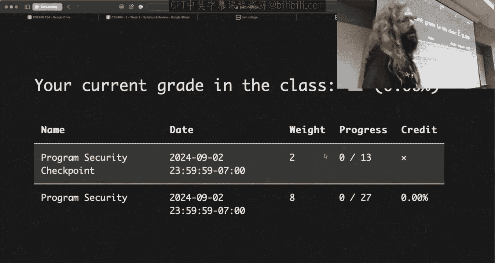
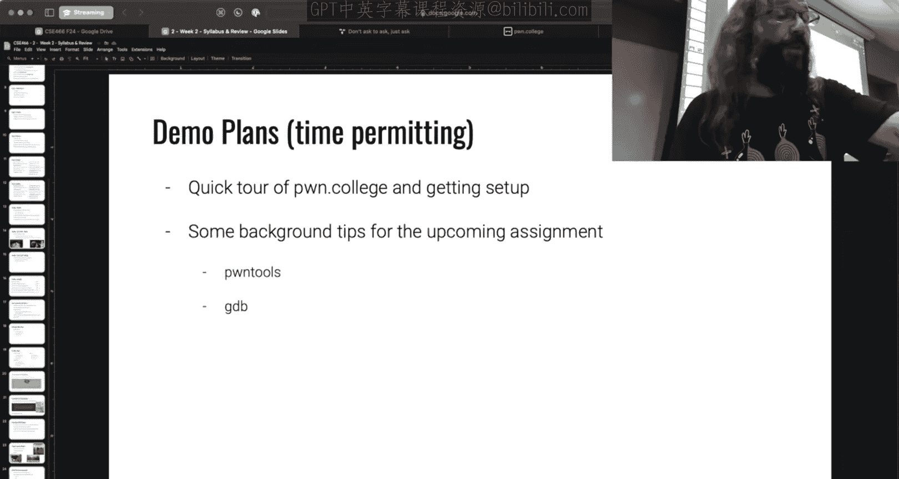
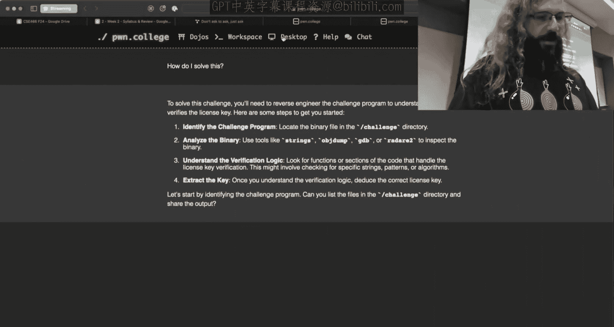
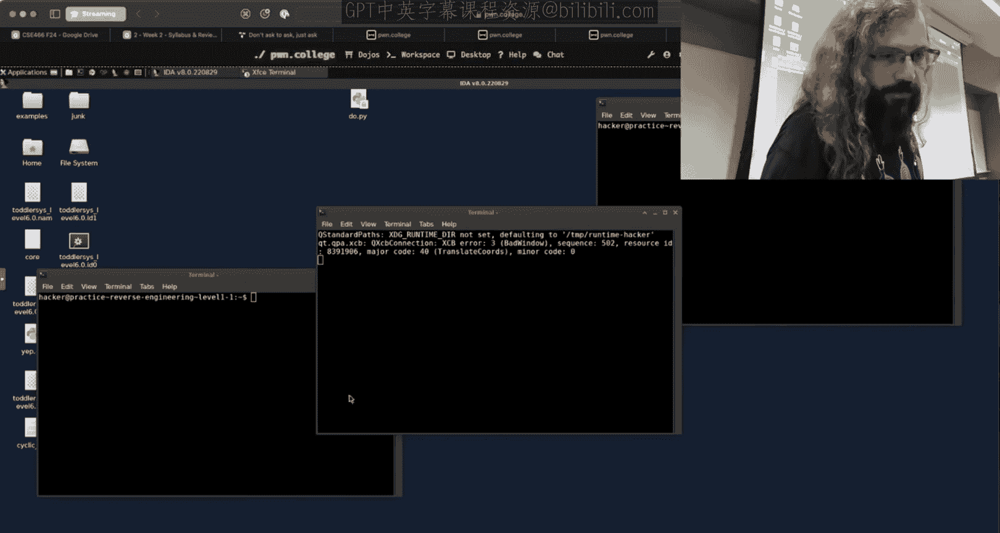
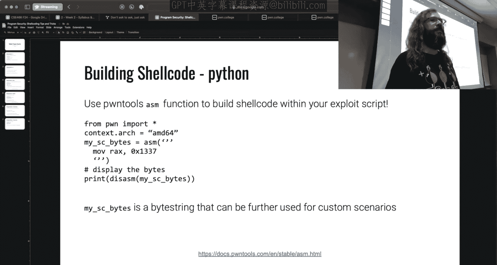
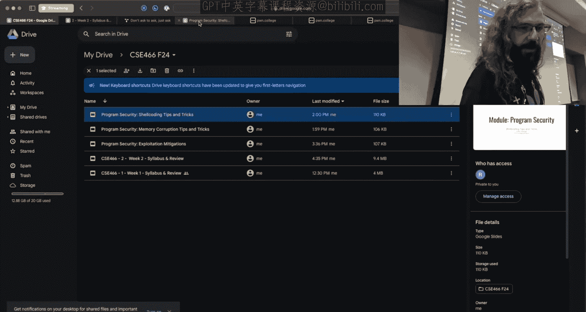

# ASU《计算机系统安全｜ASU CSE466 Computer Systems Security 2024》中英字幕deepseek p02 -03-Intro & Syllabus Repeated - CSE466 - Robert - 2024.08.28.zh_en -BV1spCGYZE9D_p2-

Be live。

Give a moment。Let's see。I is OBS going to play nice today， I updated it。It is all right。

So last side check today is August 27， 2024 you'll hear for CSE 466 Comp System security this lecture is going to be a little bit of a repeat of Thursday。

 I'm going to try and speed run it so that we can get into something a bit more fun。

My name is Robert Walsinger， I'm going to be your instructor。A little bit about me， my background。

 I'm a PhD student， I work in the SeFcom labb that's ASU's cybersecurity Lab。

 we do a lot of interesting things typically focused around binary exploitation or cybersecurity more broad as well if you are interested in cybersecurity research feel free to reach out to me I'll try and connect it to the right people and go from there。

If you are in this room， there's kind of a general assumption as far as what you know。

 most of these things should have been taught in CSE 365， who here has not taken CSE 365。Okay， no。

 it's fine。Like a handful， yeah， cool， no， I just want to have an idea so that I I present information at the appropriate level for everyone。

So if you haven't， the things that are taught there。

 it's kind of an intro to cybersecurity course touches on a bunch of different things， networking。

 crypto， binary exploitation， reverse engineering， this class is going to build off of kind of the Linux binary exploitation concepts that we're taught in that class。

 so the loose expectations here is that you are somewhat proficient if Linux tools。

 you're not scared of the terminal to some degree like you can at least do some basic commands there you don't have to be a VIM wizard but you can function in the terminal。

Similarly， I have some familiarity with some common reverse engineering tools。

 so know how to use GDP， know how to use， for instance， Ida， Gira， binary Ninja。

 any of those take your pick， I don't really care as long as you have one of those tools and know how to use them。

You're not scared of X86 assembly， this course is going to share pretty much zero source code。

So every challenge， every assignment， everything that we do is going to be， here's a raw binary。

 reverse it， figure it out， that means that you have to use these tools to then interpret the assembly to just like get started that's why that is an expectation。

😡，A。This can't be。Stated enough。Be comfortable and knowledgeable in like how to figure things out。

Do you know how to research Linux Ss or look at what ellippsy function does。

 this isn't just Google it， the default answer here is kind of read the page。😡。

If you know what a man page is， that's a good thing。

 if you ask a question where the answer is in a man page， I'll probably tell you，Mam。

 whatever and go figure it out。😡，All right， it's not to be rude。

 we're actually trying to teach a particular set of skills here。

 and one of them is generally being self sufficient。그。こ。With that said。

 this is like the sixth or seventh iteration of this course。

This is a very difficult course I took it in the very first iteration in my undergrad it's like six or seven years ago and the drop rate then was like 60% by the end of the semester This isn't meant to clarify you I'm not telling you to drop the class I'm just telling you that this is going to be a lot of work there's going to be a lot of material thrown at you at a very rapid pace and there's going to be。

😡，A ton of hours put in to follow the pacee that this course is going to go。

I'm totally willing to help people learn， spend a lot of time answering questions。

 interact with you here in class， et cetera。But even if I spent every day helping everyone。

Itd still be a lot of work for all of you， so if you are taking other demanding courses。😡。

I would recommend that you consider which one you enjoy more because taking this in line with another demanding course is not a optimal strategy。

 especially since this is a 400 level course， you're all probably wrapping up your undergrad。

 you know you want to get your degree and get out if you're just trying to take class。😡，All right。

 sign it， check out， get the degree， this isn't the room real。

This is not going to be a cruise through course。All right so if you do have any doubts。

Please consider fixing your schedule historically about half of students that sign up pass it。

 that isn't half of students that stick through， it's day one there's， I don't know。

 160 or so students， roughly 80 of those will drop or not pass the class。

 drop withdrawal or not pass。😡，That is part of the course， on average。

 across all like six or seven iterations。Just so you know what you're getting into。All right。

 so if it's really hard and it's brutal and I'm going to like run everyone rightgged why the heck would anyone take this course。

 Well， if you are interested in cybersecurity at all， this is the course to take。

If you aren't interested in cybersecurity at all， but you want to understand how computers actually work。

 this is the course to take。😡，Now， I said in the prerex here that you need to know how to use a debugger。

Instead of it assembly， understand how assembly works。😡。

The skills that you learn in this course while we may use them for exploitation are infinitely powerful for you as a general purpose computer science programmer。

 no matter what it is that you go into to reason about how programs behave， how they work。

 why things don't work the way you think they should。😡。

So even if you have zero interest in binary exploitation or cybersecurity。

 you can still gain a ton from this class。We also will bribe people with shiny things。

 so if you're not familiar this course runs in a platform called Poone College and one of the things that we do at Po College is we reward people that complete all of the material。

 not necessarily all of the class。😡，But all of the material on site with belts kind of an acknowledgement of their accomplishment because it is so hard。

Okay， last like last month， whatever Defcon was， we had the opportunity here to get on stage and those that were at Defcon that had completed all the material。

 we actually awarded belts to them live on the DefCO stage。

 one of the people up there is actually a dark tanggenent， who's the founder of DCO。😡。

hich is pretty cool， so you could get a belt awarded to you by the foundry of Decon if you really push yourself and complete this material。

We also have shiny coins， which we'll get into。So how does this class actually work this class is a flipped classroom。

 what does that mean there's lots of classes to say， hey， this is a flipped classroom。

 we're going to use canvas or blah， blah， bh， blah， blah， what does it mean here？Generally speaking。

 and this goes to a question that I got before class started here， before the stream started。

 modules will be released on a Friday。Chris says Friday before class there's no class on Friday so'll be it'll be sometime around like six o'clock give or take on Friday a module will consist of several prerecorded lecture videos they may be by a prior instructor or by myself。

 I'm going to attempt to record crush takes on all of the content as we move forward。

 it'll be hit or miss depending upon what I get to kind of given the pace and how the class is doing。

😡，Along with those videos， there's a series of increasing difficulty challenges。

 each of these are challenged binaries to exploit in general my target is about 30 challenges per module to give you an idea of what I'm shooting for。

All right second things are released on Friday， why Friday we have class Tuesday and Thursday。

 the idea is you will watch these videos over that weekend so Friday， Saturday， Sunday Monday。

Watch some of it right maybe it's two hours of content Watch it out already。

 you don't have to watch all of it I don't expect to know everything Well watch some of it and start working on the challenges just fire up the first one mess around with it if you get it great good to next one if you don't okay you're stuck you show up on Tuesday you show up on Thursday I want to know what you're stuck on I don't want to hear I'm stuck on level2 I want to hear I'm working on this。

 This is what I'm seeing I don't understand what's going on。😡，Class。

Will be me answering your questions， it will not be what we have right here today with me in a bunch of slides。

😡，The slide deck you'll get every class after this one will be somewhere between five and seven slides。

 the slides will mostly consist of your means。😡，And then there will be a slide that says。

 here's what I plan on demoing unless you hit me with a question。

All of class is going to be live demos， sometimes I'll do things and they'll work。

 sometimes I'll do things and they'll blow up， they will truly be live demos。

 I don't know what I'm going to do until you hit me with it。

Part of the fun is what makes this class fun for me。I like engagement。

 it's what makes this whole thing work。Asking questions early on our class discord helps me know what you're likely to hit me with。

 which means I can come with Can demo so we spend more time playing around with things instead of me writing up examples。

So if there is something that you're stuck on， the earlier you hit me with it。

 the smoother it'll be in class when we get to talk about that particular concept。All right。

 so there is a Thursday and Tuesday class， this is the Tuesday class。

 both of them are listed as hybrid courses， that means there is an online component and there is an in person component。

😡，After today， I' am treating both sections as the exact same class。

 You're getting the same lecture that I hit everyone with on Tuesday。 that's because I think that。😡。

It's totally reasonable for a student to show up on their first day of the section that's assigned to them。

 right？So nothing's been assigned， we're all be on the same page at the end of class today。

 treat you all as the same。You are welcome to attend both lectures in person。

 assuming that there aren't capacity issues and fire marshahal becomes an issue。😡，Alternatively。

 you can't watch both lectures， so this is being streamed live on Twitch the vds are immediately available unless for some reason I have to pull it down and within a day or two I upload them to YouTube so you should have ready access to them content between these two classes or these two sections will not be repeated aside from Thursday and today。

😡，As I said， they're streamed on Twitch， they're also available on YouTube， Tw。

tv/poncollege and YouTubebe。com/pononecollege。Attendance。We're all grownups。

 it is not mandatory to show up to this room， however it is highly encouraged and appreciated。

 I try to be an engaging instructor， make this fun for everyone because it is brutal the more of you that are here the more fun it is for me and the more I can kind of be engaging and hopefully answer your questions in real time it's a lot harder when all the questions are coming to me on Twitch and I have to kind of jump back and forth。

There are no exams， everything that you do will be one of these modules that I released the stated plan is there will be 10 modules throughout the course。

😡，As I said， each module will be a series of challenges。

 the course grade will be calculated as an average of these module grades。

Real time grading is available on Pooned College on the website。

 which we should have time to get to as long as I keep on cooking。

planlan here for what is the semester going to look like， this is tentative， however。

 I am going to try and stick to it quite rigidly。Is as follows today is 827 at the end of class six o'clock today。

 a program security module is going to be released on the course Dojo， that's already set up。

 it's going live， I don't have to do anything， I could drop right now and it will be up。😡。

That's going to be due seven days from now or six days from now， I guess midnight on 92。

 which is the Monday preceding Tuesday's class these first two modules are going to be a little bit wonky as far as scheduling goes Western。

Yeah you have one question on the the due date I know they say 9 to969301014 so here's my question this is something that I want to clarify。

 I think a lot of people probably not this question when you say a specific date for example the second the second of September or the 16 of September does that mean midnight on the second of September does that mean midnight on the3 of September Okay so the question is I'm giving you a date what does this all mean time is tricky etc right and I said midnight and I get that midnight is kind of a mist overomer here。

So this is not live right now， but this is what you will see in roughly an hour from now。

 you see that there is a checkpoint deadline， there is a due deadline。

 this counts down as you refresh the page so there should be no questions about when a deadline is additional。

 if for whatever reason you want to see your grade。😡，When you're on the course Dojo here。

 we can click on this little course icon， you don't get an admin icon， I'm sorry。

 but here is our syllabus on the left hand side it does say grades if we click on that。

So there's the deadline I was asking about so it's 1159 it turns out that this timetamp and that countdown reference the exact same like microsecon it's mindboarding what computers can do but yes。

 so when I say that Matt it is 115959 Arizona time。

Because midnight is usually depending on this is what I mean when I say midnight if you would like。

 I can state 11， 59， 59 pm no on 92 because I don't want there to be confusion。

 but I think we surface it quite clearly in a couple of different places。

You said there's 30 challenges per module and then 10 modules yes so rub rub 300 rub roughly 300 challenges over the course this semester increasing and difficult Now now the first half of this is kind of the scary pitch and then we get to a little bit of hey you know let's bring it all in so let's finish the slide deck before before we bail although if you bail I totally understand right it's a reasonable reasonable thought and I wouldn't fault anyone for having that thought。

So this first one is six days， this is a tight timeline。

 I recognize that that's what I'm going to shoot for because I want to make sure that we get to the later content。

All topics we intend uncover covering advanced reverse engineering。

 if you took CSE3365 you did a reverse engineering module， I'm not repeating that。

 this is why I put the word advanced in front of it is we're going to do some fancy stuff they definitely didn't do in 365。

😡，We're then going to jump into rockC which is return oriented programming。

 we're going to do a little bit of heat exploitation。

 we're going to do a program exploitation module， I realized that the naming is similar to program security that's launching tonight。

 it is not the same thing this is going to be similar to a midterm in the sense that it is a comprehensive set of challenges that encompasses all of the prior topics。

😡，To kind of give you an idea， so this is the scary boss one。

 then once we come back from Spring break， we will start off with kernel security， race conditions。

 sandbox escapes， microarchitect exploitation， which is a super cool thing。

 and very exciting to bring this down to the CSE46， if you who has heard of Specter or meltdown？

Few people， all right， cool， so that'll be very fun for those that do know what we'll be doing in that module is writing both a spec and meltdown exploit from scratch。

That runs on the actual hardware that backs the entire site。It's going to be fantastic。

This is my third time teaching this to take the talk and it's always blast for me Now then we have system exploitation and that is kind of like our final exam where everything that is on here is fair game one thing worth noting system exploitation is doing on 1216 I list to your finals finals are done on 1214 how am I making something do after finals my general strategy here is my deadline is of itself is I think 1216 or 1217？

And so I will let you work on stuff until I have to ship it to ASU。

 I need about 12 hours to pull the grades， take a look at it， make sure nothing looks。

Uudibly ridiculous in post of day this year。😡，Another thing that's worth noting is these four modules here in bold are running for one week in general。

The modules are going to run for two weeks where they release on a Friday。

 you have 14 days plus a weekend， so everything here is 17 days。The bold ones。

 someone did the math for me， I think are 10， except for this first one here， which runs for six。

The bold ones aside for this first one are much easier topics to just covering in general question so you have the program security and then knowledge check is that the same one is。

😡，That's all I mean， so sure， good question。So at one point， when I was putting this together。

 it was called a knowledge track， then I decided that was kind of a lame name because knowledge chat just doesn't have the bizarre you know a program security and knowledge check with a suit would kind of imply that these are things that you already learned in 365 it is not going to be the exact same things that you learned in 365 it's going to immediately build off of it so I'm assuming that the binary exploitation module that you did in 365。

 you have a good grasp of what's going on or else we riding the struggle bus for the next week。Okay。

 so I said the course grade is an average of the module grades。

 do how are these modules actually graded？Well， in a simple world。

 it would just be whatever the percentage of the completion is。Over the years。

 we've learned that isn't the best way of doing this。😡，So a module is graded as two components first。

😡，80% of the module grid is just the percentage of challenges solve， say there's 10 challenges。

 you solve five of them， you get 50% that applies to this portion up here。😡，The second。

 second portion here says early bird checkpoint。This early bird checkpoint is a date that is listed on the grades page and also on the module page as you saw with the countdown。

It is a deadline。Where your task is to complete half of the challenges by the listed date。

 it's an all or nothing。Why do we have this？This is a hard demanding course that's going to run you Regaggged。

 it turns out students don't believe me when I say that and what happens your students will wait until the very last day。

 two days， three days before， and then try and solve everything。And not do well。

Because they don't realize how difficult the ramp of any given module is。

 the intention is for the first half to be pretty easy。

 the second quarter to be reasonably solved by an average student and the last quarter to honestly maybe not get solved by the average student in this class。

😡，So a way of biasing that。In the favor of the average student is having this checkpoint。

If you start early， complete half of the challenges by whatever the deadline for the checkpoint is。

 you just get a 20%， 20% of that module。😡，This bias is in favor。

Of people who start early and get the first half done。Most phones rely for 17 days。

 all challenges can be solved late for 50% credit until the end of the semester and that automatically shows up on the on college website。

 it does the math for you。Now we do offer a reasonable amount of extra credit here。

8% of the course grade is on the table for extra credit for making means。

There's 16 weeks in the course， post one meme per week that is life by the Sen AI P College bot that'll have a little green icon in our Memes channel。

 you'll get 0。5% extra credit。The bot will like anything that an instructor indicates to like。

 not just me， you're not placating me， any instructor that is on the Poone College website。

 so it could be Y Connor， someone teaching 365， it could be somebody teaching another course just as long as it's running on the Poone College platform this semester。

😡，Ideally， these meansme are related to of course content， to challenge that was hard。

 something that you learned， something that sucked， something that I did that was ridiculous。

Something's relevant to the course my general bar is quite low as far as what I will like on a meme because I want you to get the extra credit because I know it's a hard course。

 so if you put forth a little bit of effort to post meme。

 I'll put a little bit of effort to try and like it and give you the 。5% extra credit。

You can also get 5% extra credit from helping that says or asking good questions。

 which is a just by helping other people， so our discord does have a system of thanking people。

So if somebody asked a question， you answer it， they find it helpful。

 they can thank you on the discord。If you do that by applying the little green arrow。

 emoji to a message or by right clicking select an app and then thanks and the bot will apply the thanks for you。

😡，It's a logarithmic scale cap at 50 instances， so if you said 50 helpful things on the discord based upon the discretion of your peers。

 you would get 5% extra credit for those that don't know what a logarithmic scale means。

 that means that the earlier help is worth more points than the later help。😡。

The motivation here is to try and get everybody to engage to interact on the discord。

 I'm looking for real interaction， please don't try and gain the system by like thinkinging each other doing silly things like that。

 we can track it thent have to take it away and that's a shame because you kind of beat the extra credit in this course。

😡，So in total， you can get 13% extra credit via memes and helping people。

 what is that all break down to as far as a grade I thought this could be a great slide because at face value。

 it sounds a little bit confusing。So let's say that you did 49% of every module。😡。

Well that's less than 50 and that checkpoint there is really going to hurt you because that's 20% of the course grade functionally。

😡，So if you did 49% of every module， you would walk out of here with a 39。

2 you would not pass the class。Now， hypothetically， what if you did？50%。

 so you just did a little bit more。you did it by that checkpoint right so you did it early instead of waiting till the last minute all of a sudden there 20% checkpoint credit swings in your favor now you're getting 60% D you still didn't pass the class。

 but that's a pretty strong 20% swing。Now what if you did 50% of every module？😡。

Completing it a half by the checkpoint， and you did that 13% extra credit。Cool， going to 73。

 you pass the class， you get a see。Life goes on， you can walk out here， get your diploma。

 everybody wins so if you're trying to pass this class。Post a lot of means， say some helpful things。

 do half of the material by the checkpoint deadline I don't think that's an unrealistic。😡。

So what if I did 75% modules？😡，I've given an 80% B that that checkpoint credit is still working in your favor。

If I want to get an A， you can do 75% of the modules， meme it up， help some people getting 9 to3% A。

 great， and you only did three quarters of every module。😡。

So when I say like the last quarter is meant to be challenging。

 the grading system has that in mind here。All right， the key is is that you participate。

 you mean you take advantage of what is being offered here to kind of compensate and balance the scales in your favor。

To get an A plus， you don't even have to do everything。

 84% of every module by the checkpoint along with that extra credit。😡，Has anyone ever done 100% yes？

Several students do every iteration。Completing 100% not necessarily the course material。

 but the belt material which the course will loosely follow will result in earning a P College belt which we make we have a belt in ceremony and we stream it it's actually quite a thing so like Po College belt have been awarded for like six years I think this is not just at ASU but online to the world I want to say there's only like 200 and something。

Over the six years that have completed all of the material along the site。

 this class loosely follows the yellow belt and green belt material。

I also teach the blue Belt material， which follows after。But blue belts。

 it's like 200 and something over like six years， it actually is quite the high bar worldwide。

So how do you succeed in this course as I mentioned。

 walk through lecture videos when they are released and start early you'll notice that's kind of a repeating theme here ask questions to confirm your understanding what if you are confused。

 ask in the discord right get it out there， get it sorted out early。

 don't spend a lot of time banging your head against the wall although depending on what you ask we may tell you to just bang your head against the wall but we'll try to not make that case。

😡，I ask good questions。Back in the day， I used to shoot these two links out on the discord pretty regularly。

Not to be mean， but they were taken that way， I'm going to start shooting them out again this semester and I want to make sure people understand that this is not to be mean has anyone seen either of these two links？

Yes。Okay， well， I've seen it because I was here。Well， you know， that counts， that counts。

 I'll give it。

They're very common in technical technical areas， the first one is entitled How to Ask Que the Smart Way。

It is a giant read and it has a disclaimer that in general on the internet people that work in high technical fields will frequently link people to this it explains how to ask a good technical question。

The expectation when you are asking things on the discor is that you articulate your problem reasonably well。

This means if I'm stuck on level two of， I don't know， shell coding。

Don't say level two shell coding it s faults， I don't know why。

That isn't enough information for me to articulate a good response。This is a great read。

 I'm not going to like mandate anyone reads it， but if you want to get better at communicating with technical people。

Highly recommend reading that that gives you a lot of great advice about how to frame your question。

 how to word it， what kind of information is pertinent in what is not。😡。

The other thing that you'll may get linked to over the course of the semester is don't ask to apps。

 which is another thing that frequently floats around technical kind of groups。

There are thousands of people who know stuff on the discord asking the question like。

 does anyone know X is a waste of time， it's a waste of your time。

 it's a waste of whoever's trying to answer your questions's time。

Most of the time people answering questions on the discord are not just chilling in front of their computer right we do other things。

 not just myself， but other like blue belts and knowledgeable people on the discord in general that will certainly try and help people。

😡，If I pick up my phone and I say， hey， somebody asked a question on the discord。

 if you wrote something that's well written， I understand what your problem is and I'm just walking from。

Somewhere on campus to somewhere else on campus， I can respond right there on my phone。

 you'll get a quick response。If you say does anyone know about level two of binary exploitation。

 I have no idea what you're asking about， as somebody pointed out there's going to be about 300 challenges this semester。

 level two of binary exploitation means nothing to me， it may mean something to you。

I have to look at it and work at it from first concepts。

 what is the actual technical problem you're facing？😡。

So please keep that in mind when you're working on the discor if you get hit with either of these links。

 don't take offense by it we're trying to help you improve in technical communication that is actually the objective yes when you're asking questions for people what what's that the level of like。

Safety and progress is sharing information about a problem Ill make sure you don't overshare in you know first academic integrity Sure so the question for Twitch was。

 hey， I just said ask good questions， provide technical detail。

 we're also at a university I'm going to get in trouble for academic integrity if I do what Robert just said。

This is a double itch sword and it's going to be brutal。I get where you're coming from， fortunately。

 for you， the person who gets you in trouble with academic integrity is me。rightSo。

Use your best judgment。I will assume good intentions if you overstep， I'll message you。

 I'll delete the message right the assumption is that you're trying to ask a good question and if you overstep。

 I'll let you know。😡，I don't have a slide on it， but I should after what 365 did。Tating， don't cheat。

 okay？The cloud is somebody else's server in this case， P College is our server， we own it。

 we see what you're doing， don't be dumb， okay？😡，I don't want to bust people for academic integrity。

 please don't make me。

Like that that's kind of my general feel on it right I want people to learn。

 I want people to communicate， I assume good intent。😡，Don't abuse my generosity。

 you'd get many a message before it escalates to any degree like that。

That the goal is to improve understanding， not to flog people。O。

So participating in the course is hopefully the math shows extra credit adds up， meme early。

 meme often， and once again start early the entire course is set up to try and get people to do that and every semester there are people who do not。

All right， so I am your instructor for the course again my name is Robert Walinger on the Discord by handles Rob Wz。

 I am a giant screening Bill My head hurturling through space if you took I just vibe with it it's not a Bill anything if you took 365 there's pretty good odds that at some point you saw me or dealt with me on the discord so you have some idea of how I function。

If that is the primary means to communicate with me in general I try not to do DMs。

 but if for whatever reason you feel it's mission critical that this is a private communication。

 you can DM me， it's open， you don't have to try and be my friend just dipping。😡。

And if there is for whatever reason， some official communication that needs to go via email。

 you can email me， my email is Rwassinger@asu。edu。Office hours， I've listed as TB。

 There's a reason for that on the next slide。So we'll get back to that。

There are three graduate level TAs that assist in this course。

They all have not only completed this class， but have definitely done a good amount of the blue Belt material。

 which is the course that follows this， so they definitely know their stuff。

This class is Tuesday and Thursday 430 to 545， their office hours are Monday， Wednesday。

 Friday from 430 to 520， so it's kind of the exact same intersection here so you could get an answer to a question any day of the week that is by design。

Now these office hours are in BYEG209 we are doing something a little bit different this semester we are doing what I'm loosely referring to as the Po College hour of power and what that means is the people in BYEENG209 at that time slot are not just one TA this is going to have 365 TAs。

 365 graduate TAs it's going to have these dedicated TAs for this class and possibly TAs for a graduate level class I haven't pinned down the logistics there but it's going to be a pretty happen in space we do have overflow rooms。

 the idea here is we get as many people that know things together in one room and hopefully people can get what they need in a reasonable time。

So if you say， hey， I wrote this and I want someone to kind of shadow serve me and help me fix my code。

 their direct instruction is to not write your code for you， so just know that going into it。

 but if you're like， hey， I really need some one on one， this is the way to get it。

Now what are the comments I got on Thursday？Was， hey， this is all in the evening。

 and it turns out most hackers I know are not morninging people。Including myself。

Which is why you happen to see this type of scheduling。Solf。

Are there people who are interested in earlier help early in the day。

 is that important to people like do you have value because I'm living here at TBB。

 so potentially I could hold some type of in personson office hours earlier in the day if there are people who like the sun。

we go， we got some all right， whatever， all right， I like this section。

All right Thursday section had a preference for morningings。

 I still might try and accommodate them because it seems like everyone here is kind of bad or whatever。

So this TBbD tentatively， it all announceds on the Discord once I get it locked in so I have to reserve a room。

 what I'm thinking I'm going to do is I'm going to shoot for noon on Friday。I'll reserve a room。

 you can come if you want to talk with me specifically and not the TAs， it's totally fine。

 I will do it for we'll schedule it for an hour， typically my office hours running for two。😡，嗯。

And I will try and stream them because that was requested so it'll be kind of a part of it we stream part of it well you'll play by ear。

 it's going to be a similar experience to the classroom but in a smaller setting。

 hopefully I'm dealing with more direct questions in a smaller setting question Yeah I wanted to that this class is on Tuesday and Thursday。

😡，I don' know heard I just mentioned Tuesday and that's a kick as it says like hybrid， I think。

So you're not going to be repeating the same material at all from like a Tuesday on Thursday class correct。

 itll be like different materials that correct， so the question for Twitch was hey。

 I signed up for a Tuesday class this list is hybrid you're saying you're doing different things Tuesday。

 Thursday， what's going on here。And the answer is。Somewhere up here。

Uh that are these are two sessions that's listed for the Tuesday people as a hybrid course。

 it's listed for the Thursday people as a hybrid course。In theory。

 what happens is you show up in person to the section that you signed up for and then you watch the stream of the opposite section。

 all right， and they will be doing the inverse that way we can still move content。

 move through content at a rapid pace， we satisfy this hybrid criteria because you have an in- person at an online component。

😡，And we get to answer a variety of questions and cover a different amount of content。Class time。

 ideally， will not be me lecturing。Like when I say there will be different content in Tuesday and Thursday。

 that will be I don't know， people ask questions about this， this and this。

 and I'll write them down Tuesday I'll knock out the first two。

 Thursday I'll talk about the third one， right。What I talk about up here is dynamically based upon what you guys get stuck on。

 what you exploded on， what I think is immediately relevant to what you're dealing with。

and that's why it's different on each day and again。

 it's not this slide but attendance to either section， I don't care if you show up。

 I would appreciate it because I like being able to look at you and be like， all right， you know。

 just see getting what I'm putting down because on Twitch it's a little hard to know。

So you don't have to show up and if you want to show up to both， have at it， right？😡，Good question。

All right， where am I here so yeah， so we have these three Tas。This overlaps the 365 recitation。

 showing up to this is entirely optional， again， showing up to classes is optional。

 please do because it makes it more fun for me if you need help。

 hopefully there's enough manpower to get it done。😡，There may be more than one of the 4660 As here。

 but these are the slots that they are mandated to kind of man or staff。You guys didn't ask this one。

 this is my favorite slide on this entire deck。Pone code 2024 changes so I will I'm just telling you straight up。

 be adding and changing challenges I will be adding and changing video content。

 things will be changed up from whatever it is that happened last semester and semester before blah。

 blah blah blah， blah now I somewhat obvious in the schedule here because we're talking about very different topics than the previous iterations have。

And it is worth noting。That on the General P College Dojo。I look at system security。

 hey look there is a sand boxing module， there's a race conditions model there's something on kernel exploitation or kernel security right is this literally what I'm going to be throwing at you the answer is wait and Z。

All right， if you want to work ahead for whatever reason you're welcome to do these challenges。

 there's no guarantee that I will use them or not use them if you solve anything ahead and I happen to use it。

 you do get credit。All right， so there is that， but you don't know until it goes live。

And for a large part， I don't know because I'm building the tracks that the train is moving on as the class progresses。

 I have some idea of where we're going。But it doesn't exist。In some cases。

Common question is exactly that， hey， can I solve everything in your class before I take it and just get a free ride？

This is the exact same coffee pasta I have been delivering for several years。

it is always nice to see that people are individually interested in the site's content。

 please keep in mind that there is no guarantee that any existing module or module content would be used in a given class iteration instructors reserve the right to exclude。

 modify and add content every course iteration nothing is formally assigned as part of an ASU course until the ASU course instructor assigns it and to be clear the fact that I showed you a tentative schedule does not mean that I'm assigning anything that is just what we're going to try and move。

😡，So when you are free to work ahead， you have no guarantee， do so at your own risk。Oh。

 I made a second one included somebody's me my wife。They worked ahead and they didn't appreciate me。

 sometimes it's like that guys。A few other comments on this particular iteration。

 this is a repeat from kind of when I taught the graduate level class in the spring。

 but I think it's still worth repeating because it applies here as well。😡。

There are previous iterations of this class， we used to have their office hours and classes streamed on YouTube and on Twitch。

 they are no longer there， they haven't been there for most of the year。

 hopefully that it's a surprise to anyone， so if you were banking on relying on ancient videos。

 those aren't there。Similarly， Thursday， it wasn't the case， but I believe it's the case now。

 maybe not。Historical Discord chats。As of this semester。

 the question of whether it is the case now or not。

Yeah I know that there's something that is being worked on there as far as how we want to deal with forums。

 which is why I believe the old content is still there。

 but sometime in the next week I would certainly expect the prior chats will go away so you can't just like search the discord for somebody that six months ago was like hey。

 you and they were helpful maybe a little bit too helpful but we let it slide right the idea here is to force everyone to actually talk about the content mess around with it。

 learn by doing and interacting not by finding some random message from the ancient wizard on the discord。

It's also worth noting that as of 2024 in general， the instructors for the official kind of Po College core classes here have all loosely agreed that we will not be streaming the literal challenges that you solve I saw on topics somebody asked if we're going to jump into solving challenges the answer is no。

 if I have it my way I will solve absolutely zero challenges that are assigned to you this is why it's important that you express what you're stuck on because I have to create a proxy example on the fly to demonstrate the concept。

It turns out if I solve or work on the problems that you do。

 what happens is you students historically will pause a video at a strategic timestamp and then just type whatever I happen to put on the screen that's unfortunate because then you get to a challenge that we did not demo and you know nothing。

😡，And so it's kind of a form of self sabotage， so I'm going to focus on concepts， not level two。

 level three。So the program security module I alluded to it launches at six o'clocks。

 about 40 minutes from now， it is due Monday at midnight， midnight is 11，59， 59 pm。

 Arizona time on 92。Don't panic， I know it's a close。Say six day timeline。

My general take on kind of modules， grades somewhere in here， somewhere in grading， I think I said。

 I didn't say it。😡，嗯。You mentioned that everything is like you could finish things for half。

No that's not what I'm looking for， that's what I forgot on Thursday。 it's not on these slides， okay。

 we， I think it just came up so curvy。The syllabus does mention that in the event everyone you the class as a whole doesn't perform very well。

 we reserve the opportunity you know to curve， lift everyone's grade up。

 I'm going to tell you right now that me is an instructor。

 I don't believe in that okay your grade is your grade。

If for whatever reason we like run into a brick wall on this， we'll deal with that next week。

wther we extend a deadline， whether we overlap something， whether we add some extra credit。

 whether we re， however we deal with it， we'll deal with it there and now。

 it will not be an end of the semester bailout。All right， the logic there is twofold， one。

 you always know how you're doing in the class。And two。

 people that are struggling and you know you're struggling。

 don't ride the struggle bus until the end of the semester thinking there's going to be some great curve。

All right， it's just not going to happen。You can ask anyone that's taken a security course with me。

 I don't care。But hopefully you get why it's not as a be mean thing， it's just。

 I think that's a good way of functioning as a class。😡，All right。

 with that I've reached the end here， we are roughly on time。

 so this is what my slides will always end with I said you'll get about five slides from me。

 the last one will be something like this this says demo planss time permitting。

And I'll list a couple things that I intend on talking about。

And demoing before that does anyone have any questions good what have we got available stream Yes the question is will the Tw vs be available after streams and the answer is as soon as I hit stop it's available as a Twitch vod as far as timeline to getting it up on YouTube giving me a day or so I'm the one that or ports the challenge or reportss the videos and it's just kind of when I have time but I try and get to it within 24 48 hours but the vods were available immediately。

Right here。Ava componentIs there a Can component， so I know some other phone call related related classes are exploring in Canva。

I am not a fan of Canvas， I will not be using Canvas， I will not be sent grades to Canvas。

 I will do zero communication on Canvas。Everything's pun College Discord or if you really feel like it's shoot me an email。

 I。That's by design all right， that's why you show up for day one do have one question I think I this at the end of last class on Thursday or the last time this year。

I did want to ask I think。Also， in Tuesday's month。What is the ruling on generative AI。

 the use of generative AI least the one provided by Poe College and then also on third party services like and stuff like that Okay so the question for which here is how do we feel about generative AI so I do want to demo at least a couple things on Pe College but real quick here if the chat thingep well we'll get there we'll get there I get where you're going？

So all in Poone College， if you start some random challenge here， I have no idea what it is。

 I just pick something once it says here it started up， you can。

Click this little help icon and it's going to drop you into a little chat box。

 how do I solve this it is a generative AI fact。I'm kind of instructor。

 I meant to kind of backstop you， I do not have a problem if you use generative AI， right？😡。

AllI had no idea what it said that happens when you run the LLMs。

 it actually didn't give horrible advice， identify the challenge binary， it tells you where it is。

 it tells you some things you could run on it， try and figure out what's going on。

Why would you want to use this over General Chay PT Clade。

 whatever else is out there so we provide this at no costs you we eat it and this should provide a better experience then any of the commercial ones obviously this is backed by a commercial LLM the reason for that is this has access to your terminal I haven't  typeping in the terminal so it has nothing to go off of but if I was working on something and typing things in my terminal that gets fed into the context window so that the LLM has some idea of what it is you've tried and it could hopefully guide you on where your mistake is additional if you're working on a file it gets access to whatever the most recent file is that you've been working on so if I'm writing some exploit script it has an idea of what it is you're doing so you can say hey you made a typo on line6 or whatever the LLM says。

So I do just want to ask what， I understand that you're good with us using generative a。

Are you okay with us using codes suggested by the generative AI in our solutions is there a penalty for that or how does that work the question is is there a penalty if I use generative AI it'll go like this if you use this you I don't care if it tells you exactly and you copy and paste it if you spend your time trying to get this thing to solve these。

All right， you put in the time for your point all right， the reason I say that is。

LLMs are good at simple tasks， LOMs are horrible at anything that is like mediocrely complex。And。

Well like right now in CSE365 people are loving SAI they're also doing like how do I cat a file all right it turns out that that's a pretty common thing that LLMs have been trained on so yes it's very good at telling you like how to open up a file in a terminal but when it's like here is an arbitrary binary and I need to figure out what input is necessary to cause some effect or escalate privileges it turns out LLMs are not very good at that they are decent at providing conceptual advice highlel things like here it's suggested some tools。

 some highle things to think about and try right？😡，Use it to your heart's content。

If you happen to pull some verbatim code that you make this thing produce。

We have logs of all of this， like if it becomes an issue， it's very easily， easy to sort out。

Now on the flip side here。You asked about third party LLMs。😡。

The answer there is I personally do not care， however。As I mentioned。

 the cloud is just somebody else's machine， and in this case it's our machine。

We are going to put forth a nonze amount of effort to detect cheating。How we do so。

 obviously it wouldn't be quite right if I told you。

If you have worries that what your LLM output is what everyone else is going to type as well。

Maybe don't use that。All right， no， no， no， but I just want to be clear。

 I legitimately do not care what tool you use how you do it right at the end of the third party LLM you could you could end up wrapped up in a mess perfectly this one if everyone manages to get this thing to produce the exact same verbatim code in the class everyone submits it。

 I would have a log of everyone's interaction of every single one of those people getting that exact same code and then it's okay that's on us my bad good for you right but when you start regurgitating code from the nether world and everyone shows up with the exact same thing I have to be like wait a minute man Yeah this is this fair game how about it question a number Okay good question very good very good I up on Thursday didn't touch it today So what is like rough。

Workload， how much time is this class going to demand of you？

Depends on how familiar you are with material and how clever you are。

 how much you're trying to achieve right if you're trying to 100% everything on this course。

I do not think it is unrealistic to say 30， 40 hours a week。

Okay if you're trying to just pass this course， maybe half that right and I'm assuming that you're generally competent as far as prereqs are concerned。

 like I know how to use GDP， I'm comfortable in a terminal， I have an idea of what's going on。

 etc cetera。😡，But no this is an extremely demanding class。

 which is why I have that that first slide and when you。😡。

Get this assignment here in 30 minutes when that goes live。😡。

You'll see and be able to get a feel for what are we doing？

And what the curve is as far as the difficulty progression。

But there absolutely are students who put in 60 hours a week in this course and don't complete everything。

All right， right， that's just the name of the game。Yes。

 it's what about such a file is G and other tools like that。 Is that part of the。

Like for college or in。The question is， what is GDP？

Is that part of Po College is that a separate tool it's not a good sign if you're asking that question I think as part of the thing so GB is the community debugger。

 which is kind of the de facto debugging for any units platform。

So if you've done any debugging at a low level， you would be using GDP。

I will use GDP almost every single day in class， it is my preferred tool for figuring stuff out。

 there are other tools and I will try and cover other approaches if it is something that works better for other people。

 but my personal workflow relies to an insane degree on GDP。😡。

So I started up some。Some challenge， right？

是。I'm going to SSH into the Dojo。Which is my preferred way of working I live in the terminal。

 just in general， not specific to this course。Okay。

 this is a reverse engineering challenge it is a binary I started up with GDP now I have a plugin with GDP。

 this shows me Jeff， which is something we can certainly talk about I have now started the challenge in GDP I'm going to hit control C because right now it's waiting on input this is going to send Sig int SigIt is going to interrupt the program and drop me into GDP's interface now there's a lot of stuff going on here you may not have seen this before but you should be familiar with。

For instance， this right here these are registers of a CPU these are the values that are in them they're 64 bit this is a pointer this pointing to somewhere in memory in the value that is located there these here are the flags that are the state of the flag registers which are used if you're going to do a comparative or a comparative jump right comparison that gets set a comparative jump reads those values to determine where we are turns out we happen to be at a comparative structure so that may or may not be relevant this right here。

Its a sneak peek of kind of what's going on on the stack all right。

 so this is where RSP is RSP points right here and then as we move up numerically we move down in this graphic。

 these are additional values that happen to be located on the stack。

 this is RBP which is the base pointer。😡，Additionally， this right here is a back trace。

 a back trace is going to be the series of calls that got me to where I am。

This particular challenge is probably not the best one。嗯。That's not too bad Okay。

 so this is Lib C start Ma which is the thing that loads Maine like your program start with Ma when you write something in C right it turns out there's something that runs before that and that eventually calls Lib C start Ma。

 which takes the pointer to Ma this frame right here is Ma Ma is calling Reid Im inside of Re at this compare instruction blocking on him click。

Hopefully I don't expect you to know literally everything I just said。

But most of those words should mean something。If they don't。

 I'm more than happy to try and fill the gap here， right？

But those words should mean something like when I say this is the stack， this is the heat。

 this is a back trace， what is the stack frame， where the registers。

That is kind of the knowledge expectation here that I'm going to be functioning under。

I can step through。It's now waiting on my input I give it something GDP goes to the next instruction I was on the compare that's black you can't see I'm on the next instruction right there S step instruction I moved one assembly instruction forward so this is what I mean when I say like be comfortable with GDP right you don't have to be a master of it we'll pick it up as we go。

😡，But it shouldn't be your first time touching it。In other words。

 is it fine if we have Mac or do we need some tool of windows do I need a Mac well it turns out or do I need Linux or Windows or it turns out I'm a Mac。

 we just saw me pull this all off on a Mac， so I think you're okay on a Mac。If you don't like SSH。

 the terminal is scary， that's A OK too， so there are additional things here workspace and desktop。

 so if you like VS code once this loads this will be。

A full VS code interface。In your browser， this is sitting in that same challenge environment。

 so if I'm like， hey， I like VS code to work on my stuff， you can do that， right？Not here as well。

I don't know how to use VS code No， that's why I live in the terminal right nobody's perfect。

But yeah you get edit files here this is all being saved on the challenge environment so a VS code is your thing that's great somewhere in VS code you can hit a button and make the terminal pop up I did it on the Thursday but I don't know what it is and if for whatever is in VS code is also scary for you and you're like hey I like know Windows I like a gooeI and some things need a goi so like there is a reason that this exists you can get a full Linux desktop right here in your web browser this is also interacting with that same challenge environment you don't have to open up terminals but it's certainly relevant if we're going to open up a tool that has a gooeI for instance this is a static。

Decompilr known as Ida。

And maybe I need to open up this challenge。For whatever this is。

 this is actually something from CSE 365 and I need。

To decompile this and then work in this tool if I need this for whatever reason to help me address what I'm trying to solve。

Flashback。Yeah， that it is， you know， that's why there's the beauty of the terminal。All right。

 so you aren't restricted to this， you don't have to use GDP。

 I'm going to tell you that GDP would save you a ton of time， you can use a Mac， you can use Windows。

 you can do connect via any of the three ways that you just saw on any platform， I don't know about。

😡，Whatever Google is saying。I been go back there because you've been there for a while， what。特别是应。

いですか。So。When is that reset said？Cool question was for the meme extra credit， it's 0。

5 per meme per week when does that week reset so the code that we use actually does a seven day shifting window right so I just pick whatever seven day selection happens to work best for every student。

It's not like， oh， it resets on Sunday， hit me on Monday。Poposed to me once a week。

 you'll get the credit。😡，Yes not front if we find ourselvesse like going through the challenges and kind of like struggling with some of the like just like feeling rust yell GDP or some of the flux。

 what do you recommend like going back and doing old challenges or are there certain tools that you think like getting our freshers on is good for Co question was hey。

 if I start working on this and I'm like man， I remember GDP I used it the class was forever ago what should I do to catch up GDP in particular I'm not the biggest fan of this and I recorded it this is actually my first video on poem college you don't even get to see my face。

It's just me in GDP， but it's quite long， but I do go through basically everything that you would reasonably need to function within GDP。

 there are also a series of challenges here under optional refresher。

 it doesn't cover and test everything， but it gives you the opportunity to kind of play around with it and get going there。

😡，On the topic of that， how many people are familiar with GDP？Okay， so most people。😡，Okay。

 I was I was going to say if not， I can do some Yo stream tomorrow at some point that I can announce where we can like run through some of this if people would like that。

Just to Im get a couple thumbs up， all right， I'll announce that on the Discord once I figure out what time works。

I'll do some yellow stream and we'll just talk about whatever it is you got so I've got seven more minutes I me to take one more question that I'm going to show what you have to do like right away。

Yes。I it like an email sent out before Thursday？Sweet that is exactly what I have to show you to make sure that you know you know what to do before we walk out of here。

 the question was how do I get set up， how does this all work so？If we open up。😡，Pone college。

 you get this nice register thing， Ma register， sign up， make up a username does not have to be。

That's an Evernote email I don't even use anymore do you want to spam something to an old email Evernote account？

Make a username does not have to be related to your student ID， your name in your course。

 I don't care， right， just make it not excessively appropriate。😡。

Email doesn't have to be your ASU email just an email only reason we collect it is so that if you forget your password。

 which happens an embarrassingly large amount of times， we can get that sorted out。

Once you've done that， you'll be logged in， which just means that this looks like this。😡。

To get this synced up so that I know you are an ASU student。

 what you need to do is scroll down for you， it'll be under the courses， sweet。

 it is the courses for me。CSE fall 2024。We're going to click on course。

Now this is going to bring up the syllabus， which should cover pretty much everything that I already said。

 but it's there， the important thing is this bottom one here that says setup。We click setup。😡。

Someone was really nice and they made it really easy， there's five things， there's five links。

 there's five X's or check marks， Xs are bad check marks are good All right。

 you get five green check marks on this page you are synced up with the class youre in the Discord。

 you'll have the ASU 466 fall 2024 Discord roll which will give you access to Co specific Discord channels it's where I'll do the announcements and if for whatever reason we need to have communication about how the class is running or something that isn't going to be public on the public discord we can have it there。

 it also will let you sync up your ASU student ID that way at the end of the semester when ASU says。

 hey what grade did this person get I can usually you yank it out and send it to ASU。All right。

So again， that was from the Dojo's page， ASU 466， Fall 2024。

 click the courses button and then the left hand side here we click setup。

You get a series of five instructions， which I think boil down and clicking five links that gets you configured and good to go。

In 20 minutes， when we go to Dojo's， Fall 2024， you will see program security。All right。

 right now there are the prior iteration there's a bajillion lectures right because I included the stuff from that was included for binary exploitation。

 CSE365 because I didn't know what people know the ones that are immediately relevant are like memory corruption ASLR canaries there's like three videos that are actually should be new content if you took ASU 365 but there's a bunch on there later tonight I'm going to be recording my take on these。

 my goal with kind of rereing the topical content is to not hit you with three hours of lecture videos before you get going。

 my target for lecture videos is like 1015 minutes but that means I'm going to go fast which means you're going to pause。

All right， but I'd rather do that than hit you with three hours of videos and expect you to go through that before you get going。

All right， with that， no， I do have four minutes。I got four minutes。Yes， so on the topic。

 sorry of the lectures， how many percentage would you say like legend， I should translate with？

I how many percentage do I need research on my own before Okay， a question for Twitch was。

The lecture videos， how relevant are they to what I'm actually doing right the answer is they're extremely relevant。

😡，嗯。They're relevant topically they are not going to mirror what you will literally do in the challenge and what I mean when I say that is there are some courses where the way that the course runs is the instructor says I'm going to type ABC and then I'm going to put this in box D and then this happens。

 here's your challenge or here's your assignment what do you do， I type ABC。

 I put something in box D， I hit go and the exact same thing happens that is not how this course works。

😡。

The lecture videos will tell you all of the information you need to solve the challenge。

 all of the conceptual understanding that you need。

 however it is up to you to apply it right a good example would be like the part of the program exploitation is shell coding under constraints so this may be something like okay。

 I need you to write shell code and it needs to I don't think this is actually one of them but hypothetically I could say write out a newmer of shell code。

😡，I assume that you know how to write assembly， She code is literally just writing assembly and throwing it in there。

 your requirement is。Write shell code that is all letters and numbers， that is printable stuff。

How do you do that？What's up to you， it， figure it out right you should have some idea of how assembly instructions work now I do not。

Just to give you a sneak peek as far as like what I'm going to be recording tonight。it this one？ち。

Yeah， so these slides right here， how do I build chico but you could do it with the assembly tool you can do it there that's great it's a low level understanding right it's good to do once or twice and then it sucks。

 you can do it with GCC which is going to call those same things under the hood and you can do that and I'll show it and they'll give you a live demo and you can do that and that's great it's a pretty big improvement but that is also time consuming and kind of socks。

Or you could learn Pythoning Pe tools that I'm going to show this as well。

 and the reason you may want to do something like this is now I can programmatically access that byte string。

 I can print it out and display it， I can rapidly iterate on what I'm doing。😡，Now。

 am I telling you how to write alphaletnumeric She code， no。

 but I am providing a framework of the tools that you can use to problem solve your weight through it？

All right， in general， I try and structure lecture content that I do in the same order that you will likely encounter it in challenge progression。

 there's not a guarantee there， but that is kind of the goal as far as how I design things。😡。

Question， one minute。Sometimes when we're using debuger toolss like Ida。

The track to the site will be very high and sometimes they'll fch oftentimes like very close to the deadline。

 is there any infrastructure to deal with that issue？

Okay， question was the Dojo in general， I have too many tabs up here。

Nice， I did list some memes from this earlier this week all right sometimes the Dojo catches fire particularly when people are doing lots of reverse engineering or they're using IDda Ida in particular that actually isn't us。

 Ida free has a limitation on their server and so that actually is Ida telling everyone on the planet that they can't decompile anything。

 not just us， as far as the Dojo itself you are not wrong in saying that mere deadlines because students procrastinate despite everything that we try and do to prevent it。

The day of a deadline， students will swarn the server and write infinite loops and forth bomb themselves and do absolutely ridiculous things。

Sometimes that makes it very difficult for those of you that are trying to get something done at the last minute。

We are making improvements there， part of like what happened over the past week with 365 is related to some of those improvements。

 it turns out when you change things， sometimes they break right you don't get it right on the first time you can't load test until you have a load。

We do have additional things that hopefully will be done in the next week or so that should heavily address that problem。

But that is a general problem。Right嗯。If it's something utterly ridiculous。

 I'll give you an extra day， we'll try and sort it out the problem with giving everyone an extra day is everyone just does the same thing the next day。

 so it actually doesn't solve the problem， it just repeats it。

But you're not wrong and that is something that everyone should be aware of， right？Fact。

I mean anything else at this point I'm past past time。

 so if you want to walk out of here have that it， but i'll answer questions as well what was Jeff was the question？

So。在睡觉。Are you familiar with what a man， you just you cross the camera？

Oh no no it's all right it's it's going to cause me some grief Okay so the question was what is Jeff。

 I'm still streaming just FYI the camera didn't stop Do you know what a GDP in is cool so doc G in is a file you text file you can create in your home directory this is something that gets loaded every time you start G so you can put whatever commands you want in there and they will run。

Jeff， we see here， I'm sourcing opt Jeff Jeff。 high， this is a Python plugin。Two GDP。

So I showed all of that fancy stuff and I was like。

 oh you should know what this is right I'm running this challenge if I don't have Jeff。

 this is what we this is what we get right and so Jeff is a great way to just have information you probably want to see anyways throwing right in front of your face setting it up using it is definitely in the T video Are there any big classroom questions before I turn off the screen because I see the queue here from me。

Okay， with that， give me one second， we're going to kill the queue， kill the stream。几认真。

