# ASU《计算机系统安全｜ASU CSE466 Computer Systems Security 2024》中英字幕deepseek p03 -04-Program Security - CSE466 - Robert - 2024.08.29.zh_en -BV1spCGYZE9D_p3-

Live here。Give me a minute for the Twitch delay。This one。

 this slide deck has more slides than I normally have， but there's a decent reason for it。All right。

 I see myself here。On Twitch okay， so todays August 29th。

 2024 we are in week three of that's not true， this is class three， class three， week two all right。

 we are in week two CSE 466 here in ASU the thing that we're kind of talking about is program security。

So my slide decks begin with memes， these are all your meme， some of them may have come from 365。

 the idea being here， hopefully your memes bring up things that are worth discussing。

All right me so so I kind of you know gave this mean frank discussion here at the beginning。

 first class， second class so everyone got the same sp， the pres that I stated were not a lie。

 hopefully we've taken a look at the material given it a shot， the expectations are real。

 you'll notice that I'm not teaching you X86 assembly， I don't intend on it。

A consequence of that。Maybe you could have considered reviewing 365 and kind of what the material that was taught there over the summer if you didn't you might be struggling a bit right now。

 it's perfectly natural， get a summer off good me I dig this is a very common you know kind of failure point for students in general but in particular in this class and I do it as well like it's just when you're working on these types of things you don't necessarily know when to walk away from it and go and find that information and so oftentimes we'll find ourselves kind of running against a brick wall repeatedly。

😡，Again， the course reality is kind of kind of hitting here if you thought you were going to have a great partying semester。

 probably not。呃。This one， I have mixed feelings on this because I'm not sure where they're going here with asking for help on old challenges these are challenges。

 this modules entirely challenges have been around so maybe guys me when they say old challenges。

 you're welcome to ask for help， it's encouraged to ask for help， please ask for help。是。

Kind of qualifying that。Yes， there are pre recorded lecture videos， I am here， there is the discord。

😡，And I try and be pretty responsive on the discord if anyone has been on there。

 hopefully you've seen some of the responses that I give。

 I try and put in quite a bit of effort to answer your questions as detailed as I can。However。

 there are pre-recorded lecture videos for a reason and there is a limit to how much I will repeat myself in the district。

 but I'll just link to a lecture video timest or a link to a previous method where it's not an issue right now。

 I just want to make sure with it being posted that everyone is kind of aware that there is a line there at some point。

😡，A few of us decided to dunk on me， which is totally fair game you got the extra credit I the slide with the typo。

 this is the cooler name。That it's totally fair we also got me here because I do use SSation in the terminal but it's not because I am just an amazing neat individual it turns out that is just my preferred way of working and if you like VS code I am probably more useless than you are in a terminal if you prefer VS code I like this isn't a superiority thing at the same time that this is just the facts。

I'm sorry as the day you you roast all of us in here at the same time， Yeah。

 you know you can hit me back right I think that square is a class right as long as it goes both ways we can have fun。

This one here that one hurt a little bit guys， all right。Yeah， I'll give it to you。

 so I'm here two Tuesdays and Thursdays where I'mlecturing for the class。

Attendance is not mandatory that's your call but I do enjoy it Monday Wednesday Friday is the Po College hour of power which has been going on this week that's where we have some Ts。

 knowledgeable people there that are not me although I will drop in and did drop in yesterday at the TLN to help anyone who was still sticking it out。

And if that's your preference， that's totally fine， it's not mandatory to can' get what you're after。

 is that a hand back there？I noticed you mentioned that。There was a。

 I think of me but two slides ago that mentioned brushing up on some 365 material corn。

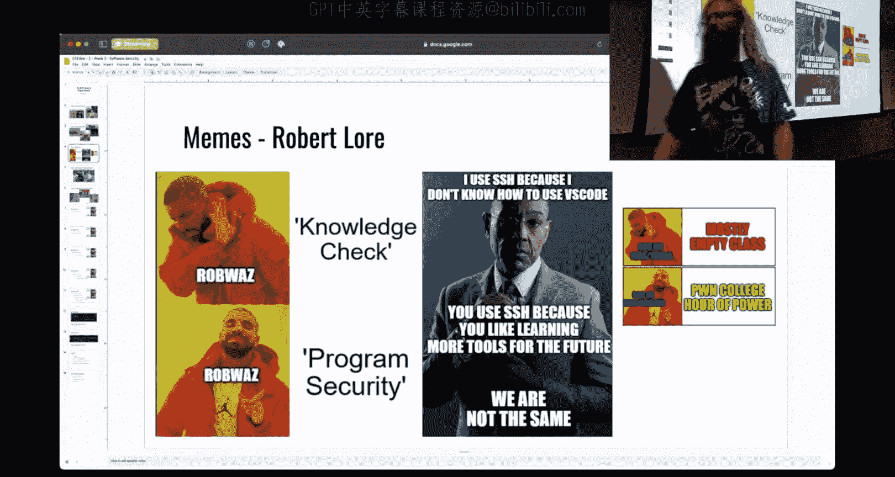

Yes， I was wondering do you have any tips on what is a material particularly to study for this module So I had a slide deck that mentioned kind of what the pre expectations were and that's fair like I didn't link directly to material。

 but if we go to the this course which is CSE 466 fall 2024 right here at the top and this is being here since I think day one of the course might be day two this is a link to the whole course these are the links to the two modules that are the absolute most relevant to what we are doing and I know I stated that at least one of the two prior lectures if not vote。

So I did link that and make that available if you want to take a look at it， that's great。

 it may be a better starting point for you， however the clock is ticking because we do have an active assignment。

😡，All right， so we did some Robert Laura， and then there were actually a few means that were quasi helpful if you know what they were referring to。

So this one here is talking about memory corruption。

 which is kind of the second half of the assignment that's out and okay you could be super strategic with things and use GDPB and use some staA tools。

 uniquely identify the exact memory location that you want to corrupt or you can just feel like you know what I got this and you just send a whole bunch ofs just send it and see what happens right it's totally totally valid however this approach will not work in all cases。

So at some point you will run into something where you can't just send a whole bunch of bytes and you do have to use some of the more advanced tool to reason about what is going on inside of the challenge。

A few more kind of useful useful memes here， this one was right before class， which was a good。

 good hit。It says hereShe coding， cis opens cis Read denses this right。

 so a very common thing you may want to do with shell code is called openread right。

 it turns out that's three cis calls。😡，This guy's pretty sad because he has to write a lot of assembly and they have some long shell cover doing three ces calls。

There is also this ci call that you may or may not have heard called CH Maha。

 which allows you to change the permissions of a file。CH modD takes one argument， it is one cis call。

 if you were to call CH mod and change the permissions of a file so that you can access it。

 then you could cat it afterwards， and it's way less bites。

 way less work than just trying to open it， read it and write it。Something worth considering。

This this other one here， I' going the circle back to where this is going， this is from 365。

 they're doing like intro the Linux stuff with the terminal， but they what it says there is LNS。

 my file， our file。They're creating a symbolic link to my file named R file。

 and then they are doing the inverse if you're not familiar with the symbolic link。

 I plan on touching on that today once I get to the demos we can。😡。

The TLDR is you can think of them as pointers on your file system。

 it is a file that points to another file so in this case we have two files that are pointing to each other which is kind of useless but it does bring up the concept of a symbolic link which is something that you can use to your advantage in this module the one over here on the bottom right was earlier and this is I think from what I've seen where everyone is for the most part at right there's a large number of students that immediately kind of brick walld here on level4 which is awesome level four if you haven't taken a look at it is a challenge that says send me your shell code do not use any H fights and so this H is floating here kind of haunting your shell code which I kind of kind of dig with。

Now there's one more meme and this happened late last night and kind of changed up my email plans this team here says cat Fled suddenly starts working。

And then we realize where it is cat Flag suddenly starts working okay。

 you'll notice that the title of this slide is we messed up So does that say 29。

 what's today All right， so I got the date right so yesterday for a period of about three hours every single user on Poone College？

Could have completed， could have exploited the platform and obtained the flag via cat flag。

In every single challenge on the site。That loads when suit。

So this was brought to my attention by someone that is in TE 466 their handle here is Attico does Attical want to identify themselves it's up to them okay so we have a hand that's Attical over there they brought the issue to my attention I took a look at it and it is squared away as far as what happened to the students that used it our general stance on Po College is the flag is the flag is the flag。

Now， with that said， there is kind of a ethical deal there， right， it's probably not good to do that。

And so if it was an insane abuse case。All right， we'd go to heaven and chase it。

 but I'm not going to go out of my way to see what people did。

Things will just be what they are and we'll leave it there。

Now， one other thing that is worth kind of mentioning here， if I take a look at the syllabus。

 I didn't mention it on the slides， but hopefully people do in fact read the syllabus。

Is we offer something called bug Bounty extra Cr and I didn't mention it on the slides because it has been。

 oh I'm not logged in。It has been so rare， it hasn't happened in years， so I was the first one。

 we got problems。我 at that。Yeah。😊，到。は。Long passwords are your friend， Okay。

 so I'll take a look here at the syllabus。And down here near the bottom when we' were talking about extra credit。

 it says more extra credit bug bounty program， it turns out if you find a vulnerability in the infrastructure。

 this isn't like， oh， you know， I've goofed something at a challenge that I added right but in the actual infrastructure that runs inci and yousponibly report the vulnerability or issue。

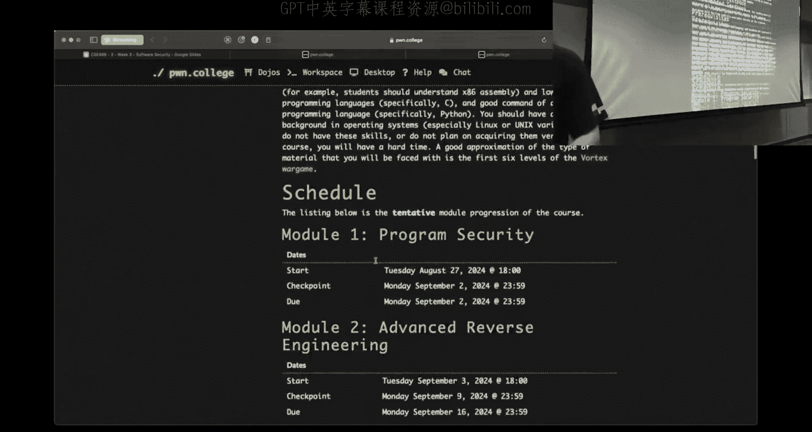

You can get depending on our assessment of how impactful it is anywhere from  one to 25% of the course in extra credit。

😡，This was a vulnerability that as I said， everyone could have possibly obtained the flag in every challenge。

 that's a pretty high vulnerability threshold， it's safe to say the article is going to get some extra credit and good for them。

So you could abuse it。Or you could just cash in right away and walk away if you happen to find something like that。

Whi I think is a fair deal，Because it turns out like doing security。

 even for those that know security is hard。

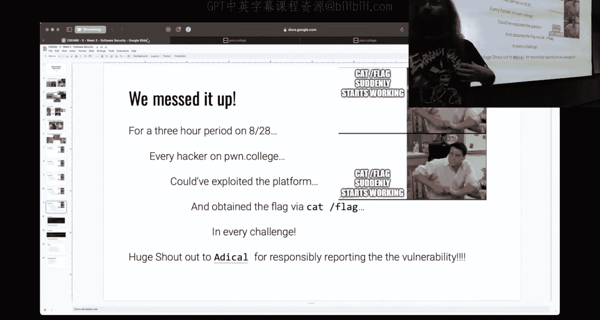

It's actually quite hard to get everything right。So we're going to take a look。

 this is the commit that happened last night that caused it's a little bit small。

 so the next slide here will make it a little bit bigger。It's actually two lines。

WaiThis is the commit that caused this to be possible。

 say don't have any idea what could have been the vulnerable pack here for those in the back this I'm going to tell you right now it's this first flying that is an issue this runs every time a challenge instance starts because 365 with CH model in your home directory and locking themselves out of doing do things I got a hand would have got but isn't that entire my mind with the plus no。

 it is in fact two different liness the plus special synt fine。The change owner。The CHR thing。

So what it says here is find a home hacker， so we're searching every file in the hackers directory。

 anything that is not owned by UID 1000 and GID 1000。

 which is the hacker user we're going to exact shown which will change the owner to UID 10001000。

 so anything that is in the challenge or the home directory will get changed to be owned by the hacker user if it is not owned by the hacker user now so that gives the flag file user ownership because that file is originally owned by Ru。

The flag file is located at group not in home happy， so no， so symbolically okay。

 somebody says symbolic links， that's's a good start that is part of it。

Where there's one other component to this， what do I have to do with a symbolic link to make this work link if I okay。

 but if I do that， it's going to have UID 1001000 so how do I I pass that because it would skip。

 if I just do it， I log in， I hit run。😡，And then I create a sibling。

 it's going to be owned by hacker you or the hacker user， how do I solve that？😡。

There we go So in practice mode we allow you to use pseudo or run his route that way you can use advanced debugging tools right you can play around so you can pseudo Lm dash S slash flag and then put that file in your home directory it would pass this check and the the will flow through the and allow and change the flag to be owned by hacker every time you start up every challenge Are we allowed to do that regularly。

Or just。You're allowed to， obviously if I'm telling you about it， I fixed it。Okay。

Why did you just seeHL recursive？So I didn't include the this wasn't my code for the the red。

 but I'm not trying to blame like I've done giant food bars as well the fix was to do exactly that right so for whatever reason the person who made this commit was like。

 hey yeah， this makes sense to do that the fix was yeah。

 let's not let's not use F to specifically call on assembling because that's what flows through if I use drone or a CO here and I just pass it or D R it will recursively flow from home hacker on down and behave as one would expect。

You said the symbol of。Would be root when you start a challenge。

 but what if you just get this flashback that is in the that this quote should not give you access to that。

So the issue is that if I create a rude home Sim link that is in the home hacker。

 then it passes this chat。And then changes yes， because the issue is not that we're churnning the siming by churnning the sim。

 we're actually churning the flag， it flows through。That's how Simlinks work。

Good good question like we haven't like in depth covered siblingims nor do I plan on it。

 but there's definitely something that we can use and we'll touch on a little bit here。

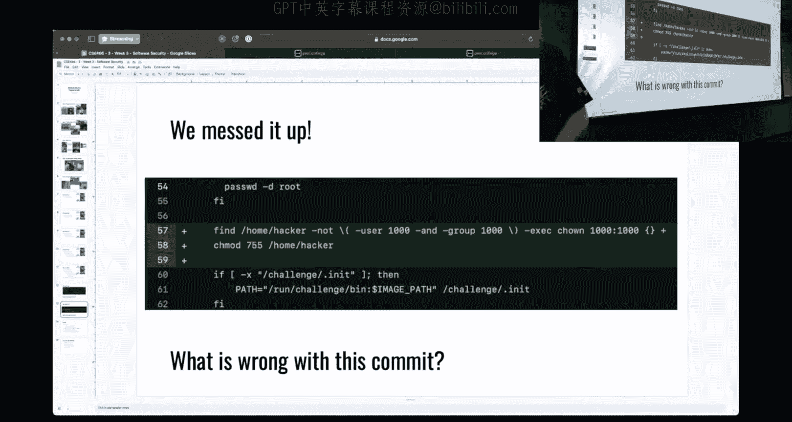

All right， logistics， I said repetitively， start early， this is hard。

 I took a quick look before I walked over here。There are currently 27 students who have not linked their account to Poe College so as far as I'm concerned you're not a student I hope that you intend on dropping the drop deadline I believe is 94 don't hold me to that but it's early next week I think it's Tuesday my Monday or Tuesday of next week so you do have the weekend to sort the out but that isn't a good sign 40 students have managed to link their account but they haven't solved a single challenge that could be because it's too hard that could be because you're just busy and you' want to start it on the weekend I don't manage your time I just wanted to point out this number so that you're kind of aware of where're I'm aware that you haven't started so if we reached this deadline and there's a whole bunch of people that decided to start last minute and're like。

 hey， I didn't have time。I told you start early。Okay I have claimed I'm going to upload some videos for you。

 it turns out during the day it's very easy to dossing right especially when I help people on the discord I do other things than run this course typically the time that I have to record videos and I do like dedicated focused tasks just really late at night。

 I uploaded the first video which is immediately relevant to the first half of this challenge material it's an applied kind of shell codinging tips and tricks video which I'm going to do some of the same things that are on there but I'm not going to spend a lot of time explaining what I'm doing check that out it's about 40 minutes long。

😡，Skip to whatever part you want it is applied I'm not explaining what shell code is I'm not explaining layoutup process memory I'm showing you different ways that you can generate shell code debug your shell code reason about what's going on hopefully that is a good reference for you I have two more again application focused videos I plan on' releasing hopefully later tonight one of them you see the slide deck which is going to be kind of quick tips for dealing with memory corruption calculating offsets using GDP etc。

😡，A question that kind of came up we weren't sure was when will I have office hours last week Thursday I said what do you think you wanted something early。

 I said I'll shoot for Friday at noon， I asked Tuesday's class they were kind of wish you wash he didn't care so Friday at noon so we're gonna go with Friday at noon I haven't submitted the request yet that's on me so I don't have a room to direct you to but Friday at noon tomorrow I will be streaming on Twitch for an hour to two hours depending upon how much questions and engagement we have and we will go from there。

All right， yes， question just a question。

Can you tell us like what time period that was because I want to make sure like I actually legitimately solved the challenges。

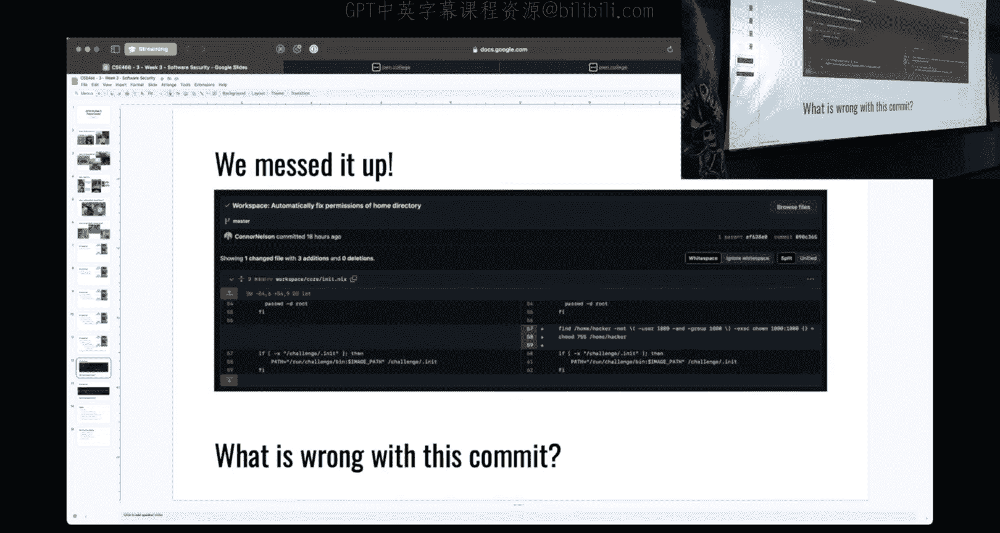

So did you create a I can， so the dojo itself is。All of the code that runs it is open source。

I can just say the exact。So so you can look at our commit history here。

And it's going to be from this to this。Which may or may not show the exact times。

20 hours ago to 17 hours ago， so I do do some math or check out the GitHub， the timestamps there。

I'm sure if you want to poll。What that was around seven or 8 yesterday？But if you got it， you got it。

 I appreciate it， that， hey， you want to actually learn the material that is the point。That's very。

 very true。

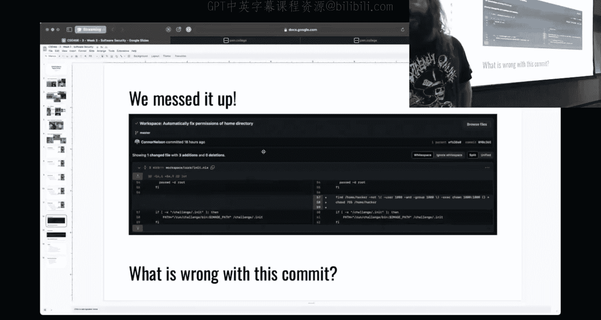

Okay， so I will hold office hours for a couple hours tomorrow。

 unfortunately it's going to just be streamed。Okay， so my plan for the remainder of our time。

 we've got about 45 minutes。I'm going to try and bang through the slides in 15 minutes and then have full hour for whatever it is we're demoing and kind of talking about this is my plan right before class somebody came me with a question。

 hey， why does your GDP look fancy right I'm using GDP and my GDP doesn't look like yours that's really easy to answer so I'm gonna to show you a couple GDP plugins one is called Jeff。

 the other is called Pone debug you can use whichever you like and how to set that up on the Dojo so you can have the exact same thing that I'm showing you。

😡，This next thing I want to show is just generating some shell code how to kind of rapidly iterate and how to think about some of these challenges because the earlier shell coding challenges here ask you to shell code under constraints。

 they say generate some shell code， here's some rule that can you must follow and then if you didn't follow it it breaks and depending upon what process you are using to generate your shell code。

 it may take three minutes， five minutes， you to make a change and then find the answer to does this solve my problem or if you're quick and smart about it。

 you can change change your assembly， hit En and in five， 10 seconds。

 know whether or not this was a good change， and so I'm going to try and show you that and will kind of iterate through some shell code pers。

I'm going to look at some optimization strategies， some things that we can do that will improve our shell code other than just writing the She code。

And then if I have time， I don't expect to， we'll run through some practical GDP usage because this is relevant and from what I've seen。

 people are not as familiar with GDP as I would like。😡。

So this is my plan does anyone have anything in particular they want me to touch on yes okay。

 so this might have been covering your video I want to ask like the。Working with the show code。

 how can I view like what the show code is doing to my memory when I'm using GDP？

It might be my memory to the staff actually。Okay so the question for Twitch I can definitely demo that when we're up here I just make sure to include it the question was how do I debug my shell code in memory to kind of analyze what is it doing to memory like in particular what is happening on the stack when my shell code is executing it's a good thing I can definitely include it yes the topic of optimization strategies like besides just trying to use different instructions how might you determine like that is to make the by that is literally well not uniqueness but this kind of bullet point is going to be everything that you can do other than changing your shell code。

All right that's why it's a separate bullet point。If nobody has anything else。

 I'm going to just kind of hop right to it。

So。First off， I should， probably。Let me know， is this big enough for people？

And let me double check twitchw。Over here。So at my phone， I apologize for Twitch users。

 I do not see the chat logs。Apparently， your own flashlight might be on。It is。

I don't think that's where going to Twitch cabinet。

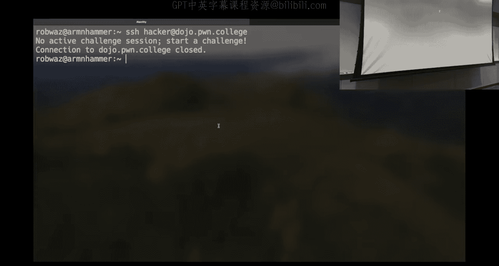

That'd be pretty cool if it was。IAnothervol。Thank you。あ。呃，Thank you。All right。

 so I'm going to go here and it doesn't matter what challenge I start because what I'm going to use as an example here is not going to be the actual challenge binary。

 I print a couple generic binaries that essentially do something very similar。

 it will be messing around with those because I can show you the source of that so you have a quick idea of what's going on。

Assuming the dojo is not on fire。That would be my luck。All right。

I didn't include the memes that were kind of dunking on the Dojo catching fire。

But they're totally valid as well。I don't know if。

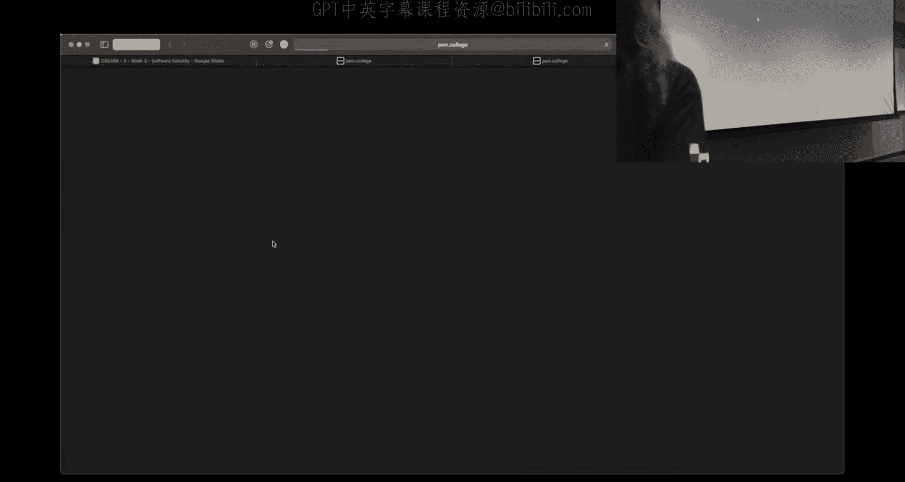

Right。蓝次。I'm going to try， there's all your memes。Yes。

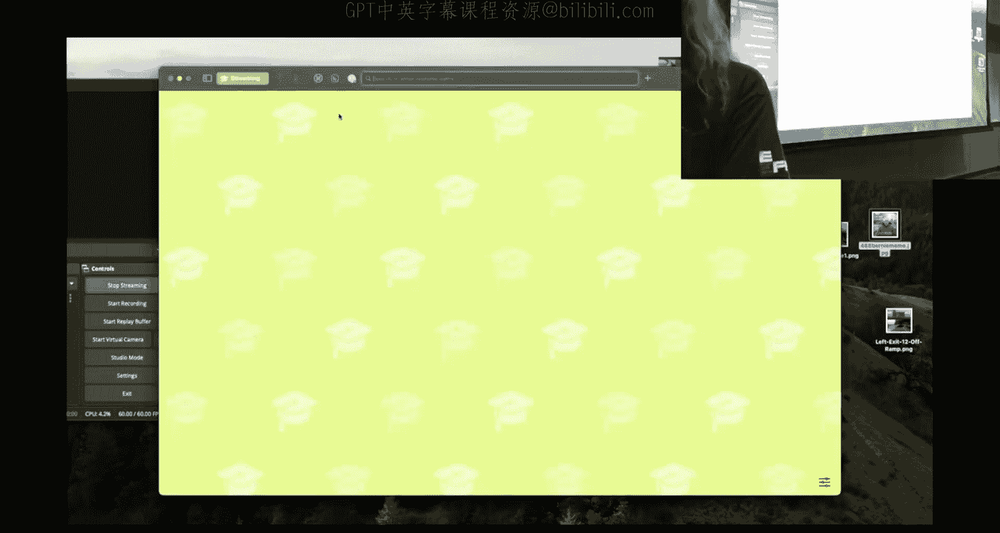

Can I blame Safari？Yes， we just blame Safari， I need to start using Firefox。

 I use this switching modes between like streaming and not streaming。And for whatever reason。

 Safari has this feature， but it doesn't work very well。Hirrefox probably has a plunge。

So in previous iterations I've used Firefox and so I'll probably just switch back to that one of the things that you'll notice right away here is I start the challenge is I didn't click on start。

 I click on practice。All right， the reason that you click on practice as was mentioned earlier is you get the ability to run pseudo。

 you can run as bru， no you can't get the real flag。

 but it's extremely useful for debugging your shell code or debugging anything that you're going to do in this course so unless you look at this and you're like I instantly know how to solve this。

My recommendation is do not click Start because you're going to write something。

 you're going to work on it， you're going to run into a problem and you're going to be like， oh。

 I need to be rude to analyze this。Start everything in practice mode until you have it figured out。

Okay， so now let's see。The internet works。It does。Okay。So。I have。Here a very simple binary。

 this is kind of the boilerplate textbook example of something that's called like a shell code runner。

 you don't necessarily need to know what it does， but I'll run through it real quick because this is the binary that I'm going to be using as a toy example。

😡，And this was very much so how the challenges work as well。

They just have a lot more output that gets displayed on your screen。

So I have a character bucketuffet here that's 256 bytes in size。

 you'll note that it's inside of main so this is a local variable， it will be on the stack。

I then call read on zero zero with standard in so i'm going to read from standard in those biketes are going to go to this buffer which I described up there I'm going to read 256 bytes there's no buffer overflow here this is just getting some bites onto the stack the。

😡，C syntax for function pointers is a bit of a mess。

 but what I'm doing there is I'm declaring a function pointer called funk。

 it points to a void function， I am then。😡，Casting buffer as a void。

Function and then setting funk to point to this buffer。

 this region of memory to treat it as if it were a function， and then I can it。😡。

You don't have to worry about all of these magic parentheses。

 you will never have to write this in this class， all right。

 but I feel it's worth at least explaining so that you have an idea of what we're doing。So I have。

Hopefully this is it， some challenge I can enter and we get illegal instruction。Why。

 because what I just typed there is not valid shell code。All right。

 now I'm going to immediately kind of default here to using Python and Pe tools。If you are like， hey。

 I'm doing something else and I like that， but I'm kind of Python curious。

 check out that4 minute video that I released late last night early this morning。

 depending on how you look at it。 it'll start on the most basic things you can do to generate shell code and get you up to using Python if you want to be effective in this course we're going to be writing a lot of Python you're gonna be using phoneone tools it's gonna to be the fastest way to succeed in the course。

 so using raw raw shell code isn't the best option right now so you can do that right now if you check out the video that I upload it I start off with well we could run As the asmbler to create an object file。

 we could then call Ld to link it so that we get an I then call object copy and pull out that raw shell and I guess my question I' the for us to use that because its easier to debug over tools it is not I don't know did I say that so in my very strong opinion。

 the answer is。It's not it is more straightforward in understanding how an Elf is created。

 where does shell code come from， how do you do this however there's a lot of steps involved there there's a lot of things you have to type there's a lot of things you can get wrong it takes a lot of time right it's definitely worth doing once or twice so that you understand the lower level actions that are occurring but once you are like hey。

 I understand these commands or the commands and what they do at least at a high level I'd stop doing that because it's a waste of your time。

😡。

All right， now I'm going to use i Python 3 which is an interactive Python interpreter。

 you do not need to use iPython3 anything that I write in this interpreter。

 I would recommend you write in a Python file write it to a disk name it do dot Pi is usually what I name my files but it's easier for me to demo using an interactive interpreter the reason that I recommend you store stuff in a file is in the event。

😡，That something breaks， the challenge goes away， you havet written the disk。

 if you're working in an interpreter like this， you have to worry about state from commands you've ran earlier if it quits。

 you may lose what you are working on you come back later it's not there if you already know how to use and kind of work in an interactive Python session。

 go for it， but it's not my suggestion。😡，O。Question， yes， so two things。

 one I recall at the beginning of the class invention that we're going be doing a lot of C in this class。

 is that true or you will be there there will be some C writing。

 for instance all of the binaries that we kind of deal with。

I'm pretty sure don't hold me to it well be written in C so the programs and challenges that we're deflugging and reasoning about or binaries that are written in C there's binaries actually look quite different depending upon the language that is's used to compile it so for instance a C++ binary would look very different than something written in C it is you need to understand the C programming language because when we get to the next topic which is reverse engineering we're going one of the tools we're going to use is something that's called a。

😡，Decompr， a decompr lifts assembly up to a C like syntax。

 and so that means if you don't know how C works， you're going to have a bad time looking at this C that isn't C。

But as far as your actual exploits， the vast majority of it will be in Python。

 I know the microarchitecture module will be in PRC that's just because of the nature of how it was。

 but you can use the language of your choice if you decide you want to do it in bash I know there's someone who's been going through Po College for several years now and they are committed to just solving everything in baash which is crazy to me。

 I love bash but not that much you are free to use the tool of your choice。

 this is my recommendation feel free to ignore it at your own peril。

So I am going to start with some boilerplate here， I'm going to say from Poone import star I'm importing Pe tools into the global namespace if you're a programmer。

 global imports are bad if you're hacking， this is great Okay。

 the next thing I'm going to do that it's some boilerplate is I'm going to say context arch equals AMD 64。

Did I mistype no okay A so A and D64 there's a couple other things that you can set here as well by default P tools is going to assume that you are writing working with 32 bit assembly or 32 bit binaries and that means that if I'm working with 64 bit stuff it's going to yell at us because it doesn't know what REX is RDI et cea city 64 bit registers don't exist so we need to inform it that we're dealing with a 64 bit context yes。

😡，What about when we're setting context like arch or like terminal。

 like what kind of where can I go to like see what possible like strings I could put for that Okay。

 the the question is so I have this like magic arch thing。 How do I know what I can put there？

So in an interpreter， you saw what I just did is I have something and I don't know what it is。

 I didn't append a question mark to the end of it， and that is going to bring up some help text that is assuming that the developer of whatever it is I'm expecting wrote some documentation for the Python conur is doing。

😡，If I am still confused I can double question mark and that is going to show me the source of the implementation details if things are working and lastly which is probably the default answer here is look at the actual documentation so Po tools is a pretty big project it has been around for a long time we can for instance go to the poemone tools docs search for context and we're going to find it somewhere here。

 Poonelib context setting runtime variables there's actually a ton of different things that you can set I'm only going to talk about the ones that are immediately relevant to you。

 feel free to read and do whatever you'd like Yes64 over X86 yes so you can I believe you can use X86 is a string X80 so I386 is the 32 bit default here I think you can specify X8664 it does the same thing I will always use AMD64。

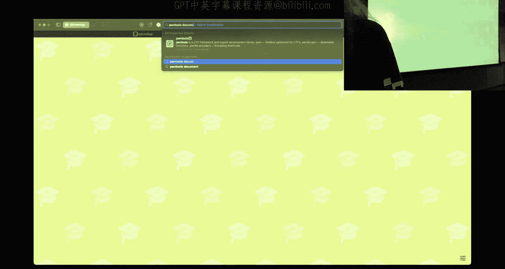

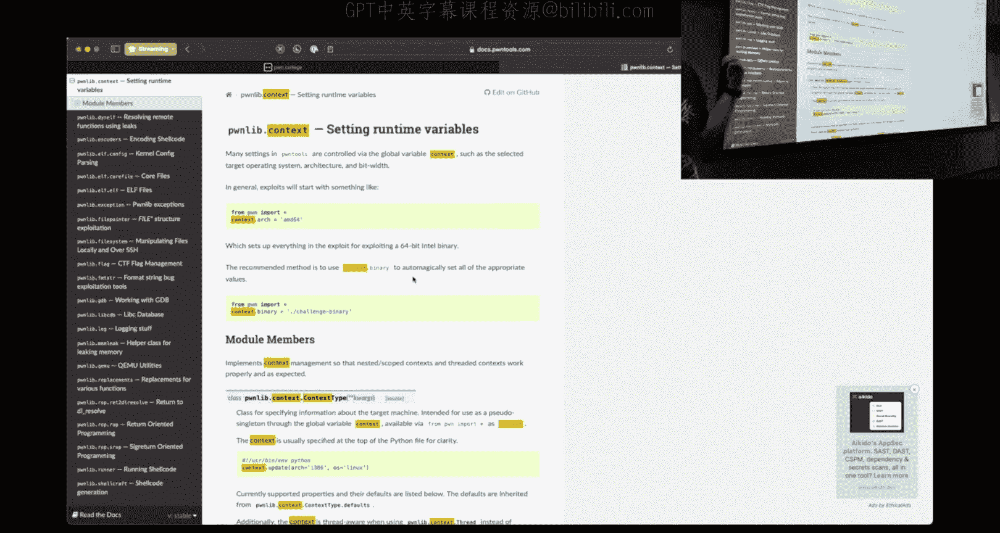

In the back， yeah， do you have one question if you scroll up to the very first one that you did？

The very first one。This is the first thing that I typed， I'm not scrolling up。

 but I just went through to history。How do you end up with with them not creating a separate input box Okay。

 so the question was。If I can type， oh no， bad things have happened on the Internet。 All right。

 I start off with this one line。 How am I getting this kind of multi line set in a default configuration by Python。

 the answer is control oh。Every time I hit control， oh， it's going to add a line for me。

That is configurable。 if you like Vkys， that's just not what I have going on here right now。

 This is the default。 So back to where we were from phone import star we set our context to let。

Our architecture in the context to let clonee tools know that I'm working with 64 bit architecture Now the first thing that is immediately relevant。

Here。The Dojo is screaming。Is this ASM function？So some people and mentioned a little bit ago， hey。

 I'm using kind of this manual process on the terminal to assemble my object file and then link it and then yank out and ya my shell code and is using raw shell code the right way the answer is using raw shell code is the right way there's just smarter ways of getting raws shell code。

So if I in this little box here。Move RAX 1337。And then I print。My shell code。

 what I give here is a bite sh。This is the bytes that are the shell code for this instruction。

That was super fast instead of having to run multiple commands， even if you write a shell script。

 I'm pretty sure this is faster question， why don't you steal with your heads？

So you could do a hex dumpump of a file but again， now I have to call Hex dumpump if you watch the video that I uploaded earlier this morning。

 I totally get that you might not have I actually do that where I dump it to a file and I use Hex dumpump to look at the hex decimal values you can do that I'm trying to show the optimal fastest path for you to get cruising。

All right， there are other ways to do things， they're all valid， use what makes sense for you。

 but if you want to spend time thinking about bys，This is the fastest way to do it if you want to spend time typing things in the terminal and doing hex dumpump。

 you can do that， I don't know that that's the most efficient use of time。So that okay。

 that's a bite train that's great， but this is kind of kind of ugly and it doesn't tell me a lot right and just to kind of show I could move RDI and we'll give it beef。

Beef， right now we got something longer and the problem now is I don't know what bites correspond to what instruction。

 you get this thing that says， hey man don't don't have any H ys and up that there's an H here。

 there's H over there why do I have these Hs right and you may be like okay。

 I don't know what to change you just start changing stuff that's a waste of time we can do better。

Pone Tool exposes a function called DIS ASM， a shorthand for disassemble。

If we print this disassemble， what we see here now is a pretty representation of our shell code bytes。

 and we see these are the bytes that correspond to this instruction。

 these are the bytes that correspond to this instruction。😡，For those that are unaware。

 I'm just going to save you a little bit of headache48 is an H mightte。

 we chose H not because we don't like the letter H， but because it has a semantic meaning。

It turns out when they changed X86 from being 32 bit to 64 bit。

 what of the implementation details is a lot of 64 bit instructions are equivalent to a 32 bit instruction。

 they just throw this 48 in front of it and so if I were knowing that。

 if I were to change both of these from RAX。And RDI to EAX， EdiI。Look， it's gone。Now。

 let's say I didn't know that I can still pretty quickly here be like， what about push？Pop， well。

 let's push a number。Let's push 61， let's pop into RAX。All right， cool。

 was that pretty quick for me to like change what I'm working on and then immediately get results that are nice and easy to passse the answer is yes。

Question is push a 64 bit operation the question is is push a 64 bit operation that is a complicated question the answer is sometimes4 and yes。

 so a great reference if you want to know。

Uh，Kind of get an idea of the details that this u for those that didn't see。

There's this very nice website， Felix Cloudter if you just type Felix X86 and then the name of an instruction。

 it'll be the top hit on Google no relation but this is amazing documentation on the implementation details of individual assemblies instructions the question is is it 64 bit or not so push can be any one of these encodings depending upon the size and type of thing that is being pushed so just to interpret this real quick this is pushing a register or memory address that is 16 bits so two bytes in 64 bit mode that is valid Now in 32 bit mode。

Pushing a 32 bit register or 32 bys or 32 bits of memory is valid in 64 bit mode which is what we're going to be doing in this course that is not valid you cannot just push four bytes directly to the stack what does。

I'm going to go， I'm sure there's a code on here， not equivalent， not equal， I don't know。

 it's a bad thing。All right。So it's a fair question somewhere on here they do have on the page。

 there's an encoding table here， one thing that is interesting which is what I just did here。

 I pushed a literal， I pushed zero x61， how many bitetes is that？1。😡。

It turns out two hexadecial characters can count any value from zero to 255 that is what can be represented as a single byte so two hexadeimal characters is one byte very useful information to have so I'm pushing a immediate8 it is a literal number that is eight bits and or one byte that is valid in 64 bit mode and it will be 6a followed by the immediate value we take a quick look over here at my Python what did we see that this was encoded to 6a and then the immediate value that I pushed。

😡，Now you don't have to go here and parse all of these tables and I linked another reference that is this like infinitely long table of every encoding of everything you're welcome to stare at these tables they are useful when you have a question about what is valid or not I would encourage experimentation over reading documentationation in this case it's much easier when I have something set up here that I can just change this well what happens if this becomes pop EAX oh pop EAX is invalid right I said I couldn't push a 32 bit。

😡。

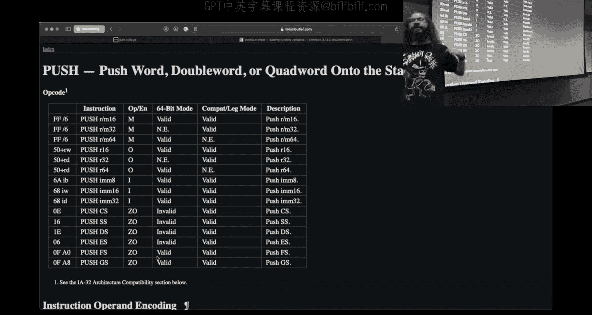

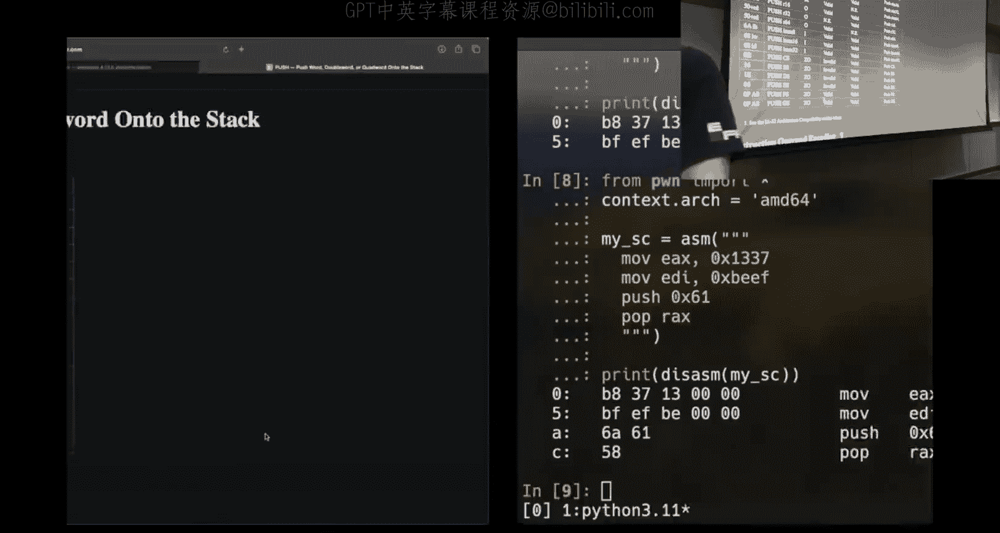

Maybe I could pop but no， it turns out I can't right Pe tools blew up here and what we see。

 this is a message from those same tools that you'd be calling the asmbler maild at。

And said this is a mismatched type for a pop instruction。😡，To me。

 it's a lot easier to try stuff and see if it explodes as long as I can make small changes。

 run it and take a look and see the effect。Now， one of the interesting things。

 which I'm not going to go into great detail on is。What am I popping here？

How many bytes are being popped off the stack？I'm popping into REX。😡，How many bytes is RAX？

It's eight bites。Well， that's a 64 bit instruction， does this have a48 in it？No， it's kind of nifty。

 so the general pattern is。Instructions will be prefixed with that H。😡。

Not all instructions follow that semantic or that rule。

 there are instructions that are extremely common pushing and popping to the staff， for instance。

 as something that happens all the time in Intel's infinite wisdom here。

 although I think it was designed by AED but in the designer of the instruction that infinite wisdom。

 things that happen a lot tend to be shorter in length。😡，Was that a question or no， okay， cool。

So why else should you use Python？Well， I have， I said， this bite string。

I can interact with this programmatically。 I can sanity check。嗯。

I can sanity check myself and not worry about did I spot it correctly so now I have this check is there this H Oh it's bad。

 bad， bad now I know I need to fix it。And you can iterate on this as somebody who's studied computer science to make the language become the tool for you。

 and that is strongly my suggestion， not that you have to literally write what I wrote。

 but whatever makes sense to you for programmatic logic to problem solve， use it。😡，We're programmers。

 write programs。Okay， so that is one thing and I go into more detail about some of the options and things you can do here in that 40 minute video I'm just going to touch on highlights and I'm just saying I'm just make sure pop takes up four bys right so pop will take off of the stackt。

The number of bytes that the register specified receives so here I'm specifying P RAX RAX is an eight byte register that is going to pop8 bytes because I'm going to fill that register now I said that you can't push and pop 3032 bit I cannot push and pop four bytes at a time if I go and check out Felix's great documentation here what we do see is that you can push 16 bits in the 64 bit mode that is valid so I can push two bytes at a time or I can push8 bytes at a time。

Don't ask me why those are the rules。

Okay。So one of the things that was asked was how do I debug my assembly in GDP and get an idea of what's going on in memory here？

Now you could and this would be a totally reasonable thing to kind of initially do and it's totally valid and I show how to do this in the 40 minute video pass your shell code into the challenge binary。

 debug the challenge binary， you can do that but if we're just exploring and reasoning about the actions of our shell code and we don't really care about being inside of the challenge we're just trying to make sure that we're doing what we think we want to do。

😡，We can say GDP debug assembly。I have that exact same thing。It's probably going to yell at me。

 but what just happened here， boom， we dropped into a GDP session。

That starts my right at my Sheco now this happened to pop up because I'm in TX TMX is amazing you don't have to use it if you want to use this same type of functionality and not be in the terminal。

 you can use the Dojos desktop interface and that floating window that is your terminal it'll pop up a second one with GDP。

Qu。What did you just type it？What are the great things？

About this class is that we do stream and record things， this does say GDPb。 debug_ assembly。

I am going to try and move and cover as much helpful information as I can。

 I understand that I may be moving at a rapid pace。

 the idea is I would rather throw information at you that you can review than spend a lot of time repeating information that I've already stated。

 although technically this is included in that video。So this is something that was useful。Now。

 the other thing that you may want to do。Is pass？I'm going to make make my shell code still be my shell code is that ASM thing Well what if I want to get that shell code into a process。

 I want to get it into the challenge。and you're like， oh I got to cat it。

 I got to be on the terminal right I got to do it that way no it turns out this problem was solved here in Python as well right。

 smarter， smarter minds have prevailed。And we can say P equals process。Challenge I have to。

Tat myself here。 Okay， what do I have Oh，8 out because I'm using my。My test binary here。

What this is going to do is start up that challenge。

 I can now programmatically interact with standard in and standard out。😡。

To give you an idea of what that means， I can say P interactive。Okay。

 I got my programmatic output here。Of my analysis， which is fine， and it says。

 I'm switching to interactive mode。😡，If we take a quick look at。The code that I had here。

 what you see is we call read right now this is waiting for input， the program is blocked on read。

If I type in nonsense， we get EOF， and we mash enter again。

 we see we got that same illegal instruction that I started this demo with。

 I'm doing the exact same things if I ran it on the terminal。

 but now we are doing this programmatically so I can again rapidly iterate。

But I don't want to type AbbB， whatever， I don't want to type the shell code bytes into this thing。

 I want to just go in there from the get go。P dot send。Michel good。

I am now generating the shell code， building it by just smashing Edger。

 sending it into the challenge， running it， and we see the challenge end。

We happen to Seg fault it's actually perfectly reasonable to Seg fault think about what your shell code does here right if we start executing here at move EAX。

After that instructions ran， what happens to the instruction pointer？It marches forward， right。

 it just goes to the next instruction。Well， what happens when I reach P RAX。

 what does the instruction pointer do？Saamme thing， it just marches to the next location in memory。

Right I didn't write shell code that happily cleans up right I didn't call exit I didn't do anything so the instruction pointer is just going mindlessly go to whatever is next in memory and be like hey man we're going to try and execute this odds are quite high it will not be a valid instruction that's totally fine if I'm at Ha and I'm just trying to execute some assembly instructions to accomplish my goal do I care if this program exits cleanly no。

Did it get me the flag and then die， great， it did its job。

If you say it can give me the flagged insect fault， yes， so hypothetically here。

 imagine that I had shell code here that looked something like。Spoiler。

This isn't as useful as you think it is， don't rely on it。Okay， I have to print。

This is more more po tools magic so Poe toolss also has a giant library of like common shell codinging things you may want to do I'm typing shell craft cat two flag there is a cat without the two are there different ways of doing exactly what we started off saying open read right？

Okay， that is what shell code is that would do that imagine I had this shell code。

Running inside that target binary。It's going to call open， it's going to open the flag。

 it's going to read the flag onto the stack， it's going to call right。

 it's going to write it to standard out and that is what happens right here。

Then the instruction pointer continues at its ag faults。What happened before it blew up？

It gave me the flag。It put it to the screen。Now calling Open Read right is not the optimal path。

 there was a great meme that mentioned something called CH modD。

 I would recommend you check that out if you're not familiar。In CHM will workplace place。Writings。So。

You could write this yourself。All right， that is She code and I will ultimately call C mod on flag with these permissions。

 the O， the zero lowercase O， numerically that means I'm representing anocal number。

 very similar to how when we talk about hexadecimal numbers， I'm starting with zero x。

It turns out CHmar uses opt to numbers and that's why I'm using that 777 is I want everything to be open readr for the owner。

 open readr for the group， open readrite for everyone else。

 whatever if this were to run successfully as group。

 it would make it so anyone could cat the flag it's kind of similar to what our bug was here on the infrastructure。

😡，There's a change owner instead of change modifications around this will it work？

If you run this will it work， so let's consider the very first challenge。

what are the requirements on the very first challenge？That is not true。

stuff on the first line shelling flag but your input is filtered okay， and what is this filter？弱いで。

That's that's not a good sign if you're in this class the vote it says no H bytes mean you said earlier H bytes were X48 I just took what Shecraft gave me and I said all right cool let's take a look at it let's apply that same thing I just showed you earlier let's print it out how many H bytes do I have there's one here there's one here there's one here there's one here If you were to just take that and bring that into She code level4 which is the first or first challenge assigned to this course this would not work。

However， this can give you inspiration or a starting point。

You can use whatever youd like and when it doesn't work， I will laugh。

So one thing that you'll notice here is these instructions up here this looks like a little bit of weird nonsense going on It's very common when you're writing shell code to want to obscure what you're doing so if we' were to take a look at what is happening here we are moving 1010 I think it's zero a one actually but repeated ones into a register we're pushing that to the stack we are moving some constant I'm going give it away here this right here is slash flag all right it's in reverse because it's a number we have to think about how ending and this applies here we're then going to XO the value on the stack with that constant this is a way of obscuring the value slash flag and then revealing it in memory because hypothetically there could be a program that is stopping you from passing in these characters and so the default kind of assumption here of shell craft is hey let's try and be a little bit sneaky but it doesn't have a they don't give me。

Ts。Useful to a degree， yes， and scenario aware of a program where you can't necessarily use the word like flag in the challenges don't believe I don't believe so。

😡，At least not in what's assigned to you right now。

 but then you wouldn't even to be able to use like a sim link to make a point to something else because then you would still need through。

So you bring up something interesting and I'm going to continue it off of worry I might be。

 so it's doing a bunch of nonsense here that doesn't apply to you could I just remove that？Yeah。

 I could use draw the draw from this for inspiration and be like I don't care about Xoing stuff。

 let's not have it， let's do something simpler to get flag on the stack now you mentioned hey there's simlink right？

As far as the like common strategies， tips and tricks that you can employ to make your life easier。

 how many bytes is slashfl？F。So it is five interesting fun fact depending upon what exactly you're doing with it。

 this is a C string so you do need to have a terminating no bite in a lot of cases you may end up with that by default。

 but I would argue six。Because if that bite after the G is not an null byte。

 it will not be pared as flagged。So that's six bytes that I have to include in my shell code in some way to get in there。

what if instead I draw inspiration from the great great mistake of？

The evening I'm going to type LN dash S， this is hidden for Twitch because I know my face is over it LN S slash flag a。

 this is going to create a symbolic link to the flag file and it's going to be named A。

How does that help me？你需不来一问。Now I don't have to have those six bites。I only have to have one bite。😡。

That byl technically too，s because I have to have the terminated Nobyte， that's on me。

 but we could reference the flag file now with just a。没と困难。

If you're not familiar with how Simlink work， because I saw a reaction there， let me see what I got。

Okay， so I'm over here on the left hand side。I am going to echo Ho world。

Into my file and if I cat my file of what we see is hellello world， all right。

 that's not not a surprise Now I'm going to do that same thing Ln dash S the syntax here dash S is for symbolic anytime you're creating a link nine times out of 10 what you want is symbolic so just trust it。

I'm going to point this to my file that is the destination that I want my symbolic link to point to I'm going to name my symbolic link B because A's already taken What do you think will happen if I can't B？

Yes， hell little world， it's going to say hello world。And that is in fact。

 what we get symbolic links， we can think of them， and they're shown as if we were to run LSLL on a symbolic link。

 what we see in the representation is this is the name and it points to。My file。

What would be the heck you would reference for that in per code so the question is what is the hex I would include in my assembly code if I wanted to reference this symbolic link？

Well if we understand how paths work， for instance relative paths and absolute paths right when I did slash Fl I was specifying an absolute path with slash flag in this case。

 my symbolic link is in my working directory right it's in the same directory that I'm writing my code。

😡，So I could reference that we'll do that。Just in Python， I'm going to say with open B。

 I'm going to read it as F and I'm going to print F read。

The path to access that symbolic link since it's in my working directory。

 my current working directory is literally just B I can open B and what's happening is I'm actually flowing through and opening the file that I'm pointing to and so I get access to that content Yes some is like。

😡，So the question is are simlinks used for malicious purposes the answer is they certainly can be we will abuse s to a large degree not only in this module as a way of having a shorter。

😡，Path right which is great when you're trying to write shorter and shorter show code。

 let's not have six bytes of my six byte shell code be flag right to give you a clue on what the last challenge is。

 but we can also abuse siblings in other contexts， and so Slinks will be as a tool that we will reoccurringly use to create scenarios that were not necessarily known by the program or intended by the program。

Was there a handover here， no， yes， one in the back？So。

So the Chinese order are exciting the vote quarter we cannot make。T making our。We are China。

AllCould you repeat that， I apologize。没听睡没。Okay， so the question if I understand it correctly is hey。

 the thing that I want to actually access is at root， it's root flag right。

 how does assemblyselink help me there？Okay， so I am in home hacker examples right now。

 the flag is at slash flag。I'm going to create a Slink， LNS， I'm going to specify slash Fl。

 and I'm going to name this C。If we LSL on C， is in my current working directory。When I access C。

 it is going to truly open up flag。Now slinks do not solve this permissions problem because the flag is owned by root。

 I have to be root to get to it， so the fact that I made as the hacker user a s two slash flag。

 this does not help me right it doesn't let me suddenly read it。

 but it gives me a shorter name to refer to that file。😡。

So as any assembly I can reference thex in the hex for C and that will point flag correctect the statement for Twitch is so after I've done this。

 why is this useful in my shell code because when I am writing my shell code instead of trying to open up slash flag。

 I can reference it as just the bitete that is C？Now if you want to know what is the B for C man Page are your friend。

 any opportunity I have to tell someone to read a man page I will if we type man ASCI。

 this is going to show us an ASCI table and this shows us the representation of every character in ASCI and see。

 we're using a lowercase C， so I got to go down a little bit。And I believe it's。F， three。

Did I go too far？Oh，63， okay， so hex 63 would be the numerical representation or the number that I want to push to be the character C。

Now。You'll notice a theme here that I show you some giant table and then I say， hey， look。

 you don't have to， it's great to know it's there， there is a better way。

Poone tools is your friend consistent theme all right。

 Po To has a number of functions that refer to the concept of packing and unpacking this is the conversion of like a representable human interpretation of the bytes to a numerical representation a lot of the time you want to deal with numerical representations。

There is a P64 that is if I want to pack 64 bits or 8 bytes。

 there is a P32 that's going to give me four bytes。

 there is a P16 any takers on how many bytes that's going to pack two There's also a P8 I'm going to use PA there's also a generic pack All right I could run through amazing functions all day long。

 but I don't think that's what you're here for。If I pack。Zero6，1， I get the character a if I pack。

Hex6 three， I get the character C， Similarlyly， there is a U8。

Which is going to do the inverse operation now why does it show 99？

imalRight it's base 10 that's a decimal interpretation What if I want to see what this is in Hax Python is your friend we call hackx on the decimal number it's going to display the hexade decimal so we went one way we went back this is a very useful way of programmatically specifying that I want。

😡，To include something and make it obvious when I'm looking at my script what I'm doing。

 who here knows what an F string is。All right， we got few and F string in Python is a string where you can substitute variables。

 It turns out the secret to making an F string is you as an N kind of implies。

 start the string with an F。What does this let me do？Now I can define variables in this string。

 for instance， maybe I want to。😡，What do I want to do， let's unpack， so I'm going to U8。

The character C。Andside here。And I'm running out of time。So I'm going to spoil another thing here。

Just like how I had GDP debug assembly where I was running the assembly in isolation。

 I can use GDP debug on a binary。And still programmatically send that shall code in。

One of the tricks that I mentioned。As you can throw in in3 at the beginning of your shell code。

 in3 will result in a Sig trap signal if you are inside of a debugger and in3 is executed。

 a SIig trap will occur， GDP will catch it and treat it as a break point。

Right now I am not at my break point when I use phone tools to perform this action。

 it is going to by default start at underscore start this is like the beginning of everything in the life life cycle of this binary I don't care about this for what we're doing today so I'm just going to continue through you'll notice that I did not set。

There's no break points， I didn't said anything， all I did is I threw that in three in there。

And I mistype something， yes， it is very important that you define P if you're going to interact with it。

So I use P equals GDPb debug， it's the same syntax as if I were saying p equals process。

 I'm just saying now I want to start it up and simultaneously debug it， so now we're at that start。

 I hit C， where did I end up？You can't see if I'm actually right above or right after that in three instruction。

 I immediately very quickly got to my shell code this isn't my shell code running in isolation。

 this is my shell code。Inside。The challenge binary， we see up here。

 this is Home hacker examples8 do out， I am running the challenge or not the challenge binary。

 but my example binary and stepping through the shell code that is running inside it。With that。

 I've got a couple minutes and I kind of lied， and I said the first thing I was going to explain is the magic of my G session。

So sometimes we get a little off the rails。Yeah， you have to redirect me if we get there but hopefully it's been good stuff so how do we deal with Jeff and get the pretty looking GDP interface Well it turns out if you create a file named GDP a ni note the dot the dot is important and we create this file in our home directory in slash home slash hacker we could also get the squiggly tillday they mean the same thing you're going to see mine。

Now I have a lot of things in here。The thing that is immediately relevant to。

Why does my stuff look pretty is this line right here that says source opt or slash opt slash Jeff slash Jeff dot pi。

The other lines， this first one I'd highly recommend。

If you're unaware there's two versions of syntax for're looking at at 8664。

 there is only one correct syntax and is the only syntax we will use in this course and that is going to be the Intel syntax by specifying this line here at the top in my dot GDP int。

 GDP will show me Intel syntax and I never have to look at that ugly thing they refer to as AT&T syntax。

😡，These other things you're welcome to copy， but if you don't know what they do。

 I'd recommend that you don't。If I comment that out， you'll see。I have to be in my example directory。

 GDP8 do out。 I run， okay， now I don't get any of this pretty。

 And if this is what you've been working in that I feel yeah， I can do it。

 but it's a lot nicer to have。Have a plugin that is going。

To just show me a bunch of stuff I'm interested in already， there was a hand over here that。

Okay they over that my personal preference and the kind of preference of the general Pone College instructors。

 we've agreed to kind of standardize on Jeff that way you is consistent across courses and you can use the same tool across these classes where we kind of rely on this tooling if you want to use P debug that's perfectly fine much like if you ask me how to use VS code and I go I don't even know how to open a terminal or edit a file if you ask you how to do something in Pone debug you're very likely going to get a very similar response there may be an instance later in this course where I switch to Pone debug for technical reasons as far as different functionality that is offered but whenever possible I will be using Jeff you're welcome to use whatever you like。

Question could you theAll right， so the question was。

 can I just keep the GDP in it on the screen with that I am out of time？

I'll leave this up here you are welcome to ask me questions as long as nobody kicks me out I'm sorry Twitch if you are washing and had questions。

 the Twitch app on my phone just doesn't like your chat I will try and fix that next time。And wait。

 wait， wait。