# ASU《计算机系统安全｜ASU CSE466 Computer Systems Security 2024》中英字幕deepseek p04 -05-Program Security - CSE466 - Robert Office Hours - 2024.08.30.zh_en -BV1spCGYZE9D_p4-

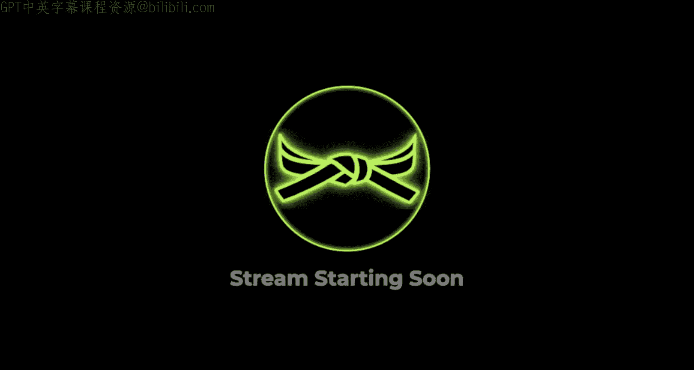

Yeah。All right， all right， all right all。line line。D。How about now？Now， OBS has a mind of its own。

 fixed， gone， great， good， awesome。Thank you very much for that。

So I have to reconfigure OBS every time that I stream because it forgets what a camera is。

 it forgets what a microphone is， you've probably seen me do it in class。

But my voice is a little bit， I can feel it in my throat because I try and project in class。

 I'm not actually trying to yell at people， although I could see how people could think that。

And it was worse last night， so I didn't record anything。

So for anyone that is just catch catching this stream for like the first time this is a Poone College。

 these streams are a kind of series of lectures and discussions on how to hack if you're interested in learning this stuff you can go to Poone do College create an account and kind of follow along it's free and open to anyone that just wants to learn this particular stream follows a university course and so if I go up to Dojo's here and scroll down。

 we are talking about CSE 466 for the fall 2024 semester。

The topic that we are currently discussing is program security。Whi is kind of a catch all here。

 kind of a review for things that were described in an earlier course。

 so we're going to kind of take a look at shell coding and memory corruption。With that。

 the word way that I kind of do office hours is quite open endeded。

 feel free to throw questions over in the T chat， at least when I'm streaming from my home office here。

 I can certainly see Twitch chat so we don't have any problems because I have multiple monitors unlike when I'm on campus right now I see just the audio comment so somebody does have something in particular that they wanted me to go down and explore I'm more than happy to do so while I'm waiting for the Twitch delay there。

 the one thing that I would like to do。

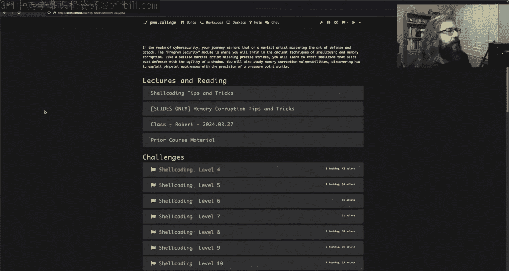

That I intended on doing in class， we just didn't。I have a moodlight， believe it or not。

 it's actually quite dark in the ro cave。One thing that I wanted to do that I didn't really。

Get time to because we didn't end up there。Was I wanted to use the tools that we were taking a look at。

In class and just talk about writing assembly in general， well after class somebody asked me about。

There's one of the challenges， I'm not sure which one here。

So five says you can't use the Cis call instruction， you can't use int or in8。

 which would be the 32 bit version of how Ciscas are performed。

 so how do we perform a cis call without having a cis call in our She code？

This one has it looks like a similar type of track。This one closes all file descriptors。One of these。

Says that you can have to use unique bytes。Okay， here it is level 12 write and execute She code to read the flag。

 but every byte in your input must be unique。And that's。That that's。A little bit harder to do。

 I showed some tools to iterate on it。

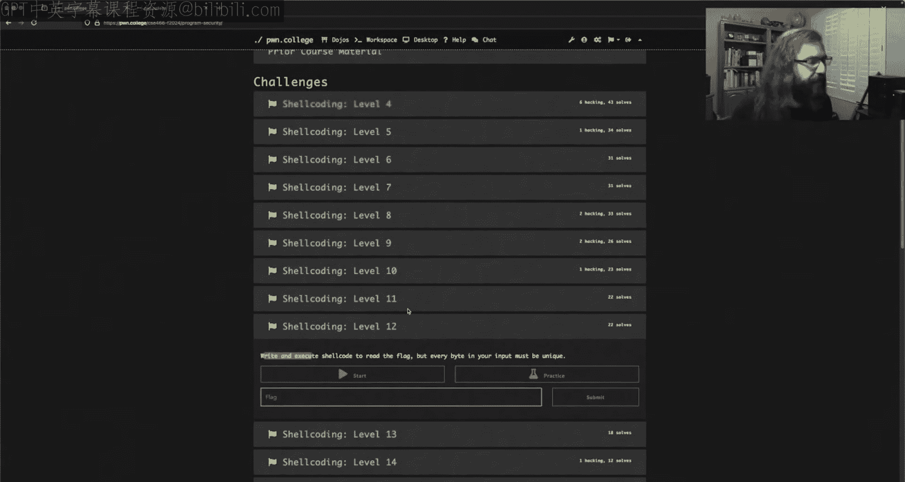

But。How do we think about that Well we use the tools I do see the the comment here in Twitch chat。

That this says it's not specific， but hey， can we talk about canaries memory errors， yeah。

 I'm more than happy to spend some time there since I haven't。Gotten there。

 at least in what I'm discussing。But I will touch on that at some point in the office hours here and then despite the voice。

 this is better than it was last night， all I'll record and get something up this afternoon like right after this stream。

So when we' talking about like unique bites。We're going to do something similar here。

 we're going to say shell code equals ASM。Keep going here and it will print the disassembly of the shell code。

And we let's。Let's actually do something here。Let's do。What do we want to call？嗯嗯。Let's call open。

It's called yeah we'll call open。So if I want to call open。a man to open。

 this is the ciscal that I want these are up here at the top the。Arguments that I have to set。

 but the main page will not tell me what is theisscal number here。

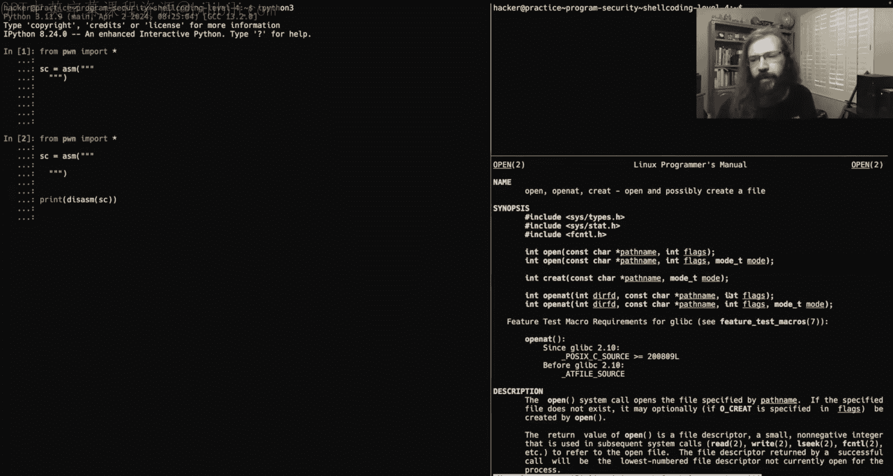

So to get that， we ask。Ryan A Chapman。

We look at his amazing cis call table。Open RAX needs to be two。

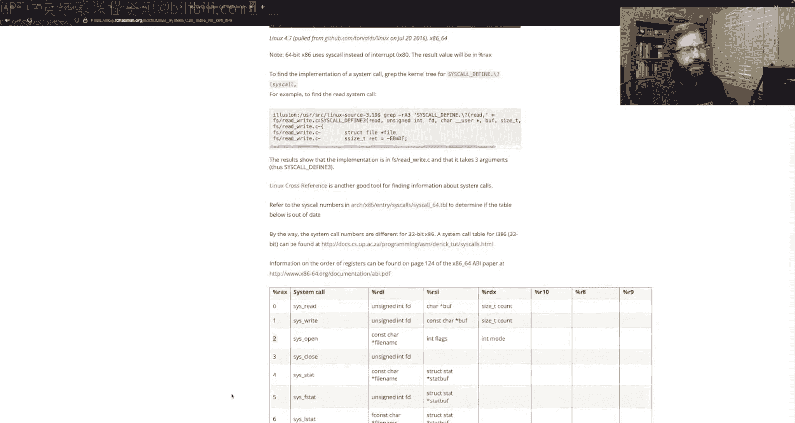

So let's just quickly stub this out。One of the things that was asked on the Discord is how do I do comments？

As long as you terminate your assembly here， you can put like a C like syntax or slash slash。

And then have a comment。So if that helps you as you're kind of writing it out to understand what you're doing。

 you can certainly do that。If。It is the beginning of a line you don't need to have that terminating semicolon。

 so our first thing that we're going to do here is call open， right？This is our goal。

So we're going to move RAX to， then we need to start setting up these these registers and these arguments for open the first thing that we need here is a pointer to the string I'm going to put something on my。

Let's。Echo secret stuff into。And Ill call it sum file。And so the full path for that is。At home。

Packcker。Some file， right？Now I need to get these bytes。

Somehow pointed to now in class I showed that we could as we had something short。

 we could just push some raw hacks right we could push it to the stack and that can get it into into memory but here I have a path that's quite long Now there's more than one way to just get bites into the staff and I'm going to try and use different techniques at different times just so you can see different ways of doing this one of the things that people often kind of run into in this class is there's more than one way to do things and honestly I don't mind which one you use。

If somebody starts down one path， I'll try and。Continue along that path。

But there's many ways to get it done， if it does get done， you're doing it right。

One of the questions on the Discord last night that I responded to was about having a data section and there is no data section when we were talking about Shell code。

 but we can do something very similar here。at the end of my。Ended my shell code。

I'm going to like pretend that I have a data section。

 I'm going to treat this part of my shell code as if it was a data structure and so I'm going to make a label I'm going to call it path and we are going。

😡，To have the dot string is a preassemb believe pre compileilr。

 I think it's an assembly directive is the correct term。

But there there's a number of kind of magic keywords that you can include in your show code and at these tell you or tell the asmbler what it is you're trying to do so I'm trying to just declare a string here and I want it to be home hacker。

 some file。Uh， recall that this is a label， a label means something to us when we're looking at the assembly。

 but the way that it actually gets。Rrapped up after the asmbler parses it is it just turns into some relative offset。

What I really want to do is I'm try and get this path name into open。I'm going to use LEA。

 which is for load effective address。RDI， that I'm going to say rip plus。Not strain， plus the label。

So this。Half right here is referring to this label。We'll see what this looks like in。Yeah。

It be running assembly as far as the bytes。Somebody in Pche here says you could also consider using push and pop or push and pop in level four and that that works so I could get a string as well into the binary using push and pop but the thing to keep in mind with push and P is I can only push at max eight bytes at a time。

And in this instance here， the path that I am pushing is more than eight bytes。

 so I would have to push multiple times and I would have to deal with the subprom of what in what order do I push these Yeah I twitches there refine to something else in the discussion that's fine I'm going to try and you know sync things in here and relate them back and forth pushing pushing is is。

100% of valid strategy for level four。And I think is what I would encourage doing like a push pop。

All right， so we have that， the next thing that I need to do is I need to set the flags and mode。

Now we don't necessarily know what this this flags thing is。

 I'm over here in a man page if I hit slash， we see it down here in the bottom left of this pane。

I can search so I'm going to search for flags and then I can hit N I just looking for where in this documentation does it tell me what flags are right we have to make sense of this。

And right here up at the top， it says that the flags。

Flas must include one of the following access modes O read only O write only or O read write you probably dealt with this in 365 like I said this。

Largely should be kind of a bit of a review。If it fell out over the summer， we can get there。

So how do I find out what Oreed， only Oreed write what these things are because I can't use these literal things in my assembly。

They only exist in the C context。I can again use P Jus， so from Po importm star。

Poone tool is exposed to something called Cons。It's just kind of this magic global and I can say confidence do't。

And then start typing out the name of what I'm interested in in this case， Oreid only。

 and if I just hit that we get constants overread only has a value of zero if I was interested in which isn't particularly interesting。

Um like right only has a value of one，'s it's pretty common for these constants to follow that pattern of zero。

1， u， two， four， etctera， however。嗯。It's not a good thing to assume because you may end up having having other problems there are other ways to get those numbers。

 I find this to be a pretty easy way that works nine times out of 10。

So now that I know that read only has a literal value of zero， let's set up RSI， move RSI zero。

 and then the last thing that I need here is mode now mode if we search this man page here。Okay。

 it says the mode argument specifies the file mode bits to be applied when a new file is created well I'm not you doing O create or O1。

 I'm not creating a file， so this mode thent doesn't really matter。

So I'm just going to assume based on the documentation that this doesn't really apply because of what I'm doing。

 and so I'm going to set RDx to me zero as well， just to be saying。😡，呃。Okay， that is a side chatter。

 which is good， like feel free to ask whatever I will jump back and scroll through it when I get to it。

All right， so I have that the last thing I need to do is perform a cisll。

I'm going to add some comments here。Lo。A pointer to string or to path in RDI。This is the O。

Read online。This right here is the mode， which shouldn't matter。And then we need this。To recall。

 trigger the actual cis call。So。I've essentially done something where I'm treating like I'm acting like I have a data section right but what's going to happen is the same thing I described in class when the instruction pointer after this is call is executed。

 the CPU doesn't know that the stuff after it is not valid。X 86。

 so what it's going to do is it going to just march forward and it to go I'm going to try and interpret slash home slash hacker slash S filele as instructions and it will blow up。

And we can see that real quickly here。What did I fail？

I failed my boiler plate and so I just to scroll up so you can see what it was doing。

 the air here is coming from the assembler it saysAmbiguous operating size for move。

 too many memory references， ambiguous operating size for move。

 the reason is I didn't put this at my context。you， you told me not to forget to set my context。

 you know， sometimes it's a good thing that I forget things because other people will forget it as well。

And so it's a nice， nice refresher there。Oh， it's not rent shot code， it's demo shot code。Sweet。

 so another kind of magic P toolsism， much like how we had debug assembly。

 which took the literal assembly， there is a complimentary command debug She code that takes the raw machine code bys。

In the end， we're doing the same thing。All right， so here I am I'm going to move RAX2。

 we can step now this is that LEA where I had kind of that magic with the brackets in rip plus string right that's where I had this right here rip plus path。

The label after it goes through the asmbler turns into a relative location。

 which is what we see here in the debugger， it's saying load。

Whatever is at RIP plus 16 and GDP is nice enough to give us a comment here to kind of tell us what that resolve to and that resolves to right here。

 which we see is a bad instruction。But if we were to examine that location。As a string。

 we see that it has that home hacker s。So I'm kind of abusing this region of memory that is intended to have executable instructions and throwing stuff that is not instructions in there knowing that it will blow up but it will blow up after it does what I want so let's step through and see if I got everything else right so we do this LEA and then if we were to quickly hear。

Print RDI and then examine the stringed RDI It does do kind of what I was claiming we'd do there we set both of these to zero。

 we trigger the cis call I want to know was that successful we will print RAX and we see three open for those that are not familiar returns a ci or not a cis call returns a file descriptor which should be a constant int one of the common patterns that you can look for when you're parsing these man pages is you can look for a section near the bottom by searching all caps for return you'll find return value this gives you kind of a synopsis of what you expect to happen and it says open and similar calls here return the new file descriptor or negative one if an error occurred。

Well， I didn't get a negative one in RAX， which means my open call was successful。

So that shouldn't be anything。Like mind blowing there， but I want to use this。As a。Toy example。

To say how else？How else can we set these things up。

 whatever I wanted to do this without how else without using H bytes？How could I do that？

And it turns out everything that I just wrote here。

 every single one of these instructions aside from even the Cis， every single one of these。

 we could change them to get the same thing done。A question from Twitch here if I what if you want to hold variables and not constants。

 I'm not sure what you're asking， reading into a buffer。Oh what if I okay。

 so like if I was calling read， could I still use this this pattern， I think is the question。

 like if I wanted to read into this memory location。

 could I use LEA to reference something that is after my shell code， the answer is yes。

 so I could just as easily say this is some buff it doesn't matter what I call it and I just so that I have something I'm going to put anob there because I think the assembly will be drumy if I just have a label with nothing。

And I could very， very， very up I was calling read。

 I could call LEA RsI Rip plus some Buff and read into this memory location that is after my shell code as well。

You don't have to use the stack， but the stack is for those type of things。

 the stack is typically what you'll see。Because this this relies on wherever your shell code is executing at the time of it executing that region of memory being rightable。

 which on these challenges， it is。I believe。Okay， no， it is for most of them。

 but the challenges that don't， as I'm thinking about it。

 the challenges that don't explicitly tell you what's going on there。Um， do you still need to open。

 read and write if you use Shama？The answer is no。So if we take a quick look at。CH modD here。

 the arguments for C modD， the first one is a pointer to a path name， the second argument。

 I think in class I was rewatching from the recording just kind of scrubbing through it to see see how things went and I said that CHMoD has one argument that was incorrect there are in fact too。

But the first argument to CHMoD is a pointer to a path。

 and the second argument is the mode that you want to set it to。

You'll note that neither one of these arguments are a file descriptor calling open the reason that we typically call open in She code or even when we're writing something in C is because we want to file descriptor and that's one of the benefits of going down this kind of C modD route is I don't have to call open I can just directly call C mod with a path name if for whatever reason you wanted to you know just write more shell code because we're really enjoying it we do see that。

There is another call FCH mod， and that one does take a file descriptor in which case to use this。

 you would need to call open to get the file descriptor and then you'd call FCH mod。

Awesome I wasn't sure if the permissions to read a file I wasn't sure if it was only changed while that process was open no so if you run C mod I'm going to just do this here in the terminal。

 but we can see that。It is a permanent change to the permissions of the file for the lifetime of that file system。

 so I had， I think some file， what did I call it yes， if we LSL some file。

We see this is readrable by the hacker user and then it's readable by anyone in the hacker group and it's readable by anyone else that is neither one of those parties if I were to CH modD do I want600 on some file in the terminal we spawn up。

 ran CHMoD CH modD quit it finished its job and it's done and then if we take a look at some file again we see here that it is now only readable and writeable by the hacker user and nobody else can read write。

 execute do anything with this file so when you run CHMoD those changes persist。

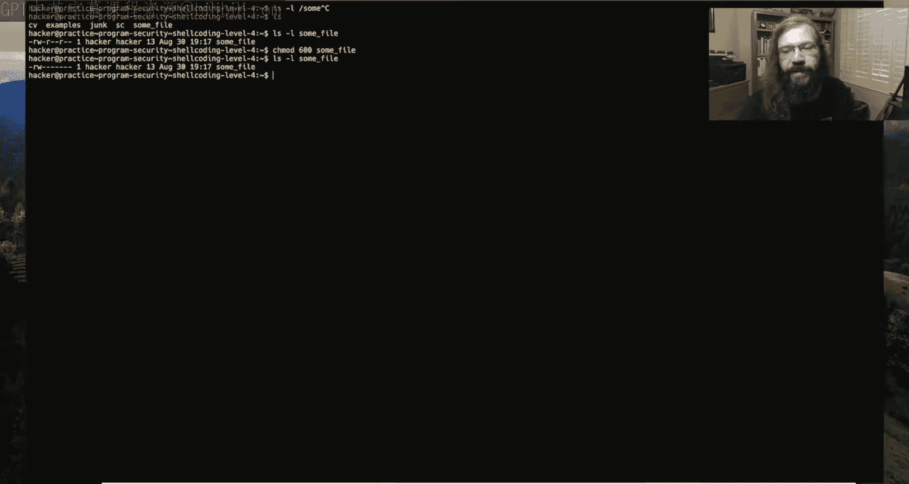

Persist across。

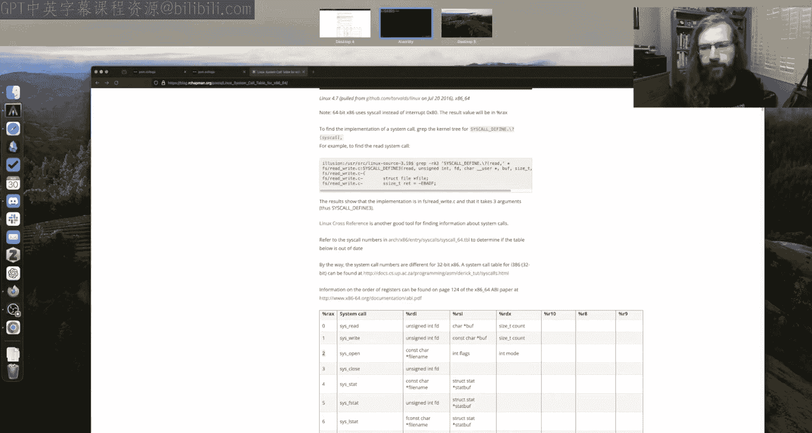

Time right is a part change。嗯。Somebody says some assembblers accept Constance like cis underscore CH modD that may be the case。

 I don't know it， I don't want to derail too far so the default assemblymbler that we're using here is the good new assemblymbler part which is part of GCC it uses a syntax called gas if you're just googling random things online。

 somebody mentioned to me hey I was reading about something called NASm NaSm is another style of assembly or another like assemblymbler syntax we will not be using NASm in this class there are different rules in things between the two if you know NASm and want to rock and roll with that you're welcome to do so although I will not be providing support for it somebody here on Titch says NASm is on the dota that is true。

Like you're welcome to do so， it's just， I need to try and standardize on something。

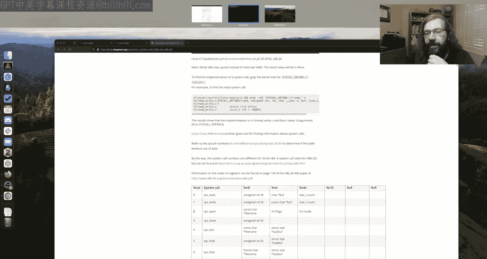

Which is， which is why。I'm doing what I'm doing there。All right。

 let me scroll back up and see if there were。Any comments oh no， this， I have gone off the rails。

Okay。Any comments before I continue down this road here， push pop， that's good。

Grrant push pump didn't know about Cons。Okay， I think that was all the side conversations。

 so I think we're good there。So what if I wanted to run this？But I want to write the same thing。

 but I don't want to have any H5tes。Well， there's many ways that I could do this instead of for instance to move RSI。

 I could move ESI if I wanted to make RDX0 instead of moving zero， well's do something else。

 let's X or。Uses dry X or RDX， RDX。Is that going to get me zero， yes， if I xor something with itself。

 it'll be zero， did that that Xor has a NH byte in it。

 but you'll note that it's a lot shorter instruction。Okay， if I can't do that。

 what if I X or EDI EDI right now I'm working with 32 bit registers。Okay， cool。

 would zero that would zero it out， recall that anytime that you set a 32 bit register。

 it will zero out the higher order bits。So let's。Over here。

 we're just going to have some scratch the many ways。To zero or register。

And I'm looking I' looking for things that you think we could do。 So I said we could。

 and we're going to say0 a64 bit registered。So I could move。

 I'm going to use RAX in the example here， but it doesn't matter， I could move zero。

 I always said I could move EAX0 and I also said I could X or EAX with EAX somebody here says sub so summed is something I could do。

I should I be。SubedDX， but subedDx EDX， right if I subtract something from itself。

That should be zero。是。Subedx， EDx， look， there's no H byte and subtracting。

 it turns out it's detracting X from X。does in fact result in zero， somebody says and zero， okay。

 so we could do that。We could add something。With zero。And that would do it this one。

 this one let's step through if you're not not a believer。あ。I have too many things up， let's do this。

All right， so we're going to get down to that and instruction so if we look at EDX。

A not EX EDX right right now it is zero， that's no fun。Let's smooth EDx， Ox 1337。

 let's make it just so it has the value so that we can show that it is actually zero and stuff out。

And if I could type。Okay， so we are about to and if we take a look at EDX。

 it has a value when we step through the and and we print EDX again。

 it is zero because and is going to include only the bits that are in common with both operaans or both。

 I'm going to say arguments， it might be operaans。So we could and EAX zero let's see do I have any any other ones here。

 somebody says I once Googled the most efficient way to zero or register and stack overflow had a pretty good discussion on it I don't know what is the the like absolute most efficient one。

 but we can there I still know of a couple just off the top of my head here I don't have like a secret list that I'm I'm referring to。

Um， multiple but multiple as Twitch says， here multiple ways are important to know。

 although sometimes there's no way and you just have to just have to prayg you can end up in situations or constraints where like there's things that you simply can't do。

But another thing that we haven't looked at is shift left or shift right。

 these are bit shift operations and it turns out when you shift bits all the way to one side they just kind of fall off into the nether world it doesn't wrap around to the top and so if I want to shift the EDX register by 32 bits。

What should happen here？We can take a look at。DDX， it has that value when I step through it。

That's RDX。Oh， what do I do shift left EDX text 20， this is a thing。

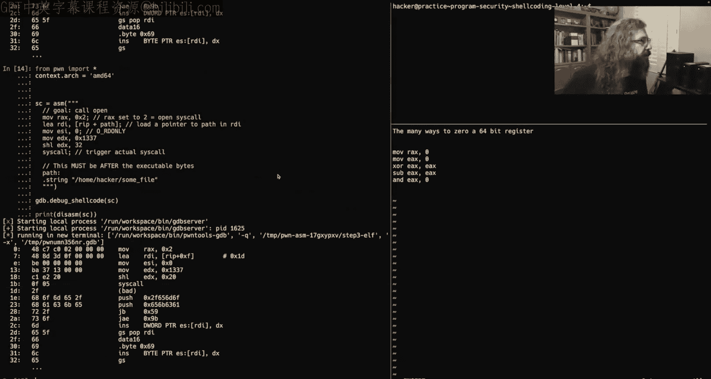

ち去去。Let's consult the Gogs。嗯。Bit shift。

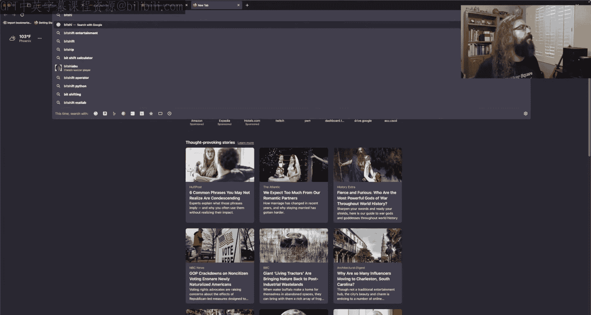

AD 64。ねね。That's all that's all Python， I don't want Python。

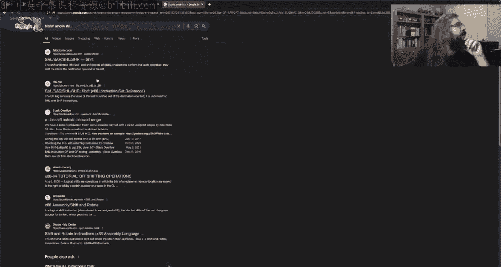

。说明。This is go。order I miss here， off hand。

Felix at 86 SHL。 Yeah， that's where I am。

Register for by constant。

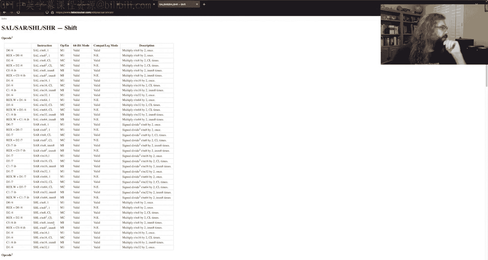

Why did that not do what I thought it should？De youbug the code live。

This is how you know things are are live demos， right？那去去去。Like I feel like that should。EDX， right？

Allright， I will。How have to think about that。Shift left。It should should have get my。All right。

 register wanted to be multipplayied by two on shift left in， right that' shift right， Okay。

 so I want shift right， but that still should have。

Okay。Let's shift right， which is the equivalent of dividing it by two of ajillion times。

Because if I take a number， I divide it by two a bunch of times， wed print EDX。All right。

 I'm going to pause there， somebody says why not shift right by Hex 40 because it's 645 yeah。

 but I'm bit shifting a 32 bit register， right？嗯。Like。Even if we did this 64。Right。

 I'm still getting it like something， something is a miss here。Like even just tricking it by by two。

 for instance， should modify this value and it should be something。Besides something strange let's。

I'm not sure why that is behaving as it's not doing the bit shift。嗯。Context。Arch。64。S售。这也是。Move RX。

One， three， three， seven。A shift， right。RX。

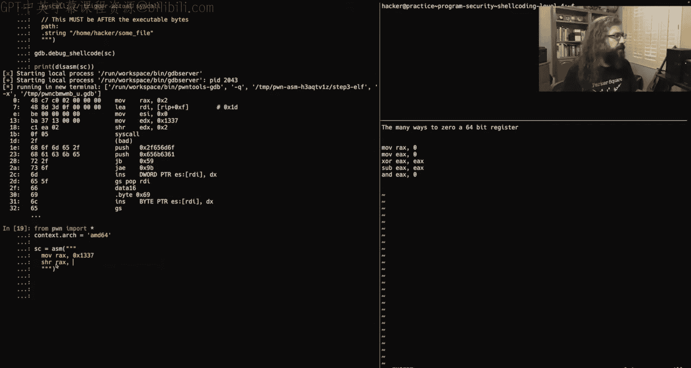

Because it's still just two arguments。对。

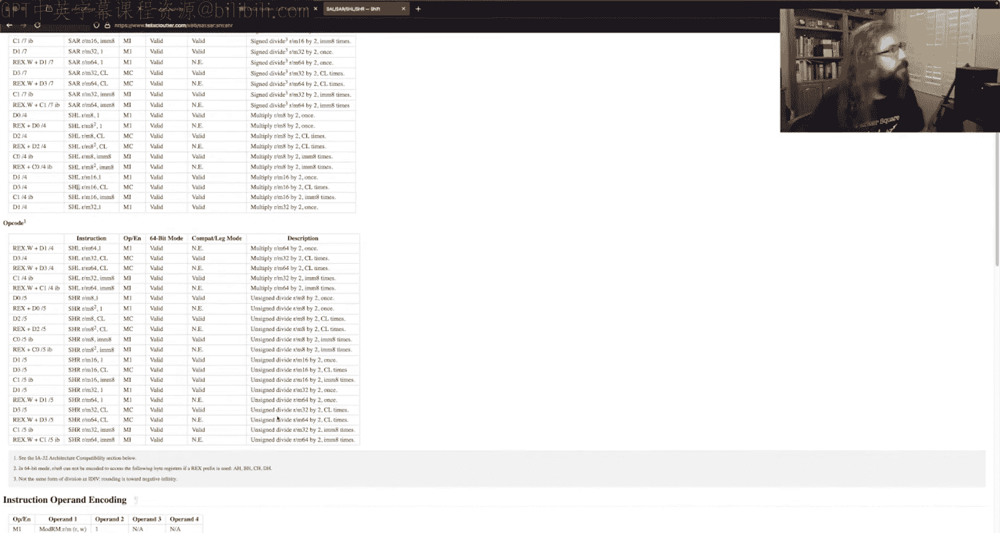

Should shift right RAX。64。Then then we'll throw a k knotob so that we have something there。

And instead， we will debug assembly。All right， that's before the shift。That's half true， okay。

 I'm not sure why that is is doing what I'm thinking， but you can bit shift。

I printed before the shift。Step where we're before the shaft we print our X， we step again。

 we're at knot， we print。RX， we step again， we're about to explode， we' print RAX。

 so something is a mess there， but you can bit shift things out of existence。嗯。

I'm not entirely sure what edge case is happening here。Sorry， that was a bit of a detour。

So we'll just kind of leave that as a shift as a mystery here。

 shift left or shift right bits out of existence。That should work。

 I don't know why it's not working right now， I'll have to think about that and I will respond on the Discord you want to blame P tools。

 thats that's fair， like it could be some weird phone tools thing going on right now。

 but you absolutely can do that。I just don't want to waste more time on stream here doing this。

So we see that there's a number of ways that we came up with right now to all do that and if we were to look at the bites of that。

By by printing the disassembly of these various instructions。

 we would see that we have the opportunity。To kind of permute these things。And。Get the same job done。

Without。嗯。While changing the bytes that are the assembly instructions。

 another example that I believe was kind of loosely referred to。

On the Twitch chat here is you could push about push a literal and then pop it off so we staff we print RAX。

 it is some magic value， we push a zero， we pop it then if I print RAX it is now zero right so another strategy that we could employ is for instance a push and pop it's two instructions where they're both small instructions and they all get the same thing done。

And so you'll have to be a little bit creative here in what it is that that you're trying to do。

 like we could get even more weird。We could， for instance， divide EAX。By EA X， then subtract one。

 because if I divide something by itself that this could get a。

Although the divide construction doesn't work like this。

Read the documentation now that I'm thinking about it， divide EAX to get a one and then sub one。

There is also instead of this subing one， we could deck decrement it if we got something that's at one if we have somewhere zero。

 there's an ink to increment by one and so we see that there's a bunch of different ways to do things and that is why。

Uh， the kind of initial focus here was on having something like this where I can quickly print out my assembly and see what is going on with with the bytes as I have these different instruction。

Da， because this will help you look at different ways to accomplish your goal。All right。

 that was what I wanted to open up with in class was it was something like this we just didn't。

We rabbit hold real fast looking at Tw chat here， does anyone have any questions on She code？

or a She code concept， something is blowing up， can I do this a hypothetical。

 I'm going to give it a couple minutes for the or not a couple minutes but like 30 seconds or so for the Twitch chat delay because you run like 30 seconds to a minute behind what I'm doing live。

Over here， if there's anything that is shell code focused。I want to kind of hit that now， if not。

 I'm going to circle over to the question that was， let's talk about some memory correction stuff。

So I have one question here that says， can I use ESP as the pathpointer in CH5。

 that's a good question because the answer is no and a lot of people don't understand why so we can take a look at that。

All right， to understand why ESP。Is not good。Let's see with RDI， we have RSI。

 then I want to move EDX0 and this is for the mode So I have right now some shell code。

That is sane and will' call open。Like this should be。We'll just verify that to make sure I'm。

The success of the call open。If I wanted to use the stack and play around with that。

Your strategy would be something like。Push。嗯。ううん。I'm going to use the power of the F string because I don't want to deal with the。

Figuring out the heckx for this。Which will be。Yes。We will unpack and I am going to say some file one。

 two， three，4，5，6，7，89， that's a problem。So if I wanted to get this whole thing up there。

 I need to one， two， three， four， five， six， seven， eight。64。

 and then we're going to push what do I need？IfI count that right， one，2， three，4，5，6，7。

8 because you can only push eight bytes at a time that's why I'm like， oh no。

 then I would want to push。And this will probably not work。As I'm looking at this。

But it'll be a fun thing too。Take a look at。Okay， so I want to push my string onto the stack in this case I'm just pushing some file instead of the absolute path。

嗯。And the reason。So there is a generic pack function that will let you unpack pack and unpack arbitrarily long values。

 but that isn't useful。For this right here。Unless you're talking about a different macro。

 which there may be like I do not know all of P toolss， I learn something。

 something new every time that I teach this material， which is great， make it fun。And so that should。

Get me onto the stack。Let's run it and make sure。It is not happy， when is it not happy。

 it doesn't like the opera end for push。呃。Let's see。Let's make sure I'm doing this right。你看。Oh。

 you can't push a 64 bit literal， I literally talked about this in class。you， you， you can push a。Um。

 you can push a 64 bit register and you can push d words。Right。Okay， so if I wanted to do that。

I would need to get this into a register， so I'm going to use。あ。

I'm going to use a 64 bit register which would involve an H byte。

 but that's just because it's the quickest way for me to make this make this work it turns out you need to have that comma。

 the comma is important。Okay， there we go and so I have this magic thing that goes into RX。

 and then if we examine this string at RSP。Or I'm still in RAX， so then we push RAX。

 we examine the string at RSP， we getum file now I mentioned that you need to have a terminating null byte and a lot of times that will be there we see in this instance I do not have a terminating nullbyte the byte that happens to be after my E is a1 which is a problem。

And then then if I look at my second push and then we examine the strain at RSP， well we got S， well。

 what happened， well let's look at like four giant packs at RSP。Here's my， here's my S。

And then I have a whole bunch of Nobytes， and then here isU fileile。Somebody says。

 can't you just move into EAX， then push RAX， so you can't do that。

And the reason is you'll end up with something very similar to what I have right here。

 so EAX would consist of these first four bytes， these lowest four bytes， one， two， three， four。

 and then when you push RAX， you're pushing these four bytes plus a bunch of nullles。

And so you have to think about what is the order of arranging these bytes so that they're pushed and right next to each other since I have this long string。

Since I didn't use assembly and can just say， ah， my file name is a， I can and avoid it。

 I now have this whole other subprom that I'm trying to deal with。Which is fine， right。

 it's a good thing to think about。Now， what I really want is I want that S to be the。

Highest order bitt。So I believe we'll see if I'm thinking about this， right？

I want seven nullbits in front of it。RightNo， this is a big string I want。No。

 I want seven no bites in front of it。So I can specify a no bitete。

Like so now I have this problem right here ofum file and then the thing that's after the E wasn't a nullbte。

 I'm going to solve that， I could solve that by shifting all of this back and then moving this O down to here and then including a nullbite right here another way of solving that that is a little bit more straightforward as long as you have。

嗯。Enough bytes in your shell code to do this， I'll just push zero beforehand。

 so then I know that there's a zero before I start pushing my string。what did I do here be this。

 which the complaint F string cannot include？A backslash。All right。All right， Python。

 you be like that。 We're going to call this oh my。嗯。S value。It was going to equal。U 64 of Bx0。

0 times seven。Plus， B S。And then in here。Instead of doing it literally， we will just reference。

It has a variable。Can'not assign to an expression here。I can assign a variable。

 variables exist byythonon with what's going on。These are some strange things unless somebody on Twitch is catching what's happening there。

Okay， that offering for push， I know I can push zero。Oh。

 I can't push a literal value I'm doing the same thing again， so we'll move RAX， my value。

And then we will push RAX again， you can't push a 64 or 64。bit literal。Even though I know it。

 you'll see me try and do it regularly。嗯。All right， cool， so we。Put theumfoil into RAX。

 we're going to push a zero on there。 The reason that we push that zero is so if we look now I know that my stack has a zero as the next thing we push RAX so then if I examine my let's say like four giant hex at RSP。

We see this isum file， which we can examine the string at RSP or examine the string。At RSP。

 we get Un filele that is reading from here up and then it encounters this nullbyte。Uh。

 so that's why it terminates and we don't get that weird slash of zero1 there because now my string is nollbi terminated。

Now we're going to move that S in there， we push that if I did my Indianness correctly。

 we get there is no the string at RSP is now nothing。

Right but if we were to examine that same four giant hacks at RSP。

 what I've done is my string doesn't start at RP now right because I had all those no leading nullvites。

 my string is at RP plus7， which is a weird place to be。But you totally can use it。

There is some file。Y plus7， because this is where the string RSP points to when we're dumping this out in GDPB。

 if you have your kind of head wrapped around ending in this， and so this would be by zero。

 I have to add seven to get to this location right here。Now。

And so by accessing RSP plus7 as a string， we see that I do get that value of sum file so you certainly can get things onto the stack now in the context of not having H flights。

 this becomes a bit messier you know a bit more messy than that because I can't。

Use these 32 or these 64 bit registers， I have to use two bit register or two byte registers。

And so that means。😊，When I am moving these things， this becomes something like， okay， move AX。

Push and then move Ax。And this wouldn't be 64， this would be a U16 because that's two bytes。

 then I would U 16 B Fi， and I would have to do this two bytes at a time or two byte pushes to get them on there。

The two byte pushes don't need to be padded with a bunch of zeros。

 you can just push a word directly onto the stack。Let's see what Twitch here says。

 okay you caught me I had a dash in in my variable name。

 somebody says if you can make the challenge read more then maybe there there's a way that's a response to something earlier。

 let's see here for levels that are asking us to send like 12 or six bytes。

 some of these like reduced number of bytes challenges is the only way to pass them is to actually send the shell code that is only six or 12 bytes or is there a way to send more than that？

So I didn't include it because it's assumed knowledge from 365。U so I didn't explicitly cover it。

 but。Somewhere， I think it's。嗯。Find the video。You have way more videos for this module than。

Then you will in future videos just because there is there was assumed knowledge and so I included stuff from like 365。

And。What you can do is something of that's called two stage shell code。

And Tuesday state She code isn't。嗯。I know， I know it's included in here。

んうん。Whatever I'll just show it。Instead of trying to find it in these videos。

So two stage shallcut that the idea here， and I'm not saying that this is the the solution for both of these because I don't think you can do it in。

The six by one。But the idea with two byte shell code is if you manage to get。

I don't know if it's quicker to clean this up or just start writing fresh。

If you manage to write She code that calls open or not calls not calls open， calls read。

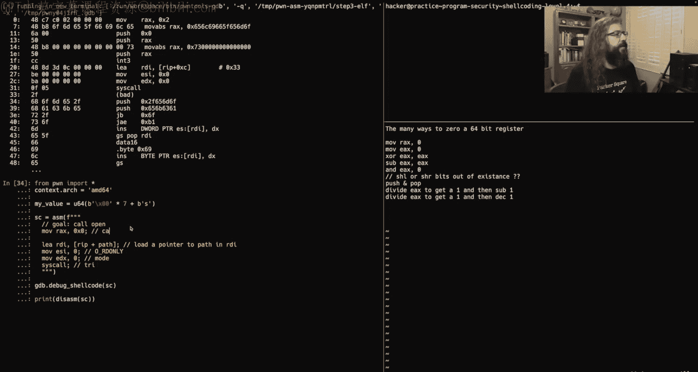

Which hopefully writing a Chapman agrees with me， read is zero。

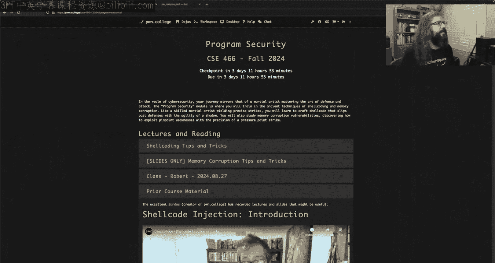

If I can call， read。😡，RDI is going to be my file descriptor， so let's。

Just for reference for those that don't have all of this stuff memorized。

 our RDI would be our file descriptor so we'd move RDI zero。RSI needs to be a point to our buffer。

 so this is where we run into a problem of what I want to do。

Is move RSI something and I'm not saying that you literally want this instruction。

 but you want this to be a pointer to like where I am。And then RDx， as we see here is the count。

 which I just make it some big number。And then you do the cis call。哎。For。Debugging purposes。

 I can't have question marks， but the idea here。Is where is the instruction pointer right now。

 it is at this location。And if we were to look at the arguments that I'm about to pass into or trigger when I call Re。

I'm reading from Standard N。Im those bytes that I'm reading are going to1337。

And I am reading this print that is a decimal so that it's human readable 1 thousand00 bytes instead of reading to Hex 13。

37， I want to read the bytes to where I am right now。

 I want to overwrite the region of memory that is being executed now that I don't need to have a pointer to literally right here。

It could be a pointer to somewhere behind so like if we were to examine like 100 instructions at RIP minus。

あ。What's a reasonable number？Okay， so this is where I'm executing right now when read will occur if I could somehow get RSI。

 which is the pointer where bytes are going to be read into， if I could get that to be anywhere。

Either where I'm currently executing or earlier， what I can do is when that first read call hits。

 I'm rewriting the assembly instructions and so when Rip marches to the next memory address right here right now before Read。

 this says add B pointer RAXAL， but when Re actually hits。😡，This can get rewritten before。

This gets interpreted， these bytes get interpreted as the next instruction。

And so that that concept of rating a。First payload of She code that allows you to read in more She code is something that's called two stage She code I don't believe it's mandatory for any of these challenges。

 but it is something that you can absolutely do。And is a good strategy to try and employ。

For the person who was asking about 12 bys， six byte， did we get you there？Okay， cool。

 I didn't finish my my discussion on why ESP is bad Instead I just went down this like tangent of dealing with the stack So let's let's go back and look at。

This thing here where I hadum file， some file right and the question is why why can't I use ESP because I said ESP is bad we print RP。

And then we print ESP。What we see is RSP is a memory address right if I I have to have Jeff for this to work。

 but if I VM map，SP， the stack pointer points to a very specific region of memory that is the stack and we see this region of memory。

 the memory address is more than 32 bits。So if I were to try and grab ESP。What I get is 51 Eb2130。

But that just drops off the higher order。Bits of RSP。

And so ESP does not reference the same memory location， in fact， if I were to。

 I imagine this will explode， yes。If I try and say， hey， where in this process is ESP。

 it doesn't point to anywhere。So when we're thinking about memory。We there are。

There's tons of addresses that could exist， right， but some memory addresses the camera， the camera。

 we've gone off the rails。

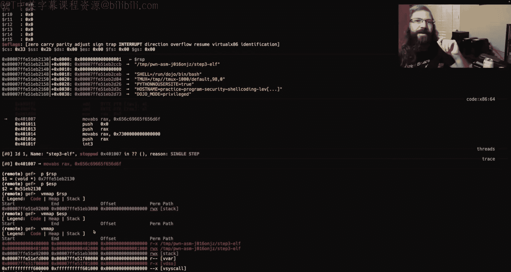

嗯嗯。And try and keep the camera on this side of the room。Okay。

So when we think about memory in a process。We see that there are memory addresses that are valid。

 these are regions of memory that are mapped into that running process。

And the stack is one of those valid regions of memory if I try and access。

A region of memory in my shell code that is not mapped into the process。

 which would be something like ESP here。 We see that this is not mapped anywhere in here and you'll get a se fault So you can't just randomly choose a memory address。

 and ESP is not。Good enough， a good enough location。To。

Our ESP is not equivalent to RSP and so you can't treat them the same way。Okay， somebody says。

 all right， cool， so they got that。All right， any any other questions on shell coding。

 how am I on time， were when I start at noonary， where we're cooking， we're good。うちち。

Can you make the challenge read more， maybe there's another way。

 Yes I showed her kind of roughly explained two stage shell code somebody says like with something dot string then loading that into ESP work kind of like the example slides with B SH。

So there are a lot of example slides here。I imagine you're going。

 I strongly encourage you to not call exec。And。And any of these， I don't call Bsh， do I like you。

 there's just， there's a whole other trap with dealing with B S。

And popping a shell。Okay， so here。This is doing the same thing that I did where I have a label and then I am loading。

That labels address R relative into a register and then performing a cis call。

I would recommend not doing this， this will execute bin SH， like it is valid shell code， however。

 the shell that you get will not have root permissions for reasons that I feel like not not going into at the moment。

But I'm more than happy to explain。At a later point。Um。

 so there there's the statement here from Twitch is like， I guess I'm just having， you know。

 I need to do a lot of looking for info youre struggling and how you can get flagged onto the stack。

So if you look at。I wish there was a way to rapidly iterate through。These things。

 what I'm putting some file onto the path， I did that here。And then。At the very beginning。

You can see I can go up and find it。嗯。I was doing that same thing here。😡。

Where I didn't even put it on the stack。I just loaded the address directly。Intoto our register。

And so it is of course， with with the restriction of 32 bit now your restriction and somebody also says also siblings。

 which we talked about in class， right there's you aren't for level four。

 the first challenge that is assigned here。You aren't stuck with 32 bit instructions what you're stuck with is don't。

Don't have H bitetes I don't know， we'll find out right now LEA。B0 eye。Let's have a label。

Let's see if this does。Okay， so that does have an H bitete in it。

So you're ready that you couldn't do exactly this。Uh， but how， how else could I get， for instance。

 this is rip relative， so it's rip plus something， how else could I get u R？Into a register。

That this goes back to this goes back to thinking about all the different ways that we could set a register to zero。

 how many different ways can I get something in？Get written like get a pointer to some region of memory right would be the question somebody here says use the stack and that' that's exactly what I was going to demo before I somehow killed my Dojo instance here。

I'llive it， giveive it a minute。Well， you can push like push R pop RP， right I push zero。

 I can pop zero right back off。

Somebody says your yours is down too all right， so maybe。

I'm not following the admin chat right now since I'm streaming。

Maybe they bounced all of the containers for some reason。

And I just need to start up again。Yes。Okay， from homeland import Port star。Context。ArRC， AMD 64。

We're get a GDP debug assembly。We're going to push grip。 We're going to pop RDI。All right。

 it doesn't it says， hey， you can't push rep。That is a problem。All right。

 so how do I get rip onto the stack and I want to try and do this like push pop or can I move rip？

Do you need my comma？Okay， says I can't do that。I have a really clever thing that I know I can do。Uh。

 you'， you'll appreciate this one。Or someone will appreciate this one so if I。

My problem right now is that I can't get rip onto the snack， right？

If I it's going to require a little bit of labels and this is definitely more work than you need to do because you can avoid using。

h， you don't need to get rip onto the stack for any of this， but at this point。

 I just wanted to want to do it。And I'll show you some wizardry。

So our first thing I'm going to do is I'm going to jump to my call， my call is going to call label。

And then I am going。To pop RDI and we'll throw a no in here。Say somebody knows this trick， okay。

 so you do know this trick， I thought you would appreciate this one that this is a well known trick for getting RIP into into a register。

And so first I jump to， I use a relative jump to get to this call。The call instruction。

What does it do， it does two things， it pushes the saved return address。

Onto the stack and then it jumped to the label and so now I jumped to that label and if we examine the address that is at RSP。

And then we print our IPP， we see that these are very closely related， right， if I were to examine。

 let's say eight giant hes。At RIP。嗯。there's word， let's examine eight instructions let's do it that way。

 Okay， cool what we see is I pushed this address， which refers to this location。Onto the stack。

 so then the first thing I do is I pop into RDI。But now if weprint RDI， RDI is now。

A pointer to the region of memory。That is just after this call。

I don't you don't need to do this for any of the challenges。

 but it's just an example of a more conguted or more complicated way of abusing and misusing instructions if you understand what they actually do to accomplish your goal。

This may come up in a later at a later point。Forhaing。All right。

 did I get all of the shell coding things， hey， I'm stuck out I'm thinking about I didn't show you exactly how to do it。

 how to get。Rip in there or RP in there like my my the simplest suggestion is to avoid the problem and use。

嗯。Use sings to get to the stack if you're trying to just get a pointer to RP。

 what you should be able to do is push RP pop RP， I don't believe that has。

We'll examine like four giant techs at RIP， we see that there is no nullbite here。

or no there's plenty of no bikes， there's no age bytes。

But but the way that the class is like structured as a whole is like I'll show you all of these technical things but applying it is on you right like you have to like be like oh I can grab this I can grab that how do I put this together and get the task done one of the nice things kind of looking looking at the vibes of the Discord chat the people are really struggling on level four and then the people that have kind of made it past level four they're like hey all right these pieces okay fitting together I'm knocking out you know the next two or three levels and then I get stuck and then I knock out the next two or three levels and I'm stuck that that's。

Very common here because。Right now we're dusting off the cobwebs kind of finding out what it is that we forgot over the summer or didn't pick up from 365。

 but are once we close that gap， we should be able to move at a reasonable rate。All right。

 if nobody has anything shell code related， I would ask that whoever it is that was curious about memory corruption was there something in particular that you wanted me to hit right now live？

For the record， as soon as I stop this stream， I'm going to record over that memory corruption slide deck。

So in roughly an hour and a half， I will cover all of the high level things。

 but if you're stuck on something in particular， I'm more than happy to get you unstuck right here right now。

I got to give it a few minutes or a few seconds for the twitchwed delay here。

Did the memory corruption person run away？They didn't believe I'd come back。

Every once in a while I'll admit like I forget a question that was asked and you got to hit me again。

 but I try quite hard to circle back and answer everything。

 let me scroll up and see if I can find it。嗯。Push pump， LA。Terminal shell craft， something default。嗯。

那。I know somebody asked about memory corruption， I don't see it here in the chat now。嗯嗯。

Sorry for the brief lu is actually kind of nice。I try and speak over everything that I'm doing。

 but it wears me down， oh， let's talk about canaries and memory air stuff。嗯。They say not PIe， okay。N。

So。Let's see if。I have。So we got here。So this was a example that I've kind of been chilling on。

That is a buffer overflow example， kind of the basic memory corruption thing I'll do like the dining tour here and then if nobody has any follow up。

 it should time out reasonably well。As far as the two hour mark， I've still got about 40 minutes。

 I'm willing to throw at this。So I'm kind of running through this with the source。

 what does this thing look like， I have a main function that says it's about to call a vulnerable function。

 we call the vulnerable function， then we say we're about to return from Maine。All pretty basic here。

 our vulnerable function。I have astruct。That has these values。 Oh， this is。This is not done。

This is not a fully working example。And。Cef I。And then I would have to say。は。

See if the compiler likes that。Because I was changing this。Yeah， wheres always false， always false。

No， that needs to be as always false。I was changing this。To make it a little bit more。And。うに？

My talk has November always falls， just it does。I struck mystruct S。UStack overflow， okay。

 Twitch chatt says stack overflow says X or EAx， EAX is the best way to zero out that register。嗯。

My truck has no member always false， it does have a member named Always false。This right here。 Oh。

 yeah。I'd have to say S。Always false equals Caedro。All right。So hopefully。

I have a binary nowun named Ado Out。And it is pretty basic as far as what it does。

Inside a vulnerable function， we declared thisstruct mystruct which has a couple buffers and it has a integer that is always false at is what we call it the reason we call it always false because literally all we do is set it to zero。

The vulnerable function says what is your name， it then reads from standard in to this username field。

And the username field we see here is 64 bytes in size， the read call will read up to 300 bytes。

 so we could definitely read in data more data than was intended for this buffer field that is a buffer overflow right the region of memory that we're intending to write to is smaller than the size of the potential B。

It then prints out hello， whatever the username is， and then if for whatever reason。

 this always false that is set to zero is non zero， then it will。Output always falses is true。

Assuming I compiled this correctly， there are a number of things that。

Um securitycur features here that were disabled or enabled to figure out what are the kind of what are the rules or rules of the game when we're looking at。

Binaries， the thing to。Use。Is something called checkSack。And so if we type。Check S。

 when we go to my examples directory here， we check S A dot out， this should， good。I。

Tell us that there's no sta canary found because I compiled that with disabling it。

The binary is compiled without PIe。Which PIe is position independent executable。

 this has to do with how addresses are randomized。It is mentioned in the。

Included discussions with Janon， and I'll also specifically try to discuss just these thingses here。

 Canary， NX， PIE in the video that I'll be recording after this。But no Pe means。

That oh run run path is weird so this is an implementation detail of the Dojo if you are on a same Linux system you will not get this weird N thing for run path just go with it in general we do a pretty good job of hiding this implementation detail in a few places it does still crop up in pop up。

It shouldn't prevent you from solving any challenges if you think it is， let me know。

 odds are it is not。So this binary has no canary which is the thing that's relevant for right now let's play around with this binary what is your name。

 my name's Rob it says hellello Rob and then it says it's about to return from Maine。嗯，去去去。

Why do I have？Pnt F F internet。Okay， interesting。Why am I getting this nonsense here？

What do you think？It wasn' an intended thing but it's worth mentioning。

So the string that is being read in here， I'm just using Reed。

 Reed has no idea that what I am entering is a string， Reed does not null terminate。

 it just takes bites and puts them into memory。And so what's happening here？

Is I say Rob that writes to these bitetes and then what happens to be after it is a new line followed by an at symbol or then an exclamation point before a no bitete is reached。

Because I'm not null terminating my strings。Somebody says will control D help control D wouldn't solve that。

 control D doesn't send a null whitete。谢实。Control D would prevent me from passing the new line character。

But it would still print out until a nobte is encountered。

So if I run this thing and as one of our great meme meme said here。

 we just ram a whole bunch of A's into it。I don't know how many of these are， but in theory。

 I'm going for more than 64 when do you think is more than 64？Maybe， maybe about here。

 I'm going to go over here。Okay， we sent faulted。So we definitely did more than 64。嗯。All right。

 so this goes back to you could just sit here and punch A in the terminal。

 but we can use Ponee toolsols Python kind of get rolling on this a bit faster so let's let's do that same thing we'll start up in eye Python session where you would write a Python file well say from Pone import star。

We're always going to set our context。And we're going to use that same P equals process， in my case。

 this is a dot out。And I can be interactive if I just want to play around with it， right。

 what is my name my name's Rob， okay， we're there。You'll see now that I don't have that at whatever。

 that's because when I did all these A's， what was in memory at that location has changed。

 it's non deterterministic because we're just printing out random bytes。

 the location of the Nollbyte is non the next nullbte is nondeterministic。

Now I probably want to interact with this thing programmatically so we can piece send。The byte A。

 and let's send 64 of them。Okay， now we get a A about to return from Maine。

 what happens if I send 70 of them？Okay， we're about to return from Maine， I send 80 of them。

 we're about to return from Maine。I about a hurry。We say faulted。

So I didn't set up this challenge correctly for what I wanted to do demo wise。

 it'll be correct in the slides， I'll fix it up。But what happened here is I wanted to overwrite that variable。

 but we're doing something else that's interesting， so why are we segvaing？

Does anyone have any ideas？Somebody says I'm touching memory that I should not。 Well。

 that's definitely true， right， And we know that from。The source here。

The username field is only 64 bytes in length， I'm passing in a00 bytes。

 I'm definitely writing past this username。The question is， what's on the other side of it？

And we can use GDP to take a look at that， so I'm going to use the same thing we kind of saw here with shell coding。

 I'm going to say P equal plus GDP debug this binary。

 I'm going to pass in my00 A's where P interactive we are now inside this binary。

Now I am interested in， I believe we have what was a vulnerable， vulnerable function that does exist。

 so I can set a breakpoint at vulnerable function。We can continue。

We can take a look at vulnerable function。In assembly it's not not too big what I care about is what's happening at this read。

 so I'm going to set a break point at vulnerable function。Plus 59。

We can continue and now we're about to call Re。I don't care about stepping into read。

 I want to see what happens after read， the interesting part here。

If we were to look at the man page for Reed， we see that the second argument is the buffer where the bytes are going to go from calling conventions we know that that is what is in RSI so let's print RSI and let's examine I don't know forge giant hackx at RSI All right it happens to be this right now if I go NI for next instruction so I'm stepping over this read call we're going to let Re do its thing and were going to get to the next instruction that is inside my vulnerable function。

All right， we are there， you can't see it because it's black， but right here it's black on black。

 but right here it's call， read， we just finished doing that， we are immediately after it。Let's。

Examine the four giant Hes at RSI again， we have 61616161， these are my A's。

 if we scroll up a little bit here， we saw before the read。

This region of memory had a bunch of other stuff。Well， how how far did I go。

 how many A's did I really write， I wrote quite a bit。Yeah， quite a large number of As。

Now I am inside vulnerable function and vulnerable function。Was called by Ma if we were look。

 if we check our source here， Maine calls vulnerable function。

But when I look at what is the state of things as far as the debugger thinks， everything's messed up。

 right， it thinks vulnerable function came from AA which came from A like like we have definitely overwritten some like key data that is involved in the operation of this binary。

Now if you。Recall， there is something that is known as a function frame。

 this is where your local variables are。And that is stored on the stack。

Inside vulnerable function my struct is a local variable of vulnerable function。

 this is located on the stack， so when I overflow from username。

 I'm overflowing not only this variable， but if I were to keep writing。

 I could overrite critical information that is stored on the stack。For instance。

 the saved RBP or the saved return address。So if I were to right now。

 this tells me where for my current frame inside vulnerable function。

 where is the saved return address， where is the saved RVP。

 and then where is the saved return address？And I can use that information to print out or examine。

What is the saved RVP？Well the saved RVP， I overwrote that with my A's， it's not A a。

 the saved return address。I's also a whole bunch of eggs。So what the saved return。

 the saved return address decides when vulnerable function returns， where does it go？If we were to。

I can't。If we were to continue running until we get to vulnerable function plus 114。

 so now I'm down here at this rep。I'm about to return。To what's supposed to be mainine。

The RE instruction can be thought of as P RIP this is a preview of my stack right here。

RSP is currently a bunch of A's， so when I perform this RE。

I'm going to try and return to a memory location that is AAAAAA。A is not a valid memory address。

 therefore we se fault。And memory corruption is about this concept you may be corrupting a。

Let's switch that around， Let's see if that。Makes life better for me。

You may be corrupting something that is。On another variable on the stack。

 you may be corrupting something that is critical data that is located on the stack that determines how。

How the program behaves， there's a lot of information on the stack。That。

Can be corrupted if you can start writing out of bounds。So， this isn't。

This is what I wanted the demo to be。I had to switch the order of thesestructs because it turns out you can map C code to the literal layout in memory in a lot of cases。

And so let's。Go back to。That' right here， when I send 64 bytes and we are interactive。

 we return from Maine。 If I send 72 bytes， all we suddenly see always false is true。

 and the reason for that。If we were to。嗯ん。Let me change my make file so that I have debug symbols。是。

If we break at vulnerable function。I can print S， I can print S always false。Right now we see。

That it is hex22， but that's because we haven't gone through setting this yet。

So now S always false is zero。And then that's why we are calling it always false。

When we get to this read。We are going to based on our。Python code up here that is our exploit。

 we're going to send 72 A's。And those 72 A's are going to go into S username now I can print。

The address of S username。And we see that it is a character point or array array。

What happens if I want to examine， I don't know， what's 60， 40s， let's go 40， 40 giant hes there？

We can see the bytes that are located there， we can also print the address。Of ass。Always false。

So that we have that here， so this right here is S always false。

And this is where we begin taking in input。😡，If I write 64 bytes， it's going to go 8， 16 32。

 64 there's enough space here for 64 bytes of input as soon as I start writing beyond that。

 I'm going to corrupt the next value that is located in memory on the stack。

 which right here is S always false， we see that that's located at 5070， which is this right here。

So now let's step to the next thing。Here let's get to the read and get to the other side of it。

 so I'm going to step instruction。I'm now at the call to read。

 so ever nothing has really changed there。We step past it。We've now， oh。

 I stepped in to read Will Finninny to get out of Reed。And now if we examine that same stuff。

 that is the address of always false， that hasn't changed。

We examine 40 giant hacks starting at username where that read started putting A's。

 we see A right and we did that for。16， 32， 64。And then this is the 64 bytes that was spaced for the username。

This right here is overriding always false， which is located right here at 5070。

 and so now what was expected to be zero all the time is suddenly a non zero value。

And that's why if we were to continue here until it exits。We see。Always false is true。

 which if we look at the source code。That should never occur。Because in the intended。

Operation of this program， it is set to zero and it is never changed。Now。

 the nice thing about memory corruption。And the memory corruption module。Is。

I did this in GDP on some random binary right that I threw together here。

The memory corruption challenges。Will print out the stack for you。

 And so while I'm doing this in GDP， at least the memory corruption challenges have this pattern of。

Like a 00 and then a  point1， the  point zero challenge is will do the work of displaying their own memory for to you so you can kind of see this exact same stuff。

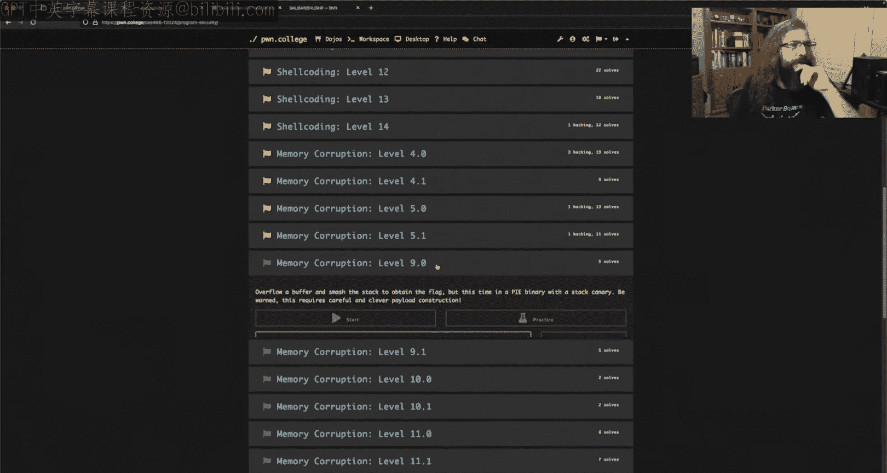

Without having to mess about in GDP。

But the0 one levels。

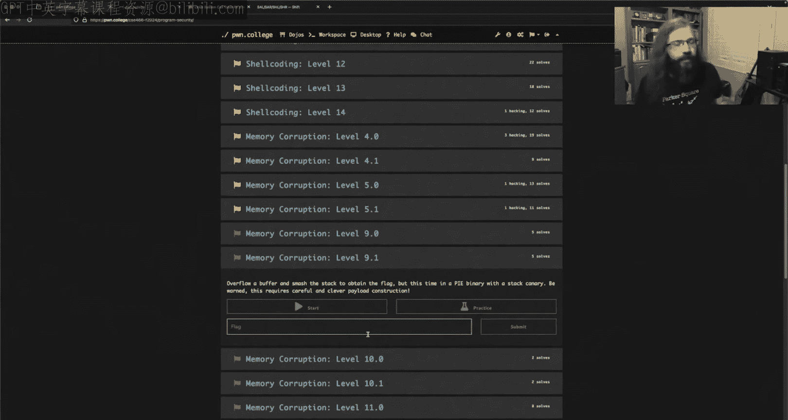

I will not print out that help tag。And so it will be up to you to use GDP or some other tool to reason about what's going on inside of it。

Anyone have anything to ask about what I just did， this is not the only way to reason about memory corruption。

 there's a number of different techniques which is what I will be recording as soon as I end the stream。

Twitch has gotten a little bit quiet because I think most people are still on the shell coding portion of things。

Let me give it a moment for the twitchwitch delay。Somebody says they reason about mimic corruption statically like a superior hacker。

I don't know that that is what the superior hacker does， it is a way to reason about it。

I think it's a horrible way personally。AllWith that， I don't believe we have any other questions。

Time wise， how did I do？So the problem with so somebody says， I just prefer disassembling it， right。

So the problem with doing。

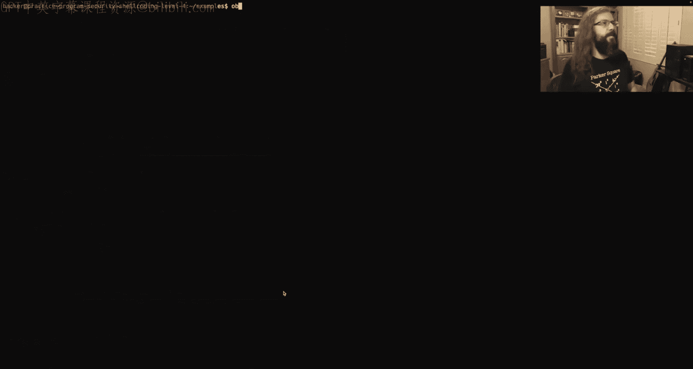

呃，Doing this stuff statically and it may not be that big of a deal。

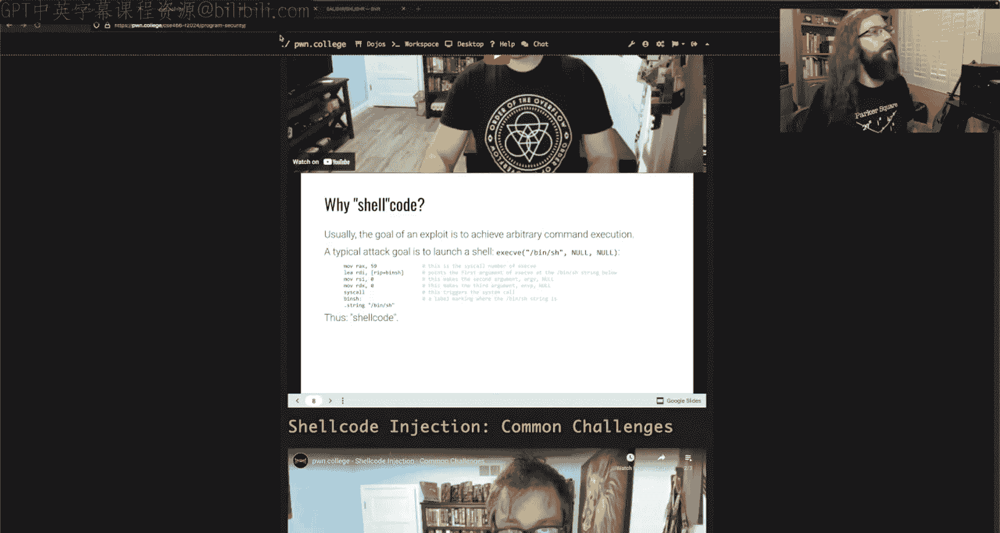

For this binary， but we can。

Give it a try。Is you end up with。

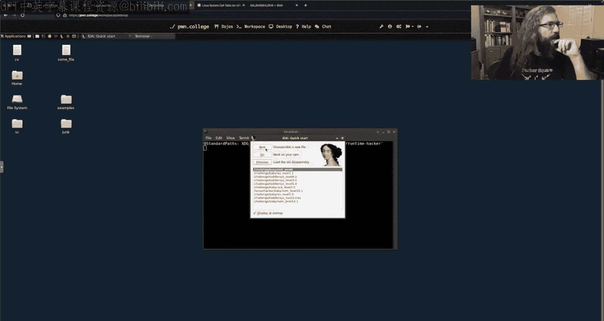

This scenario where the pointers may not be obvious。

Whether the pointers that are being used All right。

 you could get some pointer that is stored on the stack and then it's loaded the pointer loaded from the stack and then that's the pointer that's used。

 And so when you look at it statically it becomes。It becomes a bit of pain。And it can get confusing。

So if we take a look at this in Ida。This tells me this has an offset of 4 hex 40， which is 64。

 and then if we take a look at where we are reading two。

It looks like we are just reading to the address of S since it's the first property there。

 this tells me it's at RSP。Plus zero， does this tell me where this is？

See this doesn't immediately tell me。嗯。Where the value is， we could go。because it's an obstruct。

 so Ida is actually treating it as a struct。I'm doing that。

We could go to the assembly here and if we go to vulnerable function inside of Ida， what do we see。

 we are calling Re on RDI， RD or what we care about is RSI which your pointer door buffer。

 that's going to be RAX RAX is RBP plus S。S is。itT me where S is。嗯。请去吃。Okay。

 it tells me that S exists。 and then what I want to know is where is always false。

 I can see thestruct that always falls is X 40 in， but it's not it's not nearly as。

Like visually representative。So the the statement from Twitch because Ida is not my preferred tooling here is if I double tap on thestruct。

 it will show me the stack frame， I don't believe this is。O。Now， that's fair。now I have mystruct ask。

 but I don't get the insight into how these are related。I just have like S and then SR。

 like like I personally find。I personally find using GDP and being able to。

 if you can verbalize your question like you can phrase your question in English， I want to see this。

Ods are pretty good that there is an equivalent GDP command。I want to stop at vulnerable function。

Great， I want to examine 40 giant hes that are located on the stack。and then I can as I step through。

 I can visually see how things change for me， that is like amazing。

And if you were just disassembling it。You could use object dump， but youd get this same output here。

 like I would rather look at， I agree， I would rather look at just raw raw assembly than than IA's pseudo assemblyly。

So we're calling Re。RSI is RAX RAX is RVP minus D0。 Okay。

 so this works so it's something minus D0 and then the location that I'm interested in。

Is going to be it's not from this function， it's from the function trend above。

 so we have the disassemble main。To get an idea of where that is。ち。

Or does mean oh now main sets it up here， Okay， my bad， so disassemled vulnerable function。

So inside vulnerable function is where we're setting the setting always false equal to zero because it's local so right here is RVP minus hex 90。

So we can think about this as RVP minus OX90 is somewhere on the stack。

 that's obviously a bad command， and then we start writing at RVP minus hex D0。

Because that is what is loaded into RSI when read is called so that's the location of the read buffer。

And so if we were to subtract those two offsets since Rvp。GDb really didn't like that。

If we were to subtract OX。90 and we subtract OHD0 from it。We get。Or we have to actually。

 you take the big one， minus the small one。We get hex 40， which if we look at it in decimal notation。

 we can still get that 64 and we're able to do that because this one。

 this was pretty straightforward we weren't throwing pointers out of the stack and then referencing those pointers because then it becomes a bit harder to look up in the assembly。

 there's more steps than just finding this and then this finding this number in this number for where they are there。

 like personally I'd rather GDP or I'd look at raw assembly when tools start trying to help me。

 I have a hard time understanding if they're helping me or their help is actually hurting me。

Which is why I have the opinion that I personally have on these type of tools。

Other people may have a very different opinion and a different workflow。

 but this is what works for me。So there's two different ways that we can find that。Um。

 someone says my opinion is wrong， but that's fine， yeah， my my my opinion。

 my bias towards GDP is 100% the minority opinion for people that kind of work in this space。

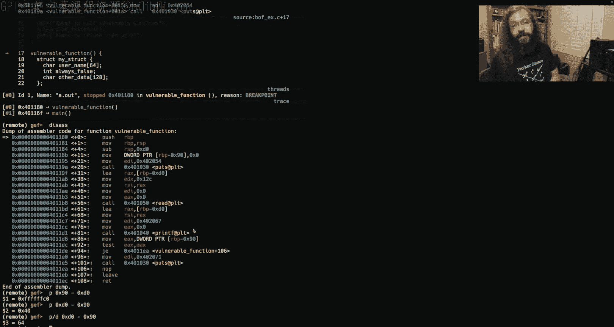

People tend to love。UmIda and they spend a lot of time using tools like this。

 I like seeing what's actually happening。

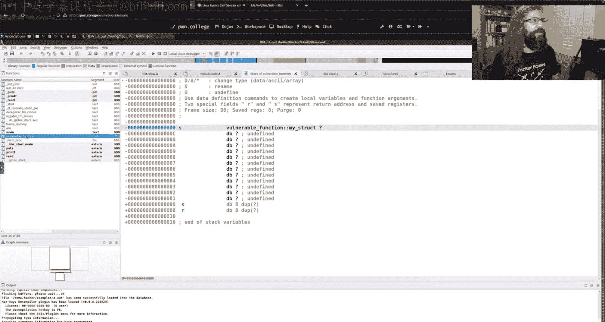

With that， if anyone has any last minute questions hit me， if not。

 I'm going to end the stream and start recording over those lecture slides。

 I've got about three minutes left on my kind of where I try and cap office hours time。行。

As a unrelated ASU note。嗯。Monday is a holiday， it is Labor Day that is a university recognized holiday。

 so while there are no 466 classes， there will be no classes whatsoever on Monday so you can show up but there'll be nobody there that will apply to recitation as well。

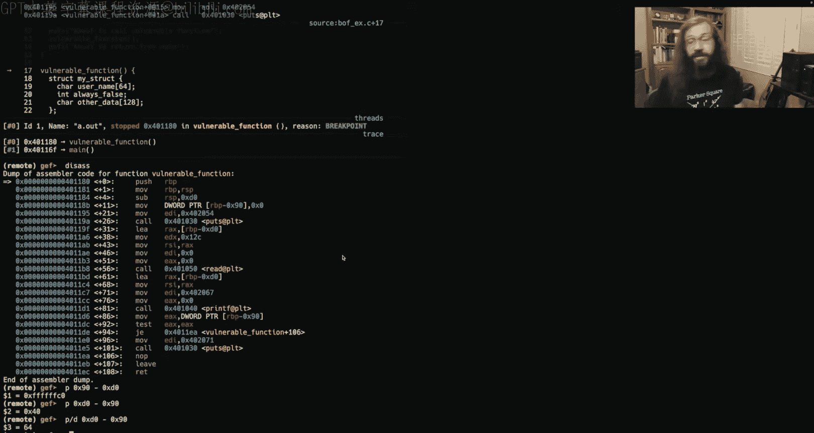

With that I'll leave you all， I appreciate you hanging out， hopefully it was useful。

 goodbye and good luck。

