# ASU《计算机系统安全｜ASU CSE466 Computer Systems Security 2024》中英字幕deepseek p05 -06-Reverse Engineering - CSE466 - Robert - 2024.09.03.zh_en -BV1spCGYZE9D_p5-

Okay， you guys in the back， I just want to make sure you're aware that we are recording any chit chat was going to be preserved on the internet there。

 so I would suggest that we try and stay focused on the topic。

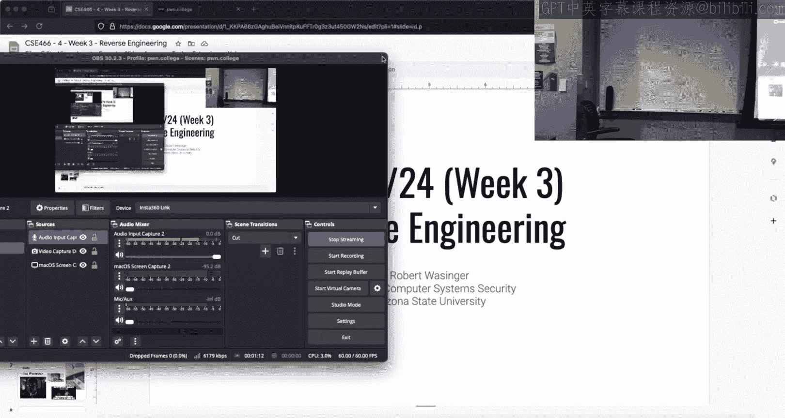

Just so we all look like respectable people that are interested in cybersecurity。All right。

 let's see， does Titch look good Twitch today I did show up 20 minutes early。

 I can see your chat doesn't mean that I'm going to crush it though as far as responding to you。Okay。

 today is9 two， we I think on week three here and we're about to go into reverse engineering。

 it doesn't mean。I'm going to talk about reverse engineering today。You know。

 it's whatever day I woke up。Okay。It turns out time runs on my schedule。

If you've seen me on the discor， you know。ぐ来 justしてます。So memes。Teaching the same course every year。

 how do I make it fun for me the answer is yes， make some memes we can hopefully get a good truckle or two as we move through this stuff it also gives you guys extra credit。

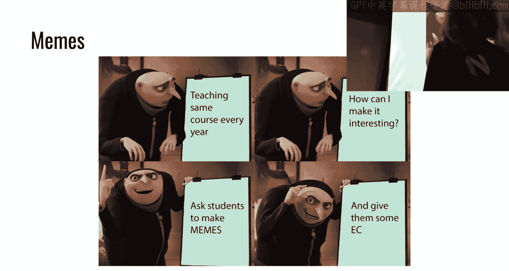

It's a good way of doing things so hopefully over the past week， you messed around with GDP。

 hopefully you found GDP to be a useful tool。All right， the foundation for apparently someone。

 at least solving levels five through 14 and beyond was throw GDP at it and I throw an in three in my shell code。

 this lets me see what's going on， start stepping through it thinking about how things work I think it's a great way to work solid me。

The other day that I said on Thursday I showed how to set up Jeff。

 Jeff is that GDP plugin that gives us all that info， Jeff is amazing， if you're using Pone debug。

 that's your choice， Jeff is the correct one。

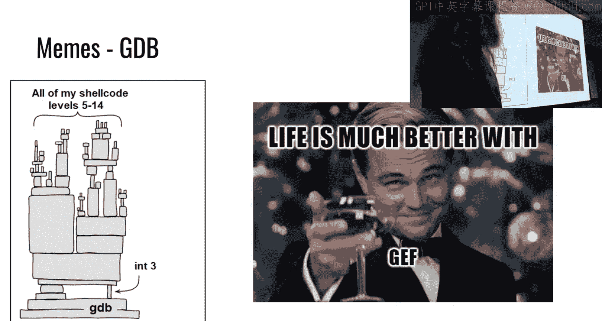

So we also made rough strategies for success and some some like tricks and these are challenge specific depending upon how far you got through the module。

 you'll know what they're actually talking about and if you didn't get through the module this is probably good advice to consider on the problem you're dealing with。

😡，So we showed on Thursday siblings what they are and how they can be beneficial， good being。

 one of the challenges is you can't use cis calls， right you can't have the cis call instruction。

So what happens if instead， it turns out here a ciscal？I think has at the end is OF。

 it's like OF05 based on this theme， we can have something that is not a ci call and then modify it in place unless as the CPU processes that would change the assembly so we could have self- modifying shell code。

 that good mean， this does require that region memory to be readableriable and executable。

 which is not necessarily the case in general， we did this for these challenges。

There's a challenge where the code the challenge would modify your shell code and it would say all right。

 you get 10 bytes and then every other 10 bytes we're going to mess it up and make it so this breaks what was a strategy we could employ to address that problem。

 we could jump over the mess that the challenge is making so we read a couple instructions we'd hop over this mess。

 we start executing some things we're interested in and repeat it very much like this Paul Walter solid main。

And then some people realized for the very kind of tail end of the challenges。

 you get very constrained as far as the number of bytes that you can use and one of the great tricks there is to deploy a two stage shell code where the first one just calls Re and the second one can basically do whatever it wants。

 solid name。Moving on to the kind of memory corruption side of things。

I didn't talk about it in class was in the videos as people got to learn what a canary is。

anyoneDoes anyone here want to tell me what a canary is。

 we've got one in the back it's a value on the stack that basically。En of a buffer so that basically。

 if this canary gets overridden， the program will automatically about be check what the value is。

 it will stop。Okay so the canary is kind of this magic value that exists on the stack and so in the event we are doing some type of memory corruption buffer overflow。

 we would overwrite this magic canary value and when a function returns it checks the canary to see if it's been modified and if it has it blows up instead snack smash and detected and it causes problems in grve for us so canaries were something you probably didn't see in 365 but we got to mess around with them a bit right here。

😡，We also dealt with， this is not a canary for me。And so the canary always ends in the least significant bite with a null bitete and that prevents people from overreading into that canary。

 there're driving a reason for that， you can take advantage of exactly that in some of the memory corruption challenges。

Generically， the canary protects and saved RVP and saved RIP。

 you can find other values on the other side of the canary as well。

 but generally speaking will be those two。Some people have a burning passion and love for canaries right that's perfectly fine as well Oh this one here for memory errors level9 is not about canaries Does anyone know what it is about？

Let's go right here。Okay， the randomized nibble， so another thing that you may not have dealt with in 36。

5 is。Something that's called ASLR， and then how that relates to something that's called PIE。

These two mechanisms are different， but they functionally accomplish the same thing and that is memory addresses will suddenly start to be randomized the page that you're。

Data is getting mapped too is randomized， so now I can't just know before I start the challenge where is something in memory because these locations change every time you run it。

One of the strategies that was employed to kind of solve these challenges was to brute forcet so we could have an exploit that did a partial override。

 bite is two nibbles。The first three nibbles are constant。

That means we have one nibble that is randomly generated that we are guessing that can be any value from  zero to f so it's 1 in 16。

 so we would have to run this on average 16 times before we would see success。😡，Some of you。

 I'm sure if you did this were unlucky and had to run it 30， 40 times。

 this is where having confidence in what you were doing and looking at it in GDP is important。

Because I can't just run it and assume， oh， it didn't work， I did something wrong。

 you have to understand the concepts at play here and so here we have somebody that's going to just keep up entering until it works where someone else could give up early。

 solid main。U'll enter so if you're at a terminal you hit up it'll give you the previous command that was ran enter with run it I could then hit up get the previous command and then hit enter and run it now my personal suggestion is you can discover this amazing thing called the for loop but if that's your jam。

 you don't have at it。I'm not teaching basic computer science concepts here。I included it twice。

 so we saw that。 alternatively， we could do the up effort。

If you did brute force it like you did something silly because there' are some of the later memory corruption challenges you can actually leak out the canary and then know what it is to overwrite if you are just writing some insane for loop to groupte force something。

 if you got the flag you solved the challenge you may not have used an optimal approach playing the flag you get the points。

 I don't really care how you did it， but I'll certainly try and guide you to the most efficient path。

Great， and then every。Every time we finish a module I try and give kind of a status update here as far as what are grades。

 I normally don't have so many grade related memes but you guys did a good job of expressing how you felt grade grades we're doing and as I go through the next next couple slides here with some actual data on them I don't think these memes are that far off for some of the people that just try to tackle this module。

😡，The course is probably over for you。All right， simply because this content builds up on itself。

You're welcome to follow along， but we are not going to push the deadline。

 we're not going to like delay what we're talking about。The beginningg first two lectures。

 I wasn't making stuff up when I said this is going to move fast and be the hardest course that you' probably take in your undergrad。

😡，So if you were betting on that， you made your own back。

For those of us that weren't familiar with shell coding this is something brand new and you happen to solve shell coding level four at the very end。

 thank you for that twist try and be motivational also right hopefully you've learned a lot getting there right but from a course progression standpoint I can't teach assembly over the course of this semester where we're teaching a number of concepts that kind of depend on that so I found these very very amusing but at the same time。

😡，Yeah， there's kind of a sad undertone there。Now， part of the reason that this module was so hard for people is this rank here。

😡，There are people who took 365 in 2022， there are people who took 365 in the spring。

 and over the summer we just kind of forgot about it。

I understand and I empathize that's why we did kind of a trial by fire here All right。

 hopefully some of those neurons started firing， you put it in the time you bustted your butt and all of a sudden you're like。

 oh I know how to read some assembly now I have an idea of how to use it to bugger I had to learn these skills to progress。

So hopefully those skills。We're made up this module， so then when we use them again。

 you already have them and we aren't spending time kind of refreshing stuff that we knew at one point。

😡，So one of the things that I'd like to look at this is not grades for the record。

 this is solve grade。So every line is some student that made at least one solve right and the time that you did it。

 and so this is from when the module launch to I think this is like earlier today。

 I pulled this earlier today。😡，And what I'm interested in。

 there's a lot of lines here and so I'll improve this going later for like next week or next module。

There's a couple of things that I look for when I look at solves， it's where do people start， okay？

That there is an interesting kind of cluster over here。From Sunday， Sunday Monday， right。

 I understand if you started Saturday。How many slides did I say start earlier， right？

I don't manage your time， but I can certainly take a look and see how you chose to use yours。

And that that helps me know， okay， was it that everyone started on day one or day two and we just like grip walled at seven solves right there was just this challenge that was just super hard。

 I would see some type of pattern here this is a bit nois here because there's an order of people in the class so I'll try and compress this or average this to show trends the next time you see this。

But there certainly were people to start late。We can all tell ourselves that we're going to do better next time。

I've taught a number of these courses， it will happen again。Great distribution。

 this is what you're actually here for。So we see kind of this like U shape， right。

 which makes a bit of sense that this isn't everyone that is registered in the class because this only shows people that have linked their discord right I'm assuming those that still haven't linked their discord are on the left side of this chart and hopefully are pursuing other opportunities。

😡，It's a good thing that we don't see anyone right here between  point4 and  point。

5 because that would mean that you did enough work to just not hit the checkpoint so people either didn't hit the checkpoint and just。

😡，Fned it in， so this is  zero to 10%， that's 30 some odd people。

 that means they solve like two or three challenges and then over here weve see there's about 30 people that solved everything。

I don't hate this distribution， all right？You can disagree with me here。

But I would assume these people are considering what other things they could do。Or they're like， hey。

 I know I messed up because I started on Monday and it turns out if that was a mistake。

 this was actually hard stuff。So they will either fall off of the grade distribution or they will drastically change how they're going to function going forward。

Another way of kind of looking at this， if I just average everyone that is registered for the course for that first module it's 54%。

 but keep in mind that 30， 40 of that are zeros。😡，Literally did nothing。

so if we assume that those people have simply decided they're not going to try and pursue the class。

Then we would had a class grade of about a 64。Now remember this is not with extra credit。

 so if you got all of the extra credit throughout the semester， you completed 64%。

 you had 13 on there， that'd be 77 that'd be like mid high seat。😡，Okay， so keep that in context。😡。

啊 if i。This was just ignoring people that solved nothing if I ignored people it solved less than three。

 so that's roughly that that entire far left 10% side。

 okay I solved the first one and just realized this was a brick wall。😡。

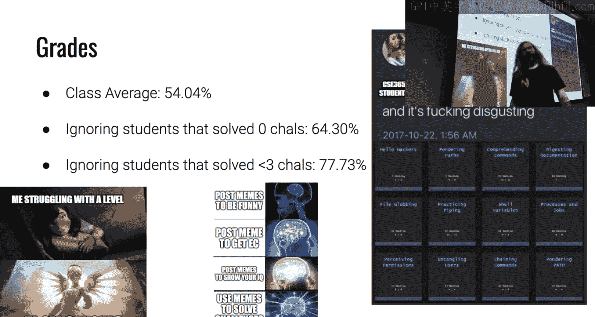

Then the class average is a 77。73%。😡，And so what we're seeing here is a pretty clear division on people that are have the prerequisite knowledge。

 started early， moved through stuff， and then people that did。

Just want to be transparent about how I'm interpreting this data。

 I don't think I'm far off if you think I am I'm more than happy to hear your take after class but as a whole that is very much how it reads to me。

Now if you are struggling in the course， we do have the TA office hours Monday， Wednesday， Friday。

 everything I've heard from anyone that has talked with the TAs， they've said it's amazing。

 they've gotten them unstuck， they have spent time telling them what's going wrong。

 I drunk by by one of them and like after hours who whoever's still hanging out and tried to help people as well。

If we're not streamed， I'm more than happy to try and help you with exactly what your stuck on。

I've also been pretty available in the Discord， I don't think anyone would argue that I've been not accessible if you are stalker had a question。

And again， you can post beams， get that extra credit。

 keep that in mind when you're looking at these numbers。😡。

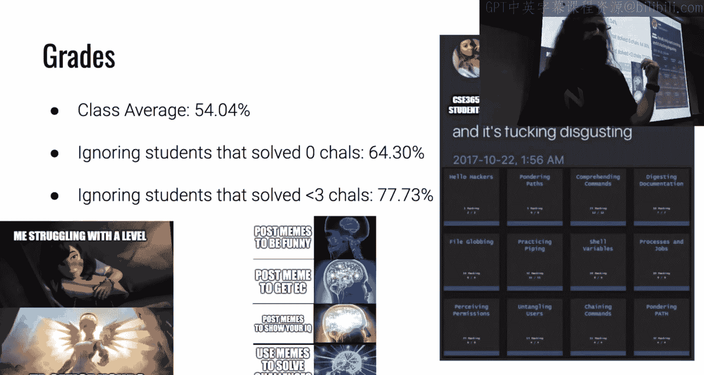

Logistics。With that grade kind of discussion brought up， the drop deadline at ASU is tomorrow。

So you are free to make whatever choice you think is right for you。

If you are on the far left hand side of this distribution。

I don't know that it will result in a positive outcome greater life at the end of the semester because we are going to continue moving at a fairly rapid pace and the concepts and things that may have been missed here are going to be used again and again and again。

So we won't drastically change from what you experienced this past week now this sketch module is two weeks which means the checkpoint is one week and then you have another week to work on it The topic that we're going to talk about is reverse engineering。

😡，Typically， this is one of the most difficult modules。That people read into。Okay。

I'm just telling you， so you know if I'm just brick walling this。Yeah。

This is one of the harder ones that the user ones are the ones that are scheduled one week on the schedule。

 which I didn't have it scheduled on the slide deck。But if it's two weeks。

 it's two weeks for a reason。Okay。36% of people that registered for this course on day one have dropped the course。

Now I said in my initial two。UTo like syllabus talks that in general， this course。

 has a 40 to 60% drop rate， right？We're approaching that and I think as we hit the drop deadline we'll cross over that 40% threshold so I was not making this up。

 I encourage you to make the decision that's right for you。😡，Because if you decide the strategy。

What you will be doing for the remainder of this semester。

 very much so is working on home College challenges。Working on these assignments。😡，嗯。

Same thing reiterated。All right， advancedance reverseverse engineering is going to be launching tonight at 6 pm that's already set up。

 I have not added anything to this module， I know I initially I said I was going to I'm holding off on that for right now to kind of see how things play out because this is actually shorter than what this module is this module that you were getting at 6 pm is actually like half the size of what previous CSE466 students have gotten the first half is what was taught in 365。

😡，And in that case， CSE 365， you didn't take it， either your reverse engineering simple crackme。

 so control flow starts at main， and that it's pretty much a straight line。

 all of the functions are embedded or not embedded， but in line。😡。

And so it's a pretty easy thing to reverse engineer and then the second half of the kind of traditional reverse engineering module is a more complicated program。

😡，That has many functions that call each other and has a lot more complicated control flow。😡。

I'm still on the fence on whether or not I'm going to add more stuff。

 if I do add stuff the intention is not to make it drastically more difficult。

 but it's to complement it with some additional。Topics that currently aren't touched in the reverse engineering。

 I'm kind of having a bit of a back and forth with some other people on whether or not that would be beneficial for you or not。

 just as something else to explore instead of these， I think。

 24 challenges that are just a straight line of increasing like difficulty and complexity。

I mentioned I'm going to try out into office hours， I had submitted a roomor request。

 I'm shooting for something over in BYENG at noon on Friday。

 I haven't gotten the response back yet when I know you'll know。Demo plans。

So does anyone have any questions about something from module1， something I was stuck on？Yeah。

 I don't know how to。What is it blood。次大个。Okay， so the question for Twitch is I saw some of these challenges have this this back door。

What is that， how does that kind of fit in here， why how do I use it， why does it matter？

Does anyone have anything， anything else likeve three things that I kind of expected to be asked was ASLR。

 PIE， how do I reason about it， did anyone have confusion with those？Got I got a couple。

It's kind of related to ASR。It has to do with the counter variable in column 9 to1。O。

So that's a hard one for me to demo。I haven't talked about it offline。

And then let me see what Twitch says。Twich says， what the heck is yawn 85。Yeah， that's this next one。

 so that is something you're going to become you know， very intimately acquainted with。

Because I said that the second half of the reverse engineering content that exists on Poone College has a more complicated program that has other functions。

 that call functions， and we have to navigate something that isn't just a straight line while using our hard tools。

The vehicle for this is something that's called Yon85 Yon85 is a made up CPU architecture。

And the base， like understanding of well what these programs are is it's an emulator。😡。

So we have a made up architecture that we're not going to describe to you that has its own instruction set and its own implementation。

And。All of these programs are going to run code or take code that is written in this made up language called Janwn 85。

So you will be reverse engineering something in X86。

That is a program that is an implementation that runs Ynd 85。mayy not make sense now。

 it will make sense come Thursday， yes。I mean， we can still use like the classical river。

The question is， does that mean we can still use classical reverse engineering software？Yeah。

In the examples given or Ida anger management I'm going to throw in GDP there right can I use tools I'm familiar with the answer is yes。

 you can use those tools and you will need to use those tools the。

Reverse engineering is a very hard thing to teach。And the reason for that is I can explain to you what ASLR is。

 I can explain to you what PIE is， I can show you in G and dump out memory and be like。

 this is how this works。😡，The act of reverse engineering is using those tools to look at something you don't understand and figuring it out。

😡，And so while I want to be as helpful as I can。A lot of questions are going to be。

 what does this do or I don't understand what I'm looking at。

 and the response is going to be something similar to reverse engineer it because that is the act of reverse engineering。

Okay， I'm more than happy to provide tips and techniques and run through some things。

 but this is a lot harder topic for me to tell you like this is what is occurring because that is what you're supposed to be figuring out。

So does anyone know what an emulator is？And the back。It's just software that it's used to。关注。希な。

Our programs are any。Okay， so the answer and my understanding of it was it's a program that is written to run like programs or other instructions。

 like instruction sets that aren't meant for the native machine。

 and that's a loose approximation or a pretty good off the hip explanation。

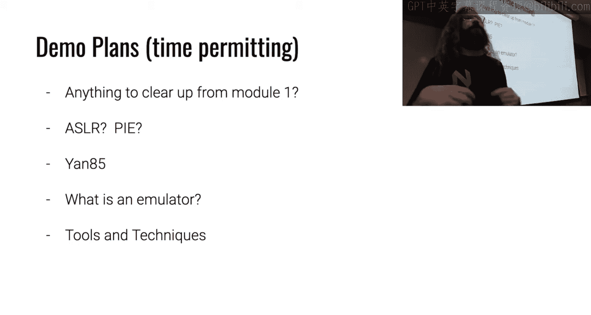

So I'm going to look for。

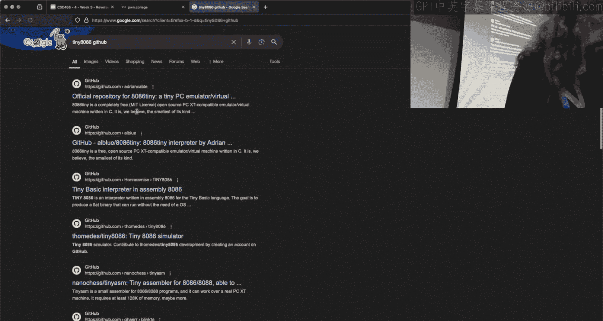

I don't know that this is the exact repo I'm going to use。

 but there is an emulator called 8086 tiny all right。

 the 8086 is a CPU that kind of is the precursor to our 32 bit CPUs。

 it's the precursor to our 64 bit CPUs that we have today。

 there's a lot of history and backwards compatibility reasons for why things are the way they are in modern CPUs。

How big this entire emulator is written in one C5？How big do you think they sea filess。

 how many lines of code will include white space， how big is this file， take a guess。05000。

Anyone else， what have we got？先倒是这で。10，000 to 50，000， okay。

 so we're definitely somewhere in five figures， right， that's what we're thinking。200。Close like 200。

 200 you would have won the prices right， the answer including white space is 723。Okay。

 now I'm not telling you because I don't know how many lines of code the yan 85 emulation Bla is。

But it's not that many lines of C to implement something that is an emulator。Now。

 one of the things that's important。In reverse engineering is kind of thinking。

 how would I implement something if I had to accomplish this task？

An emulator is really like what you envision on physical hardware being implemented in software。

What do you think these are El it says right there？The registers， just like how you've learned X86。

 well we implement the concept of registers in software if Yon 85 is an emulator for a made up architecture。

 do you think it has register somewhere in memory， answers yes？In an emulator。

 we we have to have some concept of what the memory space， see that I can find her here。

 looks like we have to have some idea of what are the instructions that we're going to run。

 they're going to find very similar things in these Jan 85 binaries that you reverse engineering。😡。

In the next module， and they're going to have very similar patterns to what you see here。

 yawn 85 was actually also written to emulate the 8086。

So there's going to be a lot of similarities here。My plan for Thursday is to compile this。

 which I have a compile version， but open it up in IDda， open it up in GDP。

 open it up in binary Ninja， see what this looks like。

 I'm going to start working on this in reasoning about what I see in a different emulator。

Hopefully the things that I find as I work through this。

 which I haven't done like we'll do it live and see what happens willll map to what you see when you work on these John 85 challenges because it's going to be a very similar design。

All right， now to circle back。I didn't write this down。Okay， I know there was a question about。

Saved ourIP。There was a question about。We saved RIP， how do I find that in GDP？Iport challenge。Oh。

 you want to know the trick there。How make R cycle equal to R。So that's your mistake I spent so long。

 but I don't know if you were the way I was talking today the very last shell coding challenge says says to you only get six bytes of input and the trick here is to do as one of these memes say two state She code right so you're going to call read and one of the problems there is I need to set RSI I don't know what RSI is but you need RSI to roughly point to RIB right？

I don't want to pull it up because then people will exactly copy what I do here on stream。

 but somewhere in one of those registers， if you just throw in an in3 and then break and take a look at it。

 somewhere in there is a memory address that is remarkably close okay。

 so the statement for Titch here is but that location is before in memory。

And that means we're just broken， right？How many bytes are you allowed to ride in your stage too？

I'm still this。But you were able to call Reid and you said， but I couldn't read five name。包括。So okay。

 but you saw this pointer right at six bites。So you could。I don't want to say it on stream。

 but you could cleverly decide find a way that was definitely mentioned in my office hours when I was kind of playing around with different ways to move things。

 I want to say I touched on it unless you're stick how do how do we move stuff around and try and do it in with less bites so says somehow somehow don't spoil it。

 otherwise I have to take down this video sir and then you learn nothing right if you refer it to it in the future？

Um somehow we could move that that memory address to the location that I'm interested in。

 and you are definitely not bound to a small number of bitetes。So if I was。Let's see。

 what is this guy？Oh， this is a short code run， okay， so I want。This。

This was the example binary I had that I did the memory corruption video on。

If we open this up in GDP。We run it。Right now， program what is the program doing？

It says what is your name， it's blocked， it's blocked on read。I can control C。

 I am now inside the read call。I'm going to finishning。And then we'll just give it some maze。

 that's a good time。All right。IfWe take a look at RSI。

That is where my A's are located right so somehow I have this read ability。At this location。

If I examine， we'll say 20 giant hacks at RSI。Is it a problem if？I'm trying to parallel here。

 I can read the here， what if my rips over here， is that a problem？And why or why not？

If I can start controlling data up here。But R is pointing down here。Can I get to here？

just write more。So if you were able to get that pointer。To be not exactly equal to it。

But nearby right， so somewhere， somewhere a little bit before it， maybe even a long ways before it。

 I think that one lets you rank 10，000，20，000 bytes if I remember it's some insane number right so so if that point it was just like anywhere before here。

 we could just send a huge payload and we'll get where we're going。

Again you could math it out and say okay， from here to here is what do I got 1632， 64。

 I stopped math at 64， 64， 80， 96 all right， I have 96 padding bys before that location if you wanted to math it that's totally fine and that's a good thing to do right if you want to be precise in your exploit。

 what else could I have done。If I just don't want to do the math。

 we did it in the earlier shell coding levels。Well， we could say a bunch of A's， but if we a。

 what happens when R looks at A， is it going to be happy now， it's going to blow up？

What else could we do？We could use thatOop， we could employ anpsled。

I don't have to know how far this is， I know it's less than a thousand， here's a thousandnobs。

Let it cruise on down， it'll get to the end。Because it not is a great instruction， it's one byte。

 so I don't have to care about how it's lined up here。And it's not going to change anything。

 so we just make this slide and the rip goes we all the way down to the end。😡。

And then at the end of that slide， we put whatever we want to do。You could have done that。

There is a super secret fightbyte payload that doesn't use twot， but I don't know what it is。我's。

Let's see what else what do I got coming out of here on Twitch， anything， anything meaningful， no。

Okay。How do I， I'll just show you， check S。It's kind of this generic command to get an idea of what mitigations。

A binary is compiled with I just did this at GDP， but we could do the same thing。On a binary。

On the terminal that's going to tell me raililroad， which we haven't talked about。

 is there a stat canary in this binary area？NX is the stack executable。😡。

And then is it compiled with PIE？😡，These are things that we want to know because they influence what we're going to do when we're working on this。

Now， since this doesn't have a canary， I think that's kind of la for me to answer the how do I know where saved Ri is？

So let's debug cap。All right， Ka's a pretty， pretty simple program， right， We can do the same trick。

 I'm now inside Re， I'm going to finishny。I don't know if this is going to have a canary。

 we're going to find out。哎。Info frame is the。magicagic GDP command that we'd be interested in this tells me where in memory are these saved registers now normally for most of the challenges what you'll see here is RVP at something and then RIP at something that is not telling you what the saved rip is it is telling you where in memory it is so if I were to just copy that。

😡，And then say examine the giant hacks at that location， that is the saved threat。Now。

 if this has a canary。I should be able。To see it， I'm going to say show me 20 giant hacks at wherever saved rip is。

 minus， I don't know。응。嗯。Don't see it looks like a canary there。

How would I know what I'm looking for when I'm just kind of dumping out memory？

What do we know about a canary， it was on one of the memes。Right。

 the least significant byte is always a zero， so one of the things that I don't believe was mentioned in the slides but is relevant for this precise moment。

Is not every function has a canary。It turns out compilers。Compilrs are somewhat smart。

And they recognize where there are- so there's no canary in this function that I happen to be in。

But they recognize where there is the need for a canary right are we reading an input onto our stack frame if there is then we'll have this canary check I said there's no canary here how do I know that well I'm looking at what's going on right before the rent I just dumped out a bunch of constructions here at RIP until I saw a rep and like okay that's the end of this thing。

😡，If there was a canary， we would see the track somewhere right here。The canary is tracked， oh。

 I remember the back door。This is the important part， why the back door matters。

Let me find a binary that does have。

And that command is stack check I'm sorry， which command the one that like would be checking for the canary。

Okay， the question was what was the command that I ran to tell me what's going on with the binary。

 what mitigations， it's check S CHECK， SEC， that gives me this output。

 you can run the same command in GDP and it should give you a similar output I was saying the check stack。

Like when you're looking for to see if it has a canary last year。

 you said there's a command where it would be checking Yeah， so I'm going to break my own rules here。

 I'm going to grab one of the challenge binaries but I'm not actually solving it that I'm just using it as a stand in here so we can see something with a canary。

嗯。10， 10 probably has a can， seems reasonable。It's otherwise I I'd grab random like Linux bins and we'd eventually find one。

 but this is probably Quaker。

We run checkS on it。No， canaries， he， these are super。

Super easy。😀へへ。😊，It' so true。That's fair， that's fair。Go to the jail。All right。

 let's see nine challenge。

嗯。Oh， you got me there， see？Good call。I do bonehead things to you guys。

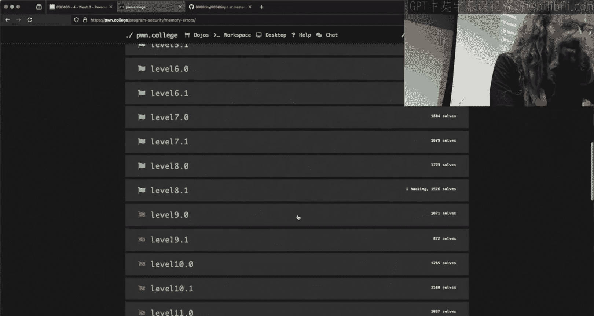

We guys tell them look back at my office hours and figured out why I couldn't shift shift left or shift right。

 bit shift to zero。I imagine I was shifting one register and then printing out another。Okay。

 there we go， so this has a canary。So if we run this guy。It asks for payload size。

 then it asks for a payload。We're going to do that same trick here。

And if we did info frame we see saved RBP and saved Ri。

 so most of the challenges here there are not extra registers that need to get saved like I did with we saw what B cat and this is typically what you'll see Now if this is where saved RVP is we could examine like 20 giant hes。

At that location， and we'll go like 20 behind it。Do you see something that looks like a canary there？

Okay， yes， so we see something over here， we kind of immediately identify， hey， this。

 this is a weird looking valley because。This 55 pattern tends to be pointing to something that's executable something in like the text section if you're a binary or7 FF。

 this is more than likely like a stack point or pointed to some piece of memory but this right here is a very strange look to it and it has that least significant byte as zero so we found our canary where was it well our saved RBP was a500。

 here's our a500 it was directly behind our saved RBP。😡，So we could use。

 and as you saw with CA when I pulled it up， there can be more registers being saved。

 there can be more data there， but a general like loose rule of thumb is that it will be located directly behind the saved RVP that you can get from In frame。

And that's that's how you can locate your canary or locate where your saved return address is。

 so I'm just on the other side of Reid right now， if I were to print RSI I get a490。

 then we see that saved R is at this location here so I could print as a decimal one minus。The other。

And I'm not saying that we can do that here because there is a canary。

 but if I was interested in what is that distance？It's 112 bytes。

 and so that's how we can kind of reason about where things are located in memory if we wanted to do that。

The other thing that was asked here is how did I know？

That there was no canary when I was just dumping out assembly instructions。

And what we saw here is I said， oh， I would look at what's going on。Right before the rat。

And what we see here， this does have a canary， and so we have this call to stack track fail the what's actually happening here。

 the pattern that you'll see。Is this right here is grabbing the canary off of the stack and putting into RCX。

Now the program has another copy of the canary located at this。

 we're just going to hand waveve this away， this magic location， FS Hex 28。

And then we're going to Xor it。So if it's the exact same thing， that'll be zero。So， then。

We jumped to leave and rent if this X word is zero， if it didn't X word is zero。

 we go into this call this fact check fail， we blew up， that's where you get your error message。

So why is？The back door useful was the question。What does the back door do？知道这家在这里。为什么？

One of the comments from Twitch is I thought it was GS Hex 28。There's reasons。

 but depending on what you're looking at， it can be one or the other。啊。not important for for aid。

 so the statement for what does the back door do is。It calls the function again。

 it calls itself recursively， is that accurate？Right。When is the canary。

 just based on what I've already showed， when is the canary checked and it blows up？ま到する。Right。

 I'd function return at the end。Now， I don't know that this has a back door。

 this is some randomy challenge， but hypothetically here I could。Make this call itself and recurse。

If it calls and recurs。Did we check if the canary is overwritten at that point？No， we've recursd。在这个。

だけ人さ。So this I believe is a function called challenge yes， so Maine for this particular binary。

 right there's a main function， mainine calls challenge and that is where I am located。

This is at the end of challenge， so if I disassemble。Challenge。

It's going to overflow the screen there， but this is the end of the challenge function right so when the challenge function returns。

Is when that canary is trapped？😡，If instead of returning。We recursed and called challenge again。

 did these instructions get executed？那。What that means is that one could mess it up and then recurse。

They haven't caught me yet。Okay， I could mess it up， I could recurse。

ha you still haven't caught me and we could do that until I have all of my information that I need。

Now， then once I have my information。I can。Get past the canary or overwride save rip or whatever it is I'm trying to do because I have。

Leaked out information or done something that I wasn't supposed to and recurd so I didn't immediately blow up I'm going to blow up like at some point at some point these functions are going to return and it's all it's all just going to fall over right the house of cards is going to tumble。

But if I can get what I want done before then。Do I care？The answer is no。

 so what does the back door let you do？Well， if I had a buffer overflow and I somehow messed up the canary。

If I recursed。I don't immediately get caught。That is the baseline of what that gives you。好所以东。

The question is， how do I know I messed up the canary unless I checked it？

So I don't know if this has a。starts。For this， I'm going to have to python you， but yeah。

 so if you overwrote it， you get a stackm air， right？When it's checked， right now。

 how do you know if you overwrote it？And it hasn't returned and told you。

You have to use something like GDP or a cyclic value。

 you have to use some other technique to figure out what the distance is and what you're trying to do you strategize ahead of time right the distance between any two points on the stack is a constant value the addresses themselves may randomize。

 but the distance from the top of the stack frame to the bottom of the stack frame is a known constant at compile time。

There's like a slight asterisk there， but for our purposes， we can say yes， that is the case。

As is the case with most things， right there's always an exception to a rule。

 but if I have two things that are in a stack frame， two variables。That is hard coded。

 that's why we can obtain the distance between those points。

Statically using something like IDda or object dump and just do some math right because that's a fixed distance between you you're shaking your head no okay no I want to know it like if if you're like man。

 you are so wrong like I want to know I want to know what you're thinking so he can either make a fool of me or get us all on the same page。

In。Okay， good culture difference。Okay， no， I apologize that。okay。

 but does that make sense what we get from having that back door？あい。いた。Yeah。

 I know like you know the distance can。哦。大け点。P the value at that distance。

 But they can do it only in GDP， which doesn't allow you to。Okay。

 so the statement was I can do that in GDP， right I could print this like I did a little bit ago。

 I don't know if it's still。Here， but I printed RSI and I looked at that saved RVP。

 and I want to say I found a distance of 120。And I did that that doesn't get me the flag。

And you're correct， I can't get the flag if I'm running inside of G。

 I was 112 right but I found this 112 number using G。Yeah。😊，If I were to run this without GDP。

Is this fact still true？Yes， I hope to study ahead。Something I didnt interview。

The golfship didn didn't match and I was， I don't think。So it's very easy to。Get things mixed up。

 right especially if you're using GDP like this。Where I am doing this dynamically。

 did I copy the right pointer， did I copy the wrong pointer， you can certainly mess that up。

 one of the things that I suggest is a strategy to kind of avoid that get repeatable things。

 is to script what you're doing， either via iPython or using GDP script。

 which is just a file that has these exact same type of commands。

 is is GDP will execute them in order， and so that allows you to have a fixed set of actions that should bear repeatable results。

😡，And so then you could run your script and be like， hey。

 this isn't showing what I think I fixed up my script， it's a lot more rigid process。

My guess is that is what was occurring。As long as we're living over here， that isn't the stack。

 but we're dealing with stack locations， what I said is true。

Um when you start getting to dynamic things， it's true。

 but then we have to have a great asterisk behind it and explain why。

Any other questions about the current module， anything that I didn't cover there？😡。

So I something you're like， hey， I saw this， I didn't know what to do with it I didn't know what it got me。

I don't understand what PIE is， I don't understand what ASLR is， we're all good on all of that。

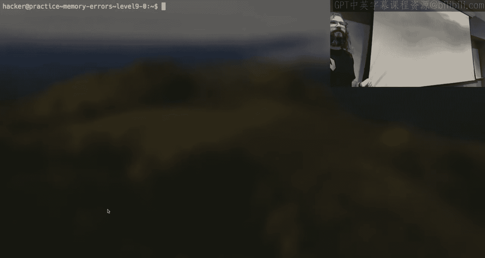

Yeah。5。All right。With that， then I guess I can start looking at this 8086 emulator。

We've got 15 minutes or so。Twitch。Twitch says。Camera is not based on Facetime I there going to be new challenges in this new module so I had a slide earlier here。

 the answer is as of tonight at 6 pm no。But I am considering it for like seven days in。

 like I already know what would be there， but I'm not doing it here on day one。Okay。So。

Do people have a strong opinion on what。😡，Decompiler they use。Anyone like Giedra。

 I' had a binary injury， I don't care， just show me something。All right， so objectively。

 the kind of consensus， the best tool is Ida。

It tends to yield。Easest to understand。C like syntax， all of these are installed on the Dojo。Iidda。

It's located up here， this little Monna visaa looking。Icon。You may have used it already。

We're going to open up。

Yeah。Maybe。This 8086 binary。And it gives me as。Now。

 the whole reason that you use a tool like this isn't necessarily to look at assembly。

 it's to look at some C like syntax to use Ida。The number one button you need to know is tabab。

Now not an insanely complicated tool to use。😡，That will lift up that assembly to some C like syntax。

 however， there's a lot of information that's lost here， what is the name of this function。

 where am I in this， what does it do， Ida doesn't know right we have to provide information to this tool to try and recover it and make it look like C syntax。

Now。

A brief aside， since I know that you're going to be doing this reverse engineering module here。

There are。Point zero and point。1 challenges。😡，Very similar to what we had with the memory corruption。

 these are going to be the exact same type of。Challenge。The same subprom exists。

The point zero has symbols。Anyone know what that means？

N for the functions like names for the functions， exactly。So if my personal advice to you。

 the first one， you get here is 12。I think I'm going to spare you the 8086 I rather I'd for today 15 minutes。

 we're not going to get too far， I'd rather show you some tips and tricks for working on stuff that you're actually going to be dealing with here tonight。

They're just in hindsight。If I open up 12。0。In Ida。My 8086 had unknown， unknown。

 we don't know what any variables are。

If I open a point。 zero challenge。Ida is going to have function names， it's going to， again。

 just hitting tab， it's going to have function names。

 it's going to have things that make some sense and are maybe recognizable to you。Right， so。

This is a function in the yawn 85 emulator， it's called ciss open， what does it do？Well。

 it calls open， so this is a wrapper in the emulator， if the emulator needs to call open。

 it still needs to interact with the underlying X86 this call open， not particularly interesting。

I can hit X if I want to cross reference a symbol so this is there's something I want to know where is this all used in this whole binary in this case cis open is called in one place it is called right here so I clicked on the symbol I was interested in I hit X it gave me a list this was a list of one thing I double clicked on that one location okay cis Open is called in wherever I am。

😡，What function and am IN I mean some function called interpret cis。

Any guess on what this thing does？还事死一样。So again， an emulator is a program that needs to。

Pretend it's a CPU right or pretend that it's doing these operations so somewhere in the CPU it's like made up architecture。

 it has to have something that's very similar to a cis call that you've seen in X86 right when we write Amy's when we wrote shell code we had this cis call instruction。

😡，Yeah。Well， Yon 85 has to have some similar abstraction。And so this is a function within yan 85。

That interprets the on 85 Bte code。😡，And then call the corresponding x86 Cis call。

And so when we're looking at this， we want to be having that mental model of does this how does the CPUU work as registers how did we write assembly right instead of these program this emulator running X86 assemblyly。

 it's got to run Ym code assembly， what does Yn code assembly look like。

 I don't know we got to reverse engineer this thing and find out。😡，Look at the comparisons。

Look at what is this function tracking。This is something called interpret cis if part of its input。

Ands with four。Then we're going to call open。It's not worth writing this down I'll let you know that working together on this particular set of challenges。

 there's a recipe for pain， there's a lot of small details of these binaries that are just randomized instances。

 so what I'm showing you here for that's something to do with opening。You open up yours。

 that could be eight， that could be 16， it could be some other number。All right。

That's why your process of trying to understand what's going on is to open this thing up。

 read the pseudodoC， try and make sense of it now Emily at the have I found Maine yet I just ended up at some random point of open right what have I wonder about where is this interpret this thing done？

I hit a button， I saw the motion， what was the button？A。Ooh。

 it says there are no references to interpret says or dooms。这也找 over。All right。In truth。

 the first couple challenges try and be gentle。What I mean when I say that is the first couple challenges aren't the full implementation of the YN 85 emulator。

So this is some。vestigigial or like leftover implementation details of the true yawn 85 emulator that isn't actually used is what I would go with。

And so I did this like bottom up approach， I started an open。

 I X refft and tried to get my way up to the top， but what is the beginning of execution of this thing？

If I wanted to go top down， where do programs start running？Okay。

 there is underscore start underscore start is not particularly interesting。😡。

Because that's a little bit before the actual what we consider the usual land program fires up。

 it's a legit answer， but the program that we write in userland， that kind of begins at May。

And so we could go on the left hand side here， find find main into a top down approach to understand what's going on as well。

 it's whatever makes sense to you。And so we can see this thing， prints out some nice help text。

 it says we're going to introduce you to this Ywn 85 thing， it's a teaching challenge。

 which means it's going to output what this Yn 85 code looks like。

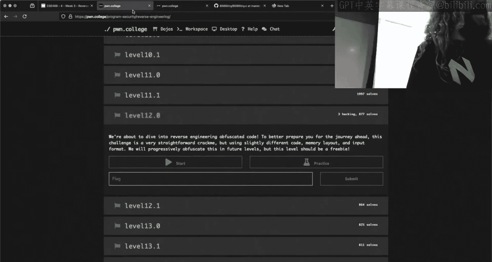

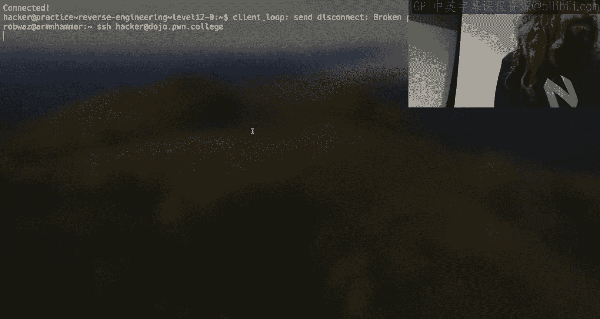

It didn't print anything。It's not a good sign I will take a look at this and see what's going on there if that's an intention if theres a bug with the printout or the black of printout yes it prints the anchor。

So it does print out the incorrect， it's not what I was expecting if I'm going to be honest with you。

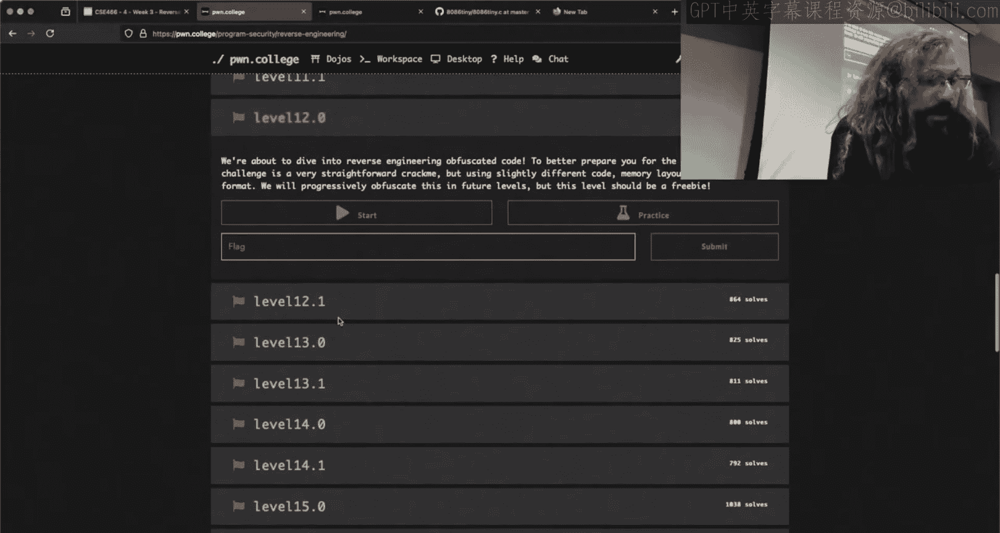

Let me see if I did like 13 does what I'm expecting。

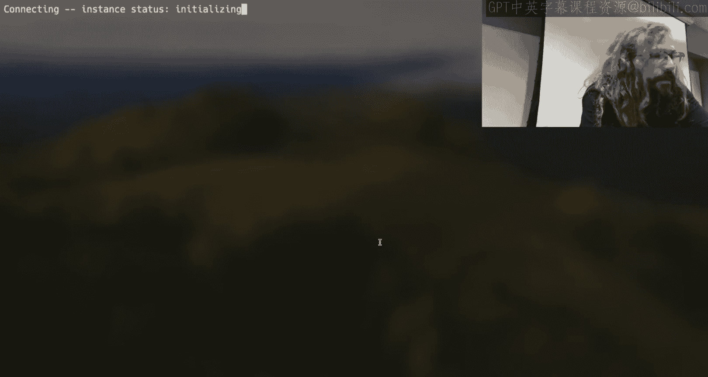

Okay， so that that does something closer what I'm expecting， I'll take a look at 12。

0 and announce on our Discord if there is something like I'll update the binaries for you if they should be。

This is closer to what I was expecting。And so my recommendation to you is not to try and solve like 12。

0 or not to try and solve what is this 13。0。But spend the night just looking at this thing in Ida。

And try and make sense of it。Stare at this output。And try and make sense of it。All right。

 this isn't because level 12 is so daunting and scary。

 it's that every challenge is going to use this stuff and so the earlier you take a look at this and internalize。

What it's representing， is that a hand or note？Okay， finish okay。

 but the sooner you take take a look at this and make sense of what it's displaying。

 the easier it will be to start cruising through all of the challenges。Yeah， so my question is。

 is the idea to。我开。After this Ill put it to us in GDP and see what instructions skills correspond to。

So there's a number of ways to tackle it and there's like this double abstraction to what we're doing here。

 right I can。Run this thing under GDP。And if I wanted to。Now that's finish from here。

 it's a trick you've seen me do before， I disassemble。

Here I'm inside this execute program right I'm not looking at this dynamically。

 but what I'm looking at is the X86， what I'm debugging here is not the yawn 85 I'm debugging the X86 that is the emulator right so you can use both tools。

😡，To reason about what's going on。My suggestion initially and I love GDP。

 so it's a shame that I have to say this， but the right tool to probably get a high level understanding of what's going on is not going to be to delve into this thing in GDP right it's going to be to open it up in Ida。

And understand just a high level， okay， there's main and then what happens？Right， it gets some bytes。

 what does it do， what does this run loop look like this run loop is going to be very similar to your understanding of how an X86 CPU works。

 an X86 CPU when we were doing shell coding。There was rip， it pointed to somewhere。

 it interpret some bites， itd run it， it would increment to the next spot。

 there's going to be some type of similar abstraction here。Now， was that to give a hand Yeah。

 I just that so is the architecture going to be consistent for these levels？The question is。

 is the architecture consistent across these levels？Its the last one。I think so yeah。

 so the instruction set is， I would say right so much like on X86 we have move， we have push。

 we have pop right these abstractions exist in yan 85 architecture as well like add。

 that's a pretty universal term， what do you think this does？

It adds two things right that's not too hard what is this STM well that you probably haven't seen before right it is actually an acronym for something。

And if you look at either this or you look at how this is implemented in Ida。😡，You should be like。

 okay， how does this relate to what I know about how a CPU works？IMM。

 it's not something we have directly in X86， we don't literally have IMM。

But you could probably figure out what it's doing right either from looking at this and reasoning about it or by looking at it and seeing。

 well what happens when IMM is executed on this made up CPU so the actual made up Y 85 instructions will be consistent throughout the challenge。

😡，Throughout the challenges， the encoding will not。

I got a strange face there I see the hand give me one sec。

 I't want to respond to face so when I say encoded it。When we did the shell coding module。

 we could have our Python， say ASM move REX Hex 1337 and the bytes that were resulted from assembling that was consistent。

 I could assemble move RAX Hex 1337， 500 times it'll be the exact same bytes。

The encoding will be different across every single one of these challenges。USo。

 so it's the what by corresponds to like what outcome？

Right that's what I mean when I say in coding so so there is consistency in what is the design or of the instructions。

 there is inconsistency， which is something that you have to reverse and kind of，😡。

Whi is a bit tiresome， but from repetition， you'll get there quickly find it in the binary so that you know what the encoding is。

 yout it out and then use that knowledge。To your answer sir， so my question was。

People about a while ago。The format of these first engineering challenges is the idea to go through。

This printed code and type the predicted output。At the end or in order like actually getting the flag as opposed to understanding。

So so this is a。Exactly the kind of question where I'm like。

You got to reverse engineer it right like if we read the help text here。

 you need to understand what this program is doing in order to understand how to get the flag。

I I believe this may be a bit of a bit of a s spoilular here the first like 12 or 13。

 the first couple， they are using this emulated CPU and like running their own thing all right for those that haven't taken 365 or it's been a long time these earlier。

12l or 24 levels are a crack me， does everyone know what a crack me is？you give it some input。

 it's going to mutate it X or it， bit shift it， shuffle it around。

 and then you have to say all right， here's what it is at the end and work backwards to figure out what is the correct input to satisfy some constraints my from memory here the first couple of these185 challenges are essentially that except now it is doing that on this yn 85 CPU instead of an x86 CPUU and then later challenges the 0。

0 will prompt you for instance， for yan85 bytecode。

At which point now I need to go into look at the implementation of the emulator。

 I need to figure out what are the encodings， what is this。😡。

what do I want to execute on this made up CPU and how do I make this made up CPU do it right we saw when I first opened one of these up in Ida there is。

 for instance， open there is an ability to make this program call open。

 I imagine there's the ability to make this program call read。

 there's probably the ability to make it call right。😡，But the question is how do I do that？

And you figure that out by reversing divide。Now， when I say stare at these。

 stare at a point zero because the point zero。Has those names， they have symbols。The  point。

1 binary do not。So all of that nonsense。

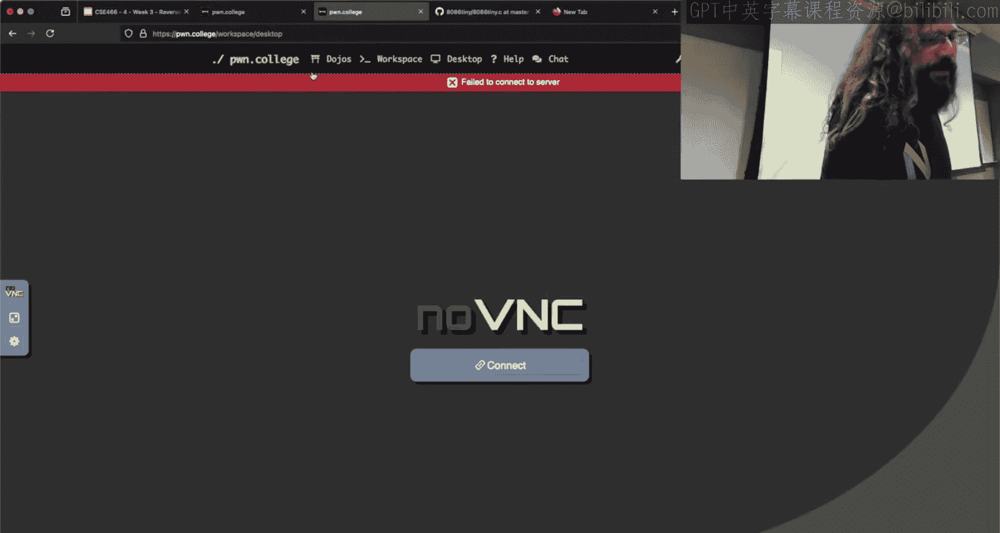

Of everything being unknown and messy。Is what you will experience every other challenge and so my recommendation to you。

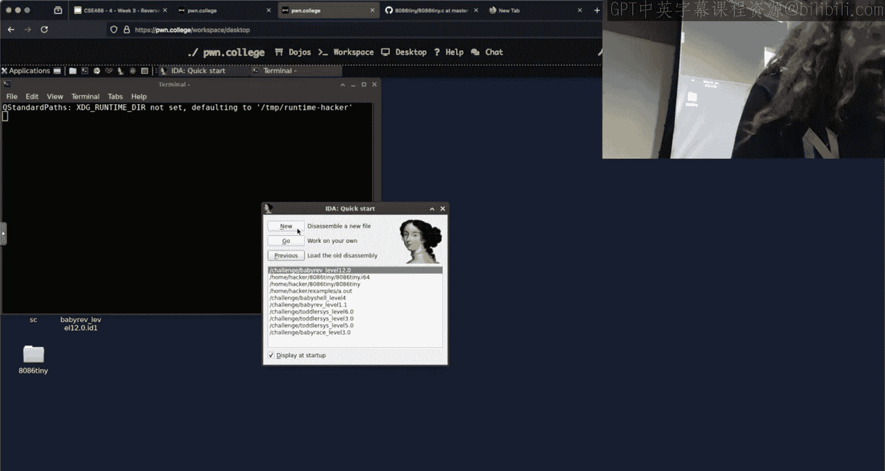

Is to spend a lot of time staring at the very first 。

0 challenges until it makes sense to you how this thing works。Here I am in Maine again。

 we do see like Lib C functions are there， but then we get into sub whatever。Now I have this。

What is this doing？G。The 0。0 and 0。1 challenges are functionally the same thing at a high level。

Spend your time staring at the point zero challenges so then when you look at something like this。

I want to know what is this thing right here， I can look at that and I'm like， hey。

 I've seen this pattern before。Because I saw it in the 0。0 challenge where it had a name。

Reverse engineering is about a few things。High level reasoning。Pattern recognition。

Don't go down the rabbit hole of running something in GDP and trying to read assembly one line after the other after the other after the other。

 I can't do that and I like assembly。That is just way too much time being spent。

Identify high level patterns from the  point zero， use that to inform you about what's going on in the point one on Thursday I plan on spending most of the class time going through and going through like this type of process。

😡，Where I don't know how do I make this look more C like inside Ida you can change or any of these decompilrs。

 you can rename this variable， I could type it， maybe this it thinks it's a char。

 but it's actually an int。These tools are imperfect， they will lie to you。

And so it is your job to correct it when it makes a mistake。

And you could spend a long time changing and renaming these things every challenge。

Or you can stay at the  point。 zero， identify the patterns。So then when you look at the point one。

 I don't have to rename it because I've seen this before。

And so I'm spending less time in this tool and more time getting flags。

Any questions going M overtime？Yes。want to solve。下面直过就我放。

The question is I want to solve the previous module's challenges is it worth it for the grades so the answer is it doesn't matter whether you solve any of the late stuff today where you solve it during finals week。

 it is worth 50% credit at any point。Your highest value action for your grade is always going to be to work on the current challenges。

And so definitely at least to the checkpoint right because that's got that extra the first half so if you were trying to optimize for your grade。

 your time is best spent solving half of what's getting turned at you now at least before circling back it is worth it for the grade so one of the questions on the on topic in class Discord channel was hey I got like a 60 I don't know who asked it and can I still get an a plus what does this math look like if I solve it everything late and didn't I didn't know the answer and so we did the math and if you got a I think it was 61 was a little number if you got a 61 every single mod school and then solved the rest late with all of the extra credit you could walk out of here with a 97 I think it was。

Okay， 61% on every single module for the entire course。

 but you everything late you saw the remainder of them late。

That wasn't a scenario I had on my slides， it was a totally fair pla。

 and so that's where I want to be very transparent about the grades。

 but I want people to also be able to put that in context。😡，you have the ability to solve things。

 solve things late until the end of the semester， you have that extra credit， it will help you。

 but if you are really， really struggling with the course， I try and make the best choice for you。😡。

All right， Twitch chat。What is the program asking for well that'll be a mystery you got to reverse it saying with that we will leave you there。

 I appreciate everyone hanging out， I will see you on Thursday。

