# ASU《计算机系统安全｜ASU CSE466 Computer Systems Security 2024》中英字幕deepseek p06 -07-Reverse Engineering - CSE466 - Robert - 2024.09.05.zh_en -BV1spCGYZE9D_p6-

Take a moment one over here， make sure I see it on the good old T side。It does look like it。

All right， it is a good day for OBS。So today's 95， we're still in what week three here of CSE 466 at ASU。

 the module that launched a couple days ago we were talking about reverse engineering。

 the slide deck that I had on Tuesday we didn't get it a lot of time to actually talk about reverse engineering so this deck's going to be a lot shorter so hopefully we can get into some more application focused things。

Bes， so some people have realized that they are spending a lot of time here and neglecting other courses that is a common pattern。

We are on the other side of the drop deadline， I said ballpark drop rate or we know percentage of registered students that stick it out is somewhere between 40 and 60%。

 that number is at the end of the course， so there's still obviously a withdrawal deadline once down the road。

 but as of the other side of the drop deadline， 45% of the initial registered students have dropped the class。

Just so you know it's writing expectation， I wasn't making up these numbers we're good I'm not going to give any more feels about things being scary and hard because it's a waste of time at this point you've decided to want to ride the train so the train is going to move forward we're going to focus on。

One thing I do like to talk about is kind of progress how people have worked on the current module so it's been not for two days。

 44% of the class hasn't started I'm not worried about it you know you work over the weekend that's totally reasonable those that have started on it when I say started on it I mean they've solved at least one so if I just exclude the students who haven't solved anything they're about halfway through they're 48% through which is a good sign I did say on Tuesday this is one of the harder modules traditionally where it does take some time。

Student reception has been kind of the opposite they' been like， hey， this is actually not bad。

 I'm cruising through it， that's a great sign we'll still spend two weeks on it either way。啊。

For this module in particular， this is gonna to sound like an instructor you know all my work is important。

 but it's really not bad it's not selfd I strongly encourage everyone to try and complete all of the challenges in this module in particular the reason is because of yan 85 which is what everything from 12 onward is which is everything that's assigned in particular level 19 and beyond so Yon85 is kind of a vehicle to understand reverse engineering for this module but it will reappear in later modules so now is the time even if you are crushing it and kind of working ahead and getting stuff done to make sure that you have a good understanding of how this thing works because we are going to use it as an example for other concepts going forward it's not going to be in every module but it's better to wrap your head around it now so that way you're not fighting it again and again and again whenever it reappears。

My personal recommendations as far as how you can optimize for the future is to try and write some type of simple asmbler or disassembmbling。

😡，Does anyone want to tell me what I mean when I say that？Okay。

 the sta for Twitch here was converting yan 85 to bytes。So in 13。

 which is the first level that actually starts kind of introducing the Ywn 85 concepts。

 it has that printout right where it says move whatever we should took a look at it on Tuesday briefly。

 those are like the instructions that one would type in this assembly language。

 but those instructions map to some type of literal bitete。

And so in ase would allow you to write that high level。

I amM A42 or whatever and then your code will interpret that and then output bytes right it kind of lets you speed run this stuff the first levels up until 18 it's not really necessary if I remember rate 19 is the first level where you start having to deal with the raw bite representation in the challenge itself and this is a strategy that if you deal with it now it'll just save you pain down the road so I definitely recommend it as shot。

😡，啊。Deate like said， doing it now， you pay dividends down the road here。Logistical things。

 I did submit that room reservation， I'm trying they're trying to get me on a different day of time than the Friday at noon。

 I'm pushing back once I have a room， I'll let you know like I don't think it's going to be a major issue its just has to go through a more lengthy process if I don't get it back by tomorrow I'll still just be streaming and we'll deal with the tabmic。

😡，one thing that I've kind of noted， I've dropped in。

 I think at one recitation each week so far hasn't been same day。

CSE 466 is not having a strong presence there's definitely people I've seen there and talked to and said hey you know good I'm getting people unstuck but it is a great opportunity if you have like I am hardt on this if you're at recitation someone can sit down with you and explain what's going on in your code and try and help you fix it or understand it and reason about it right there it'll be a lot more catered to your individual scenario then you'll get here in class so that is what you're looking for I'd strongly recommend giving that try it's Monday Wednesday Friday one of the。

Issues I kind of discovered showing up to these is that there is mixed 365466 I'm going to flag a table as just 4466 so that way if you do show up。

 we have some idea that hey， this table is interested in 466 stuff so we can prior the people that know 466 content can prioritize that table over anyone else。

So。One of the tools who started on this and like they've used a D compiler， they fired an Ia， Dira。

 something like that， go everyone， I love to see it。

One of the things that is a little bit difficult here from an instructor standpoint is what tool do I show you。

 right？I'm not going to say any particular tool is better than the other there there's a trade off to why you would want to learn any of them and there are decompilrs and tools that are not on the dojo。

 but I'm going to。😡，Quickly hit some pro cons on the tools that are there and why you may want to use that over a different one。

So Ida is the first one and that is probably what you're using because it is kind of the gold standard as far as what is the result when I hit tabab and I get something that looks like C。

 it tends to output the best decompilation without you doing that much work。😡，With that said。

 you absolutely can misinterpret something and you get something that looks like garbage right with a whole bunch of cash and weird stuff going on。

The free version， which is what is on the Dojo， uses a cloud decompilr。

Now the reason that I bring this up is if we approach the deadline and everyone is using Itda and they hit tabab。

 this thing will time out， their cloud server will just say there's been too many requests lately。

 wait， that isn't El on the Dojo， that is the free version of that tool just sayingTo bad。😡。

We've done all the free requests we're going to for a while。

So know that's a limitation if you are relying on that tool in the back half of the deadline window。

😡，If you are thinking about like working with this stuff long term。

 the paid version pricing of IDda is quite expensive all right。

 Ida has a reoccurring kind of yearly licensing model and the audience that they're targeting tends to be large commercial organizations。

And so if you are interested in using this as an individual， it's probably out of your budget。

 like it's out of mind right to get a paid IDda pro license， but with that said it is the best tool。

 but just know that as you're learning。Another option that you can learn is Gira。

 Gira is used by the NSA it's fair open source decompilation tool， open source is awesome。

 one good thing here is it's written in Java so that means no matter what your platform is you'll get the exact same experience。

😡，Because it's open source and it's like highly exsible。

 there's a lot of plugins and a lot of community contributions for very hyper specializedized scenarios where somebody wants to。

 for instance， vbugs firmware somebody probably wrote some plugin that will map whatever it is your problem is into Guro and in that sense。

 it is a bit more of a Swiss Army knife then something like IdaPro or the other options。

 because of its kind of open source andedable nature here。If you use Giedra。

 the decoupillation happens locally on your computer so you don't run into these cloud problems so if at the end of the deadline here you're running IDda and it says cloud failil fire up Gira it's going to run it locally right that's kind of your escape hatch there the other thing is the workflow is a little bit different so when you have IDda you have one big pan you hit tab to hop back and forth from your C to your assembly。

😡，Gidra's workflow is side by side， so you have one pain that is the assembly and one pain that is the decompilation or pseudoC。

 and then as you change things in one， it updates the other。😡，Whi can be a very good workflow。

 right it' personal preference there。Binary Ninja also has a free version that is on the Dojo binaryary Ninja is a pretty fancy looking to it's got a modern UI so it looks clean。

 which I kind of find enjoyable to use。The paid version though IDda does have its own scripting thing。

 but in particular， Biary Dinja has a pretty powerful scripting plugin language if you want to start working with decompilation programmatically。

And that is one reason you may choose to use I editing that they have a pretty big community where they work on some of these things。

😡，The paid version has many intermediate representations。

 so instead of just having the assembly in the COC。

 you can look at some of those middle steps if those make more sense to you as far as how are they mapping assembly to something else to something else to get up to see and sometimes that helps inform you about what's really going on。

😡，In contrast， it is a paid product， the commercial version it raised。The pricing structure there。

 they are targeting individual users， so if you're looking for something that you're going to pay and use down the road to try and do reverse engineering。

 the pricing structure definitely matches what is， I think a bit more reasonable for an individual user。

😡，Lastly， I'll mention anger management， which is also on the Dojo anger management is a UI that wraps the anger project。

 the anger project does a number of things it's a research prototype would be kind of the way to talk about it it does by your analysis that does symbolic execution。

 it does a number of additional features than just a DD compiler a lot of the work that goes into anger and anger management is actually done by the Sefcom lab here at ASU so you would get to at least when something doesn't work you have someone to complain to。

哎。Downside is that it is a research prototype， so there are a lot of experimental things that kind of get thrown in there。

 it's on the cutting edge， sometimes things break， sometimes things regress。

 it's not a commercial product， so your mileage may vary。

 but it's also free open source available if that's what you choose to use。😡，Just out of curiosity。

 is anyone here not using idle？What are you using？You're using anger management and you're good。

this point I'mOkay， so for Twitch the feedback was。

 you know hey it gets what I need done sometimes it takes a minute to actually do the decom if there is something in particular that like doesn't behave how you expect I do know one of the primary developers of the project and they've asked me if there are like major pain points to surface that to them so if there is something that you find let me know and I'll pass it on。

Okay， that is it for slides。So。My demo plans， first off。

 is there anything that you are stuck on that you want me to show？

Everyone everyone seems to be moving and cruising， you got a hand？sweet tough white。This idea。报备。

啊老师要好。Okay， I'm going to repeat it for Twitch and let me know if I'm wrong here。

 the statement was I was working on level 12， I found a buffer in memory as I was looking through it。

 but I'm not sure how to decode it。😡，Now I don't have the challenges memorized by numbers。

 so'm I going to ask a couple questions here， is it that。

The input like goes into this binary and it changes it up and then there's a comparison。

There's so So just稍那个IC。So。其实系 how you。Buts do。So some of the bytes that are being compared that you need to put into the program are unprincipal characters。

Did you by chance use P tools for the show coding module？YesOkay， and did you see how we could dos？

Let's connect into something here。

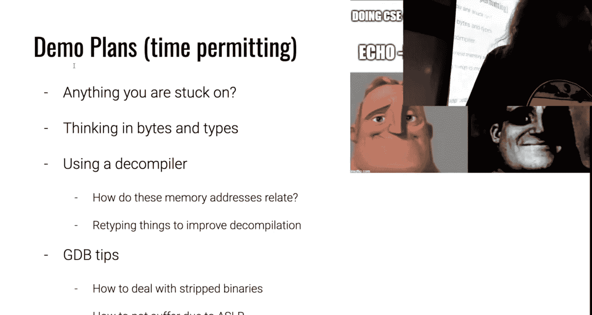

I'll fire up some random challenge。是。Let's we are over here reversing， okay， yeah， all right。

 you know what？

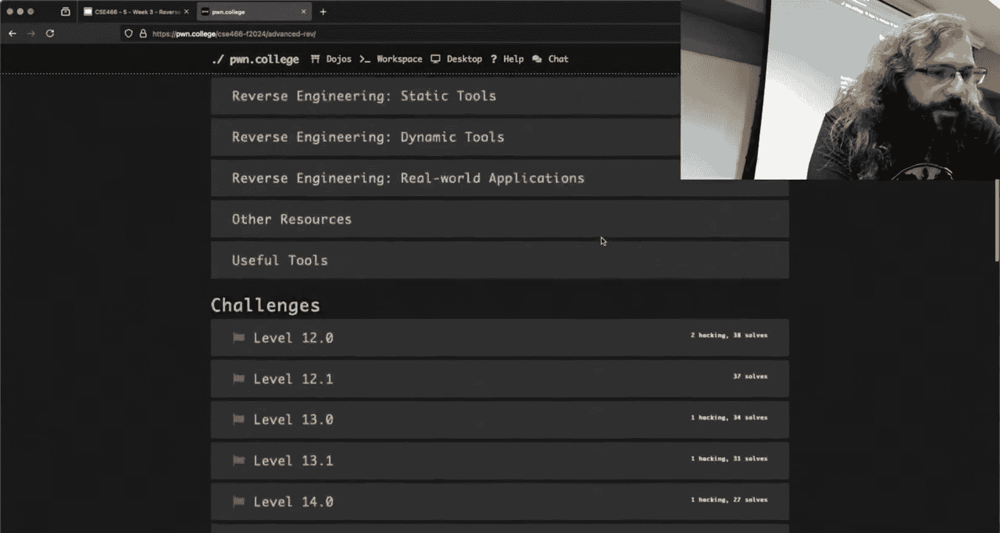

Okay， so 12。0 is the first one I do know， okay， I am familiar with 12。0。

Because that was one of the things that somebody asked about at recitation。

 so I did take a look at it。Now， one of the things that we used in shell coding。

Was we used phonee tools， hopefully I noticed I know there are some resistors where they're trying to like use bash and I respect it。

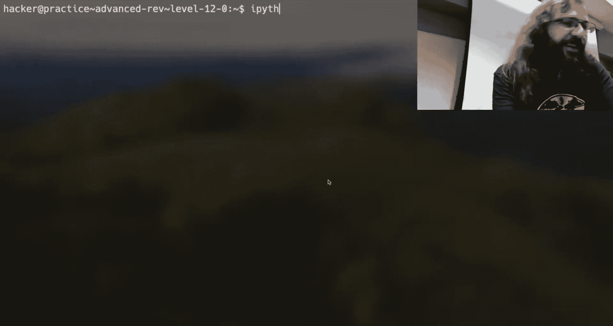

But it's it's not what I would strongly suggest。 and so we we have some type of。A script like this。

And then we do P equals process。Challenge， let's see what I have here， baby Re。Level 12。

0 now I'm not going to open up the challenge in Ida and figure out what the correct answer is。

But we probably wrote some type of script that looks like this。In our shell code。

Except instead of this being payload， this was something that was like shell code equals ASM right and we let P toolsol build that assembly。

 but the result of calling ASM was a byte string a byte string is just any string here in Python that begins with a B。

And so if I， for instance， needed to input the literal bytes with value， we'll say01，02，03。

As long as it is a bite string。I can do this。And this is a bite train that begins with the literal bitete with value one。

 the literal bite with value  two， the literal bite with value three。

And so it's totally reasonable for a program to ask for non printable characters。

 but it can actually be a little bit difficult to get them in there。

 but if I were to do this right here，And instead of P equal's process。I'll do GDP debug。

And of course， we'll have a P interactive。And I will always forget my boilerplate of context arch equals AMD64。

All right， and so we run something like that。I'm going to break on。

 we'll see if this works break on read and continue。

 and then I'm going to fny up from read I'm assuming that that read is the challenge taking in my input。

And if I were to look at the giant hex that is in RSI。What I see here is the literal byte one， two。

 and three remember that when we're printing stuff out here in GDP。

 it's going to display it as a number， which is why we see this going right to left where if we were to look at the P tool script that I ran。

😡，I was passing it left to right。So that's just a little bit of a gotcha。

 but if you're using phone tools， it's pretty easy to get literal bites and pass them in。

Does that get you where you need to be？Yeah。Cool， I want to make sure that if I'm to going to show it。

 that it gets you unstuck。O。any other things you're stuck on right now that we can just resolve？Cool。

 let me check Twitch。Somebody says maybe tell them how to use GDP scripts to reverse so I like using GDP I'm going to I plan on doing that on Friday。

 I'm going to almost I'm going to debug something， maybe even one of the challenges and reverse it using pure GDP and GDP scripts。

 but most people's workflow uses decompilrs so I'd rather do that today。

Let me just double check here。Somebody， okay， so somebody asked。

 I'd be curious to see an example of writing an asmber disassembly。

So we can do that。Was anyone like hardt on how to use the decompilr？How to use IDda， change types。

 name things， okay， so that doesn't seem to be a stuck point。

 I'm more than happy to go off the train， but I want to make sure no one is fighting the tool。

So this is my level 13， which takes some input， and we have this textual representation of those Yn code assembly commands。

If I were to write。If I were to try and write。Everything is due down high。All right。

That's why I'm using i Python actually this semester。

Because I got tired of having dew dot pie all over the place。

I don't necessarily need P tools but I'm just using that as kind of a blanket default here so what does in assembly do I said well it maps these instructions to literal bias and this is not going to be like something you're going to see in an algorithms class。

 this is not going to be efficient code， this is going to be whatever I happen to throw together that makes sense。

So I need some type of op code map。And I want that to be a dictionary。

What this is going to be is this is going to map attached to bytes。Okay， so IMM。

Is going to map to some character。You can pull this from reversing the YN 85 implementation。

You'll see like those tracks， you know what， it's a bit of a spoilillate， but it's not all the way。

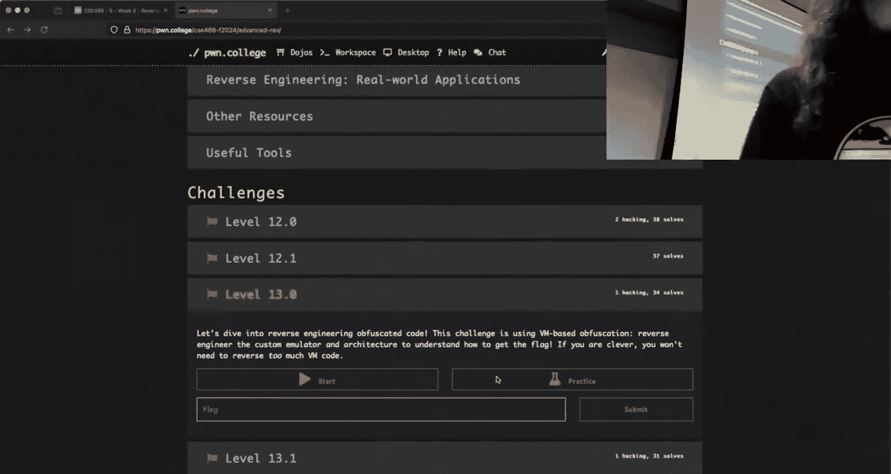

You're going to have to help me get there， though。

So I'm going to pull this thing up in up in Ida， who's taking a look at like level 13 has some idea of how this bad boy works。

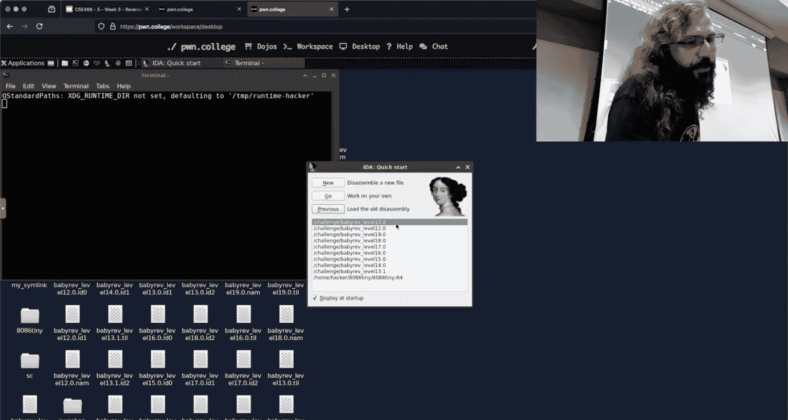

Have I got anyone， any takers？All right， so so when I'm looking for this。

 I'm looking for what is the op code for immediate， is that in here somewhere？No。Yes。😊，Okay。

 so I hear， no， I hear yes， I hear it's in the shell code。All right， so let's see。All right。

 so this one is2 13 too easy， I know it's in 19， so I'm going to go all the way to 19。

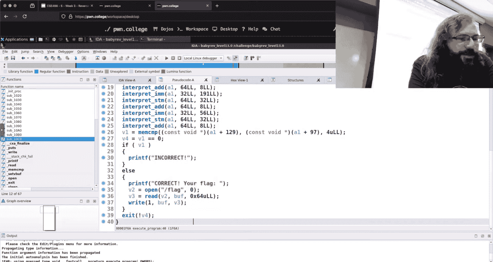

All right， because the challenges start off as kind of hard calling these functions and they build up to where this asmbler and disassembler really becomes useful。

So if we take a look at this thing。It has quite a bit different output。

 I ran it and it says this level is a full yawn 85 emulator， this is why I chose level 19。

You have to reason about the Y code and the implications of how the emulator interprets it。

 so level 19 has these raw bytes in it。😡，Let's open 19 in Ida。

It will complain at me， we just ma okay a bunch of times， I hit tabab。

And then we figure out where we are， so I'm here in Maine。All of a sudden think there is like。

These memory locations。That are being set to some value。

And then at the bottom we have bottom of main， and did I bail on main？

The bottom of main is that interpreter loop。😡，Let's find that。Interpreter Lou。I'm sorry， yes。

The question is is there a way to open up two windows in IDda。

 the answer is there probably is do you know it my best guess I' just Yeah。

 like I know I've accidentally done it where I've like grabbed something like this and pulled it out and boom there it is。

 but then I have no idea how to put it back so we're just cursed for the rest of this demo。

That's almost why it like drag over air you want the back。no no love like I said， that's okay。

 we'll drive from here so now we're in this bonus window。

 we're going to make the bonus window just kind of go over here so we have this interpreter loop。

The interpreter loop is an infinite loop that says while one， which is true。

 so while true interpret instruction right so somewhere in this program there is the byte encoding the literal bytes。

😡，That are going to be interpreted。This is where that asemmbler disassembler comes in handy。

Think about if you were to try and write this thing。

 I'm trying to write a program that is going to interpret。Some number of bytes as an op code。

 what would I I have an infinite loop makes sense， I'm just going to keep reading bytes。

 which's the first thing I need to figure out in my program if I were to write this。

Or you were to write this。I need to check what the byte is， like what op code。

 what action is my my made up CPU doing？And if we were to look at this code。

What's going on right here in this interpret instruction thing？But we see if A2。

 I don't know what A2 is。If A2 ends with this constant。If it doesn't equal zero。

 so if that bit is set， then we're going to interpret immediate。On A182。F A2 has this other bit set。

Then we're going to call interpret add。😡，And if this other bit set， well what is this a mapping of。

 this is in code， but like what's what's going on here？It my。都还是用。O。たし。部在り。

So the statement for Twitch here is it's checking if this byte value。Is the the code， and if it is。

 then we run a。Right and now I'm going to tell you right now Ida has this a little bit confused。

 that's just because of the nature of decompilrs here， but I'm going to take it at face value。

 so what I'm showing you will objectively be wrong。But the logic here is going to be good。

So I had IMM， then I want that to map to， according to Ida hex 400000。I'm sorry。Oh， see。

 this is a good catch。All right， add is going to be hex 40。0ero， zero， zero， zero。

Now you could imagine that I could fill out the rest of this map with all of the actions that I pulled from here。

Now I need some type of。Function that is going to be assembled right， It's going to take in some。

Some string， right， it's going to be the human assem。

And what I'm going to do is I'm going to parse this right， so I'm going to take the first line。

 so I will like split human assembly。😡，By line。Greatt， I'm ready Python， what am I doing？

So lines equals that and then let's assume which you will need to reverse the binary to know if this is true or not。

 that the first first byte is what the op code corresponds to right I am basically going to mimic what's going on here。

So I'm going to say if。U， what is this ad is in the line？Then the。We need some global here。

 That is the。Call it assembly bys， which will also be a bite string。嗯。Assembly bites。Plus， equal。

Op code map。Of a。Do you see what I'm doing here， now the next arguments to add for an op code。

Should be the two things I'm going to add， right， So how can I address that， Well， I can。Matap。

Registers to buys。Again， this is just a Python dictionary。

And we'll say what registers are in this thing？A B， okay， so A is a register。

And maybe I find out that a encodes to Rax1。Okay。So then we could split the line。

And say args equals lines， split， and we'll split it on a space。Arg1 would be As1 Arg2 is As2。

 because remember Arg zero in this case is still that op code because the lines has the text there。

And then I can do the same thing where I'm mapping。Whatever it is I get， and I would say。

Assembly bys。Plus equals。Arg1。Coming out of my rags。So so whatever the text is that was passed here。

 an example of what my human assembly might be in this case。

Is exactly what like let's not reinvent the wheel let's use the same basic syntax that this help thing is putting on so what does an ad look like in this thing I think add AB right and so that's the literal string that is being parsed here。

And you could see how I could expand these dictionaries to include every register。

 I could expand these dictionaries to include every op code。

 I could expand these dictionaries for anything that changes in the different challenge iterations so once I have this stoppedubed out。

😡，We're'm going to tell you right now that the mappings of these things is going to change every challenge。

I can open up the new challenge in Ida， I know where to look， and I only need to update。

These mappings right there may be I know there is like a couple other things that you may want to add as configurations that at a high level was this a bunch of code when I said right an asmbler no it's going to be like two or three dictionaries。

 you know， maybe a pool and then a couple functions and all you're doing is taking in。

Text and determining what bite corresponds to it you may have to do some weird stuff with shuffling the order you may have to do there may be a couple other you know minor CS problems that you have to deal with。

 but it shouldn't be like a 300 line thing。Now writing a disassembler is doing the same thing。

 but in reverse。So instead of a going to one， we say， okay， well， if I get a hex bite of one。

 it corresponds to register A and that gives me something that can print out。

These yank code bytes in a way that is human understandable。😡。

So I like this challenge in particular for level 19。We see that there is。Interpret instruction。

 interpret instruction， I don't necessarily know it。These arguments are but。It looks like。

This is a pointer to a region of memory。 and if we were to go back up to。Maine。

 what do you think all of this stuff is？Because we didn't pass it any input， but it was like。

 here's the interpretation of all of these bytes， here's what the Ynk code looks like。

Very likely that thiss stuff up here。There's the literal young code bites。

So if I wrote something that was the inverse of this。

A disassembler that map those bytes to something that is human understandable。

 my output would be this help text。😡，This isn't yes， is that a hand？

Would be quality much more helpful because if it did write our business and rather。So it。

The question was would it be much more easier to write an asmbler versus a disassembler or a disassembler over an asmbler my statement here is it's going to depend on what challenge we're talking about so this is 19。

0 which has the pretty help print 19。1 as you would expect has no help text so I one way that I could generate this help text is by writing the disassembler for this specific challenge now I know that later challenges somewhere between 19 and 22 add do the opposite。

They say， I'm a Ynk code， G 85 CPU， give me the bites。To do something。

And so both are valuable and the difference between the two is going to be whether I call this function assemble and disassemble and whether my dictionary or my hash mapap。

 if you're more familiar with that term， is going from string to bytes or bytes to string。

Functionally， it's the same mechanism here。😡，It doesn't need to be pretty。

 it just needs to get the job done。Cool， and any questions on the assemblymbly Disassembly？

Like how you'd approach that？Yes。I mean， I can't have。其实我。06，0，0，1。How do you？The ps。Yeah。

 I just got to get the quote the right， Mark。The literal bys 00， followed by the literal byte 01。あのバ。

好。Then I can do。没有。When you account for like others because as like。So if the encoding did that。

If the encoding did encode， for instance， a to 00，00001。Then yes。

 you would need to do that because you need to map whatever the actual implementation of the on 85 CPU is。

Right now I gave a pretty。Made a comment。That ideada is in fact， wrong here when we look at。

This interpret instruction because you're seeing this， right？

I told you that Ida is probably the best at generating decomilation， but typing things is hard。

it's an unsolvable problem largely because all the assembly has is memory addresses and then accesses and so you don't necessarily know is this really。

It says it's an ink， so it either thinks this is a four byte value。Doesn't mean it is。Like。

We could hit Y here on like A2。And say instead of this being an 864， this is now a bite。

And he doesn't like me。All right， well what about？You want N eight？Okay， I made it an inch eight。

Now it looks considerably different。I'm not saying it's better。If a2 plus2 and eight。

so as this is just， I told Ia， I think this is。This is a fight， I just like， okay。

 we'll roll with that and we're going to adjust and shift things。

Is this the right interpretation of what's going on？I don't know。

 is the four byte one the right interpretation of what's going on？

Like that's part of the reversing process， my suggestion for figuring that out would be don't rely to the like end degree on the pseudocode。

And we're looking right now at this kind of mystery line。If I hit。Hopefully。

 if I hit tab and jump back， oh no， I can't jump back because my assembly is now hiding in this thing。

This is how we ended up with the cursed demo。嗯。

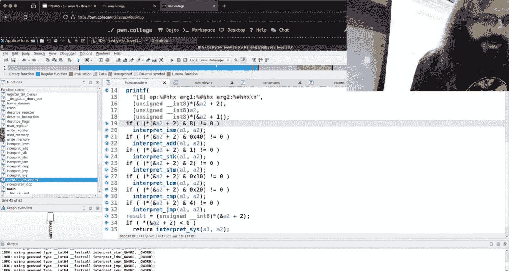

Yeah， we'll just close all of Ida and see leave me alone， reopen it。

So if I。Instead， just have my one window。And we go and find where is that thing interpret？

Instruction。If we go to where that is occurring in my pseudocode and I do the reverse， I hit tabab。

 it jumps me to that comparison。Just from this line that I'm on here， I end a couple above it。

I have a pretty good idea of what the type actually is， hopefully you do too。

 being somebody that has a bit of experience looking at sample。

Now there's two ways that you can deal with that， I could be like， okay， I know what it is。

 and I could try and fix the types here in Ida。Right and get Ida to make something that looks more sea like you can certainly do that。

 but if I just know it， is it worth the time of me fighting the tool。

 no I already know what I need to know， let's not try and fix it up every challenge。

 let's just know that Ida is wrong about what it's showing。

Any questions about what we saw here and how we know Ida is wrong？Again。

 we put our cursor on the line， we hit tab and we looked at what is the corresponding assembly。

 what is actually going on here。It is working with a 32 bit register。

 but if we were to look a little bit higher， what is actually in that 32 bit register？

It's pulling from some location in memory and it's only moving a bite。

And so that comparison is actually a bite comparison， not an int， as Ida initially thinks here。

Now getting getting idea to spit out。More sealight code is a lot of work。

Of going here and renaming this， so this is A2， if I hit n for name， we believe this is the op code。

 right？😡，All right， I have op code， well， if I want to change the type because now we believe it's a byte。

Let's see if U and8 is a thing。Now。I'm not a not an idA user here， so it's try just un it， no。

 no love， does Twitch have it？It's my favorite troll going to save me？うんちゅちゅちゅ。underscore。I'm sorry。

 what did you get？Toign。啊。嗯兄弟。Unsigned and。There we go but again。

 it's still Ida is trying to make this make sense and so you can get these like weird casts and double casts and things like that that isn't specific to I that is just the nature of working in these types of tools and so you can fight it and it's definitely worth it in some cases but a lot of cases it's not worth the time in my opinion。

 especially when you can use GDP or dynamic analysis to complement your understanding here。

I'm going to double check here on Twitch。I'll make sure there's no questions about that。

 but one of the things that I really want to show is these three things right here and thinking about bites。

So let's see what Twitch had。去去。ItTook me two minutes to figure it out somebody's really clever。

 right？Let's see all the video so somebody says it was mad， okay， we're good。

So one of the comments on the Discord that has already happened was thinking about bys and how it's interpreted。

 and that was where that question that we kind of opened with from the audience here。

 from the class was how do I send these unprintable bytes？Well， if you are still committed to bash。

You can do what this meeting says here， where if you were to EC and you just quote this。

And say slash x0 zero， that's going to send be literal characters， slash x0 zero。

 so you're sending four bytes， you're actually sending five because Echo implicitly sends a new line。

that new line character thing is going to get you several times in Python and using p tools。

 your difference is send line versus send to be very aware if you're passing that or not。Now。

 if I'm using a byte traininging python， as I just showed， we can use these escape codes。

This is the equivalent over here using echo， so echo gas E would interpret that escape sequence as a null byte。

 it would send how many bytes。You're wrong， what did I just say echocho implicitly does that adds a new line it's actually going to send too。

 so actually this is actually getting correct， I don't know why this guy's happy。

Because his exploit didn't work that that would actually send a noll bike followed by a newmic。

And if you read the band page for EO， you can tell EO to not send a new line， the flag is dash n。

 so if for whatever reason you wanted to use echocho which I'm not encouraging。

 what you really want is echo dash N E and then your string width escape sequences。😡。

Now one of the discussions on the Discord was about this exact problem。

 they weren't necessarily using echo， they weren't necessarily using Python or it wasn't a P tools issue。

 they relied， yeah Twitch says dashN means no new line。

They weren't necessarily using the wrong thing on the dojo。They were looking at。

 I want to say level 12， but I could be wrong there or maybe 13。

 but they' were looking at something where there was a bunch of manipulations going on right it was kind of like a crack knee just packaged up in this youngon 85 stone。

And instead of using the kind of in-house programming language tools。

 they were using the Microsoft programming calculator， which I've never used and I didn't know。

 I kind of expected it to be an online like hes things a lot if you just type like do byte manipulation into Google。

 there'll be a bunch of websites that just have magic text windows that do stuff。😡。

That stuff is is like scary， you can't trust it， do you know what that website is actually doing？

This is like a very precise science right， and if you don't understand what the tool that you're using does。

You're just in for pain。And so my recommendation is to stick to using P tools or using Python because that is something that is going to be programmatic。

 it's something that's going to be repeatable， it's something that you can show like you can show a snippet of what your code is doing and we can be like here's where the misunderstanding is。

😡，There， I believe it was in the on topic， somebody pointed out that I guess that Microsoft calculator by default works on few words。

 so eight byte numbers instead of individual bytes。

 and because of that the way it was doing all of the math was incorrect。😡。

Versus if I just use。Python。And say I would need to X or something。Well。

 I can say I have 14 and I want to exhort with， I don't know， two。There is my number。

 this is a decims， decimal the day。Deciimal number。If I wanted to， for whatever reason。

 see that in hex it asim， we can call hex on it and get that value。

The nice thing here is that since this is a programming language。

 we can do all of this in a script that is repeatable， it is testable， it is manipultable instead of。

 oh I made a mistake punching a bunch of things in Microsoft's calculator and then I have to do it over again right we can just run it。

 fix it， run it， fix it， we can iterate on our kind of process。😡。

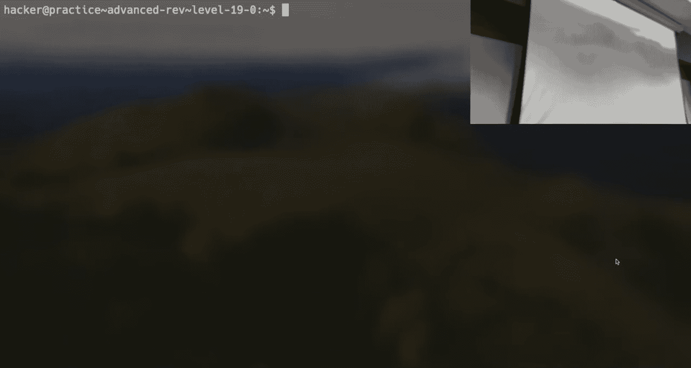

How do I clip Twitch， I don't know what you have going on over there。

We'll see。Alright， so。The other question that was kind of related to bys was how do I think about types。

 right， I want to send this as a string or I want to send these bytes as。

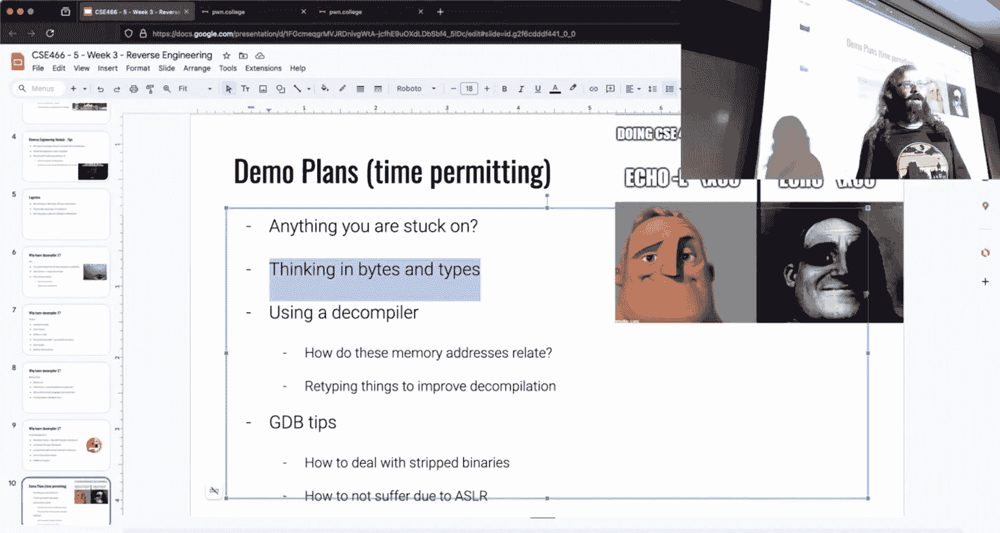

An unsine integer， I need this to be an integer。Does anyone know how bites relate to types？

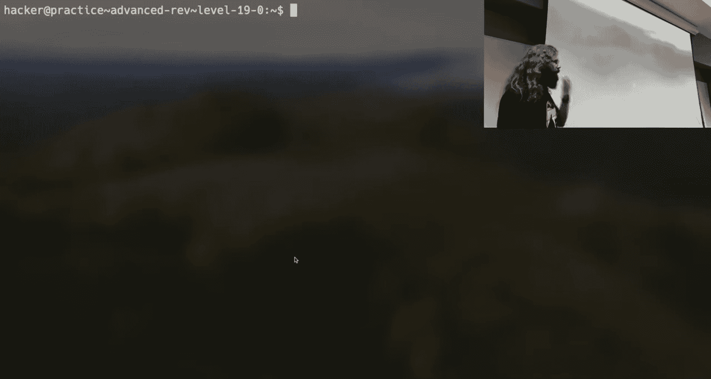

I tried to articulate it， but I probably did a poor job。So bites are the truth。

If I run this challenge。And I'm just using it because it's something I can debug right。

 and if I examine the giant hacks at RSP， I get this value。This is interpreting these bytes。As。

A eight byte hexadeadecimal number。If I examine it as a decimal number， I get this。

If I want to examine it as a string， I get this。Did the bites change， no？

The bytes just exist in memory。We're the ones that choose to interpret it one way or the other。

And so there isn't like a， I need to write these bytes， but it needs to be an end。

If you know how to represent an int， which an int is just four bytes。Any four bytes can be an int。

Now you can't make the program think it's an end。😡。

But you can give it for bytes and if the program wants it to be to think it's an ant then it is is that a hand yeah does GDP have a way to to display like all potential ones that an endt is it a string like all at once at the same time So the question is does GDP have the ability to print out。

All of the possible interpretations of something， all at once。😡。

You could write like a little Gb script function that does this。

 it would be like five lines of G script like if we're being real here。

I don't think that's worth your time because there is， in fact， like a correct way。Right。

 and that the thing that informs me about what is the correct interpretation is what in the if I have the pseudocode。

Maybe it is right。But alternatively， I just happen to be here and read， this is a CMP instructor。

Right， so that's going to perform this comparison that tells me these two values are being checked against each other this is a。

64 bit comparison。And then based on the result of that comparison， here's my conditional jump。

What is JA？All right， somebody said， jump above。And then somebody else said， unsign。

 okay what if I don't know that， how do I find out what JA is？

Like what would you do？So job codes for another。Like just。Instructions。Okay， so so one was Google it。

 I didn't hear asking the Discord， but that's that's probably for the best one of the。

Great resources。On the internet is Felix Cloudtier， no relation， just like Ryan A Chapman。

 right random person on the internet that just put up the like an awesome resource and so in general。

 if you type in the Google Felix X86，And then in instruction。

His page will be or their page will be the first hit。

And it's insanely detailed information about like every X86 instruction。Now。

 what we were interested in was。JA。And JA。We'll jump if the carry flag is zero and the or， I'm sorry。

 yeah， the carry flag is zero and the zero flag is zero。And if we scroll down a bit further。

 it should。

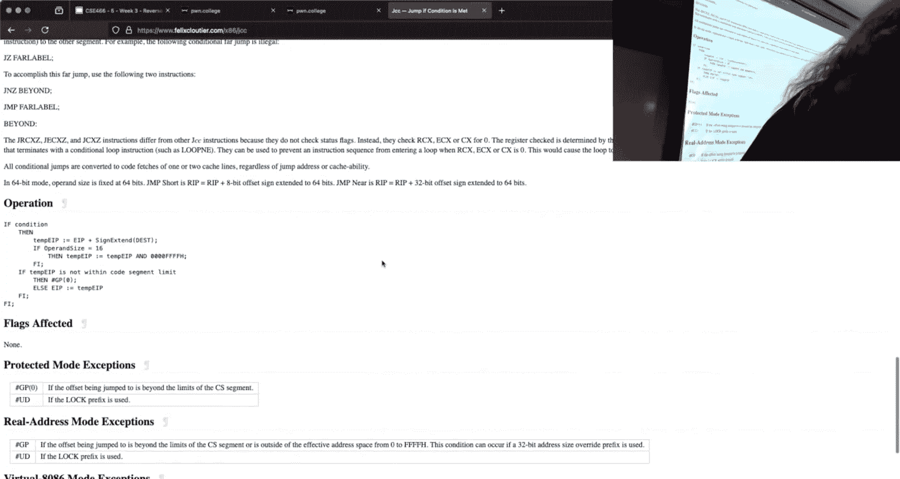

啊。It should describe whether or not it's interpreting things is signed or unsigned down here。And oh。

 did you see it？I can't control Z。

Felix X86， JA。We were down here， where， where were we？From their top please third。third paragraph。

 the condition for each JCCnemonic is given in the description column of the table in the preceding page。

 the terms less and greater are used for comparisons that are signed integers above and below are used for unsigned integers。

So I was to hiding in there， I like pointing this as a resource because。

Regardless of your like how specific hyper specific your question is， the answer is probably on here。

But you could also just Google or ask since AI， it's probably something that is generally available on the internet。

 but Felix to site is a fantastic resource if you want to get into the nittygrity。

So what we know here is this is a 64 bit comparison that we said was。Unside。

So now do I know what the type of this thing is？都感所面。P has't signed of result。So the。

Comparison is comparing the value that's in RA。To this constant。

The result of that comparison will set the flags。In GDP this。Anyway， right here， just like CSSs。No。

 that's not what I want efls。Eflex is the flags， so every time that a compare instruction is executed。

 the actual implementation of that is not that there's like a true false。

The what compare and test actually do is they take two values I want to say they and them or they subtract them it's one of the two right subtract somebody's pretty confident it subtract I just go ask Felix right like if I really wanted to know what it was with the results of that。

😡，That operation， based upon the result， it sets these flag。Fit。😡，So in the CPU。

 there is another register that is like the Fls register。

We don't directly set the value in the flags register， the flags register is influence。

Based upon comparison instructions， test instructions of those type of things where we're trying to。

Conditionally determine something。Since I have Jeff installed here， we see that the zero flag is set。

 the pary flag is set， the interrupt flag is set。Because they're larger and more bold there。

In practice for this course， you probably don't need to drill down to that level of detail。

 but if you were like， hey， how does this thing actually work， that's the answer。😡，Instead。

 we can just look at the instruction and say this is a 64 bit comparison。On whatever is RAX。

And then what we care about is the result of the unsigned comparison。

 so this is a 64 bit unsigned comparison that is happening inside of Reed this is just an arbitrary location where I happen to。

😡，Be broken。So it is interpreting that。Bes effective as unscied creature， opposed to。Correct。

 correct， so the comparison itself isn't the one that is making that the statement for Twitch was this FffFFFF thing。

Is that an unsigned or sign？😡，And the answer is compare actually doesn't care。

RightComp just those bytes or bytes， so a compare is going to perform in this operation on whatever bys are in RAX and whatever bys F F FO is。

 it doesn't care whether it's an unsigned or signed。

 It's going to perform the operation on these literal bys and it's going to set。😡。

Those flag registers that I have now got off the screen and then based upon how those flag bits are set。

We'll influence whether the jump above occurs， we actually jump or we do not。

All right so so this you can think of it as tester compares gathering information about the two values。

And then the jump is what is determining what we're actually looking at。There's good questions。

 anyone have any other questions about what I'm going on here and how I can reason about the types of what's going on？

Somebody says typespe don't exist at runtime， which is true。

 there just are a convention about how to like reason and think about things， yeah。

 by bytes is ground truth。Cool， so one thing that I， let mean， double check here， okay。

 one thing I really， really want to get to is if I am in Ida。And I。Look at a location here。

I have this instruction inside interpret instruction， I have LEed super tiny， at least on my screen。

 but down here you can see a location。A representation of where this is in the binary。

So we can use this location to inform us if I want， what if I want to throw GDP at it。

 and I want to break right here on this move EAX zero。

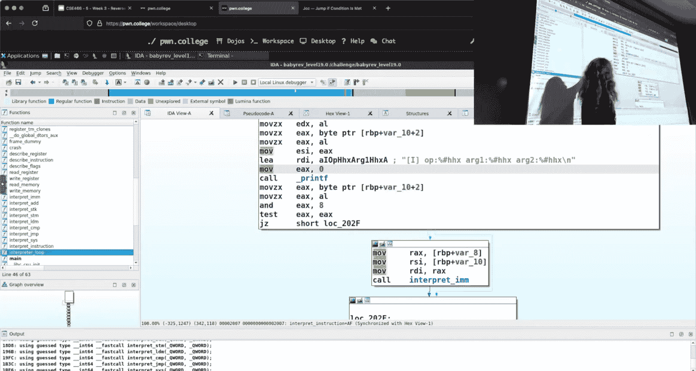

Oh， one of the problems that you'll inevitably run into。We run checkS on this。

 we aren't disabling anything now we're functioning in what is modern Linux security here。

 so that means that we have the binary compiled with PIE。

 so that means your addresses are going to change all the time。😡，If I run GDP on this challenge。

And we print RP， I get Fb F5 Dd6， let's run it again。I'm at the exact same point in execution。

 and all of a sudden it is D4，5D， DD6， so the bites there changed， right ASLR is enabled。

 we saw this in memory corruption。Well， that's horrible if I want to debug， right？

Do I have to hard code all of these things， especially if this thing is stripped？

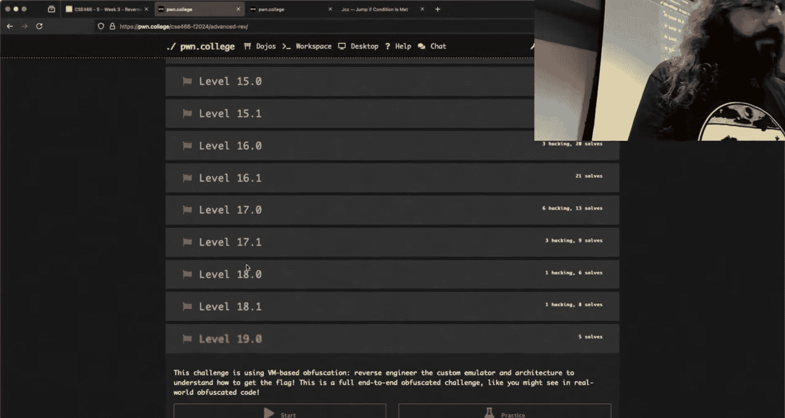

Let's make it harder because like you could be like， yeah， Robert， but this said interpret cis。

 I could go or interpret instruction， I could go to interpret instruction plus something I got this but the point one levels。

Our strip， they don't have symbols。

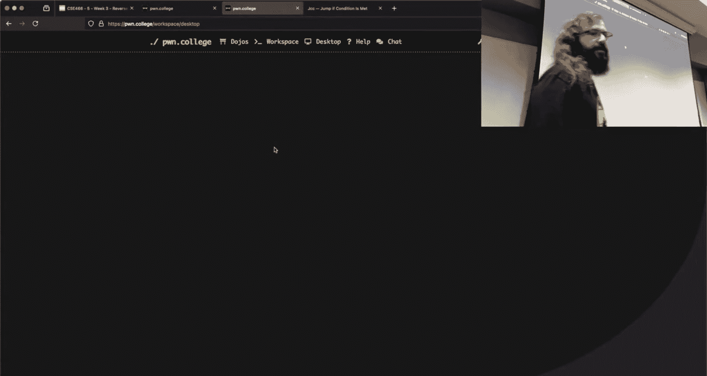

So now I can't even reference that。Remember， this is an almost identical binary。

But one of the key differences here is this thing is stripped。Come on， Ada。

So now I don't have these nice names and everything that you see here in IDda aside from Maine is just kind of an IDda invention。

But this looks very similar to that level from 19。0。So this。Is my。Interpreterly。

If we go over here to the assembly， let's say I want to break at。Right here， move zero extend EAXal。

If I sneak a peek down here， itda says 1 B7， an exodadecial that is an offset into the binary。

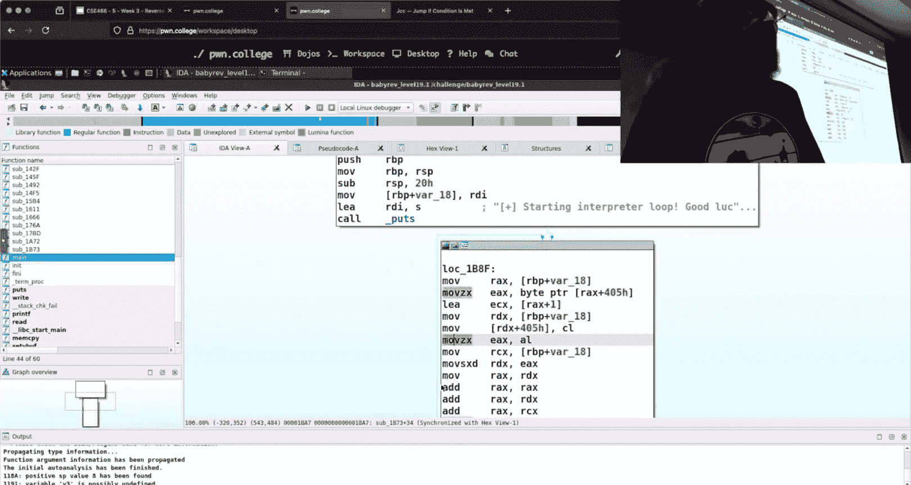

However， I don't know where I am in this thing。As I showed， the address has changed。So what can I do？

Well， Gb does not disable randomization for binaries that are set you ID。

And all of the challenges are set U ID， that's why we see that S up there where the execute could be。

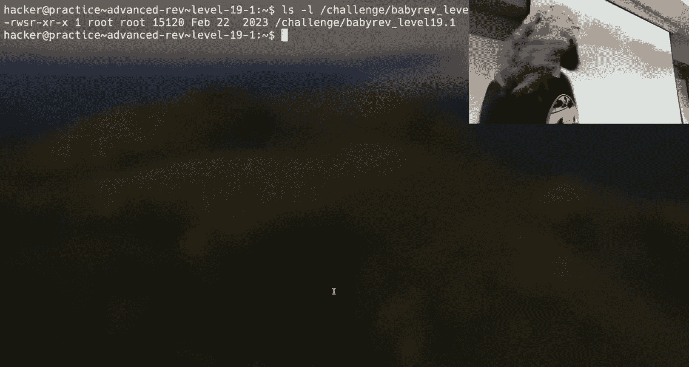

How can I make this not set you ID？I could just copy it somewhere else。

 and if we look at the copy of it。We see that that copy。Does not have the Se UI bit set。

This means if I run this thing in GDP。Somebody says no way， yeah way。Okay。So now I am at。

This thing right here。Let's try it again。Oh wait， am I debugging the challenge？Ah。

 I didn't look right that's why I was like， wait a minute。Let's debug the copy instead。And。

Now I get something that I've seen before here right that address is fixed5 five five55 I get something that looks a bit more constant if I were to run this again。

 do the exact same thing。I get the exact same address， so now this is repeatably debugable。

 I can't get the flag on the copy， but the copy is going to behave the same way as that set UI one so this is one trick you can use to make that just not be a pain。

Now， the other thing is I said this is stripped。Right and so。Sub1b73。

 what Ida has decided to call this isn't real。

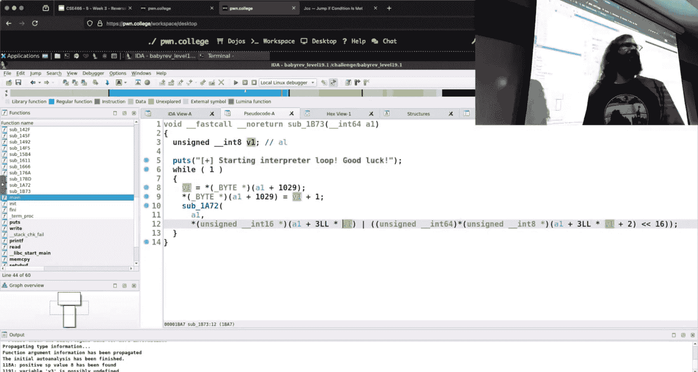

If I were to try and debug。

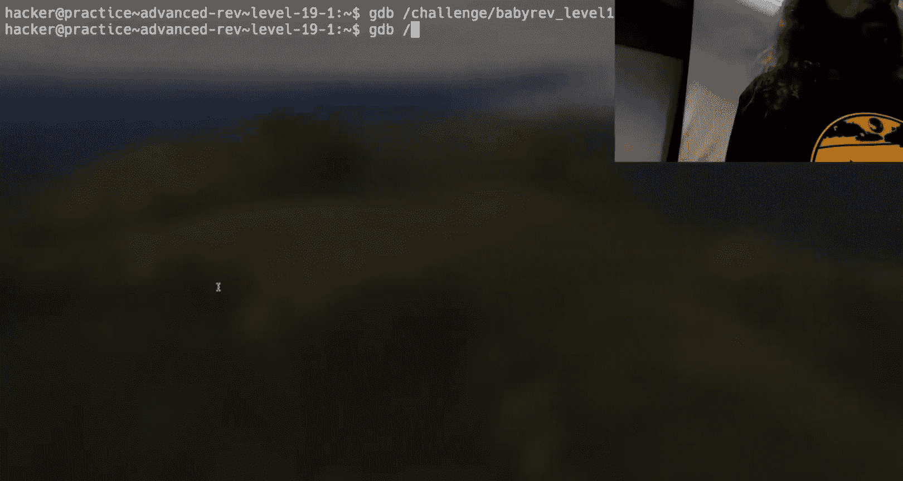

My copy here， and I said info funk。What did they call this sub underscore。

 there's no functions named that I had just kind of made it up。

So what if I want to get that break point， right， I want to look at something in Ida statically and then use that to inform what I'm doing in GDP。

Perfectly reasonable ask， right， we can do that。I'm just going to ask that you copy that third line。

From my GDP in it， which I rippedped off of Yon years ago。All right， this is just。A huge time saver。

 there's this magic constant。And what I'm doing here in my G init， remember Home directorate。

gdbionit， whatgdionit is a series of commands that are ran every time GDP starts。

All this line is doing。Is storing creating a variable named base with a constant value in it？

The reason this constant value is useful。Because if I run VM map with Jeff。

 if you don't have Jeff installed， its infofo Proc map， we'll give you something similar。

This shows me all of the memory for this process。That constant？Is the beginning？Of。

Where this elf is loaded into memory。😡，And as long as the binary has not set U ID。

 that will always be true。So let's bring this together and I'll use this to set a break point at like an arbitrary location I have found。

Oh， Ia here， what was I looking for， moveve zero EAX， EAX， Ida says 1 BA7。

Let's examine the instruction that is at base， which is pulling from my GDb in。Plus。

 what is I to say， 1 BA7？What do you know？It's that exact same spot。

 so let's set a break point there， we can do that。And then let's run it， where am I？

Exactly where I saw an item。Yeah。The key points here， the binary is not set you ID。

 so copy it over to temp， there is a way to disable it in P tools， I'm not going to show that magic。

 this is simpler。And then get that base value in your GDP inect。What that lets me do now。

Is I can look at the decom of one of these binaries， maybe I cleaned it up a bit， you know。

 but I find some point that I'm interested in and like。

 well what's really going on here or maybe I want to find is this really a bite pointer？

What's really going on in memory， this is something I want to see live。

 we can find a line that is the assembly， we can set the break point in GDP and we can look at it ourselves。

I really like falling back to GDP。And so that's something you'll see me do a lot now if you're using a tool that is not item one thing to be aware of is some decompilrs will arbitrarily base the binary at some offset and so you really only care about the first like two bytes。

Of what you see here， the least significant bytes， some decompilrs will like throw a two over here。

 several several bytes into the memory address， that is a setting that you can change on the decocompilr。

 but instead of tweaking the setting every time， if you just know to ignore this like two that's way off there。

 then you'll get something that's correct。And you can do that same thing using Adira。

 anger management， et cetera。All right， what else did I have on the slides here to rock and roll so I showed you how to kind of deal with stripped bite areas right by using base so that you can find these things。

How did not suffer through ASLR？Uh，Retyping things in Ida， I did say it。

 does anyone know what the magic key is to change the type or something？Why， y for type， n for name。

 tab to jump back and forth。This isn't what I said I was going to do on Tuesday。

 where I was going to try and reverse another emulator。

 but hopefully these are more real things that you can use tonight when you look at the challenges tomorrow。

 when you look at the challenges， etcter。One of the things that I did not have time to make a slide for。

But is worth mentioning is one of the questions I think it was you， you asked， yeah， is more。

 you asked， would there be extra credit opportunities for attending certain events？😡。

 and my answer was no， but we'll play it by year。So I have to check my phone because I was going to make a slide with this announcement。

In the ASU Discord。There is an individual named Mahallos。

And there is a kind of undergraduate facing CTF competition that's going on。

And they are forming a team of undergraduates to just try and play this CTF。

 right it's not exceptionally difficult， it is meant for are you kind of targeting people that are newer to this。

Check the Discord for details here， it looks like it starts tomorrowra at 1 pm。If you show up。

To that。Mahallo is going to give me a list of whoever shows up I don't care if you solved anything。

 I don't care if you can only spend a little bit of time there， right， show up， give it a fair try。

Let him know who you are， I'll give you a 1% core extra credit for giving it a shot。改。

Now that doesn't mean show up， shake his hand and dip out in five minutes right like try and be reasonable reasonable about it。

 I'm going to leave it at his discretion as far as what is you know a fair attack。All right。

 go there， sync up， make sure he knows that you're there。See what's going on。

One of the questions that I know is coming is I'm a grad student like what's happening。

 no oh different question， what do we got what's that？You just joined the escort on that that。我大那个地。

Okay， so the comment is that there's ASU hacking club because I know some people have asked me outside of the stream or outside of class。

 hey， I'm interested in this stuff， I want to try and do it as a hobby。

 I want to know meet other people that are interested in this and not have the pressure the looming class thing on here right and I want to see what the kind of the hacking scene is more like when you're doing this binary exploitation stuff and a great way to do that is to place CTFs。

Um， my initial answer off outside of class was that I didn't have a strong answer because I needed to get information from the ASU hacking club and kind of make sure I wasn't pointing people in the wrong direction。

But this is a great opportunity to see what it's like。Practice some of those skills。

I believe it goes on for a little while here。😡，said。Okay， you have details， I don't。

 I got this literally so thriving up and I was like， yeah， right lets。

It's written on the public College Discord。In the ASU channel in the ASU channel I'll link to it in the announcements after class year so that everyone has it all right。

 show up， give it a fair shake I'm not asking you know did you solve anything。

 just go there see see what you think not gonna make your right essay， just get your head counted。

 you'll get 1% extra credit flat on the course See like a fair deal。

Yeah now now as a kind of counter to that there is that checkpoint right the checkpoints on Monday and so that's kind of me to me to be like oh go play the CTF and the checkpoints Monday right you know that seems a little unfair so what I'm going to do I'm going to trust that everyone that decided to stick it out in this course can manage your time I'm going move the checkpoint to the same as the deadline so that way hopefully。

You can do the CTF and I'm not doubling you down on time here over the weekend。

 you can allocate your time as needed right if it runs for several days。

 my requirement is just to give it a fair shake on any one of the days if you enjoy it and do it all that's awesome but I don't want this extra credit have fun thing to go you know hard knocks against your grade here so I think that's a fair way of doing it gives you an opportunity to give the shot get some extra credit right now。

Good。Question。So the details are on the Po College Discord。

 if you scroll down there is a generic ASU grouping。This says ASU DS General。

 and then the exact chat channel is called chat as soon as I'm off off the stream。

 I will post it in the announcements channel for 466 so that everyone gets it。All right， does anyone。

 I've got like two， three minutes left， does anyone else have anything from me。

 I know the checkpoint hasn't been updated， I'll do it later tonight。Yes， can we assume between the 。

0 and the 。1 challenges that the structure is similar。

 like the same functions are being used in the same？The question is。

For the reverse engineering challenges here， there are 0。0 and 0。1 versions。

Can I assume that it's the exact same functions to the exact same order， the answer is no。

 right it's going to use the same building blocks， building blocks。

 so it'll be functions you've likely seen in the 0。0。

 but you do not have a guarantee that they're exact in the exact same order for on the 。

0 as it was ending the flag。Yes。Xor flag okay， the question was if in the point zero。

 it was ending some bytes of the flag， it could point1 x or the bitetes of the flag the answer is yes。

Right that that's part of what we're trying to get you to reverse engineer and identify。

 so you use GB， use IDA， use whatever tool makes sense to you to hopefully identify what those things are for these like 13 is a good example where there's just these kind of magic functions。

I do think I is a great tool there because once you rename one and you're like， well。

 what this function really does is it adds something or an X or or something。

 you can get a representation of what the order of operations are pretty quick。

that'd be how I would try and tackle it in face value if I rename these things so that I know what's going on。

 then I can just read it down the line， write something similar in Python and get what I need。😡。

Anything else before I end the stream， I'm going to take a look here at Twitch。滴滴得。

Ws fine I don't have symbols don't you bug them all right so somebody is passing some positivity here saying you Jeff you can do it Rah Ra right I believe in everyone that's here you decided to stick it out despite all of my warnings we're going to have an awesome semester thank you guys。

I didn't hit the button。