# ASU《计算机系统安全｜ASU CSE466 Computer Systems Security 2024》中英字幕deepseek p07 -08-Reverse Engineering - CSE466 - Robert - 2024.09.10.zh_en -BV1spCGYZE9D_p7-

Is OBS going to behave today， we got here bright and early？All right， we clicked all the buttons。

 hopefully we hit it the right way。

Does this work for my amazing four slides？

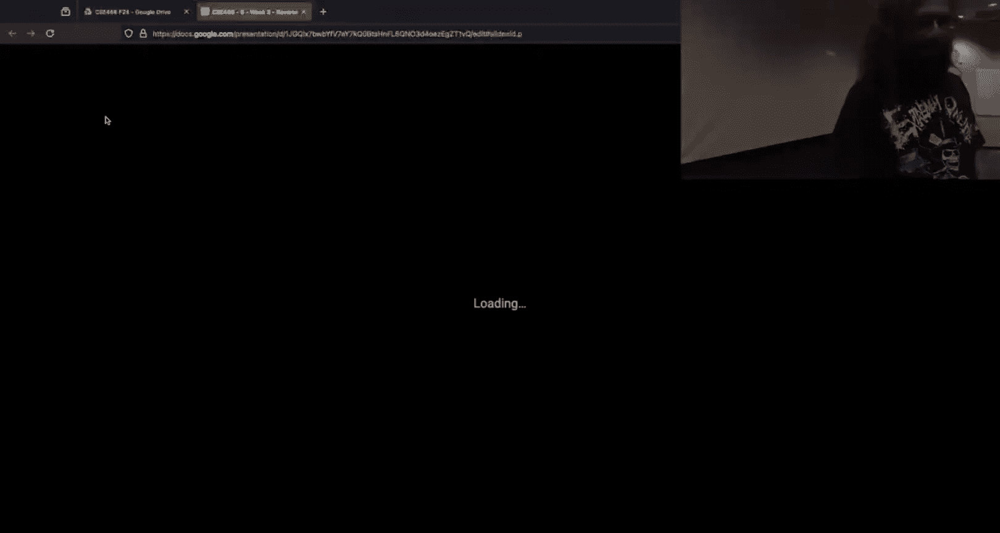

It appears to。All right， so far， I'm aware today， September 10th， 2024。

 we're here on our fourth week CSE 466， we're talking about reverse engineering。嗯。So。

I'm going to stop posting these type of memes or sharing them all right， the duban gloom is over。

 all right， I get that it's rough。But we've left the station。I might still give you credit， right？

LikeI might still give you the liked me， but hopefully we can move away from that。

So we've been kind of struggling with young 85 for those that have started it。

couplele strategies that people have come to realize I may be able to solve the 0。

01 because it's going to print out a whole bunch of help text for me， I get to the point。

1 turns out I really had no idea of what was going on。

 we'd go back and look at the  point0 not only because of the nice help text but as I mentioned the beginning of this module。

 the  point0 has symbols， the  point。1 does not， so it's definitely a lot easier to look at the 0。0。

😡，So definitely a strategy here。This man kind of scares me。For a number of reasons。

 it says my Excel sheet I used to keep track of the yan code and then the actual yawn code。😡。

they're different it scares me not only because they are like different。

But the fact that you're using Excel to track this。😡，啊。If it if it works for you。

 like it works for you， but I would strongly encourage。

fining a better workflow and on that note of just like how to make sense of this。

 I heard and I have personally seen some people kind of writing stuff out by hand on pen and paper。

That's totally reasonable and like I do that when I'm thinking about high level things。

 but we shouldn't be having to do that for reverse engineering purposes hopefully today's demo will show you how we can leverage these tools instead of just me stating how we can use it。

And eventually， if you're there at185 enough， it starts to make sense you find the parallels between the185 instructions and how you know an X86 CPU works。

And that hopefully means that you can now read it with that health text。Other meansme。

 so this weekend was。Kind of a freebie， right， because we had that deadline pushed。

How people decided to use it up to got 85 still waiting for you。

 so for those students that still haven't started。😡，I want to think about it。

I really liked this name， I can't read it from this slide but I know exactly what it's talking about so he's probably thinking about other Wo know what is he actually thinking about why isn't my brute force working。

 maybe my value for register I is wrong in the instruction pointer isn't actually incrementing that could explain why I'm hitting the bad instruction instead of the infinite loop and I need to account for timeouts so I can ensure I'm testing all possible values。

 maybe I'll just start this all over again in the morning。

 so for those of you that haven't gotten there， which I believe is most of the class level 22 asks you to pass in your own yan code which is one of the things that having an assembler would help you on but particularly 22。

1， it doesn't print out anything and that means that you have to figure out what is the encoding。

Dynaically based on behavior， I'm going to tell you right now that the encoding for 22。

1 is seated on the flag and what that means is that if on 22。

1 you are starting it up in practice mode and figuring out what is the encoding that will not be true in the challenge mode where you can actually get the flag。

RightSo I said do for 22。1 you end up having to do this type of reasoning here which was one of the questions that I got before the stream started it was hey for 22。

 how do I kind of figure out what's going on and the answer is to do exactly that you should have some idea of what the permutations of these bitetes could be and so you will have to write some type of rudimentary fuzzer which is just going to generate these bys and kind of throw it in and see what happens inside the challenge you can't GDP attach it you can't inspect it internally it's just okay did this thing run。

 did it exit， did it crash that it egg fault did it hang。

Did the exit code change right like what few things can you observe and then based upon some combination。

 you'll notice a different behavior of the program。

 which then informs you about either like the fight order or the meaning of specific bias。😡。

It sounds like a lot， but once you have kind of caught the edge cases that can blow up your for loop。

You can start figuring out most of the instructions， where you can pull it on。

 but in the immediate you definitely end up in kind of this weird position because they're like。

 well， what's the next thing that I can infer given the price？Which is the state of that person。

But we need all things， all right。ItFe good， that's good。

How are we doing so far so I'm only county and I think's going to do this for the course going forward。

 I'm only county people that have solved at least one challenge right if you haven't solved anything I don't know what to tell you right now those people are at about 64% of the material which is awesome right we're halfway through you're halfway there。

 I didn't the checkpoint going away didn't destroy the average there。From what I've heard。

 most people are stuck on either， I should capitalize both of this。That's what I get man。

 I make these slides a little bit before class as you could imagine so I can get your memes。

And then I get interrupted and aimed up with lower kidney cells。Is this accurate anyone？

Like not stuck here。All right， so that means that this will be somewhat relevant for Twitch literally nobody raised their hand so everyone is stuck on one of these two problems which is a good sign so if you have something specific that you want me to do well will definitely ban that first otherwise I want to use 17。

0 and 17。1 as kind of a straw man here I'm hopefully not going to solve it but it may accidentally happen because that sometimes happens when you're working on real challenges。

I want to show how we can use GDP scripting to dynamically kind of make 17。1 equivalent to 17。

0 it's one of my favorite things that I've ever demoed on Poone College and then the original video got pulled which was a shame and then I want to use Ida a little bit on 17。

0 again how can we make 17。0 look like 17。1？And then。

For these people that have writing stuff out by hand， my understanding of what people were writing。

 somebody says they're on 20， I have no idea what the subproblem in 20 is。

 but if you're like hard stuck， freeze conceptual problem at me， I'll see what I can do。

For people that are hardwriting stuff out， what I had heard is that we're writing like okay。

 we're going to end this with that and then we write the value and we're like doing this math by hand if we're doing that that's a really long way doing thingss。

 if you took 36，5 reverse engineering， you probably use Python to reverse your manglers because anyone recall doing that。

Okay， less than I would have thought， so I will hopefully get some time to hit on using that instead of writing the stuff out by hand。

Does anyone have anything specific you want me to hit or is this a good roadmap for the next 45 minutes I got the thumbs up。

All right。

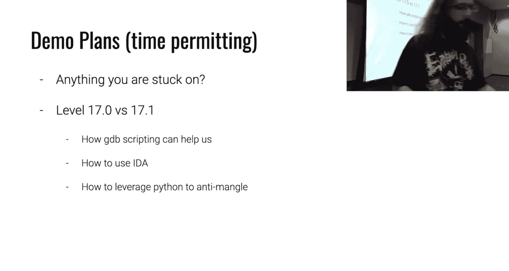

Go。Let's see what we got here。Twitch says GDP scripting， yeah， that's the plan。

I didn't drive run this， so the demo， the demo could go right。So that's 19。

 I said I was going to look at 17， let's fix that。All right。So I'm here。In 17。0 at this point。

 you probably have figured out how to interpret this。

 is that fair we have some idea of what like IMMP equals 72 is。Is that a cool and so we see。

 for instance， this cis Hex 20。And then we see read memory， what can we infer from this right here？

We're performing to interpret cis。And then the byte that's being used to represent the read is probably hex 20。

 I don't know this for sure， but I'm willing to bet that's what's going on and then the result goes out in A if I remember as far as how the interpret this works。

We type in some nonsense， it prints out a whole bunch more stuff。And then it says。

Doesn't it say incorrect？Did I miss it？Coll right。咧 one。Yeah， that's like one character。I'm sorry。

OneOh， yeah， yeah， yeah， okay。ItS right R R O C Yeah， so it has this right。

 why am I getting that behavior？For now it's just like pretty。It's all。Okay， so so for right now。

 the Ywn 85 implementation can only print out one character at a time when it uses its internal cis call。

Yeah。Is that but that's what we got， I'll go if it makes sense to me。Okay。

So we're going to open this guy up in Ida or not Ida， yeah， all right， let's use Ida。

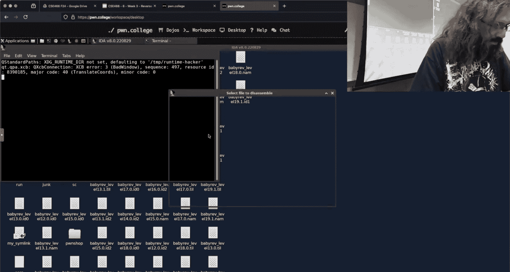

And this is just going to be a quick review before I hop to 17。1。We mash tab。

Because there isn't a need to do a lot of like reversing， renaming stuff， retyping stuff in the 0。

0 challenges since they have siblings。Ida is not happy with me。Okay。So we're inside of Maine。

 there's an execute program function and what we'll see here is because these have symbols。

 we can see the function names are， for instance interpret immediate interpret cis， et cetera。

 so it very much maps what we saw when we ran the challenge itself。

We see how this kind of pairs one to one。Now what I want to do。

 just start of curious asking how many are stuck on 17。0？No hands， how many stuck are in 17。1？

No hands， nobody's stuck on 17 is everyone really on 19？19eens just bright a disassember， guys。

Come on。All right。All right。I're still going to do this。So what I want to do is I want to turn 17。

1 into 17。0， I think those still that value， even if you're not stuck on this challenge just from a GDP scripting usefulness standpoint here。

Now， if I want to create something that prints out these these bytes。

 where in the process am I interested in breaking？Like I want to know what。Windows， for instance。

 immediate D equals 43， I want to display that not using the challenge but using GDP。

 what point of execution am I interested in？Nobody knows。Right here it would be interpret media if。

Set a breakpoint at interpret。他美的。GDB scripting， this doesn't need to be named。gdb。

 I just opened a file called do。gdb， you can do it in line in Python tube doesn't matter。

I can set a breakpoint there and then you can do this thing called commands。

Commands allows you to specify what happens automatically at that rate point。Why is this useful？Well。

 I could。Print F。Calling， interpret。Immediate。And then continue。But then I'm going to include， hey。

 I don't need that。So I have that。If I'm just using GDP on the terminal， it's dash X。I'll give it do。

gdb and then the challenge。Everything is ruined and it's over。ちち。What did we get？Okay。

 we hit the break point。This is one of those。Shenanigans， this is why you drive around your demos。

PSAuxX Scp Gb kill 1641， I'm going to blame Jeff。I don't know the ditch。Actually the problem here。

That still didn't count。ItsQ。Aggressively kill。I don't know what I've done over there。

 but it is not happening。Straight again， just do it a different window， Gb dashx do dogdb。

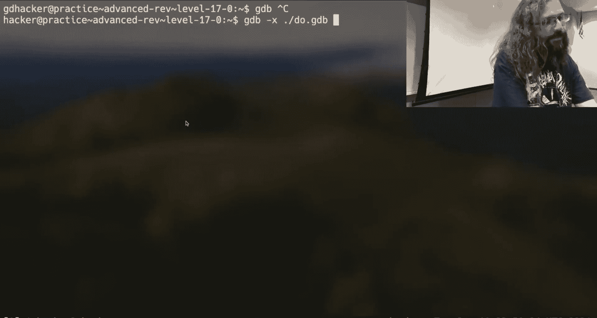

Okay， I set the break point。We run it。And we see what happened here is now every time。

That we hit this interpret media。Outside of the challenge doing it。

We see calling interpret immediate， and then since I didn't include a new line。

 I'm functionally equivalent with the challenge does on its own， right？Now。

 the other thing I may want to include now is well， what register is being set。

 I'm trying to emulate this in line。And this seems a little bit silly because right now I'm printing out exactly what the challenge does already。

But let's keep driving there。How do I get？The equivalent。Of this right here。

 whether it's a and then what the constant is。None of you did this cool dynamic GDPB scripting stuff for 17。

 you just solved it。So we could look at interpret immediate。And we see the arguments here in IDda。

 this is going to correspond to RDI， RSI， RDX， its the same calling conventions we hope're already familiar with。

So what register？This one is nice because it prints it off， is going to hold。The bite that is。

The register， so this has this nice described register function。

 which is taking that by and and mapping into a letter。Visual representation of it。

But let's assume we don't have that we won't have that in  point1 so it's a2 A2 has the byte here that represents the register that's going to be used and so what register do I want to print out？

I。RSI， RSI sounds， right？So let's go back to our script here。I'm going to set a variable。

 we're going to call this Regish Regg because why not？And we're going to set that equal two。RSI。

Inside my。What do I want here？I'm going to go with。You Eleanor。Inside my print F。

I update my format ring I have something like Pre ULLX， which maybe will yell at me， maybe not。

 in theory that's an unsigned long long representative to Tadecimal。

 I have a comma and then I have the value that I want to display。We give that a go。Did I get it？啊I。

Think so。So here they didn't deal with it just went with you as like an unsigned and it treated LLX as。

Characers， but we still see here that B is corresponding to one， C is corresponding to two。

 A is corresponding to four I think reasonably infer that even if I can't properly write format match strings。

The other value that I'm interested in here is what is the constant right from the challenge output？

It also assures this constant。Where can we infer that's going from？So this A3。

Which is the third argument， so it's going to be registered。RDX。Now， in my script here。

 I could literally use RSI and RDX， but I think it's a little bit more clear。If I try。And name these。

Okay， does that look？It's pretty similar here， I still haven't added the space or new line。

 but we can map it to is C， we see the six here， we see the six here， we see the 72 there。

 there's the 72 there because I went LLX here so this is actually hexodadecimal just didn't prefix it with0 x。

But we see that we can replicate that。That output。You're like， well， that's great。

 but this challenge had it already。

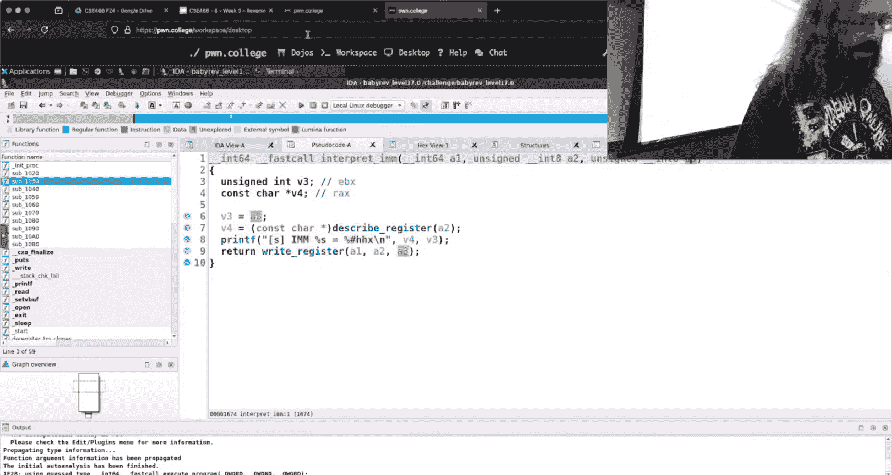

So why do I care？Well， if we fire up 17。1， now that we have some idea of。How this thing behaves。

I can't use the exact same script。There's my original script here。Relied on that interpret immediate。

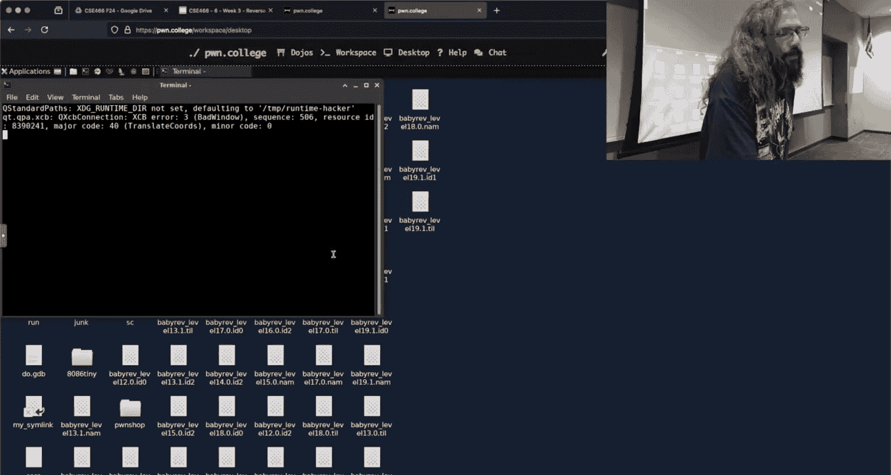

Symbol。And if we look at 17。1。Ida will just yell at me again。

We can go into main here and then we don't have any symbols。

What can we assume this is knowing that these are similar？Somebody said execute。

 I think it's execute program that right， so I put my cursor on this thing I hit end this says execute program。

 we mash enter now this looks more similar to what we had in 17。

0 are people doing this when they're using Ida？Yes。😊，Okay。

 I heard something to the contrary scared me。Okay， this instruction right here。

 do I know what it is right now？You do I mean， we could guess I don't know what it is what are you going to infer like I'm not going to I think your logical will be good。

来了。Just because it's the first couple things and the first couple of things。

 we have to throw some content somewhere one I was solving it I think also。Okay。

 so the statement for Twitch was， I think this is IMM， I think it's IMM because it's fairly common。

 IMM is one of the most common instructions we've seen when we're looking at this yan code and I。

Tacked on I don't know if the student agreed or disagreed that the logically the first couple things you have to do is like have some values somewhere right and so that's a reasonable like heuristic thought。

If we click into it， we see it's just a wrapper for sub 1323。

 well that doesn't really help me do anything。ok。If we go into sub 1323。I get this。嗯。

Does this look like？What it immediate looks like？Some people are saying yes。It actually。

 it looks like the register。Okay， so it does say I'm going register down here at the bottom。

 so that's a good clue。Now the act of reversing is doing that inferring， right？

Now it does make sense， so this is probably like set register。Now I don't know what A1A2A3 is yet。

 what do we think it is？So。I'm going to leave a1 alone and we're going to just look at A2 A2 is interesting because there's this switch logic on it。

What is different here based upon the switch because there's like a pattern？What is A2 influencing？

The statements where in memory is it stored and that's absolutely correct。

 the only thing that is different between case 32 and case2 is what is the offset from a1 where this value is being stored so we could infer。

😡，A2。OnMsh N， we're going to call this the register Bte。You call it whatever you want。

 so what does that mean A3 pro gls？The value so we can mesh n over here on a3 and we get the value this looks a lot more sane and it looks a lot more like what we had in 17。

0 there was the meme that said， hey， I was looking at the point one now' con I hop back to  point0 to reference it you can do that or you can think about how would I implement this and then what do I see and clean up what you are actually dealing with。

So if this is said register and that is a constant， then we inferred that this was。Immediate。

Then we map from here to here。We have the register byte， then the valve。

 and if we go back up to here， this is our register byte。And then this is our vow。

Does anyone know what this A1 is？The said。Okay，The student was， it's a memory location。and that'。

Assuming it is correct， which I don't think I would mess this up。

I was saying that it is a by pointer， it is a pointer to a byte and that is all itemnot。

So it is a literal memory address inside the process。不是。

But where what purpose does it serve in the context of the C 85 CPU？Anyone else？like。Okay。

 so the simple was， is it memory？So it could be right and so we could call this the beyond 85 memory that's what we think it is right now right and when you reverse engineering。

 it's totally reasonable when you have that kind of first inkc of hey， this is what I think it is。

 call it what you think it is。Even if it's wrong， what this will do for us， hopefully。

 is we'll see this variable name pop up somewhere else where it may not make sense。

 well if this was the on 85 memory， why are we doing XYZ to it？Did that populate down？

Just for completeness。Oh， I hit Y instead of N。Yeah 85。Cool。Go back up。Bam， bam。All right。

 so now I have bought my immediate here and you could envision that we're doing the same thing for these all of these functions。

诶。But we still， right now we think this A1 is don't hit Y， hit N。Yon 85。

Why is this yawn 85 memory passed into everything？In fact， we said this is an immediate， right？

Like our first instruction that we did successfully decode。

It's setting a register inside the context of the Yn 85 CPU。So why does it need this pointer？

Anyone other than you， I'm just just trying to some get some more reach here what do we think sets aside frame？

So。The statement was， I think it's a frame。That represents the state of the program in memory and you're not far off。

嗯。We need to think about how is this thing being used， so clearly somewhere。

Here as an offset from this Yn 85 memory is the emulator's representation of registers。

It's kind of interesting。And completely not accidental。That where do these registers begin？256。

So this is where I would draw something。I know I didn't set up。

 I got here 20 minutes early and didn't set up my fancy drawing stuff。Bam。

 hit my watch before you scream。啊。Oh。诶。We can think of this y 85 memory。

 we actually know something about this right we know where the registers or the implementation of the registers are relative to this point。

We know that 256 bys after that address is where the registers exist in memory。

But what's happening before that， like we could actually think of this like it's it's some kind ofstruct。

Everyone know what astruct is when I say Cstruct。Cool。

 it's just some region memory where like the types are tightly packed and well defined。

And so we could define this as a stroke， I don't know how to definestructs in item。

 I know how to do it in binary in， but not an item。

But we could define this instead of being a bite pointer， we could define a struct and say。

 I know that this is a pointer to a struct that has 256 byte character array。

Because I know that exists before this。And then there is a。我。I have to hit tab here。

We see that it's moving a literal bite so there's a 256 by character array。

 then there is a fight representing this register， there's a fight representing that register。

 there's a fight， et cetera， et cetera， right？We can encode that， oh， all right， Twitch。

 you want to drive？Shift F1。This sounds like danger。Local types。All right， insert new tight decks。

 okay，struct， yamstruct。I want this to be， I'm assuming this is。I don't know。

m's going to call this buff at 256 and then I'm going to have。Some char that is Regg1， char， Regg2。

 anyone know how many registers there are？This thing。ABC DSSA。ABCDS。Thats it。All right。

 bad declaration， oh， that was that wasn't fun， oh I didn't terminate these。

We'll learn something together here live boom， all right， so now yaonstruct exists。Thank you。

 thank you for that， Twitch。So now over here， I should be able to hit Y on my yawn 85 memory and say this is a yawnstruct。

 you think it it make me saystruct yanstruct， let's find out。

Oh so now we have typed it as a complex type， we said， I don't know。

 man there's this yanstruct thing and so far the only thing I know about it is that there's 256 bytes before it right and then starting here is registers and I don't know that these are EDC that could be right and so I'm just going to name them as something like something that works for me。

And now this suddenly looks a little bit cleaner。It has a lot more semantic information。

odds are that didn't populate back up， oh， it did， no， it didn't。Band declaration。Yn 85。What oh。

 which is the instructor。Thank you。Is it going to pass that down now？

It is so it won't populate it up but it looks like it will pass it pass it on down into this new thing and so now that I'm looking at this other unknown function。

Hopefully。A1。I now am looking at something that is interacting with this unknown buff。And so it's。

I said that red one was a charts， I know a charts。A bite and I was casting this as an in。Well。

 that's kind of ugly。Can I go in here？Can I edit it？Oh， we can。Let's just sanity check that。

And if you do this not only withstructs， but you do this across。A binary。

You can turn your pseudocode here。Into something。That becomes much more readable。Or your decom。

I did that not。That didn't populate damage it still casting it Oh it's because I said it was unsigned or I didn't say it was unsigned so it's still doing that like the decomplirs can be very picky about the types and the castasks that's how you get ugly I'm not going spend more time there but you could envision that I did unsigned in a this goes away and what we see now is for whatever function I happen to be in it is calling open on the address of Buff which we defined as the beginning of that yan 85 memory。

Index app。Whatever is in， register one。And then the second argument to open is whatever is in Reg two。

 the third argument is whatever happens to be in Reg three。

Is that more clear than what you had before coming out of I？And someone says， a。

 that makes more sense， yeah， it turns out decom like an idda is the best。I said last week。

 at initially hitting tab and getting something sens。

But you see how just providing a little bit of type information can make this surface and hopefully become a lot more。

Understandable。All right， so that was my little little Ida detour， let's go back to where I started。

 which was this G script because now we're over here in 17。1。

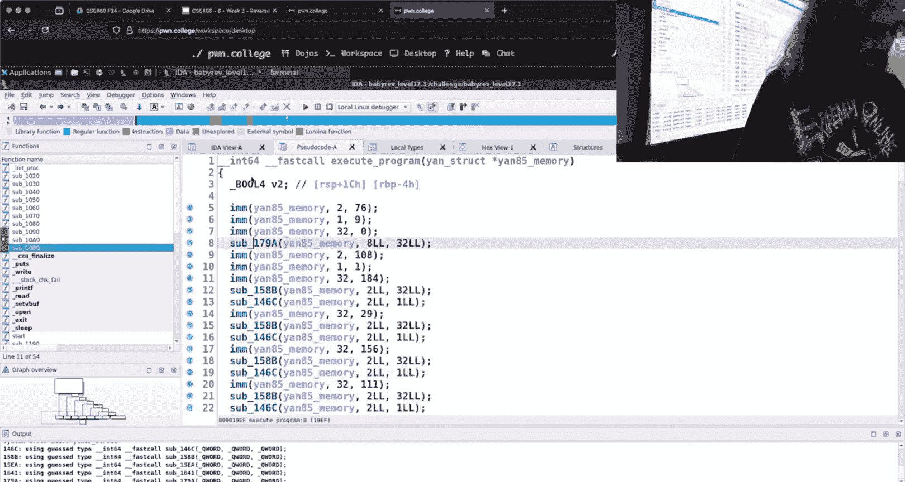

And when I run 17。1， I don't get that pretty help out。But when I was in 17。1， I started on。

My GDP script here。Now this isn't going to work if I were to GDPB it。

Because it says there's no symbols， and so it doesn't know where to set that break point。

I talked about this last week， but we're going to see if you guys retained it。

 how can I deal with that？I can get the address， how am I going to do that？我认。

So this right here says3，1， two， one， is that what I want？一个。Okay， I could do object dumb。

Object dump D。Challenge whatever。This will give me some information， except that is AT&T syntax。

 which is horrible， so we dash M Intel。And then let's pipe that into less。What am I looking for？

Here in object how do I know where I am？Because this is a if it was a 0。0。

That this would have symbols， right， I'd see。诶。Like Maine， right。

 we would expect Maine to be there it was a 0。0 object dump would have that。But since this is not。

 this binary doesn't have symbols。I'm kind of at a loss as far as。

Where do I actually want to be right I do get these address points。

 but I don't have that contextual information to know how it relates to what I'm trying to do。

And what I'm trying to do right now is just find where immediate media is and so I could be right here right now I'm up in Maine。

Drive me， where am I going？Tab。I'm still in May， is that where I want to be？走了。Okay。

 so I'm going to double click instead I'm going to tab back， we're going to execute program。Okay。

 click on IMM。On double click， all right， double click， we're in there。You want to go into set Reg？

to knowSo at this point't it doesn't necessarily matter and that's because we can see here that the arguments since we've done a little bit of digging here in IDda the arguments are the same so whether I set a break point here or set register is called or I go into set register and set a break point inside of that I should still be able to access the same values right so we'll stop here。

And when I had my cursor on set registered， we see 1464， but as was noted， don't trust that。

 hit tab and go back because we want to find the literal instruction right if Ida for whatever reason gave me what was this 1469 it would be after the point I'm actually interested in so T back get the level of detail you want 1464 is correct here so at this point of execution what we see in the assembly instructions above or those values being set in RDI ESI。

should be one more。RDI okay， it's all the way up there and EDX。

So。I have that， how do I use that information to inform me？

Of my GDP script。Okay， I'm going to copy it。TheTamp。And then I can use base。

 which again is this magic constant I have hiding inside my GDP in net。

I'll throw it on the screen here in case anyone missed it。If GDP is debugging a non set UI binary。

 that will be the beginning。😡，Of where the elf is loaded into memory。

And so we're taking advantage of that。And what was our magic number， 14？

1464， so we'll say OX 1464。And hopefully we did everything right here。

It does not look like I did everything right here。嗯。兄给他。我家。始对た。Something， oh yeah， okay， good point。

 good call， good call， I did the the obvious bonehead where I was， I copied it to temp。

 but I wasn't debugging my copy。So if we debug。The copy instead。All of a sudden I get。

Very similar looking output to that health text。😡，Now。When I have unlimited unlimited time。

 the original demo would be doing this， I did this for every single function。And。

You can envision writing a G script that does that。Because what's going on here。

 the registers that you're accessing are always going to be because of the way these functions are。

Similar in Ida。RDI is always going to be this pointer， RSI is always going to be。

There this second argument and then。RDX is going to be the third argument。

 so we have this consistent pattern and so we can do this same type of thing。

 we can even define this as a function in GDP and then just set our great point call the function that's going to print it out and make it。

And so you can build upon this to turn 171 into 170。

Does it matter that if I encode like for my reasoning purposes， this register as A or B？

there's just some register right if I wanted to map this to a character。

 I could write some little if thing and make it print out a prettier letter。

 but I don't care right if I know this is my representation of the registered and that's great if I see two down again。

 then two is just how I'm reasoning about the register right and using numbers instead of letters。😡。

The double check twitchitch here。Twitch says you went eight underscore T， I'm giving up on types。

 all right？GDB is the way。Now these challenges。As far as。This Python point on the slides here。

 I leverage Python to anti mangle or d mangle something。If I were to continue my quest here in Ida。

What we'd see is that。These operations， which are definitely more visible in the  point。0。

 are somehow manipulating my input or manipulating the value of its' being。

But I don't necessarily know how right now。Once I have an idea of how this works。嗯，去去吃。

I want to find。This is a longga。I'm just going to hop back to。

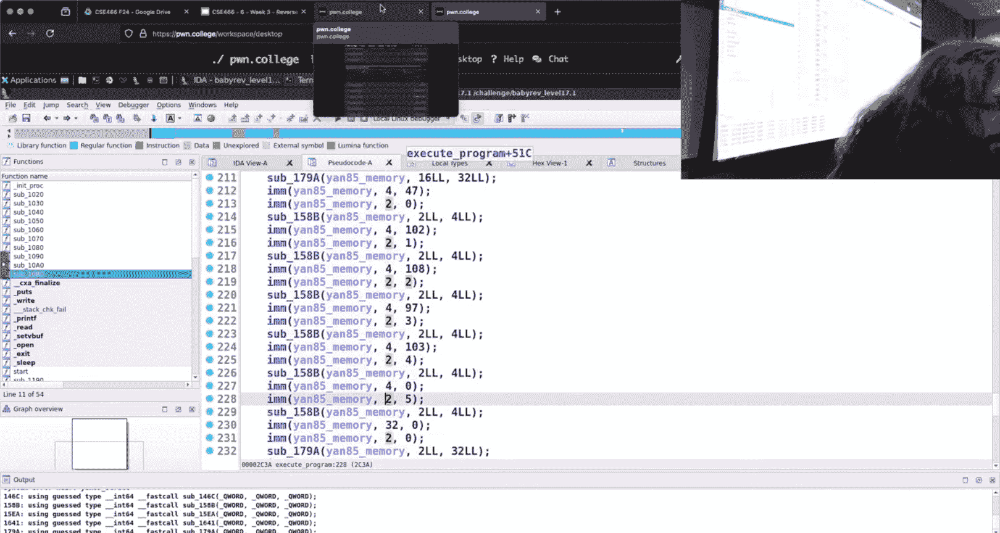

。t0。So that we can talk about。We can envision that we have turned 0。1 into 2。

0 through the power of renaming and typing。

真点呀。Is that of curiosity， how much does it cost to post phone？

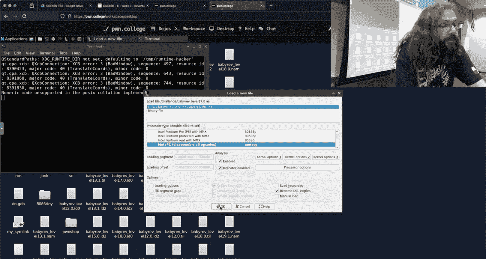

All right， so we。AU owns the servers that we rent it on。So。We're good there。

 just whatever the the upfront cost of the servers are， which I'm sure was。Not a small phone。嗯。So。

Since you guys have already dealt with a lot of this。Somewhere in here is a check。

Because it's doing some type of mangling and then there is the comparison on whether or not we start printing out。

It's right here， it's it going to be。P。So my thought， and again， I don't know this because。

We've looking at this for the first time live with you here， not literally。

As far as recent times are concerned， I want to claim this right here is where the comparison starts。

 I don't know that it's the case and do you want to correct me？😔，You can。

 I'm totally possible of being wrong。Not particularly。

 I just think that that B too right there is the。Dat normally， but no。

 is the immediate thing followed by the elder years that service？Okay。

 so we think of right and don't I don't know this because of secret knowledge right I haven't looked at these these challenges in great detail and quite a lot。

 but I think about how how would I implement again that is kind of your inside or intuition as a reverse engineer how would I implement this type of thing there's going to be some input I'm going to mess it up and then I'm going to check the bytes and we know yawn0n 85 works on individual bitetes I'm going to compare a string what will it probably look like running on this thing there's going to be some comparison and then we're going to conditionally。

Conditionally， do something。which we see here， there's the comparison and then we are like doing something。

 if， do something， compare if， do something where we're setting this V2， I would envision this V2。

Being the value at the very end that determines whether or not we succeeded or not。

 and so we see right there， this is our big check is this V2 if V2。

 we do this one long series of output。And then on the other side， hopefully we see the else， if not。

 and so what we're trying to do is we're trying to make sure that V2 swings one way or the other。

And that's just kind of like high level reasoning about like how does this thing probably work like if I were to try and write this and we see that V2 is influenced by these interpret compares。

This is the part where GDP just kind of。Becomes O。So if I was interested in these bite values。

And I know I could G script here and I could look at this comparison， what would I want to do？

I already wrote a G script that broke at Inter Imediate and printed out something pretty for me。

Can I write a GDP script that breaks at this comparison？And would it print out stuff？

Could I look at what is the expected value of things？So， I'm going。You I do that？

This isn't going to get to the Python reversing。对。It's just more fun。So I don't need this base。

 I'm breaking at。Interpret， compare。See if I can spell。And what I'm interested in。Is again， RSI RDX。

这玩事。Yes， question。开的。Okay， the question for Twitch was when I rename something in IDda does that transfer to the binary。

 the answer is no， Ida does persist this information， if we like file save。

 it's why when you first open something up Ida starts complaining about saving something the challenge。

 Ida saves them which turns out turns into a bunch of garbage here。

 there's going to be all of these all of this this is all just IDA database IDA's representation of the changes that we've made。

 so if I were to open up again， my changes would persist， but it does not change the actual binary。

I actually had a conversation with someone， if you're interested in math， outside of the Dojo。

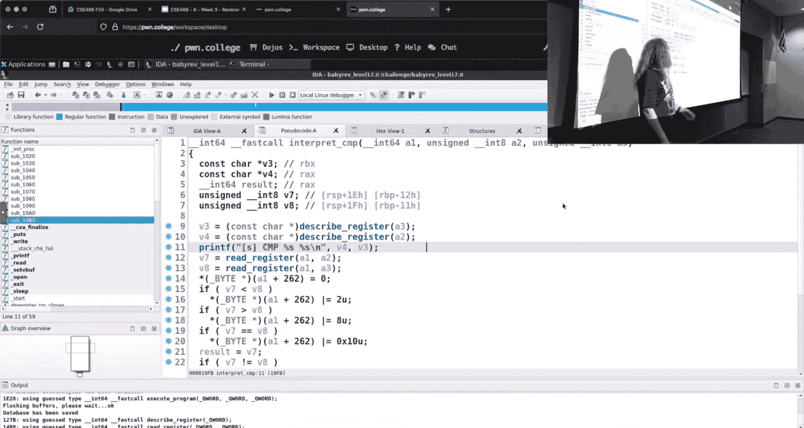

嗯。Let's see if I cite Github。com binsnc。

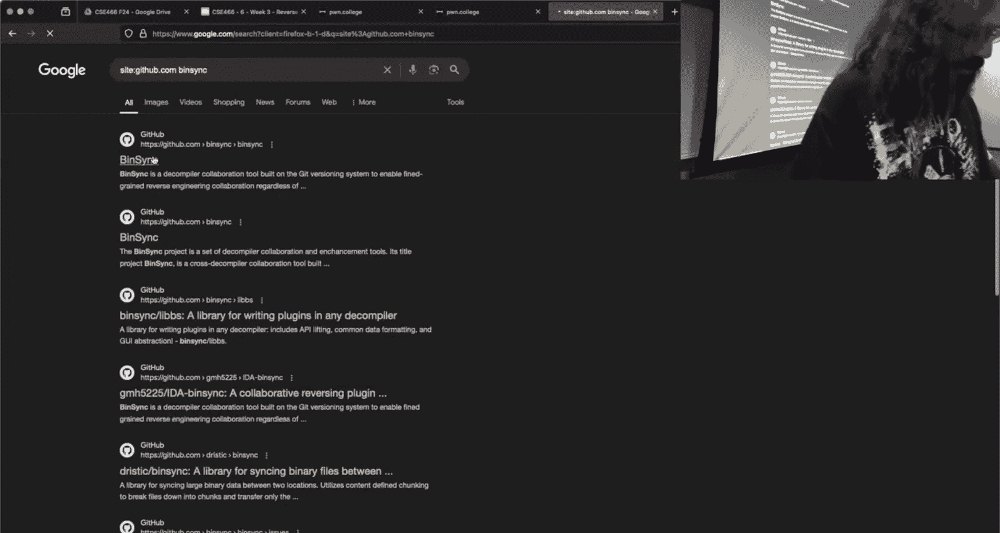

So this is a project that is maintained by somebody in our Secom lab here at ASU。

It's called bin syncy and what bin syncync does is exactly what you're describing。

Ben sync synchronizes the symbols from a decompilr to GDP it's not actually changing the binary as far as I know it could be wrong there but it synchronizes your types it synchronizes the symbols so you can start making changes in your decompilr and then you can see the decompilation inside of GDP as if you had source it's a super cool tool and I actually considered and had a discussion about possibly bringing this into the Dojo as something that you guys could use and play around with。

Unfortunately there are just realities as far as like cost。

 didn't think itself is free and open source。To perform that synchronization。

On binary Ninja requires a paid version because you have to be able to use the scripting portion of binary Ninja。

 similar item， you can't get that tie in unless you have a paid version of Ida。

 and so we can't be giving away paid versions of software for free on the internet。

That would be a no doubt and so if we were to have this， this would only work with， I think， anger。

And Gira。And I don't know if anyone has tried to use either of those tools。

 but if you're first learning how to use a decompilr。

It's a lot more terse output until you're familiar with the tool just because you hit tabab and you're going to get really nasty looking decompilation and so we didn't pull this tool in for that reason because then I'd be telling you to use a tool that is just fundamentally harder to understand。

😡，But if you are interested in doing that in your own workflow， definitely check out this project。

Because it does exactly that。

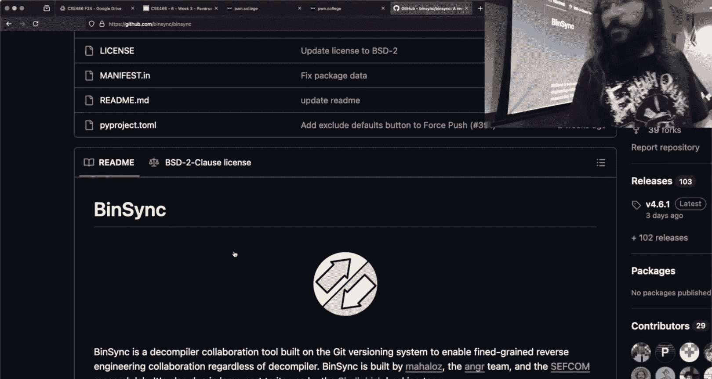

Dwch， no comment， bin sing's awesome guys。Okay。where was u what was I doing Oh yes。

 we're trying to set this break point at interpret compare and that's why I default to say having that just base constant and copying the binary area because it's like that is universal。

呃。So I'm trying to set Bitcoinco here at Inter Compare。

 and what I'm interested in are what are the two values that are being compared？

And what we see is that is not in。RDI and RSI isn it it is an RDI and RSI。

 that's just the pretty version being printed， so I could pretty much reuse this same thing， right？

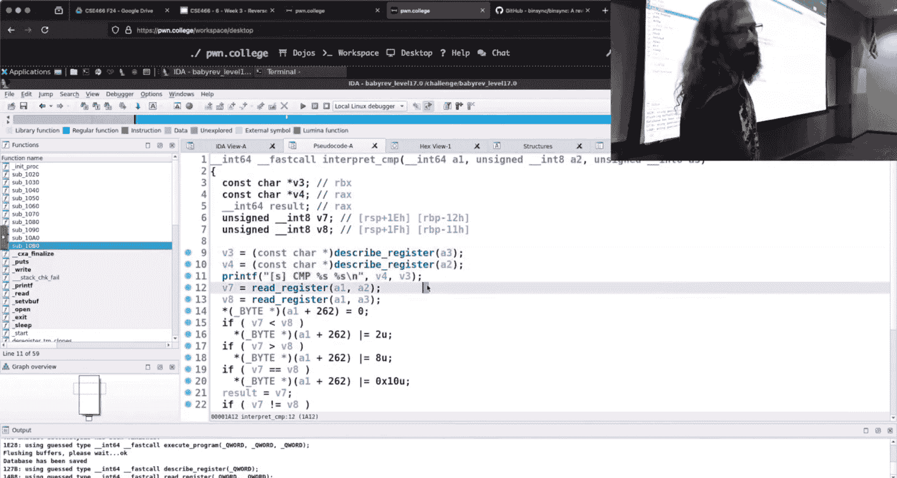

嗯。idea。啊。青眼皮。' doinging the same thing， using the challenge binary instead of。Do that GDP。Tamp。

They didn't copy it。Do I get my pretty， pretty output？Here's my break point。And。

Here what I'm actually printing is the。Encoding of the register。

 so I'm not actually printing what I want。

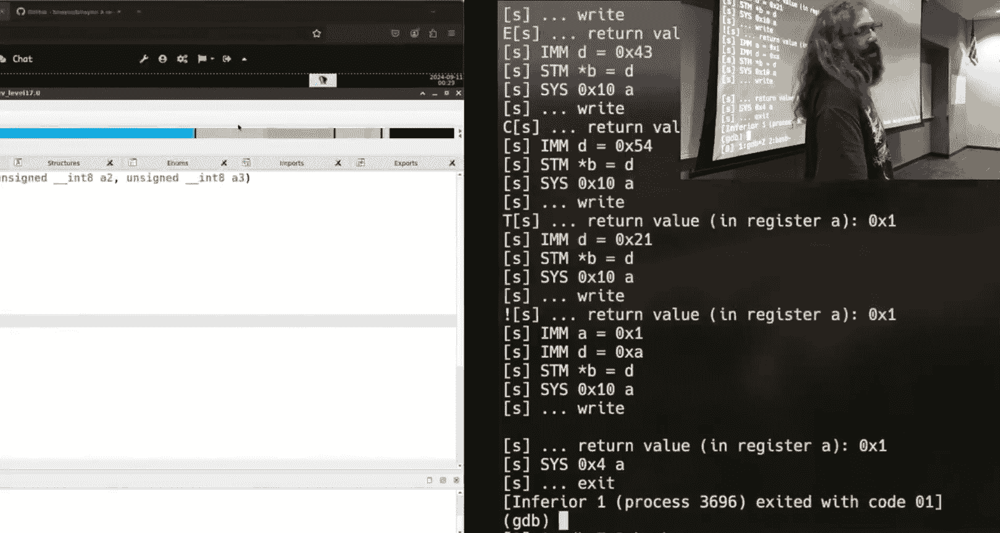

If we look at the implementation， it's not actually comparing my output was like four and one or was it？

嗯。Calling interpret compare441 these are not the values being compared right I had a false assumption there that it was the literal value being passed into the function。

😡，It'd be pretty sillyient， it was 41，41，41， but we're not comparing four and one，How do I fix that？

Yeah， we have the pretty idea。Okay， so the statement was inside G， so inside my G script。

 I could use something like XGX。诶。XGX doesn't work well in scripting。In general， you have to use P。

And then if you want to do the equivalent， you do something like P star， long star or RDI。

 like this would be the equivalent of examining one giant X at RDI。And then if you are。Super cool。

 this is a common pattern， this like star cast， there's actually a shorthand for it。

Where you use this quickly instead， and that is the equivalent of casting and dereferencing。

Until you know that， I would like until you're more comfortable with G。

 I feel this is all clear to read numbers。So I could do this， but is that really what I want to do。

 let's think about that what is in RDI and RDX， it's going to be this the one in four that I had if I were to try and dereence four。

That's not going to end well， all right， I'm going to se fault。So I need to think about， okay。

 this is the emulator right that it just has in。RSI and RDX be these constants that are encoding。

 how do I get the actual value that is there？😡，And see what memories actually are。

Okay so that's a cool solution and I like it the statement for which was okay well I could go and look at the memory。

 one of the things that we saw earlier here was this first argument was this like ynstruct thing right and the registers are represented somewhere in memory and so I could rely on RDI and then look at like RDI plus 256 that's going to be one of the literal register values that's there I don't know which one we'd have to figure it out but it's not going to be that hard because how do you think these numbers these like weird number encodings I have。

Relate。To how it's getting it， well if we go into like read register here。A256 is if case4。

 and so now I know that this is。If it's four， I can grab my yanstruct pointer。

And then grab bread one right we couldn do that and that's a very cool way of doing it because now you have a deeper understanding of how the emulator works right you're starting to think about inside the implementation of the emulator。

 how is memory laid out。😡，The other thing that you could do， which is the lazy solution。

 is somehow in interpret compare， it has to get it， right。

 it has to pull in these values and do the comparison itself。Now here we have the benefit。Of。うん。ちゅ。

We have the benefit of the symbols， so we see read register， read register。

And this is going into V7 and V8。What R V7 and V8？就这两次的。I'm sorry。

 where the literal values are're going， right？This read register function is grabbing it from the memory location that is the register。

 the implementation of the register， and then returning that value。What I find？V7 or V8。

Can I just print it in GDP， like， where is this in the process' memory？correct。Why。呃。这方向。Okay。

 the answer is it'll be on the stack and that's correct。

The reason that it'll be on the stack is because we're inside a function and these are local variables right these are being declared inside the function frame。

 local variables are on the stack， and then Ida does also tell us right here where it is which is also pretty helpful but at a conceptual level they're local variables so they should be on the stack。

So this is at our RSP plus 1 E， RP plus 1 F。

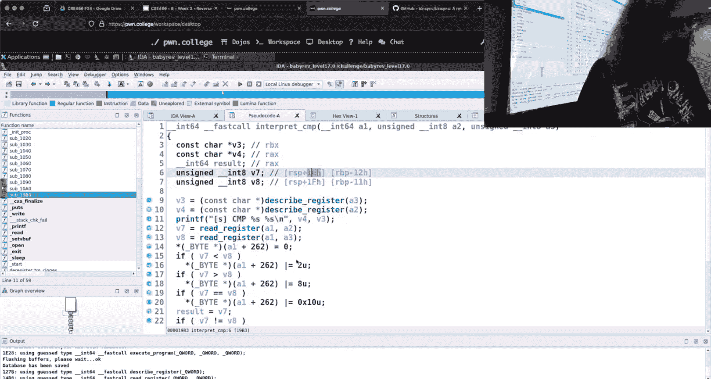

So。Let's see if I can get that。We're going to set。Get rid of this nonsense our one to be。RRSP。

We want to cast this as a， I'm going to go to char pointer oh wait。

 let's see if twitchwitch is right here， they just use the fancy UNent8T。Make get a U int at。Star。

 and we said RSP plus 1 e。And then the other one was RSP plus1。All right。

 who believes in Twitch chat？Nobody。They're all doubters， twitch。

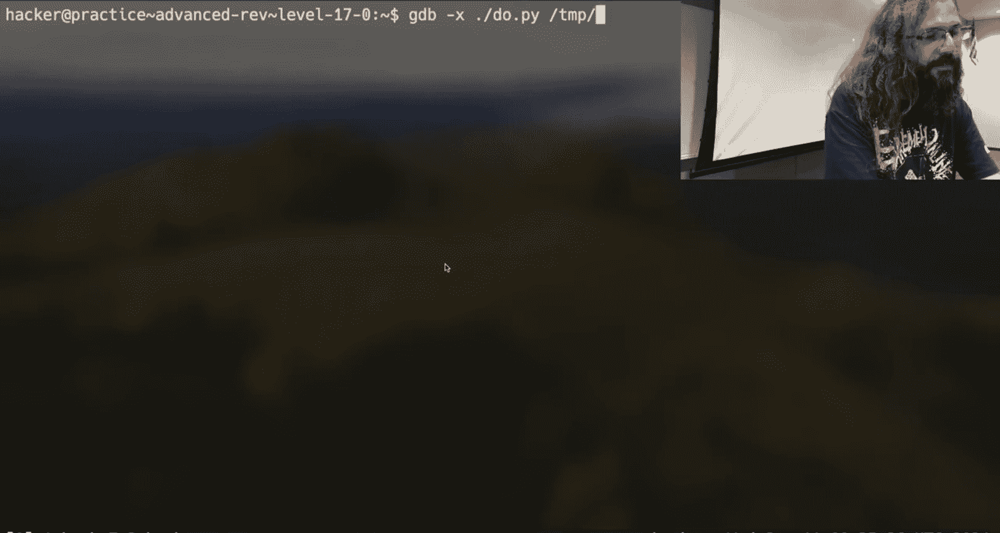

It'sGo up here， where's my compares？What did they do？I did do Du that pie。

So what happens if you name everything due？Did I do challenge again？No。see interpret， compare。

Command。R。No a1 oh。Yeah， that one wasn't Twitch Shed's fault， that would my。Did we get it？

Calling interpret compare 000000。I'm not a， I'm not a believer。Yeah。We do。T star RSP plus。

So I probably don't want to break at interpret compare itself， do I because that's going to be。

Up here。At the entry point of this， so when we say break at the function。

GDB more than likely is going to be right here after the function pro。

So it's moved shifted to the stack who we haven't actually put the value there yet。

 and so I want to go a little bit further。I want to go after。The calls to read register。

 so it should be right here， which is interpret and compare plus 74。What do we do？Okay。

So my cha star， you know， maybe you went ate whatever was the right time。

But we're starting to see something that looks a little bit more sane。And so we could。Utilize this。

To just the part that I care about is this comparison。

And so I could print out or the literal vicetes that are being compared。

 I could play around with my input and see how that is influencing these comparisons。😡。

I've only got about five minutes or so left， does anyone have any questions about anything I ran through here？

Or something that you're like， hey， hit this now， why did I talk about 17？But both are valid。

If you don't tell me， if you don't tell me on discord， hey man 191919。

 you're going to get whatever I come up with， Yeah， yes sir what did was the difference between？

And chastar so so they're both in theory， they both should be eight bytes。

 one of what is U and8 T The problem is and this is like a really goofy。Thing thinging to say。

 you can have signed characters。In C， it makes no sense， I like 100% agree。But it is a thing。

What does that actually mean。So it has to do with remember everything is bites， bites or truth。

 right？Can print the or examine the giant Hex that's at RSP， whatever it's here， Okay。

 I could print as a char star and dereence it。That is now。Negative 57。

Which is C7 C7 is the literal by。 what if I made it an unsigned char， let's see if。Well now it's。

Okay， that actually worked the same way because this didn't have S with how you know how two complement works？

Okay， so so the highest order bit influences if we print it as unsigned。

 how we're going to interpret that value， it doesn't change what the actual byte is。

 but it'll change how GDP or C or a program decides to interpret so if it thinks it's a signed char。

😡，It doesn't change the literal bite， but it'll think about it numerically differently。

Whi is is silly because chas are chas， right， but you can， in fact， add literal characters and C。

It's the equivalent of adding bytes， so they're the same line。It's like the negative and positive。

The statement is， so they're the same modd 256 in answer as far as I'm aware is yes。

But you can get some weird behavior there， that's why in general my default if I'm going to start printing stuff out is to just make everything a long long。

 a long long star because then it's eight bytes I will deal with in my own head interpreting those bytes how I see fit。

Did that give us something pretty？Oh， it gave us something。All right。Now this。This doesn't make。

A lot of sense how I'm getting different values， I gave it a couple A's。

 but there's probably some type of manipulation going on earlier in it。and likewise， I don't know。

This other value is like seated on the flag， somebody is nodding， so maybe。

 which is why I'm getting null bites here and here。

Because if I'm trying to open the flag and then read from it， it would get nothing。

Which could be what's causing。My null here， we can actually reason about that real quick。

As long as we have the time。We can su su。2。gdb。See if my rainbow there was correct。

My rambble was not correct， so there's probably something else off here in。The GDP script， what an I？

And one， E1 F。1， E1， F， arc 1， arc 2。Is it format strings again？

YeahSo I'm not sure what I'm off there， but you could totally see that working if I found out what my issue was here。

For for live demos。Question。、そのようで最い。出なで。Because tax is。

TheThe statement is I don't know that I can trust Ida right here。

 so I am very distrustful of decompilation tools in general。

 I don't think Ida is going to get the stack location wrong the statement from the class was that the stack is dynamic and that is true in the sense that the stack grows and trains as the program is running。

 but the stack is。Generally speaking， deterministic in the sense that within a function frame。

 you have to know the offset from RSP or RVP one or the other。

 there must be a constant to get to a particular local variable。

 otherwise just the CP itself can't work because that's how we refer to local variables is relative to RP RVP。

😡，So I don't think I is getting that wrong， it could be， but I don't think it is。

 let's see if Titch caught my mistake。You can silently do GDP， yeah， I don't care about that。嗯。

not today。Any， any other？Questions in the two minutes that I have。Yes，医。 this is also。

So what I wanted to do， you can do this in Python if you go into the on the Discord。

 I think it's in the on topic channel， somebody asks something about dynamic scripting and GDP and the example I threw up there。

 I wrote a P tool script that used GDPb。 debug and then instead of having，This be a separate file。

 the second argument to GDPb。dbug can be GDP commands basically Yeah， no so all of these tools。

Do the exact same thing， it's just a matter of how you want to do it。

The only advantage is like you could。raically extend by the python。生司。Yeah， so the question was like。

 what's the advantage of one or the other， why would you？

My workload would be to do it in Python and the reason for that is I could then debug my payload dynamically as I'm developing it。

 as you mentioned now that doesn't mean，Like if I echo hello into my file here。

 and I go back to GDPB。I can run and then direct in my file into standard in here。

 so I'll just run less than my file， and so I can still use GDP on the terminal and have it take in input。

 but that has now increased my feedback loop opposed to just doing it all in Python。All right。Cool。

 if Twitched has nothing else， I'm going to call it there。I appreciate you'all。

Goodbye and good luck。