# ASU《计算机系统安全｜ASU CSE466 Computer Systems Security 2024》中英字幕deepseek p08 -09-Reverse Engineering - CSE466 - Robert - 2024.09.12.zh_en -BV1spCGYZE9D_p8-

Up over here on Twitch。It does。And it does。So today， September 12， 2024， we're here at CSE 466。

 we are wrapping up reverse engineering at the end of this come Monday。

 but this we go after class hopefully where we。Talk about this module。

I think today makes this day one， I just assume OBS is broken now。

 so now I just reset it regardless of whether it appears to be working or not。

 which is just the correct answer。

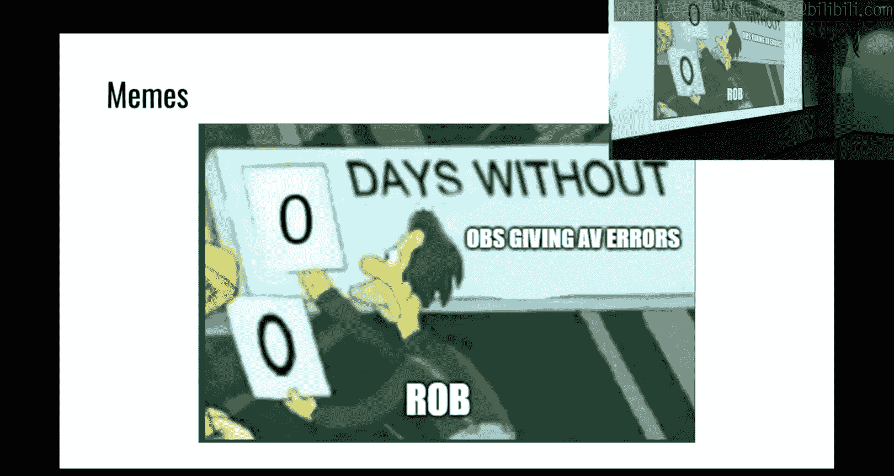

other memes we got going on here。Let's see， we must build a disassembler for on 85。

 we get the register mappings， it'll be easier to read。

You can separate basic blocks we haven't talked about basic blocks， but all right。

 we need to track the state of registers in that follow the control flow。Yeah， whoever made this。

 why are you making basic laws？For those that are unaware。

 a basic block is the the concept that like if I have some series of assembly instructions。

 they're going to execute。

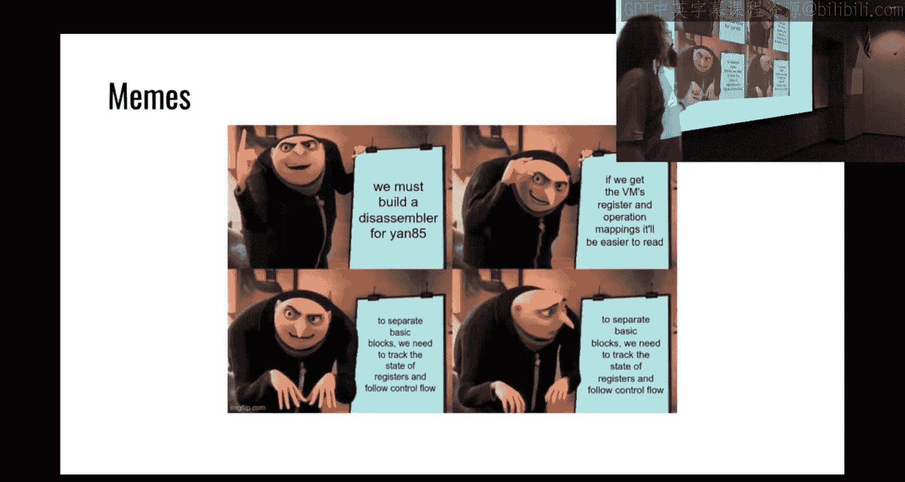

啊。They're guaranteed to execute together。

I guess would be the best way to put it and so when you look at something in like Ida and it has that that fancy graph looking thing。

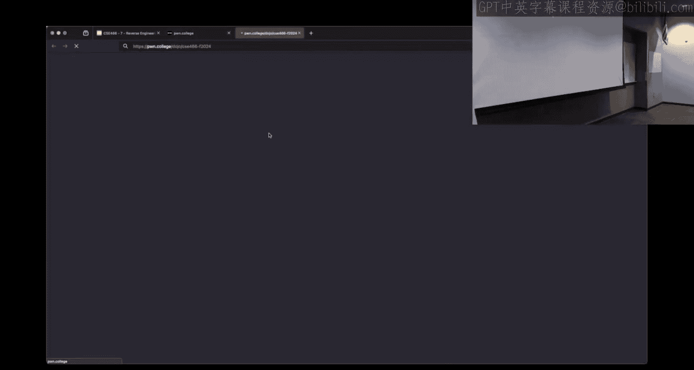

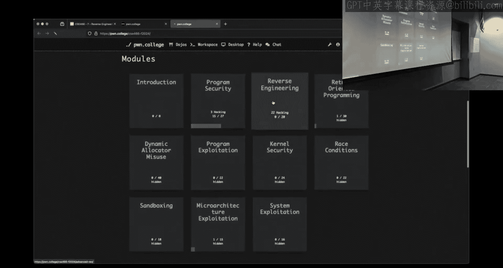

Where all of the assembly instructions are in blocks， what it's showing you。

Is the basic blocks of how they relate。In control flow。So that's what。

Is it just 12， but like any any reasonable binary is going to。Give us this。So if we change。

 we look at。I'm already in it。This is all。Oh， this is literally one thing， isn't it？Okay。

 so this is an example of three different basic blocks so everything in whatever function I'm in。

 all of these assembling instructions have to execute together and then based upon this conditional willll either execute this block of assemblysembling instructions or this block of assemblymbling instructions。

If you're working on your disassembler and you're thinking in basic blocks。

 you've probably gone too deep。All right， I don't know whose meeting it was。

 but it shouldn't be necessary。It'd be cool if you do it。

 I don't think I've seen anyone generate a basic block representation of John 85。嗯。

How do we avoid predatorors and hike， we do reverse engineering， takes a bunch of time。

And then people have realized that there is impact lot to hiding in Jan 85。Particularly 19 beyond。

 which is what we see rank here。We're drillinging， we get to 19 and then it's not that this will be a consistent pattern。

 as I've said in all of the modules kind of going forward。

 you'll find that the beginning is quite easy， it ramps up a bit and then the last like three or four challenges kind of take it。

 take it to 11 to where it will take a pretty serious time commitment。

Logal thing is kind of where are we at right now the average person has started is about 71% complete with the module。

 so that's about on pace with how long the module has been running。

 which is a good sign overall here， there are still some users that haven't started。😡。

You know she and choose her own adventure there， I just got this email like maybe 10 minutes before。

Before the class started here， but I did successfully get a room reserved for Friday at noon as you guys requested。

 so tomorrow I will be in BYENG 222 from noon until 2 pm。

This may or may not be streamed right depends on kind of what the people that show up ask about like is it something where I really need to be challenge specific my。

Goal here is to try and get people unstuck and when we are on stream。

 there's kind of limitations on how I have to word things right to make sure things aren't just copy。

 paste， here's your solution。And so。If if there is a need for kind of offstream Q&A。

 we'll do that here in office hours， you'll play it by year。

 I'm going to try and stream during some portion of it so that everyone can benefit。

 but it's going to depend upon what the questions are when people show up。All right， demo questions。

 these are demo planss。Anything in particular that you want me to hit， something you're stuck on。

 we got a hand。Level 22。 all right， so can you phrase that as a conceptual question。

 what about level 22？the sight。How do we navigate the side channel with level 22？O。

So I can definitely do that， I figured that would come up for the very last challenge I try not to give away too much because it's fun being this kind of scary monstertra。

 but I can definitely talk about how to reason out the side channel。

 how to kind of problem solve your way there， as far as how we should be thinking about it。

One of the things that is relevant in。I think 20， maybe it's 19 beyond。

 is the concept of just how do we add bytes？That came up a as a question。

 so I'll kind of demo that real briefly and then is anyone still stuck on writing a disassembler asmbler is that？

I hang up here。Just， but I don't understand how to write increases。You can't get the bike。You don't。

 You don't see the bites of。他不一定住得多。It's a story in the 19。So。

And it is stored in some variable D underscore before execution。There are some lights。であるですら。Okay。

 so just for Twitch as a recap here， the statement was， I don't see how to use my disassembler。

Because I can't get the bites out of， for example， level 19。

And because they're stored somewhere earlier in the process before the Jann 85 interpreter loop or execution loop kind of fires off and so how do I get those bites out。

 one of the comments from another student was IA does have the ability to grab that memory and pull it out。

 I am sure most of the disassembers do， the way that I can kind of show how to do that is going to be with G。

Because we can deal with it， it clearly is in memory at a certain point in time。

 but therefore we could print it out。はい。So let's take a look at that real quick。

 but no one's having the problem writing the actual disassembler， is that correct。

 like writing the Python isn't a problem？

こ。All right。

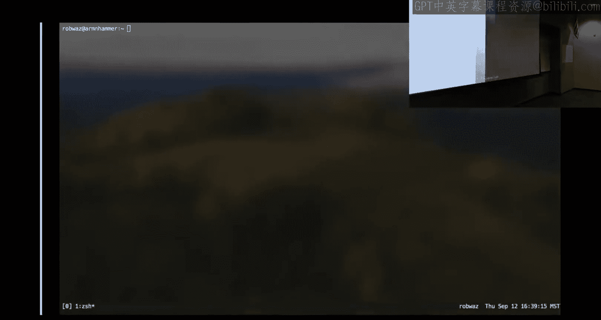

So let's take a quick look at 19 since that was。

Ask here。ないて。You want 19。1 specifically？W not 19。0， 19。0 is perfectly a good challenge？打开工作室。

If the structure is there？I'm a believer in 19。0 All right， good， do you believe in 19。0？

Should be the same。Are you willing to tell me how to do it in IDda so I can learn something？はい。啊。😮。

O。Go down to main。Okay。Scroll down。Very。Okay， so here's。So if you just click on the V。

Where are your bikes pleasure。そ的。Okay。And then this right here is my Ynkka bites。对在。

You were looking at。they are otherid。Oh， see that's you were looking at this。

So that's one of the trappings of kind of looking at Decom。It doesn't know your tights。

 you can get into the kind of this weird spot， but a good way of kind of reasoning about something that the decompilr cannot get。

I's like， what are the arguments to mem copypy？That that doesn't change and if we don't know that we can consult the man page and see what they are and so regardless of what Ida thinks these things are。

 we could look at the man page and know we have a destination point or a source pointer and the number of bys to copy from A to B and that's a good strategy in general when reversing to figure out what are the types of things when a veganka probably does get it wrong。

😡，question why why a silicon keyboard。So let's say what does Ida think this is？

So it doesn't stand in there I see you make cut your table。So it's clear that it's even a bite。

It thinks this is an N64， we tab back to the assembly。Okay， so。It is moving。Whatever is in。RDS。

 let's going on one more。It's moving whatever is。RBX。Go don't trust that yet。V F8。RX。

Qword so Ida doesn't the reason it's showing keywords is Ida doesn't know the type of the value because these are all occurring on 60 64 bait registers。

 so Ia think this is all keywords where if you look at what's going on here just from the way that we're accessing this。

Is it your words， let's see here。Does this have this typed as a key word。 Okay， no， that's fair。

 So it has it typed as a。In 64 array。 So that's fine。 So every move here is actually。Eight bites。

And when we go here。I don't know what Ida is doing to us。

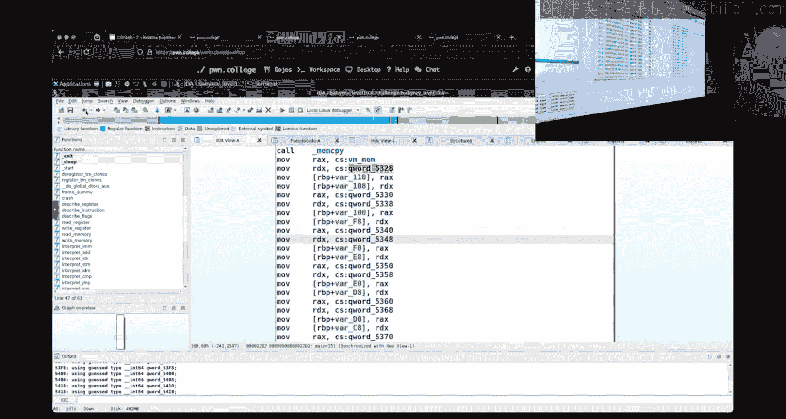

That's why my preference is to use something like。Good old GDP。

And we can use the same high level strategy。if this were if this just as a general note。

 if this challenge were seated on the flag， I'd be dropping permissions here by using GDP。

 which means we wouldn't open the flag， which would influence that seatding。

 this is particularly relevant for like 22 and strategies that you want to use there。

So I should be able to break on me compareare。Turns out not， let's start。

 can I break on and compare now， now I can。And if we run this。Actually， we can continue。

It's going to read something， oh， I don't mem compare， I want me me copy， right？H。

So right now it's breaking out a bunch of mem copies from earlier。

 so we'll have to disable that we'll disable breakpoint two， we'll disable breakpoint three。

 info break。Dable。Break point 3。1， will disable breakpoint 3。2。 will'll break on main。 We'll run。

 Al right， now I'm at Maine， and then I will enable。Break point。3。1。天津。啊。Apparently not。

We'll do this the long way， we'll disassemble main and find where that call is。Here's the mem copy。

 it's at main plus 269。So we'll break at main plus 269， then run it。

That's my initial one that's at Maine， this should be。I't you agree there？

Construction that's at R IP。 Okay， I'm there。 I don't know if Jeff enabled。

 but're we're at that call right and the destination is going to be in the first first arguments wass gonna to be rich to RDI so we could print RDI。

 This is my pointer。 You could print it Ex decimal。 So it looks like something I then examine。

 for instance，100 giant hes at RDI。Probably overkill。 that's my destination。

 What I really am interested in is the source and so this。RightHere。

 which happens to have a symbol since I'm in the 00 is the yawn code bytes。

 It happens to have a symbol of VM code which is a good hint that we're looking at the right spot。

 So these these here should be the literal ya code bys if if I wanted。

I could print this out or just dump this out with GDP， copy paste into Python。

 I do think the Ida approach is probably cleaner。But we can get to these bites up inside the main。

Before that interpretive loop starts running through them because they have to be somewhere in their。

It's just a matter of finding out where they are。And that this should be true not only for。19。

 but I believe 20 has a similar mechanism going going from memory where it's dynamically。

Running some Ynk code bites on the Y code。AC。m right。

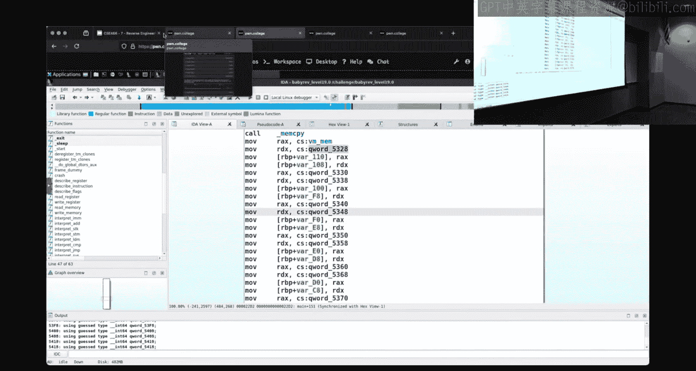

So in 20。One of the things that's going on here is。

It has a manr， so the difference between 19 and 20 is kind of what it's doing。

 I'm spoiling this for you here， but it has it is doing something to be input or doing something to change the values before that comparison is happening。

And so we might want to know well， what？What is it， what is it doing？

How do I reason about what's going on？If we。Get this similar thing， we just。

 this is dynamically the green so I can't just look at Ida and see what the manipulation is， right？

This is again where a disassembly would be helpful for the 0。1 version。

 but since that doesn't seem to be an issue for people， we would have for a 0。1 version。

 similar output to this one we could envision。From having the disassembly。

And what we're interested in。Is what is happening？To my to my bites， right？

G me like 16 A's and I get this incorrect。If we were to。

Go up here。 What matters is going to be the jump before， right。

 the condition that gets us to incorrect is the thing that we want to。

tro we want to influence the value that controls this decision to jumper not。

And what we would find is that this is right now it happens to be D。

 but we're checking this and so this D register is serving as kind of a flag on whether or not we're matching so again。

 envision how you would write something that does this。

 we're going to have some type of pointer that's going to iterate down this string if we find something that doesn't match。

 we're going to set a this is bad and then check at the end was any of this bad。

Did any of these bites match or not match？And that's what we can kind of envision what's going on here in the Jann code CPU without having to create that kind of basic block diagram。

And if we were to go up further， when is this Dvalue getting set well right here。

We see immediate D is set to1 and we know that D is the thing that is being checked here that's getting us to the bad value so y we call setting d equal to1 Well that's going to be based upon this jump。

😡，来为就。High level reason are away there。So then we go up a little further， oh。

 what's the comparison that is influencing that jump？

What's going to be this comparison right here including D and C， I gave it a bunch of A's。

 and one thing that you may want to look for when you're kind of reasoning about this。

 not using any complicated tools， not using DB， it's just like， okay， well if。

My input is influencing this comparison， even if it's main linkage。

 I should be able to change my input and I should see different values in what's being compared。😡。

The high level just air， right， that makes sense。So I'm going to copy this。So that I have it。

I'm going to fire up Tms。So we have that for later， I gave it a bunch of A's， is that right？

What happens if I give it tea？Just give it a bunch。Well， let's find that same spot。Here's the D。

That gets us to incorrect。Here's where D is getting set。Go a little bit higher。

See if I lost my own place。Where's D， there's D getting set right here。

 which is based on this conditional and then the comparison。Is right in here。

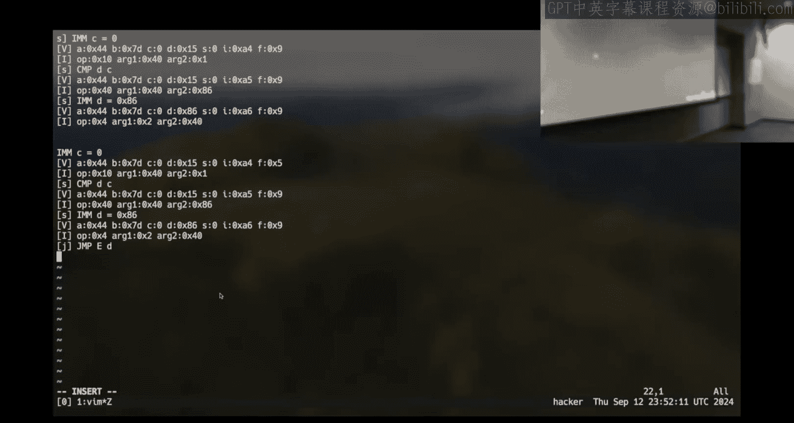

Did we change anything here？It doesn't look like it。So what's wrong with my assumption？the。

So any of these streams？We got 4470 c015。Okay， the flag， the flag changed。

So maybe it's not this right here that is the comparison of my literal bias。I would think it is。For者。

ItSo I might not be looking at the exact correct spot here。

 but somewhere we should see our input influencing。

The spot and control flow right I'm doing this on the fly just kind of walking backwards and making assumptions about the program behavior。

 but if if we were to。Take a slightly better approach。 We could envision echoing。

A whole bunch of A's into this challenge。And then writing the output to A。

We could then do the same thing with。Or other letter it doesn't need to be A doesn't need to be B。

 I'm choosing something that hopefully is different enough that we can clearly observe it。

 it's not like the difference between 41 and 42 so there's my A output， there's my O output。

 there files A and B I could diff A and B。And we see that there is。

A difference here an interest in the actual memory。

 right I may not have been able to initially look at it and go up。😡，Diff is showing me。

 I did diff AB， so the arrow to the left is what happens when there's a。

arrow to the right is what happens when I think I use Mo。

And we see that there is something that's different， right？A has A and B。

Al look at this section right here， what's different， although the B register is different。

C is the same， D is the same， S is the same the instruction。It slightly different。

 which is interesting， so we impacted control flow earlier than this because di is showing line by line on the outcome。

So I'd want to find somewhere where the instructions。Are the same， but the values are different。

 this is something I can control right here， we have the yan code instruction that is at the yan code address of X78。

We see that register A is the same， register B is different， but everything else is the same。

 and so this is a great place to look at。😡，The output of the program to determine。

Why are these different when I give this input？If I don't want to use fancy tools， I don't use IDda。

 I just want to like high level reason about this having that dissmbler allows you to turn 20。

1 into this。😡，And now I know we're in my disassembly to look at。😡。

I know I need to look at whatever's going on right around or right after。Instruction 7071。

Because after 71， I guess 72。73 is fine。Where is the control flow jump？

But you get where I'm going here， right， somewhere the control flow is going to jump。

And the line is going to be different if we were to start at the top here， as we're at 1 D。

 we're at 1 E， we're at two。Where does the control flow change？28，29。To A to B to C， to D to E F。

Yeah we're going to find it， right？Oh no， the control， I'm totally boers here。

 the control flow is going to be the same because we're failing at the same point。

But we'll be able to see where we're influencing the registers。

But if I did the same thing and I had a good value and a bad value。

 what we would see is that the instruction pointer。The output at one point would be at for instance。

34 and then with a good input， it would not jump or jump and so the the instruction address would change like if you wanted to just try you figured out which by it was that's being compared。

 you could zero to 255 that by and then see Windows。

When does control flow change using this disassembly output it's a naive approach。

 but you could do it and then this is where reversing is really what tool is right for you we've talked about using static the compiler we' talked about using GDP now we're just kind of reasoning about program behavior from an execution trace Any of these can work。

Now， one of the things that。This will do if we look up a bit， we look at like just the output of a。

There is an ad here。Have you figured out what size of data Yn code works on or the Yon 85 CPU。

 does it work on eight by keywords？It works on single biass。And so if I'm adding B and C here。

And we see， in this case， b is 61， that's fine C is D0。

so we can't what happens if I take D0 and I add61 to it？

The highest value of bike can be is that fast。😡，So what happens when I go over at that？Ts up so。

这个で啊还有。It will just take the past eight bits and whatever that value is in。我对对对。Okay。

 so the statement for Twitch here is it'll wrap around because we're interpreting this as just a single bitete when we do this edition。

 we're just going to take whatever is the least significant eight bits and we're going to interpret that as a bitete。

And if we were to look at what happens here with aBC。That is the instruction。Once it's executed。

 let's see if we can math it here， where does that get stored？Good sort in B， okay。

 so it uses a similar mnemonic， so we're saying we have hex31 here。How going to be sanity check that。

I'm going to go to May。Default here， so I have hex 61。And I'm adding hex D0。

I get turning this into hacks。So we see that it's3 one is the。

Le significant two nibbles right of that， which should match what we saw over there in the ya code。

 which is our three one because we're essentially just cutting this off， right。

 we drop that third digit。Because we're only interacting with bites here and if I wanted to。Have it。

Display like that。We could and it。So if I end it with hex FF， I'm saying only show me。The bits。

That are in the first。Because Hex 255 is 1，1，1，1，11， all eight bits are set。

And so this and operation says， do whatever this math is and then only show me the least significant eight bits because we're using that logical and。

And then we say interpreted as tax， and so we get that same result。Now， what this means is that。

If I need to like reverse this operation hypothetically。

I want to do this from starting at the end and working backwards。I need to say what is。

So how does three，1？Subtracting D0， get me there。We're going to do the same thing。

 I'm going to go negative this time。But it's still going to wrap around。😡。

We'll see if the math works here。Like 31 minus hex D0。LetsMake it hex。Oh， it doest。

And so you have to be careful about that。There is a way。Um， two， to method there。

 but just be aware that when you're wrapping around and doing that。

 it's kind of of one way where we're adding word modulo， you can go back。

 but it's not as straightforward as just subtracting there。Truth be told you don't need to do that。

 but if you are taking this， I want to code something and try and build something that starts from the end and works backwards。

 which is the approach that was used in the earlier yan yan 85 or not yan 85 the earlier reversing challenges that we are not included in this course that is a very common technique that people use is they just look at the operations。

 they write something that is's the opposite and you start at the end and you rate the math to go back to the beginning you code that up。

😡，All right， so I know there's the question on 22。Anyone have any other questions about like 19？

Or do you have a direction？So when there is an interpreter loop， we don't have bias。At that point。

 my rec result is optimal。The statement for Twitch is。So if there is an interpreter loop。

Something like this。Then。There are no bites。II need。よくバてりた。

That's an a first I have to figure out what is going into。I contact previously。

 I got like good block of all the bikes for YouTube。Okay， so so prior to 19。

 when we double clicked on main。嗯。What we'd see here instead of interpreter loop was a series of calls。

 we'd see like interpret ad， interpret， immediate， interpret， whatever。

 we'd see the literal yank code instructions being done。

The difference between the things prior to 19 and 19 is that instead of。

Having the literal calls existing here in Maine， those calls are still represented here in Maine。

What they're represented as these bytes， which we saw we could pull out so the if I understood the original statement correctly。

 it was 19 onward， my disassembler doesn't help me。

 it's the opposite 19 onward is where the disassembler is critical。UBecause once I have those bites。

 once I yank them out， can I pass that to a disassembler？

And that's going to give me something that looks like this。

 depending upon how much effort you put on your disassesember like formatting， right？

So you're going to get this type of output from your disassembment you like it's totally。

Reasonable to just say hi， every register is zero when I start and if there is a set you could track this state in your disassembly。

 you're moving more towards an emulator there， but it's like this initial just pay of what is the value of everything that's just one more Python dictionary that you're using with how what have you got。

 one， two， three， four， five， six seven with seven values in it。

That you're just going to update every time an instruction that updates it does。But again。

 that's going going a little， little bit further there versus if you just have the disassembler without tracking the state of everything and kind of stepping up an not to where you're turning into an emulator。

 you can still be like， well， I want to know what is the value of a at this point and work backwards or read it forwards and get there。

 right？That's what I would encourage。Because technically it could just jump to some arbitrary spot。

 but you should see that because you'd see the jump and so you'd know where you're going。

Because your yan code bytes are in memory。 So like when the instruction pointer here is1 B。

 that is one。I'm assuming that we're reading at the beginning of that array in the interpreter loop。

 so it would be the base of the interpreter loop plus hex 1b bytes。

would be the bites that you're jumping to there。Does that？够。All right， with that。

 what everyone really wants to know。IHow do I deal？

With 22。So the person that originally asked。You said。

 how do I reason about how do I deal with this side channel， what have you tried。

 what are you thinking？百过。あん justさ。Very灯。あ番？第款。感谢你的援。あいです。えなです。两个。嗯。I was wondering。あれ全然。必し。Okay。

 so I'm going to paraphrase here， I'm trying a whole bunch of things I'm throwing it in there。

 I'm reasoning about like what is a valid register， what isn't。

 is there a better or more efficient way of doing this？😡，Is that fair， okay？And。The answer is。

The intended approach is to do what you're doing， there are ways and this isn't like you can use GDP to get like secret info or you could use S tracece and get secret info that any of those tools are going to change accessing the flag and practice mode isn't going to match real mode so you can't rely on any of those tools to gain factual information that you're going to use in your ex。

😡，So that means that you do have to rely on that side channel。

Now there are things that you can logically reason about。That。

You can apply in your exploit because you're saying I'm trying a whole bunch of bytes。

Let me ask you this right here， I talk a little bit about this after class and。

But are you trying every bitete from zero to 255？Why？😡，Only specific bites are used。😡。

And so we have some information about how this G code CPU works。

And we know this because we've been messing around with this。Kind of weird machine here。

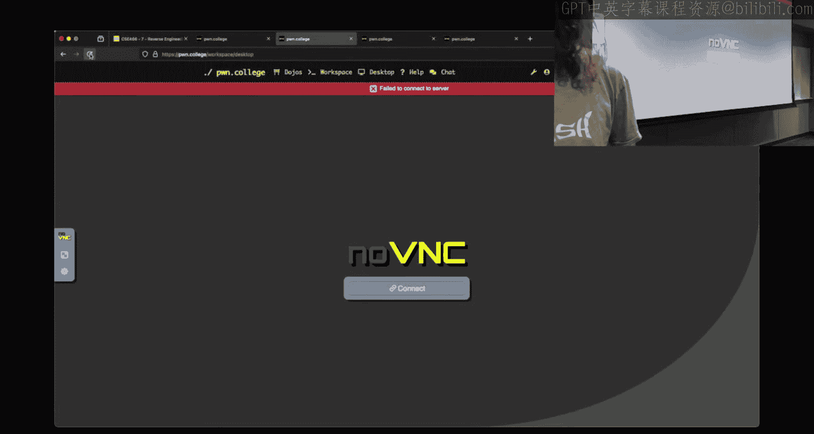

For the past two weeks。

Now， at this point， I assume it's not a surprise that the order of the bytes。

Can change from challenge to challenge。 So when I say I'm going to function as if the op code is the first byte。

 but you don't have that guarantee in reality here。 It's just easier to。

Reason and explain kind of our thinking。So when you go into this interpreter loop。

 if I assume the first byte。Is the op code？There's only a limited set of values that are valid。

Op codes， right， this isn't checking every possible value from zero to 255。Right we have。A2 matches。

Inst IM M。Which is one。We see the instruction for SDK is two， the instruction for add is four。

 et cetera， why are these values chosen？Anyone anyone figured out we just like these numbers？

So they are all base two， right， one is two to zero， two is two to one， four is two to the two。

How is that represented in binary？We said there's eight bits of a bike。Zero is all zeros。

One is going to be the first bit set two is going to be zero， then the second bit is set， et cetera。

 et cetera this is actually a necessary property。Because how？Is this being checked？Is this an if？

Like there's an if there， but is this an equality comparison？Oh。

It's doing that same thing I did in Python， it's and and saying， art and is this bit sack？

So if we use like one， two， three， four， we couldn't use this type of logic。

For analyzing the instructions。We have to have that property。

Of every instruction being represented by a base two value in order to use this style of comparison。

And so you can take advantage of that， which the person said that they could。

We know that there's what， three， four4 five， six， seven， eight， there's eight instructions。

That's convenient because there's  eight bits and a byte。

 so that means the only value is that we really need to guess for the op code are going to be one。

 two， four， et cetera， there's eight hard coded values that are valid op code。

That already reduces our。Um complexity of kind of our fuzzy loop or our program that we're using to kind of try and decipher this by a factor of what ba？

I mean， I missed some Twitch chat here， let me catch up。Oh oh。

All right， so Twitch dropped some wisdom for us。You leave something。

 where do we have OX 31 minus OXD， and this was bad， and then this was bad。

Twitch figured out what it was that I wasn't doing。Anyone else？I did it when I was adding。

I didn't end it with FF。Oh wait， it was D0。It was like that isn't what we had there there we we made be back to six one。

I was doing all。Yeah， I mentioned on Tuesday that I heard that we're doing a lot of things things by hand。

 and it may be a little bit of a struggle to be like how do I do this in Python。

 how do I reason about the math and get this right。

 but doing this now we're going to be doing weird hexscimal math the entire semester。

It's gonna not necessarily going to be exactly this right。

 but being able to do this type of math in Python allows you to script it。

 you to wrap it into function， you can then call it a bunch of times。

 writing it out by hand is great when you're thinking about it。

 especially because like drawing out the bits and I'm trying to like conceptually a reason about it like that that's awesome I do the same thing when I'm trying to initially understand how something's working。

But after that， you use the tools that you can to iterate fasterure there。

Somebody else says you could modo X 100， which is essentially doing the same thing。But that is valid。

 we're essentially modulo 256 there。Oh， the question for which was， can 20。

1 be solved by using heavy GDP scripting？Once you sort of understand what's happening。So。

It can and this goes back to there's many ways to reverse and it depends on what makes sense to you if I were to solve 17。

 I'd use GB scripting， if I to solve 19， I'd use GB scripting， if I were to solve 20。

 I personally would reach for GB scripting。Now there's a couple places that you should be interested in。

 and I spoiled a little bit here the 20 has a manr and then there is comparisons。

There's two places I'm interested in。If I can reverse engineer just to whatever's going on in this mangle。

and I can eliminate that from my thinking， that I can turn 20 into 19。

So I could set a break point that however this mangling is occurring。

And figure out what are the values， how is my input getting mutated？It a break point there。

 I hit it for every bitete that's getting changed， I get whatever this modification is right I turn it into arithmetic some logical operation。

 however it's doing it in your challenge。At that point。

I know what the I can break it the comparison and I know what the expected values are。

And so I could take the expected values。Roll back whatever that mutation is or that anglegle is and I would get the input I'm still having to use a little bit of Python here to get from the end back to the start。

But most of my inspection and kind of reasoning by program behavior is happening inside of GDP。

Alternatively， if you're like， I don't want to like be logical about this。

 I have a computer and computer go fast。You can set a breakpoint at the angler or at the comparison。

let's do that real quick， I'm going to circle back to 22， but I see the clock， I got some time。

Right just like how in the。

In the disassembly output， I was saying we could di A and B and see the。See the difference here？

And see， what register am I influencing？If I were to look at that A and I find the comparison。

That is getting me to set D if I read this correctly this time。

We would find the value that is leading us down the fail path。So like。We could throw GDP at 20 point。

1。Instead a breakpoint at where that comparison is happening， and then just try values。

Was we could script GDP inside of by Python so I could write a loop in i Python。

It gets a little bit meta here。As far as writing a language that writes a language。

But I could from homeone import。ASt。My payload is going to equal nothing because it's going to start off as an empty by string and then my payload will plus equal。

Say。4 I in range 256。My payload plus equal。What would I want P8？Of I。

 that's turning the number of I to a byte representation using Pe toolss packed。

 so P8 because it's a single byte，8 bits， same thing as if I were to use P64 in a number which we'll use quite a bit in the next module。

And then for every change of my payload， I want to make a process which we've already done。

 except now I want it to be something。That is under debug。A baby rev level 20。0。

And then we can supply。Our G script in line right here。

 so this one has symbols so let's like break at。Interpret instruction。And then。If I had this in IDa。

 I could know where in memory those values are and we could print them out like I did in on Tuesday with level 17。

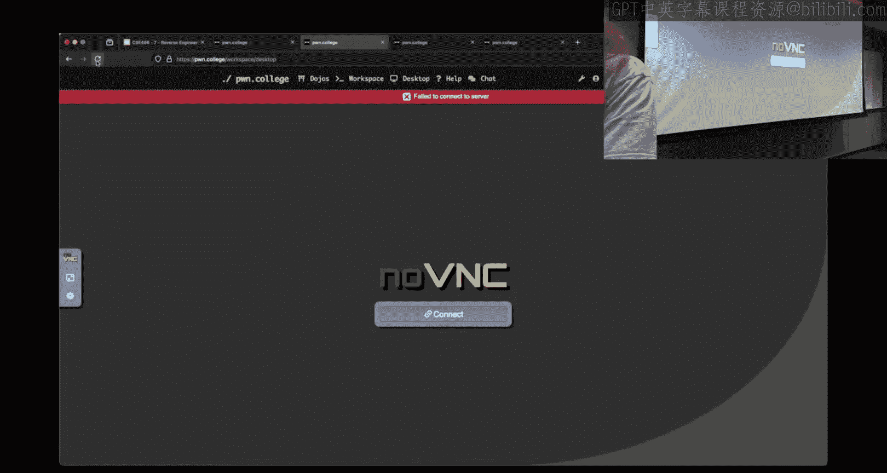

And so we'd be print。That's an unsign。C star RSP plus some offset that we can get from Ida。

And then we could print， print the other one， and if we were to run this in a loop。

We need to continue here， I'd need the commands。I'd need end and I'd want to continue。

I'm sure I wouldn't want to continue here。But I could go just like this and this would essentially be fuzzing the challenge for the first byte wireless's under GDP。

 and I'm dynamically generating my payload and throwing it in。Now the pain here。

Over using something like GDP scripting and doing it in the terminal is I'm not continuing inside my commands。

 so that means every iteration of this loop， a GDP is going to print out the thing and then stop。😡。

Right like I there probably is， but I don't have a good way offhand to use this approach and get the debug output to a file and if I used the GB scripting and I had this inside a file and I was the Gb dash X that file name。

 I could redirect the output to a file and had it print。For instance， I。or whatever my input is。

 print the payload byte and then print the value that is being compared and I could just have that in one file and so I'll see zero result or you zero impact one impact two impact three impact right and I can quickly reason about oh well yeah。

 it turns out this might makes these two numbers be the same。A little bit more naive。

 you can totally do that。And I wouldn't call it like a bad approach。It's just a different approach。

But 19 is easier to G script because there's things that you can examine the things that you can examine in memory have a lot more value。

Where in 20 there's like this additional reasoning that you have to do about what do these values mean？

And so you either deal with that yourself as far as like how you are reasoning about the values that are in memory。

 or you write some Python script to take those values and lift it to what you're interested in。

Okay。So we on 22， we're still over here。Trying to figure out。What can I？

What can I do to be more efficient？We said there's only eight a codes。

The interesting thing to me here is that you solved 22。0 or you're on 22。1。

 what's the difference between the two？对。好。There's no help。ob what is the help？

You got to get the camera to not follow me now。What does what does the help give us？Over here。Like。

 say I give it。You should do this in Python， like a normal person。did this here。And so this tells me。

The op code was one and what did I ra into it10 zero so I happen to know the first byte is the op code and I happen to know R1 I don't know which one is which a there I'd have to。

Differententiate them somehow。Okay， so for this particular challenge version。

 which isn't necessarily going to be true for yours。

 my op code is my first byte because I entered 102 a1 is my third byte and a2 is my second byte。

And who can use this help text to get there， because that's what you did yeah。All right， that's fair。

Is there。Any difference in how the program behaves？Like you could use， this isn't a bad， bad idea。

 actually， you could use 22。0。To identify what behaviors you can trigger。

Inside the program and what they correspond to。So like right here， I know one is a cis call。

Something that I might， what is something that I could observe if I didn't have this help text type of things？

I know I talked to someone after class about him， so hopefully you can hit me with at least one thing that I said。

 stops okay， if it stops。哦哦 off。Does a stop for input， what would that be indicative of？😡。

Right so so it' called read it blocks， I give it something else。

 it continues going I probably have accidentally， given it Ciscal。

 I figured out the op code for read and then the other byte I don't believe was particularly relevant。

 but you could know one of those two is the Op code for read and by changing it。

By changing one of them， it will either read again or it won't。

 at which point you know which byte corresponds to the Cis call operation of read， right？あ。

Another thing that we could do。Is look at the exit code of the program。

Because we can call exit from this thing， right？Was that a valid cisco？'s let's find out here。

 So if I give this， okay， we crashed because it was bad and then。In bash。

 you can echo dollar sign zero that's going to give you the return code of whatever the prior process was that's running zero is good。

 one is bad generally speaking， so we see a one here so the machine crashed if we assume that this。

Yon Code program follows General Convention。Then something bad happened in week。But we。

 and that's probably what's going to happen in most cases。

Because even if I give it valid instructions， it's going to keep reading and then it's going to read something that's bad and crash。

One thing that I could find。That isn't， okay， we have exit， we have sleep。

 Are these both behaviors that I could observe。I happen to on 22。

0 here stumble upon the ciscal right away。There's only eight things that this could be。Okay。

 that just crashed and it crashed right away。With two。Can I make。This thing。Oh wait。

 was it zero zero for cis call？Now I hung。I was a little weird。Didn't I have a ciscal going on here？

Or am I just making things up？Okay， sorry I did it。Anyways， we saw it here that was sleep。

So I call cis2， apparently B， I don't know that it was B， it doesn't matter that it was B。

 what matters？Is that I triggered this behavior。It didn't。Cr right away， there's this delay。

 there's this pause。We can measure that。In P tools。We can set a time out and say。

 hey has this returned yet， set a timer run it， has' it returned yet。

 and we could measure the difference so we could observe if we're sleeping or not。

 we could observe if。

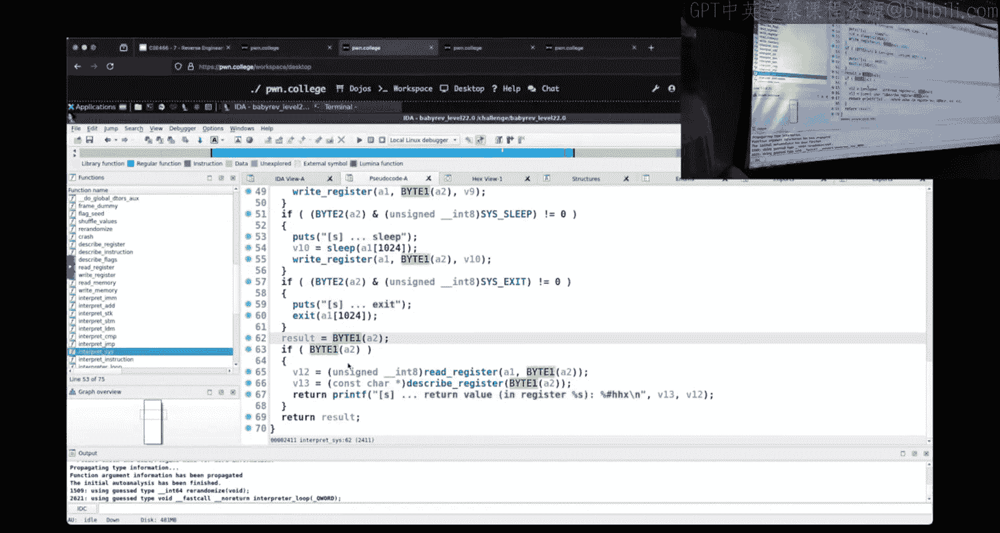

This program exited with a reasonable code。Okay， so it's actually this third bag that's influencing that。

S， so let's open and keep going here。Hopefully I get lucky， what was my sister call there？Okay。

So that's called exit。And what we see is the exit code is zero。So if I were to trigger this behavior。

I would know。Because the exit code is going to be zero。

I'm assuming I'm doing small little three bite things。

And so what your your initial kind of signals that you get are going to be things like this。

Does it hang？Does it just everything if the default thing is it just crashes and you get an exit code of one。

 what doesn't do that？There's going to be some subset of operations。

That trigger different behavior that you can observe and then I know， okay， these are coded。

 these cis calls， I found cis call， I found the thing that makes it run slow。

 which is going to be asleep， I found the thing that makes it exit with a different return code。

What else？What I want to know， what's the argument order because in this case， I had it。

Backs because I'm hopping around between these things。For me， one is my op code。Four is a1。

 and then this hex 10 here 16 is my a2， and so this is cisco。Sleep1。Or exit 10， I'm sorry。

 I'm still got it wrong。But it doesn't。It doesn't matter because of what it's printing out what I know is this series of bytes triggers that behavior right and if I were to change one。

Like I change。That to be， hey， do I still get that behavior？The answer is， yes。 I still get the。

Exit code of zero。So I knew I was able to trigger exit。😡，And then by flipping。These bytes from there。

 I could change this one and it didn't make a difference， but if I changed that first one。

And we're just looking at that exoa， okay， that broke it。What happens if I change？This one。

 this one here。Okay， that broke it。Not question mark， dollar sign question mark。

But we have to think about all of the possible permutations of， for instance， ciscas。

How will those reflect here？From that， I can reason about what is my argument order and now I know which bite to start tweaking to change is this。

 for instance， a jump。Because I would know， does how does jump or jump takes what one argument that sets equality then another when that's the address？

If I， I know the byte order now， because I figured that out from like this behavior。

 that's another piece of information I have to go back and reevaluate。

How to interpret what I observed。It is not a right the world's biggest tour loop。

 its have a hypothesis based upon what you know gain some tiny piece of information。

Think about how that information changes what you can test。Apply that piece of information。

You'll notice when I was changing these values here， I was still using。Base two， right。

 so there's no need really for any of these to be an invalid value。

That should make your iteration loop of what is this new behavior that I can trigger a lot tighter。

Does that help or at least confirm that you're on the right track？I can。Okay， like， it isn't。

lotParticularly the like last level of these modules。

 it isn't like there's some secret tool or secret technique。That。

You have to like discover and it's like hiding in a video somewhere right if you've made it to the last challenge。

 you have the tools and techniques right like being learning about learning about software exploitation and system security and how this type of stuff works。

 it isn't just about using the tools it's about once you have the tools。

 how you going apply them to think about。😡，The behavior of a system。Now， this 22 is。

 as you mentioned， a side channel。It isn't something that said that program is overtly telling us。😡。

We will definitely spend， I believe， at least a week。

 if not two weeks on a whole module that is almost entirely side chances。

So if this concept of like looking at weird things and reasoning about the behavior of them seems a little forward now。

 that's okay。But we'll definitely revisit that concept in a later module。

Anyone editing specific here？そうですね。It is comparing our awkward。In memory with something。

I was just thinking， is there any？To that companies。We can find。O。こり。

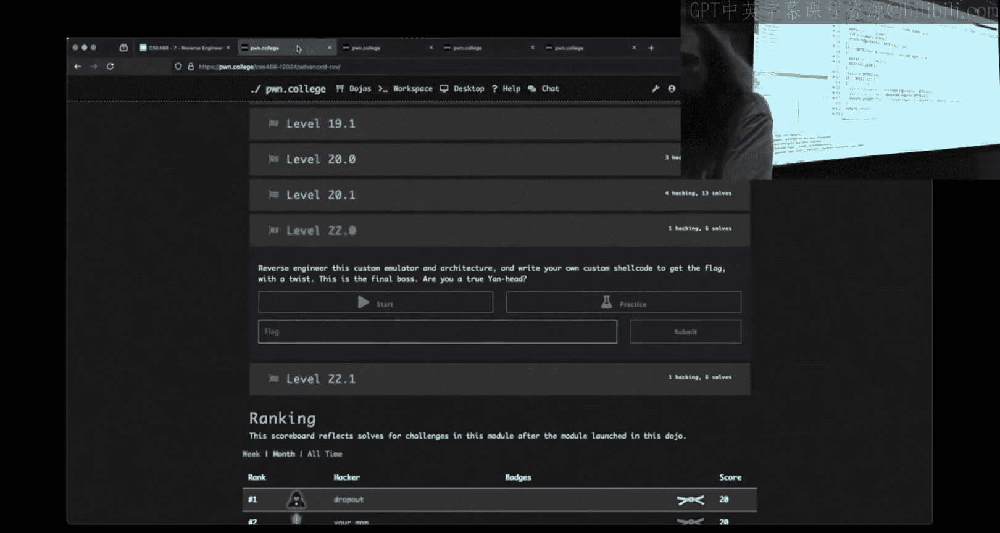

Am I in practice mode here Yes so the statement here for Twitch was， well in 1920， we could use GDP。

 we could attach and we could look at these comparisons and figure out what's going on with the op code right what is different about 22？

Let's see if I can find it， hopefully this is in a s place in the program。好看。So。

It's not really a sane place normally when you're thinking about binaries you start looking at。

 for instance Ma or underscore start depending on what you're interested in。

 underscore start is back at process initialization so there can be a whole lot of stuff that generally speaking we don't care about and so most of the time if we're talking about a reasonable binary。

 the place to look at is Maine。For whatever reason， this challenge doesn't call this in Maine。

It's actually called。Up here in Libibt。Which is not a place I would expect most people to kind of naturally stumble into。

But what we see here it's like one thing called flag seed。喂。

And there are several challenges in the course that utilize this same type of function。

What this function does is it's going to open the flag。Or is's it going to read the flag？

Assuming that we got the flag。If we were unable to read the flag， we'll fail and exit early。

For every bite of the flag， we're going to exhort it。And create this random seed value。

The seed value is then fed into S RA。You know SRAand？You know right， so something about random。

 where would we go if we wanted to learn more about what S Rand is， bam， the man page。

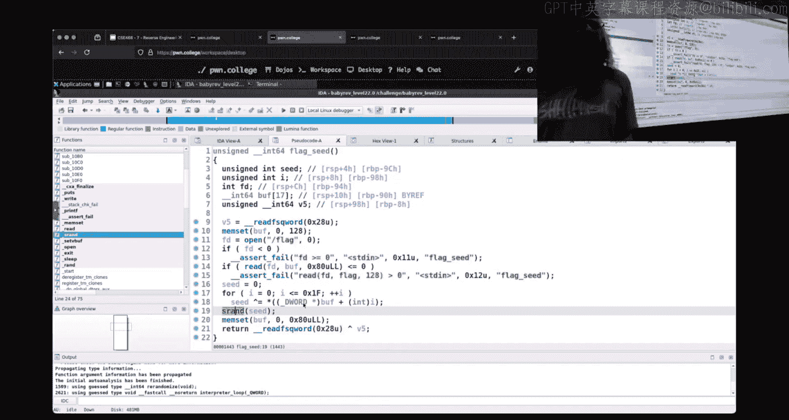

and so it is related to the pseudo random number generator， right。

 so it's a function that allows us to， as you would kind of assume， generate random numbers。

Kind of an aside here， a common failure of people that work with random numbers is they don't do this。

They think I can just call， for instance， Rand and I'm going to get a random number every time that is。

Not always the case， it turns out random numbers for like functions like this rely on a seed。

And so if I just called Rand every time， it would be a random number， but it would be predictable。

 it would be a known series because it started from the same seed of nothing。And so S ran here。

It takes an argument that's an unsigned int that is the seed。And it says the SRA function。

 such as argument as the seed for a new sequence of pseudorandom numbers。

So there's different ways of generating random numbers， right I could cat dev random。

 people know dev dev randomand。Connor， Connor will hate this。

Right this is this is I didn't cat if you can flood your screen and makes things not happy I just called head so Devb Ringham is a made up device that the kernel exposes to us to get access to random bytes the kernel generates these random bytes based upon random things that are going on in the system system load network packet timings like I don't know you'd have to go into the kernel source and see it but it's based upon like in theory。

 real random data that the computer can receive from the world around it and so this is something that I could if I were to head again I'm going to get。

A very different。mSubstring or you different random bites， it break my terminal。

 but it is something that that's different。These。

SRand and family of functions are not relying on the randomness from the outer world。

Instead it's just an algorithm， it's just a function that says here's what I called。

 here's the new number， what was the old number， here's the new number， what was the old number。

 here's the new number， and so it's a deterministic sequence。😡，Yes。The question for which was。

 if I use the same seed every time， would it produce the exact same series of numbers and the answer is yes。

And that's what I mean when I say there's different types of randomness。

But for the context of our challenge here。We're using SRA， which means it is going to be。

 as pointed out， a deterministic series of randomness， right as long as the same seed is provided。

And so。What we're doing here with S Rand is we are creating a random sequence of values based upon your flag and what that means is。

This random value will be different for you you than anyone else。

 right everyone's going to get a different series of random values。

But it will be consistent every time you run it because it is your flag that is the seed。

 this is why practice mode and challenge mode are going to result in different randomizations because the practice mode flag is home College practice it's going to be a different seed than what you get in challenge mode。

😡，Yes。Now， based upon this random randomization。Or we have the seed。 We should see。

This other function。Is this called？Somewhere reasonable。Yes， inside of Maine。

 so you may not have seen where the seeing the seed of the randomization was happening since that's kind of in a weird spot in the binary。

 but now I'm just up here in Maine。And what you see is this re randomized function。

 and that's getting called before we go into the interpreter loop。😡，What's re randomized doing？Well。

 it's going to call shuffle values。And this is just going to rely take that ran。

That is now seeed on your flag to generate some values and then mix them all up here in this values or。

Then that values array is used to set your encoding。

 so this is where your instruction encoding is being set your right is being set。

Flaag values are being set。So that is all being determined at runtime based upon the flag。

If I use GDP on this。😡，How does that impact the behavior just what shown you？为当时。GDB can't。Right。

 so GDP drops privileges。So if I'm in challenge mode。

 which I have to be because I need the flag to be the flag because it actually matters on this one。

That means I can't pseudo GDP。I have to use regular GDP。

 which is going to drop the permissions of this binary so that it is the hacker user。

I imagine it will just air， let's find out together here。And what we see is that assertion fails。

Inside that flag seed function that was hidden away I looked at。

 the file descriptor from calling open on slash flag returned a negative number because now since we're running it under GDP。

 the program does not have the appropriate permissions level to access the flag and so we just fail。

Oh。と表양年ま。CanCan we inspect or whatever。It is mapping talk。Okay。

 so this is actually a very cool question because there there's a challenge somewhere。

 I think in this class where we mess around with exactly that for Twitch， the question was yeah。

 but there's this cool thing called ProC right and Proc is super cool name Proc if you want to read more Proc is a like made up file system that the kernel exposes to you。

 none of the files here actually real。They're all generated at runtime， like when you access them。

So if I cat self， I don't know， it'sum cat self or prox self。Command line。Where we see。

It's hiding down here it doesn't have spaces the the proc uses mill bites as the separator here。

 which is why you can't see them we see cats slash f self command line I'm inspecting myself and saying what is my command？

And PRC is a way to ask the kernel for information about various processes now this was convenient because I was asking about myself and I was asking about a process that was running as the hacker user。

If I。Oh， you know where we're going。😀ははは。😊，I have this process running we can PSauuxX to's see if we can find the challenge here there's my challenge Proc self is a nice way of kind of just referencing your own P every process has a PI which we see right here for the challenge is 3109 so I can L us。

Prorac 3109， as long as it's a running process， which it is right now， All right， cool。

 I get all this， all the same stuff。I don't know if I'll be able to access the command line。

 right I can。But one of the things that is inside。Proc。Is Mem。And this allows you。

 this gives you an interface where you can open up this file， slash Proc， whatever me。

 and it is a pseudo file that represents memory， which is it's super cool the problem is，😡。

The permissions right it's rude right for the owner only， which is root so there's no way that I can。

Access that and that makes sense right if I can't just inspect the memory of any privileged process running and going on。

Even if it wasn't for a vulnerability reason， what if that privilege process is dealing with sensitive information right maybe it's dealing with somebody of's passwords。

 right it exists in memory。Shouldn't exist for long。

 but hypothetically there's information in there that a normal user shouldn't see。

 it doesn't make sense for an unprivileged user to be able to access that memory。

I can't I can't just head them and I am out of time。

 but if I were in I Python or I wrote something in C， I definitely can。

Open open up these files and then if there was something I wanted to look at at like memory address Hex 1337。

 what I do is I open it that's going to give me a valid file file descriptor。

 I can then call seek which。You。May or may not。Be familiar with by dude you can call Seeq which allows you to kind of move your pointer。

 typically when you open up a file you're reading from the beginning。

 the SE allows you to direct where that kind of cursor is within a file and you do this on normal files as well like if I wanted to just move the cursor 1 thousand0 bytes into a file we can open it and then seek a000 bytes in but for the pseudofi system with PRC。

 whatever me， we'd open it we'd seek to the offset that is the memory address we're interested in and then we could just read raw bytes。

And that is what is in memory in real time。You could see how that's extremely powerful。

 right which is where' like， let's just use that and that's also why the kernel won't allow us to do it because it is a little bit opP。

All right， anyone have any last minute things for the stream？All right，ll cut your all loose。

 I will be up here tomorrow at noon again， BYE and G222 based upon your interest will determine how we kind of roll there。

 it may or may not be streamed if youre going to plan on attendinging in person。

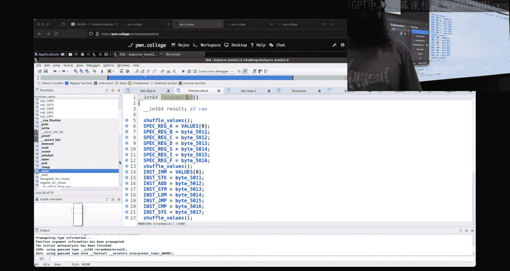

哎，别坐。