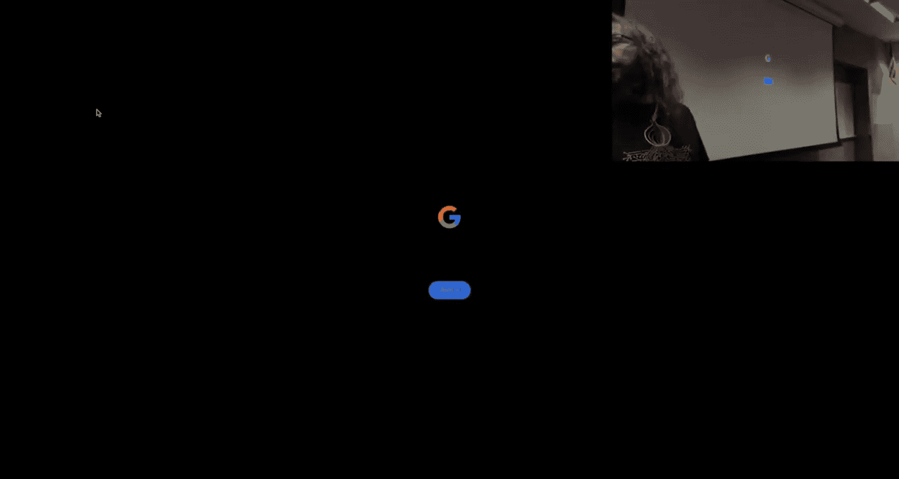
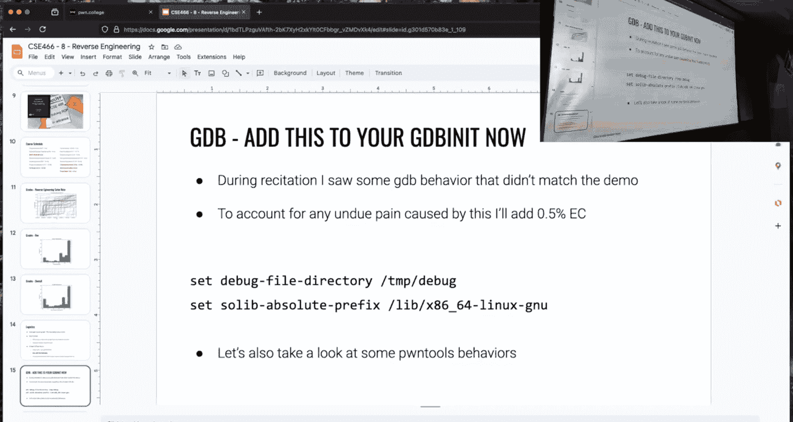
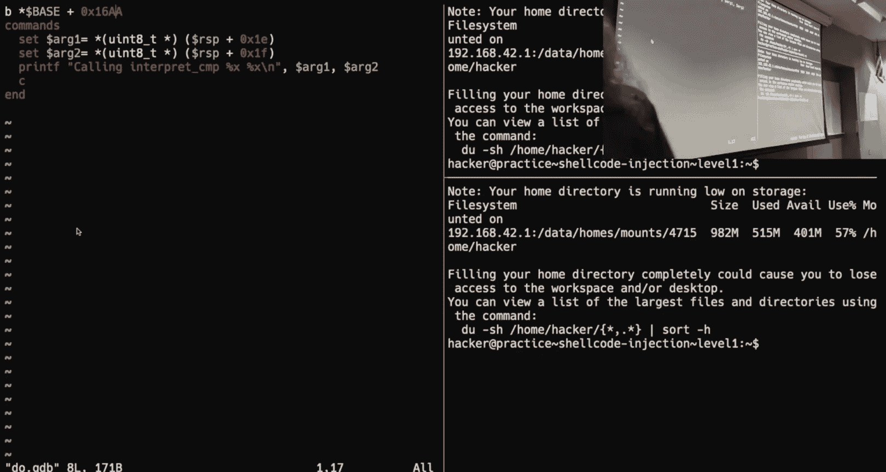
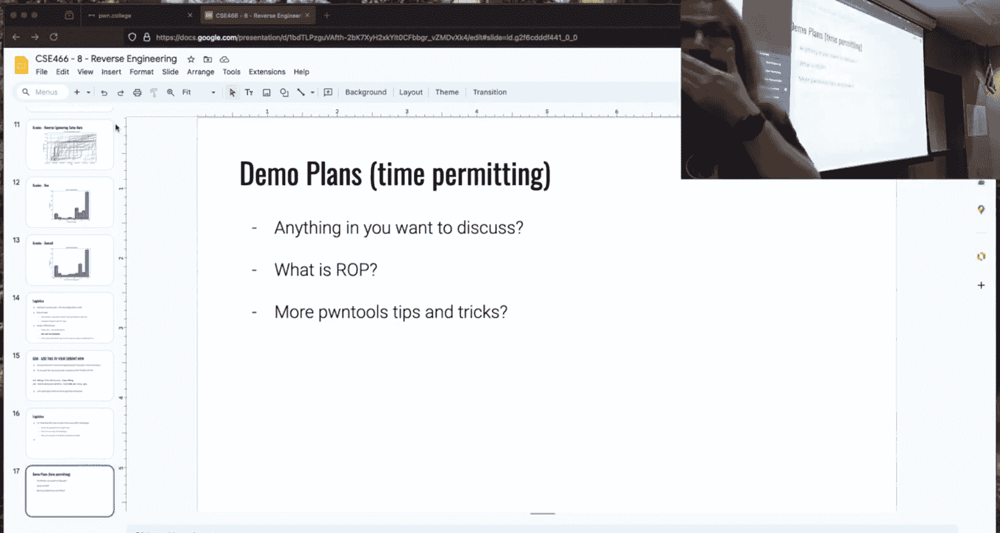
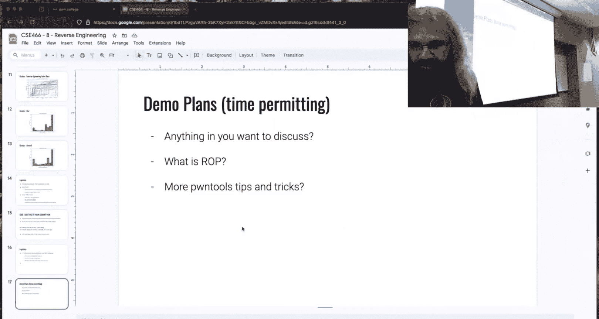

# ASU《计算机系统安全｜ASU CSE466 Computer Systems Security 2024》中英字幕deepseek p09 -10-Return Oriented Programming - CSE466 - Robert - 2024.09.17.zh_en -BV1spCGYZE9D_p9-

For Twitch here， I expect things to be broken because I updated the latest Mac OS。Let's see。

OBS got it right list。All right， we have a picture。

That looks the same for both of us。So we're going going to have to rock like this Today is the 17th of September。

 we are just kind of starting to， we just launched a module on return oriented programming and wrapped up reverse engineering here。

At ASU for CSE 466。I did not prepare the memes this time， a TA did for me。

 so let's see what the TA said。They didn't even put me on the slides， I just copied the slides。Okay。

 so。Classic， right， I'm going to do everything early， and then you end up not doing that。

 especially since the。Checkpoint that push back。Saad the unfortunate truth。And then the flip there。

Hey， the checkpoint got pushed back， I had time to make up some stuff。

 maybe I was busy and it turns out I actually got some stuff done so maybe it's you know。

 win lose there。It was kind of interesting to see how people felt about my disassembler ran。

Mentioned it several times。I have been signed out。Oh know。Nothing， nothing good happens there。O。

We're derailing。We're derailing before I even tried。Oh， instant win。Okay。

 so I talked to quite a bit about writing a disassembler how this could be useful。

Particularly for 2122， you didn't get 21 because I made a typo so bank you were favor but having the ability to generate young code so not the disassembler。

 but the reverse operation which is very similar code will pay dividends in the future so we least have that in truth like when I solve these challenges because I did end up having to solve them way back in the day。

 I didn't try to disassembly right but it is what most people tend to do I also didn't use Ida as you could imagine if you。

Thought about the challenge， it had a good head as far as like where is the critical part that matters。

 you could solve it， I was just in GB script and printing out critical values for several of the like 1920 levels。

And some people figured that out， so right on。You'll still want an assembler for the record in。Later。

They didn't need it right now。I have Ida and then the cooler I you guys actually like G？Yeah， yeah。

I'm actually converting some people， everyone else thinks that I thinks I'm crazy I'm glad some people are starting to see the light there that there's a lot of power to dynamic analysis if you are able to articulate your question。

me at level one。I can do this GDP don't need you GDP use Ida。GDB， all right。Uh for the record。

 if anything of your being that I didn't like it， like message me and I'll give you the old updu。

After completing reverse engineering technical S yaon 85。

 so hopefully hopefully the people do have a good idea of how yan 85 works to some degree it is。

Pretty well known this is Yo your mean。All right， well， the T thought it was a great meme。哎。

You're proud of it。It feels good when your meme makes it on the show， doesn't it？

That was one of my big motivators back when I took the course。

 which just to get goofy things on screen and make the instructor comment on it。D。

 why has her sister name grow？your mother loves roses。Yeah。

No problem yan 85 I can't believe anyone actually loves Jann 85。

 maybe maybe it's it's kind of a Stockholm syndrome thing you just spend too much time with it。Yeah。

 at least we're having fun with it。Okay， 22。1。You realize you're trying to solve the challenge by figuring out with a little decided map registered Ciscos upcodes。

 one massive masking puzzle you've been duped into solving to make it ballot on 85 children that's very true。

One of the things that was asked like a module ago was these the last challenges of the module is there like some big bait and switch。

 some secret technology that you have to know， some man page， you know。

 some secret knowledge that hiding on a slide somewhere that's necessary if the challenges are designed well。

 the last challenge doesn't require like some super secret knowledge it's clever application of things you already know and thinking about the concepts at play and how you can utilize that knowledge differently。

And as some people noted and mentioned on the Discord。

 one of the key pieces of information to solving this was figuring out what was a clean exit code is one of the critical pieces on kind of deducing what's going on inside of this bad。

Rph， so I did notice this， people are starting earlier， which is a good sign。

 I'm actually quite pleased with what I've seen so far is so far as people taking the start early to heart。

And so that's awesome to see。Okay， I haven't thrown up a schedule in a while。We are here。

So we are on return oriented programming， which is s for two weeks in my personal opinion。Rock。Sorry。

 Twitch。Blak。GDB is clutch， you like Ida's back no Ida has its place， most people prefer I。

 but we're on return oriented programming， which is slated for two weeks， in my personal opinion。

 it very easily could have been a one week module。We're going to run it for two。

I don't think you'll need it， so it'll probably be a pretty chill two weeks。

 that doesn't mean slackck， it means work on it and enjoy the benefits next week。Great。

 how didn't we do， I mentioned I was pretty happy with the solve rate， if we look at this。

 I didn't put on the last module。But a lot of people started in the first like three， four days here。

 which is awesome。And as one would predict the people that started and the very last weekend。

 they didn't make it very high up， but as a class as a whole。

 it looked like recruit cru and had a decent rate， one of the things I find kind of amusing is this kind of line where everyone just kind of flatlined。

 anyone want to guess roughly where that ends up？Yeah。The comment for To was 17 or 19。

 I don't know which it is I didn't bother to do the actual math。

 but it's three quarters the way through， my guess would have been 19 17 you can get there。

 19 does require quite a bit of effort but that effort paces dividends in the later challenges。

Did you disagree？You're welcome to， you're welcome to tell me I'm wrong。Okay，It definitely was a。

Okay， we， I think we just kind of drew the line and stopped there， we said it wasn't worth our time。

 which is you know， totally fair。A for the grade you want。This is not a great distribution or the。

 this is a solve distribution， so I'm not including that bias of the checkpoint here。

 so just this is what percentage of challenges do people solve。😡，And as we see。

A very large amount of people solved everything and I think it's reasonably safe to say majority of the class saw 60% or more。

 remember that with that checkpoint， if I can assume that these people got the checkpoint。That's a。

Like 15， 16% swing on top of that you so if somebody is in that 60 to 70% range with a checkpoint that's really like 80。

85。So realize that the actual grades are actually pushed even further to the right。

And I did just per。Transparencies say if somebody didn't solve anything。

 they didn't go on this graph。So this right here are people that solve at least one。Grades overall。

 so this is course grade distribution， so this is including the checkpoint bias。

 we see a similar distribution to what we have there for solve rate。However。

We're bifurcated a bit more in my kind of interpretation of this。

 the far left hand side is mostly just hey， the first module crush me。

 but more people are moving to the right hand side and so I take it as a we're probably fine like I'm not。

😡，啊。Horribly moved one way or another at this distribution。

 aside from the people that are right here at the  point4 to  point5。

Like that's just a rough spot because of the。The checkpoint in general， but that's course great。

 so who knows？Logistics average course grade right now across the course， excluding extra credit。

 74%。😡，Remember， if you play ball， you get an extra 15%， and then I gave youall one so that hits you。

 what's that a 90， like perfectly fine cruising right around where I'd expect。Extra credit。

 I think last week I said I was working on getting the memes extra credit and thanks extra credit onto the grades page in real time。

I haven't finished that just because I juggle a bunch of things。

 I still lie to myself and say it's going to happen at the end of this week。

 I do have a branch so you can at least look at it and tell me I write for。if you want to do that。

I had my office hours last week I announced the room that it was in that's going to be in BYE and G222 we're doing that Friday from noon to two last week I said it may or may not be streamed kind of depended on what happened when the student showed up like what were we stuck on what we want to talk about。

😡，Based upon how the first one went。The conversation was very specific to challenges and if we're going to have a specific discussion on challenges。

 I can't stream that。😡，哎呀。Now that doesn't mean that everyone got a whole bunch of free code like we went back and forth and we said hey。

 what are we thinking， what are we doing and built it up so it will not be streamed。

 but I think it will be exceptionally helpful for anyone who can attend and you're looking for that type of interaction。

you get that in hopefully in recitation with Ts where they can sit down， look at what you're doing。

 get you squared away， or at least get you pointed in the right direction for the office hours I'm trying not to go exclusively one to one but just like。

 hey， where's your pain points and then let's start moving and get something in that direction？

If for whatever reason you have a scheduling conflict and you're like， hey。

 I still want to try and get some one on one Facetime to figure something out。

 let me know this semester I am on campus a few days a week。

 so hopefully we have something where we can schedule it if it's needed。😡。

One of the unfortunate things that kind of came up over the course of this module and I'm sure this won't be the first one。

With some kind of strange behaviors， I noticed as I was working with people。Now。

 the Dojo is a very complicated and fancy piece of software。If you ever want to check it out。

One of those a side effect of being complicated and fancy and trying to do all of this to give you all dedicated Linux environments as we work on it is sometimes things don't behave as one would expect。

😡，And unless students surface， hey， this isn't。Working right and I say， oh。

 we'll just do this if you don't tell me no， like I'm doing that。

Then I just assumed that you solved your issue。And so if you feel like I， hey。

 there was an issue and I said， hey， you're doing it wrong。I empathize now because I have seen that。

Working with people during recitations like train this up to a recitation once a week or so。

I recognize that some of this pain。Could have。Resulted in you spending undue time fighting GDP or GDP scripting。

It's just a blanket cure all this goes back to the grade。

 we're going to deal with it and then we're going to move on， there was a problem。

 I recognize it could have ate some of your time where you could have made progress and other challenges so everyone in the class will just get 05% extra credit is that fair deal？

Everyone just gets it for free。it's not on there yet， I'll try to edit it tonight。

 assuming I immediately pass out when I get home。The key takeaway here。

Is add these two lines that I have on this slide to your GDP emit。Because of the way the dojo works。

 there's some complicated things with paths and symbols and where some stuff is located that is not。

The same is like a Windows or a not windows a Linux VM， if you were to install it。

Adding these two lines to your GDP and it fixes those things， what problems do they deal with？

I can kind of show you。So one of the things that。I showed on stream。Was using。

 hopefully I still have it。Yes， was doing something like this with a GDP script。

Where you set some arguments。And you call print F， and then it displays it。

I was working with someone in recitation and they had the same thing as me。

 we were running them side by side。

Theirs didn't print anything， mine did。This first one here is the salt for that。

It turns out GDB needs to know where some debug information is and on the Dojo by default。

 it did not have it。So that's why that's important。The second thing。

 which is a bit easier for me to demo without wasted too much time。

 has to do with setting grade points， and I know there was somebody that commented about this on the Discord because I remember the comment。

Let's find。What am I in She code injection？Okay， so Bcat has to call open。うんうん。Not you， this one。

Let's see if we get the behavior I'm looking for here。

A reasonable thing you might want to do is set a break point at。Open or break it。

 say read and then run it。That happened to work， that's unfortunate because the behavior that I was expecting。

It was specific to MEm Comp in the Yn 85 challenges。

 something that you may have wanted to do and was totally reasonable is set a breakpoint at MEm Compare。

And it G would say， hey， you set a break point at Mem Compare。

 you would then run the challenge and it wouldn't break there。The reason for that is because GDP。

Was looking at the wrong Lib C， the wrong library。Uh for where should these shared libraries be located and because of that。

 it wasn't thinking correctly about where things are and so it was setting the breed point at wrong locations and it wasn't working。

Now。These things will happen and I try and be a fair person， which is why I'm given the 0。

5 extra credit。But the counterpoint here is。That isn't an absolute deal breaker。

 if that happened to you， hopefully you worked around it。What did you do？All right， could you do？

I can't just go great men compare。App applyinglying address。

Okay I could use IDda and find where the call Amendment compare is and break it the address in the binary。

 whether that's from the binary symbol plus an offset which would not be impacted by this or by specifying the hard coded address or doing like the base plus something any of those totally could have worked it would have been a way to get where you needed to so I don't consider it like this insane deal breaker because there's more than one way to skin a account and part of what you're trying to do in this course or hopefully learning in this course is how to kind of adapt and work through problems that you aren't familiar with。

😡，Things will break， things will break not only because of us。

 but things just break in the real world。And so I don't consider this like absolute OMG。

 we need another weak kind of scenario， but I recognize that， hey。

 maybe you would have solved another problem or two。

And so I consider this a fair compromise there。Now someone is not going to watch this stream。

And they're going to mention it like two weeks from now。

And I'm not going to remember what video it was。Other logistics， so I think graph pretty easy。

 I said this with rep and then other minds convinced me to not do this。Hey， at least it's 0。

5% extra credit exactly。GDB is cursed， there's a lot of things that are probably cursed this year and we're going to learn together。

Part of the final I really think I am going to add stuff that this time we'll see what happens same rules apply if I added it。

 it's not going to be in the first week， if I add， it's not going to push the checkpoint。

I think it'll be fair。Does anyone have anything that you want to hit me with， Yes。

 possible like countdown？Yes， so that's I didn't put a due date on it that that's why you don't see it there is one that was part of part of why I had the thoroughough schedule log here I appreciate the reminder and I'll get to that tonight。

So sometime after class will add it， it'll be midnight on the 30th。

checkpoint is going to be the seven days or 10 days。

 whatever our standard was that was set on the syllabus there。

 I think it's 10 days which is we ignore the weekend and then it's seven so。What does that land on？

23rd。What's up？Next next Monday。How many people have taken a look at Rob？😡，That's quite a few。

 that's good。So the。Was there anything about reverse engineering anyone wanted to， oh my gosh。

 this was。We're stuck， we're good there because we're going to shift gears back towards what we kind of did。

In the first module， rock is kind of a natural continuation of what we already did in the first module。

😡。

So let's take a look at that。Maybe。I have to remember to split this way， so I don't。Myself。All right。

 so I have this binary here。It's pretty， pretty boring。We got a main function， I haven't tested。

 so we'll see what happens We're going to read into some buffer。And then it's going to return。

This should look somewhat familiar when we think about the first module。😡。

What do we recognize about this？There's a buffer overflow。

So I can overflow by reading into Buff more than the 256 Pis。

What things do I want to know about this buffer overflow？That just subscribe。I'm sorry。

 the address starts that the address that starts at okay。

 what is something I may want to try and exploit or take advantage of？The return address。

What's something that might stop me from doing that？The' sta canary。The stack canary。

 so one of the the comments was executable stack executable stack matters if we're going to execute shell code on the stack She code used to be how exploits were done。

Forever in a day， but it's been， I don't know， a decade。

 maybe two since She code was something that was really used in。

The majority of like real world exploits。Because we came up with theNX bit。

 the stat can be non executable。Pretty much shuts down Sheco。There are some edge cases。

 which I think Jan mentioned like a jit。Do going know what a jit is？Just can compiler。

 so that is the one weird scenario or one hyper specificific scenario where you may have a region of memory that's mapped writeriable and executable at the same time。

 although a well- written jet should have one or the other right it should kind of remap and change the permissions。

 but if's high performance like performance is a。😡，Big factor， you may end up with writeritable XQ。

The thing that matters for what we're trying to do here is the canary and we can see if we have a canary with Chack。

Looks like we do not， which is a good thing because。If it did， we wouldn't be able to get very far。

Soあ。I want to overrate this return address。I the way anyway。Hopefully you did this in the first week。

 all right you're like you did something。じゃベジですね。Okay， how do I I need a bunch of As plus an address。

So what do you want， Echo A？How do I how do I know how many A's like you're going to be driving the train here。

 all right until we get to the new stuff。Then was short as source person。This surprise that。ますと。なでそう。

Okay。It also has an RDV。Okay， so I heard a couple things going to repeat for Twitch。

 they said Robert， you showed us the source code you fool right。

 but we saw the buffers 256 bytes in size and therefore if I，Send 256 A's。

Into this plus something I'll overwrite the return address somebody else commented in trying to again hey wait a minute here。

 the stack frequently has the saved RBP on there so it should be 256 bytes plus eight and then I get to the saved return address all right。

It could be correct。I ran out of time， I didn't actually get to test this bad boy， so we'll find out。

So if I print。Get my quotes right here， and Co I know I'm cutting you off。Bring it down here。

 print a times 256 plus a times eight。Plus， let's put a B there， B times8 plus。

How many Cs do we want？I should be the return address。And we ram that into。

I'm going to mess up these quotes。A that out。All right， we get a segmentation fault。嗯。

Its Lame showing you the source code how else I could I have came to this number。

 I don't actually know that's what happened。Yes， you could go into GTB and see where the return address is being called by。

Okay， so I could G。The binary， we could run it。And then what， so right now it's waiting for input。

 do I need to dump in a whole bunch of bes？I could control C。Now where am I？

GDB is not very happy that I know I mean read， TDB is not very happy probably because of the GD and it magic I just said you must have。

Now you win some you lose out。So I'm inside read。And I could look at RDI， is that what I want？

I'm not sure。I could go to the man page and so we could man read。I want the second argument。

Because I'm interested in this buffer location， right？Where is it？RSI， RSI for the wind。So。

There's my RSI。Now what do I want？I'm going to finish this all。Run all the way through read。

 it's blocked on some input doesn't matter matter what I get。

 what I really care about is getting back up into main。From here。

We can info frame and this tells us where that saved RIP is。So now。This was my buffer。

This was my saved rip。Hopefully we get the same number when we subtract them。

Hex 108 that's printed as a decimal， 264， and then what was 256 plus。8ight。

As a decimal 264 so we came into the same number and there there's a few other ways you could have done this we could have used a cyclic value。

 it doesn't matter I just want to make sure that you recall them because we're playing the same game return oriented programming is a specific type of memory corruption on the stack。

And you've kind of already done it， you just haven't done it。As a style of programming。

So we have in my source code that I spoil you with。I have this wind function。😡，交。

Hopefully I didn't make it sewed， let's do that so that this is actually solvable。

How can I get the address of when？if I can overr this return address。

Wind's probably a good place to go。た out。Object we're old school， all right？Object dump， disassemble。

E out out except that's going to be。Completely unreadable， So M intel。

Let's see see if we can be a little bit clever there。

 I can gr the output of object dump for when and I get this address this is what is a important thing to know about this binary and this address。

专都不得。このはい。Okay， so the color from the class here was pi a PIe。

Does everyone understand the difference between PIe and ASLR？A I'm getting some faces？😡。

Now is the time for us to cross that bridge。So。They work very similar。

 they have to do with whether or not stuff is randomized Okay PIe is a compilation option。

 this is something that you decide when you run GCC。So this is the。

Command that I ran to make this executable， and you'll see that as a flag to Gcc。I put no P Ie。

This is something that's decided when the source code is turned into an executable。PIE means。

That when we look at the instructions。Let's see。Trying to find a good example you'll get。

Addresses that only resolve to a fixed point。Okay， so it has to do with the actual assembly instructions that are emitted by the compiler。

If something is PIe。What you end up with is a whole lot of addresses that look like this。

They're rip relative。What using a rip relative memory address means is that it doesn't matter where。

That assembly code is located within memory。That mapping will always be correct because it's a fixed distance。

From。The binary。So this doesn't have PIE， and so the Elf is always mapped。To this 40，000 address。

If I were to compile it with PIe， this address would change every time。

And that's why when we're referencing a memory location， this right here and is read executable。

 this region of memory is the where the text section is。

 this is where those assembly instructions are located and so if I need to reference something in memory and we're constantly shifting this thing around。

😡，If I'm referencing it from where I already am， it's a constant distance。😡，Now。

 one of the things that people asked on the Discord right before class。if I get a leak。

 what does it mean， how do I make sense of this？😡，Now they were asking about the staff。

 but I'm going to refer use this region of memory here。For demonstration purposes。If I get a leak。

Something in the text section。All right， so in this red section here， I get some pointer between 41。

000 and 42，000。What does that tell me？It tells me the literal address that it prints out obvious。

But is there anything else that I can infer about memory？Based on that done。Well。

 VM map or Proc info maps or any of this type of memory layout。

Isn't is showing us these regions of memory。But these ridges of memory are displayed to us based upon the permissions。

😡，An important thing that people often overlook。I's this it's 4，000 to 41，000。What's this next one。

 it starts at 41，000。Are they right next to each other？Yes。😊。

So if I get a leak of something that is in this red section。

 is there a constant distance from the red section to the section above it？😡，Yes。

 because they are literally right next to each other， they are contiguous regions of memory。

And if we were to look。More than just these first two， we see the second one is at 42，000。

 starts at 42，000。Ends at 43，000， starts at 43，000， ends at 44，000， starts at 44，000。

And then this one ends at 4，5，000， and then this has no relation to the next one。

This is an important concept to keep in mind， not specifically that the elf is contiguous in memory。

 but that there are many things that are right next to each other。

 and they will always be right next to each other。 This binary happens to be compiled Pe。

 so we get these 4000。 If I were to recompile this so that it is not PI。e。

 This fact would still be the same。😡，Because these are always going to be right next to each other and so if I were to get a leap of any memory address that is anywhere in any of these five sections。

 I can find things that are in any of the other four。😡。

Because there's going to be a fixed constant from one to the other。

So P is a compilation option ASLR is a runtime configuration， let's see if I remember the magic here。

I think it's proxis。Colonel。Randomize VA space。So this right here， which I think is in a yam video。

ItTells us what is the system currently configured to do？And it tells us two， you can get zero。

 one or two。If we man PRC and then we look search this thing for randomize VA。

 it tells us what this means zero as ASLR is off， one is that some stuff will be randomized and two is we're going to go to town and randomize everything we reasonably can。

So ASLR is a configuration of the system and it will try and everything for the most part is going to have ASLR enabled in this course from this point onward。

But if a binary。Is not PIe。Can it be randomized？No。

The thing that allows the binary to be randomly placed is the way that the assembly instructions are generated。

So if the system has ASLR enabled， but the binary is not PIE。The stack will be randomized。

The heat will probably be randomized。AllAll these other things will be randomized but the binary can。

Does that make some sense about how these two things work together PIE is a compilation option that allows the E to be randomly located in memory ASLR is the system trying to place everything randomly。

😡，And even if the system wants to， if it's not compiled PIE， it simply cannot be randomized。

All right， that was a nice little tangent there。Where were we object dump8 dot out？Grip win。

 I get this sweet address。Ha everybody converted to Pyth， oh two hands， I'll go here first， Matt。

 is everything we've done so far？Had ASLR on it the question was has everything we've done so far had ASLR on it。

 the answer is no。嗯。Like。So some of the binaries were not compiled PIe。

 so you didn't have to deal with it specifically like when you're talking about module one is like where this would be most relevant。

If I。都。Whatever。Make this thing。So that it is PIE， actually， I don't even need to do that。

Because PIE only influences the Elf。Everything that we've done so far with our buffer overflow has been in the stack。

And we've been happy in this nice little purple region。

And we haven't had to think about the greater mapping of where things are located in memory because we're just thinking about this small little region of the stack。

 right we're like，Here is the happy little place that I need to live right I can write to here and I can go there and I really don't care what these numbers are because I'm going from A to B and they're right next to each other so this hasn't been something that's really materially impacted us and that's by design。

😡，You got to understand how to correct memory， how to think about things and reason about it。

 but in this module we're going to start dealing with memory addresses that are located at different spots and this will be a factor。

😡，Good。Sure， so the reason。That we gather of the number changes at every situation。

 but we still see the libraries that announced the location。

 is that because there is no BIE and hence the code？AndSo the tax section itself。Rightま。怎么？Okay。

So I'm going to midpick that one a little bit so for。ATwitch。

Yeah I see your technical question there on Libey Cans I'm I'm not going down that rabbit hole okay。

 you want to DM me， we can go down there if you want， but not today， sir。嗯。The question was。

 because of ASLR， is that why the stack？All the way down here is randomized every time when we run these rock challenges because I think one of them prints out the stack address and it's a different number every time。

And the answer is yes， the stack address is randomized because of ASLR it doesn't matter if the binary is PIE or not。

 the stack is completely a completely different region of memory from the elf。

 which is all the way up there at the top right they're completely unrelated so one can be randomized from the other cannot。

😡，Now， the part that was kind of not right was he said the word library。

And that has a very specific meaning here。So I'm saying the binary。

The literal elf that we're executing。Can be compiled without PIE。😡，Libraries。

Are not the thing that you're actually executing right an example of a library would be the loader here or let's see they have this doso convention。

 not necessary Sure it's an acronym for shared object。😡。

That that is the equivalent of like on Windows， you have a DLL。

 it's a library that can be loaded in a bunch of different programs dynamically。😡，Well。

 there's a problem there。If you're going to load a library dynamically in a whole bunch of binaries。

 can that library really work at a fixed address？It can't， a library has to be PIE。

Because this binary like imagine a world where every library had a fixed address that had to exist。

How do all the libraries know that they aren't going to conflict with anyone？They couldn't。

 right because there's an unknown， unlimited number of libraries that some arbitrary executable may want to import。

And so libraries are always compiled PIE because it's necessary that a library could be loaded into any address because we don't know what else is going to be loaded along with us。

Does that make sense？Yes。No no， go for it。I don' go is it that's a good， good question。

I don't know that I want to get into that one right now， it's a fun one。

 I don't know when exactly will hit it。啊。Short answer is there's a lot of magic that happens if I disassemble main。

You'll notice something weird here， this is still just that example binary I think。

 unless I decided it's got to be this doesn't just call puts， does it。It says puts at PLT。不是。

Somebody says procedurec linkage table， that is fact what it stands for。

Because that that is like this really hard problem， right， puts could be anywhere。

 how do I know where puts is？Well， this PLT thing。If we were to examine 20 instructions。Here。

 hopefully I get this right？It doesn't actually go to puts。All right。

 it's like this little stub where we kind of go here and then we jump somewhere else and somebody that we jump into was actually the loader。

Which is。And this guy down here at the bottom and then he figures it out and says， oh yeah。

 here here's where it is and then it overwrites that same section。

So that next time you don't have to jump in the loader and you know where it is。

 that is how dynamic linking occurs and in GDP。😡，With Jeff。

 there's another thing that's related to this called GT， which is where these are resolved。

 and so we can see for this particular binary Puts has been resolved to somewhere。

Right has not been resolved anywhere。This is going to be。Inside of Lib C。

 so you' can run VM map with a pointer and it'll tell you what region it gets in。

And so that one's resolved and it goes to read inside of Lib C。

 but if we look at this yellow guy here。It does not go to Liby。It goes into the binary itself。

 and that's because we haven't called it yet， we don't need to know where it is。

And so this is getting resolved the first time that it's it's called It is something that we we'll poke out a bit in bit of detail and step into that bad boy。

 but is a it is a mess to wrap your head around so we're just going to say that there's some magic and it figures it out。

All right。Yes， so what are the first fixed addresses in the binary water？Question。

 what are the first fixed addresses？I do have to try and get involved here。What do you hit me with？

Yes yeah， yeah， these5，6。是。Okay， so these are all parts of the literal elf。

I do not know exactly what each one of these are， but I can give you a little bit of reasoning about some of the things that are in these regions of that。

So we had a read， write executo or not nicer people。

 but a read write region of memory in the element。The BSS is going to be there。

 the BSS is where globals that can be changed and updated at runtime are stored。

 that's why we need at least a page which is what we see here， a page is Hex 1000。

 we need at least a page of memory that's read Ri， that's where globals go and they can be updated。

 they'll be chilling in there。We have a read only， this is literally going to be the one of them is going to be the dot R section of the elf。

 that is where constants that never get changed are located。The read executable。

 it's going to be where our text section is， and there's several more。

Those are the ones that I commonly deal with if you are interested。In all of them。

Let's see if I can run this command correctly。Theres a man called Re Elf。

And what it does is it parses the header or the first few bytes of an elf。

 which details all sorts of sections and they do all sorts of fancy things， and you can map these。

So like there's where the PLT is located， there's where our text is located in the actual L ROs that read only data section。

 there's a whole bunch of sections， some of which you'll care about and some of which you'll probably never have to deal with。

And so all of these are getting mapped into these specific regions of memory。Wer happens and。Okay。

 yeah， the question was what happens when they're randomized？So， that's。응。Okay， that's good。

We'll make this， we check sec， make sure I did this right， it should be PIe。We are not PIe。

 Why are we not PIe？No stack protector， that's fine。Did that work， yes， I have an a out out。

Check sec， eight out out。Why am I still my PIE？嗯。在水里品。All right。

 me give one last try here and then I'm just going to bail。Okay。

 we're baing the the answer is that they will always be in line next to each other because there's the same region of memory that's being mapped。

All right， so just like and it's not specific to this elf。

Right that these will always be next to each other， but you'll get a similar phenomenon with。

 for instance， it would have been easier to just point at Lib C， where am I？Lib C， 57，000 fad。

Fad B1000， B1000 B3000 right that that is just the way that elses are loaded into memory because a shared object even though at ends dot SoO is still just an elself。

 so it's still the same very similar type of file and so when these things are loaded into memory that is the convention。

😡，And so it's not just that your executable is located right next to each other， but you'll find。

If you stare at the output of VM map， there's plenty of happy little regions of memory that are right next to each other。

And you can take advantage of that fact。Because I could go from a link that is， for instance。

 read only to something that is readrite or read writerite to something that is executable。😡。

It's just a matter of like what you do with the league， right？Okay。

 so let's actually do some wrap in the last 20 minutes。

That's okay because Rob isn't really that hard， so we'll。We'll hopefully nail it on the first try。

All right， we'll bring up good old eye Python。Of course， you're going to write it in a Python file。

We'll say from Po import star。Context arch。AD 64。Somewhere down here， we have P equals process。

E out out。And then I'm going to have some payload， which we already established should be a times 256。

 B times8 plus。I'm going to use P64 because that's a great number。And let's get that。

From our object dump dash D a dot out。I know， now it's speed out of I will grip when so I get that constant value。

You're going to be like， oh， I already did this。be like， yep， that's Rob。

And then we will piece and payload。P interactive， right， good old boilerplate。

A out out does not exist because we changed its name to beat out out。

OhI said faulted and didn't get the you didn't get the flag。That's all right。It'll bring up。

An interesting thing here。I claimed at one point that GDP will disable ASLR right and if you start the executable with ASLR this so these are not randomized that's fine。

 I'm not looking look at it done looking at these libraries， these are still randomized。😡。

The reason for that is what happens when you？Call GDP debug。What actually happens here？

Well P To is going to start the binary， then it's going to attach G to the running process。

When you attach， the process is already running， which means ASLR is enabled。😡。

Now you can deal with that right here in Python。You need two things。One， ASLR equals false。All right。

 that's pretty cool， the second thing is you can only disable ASLR if it's not sued。

 I believe we'll see if I'm right here， you say sewed equals false。Oh no。Does it set your ID？Booob。

And now if we VM map。These are going to be fixed， repeatable addresses， Fc 8000。

 we'll run this again。And。FCc 8000。So if you want to use i Python and debug or disabling ASLR。

 there is your secret。Why it was not working， somebody had that late last night。So what's wrong here。

 what did I do， what did I do？うん。Let's run that guy。Let's disassemble main。

 let's break at main plus 52。 Let's continue。 let's examine the。And let's just step into it。Okay。

 I am in fact inside of wind， so maybe this is just I can't write C code。Oh we didnt take one。

So I cheated and or not cheated， but I gave you the。The source here， there was no check。

 he wasn't meant to be a troll。Like if I if I messed it up， I legitimately messed it up。是。

Are you reading。Gosses。Am I reading back in the process， my Python script ends with PP interactive。

 so I should be catching the output。We're inside open， we finish， let's look at RAX， yeah。

 that's negative one， but that's because。这这这这。Like this should be good。 We just saw it jump to win。

 so the problem would be。Inside of。When。Ah， dang it。That's what I get。うんうん。All right， let's do。这这这。

You're going to call a challenge function。Challenge is going to do the same thing。

Think this is it that we'll go for it。We're going to go back to my make file that's now horrificically broken。

PIe we make。Now I have an eight out out。Fire。eight out out， still not。Oh， u pseudo C mod， oh。

 I know what I did， I am a silly goose， I Cmoded it， but I didn't own it to root。

So CMd U+ S is going to run as hacker military hacker， it fails to open the flag。

Sudotone root A do out， pseudoch mod U plus S a0 out。Okay。Can we recover？Yeah， the flag exists。

All right。Yeah， flag is flag， all right？We are eight out out。H pseudo Strace。

 you probably did something like this similar to yourselves， right？Yeah。It happens to the best of us。

B a P64， that's a valid hack that's good or context art。It's fine。Does anyone see it？

What happens if you。whatever。The word。Since I your final。You want to print。I don't。

Your process of free on that。So receivval will just hang the closest I can do。

That'll give us something is while true， we can print。P。Can be。Receive line。It stood over risk。

Read and read and receive are synonymous。It is not happy。 Does anyone see my？See my mistake here。

Okay， you're good。I have to go fresh air。こした？So what I do is pseudoo su。

And then start up by Pythons and now I can do this， that's why having a file written is better。

Someone下自己 change the soul。I did change the source。

 I'm reading into the same spot because I added a new frame， Canex called me there。

I need to change back to source to print the flag。I'm reading。

From the father scripture into the buff， I'm writing the buff to stand it out that should get me there。

Like the only thing I could think of would be like new line buffering。

 but I should still hit before the Seg fault。不好意思，这叫。What do you get？Yeah， I'd love to know it。

I do call you a troll， you're my favorite troll。We send the payload with the interactive。

 we call it day and then。はいまで。Oh， it was there， okay， so it was some goofy permissions thing。Okay。

 so we were able to overr， I'm just kind of the hand wave this right I don't know what I we're not going go down I want to get a little further so we were able to override the return address and call that wind function Rob is the natural continuation of this idea。

So what if there is no wind function？Now we're going to recompile this binary area and everything is going to break again。

Cottone root。Root。Sudo C mod U plus S。That out。Go。Where do I want to go now？

I don't have a wind function。Rop is this idea。Of what is the smallest function？That that we can have。

Well， we started off with this object dump。This thing and grip for win。

What really defines a function？There's a prologue， there's an epilogue。Is that really necessary no？

The world's shortest function is one assembly instruction and then rat。What does RET do？

we just messed with red here。We abused Rett to call win。It jumps to another address。

 it jumps to another address， but where how does it know what address to jump to？It's on the stack。

 is it literally at RSP？At the time of credit it is。And we could see that if I。

Scrolled all the way back up when I was debugging it at the time right before REett RSP pointed to the address that I had set there。

 which was when。in a reasonably large binary， which I'm just realizing now the source of this is bad。

In a reasonably large binary。You'll have a bunch of functions。

You'll have more than just challenge in Maine。And so what we can do。Is object dumb？That thing。

An Intel syntax。And we can say， well what is the thing that's right before RE。

 how many one instruction functions could I make up do I have to jump to the beginning of a function No you probably already saw that memory graph so could I jump to right here yeah。

 what would happen？Well， we added it to RSP。And then I breath。But what happens when I wreck？

I jumped to whatever's an RSP。About this thing。Can I jump right here or01189 sure。

 there's nothing stopping me if I wrote that address over the return address， what would happen。

 we'd pump RBP and then we'd read， what does Red do？It jumped when it was an RSP。

There's like this pattern here， right？So if we can control what is at RSP。

 which we already saw we can。Can I control what's the next thing on RSP？Some people are like， yeah。

 sure， but yeah yeah， I'm baiting y， we can， but how？Do I is that？What do I do to my payload？

How do I make that happen？Okay， so this is。My BBS and then my payload。Plus equals this， which is。

RSP that we will immediately return to。How do I control the thing that's after RSP？😡，What do we got？

If there is no RBC。ライナす。If there is no。我ちゃと。So you're correct that he would go right after this。

Because when we write。2。Memory。We write in the positive direction。

And the stat grows in the negative direction。So when we pop。When we rat， which is a pop RIP。

We'll go to this location。And then when the stack pointer。Increments， which makes the stack smaller。

RSP will now be pointing to the next thing that we write and so what we can do。😡。

Is we can write a series of addresses that are these like world's tiniest functions。

Hull something off。Now， just using object dump to figure this out would be pure pain。There are tools。

 one that's pretty popular is Ro gadget， you do need to capitalize ROP。There are several。

 there's rock gadget， there's RP plus plus， these are all installed in the Dojo。

 and then there is ropper and Cropper。Croppper is meant for kernel ro though。

 and so I can run this rap gadget thing。On my binary and what it is going to do is it's going to search that executable。

 that L file for hey， what stuff is there before a jump or rec？

So what are those tiny little functions that we can try and advancevent and come up with these tiny little pieces？

So you remember in shell codinging when we had like these constraints and you're like。

 I have to write this crazy shell code that no one is ever going to write this。Well。

 Rob is kind of like that except now you have zero control over what what assembly things you can do。

So I see that I could call RAX， maybe that's useful。I did leave rat。Hopefully。This particular binary。

 I hit some stuff that is useful。Which has pop RDP RE， this is an unusual thing。

 you won't necessarily see it and one of the things that you very much so will not see is Sisca。

Normal elf binaries like in userland here， don't call cis callss directly。😡，whoho does that for them。

 like when we called Re？How does that how does that happen when the binary is normally working。

 when you talked about the PLT， where does that go？It goes to Li C， it goes to some library。

 someone else takes care of actually doing Ciscal。And so in non trivial binaries。

 you will not have this sisol thing。And so we can look at these as tiny little functions that are like。

 oh， well， if I wrote this address on the stack， I could perform a cis call。

 if I wrote this address on the stack， I could write if I wrote，Where were the good ones？

The old pop guys。We have P RBP， P RDI。RSI now。When you're doing rock you'll eventually run into these gadgets where like it does something you like and then it's also going to do something that's just nasty right like I have to trade off here like this one right here I'm popping RDX and there's a knock do I care aboutnop now it's literally a no operation。

then it's going to pop RVP What if I liked the RBP where it was well I don't have a choice right I have to do these things one after the other。

These searching rock adget tools do have their own search functionality， personally。

 I just pipe it into GrP and find what I'm looking for。All right， I've got four minutes。

 let's see who we can finish this off。I probably won't go all the way with this thing。

What's something that I may want to？Try and do。M want don't want to try and call on open。

That's reasonable。What is something I would want to do if I wanted to set up open， I need to set RDI。

 right？One way I could set RDI is with this super clever gadget 40111 d， cool。

And I'm going to get to the end of this。I'm commenting this out， this address is P RDI。

 What should my next thing on the stack be and why？

This is very important if you want to make progress in the first few levels here。

So P RDI is great because I get to put whatever I want in RDI。

 what should go after the P instruction and why？What I wanted RDI。So for read。

I probably want some address that I know is a valid place I can write to。

How can I find a valid address on a non PIe binary？That I want to write to。Yep。

 somebody whispered it all the way there in the back。

 I could look at VM map because I said the L is not randomized， so is this a valid address？

Is it read right， sure？I don't really care what it is， I know I can read there。

 I know I can write there。And you could envision， as I ran out of time。

 that I could add more gadgets。RSI， pop RSI， what do I got， OX 401185？

This is my pop RSI and then I'm going to put the value that I want inside of it I am making everything a P64 that's going to guarantee that everything I'm writing is eight bytes because these are not eight byte numbers but I need to make sure they take up eight bytes so that way when I pop things off of the stack they're eight byte chunks。

 the addresses are all eight bytes in size if you start writing things that are not properly aligned you're going to have a bad day。

Okay。So with that amount of time， so I'm just going to run this and GDP step through it so that we can see。

It's says。いいですか。I did miss Bel Pala， good catch， sir。So we will debug this thing。

Hopefully math works。Maybe。Oh， I already have this guy。Or the Dojo just does not abide。Okay。

I don't know if I can save this。 It's not splitting because I'm not in。

The team accession is owned by hacker， but then I pseudo those suits， so I'm bru。

Root can't change this teamwork session。This is why you should do what I say， not what I do。

Put it in a file。Okay。2。5， go back to Teamms， we runner。We're going to disassemble main。

 we'll break at main， or no， I'm sorry， not main， we'll disassemble challenge because I added that extra。

Frame to it will break at challenge plus 48。We get to there。

The first address that I said I was going to do， apparently was P RBP because I can't read。

We get to pop RVP rat。And the next place I'm going to go is P RSI wrapped。

And so we see that I'm inventing like this this insanity machine。

Of jumping to weird places that are right before wreck and that is determining what this control flow is and if we were doing examine。

 it looks like I've got maybe I've got a couple more like four giant hacks at RP。

This is setting RSI to zero， that's what I'm popping off。

This right here is the next place I'm going to jump to because we're going to pop RSI。

 which is going to pop the zero in there， and then we'll rent to the next thing on the stack Now debugging this is a lot harder than Sheku because I can't just X I from some address and dump it out。

😡，Instead， you have to look at what's on the stack and then examine the instruction at that specific address and do that for each entry that you have。

Or step through it。I know I'm keeping you late， but I wanted to at least show ro gadgets going through。

A， you caught me Canex， I copied P RVP。

It's all over。Anyone have any questions for the stream？Yes。

 so the reason that any of this works is because at the RE function， there's a P RIP。

The reason that this whole thing works is it's an extension of our existing memory corruption。

So initially in module one， we buffer overflowed within one frame and we overwrote the one return address and we just went to win or went to wherever we wanted。

Here we're saying that there isn't that some happy plate that's going to do all the work for us。

And so we will specifically target locations that have this pattern to it of it doesn't have to be pop。

 right， this could be move RSI zero and then RA。It doesn't matter， it is this weird machine。

 like very much so like when we had the constrained shell code。

 we're still constrained on what assembly instructions we can execute。

Just by what's already in the binary with show coding we're injecting instructions into it and just like I like these ones right but over here we don't have that opportunity instead it's just like all right man。

 is this is what you get and maybe I need to set RAX to 42。for whatever reason I don't know if 42 is。

 but I need to perform a cis call where RAX is 42 if that means I need to call ink RAX and then RE 42 times。

 that's totally valid。as long as what you are doing。The magic happens。

At that same spot where we were before we're at that first RE。

 this is our first return address that's getting overwritten and if we were to examine like eight giant hex at RSP。

 here's all of the places you'll go and see right we'll pop here we'll go there pop here we'll go there right every time that we rent we're just like yep going there yep。

 we're going there right the thing to be aware of is if you have something that is like pop RVP what is it going to it's gonna pull off that same pile。

， but it doesn't need to be a pop instruction that's before the rat。

 it could be any valid instruction or any valid series of instructions。

 but the most straightforward thing to show is just hey。

 I can set whatever I want to literally what I want。All right， we have two weeks to work on this。

 this is literally the whole thing of Rob is just different ways of applying this concept。With that。

 I appreciate you hanging out stream。

