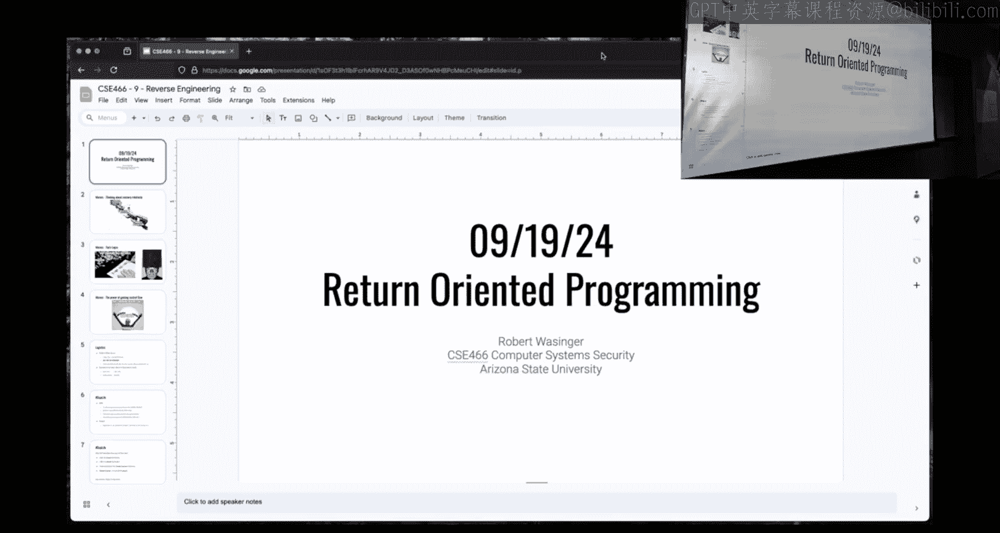

# ASU《计算机系统安全｜ASU CSE466 Computer Systems Security 2024》中英字幕deepseek p10 -11-Return Oriented Programming - CSE466 - Robert - 2024.09.19.zh_en -BV1spCGYZE9D_p10-

Make sure it shows up over here。Make sure I'm muted。

All right， I'm live there。Is this show？

Yes does All right， today September 19th， 2024， we're here in CSE 466 at ASU and we are currently working on the topic of return oriented programming。

Memes。Some of these names I just don't get， but you're touching on things that are。

There so I assume that you're getting it and you're not just like throwing random words on pictures and if someone wants to explain some of these to me。

 I'd love it。Is this。The address of the open Fok， some way to get RAX。

 and then the address of read Fok， and I'm not entirely sure how that one is mission critical do you got me。

 it might be because the output。That the open versus call goes into RAX and Okay okay okay all right I'll take that I'll take that that's solid all right that's because somebody is a good program okay they aren't making assumptions about the file descriptor that would be returned from read I get it now that's a way better mean now because initially I didn't get it but I was like there's something here I'm just not it's not connecting。

And note on this it's like you don't have to be a perfect programmer right file descriptors not it's not like guaranteed that they are sequential but in practice they are so if you know that there are no open file descriptors at the time you call open the next file descriptor that should be returned is three that doesn't work it's wrong okay maybe you got a false assumption try and hard code4 right？

😡，Maybe you just can't if this was set RAX。Maybe， but like。

Then you couldn't call open either because you need to set RAX to trigger or assess call but the point being there is that you don't have to be a perfectly correct programmer as far as your ro gadgets right。

 you don't have to take the return value of open and passive game to read。If you can， that's great。

 but flag is flag， so you can do what you need to。Yeahep。

 this one is like this image on Rob has reappeared。

 this is like the fourth or fifth year of somebody hitting this image but it's totally valid right I think Jan's videos call it getting LeGgo pieces and putting it together which is why we have this one over here。

 everyone's thinking all right， great， we're going to play these little Lego pieces and it turns out Rob isn't you as he I don't know why they're looking can get object dump that sounds like pain but you if Rob really is trying to create a message or create a program out of all of these tiny Lego pieces or all of these these tiny letters to make something that is some somewhat same and understanding。

And so both of those are valid analogies。嗯。This this one I didn't like initially， all right。

 and I thought about it。诶And。Because I thought it was just a really lame chain pond right is that was that what it was supposed to be because I I found deeper meaning upon upon reflection。

 which is how I made it up here because I think last night it was posted I wasn't a fan I was like chain or whatever and then earlier today while I was putting together these slides it okay so it's also freeing the person and rock chain or rock gadgets are kind of the first thing in this class where we were talking about that I'm not going to go into this whole exploitation primitive idea but it's the first time where we now have control flow right we can arbit the execute whatever we want within some constraints where earlier we had like memory corruption we were kind of limited in what we were doing now we're with we are truly freeing our exploit to do whatever it wants and this has a number of implications one it's extremely powerful。

It means that once you start writing your blockchain as a student。

 what you do is going to be totally different from the person next to you。

 which will very likely be totally different from the person next to them。

 which can be totally different from what I do。Because once you get an exploit to the point where you can arbitrarily execute something。

 it's innumerable， but you have a ton of freedom。Like back in shell coding。

 everyone kind of defaulted to good old C on， but there's nothing that stops you from calling open Readrite。

 there's nothing that stops you from using S file， there's nothing that stops you from using any of these other approaches and so that is still true in RA。

😡，Except you just had more constraints on yourself compared to shell coding。And how you。

 like what gadget you find will influence what you think is the easy path。

And so what you think is the easy path with somebody else is may not be the same。

Logistic things I said this on Tuesday， but I assume there is some subset of students that only watch one lecture despite being told to watch both。

 I do have office hours， I do have a room， it's now Friday at noon as was requested。

 the room is BIE and G222 that's the big old brickrickyard building this will not be streamed just for anyone that is an online student。

😡，The idea here is I can give more direct help to whatever the specific thing is that you are stuck on。

 but if I'm going to do that that means I can't have students on stream。

 I can't have your code on stream there's a number of things there to kind of break streaming if for whatever reason you are unavailable for this time and you are like hey I really want someone on one Facetime to talk about what I'm stuck on DMA on Discord we' sort something out I'm up here like three or four days a week so it shouldn't be too hard to catch me as long as we schedule it in advance because I typically am doing things that I'm up here so we're like hey a week notice we can probably sort something out if needed。

Reitations， recitations on Monday， Wednesday Friday。

 initially we were doing the great Po College hour of power。

 well it turned out that 365 was pretty powerful as a class and they kind of dominated that room I think was a safe takeaway over the past couple of weeks Ive stopped five and so I have moved us across across that little fountain area to BYAC270 same time it's just a neighboring building the idea here is if we stay here it's just for66 students it a lie to easier your4 Ts or myself to help you with whatever you're on technically 365 students can overflow into that room。

 we haven't seen that yet but if for whatever reason they get hard stock they are welcome to be there so don't kick them out。

啊。But yeah， we did that starting yesterday， and that has been pretty successful， I would say。

It was received well。U， do your life yesterday， not yesterday， it feels like yesterday。

 but it was Tuesday， Tuesday I had this like slide that was like， put this in your GDP and it。

 and else things will explode and cause pain。嗯。I don't think you have to have those now。

So I would suggest you remove them， there's still some gotchas there I'm not happy with。啊。じば。No。

 so you don't have to have the magic things in the GDP in for this module if you're working ahead and in some other module stuff's probably weird and wonky。

 I'm only fixing things that are impacting this class because these are like super short quick fixes that need to get reverted to make things sane in the greatercope there is a long-ter fix for some of these weird GDP behaviors ETA I'm going to say two weeks but don't hold us to it so that should be by the end of this module if not I will just hot fix whatever the next thing is that we do so that it causes you less pain and if there is secret pain hiding here that I don't know about now you guys voice it I'll try and make it right。

😡，Either by fixing it other bring you with extra credit。

 but hopefully fixing because you'll say so earlier， if you didn't watch Tuesday's lecture。

 I brriibed everyone with half a percent of extra credit。😡。

So yes please let me know so that I can fix it or try and address it because the Dojo is a complicated beast and so there's things that sometimes don't behave or you would expect on a normal in existence like somebody earlier today brought it roper。

 which is just another tool like rock gadget but they're like hey I prefer that for whatever reason that's not on the Dojo I'll add that because I'm in I'm tool in differentffer whatever you like as long as it's somewhat well known I'll get that on the Dojo sometimestime probably this weekend like earlier this weekend because that's an easy thing to fix So let me know if there is something Twitches requesting Rp++ Rp++ should be there I just use this morning okay。

I totally believe that it may not be in the path， but that's a whole separate discussion， but yeah。

 if there is some other tool that is well known for these type of things。

 let me know and we' we'll try and correct them。Tuesday's demo kind of went off the rails and some people asked me outside of class。

 hey what happened， I didn't rewatch it， but earlier this morning while I was eating my breakfast。

 I had an epiphany as far as why the demo went off the rails I had half of the story right this is the full story so I did not show the binary to be owned by Ro。

And I did not CH audit to make it set UI， so the binary wasn't running his route now you saw me fix that live in class。

😡，U and then somebody with a keen eye that apparently was like really searching the lecture video was like。

 and then it still didn't work and the answer is yes。

And that's because I was working in the home hacker directory。

Does anyone know why the Home hacker directorate matters here？

It's I know it's on the slide make sure people are you at least looking at the home hacker director on the dojo is mounted no su this is something that you you can see。

And it's something I should know because I tell people it constantly。Yeah。

 but that's where it's a do as I say， not as I do if we run mount and then we grab。

Hacker where we'll see that this is the mount into your environment and right here when this is mounted it gets mounted no sew and what that means is that any file that is on this mount so in that path。

If it set you ID， the system will just ignore it so even when I fix that because I was in the home hacker it didn't matter and the only time that we saw the practice flag come out was when I was just like shoot sue and then it's just I'mro anyways and so nothing was actually elevating privileges I was just be root that could have cat the flag anyway。

Does that make sense？So like silly things。to all of us and then I don't know if I alluded to it on stream or not。

 but I at least mentioned it before stream at that point I was。Definitely quite sleepek deprived。

And so sleep is important because that's how you remember that these things matter。Okay。

 I do not have a bullet here for what are you stuck on？However。

 I will take some questions and see if I can make it fit into this。

 but I really want to hit these things。So does anyone have anything other than these items where you're like。

 OMG， I need to know this。Okay， what do we got， Okay， so it's more justly theoretical。

Or like conceptual questions， but not just two of them， so first of all it is。

How is like these tools like prop the gadget， knowing how long to make these gadgets。

 like how do they know like to make it like certainly？

Whent they're showing the output and my second question is。

Since these。はい。Instructions like take a third on a white spot。Hypothetically。

 we could just also just jump to like right in the middle of the instruction and then just。

And then that would give us a completely different instruction and model length。The few bites。

 the first one's a reasonable question， the second one I feel like you already know the answer and you're just baing me okay but but if not I'll answer it。

 I'll hit those two and I will come back to the other hand that I saw。

So the first question is how does I'm going to use Ro gadget， but there are other tools， right？

How does it know this gadget is？I don't know how many of that， one， two， three， four， five。

 how does it know this gadget is five instructions？And why is it not like 12？我。In truth。

 a gadget is really only defined by its terminator so the shortest gadget you could have is wrapped。

😡，You could also have a gadget that is literally just junk right those are your two terminating。

a gadget must end with that because if it doesn't end with that， then you aren't getting。

 you're not redirecting control flow somewhere else。 So a gadget must end with rent or job。

 And if we look at， for instance， these two conveniently。

You'll notice that the addresses are just one right before the other。This is 80。

 this is 82 We're actually referencing the same series of instructions and we could probably go all the way up to here All of this is actually the same five instructions we're just chopping off the firsthand and say well if you don't want to pop R 12。

 you can start at the next one if you don't want to pophar 13 you can start the next one you don't want to pop R 14。

 start at the next one。so the gadget is defined by its terminator and then technically it could go infinitely back right as long as there's valid instructions like one of the。

😡，Earlier。Rock challenges， it doesn't tell you to use gadgets。

 it tells you to like call win right well win is a function。

 it does an arbitrarily long you know series of instructions。😡，I function。Is a really。

 really long gadget。Right they're one and the same so so we could we could jump anywhere that is a valid interpretation of instructions that is executable and we could。

😡，Argue that it's a gadget。Or a function， a full function would be the limit。

Now to the second question。It was， okay， these aren't good instructions for that。Let' see if there's。

When there is。So I don't have a good way of demoing this。Oh yeah， I do。good old GDP man。

It's the answer to everything。Okay。So if I examine， let's break it man。

If I examine 20 instructions at RIP， I get。Yes。And。

I started kind of arbitrarily interpreting instructions。19 AD。

 because that is where things lined up based on normal execution of this program。

But you'll notice this is a one byte instruction， push RVP， not very interesting， this right here。

 this move RVP RSP is a three byte instruction。😡，And so I could look at。The instructions。Right here。

 what's up？Okay， examine six instructions at that address。

 and I'm going to get exactly what I started with right。

 move RBP RSP and everything else interprets the same way down what happens if I increment this by one byte。

And so now what I'm doing is I'm just arbitrarily choosing this memory location and saying， well。

 what happens if we pretend these bitetes are instructions， what does it look like？

It looks like this。And that makes some sense it's similar， all I did was Id cut off this first byte。

 which if we remember from shell coding， the first byte of many 64 bit instructions。

 turned something from a 64 bit instruction to a 32 bit instruction which is what we see there。

 but I could actually increment it one more。And now I get something that looks quite a bit different and now I have inX3。

It's not ink， it's in。I don't know what it is， right I would have to go ask Felix and be like。

 well what is in right and there's nothing stopping you from doing this。Some tools do this。

 like I think rock gadget does， or at least it has an option to do so。

Some tools that search for gadgets do not。😡，And so that is why one of the reasons why some people may have a preference for one tool over another。

Now， searching through every possible offset of a binary。

 for every permutation of possible interpreted gadgets is an intensive task for a nonti binary。

 so there are reasons why you would not want to do that。😡。

And if I were to do this in being near where RET was。

 what you'd find if I did this all the way down to RE。Probably disappeared。

And so if I don't have a rent， do I have a gadget？No。

 like I need a rent or a jump for it to be something that is worth considering now can you coincidentally happen to have a gadget that's hiding in between instructions absolutely？

I don't believe we do that to you here though because would that would be a little bit cruel for a introduction to Rob。

 but it is possible and it does work， there are real exploits that do exactly that where where you interpret by an executable region of memory as instructions but not at the intended offset of those instructions。

Cool， all right， there was one more hand over here， yes。So going back to the。No so。

 so suppose home hackers。I apologize， could you repeat that Sure so like going back to concept the Tuesday if I to。

That I would have to work in a directory other than pro or any of its childhood。

That is correct so for Twitch the statement was when I was talking about no sew home hacker kind of messing around with this。

 how do I deal with that I said what the problem was how do we make that not suck and the answer is。

We will copy。Our demo folder over to T。And then just work out of temp all right。

 and that is exactly what I plan on doing for the rest of the day is working out of temp ro so that this doesn't trap me as we talk about these things Good question。

 very real and exactly what I'm going to do。Any other short。

 easy questions before I start driving the bus？In the rough cat on the left hand side。

 that was matrixs of。Oh on rap Gt。There are this right here and the question is。All those things。

This is the so this is a bit of a track。This is why that whole PIE ASLR grant that I had that a a part of the day mattered。

So I'm doing this on。Challenge baby wrap， so if I check S challenge baby wrap。

 I will see this particular binary has no PIe。If it is a no PIE binary。

 then the literal addresses that are shown are literal addresses that you can use。😡，只在。

so if you were to overwrite RVP and we'll see this in the demo or we can。

If we were to overwrite the saved RIP with this right here， we would execute this instruction。

 this instruction， this instruction， and then rent。So， so one address。

 a gadget can be more than one instruction， a gadget is defining where you're going to set rip to and then it's going to fire off until we rent or jump right because when we rent we're setting ripa。

If we were to jump， we're setting Riant。And so we're defining all right， you？

Instruction pointer go her， and then it jumps and then we go to the next gadget and we go her and then we jump。

Now， whether you have one instruction， which is nice and easy and digestible to understand。

 like popular DIRA， I'm doing one thing or you have 30 instruction。

It's the same mechanism that's occurred we're setting RIP to some point and it will go until a job I guess technically you could have a call and that call could rep。

 but that's getting pretty fancy， so it's until some instruction that regives you control flow。😡。

jurisdiction on the later。That would be that's based on the tool， the question was。

 is there a restriction on the length of the instructions or the length of the gadget？あ。

So like right now， for instance， F gadget quite sly， doesn't show duplicates， right？

So there are multiple locations that could have that same thing， we have dash dash all through there。

 somewhere there is a length bar。没错。诶 did you find it。一是的 it的。

So search E depth for search E 10 Okay yeah， so if I set the depth to be like 60 right。

 then hopefully it would。Throw out a whole bunch more here。して。

It's not at the same address so that maybe that' that's where the miss is here the address that it's telling me is the address of the first instruction and then what happens when the CPU interprets that first instruction with what does RIP do？

😡，right， it incremention goes to the next and so this memory address is not where all of these instructions are literally written。

 this memory address is the location where the first instruction is。

 and then we assume that the rip will continue to increment it March forward。😡。

That that's why when I had， for instance， that GDP。And I was examining six instructions right here。哎。

it's not always incrementing by one right， this is one instruction。

 this increments by two this increments by three， this increments because the instructions are very low length。

 but R doesn't care， it's just going to march forward and we're going to interpret instructions and go forward。

😡，We're doing the same thing with our rock gadgets where we are just setting it somewhere and then letting it go。

 right， we set it free， it rents back to us。All right， yes， one more。大公司系咗嘅下就嗰都发。第三。

m some commanders as probably looking。So I don't want to spend too much time on stream digging into this。

 the statement for Twitch was I use Ro gadget and I get instructions that I don't see in object。

And the short answer is these rap specific tools do things like interpret instructions in between instructions。

 these rap specific tools will interpret anything that is in executable memory。

Right where object dump is specifically saying here's what this function is like using object dump and then like griping for a specific instruction would be very rough because you don't know it's not you don't know how big yourgante is right like if I grip object dump for。

😡，Pop RAX。That could be in the middle of some giant function， it's great that I found PRAX。

 but I don't know how much nonsense is going to happen afterwards before that。

Which what gives me control。And then for these challenges specifically。

 did you see the Tuesday lecture？Cool， so you saw my demo that didn't quite work at the very end I had like this function that was useless and it just had like this magic assembly stuff。

So object D isn't going to do a very good job parsing some of the ways that we can insert random nonsense in there right Ob dump is assuming that this is like a sanely built binary。

😡，And so depending on how objectump decides to interpret that。

 it may not show you every instruction that's even in the bindingny。

 that's why these specialized tools are definitely the way to go。😡，All right， anything else？Cool。

All right， so we'll see。Ts D2。I actually dry ran this stuff。All right， I was very concerned。

About about things not。Not not going and I even automated my and seeH so I can't mess it up so the first thing that we have here is I'm going to build this example do see it's very similar to the original example。

And it's going to have no P。So let's remove my eight out out， let's make it。

Let's make sure that it is what I say it is。We have no PIE， that's great。In the interest of time。

 I will show you the example code。All right it's pretty much the exact same thing as what I failed to finish on Tuesday so we have main function it calls challenge challengege is going to say ready to receive input。

 it's going to read up to 512 bytes and it's buffer it's buffer overflow there is no canary we saw from CheS so we can overflow into the saved RIP。

Conveniently hiding down here to the optic dump point， I have this function。

 this didn't need to be a function， I could have inserted these bytes via other mechanisms。

 so this one probably would show up an object dump where I am just like manually inserting these gadgets here。

All right， why， because I am trying to make it trivial for you to perform in the rock。

 not to search for things。and you'll find this is the case if you use RA gadget on some of the earlier challenges。

 we want you to perform the RA， not spend all of your time figuring out how to do it。

Did I name things， I need to go back into T。Rop to。Good， we can have do dot Pi， my favorite file。

User B M， Python 3。Okay， how what's a quick and easy way？嗯。

Somebody's complaining about arm this is not a class on arm it is different on arm what is it easy way for me to find this offset it's going to be the same number Tuesday。

 but hit me hit me with the ultimate solution here how do I find out what my pattern is from where I send in。

Input。I'm sorry cyclic values， so I'm going to say for those that don't remember cyclic 100 gives me some giant string。

 I'm going to do cyclic 500 so I got a really big one， I'm going to stick it here in yep。

 so now Yep has that。We are then going to GDP this binary， I'm going to run it with yep。

 so it's going to take those inputs and we immediately set fault， is it all over， no。

 this is exactly what I wanted， what is useful to me here。Peoplele frame。St。Okay。

 so one of the comments was info。Info frame。This tells me where the saved rip is。

what we see here is that saved rip at the point of Sanfa， which is when that rep was going to occur。

 is RSP。So so we know this is the value that we control that is saved rep。

 and we can get it from here or we could know that hey， we're safe faulting on rep。

 and so we know that this and that are equivalent。Both get us to the same place how many bytes of this do I need to copy？

Four by default it' four， you can specify more so I got QAAC， what do I do with it？Take look。Okay。

 in Python， it'scyclic fine in the terminal， it's cyclic dash L， if you can spell。Cickic L， 264。

All right， real quick and easy， we know we're padding bys are 264 bytes to get to the saved rep so now let's start stubing this thing out。

From Pone importm star context arch equals AMD64， I will say that this context arch matters a lot if you start doing fancy Pe toolsol ro stuff。

 it will be wrong if you do not set the context and start using fancy Poe toolsol Rob stuff。

So if that's happening to you， that's why okay， I have some type of payload my payload I know is going to be a times 264 padding bytes。

 I don't know what else I need to add yet。And。And then I'm going to have P equals process。

 in this case， it's a dot out。We're going to piece and payload。Be interactive。Okay。

 so now the question is what else do I want， what do I want to set or overwrite？

My safe return has addressed it to me because this is going to be everything to get there。

 where do I want to go？I'm sorry， the wind function。That would be swell if this had a wind function。

 but this。Does not。Right the thing I started with on Tuesday that I did manage to finish had a wind function。

 but we're going one step further than that now we do not have a wind function and one of the statements here。

 which is what RA is it's the natural extension from going from one over right to too many smaller ones but I blow away all this space that I already showed you this exists we have gadgets right I like trivially put them in there。

 how do I find them I'm going to use route gadget。Now you probably read that and already saw what I injected there。

 right， however。It makes sense to search for the easy things， right。You could grep for RAX， okay。

 and maybe I see through all of this that there's a pop RAX which is an easy gadget to use right I don't have to like call it a bunch of times I can just give it some constant and it goes in where I want。

Question？Why don't we just gr for P I agree and that will give us a whole lot of useful things right there's two things that you almost always want to grip for。

 at least in these challenges I'm not saying in real world exploitation because we're making some things easier here pop because that's an easy gadget where you can just set whatever you want。

And the other thing would be， and this is will change， this is why this's is relevant。

 as you move through the challenges， the other thing that you would want to look for is Cis call。

And if you have a having a ciscal gadget in the binary is unusual right in the real world。

 this won't happen but we can have it here because we're not trying to make things harder than they need to be for you to understand how Rob works Okay。

 now this binary is PIe， there was a question about these addresses or this binary is not PI。

There's a question about these addresses because this is not PIE， can I use these literal addresses？

Yes。How do I use them？I take the addresses。Just by one。

Okay so so this kind of goes back to our shell coding and said now we're doing it where I only add these things so this is really all I need for the purposes of the demo I'm going to call it a win if I can open the flag Okaym I'm not going to open read right I'm just going to call it there you can envision we could do the same thing with other cis calls all right to finish it out if you wanted to wanted to go there but the interest of time if I open the flag we've successfully won。

because I can set three registers and performances call if I call open， I can call read。

 I can call write。That's the logic here。Yes what Ill do with C Okay there is a comment why not just do Cd this is goes back to the amazing chain breaking free mother cl you were there all right。

 the double alarm tongues youre there breaking the chain rap chain haha and then freedom you can do whatever you want All right。

 what I'm going to do is open the flag okay。Okay， so I。

One way that I mentioned doing this and remember that you need to p64 these values because the values that are being pop off of the stack into RIP are8 bytes in length P64 will let me pass in a number。

And it will ensure that it's eight bytes， I wouldn't need to have all these leading zeros。Now。

 in the interest of pretending I know how to code， I'm going to actually define these things what do I have 1187。

 I'm going to say pop RAX equals that。I also have pop。I don't think I need RVP。

 it just happens to be there pop RDI is the same thing please。T me for typos。

I that will derail us RDx here， do I have a pop RDx？Okay， well， I don't have a pop RDX。

 I have P RDX P RVP， and it is located at 1189。I probably need a P RSI。Do I have RSI， yes， I do，1185。

And then the last thing that I need is this cisle。It is 1180。

Does everyone agree with my magic conscience here see I'm blank them from here to there。

 whether you use comments， whether you name your variables， make it so that it's readable。

 especially if you're going to ask me for help and if you just show me a whole bunch of he addresses being appended right next to each other。

 I have no clue what is going on All right it has happened it's not only helpful for me but it's helpful for you when you were trying to figure out what's going on and where's your mistake right？

So my goal here is to call open。Anyone know what the？Ciss call number is for open。If you don't know。

 who do we ask？Ryan A。 Chapman。

对。All right， Ryan Chapman。Yes， two， all right now。Popparx2。I then need a set。RDI， so P64。Pop RDI。

 what is RDI for open？对。It's the filing。So what what should somebody just a pointer this is a very important thing to be aware of all right。

 you can't just throw bites in here and be like I throw in flag and then it's going to no。

 it's going to interpret slash flag as a pointer and you're going to se fault。

Common mistake not specific to ro， but just in general right keep in mind that's a pointer now there's two ways that I could think about this because this is one of the subprom that people are stuck on I need to get flag into memory。

If you recall shell coding， we had this same problem， I need to get flag into memory。

Did we always get flag into memory or were we did we realize there was a path of less pain。

 what was our path of less pain， simlink magic？Okay， so。

What I need is a pointer to something that is a string。Does it need to be slash flagged？

Does it need to be if I make a similar name to A， does it have to be a？

If my sibling say the answer is yes， but I could change the name of my sibling right。

 so let's instead of setting our sibling first。Let's think about what strings are already in this binary right。

 there's probably something we can use， so there's a strings command if you're unaware。

I'm not running a challenge。There there's a bunch of strings right all I need is literally one character followed by a oldb that is enough to define a C string for our purposes。

And what of the nice things about using？The binary itself is this is not PIE。

 which means if I know the address of this string is a constant。😡，It's not randomized。

Now strings doesn't tell us the address， there may be a flag to do it， I don't care。

 I don't know because my true love is GDP So what I'm going to do is I'm going to run this challenge I'm going to break on puts because you know what you puts。

Shings。All right， so we break on puts。We you continue， I am now at puts。

 what is the first argument to puts？The string that's going to be puts if we didn't know。

 we get man puts and we see puts。😡，Yes， but just takes a pointer to a string。

 so this is a super easy way， I don't care what the string is right I just care that there is a string。

So if we print RDI， this is the address of some string， if I want to know what is this string。

 it's ready to receive input。Now， does this mean I need to name my file ready to receive input No it could just be the mark it could just be this exclamation mark because in the minimum case。

A string is one byte， I don't even think it has to be a printable byte。

 although you may have some problems making the same link word on that right but one byte followed by a nu byte is the minimum case for a string。

So where is this exclamation point？In memory， this is， this is a no Pe。 So this address is real。

 It'll be consistent every time I run it。 I could examine， I don't know，60 characters at RDI。

All right。I don't know that I don't really care， where's the first nullbite in this thing？做这个点。Okay。

 so it's going to be that 21 is a。The exclamation mark， so I have one， four， one，5， one，6， one，7。

 one，8， one，9， 1A。That I'm math I I'm going to trust some Billbte sorry Yeah yeah。

 so we want the string to start before the nullbte so I said B1 a if we were going for the null lightte。

 you're correct to be1 B。 So the address that I'm interested in is 201 a。😡，All right。

 I'm going to put that here in my script， we're going to call it the magic string。Add。

Change that so it has an A。And we will append that to our payload。Okay， I need a set。RSI。And RDX。RSI。

 I don't know， imagine I don't know what。That zero is the right answer here， right for O， read only。

I can use poem tools to get this constant， I probably showed this in an interactive session at some point。

 but we can use the same thing in our script， so I'm going to say constants。Dot o， read only。

And then phones will take care of the rest， I don't care what the number is。

 it's going to put the number there。All right， that's going to set RSI and then I need RDX。

 so I need to fix that up。RDX， and in this case， it can just be no， zero is zero is zero。

 that's fine。And then the last thing I need to do。Paload plus equals a P64 of that just call gadget。

So this is my full plan here。So anyone have any questions about what I did and why I did it？

这是有点搞case，在。跟我这个。Like Ar。The instruction had values themselves。I'm going to start here the order of。

Like what I'm thinking look at the first two instructions for RAs and the two。まなだ。ど是。双方那系。Okay。

Right that's not true， I'll show why in a moment， do you have something else looking at I noticed that we're actually supposed pop RDX。

 pop RB？because that's the actual are we have there Okay， so you're you're thinking ahead， all right。

 so the the comment was I don't have pop RDX， right， I kind of just made that up over here。

And my Python code would explode because it would tell me that P RDX doesn't exist。

 so instead I have P RDX P RVP， how do I fix this so that that works？

Past two values instead sort of one one for R D， it for R。

Go the statement from the class here was past two values because I'm going this is really going to and this is why naming things is useful I named this incorrectly my Python code would have blown up and said hey you don't have this and so I would have failed early and I would have failed in an easily identifiable way that's how I pointed out Yeah that's why like we are hackers at the end of the day if it works it works。

 but it by not just having a little bit of semblance of organization can save you a lot of pain when you're like why doesn't this work right I tell you go look at it in GDP because your code looks like garbage and that's fine like you can figure it out from GDP but it's a lot easier to figure it out from the tool that you have。

And so their comment was that because I'm actually popping two values with this gadget。

 let's put two things in front of it。And that is the correct answer， so right right on。

All right let me catch up here on Twitch okay， Twitch caught me you know sometimes I do things incorrectly on purpose so good job on Twitch pop RDX is not real the question is whether clobing RBP is important Okay。

 so that's another point that Twitch brought up it isn't going to matter for this literal demo。

But it can matter in other context。😡，What is a side effect of me running this gadget？

I really only wanted to set RDX， a side effect of it is I had to set RDP。

What happens if somewhere down the road， I call something that needs RVP that's going to dereence a memory location relative to RVP。

 I can't use that。😡，Because I know ruined RBP RVP is just off limits right and you know I could try and do some earlier things to like push RVP。

 pop RBP， figure out what RVP is and get RVP in here and like move it around like do some shenanigans there so that I don't break RVP but in this literal example I'm breaking RVP and so if there were anything that I was doing after this this call。

 I have to know。That those do not rely on RBP。😡，That includes the leave instruction。Yes。

I don't know if it's God， but I'm not able to figure out how pop parX and the value too is going to set two in naance。

The statement was， I don't understand how pop REx followed by two is going to set this value and this is where GDP。

GDb will save us。So anytime you're not sure like how something works， it is more than a meme。

Use GDP and step through this stuff until it makes sense to you。

So I changed my script to be GDP debug。There's a bit of a trap here。

 I won't be able to open the flag so I'm going to pseudo suit because G drops privileges， remember。

So I pseudo suit then teamms so that I can still split this。We go back to temp Ro。Two。

 we run do dot pi， did I not make it？Executable， I did not Cmon plus x do dot pi，2 dot pi。Okay。

 so here I am in Tb， because I started it from phone toolsol that's going to put me here at underscore start。

 it just does that。Where is the point where I actually care， where does my rock chain？

Where do I gain control？After giving input， so I should break out read。

Okay so so it's called return oriented programming because we gain control at return。

 that's why all of the gadgets end return returning is what we're doing right and so it needs to be the return that is influenced by our memory corruption。

All right， so one of the statements was it's going to be。See if this works。Let's。Let's break it man。

 that gets me there， let's break at Re， okay， and then I'm going a Finninny。

So this is the I broke at the location where the input was ingested and then I finished。

 so now my memory corruption has occurred。啊。Things are not looking very good there。

This is not a good sign， okay， well we'll see what happens what I'm interested in is what I'm what I'm corrupting。

Okay， we're on the stack， our overflow is on the stack。

 we're corrupting the saved RIP and I'm going to hit this leave instruction whoa。

 the stack suddenly changed and now it looks like what I'm doing。If anyone here know what leave does。

 this is a very important thing to know for this module。😡，What does leave do？

This is more important for the for the second half in the first half。

 but it's important I'm going to guess it's like doing the epilogue of a function So the statement from for Twitch here was it's part of the epilogue。

 which it is your your functions end with leave followed by rep And if we looked at a function prologue。

 we。I in the interest of not make stating it incorrectly we'll just look at it what we do is we push RVP。

 we move RSP into RVP， and then we subtract RSP that creates our function frame leave is doing the reverse。

So leaveE is going to take RVP and pop it into RSP。And then return。Hopefully I got that ready。

It's the inverse operation and so before before we executed that leave。

The fact that it joined me is the current stack frame。But once we step through that leave， RSP。

It gets cleaned up because we're eliminating the function frame because we're about to return。

And now we see the values that we've overwritten。Now， one of the questions here in the class was。

 how does？And do it over here， split that off。Tempt prompt to do do five。

How does P RAX followed by two get two into RAX， I think its the other way around。

' I don't see how this is pulling it off right this is black magic to man。Well， where am I。

 I am at this rat。The first thing that I wrote overwrote was the address of it's really it's like black on black there。

 but we can see it right here， I'm going to R to pop RAX followed by RET。

 so if I just step one instruction through that RET。

I am now at the beginning of that first gadget that's going to pop RAX。😡。

Where does P REX get the value from？The stack right and where are we writing to the stack so the stack serves two purposes for us here。

 it is both the series of places we're going to jump and if we are using pop。

 where values are going to come from。And so if we were to look right here， what about the pop RX。

 what is at RSP2？We step and if we were take a quick look at RAX， REX is two。

 and now we're about to read again， I go to my set beginning of my second gadget， it's pop DI。

 what is at RSP， it's this address I came and Jeff is nice enough to dereference it and say hey。

This interprets as that exclamation mark。As a string。

 which is what I want now in the interest of time。Because I did not create my Simlink。

 I should probably do that before we call open on this thing， right， otherwise it's going to be like。

 this didn't work。So we'll go into our temp up two， which is where we're playing。

 what do I need to do？Alan Des， something， something， something。

I think it's I didn't hear any any actual state with there there's some mongling just I dash like the file on link and another file one link。

Okay， yeah， yeah， it does take two arguments， both of them are files， which one。

 which one is the destination， which one's the source first。

I'm just gonna to say yes because I could interpret that statement either way so the first argument is where I want to go。

 which is flagged the second argument is the name of the thing I one of the things to be aware of with you're going to be using this in bash。

 there is there between singleel quotes and double quotes I don't know if exclamation mark literally would work here but if you single quote something in ba Ba will leave it alone not do any interpretation and the substitution。

 it is just absolute truth as far as the string if you use double quotes。

Bash will do some substitutions， this is in a class on Bash。

 this is just something for you to be aware of， if you want a literal string in Bash。

 use single quotes。And what we see here is I now have something that isn't at literal exclam mark。

And that is going to be a symbol that points for the flag。All right。We're chilling here。

 we're popping our DI， hopefully everyone is on board what's going on here with the gadgets and moving and groooven。

Now here is that interesting gadget that was like it does what I want then it does some other BS。

 right， so this is a gadget of more than one length that's actually got to knock in between。

So it's a four instruction gap， this all pop RDx， it has the side effect of currently popping zero into RVP。

When we rent， we get to our Cisco。The question is， did this work？I did not get a negative number。

 I mentioned if you know that you are functioning under the assumption。

 there's only standard A standard out standard A that are open。

 your next file of description should be three， I successfully opened the flag。😡。

Does anyone question that？All right， any questions about that first demo， second one。

 I'm going to run out of time it's going to have a lot more fancy things going on。

 but that is the base case for how to do rock with literal addresses using P64 and I think it is worth doing that initially so that you understand the concept of what's going on。

Because if you immediately jump to fancy tools and then it blows up。

You can't make sense of what's going on in GDP。 And so having a script that looks like。

Leave me alone， looks like this is very clean， it's very easy to understand what step。

 what value is right or wrong。So I would definitely consider doing that initially。Okay。

 so now we're going to get to the second。Amazing show here。

We're going to make my PIe version of this binary， my PIE version of this binary is a bit different。

So。If we run this。啊。It saysP is located at and it gives me a leak。

And then it says ready to receive input。Now， if we try and do the same thing。

do it down here so people can see。It's got right now God again。Goop gadget sounds cooler。U。

 where we can do our， all right， you know， Robert， you're puning me。There's clearly we want as well。

Oh， you wentt pop， not push， okay？Look at a little bit rougher here。All right。

 and the challenges willll get to this type of state pretty quickly。The ones that have super nice。

 pretty things in there。Are meant to be nice， easy， debug it， understand what's going on。Now。

I read quite a bit on Tuesday about what does elite get me and I looked at VMm and we said there's continuous reasons of memory。

 this that and the other I'm not going to repeat it What do I get a leak of。😡，Inで thing。Okay， puts。

 where is puts， you don't know that's fine， you can just say， I don't know， how do I find it？あ比と。

Oject dump was a statement and that would be incorrect because this is something that appears at runtime so if I go to temp up two。

 we run my binary it's 807 now it's D E85 now it's。Right they did this， this。

Is being impacted by ASLR and if we were to checkse this binary。

 we would see that it does in fact have PIE。I did disable the can。So where is foot？

You know what my favorite tool is？哦，距D别。So we start this bad boy。Let's break at。

Puts because that I'm assuming that how it's printing it out， I could be wrong here。

 it probably is wrong， actually， let's break at print F。

And continue it's fny hopefully I get the challenges challenges printing oh I'm not in TmX it's all ogre here is the thing that the challenge is spitting out to me right it's intermixed in my GDP output since I'm not using phone tools here I could copy this address。

And I could since I have Jeff， this is a Jeff thing VM map followed by the address。

 I'm sure if Podybu has something similar， I don't know it， if I run VMM and I specify an address。

 it will tell me what region of memory this is in。Now it's a nice long scary string with Ns。

 I'm not going to go into what N is hopefully one day that will not be visible to you what we really care about is the very end which is somewhat cut off。

 it does say Liby。so。6。Okay， on a normal nondojo system。

 this would actually be slashlib slash x86 new something or another slashlib C do soX right the paths are a little bit different because of dojo reasons but it it is in fact Lib C and if we were to。

VM map here， we see that it's specifically this executable， now that's the loader。

 it's this executable region of lippsium。All right， cool。Based upon what I said on Tuesday。

 what does getting a leak in Lib Sea allow me to get to？被少。Anything that's based off of Libps Z。

 So how do I know it's based off of Lib Z looking at this VM printout？

I did this whole highlighting counting thing and everyone was sleeping on Tuesday。

 I believe I believe that Thursday people can get this。How do I know what's contiguous in memory。

 contiguous means right next to each other？Cing bills。sububtracting the offset， okay。

 so I think you're one step ahead， so what I'm trying to find here is if I get a leak that's in here in this region。

Everything in this literal region from E7000 to 43。

000 is contiguous because it's mapped as's one bb right all of this is just one bb and whatever is mapped there is mapped there and the literal location。

😡，The literal memory address may change and randomized due to ASLR。

 but say there's something that is at puts plus 12 bytes。

 it's always going to be the same thing it puts plus 12 bytes。

 but I can expand this thought more than just this region you don't have to for this module。

 but this is something that people miss and so I'm going to reiterate。😡，This right here。

 this region ends at EE7000， this begins at EE 7000 these are right next to each other they're map differently that's fine this ends at 3043000 begins at 4300。

 they're right next to each other it's fine about this 99，000， 99，000。

 they're right next to each other great 900，90000 great9 F thousand009 f000 great A E00 Ae000 great A F holy cow there's actually a whole lot of things that I can get to。

All right， by just getting one leak in a contiguous block of memory。

 hopefully I didn't like fail to match up numbers here， but you get where I'm driving here， right？

And as was mentioned by the class here， I can deal with that by calculating an offset from something that I know to something that I want。

You can do all this by hand and you can write the math and do that and that's fine and dandy。

 it's worth doing once or twice just to know what the pain feels like。Um。

 and like you should be able to do this。somebodybody says I can't remember a time when Libpsy wasn't contiguous exactly Lipsy always is and one of the things that people don't realize is Libpsy and a loader also are pretty。

 I don't want to say always， but very often contiguous。Okay， so we could do all of this fancy math。

We're going to vim do two dot pie。We will not have time to finish do2。 pi。

I'm just looking at the clock and I know where we're going from Pone importm star context arch。

Equals AMD 64 one of the things I have in the slides we've talked about the GT PLT regardless of what I talked about today I was going to record a separate video on it。

 so I'm just going to do that and that's what you're going to get on that because then it'll be nice for slides and diagrams and it'll make more sense。

 a better use of time。So I have this， one of the things that we do with Pe tools is we create a process。

 right？Has anyone messed around with an elf？Typepo， who am I typing right there？呃，哎。今天包括个。

Somebody says they kind of have been using this thing。Okay， so somebody said， I used read Elf right。

 read Elf is kind of cool if it decides to run， Oh， that's read， that makes sense read Elf。

Gives me a bunch of info about the sections of the elf it's a bunch of static information about the literal e file right is useful。

 not what I'm going for here， so P tools itself has a object I can get it from P do elf or I can just call Elf。

On a。Binary okay this gives me a Python programmatic representation of this elf and you're like all right wells that's great one of the things that is in here。

 for instance is symbols， which is a dictionary of all of these addresses of something right now very much like what I was talking about rock gadget。

 are these addresses which are tri as decimal we can give ver to hacks it doesn't matter does this reflect where things are at runtime for a PIe binary no。

Because you can't know what runtime is doing from a file that's sitting on disk。So that's a problem。

But we don't just， we can do more。With our magic elf thing， if I go back to GDP， I want to。

Copy and paste from this。Because I'm not going to know this path and to copy this giant Lib C path。

And I'm going to say Lib C equals L of whatever the heck that is。

If you're unaware of import I Python， I Python embed， that just lets me run。The script。

 and then it will pause。And that， not do。Gosh， daang it。It will give me an i Python session。Do，2， do。

2。It'll give me an i Python session after that code's ran。Okay， so I have this Liby thing。All。

 it's still just an elf， I have this symbols thing。And this is a dictionary。

 what is the location in this Liby symbols？Of puts well on ellipy that's sitting on disk it's this location right here remember numbers are just numbers。

 it's all the same thing that is the location of it's sitting on disk does that tell me where puts is running no okay so so far this is pretty useless right except it isn't。

If I find。Did this print， oh， I didn't。P。We're going to yellow some stuff here， P。

 we're going to print P receive blind， nice， okay， that was good enough。

 You can imagine that I had this。Does everyone know how to grab this literal value programmatically using phone tools？

Yes， no， yes， no， I'm getting no， okay， we're going to abandon the I Hod。

 we were going to go to a better place。No Python no， no， no， it's still Python， all right。

 it's just not i Python so oh yes。Yes， so the statement from the class here was process has something called P receive Intel。

 Twitch， yes， you're talking about magic， I don't trust that magic due to dojo insanity。Um。

 it may work， it may not work I'm literally demoing things that I know behave as I expect。Um， so uh。

 the comment from the class was I can use P receive until we probably dealt with this at some point。

Right， we're working with challenges here， so this binary。Spititz up something I'm interested in。

 which is an address， but it has some other garbage before。 I don't care about the other garbage。

 So I'm going to receive until。What does it say located at and then I have the space。

 the space is important。Make it a bite string。Now， and that's going to， in my script。

 it's going to eat all of the output from the program until this zero。

Now I want to capture that strain。😡，What do I want to use？

How am I going to get the rest of this this line and hint nudge nudge Okay， I could read line。

 I like receive line， I think they're the same thing so we can receive line。Now receive line。

 I want this to be the puts address。Okay， now。In the interest of time I'm going to what is what is the type of this right now if I call puts receiver line it's a bike train bike train functional equivalent string。

 but yeah bike train is the most technically correct answer What do I want if I want to like do math off of this number I want a number right It turns out it's really hard to add and subtract strings。

Maybe Python will do it， but I have no idea what will happen， so I need to turn this into a number。

They didn't know if it a trying to done how you would do that。From bikes。

O I don't like that I don't like that that is bad that's why we ask so the comment from the class was I could use int from bytes okay so this is where types will really mess you up all right there are bys there are ins or like numbers there are characters and then there are the bytes that are the characters right in from bytes is going to interpret those bytes as a literal integers。

And you will end up with a number， but it will not be the number you think you have。All right。

 what we have here from Pe Re line。Is a series of fighttes that represent the characters that are the numbers。

 and then just as a nice anecdote since we did receive line， it's also tailend the tail end of it。

 the caboose is a new line character， which we also don't want to interpret。😡，All。

 so we got to do a little bit of cleanup here and this isn't that insane。So。What does this do？

Slice in， I'm slicing off that new line character， I don't want it。

The next thing I want to do is I want to make it。An end。6。There are other ways to do this。

There are many other functions and you could convert characters to ends to characters。

 to fights to right， you can go through whatever circle of insanity you want。But in the end。

 what you will end up with is this， this。Years down the road， you'll be like that was the way okay。

 so if I am going from a character representation of a number。

 what I'm saying is I want to receive the new lines。

 the rest of it is just my number with the new line character I'm dropping the new line and then I'm saying those characters I want to interpret as an integer with a base of 16。

😡，That should give me a nice sane number。And we can print that from our Python code here with an F string。

 so I think puts is at。I will say hecks of Put's dress。I strongly， strongly， strongly。

 strongly recommend if you are working with addresses。As variables， leave them as just numbers。

 I don't care that they python prints them as decibels。In the end。

 that will cause you pain if you try and he things early。😡。

Because then you start trying to add strings and like things don't go things aren't right the hex function doesn't make it a hexadeadecimal number。

 it gives you a string that is the hex representation of that decimal number， they're all the same。😡。

All right， so I have this。In the interest of time， we're going to add a little bit more magic here。

 so I had this Liby elf thing。And we said that the values that it shows me for these symbols are all lie。

 and it's all all lost。Well， that's because we havent informed phonee tools， where is Lib C。

 we can do that。We say Libey address。W not it。Why what？ your。

I am setting a member of the ellipy object okay， so this is that like this is all purpose and we're not like doing it type I just want to make sure。

As far as I'm aware， okay， so it like a prior to earlier today， I would have said lit。tbase。

 but it turns out that this version of Pe toolsol doesn't use that there's probably another way to set it。

W which you may know I thought this was like setting variable's No so I am setting the address property of Lib C this of this Lib C elf thing so by default。

 the address of this Lib C elf thing is going to be zero that's why everything that it tells me is a lie it's only true literally on the file okay but if I want to try and get this thing to reason about what's going on at runtime I need to tell it where is Lib C at runtime。

And so we can say Libiby。 address。Equals。My puts address， minus。

 and you'll have to think about this one。Symbols puts。す算。This makes sense okay。

 because this doesn't feel like it does to a lot of people when they first look at。

 I'm taking the address of puts subtracting the distance into lip seating。

 which gives me the base address of what's dynamic running for this running instance and then setting that over here。

Yes forward setting this changed the offset in the lipsick or symbol Oh。

 you're one step ahead of the game， the question was。

 does setting this make Lipsy dot symbols not useless and the answer is yes。

 so I will then print F I think open is at。And we'll say hacks。What do I want， Libpsy symbols？Open。C。

 so I have this going on。The question is， can I debug this in negative minutes？

To prove that this is accurate means there's maybe I'm root， right yeah？I need to run do2 dot pi。

That is pi 10688， I'm going to GDP attach 10。I can't say a number and then 10688-10688。

UWhere's my print here， Okay， so it thinks open is at this address。I attach GDP if I print open。

 let's print。That's not what I really want， why did I choose open？And。Where am I， I'm inside of Reed。

 that's f。What did I miss？Does treatD be lying to me？I promise you。

That's examine the instruction at that address then come on GDPb examine the instruction at that address。

 Okay， it is open 64， so it is where open is inside of Li Z Okay。

 so so what we are able to do here and you'll notice that I haven't even sent my payload yet in my script。

Because the challenge said that before my input。😡，And so I can programmatically grab by leak and use this。

😡，To then dynamically construct my payload and send it into the challenge。

 I'm like four minutes over time。Hopefully that is useful。Any last minute questions？All right。

 we're calling it there。 I appreciate and keeping you late。

