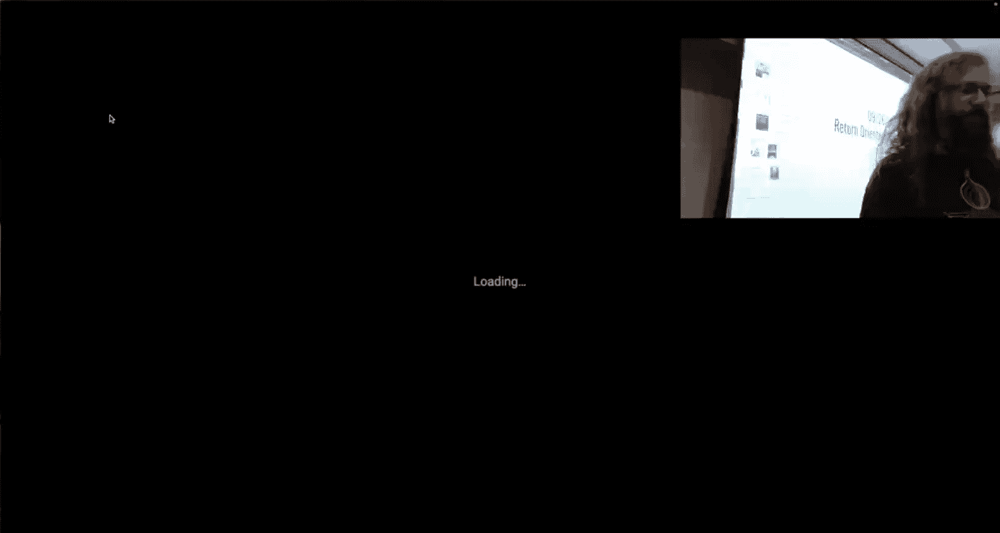
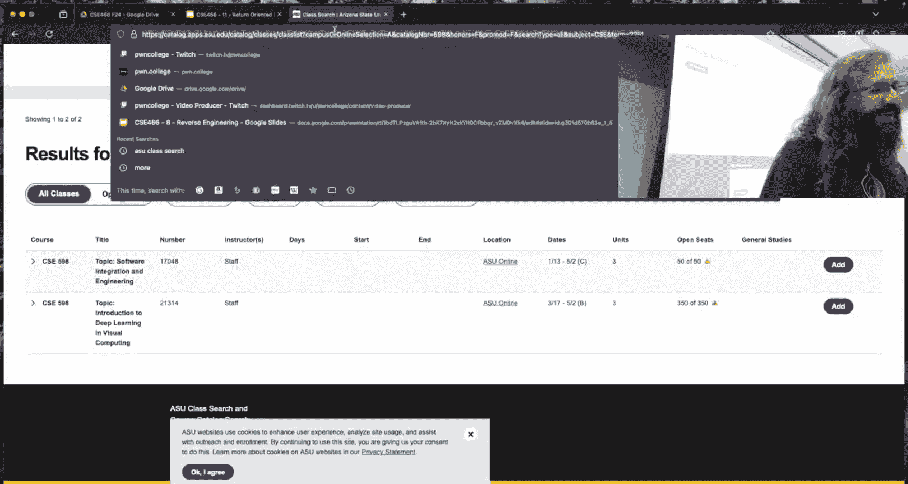
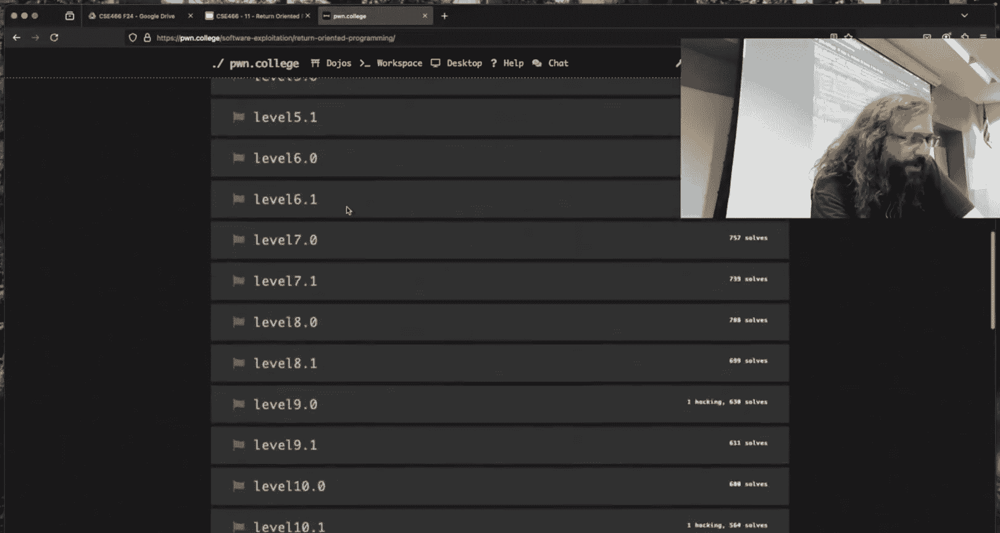
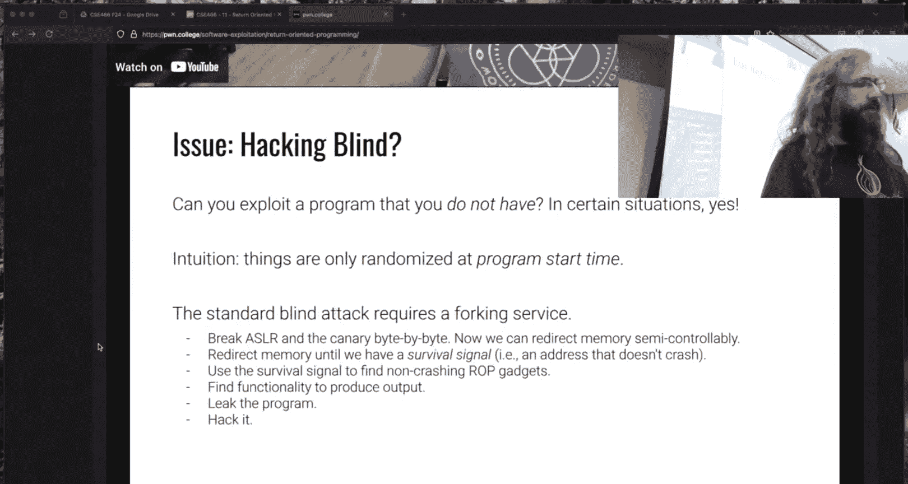

# ASU《计算机系统安全｜ASU CSE466 Computer Systems Security 2024》中英字幕deepseek p12 -13-Return Oriented Programming - CSE466 - Robert - 2024.09.26.zh_en -BV1spCGYZE9D_p12-

Over here， I am going to try and break everything with drawing again。

We're just going to do that every time until I have something that works because next week I need it to work。

Get the camera on。Just force it by hand。Over there I think。W looks reasonable。

気ちゃん？

Doesn that work there？It does all right， today 26th of September。

 we are wrapping up a wrap here in CSE 466。Memes。People seem to enjoy my live demos。

 my live demos are really live as we found out late last。Tuesday。

I'm going to break things again I'm going to try and draw for no reason other than seeing if it works。

 so we'll find out。Somebody says this shall be my only and that I don't get to see what the original message wass that's cut off for me。

 I joined my own stream too late。This shall be on my。I don't know all right。

 you got a got to hit that again if you' me to read it we're going to try and draw again。

 I'm glad I'm entertaining。Details matter in just this whole course。

 this whole topic so this was an amusing meme because of course you're placating to me and you're saying。

 hey， I use replace new line with an empty string， Rob uses strip new line turns out both of these are actually not the correct approach to use if you want this to be as bulletproof as possible why。

It can break， It can break that's a pretty safe statement in like most code that you could write。

 But why why isow， what was attributing to me here receive line strip new line bad。All right。

 nobody knows。就社关你的。So there's an assumption here。Yes。Make sure I don't。I'm going to head off again。

The assumption is that the process， like we've read enough input， we have some bite string that is。诶。

Something like this， right？And then there's a new line character。

And this is what the result is that we're going to read from a process。

And so what I want to get here is whatever these fights are。go there there should be six of them。

 I don't know if there's actually six， I just kind of yo it there Did I give it seven？

It seems to think it's eight。嗯，Okay， whatever， we'll give it that。

So this is roughly what you would try and get from。We you get some garbage lightss。

probably because you're calling like print a and it's outputting some bytes with a new line。Yes。

 so Twitch called it correctly， the case that I gave here will behave as you expect。

 result script removed with just that new line character。The problem is。

 are there any restrictions and what the least significant bite？Of。This address that I'm making this。

No， it could be anything， right because this is just a number and so that means in theory。

There's nothing stopping the last bite of this from being， for instance， hex0 a。

 which hopefully my memory's working correctly。Well。

 if that lead significant significant bite was OA， that OA is now gone。Why is OA done？大すけ。

It is so the statement from the class statement。诶。We see up there at the top。

Heex0 a is a new line character。 So if that address or that thing that you're trying to leak ends with a new line character and you use strip。

 strip will remove all of the new lines， not just the first one。

And so the correct way to kind of pull this out。Is what I did originally， which is to say。

 I want to read in all of the bitetes， right， I want to take that bite array。

 and I want to drop the last bitete。 That's what this syntax is。 It's called Python slicing。

 I'm saying， give me everything and then drop the last one。

 And this gives me that here it's displaying it is slash n。 but that is， in fact。

 that same character that I entered。あれちち。Right here， that's that OA， right。

 And I only drop the extra one。So there is a right way to do it， and it's not what I did on Tuesday。

This other one here， didnt get this I didn't get this being what I saw。

 and I still only kind of get it。It turns out a subset of the class。

Has discovered some you guys are really good at searching。呃。I don't trust your magic there。

 twitch people are really good at like searching through the discordful of ancient conversations since that hasn't been purged。

And somewhere， someone on the Discord said， hey， you can use jump R eat。And that's like okay。

 what does that mean I don't know if you read the thread I guess it talks about if you're trying to find a gadget in Lib C。

 there's a jump RVP gadget somewhere that you may or not may or may not be able to find and you can use that by group forcing the least significant bys of a return address that's in Lib C Maybe that works maybe that doesn't I don't know I can tell you that's not。

Necessarily what's immediately intended there to just like blindly shoot for gadgets because people are doing this on challenges where it certainly wasn't intended。

 but that's that's okay right flag is flag at the end of day it's kind of a silly silly approach in my opinion when you can use more like logical and reasoned approach instead of just writing this for loop and then like。

 oh I hope I hit it。That seems kind of silly to me。

I really like this name because this is something that I personally really。Believe in。

 it's cut off on the twitchwitch feed here， but it says when someone finally asks the right questions and then they're going to watch this firm as great interest。

I watch a lot of friends even when I don't respond to him。

 I usually like glance at it and see what's going on as long as people are talking is fine and Im a big believer of like how you phrase your question matters a ton right if you phrase your question where you are asking conceptual questions and you are artipulating something clear that is answerable then you'll probably get like a detailed response that is useful and if you ask something like。

 hey， this is level4 and I don't know what's happening at Se fault。

 it's probably going to be a lame conversation not only because it's unlikely that I'll respond but other people are also unlikely to responding so that doesn't reward the class as a whole it's not a net beneficial thing。

Yeah， somebody else on the twitch here says that they too do not answer more quality questions so very your question right matters a lot because it does end up with more useful discussion。

Memes two ways to pivot I actually don't like the meme on the left or meme on the right。

 but we're going go with it， it was a nice way to frame this so a stack pivot is essentially just setting RSP sending RSP to somewhere else in memory and so this is what we talking about when we are talking about ro and doing a stack pivot or pivoting。

Some other people had got to that point because that's right around where the checkpoint is and they pivoted in a very different way。

 decided to go work on other coursework。All right， like I get it， it's actually kind of clever。

 you're not going to get the upvote for it despite it being on the slides because I believe that you can do better。

To the author， however， yeah， all right， that's fair if you try and solve all this at the you over the weekend here last minute on like Sunday。

Sunday Monday， good luck。So where are we so far with Rob？We have like the weekend to go。

Average student in the class that is actively participating has 56% of the rot moleculeual salt。

 which means they're still on roughly level nine， like 8。59 somewhere around there。

Means that they're working on stack pivots。Like that's fine。

 and there's not a whole lot of change from where we were。At the checkpoint。

Which is also fine because I imagine people are just waiting for the weekend， it's not like， hey。

 I'm hard stuck。Like you manage your time？Yes， I'm not gonna to talk about stack pivots today talk about stack pivots on Tuesday for that like 10 minute window if you're like。

 hey， that 10 minute window wasn't enough， I agree which is why at like seven to8 o'clock that night I just randomly streamed on to again took the exact same binary that we had from Tuesday and plugged along until we pulled off a stack pivot and made it make sense if you were just want to get like the TLDR on stack pivots。

 go to that same video， whatever the class video is I just stapled on what I did in the evening to the end of it and I was like a two hour video instead the hour that is class go to the very end like the last 15 minutes the time in between there the first like 40 minutes I think is worth watching if you want to try and see like how to reason about things because I didn't know if I was going too successfully get a pivot out of it and so we were figuring out like what was going on in the binary there were some interesting Se fault things that I didn't expect more things。

of like happy accidents like we had with the null bite being the least significant bite of puts when I started the demo on Tuesday。

 like things like that will happen。And more of those type of things happened as I was marching through this demo that I like threw together on this fly with you。

But I did work around them and we reasoned about the behavior that we saw and we were able to finish out and successfully pivot we could have turned it into a complete control flow if I want so if you're interested in that check out the last 15 minutes。

😡，This right here I jumpeded on myself because I was doing that stream at night and I was not a canned thing right so I was still just working on that random of binary and oh this will pivot and then it didn't pivot right and so I had a moment where I myself which is like okay。

 what's going on。It wasn't intended， I did in fact figure it out。

 so if you want to see how I was problem solving， it's worth taking a look。

Dynamic allocator misuse long choose tomorrow the show must go on this module is considerably different than what we've seen so far we're still dealing with the concept of memory corruption right and that's going to be a consistent theme。

But we're going to start dealing with a lot more pointers。 This is specific to heap。

 I don't believe we're going to do a whole lot of pointer stuff in the other modules based on my recollection。

😡，But what are the things that I think is important to have in this class in 466 that was missing in some prior iterations？

Is everything that 466 did for past iterations was it started everything started from this buffer overflow and it's just like。

 all right， everything is in linear memory。And I think that's kind of lame and it does you guys a disservice。

So like one of the things that people asked about rap。Was all right， well。

 what if there's a canary and there's some challenges in this broad module that have a canary， right？

But they're also like fork servers or they give you some like arbitrary read primitive if they're like giving me an address and I'll tell you what's there。

It's cute。But that isn't necessarily what happens in you know real exploitation more often than not。

 you don't just overflow from the stack over to the save return address instead you target some other subsystem。

 some other subcomponent or behavior that exist within the program and you turn that into a primitive so I think it's level 13 or 14 one of them says give me an address and I'll tell you the bys that are there。

What is it13 so so that idea isn't actually that far fetched that that that concept of。Address。

 tell me what's there is something that's called an arbitrary read。

 That's like a fundamental primitive when you're thinking about exploitation。

 It's how do I get the ability to arbitrarily read memory。

in one of the ways that you can get these primitives， like arbitrary read or arbitrary write。

 which is a similar thing， give me an address， put the value there。

One of the ways that these primitives are generated is by exploiting the heap。😡。

So the heap is a very common thing when you need memory。

dynamicynaically allocated so that it isn't on the stack and so this is going to move us away from this realm of we read in here and then we just go forward in memory。

😡，Which I think is going to be super cool and interesting。

Using GDP and specifically using a GDP plugin like Jeff or Po debug is borderline mandatory to reason about these if you have stubbornly said I'm not going to use either of those now is the time you're going to pay the piper or figure it out like you can deal with it by looking at arbitrary looking you using basic GDP commands。

 but it's going to be a whole lot of pain。And then one thing that I'm going to warn people about just right now before this thing launches is the heat module。

Is。The difficulty ramp for like the last I'm going to say four levels。

 I want to say it's like level 16 onward there is a huge change so there's the yawn videos that you're probably familiar with that covers everything up until I think level 15 and then you're gonna to get like this bonus video that I made right it's not new for this class all right。

 I added these things a while ago。But you're going to get this bonus video that's going to be，y。

 this is Robert from the future and it turns out， you know。

 in the past couple years what Jan said is correct， except this。

And there's this protection mechanism called safe linking which will be a jolly big time for all and that makes heat stuff way harder and so like level 16 onward are going to be significantly more difficult than the earlier challenges。

I'm letting that letting you know that now， so that way if you like start out you're like hey。

 this is easy like that's great， just plan your time accordingly。

 plan the later quarter of those challenges to take up。Probably most of your time on the module。

If you plan on completing them。Somebody asked a couple weeks ago if I could launch modules earlier。

There actually was no reason that I couldn't I just didn't get around to scheduling it in time for rap so tomorrow I did already change it on the Dojo it's going to go live light at 3 pm instead of 6 pm。

 there's no major changes from the existing content I'm not even going to like。

Lie to myself that I'm going to change stuff on you， we're just going to rock the roll what we got。

Okay， with that。I actually don't have any like big plans， big topic。

 something that I wanted to like show you guys today Sta pivoting。

I could have like finished the activity today， but like that seemed kind of unfair。

 which is why I yo load it on Tuesday night， so is there something that you guys want？

Meing to bramble about。自由る？他不。そがル。的一确。いさ？Can you phrase that in another way that I know I haven't corrected？

Let's say you have。think about the a lot scientists have。Take up a base address。IEx that youre doing。

So just how would I rock if I don't have to be？那这是在问题会第二。听到没？Because。

Any ideas that we do find it going to be。Do I get to， do I get to assume？

I have like a fork server or something like that？Is this something you actually deal with in a challenge or is this something you're hypothetically throwing at？

那身份的就我来。I think you're mistaken。那进行。All right， I'll think about it。Okay， we got something here。Oh。

 it's going to be another poorly worded question， but I'll go with it。 All right so。

To's what you're saying trying to do。Liib2 C， these things have like crazy names。

 people say things like to R to Liby and I'm like I。I don't know， man。

 people have reused these terms and like。Recycled them so often that I don't have a definition for these things。

 Lib 2 C at level 13。 I have the address of start。How do I get？Puts got and puts PLT。

Is your question in reference level 13 by chance？All right。

 so I'm not going to like solve little through， but no， no， no， like Twitch said by that so。

I get what you're asking， it's just anytime that the question is phrased in the form of like level X。

Bh， that just feels。It feels bad man。Okay。

嗯。What are we doing here， we are going to Po College。I'll take a look at it。

Just so I can think about it correctly。 Who are we， We are Rob。

And we're looking at。But I really 13 one。Drot function has a canary。What does this thing do？Okay。

 this gives me a leak of my input buffer。 Do we know where this is located？What。

So I'm just running 13。1 I could have written 。0 but like what one seems like more fun so so it says your input buffer is located at this address。

 where is this address in memory？管理谁呢？But这个他。Okay， if I were to GDPV it， it would be on the stack。O。

嗯嗯嗯嗯嗯嗯。You could also know that because like Bike convention， the seven and F is typically。

 typically on the stack。What is this next？Okay， all right。Then the next thing I want to do here。

We're going to hit the danger zone。I'm going to f from the re， I'm going to give it， give me。

 it just going to blow up or is that going to work？啊，去去去。It's two reads。えまし。

Address to read from OX 1337。 Okay， I need a whatever we'll run this。

 I'll just give it the address that he gave me。 I know this is valid right？

This is something on the stack read from there， All right。

 and then the next thing that it's going to want to do， I imagine is it's going to read into。Okay。

So that's。Interesting。So I get a stack leak， which I know is where my input is。And I get。An overflow。

 does this thing have a canary？You say yes。So I know。

I know I have to use if I'm going to try and ro or overrate the return address。

 I have to get past the canary， I have to use that read for the canary。Okay。

 so then the the next question is。Where do I want to redirect control flow to？Right。

If I can get to the return address， what do I want to put there？Does this challenge have any hint。

 it just says before we wrap when the function has a canary？So let's。Burn this guy。

And what I want to get to。To go and snag whatever it gave me， I'm just putting in something valid。

 I want to get to this。This function frame。 So where am I？I'm inside of Ma。And what we see here。

There is no， there's no challenge function， right， If I were to info fun challenge。Does that exist？

No decision。It's just Maine， okay， and if it would have existed。

 I would have gotten something like this。Okay， so that means that the thing that I can overwrite。

Is going to be。Whatever this is。RightThis is the same return address， I get up right。Two things。

 I could overwrite save RVP and I could overwrite the save return address。Question。这个セ日かな。人州因为高了方向。

Sa。the question for Twitch is the reason that， hey。

 I'm thinking about saved return addresses and saved return addresses only exist。

If a function was called， right， but I'm in Ma。So why do I have to save return address？

And the answer is like Maine is the first thing that we think about as programmers。

 as the entry point of our program。But it turns out when programs are started。

 mainine is not actually the first thing， it's not just like stuff has to happen to low how does。

How does this elf get into memory like something has to do that？Okay。

And the thing that does that is actually the loader。

 so the first thing that starts up when you do like slash challenge slash whatever。Is。

 is the loader And the loader's job is to then be like， okay， here's this healthlf。

 Where does it go in memory， Where's， where's its dependencies， Where's Li C， Let's。

 let's throw that in there somewhere， right and then。It ends up going into， I believe， Lib C。

 the loader passes it off to Lib C， and then Lib C calls a function called。

It's a underscore LibC start name。So I'm remembering right。

 we can find it if we wanted still want to lose my place in the debugger right now。嗯。

That is the thing that calls meine that when I look at a back trace， not staed。

 GDPB is just telling me Maine's dealing the matters because I I'm normally debugging that I don't really care about what happened outside of my program。

It's it's。Kind of unusual to want to debug what happens prior to your program。

 it certainly can happen。If we were to examine the address， that's there。What we get。 I do have it。

 right。_ Libacy start man。And so if we look。Where is this？

It is in fact inside Lib C and so the loader starts up。

 it throws a whole bunch of things into memory where it needs to go。

 it's going to call some function in Lib C that eventually calls Lib C start Ma and then Lib C start maining calls main inside the elf。

If we were to disassemble Lib Sea Stark Maine。嗯，去去去。I got to scroll up a little bit。

There's going to be this weird line。嗯。E98 E9 a。A going in the correct direction。Oh no。

 I don't want that。 I want the address at。I printed it。We'll grab it right now。

Examine the address here， okay， 083。Okay， this call RAX。This is calling me。😡，So this is the line。

 the assembly instruction inside Li C start name that calls Ma。Now。

 this is typically hidden from us in the debugger。But we can see it if we really want to。

Another way to get there is there's a difference between start。

Which will run it until main and then start I， which will。

 which will run the binary and then break at underscore start in the elf。

 If you do start I and then start doing step instructions。

 you can see the loader throwing stuff into into the memory and step all the way through to Li C。

 is this the saying start I is。Run the binary and start at the very first instruction。

And so it depends on what you want to run through， but something does in fact call me as the takeaway there。

I'm happy to derail whatever because I'm really just kind of filling time unless you guys hit me with something。

嗯。Somebody said， I realized I don't need as much info as I thought。Okay。Was Lipsy start Ma useful？

Did this rant solve Twitch's question？I have to give a moment for the delay。

 did you learn anything useful？他应该是。如何人则。And so then I get to what I want。For the we。

What I was wondering was like we have input buffer address that is very useful to us for writing exploit。

 but when we run any log edit on it because of ASLR， we only have the launch。我 never不走。

How could we use that reduction of it？Okay， I'm going to try and paraphrase。Cool。

 so this is my address that is。Located that is my saved rip right if I were to examine the giant Hex right there info frame。

 we see E98 is where my saved rip is， I'm examining the address that is there， which is this thing。

 which is some dere which is an address inside of Liy。And you say， when I'm looking for gadgets， I。

 what do you use？All right， you use rap gadget， I run rap gadget and I say。I am interested in。

 are you running it on the binary？Okay。I'm running this in the binary and I'm looking for。

 I don't know， pop。And let's just do leave。Because I know that'll be there and I get thiss。

 Rock gadget tells me 1 DF5， how do I do I use this？So the answer is， which is what the class said。

 I need to figure out the base address and then do some math right。

 but' this sounds impossible because we saw that the challenge as soon as I do that it quits and I don't know how do I get this base address right it's like chicken and egg problem。

Well， what's something that we did in memory corruption？That may apply here。对合。U。

 I don't think we lose， okay， we recursed to memory corruption。

 but we don't have the ability to recur here as far as I。

There's no you're talking about like the we pass a secret word and it calls itself and does something like that。

We don't have that power here， the binary doesn't do that。能就把一个开始。

As far as I know aware know in this mods will have that power， if they do reverse it and find out。

 but I don't believe they do。你した人。还着急。Okay， so I you say all right。

 I could restart it when I say restart I assume you mean like I'm calling Ma again or calling start or like doing something like that and maybe that's what you were going for too right I could jump back to the beginning of the binary。

Yeah， that would make sense。Right， and but。I can't jump to the beginning of the binary unless I have the base the rest of the binary。

 but I don't what do I have， I have one piece of information that I'm not like leaking。

 but I implicitly haven't。What that。Right， it's not a leak， I don't have a Li see leak。

But what is in the saved return address？Right now， which is the thing that I have been dumping out。

 this address。Does this address already deal with PIE and ASLR right yeah。

 and so what would we do in like memory corruption when we had one of these ASLR addresses and we wanted to overwrite it。

What was our strategy？So I something about the last nibbles。Yeah。

Something about looping in nibbles and last like come on come on get me there。

 what do we do thank you ending ending with Ali for rating。

 we got a rate of 95 people here we're hopping on science Twitch right now。

With when the AL was that initial approach was to just passing the four bikes to over at the last。

The large neighbors and we get a one out of 16 sets of the right。That's close enough。

 there is some terminology off there， but the thing that we're going for was we could do a partial overrite because when we are overriding on the stack。

 the first thing that we overwrite is going to be this83。That's the least significant byte。

 and we have to overwrite whole bytes， we do not have the ability to overwrite a single bit and a byte is two hex characters。

😡，Now。Is this something I can use？In this context。But that's for me。 That's for。

And so this is from the binary。This is from the binary， that's what this address is。Right。

So when I looked at it， the return address， which is why this was a good question。

 is where does Main return to？The return address is a Libpsy address。

So if I want to partially overwrite this return address。

Do I want to overwrite it with a binary gadgeed？Oh， right， we look right here。

 the binary has a totally different randomized bytes of the address compared to Li C。So instead。

 what I want to do is I want to say， well， what gadgets have most of this address that is the same。

 That's what I'm interested in。So how do I figure that out？这个PO。

Get the Lipsy that's used for this binary， whats your more prefer way of doing this？LDD。Okay？

So you can run LDD on a usually in binary， it's going to show you how the dynamically linked libraries will resolve and where they resolve too。

 you could also get that from the good old GDP VM map LDD is honestly probably quicker。So。

Then we rock gadget on the Lib Sea binary。Now this is going to take a little bit longer because Lipsy is considerably larger than the userland binary。

If you intend on running rock gadget， many。Many times， like you're going to look for a lot of things。

 my strong recommendation。Run it once with no filter。Dump it to some file。

I'm just going to call this liby gadget。 text。And now instead of having to run Bro Gadget a bunch of times。

I can cat Liberacy gadgets。And then grip it for what I want， and that's way faster， right？

It's a way fast way of getting because I don't have to like reparse。

All of the binary to get the gadgets。So that's。It's nothing we could do， but then the question is。

 well， these are quite long， right？And so。Before we had these locations。

 and I'm not saying that we want to go to any of these， we're just like talking abstract。

They're like， take， take this bad boy。We said that three nibbles are the offset end the page and in a happy scenario。

 you have a one in 16 because you're group forcing one nibble。This gadget。Has three nibbles。Plus。

Three more nibbles that we need to be brute forest。

Do we have a guarantee that these higher order three nibbles are  one2 egg？No。

 this 12A is being added to whatever the base address happens to be。And so if we run this。

One of the nice things that we get here is it also tells us where in theory we're going to like base this base Li see and so Li see could be here at which point that giant gadget is going to be whatever or that gadget is going to be whatever that large numberber is plus this space。

Or it could be this plus that base， and so we actually can't。

Deterministically say what those next three nibbles are going to be。So we could do that， right。

 we could try and brute force that we're just going to run this bad boy you know in an infinite loop。

And what are odds of success？How do I calculate it？It's not that large。it is doable。

 so the question is like let's think about what is the actual math involved on that？

I have three nibbles that I need to brute for。How big to。Mipbbleles half a bite， how bigs a bite。

Eight bits， so a nibble is four bits。I think I think you're wrong， Twitch。If I'm wrong。

 then hopefully everyone else corrects me。So I have three nibbles that I need to。Deal with。

Which is going in each bit is two two possibilities， right， it's a zero or one。

So that means that I have 12 bits that I need to brute force， the answer should be two to the 12。

That is not our you。Do powers， is it star star，s it's I broke Python， okay， to star star 12。Okay。

 that's not bad， it's actually one in 4096。Right it's not in intractable。 Yeah， somebody。

 somebody got it right here。 All right，2 to the 12。 I have higher hopes for you， Mr。2 to the 24。

496 isn't that big of a number， yes。You see。Only if we can keep our program。Well， no。

 so the statement for Twitch is， well， this number is only true if I can keep the binary running。

So you' you're thinking about something that's correct right the binary exits。

 I guess if I guess wrong， it just blows up and it leaves right。

 it'll either exit violently or exit cleanly more than likely it'll violently exit。

And then when I bring it again， it's going to rerandomize。So there's two ways of thinking about that。

There's I can if it did not rerandomize， I could deterministically find it in 4096 guesses。

That's true。If it reranizes and we assume an equal distribution of every possible value from  zero to 4096。

 right for those three nibbles。And I just say， I think it's going to be 12。

I have no reason for it to be 12 I just I think it's going to be 12 every time we run the program。

 we're essentially rolling the dice because it's going to re randomize。

And if I roll the dice enough times， on average， it will be 12， one out of 40， 96 times。

It willll just be the number 12。Right。Now， in practice。It may take two。

 three times this number of attempts for it to actually hit。

Because then if you know a little bit about statistics。

 there's a big difference between what is the average expected outcome and then what is the like realistic outcome from doing trials right from just doing it。

 there's a high degree of variance。And so we want to cover。H。But is it two standard deviations， Yeah。

 I'm not a stats guy， but we want to get like a good shot at it。

 And if you if some stats person hit me with it， they'd be able to tell me exactly how many I'd need to do to be within two standard deviations。

 My answer is run it three times this so whatever that is times three， Yeah。

 you'll probably hit it right if you didn't run it 10 times that right It's not that expensive to run the process。

 If we have a working exploit our run time for deploying the exploit and then' failing is probably less than a second。

So even if I have to do 10 times that。4096 times 10 divided by 60 seconds。Oh。

 that is going to take a little while， isn't it？这是这个。It doesn't take one second for each generation。

It's way less than one second， okay， all right。So let's say it takes the  tenth0th of a second。

That's still like an hour， but I think it's actually going to be in microseconds。你别看。

And so you're going to end up with just because of the runtime of trying it。

 you're going to end up with a couple minutes and you could hit it right it depends on how what your time per attempt is。

 but it's going to be pretty quick。Okay， so Tw you are confused。

 but we will solve your confusion why only three nibbles I have six。So if I go back to this thing。

 I was looking at like this thing right here。Which is 136205。The 20，5， those， those three digits，20。

5 are fixed and will be constant。 I don't need to guess those。The 205 is constant。

I never need to guess those the three nibbles。That I need to guess is the six。

 which is the higher half of byte two。And then the third bite， which is two nippbbles。

The rest of these that are all zero， I'm just going to inherit。From。The saved return address。Now。

 one of the things which I think。The original person who asked this question on Twitch。

Deleting my accountant shame， nobody knows who you are except for me。啊。

One of the things that I think the person on Twitch realized that I don't know that the class has is do we need to pick a gadget that has this？

That has this 40，96 bru force possibility。 Could we be smarter about it， Obviously。

 this isn't a particularly interesting gadget， right， It does something crazy。But。

 but in imagine there was a gadget that I was really interested in and it happened to be here。

 Do I have to， what can I be smarter about my selection of which version of that gadget I have。

 if you'll recall by default， rock gadget does。It only shows us unique gadgets。

There is an argument all which removes the duplication of statutes。

Disables the removal of duplicate gadgets so if there was a gadget I was interested in like and i'm not saying that this is the right one。

 but like a leave red or a pop RP or you know so something something like that。

I may be interested in where are all of these？Because depending upon where it is。

 willll influence how hard is this brute force。Because there may be one that only has a slight difference in the nibbles。

And so we can actually reduce the amount of brute forcing that's needed by intelligently choosing the gadget。

Now that's how I would try and do it if I was working from rock gadget， right？

I'm not saying that either one of these ways are the ways that you should do it。

Here's another way of thinking about that same thing。

 as far as being intelligent on selecting your gadgets， right？So let me find。

Is this my return address right， that's my saved return address？

You know what would be the easiest thing to try and brute force？

A gadget that's really near this return address。So I could disassemble Liy start main。

Is there anything useful in here？That I might want to do。

So one of the things that people said is I could call Maine again。That's true。

So kind something else I could do along those lines like this doesn't have a very very clean ending where does it have a rat。

 it's got to have a rat， doesn't it ya。So we could call Stockche fail。That would be great。

 we can call stackchefield even then Btt that's a pretty useless gadget。

 but I'm only looking at this function。Right， so。I think the smart thing to do is think about what can you。

 what behavior can you trigger that is near the existing return address。

 because that's going to have the least amount of change required。

 which means that they are the most likely gadgets that you can trigger。嗯。Yeah， I see a twitchwitch。

 I'm going to say it and then I'm going to be done talking about level 13。

Just because it's not fair if it's just hiding in this like twitch thing so and I hope you don't say any either。

Twitch read this conrant that says， I'm going to tell you a secret。

 you don't need to brute force anything。And that is because it depends on how intent like how。

Are you thinking about this return address？And what is the way to reuse the most amount of the existing saved return address in a way that's beneficial to you？

I think that was a very useful discussion that I don't want to say anymore because at that point。

 I'd just be telling you how to do it。So Twitch was satisfied。

 I think the person in the class they gave me a thumbs up， they're at least thinking It know。

 I don't know if they had the epiphany but they're thinking about it。

Ha anyone got anything else you want to ask about， hey， I was po at this？But I。

This is about the previous slide。Look at the slides。Bam。Up here。It says Ju plug。主业。Yes， so。

For the dynamic allocator misuse， when I say GDPDB plugin， I'm saying use Jeff or Pone debug。

 I actually may end up using Pone debug in class， I don't know。

 I have to verify before class which one is going to make sense to me because at various points in time。

 functionality of both of them can be broken the heat functionality is one of those things that can be broken more often than other things。

啊。2， let me think of a。Something interesting to run。Okay， let's run， let's run Gb on。ZSH。

GDb user bin， Z SH， is this is totally not rock related。嗯。So for example。

 what of the commands that you may want to run？Just GB ZH， which is a terminal， if you're unaware。

 I wanted something that's reasonably complex。Because any reasonably complex program is going to utilize the he in some way。

And the command that I ran here， I find it。With Jeff， they have the command Heap bins。

There there's several he commands， this is just one to give you an example and why this is something that I would encourage you to look at so for the next module this is the first of the series of heat modules on Poe College we do not intend on in this class doing the second。

The second's way more interesting， but this is a lot more fun。

 maybe because like if you haven't messed around with it， it's a nice gentle introduction。

The heap is a very complicated machine with many layers and many moving parts Heap one that launches Tot3 deals with like the first layer that you interact with when you are mallocing and freeing things on the This layer is called the Tcash。

And so when I ran this heat heat bins， there's a whole lot of stuff like there's even stuff down here。

 it's quite a her command， but what we are going to be focused on is this Tc bins。And so heat bins。

 I think there's a heat heat cash man as well， but our heat bins T cash that'll just show you this part。

 but we'll spend a lot of time looking at。This。And making sense of this type of a printout。

Without having a GDB plugin to like surface this in a pretty way。

 it's just gonna to suck because it's like you would have to know where these locations are。

 you would have to manually dereference all of these pointers and like understand metadata and like I really am comfortable in GDB。

 I would still want to have one of these plugins， give me a high level view。This is that Jeff。

 this is Jeff that that I'm using， assuming Jeff works， that's what I'm going to stick with。啊。

But they at one point in time， Jeff was broken with heatstock， so I' have to double check as far as。

Does everything work how I want it to work so that it shows you what I want it to show you？

I know pony bugs， heat functionality， at least as of like six months ago， did work。Did work well。

 but that that's why I say have a have a GDP plugin is because it'll make a lot more sense when。

We have examples and I'm like， okay， what happened to the heap and we'll look at changes in this output data to reason about。

 okay， well， what occurred？Because heEAP is all about how do we shift things around and how do these metadata and things relate to each other？

Which is a lot of easier to understand when you have some type of plugin that will show you that。

All right， twitchitch， you really want me to go there， you want to hit me with a 15 minute。

 we got somebody else what we got。哎。すもちゃ。On this challenge Winner on 13。 All right。

 so the question was， can I。GDB。This bad boy， where do you want me？So he's like。

 I can even feel free， but I'm going to this。Anywhere。I think you're going to regret that。Okay。

I am inside read for the record。嗯。携た？Well， what's computing So there is like we do be。If IP RIP。

 I get an address。They X下。And then if I do X。Yeah， but I have to define how I'm going to format this。

Okay， okay， examine the giant hacks at RAP， okay？So the first one is address of artul。Yes。

 the question。Well it was this first one where I did。PRIP。

 this is showing me the value in the RIP register。😡，With P， and that is correct。

 we can verify that by using a more generic command like infofo Regdge。

 which is display the values in all of the registers。And then we're looking at this first column。

We see rip is AD1F2。P is AD1F2 so P shows me the literal value in the register。エクス？The deadline I。

You can think of it that way， the statement was X shows me the data that that value is pointing to。

The data in memory at that address， yes。So the way to think about it and the way I think about it is when I type it I say it in my head that this sounds sillyy。

 but like I really do like I do the same thing with vim shortcuts right like there's a word for every key and so it becomes like its own language that you say to yourself right this is print rip I'm printing what's in the register RIP。

What x is what？Nope， nope， if you say print is wrong， right that's examined。

 I want to examine the data that is at。The location， defined by R IP。X is examined。

And if I think if I keep those separate， then it's I'm printing what's in R versus I'm examining the giant hex that is located at。

R。啊。Dplay same as。Display。Yes。😊，So for those that are not GDP。

Eectionionados display is a command where if you're using like bare bones， GDP， you can force things。

To appear。Every time that you stop。Now this is going to look pretty goofy。If I have Jeff enabled。

Because Jeff is already throwing a whole bunch of stuff to my screen。But I could display。

 for instance。RIP。And that's going to show me what is。In the register RIP as I stop。

And so now every time that I step。It tells me what is RIP display uses the print syntax。😡，Set。

 which is another thing that you'll use if you。A。Doing like G scripting。

 but you can do it in interactive terminal as well， also uses print syntax。So now if I print A。

 we see that it is the same thing as RIP。But all of these display set and print all use that same syntax if I wanted to。

 for instance， set B。Equal to what is at our IP， I have to either。Cast it。And let's print that。Hx。

 so we see that that's something different right， This is the hexadeimal representation of what is。

The memory location defined by RIG。But I could also。You won't let me print instruction。

 that's probably for the better because that would be really insane。

But you could cast this to a decimal or something else， but it can get。

Quite messy right that that's why I'm not saying you have to use Jeff。

 but it's definitely a nice thing once you understand everything that's throwing at。

Did that answer your your question， Okay， cool， so have you got one10 minutes left。Twitch。

Tw are you're still feeling this， what do I mean with blind rock， or are you regretting it？

Do want to go there？We've got to give it a minute。Bd draw。啊。So。

Blindrop is mentioned in one of the yawns， I think one of the yawnn slides。

It's either the end of complications or the end of technique， I' going from memory here。

Hacking blind。哎 right。So。The idea here is how do you？啊。Do ro when you would like have no information。

Level 13， we had no information that we were still able to like reason about it。

I would argue that 13's kind of a blindrop。Like， it's kind of。In a way。

 it's not because it gives you some。So it gives you， it gives you something。

 right you get this arbitrary read， you get the canar， right， what's it， you get one link。いけて。Well。

 but the program Ad ran as intended gives you one week。All right， so that that's fair。 All right。

 It's not completely blind。 It gives you a lead。So oh Twitch re remembered what it meant but they still wanted an explanation。

So per the slide right a standard blind attack requires a for king service。

 the idea here is is I don't know anything about this。

 but I can pass it some input just like how we could bru force a canary bite by bite which I think we did in memory corruption。

 we could do that same thing。And then at that point， what's on the other side of the carary save RVP。

 all right， maybe I care， maybe I don't， and then I can get to see the same return address。Well。

 if I don't know。ALR。And I don't know where this thing is returning to。

Is there a way for me to essentially like fuzz this thing and figure out where？Is the base address？

So in 13， I didn't go on this like great diatribe of。Yops。Oh， I don't have Jeff。

 I just did that to myself。I didn't go on like this grand quest to be like。

 we must find the beginning of Libsed， right？Why， because that would be like insanely hard to do。

You know， based on where we were in that challenge， it would be hard to do。

 I think one certainly could do it in that binary。But if I'm brute forcing something and it returns to。

 we'll say Lipsy。Can I。Figure out the base address of Lib C。Purely based upon observable behaviors。

 this kind of goes back to that reverse engineering module where we had yawn 85。😡。

 we said the last beyond 85 level was。You have to figure out all of thecodings。

And so for people that tried to tackle it， they would write this for loop and they would like throw bites in here and be like。

 okay， can I reason that this is sleep or have I found the bites that triggered exit？Well。

 you're can apply that same type of reasoning to ro。😡，Okay。

 instead of there being yawn 85 bytes that I'm brute forcing。

 what I'm trying to brute force here and Guness requires a fork server， right。

 So I'm assuming that the memory layout is。Constant for all of my attacks。

Unlike what we talked about before， this blind route requires the memory layout to be the same because in a fork server。

 you have your server， it forks， the memory layout is the same as the parent and you connect again。

 it forks， the memory layout is the same as the parent and so you can repeatedly ask these questions or try and brute force this。

😡，Twitch says so we could try and brute force， for instance。

 the very last bite of the save return dress and see if we get something useful。Sure。

 you could do that This is where this intuition that I don't think we。

We overtly state in any of the videos。starts to matter。It's what functionality can I trigger？

That I know I got there。Right with the youngon 85。Code。We said， hey， I know there's an exit in here。

 I if I get something to exit with non or with I think non one， I remember right。

 then I know I'm like influencing the behavior I know where I'm directing control flow Well you can apply a similar logic。

To trying to。Mess around with the least significant byte or two bytes of a return address。

If I can somehow overwride， I mean， maybe I need to overwr。Two bys。

And I have that one in 4096 chance of hitting what I'm interested in The question is， well。

 what am I trying to hit？What is something that I could hit？

That is a clear indicator that I got where I want to。

So I'm looking for some type of functionality that light changes the exit code or prints out some constant value that I know。

And using that same type of reasoning that I had from level 13。

 it may make sense to look for functionality that I can trigger that it's close to the existing save return address。

 I don't want to try and jump from say my save return address at a00。

 I don't want to try and jump all the way to DF20，0 right， That's really far away。

 I'm going to have lower odds of success here。Very similar to that last G 85 level where sometimes he'd put in some bites and it was just cursed and it it would like walk up and not behave correctly。

You're going to get that same type of behavior here if I'm like blindly overr return addresses and just letting the program return somewhere。

Most of the time it will crash。Maybe you end up in an infinite loop， you jumped to a jump。

Maybe it just hands because you somehow jump to something that triggered readed that you're going to get some strange behaviors。

And so you're going to have to write code that deals with that very similar to that last on 85 level blind rock is as long as I can reason about the memory space。

 I can pick somewhere。In。The region of memory that's contiguous with that return address。

 which I'm assuming is little to see here。I can be like。

 this is the functionality that I want to be able to trigger， let's see if I can。

 if I there's a specific location I'm trying to trigger， what do I know as far as my override？

So a specific functionality that I may want to trigger it may be a function， right， it may be a ga。😡。

But what I know is that least significant three nibbles are constant。And so I'm fuzzing。

We're trying to guess。These higher order nippbbles。

Hopefully what I'm targeting is near the existing return address， so I have to guess less。

As long as it is a single run of the program， the memory layout will be the same and eventually as I exhaust all the possibilities。

 I will somehow trigger the function out would that I'm targeting。Once I know。

 I have triggered the functionality that I'm targeting。😡，What does that give man？

So it lets me know that I've hit this instruction， right？It gives me something that's called an orac。

An Oracle is something， some type of primitive where you can send some data and then based upon the behavior I'm gaining some piece of information and so once I've successfully triggered something to say。

 hey there's some functionality and let's see that prints hello world right and I fuzz the first three nibbles are fixed。

😡，I'm fuzzing these the next three nibbles， I trigger this functionality and I get hello world to spit out of this thing。

Well now I can start guessing the next bite。There's 256 values that could be that next byte。

One of them will result in what？I do a partial overite， I get hello world。

Now I'm going to try the first two bytes plus one， it does nothing Now I'm going to try the first two bytes。

And then two， it does nothing。 If I loop through all possible 256 values。

 say I get to F F the last try。One of them has to do what？One of them has to print hellello world。

What did I learn when I see hello world？这是什么？I've learned the value of the next bite。

Can I repeat that process？Yes， I can repeat that process for every ASLR by until I have leaked the full address of where this mythological hello world function is located inside of Lib C once I've leaked the address。

Of hello world inside of Libpsy， what can I do？チャンペンいて。

I can use that to find the base and now I can rock the entire Lib seat。So the key problem there。Is。

How do I get the leak， right？As long if it's a fork server。

 I can target anywhere I want in here and I admit as many guesses as I want。那你要去。

As long as it is the question was does the layout stay the same。

 if it is a fork server and you haven't killed the fork server。

 then the memory layout will be the same。And so I need to find some functionality that I can trigger where I know I'm hitting something。

 right？And so I know where this is。And then based upon going one bite more。

Does that same behavior occur that I found the next bite and we can utilize that functionality to leak some Liby address if all I need to successfully ro or like defeat ASL Ahar is a single leak。

And so we have to blindly create this primitive that lets me leak a Libey address。

I don't want to say via side channel， but kind of。And then once I get the Lib C leak， its game over。

 we've already figured out how to apply a leak， my suggestion for the levels that has a blind ro is to use that phone tools functionality right once you set the base address of that drop object。

😡，Then then you can have bone tools rock and roll and do the math for you。All right。

 Twitch thanks me， I think it was a good time， one last question we are over time。

 but I'll see what I can do。W there was no very endless art， there should be some art。

The question is。I run this and I just randomly did info frame here， there's no RVP。

 there's no saved RVP， is that correct， well why， why is that the answer is because the function doesn't push a saved RVP。

So a requirement of there being a。Saved RBP is that。We push RBP。We don't push herVP here。

it turns out you can compile binaries， whether it's user land or library and here where inside Libibses read functionality。

 but you can totally build a binary that doesn't rely on。😡，RVP RVP is actually an optional thing。

And if you are running something that's like super performance oriented。

Does it make sense to have this push RVP and then pop P at the end， or is that extra work。

 it's extra work， it's an extra instruction that you don't actually need because you can reference local variables on the stack from two locations。

One is RVP， what's the other？😡，RSP， and so if we look at this Liy read function。

How does it access local variables？They're all via RSP。That's a compilation option。

Which oh somebody actually knows it， it's a dash F omit frame pointer。

 you can pass that to GCC and it will cause binary to reference local variables relative to RSP instead of RBP。

At that point， we're not using RVP。😡，For stack math。And so there's no need to push it。

 there's no need to pop it。And so that's less work on the actual CPU。Now， in Useland， in most cases。

 it doesn't make sense to enable that compilation option because one of the nice things about having RBP is it allows us。

To very easily get a back trace and understand where are call or function frames。

You can still do it technically without RVP， but it's definitely a lot cleaner and easier to analyze the stat when there is an RVP because then you have like from here to here as a stack frame from here to here as a stack frame right if you don't have RVP in your binary instead what you have to look at is you have to analyze the actual assembly code and be like okay what happened to RSP right how far did RP go down and you have to figure that I don't want to call it like dynamically。

 but you're essentially running the assembly to figure out where all the function frames are。

So sometimes you'll have it， sometimes you won't， I don't think it's the end of the world。

It's a good question。All right， with that I'm over time， we'll leave it there。

 I will be around here on Friday for office hours if you need me with that， I' leave you goodbyee。

 good luck， have fun。

