# ASU《计算机系统安全｜ASU CSE466 Computer Systems Security 2024》中英字幕deepseek p13 -14-Dynamic Allocator Misuse - CSE466 - Robert - 2024.10.01.zh_en -BV1spCGYZE9D_p13-

Give it a moment for Twitch， see what we got。

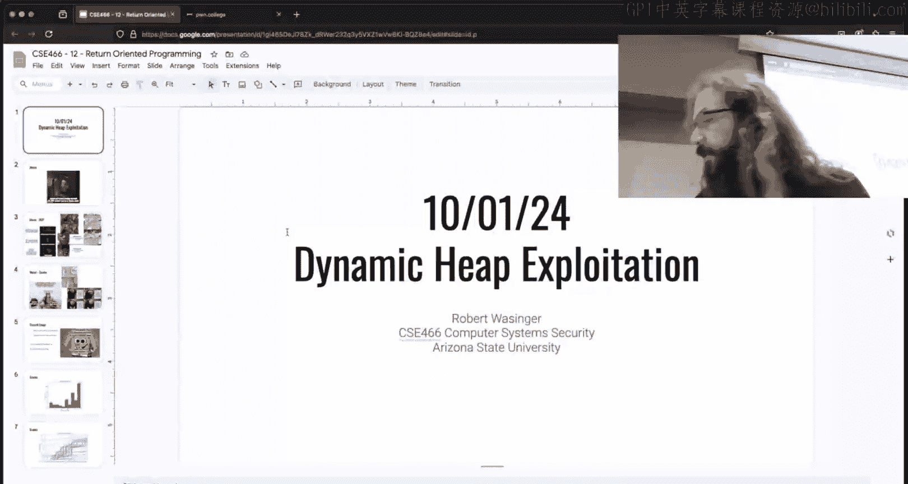

I am live， do I see myself？I do。Twitch， you may be SOL today。

 the computer that I normally use to pull up your chat。Is not。

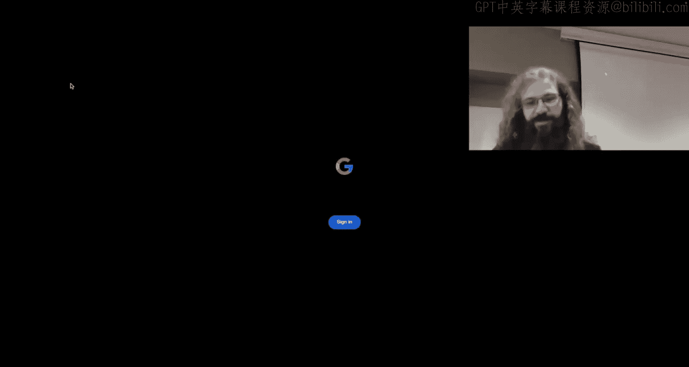

See if it's not one technical thing， it's another。Is not functioning。

 so you will get to live on my phone today。Historically。

 my phone doesn't show anything in chat whatsoever， so we'll see what happens。Okay。

 I'm pretty sure today's October 1st， 2024 in CSE 466 we are done with Rob。

 we're now talking about dynamic， I think it's entitled dynamic allocator exploitation or misuse misuse。

 so I managed to mess up two of the three words。But you know， we're going to the same place。

 it's heat exploitation， it's one of two heat modules。As always， we'll start off with beams here。

 this I don't think was any of you guys。But it's a decent decent dig or you know， on Sunday。

 which is 365's deadline day， the memes channel gets flooded with a whole bunch of nonsense and it becomes a actual like。

Task to complete meanme reviews。 So if you did post a meme and you think it was not garbage and I I didn't like it。

 I've also asked some Ts to give them them the powers to like memes If you somehow posted one and you thought it was amazing and we've skipped it。

Pining me in off topic， ping the TA， ping someone， get somebody to look at it because it could have got lost in the noise。

So we finished up rock now。Rob， I think it was a pretty good module， do you guys enjoy rap？え。Okay。

 anyone enjoy wrappper， I got one thumbs up， I got okay a couple thumbs up and mostly just kind of like yeah hour。

呃， what's that。Except staff pivoting so staff pivoting。I would blame class with the demo。

 but I think I made made made it up to you guys。 So I don't feel responsible there。

 Sta pivot is a tough thing to to demo。 and then one of the other things that occurred。

 which is on this meme like that here is someone and this happens in like every module with some subset of challenges right there's some enterprising student who's like。

 all right， it says to a stack pivot， But you know what I'm going to do instead。

 I'm gonna to find this other thing that does something completely unrelated that I'm gonna tell everyone to do that。

 And then it becomes like this， this kind of mystery thing as far as what did the students actually do。

So one of the things that I know some students were pushing and doing and encouraging and whatever。

 it's still Rob kind of is there was a jump RVP gadget and so some people were taking advantage of that。

To pull things off when the correct answer is， of course。

 to use or not even that this is what you'll commonly find。 This is everywhere， right， a leave rat。

If somehow you had pop RSP rep， obviously that's like super easy， but a lot of people did this。

 which I would argue is not even R， it's something called Jo。

 which at the beginning of the RA module I said hey。

 I might add challenges and then I just didn't because I ran out of time。😡。

One of the things that I would have added conceptually would have been drop works very similar to rock except instead of these gadgets being do something and then wreck。

where you're popping things off of the staff at determine where you go with Jo。

 you have indirected jumpcas， so you jump somewhere that then B。

 so imagine we had something that could set RBP。You could set RBP and then RE to here to then junk somewhere else to RE to go back。

😡，And so you can start incorporating way more jumps instead of refs。

 and so it becomes jump oriented programming instead of ro return oriented program。😡，Cool concept。

 I just didn't have time to hit you guys， but it was one of the things I wanted to try and add this year。

Level 13， 14， 15 were popular levels to dunk on or talk about here。😡。

Because the meaning of a stack smash。In some cases it was a good thing and in some cases you could use it or in some cases it was most cases it's a bad thing right like something exploded。

 but there are cases where you can use that fact to your advantage and so I thought these were cool challenges。

 good means if you got that far into these challenges。But at the end of the day， I think Ro。

 I said it and there's another meme that Hars back to this statement。

Rock is a pretty simple concept at face value once you've done it a few times there's a lot of ways to like blow your legs off and do things wrong right but I put the wrong gadget I didn't get the right base address。

I am trusting the help text from the challenges or there's a lot of things that okay you have to go through the pain of making the mistake and learning from the mistake。

 but ro itself is actually pretty simple， you put a bunch of gadgets on the stack and then you pop them off the stack and you go there hopefully that's how you kind of feel about Rob now that we're on the other side of it。

I don't want to say rock。So rock is not necessarily for this class although I'll try and change that。

 but but rock is like instrumental to almost all modern exploitation。

 everything turns into something and then you rock。And then something and then you rock。

Hopefully it just becomes like bog standard。Where we are right now。

 depending upon if you started it or not， it's totally fine if you haven't。

 and we have two weeks to go through this is manipulating something called the TC。

The Tcash is the like first layer of the heatap and this entire module we're not going to go any deeper than TCash if you start googling random things online and you see bins and large bins and small bins and then we fill the Tcash and we unload the Tcash and then there's like pointers and there's double pointers and we have to fix and you've gone too far All right there's a whole other module that covers how those things work。

😡，If you start going deeper down the rabbit hole， you are not approaching the intended solution and you're going。

Into a lot more complex things than what we need to for this module。

So everything in this module is related to the TC， which is this first layer of the heat。

And the TCash is a great thing to start learning about when you're thinking about how does the heat work or how does dynamic memory work because it's actually pretty dumb as far as its implementation and so depending upon if you started on it or not。

 but there are easy ways to trick the TCash and the thinking things that don't make sense。😡。

One of the things that TCash does is you call Malck。

It gives you some region of memory you're like I need I don't know， 20 bytes and Mal says， okay。

 here you go place。To find this data is the TC and if you mess up the TC。

 you can get it thinking all sorts of stupid things。For instance。

 this meanme here is I have the Tcash thinks there's two regions of memory that it can give and they're both the same thing。

In a normal operation of a heat， that shouldn't happen。

And so the decca is bind to a lot of these corruption things that you can do that will hopefully get to play around with you in a demo。

I mentioned this。Think on Thursday， this heat module has a pretty easy ramp。

As far as like the earlier challenges， so the first I think two or three videos are we talking and then I believe it' a little 16。

 there's a fourth video which has a much younger and better。With me that talks about safe linking。

And safe li is a modern protection mechanism these levels of 16 through 20 are。Almost copy and paste。

 not exactly， but。P challenges that you saw earlier I don't remember which ones so like hypothetically it would be like 1112 13。

14 right it's going to be those challenges except I'm going to copy them over and rename them with 16 through 20 and then I'm going to enable this safe linknking thing。

😡，And the reason that I did that is safe looking as a mitigation strategy will materially change how you have to approach these challenges。

 even though it's the same scenario。Your exploit will become more complicated。 And in some ways， the。

Actual mechanism that you're exploiting will in fact be different。And so this is a great being。

 somebody I saw like powered through this whole thing， which is impressive。

 I assume they are sandbagging。Like they had all of this and they just waited until it launched and bang it out。

It's been play but historically level 16 is just like a brick wall for students。

 so just know that going enjoy that just starts off pretty easy。

That's just more griping about safe linking， we aren't far enough as a class to get that one。

Disord discord usage， so one of the things I noticed about rock。

 at least with the launch of the rock modules people were working through it。

 there was a lot more active discord discussion amongst all of you you're creating threads which is awesome and you're talking about the challenges that is in fact the goal。

😡，We didn't see that earlier， I was a little bit worried about it， but I didn't know。

 I didn't bring up the step and be like，H。Pos five things because that's really laying。

 so I'm glad to see that you guys are actually using it one thing that I would try and stress is please do not create threads that are just entitled like level eight。

😡，Because that really just does not make me happy。啊。

It is better to describe the concept that you're stuck on and then one of the things that somebody on the Disc mentioned that I agree with is when you are describing your problem。

 it helps if you describe the problem statement right。

 what does the challenge give you because if I'm looking at it？

Or anyone is looking at your request for help in your description and you're just like， level eight。

 it does this。Well you've now put that workload on the helper to go find the challenge。

 like go look at their solution， go run the challenge themselves， understand what's going on。

 And at the end of the day， these are the people that solved their homework because they they know what's going on so hopefully they have better things to do with their time know maybe they're farming for extra credit but help the helpers help you and posting low low effort things like level X hey。

 this doesn't work。In't a path to success。One of the things I am doing which is like halfway done for silly technical reasons。

 I am locking all old threads this isn't specific to this class。

 I'm doing it across the entire Po College discord。

 I may not be able to delete all of them I mean I can but I don't have enough buy in to do that otherwise I would but what I can do is I can lock all of the old threads so that you don't like respond to them and someone from like six months ago who was like。

 hey， I was stuck this people will Necro post and and replied to the original author。

 the original question， oh I stuck on the same thing。

 what do you think that pings some random person from six months ago which is just rude。All right。

 I tried to。Encage people to not do that， but I've learned that。A futile effort。

 so instead I'm just going to lock everything。And I'm going to do this automated。

 I'm going to keep like things for maybe two weeks。

Two weeks from creation after that they get locked， so that way these people that do help。

Don't have to get harassed again in the future。 and you'll not know it。

 but silently unknowingly appreciate it a year from now when the next class is going through this material because then they won't be pinging you like you are pinging。

😡，The people who went through this before you。啊Yes。Help， be good。Happy smilely Sponongebob。All right。

 Twitch， I do get to see something。What if we put context next to the level number。

 like level x trying to X， Y， z？So I'm okay with the my this is my personal opinion right I'm not saying I'm going to like heart delete things that a level X like if I get annoyed to enough degree I will。

 but that's just more work for me as a mod if you provide context to it， I'm okay with it。😡。

As long as it's like。Not level three， it doesn't work right， like that isn't context。

 that doesn't add anything。So it depends on what you're doing， try and use your best judgment。

 I will probably throw some snarky comments at people who inevitably just post level X over the next week and we'll go from there。

But yeah， try and try and provide some context that is one of the problems of having just like level three is you post your problem and then somebody else who has a completely different problem just just。

 oh level three， and then they just pile on and so the thread goes， here's something。

 here's somebody resolving， here's somebody else with another problem， or they start interleaving。

It just becomes。And for like everyone involved。And so that's what I'm trying to avoid。😡。

It's not an angry thing it's just like a， hey， we can do better we aren't as bad as 365 part of that is just because of volume。

 but I saw or heard 365 had a single thread entitled like levelve 14 that had like 500 or 600 posts。

Most of which were I'm stuck me too， all right， so like we're doing better than that。

 but I believe we can still improve， right， constant constant improvement。All right， grades。

 so let's see which one is this this would be the salt distribution for rock looks pretty similar to what we had in rivers engineering except the side that was over here has like down over here。

So that's a good thing， this is a fantastic distribution as far as I'm concerned。

Does anyone disagree？Like that's a pretty happy looking and distribution for people that are solving things。

All right， solved rate， How did we solve things， One thing to keep in mind is this does start on Friday as far as the date that I get。

 So I don't I don't care if people start in the first three days。

 you could be wrapping up the prior module。So that's what are we got， two days， three days， Boo。

 What are we got， That's gonna be Monday。 We got people starting right there on Monday。

 and then people starting off in this first week。 And we， yeah， we do pretty well。

 And then if we look at the。😊，Kind of lower lower salt rates， and we look at these and change back。

They all tend to fall to locations that are people who started the module late， again。

 reinforcing that， start early。I don't know how many times we can reiterate that。

Quest is how do can some people start at 15 or 25 or like some some high number so this is one of the things。

That people routinely ask about just in Po College in general and how we deal with it as a website an ASU。

So I launched the Ro module。There is a rot module here under Bluebel， right？

And so I've only solved level1 I and I' think about Rob。嗯。People could have。

 and this is what the Euthese people did， is they solve these challenges。

Betting that I would just throw the same assignment at right if you solve it and ahead of time and I happened to assign it。

😡，You get credit。If you solved it and I don't assign it。Well。

 maybe you learn something but now you have new work to do that that's the general rule of how we kind of approach this and this is true across most of Poone College it's always up to the instructors to the instructor somebody else teaches it they can make up whatever rules they want right so like what I say doesn't bind any other instructor but as a general rule of thumb that is what we've kind of agreed upon in the core Pone College classes。

As far as how we handle this scenario， so for instance。

 right now you were assigned dynamic allocator misuseef。I can tell you right now。

 it's the exact same thing。But this has more。Doesn't。老是啥。I don't think it does。

Everyone else doesn't think it does。So it depends on what I do and it's my choice running the course like do I want to include some of them。

 do I want to include all of them， do I want to include none of them to give you new challenges。

 it's whatever I decide that's why I have this concept of launching the challenge on Fridays like from this point going forward it'll always be a Friday that is when you know what is being assigned to you as a student in the class。

😡，There are people who will work ahead， and I will not tell you like what I'm doing。

 I know what I'm doing。😡，But you have no guarantee。So a good example of this is in 365。They did。

They launched a crypto module。This crypto module has 31 challenges。关海。

I want to say the entire back 15 are brand new， they just added them to it。So。

 so if somebody had solved all of their crypto stuff that was on the orange valve。

 anything that they reused， they got credit， so they started off at the beginning of the module assignment。

 the stuff completed。But they still have to complete the new stuff that's assigned。Any yes。

These a new triplelet are same in the class。So that is up to the instructor and like how they decided to add the material。

 the answer more than likely here is yes， and if we look here for cryptography。

 so this will include everything。You see where the solve cutoff drops？呃，哎。We have 3000， almost 3000。

 about 3049 because this。And this， I think is is still past months this all time？If we go all time。

 it'll even be more brutal， oh no， that's not going to change this。

But you can see where they added the new challenges。

And so we talked to them as。Challenge creators we can do either so one of the things I said on this point with yellow Belt green Bel is like the stuff that I'm doing here in the class is going to reflect on the belts。

I was talking to somebody about whether I'm going to do that dynamically。

 I'm just going to wait until the end of the semester and then shift everything around at the end of this course。

😡，It just it makes the most sense because there's other things that need to line up。

 so we'll just have one big shift at the end of the semester here as far as what changes on the belt aside from these type of things where they're expanding on content that already sit somewhere。

Nothing， nothing else from Twitch， okay。Yes，你 someone。Where am I？We're looking here。

Is there a straight line？Oh yeah， that's a that's a sandbagger so one of the things that one can do and so we could easily see who this is is if you are aware of how do you know how our scrubboard works？

On the， on the site。So one of the things， boom， we're here in software exploitation， we go to。

 I don't want to be there， I want to be in 494。re 466， my bad，466。

And then we go to dynamic allocator misuse。

We go down here， the default scoreboard is for the month， it's not as bold as it could be。

 but by default， it solves within the month and when we launch it from a class。

 it's only solves after that launching。So what happened here？Like you still get credit for the grade。

 but as far as the scoreboard， if this person， which is literally this person。

 if Z function here worked ahead， but they really wanted to be a rank one on the scoreboard。

 the optimal game theory play would be to solve everything， submit zero flags。

 bet that I'm going to do the same thing。So then when it launches。

 they have all of the flags and it's after it launched and so they already have all the flags and so literally all they did was they copied the flags that they already had from the solves on one day。

 hence the straight line。2一。It's part of the reason why one of the things I really like about when I took home college is the fact the instructor would like make a big deal about the scoreboards and the ranks。

I wish I could， but because I know students will gamify the way that we do things。I don't， because。

This doesn't mean that Z function was like the fastest at solving this stuff。I mean。

 they could have spent the past year working on this module。

 then they just saved all the flags for this moment。Well。

 that doesn't that doesn't mean anything to me， right， All right， it's cool。 There rank one here。

 Now， if I have a module that is all new。Or I extremely heavily modify so it's impossible for someone to do that then I'll make a big deal about the rank all bust outs of like Po College challenge coins and I'll be like the top five people to solve everything we'll get one of these like well we'll have some fun with it But as long as I know。

Which I've always known， and you just happen to identify this line right here。

 people can game the system。I don't think that's a fair competition for those that are waiting for stuff to launch。

Great question though。didn't realize until this week that F hoarding meta was applicable to Po College with respect to challenge coins。

诶。So。We don't have a hard rule on challenge cards， but I'll say that I try and be very fair about how I do things。

 I may be harsh， but I try and be fair and so to me I'm not going to reward someone for doing that。

My personal take。coolol， if you're the first one right on， here you go right。

 but it's got to be something fresh so that everyone who's competing on fairground right that's kind of the way I see it are pretty close to fairground。

Otherwise， I am actively encouraging this type of behavior。Which I don't I。

It's known to happen in more games and CTs， but it certainly isn't what I want to try and encourage。

 right？Because I really enjoy the spirit of competition。

It's one of the things that made me work really hard on this course and right now we have that to a degree。

I was rank one and everything night。So where are we right now？This is course grade again。

 excluding extra credit right at this point it's a meme that the extra credit will get。So Tim。

 of course grade， I didn't calculate the average， but I don't think the average is going to be a horrible grade if someone wants to math it from that slide to have at it。

啊。This is pre extra credit， so I imagine the course average has to be just looking at that graph。85。

 okay， like a high B。And then you're throw an extra credit like， we're cruising。All right。

 dynamic allocator misuse is what we launched on Friday。

 it is running for two weeks checkpoints on Monday to do the following Monday after that hopefully this pattern now exists。

 we have a nice pattern and schedule of this stuff。Logistical things。Fall break。

 so I'm saying this now and I'll probably say this again but fall break is the 12th to the 15。

 This does overlap with the tail end of dynamic allocator misuse to do that weekend so if you have big plans for fall break please plan accordingly it's also overlap with the launch of program exploitation because it's going to launch that Friday before they're still going to launch as schedule Yes。

 that means I'm that means either to signing you stuff over fall break。I'm sorry。

 I try not to do that if you look at prior courses。😔。

The content that we want to try and cover here necessitated it。

 the nice thing here is it's not like in the middle of it。Just don't procrastinate on the heat one。

Demo plans。So does anyone have anything from rock that was just like， oh my God。

 we need to clear this up。No， all right， take off what。All right， drop was the easy module。

 You can easily do it in a week。 I think rap is easier than he。 I know some people。

Probably Z function， right you just sandbag， getting nu just wants to troll you guys and say everything's easy。

Some people are expressing that they think heat is easier。

The reason that I say rock is easier is because you're reapplying these same concepts you already have right we're doing something of a buffer overflow。

 we're doing something like memory correction， we're messing around with that return address。

 it's stuff you've already done。Now he exploitation is still memory corruption。

 it's still memory corruption of pointers but what these pointers are and how they relate to each other is going to be very different than what you've done so far and so that is why I say heap is harder that's just there's a lot more newer concepts that you have to pick up in order to work with the material。

😡，Rock 10， Ro 10 was like a two gadget level， wasn't it？I don't know， I'm doing it for memory。

 I don't know the levels。All right， how many people here have like looked？The heat videos。All right。

 we got a minority。That's， that's fair， like it's。It's first class， so let's see what we got here。

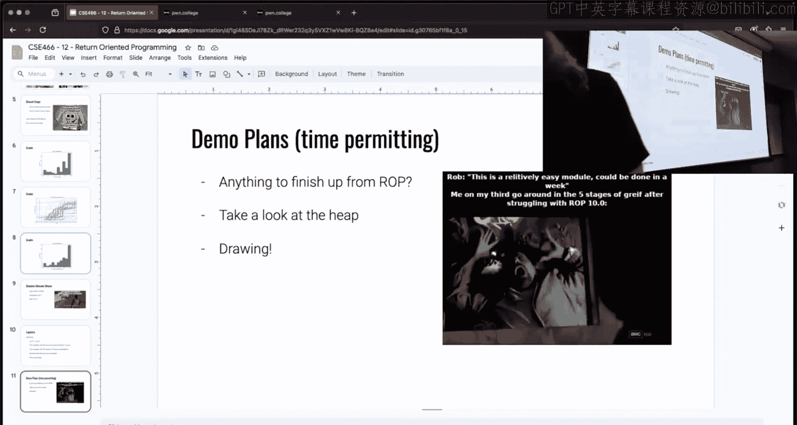

So some of this for those watching， what do I got here， Rob was， best Rob， ro， rap， ro。

Okay。对来。Miss something。That I just。Talk about rap too much， I like rap。Rob ro。I didn't realize。

 Senator。I was being graced with the Adam Dupin。All right， so we're going to launch here level one。

Of the the assignment， I didn't have time to throw together a play binary and honestly。

 the challenge binaries do a great job。Of showing you。

Kind of debug information to think about how the heap works。Let's look at Tcash stuff， yeah。

 we're getting there。Karing E3340， okay， yeah， Adam， Adam's a pretty cool guy。All right。

 so if I run this challenge。And this is pretty common to like heat exploitation binaries or challenges in general。

 you're provided some type of menu of action。Does everyone know what Malik is？I got a headwig。

 All right， who does know what Malick does？Wants to say。People the yes。I love it， so。

You ask the reason why。Okay， so the statement was that it allocates memory。

Well what is allocating memory？It gives me a pointer to some blob of memory。

 why would I need that when I have the stack？It preserves some。是别说的。发这。

So it lets me play with large amount of memory， but I could make a really large region of memory on the stack。

 couldn't I？Like there's nothing stopping me from just like having the world's biggest function frame。

 it's just like one gigabyte in size， I mean， maybe something stopping maybe in theory。

With the term dynamic， keep nobodys dynamic。T is a。え？Okay， so the stack changes at runtime。

 the stack is for local variables， and so when that function returns， I lose that space。

We're going to try the drawing right now。All right， this is where。It all goes off the rails。

嗯。Does technology work？Yes。All right， I had to wait for the twitchw delay， okay。If， if I have。

That's text。Here we go if I have my stack。It's some region of memory like this。

 it's going to grow down， this is where Maine is， Maine's going to call challenge。

There's a function frame here， I could have some variable here。Inside of challenge。

RightBut when challenge returns， I lose access to this variable because the stack frame returns。

 this now goes away and I can't rely on that value that you would start on the stack So if there's some value that I need to be long live。

 I need it to persist across many function frames， there's two things that I can do Yes。

 so one of the comments here from Twitch is it's better if it's supposed to last longer and will last across functions there's two things that I could do and this is like a general programming idea here that if I had something that was long live I either declare it way up here because there's nothing that stops me from having a variable up in main and then challenge which can call funk1。

 which can then call funk 2 all the way down here in funk2。

 I can still reference that variable that's up in main。

I'd have to like pass a reference down into it and make sure that Fk2 has that address。

 but I could do that， right？However， that would be pretty lame。

So if I need to get a region of memory and I don't know how big it is。This is something dynamic。

 the stack is static， I have to know at compile time， how big is a function frame going to be？

And this is where the he or dynamic memory comes into play。The way that。

The heap works is there is and we're only going to talk about TC。

There's some blob of memory called the heap。Id pull it up in GDP。

 but the way I'm doing this now makes hopping kind of lame。Then I had my stack。

NowWhen I call Malik right in my code section here。Something is going to call mallet。

And it's going to say I want something that's。I don't know，20。X 20。That's our beautiful X2 am。

It's going to call malikx 20， and it's going to store it somewhere。

 We're going to store it on the stack。 So a equals Malikx 20。

 What happens is some region of memory inside of the heap that is hex 20 in size is returned。

And we get that as a。 so then a equals Ox， I'm going to call it heap。

 right at some pointer into the Hs region of memory。That's what Malik does。

Any questions about Malick？Okay， free is the reverse operation。Free says a。

 I'm done with this pointer， right， There is this block of memory， and I was using it， right。

 I said a equals Rob。 We put Rob over here。 then when we call our code。Calls free。

And we call free on A。We are telling the heat I am done with this region of memory that is a。

 and I will never access this memory address again。😡，That lets the heap know。

In its internal tracking of state。This is all now something that we can work with again。

This is like a super high level reasoning about it。

But that's the purpose of dynamic memory or the heap。

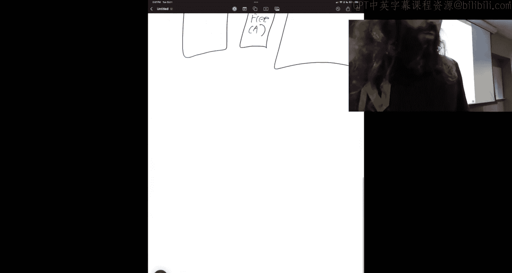

Now。When I called free here。I said that I'm telling the heap。

 you don't get to see it now I'm telling the heap that I'm never going to use this a variable again。

😡。

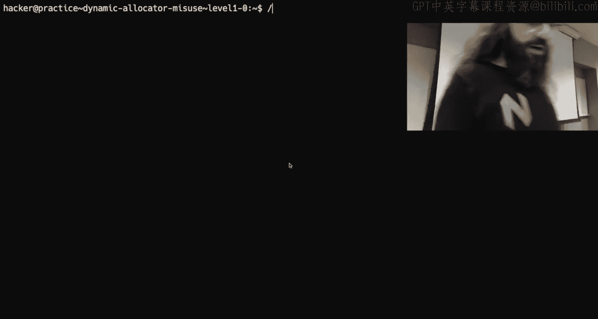

Does that mean that I have to？Yeah， so so。

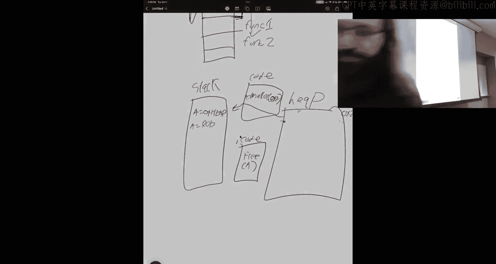

In this challenge。I can mallik， I can free， I can put， I can read the flag， I can quit。If I'm Malik。

It says， how big do you want to mall？In my demo or my scribble here， I was mallikating hex 20。

 so that's 32 bytes， let's do that。Okay， the value of ballot。

Its now stored in this array of allocations， allocation zero has this address。

 this is a pointer into that heap region of memory。😡，I mean， what happens？If I。Free。

 we've now freed that point and the challenge is going to print out the state of this Tc and this is the thing that we're going to be working with this entire time through this entire module。

Because。I said that we can mallic and we can free， and it's great to say I free and I just tell the he。

 hey， I'm never going to use this again。But imagine that I am mallacing many things and then I'm arbitrarily freeing things。

 that he has to keep track of all of these and the way that it does it in the TCash is with a simple linked list。

 a singly linked list， we of data structures， we know what a linked list is。😡。

Kind of sort of hand waving， All right。Yeah。This is a cash in the literal sense。So this is a B。

That is a list of things that have been freed that are of the size 25 bytes to 40 bytes。

 there's a series of buckets， they call them bins but。

It's not get that confused So when I ballot and free something of size 32。

 there is a bid for things of size 25 to 40。The Tc is how we're tracking all of these things that we free。

 And so I mailed something I said I'm done with it。 the Tc says all right， cool。

 here's this thing that I got， it's in this size range。And the next thing。Is no。

So if I ask for something。Of 32 bytes again。The T cashash is a cash layer。

 it's an performance optimization， it's going to look at this list and be like。

 do I already have something that meets that need？So if I mallik free and then mallik again。

 we see that I get back the exact same pointer。I mall lookeded it。 it gave it to me。 I freed it。

 It was like， cool， we're going to store it in this list in case you ask for it again。

 And then when I asked for it again， it gave me back the exact same region of memory。

This is what the TCash does。Now I said it's a singly linked list。This is not going。

 This level won't let me do what I want to do。Let me go to a later level。や。Okay。

 so this one is same idea I have Malic three puts3。

 but it lets me perform multiple malic so I can hang on to multiple pointers。So in index zero。

I want something in size 32 in index one。I don't want something of size 32。In index2。

 I want something of size 32。 so now I've asked and received three different pointers。

I'm now going to free all three of them。So we're going to free。And let's do it backwards， two。

 we're going to free one， we're going to free zero。

Now this Tc now looks a little bit different there's why I had to choose this challenge or a later challenge because this allows us to build this and I said that the help text is actually pretty solid at。

😡，Showing us what's going on here。So the TCAS is a singly linked list， so there's a head of the list。

 which is going to be this location right here。This is the last thing that I free。

 I freed index zero， and if we go back up here。7，2， C zero。

Which is what I free in here is at the head of the list， a singularly linked list works like a stack。

 what is that last in first out？So the last thing I put in is the first thing that's going to come out。

Now， a singular linked list means that we have a single next pointer。If we look through this thing。

 this has some metadata， which if you watch some videos， y'all' cover a little bit。

The size is the size of the trunk when I was drawing something。

 we just call it like this blob of memory。Well， there's two terms that。

Matter when we're talking about that heat， there's the allocation size， which in this case was 32。

 which would have been he。20。The size of this is actually hex 30， this one is a lie。

This is the size of the chunk。The allocation is what users are supposed to interact with I asked her 20 he 20 bytes。

 I can pretend that I have 20 bytes from this pointer to mess around with。

The extra bys in the size of the allocation。Is used to store metadata and for the he to use to think about and organize how things work。

That's why this size doesn't match what I asked for up above， I asked for hex 20。

 it actually created chunks sub size hex 30。But from the user of the heat。

 I still only have H 20 bytes to play。So when we freed this。

One of the things that happens is there is a next pointer is a single linked list。

 the next pointer points to the next thing， the next，Free trunk of that size。

 And So we see here the next pointer points to 1，7，2 F 0。And if we look right here。

 that is the next Trump that would be。Used to satisfy an allocation and we go from this location。

The next pointer is 1，7，3，2，0， which then points to the third allocation。

 The next pointer of the last thing。Is no indicating the end of the list。

Now there's a couple other values here， there's this previous size and there's size。

This is other metadata that is used by the heap。To verify what's going on。Now this printout。

From the challenge is helpful and useful。It helps us understand what these values are。

 but I don't know that it does a good job of visualizing these chunks and regions of memory。

 so I'm going to draw these trunks， this is why drawing is awesome and then we will take a look at how we can look at these with GDP to kind of look at these values and see where they actually exist in memory。

😡，Are people following along， is it boring， are we kind of so so we're seeing where it's going。

 unsure， All right。Quiet crowd today， man。 Qui crowd。

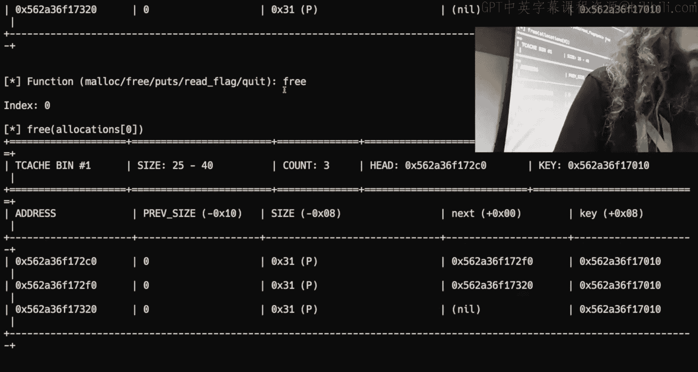

All right， we'll go back。To pictures。Nice。Now this is what's lame about this implementation。

Is I can't。Get the literal addresses that I just showed you。

 I can't like jump rapidly back and forth。But what I did。If we were who。

Try and do this Our order of operations was Malik， Malik。Maik。Free。Free。3。Okay。

 and this was all the same size。 What it I go with 32，32，32。

 It's important that they're the same size。 If they're different sizes。

 they're going to get stored in different bins on the T cash。Question。

But the seller are in the same range of the。Okay， the question for Twitch was as long as they're in the same range and that's a more accurate statement。

 yes， so with the binge there was that size range， it wouldn't literally need to be 32。

 but I would encourage you just for your own sanity been the same。If they're in the same range。

 what happens is like if I were to say I wanted to allocate 31。

It's going to round up and it's going you're going to get the same chunk backing it。

But from a user's perspective。😡，I only the contract between Malck and the program is I can only use what I request。

 it would be really weird to request 31 bytes generally speaking we do things as multiples weight。

But you could。My question was， if I mal， mall that do。

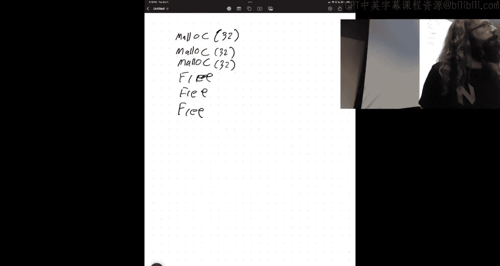

Yeah， okay， so if I malled 32 and then I'm malled。31。嗯。And then I'm all26。Once you free them， yes。

 yeah， the， the important thing to keep in mind there is that they go into。

Maachking gives the program a pointer。I'm just going to use A。

 B and C for these addresses representing whatever it is I got here， here。

 and here instead of writing literal values。Yes， but your statement， you're correct。

 they'd go in the same T cashash bin when they are free。

So I mallic A， B and C， I then free， let's do ABC。Okay。So。

These initial mallics just come from the heat， there's nothing in the Tc。

 we're going to assume nothing happened。What happens when I free a？There's something over here。

 it's called the TC。The T cash。It a list of head pointers right， So this is the head for。

 we'll say size Hex 20 or Xx 10。 willll have a head pointer for Hex 20。

 We'll have a head pointer for。X 30。When I when I free a。I'm saying I'm done with this allocation。

That was of size 32。So we're giving it back to the heap， the heap says， all right。

 this is small enough， it fits in this size right here。So head pointer now points to A。

And we'll make a look like this。 this is a because A is an allocation。Now。When we had that print out。

Bye。Can I zoom into this， yes， I can。When I had that print out from the challenge。

It had this previous size and size and all this nonsense going on as well these exist in memory。

And so。A better way of thinking about this。I a points to this spot right here。

Kind of in the middle or a little bit after the beginning of the chart。😡，And what we have here is。

Prive size。Size。Next， and then this， this spot， this remaining space here is just。Unused space。

 So when we free something。The heap is going to write these values into that memory。

That we free to track its internal state。What should this next pointer be， yes？0。

The question was what is 0 x 102030， so I'm using this as a representation of the bin size。

If we were to look at the challenge， I was asking for allocations of size 32。This。Bim。

Is for things of size 25 to 40 bytes。 The chunk size is hex 30。

 So that those are the different head pointers， so。We run the same challenge here。

Let's say I Malik into index  zero， something of size 32， I Malik in the index1。

 something of size 32， I Malik into index 2， something of size 64， I then free zero， I free one。

 I free two。What we see here in our printout。Is these are not all pointing to each other。😡。

There is bin T cashash， bin one。

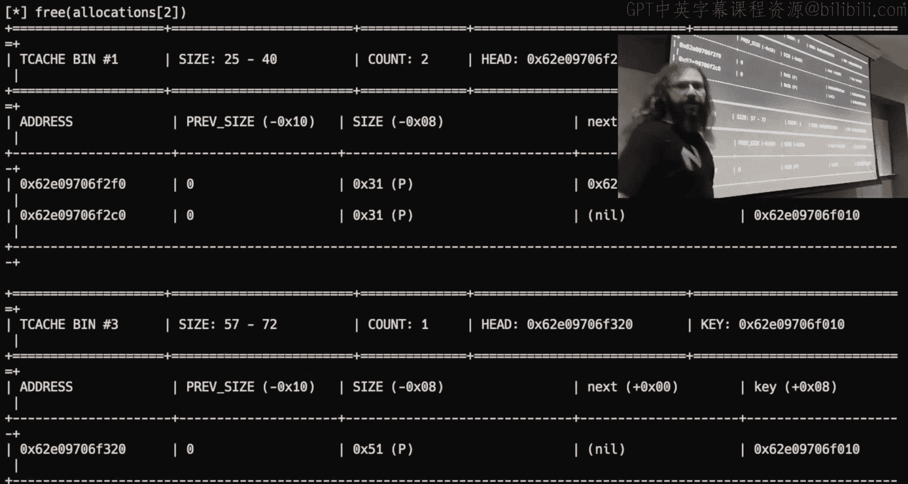

Which is this list right here。

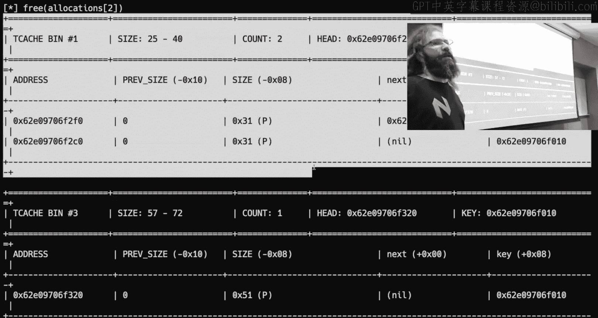

And it has the two or two chunks of size hex 30。Where the last one is no， right？Now。

 when I freed the 64。啊。64 by allocation that was too big， it was outside of this range。

 so that's going to go in a different list。And so here， when I say head or hex 30 head。

 it's literally this head pointer。There's a pointer to where is the first thing of the list。

Which is this right here， this is my 64 byte allocation， which would be hex 40。

 but we see the actual chunk size is hex 51。Because the chunk size will be larger than the allocation。

It's not always plus 10， but we can kind of hand waveve that for the time being。

So there are different lists。And so what I'm trying to。Demonstrate with my artistic skills here。

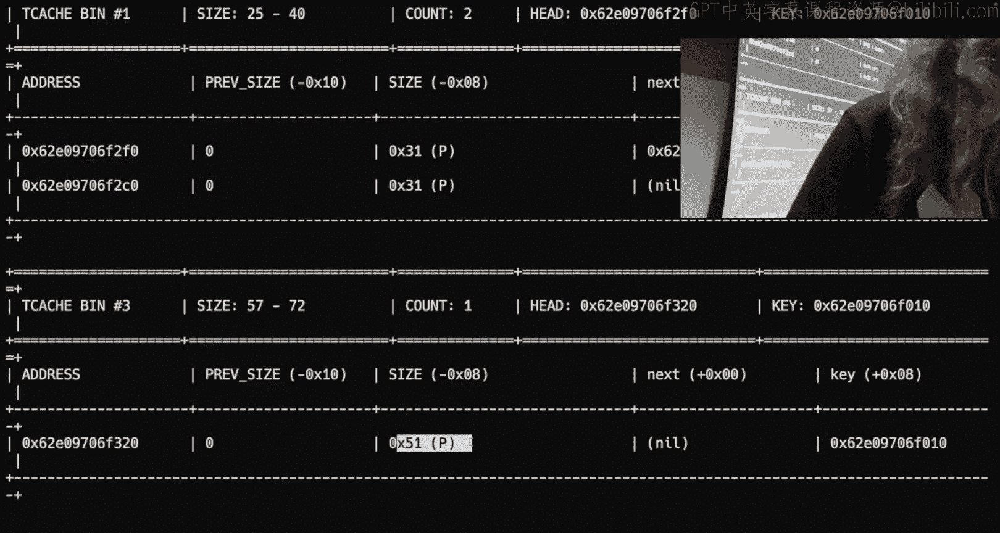

Is that there are multiple headlists。RightOne of them can point to null。

 This one can be null because the only thing I did so far is I freed one thing。 I freed a。

Whi was something of size 32， there's an allocation of size 32。

 which will end up with a hex 30 chunk， so when I free something that was 32 bytes。

 it's going to actually be a hex 30 size chunk， the head pointer will point to where it is。

What happens only free B， what happens to my drawing here？This is a singularly linked list。

It functions like a stack。I don't know， do I not have the a bit like do not gosh， dang at Apple。

 okay， so the statement was that something points to be， what points to be？

You think this points to be？就。It doesn't because it works like a stack so think about if this was really。

 really， really long， right， there is a limit to this。

 but there there's many nodes then every when I freeze something， I have to traverse this whole list。

And this sounds like whatever you're dereencing a pointer， right， and it can't be that much work。

But the heap is accessed all the time in large programs， we're constantly getting dynamic memory。

 we're constantly freeing stuff， so we actually care quite a bit about performance and so it doesn't make sense to traverse this whole list every time that you do it。

😡，Instead， we push it。To the front of the list。And so this becomes B， and then B's next。

Is going to point to a。And it'll have a pre size， a size， and then a next。

And this next will point to nothing， it's null。Anyone want to guess what happens when I free scene？是。

Great， C gets pushed onto the head。The rest of this shifts on now。So then we have a C。

So I have a pre size？Size。A'm nexted。This next is going to point up to B。

This thing now points down to C。 And so this is my seedly linked list。 There's one pointer。

 goes the next thing， goes to the next thing， goes to the next thing。

That is the tea cash in a nutshell。Like normal operation。 So from right here。

 what happens if I'm malling something of size 32？😡，How does that operation work。

 it's going to look at the says hey， I need a chunk of size x 30。We go to the head。

We grab whatever the first thing is that's there， which is C。This guy is su you。All right， we grab C。

 we pass C to the program， and then we just fix this pointer to point up to B。

There's not really too many moving parts。In normal operation， right this。

This guy gets returned to the user。M it。I have heart to him。' it's why I studied computer。

 I didn't tell you I can't， I can't draw， right。O。So this is like the normal operation of this thing。

The B next point is point to a。Yes。It would point to right here。we wanted to be perfect。

So one of the things that you'll notice I did with these next pointers is I'm not pointing to the beginning of the chunk。

 I'm pointing to the beginning of the allocation。😡，This is something that I'm probably going to。

Get pedantic about on the。On the discord there' people of appear like， oh。

 it's a chunk allocate like there's a difference。 The chunk is the region of memory that the heat is entirely using。

 The allocation is the region of memory that is returnable or writeritable to the user。

Now in this drawing， I just kind of said to hey， these regions of memory are like these floating blobs of memory。

 right， there's just this A and there's this B and there's this C and it' it's just there。😡。

But if we go back up to my drawing， my first one where I had this。Bloob。

These could actually be right next to each other。In memory。So if they're contiguous， like they're。

 I'm going to call it physical， I don't have a good， good term here。

 their physical proximity to each other。Is distinctly different than their relationship on this list of stuff。

But one of the things we saw in the memory corruption module and again in Bra。

 is the concept of memory corruption。If things are contiguously next to each other。

Like if I were to write a， we said， we know here a is hex 30 in size。

What happens if I'd read in at some point or to egg and I'd read in？90 bys。

I would overflow this region of A， I'd start messing up B， I'd keep going。

 I'd overflow and mess up C， and so there's when you're thinking about these chunks。

 there's two things that you have to be aware of。And these allocations。

 what is their physical proximity to each other in memory？

This has to do with the literal pointers that are being returned。 Where are they next to each other。

 How far apart are they， And the second thing is the relationship of the metadata between them。

And this module is going to take advantage of these two。Components in different ways。

So the very first level。We'll circle back to。My my initial question。

Which was when I mallik and free something， I'm telling the heap I'm not going to use this pointer anymore。

I Mal something。I free something。It's in the Tc。All right， I puts。There's nothing there。

What does Reed flag do。So read flag。I's going to， this is a hellwell， it malets。741 bytes。

It returns the pointer and then it reads the flag into it。ButA I going to get the flag now？Now。

So we're。How do these things relate to each other？Well， free doesn't know that pointer。When I say。

Free a。I'm telling the heap I'm done with it。It doesn't mean that I've set a to be zero。

it's a very like common mistake in。Language is where you have to manage memory or manage dynamic memory。

Is you fail to null a pointer。Then if this a value is still pointing to that allocation。

 I could use it later。😡，So I could use。Maek， something of 32。I'll free it。 And I'm going to call。

That puts command。What does this is a bit messy？ち。Where is my puts？Read， puts。Oh wait。

 the challenge actually is show that for us already， so I don't have to， and would be amazing。

It does， so。When I run put I see this， it is going to call puts， which the equivalent of like print。

😡，On the pointer to the allocation， now this challenge doesn't let me read anything into the allocation。

😡。

The question is。Does the challenge knowll？That pointer。

It frees it。ButDoes that pointer still exist？Go down on this。And Ida。O。We see if I pass in free。

 it we'll call free on the pointer。It does not set this pointer equal to zero。

So this is a scenario where they didn't null out that point。This is a known type of vulnerability。

Because this pointer is referenced。In other locations， right so I could mall something， free it。

 and then print it after it's free。This is aptly called use after free。

Because when we ranm free on this point or we told the heap。

 you can use this memory for something else。I'm not going to use it again。😡。

And then it's my job as the user space program。To make sure that I don't use it after I told to he that。

But clearly， it's possible to do that here。Anyone have any ideas on how to solve this or how to take advantage of this。

 what do we got？Once it be in， it one doesn't。we saw that。あ？This one to the very。

Some some bites。いしが。等在。Eele your。Okay， so when I ran Re flag。

The challenge tells me it's going to mall something。

And then it tells me the address of it and it reads the flagging。

To point to point the flag towards the ballot。But it's not going to the mallignated。

 this is the malignated。Yeah， but I did for it， that's why it's here。し？Arrange this with right。

So it needs to be in the same branch。All rightAnd so I'm now looking 32。

 so this goes back to those ranges in the bin size。Here this。

T cash bin is for stings of size 25 to 40。When I do Re flag。Which size does it matter？

741 is that going to pull from this T cash list， no， this is for small things。

So how can I get around this？What do I got to do？咯拿。Maik。741。And then I replay。Not that puts。啊。

But like what's going on， okay， I now it' 741。Well。

 why do I need to free it Well what is my goal here， what am I doing？

We need to make the rate flag use the free。I need to make。Read flag， use that pointer。

 so I need to get that pointer into the Tc so that way when Read flagag asks for something of 741。

It's going to pull it from the tea cash because it's already there。

 So it's free so that I freed my 741。Size there， and now I push this point to the Tc。Or not yeah。

 whatever， I pushed it onto that stack on that singly linked list， it's at the head of a tea cap。

So now if I call a read flag。It's gone， right， T has bin 45 had that。

A that big old boy that I freed。

And then when read flag mallet。It pulled it from the Tc because there's already something there that satisfied what Reed Fllegg was asking for。

And this has a use after free， so we took a look here in item up when it's free。

 we don't know out this pointer， so that means when I puts。

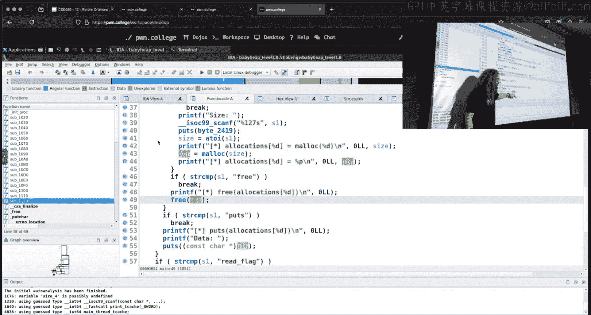

It's going to put on that same pointer， that same memory address。That。啊。Reed flagag was used。

So Reed Flag had a pointer to that location on the heap。

And then I had one from when I got that memory address from the Heap as well。

 which is why I could put that location because I am using that pointer within the program after it was freed。

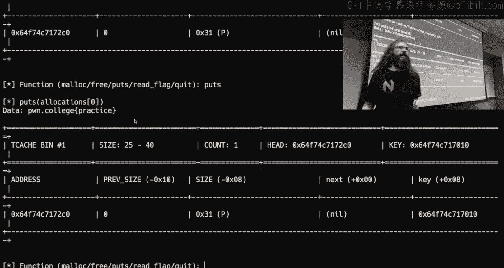

And so I told the he I'm never going to use it again so the heap was like， all right， cool。

 somebody else needs it， I'm going to give it to them。😡，Give it to that function。

But then I do use it afterwards， which is where that security like concern is。It's unusual。

 I'm actually solving a challenge for you guys， but you know， it's level one， right？

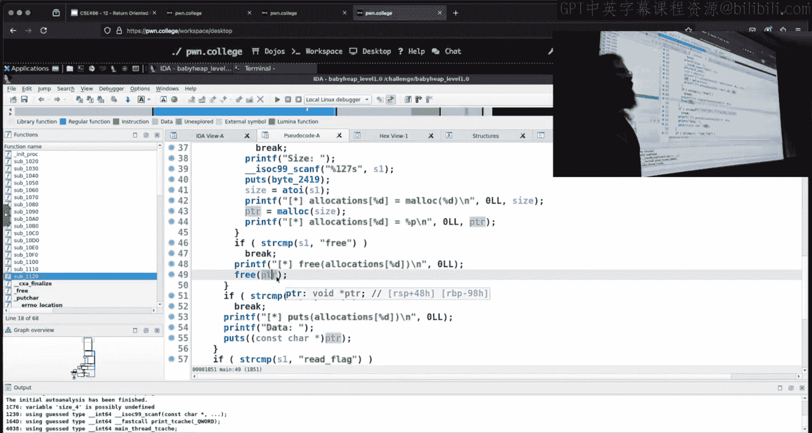

I think that's fair。So let's take a quick look at my GDP in。And Tw is quiet。 Do I have Jeff？I do。

So I'm going to run the old challenge here。We're going to mallic， actually， I want to do something。

Something that lets me have multiple allocations， so we'll do three， I'm not going to solve three。

 we're just going to use it as our stand in here for debugging。Okay， Ialic into index 0。

 something of size 32， Ialic into index 1， something of size 32， I'malic into index 2。

 something of size 64。 well Malik into index3。 Apparently， I want 54 size 32。

 I'm going into free in the same order。 So we'll free 0。 We'll free 1 willll free。Two。

 I think I had a three。 Yes， I did。Okay， so now I'm in GDP。

last thing I said I wanted to show was how to like look at the heat。

 and this is where things might explode it last five minutes， so it's part of the course。

 if you have Jeff In，There's two commands that are very useful。There's he bins。

Which is showing me that same type of data is what the challenge help is。

The challenge help if we go up here has this nice， pretty table of。

Where's the head pointer to this thing， where's the next pointer， here's the next thing。

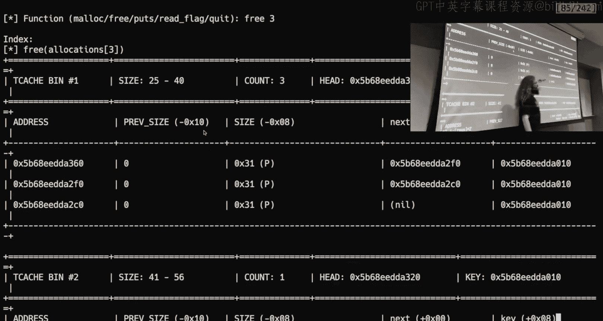

If we look at what Jeff is showing us， it's a bit more compressed。

 but we see that there's the TCash bin size of he 30， there's three things in it。

Despite the arrows pointing from right to left， we actually read it from left to right。

 I don't know why。So this is the first allocation that'll be returned。

It also tells us some metadata here about。Some of be flags on the trunk that we aren't going to touch on today。

 here's our second trunk。And then here is our third chart。

Now I did another allocation of a different size so we see here is the TCash list for size hex 40 there's only one thing because that was I wanted 64 I actually type 54 we get Hx 40 right so it gave us a 64 64 byte chunk because I asked for something that was slightly smaller than that goes back to that weird number thing right 54 roundup we end up with a 64 byte chunk。

And there's only one thing here。Do we see how those two relate to each other we're showing the same information One is just from the debugger。

 the other one's the help text obviously the well not obviously， but the  point。

 zeros will have this nice pretty printout stuff the point ones will not so that means that you will need to do some reversing or you will need to utilize GDP to reason about what's going on The other thing that you can get with Jeff。

This showed me what is going on like with the metadata now there's other things in the heatap here。

 these other bins。We do not have to concern ourselvesse with these things for this module。

If you're interested， go check it out， but that's not what we're doing this week。

The other thing that you want are interested in when you're talking about dynamic memory， I said。

 is where are these trunks located next to each other。 It's great。 This trunk is at D 360。

 This next one is at。DA2 F0。Okay， so this first one is somewhere ahead of the second one。

Just because the addresses are bigger than each other。

 we can look at these addresses and do some math and figure out where they are and okay。

 maybe that's great， but if you're more of a visual person，You can do heat chunks。

 P debug has similar functionality， which I'll probably show on Thursday。

 P debug has a very good chunk visualization where it like draws ASI things。And it's it's more artsy。

 but this is showing me where are these trunks continuouslytiguous in memory。

 what is the order of these trunks？😡，So the first chunk is at D010。

 the next chunk is at D 2 a0 that I have D2 C0 right This is the order that I allocate。

 these are the chunks in contiguous memory， these are all going to be in order and so this gives me an idea of what chunks are next to each other。

 So if I wanted to， for instance， do a buffer overflow where you think about doing it on the stack。😡。

Overflows exist on the heatap， I just have to pay attention to what trunk can I access。

 what pointer which one of these。Cht。Do I have a point or two？

What if it's this one and I can read in， I don't know， x 60 bytes。All this。Trunk is up sizeize X 30。

 which means there's 20 bytes from the pointer as we are subtracting 10。

So a first hex 20 bytes would fill this allocation。

 and then whatever I wrote after that is going to start overflowing into this trunk here。😡。

That's what I have for time。Well， hopefully that's enough to get you started。Watch some videos。

I do think the videos are useful， the challenges are pretty good at。Giving you demo demo help。

 so play around with it。

And we will go from there Thursday， I will have a actual demo binary instead of a challenge。

 which is just going to be very similar with a menu of Maic and free and we're just going to mess around with all sorts of weird scenarios。

All right， nothing from Twitch。 All right， I'll leave you。 goodbye and good luck。

