# ASU《计算机系统安全｜ASU CSE466 Computer Systems Security 2024》中英字幕deepseek p15 -16-Dynamic Allocator Misuse - CSE466 - Robert - 2024.10.08.zh_en -BV1spCGYZE9D_p15-

Give it a moment over here for Twitch。Twitch， if you are there， I have no camera today。

Hopefully I didn't break the audio as well。If you could let me know if you can hear me。

 that'd be fantastic。😊，Although once you just start the stream， nobody is there， shut。Bingbing boom。

Allright。I'm going to assume they can hear me。 So today is the 8 of October。 we're halfway through。

 I got it right this time。 dynamic allocator misuse here in C E 4，6，6。 I actually still had it wrong。

 I just had a few minutes to fix it right before the stream。Memes。

 so one of the things that people hopefully realized is they kind of move through the first half of the assigned content。

Or the module was just because the challenge like asks for a secret。

 it doesn't necessarily mean that you need to get the secret。

 you have to think about not what the challenge is necessarily asking you for。

 but what is the implemented details of what is the challenge doing one of the examples here and I don't know what level it is。

 it asks you for the secret， but based upon kind of the primitives and things that you have。😡。

It's not easy to leak out the full secret value。There is an easier approach where instead of using the heap to generate a pointer and read something or leak something。

 you could use the heap to generate a pointer。😡，Hello from Sierra Leone。

 that is a far ways away from here。U。You could use that pointer to for instance。

 overwrite the secret value at which point the implementation of the comparison is just checking to memory addresses。

 So you know what it is， despite the fact that you didn't leak it because you overwrote it。

 Hopefully that was a solution that many people ran into。

 It's not the only way to solve that particular challenge。 definitely a good meme。

 I came up a lot in office hours and recitations that I showed up to。😡。

Other memes here， general success strategies。Asking on the Discord seems to be helpful。

 I'm speaking less， but you all seem to be chattering a decent amount。

 so I'll let you help each other so then you can get extra credit because if I respond。

 then you don't get the opportunity to earn the extra credit。😡。

And then some people are asking about safe link， but that was far enough out that I was just like。

 whatever， I'll wait on that。For understanding the heap， based upon last week， we saw GDP is useful。

 you can get the equivalent of the kind of help text challenge printnoouts。Now。

 when it comes to working on the heat， there's kind of。Couple strategies。

 you can spend some time thinking about how this stuff works or you could just like you know do the 10。

000 monkeys pounding 10，000 typewriters and maybe Shakespeare comes out the other end strategy which some people certainly do and if you solve the challenge that way。

 there's not much I can do to stop you from doing that however。

 the meme is correct in the long gra it will bite you because you need to be a bit more method but methodical about what you're doing in the later challenges。

And this this last meme over here kind of brings up the general。

Idea of some of the problems and things that we have thought about before， for instance。

 a buffer overflow。There' buffer， I don't know the challenge in particular。

 I didn't actually look to get context here， but。Is a buffer overflow part of this challenge？那。😡。

So you need to get the， I imagine the saved return address right。

 you're trying to corrupt that to ro or something along those lines and when we played it around with that on the stack。

 we were always fighting this this canary thing。Why was the Canary not a problem here？

Take at justice。Okay， so the comment for the class。

 I got our twitchwitch I got a different mic here so you probably can't hear anything was because once you have a stack leak。

 you can calculate whatever you want so you could just calculate the location of the return address on the other side of the canary。

Hello from Molly， okay， we're just going all over the place today on Twitch。

And this idea of getting a pointer that points to anywhere that you want is something is known as like an arbitrary read or an arbitrary right right you're getting an arbitrary pointer and it's a very common technique in like the greater world of exploitation where one of the things you really want to get is be able to get the program to return you a pointer to any memory location that you define and once you have that ability things like buffer overflows are no longer a factor because we aren't limited by moving linearly through memory。

😡，I keep saying there's this extra credit thing there's at least some proof that that things are。

Getting to the point where extra credit can show up on on the grades page So right now there is a leaderboard thanks command that spits out some data that isn't properly sorted and filtered。

 but it gives you right now what it's showing is the number of unique messages that were thanked。

By user this semester， so from the beginning of the ASU semester。

 but then it's sorted by total thanks because I can't write code。Yeah， it happens。 So small。

 simple bug。 I'll I'll get that fixed later tonight and hopefully the extra credit will also be liveca that's tapping the same data source。

 such the same same table in the implementation so that should just be a nice。

 easy thing to switch on。 but I didn't want to do it right before class started in case I caught everything on fire and like blew away the database you know。

 caused unnecessary problems。

All right， demo plans， I I crossed it off， but are you stuck on anything in particular？

I believe most people are somewhere around like 13 to 16。Is kind of what I got the general feel for。

 is that accurate？I got I got a hand wave， is a hand wave， yes， it is inclusively 13 to 16。Okay。

So I might as well be3 okay， I'm on 12， but I know how to do it so I just got to。

Get to the other side of it。 So somebody here on Twitch says something about finding address offset level 11。

 So that is an amazing question that doesn't actually ask。Anything。Get the flag。

There's no camera but I gave you a thumbs up。 So the meme here is relevant and hopefully something you figured out already going through the first half。

 how do we get these arbitrary pointers there's a general pattern for if you have a use after free。

 So if there is a program that isn't nolling out pointers after calling free on them。

 you call Malik Malck that gives you two allocations， Im assuming these are the same size。

 So Malick Malck free free that puts two things into the Tc。reYou then overwrite the second？

Allocation that was freed because that's going to be the one that is at the head of the TC when you overwrite those first eight bytes you're overriding the next pointer。

 then you mallic twice and you will obtain a pointer auto magicalically from the heap to whatever value you wrote on the next pointer。

Very， very， very common pattern。 Hopefully everyone figured that out。

 Some of the later challenges there。Play with this idea a little bit more。Where we may be doing。

 for instance， three Mals， or we need to have more pointers， otherwise， other than that。

 we're just doing some math and figuring out where things are in memory。

So hopefully that's on board about performing that action。 I can demo it。

 And you can tell me if you want me to waste the time or not。 Malik Malic tree free overr。

 Malick Malick， that is how you get an arbitrary read or an arbitrary write， You have the pointer。

 whether it's an arbitrary read or an arbitrary write， It depends upon what you're doing with it。

 Can I call puts， Can I call scan F， can I call read， Can I call write， etc cetera。

 But once you have the pointer， it's just what are you doing with it that determines whether it's a read or write。

What most people will probably stand the better part of this week stuck on is something called safe linking。

 who here has gotten to level 16。Okay， we're not there yet。

That's you don you don't know the joys that you're about to experience here。

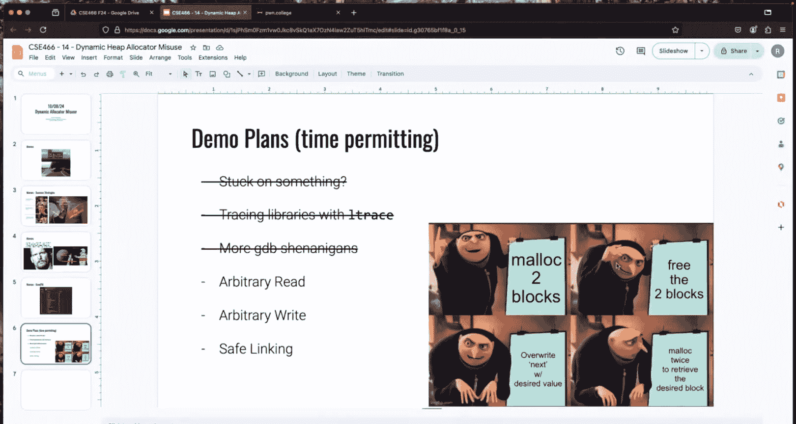

Okay。So。I didn't change my demo binary， so it still has whatever that bug is where I'm not exploding on reading and writing a null pointer。

One of the things that you'll see on level 16 onward if you look at the challenge directory is there is this Lib folder you do not need to interact with the stuff that is in Lib if we take a look at challenge Lib what you'll see here is there is a Lib C。

 and then there is a version of the loader。😡，The way that these。So if we are in the dojo。

 we type U name a， this this challenge environment is currently， what does it say，butu。

 I think it's 2004。That doesn't have I need LSB release。Okay。LSB release， this is Ubu2204。

 So this is a pretty old version of of abuuntu。 It's still current。 It's an LTS。

 so you still like can find this out in the wild， but。

The Lib C version that is packaged with an operating system is limited by the version of abutu。

 So that means that the Abutu 2004， if we were to look at。My eight out out。

This is going to go to the Libpsy that is part of the challenge and if we were to check what version that is which one way I know people had some like crazy fancy thing。

 but you can just run it and it will tell you this is Lipsy 2。31 So 2。

31 is kind of the latest version of Lipsy that is packaged with the Bo 22004。

This is a great version of Libpsy to learn how the heap works。

 but it is not what we would call current。If we take a look at。

The Libpsy version that is located in this challenge folder。It says。2，3，5。

 So I believe this is what's packaged with 2204 and at this point we're in 2404 so there is a newer version of Libps C。

 but at the time I last built this that was current and one of the changes that was implemented here is something called safe linking Everyone remember how my original toy binary worked where I had all these options we could Maly free cool So I have a it's the exact same binary。

I literally copied it。Except。I ran a command called Patch Elf。

 which allows you to change what library a binary will try and use dynamically and the challenge work the same way so that challenge baby He level 16。

 it is hard coded or patch。Such that it will reference the Liy that is in。Where is it。

 It says it here somewhere challenge， challenge Lib Liby。

 And so it's going to not be using the the stock Libey version。O。So let's run this safe linking guy。

Let's try and do that same thing that we saw already， Malik Malik， free， free overwrite Malik Malick。

 see if we get something。Mik 1 will go size 20， all Malik 2， so size 20。I'm going to。

Free one will free2。And then we said we want to write something， oh I need probably I Python， GDP。

 we got to get fancy here， don't we？Ch。嗯， to。This is the same thing we had before。

They can't write an address there。Whatever， I'll use the challenge binary because it'll be easier since it has help text。

Okay。Maalik 120， Malik 220。Free one。 All right， I want to stop right here and just take a moment where you need to make a mental note that。

Head pointer is 32C0。So I free one， when I free two。

 what would we expect the next pointer of the newly freed thing to be？What。

It should be it should be the we push to the head， so the next pointer should be whatever is currently at the head。

 right， It should be this 32 c0。Is that what we see？This is no longer 32C0。And if I were to。

 for instance。Malalik 1，20， Malik 2，20， Malik 3，20， Malik 4，2，3， wow。That's why you script Malik 120。

 Malik 2，20， Malik 3，20。Mic 4，20，31，32，33，34。 What happened to my help output？

I just read four things into this guy。It says， it shows me to how many are actually in the Tc？

How do you know that？Is the count wrong or is this printout wrong？The printout wrong。

 why is the printout wrong？Is T cash？It should have for。

 we know we have some idea of how the t cash works。 And the way that this like， you know。

 super nice help thing that we have in this challenge works is it's literally just looking at the t cash per threadstruct。

 It's looking at the head pointer。 It's assuming these are valid addresses。 And it's just saying。

 all right， cool。 Show me whatever is there。 All right， cool。 Show me whatever is there。

 And I showed。That these addresses， as I free them。2 cs zero。2 c0。

 the next pointer is now no longer what I think it should be。

This is something that's called safe linking。Safe link is a way of obscuring。The next pointer？

And making it so that we can't do what we did in the first 15 levels。

Because now whatever I write here is going to be invalid。 There's some type of encoding xoring。

 mangling going on。Another thing that you'll notice with this Liy version。

 it's not safe linking specific， but it's done around the same time we had this key value before and this key value corresponded to a location on the heap。

there was a pointer if I remember right to the TCash per thread dropped。

Does this look like a valid pointer no？U， with a newer lip C version， the key isn't really a key。

 it's now just like this this randomized random eight bytes。

That you just have to know right and so now it doesn't even have meaning we can't know we can't leak the key to get a heat pointer and we can't even leak the next pointer like even I see aside from overwriting it。

 if I were to print that， is that a valid memory address？Probably not， it might be actually。

 but that's because I have PIE disabled， it's definitely not the correct pointer that I want。

So how does safe linking work？Safe linking boiled down。The two things。There is。A location。

This is a location。This is a value。Or a pointer， actually technically it's a mangled pointer。

The way safe ranking works。 and we can find the source。 I'm going to call this mangled。Boner。

Is your take？The location bit shifted。By 12。You exor it。With a mangled pointer。Did I get it right？F。

3，8。8，4，12。 Okay， so that's 3，0，0。 Let's see if I got it， right。I didn't get it right。

 Gosh dang it safe Lincoln。 Which one did I grab。3，2，0。嗯What。Three， and one， EA30，0。Yeah， okay。

 so I didn't。Okay， I did perform the operation correctly。

 I just wasn't paying attention to which value I was getting it from。OK。

Now safefe linking is confusing。And it's messy。And the best place to look for it is the Libpsy source or my amazing lecture slides on this。

So there's two because I have the link to the source。

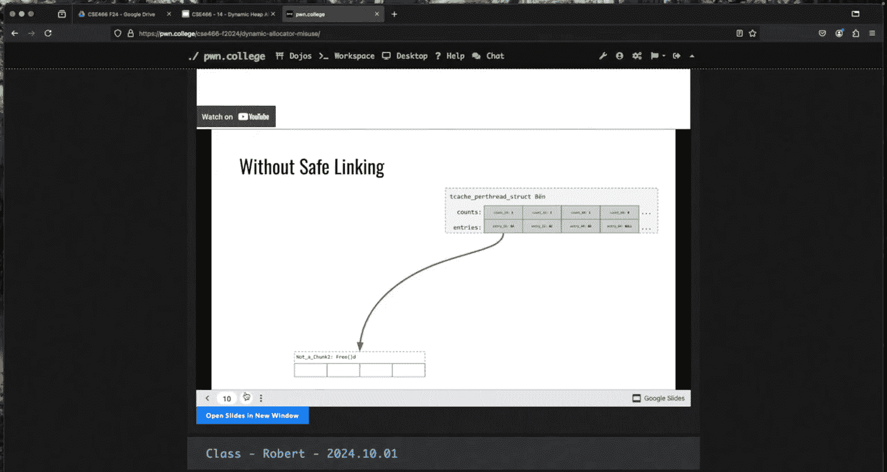

Right here。There's two functions that happen。There's protect pointer and reveal pointer now。

When a pointer， like a next pointer gets stored。We must protect it。

It's doing that same thing I just did in Python where I called it。

What location and then mangled value， right？

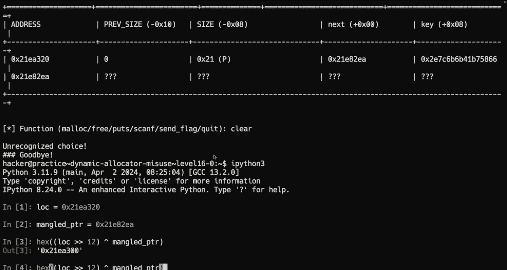

嗯。It's taking。They're calling it position instead of location。Bit shifting it by 12。

 What is the relevance of a 12？Bit bit shift。When we think about memory addresses。

So when we talked about like ASLR， right， what parts， what nibbles were randomized？Great。

 the least significant three nibbles are a constant offset into a page。

So what's happening here is we're saying， hey， the least three significant nibbles of this address。

Those are constant。 I don't want any constants in this this mangling in this obscuring process。

 So we're going to take the address of where this pointer is。

 We're going to get rid of the constant bits。 So that way， the least significant by is an ASLR byte。

😡，Does that make sense as far as why we're shifting by 12？Go。

And we're going to exhor that with the pointer itself。And that's what gets written to disk。Now。

 when we need to reveal a pointer， right， So when the heat needs to it gets this mangled mess thing。

 which is what we see。

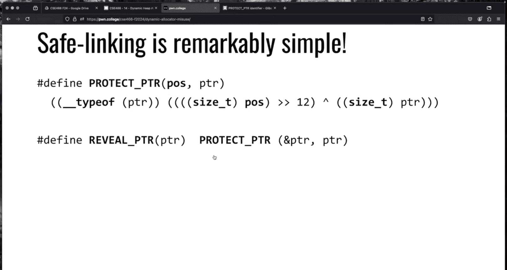

Over here。It does exactly what I did。

It's going to take。It defines reveal pointer as protect pointer with the edges of the pointer and the pointer。

 which makes sense that's the location， that's the pointer， so we are doing this same operation。

 it's reversible because it's an Xor。😡，So what two pieces of information do I need at face value to kind of reason about this thing？

这是。 I need the position and I need the pointer。How can I get the position。

 I how can I get these values？

So the position is the question was where is the position The question says am I on YouTube yes。

 go on YouTube。 com slashpononecollege， it's going to be the same things as what's here。Normally。

There is a camera。I just failed hard to day。Apparently， I lost what I was doing。这身玩。Okay。And that。

How did I lose that call thing？Malik 1，20， Malik 2，20， Malik 3，2，3，1，3，2，3，3。 Okay。

 so the question is how I say we're currently saying I need the location and I need the pointer right And the question I posed was。

 how do I get these values。Well， what does Malik return？

A planer right So if I have something that leaks or I can print the literal value that I'm getting。

 I have it。 but how do I know what this location is？So what determines where this gets written？

Where I forget I don't have a camera and you can't see me。It's， it's the order that I free off。

 right？ The first thing that I free。 I think I did three here。

 which is a shame because you can't see the third。 but I I free the second thing。

 its address gets written to where the next pointer should be。

 which is the address of the most recent thing I freed。So in theory， if I get the act。

 if I have access to the pointers that are returned by Malck。

 I could know the location and I could know。The pointer value。

 but if I already know the pointer value， do I really care？No。

 the whole reason I would need this is to get to the pointer value right。

 so I could know the location and have the mangled value， and I could do what I just did。

And turn a mangled pointer。Into a real Pier。O。That's cool。In practice， you don't get both values。

 In practice， the only thing that you could leak is what we've done already where we have this next pointer。

 right， and we can overr it or we could puts it so。In practice， we only get。

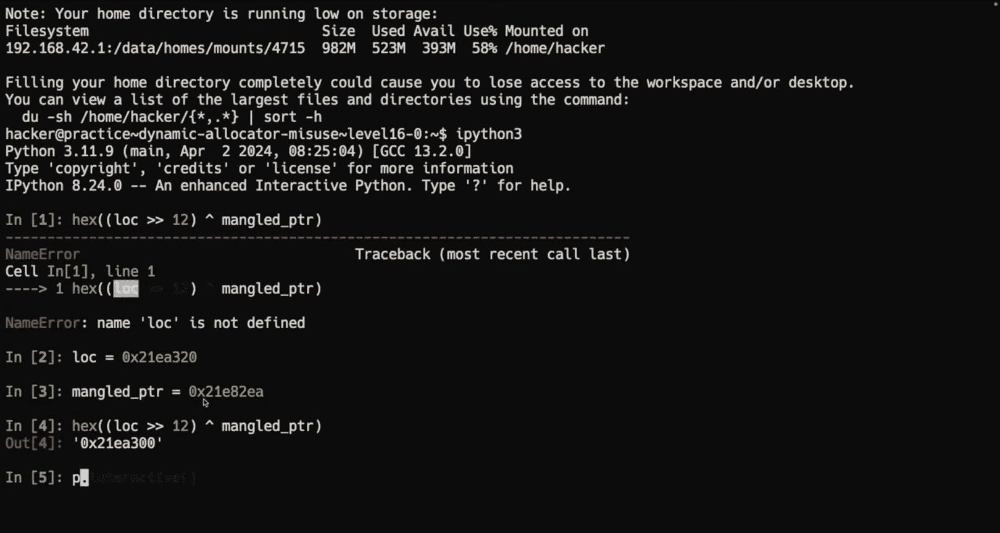

Mand pointer。Does anyone think this is reversible from just the mangled pointer？

It's okay if you haven't haven't done you know， your exo or your logical operations。

 and it actually takes some deep thinking to get to the other side of this。 The answer is yes。

It can be done。So Xor is reversible。もしかはでかい。Okay， so how do I get the？Okay， so the statement was。

 so Xor is reversible， and I get this mangled pointer。

 but how do I get the other thing that it's being exored with？😡。

And the trick to this entire thing relies on two properties。Okay。First。

 hopefully you've realized or found， as youve messed out the first half of the heap here。

 that the heap is generally speaking， deterministic if I malic。10 things that are 64 bys in size。

 It's going to go for what would that be 80，80 byte allocations。

And it's going to be I can know where these allocations are。啊。

And we also know the heap is on one page of not necessarily one page。

 but it starts at one fixed base address right， so we're working。

 there's actually a lot for a fresh heap。There's going to be a lot in common actually。

 between the pointer and the location of the pointer。

， so that's one key observation。 And we can see that。Just looking， I have to look at head。Instead of。

 I don't know if I would the order that I freed these in。

 I have to look at head instead of down here because this is the mangled stuff。

 But we have the actual pointer is 1678 to C 0。What is the next pointer， 16782 E0？

That's my third pointer， 1678-300。There's actually a lot in common between these two values。

 isn't there？Now， this challenge in particular， I was a little confused when I fired this up to just take a quick look。

This is a pretty small value for a heat pointer because PIE is disabled because I'm not trying to make it harder than it needs to be right if PIE was enabled these heap addresses would be a bit longer。

And in turn， things would get more masked up， but we can think about the Mac here。The same。If this。

Is my mangled guy。And the correct pointer， what he was。Should be2 E0。

Are there parts of this that are in common and not change？Yeah。There are。

Take a look at this， we have to think about this piece by piece。

So if there are parts of it that aren't changed and everything is shifted by 12。

What the most significant？12 bits or three nibbles。Would be the same。Okay。

 because that didn't get Xhored， but what else do we know about those most significant three nibbles？

They're the part being exored。

So so。Let's see if we have the technology。So if I say。

I need an add scrap a real address for this thing。 2 E0 is located here， so this is my location。

All right， so we have。Three real values I pulled from the heatap。

If I take the location bit shifteded by 12。And we make it he。There' is a value。

 What happens if I take the valid pointer bit shifted by 12。 make it hacks。That's the same value。

 What happens if I take the mangled pointer bit shifted by 12。H， almost the same value。

And so this is something that is the gotcha when we think about how to de references。

 I said there was an assumption。The assumption was。That these values are all on the same page。

If they aren't when we do this bit shift by 12。Will be off by one。

 So this apparently rolled over to the next page on the heat。

 which is why that address didn't have the exact same value。But we could say， okay。

 maybe it's off by one。 We could try this， say it's even try it-1， right， We plus one。

 we could get to this， right， They were somewhere near each other。 It's only a couple guesses away。

So we can get this this piece。 we see that there's this similarity。Now what's happening here？

Is the location bit shifted by 12 and we are exing that by the valid pointer。

And this should be equal to。That should be equal to my mangled pointer right so far。

 so far we're just going in a circle。But this。The most three significant nibbles here are consistent here。

And what's being xor so what that isn't getting xored， what are these94，9 getting xored with？

We an idea。These four， one，2，3。4，9，4，9，8 is getting xort with。161678 or 1679。

 depending upon what the location is， right， But we know that the three nibbles are 1，6，7。

So could I take？What do I have There O x 9，4，9，8 X， or that with 1，6。7even。Make it all hacks。Okay。

 and then。What did we get there， I anglegled T bit shift。Vcation。6，7。167 is going to get Xor。With。

 what did I do it with， I didn't do it with the。

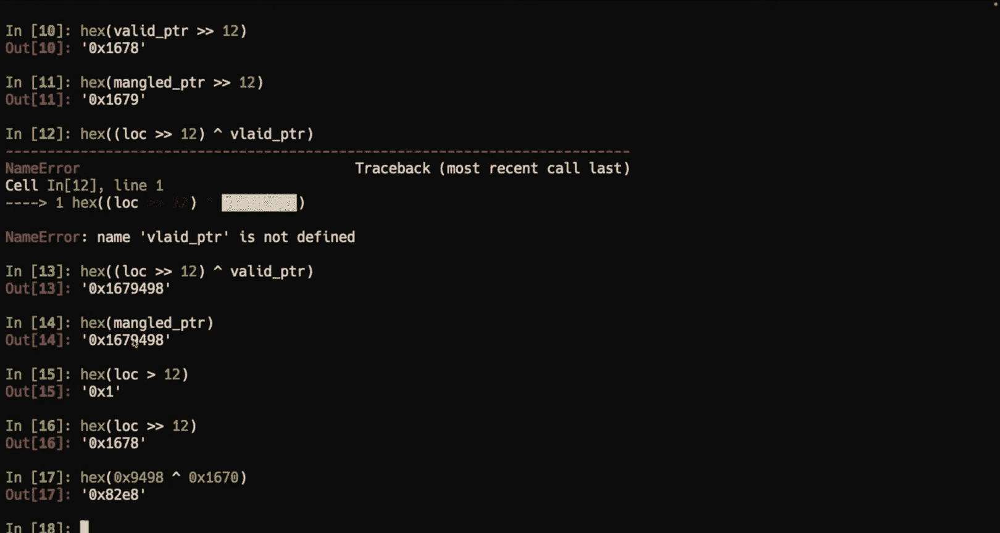

We'll go to my picture。I drew this all out and said， somebody， this is why。

U。Like trying to show this is hard。 I'll blast this out on the。Disord as well。

 it's been on there for a while， but we have a mangled value。

 and we're exoring it with the pointer bit shifted by 12。But what we don't know here is this page。😡。

Right， we saw that the page in my thing could have been eight could have been nine。

 we're just going to call it X because we don't we don't know， right， we could be wrong。

So we just kind of take a wild shot at that。And when we do that， we get， as I'm showing here。

 And I tried demo in Python。 But it turns out this is hard to do an interpreter live。

 The most three significant nibbles are revealed， and the rest is。Good。

 except we have to account for where's that page？So how do we do this from just the mangled pointer itself？

I have to define some terms。Okay， we know that the correct pointer is the mangled pointer Xor with the。

Poiner bit shifteded by 12 pointer 12 is going to be these two things called mid and mid 24。

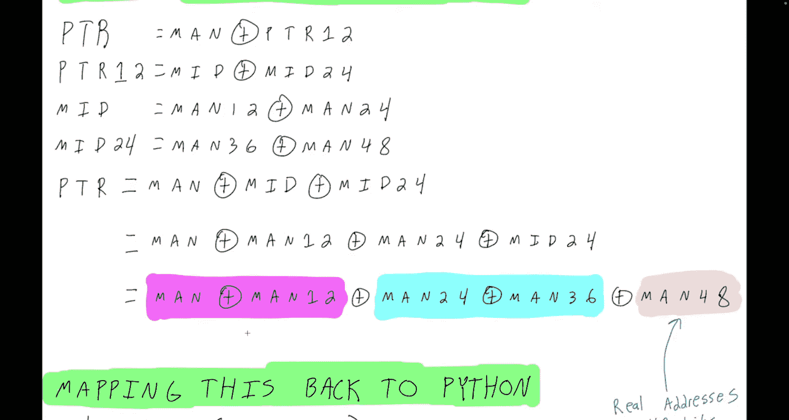

Well， how do we get mid and mid 24？

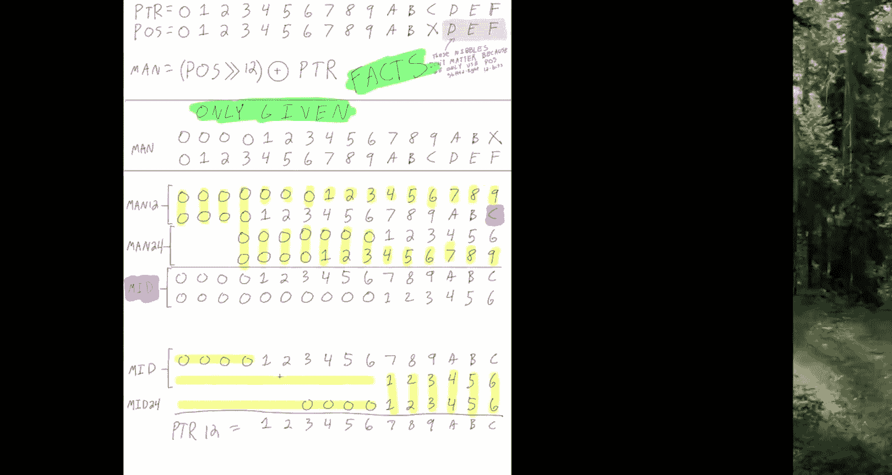

Am I on the wrong page now， I am on the wrong page。 So that's why this isn't adding up。O。

I put them in the wrong order。嗯。All right， point are in position。

The least significant nibbles of the position don't matter。 D EF。

 right The mangled pointer is the position bit shifted by 12 bits xor with the pointer。

 So if we are only given the mangled pointer。Which is this thing right here。And we can。Come up with。

This mangled 12 and mangled 24 ballot value by bit shifting the mangled value and exhorting with itself。

So what we're doing is we're bit shifting by。3 here。

 And then we see there's another bit shift by another three， right。

 because every time that we bit shift by three and we exhort。

 we're revealing another three nibbles of the。嗯。But technically。

 it's the interim value and it gives us this this mid value。So then。

If we take mid by mid 24 and again， this is just bit shifting an xing itself out。

 things are canceling out and we reveal。The pointer bit shifted。By 12。

 But what we don't have when we have once we have the pointer bit shifted by 12 is the three most least significant nibbles。

 We lost those right， Theyre a bit shifted away。

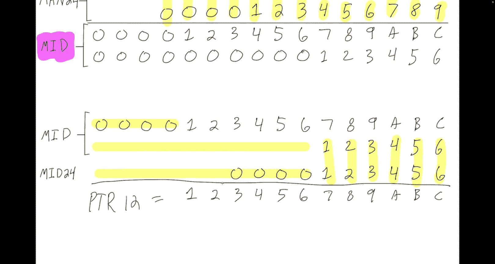

So that if we take。The mangled pointer， and we exhort with the bit shift。

 see if this will let me zoom in。

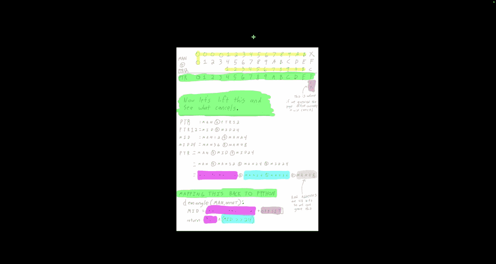

And we exhort with the pointer bit shifted by 12， we will reveal。The least significant nibbles。

 minus whatever we had when we guessed the page。Now， you don't have to understand all of this math。

 Okay， this actually boils down to a pretty simple Python function。But all we're doing。

Is this right here， which is actually on the slides。

Because a lot of this condenses down and eliminates itself。

 but the action that is actually is occurring is we're taking the mangled and we're computing these intermediate values by bit shifting the mangled pointer by 12 and then exoring it with that value。

 and we're just repeatedly doing that to reveal more information about it。 It unrolls itself。

 except for the very last nibble。And then when you write all of these。

Mid mid thing is a mangled pointer that's being bit shifted by that amount。

 So that's why these are multiples of 12。I'm sorry， multiples of 12 because you're shifting by。

Three nibbles， and then you're shifting by what is that？24 Bs。 See if I could math，3 bys。

And these intermediate values cancel out to where you end up with just one nice little。放ction。

Which becomes this。

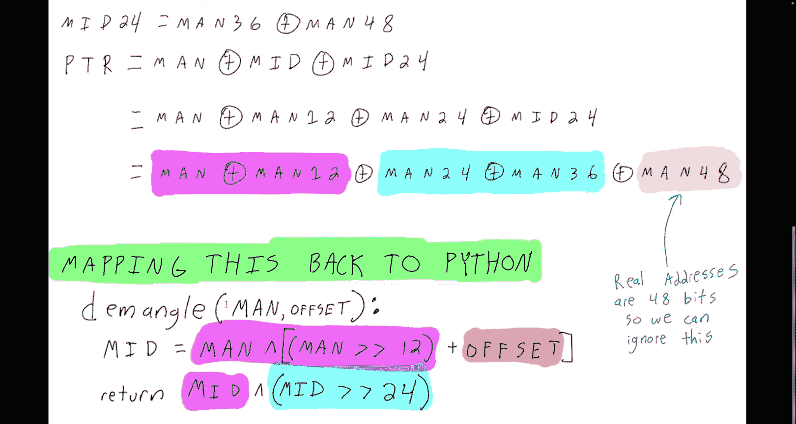

D angle， and we can write this in Python。

And if you don't want to。Go through the math， I get it。That's why。 Oh。

 this doesn't show it on the slides。 I'm a liar。 So let's make a D mangle function。

Theft， Dmangle。

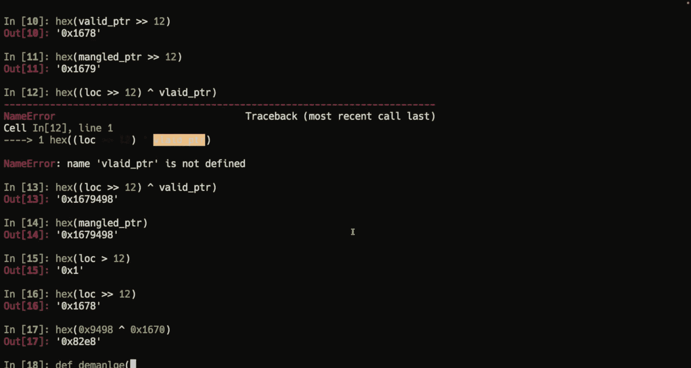

Ptter。

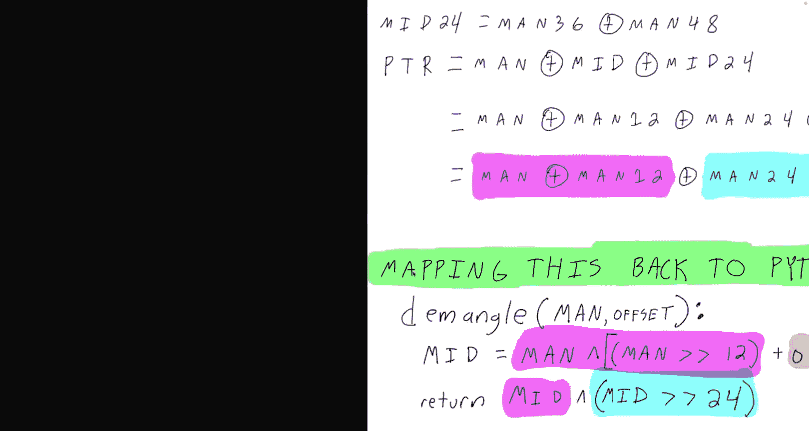

I need to take that puter， I need to exhort it with itself。

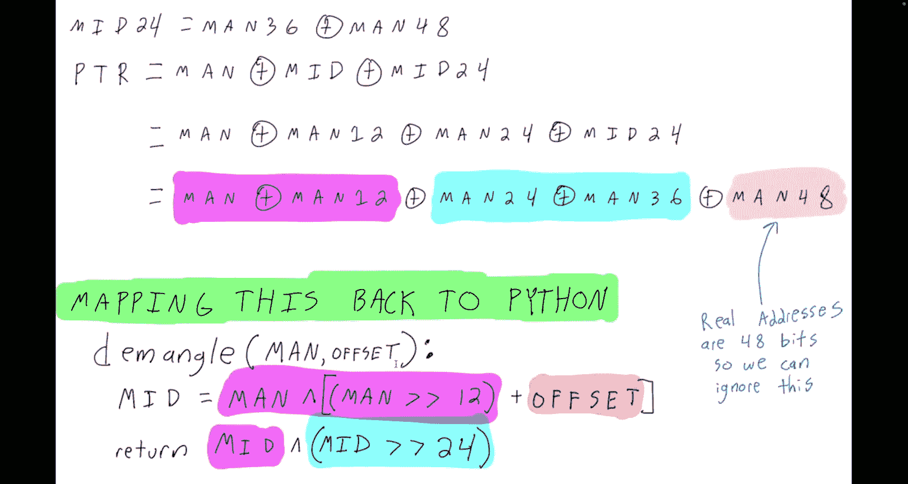

Bit shifted by 12。So。That's my first。

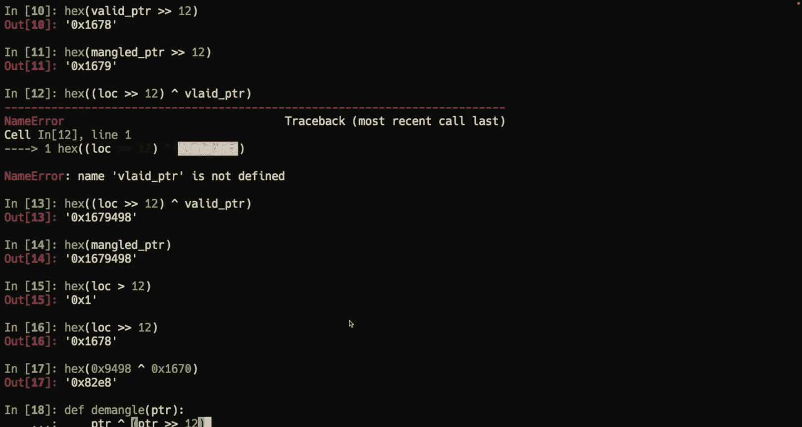

And we're going to declare that mid。This plus offset。

You're free to adapt to this function as you want， that's accounting for that difference in page right because if the location and the revealed pointer。

 the correct pointer are on different pages， you're going to have to add or subtract one to whatever。

 whatever the difference in the pages on the heap are。😡。

And we return this mid value Xor with mid bit shifted by 24。 So let's just finish that。

 We'll assume that we're on the same page。

Well type exactly。That's on there。 So now I have my D angle function。But run D angle。

On mangled pointer。Hopefully math works today。And did I call the other thing valid pointer？

I could be off by。The least significant， but here we see that。We got。Just with the mangled pointer。

 we're able to reveal the valid pointer。 Now， if the pages were off。

 what I would get from this de mangled function would be。Something like this。

I would get a2 E1 or82 E F because this last nibble is where the guess of the page happens。

This was some hand wavy stuff。If we want to write it all from scratch， we can。

But does this make some sense at a bare minimum。You can steal this function and this will work except for when it doesn't because things are on a different page and you'll have to adapt this。

😡，是。Shouldn't the8 change to a9， You're saying this。8ight here。

So the answer is no in the actual math。 So you would successfully be able to with this with this D angle function right so the scenario would be。

Give me a location。Okay。嗯，这这这这。Oh， those are on different pages。they aren't not different pages。

 Okay， we'd be if I made location 0， X 6，1，6，7，9，3，0，0， right。

 that would be if the location was a different page。Then my bad mangled pointer。Would equal the。

Location bit shifted by 12 Xor with my valid pointer。 Do you agree。对。So then we try and dmangle。

The bad mangled pointer。And let's make it hack。And so what we saw here is the eight。

That was D angled was， in fact， correct。 We were able to reveal that。

 And the only thing that was off as an effect of guessing the wrong page was this least significant nibble。

And that doesn't make sense at like face value， right。

 but I liken it to peeling the layers of an onion。

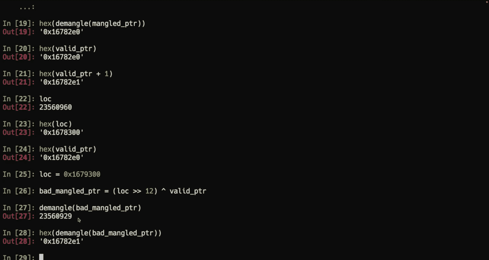

If we're only given this mangled thing。We bitch shifted by 12 and xor with itself。You say no。

You say yes， okay that's always going to trip me up。

 and I apologize And so that gives us this intermediate value where we have revealed more information。

 We haven't revealed all of it right because what we have here is the value。

 but it's still Xored with some other stuff。 And so what we are doing is we are slowly revealing like three nibbles at a time。

 and then using that relevant piece to shift over an Xor with itself。And because of that。

 we can the only place where the。Nivebble that determines the page right the least significant nibble that determines the page。

 because we're bit shifting by 12， the location where that is getting xored if that's this C right here。

 and so we don't know we can cancel stuff out， but we always end up with this C。

It's this unknown thing that I can't know， I can know every single nibble except for that least significant one。

Now。If the heap is。You're doing small allocations and you're starting at the beginning of a page。

You can。Pretty reliably say these are going to be on the same page， right， I I， I Malik， Malick。

 They come from the same page。 I free free。 They're right next to each other。

 The next pointer is going to be stored on the same page as what it is referencing。

Now if you have a busy heap that is mallaching and freeing and it's allocating stuff of different sizes and it's freeing that back on。

 all of a sudden， like no holds bar， right， you don't you can't even function with this assumption that。

These addresses are related to each other。Right like you would have to start fuzzing further as far as guessing how far away these are。

 because on a heap that's been running for a long time and mallaching and freeing。

 you may have a allocation that's at the beginning of the heap。

And you may have an allocation that's 30 pages into the heap。

And so then all of a sudden you don't know and if you were 30 pages into the heap。

 it wouldn't actually just be this least significant nibble， would it？

Itd be the first bite that we would have this kind of randomness property to it。

You're saying the heat doesn't have to start at the beginning of a page。Is that true？

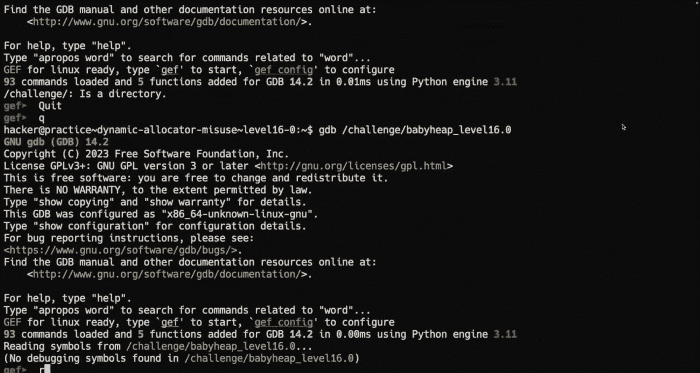

Everything in memory。Oh yeah， chunks can be wherever they want。

 so we we see here that the heap is allocated a region between C 9000 and EA 9000， right？Yeah。

 the chunks do not need have they don't care about pages if you're allocating things that are big enough where you care about pages。

 more than likely the heap will actually call Mmap。Instead of returning some gigantic chunk。Now。

We say that there's a big range there and we have no guarantees about what page a allocation or chunk is used from。

晒咗。The question。The question is what's the size of a page so a page is always on Linux is hex 1000。

 which is why we see that these least three significant nibbles are0，0。

0 and why we can have that assumption like when you look at something in Ida and we say things like。

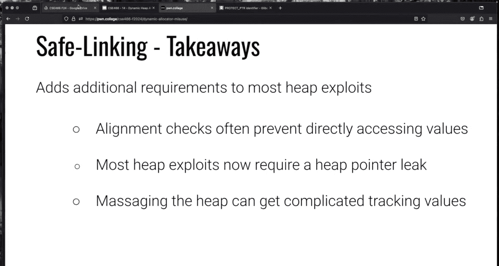

。

Say things like I can look at the the offset in IDda and it means something over in the binary。

 like in GDP or in the running binary， that is a side effect of how virtual memory addresses are used。

Everything the least three significant nibbles are always an offset into a page。Now。

 for larger regions of memory。When Ida here says this is at。

And what is it 2D9 C down here at the bottom？That's the offset into the binary。

The least three significant nibbles will always be valid。

Anything beyond that is something that would have to be added to the base address of where this is loaded into memory which will be in this case。

 that's going to be in the in the elf。 And so if I were to try and find that over here。

 this is where my e is。 So I'd take this plus whatever that is and that would get me to that location But the reason that we can do that is because memory is always mapped by pages。

 That's why when we look at the VM map， these are always zero and how we can reason about what's going on。

😡，It's 4096 in decimal， but Hex 1，000 is a page。いいか。是。So I was a bit messy。

But that's what safe thinking is。Levels 16 through 20。Or at least 16 through 19， maybe 20。

 I don't remember off the top of my head。 but 16 through 19。

 at least are levels that you saw somewhere between 10 onwards， like 10 to 15。

 and then repackaged with safe link。Now， the level of impact that safe thinking will have on a given scenario will be wildly different。

哎。Depending upon what you needed to do。What if I need to overwrite。

 I need to do what was on that slide over there。 I need to mallik free free， write something。

And then Malik twice， I want to get an arbitrary pointer。 what can I still do that？Someone says。

 yeah， what's different？I have to reverse engineer the the mangling of the pointer。 Okay。

 that's that's a fair statement。 So I have to understand what value is going to be mangled。

 So can I write the next pointer， No， What do I have to write there。

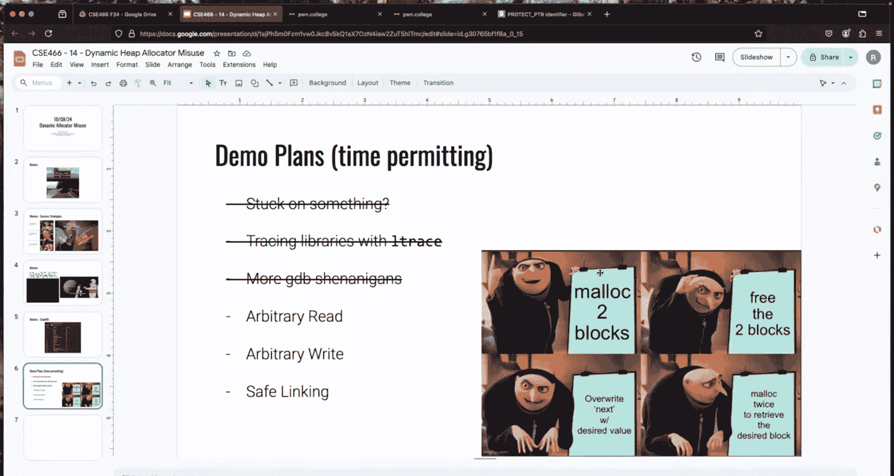

I have to mangle the next pointer， so if I wanted to write a next pointer。

I thought I had a beautiful。 I don't know how I keep losing eye Python sessions。

I'm doing something horrible here。So if I target， where I want to get to is hex 1337。

 I need to figure out where is this next pointer going to get written。Well， you some。

Valid address from right here。So how do I mangle my target？If I want to write it somewhere。Invation。

Location bit shifted by 12。Xor target。So this is what I'd want to actually write。

Instead of the next pointer。And so now we have this like additional work that we need to do。Now。

 what are the other things that safe linking does？Does it make sure that the least significant nibble？

Every we call it revealed pointer。Is zero。So one of the things that we could do and we did do in some of the earlier challenges is my target is at。

I don't know if we did。 O A。 Is that what we did to you。诶。

And then we could write this target to our next pointer。 There was a problem with OA， all right。

 we solved that problem and maybe we went to like01， right That's great。

 This could not be mangled by safe linking。So if I were to try and do that target。

Let's set my location back to what it was。We would do this same operation。When it gets。Revealed。

Which is going to be the same thing， but in。Reverse here。你。

Heap implementation is going to check this nibble and it must be zero。 if it is not zero。

 then the heap will say we've detected corruption because I never reveal a pointer that doesn't end in zero。

So now we can't specify arbitrary locations everywhere that we specify must be a multiple of 16。

 it must be a mangled。Multiple of 16。这这第一个。嗯。So。TheThe statement was。

 I showed the math where you can end up with this least significant nibble being incorrect， right？

So does that？Matter。Can you just do that math and if you get it wrong， make it be zero。

I'm fairly confident the answer is no， that will not work。

Because of the way that the math breaks down。All right， you're going to say。

 I just showed you something where like the only difference was the least significant nibble。嗯。

But I want to say somewhere， somewhere in there that that breaks down。 and you can't do that。Yes。

What's that？That not。Yeah， yeah， yeah。 So so the， the observation was if。

 if there's more than a 16 page or 15 page，15 page difference between the location and the pointer。

 then it would， Im obviously impact the， the next level。

 I w to say there's something else in the math that will break down as well。

Because what I showed you was when it was valid and then when it wasn't。But if。You go down that road。

 I you'll。I don't know， have to we'd have to math it。

 but I think you can't just make that assumption。Also。So， if you。I'm Alex something。I free something。

let's take a quick look at Glib C source。

So it's。Lnkked here in Malaxy。c oh， that's not 235。Let's at least look at the exact version。

Like these are good questions。Everything you are saying if I free something。What I am looking for is。

Protect pointer。And what we see here。Is on free。It is not checking that。Right。

 but if we were to look at。Reveal pointer， which is the other side。There is this check。

For misaligned chunk。 So I can free things in。That don't end in zero。Yeah。

 but but whenever the heap tries to reveal the pointer。

 it does this check to see if it's a misaligned chunk。 if we were to look at what is a。

Misaligned chunk。对。Oh， it's going to go even deeper。 looking at Jueb's sea source。Be a little bit。

'sTricky， this gonna chunk mem and then add it with this mask。 Okay， it'll be in this mask then。O。

Is whatever the malic alignment is -1。 And that's going to be what's bit shifted。

 which is going to be the least significant nibble just。T trustrust me down there。 Like it。

 that's what's gonna happen when this is tracking for a misaligned trunk。 is， you， if you。

 if you find it in there， that's awesome。 But it， it's tracking for that least significant nibble here on the mallic。

 We're inside reveal pointer inside。 Well， this is mal info。😊，Find the other one。喂喂嗯。

Is this mal link？是。W where an army galaxy。You don't want to go， that's that's fast Ben。

 this is T cash。key cache entries reveal a pointer。In0。

It's on the mall that it checks it because you'll get that。There it is。You'll。

 you'll get this one not not that's fast win， you， you'll get a Malik unaligned air。

ll you'll see a board is what' will happen。 I'm failing to find it。

Is there's actually a lot in the heap。 right， There， There's all these other bins that I haven't。

In't hit your wh。

That's the definition。M it's going be everything。That that。But if you just trust me。

 I don't want to just stare at Glib C source that the least significant nibble has to be zero on the pointer otherwise you'll explode。

 that's why you're exploding。OK。Do the saylic make some sense？Or is what it's doing？Cool。

 you're gonna have a really， really rough time whether people hate it。 even if you steal my。

handandy function that I gave you there。It's gone。I it deaf D mangle？Ptter mid。Equals。

Poiner bit shifted by 12 Xor with pointer。 then we return mid Xor with mid bit shift by 20。

Even if you have this function。There are going to be scenarios。

 and I know level 16 is one of them where this function is not going to save you。All right。

 because you like you can't just run this function against what you're going to leak and get what you think you're going to get。

And so you will have to have some understanding of what is the heat actually doing and how is it mangling things？

Because this becomes extremely complicated。Here。All of these were valid addresses。

 They are all on the same page。 Give or take， right， They had a lot in common。

 What happens if I wanted， like。Throw a stack pointer on there。

Are any of the assumptions that I I made about things going to work out well， No， they aren't。And so。

 so now you're going to have to， okay， well， how does this thing actually。ItBed out。

 how does this impact my pointers。And what if I need to allocate more than one thing or I need it to place a specific value somewhere？

I need to use the heap to perform a right。Well， the value that I need it to write needs to be a permutation。

 so that post mangling， it is the value that I want。

So I need to demananglele something that isn't mangled， so when it is mangled， it's the value I want。

 that's there。😡，these are some of my favorite levels and students' least favorite levels。

I will say that despite it being a small number of challenges for this。This particular module。

 I do believe safe ranking is going to make a reappearance here in 466， so if you skip it。

 you'll probably get hit with it again， so it is worth trying to tackle it。

The nice thing is that once you understand what the mechanism is。You can。Reasonably， just like。

Automatically deal with it。

All， if you want something that is。

More interactive。Like a playable example。

If we go Github。com shellfish， how to heat， this is a bit。Out of scope for this module。

 But there's one thing in here。 This is what the next。

The follow up peep that we aren't doing in this course touches on。

Because all of these are various other techniques that interact with all sorts of different things inside the heap。

What I'm looking for is there is one of these that says。He crepbed safe li boop。

Most heap exploits are。Explained given a proof of concept piece of code。

 which is some runnable piece of C code， where they're assuming based on the C code itself that you have access to。

 for instance， a use after free， or you have some piece of information。

 They may or may not have comments。 I personally in kind of 5050 and how useful these are until you compile them and run them。

 But inside this repo is a runnable example of， okay， what are the values。

 How can we deal with it that's annotated。This is typically how you learn about how He exploits work。

Is somebody throws together a p that looks like this。 You stare at it， You print it。

 you look at it in G to try to understand what's going on For this course。

 the only thing that we're doing heat related is T cash。 And so this is the only po that matters。

Is how how do I decrypt safe linking， It's going to be the same thing that I showed here in Python in the same thing that I'm scribbling out here in the math。

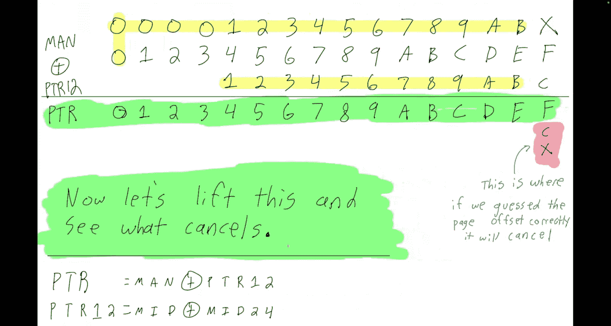

Does anyone have anything else for me， I've got to it 10 minutes。对呀。😡，At one of the challenges。

 the pointers are knulled after they're freed。Yeah。Okay。So I don't I strive to。

 even though I use 16 as a straw man here， I didn't actually try and look at it。

I try not to solve challenges themselves if you if the pointers are nulled out。

Do the first thing I think of and I don't know that this is applicable to whatever the challenge is。

 so you'll have to tell me， do I have the ability to overread or overwrite？我这。Okay。

 so if I mall something that's 24 bytes in size， the expectation is I the most I will write to this memory address is 24 bytes。

Do I have the ability to write 100 bytes to this 24 byte allocation？Okay。

 so if I have the ability to overwrite what we've really created。

Is。Ohoh， let's see if Jeff does what I think it's going do。知 do g d b。Now like 120， Ma like 220。

 we'll free 1。 we free 2。 We're in GDP。 I have heat bins。 Now。

 one of the things that the GDP plugins will do on the topic of safe linking is。

G to B plugins tend to be smart， and they are aware that safe link exists。

 So what they will show you may be valid， where what the challenge help text shows you is just like a dumb naive attempt。

 No promises there。 I know Po debug。does。reverseverse the safe linking in their printout。

 but for your question， I you said I have。Why what？35。I know' why。Okay。

We'm to find out something together here。Gosh， dang it， Jeff。

Would you believe me if I told you two years ago， I submitted a PR to fix that。嗯。Yeah。

Okay what you have here， this one has safe linking。

 So apparently Jeff has no idea where some things are and it's just lost。

What you have here is you have two trunks that are located next to each other in memory it may noll imagine that I have a valid pointer to here。

 I haven't freed it， but this one has been freed。The distance between these two allocations or two trunks is hex 290。

 do you agree？There's going to be a little bit of， I'm assuming that Po debug is showing me the allocation pointer。

 so there's going to be some metadata8 bytes behind this。but I could overflow from 9 b00。

 I could write hex 288 bytes。Then the next eight bytes would be my size。

And then my next eight advice would be the next pointer of this freed chunk。

And then my next 8 Bs would be whatever is the key。

So I didn't I didn't like explicitly show it last week， but that was what I was going for。

 what I was saying， hey， we have to mall free， think about the metadata and think about how things are located next to each other in memory on the heap。

 I I may not be able to write to a freed chunk， but what if I can overrite from a properly malled chunk all the way into the metadata of a free chunk that is after it。

对对。You were able to do that， okay？So you would have to make sure that the Tc the statement was。

 so I have this overwrite， I can overwrite this next pointer in your scenario。

 you know it you want to put there。 But when I want to put something there right and I put it there。

 how do I， how am I able to write to that location。

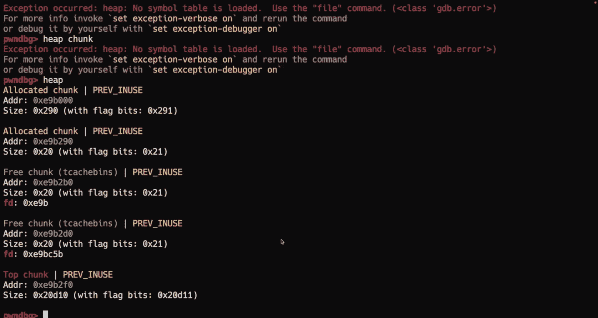

that goes back to the Malik Malik。

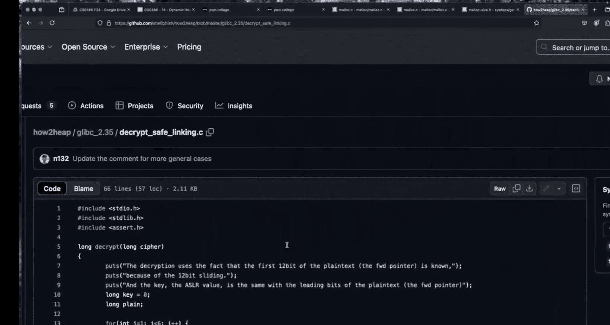

Maalik， Malik free， free。Overrite。Maik， Malik。You're doing this same operation。

But am I over how am I overr the next pointer？

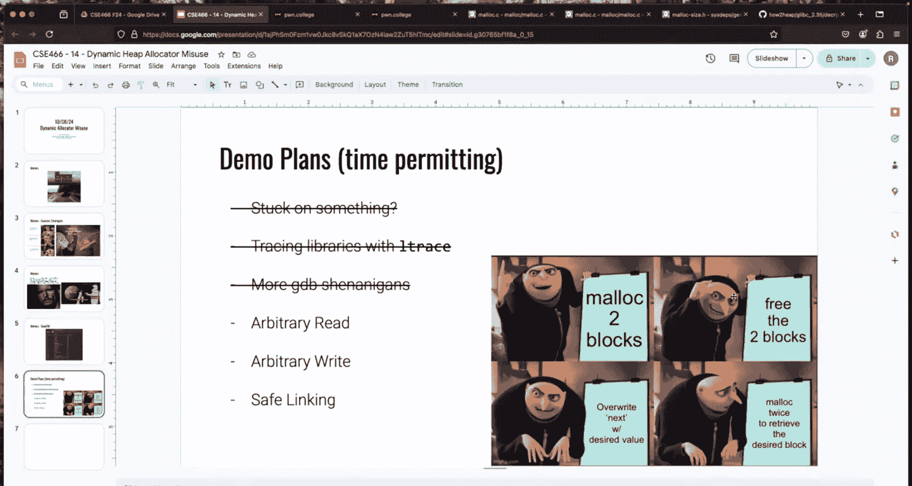

And I'm not overwriting the next pointer by a use after free， I'm overwriting that next pointer。

Via a buffer overflow from the allocation that's located behind it。Does that sound accurate？

Yeah， and and so when you have a use after free， it is just Malik Malik free， free scanf， all right。

 Malik Malick， let's go， but。Hopefully， people are， you know， knowinging out their pointers。

In which case you do end up with scenarios like that。

 where I have to start caring about where are the addresses I can write to。

 do I have the ability to overwrite into the next one。

So I'd have to make sure that the TCash has at least two entries。

 I need to make sure that this trunk is the chunk that is at the head of the TC。

And I would need sorry at least two entries。 and this trunk is at the head of the Tc。 This is Malick。

 I could read into this memory address， overflow this allocation and overwrateite the next pointer here。

 Then when I Malick Malick， the first mallick is going to return this address。

 the second Malik would return whatever is written on the next pointer。And at that point。

 if the program allows me to write， which it has to because you're using some some right to get from here to there。

you have the ability to write to， you have arbitrary right to whatever you specified on that exploit pointer。

啊。Having a hard time。 O， having a hard time using stack scan F and stack free to get a stack address in the heap。

 I think it involves creating a fake chunk， but you're not 100 cent sure based on my recollection。

 you are。Thinking correctly。嗯。So。When we free something。How does。The the thing to think about is。

 how does the Tc know if it's like a double free？We know that， how does it do it。

 what' does it look at？At some point， if you solve the first 10， you did it。

Ca there's a challenge that called like Malik and then Malik flag， right。

 called Malik twice and it like trollled you and you you you had to you had to be like， all right。

 how do I how do I get the same thing in here twice？So when you free something？

The Pc will look for the key。At that address plus 8， right， if it's anything other than the key。

You're good。Where was I going with that？ Oh yes， we're doing the stack free thing。

So if I want a free something， as long as the key's not there。

 I'm not going to get the double free air， which is pretty low。

 what are the odds you happen to type this randomly generated key byte sequence？😡。

What's the other thing that is used？When you free something。There's only what four metadata values。

 there's the size that's chilling behind me。S。Size is immediately behind me。Freef sizes。Before that。

Then there is。The next pointer， there's the key， there's a whole bunch of space。

 and then there's the pre size， which is actually my size。Right， so if I'm trying to。

Create a fake chunk。Those are the only data points that the heEap could possibly care about。

I would say look at those data points there' probably like it can't be。

It can't be data behind where I can write。Right that can't be the factor So so what what？

What do you need to write to free like an arbitrary pointer？

If you're not sure and you want to like discover this for yourself。

 you're not going to like high level reason it where there's only three metadata values。

That you possibly could write from a given point。Then。Try and do it。

 throw GDP on it and see where inside the heap it explodes。TheyWhen the heap airs。

 you can step through it。 And you can find the check that you're failing。

 And so if you were to like for instance's read in a cyclic value and then just try and free it。

 If you， if you're studious enough and patient enough to step through it。

 you will find the literal compare instruction where the heap is checking bites of memory in that operation and it decides this is no good we're going to go aboard。

And that sounds insanely tedious， but it's a useful skill to have because whatever you learn on 2。

31 doesn't necessarily apply to 2。35， which doesn't necessarily apply to 236。

 and maybe we're on 237 right And so at the end of the day。

 unless you're just going to blindly trust what other people say works。

You have to discover it for yourself。

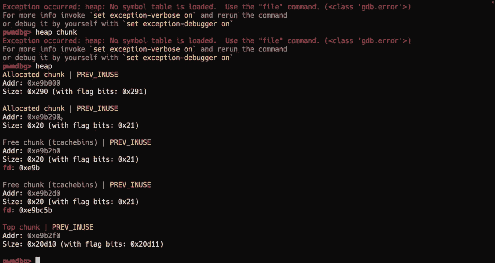

But you are on the right track there with free chunk。Oh， I forgot。 this was an amazing meme。

All right， we're animated。We're even doing some motion tracking。And I don't think does it show the。

 the bite value。 It's， it's， we got a win address。Does it say what the women address is？It's， it's。

 it's another great troll。 And it's not like we purpose to go out of our way to like make things troll you guys。

 But the they the sub problems that you encounter in earlier challenges will appear again because they aren't。

Yeah， there we go。2。🤢，Hopefully， part of that looks familiar。All right， maybe you curse with that。

 right， these type of things happen in the real world and so you just need to deal with it。

But great meme in particular， I just didn't want to throw it on the slides with that amount of time I'm going to cut it。

 I appreciate everyone hanging out。

