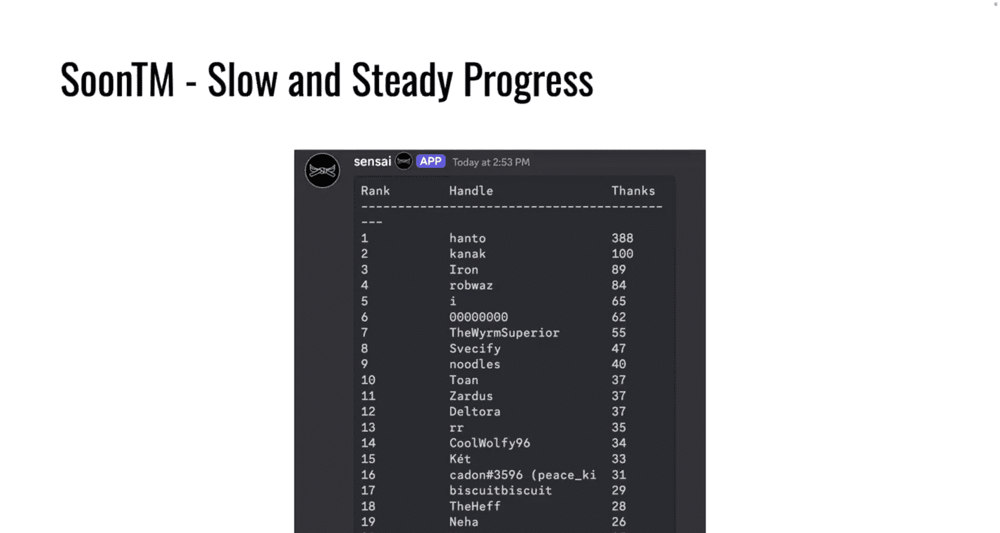
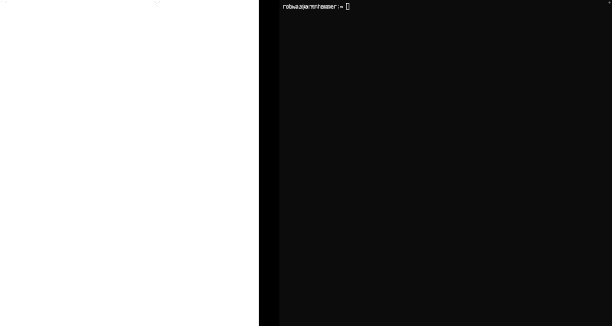
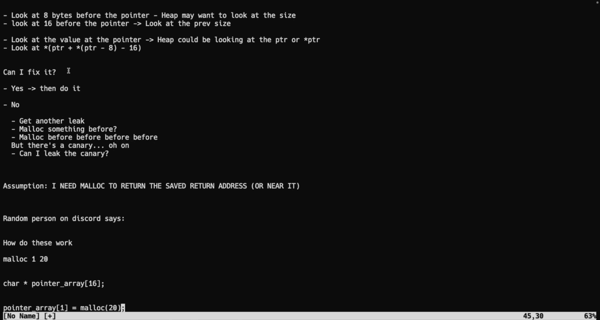
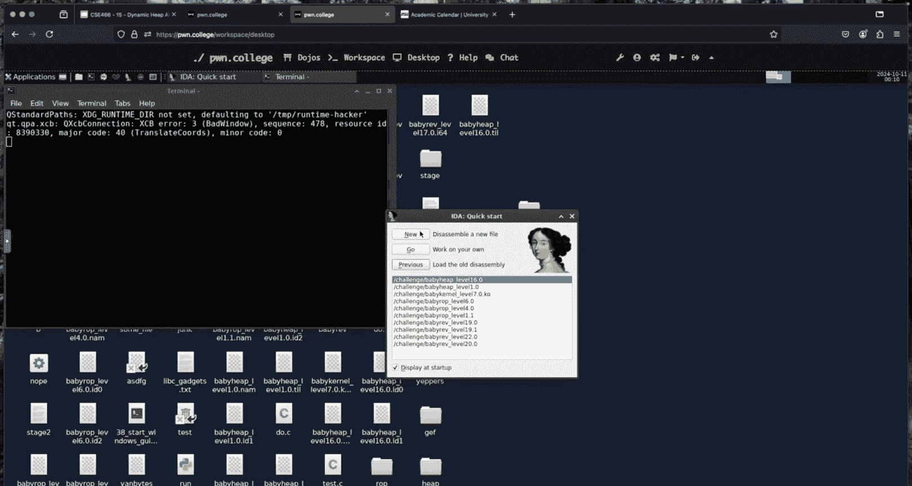
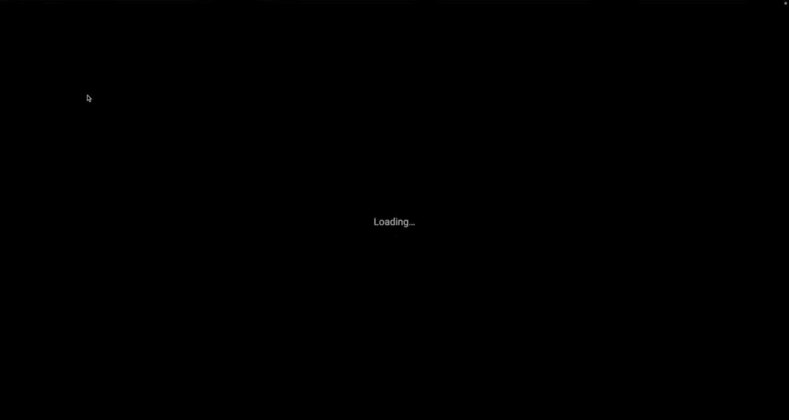
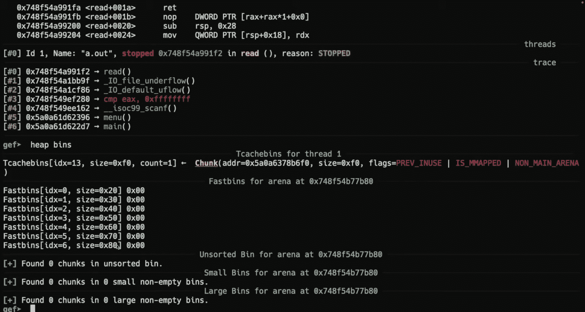
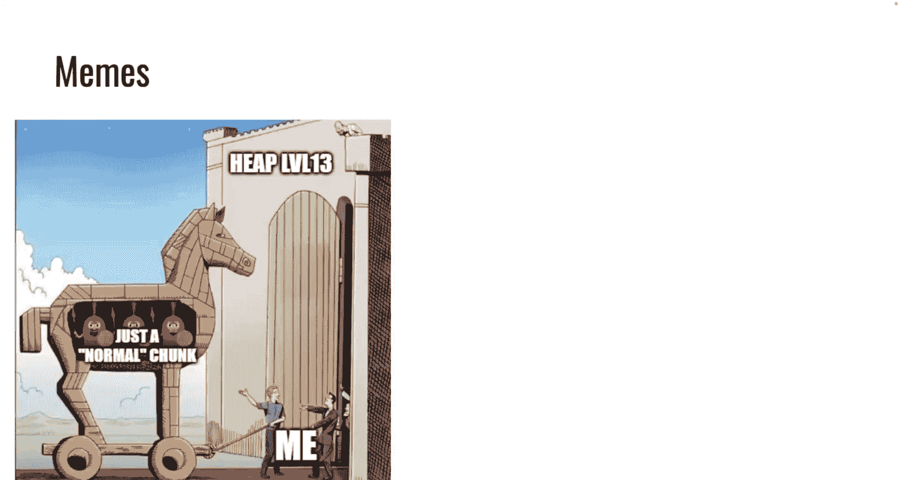
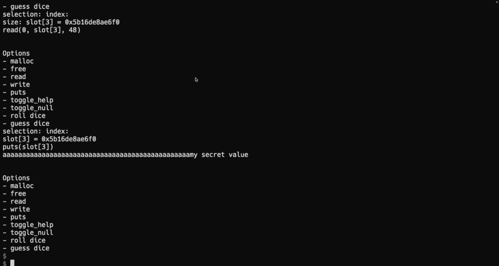

# ASU《计算机系统安全｜ASU CSE466 Computer Systems Security 2024》中英字幕deepseek p16 -17-Dynamic Allocator Misuse - CSE466 - Robert - 2024.10.10.zh_en -BV1spCGYZE9D_p16-

Al right， I think we， we are back。There there we go， yeah。

 it turns out like people in class sometimes want to talk about things。

And they want to talk about things off stream。 So we talked about things off stream。 I。

 I gave away the answers to everything in the module。 If you showed up in person the day。 All right。

Big L for all of the Twitch viewers。Okay， I didn't really do that， but it'd be funny if I did。

So today is October 10，2024 here at CSE 466。 we are wrapping up。

 hopefully dynamic allocator misuse or how we can exploit the heap。 I am Robert Washington。

 and today again， I have no camera。 We'll try and have that fixed at the other side of fall break。

Memes， this is not related to the course， I just thought it was a great meme for those that are unaware I'm the one that manages the Twitch and YouTube channels for us。

 so I get the pleasure of choosing what is our wonderful thumbnail and somebody made a nice D& D alignment chart of it because it turns out we're kind of inconsistent。

If somebody has an opinion on like what what they think is the best， I like smiling faces。

 I like chaotic good over there the most personally。

 let me know if it's not a major amount of effort， I'll definitely consider it。Memes about memes。

 so one of the things that I did was I in theory made extra credit live on the G page。And。

People were initially happy until they looked at their grade， and then they were like， wait a minute。

 wait a minute you're。You're taken away。A week of namess。

So there are people who are claiming that somewhere at some point， I said meme start on Monday。

 maybe I did， maybe I didn't， I'm not saying that I didn't say it。

 I'm saying that I don't recall saying it So if somebody does the archaeology there to find where I set it on stream will address it then。

In the meantime， I don't really want to change grade related stuff， Willie Nilly。

 so I'm going to leave it as is until we have a permanent solution that is is my general stance。

 but I definitely understand if you feel like you you took a hit there。

Better to find out now than at the end of the semester， I suppose。

 So if live grading is doing what was what was intended， right。

 you have a better idea of what's actually happening to your grade。Apparently。

 I'm the nice mean judge。 So the 365 has realized that they can make things。

 And if I find them amusing， they still get extra credit over in 36。

5 because I'm a little bit more loose with the meme extra credit than some others apparently。

 I specifically did not upvote that one。 So it did get up voted。

 but it wasn't by me just because it was too overtly trying to play gave me。

But for 6 students that should be a sign that posting these memes will add up in the long run here。

 so please do so。All right， other games， so we did actually get some memes about the heap and about challenges。

One of the things that we we start doing in the later half of challenges， apparently in level 13。

 is we start kind of introducing fake chunks to the heatap。

 and so it is kind of kind of a Trojan horse。 I like that that mean they're on the left hand side。诶。

Me on the right hand side is that terminology being pedantic thing。And depending upon where you read。

 what you're reading， what you're looking at and who you talk to。

 where is the beginning of a chunk is like something people will argue about right。

 I believe a chunk includes the metadata。😡，That that is behind the allocation。

 which is the usable region that the program like the region of memory that is intended to be used by。

The program that's using Maikin free。Some people will disagree and what makes it even more fun is if you're using something like Pone debug or Jeff。

When they show you the memory addresses， you have to sanity check yourself and say。

 is the address they're giving me actually a chunk address or is it the allocated pointer that Malik goes back and forth depending upon the plugin。

 your experience will vary。All right， more memes。This is just kind of a repeat of something we had earlier。

 which was。Do you need to leak it now， just overwrite it， it's just as good。

Over we on the right hand side。This implies that you actually learn stuff from watching these lectures because you're trying to brute 4 16。

 which is the first level that has safe linking and it wasn't working。

 A you watched the lecture and realized how safe linking works， that's that's amazing。

 I think you just really stole my dmangle function。

 but that's totally fine if that was what you needed to needed to solve it。

 whoever was the author of that， that mean， although I don't think dmangle works on 16 at least with the intended approach。

 it doesn't。So I said me extra credit and help extra credit is now live， it is。

 it just isn't updating。I think I noticed it and one other person did。

 so Hanto has been just permanently enshrined for the past day in first place with 388 thanks。

 one thing worth noting is the leaderboard shows repetitive thanks。

 so if Hanto said something that was like super helpful and 50 people liked it。

 that's 50 points on the leaderboard。For your course extra credit。It is unique messages。

 and it does say this on the course page。 So one message that is liked by 50 people is worth one thanks as far as the course extra credit is concerned。

 but do keep in mind it is logaric in your favor。 So the first。Twooth solves are worth。0。89%。

I mistakenly said it was like one point something prior to starting the stream。What was corrected。

 you know， you could just get another， you know， you could just say something else that's helpful。

So， so yeah， slow and steady progress here on the dynamic grading stuff。

 It's moving the right direction。 Like nothing is overtly wrong。 It just isn't updating。 and。

 you know， number isn't going up。 I hope to have that fixed。

Realistically Friday， like Friday evening， we'll see if I get to it tonight。

I know what it is I just need to like poke at it a little bit more logistical things。

 so fall break is the 11th to the 14th， hopefully I got the dates right。Dang it。 you know， so I go。

 I go to。

I'm going to show you what I do。 Why， why this， this keeps happening。

 You type AS U academic calendar。

You click the first link。

You type fall break。And you end up over here。Right， and you see this。 But as somebody pointed out。

 there's a difference between 2024 and 2025。 So this year we'll update the slide。

 It is the 12th to the 15th。 It does not include tomorrow。 Allright。

 there will be instructor office hours and recitation。

 which was something that people were concerned about。However， there will be no。

m classas on Tuesday and there will be no recitations Monday or Tuesday。

 but there aren't recitations on Tuesday for 466 anyways。As the meme says。

 you're dealing with your midterms， it doesn't matter。 There's Po college。

 There will always be Po College。 I told you at the beginning of this course。

 There's going to be an insane pace and there will always be something assigned。

 If it's just going to be brutal。 You're halfway through it， except it， okay。There is an end to it。

 it's called the end of the semester。And thus you sign up for more， which would be even more fun。

Program exploitation launches tomorrow， I think worth noting about this。

 it is a cumulative module that's going to cover everything that we talked about so far in the prior material And so it's going to be taking those concepts like memory corruption rap reverse engineering etc and combining these concepts so you may need to do some memory corruption to then create a scenario where you can rap you may need to reverse engineer you may need to write some shell code in something that isn't X86。

 I said that Yon 85 make some appearances multiple times in this material This is going to be the first return of yaon85 there are a few twist on some of the existing elements so there may be some things that were alluded to an earlier material that maybe it wasn't in a challenge and you'll get to see it or experience it in this combined module because it's more fine if it's more moving pieces one of the things that people talked about。

Prior to the stream was specifically with the heap。

 is like they were asking a question about how they could generate some leak。

 And I threw just a couple scenarios at。 I was like， okay， well， you could， you know， in do。

Something like me on the left here and， you know， inject some fake chunk and then leverage that to obtain a leak。

 But that isn't something that we like directly present in this material， right。

 You have to have the intuition that， oh， I have the ability to inject a fake chunk。

 And I know that fake chunks next or the if I free another chunk after a fake chunk。

 The next pointer would be that thing that I free。And then if I have a use after free。

 I could like put that， right， I'm not saying that that's the solution to any given challenge。

 but it's a number of these kind of moving pieces or components。

 these kind of sub strategiesgies that you can employ。

 And you have to think about these are all like puzzle pieces。

 How do I put them together to accomplish what I， what I want to do。 A lot of the times。

 like there are a couple questions on the discord earlier today where people are saying， hey， like。

 I have。I don't know where to go。On this challenge。 And my first question is， well， what do you know。

 Like， what do you have， You should always be thinking about these challenges。

 particularly accmulative type things with what abilities or powers do I have and what information or facts do I have。

 Do I have a stack address， Do I have a binary address， Do I have a heap address。

 Do I have an arbitrary read， Do I have an arbitrary right。

 You need to start thinking in those terms， and what does that mean。

 What can you do given a set of facts。And what happens is once you state those facts and build up。

 you find or uncover a path to a more complicated exploitation scenario。

There's a reasonably high chance of me adding new challenges to this module in particular。😡。

Primarily because there's things that I think should be covered in here that aren't right from us shuffling around module material。

 I'm going to try and hopefully get it included at launch tomorrow， but if I don't。

 I'm still going to add it so that's just it's happening。😡，All right， demo plans。

 if anyone has anything in particular， you're welcome to hit me， we got one hand， what do we got？

That is amazing all right， what are the next two lines on this slide？

What if the pointer gets an old house thinking about overlapping allocations。 Allright。

 every once in a while， I pick a topic that is relevant to what people are thinking about。

 So I can definitely cover that。And then I'm mostly going to throw in just some safe linking messing around with it in a more real scenario instead of just copying random addresses here。

 try and include safe linking as part of an exploit。Did they don't have anything else before we。

Kick it off。Yes。讲了个笑。呢个。さ。哦边。I。Thank youちゃ。好。That kind nice。啊。Okay。you what you what。

What the locations are present。喂。It on understand。你都都。So。Okay。

 so there's a few different things there。 It was a straightforward answer until you were like。

 I read this random thing on discord。 and I think this applies。

 The discord is great and the discord at the same time can be a trap， right， because I don't。

There's limits to like how much I can moderate things， right as far as how people suggest strategies。

So the the statement was there's some challenge where I have a leak of I've already managed to leak。

 for instance， win and I have a。Stack address。 And so I'm trying to。Get this value。

Onto the stack is that。This said。你翻一个饭。And the legal sense it works。 But when I write it。

 I can save return pointer on a stack or save return address。えせ教です。Okay， so they're。

 they're trying to， are you trying to do like a Malic， Malic free， free， write the address。Maalik。

 Malik。えきのプロ前のデービのせ。多名啫。好的。ok。いたそで。高起来。で好さ。I don't know you still Okay， so your the question。

 the thing that I'm hung up on right now， which is why I can't answer。

 is what operation is seg faulting， are you se faulting on mallik or are you seg faulting on right？

Okay， so the statement for which here is they are dealing some safe linking challenge。

 they're trying to malik a stack address， I believe。

 and it turns out that that is not going well and Malik is exploding and Segvaulting。

If you say flooring。Another stack at this。So you can mall one stack address， but not another。O。😊。

How are you？What is your read primitive， like， how are you getting bys into this program？食低都好。

Is it scanf， is it Re？if it's Re， then there's no bad bites。If it's scanf。

 because the safe linking are like arbitrarily not arbitrarily， but X or is your address， right？

And it's totally possible， and this is a very real thing。

 or if you were able to take in bytes via scan F， that the result of safe linking results in a byte that is invalid for scanf。

Right so then the address that you're actually writing because scananf is going to eat and then stop eat sub white space bite and then it stops。

would mean that you're writing an invalid address， which would cause you to se fault on the return。

You would also say， you wouldn't Se fault， you'd s a bored。

 are you sick aboarding or are you se faulting。是是。That that。I'm sorry。わからくせい。This luck。Okay。

 how have you figured out where you're se faulting？是个。是べ咱。So， so okay。

 I think I know what's going on now based on， based on what you what you've said， Okay。

 because I potentially I was going say， hey， this is you are not mangling correctly to deal with safe linking and then you said。

 hey， I can。Maik， other stack addresses and everything's great。 All right。 then I thought， okay。

 well， maybe it's some magic bites。 And scanaf is stopping you And so you're writing an invalid address。

 You're not writing what you think you're writing。 Again， very both these are verifiable in T， right。

 which is why G is amazing。😊，But you say no， it is taking in input via read。

 so it can't be that there is an invalid byte。So then you says it's a Segal， it's a se fault。

 it's a seg fault。What tool can help you investigate why you're saying faulting？G2 B right。

 we still ended up with the same， the same place， despite all the all this reasoning and thinking here。

 And so that we need to figure out why we're Seg faulting Where are we Seg faulting right So the Se faults accessing some invalid memory malick itself shouldn't cause。

Like you can seg fault there。 But what you'll find is that you're going to be able to attach GDP to。

Your program， you can run it， you'll seg fault， you'll see that you are sg falling inside。

 probably some like Maic helper function， right？And this mal helper function is going to have some。

 it's going to load in some value。 and it's going to try and do some math based off of it and then like load a pointer。

 right， Do you reference a pointer， and that's why your Se fault。

And so what you need to do is throw GB at it， figure out what that pointer is。

 how it relates to what you're trying to allocate， how it's being used， and can you fix it？😡。

All right， and it could be that， hey I like。

Invision。

I don't have drawing abilities here。So this is not the whatever。For just scratch， we can use this。

So imagine I have some pointer that is at Ox1337 right， this is my what I'm writing。

ISave your address。Okay， it's it one3，3，7。Ma is going to treat this as if it were a valid allocation address。

 right， And there are some things that we would expect the heap to want to do with something that is a valid。

Allocation pointer， what are some things that the heap might want to do。

What might want it to look at？大家都。Oh， no， so we could mal if we could for。 But what values。

 a se fault is we're accessing invalid memory， right。

What they did there is probably book at these bike。关这。Its like。Go。Thank。So it could be looking。

At 8 bys before the pointer， what's supposed to be there。I size。It may want to look at the size。

What else might I want to do well， they may look at the size。And then it wants to do what。

 what happens like when we。Let's think thing， when I mallic something。There is the previous size。

 right， where where is the previous size located？So okay， that's minus， okay。

 we could look at 16 bytes before。m， because we want to look at the previous size。

What else might we want to look at？We we might want to look at the the next pointer because we're mallicing something。

Right。And if I'm mallaching。So we might want to look at the value。As the pointer。

Because if we're mallocing it。And the count is sufficient。 This could be a next pointer， right。

 So the heat could be looking。At the pointer or。Sar pointer， right， It could just say， hey。

 this is the next point。 I want to dereence it and look ahead。

 We'd have to look at the Mal source code and see。 But that's a reasonable thing that it may want to do because the they he doesn't know that。

 hey， I'm writing some invalid value here。So it's going to assume this is well structured。

It could look。At。Not my previous size， but my next chunks， previous size。

Because that should be the same as my size。And that would be pointer plus whatever is at pointer minus8。

It may try and do that。Pointer minus8 is my size。We already saw that， but I may take where I'm at。

And then look ahead。Technically， it would actually not be that it'd be this minus 16。

Because it would be looking for the allocation。Hopefully I'm mappinging right， but you。

 you see where where I'm going there right because where is the previous size of the next。Dunk。😡。

It's at the end of my trunk。Right， we think about it as if it's8 behind or 16 behind me。

 another way of looking at it is its size past me is where。The next guys previous size that is mine。

 So any of these things could be happening。嗯。All of these are potential areas of seg falls。

And so that's worth throwing G on it and saying， hey。

Which one of these memory locations is it looking at？Wow。

 what is actually causing this egg fault and is it something that I can fix？It could be any of these。

And even once you figure out which one it is， the next question is like， can I fix it？

The answer may be yes， at which point， if it's yes， that's great。Then do it right。

 what if the answer is no？G okay， if it's no。We could get another leak。Maybe。

Right now you say that you're trying to mallic a saved return address。

 but I can mallic other stack addresses。Okay， so in earlier challenges。I'm maled。

Can I mall something before this because I want to write， is that correct？这里买了一不错，的是有这。

And can I mal something before before， before， right， can I you how before can I go？

Because goal isn't my goal isn't necessarily to mall this saved return address。

 my goal is to set that value。There's a canary in between， okay。

 so there's some limitation on how how before I can go， could I leak the canary？没啊。 at which point。

 all right。美位。😊，Now。I think I know it's now that we've scribbled all this out what level this is。

What's that。17。I would have guessed 16 him。Okay。啊。Now， all of this is presumed。

Because this is all built on our whole reasoning is based upon an assumption that you made。

And your assumption was。That I need to get the heap。To Malek。My saved return address on the stack。

Is that an absolute thing that you must do？是。Okay， so， so what if I just don't。

Don't target that at all， there was a hand， what do we got？作这个事情嗯。つぶさ。没有对。That has not been freed。

If it's maled， I will generally speak for TC pre of size just doesn't exist like it's not used。

 size would exist so you could。You could messer on with a malik chunk size。This。size。あなたりししいもかなと。はた。

吧我。That。Thisす。Such a thing exists， it's not structured in the way that you're phrasing it。嗯。So I。

I think I'd rather hit the demo and see if the demo gets you what you need。嗯。To wrap up here。

 there's an assumption that you're making。嗯。And I don't know that this is a true assumption。

 right all of this is predicated on I need Malik to return the saved return address。Right。

 or something there it。All， and maybe this is true， maybe this isn't okay。

 I know in one of the levels。So maybe 17 is a nasty one， but in one of these levels。

This is a specific problem that I like put into this。 All right， I I apparently。

 I don't necessarily know which level is which by number。Where you can't。Do something direct here。

Now there was a hint that you said on the discord。RightRandom man on discord。

 random person on discord says。What do they say？好。Okay， so that's， um。

 I'm not quite sure I'm fully following。Think on the。Youre speaking to application。Okay， okay。

 all right， okay， so so it it's a phraing thing here So the random person on discord says how do these challenges work？

We say Malik one， and then some size and then。What happens is there has to be some location， right。

 There's some array， we'll call it the pointer array。And it is going to be， we'll say， 16 in size。

Right， so there's something like this。And then what's happening when I do this Malic 120？

As we're callinging Maik 20 and we are saying pointer array 1 equals Maic 20 right and that makes sense。

 this isn't like some deep secret， this is something that one of you。

 any of you could could pretty easily discover by opening up one of these challenges in Ida or Gira or whatever your reverse engineering tool is right it is expected that you are using Ida Gira to look at these challenges right the challenges have help text。

However。AndYou said 17？All right。However， they can't tell you how everything in this program works。

 right， you know what does a good job of telling you how a program works。

The code or the assembly， the pseudocode， right， and so。We' had to open this up and we mash tab。

Very advanced。Still here do， what do I see here？And Ia't think it's a Boy star。All right。Of 16。

 and Ida was nice enough to call it puter。And if we go down and see what happens in you Malek。Luck。

We're indexing into some array。 Where is this array located？This array is located on the stack。

How else is this？Aray used， we match X in id so we click on what you're interested in。

 we hit x for cross reference。And we can see everywhere this pointer array is used。

Is this something that's interesting to me and why？It is pretty interesting to me。

 We see that that is an argument to puts。 We see that's an argument to scanf。

 We see that's an argument to free。 That's an argument to Malic usable size。 That's an argument to。

It's a return value for Malec， but it's used in a lot of places。So if I could control that value。😡。

Does that give me anything？It gives me a lot。It gives me the ability to call puts on it。

 it gives me the ability to call malicusable size on it。

 it gives me the ability to call scan F on it right but all I have to do is set what this pointer value is。

😡。

And so we can bang our head on I lost my。My vim scratch there。

 We can bang our head on this assumption that I need Malick to return the saved return address。

 right， and you can fight it and fight it and fight it。 Maybe you can。 and maybe you can't。

But the way to move forward is to throw GDP at it。Understand why it's failing。

How it's failing and determine is it something that you can fix or is it something that just you cannot address？

If it's something you can fix， fix it， if it's something you can't stop trying to do that。

That this is an extremely common problem in general， just when you're doing exploitation， like， hey。

 I know of this mechanism， I know this trick， I'm going to try it。

 Everything's great and you just randomly exg fault somewhere。In the blue blue belt material。

 we have modules where， where you're doing a lot more fancy pointer stuff。 And it's just， okay， well。

 this pointer is gonna get something is gonna get offset from here， and it has to be 0。

 There's another offset from this pointer that you set and it must be one。

 There's another pointer that needs to be a valid pointer that needs to point to something that then gets offset and that needs to be 12。

 right， And you just like， okay， I need to make this work。Like that is a very real thing。

Now we aren't going out of our way of doing that in this module。

 but the subprom that you're running into is very real， and that is how I would approach it。😡。

It not makes exciting。还有。Anterome。The allocation second。

So the statement was if I can control this pointer value and the pointer value is used as an argument to scan F。

 then what do I have， And I think they have realized that that is essentially an arbitrary right。

 right I have created I have created an arbitrary right primitive by doing that。

And so there's more than one way to skinm the cat as they say。啊。

Think about all of the the different things that are available to you。

 goes back to that kind of statement of facts and building up from there right when when you start off with a very narrow assumption of like。

 I need Malck to do this。Okay。That's fine。Is that really your goal？No。My goal is， is more abstract。

 And so there may may be more than one pathway to accomplish what is truly your goal。

 Don't get stuck。On something， and if you are stuck on something。

 use G or some low level tool to either rule it in or rule it out and then move on。

All right， so for the slides， I think it was a worthwhile ramp， ramble though。for our demo here。

 what if the pointer is nolled out overlapping allocations what's going on I'm still going to use。

The same。See if I can use a keyboard today。Same toy binary I have been using。

 and I still haven't fixed it， but it turns out a。What I'm going to do。

Is not critical The bugs that exist in this are not critical。

 So weve we've kind of been using this as a straw man for a better part。啊。

We'll move do dot pi to do2 dot pi， and then we'll make a new do dot pi。All right。

This binary can do all sorts of things right but I am going to place some restraints on what I'm going to be able to how I'm going to be able to use this binary。

 All right， the first restriction that I'm going to place on myself is I am going to make this binary I know itself out。

Right， that was one of the。It kind of rules that the class hit me with here。

I don't know that I need the context， but we'll set it。And I can do that on this binary。By sending。

Toggle knoll， all right， cool， it's going to knowll itself out。

The second restriction that I'm going to place on myself。Is that which I kind of have already。

 I have no use after free， okay？Because it's milling itself out， there is no use after fruit。

The next thing is I'm not going to give myself an arbitrarily long。嗯。Read， right， we。

 we saw earlier that if， if you have an arbitrarily long scan F， I can just yolo and write， you know。

 from one end of the heat to the other。 if I was so inclined。Instead。

 I'm going to say that I am allowed。To write the allocation size。Plus what？Okay。

 then give me plus one。A good day，16。 Do I need 16。 I don't think I need 16 for this。We'll find out。

 is that fair？对。嗯。Now， one of the things that is worth noting that's kind of came up。I no， dang it。嗯。

Okay， I'll say it and then you can tell me if I need to switch level so I can show this。😡，嗯。

What happens if I allocate 32， I call Malck with an argument of 32， how big is the chunk going to be？

Okay， the state was it'll be 32 plus hex 10， which is 16， so 32 plus 16。

 the chunk will be 48 bytes in size。What happens if I allocate 40 bytes？What are the。道。

So the stable is one of these eight byte segments will be shared between the two chunks that's not rude。

 that's not the best way of kind of phrasing it。 I wouldn't surprise me if Janan said that。

 and that's why we we used the word share。It's when that chunk is allocated。

I own it because it's allocated。 But when the， when it's freed。

The last eight bytes of the trunk will hold the previous size， right？And this has， in effect。

That we can clearly observe if we think about this。So if this is。Song1。We could have 16 bytes here。

And then chunk2。喂。Theres 16 bytes。Would be prep size， which isnt doesn't really exist， right。

 and then size。 we could have this scenario。And so。There's。16 bys here。Right。

That's what happens if I allocate something that's a multiple of 16。

But if I allocate something that is not a multiple of 16。I end up with this scenario。

Because prep size。Or then you can call it T。Is part of。This truck。Do you agree。对。😡。

So in effect of that。Is what is one byte？Past。This allocation。我知道。Yes。So trunk1 PS is the same thing。

All right， it is all my rightriable area。If it's malled。If it's freed， then。

There's going to be a next pointer， there's going to be a key thing。

 there's going to be some space and there's going to be a previous size。

 but what is immediately after my rightriable area？司法的时候。The size for trunk too。

This is a powerful thing to be able to do and I'm going to do it hopefully with one bite you asked for 16。

Hopefully we can do a little bit better。All right。So。If I mallik 32 bytes。Then。What happens？Is。

There's 32 bytes here。because that's what I asked for。Behind this will be size。And behind this。

Would be pre preb size， right？And that's not super important as far as what's going on over here。

 If I mallic 32 bytes and then mall 32 bytes， I end up with this setup。 So there's 32 bytes。

There's 16。This is 32 bytes。This is eight。This is eight。This is8。8ight。And then there's 32。

 do you agree？Cool， what happens if I do is 16 plus a。Well， we're still going to end up with。

I'm going to finish this demo， I'm like committed， okay？We ended up with that same stuff over on。

This side。What happens here？Is the preb size is now shared because it's shared you it is the last eight bytes of the allocation。

And so that means that the distance between the end of the first allocation in the beginning of the。

Next allocation， there's only eight bytes in between right。

 because since this was 16 plus8 and it wants to create allocations that end in zero。

It's going to solve that problem by reusing the last eight bytes of the free allocation for the previous size。

 because it doesn't matter。 It's free， right， So we'll use that for the previous size。

 Then we have 8 bytes for the size。Then the trunk starts I mean so the number that we choose here will influence what's going on in memory。

Does that make sense to everyone in this room because it's critical for what I'm going to do？呢啲来的。

I'm sorry。对 to be不给谁了。Yes， so the reason that we have this change is one for space efficiency and two。

 the allocation addresses， which is the beginning of chunk2 in both of these diagrams。

 must have a zero for the least significant nimbble。And so in both of these cases。That happens。2。🤢。

Let's go back to。A do dopi。All right， so let's start making some things， that's Malic one， I want 32。

 no， I want 40， I want something that is a multiple of eight。Plus，40。When Ial two of them。

 I don't think I need more than two of them for this。I'm going to free。2。Go to free。No。

 I don't want to free。 I just want to free， too。Okay， in memory， if we think about my。

Good old diagram here， I'm glad I saved it。Our numbers are corresponding as far as where they are in continuous memory as I have diagrammed here。

Right。I've only freed too， but in contiguous memory， Malik2 is in front of。Maalik1。

 I'm allowed the right to Malik1 because Malik1 is currently allocated。Everyone agree？Go。

And I have requested 40 bytes。My rules say I can write up to。41。So what is my？Read in here。

 Do I want read， Sure， let's read。Let's read into one and I get 41 bytes。Well， what is this doing？

I think you see where I'm going。They're like， I see a s grin， what's my strategy here？

First vital size at。SoOkay， so so the statement was my strategy here and the reason I need that one byte。

Is if I'm allocating something that's 16 plus8， this is set up to where the first by that one byte overwrite is going to overrite the least significant by of the size。

Now， for this particular just。Thing I am doing small allocations， right。

 but you could envision a scenario。Where the size is， I don't know， Hex 100。Right， or hex。

300 now if I still only have this one bite overr。What I'm effectively doing is I'm shrinking the size。

Of this。This allocation。诶。对。😡，So how big do we want to make this thing？

What do what do I need to do here， I need a times how many， 40？Whatty sounds good。

Then I're going to add a byte for the size， I'm going to p8 it。

How big do we want to make this bad boy？Yeah那 about。That zero。There's the zero matter。算估去了。

So I chose F0 for my size。Does a zero matter？Sure should I make this F1 or F8？

What are the least significant bits of the size value？Okay， so the statement was， if it's zero。

 then the previous chunk is considered not in use。Yeah。

 so the flags proven use and mapped for an arena are stored in the least significant bits of this size value。

 so I'm not just setting a size， but I'm also setting some metadata。

I don't think that's going to be immediately relevant here。But it could be。咁m gonna。One more thing。

We're going to mallic。And like index 10。I don't know。 Give me 100 bytes。

And all I'm doing is I'm saying that this is the victim chunk。And we will pee。Sendline。

 let's read something cool into the victim chunk。 Let's read in。What do we want to。

 What do we want to read into this thing， peace and。My secret value。 How long is that，2，3，4，5，6，7，8。

9，10，1112131415。I believe。So I'm using send。Which will not alternateinate this，2，3， we can just have。

15 Viigrees。That's my victim chunk。Let's do this。And the order of these operations matter。

 so this is my setup。Before the victim chunk。Is maled。Because what I really need。Is I need。

ATrunk two here to be behind my victim trunk。It was the one thing that I could influence in this scenario from overriding size plus1。

Or allocation size plus one is the size of trunk  two。

And so it's how can I abuse the size of trunk too？To read。Trunk 3。

That's what I'm going to try and do。I can make。I blew away that free because I think I don't want that free。

I can overwrite the size of chunk 2 here to Bf0。Is that useful to me and why？It's useful。

we can manipulate the size。受人。So they're both malled。

LetSee if we can use Robert's favorite tool on this。Maybe。See if the old heap works。Oh。

 I didn't give it， It helps。That helps if you get your feeb， right？And from P import star。Go。

So that's just chilling there， right， but we did all those operations。We'll find。By it add out。

 will'll attach to GDP， it's 84， 98。I'm going to do heat bins。

 He bins is not very interesting so I haven't food eating， right？Heap chunks， is this going to work。

 Okay， heatap chunk shows me some stuff。If we reference the， oh， there is no。That's a shame。

 We have no help checks there。啊。Well， let's see if we can reason about this， what did I allocate？

Heck40？That sex 28。Let's do。Who chunks all， we would expect。Two trunks to be size 30。

 but I don't see some trunks that are size 30， why？Here's one chunk that size clarity。

The second one's half zero。AndGDV doesn't know the actual size of the trunk。

 G' is using the same metadata the heap is。Where is that victim trunk that I made？I don't。

I don't see it there， right？How big did I make that thing？My victim chunk is 100。

 Let's see what the hex of 100 is。 I'm looking for something around 64 hex。

 which would be what68 should be like hex 70。 It's not， it's not happening。嗯。Why is that？

Well let's take this trunk。And let's add。F0 to it。How does GDP determine where chunks are？

It's using the heat metadata， everything relies on this heat metadata being correct。

So when I corrupted the size value of trunk2， and we say， hey， Jeff， show me these trunks。It says。

 yeah， man， you got this trunk， it sizes F0 and then when it looks for the next trunk。

It literally just takes where we're at and adds F0 and it says， yeah， man， here here here's the tail。

 here's the wilderness， right？So so when you corrupt the metadata， particularly these size things。

 you will break not only the internal representation of the heap。

 but what these tools are telling you as far as the heap is concerned， as far as Jeff is concerned。

That victim trunk。That I allocated？It's part of the chunk too。So。That's an interesting scenario。

But if I have to follow my rules， I can't just be like， oh， well I overrote the size。

 therefore I can write now F1 values right that would be cheating， wouldn't it？

I need to get what I actually call malikcon， if I call malikon 40， I'm limited to 40， all right。

 none of the shenanigans。I'm going to free trunkunk two。Where is Str2 going to go？

I'm going to go to the TC。What bin is it going to go to？the bin that has the bin for 40。

We over wrote the size。 We made it F 0， so it's going to go to。The bin that's a correctf0。Okay。

8 bins。We have one Tc entry。It is upsize F0。And it is that same address that we had。

How' can I use this to my advantage？😡，F0 is printed down here， 240 in deciible。プラット月。What's up。Well。

 right now it's this freed chunk。I only write， I can only write to things if I malic it now now those are the rules。

Can I mall that thing？Guy， what do I need to mallik？You want 2，40？Going to be wrong。Still there。

 why didn't 240 work？

There was this， there is this great meme slide where I think we were dunking on me。

 but now I get to turn around and use it to dunk on all of you。

The size of the allocation is not the size of the trunk。So what size do I want to allocate？you might。

240 minus 16 is the statement， so let's give that a try。240 minus- 16，224。

We I think I can do math today。We'll see if it's a good math day。All right， not in the TC。

 so we successfully returned that at chunk and I called Mal look on 224。

 so I'm totally allowed to write 224 to it， right？Though those were the rules。改。

So our next question is， well。I wanted to leak this secret value， that's what I wanted to do。

I don't want to overwrite it， I actually want to leak at this time， it's not a trick。

How can I leak it？Yes。You want to put？我いつさたいけ。你个介绍方。Okay， so there， there was my put。It's three。

 so I got nothing。No there could be no bites there there's no reason that there can't be right now there was a statement from the back that was hey。

 we saw something like this before with puts and our strategy was we put in a whole bunch of bytes up until that location that I'm interested in。

Okay。Now， this challenge tells me。The the address。 So I'm going to assume that I have this。

 We could obtain it from GDP as well， right， using Jeff Heaps。

 I don't care about the absolute address。 Okay， so it's not critical here。

 What I'm going to do is I'm gonna examine like 200 giant hes at that location。

 And all I'm looking for is where is this victim chunk。All right， we can see it here， right。

 did this looks like， what is that？8，16，32，48 bys in this search looking like ASI。

 What's this hex 71。The hex 71 is the size of the victim chunk。

 What we've done is we've created an overlapping allocation scenario。The trunk three。

That I have here starts at exactly the address that I put and it is， would we say 224 bys in size。

 So it's pretty big。 It's probably most of this。 I don't know what's exactly 224 bys。

 but we can say that's 16。 that's 32。 That's 64 that's 64 plus 32。 So that's what 96 right。

 And then we've already overlapped。With our victim junk because our victim chunk pipes。

Are this right here， this is， this is ASI， you just have to trust me that it is。

And we said we needed to put some printable characters from the beginning of the allocation to where the things I'm interested are。

 that's going to be 16 times 3， which is what 48。Cool， so let's。Finish our exploit here。

What do I want to do？I will read。End to three， and I want to read 48。We'll stand。A times 48。

You agree？Last thing I need to do。Sendline。Puts on three。Oh， I don't want to attach。

 I want to fire off fresh。So close yet so far。What are you mad about。

 Process has no attribute Per S B equals P N line。And。Oh， thank you。I she just be sad。What do we see？

We leveraged an overlapping allocation and our understanding of how strings work。

So that when we put three。We printed all of these days and then leaked out a value that was in an allocation we never had control over。

Good demo。Answer your question。Nice。Okay。Someone says time to knit some more core。 I don't know。

 That's probably too hiplingo for me。 I don't know what I just said， guys， I apologize。ちと。

So this work because our third a was place second。Yes， so the the question was。

 so the reason that this worked is because the third allocation was right next to the second allocation and that that is correct。

 right， So in my ramble from the very beginning of the week or very beginning of this module。

 I said there's two things that we're going to be investing around with right We're gonna be investing with the metadata and these next pointers and pointers and the other thing that's relevant is where these trunks are located in memory。

 What is right next to each other。 What I just demo here was how you can leverage and overlapping。

Tong， create overlapping chunks based upon where they are located in memory。

The reason that it worked is because the order of the Mals。

Was that two is going to be located behind memory or in memory behind my victim trunk。

RightIt doesn't matter what size it was， right， It's all breaking off of the wilderness。

 It's all breaking off of the same region of the heap。哎。Now。

 if imagine that there was something in the T cash that was size 100， how could I deal with that？

I'll just Malex of R until it's not All right， like like we can we can call Maik in free to create the scenario that we that we need。

We can exhaust the TC， we can call Mal seven times and run the Tc out。

If these things are out of order， then we mallic and we free and we get rid of stuff until we make it the order that we want。

Nothing in this module goes like too crazy with creating specific states of the heap。

 but in more advanced he exploitation， that is 100% what you do。

Because you care about the proximity of one chunk to another， generally speaking。

 a chunk you control and then a victim chunk。How are they located next to each other in memory？

And sometimes it's not even something that you can deterministically do。

 like if you're not relevant to this module， but like kernel heap exploitation。

 you end up doing things where it's statistically likely that this could occur。

But the general logic of creating a trunk that you can control and then a victim trunk and having them near each other is 100% a consistent theme and something that you should internalize。

So I didn't get time to use safe link， but that's Aok because all I was going to do was use this exact same binary。

All not this exact same binary， but this exact same exploit。

 except use the binary that had safe linking and you know what we'd have to do to it？哪。

Okay the statement was D angle and protect it。What did I call this thing D dot pi。

 and I have safe linking dot out， but， let's find out together。 I didn't test this。嗯。Nothing。对这个。Why。

😡，I'm not corrupting any pointers。I'm corrupting the size。

At no point am I trying to mall a user control data， and this is what I mean when I say safe linking。

😡，Is a pain in some cases？And it does absolutely nothing in others。

Think about the details of what is actually occurring at no point did safe linking that idea did have to change anything to make this exploit work with safelink。

In other scenarios where we do care about next pointers and trying to generate stuff or leak stuff。

 Sam I will be ever presence in a giant pan。All right， Twitch you are pretty quiet today。

 that's A okay to me， it's fall break， I'm going to try and enjoy it myself。

I want to say I hope you guys will too。Yeah， at least finish the he stuffuff。 I'll give。

 I'll give you that。 Like， I don't think the heap stuffuff's too bad， right。

I will come back and look at the equivalent of a poem college midterm。

 since you're done with the rest of them。 I should have your full attention， right。All right。

 I'll see you guys next week。