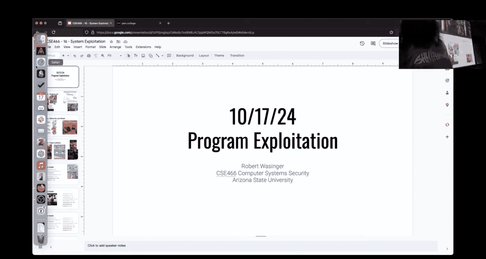
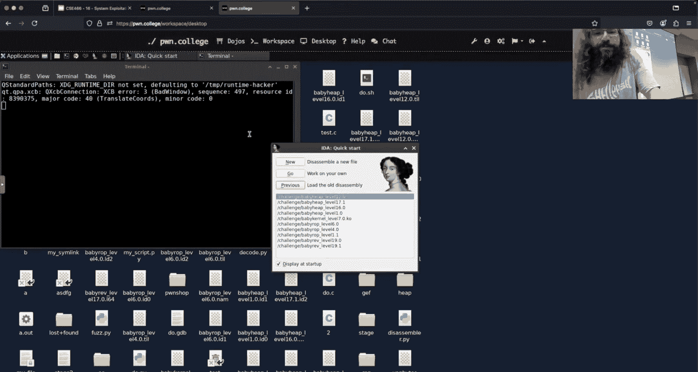
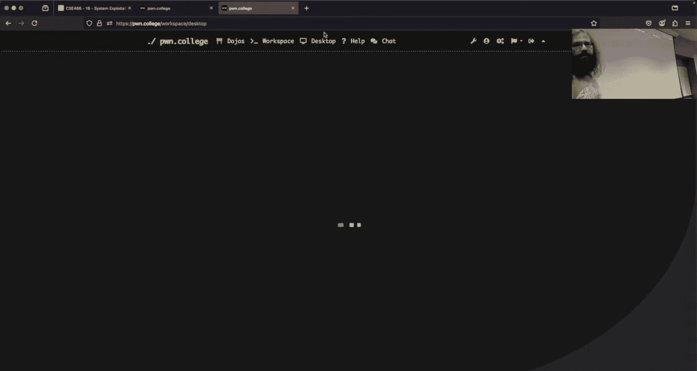
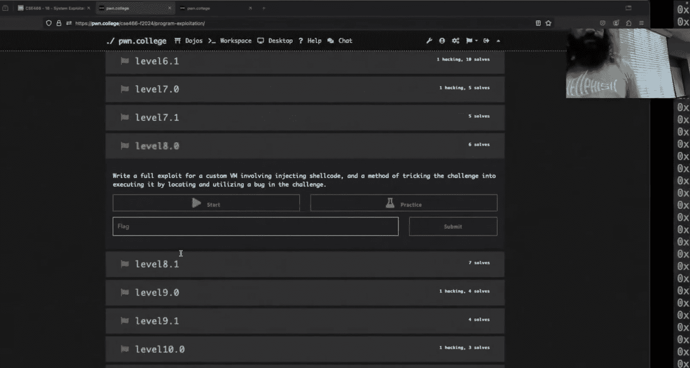

# ASU《计算机系统安全｜ASU CSE466 Computer Systems Security 2024》中英字幕deepseek p17 -18-Program Exploitation - CSE466 - Robert - 2024.10.17.zh_en -BV1spCGYZE9D_p17-

没。How about now， no audio。Give it a moment。嗯么。We tell Twitch new camera， who this？Oh。

 I'm not logged in， I was going to ask you。New camera， who is？Okay。

 so what I was rambling about was I bought a new camera so hopefully you can see my my amazing bass now。

Let me know if it is garbage and I can buy an old camera。Okay。

 so I'm pretty sure today is October 17th， 2024 here at ASU we are here in CSE 466 and。Over break。

You are assigned program exploitation which is kind of like a midterm module right it's a cumulative module shouldn't be any like brand new concepts really being thrown at you for the most part it should just be cleverly applying concepts that you have already seen。

So means。I think people in the end kind of like the heap at the beginning。

 I think people didn't like the heap。诶不。I think you came around on on you after you understood how it worked。

I。I like this one all right it's hard to see the cost a little smaller but the next pointer is the same on all of these right and then so results are meeting expectations I don't know we got a whole bunch of the same thing apparently in the TC right that's like this one here made me think of a different module that historically has been taught in CSE 598。

Where we specifically try and look at exactly this， how do you if I'm given like a heap。

Arbitrary read how do I turn that into a stack leak or how do I turn that into LC leak or how do I jump around and pivot pivot it around memory right and iss that really something you have to deal with in this module it's just not something we specifically call out and make a you know critical point。

😡，I may or may not bring this。In down into words66。At some point。Oh。

 what do we got here baby level 20， I think out a curiosity people here who solved like 1920。

1920 anyone oh but just 1 you got， okay， 19 halfway， okay。

 but like hopefully those that gave 20 a good， good u good effort。

Like you had some fun with it because you saw what I was doing to you right the last four challenges。

Or definitely not easy， but I think if you enjoy this type of stuff， they're definitely fun。

like the little sub problemsm that were specifically baked in there like one of them in earlier levels is the non print characters and not white space armoring anything for you it was just like this happy accident it was like oh well that's great let's see if you could figure it out。

啊。Consistently， we'll do this。诶。And this will happen。

For this entire course and if you decide to continue working in this area。

 you'll make the same mistakes over and over again and it'll hurt and it'll be a waste of time and it'll suck and you'll feel bad and eventually。

You'll remember all of the things that have to be right。诶。good example。

 if you're stealing something from the help text， okay that's great。

 not going to work in the point one， you know that why you do it。

For whatever reason we still love brute forcing， I blame I don't know what I blame like every every class that I teach just brute brute force is not the answer Ben okay。

 if that's the the only tool in your toolbox like everything isn't a nail you can be a lot more strategic as you all know and I preach by using something like GB。

嗯。Boom， all right， Twitch， I can see you today。 So here's slide one。Wait for the delay。Maybe。

Why does technology not work？

Okay， slide one。Is going to update on Twitch now。The slide two。Nothing's going to get done today day。

Everyone like to brief for stuff， you don't have to like9 times out of 10。

 you can answer the question to the thing that you're stuck on by using GDP and using GDP。

 I'll say intelligently， there's definitely many ways to use GDP that aren't answering the question that you have。

😡，Program exploitation， so people looked ahead here and hey big spooky thing because this is not a baby level as far as the challenge design。

 they are prefiked with toddler similarly system exploitation is toddler as well because it's a cumulative thing you know hopefully you started with kind of these baby concepts of exploitation and now you're going to have to apply them in a less obvious content。

But apparently some people like burn through the checkpoint right that's a good sign to me this is as I said there shouldn't be a whole lot of new concepts I saw in the Discord some people said that like halfway through it like suddenly it jumps up I don't know that is the case if there's something that people are heard stuck on I'm just going to guess that's where like John 85 starts to period。

Because we should love 185 and 985 instructionss。We're past the deadline but I did like that name because you simultaneously were trying to figure finish up baby heap while dealing with the exploitation stuff being assigned and yawn 85 is there。

 and then one of the things so as it says burn exploitation yawn 85 furthest back is yaon 64。

Which is the thing that's not made up that is waiting for you at the end of the current challenge set。

So does anyone know why JanN 85 is 85？I想 take多佢。So so it's a rip off of the 886 processor which is actually a eight bit processor yeah yeah。

 I think it's Jan's birthdays 1985 this is why I see at young 85 but it would it would make sense right when we say。

TheY 85 million of Pex 86， which is a 32 bit processor， but the yan 85 Vm is8 bits， right？

How many bit do you think Jann 86 is or Jann 64s？664 bits。60What up？

Right I'm going I was thinking you say the 64 of 16 because're doubling Okay so it yeah。

 if you didn't know like it would be a okay if we're doubling maybe ya yan 64 is really 16 bits and we just say yeah screw it bigger number。

 bigger number but no， it is actually a 64 bit yan Vm implementation。So course schedule， we are done。

With like pretty much first half， right？If you' made it this far， hopefully your're。

 if you' feeling pretty good about it， you should feel pretty good about it， right？

We're halfway there， so we're on our fifth module， there's five more we're at the halfway point。

We are going to proceed as scheduled。Someone says 7。

0 is a 1 billion% jump in difficulty because of beyond 85 that is a big percentage jump all right。

I don't know who it was if someone on the discord told me it was physically impossible to run a challenge last night and like I threw a sentence out and then it was suddenly cured。

II bet you that with a little bit of like stepping back and first principles。

 hopefully you wrote that asmbler or disassembler。That was suggested back in Baby Re John 85 isn't that scary。

So there's our full course schedule， right？I just haven't had this on a slide deck in a while and so people were looking back at the intro slides now nothing's actually changed here。

So grades， happy to misuse， dynamic allocator misuse， solve grade。咩啊。Looks okay to me。

 looks as you'd generally expect， it is nice to see that there are very few people starting over here on the weekends now there's still some people that started earlier。

May have not made it very far but。Generally speaking， no one is waiting on the very end。

Seul distribution， this is specifically for a key module。Here's what we see。

 I'm pretty happy with that where most people， most people are over here at 60% or more。

With most people completing everything。Looks good to me。OfCourse， Gregs。

 now this is including extra credit。Or prior ones we not I think that's worth noting if you're comparing these two graphs this one and it has to do with how because you can't get more than 100% on an individual module。

 so when I bucket this into a histogram of 10 buckets the highest things that one can get on a module is 100% that makes sense。

 however since this course。😡，Fade distribution is including extra credit the higher fees are not pocketed at clear 10% increments because I think the highest rate in the class is 108%。

I think right now。And so that that is the upper end here， so that means that each one of these。

Pockets are like 12% give or take。But again， pretty happy distribution again。

 I'm the only counting people who solved at least one thing in the current module。I am。By and large。

 most people are plugging along。Looks good to me。 Anyone disagree， think this is like horrifically。

Yeah， we're cru。All right。Mean points one of the things that apparently some people are very passionate about is what is the definition of a week。

 I don't know who I'm arguing with but but this is they're like discussing this with。

 but that this this has gone to like an insane degree at this point as far as I'm concerned I don't know who it is and it's probably for the best that I don't。

😡，There were suggestions that I change right now。I know what the webage currently displays and it shows。

 I think Wednesdays。It's actually Tuesdays because time zones are hard okay。

 it was what it was doing they're still doing right now so I haven't moved in my PR it was 6 pm on Tuesday because when the weeks were resetsect which Arizona is UTC minus seven。

 you had seven hours that shows up as Wednesday when I turn that into a date because it's still in UTC fun and fun fact you can look at the PR if you want to see all the fun details。

So previously it was starting ending at 6p， no matter what I do， okay。

 it will negatively impact some students。And you'll be like oh no it doesn't Ive looked at what happens if I give all of you 。

5% turns out that would be unfair， I've looked at what if I roll it back a week well that's going to be more than 16 weeks that would be unfair。

 I've looked at what if I move it back to Sunday you'd be like or Sunday or Monday right something that someone would think is the beginning of the week。

😡，Makes sense。There's about 50 students who would gain an extra 0。5% extra credit。

There's also a file， I think it's 38 students that would lose  point。5% extra credit。

And in my opinion， there's like， I don't care who wins or loses there， right， I don't。

 I don't have a horse in the race。I just need to be like fair and consistent about it now one thing that should be fair and consistent is 6 pm is like this arbitrary time to draw the line I agree with either and so whatever emerge this PR should be later tonight that'll get moved so Tuesday is Monday at midnight is technically when everything resets。

😡，that aligns with when the assignments go out。That aligns with exactly 16 weeks。

Or that that not when the assignments go， but when the first lecture of a topic occurred right we launched on Friday first class is the following Tuesday。

 so we reset at Monday at midnight， all right there's some new topic or new thing that the class is focused on that you can meme and dunk on right？

嗯。That makes that makes sense to me。Ultimately， this change。Where I decide a week begins。Is a 0。

5% extra credit difference right unless you're doing like some weird thing where I'm posting I'm assuming that you're posting on like a semivagular ski right if you're posting on like a Tuesday。

 then on like a Friday actually that would still be the same on this right like there is a very specific scenario where you could post on like a Sunday and then a Thursday or a Sunday then a Monday or I don't know you could do it so you exactly straddle that you were thinking that a reset reset on a particular day and you were trying to straddle that and be clever well it turns out you're just a victim of your own cleverness All right like I don't have a lot of sympathy there like in spirit you're posting once a week and once a week is once a week not two days。

啊。Right next to each other。咩。Like I said， there's still some people who hypothetically lost 0。

5% extra credit by me making this ruling。系。I don't think this is going to be a big deal。If。

At the end of the semester， you're  point5% away from a grade cut。

 it's going to be the difference between a B plus and an a minus and my gosh， you need that a minus。

You can send me a D。Be in a class be like， hey I'm I'm done working on stuff。

 I think I lost that point by percent and that is going make or break my academic career all right。

 you can send you can send me a DMN I have a list of the accounts that are impacted negatively by this and if you're like I really need that。

And youre one of those people I'll make it right the goal is not to harm anyone or hurt anyone's grade we're supposed to like have fun。

 get some extra credit it's supposed to be pretty pretty chill honestly and and this past week thinking about memes and weeks and all of the different permutations and ways I could deal with this which I came up with like10 different solutions and there was none that were actually like net positive for everyone。

😡，U。It has not been chill， right it is not what I wanted to spend a good part of my time on。

But I did I did put in the effort oh and I also transcribed every single video just for the record。

 I transcribed every single YouTube video from every single class and I never said that it starts on Mondays。

The closest thing I said is that it specifically does not start on Monday and it's going to be like some flex thing。

 but it was like a hand wavy arbitrary we up。So there's nothing to hold me to there。

 and if you find something otherwise， I'm going to blame your transcription service。

 but I also did put an effort to try and hold myself accountable to whatever it is that people are remembering。

I did put an effort on those fronts。Okay， of course， great。

Class average without extra credits like a 75。21 so that's what a mid midC class average with extra credit is a 78。

98 it's actually kind of disappointing why is it disappointing because we just got done spending like five minutes10 minutes talking about freaking memes and weeks where we can draw this line over 0。

5% extra credit you know what the average student who's actively solving challenges on this course is done they posted one what？

2。5 means。There's been eight weeks。ok。that could be 4% in the upper end。

 if people were actually posting memes on a regular basis in this class they were getting like。

 that numbers should be at least two probably three or higher。

 this is three extra credit for posting some really low effort meme that is somewhat relevant。😡。

You can literally type into Google Meme generator， pick some template。

 put Rob Ws G right and upload it there and you have like a nonzero chance that I'm going to light it Now don't do that because now I specifically won't but the point is is the bar is pretty low And so for us to have this great discussion about oh my gosh。

 what am I going to do when the week's end I'm trying to mid a game。😡，As a class。

 people aren't doing that。All right， so I don't think this is going to really be a big deal。

Similarly， health extra credit。Goes up to 5% average person here。

As point9 and that is really just like a couple extreme helpers and most people just don't drive at all it is worth posting。

That's like what one you we did the math a week ago， one was worth like 0。86 or something， right？

89 you remember I don't so so that means that the average person in this class has said one helpful thing okay。

 two helpful things would give you as much like extra credit if not more than posting a me so so like。

Guys。Use the extra credit。I don't know what's wrong with you。

 I'm telling you I'm not going to cur this class， here's some three points。All。

logisticgistics the next module listed on the course schedule that I just showed like three times is kernel I may or may not change that the reason that I may or may not change that is I'm trying to make it so that the experience sucks less for you so doing kernel exploitation requires that the challenges all right inside of a VM because you're going need to exploit a kernel and you're not going to sp the kernel that the actual infrastructure runs hot right so so I need to all the challenges right inside a VM。

Earlier today， I helped install a new server that is specifically intended to be used for these kernel exploitation related things。

 and it has newer hardware that should make kernel VMs， the kernel challenges into VMs。

 not be as slow as molasses。The kind of caveat there is great。

 there's a new server it's you know somewhere in a data center there needs to be changes to infrastructure codes that I can route people to the right box。

 things like that that may or may not get done in the next week and then additionally for the kernel module in particular one of be benefits of having this newer hardware there's this newer hardware supports some security mechanisms that it would be great for us to explore and or discuss。

So depending upon how much of that stuff gets done by next week， Friday， if that all gets done。

 we'll launch kernelonel as intended， if not it'll be。Ass。I don't know， grid condition sandboxing。

 I could do I one， maybe sandboxing。I like sandbox。But yeah。

 all three of these kernel race and sandbox are all listed as one B and there isn't a direct dependency on any of them as far as I recall。

 so that means that I could flip any of them。New program exploitation challenges， I've designed two。

 I have two more that I want to make， there'd be eight challenges， eight new more。

 eight more challenges total being a 0。0 and a 0。1。😡，我嗰四。

It's not going to mess up your checkpoint either way。😡。

So whatever the checkpoint number is at the checkpoint is what 11。

Okay me adding challengeslles is not going to change the checkpoint。

 but you may get some new challenges thrown on there。对。冇错。

The total number of challenges in program expition now is 11 points0 at 01。Crrect。This is 23 points。

Wow， that's because， you know， 11 times two is 22， so it would be what， 12。0 to see if I can math。19。

0， something like that。喂。Maybe two， four， no， it's going to be four， 15。All right。

It'd be cooler if I did that， but I don't think I can make interesting that many interesting challenges by by the into this week。

But I do know where they're going， they are going to get tacked onto the end。

 they are not things that are going to be easier they're things that are going to be harder right think very similar to how I added city Claton to the heat stuff。

😡，But it'll be something fun， okay。Any questions on logistics class course schedule grades。

 extra credit， any of that good stuff。Any chance you get a new module too？😡，You ask them for more？

More work。New modules are coming out in 365。I don't think there's going to be any whole new modules for 466。

 there may just be content getting reworked。All right， God with that， I have no plans。

 but as I said I spent like the first half of my day really。Greatly air conditioned。

W which was amazing data center so I didn't have time to like throw it to go to a specific demo two things I heard of the Discor what is an intra frame overflow and then something about breaking out of yan 85 Vms that I'm not entirely sure what was being asked。

Anyone here something in particular there's stock kind they're interested in so the the this is kind of。

I don't need demo anything because it's a cumulative modules so the concepts you should already have right like I don't need to show you how to reverse engineer theres a reverse engineering module I don't need to show you how memory corruption works you did that right it's just about where is the correct context to apply to。

There's anyone here of something they want to hit me with。系 so when running point one。

The challenges with point which have no need information like may or challenge or any method names if I want to break somewhere like after the program puts like welcome to challenge something if I want to break then。

Is there anything I can do sort of just catchs that sounds like pain Yes so so for t the question was the 0。

1 challenges are script which means there are no symbols and that means when I GDP this socks because I'm using things like catch cis call to try and like what's that that thing and landed on the main method Yeah this like cis are different like catching the cisco is catching the actual cis right where we're like main is mains call。

No， so like， you can't catch this call because it's not a ci call。

 I can't even backrack to me after I I can't I can't go anywhere I where I am。 it's just a bit。 Yeah。

 the question is like do how do I deal with these strip binaries is there a better way。

 the answer is always yes， doesn't mean I know it。 But in this case I do So I can show you how to deal with strip binaries the other hand So I didn finish all the modules previously like I made like' 80% most of them So is there anything after 80 I affect me in this the statement for twitch is I didn't finish100% of the modules that came before。

 I finish， say 80% of them how is that going to affect me moving through the current modules here that's cumulative。

So I can't say for certain because I don't know what you like where the 80% cutoff is on everything。

 but I would say as a general design principle， you should have all of the tools at 80% you should have all of the tools to solve these challenges。

😡，I keep in mind that for most of these modules， the last like two or three levels are stretch goals they aren't necessarily intended for the average student to solve。

 which means that I'm not going to like hide to something that was in level baby heat level 20 and I'm going to include that。

😡，In this cumulative module， right？You probably have all of the knowledge most of these challenges。

 these cumulative challenges literally are like taking parts of things that were used in earlier levels right and so the like concepts or pieces of the program you should recognize to some degree。

Right like hey， I've seen this before how can I use this in this binary right because these ones aren't going to tell you oh。

 I'm reading in， you know， whatever now you can overwrate my saved return address Oh。

 you're too far away right this is supposed to be a bit more like like an exam there's still a 。

0 and a 。1。But。I 80% if you solve 80% of all the primary modules。

 you should have everything you need to solve these right the trick here for these cumulative things。

 particularly with like the comment that the first beyond 85 one is this insane jump。s am。

You need to reverse the binaries。Okay， I don't know。

 I don't know how people are doing this without reversing binary and this goes not only for like the cumulative modules。

 but just in general， your first step， I do not preach Ida。

 but your first step should be open the binary in IDda， run it a few times on the terminal。

 get a mental model of how this thing works。😡，Look at what's going on in the decompilation and be like。

huh， what's interesting？Like if you aren't doing that step， you've like。Brick yourself。

because then you don't know what am I trying to do right as a cumulative module figuring out where is the memory corruption is part of the challenge right how do you figure out where memory corruption is。

 you're going to reverse the binary you're going to throw in a whole bunch of input and see what se faults you're going to just try some stuff。

😡。

m， but as far as the core skills， 80% you should have enough。All right。

Ii have a question please 95 is it possible to。Make ya85 code do a cisco It's not designed to do。

 because I know there is only a couple of a couple I hope and read and write。

 is it possible for Yaanko to do perform a smand， for example， Or is it only the ciscos we see。

So this is something that you should be able to pretty straightforward figure out by doing exactly what I described。

 we'll do it right now and we'll just we'll think about it so we'll do that。 we'll plug some GDP。

 we'll talk about some of some overflows。 Yeah， all right， I think we got enough to fill the time。

Unless twitchw has anything， particularly spicy。 So hopefully this is a yawn 85 level。

 I just kind of arbitrarily chose it because it's one of the later ones。 Okay， so this binary。Says。

See if I can use a computer today。Eg going to do exactly what I what I described But there。

 This challenge is a custom emulator emulates completely custom architecture ya 85。 Hey。

 I've seen this before in Rev， it's a full yawn 85 emulator。 If to reason about yaon code。 this time。

 I'm in control。It doesn't allow us to call open via the assist instruction。 But luckily。

 it makes a memory air that will let us accomplish our goal。

 I don't know if this is the the level that you're particularly on， but we're going to use it as a。

Yeah， we're going to use it as a stand， right？Go。We see here it's going to call Reed up to hex 300 bytes into this buffer。

What's a question I may want to ask right now？Okay， is there above or overflow。

 I don't know if there is or isn't， but this is。Now you're making weird face this is a ya a challenge right so even if we do a buffer we still have to I mean the overflow thing has to be6 to or not。

H this is I。Is okay， I'm going to ask that you repeat that because you said a few things and I don't know which ones I want to correct。

So if we do a buffero overflow， that means we are modifying something existing in the stack so which would be X 664 in this case。

 but we are dealing with yafi this challenge so is buffero were really appropriate here fact so the question is is you there are a few things kind of baked in another question。

But the first one is okay， this is a buffer overflow if I were to like hypothetically right hypothetically if there if this were a buffer overflow what would I be overflowing onto to right well okay I would want to I'd be overflowing on the stack on the X86 stack because this is in fact in the X86 binary。

😡，Right， AB64， one of the things I would probably want to know if I was thinking and I sort the probably on this early blessing is is there a canary right because if there was a buffer overflow a on the stack the existence of a canary would influence whether I could or could not do this。

 right？Now the the other statement was this is a ya 85 tract so do I need to buffer do I need to overflow ya 85 stack or is this x 86 or do what am I dealing with here right and and I think people get。

😡，A little bit confused when they're thinking about this stuff and it's why there was this question on Disc we like。

 how do I break out of the Vm like the the Vm is just the x86 binary Eric， right？

but we don't know what the vulnerability is right they said there was memory corruption because above or overha does that lead to memory corruption yeah okay。

 I don't know where the vulnerability is this is a  point。

 zero that was as much help as I'm going to get。I run this thing， I'll give it some bytes。

It's going to。Take a look at the stack。ok。What stack is this， is this an X86 stack。

 is this a yawn 85 stack， I don know what's going on here？That's an next  area6 stack。

 right we haven't like。The today and crazy here we're referencing via RSP。

 this is the same type of printout you've seen before。

 we're looking at the sta we're still just thinking about the X86 binary。All right。

 it's interesting that the challenge chooses to show me the stack though， right。

 because that kind of implies that， hey， maybe the stack is something I want to look at。

It tells me the saved frame pointer tells me the saved return address。

 I hope this really isn't a buffer wuffer right there because I like just arbitrarily was like al let's talk about that that would be funny though and it tells me my return address。

Okay， it says it's a teaching challenge and then it starts to try and interpret whatever garbage I typed as ym from bites and prints it out。

 right？Is there a clear path from what I need to exploit here？No。

So so should I just like keep banging away on this， should I start writing Pi， no。

 I need to like think about what am I trying to do？And that brings me back to， okay。

 well what am I trying to do， what could I do， what can I do？Well。

 one thing I'm aware of is buffer overflows our type of memory corruption。

't please don't be the actual fault。So we're reading up to X 300 bytes into a buffer from。

Standard in， right if we。Let have Buff and we scroll up， we'll see how big buff is。This。

That's a number。Is that a bigger number or a smaller number？How can I change it， so I'm sure？

So this is buff， I need to make this， the other one was hacks。So oh。I hit Don I hit X。 No。

 X is cross reference。 How do I make this hexadeadecimal。Hlo。H。Capital age。嗯嗯。Okay。

 I'm incapable of using Ida。 This is why I。I'm a Judy B bro。Good。So the buffer is hex 400 in size。

And it reads in。Heck's 300， good， we're safe。Okay， so there is not buffer overflow there。Okay。

 put their car in， right？And we have to make that check。😡，To figure out。

 well where is the vulnerability right that that's how we need to be thinking about this in these cumulative modules because they aren't telling you what the plan of attack is right that very well could have been the case and maybe the case in one of these。

😡，All right， is there anything else here that looks？And harasston。Okay。

 we've see an interpreter loop， so we can go in there。

 it's interesting that that still shows the that this print out the stack。We'll go with it。

 all right， so we have interpreter loop， which calls interpret instruction。

 we've probably seen this already from Baby Rev。All right， we're interested in to circle back。

 can I make Janwn 85 do a ci call that is not what it intends， right？

I think a safe assumption is going to be that。We want to look at how does Ywn 85 implement Ci calls。

 right？And what we see here。There's that there is a switch right that's going to determine what the instruction is we want the interpret cysts。

 so there's going to be some other bike。In this case。It looks like whatever A2 is。

 that bite is determining which one of these branches we go into。And。We aren't。

Like this call to read， is this a literal cis call by like instruction？是。

You see the word cis call on my screen， no， so it's not a literal cis call instruction。

 what is this calling into？😡，It's calling into a litacy rapper， right in general。

back in She coding and we wrote She code that。Had the literal ciscal instruction in it。

 right in the X 86 assembly。 This isn't a literal ciscal instruction。 Well Yn 85。

 what the youngn 85 Vm is doing here。Is it is calling Re or is Re located？And guy。

 it's in Lib C right， and so it's going to call Lib C Lib C is then going to have the literal cis call x86 instruction。

Now if there were just the hypothetically as we're kind of like thinking about the problem space here。

 if there was a literal cis call instruction here， then RAX would determine what cis call is actually executed right and so we could influence RAX and that would determine what cis call was actually executed but that's not what we see here instead what we see is that it's calling into Lib C and it's calling read。

😡，And so I can't influence really what it calls here， right if we go a little bit lower。😡，We see。

Read memory， we see。Right。And if we go into the implementation here。😡，Again。

These are going into some other function。 they aren't performing a raw ciscal so there isn't。

There isn't a path here。In just like a simple memory corruption sense of some memory location or some value that we could corrupt that would influence。

😡，What this call is actually executed， right？Instead。

 it's just going to call a function conditionally based upon the value that is in a2。😡。

So what is your goal， your question was can I trigger a cis call that it just doesn't intend it doesn't it doesn't look like it as far as like we have to trigger some functionality that exists in the binary。

Can you restate what you're trying to do？Well， not just have a different battle where I would try to。

 I would see where since we're trying to give it some shell code。

 can I read in can I put a shell code to memory， can I read it from there is what I'm thinking it right now？

Can I'm thinking I'll just use the existing ciscalicles that are available。

Basically solve the challenge， Yeah， if if we take the challenge it face value right does it have open。

 does it have read， does it have right it doesn't have open。It doesn't have open， okay。

 so if that's our barrier here。诶。How can we address that？I use called嗯。Did you guys need something。

 We actually have this ro by。I find that very that's got to be a scheduling conflict I have this room every Tuesday and Thursday from 430 until like 545 really yeah yeah we have an event in here at six so let me ask youo okay okay you already back。

嗯。Yeah。So what does Open Readed R use？What did they work on？Like why do I need open。

 I need a file descriptor right can I get a file descriptor some way other than calling open in this binary？

I don't know that this is the intended solution we're just like talking here。

What do we know by filescriptors？All right， are filescriptors inherited would be a good question you could filescriptors are inherited I was talking a little bit someone someone hit me with I don't know if its this challenge or not but a question about filescriptors and so if I can't。

Proc self。Or not cat LSL。FDs， right， this is a thing。Prorac self。

it's Fd not Fds this gives me a listing of open file descriptors in the current running process but what is the current running process that's looking at this when I run this command is it bash。

And it's actually Ls。Right， which is like this weird meta thing when you're thinking about using prox cell。

Now， I happen to know inbaash。St 367， I can do。This。

And what I've done this is like some bash wizardry you don't have to know it but what this is done this is open to file descriptor on 367 and it is open for read and writeite。

 which is why I get the diamond and it is opening to attempt my secret file I' not saying that this is useful or what you need to do in this challenge it's just a discussion on file descriptors and if I run LSL product self secret file again。

 we see that LS has inherited this file descriptor。😡。

And so now it has 367 pointing to my secret file。 Did Els have to do anything to get that。No。

They just got it for free。Now， one of the things that is very likely to be a comment。

 I'm just like predicting the future here is what happens if I do this？

I get permission denied right because who's opening the flagpot bash that's actually except maybe I fontunce a little bit too smalls a scary thing we're running in bash because it's the equivalent except V so like if you just accept LS your terminal will likely disappear because youve turned bash into LS which will then write the standard out and then it's done it exits so then your terminal exits I don't know why you have to use exceptec it's like a ridiculous bashing except is the command to do this。

Because if you like typo it， you'll just lose your terminal but yeah。

 Ba is the one that's doing this and Ba doesn't have permission to open the flight file right so you you can do that。

You can make file descriptors be available in child processes。😡，If you have permission to open。呵。

That's something I would consider here。Yes， are file descriptors like a global thing Linux the question is。

 are file descriptors a global thing？The answer is no。

 we can poke a little bit more at this when we get into kernel。

 but the way that this file descriptor file descriptor are literally just numbers， right， there is。

Every running process。has inside of the kernel something that's called a taskstruct。

 you don't have to know what this thing looks like it's just a whole bunch of information the kernel has on a process。

😡，All right， one of the things there's on this task prompt is a list of open filescriptors。

 all it is is a mapping of what number goes to what file。All right， and so when you like fork。

 what are you doing well you're creating creating a call no you' well you're creating a new process。

 but you have the testing properties as your current process right and so no they aren't global but they're inherited from parent to child because you can copy that that ask and so we want filescriptors to be inherited compared to child it makes sense when you think about things like pipe right if I want to use a pipe to communicate from parent to child I make the pipe in the parent but I need the child to be able to interact with it。

So okay。Problem here is this thing doesn't call， if it does it call open anywhere。

Well， that's not what I want， let's do this。no。It definitely does not call open so I when I searched here。

 this showed me different functions in Lib C which was not very useful。

 but when I look at the dot because we know the dot table， if it calls open。

 then the dot table would have an entry for open。And it does， so like there's no way into Lib C here。

They're like。Direct clean path。I don know。 I touched a cable。 hypothetically。

And I don't know that this is a path either， but if I really need to call open。

Do I have the ability to leak one of these？And then do I have the ability to direct control flow？

Right like like a ro scenario can I get an see leak and if I get any of these then I could know where open is I could try and overrite a return address I don't think that's the case for this challenge because then none of these require ro I'll tell you that right now。

So that's that's not， at least none of these ones that you have right now， right？

So it's unlikely that that's the case， but it's something I would think about。

And so that that's how I would approach it and kind of reason about these questions， a good question。

 right？And the answer is there's a lot of things that one could do。

 but you have to look at the binary and you're like， can I do it？Did that was that helpful thinking。

 I danced around it a bit。Maybe。Lzy in a direction， all right， I'll take it。All right。

 now the other question here was strict binaries。Now， I broke Twitch when I touched the cable。

Do not touch the cable。Ban。All right， the other question was I have stripped binaries？

How do， how do I GDP？

So this was hiding somewhere in one of the reverse engineering lectures。Or class， not a ya dream。

 but in class。I bet I touched it。All right， where do we want GDP to go？Tell me， where are we going？

Right after the last Bu， like you' going afterput 80。18， you want to go here， all right。

So I put this in Ida， I see this number down here， 1 BC， what is that？

That's the offset from the elk stock。 Okay， that is correct。 was that' the offset into the elf start。

Why is that useful to me， anyone that actually remembers what I said？

I guess I don't know V mapping get the basic address add this stop Okay。

 so we have this like idea we could Vm map this and this base address up there at4 three4000 that's going to change I could get that I could add to it and I could find it right。

 but every time that I run this is that going to be the same number Oh that's going be paying。即系叫食。

I'm sorry so there's a statement about specifying a base address in GDP。

I don't know that functionality offhand， does that work on setU ID binaries？

I bet not because by default， GDPB does not disable ASLR and set U ID binaries。All right。

 so what happens if I copy this challenge into down？Is my Ppy a setU ID binary？

Okay so what happens if a GDP does copy？That's a pretty consistent number， isn't it。

 we've seen that one before。If I run this again， do I get that same number？Yes， I do。Okay。

 so now my math is at least gotten to a consistent number， right， that's good。

The other thing I could do is in my GDP in net， I have this third line here that says set dollar sign base equals and then it has that number。

I could probably use like this set based functionality of GDP right I'm going to do the reverse and it's going to say as long as it's not set your ID I know what it is。

😡，啊，是。All right， now someone's starting to smile， I think they see where we're going here。

So I'm going to Gb on my copy。Where do I want to set my breakpoint？Base plus 1b。 what did I do？

Did I not start？嗯 don' hear theた。Okay， oh， I didn't okay。I believe in all capitals。There we go。

 Star included。I'm claiming that that is where it's going to be。

Is that is that is that your line all right we got there and and all of a sudden dealing with strip binaries is less pain right the key here was to allow GDP to disable randomization。

And then take advantage of the fact that the de randomized base address is something that we know and we can set that as a variable in our GB in so it's just always there for us Can I set the base to just zero。

😡，we'd have to ask in the back， how do I set the base address I was talking about Oh okay， okay。

 I thought you were saying there was some magic G command to literally base the elf somewhere and I was like like that would be crazy like I could see maybe Gd could do it because G can do anything but it's not not wizardry I'm aware of。

U so， and this basically surface is just for the binary and the heat that it would be for anything that is contiguous from this memory address。

So we look here， all right， five and5，500，5 5，5000，5，60056，57，57，58，859，59，7 a okay so。Yeah。

It would be to there。That would work， but generally speaking what we want to do is we want to use it to set breakpoints right because what we're interested in is the text section。

 which is going to be this region that's why we use it hypothetically you could。

Use the base address to access， for instance， something in like the BSS。

 which would be this region that'd be a little bit silly in my opinion for GDP purposes because like at that point if I want to do something like that I'd start scripting and I'd have phone tools I'd load an elf object and I'd start playing that way instead of using GDP directly。

 but you could。The other thing here。Which I don't believe I showed， but。We'll give it a shot。

 we'll see if we can do it。Because it's typically that's what I do is I copy into town right there is a there is another way that we already have it。

Or where we have something， we'll move do dot pi to be I think three and we'll make a new do dot pi。

Okay。We'll import tone pun toolss。Normally we'd say like P equals GDP debug。Challenge。

Hower one level 8。1 right， we do this。And then a very important thing is to end your scripts with P interactive。

It doesn't have to be pe interactive， but I highly encourage the interactive is it's just going to solve。

Put guns for you。All right。And if I run this， what'll happen？It' not it's randomized。Why？

we use the setuI I use the set U ID binary， right？So。I'm going to have to cheat here。

We could look at P toolsol documentation， but I'm going to use。The the bugger or the interactive。

 the bugger here is it going to show me what I want， Yes。

 there's two arguments here that I could pass to process that are interesting to me right the first is set you ID and the second is ASLR。

So Gb will not disable aLR on a set UI binary。So I want it to not be at UI。

And then what I really want is to disable ASOR。So let's say ASLR。Pase。不。I did the exact same thing。

 but now I'm starting it from P tools。What do we need to disable ASLR because what is the functionality that randomizes addresses。

 but when we run GDP on a let's say copy of a 0。1 binary， ASLR is enabled even then right？

You're saying if I run GDP on a non set UI binary。So ASLR is enabled on the system。

 but GDP will disable ASLR by default yes， command line GDP will disable ASLR for non set U ID by。😡。

UY's lecture videos， the prerecorded ones when I want to say a member when he talks about ASLR。

 he shows how to do it just in bash right， you you can run。

 I don't know if it's a PR control command because it's not something I I typically do。

 but you can start up a shell that just disables ASLR for that shell。

Probably requires because otherwise that would be O， right？

And so so this is how I how I prefer to deal with it right either just copy the binary if that makes sense。

 work on the non UI one or if I'm doing so some scripting and for whatever reason I want to be a fancy Python boy。

 I can do this this as well。Does that get you everything you need for your your stripped GDP awesomeness all right。

 let me take a quick look here at Twitch I've got roughly 10 minutes left what do we got here？Okay。

 you found my typo on the slides。是。Thank you for sharing， we certainly try。Coing it okay。

 the question is with copying it to get rid of the ASLR。

 can you do that for all challenges and will it give you the flag that？

Or does it need to be solved through the original challenge？So that's a reasonable question。

Can you do can you copy every binary， the answer is yes。Can you SCP every binary， the answer is yes。

 can a non set UI binary。Access the flag。No， why？The flag is only openable by root and if I copy the binary it's not running as root because it's not set U ID and so there are challenges that for instance。

 seed on the flag right they at the very beginning when they start up。

 they access the sg file and they need it to do some randomization。

 something like that yeah if I copy the binary and it depends on that。😡，Itll it'll fail， right。

 I can't do anything there。But what can I do？I can use practice mode right I could copy。

 copy the binary， I could then pseudo C mod the flag like I can create a scenario where I can debug this behaving somewhat same I just need to understand what mechanisms are at work and address whatever the specific pain points are。

😡，All right， Was there anything I said intraflame frame overflow， did I address what you had。

 I don't remember what your question was。Yes， yes， okay。

 I just gotta make sure all right on three for three there we talked a little bit about you on 85 Vms。

 there isn't like an escape the Vm right it's understand the implementation find the bug is it a memory corruption bug is it a interpreting an unsigned into as an in you know like a type conversion bug I there a buffer overflow there's got to be a buffer overflow in this right like not this level but like。

Some of these have to have buffer overflows， there's no way we have a cumulative challenge that doesn't involve that and so that's where it's finest。

And that is part of the challenge there， so I don't want to get too crazy there。

Question from Titch here， this is how you disable ASR and Linux via of bash。Okay。

 so that's not what I was going for。That is not the command， so that I was thinking of。

 they were pointing out that inside proxis， kernel randomized VA space。

Random mind VA space this number is remember proc is the pseudoophile system that the kernel exposes it shows us to。

 and if we were to look at man Proc， this too implies that asLR is fully enabled。

 it's going to randomize everything that it can you can probably write to that variable to disable it at the kernel level but there is another command maybe I'll look that up for next class so you can just run on the shell you basically exact another bash inside of bash with a specific。

I want to say it's a PR PR or CTL command， but I don't know it， so I'm not going to pretend I do。

To disabled SLR， but yeah。You spend a lot more time here trying to find the vulnerability that's that's where your pain is for for this module。

Okay， very last thing here was an inter frame。

Let's to go back to 8。0， because it already prints the。The stack， right？Conveniently。

An inter frame overflow。So if I give this thing a bunch of A's。

This is nice enough to print the stack out for me。 Are my A's on the stack， they are。Okay。Let's see。

 How much。Yeah。Of the stack is this showing me。So this is probably all just main， why can I say that？

😡，Just drop a wizard。It's just a guess like there's a rhyme reason to it。

 so so this is where my aims are getting written。It's a stack frame。

 so this is somewhere within the frame and if I scroll all the way down。

 what do I see what does this look like Yeah caning？Okay， what happens at the canary。

 that's the end of the stack cr， right， so this should be my。Main print。

Saaved RVP saved it's zero why because I'm looking at the stacker of main Sa RVP isn't used up in Lib C。

 which is what calls Maine right make sense in this。

Is going to be the return address for main up in up inside of Liy start main right that looks like the end of a stack frame so it's really only printing out one stack frame so this challenge probably doesn't involve intratro frame overflow maybe it does。

 but it'd be a little silly to only print out in the help text a single frame。嗯。Let's find。 Oh。

 there's a， what was it interpreter loop， info funk。Yes， let's break at。Interpreter Lot。

Do I get there？I do。Okay。This doesn't have a lot of function frame。But there's at least two。

 what are they？😡，Now interpreter loops one that's my current function frame and then the thing that called interpreter loop which is going to be made。

 so I have two two function frames here What happens if I do the old classic100 give me 100 giant hacks at RSP。

This is going to look a lot like。嗯。When I thinking about this right。

 I'm printinging down the stack subtracts。Yes， we write up， okay， I need more than 100 giant hacks。

Do 400 giant hacks。I want a lot。All right。And so。What I see here is that there's myes。We go down。

Where is there's more stuff on the stack now。Right， because the programs ran a bit more。

 Somewhere down here is going to be my canary。Did I skip it？You find it？B， D33，8， Okay。

 that looks like my canary。 So this is the end of that function frame right。

 there's going to be a whole what what is on the other side of that function frame race frame main mainframe。

So what happens if I overflow？Not from here。For I mean。

 I start from there because that's where I happen to read。Then I blow past this canary。

 I blow past this saved RVP。 I blow past this saved return address。

 and we just keep cruising Some here。 There's going to be another。Canary lookin thing。嗯。Right here。

This is the canary for Maine， this is save RBP， which apparently just has some garbage in it。

How did I get that home， That's just garbage and garbage， isn't it。

That looks like garbage and garbage。 Did I miss。 So maybe that's not a canary。

 but I can overflow beyond mains frame or beyond the current function frame into main and target not the return address of my current function。

 but the return address of my next function。Right？What is a problem that I'll inevitably run into？

CanSo can is is a problem。What else is is a problem we can just focus on this area right here where I have a canary。

 a saved RVP， and then a saved proton draft。You people would like something new。D the control。

So yeah， if I'm targeting something in the next frame。I have to worry about the canary。

 but do I have to care about， is the same RVP something that's saying？Yeah， probably。

Because if I mess up saved RVP and then when I it returns and it goes back to Maine。

 if Maine references something relative to RVP， I'll probably say fault。

 so I have to make sure saved RVP。😡，Is whatever it expects。

 do I have to care about the saves rip that I'm blowing past？Yes， why？

Because you have to come back from Peterer look to Ma and then made to somebody you want。

 so first jump。So the statement was if I'm trying to。Blow past this and I want Ma to return。

 I have to get to Maine， so I need this return address to probably be what it already was because I want this function to behave as normally as possible。

Now， why would I want to do that？I don't know right， end example that I could think of I right。

 I could write to this return address， so do why do I care about blowing through too？I don't know。

 maybe maybe there's maybe there's some critical value inside of main that I'm trying to overwrite that goes to win right and so that's where that variable is stored on the stack' it's in the stack frame of main。

😡，A more complicated scenario that I can definitely think of is what where was the return address of man the same return address。

 where does that go to goes to the Lib C where does the return address of interpreter loop go to who goes to Ma goes to the elf。

 what if I want to partially overriding to Lib C for something？

I can't do that from the interpreter loop。 I can do that from man。

 not saying that's what this challenge challenge asks for or any of the challenge ask for。

 but something to think about， right， Why one would want to do that With that。

 somebody else said that they do own the room。 I'm over time， I'm calling it there。

 I appreciate everyone hanging out。😡。

