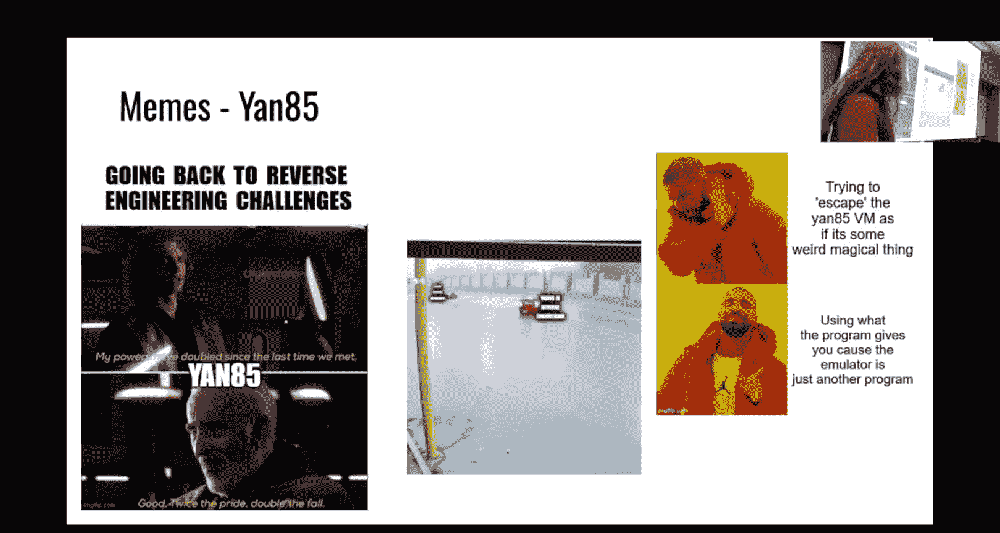
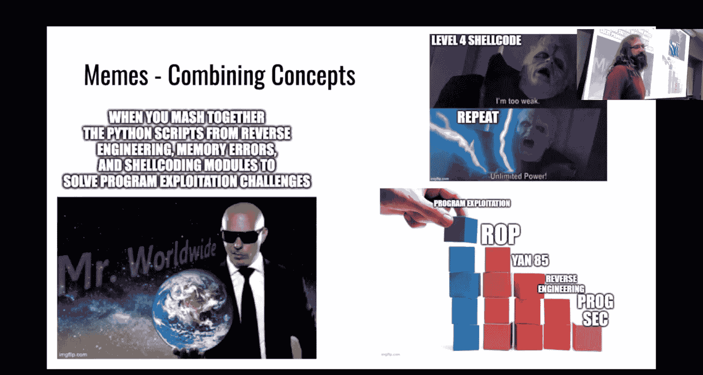
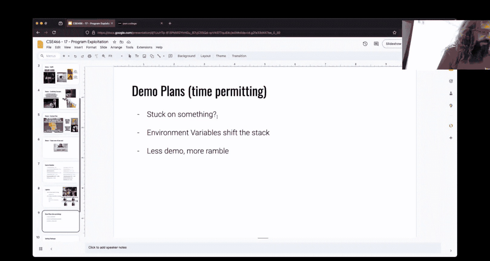
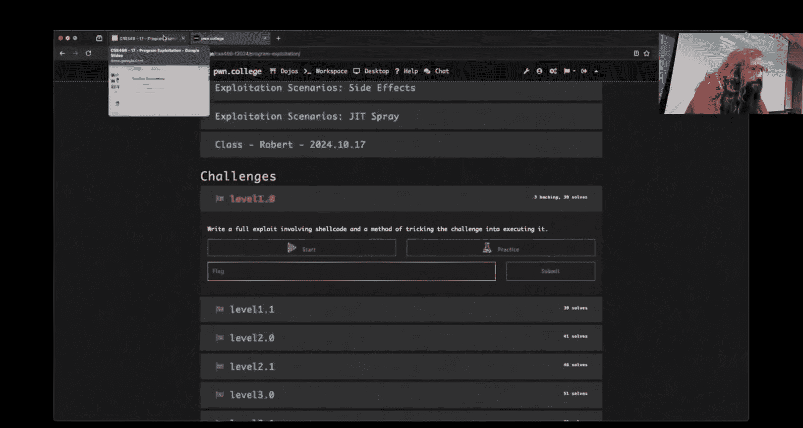
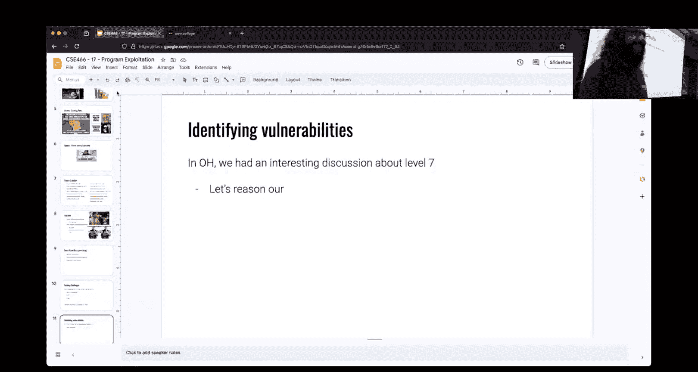
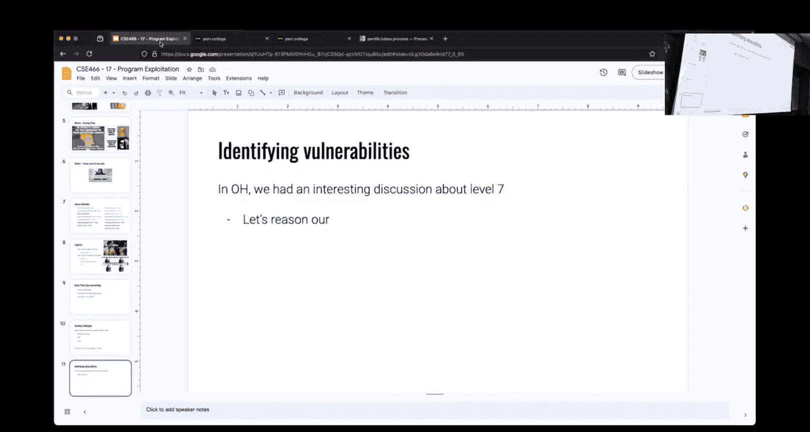
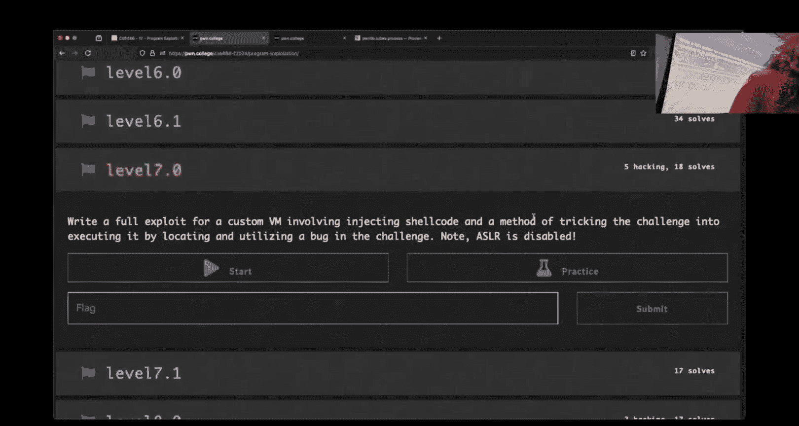
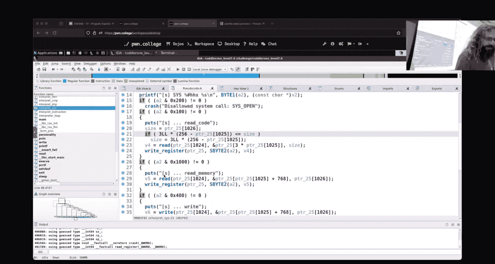

# ASU《计算机系统安全｜ASU CSE466 Computer Systems Security 2024》中英字幕deepseek p18 -19-Program Exploitation - CSE466 - Robert - 2024.10.22.zh_en -BV1spCGYZE9D_p18-

On。You can completely give up on full screen ever working on slides。嗯。All right， we are live Twitch。

 I'm going to hit the button， see if this goes big on your end。 it probably won't。

It did Do the slides change to day。Maybe they do all right。

 we have the technology today' is October 22 2024 we are here at CSE 466 we are currently what midway through a module entitled program exploitation it's kind of like a midterm combines a lot of the stuff we've talked about so far。

Memes， so as I mentioned back we had Re， Y 85 will make appearances again and again。

 somebody before the stream started here made the comment that hey。

 these program exploitation levels are very much like baby Re 22。1。They are， but it is， but it isn't。

 if I remember， right， I think that one required you to do some like blind side channel stuff。

We don't make you do that in these levels if you are doing that you're definitely putting in a whole bunch of work if you don't need to but they are challenges that take in yaon code so this is the first juncture we're having a yan code asmbler and or disassembler which hopefully you've realized they are very much kind of the same thing we'll see you a bunch of time。

So if you don't like Y 85， which tends to be the prevailing thought， this is you。

Congratulations if you have made it to the end of this course。

 this is somebody who just happened to finish something that you'll deal with later a microarch there is also yawn 85 so so that's something to look forward to there when we talk about spec of execution and things that you can't debug and then we throw yawn 85 at as well somebody is quite happy that they're finally them with yawn 85 know maybe maybe you'll get there。

 but it won't be a microarch because you'll see yaon 85 again system。Thank in general。

 I'm sure that was sarcasm。I was going to say sarcastic and it came out that way。

985 really isn't that bad。

Easy me， easyy points， right， post the memes get some extra credit。

 Hopefully we're we're on board with that right now。 more people banging out yawn 85 memes right。

 yawn 85， we saw it before we see it again。 yan 85 reverse engineering。 Hey。

 it comes back we're doing the same thing。 consistent theme。This one you know。

 at least we're doing a little something a little bit different with Janon 85。

Some people have asked about how do I escape the VM like no the VM is some mythological thing you know it has these parts that we don't understand but's not that's not true like the Y 85 VM or Y 85 CPU that emulation layer is C code it's a binary that we can reverse engineer we can understand how it works we can look at what's going on in memory in reason about its behavior right a virtual machine is still just a program at the end of the day even if you were looking at a more advanced virtual machine。

😡，We'll think like virtualrual B at the end of the day， it's still just a userland program。😡。

And so you can apply these same concepts to it， don't let the fact that it is a BM be this spooky。

 scary thing because it hopefully a part of this course is revealing that these things aren't really that spooky or scary。

So we said this module is kind of like a midterm right so we're combining a bunch of things together we're writing Python script for using P toolss we are reverse engineering we should be using memory corruption there's some shell coding in here right we're putting all of the pieces together in this module and hopefully doing stuff that after you've done it you feel like hey this is kind of clever right it was something kind of interesting and new。

Where the earlier challenges were very much like here is what you do， right。

 that this does require a bit more critical thinking and application。

What do I got here， I can't read that。 It's too large。

I'm sure if I should feel cool navigating the stack andary avoiding canaries。

Or feel like a complete nu since the challenges are called toddler Yes。

 so the challenges do have a progression right in in name we have baby and we have toddler that isn't just the midterms for this course midterms of the only things you will see that will be toddler right it's kind of learning to crawl learning to walk learning to stumble somebody on the discord asks you know hey。

 what is the applicability of I don't know what level it was。

 it was something with a linear buffer over flow like how much does this match stuff that happens out in the real world it's totally fair to say these challenges are somewhat contrive like they kind of have to be because they are meant to teach you specific concepts that make you practice very specific skills when you talk about exploits in the wild。

 they're much closer to what we're doing in this module as far as a lot more moving pieces or a lot closer to what you see in heap or system exploitation。

Where the path to kind of gaining control flow is a little bit less clear and if you carry on from this course to CSC598 in the spring you'll get to see more convoluted scenarios where we give you more tools again we throw at it and it's now up to you to kind of navigate that base right while we could keep going from toddler to the next thing to the next thing to the next thing right it's just how convoluted do you want it to be when we're trying to teach these kind of foundational concepts it absolutely makes sense to keep these relatively simple and straightforward。

This was a 365 beam， however， one of the things that I comment on when I talk about grades is。😡。

That these are people who have solved at least one challenge of the current module right， well。

 there actually is like this hidden subset of students。

Who still have not registered like linked their ASU account to Poone College and so I kind of assume that you're not doing the material。

 but I don't know because I don't know who you are so there's like 1012 students I believe that have not linked your Po College account to ASU so you don't show up in the grades data I don't know if you want a grade or not but if you don't link your Poone College account you won't get the grade and that will be unfortunate so here's your midway through reminder。

Coourse schedule I didn't change this around because I said we're going to change you probably might change some stuff on the bad half I think I have another slide that touches on what we're going to do and right now we are here in program exploitation。

Cool， I do so the next module I am going to push back Colel。

 I just I don't want it to be an issue where we launch something late because of in related things and Col if we don't get sued away would be like you think right now is slow you have no idea what slow is okay so instead we're going to mess around with race conditions is the next module that's going to go on Friday one of the nice things about race conditions is if the computer is slow。

 it's actually good for race conditions fun fact because you're era things right so the busier the computer the busier the computer is the easier it is to cause kind of these tiny things you be taking advantage of it now。

So we're going to do that， hopefully Colonel follows， if not。We'll play it by air。

 but hopefully that'll be brace then Col。I have said and people have meed and they are scared and they tell me no don't do this right I have said there he gonna to be new program exploitation challenges they're not live yet I'm aware of what the deadline is i'm aware of what that means I don't intend on being like here's some challenges you have three days so either like I'll launch them tonight at which point I think that's fair game you got a week or all long it's been late and what I'll do is I'll make the module requirement be say I add two I'll make the module requirement be two less so therefore that would be two over 22 or whatever if you completed all of the modules assigned there that would be extra credit for you it turns out like if you just think about like what I am probably doing here is I'm messing around with Janwn 85 I'm messing around with heap I'm messing around with Ro and how I can play around with these concepts so like one of the things that I。

It has to do， which I' at this point implemented several versions of。

Is figure out what does the heatap look like in yawn 85？Right啊。

And so I think I have a version of the heap on the 985 that I like。

 but one of the problems there when you're writing challenges is making sure that things are not too exploitable or too vulnerable to unintended exploits so like I wrote an implementation of the heap where you could get these pointers and then store them and like move them around but a side effect of that was I gave you the ability to like write to heap pointer or read to a heat pointer well at the end of the day what you're really doing there is you're just reading and write to a pointer I essentially just give you this free arbitrary read arbitrary ride and it made these challenges like super not interesting。

so instead I came up with a different wave of blend the he that I have right now we'll see。

 but yeah i'm not i'm not going add them and then like destroy your grain so like if that's what you're worried about don't be okay like that that is not the intention hopefully you guys realize I'm really not trying to be a bad guy。

All right， with that demo plans。I'm a little light on demo plans。

 so is there anything that you guys specifically want to talk about and always I open with that， yes。

😡，There is one challenge that there is only one cico。哦佢得你 gone。

It just isn have to steer the board and after that there is people are really hung up on filescriptures that was Tuesday's thing right people people asked about how do I make a yan 85 call open without open and we had this like ramble that was kind of bait for the immediate question but。

It did touch on some things that are useful in later challenges。啊。

So I can talk a little bit about file descriptors and to your I have to stare at the code thing。

 so this last bullet here says less demo more rambled， right？

I'll touch on that on the next slide or two， depending upon what I left in here so I。

Kind of gets you where you want there， I'm not going to answer your question。

 but I can talk around it。With this one of the things that at this point。

 hopefully people have realized people understand that the environment variables live on the stack and this shifts it or is this just like this hand wavy thing？

I got some thumbs up and I got some not not happening Okay， cool。

 I got like a canned three minute demo that can show that hopefully。

So let's do that real quick first。All right， so we are here on the Dojo。

 I have some binary a dot out， not check， I want check S。You'll notice that this is no PI8。Right。

what does PIE impact because there's something that people always get confused？What is PIE。

 is' the difference between PIE and ASLR？A seller is unable by the system like， but P。

Its for the binary if it is unable then if， it's close， so to regurgitate here。

 PI PIe is a compilation option of the binary itself that enables the binary to be randomized ASLR。

Is a like system configuration thing at runtime here where the kernel or the system will try and randomize addresses。

So if ASLR is enabled， which this is in PIe is not， the binary is not compiled with PIe。

 then the addresses of this binary must be。😡，Fixed this is like the world's most advanced pi all right。

 I don't know if if we can really cover this one today。I have the main function， it has a buffer。

 I then print F the address of this buffer， said。😡，So if this binary。Does not have PIe。

And ASLR is enabled。Do we expect this address？Which is just the address of the buffer that's shown here on the stack。

 do we expect that to be consistent or do we expect that to change and why？不 just。

OkaySomebody says consistent。Anyone disagree， does anyone think it'll change？Oh you got a hand。

 you're squinting。Yeah， but that's cause I did not。But。

right I'm not going to mess around with environment variables I'm literally just going to go dot slash8 out out dot slash8 out out there's not going to be any trickery here all right the problem is is like if I do it you'll see what it is right so there's one run maybe。

😡，Okay， that's what I get。We're building this， planning this demo on a different。Computer， okay。

 so we recompile it on the computer that we're on， I get this address。If I go up enter。

 do we expect this to be the same or different number， same？😡，Everyone's saying the same。

That's a shame because it turns out it's going to be there。

We just talked about this what does PIe allow things PIe is a compilation option that determines whether the binary。

😡，The binary when loaded in memory， is randomized。 Where is the stack， Is that in the binary， No。

 is Al or enabled， Yes， will the stack be randomized， Yes， because the stack is not in the binary。

 The stack is a separate region of memory。 It was， it was a trap。 and I got you all。Okay。

 so if we look at this in GDp the binary is all this stuff here that says temp8 out out right that is the binary that is the thing that is at this fixed address that has 44000 or whatever the stack is chilling all the way down here it has nothing to do with the binary。

😡，The stack is just a region of memory that we're like" and we're going to call this the stack and were going to we're going to do stack stuff here right so PIE has nothing to do with the stack。

😡，And a stack address being randomized。You hit my track。That one's so good。

 so we see that this is randomized。Oh， do I remember the secret option。 I do。

 I think I remember the secret option。And this is the ancient yawn。

Wisdom that he has when he talks about ASLar Ga you member correct。You can disable ASLR。

Temporarily using set arch。On the command button， so if I do this。

I've started up a new baS session where I have disabled address randomizations but that dashashA is doing check out man Se arch if you want to read the details。

Now if I run this thing。We are consistent。Has nothing to do with PIE。

 it has to do with the fact that I disabled ASLR。😡，Now。

The thing that we're trying to get to here is the second bullet here。

 environment variables shift on the stackt。Is this something I care about if the addresses are being randomized anyways？

😡，Not really。Because that change in the address。Is going to。

It's a drop in the pond some shift in stack addresses。

 It doesn't matter when it's being randomized anyways right， Who cares。

 I can't guess it or know it deterministically ahead of time anyways， but if ASLR is disabled。😡。

That I can deterministically know where the S is。For those that don't know。

 you can define environment variables by just declaring them on the terminal before you run a command。

Okay， same address。Now it's something different。It's gone down by 16 16 bytes， he 10。Why。

 how many bites have I added here，2，3，4，5，6，7，8，9，10，1112，13。 Okay， so whatever。

 whatever was in the environment it，13 was enough to shift。Environment variables。

 let's see if we can print this。Out。嗯ちち。Make this a void star。Let's examine like eight giant hacks。

At that address。And then let's examine the string right here。啊。So。Where are these pointers located。

 I just happen to know that there's invi right。😡，These are stack addresses， right？嗯。

Have you ever written a C program and then you begin with Maine？Maybe。嗯。Go on the stma。

 it's your boilerp， do I have to have this just be made with open closed prints？

Now I can get access to R andC RV and then EVP where EVP is an environment pointer right and these are things that I can interact with in anyC program where where are those environment variables stored they're stored on the stack and so we see and you say char star star EVP right and so I can this to avoid star I know it's a pointer to an array of char stars which means this is a pointer to a bunch of pointers and that's where when I do reference this first one I get this shell variable and these are all located。

Right next to each other。 So I should be able to do10 strings starting right here。we've found them。

And if we via map this。It is located on the stack。 We're at the beginning of main if we print the address of R。

 where we're actually now I lied。 we're at underscore start， but that's fine。

 So we are a little bit before Ma。But if we were to print RSP， we do see that E930 is less than。

EB F9。 remember the stackt grows down。 So these environment variables are above us in the stack。

 And so when we have more environment variables， they have to be on the stack。

 which then pushes down our RSP。How can I deal with that？Probably using Pe tools。 So let's do that。

Was this a mistake？Maybe。From Po importm star。The equals process paint that out。Panneractive。

All right， so we're just running this thing。Yeah。Somebody had to have figured it out right this is something you guys had to deal with in the first half of the challenge is how do you deal with it？

Clearly environment variables， how do I do that here in Poels？

Cool so the statement was inside a P equals process。

 we can say E and V equals an empty dictionary that's going to make the environment variables empty。

Therefore， it is now a known constant， which means what I observe here will be true the next time I run it with the same environment variance。

😡，Now， one of the things that people got hung up on is。I do this。

 because I always do things in practice， right？啊。I'm here in practice mode。And I get this value。

 but then I can't get it to work in challenge mode。hy。😡，It's the samemon di it。诶。So one of the。

Environment variables。His host name。Post name is just what is the name of the challenge environment that you're in in this case I am in practice hard it is practice squigggling program exploitation level 1。

0。What happens？

If I start the same challenge。In regular mode。Where am I program exploitation？1。0。

My host name is different， It is now program exploitation level 1。0。 I lost the word practice。😡。

How many letters practice， PRAC T， ICDA？Probably enough to shift the stack。

That's why when youre using GDP in one version and then trying to use the challenge these addresses weren't working fun fact if you do use GDP on a challenge。

See if I remember how to do this。I don't know， I don't even know what I'm debuing now。

What is inviron？No i'm a liar but GDP itself adds an additional environment variable by virtue of being GDP I want to say it's underscore so like if you did something like。

D NVI GB8 dot out， and then you were to check the environment。

 there's a special environment variable that GDP itself adds that will then ship the stack。

So how do I deal with that？I， I should be able to debug this thing and get a same。

The same thing I can reason about， right？喺度诶。别闭。So I could。

 the statement was I could subtract eight bias。I could it's probably not eight bytes right my guess would be it's a multiple of 16。

 but we could subtract 16 and just say， okay， I think that right？😡。

But now you're kind of guessing checking， right， which sometimes like a brute porus is just a really efficient guess and check right sometimes a guessing check is the right tool。

😡，But we can do better。And this goes back to something。

That we talked about way back in like reverse engineering。

We were talking about the various ways that you can debug a process。周。

What most people have probably gotten in the habit of doing。Is something like this。Right。

 we use Gb Dbug and we run this。This will then fire up GDPb except I don't have an A dot out because why would I？

Yes。Now it's just， it's just sad， oh， I'm not even where I think I am， okay。Cool。

 so then GDP starts up here。This is equivalent。To me， doing。GDB。Demo8 out。All。

And we can see that if we were to take a look at the process tree。

We'd see that GDP right here is what is starting up8 out of。

 which means that it is going to influence and change the environment variables there。

But the key here is that we need to create a consistent。Environment here。

 so now I'm not using GDP debug I am starting the challenge process from my script it is always starting with an empty environment。

 it doesn't need to be an empty environment， it just needs to be a consistent environment。😡，Well。

 we have a known state that the process is in。You'll notice over in P tools here， it does say。The PI。

Pid 347 in another terminal session weekend pseudo GDP a 347 I'm not in practice mode so this will fail。

 but if I was in practice mode， this would attach GDP when GDP attaches it is not going to insert anything into the environment variables is not going to change anything。

 we are debugging the exact known state that we are going to be exploited。

And so hopefully this is what you did instead of just like arbitrarily finding some discord message that said subtract eight if you did that's cool。

 but I'd like to at least tell myself that you guys。Or aware of why that was occurring。

So there was my little detour there。

The other thing I have here。Is less demo more ramble？So in office hours that I do on Friday。

We had kind of this interesting discussion because people were done with six and starting to get to the Janon 85 challenges right like god this is all easy yeah'm glad glad to hear that the earlier challenges are earlier modules not earlier challenges to this module earlier modules that we had there was a fixed thing that we were talking about we were talking about memory corruption everything was memory corruption you had an idea of what to do。

😡，We had a module on B， you know that you're going to be over the return address the foot rock is so you have an idea of what your strategy is going into it。

😡，Similarly with he， heap is a little bit more complicated than the earlier two concepts there。

 but you still know that I' messing around with the heap I'm trying to get this pointer right the exact mechanism inside of the heap that we were using might be different but you knew what what part of the program you wanted to target and that isn't true in this module there's actually kind of this meta skill let's reason are that's how far I got guys。

😡，So we have this meta skill of identifying vulnerabilities。Right， what。啊。

I know I typed more than that， Okay， but you have there's meta a skill of trying to identify where is the vulnerability of what is going on。

we ran into this in office hours because I don't like to look ahead and cheat because that you know is no fun for me and then you guys don't get to see for those of you that do show up to office hours。

 you guys don't wouldn't get to see me reason about the problem and think about it and so I want to try and repeat to some degree that process。

😡，All right， just out of curiosity for those that are here who has sold seven。Okay， less than half。

All right， one of the people that asked about seven。

Have a burning passion for file descriptors so I will I will talk a little bit about file descriptors once again。

It's not used in seven， it's not used it' in seven that this has me making sure that I knock this out before I I kill 45 minutes。

All right， so I said on what was said last week Thursday， Tuesday， I don't know what day it is。

 but you can create a file descriptor。By in Ba， by calling exact number。

 I then use this diamond operator， the diamond operator saying I want to open this file descriptor for open。

 or I'm sorry， for read and write。And it's going to be pointed at temp A。And just as a recap。

 if I can't crop self FD not cat， I want to LS。We see that eight is in fact a filescriptor that is not in my current process and in turn in child processes。

 and eight is pointing to T egg。And in general， all the de scriptors inherit from parent to child because when I run LsL。

 Prox self FD， what process am I inspecting？对。Self is not process。And Ls。

 that's the correct answer it's not actually Michel shell， right Ls is looking at itself。😡，U。

 so so we see that that file descriptor is inherited and that is the default behavior。On Python。

I'm sorry， not Python， it is not the default behavior on Python。

 it is the default behavior on like a Linux system on sea in insane worlds。嗯。Let's make this thing。

Oh no， we will read zero into Buff one。That makes sense。

I don't know what I need to include what is it uni yeah。Okay。So now I have this cool program。

That blocks so I can give it a bite is's really all I need right because we want to be able to look at。

Now。We said that where was which terminal， which terminal has eight？Not you。You。All right。

 if I run AO out here。Let's find out。Let's use the correct tool。Oh。We can LSL Proc 593 FD。Oh。

That inherited the file descriptive。Because that's the default behavior on Linux on C on general rule of thumb。

 what one would expect。Now if I'm on that same box。And we use a Python。Yeah。

Python would do the same thing。 I'm going to use P tools。

 This behavior does not is not specific to P tools。

I'm essentially doing the same thing the She is doing right I'm starting the process。

 then it's chilling here。What would one expect？One would expect？

The same default thing that I showed you。Python does not do that。How can we figure out why？

Normally I'd say read Man page， the equivalent here is read the docs。Can anyone see anything up here？

That looks like it might be relevant， closer close that piece。

So this is actually something that is inherited or that default of closing is the behavior of some process of Python。

 not phone tools just arbitrarily deciding that。And so by default。

 when you start up the process with phone tools or subprocess， it's going to close file descriptors。

What do you think I need to do？That's right， we make close Fds false。If I do this。

Now we can use full fancy bash。哦。Still can't type them。嗯。Apparently not。Oh， there's more than one。

 It's all over。Yeah。But we see now it does have tapine。And so that's just a super simple gotcha。

there is a challenge where this is relevant， you'll know it。When you see it。It is not level 7。再啲。不议。

We can determineally know the file descriptor or the flag。But we can open liability opportunity。

the statement was， so we can deterministically know the file descriptor for the flag because we can deterministically open up file descriptors and then make the some process in arbitrary because they can't do the flag。

 I guess。Yeah we can't do the file we can do any other fire so we can do any file that we can open anyways right that this is like this is insane bation tax for the equivalent of merrating in C open some path and I get a file descriptor right I'm just specify and then technically into calling Duke2 to make to specify what。

Fath the scripture I want。Or in Python calling OS。 open。

Just calling open in Python is actually a little bit higher level。

 although you can access the lower level underlying file descriptor as well if you want。

 but the thing that gets returned from Python open is Python's file， not a file descriptor。

And then just for completeness something I said， Dukepe2 is a system call that is used for duplicating a file descriptor from one to another。

 so you can call Duke to get a copy get an additional file descriptive points of the same thing。

 dupe2 allows you to say whatever I opened make it be this other number as well。O。Questions。

 comments， concerns， and does that？Just answer all of your greatest questions about file deors。

It does yours， all right， that's that's what matters， okay？So。Take a quick look at seven。So。

Not sellereller。Seey do I have more slides。 No， that's all we got。 Let's reason R。O。

So the intention behind this is， well what are the things that we want to do when we first get a binaryer。

 right what does our workflow， what does this look like？What do you do？

P it， I like it that is that is my preferred way of being。Yeah， investigative here。

 I like running things， I like playing with it， like seeing what we can do。So。

I got this challenge it says we're in a yaon 85 emulator。

 you're in control it tells me I can put some yaon code， I gave it some garbage。

 it is going to print out the stack。Tells me a frame pointer， return address， return address。

Says hey， it's teaching and then the young code machine starts printing out the interpretation。

 apparently whatever I type started to actually encode correctly just by dumb luck here。All right。

 what else， what did I learn？3 requires yan bites okay， it requires yan bites。

For specifically solving like CTF challenges or either our Po College challenges here。

 if there is a hint that's definitely worth thinking about and looking at because this is something that the authors is imparting knowledge that you would not otherwise have。

It tells you Crer Viion， we know that it says injecting shell comb。

But what kind of shelter curve is you talking about？joco养客。How do I know， is that a hint？Checkuckec。

 right， if I don't know again， this is， I haven't gone deep down the rabbit hole。What do I know。

 what do I gain？Right， the stack is executable so shell code is something that is a tool that I have in my tool belt right the very first thing you want to be doing when you're looking at this like arbitrary binary is what things are just in the realm of possibility。

😡，If this said， NX was enabled。Chll code is probably not something I even want to consider or think about。

So it' was probably talking about real shell code because the snap is executable。

 what else do we see by looking at this and running checkag？😡，对持。

There's no there's no canary and there's no pie。So。What does that tell mean。

 what does that game mean？Fer over low top is going to be pretty straightforward forward。 Okay。

 so a buffer overflow is quite quite likely here because there is there， you know。

 and we're not not that it's likely， but。If there is a buffer overflow and I think I started with this on like last week Tuesday or whatever last week Thursday。

 I tried a buffer overflow of this thing which just read in a bunch of bys right。

 was that successful？Okay， was like thinking about the right thing。Yeah。😊。

And just for completeness sake。We'll ray in a whole bunch of bytes into this thing and we see that it crashes due to unknown register and when we look at where did our cyclic bytes go in our printout here。

 we do see them right here's our cyclic value。I'm going to save a little bit of math here。

 This is less than 4000。I bet it read in。So。There isn't an overread right here。

What else should I look at or think about？That's my next step。系啦。I item。Now， I'm normally。You。

 I'm not the strongest advocate of using Ida， right？

However。It is a great first step when we're trying to just understand what is going on inside this program。

😡，I got something here from Twitch here， Any chance I could take a peek at level9。

You think the solution involves open reading and writing the flag。However， I can't figure it out。

 okay？Um I don't。I'm going to ramble about this。The problem with like that question and your question。

 right is I can tell you。What to do。Are you gaining this skill？

Of like looking at something and identifying where an issue is。Answers no， right？

And so I'm part pressed to。Be like， oh， this is what you do。

 But what I can do is I can tap an around here on level7。

Then I can talk about various things that we look at and we play with and what we're thinking。😡。

And hopefully by applying those same skills。You can figure out what to do in level。咩。All right。

 so I'm here in Ida。All right， what am I interested in？Where do I want to look？

And I want a reason why I don't want you to just be like， oh， I want to look at pluss， right。

 like tell me why。Where do I go and why am I interested in？

First find where program starts good so that's one one approach it's not what I would do the statement for Twitch here is I'm going to start where the program starts on here on in mainine。

Okay， that's not not where I'm going to go， there's a hand over there， what were you think？

So we know this is a yawn 85 challenge so let's maybe start digging around looking for some on codes and some ciscal value stuff like that。

 Okay， so that is something we'll have to do right that that's labor that is is hiding behind this problem no matter what for Twitch the statement was we know this is a yawn 85 challenge we know that there's a yawn code involved yawn code the young code challenges are randomized every time so let's go。

And start decoding。These bites so this into this is a health level， it has the。

Super nice describe instruction function so we might go here and say hey look two is immediate8 is add half hex 20 so 32 is this this stack operation right et cetera。

 et cetera and we could take down our notes for that。And that is something that we have to do， right。

 because this challenge takes in Yo。But that doesn't get us thinking about the vulnerability， right？

Just kind of thinking back to before Ida。 So we tried to throw in a bunch of bites and we can't reach the return address。

 So that's kind of the big issue we're like's looking at like oh send in all this fights。

 but we can't quite reach the same Britain and that's like that's what we want at least for a potential attack right So but what does happen is when you write into that region of memory it runs yawn code。

 and we do have yaon code is we do has cis called in it。

 and I'm thinking maybe we can abuse the cis called and ya code some way that we can just get to that save R over write with something that we want。

Have you solved this level， I have not， this is just me thinking okay no no that's fair I just want to just want to make sure because I wouldn't have made that same link。

😡，Personally， like it wouldn't have been how my thought process went and it isn't how it went on Friday。

 but I'll'll repeat。In some form wait wait you said like because I'm sure Twitch can't hear you so so the statement was。

 hey what we do have is the ability to run yank code bytes right maybe I can't ram all of these to the end where I want。

 but I can ram them into you know some form that'll get the yawn machine to do something I'm interested in。

😡，One of the things that I can do is trigger cis calls from within YM code， so let's go look at that。

This is the important question for whether or not we're thinking the same thing there。

 why are you interested in Ciscos？For me， the reason why I think I'm thinking about sisicals。

Is because I know I already dug through。 I started this challenge up too long。

 because I've dug through some of the idea。And I know。

I forgot a little bit of yawn 85 So my understanding might be a little fuzzy here。

 but I know that we will try to read into a region of memory。

 I forgot if the yawn 85 read says call actually called read。But if it does。

 then that's really powerful because we can just write whatever we want into a location and try to potentially overflow it quite a bit Okay so the statement was I'm not entirely sure what was going on it's been a while since I had to look at yawn code but I seen you recall there being something that allowed us to read and so we see here we have read code and this in fact calls read and we did end up thinking going to the same place my logic was a little bit more primitive。

Mine was。그。What am I doing over here in the terminal。

 I'm ramming a whole bunch of bites into it and just being like， hey， what happened。

 I still want to ram a whole bunch of bites into it。

 Is there anywhere else where I can ram in a whole bunch of bites。喂。

you kind a high level I cis calls you fancy， I'm just like， now man， bites go in。

 where else can bites go in？Right because generally speaking and this isn like universally true there are plenty of exceptions that I could like create and show but the like quintessential example of a buffer overflow is usually an overread right at scanf it's read with some large size and we are reading larger than our buffer and so what I am interested in is。

😡，If I can't get too much， I can't get where I want from here。

 where is another read call or scan F call where I can get more bytes into this thing right and so's a it's a bit more you know caveman logic。

 but we we end up in the same place we're like okay， where can I call Re？😡，So I can call read code。

Do we like read code？Did we know if we like read code？I'm trying to remember the like Cisol argument。

 shenanigans， I don't care about the cis argument shenanigans。

 like if we're looking at this right now in Ida。And it's fine if you're like， man。

 I don't know what that's doing like it's fine， I don't either right。

 I don't like reading reading Ida Decom。Does anyone know what this is doing can map this？

What I want now。Neither can I？So。嗯。Wait， wait， wait， wait， wait， let's， let's be smart。

Let's not start with a bash one liner。I was kind of thinking aloud。

 so we know the re function in C takes three arguments。明明。

File descriptor probably is going to be from standard in because。啊。Just stay to assume。

And then we have a bufferer and a calf。We have control over count， pretty sure。

 because in above thisasse we take that from just like one of the registers。Okay。

 so the high level thinking there for twitchwch。Was。Read takes three arguments。

 which is true if we take a look at the man page， the first arguments of files of crypter seconds the pointer to the buffer。

 the third one is the count looking at this idda shenanigans over there in interpret cis。

It does look like where was this free code we are able to influence。These values。All right。

 so can we make that do what we want？Well， we could look at。

This Ida code and try and make sense of that。I am not a fan of that。

I am going to just ram some bites in。So this is a two， I know that this is my Vm struct from baby Re。

 this should be my set of instructions， my three bytes。

And if we look right here by looking at a2 scrolling down， we see that if a2 is hex 40。

 we'll notice that this isn't hex 4000， it is in fact comparing against the first byte of that sequence。

 so I'm going to just like venture a guess here that if I'm parsing this right， the first byte。

That I want is a hex 40 to get into this interprets us。If I'm wrong。

 we can change it like we'll see what happens。Now I want to trigger this read code。

What do I see here in read code， it's that same A2， but now it is checking against。Yeah。

0 zero followed by a two， so the first byte is zero zero， it's doing an and operation。

And it's not doing a draft comparison， which is a little weird but it's a logical operation。But okay。

 so if the second by happens to be two。Then we go here and we try and call。

 I guess it would have been open， but it yells as and says no。

If the second bite of this thing is a one。Oh， is that is that what it's tracking？听日点样半。

The secondary quality I't。I don't know。 I don't know man， like， but the。Okay。

 I want this to be if I make this a one I'll call Ricut though， right， oh okay， all right。

 we'll do that。😡，So let's。Set that one there。And then the third argument is register is a register Okay。

 so I'm just going to trust you on that， so I'm going to find descriptions because me file a sounds like a great register。

 so let's give it。HeexO4 and for those that were like hey where did they come from this is a helpful level that would print this stuff out and so this described register function literally just says if it's for print the first character of this string if it's 64 so it's a hex 40 print the second character it's indexing into this array and you're like oh how do you know that's a well if we double click on it what we'd see here is this is the literal string literal ASI literal ASI string ABCD SI。

And so it's indexing into when we're accessing the first character。

 it's a indexing with index of one we're accessing B， etc ceter， hopefully you came to that。

Conclusion during rep， and so we can use this as a quick location to map encoding to register。

All right， so hopefully I have。Something that's going to throw that in there。咩啊。What happened。

Did I break it？Yeah。Yeah， okay。So it encoded something and our first construction here is in fact cis1 a。

Calls read code。The return value in good Str is zero。What happened？

Did the pumpkin I got to find it again。 It's hiding from me with it。

I think it's a kind of on G a breakpoint on need。Okay， so I can get like， oh， hey， look。

 I'm at the read in my ciss call。 Where does it put the input buffer ors the this input buffer。Okay。

 that's kind of my line thought right now so I would probably do that I would don't think it would be I agree like I would probably do this myself。

 it's not going to be particularly useful since I can see the future， but we can certainly do it。

 so this is the first read。This is our read inside of interpret system just looking at this call stack here。

 so this is the functionality that we've triggered。😡，What I might be interested in is RDI。

 RSI and RDX。So we are reading from Standard In。We are reading to this address。

 which is what you were interested in， and we are choosing to read zero bytes。

One thing I may be interested in。It was where is this address？And if we were to take a look at this。

 it's E470， did I get the printout of this thing， no， the printout is going to be hiding up here。

E470 is N R， E E4。傻呗。干了。It is in our current factor， it's this top row right here， E470。系。

What do we know about yan code or Janon 85？What is like the size of values？

And I know it's a weird question because I phrase it poorly which's the biggest number I can I can work with in Jann 85 but FF right because it works on bites so that means the biggest thing that I could possibly put in that read call is 255。

Do you agree agree？睇。There's 255 bytes from that location going to get me where I want。😡，嗱。系。

Now we could have GD beat this and we could have came to that conclusion a long way， right。

 but we could like we could have dumped out a bunch of giant hacks from the address that we had in Reed。

And then done like an info frame。To see how far away they are。And hopefully。We'd come to。

The same conclusion。嗯。That， where do you。呢只部。Isn that right， Well， no， I'm in read。

 I'm in the wrong frame。I need， I need to go to。嗯。The frame of man。So frame4。Info frame。嗯。

And it is not。😡，Okay， right so that's a docha right you saw me me do it right there， I info framed。

 but I realized looking at the call stack I'm inside of read。

And so the return address of Reid doesn't really matter we' going where we' were doing the wrong math right the frame of the challenge prints out is the frame of main。

Which we could see if we were to look at Ida grab main here。This is the frame that it is。

Calling this dump stack， which we don't have to go into we can just trust that this is the thing that's dumping the stack and giving this up print out so so if the health tax focusing on this particular stack frame that's probably the stack frame that I am interested in。

So that doesn't get me where I want。Any other thoughts？Are we thinking incorrectly？

I is our logic flaw is this is a common like problem right you're looking at this challenge you're like。

 hey， I think this is it why why can't this work do I just keep saying no。

 it is Ida that's wrong right and bang my head on this do I just throw GDP at this until the end of time。

😡，What do I do。给 up。Look up on the discord，D am the instructor and say， please， please。

 please help me。Like like well， what is the answer， what is my next step？

So we could the simple was we could start understanding what these arguments but we know these arguments I printed it about in GDP I this is a file scripture。

This is a buffer， and I know this is a Ynkka value that can be no larger than 255。

You say I can manipulate the buffer shark yes so we looked at the count。

 but we didn't look at the bug like okay so we we've looked at the count I made this assumption about the count and no one's challenging me there but what about this this buffer can we investigate that now Okay that that that is。

There's something worth thinking about here。So。What is going on here？It is taking the address of a1。

And it's indexing that。By three times。Some argument right。

 that's going to be a register value if you spend some time with beyond 85。Yeah。

 it's probably be it would make sense if were they are in order， A 104 Okay。

 so you're saying that we can move this buffer。Three times B。Allright。I kind of like that idea。

But when I hover over， this A y， right？They're not hover， but put my cursor there。

 we see that it's used in some other calculations。Can anyone make sense of what that's doing？不你。

So the the statement was what that's the yawn 85 memory right well okay， let's see。

 well we know the first argument to these things is always this pointer this yan Vmstruct thing right is see this yawn code memory。

So it is dealing with something relative to the memory and it makes some sense if we are reading into it。

 it should be a pointer into its memory right in this case we're calling read code so it should be reading into the code section right where where the instructions are but what L what else is this a1 influence it's influencing more than just。

啊。Where this buffer is right its 1025 I guess that'd be a11025 that I want to look at register C of V3 so V3 we said is the size which it most could be 255 so if V3 is 255。

What is this if right here， what are these two lines doing？If。

Three times whatever is in B is big as less than the size。Then we're setting V3。

And we're setting V3 to be3 times 256 minus。Whatever be is。Now， this looks a little weird。

And this may be a bad time to be on Twitch。Yeah。Because that seems like a weird set of operations。

Can you make sense of it setting the size of the recall the buffer Okay。

 so you're correct were you just able to see that code and reason about it awesome you're a good programmer。

That like that like that isn't necessarily intuitive right away when you look at it that that's where looking at decomp is its own skill right trying to understand logic did did you hear what was yeah prevents you from like so you only I has its own memory space and that kind of just stops you from like hey。

 I'm going exit this memory yeah so do whatever so or。Our statement here kind of reappped。

 I'm always， I'm never saying what students actually said， right， is B3 is our size。

And A1 is influencing where our buffer is。Or not a one， but a 1025 right or B register， I guess。If。

Buffffer moves forward， this is shrinking the amount of bikes that we can read so that we'll never read past。

That 255 limit。So it's a good idea， right， while we were still sticking to our guns here that the key is to somehow get more bites into this thing。

Right， well move where well， okay， or move where those bites on right。

 probably we're still focusing on these like read where we can take in input。

And I think that's a good kind of initial assumption right we know what our target is。

 it's the saved rip， we know once we have saved rip where we're going where are we going。😡。

Right after anywhere we want， but at a high level， where do we want to go？

question we going to go to our shell code right so like we've already figured out most of this puzzle right we know that somehow there's an overflow we know we can overwrite the Sa return address and we know what what we want to set it to we're not going to like try and drop live see here we don't need to do that we have shell code。

😡，嗯。And does this work if I go？嗯。Okay， it does work if I do that Thank you Ida if I hit like put my cursor on read and hit X for cross reference。

 it will cross reference and show me every location where readed is called because I'm still st to that philosophy right like I don't think I'm wrong there。

But we pretty much rule out readCO。but there's another one just below that。

 which Ida conveniently showed me is five lines below but it may not as you know in general context they may not be rightdent each other we have re。

What do we notice about read members？Does have that check of like are going to the school just。Hey。

 look here's the location of registered E pluss add7 let's get the contents of the ad 768 or what could be different number。

 but 768 and right then and we get the address of that and that sort of buffer so's another call degree except it's not doing this bound check that we had up here in Read code。

So maybe that's。Xポイルエポイル。Oh， do I need to sit here and decode all of this？

And figure out exactly what's going on。Oh， okay， I had， I had a working idea。

 I need to change this from read code to read memory。

See if I Python wants to work in the last five minutes。What do I got to change？

I need a hex 10 instead of。AX1。I think we can do that。What else do I probably want to do？Se some up。

I want to set some registers up， okay。H if you send that email just as it is it will be happy。

It'll read nothing。Reading standarded in。Not S， there's my buff here。By the way I reading zero bytes。

 so I need to fix that zero。Does anyone by chance know what that is？B3 is A6 register C， okay？

So let's go find describe register。A B， C， going with a 16。

So I know I need 16 for the register what instruction do I probably want immediate we got two。

Shouldn't we ci a registers first in that code。Yeah， you're probably right， that would be。

It'd be a smart thing to do。I don't know that that's the order I need。I think for seven， though。

 that it's the op code and the arguments are just like natural。 So it's like versus op code and then。

You have no guarantee of that。All rightLet's go with that fact， let's just see if that works。I mean。

 it should be immediate 10 was my encoding two for immediate。2。10 from De register。

I'm guessing that C， right， 16， x 10， and then we're going with FF。Great unread。是。

What I really care about here is RDX， which I have set to FAP。All right， now I want to see。

 does this actually。Get me where I want to go。Yeah。I said 255。嗯。Exited normally。嗯。

What am I doing wrong？They reach from spot memory。 So we need to put。Apppend that with first mailin。

你就呢边对。Read that memory after you。 call me memory。对。Whatever be as bus and 68。So I set C。

 I havent done B， so I need to set B okay， well let's let's let's see if we can do that。Yeah。

And when we look here， we see all my A's right I'm actually getting close in the printout up here。

 my a's are getting mighty close to， that's probably same German。That where I guess。

So I don't need to get it much further。But we could。嗯。I'm going to leave it there。 Otherwise。

 I've just solved this whole shoebang for you。But do you see how we we are？

Concrete kind of reasoning system through this。 There was a reason we went and did something。

 I didn't just grab Strace。 I didn't just grab GDP。

Right I do like this high level what do I know okay。

 here's a piece something I can do shell code here's a piece there's new canary so maybe there's some memory corruption on the stack。

😡，So then it's how do I pull that off？Now I didn't did I go and look at。Interpreter Luke。No。

 did I read all of Ma， Did I start at the beginning of the program in March forward， no。

I have a hypothesis based upon the information I have。

 I go out and answer exhaustively exactly that question。😡。

If you don't take this type of approach when you're trying to solve these challenges。

 you will spend forever。Right here。Not specifically right Reg。

 but in some function that has nothing to do with what you are interested in。

Because you're trying to understand functionality that ultimately doesn't matter for what you are trying to accomplish。

😡，So that was my takeaway there。For those on level nine， I hope that was beneficial。

U nothing from Twitch there， you guys got anything for me？All right， but wait， yes。

 can you just quickly explain the recode the math that was happening that that sure I really interested sure sure。

 sure。So when when I was messing around with this idea in office hours。

 I didn't understand the code right like we were looking at it and I was like， I don't know。

 man what's going on here and I ended up having to draw it。I drew like here is this region of memory。

 okay， here is a pointer and that was the way it made sense to me， but just looking at the code here。

It's a little bit harder， we know V3 is our size。We're going to call you size。A25 here。

We're going to call him puter 25。He's not really， but I would have to make to make Ida show this nicely。

 I would have to actually turn this into a struct and then identify that the bite here is a register。

I did that way back in like baby Re and so that this is my my poor man's put。What we have here。

Is we get the size from whatever 26 is。There is a base pointer right when we call read the the second argument is RsI。

 which is the pointer to the location and memory that we're going to read into。Now。

 either makes this a little bit messy， but what we have here is our。

Value in the register times three right or put or 25 so theres this distance into yaon code memory because remember yawn code memory isn't a full 64 bit pointer yaon code memory is only 255 bytes in size。

because everything is working on individual bites and so when we call this a porter。

 this is really some value between zero and FF， you agree？看。

Do you have an idea of why this three is here， it's like this arbitrary constant right y3？😡。

The number of bytes for an instruction Yes so the statement for T is there's there's three bytes in a Gn 85 instruction right there's the instruction encoding there's R1 there's R2 may not be in that order but either each one byte in size and so what this is saying is there we're going to read into the code section right but we don't have to start reading in at the beginning of the code section right what if I want to read five bytes into the code section Can I do that well it doesn't make sense to read five bytes into the code section because an instruction is three bytes in size。

And so what we're specifying here in our whatever register this is， right。

 is the number of bytes or number of instructions， I guess would be the correct way of phrasing it。

 the number of instructions into the code section， I want to begin reading。😡。

Do you agree that that's what's happening here with this read okay。

 so if we've ruled we have an understanding of what this puter 25 times3 is and we agree what size is。

 the question is now what is this if check？😡，Pter 25， we said this is and it is accessing at 25。

 so this is the number of bytes into the code section。

 the number of instructions into the code section we want to access。If we take 256， minus that。

That is telling me， think about that we're starting at the end of the code section and we're counting backwards。

255 would begin end， we start counting backwards， we multiply by three because we're counting instructions。

 not individual bytes。😡，啊。So if the end of where we're going is less than。啊。Besides size。

Then we set the size to be something smaller。The something smaller is 256 minus that size。To me。

 it makes way more sense to draw that's why I was amazed that this this gentleman was just like oh yeah。

 it's it's being e limiting it's shorty what it's doing is it's checking to make sure that。

You are moving the。Where's the goal pose， you are moving this buffer？

Such that the size overflows the bound right， so it's making sure that。你。Buffffer pointer plus size。

It has a limit。So if the buffer pointer increases， then the match size is capped。

 that's why it's setting the size。😡，RightBecause in theory， my biggest size。

 this is what we kind of started with， we said hey。

 the biggest size I can put here is 255 right it's not 255 bytes away。All right， we can't do it。

And then somebody said， hey， we haven't looked at how we could influence where we start reading。😡。

And if in theory here I could set this to be 255 as well。

 so that's the biggest number I could put and so like what I would try and do is I'd say all right let's start at the end of the code section and then let's write 255 by。

😡，And this is stopping me from doing that。M not have been the greatest explanation。

 but did it yeah and' they okay like for for me， I really would rather just draw it， I like pictures。

 but they don't translate well to twitch。Good question though。

Because like we spent some time exactly on that like all right。

 what is this thing doing and to me it makes sense to draw all right with that I know I'm now over time。

 but I appreciate everyone hanging out hopefully that was useful I'll let you go goodbye good luck year Thursday。

