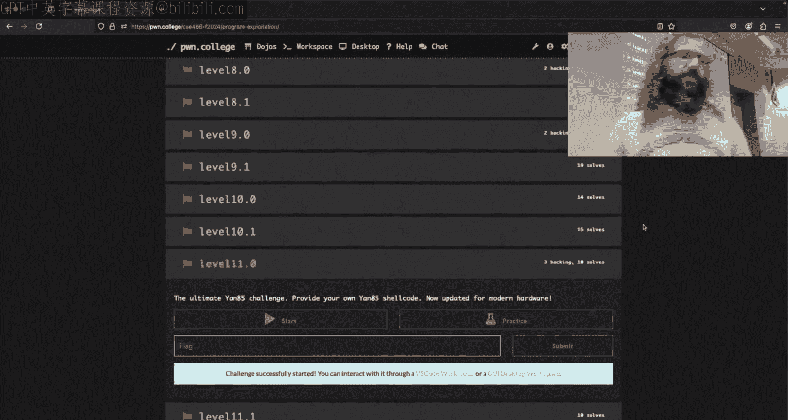
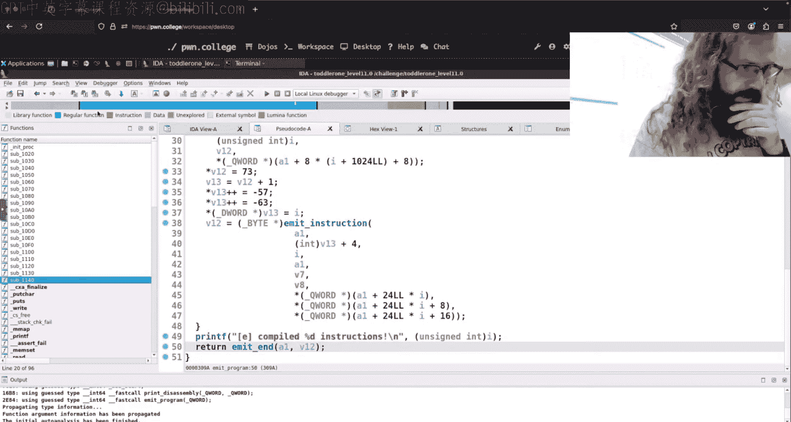
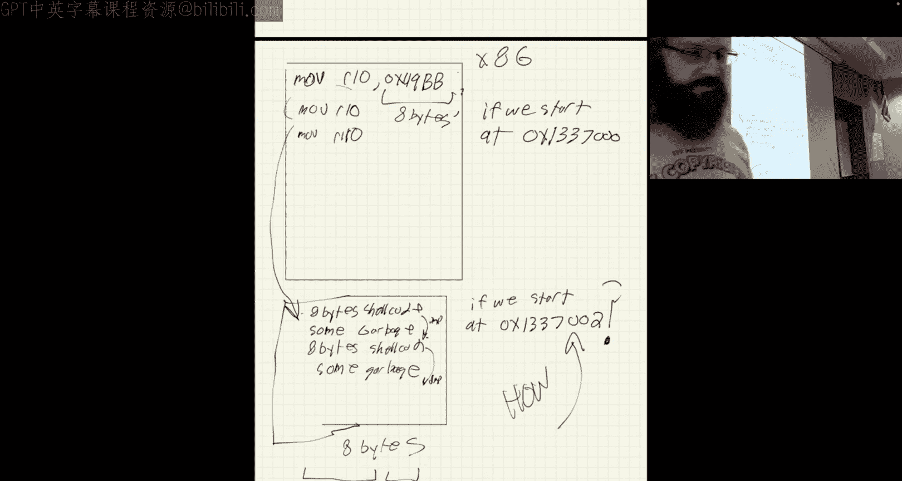
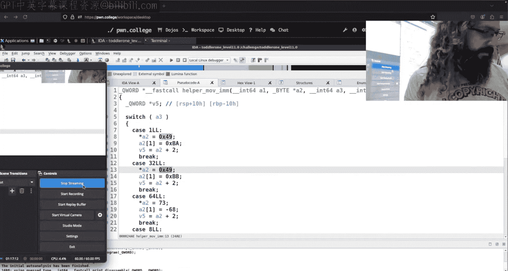

# ASU《计算机系统安全｜ASU CSE466 Computer Systems Security 2024》中英字幕deepseek p19 -20-Program Exploitation - CSE466 - Robert - 2024.10.24.zh_en -BV1spCGYZE9D_p19-

I believe you need a moment for twitchwitch。We are live。 Does this look sane。

 It does look sane to me。All right， so today is it's Thursday we're here in CSA 466 at ASU I prepared zero slides because there weren't that many memes and there's not anything really going on we're just kind of wrapping up program exploitation。

So I took a look at discord and I asked on the Discord， hey。

 what are people stuck on what would you like me to talk about today， two things came up。

 one everyone wants to wants me to ramble about Jit。And Jit spray。

 which is kind of probably very likely going to be a regurgitation of what Janwn talks about here。

It'll just be my spin on it so that's something something we can rambble about the other thing was。

There were some people， I think they were on little 7。

 but they were running into some difficulties with their Python script， their phone tool script。

 passing input where they were expecting。Something to get。

Pched by the challenge binary differently than what it was doing。So I will take a quick look。

 I don't know what I just flash there， we'll take a quick look at that and。

See where we go from there。嗯。Anyone have anything else in the immediate？You just shut up。

Big question， deep question， see， looking to hear something you're stuck on。 You're just hanging out。

 I appreciate it right。Okay， so level seven， I rambled quite a bit about on Tuesday， it is a。

 I believe the first challenge it takes in Yom code and so it adds you to Ederson Yo code。

 it's then going to run it and the hint implies that there is some kind of memory。Vulnerability。

 if I remember， right。ち。S code injection and a method of tricking the challenges into executing it。

 Okay， so it doesn't explicitly say memory corruption。

 but more than likely there's memory corruption default and we talked quite a bit about that on Tuesday。

And one of the things that the I believed personally Discord was doing was yaN code has the ability to call。

 for instance， read code or read memory， both of these functions call read and their problem is。

That they need to pass some inputs of challenge at this point。

That is then going to call read code or read memory some other things something else that's going to call read and they want to make sure that only the bytes they care about goes to the first read and only the bytes they care about and their second send go to the second read we can loosely approximate this let's make sure I don't have a do dot C。

😡，This is somewhat relevant because since our next topic is going to be race conditions。

 what's actually happening here is a race condition。So the challenge binary is doing something。

Like this， we have one buff。We have a second buff it's going to read once into。Buff 64。

 it's then going to read a second time into Buff 2 and we'll say 64， I don't really care if there is。

That's puts。Doing second read。Doing。First grade。All right。 Did that right。没有。你 didn啊。Okay。

So what were my P tools script？Look like here， let's move。This。Over here， is that's nice and small。

So you all have done something like this， right？If P equals process， it's going to be8 out out。

We do peace and。Theyload one。Pace and payload2 P interactive。 And then while we're at it。

 let's clean up this。 So once it's done。With our two reads， we're going to print F payload one。

 and then whatever that is。嗯。Payload two。Whatever that is。Pretty， pretty simple。

 simple binary to allow us to kind of reason about what's going on。Somebody says。

 I'm live with audio， I know it's a rarity right， but to be fair。

 there is a lot of messing ground with OBS to make it happy earlier。

I just did it before the stream instead of after。Okay， so I imagine they had up something like this。

 obviously theyre crafting a specific payload， but it's it's pretty clear what the intention is who thinks is going going to work like。

It's expected。Nobody， everyone thinks it's going to be wrong， I think it might work。All。

There actually is a is a chance right， is it going to say？Payload one， pay of one， payload two。

 payload two is my question。Based upon what I'm doing there。With pond tools。穿了。佢来。咁诶。We're good。

 all right。Okay， so we tried to catch me on not compiling it， but I did do that。

 what I didn't do is include P tools。嗯。While we're at it， we'll also say contact R equals AMD6。

Just because it's a good practice。All right。I actually did tend to do what I wanted。

I got this weird a symbol at the end。Anyone have any idea why？Okay。

 now knows it just happens to be the random bite that is located there， So if I do this。

 I think this' will work。I'm declaring it and。Initializing it to be。No， we get。

I run export dot pi we now get what I think right because when I send that I'm using send not send line does there is there any guarantee that I'm sending an oldbyte there after my one and two paler one and pay it to the answer no so when print F starts printing it's going to print until it encounters an old byte in that first case this wasn't handned it just happened to be that way theyre happened to be an a symbol that was located right there in memory so print F leap that a symbol right。

And so this works like how we'd expect。Now。Person on discord was saying， hey， I'm now trying to use。

GDB on this thing and I'm getting a different behavior let's see if we can we can replicate that。😡。

Hey， so I am。I need to continue， we break at read。Let's fitting。

Let's examine the string that is located at RSI。Now I get paler one paler two together。

 this is on that first read right so if I continue again I'm here at Read and if I that's the second read call。

 we continue now I'm blocked。😡，Why did it behave differently？With GDP。

Could you speak up a little bit， I'm sorry， I couldn't hear you。我。

I this look not how many different on。Okay， so the statement and we're thinking obvious it seems pretty apparent GDP is somehow changing the behavior right but I think we're attributing it a little bit incorrectly that the statement was GDP doesn't know where the read ends right the way we're not passing a null byte to this and that is that is a problem but a null byte doesn't matter。

😡，If we look at the main page for read。What does Reed do， does Reed care about Nobits？

Rin doesn't care what the bys are。 There is no bite that we can send that will stop read from reading。

Reeb will just read until EOF。An EOF isn't a bite we can send。😡，Yeah， to trust me on that。

How does P tools work for communicating to standard in？Was it do， I type p equals process， whatever。

 and then just tone tools is magic。嗯。Okay， so it starts the process， but thats to do something else。

 like when I do P end， how does P tool， how does Python get payload one into standard in of this thing。

 what's it doing？😡，是。P its say sub process， it just sends whatever the bytes that we're sending it to the necessary end of that process Okay so yeah you tap answer around here you're not really saying anything turns out if I set type P send it writes and sends these bytes to standard end of this process that I started。

Okay， so that's that's not a false statement， but it's not a very detailed or technical statement so so like there's lots of processes on on on this challenge right Can I just pass some bytes into standard in of a out out right now？

From my terminal。有。In fact， we see the Pid here， it's 485。We're going to rely on good old proc。

Or 85 FD。What do we notice？About standard aid？There's a pipe， it's a pipe。All right。

 hopefully everyone here knows what a pipe is。Or a fifa？kind of Okay， yeah， first and first out。

 we can think of it literally like a pipe。 I think if it being like Mario land， right。

 you hop on the top， you go on the pipe。 you come out the other end。 you put a whole but。

 it's literally you can think of it like a pipe， you know。

 in your house that runs water right stuff goes in one end and comes out the other in the same border。

 pipes can be made。With the Pi Cisco。This is a Linux ciscal so that means we can call it from C。

 we can call it from Python right all of these things exist a pipe is just a file descriptor that refers to instead of a literal file sitting on disk it refers to a pipe we write things go in one end people read it comes to the other end and so we have this this Mario pipe here and so what is happening when we say P equals process。

By default， in fact， if we were to use。I Python here。AndSa from Poe import Port star， so I have this。

We go process。Give it the old question mark。We see that there is standard in and standard out and if we look by default standard in and standard out are going to be pipes standard out by default is a pipe that's why when。

We call like P receive or P read we can get it whenever we want right the challenge is writing it out it's going into this pipe and then when we decide hey it's our time to just kind of see what's what's on the other end we can tap into that right that's how we get our output and that's how we send our our input it's still just being a pipe now when we type P interactive minus。

😡，That's going to be like some weird thing。 I promise you it's a pipe。

 It's going to be some weird implementation detail。 We can， we can go down this hole by default。

 a pipe is used。All right so that's from the docks and then if we were to drill out into pun toolss implementation negative one is probably a like keyword or constant that's going to mean use a pipe because like negative one isn't a valid file descriptor so I don't know why in the first case it is literally showing us a pipe and then for standard it out it takes in but it's showing us a pipe pun tools in subpros by default is going to make both of these or not subproces but bone tools by default and make both of these pipes it's really obvious it's not going to pipe sort white。

What are you looking at if the file object of filescriptor number to use for standard out by default a PTY is used so that standard app buffering by Libacy routines is disabled。

You don't want to go down this rabbit hole the PTY is a pseudo terminal so it turns out like we say that this is a terminal that i'm typing in this isn't a terminal that i'mtyping in this is something that's called a pseudo terminal which actually is a abstraction over an actual terminal and so there are certain things that terminals do that are different than just displaying raw buttons and。

So there are like escape codes and things like that as far as formatting that a program can do to instruct a terminal to behave or display things a certain way。

😡，But for all intensive purposes， we can just say phone tools to taking care of this whole pseudo terminalal magic。

And it's really a pie okay， well， just I I'd strongly encourage you to to just think of it that way。

Because pseudo terminalals are crazy when you go down and start reading about how they work。Okay。

 so it's just a pipe， so if we think about this as a pipe when we P dot said。

What is my probe what is my exploit doing it's going to send payload one down the pike。

 it's going to send payload two down the pipeike now these are two distinct actions。😡。

Is there anything stopping these from happening one after the other？No， right。

 my code is just going to run one line， then it's going to execute the next line。Yeah。

So my exploit is going to send payload one， my exploit is going to send payload。2。

My exploitlate will begin with negative。What does the challenge do？It read 64 bytes Okay。

 my challenge is going to read 64 bytes and then it's going to read 64 bytes right it's not not particularly complicated is there anybody's stopping the challenge from doing one and then the other。

So when I say this is a race condition。What ensures？

That the order of operations is send payload of one。Read。64 bytes。Send payload2。Read 64 bytes。

 Does anything actually guarantee that this is the order。That these actions will occur。No。

 there's actually nothing。Now read， I said， we'll read until EOF， right。

 which is the end of file and for a pipe that means the pipe is now empty， that'll trigger an EOF。😡。

So。If。그。The read happens first。Then we send。If the read finishes。Before the second send begins。

The first read will detect EOF and it will behave how we expect。😡，Does that sentence make sense？

It's okay， it was a poor sentence be fuss because if it first tries to read on an empty so you'll actually block if you initially try and read on an empty pipe。

It doesn't count as EOF by default a good question though the question for for Twitch was。

 well if it first tries to read it and it's an empty pipe doesn't this just read nothing and gets EOF and the answer surprisingly is no read will block on the empty pipe waiting for input by default that is something that you can change。

😡，诶。So this would result in what I want。These are good。If these things happen。

What happens when I throw GDP into this mix， what does GDP do？是。

Good question put and think that we don't wanted to top bottom the same。结歌。You speak so quiet today。

 sir G doesn't think G doesn't know anything until you tell GDB to look at it。once at the time。

So know when the read calls ends， the I mean。Ill say ideas on it said。

The RSI value is always 60 or RSI value is always the buffer for context because we're。

I'm going a little bit off the RDI would be our file descriptor， RSI is our buffer。

 RDX is our account， all of these values are the same whether running GDP or not。

So what is the very restrict of the recording。Now， in no case。

 will this example output 64 has a return value from the recall？呃。WhenThe return value from Re。

 if we search here is the number of bytes red。I'm just saying that the buffer size is but buffer size so buffer size when we we think about things in C or we think about things in assembly doesn't exist like a buffer size is like this higher level ofion right the only thing that exists in C or pointers。

And distances right and it's either an acceptable distance where we didn't mess anything up or it's way too far of a distance and we messed something up right but there's no way in C or in assembly unless we've explicitly written the size of something somewhere somewhere else in memory to know how big a buffer is right that that like that concept doesn't exist。

😡，We have another thought when we add GDP into the mix， it pause the execution of。

 but not the Python script There we go。 We're getting somewhere more now so， so race conditions。

Are about time。And so race conditions are a harder thing to debug right because time matters instead we have to like think about what's happening the statement for Twitch here is GDP pauses the program。

Or they challenge binary here， at my example， executable。So what that means is。

We what would happen is we'd send payload one， we'd send payload two， GDP pauses the challenge。

 at which point this happens？And then if we're over here。GDB would still pause the challenge。

 especially since I am using gb。dbug， what does gdb。dbug do by default？😡。

It breaks their underscore start。So even if I have no break points， just that little pause。

Let's get out of here。Run this again just this little pause right here the program is paused my Python script is still running we see up at the top it says switching to interactive mode that's my Python script switching to interactive mode When do I switch to interactive mode after I've sent the screens payload one in payload two。

😡，And so now the challenge binary hasn't even called the first read。

 but my Python script has already thrown these into the pipe。And since both of those are in the pipe。

 what is the challenge C when it calls Re？It he's payload one payload two they're both in the pipe right it doesn't。

 it's less than 64 bytes， we'll take them all。And so that's where we get that behavior now there's a couple ways we can deal with this。

And in fact， it's not just GDP that will trigger this， but GDP is a very easy way to force this。

Right， because we are forcing the challenge binary to be slow where this can happen in general if you have longer payloads and you're just doing PN and like。

 oh， I hope that this one goes to this read and that one goes to that read。

 like sometimes it'll work sometimes it won't。😡，There's several ways we can deal with it。

 one way that I suggested。Was a good old receiving till second read。Maybe。

And this is typically what I。I do。And now we get what we'd expect。

One of the comments from Discord was， yeah， but what if in the 0。0 challenge and maybe it does。

 maybe it doesn't。There is a send after， I'm curious if this works。This is something I should use。

 but I just personally don't。Let's see if。Excend after sunline after。嗯。All right。

 so I can do that in one Python command as well， you want to be more efficient than I。

But the comment was that， hey， what if the challenge doesn't say I'm about to call second Read。

 what do I do？Okay， so I could sleep， I think that's ame lame answer， but you could。

Clean essentially does sleep， it does a little bit more。边常。对。what was that。

AndIf I print something here in my Python script。嗯。Print。 Okay， okay， so， so whether I sleep。

 whether I print， whether I。I don't know， I decided I wanted to calculate。

What's a long running function， I want to say factorial， but that's not what I'm thinking of。

What's that？there's a number that's like one，1， two， one，1， two， three， Fibonacci， yeah。

 if I want to calculate that's what I'm looking for like like I want to calculate the 200th Fibonacci number in between two of these right I could do that right I'm just making it slower these are all doing the same thing。

我俾你嘅 footprintprint you send嚟最近。Well I print second grade sorry the first let's do clean and then we'll look at this printing hypothesis here。

So see if clean does what I want。Clean clean does what I want clean if you read the documentation does have a little microleep in there。

 so I'm kind of kind of sleeping there， I'll admit that right now Okay。

 so what is our thought here on printing？where am I printing， where am I putting this？

don't what you're telling me to do， so I can' print flag。And then you want me to do what said。

I am not a believer。Good。Why oh yeah by right so when we call it receive until we're checking for output from the process when I print in my Python code when I print secret flag。

 it's going to standard out it's going into my straight。

 but it's not coming from that challenge process right the only reason that what I print in with the challenge says flow all to the terminal together。

It's because I read all this cruy stuff and then I do the bottom of my script here that P interactive and P interactive says whatever the challenge you' trying to print。

 just throw it to my screen， just get it give me it all right， make it all work。

And so so we can't signal ourselvesself like that， that'd be really cool if we could。诶。But we can't。

So my suggestion there is to sleep， clean， read something from the challenge。

what if none of those were， well， there's another way that we could think about this as well。

How many bytes does this thing read64？What's another what what is a way I could take advantage of the fact that I know that I just pat at the 64 right Maybe I do only want this to say payload one。

That's fine。Let's adjust it to 64 bytes。With no bitetes， they impact while I'm at it。

Let's go ahead and add。Payload two。And let's pad that by 64 bytes。With noll bites。Yeah。

I'll do it is one sin against two reads， does that make sense why I'm doing this？

Figing was the artist。Okay。When first did this， I didn't close boom。All right， look saying to me。

And I get what I want now I specifically chose no bitetes not like no bitetes or this magic thing right。

 no bitetes were the correct by in this context for me to pad with。

Because null bitetes indicate the end of the string。

 and so I know as far as the program's behavior with that region of memory or with that buffer。😡。

Is going to be the exact same if the next， however many bytes there are in the first buffer is a no bitete。

 and if all the rest of the bites and the second one are nullbits， the behavior is the exact same。😡。

Okay， so I chose that specifically because of this context。😡。

Over the context that the challenge was using it。Did I mention when the new program exploitation challenges are going to drop I did not so I'm actually not going to launch them is what I decided I have them but people seem less than thrilled and so I'm going to save those challenges and figure out how I want to throw them at you a little bit later。

I want to throw them mat， but I just want to throw the mat eat down in what shape they are。

 we'll see。是。Yeah， so you don't have to worry about that。 We'll just finish at 11。

 So that actually will be nice because it seems like most people， not most people。

 but the people on discord are。Currently stuck on 11。

 which is the last challenge for people that are moving through it are moving through it。

whichch is the other thing I do talk about today， does anyone have said， I agree。

 like W case scenario， I'll just add them and they'll become a requirement for the what would that be yellow belt。

But maybe not for the course， maybe maybe they'll come at you as extra credit I haven't decided right。

 but so some people were very concerned about me adding challenges so。We will。

Air on the side of caution there does anyone have any questions about this， why this behave this way。

 why it's not a GDP specifically right it's the order of operations that are occurring and you'll become like as our challenge is like to say you'll become painfully familiar with the concept of race conditions in in the next module where this type of problem。

😡，Of accessing， see if I can find the right。Tab。Oh， now is somebody the Dojo man。Okay。

 where the order of actions across time will change the behavior right that that is what a race condition is。

 so I think it's at least a little bit interesting to talk about this and this is going to be the the topic that you'll run into。

😡，So he says， I'd be fine if you just add them for extra credit but to make them a requirement for yellow belts。

You want new challenges yeah I know there there's this like weird duality and you got to try and likeddle it straddle it as an instructor on site in general there are some people who really do enjoy challenges and so we try and add new challenges and there there's a totally different type of user who absolutely hates the idea of new challenges and generally speaking I bias towards the first。

But given the time that's left。I understand the grievances of the second。

 So we'll cross that bridge later。 Any that's a lot of new houses in the blue Belt Mon。

There's not any new channels in the blue Belt module as far as I'm aware。Not until the spring。

When I touch on that content again， all right， any， Twitch， anything else。See呀。

But challenges that like focus on existing concepts。

 there's always like more things we can do to play around with different things。Okay。

 I see nothing from Twitch， so we will leave that there， hopefully that was useful。

Clean up my mess here。I'm right。So the other thing that people are。

Curious about based on discord conversation， the last level。

 and I don't like to give away too much on last levels but。

There are some concepts that are。Unique and this level。There's some pain that's unique to this level。

 although it wouldn't be if I added challenges。就是。Just just so you know。

嗯。See if this loads。

So for a little bit of context for those who haven't reached it here。

 level 11 says it is the ultimate yawn 85 challenge Pro your own yawn 85 now updated for new modern hardware。

 There's been a few memes that have loosely referenced what is different here。

Going back to my ran on Tuesday about like how do I think about a challenge。

 there's a few things we should just in general do one is open in Ida right。

 take a look at the decomp， the other thing was。Just run the thing and see what it does。

So what does this guy say it says it is a new version of Yon 85 Yon 8564。

 This is a beta preview of cutting edge technology armed with the latest security mitigations。

 hopefully't we didn't forget to check all memory accesses properly though you never know right So it you know。

 it plays with you a little bit， gives you a little bit of a hint。Maybe。Okay。

 we give it some yarn code。And it says emitting initialization code。Intraction zero2 text 1337，046。

Compiling。And then it shows us some ya code， STM， something something， and it tells us an address。

Aylandta says machineine crash due to unknown registered helper load 8。

 this is a very different message than what we've seen at any of the other challenge。

So this is probably a little bit different。Then what we've seen。😡，With yan 85 up until this point。So。

We're used to seeing some type of printout thing and then an interpreter loop， right？

This looks's a bit different， what's it doing？Emit program。Okay， it's taking S。And is ass。

S is whatever I read to it。You see here I click S read0 S Hex 1800。

 So I it has a pretty big buffer of what we can write compared to the old gone 85。

 where were limited， I think to like 255 or， you some multiple there， that's a pretty big number。

Let's take a look here and admit how my program。ok。Amitting initialization。All right。

 helper move and。Okay， this， this looks， this looks weird。Yeah。Return， okay。

 the return of this thing is V 5 plus1。What is V5？😔，V 5 is a2 plus2 consistently。82 is。

Something that we are given， so it's taking a pointer。Here says it's a bike pointer here at 82。

 So're taking some pointer and it's the return value is going to be two bytes pathway where it turn。

 Do we agree there。All right。What else is going on in this thing？Well， it's setting。

First bite of this pointer。To be it looks like 73。Why 73， is it always 73。

 It looks like it's always 73 for this function。 Okay， then it is setting。

 what is this next line doing All right， cool， not that hard。

 we could have saw a plus2 or a2 plus one equals whatever this values is。

 but it's setting the next bytes。 So it's setting two bytes。

And then it's returning the player next to it。And what we see here is that there is some consistency and then there is something that is slightly different。

So the first bite looks like it's always the same， it's always going to be 73。

 and then the second bite is going to conditionally change based upon whatever is past here at83。

And then the name wasHeer Move immediate。Yeah。It this enough for those that didn't already know that know what this is doing before coming into class？

Is this enough to where you have an idea of what's going on？You had a guess。

For outcher that's fine right like this is what reversing is we're looking at some weird thing we're like。

 okay， what is this thing doing？So I know thiss writing some weird bytes。Oh wait。

 it says your young coat has been jitted。The result is the following X 86 code。 Was that in my。

 my output， and I missed it。Ca it crashed oh， so I crashed so I didn't。

 I didn't get to see that message， but I didn't get to see it here in Ida。啊叔。

Hopefully you watch Young's lecture on Jit。What is J？Okay， it's an a for just in time compilation。

So this is taking in。Y狗。And then it's outputting， it says。That's 80 cents。Won the dojo。

 The Dojo does not want to run。We're about to be cursed by the dojo slowness。Let's see if I can。

Make one of these omit things work。Donet me if I just run it and give it nothing。

Do you think that compiles。Yes， it does。I didn't hit enter。What did I hit？

Enter would have given a bite。I gave it no bitetes。I hit C D control D， if your input is terminal。

 you can just hit C D， and that immediately sends that same thing that I talked about earlier。

 EOF versus if I hit enter， I would have sent a new line character to it。

And so now we see that if I give it something that it's happy with。Then it's going to。

Take this region of memory starting at it looks like hex 1，3，3，7。

And it's writing that 86 assembly code there。Yeah。So this is all dynamic there。 Can I over。

 do you think I could overwrite this and maybe put shell code there？Yeah。Like that's a that's a paw。

 right， it's it' executable assembly。My du， where am I push emitttting， I want to go up one。

So we M map。Prance。嗯。Is there anything here。Miled instructions。 So that's just emitting instructions。

 So that looks like that is executable。 Oh， what's this。

Doing it's calling M protect on there。 Does anyone know what Em protect does。P know。

 how do I find out manage， yes。All right， one thing you can， you can learn from this class all right。

 read the band pages， so and protect sets the protection of a region of memory。

And so when we look at regions of memory or pages of memory。

Twitch on my end says it timed out when we look at regions of memory in G。

 we get those permissions is a readable， writeable， executable， right？And normally。

 you do not have a writeriable and executable region of memory。

But we're writing to it from this omit program thing。And we're going to execute it。

Right down here that's what this weird void star void adder is right we're treating that like it was a function and just executing that right there。

You have the hardest time reading man pages？I don't know what to tell you， right。

 it's a critical life skill。So what do we think M protectect is doing， well。

 it's good it's pointing to that same region memory。It has。Tch 1000 and N5。

We look at our main page here。First thing is the point of the address that makes sense。

 the next thing is the length so the number of bytes that are going to be protected and then inttro。

😡，Wass Pro。Pro Prot is a combination of the following access flags that can be bit wise。

bitwise or to set permissions so we're setting the permissions on something and what I need to find out is what is five。

How do I do that？没事。Well， so we looked through this in Ida， we said， all right。

 it's taking this this region of memory where it's writing X 86。

It's going to change the permissions of that address。For  a thousand0 bytes， they're a hatch 1。

000 bytes。To what， to five， what a five。How do I know what five is what is it actually doing。

 I know it's changing the permissions， but what is it changing it to？😡，啊。

1 assumption is properties one。 You know what I say about assumptions。 if you。

 if you're going to open with， I need help on level。

Level X help or so I assume you're going to get some snarky answer from right， don't do。

 don't do that right let's let's。How do I find out what five is？What？I could what I could Google。

 All right， I could do that。 I could also use phone tools for per po port star。 there should be。

A global that Ponttoos exposes called Constance， we've used this a little bit before。

See how slow the dodro wants to be。Okay， we will， I think this will work from here from Poe importm star。

No， no， it won't， okay。Constance。And then when we look at what was that and protect？No， not M Ro。

Man M road t。I want to know how do I get five and we see that there is protect read I'm probably covering it a little bit。

 but the main page shows us protect read， protect right， protect， execute。We can protect Re is one。

Yeah。Protect right is two。Teect Z is four。Well it should be enough to tell me what this is doing in Ida。

It's we're oing， I'm sure how do we get to five with these digits？What permissions is？

Is that line doing？The green exit green an。It is。5， so it's going to be four and one。

 So it's read and executed。 It's vacant。 So it's not rightable right。

 it's just executable And that makes sense because if it wasriable and executable。

 that would be vulnerable where we could like modify yourself in place and change what's being executed as it's being executed right。

 It'd be kind of like kind of like in shell coding where we had self modifying shell code。

 This is ensuring。That we can't self modify as we're running， if we're executing it， it is not right。

😡，Somebody says is this an advanced class and this is a like middle tier class。

 so a 400 level class at university， there is an intro class that is stream care。

 but it's not this one。Okay， so I can't self modify with like my yarn code because that was something that like might make sense。

And it's a jet。And Jann talks about a concept known as a Jit spray Does anyone want to tell me what a jit spray is。

 this is where we just for the right remainder of the class I'm just going to be drawing pictures。啊。

Can you tell me what a jit spray is？Nodays？That's okay， that's why I'm here， right？

We'll see if technology wants to work today。See if Twitch sees what I see， you see what I see。Twitch。

Twitch does not see what I see。It's a sad day for Twitch。Yeah。嗯。I'm going to try。

 I'm going to blow this away。Re at it and we'll see。Boom。是。I'll see if you can see this， twitch。

Bit the scream。

Bam， bam。All right。We hit the magic button， again。

Do you see what I see， Is't that a song。Let's see。Twitchches really。

 really got the delayed today day too。Oh， twitch is what I see all right， we did it。

A rare day where we are successful。With OVS。Oh no， all right， Okay。

 so we have some region of memory here。And this is yan code。Right。

 and this yan code is going to have things like immediate a。I don't know， Pxo1。

Maybe I have immediate。Big。Hexo2。Now， whatever our instructions are。

 they they're chilling here now they're going to go through a jit。

there's this jit machine that is taking these instructions and it's going to turn them into。X 86。Now。

 how would you do this if you were thinking about？Oh I want to map。Ywn code to x86。

Young code is the concept of a register， right？Does X 86 have a concept of a register？All right。

 what's one way that I may want to relate yaM code registers to X86 registers？What？😮。

But if I just map them right， so what have I said？Inside the jetit here right。

 I say a is I know R X B is RB X so I'm making this up I know what the the machine actually does。

 but but I'm not going to write the actual answer because that's that's no fun all right。

 you got to reverse engineering so。If I'm using this is my mapping。😡，Could I translate this Yeah。

 what would be the equivalent instruction here， immediate a。Oh on。move RAX。0ero x01。

And I would have move。R Bx。Zero x。0 two right and we could we could do this not everything may map to exactly one instruction right immediate is an easy one but you know。

 maybe maybe there's some yaon85 instruction， but something yaon 85 does it's a little bit fancier。

Okay， all right， so yeah， there's stack operations。Right， I don't know that this is true。

 I will say stack A and then。No right， I think this is a push， I don't know that that's that's true。

 I'm going to pretend that it is。So what would that be in the Jit machine？不是。Push al。Okay。

So now we have like this kind of working model for how this jit thing probably works。系。

Now there's a few problems here， right， one is I'm assuming。That re X maps to end， right。

 I don't know the thats true。But if it were true， what else do we know about the Reg RAX？

Number ofOkay， so the number of bytes R is a 64 by or 64 bit register。

 it's 8 bytes in size Okay that's one thing that's interesting if I is called the。The Cisco。

 which should be called is an RAX right if I trigger to assess call the return values in REX。

 in fact， if I call any function， the X 86 calling convention says that the return value would be stored in RAX。

So if I were a smart person writing a Jit， I probably wouldn't use RAX to store the equivalent of something that I want to be persistent right because I'd have to do a lot of like。

😡。

If I wanted to persist that and when every time that I call a function。

 I'm going to have to push RAX that I'm going to call a function。

 then I'm going to have to move RAX to somewhere else and then pop RAX like it becomes messier right and I could avoid all of this hey if I just didn't map things to RAX。

😡，So this is my naive thing because they thought that， hey， why not？If we take a look at。This guy。

And it's oting things。 What did the challenge do。So it's moving。Values here。

It's interesting that it's setting these。Our 10 are 11。All right， don， that's got to be。

This kind of like initial stuff， right， its the beginning of the what it's emitting。

 it's got to be the beginning of what it's what it's printing there。Now。

 this is supposed to be some fancy new architecture。I noticed something。Allright， so that。

Those are 64。Bit ants that this help are things returning。We are using this is getting。

Incremented by two， we said。诶。Fine， okay， so that is inating that way， too。

 So doing anything weird down here。Okay， so if I just stayed up at the top of that switch。

 I might have missed something here。This is outside of the switch， right。

 it set him two bys then adding that。😡，And then there's this。V5。

 which is after those first two bytes， is going to equal to a4。

I'm not going to pull it by drawing again， I can。But what， what do you think is going on here。

 like if I were if you were trying to write something that's going to map beyond 85 into X86？

And we know this thing is outputting x86。What do you think it's doing？Yeah。It's got to output X 86。

 there's some constants， there's some other nonsense。And then there's。

This value that's specified over here in A3， it's putting the yarn one button exc is corresponding6。

I don't think that's right。嗯。This goes back to my amazing， if I may say so shell coding。

 crash course tutorial， how to not socket shell coding video。Yes。So let's set our context here。

We see move R， move absolute R 10。0。Okay， I get 4，9。Oh， its I didn't move apps， okay， all right。

49 B zero zero， zero， zero， and then the next one is4，9 BB， zero， zero， zero， zero， zero， white？

That's a pretty big value that it's moving there， right？Like it's not moving a bite， is it？

Go to get back up to the top of this thing。How big is the value that it's moving eight like count eight？

So maybe young 85 64 works on more than just single bites。When we jetit it here， right。

 and so if we were to map what we see here， dwell youre seeing in Ia。This。

 we made this hexidesimals 49。This is BA。But do we see are there，49 B。

 so if we are moving in immediate。In Y 85， the equivalent assembly code or x86 is going to be 49 B because that is the bytes in X86。

 it's going to be move absolute R 10。What comes after that in immediate that's eight bytes in size？

What is A4？In 64， we go down here。That's eight bites。

 so now we have some idea how this jetit thing is working。Right。

Based upon what Ym code goes into it will determine what bytes it's going to write。

 and that determines what X86 gets executed。All right， so where does this Jit thing come into play？

So we need to update my doodle here，'s。Go back to。Go back to drawing。Maybe。Switch。

 it'll come along for the ride。Twitch does。 It's a good day to be twitchw。Okay。

 so what I really have in my X86， which we kind of saw in that printout。Is like move。

We saw like Moar 10， and I could put like Ox01，0203。0，4 writing。 I could go all the way until 8。

 right。And I could have move， which we saw or I think there was an R 11，0x01，02， Ox08。啊。

The idea behind a jet。Is something that we is related to something we've kind of already talked about or a Git spray。

 this type of tag。If you'll recall back when we talked about Ro， we had rock gadget， we had roper。

 we had these different tools right and when we say， well。

 some of them will like show you gadgets that don't exist in other ones。Wherehy was that？

Because some of them were not executed。Okay， so one reason could be that a tool was only looking at executable memory and another one's looking at other regions of memory that's possible there's another reason that I know I saids I'm sorrydge give you gadgets okay so some tools may give duplicate gadgets another thing that I said is some tools will identify gadgets that exist in between instructions。

😡，And this was something you didn't really have to deal with right back when we were talking about rock。

 maybe you used a rock gadget that was in between instructions and didn't know it。

But you didn't have to really think about this。The key insight for a g。

Is what this is what this looks like。If we start。At0 x 1，3，3，7，0，0。

0 right because that's where it's mapping or writing these， these instructions。

What does this look like？That's a beautiful square， if we start。At。OX 1，3，3，7，0，0，2。

I don't have to know what the instructions are， but what would the bytes be？0，1，0，2，0 Okay， so be 0。

1。I should quit writing 0 x。Between all of these。010，2，0，3 dot dot dot dot0，8，0， x，0，1，02，0，3。

 dot dot dot0，8。 Now there'd be some nonsense right here in between， right？Yeah。

I don't know what these bytes are。 we can find out from Ida because Ida is telling us or we can scroll up and look at this。

 this input，4，9 BB，4，9， BB。There， now it's a square。That's as square as it's going to be。Well。

 you don't get， you know what？Maybe I don't want you to see my square。Yeah不是。

so if we started reading this assembly at an extra two by itss in。

We would start interpreting assembly instructions at01020308。

 and then there would they would have to be this 49 B because that's why move R 11 up here right that's what。

This。I't know。 The technology， man。I'm not， I'm not capable。That's what this move R 11 is。

 is this 49 BB。系。Is this useful？Someone says no。I'm I just showing you useless stuff to talk about it like sometimes I am because I think it's funny but not today。

 right like like I think our great conversation this week on file descriptors was both useful and useless just depends on what you are working on how you're thinking about this。

So it doesn't make sense to interpret 010203 as assembly instructions。What if？Instead of doing this。

I did move R10。Zero x，4，9， B， B。What is that going to jit to and then I interpret that 10 bytes in？

for nine x p b五。Part1， and then。That okay， so so what we see here is instead of just including。0，1。

02，03， I could encode assembly instructions in this constant。Right？

And so it seems kind of silly to be like well， I want to move R10 to I don't know。

 something right here， but is there something more useful I could do here instead of move R 10 so if I can do whatever I want really。

 right， as long as I can do it in eight bytes。And so what I end up with here is if I start interpreting。

Execution not at where the Jit compiler thinks I will， but at some offset into it。And what I get。

Is eight bytes of shell code？Some bites of garbage。

Because let's just say I just keep doing move R 10 because I don't really care what move R 10 is。

 right？I could get another eight bytes of shell code。Followed by some garbage。And we could do this。

Across the whole thing， right？Is this useful？不是。It was like a kind of maybe， right？

Because the garbage might mess up the shell code in the next。 Okay。

 so the statement was the garbage might mess up our shell code。 Tot true。

 We had a shell codinging challenge。Ways back， I don't know exactly what it did。

 but it did something to the effect of， give me your shell code。 I'm going to cloer some of it。

I'm going to overwrite it with Hexcc。😡，You remember that？Yeah， okay。

 somehow like some people solve that， I don't know if you did but。

So some people got around that problem。WellOne way that we could think about this is well we。

 if we control the shell code。Why not just jump over it， right， so I could write a shell code that。

That jumps。And then。Jumps。And so that means that within my eight bytes of my shell code here。

I can do like one instruction or man maybe I got so I don't know how many bytes jump a relative。

 a rip relative jump is， I bet that it's pretty small， it's like one or two bytes， we'll guess to。

But I get his six bytes to actually do something， followed by two bytes。To jump。对。

That is what the concept of it's not really a jetit spray because there's no spraying impulse a little young calls it a jetit spray spraying implies there's like some random chance of of hopping to somewhere。

And so this is this is kind of your mental model of what you need to work with， right。

 this is one half of the puzzle。The other half is like。How。Do I do this？喂。How do I get execution？

To start at this location。Because it's not going to do it on its own。Any questions about this， yes。

And thinking about how will we put the next line of shared code in， because if we start from。

But eight bytes in the two bytes offset set， you have eight bytes of that well be had that thats your code useful first your。

嗯。😊，아 내我 안 되지。So the garbage in between， I can show you that in two places。嗯Maybe。I'm like。

 why is this so long。When we look at。This like move immediate， right？It is always going to write。

They say I'm triggering this case I did onmperial cases， it's always going to put a four4，9 byte。

 it's always going to put this negative 70。Which is a silly number B。And then。It puts。The end here。

 my8 by constant。Right so if I were to trigger this case on move immediate 20 times at a row。

 I'm going to get49 ba the eight bytes I specified49 ba the eight bytes I specified49 ba the eight bytes I specified so if i'm using this particular。

😡，Um， if I'm triggering this particular path in the jetit， my garbage is 49 Bn。

You this whole thing be if I'm always triggering this code path。

 then it will be if I'm trigger this code path， it'll be。49 B， I hit the letter H。

And so that depends is what we're doing is is we are smuggling shell code inside the g。😡。

And so what does that like look like， well， we have to think about like what？Shoko， do I want？Yeah。

of city one three three seven zero two。2 by it also has to be2 by everything needs to get shifted by two bytes right because I'm going to have whatever the official of correct thing that the jetit thinks it's outputting and then my constant I want to start at my constant and start interpreting that and then deal with the garbage I want to execute from a begin execution from a different point in this memory and have it make sense。

The job plus to perfectly to， but it only continued in the after for the first offset。

What was the question you can start when be read in continuous fashion right I' country plus2 then 8 by plus2。

 right， I can't do that。 That's why in my drawing here， I said we have to jump。

I get if I start writing it plus two， I get eight bytes to play with， you agree， okay。

 so of those eight bytes， am I do I have any restrictions on them？跟对对。The answer is yes。

 if I want to keep executing past eight bytes， I need to deal with the garbage。

So some of those eight bytes have to junk me for allow execution to continue。

which means I really don't have eight bys because some of those are reserved for dealing with that problem。

Now， what would this look like？I don't know if this is going to work。

 we're going to find out together。P 64 of B。From on no。Junk B， oh， wait， did I not。

 I didn't make it an F string。 All right， I'm still a believer。

Required argument is not an integer P 64 of the that is bys。So Ill actually want to use 64。

 I'm still a believer。Unpack requires above for eight bytes， we can fix that， we can adjust that。

Estream cannot include a backslash。Cushing it， okay， zero and zero no， no， no， no， no， no， no。

We're going say B， it's， it's mad just because it's in an L just， right。

 So if we just put it outside of the L just and say B equals。B L just。And then we give it U 64 of B。

看。And then if I were to grab this at。T banks， Anne。You see what I did there？

I'm hiding shell code inside of my Shell code。Right。

 now this is not exactly what I need to pass into this Jit thing right。

 the example here a is what the git is doing。It is making move our 10， some constant。

And I am determining what that constant or what I want that constant to be。

Based upon how it would be interpreted。Ass its own X 86。 And so if we start interpreting at。😡。

Where the Jit thinks， where the Jit wants to， it's going to be move absolute R10 he 50。

But if I were able to direct execution to to two bytes into it， suddenly it's pushRX。

And that was only using one byte， so like if I expanded this。

 we could push probably several of these RBx， pop RCx， I'll bet those are all one by。

Wouldn't invite instructions。We see we got all of those， but then I did I don't print a。This is Sam。

Just a on its own。So that is what the Jit would think I'm doing。

 but if I manage to redirect execution to start at the constant instead of where the Jit wants。

 suddenly I'm executing something completely different。

That's the idea of a jet spread I'm way over time， hopefully that was useful for those that asked。

With that， I'll leave you a goodbye， good luck。

