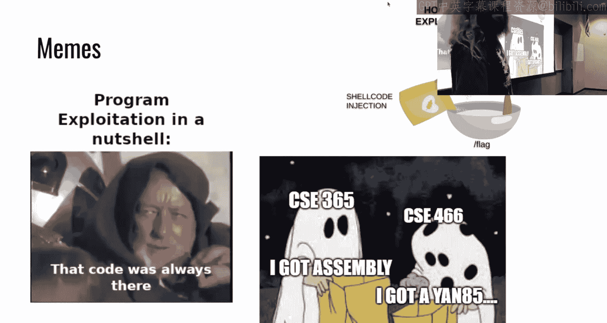
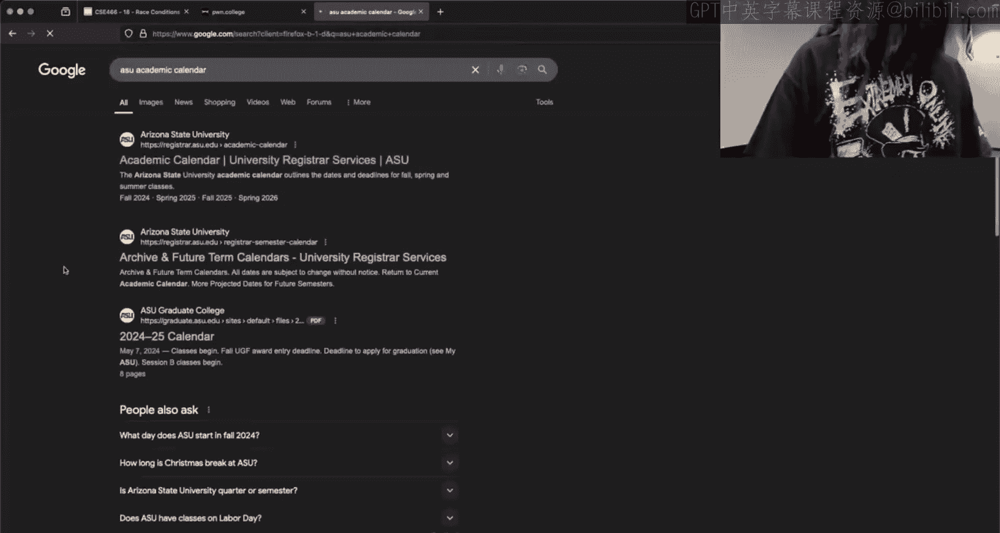
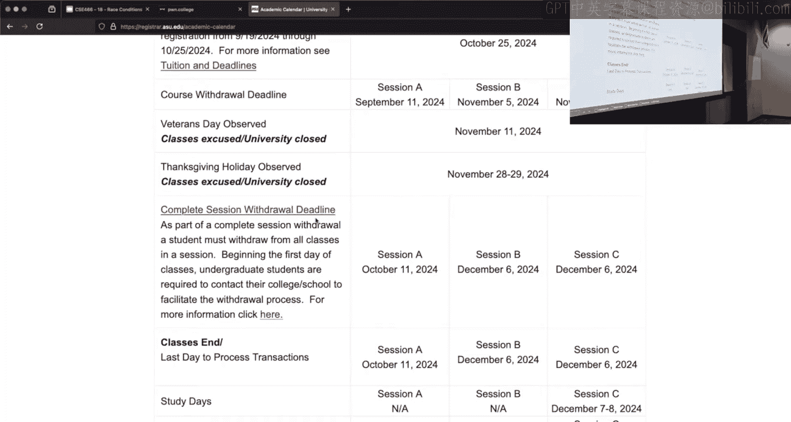
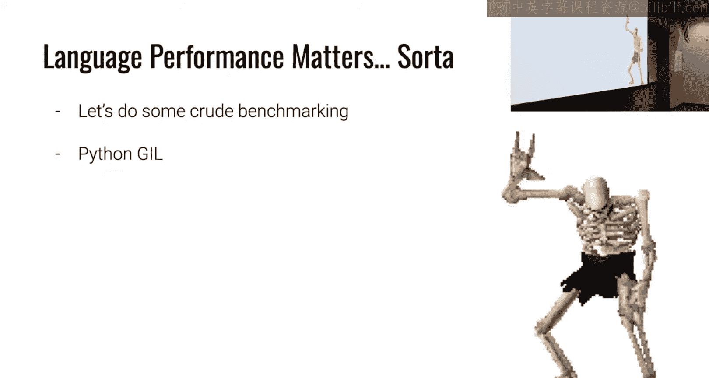
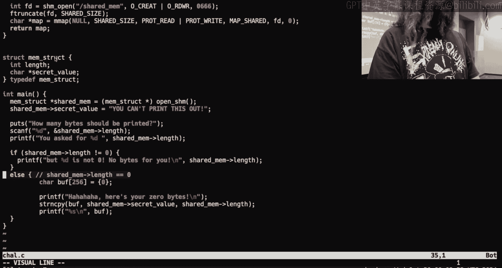
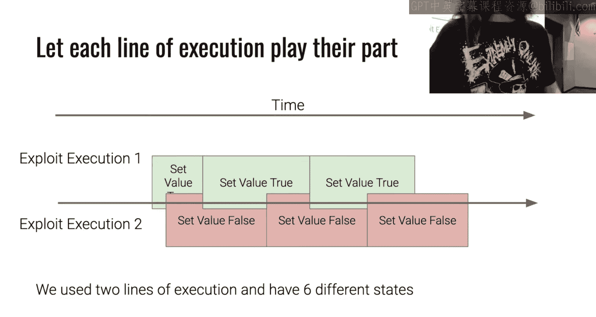
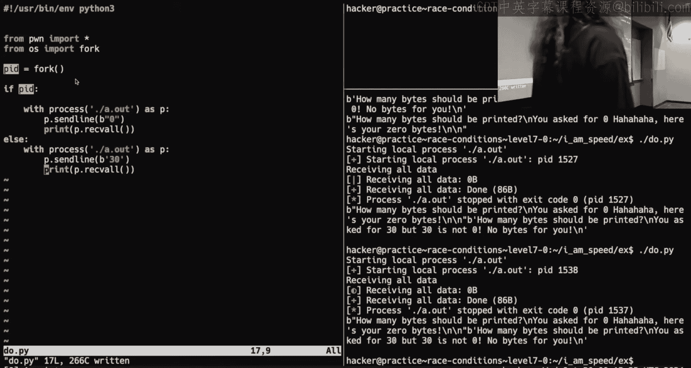
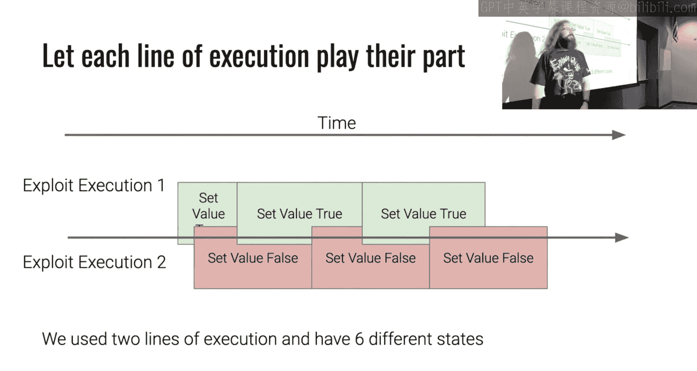
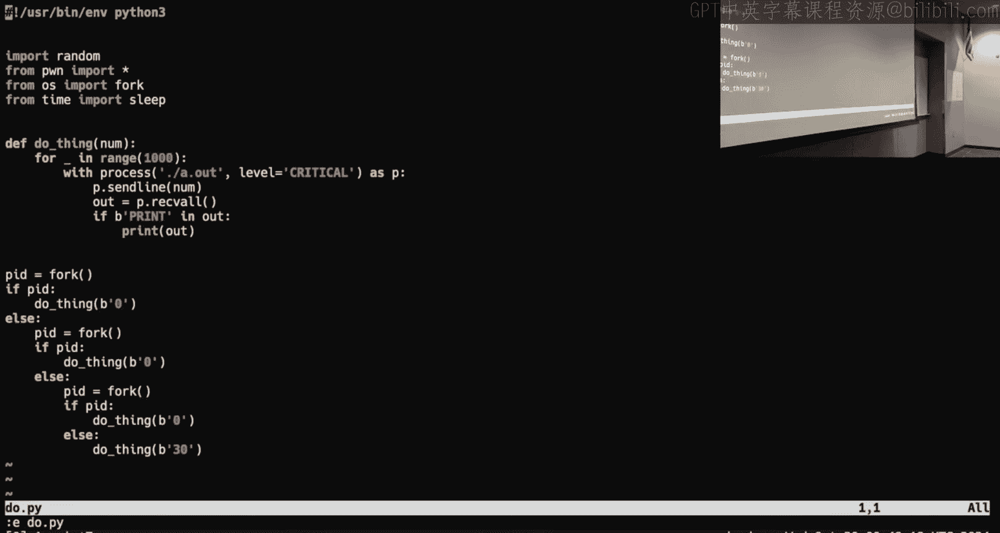
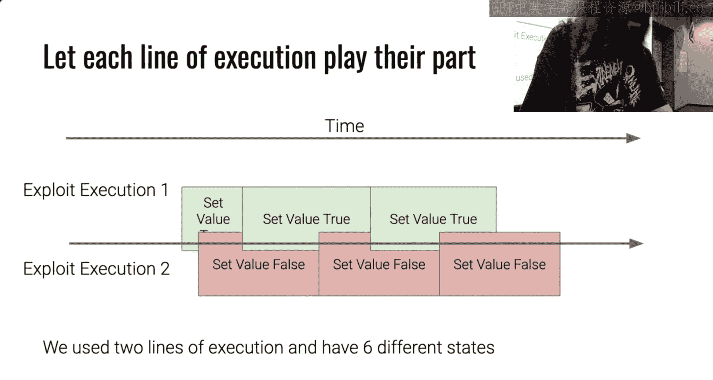

# ASU《计算机系统安全｜ASU CSE466 Computer Systems Security 2024》中英字幕deepseek p20 -21-Race Conditions - CSE466 - Robert - 2024.10.29.zh_en -BV1spCGYZE9D_p20-

です。Keep that muted， I don't think I'm going to dos myself， come on Twitch。ForThe first time。

In like a month， I think I'm starting on time。All right， this one is important now for my slides。

All right I put in some time on these slides， guys。Oh， it's going to work， which I'm digging it。

All right， today is October 29th， 2024 we're here at CSE 466 at ASU and we are currently kind of starting on race conditions。

 but we're also finishing up on race conditions because this is a one weekek module so let's see what we got here so far we do have a large number of slides we'm going to try and mo through the stuff fast but stop me if I go too fast。

So we just finished up program exploitation kind of soa and there's also race conditions if you're stuck on one verse the other it doesn't matter the points are all the same go forward it this is not the best me I've seen all semester but I do like it。

If I may say so， because I think people are learning to ask better questions or they start asking poor questions。

 but they realize it and that is probably one of the greatest things you can learn in this course。

As somebody says how do I happy Halloween indeed I have festive slides and we have festive memes so program exploitation in a nutshell yes you used ya 85 one of the things you probably learned is that most of the vulnerabilities that were in the program exploitation John 85 stuff those were there the entire time right they were things that you probably knew about I know I talked about at least loosely alluded to them all the way back in baby Re because I'm aware of their their relevance but hopefully not that you've kind of taken a second look at the 85 VN you think about how that was implemented a bit different this was actually a 365 meme but it's festive it's great so at 365 if you're unaware they just started on their like computing 101 which is a rehash of entry to assembly building a web server GDP all of the good stuff that I expected you guys to know at the beginning of the semester right they're getting their first。

St that and so they're having a ylly good time for the holiday and you as well just wrapped up985。

So perite exploitation is kind of this big mix of all of the things that we've talked about before that does say ro。

 original rock， I'll still take it， there should be rap。

All right， level 11 of toddler one was one that gave people a lot of trouble right because it's young 85 64 and honestly I don't blame people if they had this kind of thought like hey I'm not gonna think about it Oh it's not that one yes。

 yes I know it is though All right， I thought about it right know they either say， all right。

 I'm done， this is gonna take too much time let's not deal with it but。

If you had three days to sit and cook on that like that had to have just driven you mad and hopefully whoever posted that meme you salt it。

 this is like a common thing and if you feel this way。

 this may be the right field for you because like that that is what we do all the time when we're looking at something we don't understand right you're like I've gotm just gonna walk away and then it just eats you and so you have to find the answer so I definitely related to that name there。

😡，If you just learned how to read yawn 85 and you got ya 8564 that's fine it was one challenge of big deal for your grade the kind of takeaway there from yan 8564 was that it was jitted and so that allowed for some weird scenarios here where you pass yawn 85 and yawn 85 turns into show code and it like becomes this montroscity that gets you the flag if you can it right same idea up there at the top right？

Some enterprising student here managed to pull off the 50 thanked messages。

 I think they were farming 365 that would be my best guess。

And as long as they're at it， they posted a meme about it so they got their 5% plus another 。

5 for the meme so so you know what that's fine I kind of expected them to fall off and stop helping people it just like man I got mine you know go get yours but no they're still helping people so I'll consider that a win。

All right grids how do we do so you may not have 50 thanks solves in that 5% extra credit so how did we do for program exploitation people started but right there's our checkpoint people moved along I think overall that went surprisingly well considering that it was an exam you' you know an exam ti your a cumulative module overall I think people did pretty pretty well。

And when we look at the salt distribution， so how do people do just on the program exploitation module。

 and we see that overwhelmingly people are 90% plus and then where is the bulk of the class you know at least higher to 60%。

So pretty happy with that。Of courseour gray， this is all including extra credit and remember this is just bin to 10 bins so the highest bid is actually at this point probably like 98 to 99% and above。

As we see that it's just from they 100% there with the extra credit so we have 15 probably about 15 people that are in a plus range as 17 17 A's。

 11 Bs on down I'm pretty happy with this， hopefully you're pretty happy with this。

Twitch is live and audio is working。 That's a good thing course schedule I'm going to try and throw this up every week。

 We are currently over here in race conditions。 I'm pretty sure we're gonna do sandboxing come Friday that still is depending on some infrastructure things that are TBB so just to err on side of caution I'm probably going to go sandboxing first there's not dependency there but just so you know an important date that was wrong on every single course slide that I've had here to date somebody pointed out is the withdrawal deadline So I think I listed it as 126 that is if I remember right the like global drop deadline so there's two types of withdrawals you can do here at ASU the first is I'm just kind of throwing in the panel for the whole semester and all my courses that is sometime in December but if you want to just withdraw from a single course and take a W。

诶。That deadline is 116 that is roughly a week from now。

 so if you are on this grade distribution and it is not looking good please consider taking the W before that deadline there's not much I can do once we are on the other side of that withdrawal deadline a grade has to get posted in the grade is going to be the grade。

So to recap her logistical things， withdrawal deadline is November 6th。😡。

There will be no massive curve。So I said that at the beginning。

 I've said that in the middle I'm repeating that now as we approach the withdrawal deadline。

 I don't think there's going to be some massive curve that's going to bail out people on the lower side of that grant。

😡，make the correct decision for you if you're unsure you're welcome to talk to me or scheduled a meeting with me。

 the me， et cetera， we' sort out what makes sense for your specific situation。😡。

I announced this late last night， I believe。啊。Like 11 o'clock， 10 o'clock like late last night。

 the program exploitation module， despite me having graphs for it and saying this is what everyone's great is。

 we did have some issues with the Dojo on Saturday kind of during prime time there is like noon to three or so。

Where nobody could do anything。And then until a little bit earlier today， toddler 111。

0 had like a day and a half where it just decided to spew nonsense to your screen。

 which I'm sure it didn't like break the challenge you can still totally solve it and I suggest you a way to get around that as like philosophically I believe as hackers we should be able to work around these things right we should think about what tools we have how can we replace this because tools will break things will not work how you expect and kind of rolling with the punchers are rolling with what's going on is kind of part of being efficient or effective in this space。

😡，But I understand that maybe that output was super helpful to someone and everyone should get it or get access to the same output so I'll give you a couple more days I believe that puts us on Wednesday at midnight race conditions is still what it is same deadline same overlap。

😡，Hopefully the reason for the downtime on Saturday was to address some file system IO related things。

So hopefully you've noticed if you've been on the Dojo， the Dojo should be a bit faster now。

 there's not any more constant bouncing where we're like thinking， hey， things are going to work and。

The permit solution hopefully has been implemented and everyone's happy with it as a side effect on Saturday。

 there was like a hour window where if you created new files， you may have lost them。

If that is you and you think it's the end of the world。

 we do have a way of retrieving saidile at's just a lot of work。

Somebody says they hate race conditions most people do。

 but unfortunately they're pretty common exactly that's why we talk about additional logistical things So Discord says this module is pretty easy。

 which is awesome I'm glad to hear that that's why it is a one weekek module but keep in mind we have three one weekek modules back to back so I would still strongly suggest that you do not procrastinate there's less pla time to discuss that means there's more reliant on you figuring stuff out the challenges still have I'm not going say an exponential difficulty curve but the tail end ones are certainly more difficult than the earlier ones so keep that in mind because these deadlines are going to come up pretty quick and so don't take it too easy to sue。

 what do we got there procrastinating， oh with half of the module left get a panic attack。

 you're freaking out right from hitting the checkpoint last time and promising not to do everything on the last day and then you know the next module happens and yeah I've got time everyone does it。

I can just tell you not to and we'll see what happens。

 but since there is less class time to discuss and it is reliing on more self-lening。

 the benefit of you working early is you can ask me things now。

 but more than likely you'll be able to ask me things on Friday。

 which is when I hold my office hours is a general reminder there from noon to two BYE and G222。😡。

So hopefully you have progressed at least to some point by the time I have office hours。😡。

All right demo plans time permitting I actually have slides today which is a little bit crazy I plan on showing a time of t time of use demo if you haven't seen that we'll talk a little bit about language performance because people are like oh I need to write everything and see and there's like this magic thing and that's all kind of sort of quasi drew and then I'm going talk about a couple gots here one is related to Simlinks and slash temp which is probably something that people who have started have slowly come to realize a couple people on Discord have discussed it a couple times is there anything other than this。

😡，That you were like， I have a burning passion to know。Yes。

 just like general maybe debus for race conditions like being able to see how。Like his。

If a script succeeds， how valleys are being loaded in。

Like N at the same time so the the statement was， which is like it's a good question right。

 it's a good ask。I want to know how can I can I get some debugging tips。

 can I get some idea of how I can use GDP to reason about the state as I'm moving through this。😡。

I don't think you're going to like what I'm going to say。

 which is race conditions are just hard to debug right because they are a chronological thing。

 right they depend on parallel execution。😡，It's a very difficult thing to debug in a sane manner without setting up a whole bunch of like delicate things that are ultimately going to break pretty fast because you'd have to attach a debuger to one process。

 attach a debug to another， step through and you know， force the state to be a certain way。😡。

I don't think that's the way to go about it。I've mentioned several times that the。

Hardest module I think will be this micro architectitural exploitation module and the reason that I'm saying it will be so hard is it is impossible to debug it's not like theres a debug strategy it is you literally cannot debug this。

😡，You have to have the correct conceptual。Understanding of what's going on and just trust the magic。

Race conditions are somewhat like that。My slide deck here。

 hopefully it will help you reason about that and gain that conceptual understanding if not。

 let me know if I have time， we can throw a GDP on it。

 but it's not what I would suggest and it's not what I do when I'm thinking about race conditions。

Does anyone have anything else？All right， start show okay。

 so when we're thinking about race conditions， one of the things that people tend to focus on is this idea of being fast I need that write by script it。

 it needs to be fast， it needs to be fast， it needs to be fast it's a race right I need to write it and see I need to use the world's fastest as Cisle I need to do all of these amazing fast things。

😡，And there's some truth to that snake， all right？Speed is a factor， but in my personal opinion。

This is the incorrect way of thinking， it's the wrong way of thinking about race conditions。😡。

All right， this is going to probably turn into a great source of means。

But I think of race conditions， very similar to like music。All right。

 that I'm going to try and explain why I think that。😡。

So when we think about race conditions there's two things that matter for a time of check time of use right there is some vulnerable target it's going to do some work。

 I don't care， there's a moment where it looks at the value it's going to do something else and then it's going to use that value everyone agree。

😡，All right， hopefully thats that's also what Jann's saying because it is what it is。

In a perfect world， we have exploitation code that works like this。

 our exploitation code is going to set the value in my case green means we want it to be true。

 red means we want it to be false。😡，To trigger this this race， so when it looks at it， it's true。

 but then when it actually uses it we want to set this thing to be false。

 we're going to change this value。😡，And the early。Race condition challenges of this module。

In the walkthrough levels let you pause they say pause waiting to hit enter。

 they allow you to basically freeze time right and so we can be like， all right。

 cool we're about to look at this if you want to do anything great。😡，Oh we're about to do nothing。

 do you want to wait great we're about to use this value。

 do you want to do anything great right and it allows you to do this and if we had the ability to do that that would be awesome right a perfect race we have exploitation code that does this we set the value perfectly lined up。

Once it's done checking it， we change the value and then it uses it。😡。

And if we think about this as far as time， we can overlay these actions and we see that this passes and we colors turn into what we want。

So。What happens if we make this faster？Well， if we take the great arrow of time here。

 I have what one change， one change。And so there was a total of four different two different states here。

 it's true than it was false。All right， let's write exploit code that's faster。

So for whatever reason， whether I use C， I use Python， whatever。

 it's now we're going to have our exploit code， we'll go false true， false true， false true。

 false true。Same pacing or time for our vulnerable target。Well， when we overlay this。What do we see？

Did we succeed？No， we set it to be false when it was trapped， then we made it， it was false。

 we changed it to true and then it was false when it used it， but if I needed this to be true。

 then I never get there。😡，So even though this is faster code， it doesn't line up correctly。

Does that visualization make sense so we move forward through time we set the value to be false。

 the program checks， and he wants it to be true we have failed right here。😡。

So what do we do Well a lot of students will say， well， we just need to be faster right。

 if we just meet our code so fast， this thing will work。And just as an aside。

 students are not very good at writing fast code in general， but you know。

 you certainly try to make something faster， right？So now we write super fast exploitation code。

 and it's just going to and it looks like a candy cane here。A， is it going to work？

Oh hopefully not because you can see that the colors， they still don't line up， right。

 We made it faster， but we are still hitting this moment in time and you could envision while you're like I'm going use a for loop Robert right there's going be more than one of these runs and like。

 okay， that's true。 but you'll notice that I have specifically。😡。

Created this this diagram here such that the runtime of the program and the looping。

Of your flipping are perfectly aligned， they are in sync。

 which means you're going really fast and really in sync with this program and you will be really fast and really wrong or really wrong。

 really fast every time。Because it isn't really about the speed。It's about the rhythm。

 it's about the pacing of it at these specific moments in time。系。So what if we。

 what if we sleep a bit first， right this sounds a little bit counterintuitive where were over here saying faster。

 faster， faster now let's go a little bit slower。All right， so this little。

 this little gray guy is going to be our export coach just sleeping for I don't know。

 200 microseconds。Right， half a second， I don't care， so some amount of time。Well， if we do that。

 suddenly this does line up at the edge where we are checking， it is green。It's true and at the edge。

Where we're using it， it's false right， Our colors't line up。

 Did I make this any faster than my fast version， No， I just shifted my。😡，By window。

 like time frame here， just a little bit forward。Because it isn't necessarily about speed。

 it's about aligning with these moments in time。So。When we think about race conditions。

It's really about timing right it similarly keeping a beat or staying staying in rhythm you're trying to stay in rhythm with the challenges chats。

 I don't care if I switch it a hundred times or I switch it once at this beat I need this to be true。

😡，At this beat， I need this to be false。😡，And so making something faster， faster， faster。

Doesn't necessarily get you。NB。Sometimes it makes sense。

To just shift the start right just add a little bit of jitter。

 add a sleep in there call R on it and do a random sleep for some number of microseconds just shift your time a little bit forward a little bit ahead because it's not necessarily about being fast All right。

 moving faster doesn't make you a better dancer writing faster code doesn't necessarily mean it's going to be a better race。

😡，啊。😮，Come on， that's a great slide。All right。So。Another thing that people will think about is well。

 what if？I use parallels。we got some questions here。 All right。

 I'm going to go back to the dancing skeletons because I like that slide。

 and let me catch up here on Twitch。All right， the deadline to withdrawal isn't 126 so the deadline to withdrawal was never 126 and I was mistaken that was my slides that are wrong it wasn't ASU doing anything to you we'll take a quick sneak peek here we'll do ASU academic。

Calendar。

All right， and what I'm looking for here is fall 2024。

 this way we can make sure I'm not like searching for the wrong thing All right。

 we have this officially on screen。So。They of course withdraw deadline。For session C。

 which just is a session C course， right？I hope so otherwise I've been here a longer it is November 6。

 2024。And so that is the deadline to withdraw for a individual course now there is a second withdraw deadline。

 which is what I was misquoting earlier， it says here complete session withdraw a deadline and so there's you can withdraw from a single course。

 whatever course I assume you're thinking about this course on or up to November 6 if you don't withdraw from a single course on November 6th。

 but you're still like， hey， I want to take the W。😡，You can take the W up until December 6th。

 but you're taking the W on everything for the entire semester。All right， I。

 I want to just make sure that this is no because I want people to do what's best for them。Okay。

Next question here， can I discuss the difference between statin and L stat or discussing why。

 you know， you're like the third person to mention level seven？

And you know what the answer is？You know what the answer is。

 why what is does anyone want to tell me what the answer is， what is stat， what is Ltt。

 what do I do whatever？Would you say whatever， man'am？Like Mattman。 Oh， whatever man。 Oh。

 that was a good one that took me a minute。 Yes， the answer is going to be R TFM。

 read the friendly manual， right？ And so， so if we man stat， now we have a problem here。😊。

I got stat one， does anyone know what this one is？All right。

 cool so this is a useful exercise so there's several sections of man pages all right。

 if there's a one this is relating to like a terminal command。There's also man， too。 So if I。

 for instance， go man read， we see read too。 This is because it is read is a。

Cis ciscos are in section two。I don't know if this is going to work。No。Okay。

 so we have man stat on one， we have man is status。Yeah。

Looks like it is because if I type man two stat， I get the man page for the Cis call stat generally speaking what you want。

If you're thinking about something low level like this， like what does StaAT do or what does LtAT do。

 and it doesn't matter if Python is calling stat or LtATt or C's calling stat or Ru is calling stat or Hakell' is calling stat。

 I don't care what language it is。What that maps to down at the low level is going to be the underlying kernel cis call。

 and so what this documentation says it does is going to be what it does。😡，Because under the hood。

 it's going to translate down to a cis call。And so if we go to stat here。

 we read down to the description。It tells us。Well， that's interesting。

 I'm reading the man page for Stat， but it says else that is identical to stat。

Except that if the path name is a symbolic link， then it returns information about the link itself。

 not the file that it refer。😡，All right。So I think that is the difference between Stat and LtAT。

Now as far as what does Stat do， what does LStt do， I don't know。

 read the rest of the man page all right， that that that little sentence there told us what's different。

Okay， let's see what else I got That's stat， L stat question about threading if I have time we'll get there that's planned。

 you hate slides， show reentance with signals， you know。I'm glad you're back， all right。

I'm glad you're back。My favorite discordion。But I'm not， I'm not teaching to you。Somebody else says。

 I conceptually get how speed doesn't guarantee success。 But yet。

 how do we increase the likelihood of success。 I guess it's similar to the beat effect in acoustics。

 All right， that's interesting。 And then we have some man page enjoyers as well。 All right。

 I'm caught up on Twitch。 We still got our dancing skeletons。😊。

Things are things are looking up to day here4 66。Okay， so one of the questions here on Twitch。

 still asking about seven was would I would or would not need threading to solve？

That was kind of sentence right and they were talking about level seven I really don't care about levels as you know。

 let's think about how parallelism relates to our kind of metaphor here of this beat and getting things。

You know， in sync or in rhythm。So we're thinking about music and instead of dancing。

 we're going to play music， right？I'm going to play the music。I right no under dancing skeletons。

This would be like a solo right my exploitation code is just one musician jamm it out here and he just plays a note just。

But that's that's all we get right it it's a pretty lame song。

 but it's a perfectlytyd song right and so this works。

Parallelism is more like having the entire band at play。

and if you aren't thinking about the rhythm of the notes and you aren't thinking about it as I presented。

 what you'll probably think is I just need more musicians， all right， faster is better。

 more is better， therefore they'll write something like this。😡，Well， let's think about。

What does this sound like if we were to play this， play this music？Does this sound any different？no。

 we just have three people playing the exact same note right now in reality you're probably using threads or sub processces or something like that right so you have some code that's starting up the these musicians these these these beat players and so in reality everyone is in purpose。

 you know perfectly lined up and starting at the same time right that that's fair。😡。

So they're shifted a little bit。Is thiss this better。

 is this going to give us greater odds of success？Well what happens， oh， I didn't。

 I didn't bring the other one up， but it doesn't make any difference。

Because think about the state change。When we just had one person playing here。There was。

Two state changes or two states right at one point it was green， you true。

 the other point it's false at one it's green and one point it's red， there's two states。

When we do this。Have we materially introduced more change of states？Oh， when you overlap it。

What was the comment it true it's just a longer true value right。

 it just we we had little a little bit longer true。不。嗯。Well， they didn't do anything for us， right？

That didn't actually get us more onbe， we just have a longer true value but a longer fall value。

I think I overlapped this here， so it's actually four states where this guy was just waiting。

 so so but but you see that the difference between one playing is four states and with all three playing。

 it's still just four states。We have truer we have false， we have true we have false。

 and they're just a little bit longer because of the overlap。So that isn't a very。

Very effective way of utilizing parallels。Anyone have a better idea。

I'm just curious because like this isn't one that people。Typically comment until you show it。

But I think the musician， the band analogy really works here。So。

If you've ever played in a band or seen a band， All right。

 or you're familiar with the concept of music， there's different musicians。

Do they all play the same thing？Now， they play on different timings， right？And so you may have。Yeah。

 the drummer is just like。ok。😊，He's going to do this you're like， the rums。

It's not changing anything。Might be like， you're right。

ThisThis guy's job isn't to change anything to anything other than true。

Because I can I kept the as a decide here， I kept the size of these actions as far as time。

 the exact same。All right， so I wasn't like doing some tricky thing with change my diagram conceptually these actions take the exact same amount of time。

But now I have one musician here。And then we're going to say the second one here， he's a tuba player。

All right， he's just going to go can say what we have here now is tap tap tap tap tap tap tap right。

 we're starting to build this this amazing song out of our state changes。ok。😊。

I still got to shift a little bit right because I can't start them all at the same time musicians start at the same time。

 but when we use threads or we use subprocess or we like parallelism on the computer。

 we can't start things at the exact same moment in time， so it's going to be a little bit shifted。😡。

How happens when I overlap this？Do I have more state changes？So my one guy was two。Then I had three。

 I had three people playing， but I only had four different states now I have true false true。

False true， false。And so now I kind of， I'm starting to build this music。You like the analogy now。

 Al right， the slides were good。 All right， I felt it a couple hours ago。 right。

 inspiration hit and this happened so。😊，Now we have more state changing。😡。

By introducing parallelism where one process has one job。

And the state change is happening based upon both of them combined。

If we have multiple processes that are doing the exact same thing， we don't really get a benefit。

Because they're all doing the exact same thing and so it doesn't introduce more state changes。

 it doesn't create music。😡，And so if you want to use parallelism， you want to use threads。

 you want to use subpro， multiple processes， you want to use them in this manner because you want the change to occur between the processes。

😡，Not within them。So here we use two lines I'm calling them lines of execution because I don't care thread process。

 whatever， but with two lines of execution， we actually have six different states here。😡，噶。So。

Hopefully that was a nice little。Representation of how to think about race conception or race conditions and having that conceptual understanding of why is what I'm doing working or why is what I'm doing not working。

Now we can do some demos， I did prepare demos。Yeah。

Hopefully。Going to I am speed。All right， first。I'm going to show。

My amazing program that we're going to raise。This is probably a harder race than anything you have to do in this this module。

 I don't know that to be the case。😡，So to run through this real quick。

 I'm going to be using shared memory。😡，What this program does is it is going to create some shared memory。

It's then going to cast that to be this menstruct the menstruct is not very complicated。

 it has a length and it has a strain we set the string to you can't print this out。😡，TheChall then。

Asks us。How many bytes should be printed？So we could enter any number here。

 it tells us you asked for whatever， so it tells us the number that we typed。

 it then says if that number is not zero。😡，Then we're going to say zero。

Is not zero or whatever the number is is not zero， no bytes for you。

 so we don't print this thing out。😡，Otherwise， which means that。The shared memory length is zero。

Then we're going to create ha ha， ha ha， here's your zero bytes。We're then going to copy。

Th that shared memory location into a buffer on the stack。

And we're going to copy however many bytes are in this length integer。

 so it should be zero because we checked it right here。😡，And then we're going to print that off。

Anybody have any questions about the design of this？😡，This beautiful， beautiful beast。No。Okay。

So let make sure it behaves how I think。I type zero， it says you asked zero， ha ha， ha。

 here's your bites。Let run it with。20， and it says， you asked for 20， but 20 is not zero。

 no bytes for you。Does anyone believe that there is a race condition here？Like this is。

 this is pretty safe looking code， right？And if you think。

 I mean there has to be because we're talking about race conditions， right， so where is it？

Where's the race？诶，下关。Something about after the char。The could time the check that happened there。

 That's not， its it it is CEO we could penetrate then， but somehow to it not。Okay。

 so when we think about the I think you're thinking about it right， okay。

 so and the challenge kind of overtly presents this。

That if the length is zero while also being not zero。Then I could get this to print out。

 you can't print this out。😡，喂。And so this is a kind of classic example of a race condition that's a time of check。

 time of use， my time of check is this if。😡，My time of use is down here。What is the shared resource。

 how do I change it？😡，Well a shared memory。And much like the。Challenge bin here。

 you can run more than one of them， right？I believe the at least the earlier modules here。

 they use the file system is like this common resource that all of these processes are interacting with right when we think about a race condition it's what is the shared resource。

😡，And then who can change it？And then where's our time of check， where's our time of use？

So our shared resource here is this shared memory。Anyone have an idea of how to race this。

 how do you want to race this？嗯。Yeah。What do you want to do？Maybebody di。

 you want to change the desired memory after the check。Okay。

 so I want to change the shared memory after the check right， I need it to be zero here。

 I need it to be some nonze number， some big number down here。

 and so when we think about what we're doing here， what do you think is a good way of doing this？

Well， who can interact with the shared memory， can my Python script？You say yes。

 I'm going to say no we're going to assume that I cannot directly interact with my shared memory I don't know that I C modeled it and explicitly made it so that's the case all right but we're going to assume that I cannot explicitly access that shared memory from my Python。

😡。

So somebody says have one program writing the shared memory and another just sending zeros。

Kind of sort of。So this isn't a particularly difficult thing to write。

 we've done this several times already， I'm going to send line and I'm going to send zero。So。

Is this ever going to work if I just repeatedly send zero now？Okay。So what should I do。

 how do I get this shared memory flipping and changing？

I would suggest using parallelism。Now you could do this using multiple terminals。

 you could do this with C， you could do this in Python。And I have several examples。In case I fail to。

Right， valid code。All right。Everyone remember Fork？

Fork is how we spawn child processes where we call it typically in C it's a cis call。

 turns out Python has it， we can interact and trigger that same cis call。

 so I'm going to trigger a cis call if the pitI has a value if this is nonzero。

 then I'm in the parent and if it is zero， then I'm in the child。All right。

I'm going to use with syntax。 Everyone familiar with with syntax or maybe。Yes， all right。

So for those that are unaware， and this is good in general if you're writing Python。

It's a good thing to get in the habit of doing。So by using this width syntax I am creating this process and i'm saying whenever I leave this scope it's just going to close itself you've probably written some python scripts at this point and some phone tool scripts where。

😡，You are calling a challenge binary a bunch of times and then it like locks up and then you control C control C and you're like what's going on and then when you do that Po To says page 1。

2，3，4， one， two，3，5， one， two， threes and they all closed and it just spans your screen with processes being closed that's because you aren't cleaning up your processes in your loop。

😡，And that's what caused it to lock up and have issues， but if you use this syntax。

 then every time I leave scope。The process will be killed。

So you don't need to use p do close to close the process the statement was I don't need to use p dot closed to close the process and the answer is that's correct this is this uses。

Something that's called a context manager， but we don't need to really go down that rabbit hole。

So when I am down here， P doesn't exist。P only exists。Within the lines that are tabed underneath it。

 right it will automatically close and clean up as soon as we get to code that's indented further back。

😡，Okay， so I could do this， right？Let's see what happens if we run that。

I was probably going to yell at me。Okay， that was pretty exciting， what did I miss？I'm sorry。

Interactive， so I am not going to suggest going interactive here。

 So the thing to keep in mind now is we are writing right now multi processces Python you could use the subprocess module or the multiproces module。

 you could use threads， but these things are going on simultaneously as soon as we hit fork one is doing this。

 the other is doing that。 if both of them go interactive。

 they're both going to be eating stuff to my screen and they're both going to be trying to take in my input I just expect that to be an absolute mess。

😡，So we could do this。哎。Well， this is not very exciting， right？Can we do better？

What do I have to do to change this code to make it handley？To try and hit that race。

mean， I kind of alluded to it with my diagram here and I say， well。Do we have to just fire once？

Now we have the power of the for loop right， you could use a while loop。

 but things will get quite hazy or quite crazy。Oh， somebody on Twitch said loop。

 exactly u for I in range， let's go， I don't know， a thousand， a thousand seems reasonable。Yeah。

I don't really need the eye to do this， right， ba。How do I know I want？没。What we could grab it。

All right， that is a very Robert solution to do。 What am I looking for， I think secret。嗯。

I don't think I'm winning。O。What else could I do？그래。All right， so we can receive everything here。

 we can say if。Let's just confirm that I'm searching for the right thing before I go down this。

And saying， oh， you can't read this。嗯。Or you can't print this。 Gr， print。嗯。Okay。

 so so that that should have should have gotten and I'm really searching for the right thing， right。

 it's not bad。Okay， so if， what do I want print？Is in out， then we'll print out and will'll break。

I agree。I leave the same thing down here。Yeah。Yeah。啊。So。Ay。

 we got a whole bunch of phone tools noise。 It's not very， not very useful。 And B。

 it didn't actually finish with what I want。 So we can silence the pro tools。Yeah。

When he saying for this process， I only care about critical messages。

 don't I don't care that it started， right， only tell me if something like really crazy happens。

So now it's way less noisy， but if I won， it's not lost， I did win， I didn inspector win。But。Yeah。

 that's how it is sometimes it raise conditions。So。For a thousand times we are hitting it。

 let's scare it of this break。Let's see how many times we're winning。Once。What？All right。

 you think we can do better and hot？What's up？Yeah。But。

Something challenge binary let's slow down the challenge binary Okay so so that is something Jan talks about and he's talking about file systems。

 we could slow down the challenge binary you can do that by using nice for file systems。

 you can make mazees or arbitrarily deep paths personally。

 I'm not a big fan of that in general All right， so I'm going say we're not going to slow down the challenge binary。

I've said I'd rather write better code。And I'm not going to say， well。

 now we're going to write it in bash or now we're going to write it in C。 All right。

 we're just going to write better code。😡，So what can I do？你边要跟死。Okay。

 so one of the things was I could sleep for some like random amount， right。

 so from time import sleep。And for every one of these， let's sleep for。

I actually don't know I Python random。嗯。Random。Branddom。That'll work。Okay。

 we will sleep for random dot random times 0001 for some。Tiny， tiny amount。You agree。 I like it。

It was good to man。I should probably import it。嗯。So now we're doing that that jitter thing right。

 so maybe we're lined up， maybe we aren't， we still only one once。But I'm actually jittering wrong。

 what's wrong， what I'm doing。我叫死边开得。Well， I'm sleeping both of them。

 in theory I'm sleeping both of them randomly， right， but。Okay'm， you want to make it bigger。

on you sleep one sleep one。do we can do any of these things and we may see a change in the result。

Right。We'd have to run it， right we got two there。But I don't know that that's statistically significant。

 right？What could we do that would like really make this faster。

 Let's think about the parallelism or band metaphor here right now we have not a solo singer。

 we have a do oil。

You keep work with my shop。

So the statement was could you fork within the child process and the answer is I can fork anywhere I want all right。

 so we couldn fork in here we could fork down there。

It's just going to where we fork is just going to make the process tree look different。

 but we can definitely spin off more musicians， right？And so。If headed else。

It's fork off another one。 Well now this is getting messy， right， maybe。

 maybe I should define a function。AllAll right。We'll do this。

One thing to be aware of when you're writing code that forks。Is if you are not careful。

 you will fork bomb yourself for those that are unaware。

 a fork bomb is when you fork something that forks and then you just spawn an infinite number of processes until the entire thing just locks up。

That slows down everything。 Fork bombs are not something I suggest you play around with。But yeah。

 you you've exhaust， you create an unlimited number processes， process exhaustion happens。

 and then everything locks up to a point where eventually the kernel just starts killing processes。

 But along the way， things grind to a nasty， nasty halt。 All right， so we fork okay， otherwise。

 we fork okay， otherwise。All right， got we got several there， right。

 hopefully I didn't fork bomb myself， let's find out。there's two right away， do I get more。

 there's three， okay， there's four， I oh my gosh， do people think that that made a difference， yes？

Because I am using parallelism correctly。Right， I added more musicians to my band。

 Each one of them are doing one thing。 They're setting the state once。 There's。

 I have two drummers going tap， tap， tap， tap， tap。 actually， now。 In this case， I should have made。

 I bet I can do better。That is an unbalanced band here。I had three drummers and one tub a player。

All right， two drummers， two tubs。哦。Oh， just one All right。

 maybe the drummers are better and if you think about it， that makes some sense right。

 because we can't even get past that first check unless this is zero。The anomaly。

 the thing that has to hit at the exact right time is the tuba， right it's setting it to 30。

 so most of the time I really want it to be zero。😡。

I just need one of these tub of blasts to hit it at the exact right time。And we get it。

Robert defining a function without twitchwitch complaining first， yeah， you know。Some days。

Some days I learn。All right， does that does that make sense source why that work and this is an extremely tight timing you guys are over here dealing with things that call like open you get a file scriptor it's got to navigate a path right it's going to call Lstt it's going to print some stuff to the screen。

😡，The only thing I have stopping this in the assembly from taking the value like， look， okay。

 now love we check。I have a single IO that just this print f。it my time of check。

 I have a single print f and then time of use。😡，And I'm boiling to bet。If I don't have this。意思。

I'm sorry。cause the time got reduced because of the printer。Yes。

 the time has reduced due to the removal of printf。Is that what you're saying Yes。

 if I have commented out print out， so now there is。

Virtually zero to thinking about what the assemblies had to looked like right there's going to be some test on this。

And then we're going to immediately use it。I'm not even going to go into the printf because the thing that makes this slow or easily raceable is this print F。

IO is always slow。What did I call this thing？Did I just leave it to say that out？I think so。

Without that printf。It is slim pickets。Now I'm not going to say that it would never end。

It'd be awesome if it did but that it's it's pretty unlikely right yeah。

 I just did that I commented out the print F I rebuilt right。

 the thing that makes that raable is the IO It's print F being slow without that print F now it a sudden my timing is super tight and maybe。

Now maybe this isn't the way to go at that point it's no longer it's still a time of check time of use。

 but the timing is so tight that it's going to be quite hard to he。😡，Any questions about？

This guy right here。Or what we did， how we got there。All right。

 I believe this is a harder race than like I said， what you guys have in the module。Okay。

The next thing that I think is worth talking about because it always comes up。Is。

I have to write C code and needs to be super efficient this that and the other so I just dealt with that in Python right and that worked perfectly fine a few things worth noting is I did not use threads or Python threads right Does anyone know why I did not use Python threads？

😡，This may not be a true statement today， but it's like still something that I'm going to point out because I don't know what it is on the dojo。

So Python threads are a lie。All right， they recently fixed this。

But they're a lot Python as an interpreted language has something called the gill。GIL。

 it's the global interpreter lock。And what that means is when the Python interpreter is running and you create threads。

 they actually are not parallel， they're concurrent。

 but they're not parallel Does anyone actually remember the difference between those two words from their operating systems course？

😡，Am might a lie like I had to look it up to make sure I was using it correctly on screen beforehand because to me they're。

 yeah，'re they're the same， but there is a difference。Yeah。So concurrency。

Is when you have things。On one CPU and you're switching from one to the other。

Parallism is when you have two programs or threads running at the exact same time on multiple CPUUs。

Python threads are not parallel。Instead， there is this gill。

 this global lock and only one thread can be running at any one point in time。

 And so if you use threads， you cannot create this scenario in Python， at least an old Python。

 I think the dor still has old Python。So that's one of the reasons why I use OS4k。You can also use。

Sub processces。You could use phone tools to spawn whatever it is that you want you know spawn some other Python program that's going to do the work you could use subprocess。

 you could use Python's multiproces module because those are separate processes that can run parallel but Python's threads do not。

Okay， so that was just a quick thing I look at the clock， so I have the same thing。Hopefully。Written。

And three languages。U I have a bash script or script that's going to create a symbolic link from temp A to T B。

 and then it's going to remove or yeah， from temp A to temp B， and then it's going to remove temp B。

Cope。I have a C program， that's going to create a s link。诶。It points to a named B。

 and then it's going to remove it， all right。And then I have a Python program that's going to create assembly from A to B。

 and then it's going to remove it。Hopefully you agree that or not there's like these are equivalent actions。

美明。I have a shell script that's going to run all of these things。

For those that are unaware on the shell or on the terminal you can use the timing command to execute something and then get some timing data on it。

 this isn't like super precise we'll deal with that when we start worrying about CPU timing stuff in microarch right now I just need some rough numbers right what do you thinks going to happen who's going to be the slowest。

But this isn't a trick question， like that there is some truth in what people are saying it's just it's not necessarily what everyone thinks。

Do you think Ba will be the slow lowestest？Okay， and then fast C， so bad bash Python C。Okay。

We're in this thing。And what we see。Bword is actually really fast。嗯。Oh， that's impressive。嗯。Oh， wait。

 wait， wait， okay， where am I？Why is Ba should not be fast？是嗯。Ha。Okay。

So I actually do know what's happened。But what we saw here is Python was the slowest。

Okay what anyone know that between real user and Cs？

The general thing when you're talking about like timinging something real is time on the wall if I'm looking at a clock or I'm starting a stopwach user is time spent in userrland。

 cis is time spent in the current。😡，Because remember， a process can be quote unquote， running to us。

 but it's not actually getting time on the CPU。😡，RightAnd that's where like wall time could be really long on a busy CPU。

 even though the process only got， you know， 100 milliseconds or whatever on the actual CPU because the kernel is just constantly cycling and rotating through what you get and so real time wall time is not super super useful。

😡，What we are interested in is our user number here when we see C spent almost no time in userland。

 Python， we spent 0。027 seconds in userland and in Bash， we spent 0。003 seconds。

So anyone have any idea why that might be the case？😡，Sp。

see's running a binary right we're directly into assembly。

 you know we rock and roll see's always fast right I get you there。

 but why is ba faster than I thought？Okay， so no， no one's quite sure， well。

 what does bash do when I run my shell script？Using bash。Well。

 when this first line executes LN s slash tempemp A slash tempemp B， what happens？

Like what happens in the computer？Yeah。Bs just calls the system called LN。A spawns process。

so every time you execute a command in the terminal or in the shell script。

 it's going to spawn a child process。😡，And in this case。My first command is LN， what is LN？

We're going to have to go down a rabbit hole of Dojo insanity， but。

Once we go through all of the siblings。We end up。In whatever the heck that is。Which is？Gosh。

 dang it next。All right， I promise you that it eventually goes to a binary。

And that binary is something that is compiled in C。

Right and so the the slowest part for bash is spawning the child process right bash is a compiled C binary Ln is going to be some compiled C binary I think unthink is actually a bash built in。

😡，If we said which？嗯。No， it is also going to resolve to eventually some compiled C binary， right？

And so this is running compiled code for the most part。

 right the slowness of bash is in spawning these subprosses， what does Python have to do？😡，to。

See you think that ba someone says that's the exact same thing bash does And the answer is no。

 it I spawning a child process here。 No， we're definitely not doing that。 All right。

 but Python is actually a pretty big binary， right Python is we use C Python。

 So Python itself is a compiled C binary。 But Python is this this massive programming interpreter。

 And so it has a whole bunch of stuff。 it needs to start and it needs to you know create the seedstructs that represent Python data structures and do all of this like heavy lifting for startup right And then we're importing from this O module。

 So it needs to do this like really slow startup， and then it has to go and find this O thing。

 It has to parse it。 It has to think about it It then when it get to Simlink is that calling L N。No。

That's going to call just the underlying cis call that's going to be Python is going the Python code is going to get interpreted。

 that's going to go into the C implementation of Python。

 which is going to call the siblinglink cis call。😡，Same thing with unlink。

I just want a sanity check myself here we see that simlink is， in fact a cis call and。

Unlink is al ascal and so it is all in one process。

 but it is a slowly starting process and so we have to pay that cost since we're only doing this once。

Now when we're doing race conditions and we're trying to race things。

One of the early things I did in my exploit code there is I said hey， let's use a for loop， right。

 let's not just up enter or up enter right hopefully we we've learned better ways。😡，So。Let's do。

Furtherer， we're run a thousand times in bash。There's a thousand times in C。I was a thousand times。

安排了。Now， I do need to。Recompile the C so now everything is going to do the same thing were going to do it a thousand times。

Is this going to change anything？Based on what I described。

 is the order going to be the exact same Python is the slowest ba is in the middle， C is the fastest。

 anyone have any thoughts。Python should get faster Python should get faster， why do you say that？

Sorry， for it。Yes， so， so I said that the cost of Python being slow is in this startup time and in that import of the module。

 right， that initial cost that we're paying。😡，What was the cost of bash？Starting up the process。

 Python only that Python code， I only have to pay that startup cost once。We get there。

 I'm only paying that startup cost once， then we're just zooming right。

 we're triggering cis calls in my bass script here。

I am paying that launching the process cost every time。Assuming I successfully wrote these files。

Yeah。No't know。Okay， well， that's a very different story now， isn't it？B Ba took。

On the order of seconds。Compared to high bombs， ser， super slow0。032。But see， it still came。And so。

I'm not going to say that you have to use Python， but I going say you have to use C。

But you should be aware of the performance characteristics of each language。And why。

They behave the way they do。 If you understand why they behave the way they do。

 then you can use them in an intelligent manner。

As an example here。Yeah。If I have multiple musicians。Is there any reason I can't use bash？

Now I could write some insane shell script that's going to just ork itself。

and deal with it all in bash and the fact that it's slow doesn't matter because they can if they're all slow。

 but there's a million of them， stuff's going to be changing right and it's going to be quite the chaotic orchestra that we have built here。

And so language matters。

But it doesn't matter nearly as much as what people think。With that， I'll get about two minutes。

 maybe three。If anyone had in the class has a question about anything I just showed。Yes。

 for the multi processing example can we abuse them with the multi thread？The question， I believe。

Was this？Okay， this is multi I'm not using the multipro and module I'm calling fork。

 but this is in fact multi process right because every time you fork you create a new process the question is can I do this in threading and the answer is maybe。

😡，Right， so I have。For example， here， I wrote this ahead of time， this did work。

 which I was surprised。this is that same idea using threads Now when I had some processes。

I only had an Ilect Ford here what I'm doing is I'm creating Fred Pears。And I'm doing it three times。

 so I actually have six threads running。😡，This did work this Python is old enough to where I think it does have the gill。

 and I think the reason that it worked， I don't know that this is the case。Let's just run it。

Over here。Let's see if it decides to work。嗯。The reason that I think it worked is because even though there is the gill weird like flooding IO。

I wouldn't have expected it to work。This is still the superfas， impossible binary。

 That's not fair to Python。嗯。I got to bring back my print off。That I've。

 I've created a monstrosity and probably bombed myself。 Let's see。Maybe。Some people use peril。 Yes。

 they do。Where does Pel fall on？I don't know， I haven't written a lot of a lot of pearl， but I。

 I can't really， can't really say hasskecals pretty fast。But that's because that's compiled。

 so that's。Okay， Gcc， Chot C。And then。Is not happy there。Why， why you're PC slowan， I don't know。

 All right。I am I am not the file system guru here at Home College。

On the clown that gets in front of the camera。It's a different role。All right， thread stop high。

Now it has a fair chance， I would expect it to not work because of the gill， but it does。

 in fact work。And I think it's because I just have so many threads。

Going that at some point this all gets queued up。In the sum process to where they it。

It bogs out so you this worked。I didn't expect it to in general I would encourage people to use processes overths。

Just because you in the event， the gill is a factor。

 it doesn't matter if you use subproces or multipro if you use threads and the python install has a gill you could be。

😡，Giving yourself a problem that you could otherwise avoid。It's a good， good question。

What languages does the Dojo have， I think anything you would reasonably expect？

But that's that's quite the aside， Anything else from the class because I'm over strategy the question is。

 does the strategy work if I am dealing with files or file pads or no is anything that you you showed relevant to the challenges I'm trying to solve。

 Robert， the answer is yes。All right。The the challenges what I was raising here was a。

What four bytes？Four bytes head it was an int， four bytes located in memory。

What you are racing is your program performing the cis call open and then。

Calling resolving that path， which is a much slower operation。系。So the。

It's hard for me to like talk about race conditions if I just literally show you the code that's going to solve your challenges so I created a race that is not file systems。

😡，系。But this same idea of spawning multiple threads， although I would again encourage you。

To use OS4k or some process if it's then loads。I would encourage you to do this。

 but this idea of spawning off multiple processes that are then taking advantage of the program are fine in your case。

 if I want to change the file system， there's nothing stopping me from having one instead of me playing zeros and 30s。

 you have one person that is running the challenge。

 you have another person another musician making the file system one way。

 you have another musician changing the file system and making it another way right it's the same idea except here what I'm manipulating is four bytes。

 four bytes in memory， indeed your challenge instead of your music musicians playing numbers。

 your musicians are playing files right different different style of music。

isnsn't the path Ca onces resolved， then it's just racing that I don't want to go down that rabbit hole guys。

 come on， all right， good time， I'll see you guys there。

