# ASU《计算机系统安全｜ASU CSE466 Computer Systems Security 2024》中英字幕deepseek p21 -22-Sandbox Escapes - CSE466 - Robert - 2024.11.05.zh_en -BV1spCGYZE9D_p21-

是。Give it a moment here for Twitch， do I know what that is， I think I do。

And see what else I， I missed on these slides。

All right。I believe we are live here on Twitch。 Let's make sure that this updates。It does all right。

 so today is November 5th， 2024 here at DSU and CSC 466， we are moving on to Sandbox thecades。

 which is another one week module here。Before I do glass stuff， in general。

 if you're unaware today is the day we all vote， I would encourage you to do so if you are eligible and have not tolds are open until seven today。

All right， memes race conditions， so people definitely have opinions on race conditions。

 generally speaking people do if you liked race conditions。

 you'll really like microarchitural exploits when we get there and if you did really not like race conditions you're going to really not like microarchitural exploitation because microarch is just really。

 really， really hard race conditions。It would be a way of putting it to kind of let you know what you have in store here。

For whatever reason， a lot of people are stuck on level 5。1， I don't understand why。

 but it was definitely the case。嗯。I don't know I like this this meme is probably I pivot out of the bunch for race conditions here because it's。

Definitely， the。Probably most accurate or most truthful being as far as like how to think about race conditions。

 your code doesn't have to be insanely fast right if you're running something slow in the loop。

 but you're doing it in parallel your slow code will eventually hit these things can eventually line up。

😡，What I think happened for the most part for people if people immediately started using like rename app2 as they frequently do。

 which is like this super fast cis call you can do to swap files。😡。

And in turn they didn't spend any time thinking about how to write parallel code right they wrote something with Fork and it exploded and it made no sense or they didn't weren't able to kind of reason about it very well but level 5。

1 in particular I enough people complained about it that I sat down for I don't know。

 20 minutes or so and through something together in Python just to show that it could be done and my Python code with I think four processes was getting something every couple seconds。

😡，Or maybe in a couple of seconds I don't remember youd have to check the on topic channel。

 but you you can totally do it with slower code and not having to hyper optimizeize there are some people saying that you need to call a rename at to in assembly and I'm just likeve you've gone too far this。

Yeah， because like if you， if you don't know how to write good parallel code or you're not familiar with for not being。

I would say judicious in how you spawn processes， you will end up with this kind of giant insane mess。

 which inevitably happens。Great conditions people tend to sum it up， as I said。

 as everyone's got to go fast。But instead of writing a ton of super fast things。

 you can just intelligently spawn more children。Right。I I know I said this。

 I know I said this many times and I know it happens and it happens every semester。

 someone doesn't watch the lectures and they use Python threads and then they like claim that you know。

 their challenge is curved and it's not。I didn't get the time to actually look at the differences between 9。

10 and 11， but apparently a well written solution to 9 can work for 10 and 11 I imagine it's just some tighter tinyies like a very similar exploit and so if you wrote nine。

Efficiently。Then the tighter timings probably didn't matter because you had an efficient solution to begin if I remember right from the challenge descriptions。

 that's all it says， right？😡。

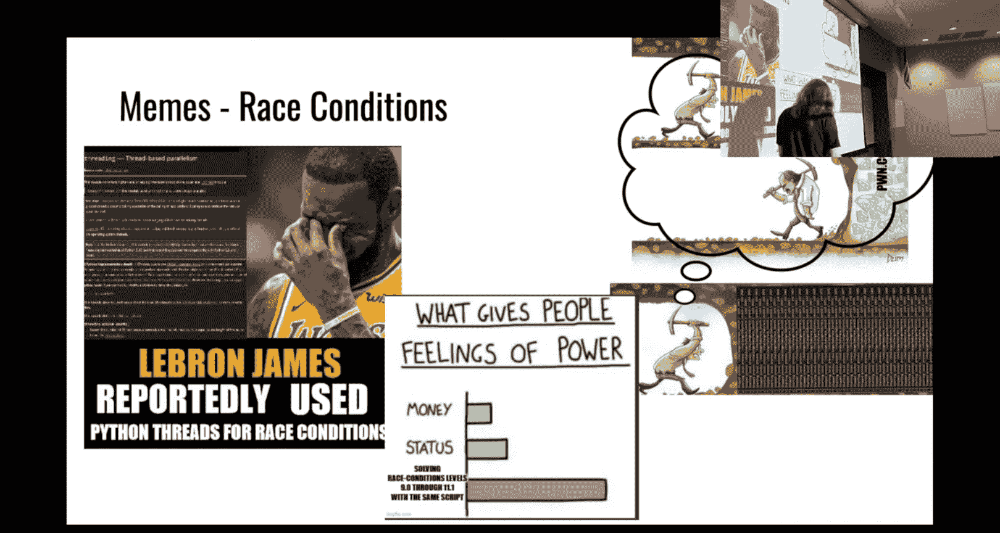

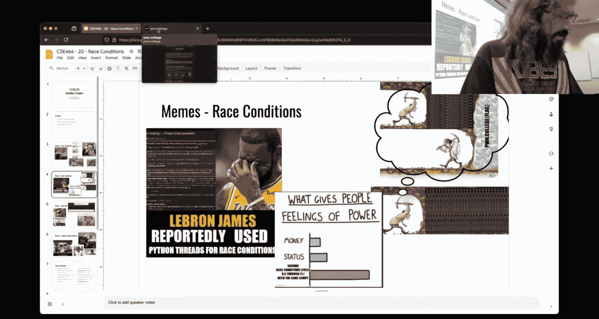

Like that was as far as I got to。Investgate。This， this phenomenon。

 you could be like it's the exact same challenge and I'd be like， maybe。Let's see。

 what is this race conditions？

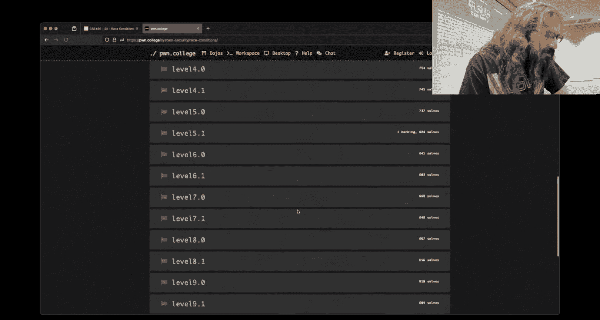

9。Raace something out of the program， additional difficulty making the race harder。

More additional difficulty making the race harder。Oh， I mean。

 do you have the ability to reverse engineer binary？Did you look Okay， so， so the answer is like。

 you're curious， but you're not curious enough to like， you know。

 make three clicks on the desktop interface there。 Like。

 you have the power and hopefully the skill to answer that question。 and that's。

That I's just gonna to leave on you I don't imagine it's anything particularly crazy it's just a matter of allowing sloppier solutions for like the better way of putting it from working and then hopefully it guides people towards a more efficient solution as they iterate from like you it probably found this in other modules as well where the solution to a later challenge may work on several prior ones because we remove the number of approaches that you can really use right it's probably something very similar here with 9 to 11 and you just immediately wrote may have been the first thing you thought of but inefficient solution that didn't have any of the problems that we introduced in the later challenges。

😡，Go， I mean， that's what I can give you。Other than that， open it up and reverse it yourself。

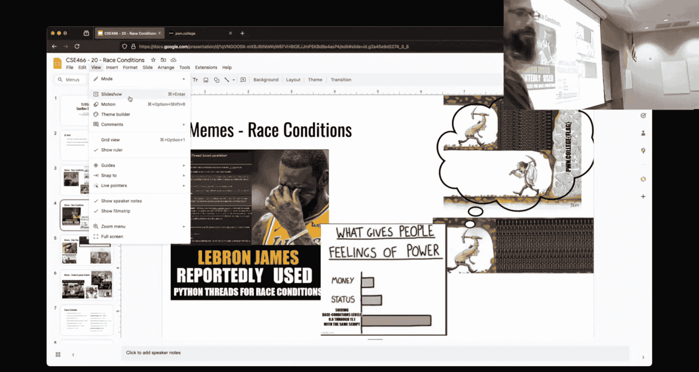

Yeah I think it's pretty cool this is the other you know side or experience between race conditions right my code is right it's the challenge that's wrong everyone else gets theirs to just pop out right away and I re mine forever if I just let it run a little bit longer maybe i'll get the flag。

For some people， that's true。Oh， I don't think， yeah， yeah， okay。

 I did post that I was thinking of this one for some people that is exactly what happened， right。

 they'd like， okay， what I's gonna to let this run go grab dinner and then it just fell out right why why they walked away。

😊，U， but the intention is not for it to take that long that every single one of them can have the flag fall out in a matter of seconds or less than a second。

是。Another thing and I really empathize with you guys on this one。

 I think this is mostly 365 namesme because you guys have been pretty pretty cool with me and hopefully I've been understanding with you as far as just paying on the Dojo。

 all right。The dojo is growing and there's definitely some growing pains along with it and so if your weekend you know consisted of this。

 I'm sorry。啊。People are working on it。People have some idea of why these things are happening is just a matter of those people implementing changes that fix it while also not breaking anything else。

Right I don't hear that much from you guys， but in general in other channels of the discord。

 people make this comment about like oh， you know， server space and this that and the other and you know。

 this is super easy Amazon scales things， why can't this be， you know， it' like guys？

I understand that you are pursuing a degree in computer science All right once you have that degree in computer science。

 hopefully you understand things are not nearly as simple as you you think they might be it's not like you just throw money at a problem and say scale right at some point you have to actually do some computer scienceency things and think about how to solve computer science problems when you think about how the Dojo works we're providing you a full runable environment you know that spins up dynamically with a whole bunch of moving pieces under the hood this isn't just oh we're you know giving you SSH into some box or VM。

Not that you need to know the details， but the point is is there's a lot of moving pieces and so in as a result of that。

 things will go wrong and we'll just kind of do the best we can with it。This one。

Every time that there's some challenges and some things that just， I don't think should be。

 This is my personal。 This is going to be a personal Robert Grant here。

 This isn't like an official admin stance in any way， shape or form。

 But when people use things like rename at2 to just like choose the first half of this module。

I get it， all right， it's cool and it's it's amusing when one or two people do it。

But when when a whole class does it and then you get like halfway through the module and you're like I have no idea how to race like I just look back at this and I'm just like well what do you what you do right and this has a big parallel with probably the same thing that happened for you guys in 365 it's happening right now in 365 where they're doing the debugging the GDP module say same GDP module you guys had in 365。

And if you recall， there is one level right near the end of that module that's like， he ha ha， hey。

 you could have just done this， right， GDP is powerful。

And you know what that entire 36 final class did？I don't know that every single one of them。

 but it's a very similar idea right， hey， let's go look at that level。

 let's go do this and then I don't have to learn anything。

But you know what the rest of that assignment is？Build in a web server debugging， you know。

 debugging new binaries， they have the brand new reverse engineering module that launched yesterday that you guys haven't even seen right that they super cool module like if you have free time and like want to do this for fun they created the con image format which is a custom file format that can then be rendered as an image in your terminal and so you reverse engineering in this binary that works on this imaginary file format that you have to reverse engineering by reverse engineering the binary think like Ywn 85 not nearly as crazy but but similar idea。

And so now there's all these people that don't know how to step in GDP that have to rehearse。

 you know the conium with inW format， very similar thing will happen in 466 here with race conditions and doing things in parallel。

😡，Is what it is， right， but just just food for thought in my kind of personal take。

 it is worth figuring out how to do this stuff in Python like being able to write multi process code。

Whether it's in Python or not， like just being able to reason about foring and waiting and doing this type of thing is a valuable skill regardless of if you want to be in security or not。

 just like that's something I think。Any reasonable programmer should be able to do。

course schedule we children here in sandbox escapes。This is still here， kernel security。

 we'll see what happens there。啊。Final reminder that the withdrawal deadline is tomorrow。To reiterate。

 there will be no massive curve。And please make the decision that is correct for you taking a w is not the end of the world。

 I myself have a W on my transcript like things happen， life happens。😡。

It doesn't mean that you cannot be successful or have a successful academic career。

So it's nice happening end of the world。Consider it because if you do not withdraw。

 a grade does have to get posted。😡，U my response to this meeting was。

 at least I did it at the beginning of the semester， all right。So everyone that is still here。

 you know what you signed up for， can you can't fault me there。

Other logistical things course scheduling， so if you didn't see it， I announced on the discord。

That race conditions I'm just going to give you guys a whole another week。

 there were a bunch of do joke issues as the memes implied and CSE 365。

 I think they hit like 700 some odd users peak simultaneously all just like sporadically spammning things as they approached their deadline to that got pushed and so it was multiple days of that。

Um， which I'm sure impacted you the I the the kind of iron opinions is for race conditions。

 it's actually helpful like the biggerier the system is the easier it is for you to win your race。

It will be the opposite。We want to get to Michael for arch。

Because the biggerier the system is the less likely you are to succeed with myarch。😡。

Fun fact so the checkpoint and deadline are moved to 1111 at midnight the same time the sandbox escape so we'll just have both be due at the same time I understand that everyone's ability as far as you know time to work on challenges is different and so I don't think just giving like an extra day is a fair thing we give you a whole week so you get all another weekend whatever to kind of deal with whatever it is you have。

Colonel module should be the next thing we'll see。😡，With the Dojo being as it is the。

I'm going to say dev resources that could have been tackling this thing to make Colel not suck for you guys have been busy making the Dojo not suck。

So I don't know if we're going to do kernel or we're going to do micro art or what we're going to do。

 we'll figure that out on Thursday。We might do a kernel that just really sucks we I don't know。

 we'll deal with that， I got to think about it。All right， De plans。

 do you guys have anything I don't have anything in particular here。

 so I don't think I think Sam B is a cool module。😡。

I think there's some fun and interesting things you can do with the sandbox module。😡。

But I don't think there's like， oh my gosh， I have to know X， Y or Z。So looking at。

The module as a whole， there's really three things that you need to have an understanding of。

 which Jan's videos cover， you know， what is CA root。

 what is set comp and then what are names spacing， you know， what is name spacing。

I can talked about CR， I can talk about Scom。What do you guys want？能。How glue investors ro them。

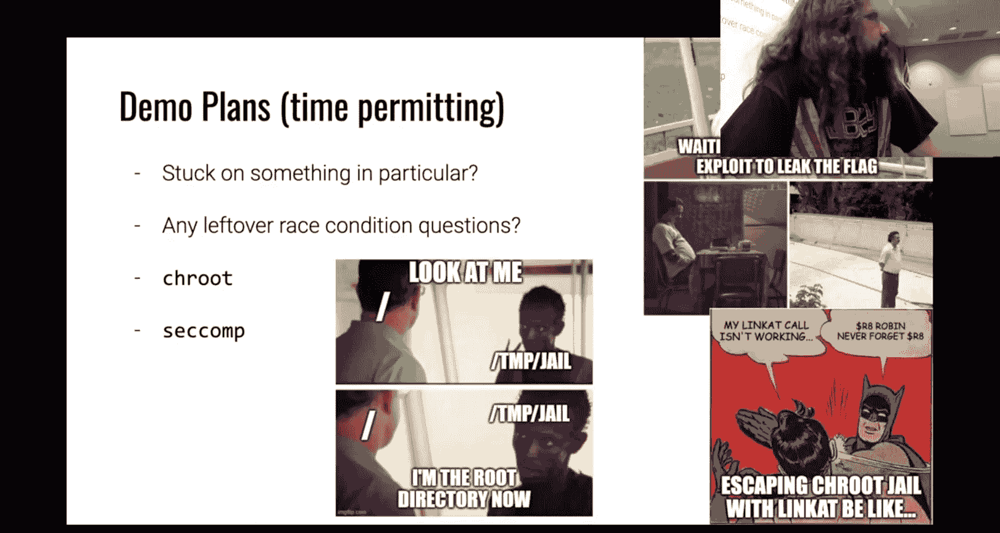

How do I use Srays， that'll work？好。someoneone is speed running， speed running。

 you're not speed running baby race， you're a liar twitchw。Oh， your speed running。The new rev。

 that's what it is， okay。I know who that person is。 And they have a blue belt。 I'm like。

 I know they're not doing baby cr。Okay。So。What do you want to e trace？嗯。Okay。

 here' was baby jail level 12， I just ran best race on it。系。

What do you want to have challenges have I my code words when I do it without asterisk stress when I do a stress I don't see my stress off。

What level is this two or three okay， so for for Twitch just I'm not sure where we're going we'll play with something。

Play with something real here。Grab 2。1。It's something about Sphse and then whether She code is being executed or not。

So。It conditions I am in race conditions and we shall make it difficult。To run the show， the。

The sandboxing challenge。Is there an astute observation？So let's run sandbox。

Hopefully everyone has realized or noticed in the sandboxing challenges， there is， in fact。

 source code。

Tude way back when sandboxing was one of the first things that was taught。

And so it was taught before Re， which is why they're source good with these challenges。😡。

Doesn't really need to be。Okay， Chas will see a route into a jail， wants some argument。

 whatever it takes some shell code。 Okay， it looks like the shell code comes from standard in。

 how are we interacting with this set。Am I using Python Okay。

 I using Pthon phones give me one quick sec I want to look at Twitter。

Twitch says I just got to one where we have to， we have close Ftt， Ltt stat。

Could we talk about stacks， We talked about stat， didn't we wasn't the answer to Stat， a really。

 really simple one。 It was read the gosh darn man page。

I think that question is in reference to sing sub stphon because saying got 30 good rates。yTw shows。

 they figured out and they figured it out， right？啱。How so。I。

 I guess we'll just hand wave that away All I had to say was Gostar Manp。

You were given away too much， sir。I'm not going to repeat that for twitchwitch。Okay。😊，oned by。Yeah。

 so there's this phenomenon right and some students will clearly relate and others will not。

Where people don't watch streams， people don't read slides。

 people don't watch pre recordedcorded lectures， people don't ask questions on the Discord。

 people don't read anything that is said by the instructor and instead they just like bang their head against the wall and that's that's fine like sometimes I'm like that too right but。

There there's and this is a personal kind of bias when people just kind of shout out into the void。

 like level eight helped me。I really don't want to help you because you haven't helped yourself。

Doesn't mean that I won't， right， but it's like the lowest amount of effort one could contribute。啊。

Okay， so。From Pone importm star， we'll say context arch AMD 64。P equals process。Challenge。

Maybed J level2。And we'll do it just like I did there on the command line。Give it A as an argument。

I need to send in some shell code。And then we'll have an interactive。So now I just need to。All right。

Once run this and read。Okay， I have according to child I don't have any restrictions。

 so let's just call exit Anyone remember what the。A x to 60？嗯。You just like 40， 440s。

 you're number 13 fine。意思。诶扑嘅好仔。Yeah， unless it's hacked， then you got to go for one of the classics。

 you got to go for like wheat， beef。coffee。系啊。Cafe。One day。

 see this is why I empathize with you guys， all right。

 I'm hitting buttons and you're not seeing the things move。嗯。I've considered。

SSA is tune into a different box。Then you don't get us to see me feel your pain and I think it's important。

We suffer together。All right， so I have a do dot pi。Can I get this？That workeded， you agree。

All right， so you want to etrace this。How do you want to do that？Okay。

 so the statement for twitch here is I will I want to s trace this but I don't want to S trace Python because that's going to be extremely noisy which I agree so what we'll do is we'll put S trace。

And our arguments here。Yep。That's a bummer。I didn't expect that to happen。嗯呃呃嗯。

Proox did her again blush。Because you can do that。Generally speaking， X will send CCcc。

I just want to sanity check myself， hey， that worked fine。Is it looking for like a new line。

 I that what it is？嗯。There would be strange。I'm sorry try single quotes instead of double quotes for。

re， they're equivalent in Python， but。We can certainly。Do that。That would be one of the。Coolest bugs。

If that does fix it and crap， it does not。So is this where you are getting？No。

 this is something brand new， we broke it in a brand new way。哦。Yeah it to be present but any care。

Sos let's reason about this， Stce Sig aort。Does the circle need to be formated？

Does the shell code need to be formatted？The show code is。Like if after the before the river works。

so by default portals will。Use Intel syntax， I don't need that here。This is quite。Interesting。Well。

 what we're seeing here， like's let's think about it， okay？It's Stras that's dying。

 Stras is dying due to sigabboard。

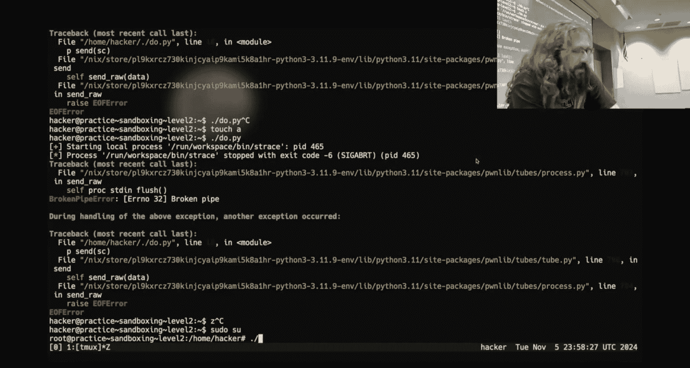

And so my thought here is， well， why am I getting？Sig a board。RightThat's weird。

So now I want a sanity check。

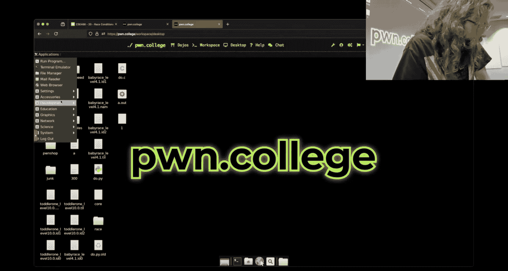

This binary。Doess this thing like sigabboard all in its own somehow。The assert fail of Arg C。

Straighter than 0。啊，可以块。Tried this。I'm just going to try a couple things。

 So the first thing I'm going to do， because I don't actually don't know where we're going here now。

 This got fun。P I like piano Do you not like piano interactive。

Other thing we could have is there could be。But breaking the4， but breaking one。

 you send the show during the。You think it's breaking when I okay？All right。

 let's do the thing that I said we don't want to do because it'll be very noisy。Let's S trace。

Do dot pie。And send this to some crazy file， Oh I want dash O， dash O out。Okay。

 so that happened which was good the just the we without without St。If we just do that pie， okay？啊。

你佢得。How's not this worked。 we did this in this worked。To roll back the tape now to prove it。嗯。Okay。

Let's get away from Shelly equals true。Okay。So that works。That works。

Is it because it's looking for first argument at the file lane but since we're passing SRAs challenge and then a it thinks that slash challenge is the first time？

So it the question was。Because I'm putting S trace followed by something else is the first argument really challenged instead of a。

 and that would be the second argument of。S trace is dash A， but the first argument of。Baby jail。

Should be。That is a。Fun looking bug。Okay。Let's do。能。😮，啊。I don't have a good answer for you。

That means this is。As you would expect that to work。Aren't she right the shirt fail。

 aren she ready one？S S trace F O o。Dude up high。公出先。In code， it's a library called Pone toolsol。

Exect。Okay， so twitchwitch is at a loss here too。Okay。So here's the。Dot pie。

 There it is exiting with an air。Where is。是。是。Challenge。Vest， there should be。Okay。

It's like it doesn't exec。I'm confused。Because I would expect to see Python。Fork and exact。

Did you find it。Do you help him somebody else or do you did you figure out what I'm climbing on Okay。

 well that's fair。Someone says， no， we're not pseudo Stra。 so you don't need。 I don't think you do。

Oh I'll put it there need to。Oh， well， does this thing open the challenge Will read or open the flag file then it take aboard if it doesn't？

That would make sense。Okay。Okay。

So。Somewhere here。This guy has to be opening the trying to open the flag and then sig a boarding actually what something run。

Oh， is that what it is， Yeah， because youre doing C a certain C shoot。 Oh yeah。

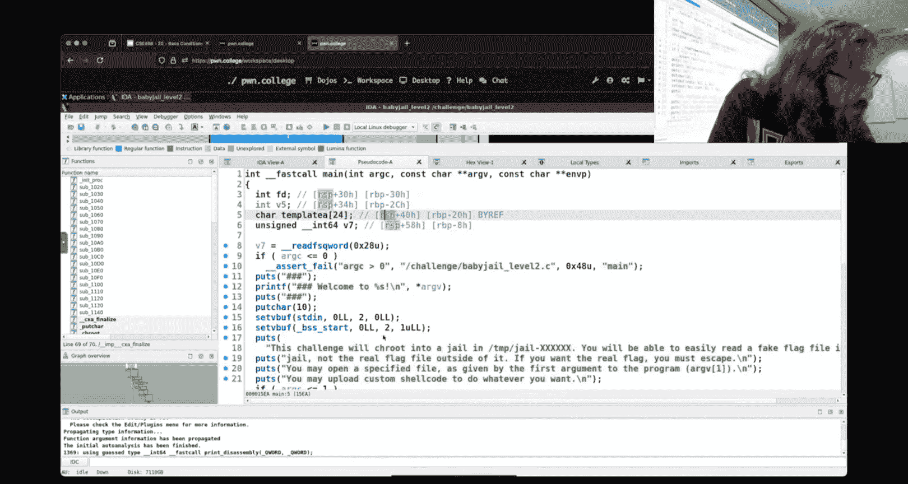

So its then if you don't do it okay， we're feeling this assertion because Cru， okay。

 that makes sense now the thing that bothers me though。Like I 100% buy what you're saying。

I was I swear I did this。Right， and then I did this。Okayあた。Something similar happened recently。

 I changed the provisions of cat and turn。Stop look。Okay。

 so we got that well it doesn't always have to be that that I'm the one that finds it I soon have just stuck with my gun zero and'm like let's look at what the binary itself is doing right and C route does require pseudo and so what was happening is we were calling Croot and estray drops permissions so we're calling Croot as a normal user which called it to Ciport which why etroot。

Was that what was happening， do you？It was something else。

 but we still learned something fun and hopefully useful along the way。

I don't know what happening this。 It's the same thing that happened。 see I see it it could be this。

 but I was not getting my cost printed so。Don开。It'll just be a mystery for the ages。对。Okay。

 but I won't getting that that is because。It was like I could see ci curve but。Okay。

 there was something else going on， but this was still a useful endeavor。That's what we'll go with。

All right。Oh。So anything else interesting， I had nothing done。What else do I have here？

So everyone understands what C rootot does。你呢。😊，Can anyone tell me what Si truth does？

 We know that it doesn't work if I'm not root。All right but what does it do when I have permissions？

哦。What send delivery everything profit but。That passes still this。So is this CA root， that Ca root？是。

对。请我啲装饰票嘅零几半。Did this do that？Cause you bought a positive your ba and Jones it to a stopped balessly。

 I well over the new he。But what's happening here？You need a bin bashing them， okay。

Oh punching the keys。 All right， you have to give the Dojo a minute to you know， think about it。Okay。

 that exists。Let's copy bin bash into temp bin。You know what， go there anyways。Okay。你什么时办？

That not work。喂，试。嗯。ま。嗯一。The victim what is not mind you have water after。是。No。哦。

I think it's Ste B mesh。But do you want， I think the commercial should be sos head slash them。

 slash them you want this。Yes。What's happening？Why。😡，You mastered the first one。

That is relative person。你所。系开而家俾听。那のされでか。系。No love。四星四四岁。아。It's discern， but big。

These challengess make it work？あれでは？I don't know abs get plugs I run greenname that。Oh。

 that's the one thing we learned。 It's not rename it。 it's rename act too。😊。

So we had the right idea here， right？We are creating。The folder named bin inside of bin。

 hopefully we have bash。Which we do。And then when I CAH route。It's not as phrase this。

The problem is that。These commands don't exist once we enter the C route and so we try to create bin bash。

 right， but then you'll run into this problem。😡，And that is B Baash relies on other things。

 doesn't it？Because it's a dynamically linked binary， so when we try and fire up like bin D。

 it's going to look for like Lib C is that there？😡，in so we have to， if we want to create a CR jail。

 we have to actually move everything that。The binary could reasonably want into that little world that we're going to see a root into。

And so just copying bin bash is not sufficient if we looked at。😡，T been ba。

 we see that it is dynamically linkeded。And so it's going to look forward Let's see it's going to expect there to be a lid folderer right now。

 if I had a statically compiled binary， it could probably live in there right because it's like I can live in this directory all on my own。

 This is my own little world。 I don't need anything else。Now， to my original request。

This C root is not the same C root that the challenge used， right？😡，Which tan root is this？Yeah。Now。

 this is actually not the terminal， the main page for it。

This is the concept where it's C root 8 for coreut Tis。I've never been to a CA era man page8， but。

That is not for the terminal command。 The terminal command should be man1 sea route。

Which doesn't exist。 Is this a built in。No。That's strange。Okay。

 so this is man too is the cis call that everything is actually using。

Now somebody said C root what it does is it changes the definition of slash right and that's all it does。

 however， as we saw just trying to set up and run like bid ba in a C route jail。

It's not as easy as just like oh we're going to set root to be something and then run this arbitrary program right there's actually a lot of things that you have to like get set up correctly。

 make resolve correctly when you start changing what root is and what the path is。😡。

Does CARru impact any other resource on the system？Now。And。For the first， I don't know， two or three。

 maybe four challenges where we have like these basic C root jails。That is the idea。

 it's going to run C root which will change what slash is if I want to have。😡，Let's make， like。

 the world's simplest binary。P。s death of。It's that it。No。These are the things that I should know。

 but I don't。唔住试试。Static。Daathttic。Paashtatic P I。e。

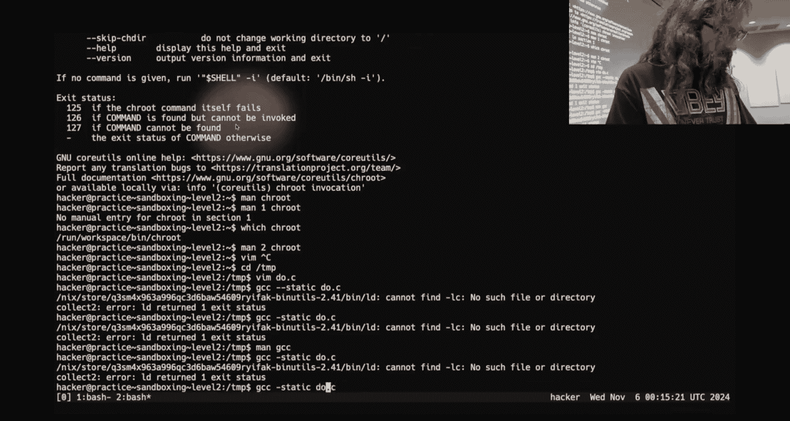

Second All。Apparentlyly， I cannot to do that。

妈。L Baaz， L Bar。 I don't need to link anything。 That's a lie。Gcc do that see。啊。Sadair。嗯。

So I can't even build a static binary for you。

嗯。老安。

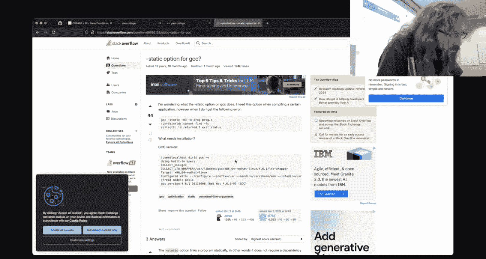

I shouldn't need any of that。 Ecc， C， static。 Oh， a do out。 Do not see。Cannot。

Link see bin yourtails next。Half dang it okay。

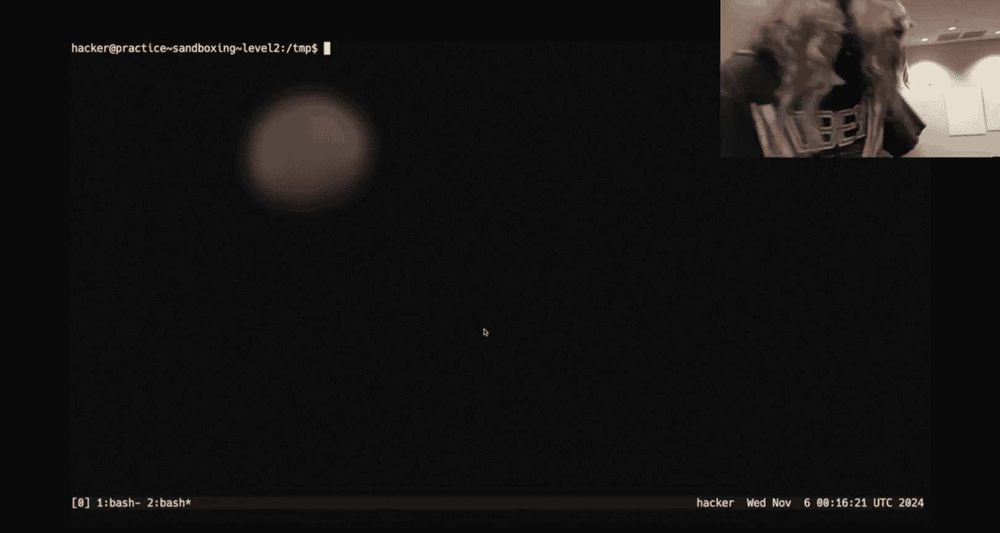

So I can't even run something in your little。

C H through jail。Okay。So if I want to make it we'll just have to talk around it。

If I want to make a C root jail， what do I， what do I need to do。

 I need to call CH root and then I need to do one。Change that dream I need to change my directory。

Because when I call C truth， I'm just changing the definition of slash。 I'm not changing where I am。

 And so it's great if I may define slash we think about what are。

Path looks like who cares if I define slash to be in temp。

 if my current working directory is slash right that's great as long as I never CDd into T then it doesn't matter because I can I'm not in the jail。

 I created this this little dedicated isolated region， but I'm not in it so who cares。😡，哎。Now。

Once I've cded into it。Then I have to live inside of。Tempt jail， right？

What are ways that I can reach things that are outside of this？Okay， somebody said file descriptors。

 so how do file descriptors work？When we open something， like what， what are they？We get this number。

Does the kernel check the path every time that I access the file ofscriptor？No。

It's at the time open is called and so if I open something。

And then call CA root and C into it my file descriptor that is already stored inside of the kernel and so Im already holding a handle a file descriptionscript is essentially a resource handle before the file in the kernel I could access。

😡，That file after I've C rooted it right and so that's a way that I can。😡。

Access things that are outside of the jail。What are other ways I can access things of jail？你你啲个。

So file descriptor， I need to make sure that I'm CD didn't into it。One of the questions on。

The discord was about this thing link at。 It was also a meme about it， which I think I havent slides。

What's this thing do？嗯。对。This is the thing you had to me about right yeah it's like good making a hard link to above okay。

Yes， so I make a hard link to a file， which is what it says right here。Is this useful？Yes， why。嗯。

如嗰是俾下诶。Baar is Ven and final for a director。 Then we can link to any file in their director。 Okay。

 so the statement was， if I have a file descriptor that points to a directory。

 then I can use this to access any file relative to that directory or in that directory。

 that that's a fair statement。Now。The meanme was talking about， I think register R8。

 does anyone know why R8 less flag， okay？So what are the registers for this thing？A， Part X。

 pattern par。RDI RSI， R RDX10 R 10， R8。Okay， but， what if it was a function instead of a file descriptor or I'm sorry。

 a function instead of a cis call？😡，So so calling conventions this is something that trips people up。

 it's not what the mean was about calling conventions for cis calls and functions are actually slightly different。

😡，Right。Functions。functions are RDI， R SI， RDX， R CX， R8， R9。Siss calls are RDI， RSI， RDX R 10 R8。二大。

In， in case you didn't know， you got it right。the challenge what's that I just did the challenge well because you just did the challenge so it's it's a common mistake that people make is if you look at just general calling conventions。

 you'll see RDxRCxR8R9。But for Cisco specifically， as part of that interaction to moving from user lane into the kernel。

 RCX as a register gets used by the kernel。😡，And because of that。

 RCX can't be used for the Cisco colon convention， which is why it's slightly different than the use our tenant set。

😡，That's a gotcha。

All right。

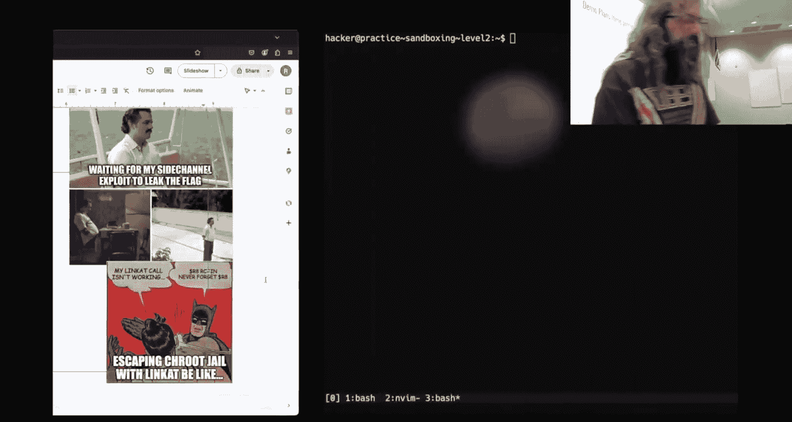

So we saw Sar。Somebody says hi from Frankfurt， that's a long ways away。If。Current directory equals。

 okay， you're trying to best script。What is setcomM do you saw set comp in what program exploitation。

 what did it do youcom？It something that's just calls it restricts the is that judge binary can call。

Okay， it restricts the cis calls that a binary can call after you perform the cis call setcom。

 right like after you initialize and call set comp， right， you're creating a filter for yourself。

 what signal do you get if you have failed setcom。I don't know the number。

If you have a ci that so like when I say S alarm or Sig Seg V， what is the the set comp success yeah。

 and so if you are running any the challenges that use Se comp to limit what you can do and you are getting Sig S。

 it's because you are failing Secom。How does Secom like work。

 like think about it at a high level here， wait， what is it doing？

So it stops me from doing cis calls。just checking like breaths every time he do this ball， seeing if。

Is if that rackx number is in it like table of a allowed diss in it that's not then this like this so the sta was is basically just a giant filter of when you perform the cis call assembly instruction what number is in RAs right because that's what determines what cis call is being performed。

Okay， is there any way around Secom？一ば是四个た。Okay， so so what of the that that was good what of the program exploitation challenges involved a snack vulnerability and so if。

😊，You could somehow corrupt the data before the filter is applied。

 then you could manipulate it that was one of the program exploitation challenges。诶。Anything else？

Just。Side channels， Okay， and now that's kind of interesting boy， what's a side channel。

 let's say there's no right。Using the other support in a matter that allows you to grab the to。Okay。

 let's say famous。Famous script。Re name on script。Oh no， not the rename at script。

Iappy will be asking you about any name item。Pro。Okay。

Let's include do something very similar to what I was already doing。I think we did this。 No。

 we didn't。 So at the end of reverse engineering that very last John 85 challenge。

 How many of you guys finished that。ok。好。2。All right， soum that one。

 I'm not going to say was a side channel， but it was very similar to a like side channel attack。

The idea is there are other ways that we can leak information。

What is one way that we can leak information？That Jan talked about in his lecture video。Txi codes。

And this was something that was used in Janon 85。没病。Is it just a suggestion？看。

So my binary here just main orrc c org v is going to call exit on Arc C now this is like a super silly example right。

 but if I can get a number into exit，😡，Can I use that as a means of leaking information？Yeah。Yes。

Here I'm just doing it in fast in case we're aware dollars sign question mark is the exit code of the prior command but can do the same thing in P tools with。

😡，嗯。我。Yes， P dot poll on a home process， we see when I ran A do out with a。

 my exit code is two because I gave it two arguments。

 there's A dot out then there's a and then if I run A dot out ABC， there are four arguments。

 my exit code is in fact four。😡，So did I print anything？Now。

This is something that the process has to do as part of being complete。

Right of just being done and exiting there has to be an exit code what's a normal exit code's like a good exit code zero zero。

😡，Okay， typically non zero indicates an error。 What's another way I could。

Indicate or communicate information without printing anything。没去。What was that sleep？ok。

I think it's man three。Now， people like to do this。Or something similar to this in these challenges。

There is a challenge where sleep is utilized。Could I figure out how long this thing was sleeping？

Yeah， we could set a timer， we could run， we could time it right。

 but what if what I want to leak is not。😡，Something like1，2，3。

 What if it's something really big right， because odds are what we're trying to leak is the flag right。

 So how do I make。This。Make sense in sleep。What's that？There's a long approach。

 Well just I want a approach right now we have I don't know， man， right now we got silence。

 so like the approach that's going to take a week is better than the approach that just doesn't。这边的就。

No， no， it's fine。 Like， why do you speak for。What the okay， so the the statement is。

 what if I just sleep？For whatever the bite is。This you look through the each character and。对。

Asking number So if I say like flag zero， that should be P， right？All right。一直讲。

I bet you that is going to be a lot longer than P。好。Do it down here so I'm not on the camera。

 give me the order of P， P should be 112。诶快。I think I got an L tracer。明白。Okay。

 so they did actually go， I was surprised they did pull the actual value。

 they didn't treat it as a plan to the member dress。But all right， that's up for 112。

And so I just need to sleep for somewhere between 10 and 128 seconds for every character that is a a good。

For what what， what your passing like inter to figure out when the flag is。

This was one way of doing that this just what you're saying okay。

 was there another thought I haven't attempt this I was thinking if you could take like based on the precision of C if you could take a few and then like divide by like100 or like 10000 and then you have like precision of like I don't know okay the 12 digits you can see like a sleep and then leak like multiple bytes at a time。

Okay， so the， the thought here was。What if we're going to write some？Ugly。Ugly number。

Do I want this to be an end？行。The the thought is I want to do something like flag zero divided by like1。

 right， and this should this should give me a higher precision The problem is。

The number that I'm working at if we're dealing with integers is 112 and so like if I divide that by 10 I get 11 what's the what is the difference between。

喂。11。2 and 11。3 for like P verse  Q。Right， I'm not actually going to do that because I'm going to lose。

That lose information when I treated it as an imagery。No， I could。

I wouldn't recommend it try and convert it into a float， right？We be like， well。

 then I don't lose information well floats are actually quite lossy。

 but our problem here is sleep takes an ant。So I can't use sleep。For those that are in the know。

 their sleep is really just a lipy wrapper around the ACis called nano sleepleep。

 so I could take that approach and say， well， I'm going to use nano sleep and instead of if we look at this time spec。

 it says it's a pointer to a time specstruct，And this time of spentstruct consists of seconds and nanoseconds。

 so I could do something similar by instead of calling sleep here on seconds。

 I could call nano sleep and specify nanoseconds。Right and that could that could give me a smaller。

Amount of sleep time。 They said that thing may run faster。This is a central binary。

 a that what I've got using many seconds the para takes second in many seconds well。

The nanoy so would it get the or would it get G？by the program execution， for example。

 it lets say sleeping and sleeping for one second but nanoleeping its44。

1 and actually does between something so I'm just thinking that with the with the binary noise like binary execution flow then it would will it affect like nano steep time。

Okay， so the statement， which is a good thought。嗯。Hopefully I can do this T。T B sack equals 0， T。

 T B， N S will be。Flag 0。And then we nano sleep。14。Make sense。学会。The compiler says no。What did I do。

 Man Denno asleep。Oh， it wants this other thing， but this other thing can be null。

 so it will be null。It Mr I that very fine。Okay， so my， my time doesn't give me。A lot。

 I don't I don't have that level of precision here with time， right for NAO。

I have 10 to the minus three， so let's make it that times。U what do I want six zeros？1，2，3，4，5。Sex。

 I think that'll get me。Well now I consistently get something。So。But what was P？Okay， and what do I。

 no it's almost consistent。I get 113， 114。So you just have to take the time with the regular binary running。

嗯对。So the statement here was that hey， I know that there's some runtime of just like starting up the binary area。

 I know there's some runtime of this just running right and because we know the first letter is P and so we're expecting 112 we're seeing 114。

What if I just subtract 0。002 from this， right？That is a way of doing it。

I wouldn't do it this way myself because of this exact problem， this variation， right。

 we may know because we have to run it once for every character。😡，And we may know， oh well。

 this was wrong and this was wrong and this one was right。

But what happens when we get to these random bites that are inside the flag？

How do I know if it was an A， A B or C？😡，Right based upon that time。

 which one is the right one now you could make an argument and we'll play this game in micro art but you don't need to play this game now of running this1 hundred times for each character and being like what is the most likely thing in doing some math and doing some statistical analysis right you could totally do that。

😡，And you would probably end up with our correct result if you wanted to write code that did that。

It's more work than it's probably needed。嗯。You've all taken data structures and algorithms， right？系。

What is that efficient search thing that they have us all do Now dister is binary so that's the thing。

 Can I Can I use that？Can I use that type of logic here or that type of thinking？😡。

So like the minimal case when it comes to like leaking information in a side channel is I need one bit of information。

 one of the reasons that we have this like variability and fluctuation here is because we're trying to communicate quite a bit of information right we're trying to communicate the number 112 which。

😡，Is technically going to be up to seven bits of information I'm going to argue it's eight because it's a byte there's really only seven bits that period data we care about。

😡，And so if any one of that is slightly off， we have this error going on。

Is there a way where we could concretely？Say， I know for certain。Some piece of information。

 one bit of information about this first character。没有。we any exc。Rs of。Like ifific accept。

And if it is one， we can sleep for longer。 And if itt it don't sleep by。 Okay。

 so the the statement was， we can make the decision to sleep or not sleep。 That is a binary decision。

 right， Something happened or it didn't happen。And so I'm going to modify this just a little bit。

And we're going to say。Guess is going to be。A V， what do I want， R V 0，0。That makes sense。

And that make sense。That should be the no， one zero。I want the first argument。

 the first character so zero of the second argument， which should be index one。And we'll just say if。

Plague zero。Equals guess。And we sleep。Else？We just， we don't sleep， so I really don't need else。

All right， let's see if I can rate C code today。Is it an A？I don't know。

 well now we're sleeping so little that I don't know if I can feel it。Okay， now。See， in theory。

 if I wrote good code。Now now we get it when Iran ran P， right？

So what happened here is if it matched， then I have a longer sleep， is this detectable？

Is the delta between that a big enough range to where this didn't like happen by chance？Yes。😊，No。

 I did ask I wouldn't have to run this。I don't know，128 times， right to leak a character。

 is that the end of the world？No， you got them by doing race conditions where you probably were writing things thousands of times per second。

Right。😊，So there's nothing stopping you from you employing this type of logic。

On the first character and we just give it 128 guesses， which one was slow。

 That's my character do the same type of logic on the next character， we go 128 guesses。

 which one was slow， that is the character。Did we print anything？No。Did we？嗯。

Communicate anything with like the exit code。No。We weret just making an observation about something we could observe of the program from the outside no actual information was communicated。

 oh that's not true there was one bit of information that was communicated。

 which is did we take the branch or did we not？😡，Right。Now， someone might say。Actually。

 someone will probably do this。They'll do this。Is this an efficient algorithm？呃，不告诉。Somebody said no。

 I said， wait a minute， Robert， no， this is slower because you're sleeping every time it's false right whatever your indicator is that's increasing your runtime。

 try and do it as little as possible。This wouldn't be the end of the world small scale right and especially since we're sleeping for a tenth0 of a second。

😡，But someone's going to write something that's going to be like sleep for a whole second on false and that it's going to run for like 15 minutes and that's not me。

 okay， that's that's your code guys。Now， this logic， this idea of this binary search。

 if either a path is taken or a path is not that communicates one bit of information doesn't have to be asleep。

 it can be anything that you can observe。😡，This is important， there is a challenge。

That let you all sleep。There is a challenge that does not let you call sleep。

Any binary choice that you can observe whether a path was taken or not。

It's sufficient to communicate one bit of information。Does that make sense？Like why that works？

Like that is the big thing with like side channels for a lot of these challenges。

Like these middle middle tier challenges， my favorite challenge， I think in this entire course。

 I think is level 12。Of this module， not because it's like impossibly difficult。😡。

But it's just a fun one to solve。And there's always。A more fun way of solving it。Right。

So like this was pretty， pretty quick。Right。For these later challenges。

 they just remove more and more things that you can do。

And so you have to think of more and more creative ways of leaking information。

 I think level 12 is the most restrictive one of the challenges。😡，For this one。

Last year me and a TA competed for the fastest solution。For level 12。

 I don't have the code I was rewriting it before class。

 I don't have it done yet I'll have it done by Thursday though。😡，Um。

 and it would leak the entire flag in like 0。001 or 0。

000 to where like they didn't even register on on this for the entire flag。

Right way it's using a side channel that like we don't talk about in the class but。

Side channels aren't specifically oh you slept a bunch oh that was great like it can be anything that you can reason about what's that you talking about the one would just read I think it's someone with just read that was one of my favorite levels in their favorite challenges in this whole course。

Just because I think it's fun and there's actually a surprising amount of creativity and it goes back to be very similar to race conditions。

 how you write your code matters way more than anything else。😡。

People will write horrible things that just will not work and you'll be like， this can't be solved。

They can all be solved almost instantaneously if you write efficient code and think about it algorithmically。

 correctly that like abstract data structures and algorithms class that you didn't pay attention to is going to matter in this class or in this module when it comes to leaking information with Adam them on time so we'll end it there。

😡。

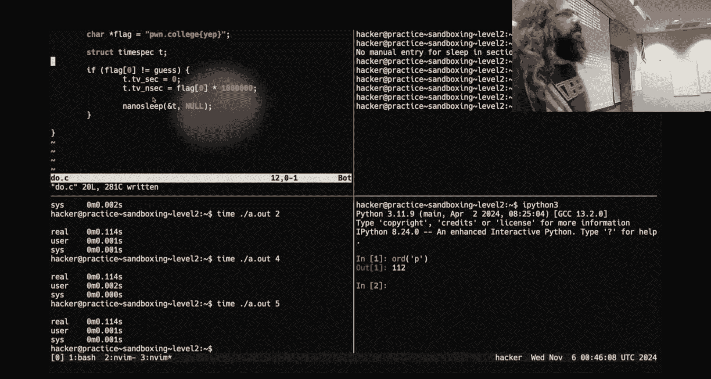

Which， it was fun。

Goodbye， Good luck。 Go vote。