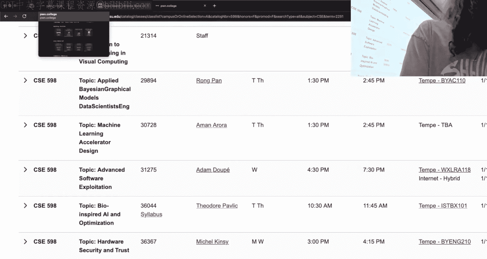
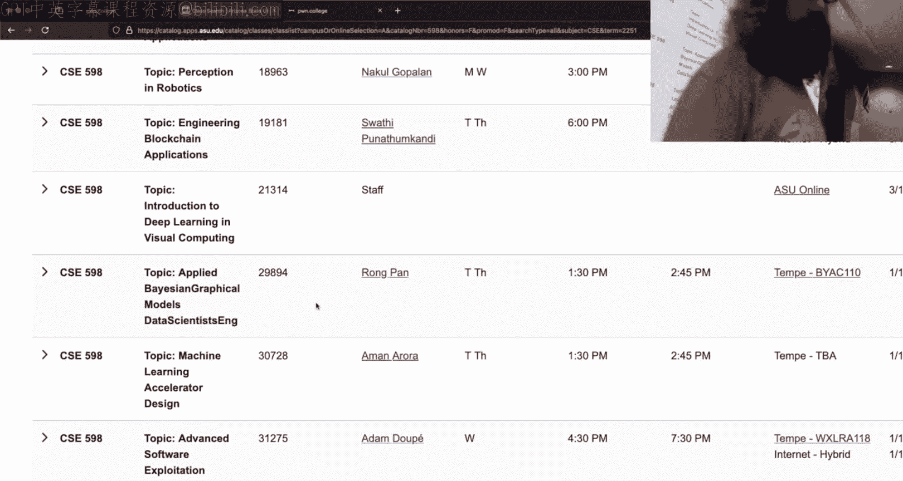
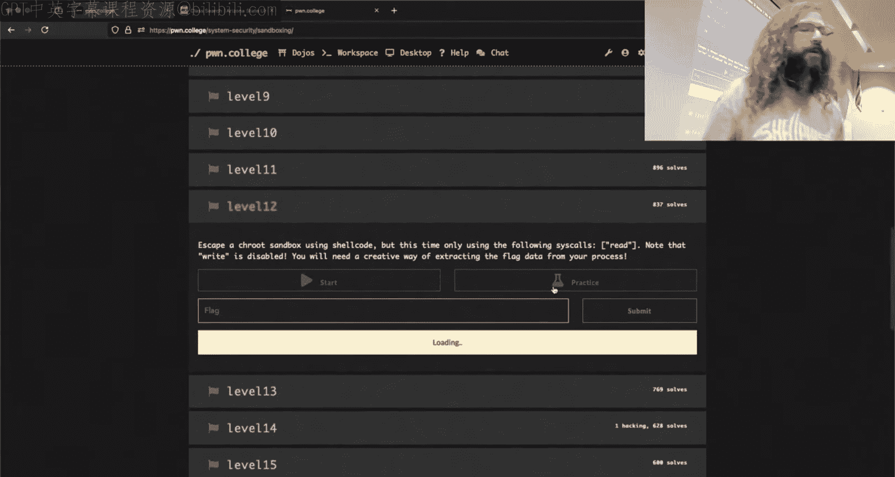
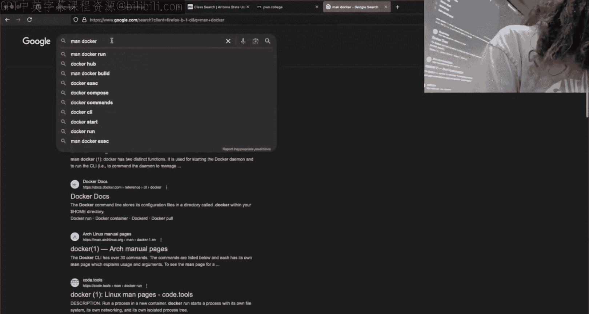
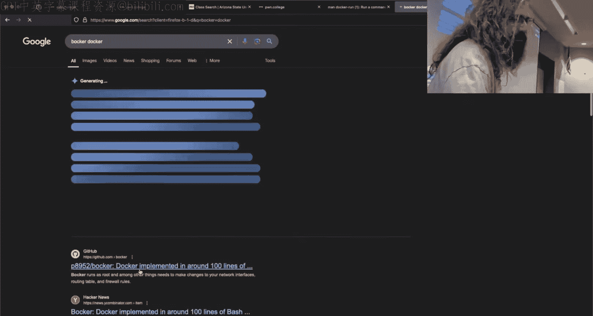
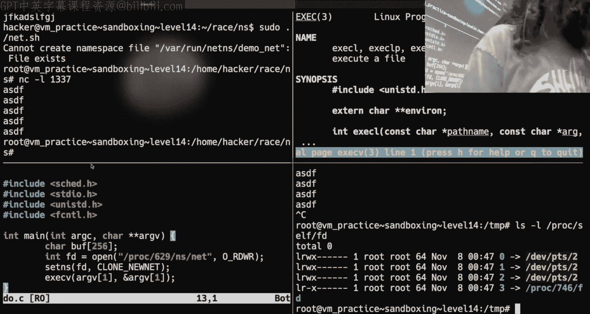
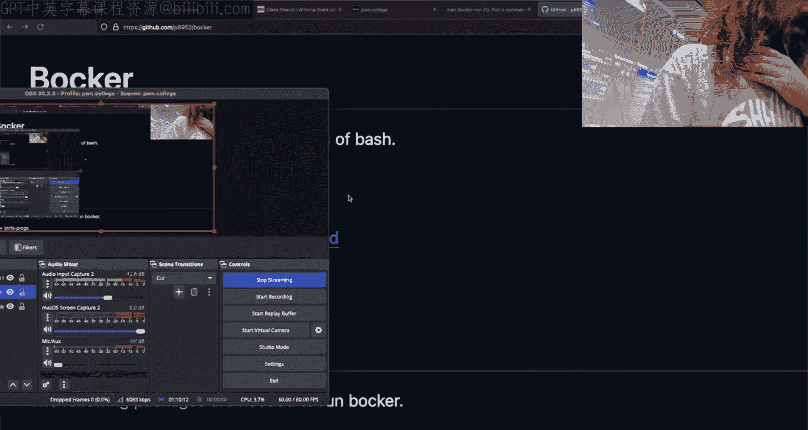

# ASU《计算机系统安全｜ASU CSE466 Computer Systems Security 2024》中英字幕deepseek p22 -23-Sandboxing - CSE466 - Robert - 2024.11.07.zh_en -BV1spCGYZE9D_p22-

We hit the button。 We give it a moment for twitchwitch here。 See what's happening on the other side。

Is OBS going to play nice today， maybe？Sorry I'm a little bit late here。

 we had some chit chat before class。I have no slides for you， I did pre some demo stuff though。

Let's make sure audio。All right， audio words sweet， all right。

 so the only thing I have other than talking about sandboxing is this class that I claim exists in the spring finally kind of exist so if you are interested in this type of stuff and want to carry on a bit。

Yeah。There is CSE 598 advanced software exploitation it's being offered in the spring this class is listed as a three hour class once a week it is three credits hence three hours we'll see whether or not those three hours get filled so three hours on Wednesday it's going to run very similar to this class except we're going to have class once a week I'll still do some lengthy office hours period for more hands on but it's going to follow this kind of same flipped classroom let's figure stuff out as we go it is grad course however。

 if you are an undergrad and for whatever reason need an instructor overrite reach out to in this case myself and I'll connect you with Adam and we'll get this squared away you'll probably see the on screen for a lot of this course。

Okay， with that， I said I have no slides。

Do you guys have anything in particular you want me to do， if not， I have some demos。

 including figuring out why the first half of Tuesday didn't work I can make it work now。😡。

go to names Yeah， just explaining general names but what NA is Okay the statement for Twitch was。

 could I explain namepacing a bit just kind of a general idea of what is name spacing Twitch says oh Twitch has a couple things Why is everything called CSE 598 All right so that is an interesting question administratively CSE 598 like every course has a code this CSE 466 there are like fixed codes where they are a rigid part like of the curriculum or of the offerings of the university that's where you get CSE 466 things like that Now if there are topics that an instructor is particularly interested in or they're excited about they want to explore they want to try something they're passionate about relating to the research or they're interested in creating a new course generally speaking that part of that process is to kind of like。

Trial running right it's like this experimental thing。 Maybe it'll work。

 Maybe it won't see how it goes， see what student interest is。

 There are two course numbers that can be used for this。 There's CSE 494。

。I don't know if there's anything there， there is not。

What's that nothing for for spring was there anything in fall okay so there's CSC 494 and we see these are the undergrad level difficulty and they all there are courses that all begin with topic right and so this is a generic course code for topic courses which means it's something new something experimental it may happen again it may happen once and never be taught ever again right it could be something an instructor is just really interested in exploring with students and it's a one- off thing and it's never taught again it'll go out as a topic course。

The graduate level equivalent of CSE 594 is CSE 598 for a lot of the cybersecurity courses we are trying to kind of you know form youulate and create interesting and challenging curriculum one of the problems with the cybersecurity content in general is it requires a lot of background knowledge right you have to know a lot of CS to begin to talk about cybersecurity with CS because of that cybersecurity courses tend to start later like 300 level40 level and then you graduate and so in order to kind of code these in a way that makes sense for software exploitation wherever this is I think I'm still on spring。

Or on fall， CSE 598 is the topic level for graduate。

Level courses right it is not a hard pre rep simply because it cannot be that you take this course。

 but the type of students that we're looking for to take this course are the people who did well in CSE 466。

😡，When I say well， it's not just pass， but people who got an a got 100% they're interested in it and they want to go further I don't think I think personally I think the course is easier than CSE 466 because it relies on that same skill set of using TB reason about memory if you've done well in this course you'll probably do well in that course but that's why it is a CSE 598 it's a generic topic course that at this point has been taught it' to be the third iteration of it so we have some idea of where it's going and how it works。

😡，And if you are an undergrad and you're interested in it。

 you should be able to get in and it'll just require some paperwork。let's see。

 what are I talking about we're talking about sandboxing。Other logistical things， people asked。

 what is the next module， we're going to do kernel due to infrra things。

 I'm not changing anything with kernel so you're going to get kernel that is the existing kernel。😡。

But I'll talk about the things that I wanted to add。

 I'm just not going to add challenges that touch them because that would just be paying for you every time you'd hit enter in the terminal you get like a 2 second load time if I did it。

😡，What about thread stuff and name spacing， I don't think you need thread stuff。Question。

 hard kernel， easy kernel， this is easy kernel。Do I。

 do you have to know a lot of background knowledge makes sense why I don't know what you're talking about there。

 All right， I think I'm good with you， Twitch。

All right， cool。 So the question was。

What about。Name spacing。So。I did spend a little bit of time messing about earlier to。

So I wanted to finish it up my solution to level 12。

 I had like this world's fastest level 12 solution， right？

I don't have that anymore because I name everything do not pi and delete it， right。

 which is unfortunate， but what I do have， I don't know why I put it in the race folder， but I did。

 This is where I was working。I made this by， it's written see。All right。

 and this is how this is how fast my solution。To level 12 works。No all right。

 now this is actually kind of slow。Um， because I in the optimized solution。

 because I like that I wrote this fresh， right， just I knew the the concept。That I was going for。

But the one that I had last year， and I know why I'm slow right now。

 I just need I need to fine tuning more and spend some more time fiddling around。😡，Was 0。001。

For for real time， so it's totally doable， right？Yeah。

 the extra output is because I'm calling right and I'm just like eating out 100 bytes of just whatever。

But。It can be plenty fast depending upon how you structure your side channel and for anyone that's curious。

 this is not using any multi threading。This is not using any multi processing。

 this is one launch of the challenge process one launch。😡。

So if we were to esRAce this thing and let's follow it。😊，Or let's do it S trace， dash F， dash O。

 we'll call it out。 and we're going to run。Where's thismester face dash aft dash， oh。Out， a are out。

My Stra is bad， and I need to pseudo。I mean。Let's pseudo su， asked Trash。Dash bow out F theta out。

Okay， and then we Gr this thing for。Cat out Grep orrk。Why did that not work？

Well now it doesn't work at all， what did I do？I think I hard coded to file the scriptor that is somehow breaking this right here。

That's a shame。How else could I pause this？Okay， you' going to have a trust me because I don't want to see with the source but fork is only called once inside my C code Oh I know what I can do so you saw me compile it well no because you still wouldn't know that I'm calling fork and there's one fork All right there's one launch of the challenge process So it runs once and everything else is the side channel So depending upon how clever you want to be with it the point is is that you can get super super crazy fast right。

If you are curious about how that works， you can ask me offstream and I will show it。All right。

 because I think I think it's cool。 I'll talk about the the technique and how it works。

 So that we had this other problem， right， yesterday where we're not yesterday。

 it feels like yesterday， but it wasn't where I was over here trying to use C H route and things were just not working。

 right， that I was like， okay， I need to compile。😊，U like hello world and I need to do it statically。

 and then Gcc was not happy and we got this and then just the first half of the class went off the road。

This is a Dojo anomaly。Look， that compiles。I。Yeah， on a normal same Linux system。

 you can do what I was trying to do just Fy is as similar to use of it。

Whats app I that issue because when is similar to user。The question was。

 is it because bin is assembling to user bin， the answer is no， the rabbit hole there goes very。

 very， very deep and we're not going go down that today。

 but the point being is that I wasn't wrong care all right and like that really bothered me last night or Tuesday night。

 I was like why did this not work？Okay， so you can compile something statically。

 I don't need to compile this static。Does anyone know what busy box is by chance yeah what's box so busy box is a single binary that you pass an argument to that has like minimized versions of most reasonable commands that you would want to run on a system right？

Now， the reason that I am talking about Bu box here is we're going to make a C root jail that looks reasonably sane using busy box instead of using like bin Ba。

Now I've already scripted a lot of this stuff because I know that we would run long on time and if I started typing things things would blow up so we'll take a look here。

😡，I'm going to do something very similar with what the challenges are doing but I'm doing it in bass instead of C you could do the same thing in Python we're kind of language agnostic here right so I'm making Tamp Ja I am copying busy box to that path I'm then making a few paths that you're probably familiar with bin user bin as bin etc I'm then going to run that Cro command so we're going to see a route into T jail and I'm going to call busy box install but this does is it's going to create a whole bunch of copies of busy box that are named the things that one would reasonably expect them to be。

😡，And then we're going to see a root into it with a shell。So you do this。I am now in my jail。

And things behave as one would expect。Can't I get out of here， no？Why not？我。

terminals and s something past lab just so you go back to the slide Okay so the statement was that the terminal when I'm using CH root on the terminal it's a bit's smarter than when we use the raw process call right the terminal C route is also changing our directory to be there and so I am actually trapped here right。

Is anyone still working on the CR jail？Our C3 jail challenge。Like all of them， all of them。

Up to 1 they're on 13。You're at 11。Okay， so so the answer for like a 10， 10，11 and 13 but 13。

 I don't think it's a CR jail so so that that good sign if you're therere you're on the other side of the CR stuff。

Thing that I was going to point out is what I was going was what I mentioned on Tuesday that resources like file descriptors flow through。

 we could demonstrate that， but if everyone's on the other side。

 it doesn't matter by the time you get to like 101112。

 you're not doing toy things like playing with pans or playing with file file descriptors。

 instead you're doing side channel related things， which already talked about as well。

 So I think you're in good shape there， Do you agree， it's just a matter of putting in work。Yes， yes。

 all right。Let's see。 What do I got here， starting to look at 13。 Okay， a， a noteworthy thing。

 I guess。

Before I go further。Oh no， 1313 is C3， I stand corrected。

That that's the parent child one yeah yeah that that one's its own shenanigans， man。Okay。

 so 14 is the first one that is not a C root trail someone says C root is like I don't think C root is same C root has long roots going all the way back to BSD jails。

 all right？Probably longer than that， but that's the lowest thing I know so for these name spacing challenges just some administrative t。

 there's a work there。If I run this。I get this problem and this may not be something that you picked up on elsewhere because I don't think I said it。

 so unless you you caught yaon doing it， you wouldn't know。Why does this happen？

I don't know this is garbage right that's that's fair that's on us we should probably add some instructions so name spacing is the underlying technology that supports docker images right。

You don't need to know this， but how do you think the Dojo challenge environments work people like to say they're VMs they aren't VMs。

 what's that。😡，Docker， yeah， yeah， you when you SSH in or you fire up the VS code interface here。😡。

On the dojo this is all happening in an isolated docker container that's just being surfaced to you that's your own docker container that you're working in so if we're going to write challenges and have you play around with namespaces right give you this power。

😡。

You think it'd be a wise idea if we let you do it inside the very environment where you're using these to like keep you from。

 you know setting you're setting your grade to 100%。

We we thought of that and so you cannot solve these challenges just natively here instead you have to launch a virtual machine we try and make this easy so there is a VM command that just exists in your dodo environment it takes a number of arguments the ones that are。

😡，Relevant here， SA stop connect， I'm going to go with logs as well， we'll need logs。😡。

In the kernel module， we don't necessarily need them here。😡，It's our read VM start in theory。

 this started up a VM and if we look at the output of PS。You will see this VM。

 the VM is located right here， that is what Team system is right this is a full VM if I want to connect to it what I would suggest。

😡，Start a theote session in one of your panes， run VM Connect。😡，This terminal is inside the VM。

 this one is outside the VM。😡，Inside the VM。😡，I can run this challenge。Outside with the Vm。

I can' grow this job。Any questions about the virtual machine？

Source the Que if I remember reading it it just never popped out so there's a couple probably somebody pointed this out to me。

And then I promptly not did not fix this。So in in the source code。

 it's supposed to detect whether or not you are in the VM or you are not and then inform you of this。

😡，But the way that these challenges do that is by checking the host name。And。

The host name doesn't follow the patterns that these were hard coded to because that's a horrible way of detecting if you're in a VM or not right。

 so the host names have been changed and therefore some of the prompting doesn't occur as you would expect。

There is a similar thing， I'll just get it out of the way now。

If you look at opttponone College VM Vm， this is the implementation of that VM command it turns out it's written in python so you can totally reason about it one of the things that。

May or may not be a problem。Is。When you debug。It may tell you that you are not permissioned You could just copy this code to your home directory。

Edit it and run that。You get what there was a weird look there Okay， so this is when I ran Vm。

 am I in the VM now， I ran VM connect right that connects me into this Vm。If I say which VM it is。

You have to trust me through the magic of the Dojiho， if we were to follow this path。

 we would end up at this file in Opt Poone College。Poold college VM VM， right。

 And so if I put this in my home directory， there's actually nothing。

 or I put it in the channel directory。 If I put it in the home directory， I now have this VM fund。

 right， I can run this VM。Apparently， I cannot。Okay。

 so that's a that's a lie what you would have to do is you would need to edit in place as root this VM code So one of the commands that you can do here is VM debug and one of the issues that may or may not still be a problem。

Okay， it looks like it's fixed there used to be a check here to see if you were root。

And that check would incorrectly fail。But it looks like that works now。

 so that's kind of a nothing burger。All right， whatever So we're inside this Vm。

 all of the challenges have to run on the VM。 Yes， or all of the namespace challenges and that's because everything you do inside the Vm selfcontained doesn't impact the host so you can blow things up to your heart's content and you're not gonna to mess anything up here you still have。

You still have access to your home directory and everything you had going on there。

 so if I go back into my race folder and。You want to talk about namespace。

 Can I talk about something else first？So did Johnall talk about capabilities。

 it's not I don't think this is even like challenge related， but it's it's it should be okay。😡，So。

Why。Can root。Hat the flag。嗯。Well， you would say， well， it's because Root owns the flag， right。

 but what happens if I churn the flag？To be owned by the hacker？Can Ro still cat the flag。I think。

Okay， the answer is yes， right？And where we like to think that root is this all powerful thing right root can do everything and that's kind of sort of true and that's it's not a bad way of thinking about it。

 but root isn't the only one。That can be all powerful。

So this ability to ignore permissions is a capability。😡。

Now rootot happens to have many capabilities if we were to look at the man page。For capabilities。

 you'll see there are a ton of capabilities and they dictate very specific things that a user can do。

😡，An example is like catting something or accessing a file that you don't normally have permissions to。

 that's this thing right here， half D override。😡，Rot just happens to have that permission。So if。

I were to make。A binary like this。s。Open， flag， and then we're going to send file。

This should not work， you agree？Let's move A dot out to become B dot out。Let's Gcc， do。c and in fact。

I apparently cannot write code。嗯。🤧And。Gcc， do that C。If we were to run this thing。

 we get that we failed。嗯。Which is what you'd expect because this is owned by the hacker user and I'm the hacker user。

Now there is a command。St cap。See if I remember how to use this set cap and what I want is cap Dak override。

I want it to be。And we're going to set that on a dot out。Okay。

 now this is a problem because I'm in the。I'm not root right it would be it would be silly if the hacker user could just say I want this binary to override and ignore file permission。

 right？😡，So you say， oh， I need to be rude。Okay， well it's it's also going to yell at this time it's yelling at me because of the file system。

That I were to look at。The way that this is mounted。

 home hacker is mounted such that we can't do these type of shenanigans。

So let's move my eightO out over to Temp where we don't have such restrictions。Okay。

 my claim here now is I have now granted that I had to use pseudo。

 but I have set the capability on this binary such that this binary can just ignore。😡。

File permissions， is it owned by Ro？Is it set U ID？All right， let's find out if I did this， right？

And it works。So there's， there's actually this。And capability， they're a somewhat newish。

 like for Linux， I'm going to say they're new because leg Linux is， yeah。

 a slow and methodical beast。And so you don't have to be rude。

To have a capability that may seem all powerful right an example of this is maybe I need a where like this makes sense。

 maybe I need a user own process to listen to a low number port for those that are underway I think any port number lower than 1024 requires route permission。

😡，I that right， I think it's 1024 what's that you say they changed it。

The front page of the New York Time， you can suddenly do that。

It is so so there's a capability that you can assigned to a binary to allow a binary to do that right likewise there's a capability to interact with raw sockets so have you' ever ran TCP do or wireshark right to interact with raw。

😡，Network data， typically you need to be root。But you could be a user or a process or you know running a program that has the capability to interact with this raw network data and then you's like an exception and so there's actually this finer grained control over what kind of elevated power does a processor user get and you can play around with this。

😡，Now， the。The last one that I'm going to mention。Hopefully， this is。Be here。

Okay I don't know why I didn't find it the first time is CAsis admin。

 which is like the capability of everything for the most part。

 so when we say why is root able to ignore the flag。

 that's because root is capsis admin right it has the capabilities of the admin and that is just what the root user does。

😡，Now capabilities can not just be enabled， right where I enabled my ADO out to do something that it couldn't。

 but capabilities can also be disabled。😡，And this is something that we'll see。哎。

When we look at name spacing， so when we think about Docker， there's。😡。

Two things that are really is all of Docker。And young did touch on this， I think。

There's name spacing and that's a lot of what we think about right that's isolating or lying to a running process。

😡，The colonel just you asked the colonel hey， what's over here in home hacker and the colon。

 if you're in a different namespace， the colonel says a you're not on the list right we're just going to lie to you that that's what a namespace is and the kernel can lie to you in a bunch of different ways it could lie you about the file system could lie to you about the network it could lie to you about what processes are running etc。

The other thing that supports Docker。Is capabilities。

And if you dig deep into how Docker works and some of the。😡，What would I want man Docker。

 do we not have Docker in here， we don't， All right。We'll we'll get a little spicy here。

Do I have a box I can connect to right now？Yes， but I'm not going to do it。

 I was just had a sanity check myself there because I I know if I looked at on the map。

 the man page would be different。 But if you look at the man page for Docker。

Man， go man Docker。

对。You'll see that。 there is。A security app。 And one of the things that you can add。嗯。

Their capabilities。And so all Docker is is a very structured way。

Setting up and running processes in isolated namespaces and then enabling or disabling capabilities。

😡，Resource of streetss。I'm sorry like So the statement for twitchitch is like the number of processes。

 things that a process can access whole system has like 64 access like 4 my understanding is resources are actually not capabilities that's a name spacing thing it's actually a more newer namespace thing you should not be able to do that but yeah everything falls under either a namespace like everything the Docker does it's either something clever with namespaces or something clever with capabilities。

And I just don't think capabilities get enough log， okay？The。Man， Docker， rocker， I like it。C。

 H Ru is Ram Docker with him Docker with him Docker。 Yeah， don't， don't， don't do that。

 There's nothing but pain there。Okay， so now we can get to name based stuff。So I am inside the VM。

And I have。Again， I use bash， but you can do the same thing in C or in Python or whatever。

 what I'm doing here is I'm creating a network namespace。😡，系。In this like context。

 we give our virtual network a name， so I'm calling it demoNe。😡。

I am then exactecing that I want this interface to be up in this virtual network namespace。

 and then I'm going to run a show。😡，Not anything too crazy。That did not work because I didn't run Su。

I need more windows。Over， let's connect everything into the VM。This will。

You will fall into this trap yourself。When you don't pay attention to the prompts that one is in the Vm and one is not。

 and you're like， why does this not work？On the left hand side， if I listen on port 1337。

 I'm not doing anything good names facing right right we're just in the VM and then I net catt。

 local host， 133，7， if I say hello and hit enter what's going to happen。Right。

 we see it on the other side， sweet， we understand what networks are。That is what is expected。

If I instead go into race and S。And we pseudo。This now I'm going to do that same thing， Net catt。

 listen， 1337。Is this going to get there？不是。No。Because it is on its own lie of a network。😡。

It is completely disconnected from the host system。Now， I can。Yeah。Drop another terminal。

 it's going to give me some grief because I'm trying to make the same thing twice。

 but I can drop a second terminal。😡，Second process into that same name network namespace。

 everything else is the same as the host and if I'm here。😡，I now see it。Right。Now。

You can VM connect or TMX inside of the VM， but in my opinion， that's quite a bit slower。

So everything I'm doing there has to do with Netcapt。If I'm in the VM。😡。

This is this terminal is in the VM。But it is not。In the network namespace。Do I see it？Yeah。Okay。

 I'm sorry， do I see Net catt， I guess is my question。Yeah。Because it's in the same Hi main。😡，Now。

 namespaces are hierarchical， meaning that if my host system wants to list all of the PIDs。😡。

I will see all of the Pds in my namespace and all of the Pds in child namespaces。😡，嗯。

And if we were to look at our good friend Proc， we've seen Proc self FD， right and shows us。

There's a similar thing inside of Prac。4 at S， which is name spacing so just like how file descriptors。

 we typically think of them as like handles to a file。😡。

There are file descriptors that are handle to a name space。😡，And so if I were to look at。Yeah。

What pit is this 334 namespace？It's no longer me， so it wants perms。Do we see anything different？

What do I got here， 1835， 1835，39，39，40，40。Is'st that different， okay？

So the mountain in space is different。Net 1992， that's different。Now。

 these name spacing handles much like file descriptors， you can access。Now。What do I want？NS。

 I think I want man to NSs enter。What do I want？Seconds。What is it， is it set in us？Yeah。

And NS enters the terminal companion， Okay， so set NS is a cis call that given a file descriptor that points to a namespace allows you to enter that namespace。

So this is。Odly similar to when we're talking about like C root and file descriptors。系。

And so one way that you can escape a namespace is if for somehow you are already holding on to a file descriptor that points to another namespace。

 you'd think， well， I can't escape from inside my current namespace to a parent namespace。

 but if you're already holding the resource， you can。😡。

Now this is typically used with something like NS enter so if we。Again。

 I'm right now just in the host namespace。We PSA UX and we Gr for Netcat here。

 I can pseudo NSS enter， which is the terminal command。

 my target so the target process that I want to join is 334 that's where that Necat listening port is I want to join the network namespace and the command I want to run is binbash。

Looks like nothing happened， except now I should be able to echo Hello world into local host 1337。

And I'm a liar。Why am I a liar。O。Here run U， lets do it all on one screen。

He is for the PI and is for the network。That's fine。 And then we pass the man， that should work。

 Okay， so we are root inside of the VM。 We'll try that again。 N S enter U X grip net catt。

And this enter T 4，17， dash N。Ben bash。I've been ba off。Did that get me there， Ne cat will。

Just T should be the shorthand for D D target。嗯。Oh， that worked。There we go。

 I'm not sure why the the prior one didn't。 I imagine I still had that。Nettt tied to this socket。

 but we see that I didn't have to run my shell script again right I was able to just do this on the command line here with NSs enter。

😡，And what is NS enter doing， well， it's doing what I just showed in the main page there with set。

Said at us。哎。Other thing that you'd want。Or you'll see。

Is unshare the act of unsharing is spinning off and creating a new name space So that's kind of like how we fork and then we exact what we could fork and then join a new name space。

So what your notebooks are just new namespaces I'm sorry so what your notebooks have just fancy namespaces what for example。

 are just fancy namespaces I mean watch your notebooks。Virtual networks are yeah。

 virtual networks are fancy namespaces。That that's 100% correct one totally could， you know。

 not use that。But yes， nowadays， virtual networks are fancy namespace。Uh， what do we got here。

 Docker， Docker， live demos are the best， live demos are the best when they work。

The problem is half the time they don't。Okay， so there are other namespaces than just the networking one the problem is is that when you go down this rabbit hole of all of the namespaces that can exist。

 things become increasingly and increasingly convoluted for the challenges in this module Jan's videos actually are pretty good because what he is replicating he does namespace stuff and then he calls I think it's root pivot pivot pivot root pivot root is a scary command。

 Ive never managed to run it myself correctly， I'm glad that Jan has so somehow I called pivot root and destroyed my file system which is part of the reason why you don't don't have a video of it because I didn't want to do that again in the middle of the master here but Jann does manage to call pivot root live in front of you and set up the namespaces and then pivot the root where you are fully functioning in a container I believe Jan has。

Anyone actually watch all of your Ho's videos？Does Jan mention Baker？Bcker oh cool。

 I wanted to mention it， but I didn't know if I was going to be stealing his his thunder。

So Docker itself is really not anything crazy。

Right it's all just capabilities in namespace this Github repo is an implementation of Docker and1 hundred0 lines of bash。

😡，It is called Baker depends talk about writing the entire doctor a doctor file C。what's。

 just like genetic， the entire dog file does talk about that。So yeah， like a docker， a docker file。

 I mean you've seen， I assume you've seen Docker files right it's just a textual representation。

 And so what the Docker Damon is doing is it's interpreting those lines and then doing you know some series of capabilities in name spacing stuff it's not like Docker is the super secret technology and that's why there are competing。

😡，Container technologies right sore all they're all different ways of implementing namespaces and capabilities to isolate a process。

😡，Like， I mean， Baker，10 lines of back， come on， that's cool， right？

But these namespaces get out of control and then they start having code dependence on each other。

An example of that would be like the when you start getting into the mount mount Pid user namespace so you can。

I'm just going to run ba and I'm going to use unshare。 Remember。

 unshare is forking off and creating a new namespace。

 And so I'm just going to kind of fork off and run ba in a new。Use your namespace。Yeah。Oh look。

 I'm rude， can I catch the flag？好。You say呢啊。白块で。Can I cat this flag？对。我快啲到。你です。我。

So this is what I mean when to say things get weird because remember a namespace is really just I think of it like a shortlist at the club right like like like who is allowed to know what's really going on。

 who can get in back or not like we entered this user namespace and we essentially gave the kernel permission to light us。

Did I elevate my permissions in any way， shape or form， No。

 we just made up a new user list and the current's like， yeah， sure， bro， you're root。Okay。

 but when you try and do something root related and it's like， no， when I say， okay， well， who owns？

Home hacker， I do。And I'm brew， does that make sense？No， well。

 what's happening here is the the kernel， when I do these requests to be like， who is this user？

It's like， yeah， you're really hacker， but we're going to just tell you your root。

And make up this lot。And so when you start trying to do complicated things with name spacing。

 things get very confusing very fast because you don't know what hosts are around you。

 you don't know what your UID is in this case we still have processes。

 but if you have ever ran a docker， I can run a Docker container。

 I think on my Mac and the world won't end。Um。Dor。 Lychman says， hey。

 there's only two processes going on。That's because theres a PId namespace。

And that that determines what the colonel will lie to you。About what processes are going on。傻。

When I run the Unsha command， it doesn't change the file system namespace like I still have access to all the things that the VM has。

 but I don't have the access to open those funds。code is still wrote。Yes。

 so the statement for Twitch was when I enter the user name space。

Where I unshared right when I called called unshare here in my user。Gods age。

I didn't change anything than the underlying file systems and that's that's 100% correct right the mount namespace represents the file system I wanted to and I was working on right before Poff I just didn't finish it get something with the Mount namespace where we mounted something different in li li Doel vote what's on the actual system very similar to a C route jail。

😡，I didn't get it working how we'd like。But a mountain name space just changes。

What things are amounted right so the file system。There there is in the beginning there was root right Everything attached to root is just mounted right it can be on another drive。

 it can be another folder like since I'm inside the the Vm here。

 I can call mount so like if I go home hacker。😡，Let's make a and call it， I don't know， Pown。

 We're going to pseudo Mount。Root。I want to bind root to clown。And I see thee in the clown。Suddenly。

 home happier clown goes through， this isn't a simlink。It is a directory， it's not a sinlink。

't I didn't pull that same shenanigans I did before。It doesn't let me。Cat pla， right。

 I didn't gain anything there。 And when you look at the output of mount， we'll see。Somewhere on here。

嗯。We've mounted Dev rootot to Home hackcker clown。Right， and so。

What a mountain name space does is it says， all right， for right now。

 everything that I mount is just going to be for me and not for somebody else。

And so what you end up doing if you want to change your file system。

Is you enter a new mountain name space。And then you mount everything and then you call that scary pivot root command。

And if you did it， right？youre suddenly there， if you did it wrong， you can reinstall a bintu。Right。

But when I had the Pd name space。Or not Pi。Usernamespace here。Who determines when I run like LSL。

 who's telling me this？Because， yeah。Like it's not the LS binary and in fact。

 virtually anything that you want to do on your system， I want to print something to the screen。

 I want to read a file， I want to communicate with the network。

 I want information about what's on disk， I want to know what other processes are going on。😡。

The only way you can get that information is by asking the current。

And so when you allow the kernel to lie。You're just SL and that is what name spacing is the what's that else was user the colonel knows who's the root user right and？

That's a namespace。What else have you got from me， I've got 15 minutes and I think we ran everything I had there。

Yes， so I don't facing we have to go really of shared file directories when we talk about some of the vulnerabilities that could happen if you let someone assets for all。

Okay， so I kind of already said that， but we can do we can say it again so。What is Prague。

 I love proc， but what is Prague？Fake files process Yeah。

 it's a fake file system if we looked at mountain we graph for Prac。

 we see that prac is mounted on proc and it's of type proc Proc is entirely made up right Prac doesn't actually exist。

ThereTheres everything here has no size， everything is zero size。Apparently this， this is 11 bytes。

 but in general， everything everything should be zero size because none of these files actually exist on a disk anywhere right they are just a way of communicating with the kernel。

because how else do we talk to the colon well we can talk to the colon via assist calls right we've done that every time you do a cis call you're interacting with the colon。

But sometimes there's there's something that you just want to know like what file descriptors do I have open Well I could write some C program that's going to trigger some cis calls and the colonels going to tell me and there probably is some way to do that I don't know it。

Another way of doing that is by accessing this pad， right ProC self FDs。😡。

Are these actual file descriptors or is this just a made up thing？

You think they're to be the one that's running right now？So。Let me see。 How much time do I get。

 Let's see if I can make something crazy happen。All right。So， we will。Include standard I O。

We'll have a main。We're going to open， means I also need。This。And。I think this， this guy。

We're going to open some file in Home hacker A。We are then going to read from Standard in into some buff that doesn't matter。

I want one bite because this is really just a placeholder。And then we are going to call send file。

1 FD0100 Okay so we're going to open this file， we're going to block for a moment with that read and then we're just going to throw the the contents out there。

Hopefully this order。嗯嗯嗯二呀。It helps if you actually。no， let's make it。Right。All right。

So we'll run that。Oh no， the windows are getting small。I'm in the VM， I'm in the VM。

 will PSA U will grip our A dot out。 I have this bad boy at 585 and what I want to do。Okay。

 I am root here。 I want to exact。8ight。And I want that to be proc。Let's clear that exact A。

 I'm going to use bash， because why not Proc 585， F D， B。Now， if I can't pro self FD， I don't countt。

 we LS it I should have。Eight that now points to that file。So if I do echo， hello。

 and we write that into。8ight。Does that come out the other side？

I don't think that one will because eight is pointing that didn't do exactly what I wanted。

Because it's pointing what happened here is when we opened。

Ex that it didn't actually give the same filescriptor。

It gave me a followscript that points to the same destination，'m try it。

 but it didn't it didn't actually do what I want。Let me see something Proc self F D1。You're right。

 It is all alive。 It's a symbolic link。What a bomber。How that hurt？Oh。

 you already had an 15 point too。不。Think about the order of operations there。After it opened。喂。

you the same。你到豆。Okay， so we'll remove。What did I call this thing home hacker a？

It did work how I was hoping It just isn't what I expected。 A out out。And。At this point。I am here。

 I have already opened。That thing。And there I removed it， so there is no。A homeome hacker。系嗯。

It's not happening。So now I need PSAuxX GrP。Take that out。What is it 594？We'll do that same thing。

 all exec。We'll go with 12 into Proc 594， F D3。大觉得。What are you。

What up we might be reserve for the system process just doing the exact work thing。啲 all top。

I did it up there。F contradict。Should be8 out Oh， pseudo， right。Now， I am rude。

Why does it say L S proc 594， F D，0，1，2。Interesting， okay。

 maybe we can just print the Fd in the scene so we show this。That should be there。All。Okay right。

Look， the question was about name facing。 All right， And I don't want to get two。

 to rabbit hold there。 But if we prox self and ask。We look there， these are。

 it's probably going to say Britain。Symbolic linkk， isn't it？It's a symbolic link。To this。

What is this？Right， it's it's some resource。 So despite it being a symbolic link。

 we can think of it very much as if we had the file descriptor。 So like you can。Is there。

We don't get set in us here， okay。Let's not do the file， the scriptor approximation。

 Let's do something for real。 Where am I， This is in the VM。 That's fine。Okay。

This is how it gets crazy。 Okay， we're going to go into race。 I'm going to go into namespace。

 I'm going to run my net S H。 So now this net catt listening on 1，33。

7 is inside that network namespace。 you agree And So if I net cat local host 1，3，3，7 from here that。

哦，不清楚。Okay， yeah， I got a pseudo， okay。Ne count L 1337 now I should not be able to get there。

I have to be in connect。Okay， net cat， local host，1，3，3，7， and it doesn't go anywhere， all right。Now。

 if I change mydo doc and I managed to read a man page really fast。Yeah。

 but an enter wants like dash key for a process， right， I don't want to do that。

 I want to show that I'm actually using this thing that's in Prac。And to use that file descriptor。

 I need set NSS for those that are unaware， you see on this man page。

There's an important line that doesn't look important， but it actually is。

 you see where it says defined underscore can new source。

So you have to put that in your program or else you will not be able to access it。

 you can think of it very similar to something you have to include the order matters here。

 what you're doing is is you're defining a precompilr value or variable you're saying new source exists so that way when the header files are included。

 it will include these additional functionality。😡，If you put good news source after the header files。

 you're going to have problems and if you do not include it， you're going to have problems。

 but just be aware that that does mean something。I we to so it is going to depend specifically it's going to depend on what it is some things require that some things don't that's why you read band pages。

Because otherwise you have no idea。Okay， we'll include SCd do H， which is what it wants。

And now we're going to say， get out of here。K A UX Gr。Metcat。You can't see it， I covered it up。

 but my P here is 10，117。We're going to open ProC 10117 NS net。Cch 1，0，1，1，7， N S， Nat。Yeah。

Am I just like。Unable to read like what's happening here， Oh， you're not in the VM。

This is how it gets you， man。LSL Proc 10117 NS net。Yeah。You're in the Vm。Your root。Oh。

 that's cause I got the Pd wrong。 Okay， now PS A U X and Gr netcat， my Pi that I want is actually 6。

29。 Okay， we're gonna hard code this P，6，29 N S net。We're going to open it， read write。

 And instead of doing this like read nonsense， I'm going to call set NSs on this file descriptor。

And then it wants this NSs type。Which I probably want。Clon new net。Whatre you mad about？对。I change。

 I don't care that it changed al right。Yes。Okay。Then I want to exact。

And we're going to cheat in a little bit here。 We're going to have Arg C， charge star scar， Arg V。

 and we're going to exact whatever is Arg V1 onward， Rrg V1。I probably need something for exec。

 don't I？No， that's uni standard， okay。系。My claim is that I'm going to be able to use this。

 We'll see if I did it， right， I'm going to be able to call set N S。

On that followscriptor of the current running process to join the network namespace in my C code。

So I'm using Proc to enter that。And then I'm going to just exact whatever I specified， which。😡。

It be like B Bsh or a Netcat or something like that。Let's see。We can rank code the day。 Oh。

 that's a shocker。All right， we're good a Net catt， local host，133，7。Oh yeah， to call set N S。

 I do need to be rude， I am rude， okay。What happened？It had out bin baash。And I net cat local hook，1。

3，3，7， oh。Just in the make of time。All right， so I'm not sure why I wasn't able to write my little wrappper here and call Nett。

Like I probably did， but it didn't keep standard in standard out something stupid like that。

 but when I。Use my little rapper guy。To call set NSs on what was literally exposed in Prague。

 right so。This was my do dot C here。This is what ran。I am accessing。That file descriptor。

Wr that symbolic link， I am able to use that。😡，To then change my network namespace and communicate with this process。

Does that explain like why Proc is is cool in this regard it's very similar to the earlier C3 challenges where you could leak things via a file script to C3 just sets root。

😡，Proc and it's not just for the record proc there's more there's so many cool things you can do with proc。

 but this is one that's immediately relevant to name spaces right you can interact interact with those file descriptors that Proc exposes the gotcha there。

 which is。😡，不。The gotcha there which gets a lot of people is you typically want to try and like write to standard in right like you're like oh I'm just going write to pro something standard in pro something F0 but because it's a pseudo terminalal you're going to get you can't just write to it raw pseudo terminalminals have their own insanity to it and that's why for my other demo that worked with the file descriptor that I was kind of surprised because I wasn't sure it was going to work did work but why I had to open up that file because then I knew the thing that I was writing to as a file descriptor to a raw file not a file descriptor that was pointing to a pseudotermal。

The pseudo terminalminals are crazy， avoid them if you can。

Any other questions？Here's a good question。All right， why did open stop what where？

。Somewhere stop by because if it ends， then you there wont reach it stopped。Symbolic。I'm not sure。

I'm not sure what you're asking。to previous program I think okay I overrote the previous program it was this took was calling open on。

Home hacker A and then here I was calling re to just wait Oh yeah And then I was opening the file descriptor inside of Prac Oh yeah like that that's that that's what I was doing I was surprised that that work like I want a sanity check that because I wasn't sure that it would but with that I'm definitely over time So we're ending the stream goodbye good luck。

 everyone will' launch Colonel tomorrow。

