# ASU《计算机系统安全｜ASU CSE466 Computer Systems Security 2024》中英字幕deepseek p23 -24-Kernel Security - CSE466 - Robert - 2024.11.12.zh_en -BV1spCGYZE9D_p23-

嗯。

Is OBS going to behave today， let's find out together Twitch。1，2。One， two。All right， T delay is real。

 but it does work All right， today is November 12th。

2024 here at ASU we're in CSE 466 computer system security。So this is our third one week module。

 right？How is the one we could pay some going good， I mean。

 you guys kind of luck out with that extension。But。I think these are pretty easy modules。😡。

The number say these are pretty easy modules， so hopefully you guys are on board。

So we just wrapped up two modules， despite the fact were supposed to have one week modules。

 the first was race conditions。😡，One of my takes on grace conditions was like winning doubt just fourth more half more processes I don't know if this is just an old person reference or if this class will get it but I dug it that one actually got me laughing out loud this here is the difference between what is Lst and stat right do we follow siblings or not that was one of kind of the subprom in grace conditions。

😡，Yeah， that's fair。We also had sandbox games， this was officially what was supposed to be going on we just finished this week here。

And the sandbox escapes is an interesting module I think because it starts off with like very simple things right like we have a Cro jail。

 can we just change the path and we dot dot our way up out of this thing and then you start getting into like level 11 level 128 theyre on level 9 maybe where it's no longer about like how do I actually escape the jail。

 but how do I communicate given a set of restrictions right and that's where you have to get a little bit more creative and you have to be like okay well maybe I can't write maybe I can sleep。

 can I communicate using a side channel or different mechanism this concept of side channels we saw all the way back in red with the Janon 85 we definitely touched on it here in sandboxing and we're going to hit it very hard a week from now when we hit microharge because that is entirely based on the concept of side chain。

If instead of。Doing things automated by side channels。

 you're like doing stuff by hand and running things individually。That just sounds like pain。

 discover the for loop。I don't know like we does this phenomenon exists across courses。

 it's not specific to this module or 466 this particular meme I believe was a joke because I remember when it was posted。

 but we do see that in like there's a rev。😡，M or Re challenge where it asks you to like leak a value in memory all the way back in like 365 for GDP scripting。

 you're supposed to GDPB script it so it just like spits out this value that's on the sta。😡。

And people in it originally was like do it eight times。That class would do it by hand8 times。

 So then we like， okay，20。 Surely no one will do it 20 times。

 You know what happened the next semester。 Someone did it by hand 20 times。

 So so then we increase it again and again and until now it's just like some insane number。U。

 and I'm sure there's still someone who sat there for hours doing this by hand。はい。

I don't know right if you're in computer science， like hopefully you're learning how to use a computer to solve problems。

😡，And that it's not just like the immediate assignment that you're tasked with。

 but whatever problem is in front of you right the field of computer science is about abstraction and problem solving and it is just attractionion built on top of abstraction and if you're good at computer science and you've you worked in the field and program for a while while you're trying to program or like solve a problem reason about something。

 you'll write code that is a tool you'll write your own tool on the spot to solve what you're trying to solve because you start thinking in these high levelvel abstractions and that how you function。

😡，That's how you end up becoming a termminable junkie， right？So yeah。

Sandboxing it's really kind of about being clever and creating these side channels and I did see that a lot of people had some fun trying to write faster and faster solutions or more creative and creative solutions。

 which is always kind of fun， I really enjoy the sandboxing module despite it not being particularly difficult。

😡，For whatever reason people kind of hung up on 13。

 13 for those that don't remember was the one that had parent process in a child process where the parent would fork off a child。

 the child was in the jail and you had to communicate via a unique socket this is actually a very common pattern right of forking off some child putting restrictions on the child to limit it but still allowing it to communicate out to another service。

You'll see this a lot with services and operating systems I think I rambd a bit about this in office hours that there was a on hacker dos there was just like last week there was an article that was posted a link to from there about Mac OS sandbox escapes and they leverage using。

TheThe trial process or your process that is in a sandbox。

 most processes are in their own little sandbox in macOS is kind of invisible to you and the way that they were escaping the MacOS sandbox was by communicating with these service processes that were just kind of running in the background of the periphery and so by communicating with something that is outside of the sandbox you may be able to leak or escape that sandbox and so this idea of having a limited number of channels while you're in a jail and then exploiting those kind of external things that you can interact with is actually quite comp。

So I think it's a cool level， but it definitely was a little bit different than the prior ones。

 so I kind of get why people。😡，We't necessarily on board with it。

the same boxing modules once we got to the namespace stuff。

 it is kind of likely I can't say this word， starts with an M， anyone know it。😡。

Russian nesting dolls it's M thought no Abuka is like a grandmother is my understanding no there's a word that starts with an M that I can't pronounce that is the correct word for what this is these these nesting dolls。

啊。Did you got it yeah you see it right， you're like I can't say that either。Yeah but yes。

 the levels do kind of end up in this problem when you have multiple terminals is the terminal on the host system is the terminal in the VM is the terminal in the namespace right and these things get nested we are going to kind of have this same problem in the kernel module and those that have started on it are definitely starting to think like that。

😡，One of the interesting things when it comes to Docker or mountain name spaces is when you do mount something from a host system into a container right you are functionally root with access to that file system it's one of the kind of common gotchas is if you。

😡，Have an unprivileged user on a system， which is quite common that has access to the Docker or damon。

😡，You can create a container launch a container and like mount root inside that container at which point within the context of that container your root and you have access to the entire file system and so any unprivileged user that has access to S somebody says somebody types the word in the T chat and I'm just going to choose to not embarrass myself by pronouncing it。

😡，But you。Are effectively root because you can mount the host file system inside the Docker container and then access or do whatever you want。

😡，So that is an interesting meme there as well。On the lecture videos， I did not add new videos。啊。

So we got the the classic Zardist videos， I have not seen these in a while。

 but I will just trust trust the names。Where when Zards says that we're at the point of extensive。

Extensive swearing or he just begins swearing it's a commonongatty with live demos right I love y demos but Jan is a lot braver than me when it comes to his live demos and so sometimes they go really off the rail but you usually learn something along the way right because he like tries to recover and explain where where he's at for Twitch I see that you cannot see the top rate text it says a sandboxer when they' mount a director they shouldn't have and I use it to escape。

诶。For the sandboxing mo for the kind of namespace related challenges。There is a。

Unintended solution that involves what this mean is referring to right none of the intended solutions for the sandboxing module involve the mount namespace。

But it's been around to this point， it's kind of a classic and so we haven't done anything to fix it。

😡，Right， we figured that out， all right， you chased it。

 but like you still learned about name spacing， right like the the thing that you were doing to kind of get around it was using the concept that we want to teach。

😡，One are the batches for the very last level if remember rate was 18。You have to。

 somebody says no video。I did not release any new video for the sandboobing is what I was stating。啊。

I thought about it and then decided not to or grain out of time or something to that effect。Anyways。

 the challenge tells you that you can mount， I think home packer or something else and for whatever reason people just default immediately to the right and they're like I put home hacker here and then that is just a recipe for pain。

 it turns out you should probably pursue the path of something else。😡。

Although I don't think you can literally put proc in that level。

 it definitely is a happier path going down there。Okay， now just twitchitch， yeah， I can't。

 I can't fix Tw。All right course schedule so the weeks here are kind of alive at whatever that's planned we're currently on kernel security。

That's going to wrap up here next week Monday and then we will return the semester with two two week modules these two are definitely the two most difficult modules of the entire course you don't know which is more difficult so micror is going to really kind of test your ability to think about side channels and not being able to debug anything like you have to have this ridiculous conceptual understanding and then system exploitation which is the final thing that we do is kind of a cumulative module in that's where everything that we've covered。

😡，Eca microarch is fair game， but you will be able to debug it， so yeah there's that。😡，嗯。好。

We had extensions，This was meant to help you。Right， like I really， I really want you guys to succeed。

But I can't save you from yourself。It's a consistent theme。

 it's one of the challenges of this course， not only for students but for on the instructor side as well。

 is that this content builds upon itself， there's a lot of stuff to cover over the course of the semester and while I'm happy to move。

😡，Due dates， you know when it makes sense。That the show must go on and so what ends up happening when due dates and things get extended is things just pile up and pile up and if you're the type of person that procrastinates。

 it definitely turns into a big mess at the end。😡，So how do we do？Well， there are two modules。

 we had race conditions， race conditions was the one that ran for two weeks here。

I would say everyone crushed it。Does anyone disagree？Pretty biased graph there。Sandboxing。我佢。

You know， not necessarily not as straight of a line， but you know， it's pretty damn close。

So people did pretty well overall there。Coourse grayray。

 I actually generated this graph on accident just to decided I'd keep it in there because this is including the kernel module which I recognize is not do right and so this is including like the kernel checkpoint if you haven't hit it yeah。

 you've done zero and if you haven't finished at 100% on kernel yeah。

 whatever you got there is kernel now this is actually the kind of distribution much closer to what I would strive for right ideally we would have a bell curve or normal distribution that's centered somewhere around like8085 right load need B。

😊，That would be a decent distribution for students。But， you know， it turns out kernel's not over。

 so I can't get the curve that I want and instead you guys heard like this。

And so we're still on the left hand side of a bell curve where the average is right around 100%。Yeah。

One thing that is worth noting when you look at these numbers is the because somebody has brought up to me outside of class。

Is the total， what did we start with？Anyone know？This talk equal one left end no no so this sums to somewhere around like 707 like 1 students no。

 so initially initially when registered we had about 160 students。Now， I'm on the accounting。😊。

I'm only counting students on all of these people who have solved the most recent thing like have at least one solved。

 so there are students who are registered who are not on here。😡，Um。

 so so like if you solve nothing of sandboxing， you would not be on this track on this chart。

you would have to have at least one solve to just exist in this stadium I believe that's a fair fair line。

 so there are more students register， but as far as who's actively playing the game。

 yeah it's somewhere around like 50， 5060 right and that goes back to what did I say at the beginning of the semester。

😡，Oh。I said 40 to 60% will not make it to the end。All right， we're right around there， all right。

 if you do the math。Somewhere around 55， 60% did make it to the end。Just。Anecdotally interesting。So。

Micro archRC launches this Friday it is a two week module so that is hopefully a good thing I mentioned this last week Thursday CSE 598 softwareft exploitation is a graduate level course that kind of follows up on this material for the spring semester。

😡，Right now， the course is already full。嗯。It that instantly felt。Um。Which is awesome。

 I'm going to look into possibly expanding the number of seats that are available up to whatever the room capacity is typically what we're allowed to do because I don't believe we're there right now。

😡，In general， historically， because this will be like the third or fourth time at this。

 I think third。Maybe fourth， I don't know， I don't know how many times it's been taught。

 but historically every time that it has been taught。

The week one drop rate is like 90% because people don't necessarily realize what they're getting themselves into very similar to this course where I had the the first couple weeks where I was like。

 this is going to be super smoothooky scary and please don't take this class if you want to alah blah blah。

 blah blah， blah， right？😡，Um， it has a very similar effect。

 it's that people actually listen in Bale very quickly because the。

 this is what you need to know a slide is just ridiculous because it's everything that you've learned here。

😡，But if you are still interested in it and you have not registered and you're taking this class right now。

 let me know and I'll see what we can do or let you know when I find out room capacity has changed。

 etc。😡，If we end up in a deadlock there， like I said， week one。

 slots will open because it always does。Okay。With that。

What are you guys want to talk about on the current show code， okay？Debu VM debug all right。

 debugging the kernel。And I can I brought some canned ocyl stuff that we can run through as well。

we have time do we talk about Stock， but I know it's so wrong。

I was following that conversation and generally speaking that people are having productive conversations。

 I don't hop in right， it's just like yeah I'll let you guys figure it out like you're on the right track。

😡，One of the things that is a。I'm not going to say problem。

 but is a challenge teaching this is if you don't understand what the kernel is。Right。

 hopefully does everyone here have some concept of what a kernel is？😡，Yeah， so， so if I'm。HSSH。

 who am I hacker？At。Onut college。Talk about slabs， you know， at this point。

I'm not sure you help that much anymore。You just troll me。Okay。

I am currently the hacker eat right if I。So Su， I'm the user。

 am I the most powerful thing on this system？Now， what is the most powerful thing on this system。

 why？Because kernel is the thing that gives permissions for root queues or Ws and it has access to it。

Okay， so according to the rules in userland， Ro is the most powerful user right。

 but I showed last week when we were talking about sandboxing and I mentioned capabilities right。

 I was able to be a root user and be denied something right， who denied me kind of the kernel。😡。

One of the questions was Se comp， right， how does Se comp and the kernel relate？Now I mentioned this。

On the Discord。Lets see if technology wants to work on the fly。

Technology does not want to work on the fly。Okay。What can we do here？

Like if you were to implement Secom， how do you think？It would work。嗯。

When a program calls a cis call， makes a cis call。Does this call interrupt handler？

Handles that and calls relevance is called based on RAs。

 so before that call is made we can just check if the RAX values among the prohibited system values。

Okay， so if I understood correctly， because I was only like halfway listening。

 I'm still still wishing the iPad behaved as it should。 but you know， such as。

 such as life doing live demos， create good technology， yes。

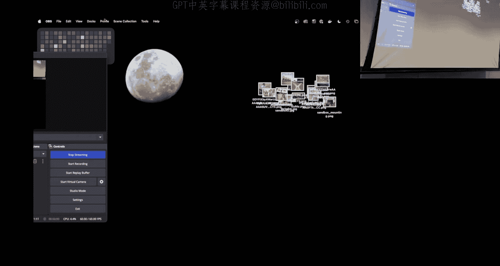

嗯。Well， what。We have here is we are in Use Lamb。And then there is the kernel and in userland。We want。

To do something， right？Oh， I should just use the tab key。That is the superior king。That was just。

All right， so we perform a cis call here， yeah。What happens so what happens after we perform the Cisco？

An interrupt is raised， I mean this is called raises and interrupt and the interrupts ISL。

Sees that its says cical and checks the RAx value to see which cical method to call in the kernel。

So I have this line here， right， it says userrland and then it says kernel。

Well when do I cross this line？あ。So you're over here saying that Im I do this this call。

 there's an interruptopus。Who handles the interrupt Okay， so this probably a nicer way of raising it。

Boom。There's something like this right we perform the Cisco call and user and that switches our context over into the kernel okay so then how does setcom fit into this so the ISr before calling the relevant Cis call method like C mode or open or tools it checks the RX value to see if we're trying to call an。

😡，Prohibited fiscalco， and if we are， it raises level。Okay， so inside the kernel。

 we're going to check RAX and if RAX is a forbidden number right per cis call we start a signal then。

We're going to， what is it， success？Otherwise。Call number the call us this call。

Call the colonel's internal method。All right， and then once we've called that method inside of the kernel。

What happens？That's all thought I going to Okay， now the answer is we put the answer in RAX and we we jump back over to usual land。

 right？And that's why when we like call open， we get a file descriptor in RAX right it's very similar to calling a function in userland right except the way that we're going over there is with this cis call instruction。

😡，Now。If I have shell code and this was one of the。Discussion points。Somehow。

If I'm already over here。And I'm executing shell code。What was my question？

Does the second call exhibit。 Oh yes， Does set that was my question。 You。

 you followed my veinign of thought。 It fell out of my head。 Does set count matter。No。No。

Because SetComp restricts what happens in userland。😡。

Set comp does nothing to what goes on in the current。Now Twitch here says。

Dwich's negative one ring of the colonel。嗯。I don't I'm not sure where we're going there。

 so generally speaking when we talk about。User land and the kernel， we do talk about rings though。

What's a ring？It's the。It's like the level of privilege the CPU allows that to the process and like userland is in drink3。

 so user land can do some things because CPU prohibits it。Okay。So you said ring three。🤧Yes。

so it's architecture specific right and I'm not ring to it， should we written through。

Generally speaking this is architecture specific， but it is a convention that exists now there is an important word that you said there and you said it was enforced by the CPU。

😡，Right。So it's enforced by the CPU。Is this something that I could overwride as root No no。

 right there there is this there is a bit in the CPU that says what ring are we in。

 What mode are we in right？ What can or can't we do and this ring determines more than just。😡。

Does does set comp matter this ring actually can enable and disable assembly instructions right there are assembly instructions that you can only execute in C2 yes。

😡，Like for historical reasons when a CPUU a lot of X8664 CPUs boot up。

 they actually boot up in like a 16 bit mode right and then they load some stuff and then they jump into a higher mode and they jump into a higher mode until they get their way up to a 64 bit mode and then they will step down Now why don't we use ring one or two？

Like what are those for I read those are historical historical for device drivers。

 but Linuxns took a different direction for device drivers so they are。😊，Yeah。

 so so historically the the intention was for these kind of middle tiers between the colon and user lane to be used for things like divide driversrs in practice that was found to be kind of a lame idea because it turns out you don't want。

😡，Colonel。Device drivers messing about with things because kernel drivers can are like unverified code from the perspective of the kernel and because of that。

 you remember the blue screen different windows right。

 a lot of that had to do with like kernel drivers is itvirus ring zero even。More dangerous because。

 I mean， ring one and drink two should have more restrict cells， you know right？rightSo it。

The statement was， isn't it more dangerous to put colonel drivers in green zero well， yes， but like。

The way that the kernel works is like we try to keep everything that we reasonably can out of rating zero。

😡，It turns out you can do most things。that you need to do on a computer from Green3 and then interact with green zero via some protocol that's defined elsewhere right such as cis callss to interact like you don't need to be in ring zero。

😡，Okay， so。

Starting on， I think it's level4， I just want to make sure we had a little bit of。

Background there。

I think it's level4。

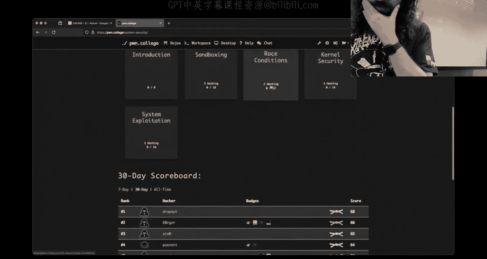

The first dialocYeah， the oc do。All right， historically。

 these first couple levels don't involve myocals。 So I'm going to skip them。

 but we can still use this as a。Kind of stand in for reasoning about these challenges。诶，这还有啊？食头。

Somebody says it makes sense set comp only affects userland because if the kernel can't， for example。

 open reader write files， then it pretty much breaks everything right when you call。

 this is another relating to that conversation because I wasn't sure exactly what you're doing。

 but if you are inside the kernel and you're trying to call right， what is the act of calling right？

😡。

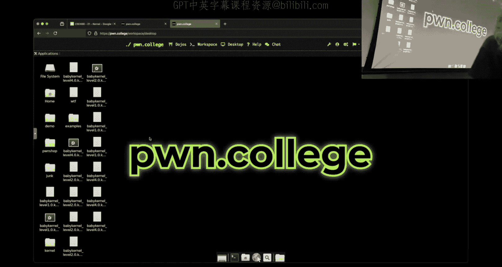

What is right？If I do man write， what man pay， well， that's not the man page I wanted。

 I'd have to go to man and two， right。What is， right？But this is a call。What is a Cisco？

It's the thing where you go from userly into the kernel。What if I'm in the colonel？

Can I go from the kernelel to the colon no， right， like like there。

 and that's one of the problems that Jan describes to his videos about writing Colonel Shellco。

 right， I don't know that that's what you were doing right because that challenge has a number of pieces。

 Yeah and so that's that's totally totally fair。But if I'm already in the kernel。

 the cis call instruction is meaningless， well it's not meaningless。

 it'll just like cause problems and blow up right I can't I can't call right from I can't cis transition to the kernel from the kernel。

😡，And so the shell code that we have to write is different。

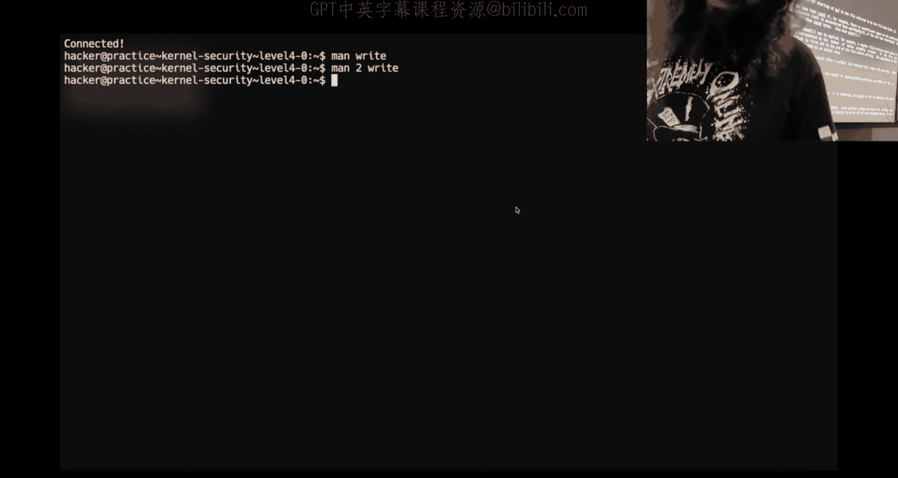

Okay， so just a getting started reasoning about these things。

We take a look at。The challengege directory， I have baby kernel levelve4。koo， what is this？

Could I just run it？Why， why doesn't this work？It's a kernel module。If I want to work on these。

Colonnal modules we do need to start it up in a VM because we aren't going to let you load kernel modules into the host system of our infrastructure that just sounds like a problem right so I'm going run VM start VM start is not anything like super crazy al right some people seem to think this is magic it is not you can look at it it's in Ops home college VM VM it's a Python script that's just calling other things right just making it pretty for you and what you will see here if I find it。

If we Gr for。This is your VM your VM is just one process right it's a single process that's running a virtual machine and these are all of the arguments to make that we have set up to make this thing behave and so were just saying instead of typing out this really long command you get VM start VM Connect right？

😡，Now when I run VM Connect that drops me into the shut or into the VM and we see my prompt is changed。

 it's very important to know if you're in the VM or outside of the VM。That so fast。

The Vm connect run itselfness So if you just type VM connect then it has to start at N connect you'll notice I type start first and then like had this hand wavy thing it because I'm a magician and I know what's going on behind the scenes the the act of connecting is actually quite quick。

 but if you just type VM connect it has to start N connect。Okay， so I'm inside the VM。😡。

How do I know that this kernel module is loaded？Okay， some of says DD message。

 is there anything else I can type？I think this is a command， right？So list modules。

 there is a challenge module installed inside the VM。😡。

And then the other command that people said with D message。

 well which D message gives you all of kind of the kernel's print information right inside the kernel。

 there's an equivalent command to like print or puts， it's called print K。

 you can see what comes out of there right here and so when the kernel module loaded。

 it gave us this nice little help text。看。So。The first thing you want to try and do on these challenges is reason about what the heck is this thing right because we don't have a lot to go off of and while you could use GDP and I love GDP。

 the correct tool here。😡。

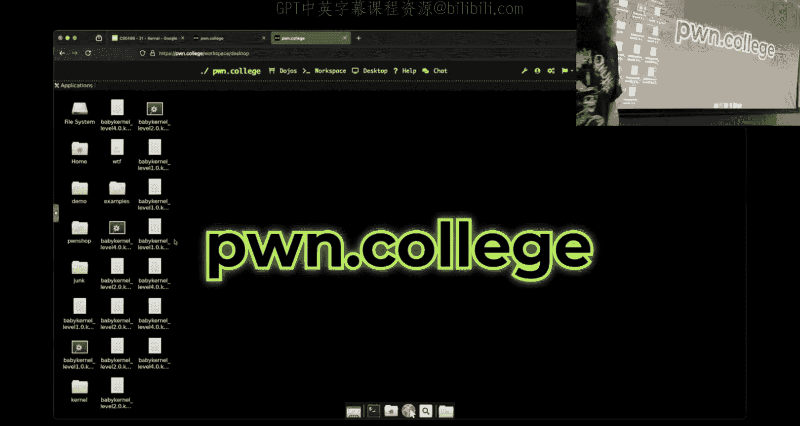

Is to use a decompilr。So we'll fire this up， a mash tab。We let I to go。啊，V are来。

We had a whole bunch of crazy stuff going on there into which。 I don't know， man。

 this head grabs and dancing aliens and。It's too much for me， Okay， so where， where's Maine？跟一个月。

I mean， you saying that's name， there is no man there is no man， why I was this thing up。module okay。

 so kernel modules don't have an entry point right and that makes sense because you don't like start a kernel module。

😡，There's a number of functions that get triggered。

At different points so what you're really doing is you're looking at here are various functions that are executed when this module is interacted with right there are different ways that you can interact with this kernel law。

😡，The first way， first thing like interaction point that we care about is a device， or I'm sorry。

 a knit module。😡，And here we see a bunch of print statements that。

Say that exact same thing right good luck， blah， blah， blah。

 welcome to the module that's chillin right here inside of an knittten module。

 that's what all of these print statements are we see this kernel module blah blah all right not super interesting。

So how do I interact with the same？You guys， what else do I want to look at you guys underscore thanks？

Device underscore things。So for this module， this is true all right。

 the statement was device underscore thing， it turns out though。

 these do not have to be named this way。😡，I could have named this phone。

 not because I didn't compile this， but somebody could have called this Fred right。

 and the Fred function could get called when you open something。😡。

There is a way to register what function corresponds to what action。😡。

This naming is really just to make it easier for you。

 but if you're is there a default way that it assumes or do we just have to give that mapping every time？

Yeah。Like is there a convention like？Is there a convention？

I'm not going to answer that just because I'm not sure。

 and I don't want to like authoritatively say yes or no。 I know that。

Because I have written kernel modules that have insane things， I know how to link them。

Right so like say this function gets called unop but I'm unaware of the convention because I don't follow the rules right I'm the guy that says warnings or suggestions so so like do you really think I know what the the correct way of doing something is I know what works。

Okay， so we have this device open。This is what's triggered when we open this kernel module and it says it's going to print。

 it looks like device open iodeode equals something file equals something， right？😡。

How do I trigger this？Guys。Directing with the Sp college file yes。

 so inside a Ben net module there was this prop3 this is exposing a kernel device at Proc and if we're inside the Vm here if we take a look at Proc we should see that there is this poem college。

😡，Pone College device。It doesn't exist， it's empty。你食饭煲放去。Okay。So I can call open on it， I can。

There's not a whole lot else going on here， is there just aocyl？

All right， does anyone want to tell me what Iocyl is or how I can find out what ocyl is There we go see you guys don't sound enthusiastic about it anymore。

 but you certainly know it。 All right， read the main page opyl is one of those Swiss army knife functions I talked a little bit about offstream on Thursday because it was part of my superfat race was using ops Iopyl is like this Swiss army knife generic function where you give it a file descriptor you give it some number and that number means whatever whatever the thing wants right there is no like standard there and then you provide a variable number of arguments that again mean whatever they want So so this isn't like a very useful main page right I mean it tells us。

😊，Just that it's like the Swiss Army knife thing。It exists from a time when things are a lot more fast and loose。

 but it' still used all the time。

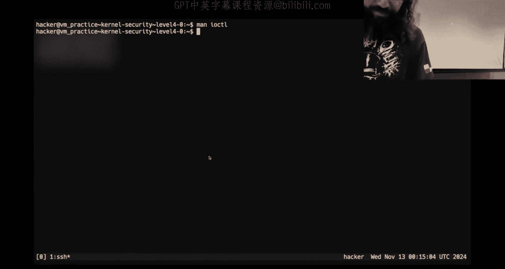

And so if I want to trigger or interact with this kernel module via Iopyl。We see that it takes。

A command， and then Ia thinks an in64 Arc。

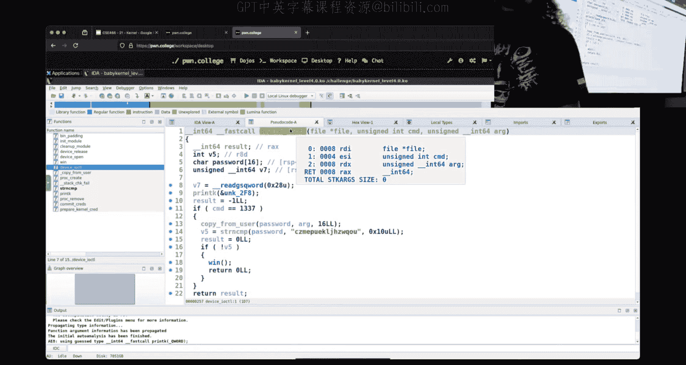

Eidda could be right， Ia could be wrong。呵。So some people probably did this how I on time。Okay。

A lot of people probably did this in scene， and they wrote something like this。Could ride it by hand。

 but we'll look at it here。So what I'm going to do is I'm going to open Protpon College。

 I'm going to open a read only it doesn't really matter， I just need to have a valid file scriptor。😡。

I'm then going to call Iopto on that filescriptor， I'm going to give it 1337 and then the string hello world。

Yeah。Now， one thing that you can do。if you look at the main page for D message。

There is dash W for follow。 This allows you to just track the output。If you can type of D message。

Watch what happens when I run my eight out out。We get additional output。😡，So now we see device open。

 device Iopal device release。These are from that kernel module。😡，Right we see inside of device ocyl。

 there's this print K， what is this unknown， this is where it has that string。

 device ocyl filehi equals whatever， command equals whatever。

And that is what we see over here in the D message。

 and so now we can start to reason about are we able to trigger code behavior here？😡。

And that's cool right， where we are in sea。Now， one of the things that you also may want to try and do。

Let's write this in Python and if you read the Python docs， you'll end up with something like this。😡。

I do not know how to make this work， I don't know anyone that knows how to make this work。

If you know how to make this work， let me know because what's happening here is Python is much like many tools。

😡，Trying to help us in ways that we do not understand。All right。

 what I mean when I say that is let's run this and let's see what D message D message output says over here。

It's going to take a little bit longer we' inside the VM now， fire up some Python。

My command number is 21505。Why I have no idea。发水。Did I pass a string was the question。电话是楚。

P 64 will give me a bite string Okay， and you're like， okay， Robert。

 you were you were trolling I skip a real number Yeah， is that what you think it is？

Let's let's do it。That that's still not going work。 It's still，'s still gonna。

 It's still going to give us command 21，5，05。 And I I don't know why。

 would No one issue that issue with Python is that the odd value。Gets messed up。 You got possibly on。

 Yeah， so， so in general， the reason that this is pain I really did it did。

 It didn't expect a  one3 or7 work。 that's fine。 the problem is this buff right， for whatever reason。

 Python。There isn't a clean way and there is something I'm going to show which is a reasonable way of doing this in Python。

 but when we do it like this and use this high level F control ocyl。

 it tries to do something canancy with the bytes and convert them in the C types and some other nonsense and it doesn't actually do what you think and if you were to S trace this it actually calls opyl like three times。

😡，and I don't know， I don't know why。And so I would recommend to just avoid this because it is a path of pain that for like three years now。

 I do not know anyone that has gotten this type of code torque。Instead， I would recommend。

Writing by if you're going to write Python code， you use what I'm going to call a hybrid approach。

 but it's really not that crazy。We're going to just use C types。

 which is a super cool interop library fory using calling into C libraries or dealing with Cstructs。

😡，I'm kind of defining these byte level things。😡，At a lower level or I don't have to deal with the higher level Python abstraction。

😡，And so we use C types to load this dynamically linked to library the Lib Sea。😡。

And once we have this Lib C object。We can call Lib C dot ocyl I know what Lib C do ocyl does。

 it's going to call just a sane opyl， it's going to be a really thin wrapper around the ocylscal。

And that I could give an F， I could give an F file number in case you didnt know like when you open something。

 you get this Python file， you can get a literal file scriptor from file number。

 but in this case I believe it maps for you。😡，We give it a number， we give it a buff。If we do that。

 this buff is going to be what we think it would be。

 we can give it a bike train and things will behave as one expects。

This is my suggestion for how you want to do things in this module。

 you'll end up trying to use opyl and you'll need to。😡，Defing what this buffer is， right。

 we just call it buff。

And when he looked at。Level4 here。Ia thinks Arg， which is equivalent to my buff。Is an M64。Here it。No。

 it's really not like a better type of this thing。是是。What's up？It's a paed， I mean， it's sir。

Yeah it's some at some pointer I'm going to call it a char star it's some bike pointer right with this。

 this could be a pointer to this could be a pointer to an array， it could be a pointer to a string。

 it could be a pointer to whatever right its just it might as well be a void star because its meaning is going to be dependent upon what is happening inside that particular kernel module。

😡，Anyone want to tell you what this particular current module is doing？

Pro are in our occupant in the corner and then combine that with the strip cool So the statement for which。

It was it's taking that argument that we're passing， it's using this copy from user。

 what does copy from user do， why does this exist we have me copy。😡。

Please copy to the kernel from board from board address I believe when is number of pipe。Right。

 so the statement was a definition of what this function does， it's essentially a men copy。

 destination source number of bytes。😡，Almost every time data is moved from userland to the kernel。

 from the kernel to userland， you're going to see these functions being called。😡。

This is actually a security mechanism to ensure that we aren't doing strange overflowy things and that pointers point to where they should they're in the correct general region of memory。

 you don't need to know that through this module but I think it's worth mentioning we do cover what's going on there in 598。

😡，So it checks for this command value。And then it just does a string compare on whatever bytes are pointed to。

I'm not going to solve it， but I hope that you can。Now。

 later modules or later challenges in this module will not be as straightforward because remember this argument is just。

😡，A pointer to some region of Ben。And so what we interpret those bytes at that address as is entirely up to the kernel Mo and so you will have to do some reverse engineering to figure out what is the structure or order of these bytes。

😡。

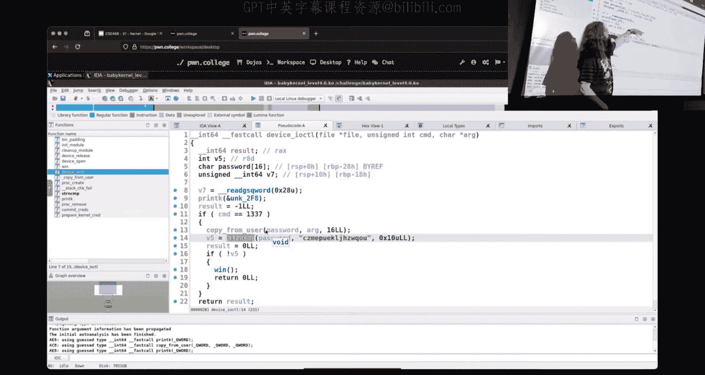

Now， one of the things。And people asked to do here。Was let's debug this thing。So before I debug it。

 I'm going to mention an additional handy GDP plugin。

Whi I'm going to show you don't necessarily need it。

 but I think it's cool it's called PT dump it is installed on the Dojo you see that line there below my Jeff opt PT dump PT dot pi。

It's a cool plugin。If I want to debug。Normally you'd say， hey， I need to VMD bug。

 you'll notice that the prompt on the right is inside the VM prompt on the left is outside the VM。

Because I want to use PT dump， I'm going to pseudo VM debug this way。

 the VM debug command is running as route。So oh， I'm in the kernel， this is magic， right。

 and then you type V map and you're like， all right， cool。There's something。Well。

 when we think about the kernel， I've claimed that there's like this whole other region of memory that is kernel memory right that you just can't see and we haven't seen today。

And you still don't see it Juliaian man。😡，This is where the PT up command。

Reveals what's really going on in memory。Okay， so here's what we got the VM map。

Here's all of that in the grand scheme of things。We you are in the kernel， you are not restricted。

But to this region of Useland， in fact， you're not allowed on a proper kernel to access the region member that is userland。

I know the kernel's all powerful except that it isn't。

There's a security mechanism that prevents that on modern CPUU。

So this is all of our user space stuff。Did。Beyond， talk about Fizz map， by chance。Okay。呃。

When I'm in userland and I touch a address， right， like I say show me examine the giant hacks at RSP。

The RSP is some and memory address。😡，What do we know about that memory address that that is that a real physical memory address？

No， it's a lie， right， everything in computer science is a lie。

 it's abstracttraction all the way down all the way up when everything you know is just made up。😡。

So it's a virtual memory address。Who is responsible for translating that virtual memory address when you're in user land and get the bytes that actually exist in RA？

😡，The看。喂。It's combination of the kernel and CPU， but we're going to hand wave it here and just say the kernel right。

 we can talk more about that next week something Yeah yeah， so this Fizz map。

 it turns out inside kernel memory。There is a region of memory。

That directly corresponds to the physical address。Of your RA and so there's a translation from any virtual memory address on the entire computer through somewhere inside of Fish map。

😡，This is physical memory mapped contiguously。😡，Nora。If we go all the way down here。For this module。

 what we really care about is。These three pages right here。Or not pages， but these three sections。

This is the location and memory where they are executable。Code right。

 this is actually being executed。看。So I want to debug this thing。

 I just wanted to shut it out because it' like， whoa man， the kernelel's huge。

So I want to debug this thing， I want to think about what's going on with my ocyl， how do I do that？

😡。

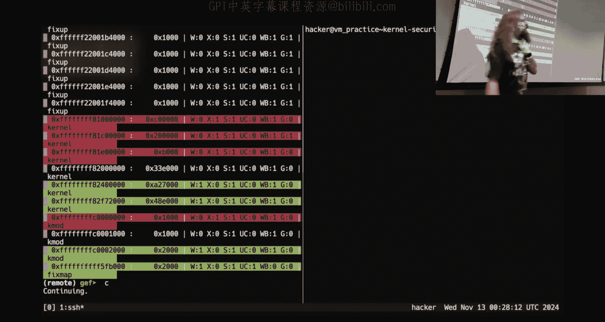

Go的。Check out the addresses because there are no samples into the2B session right now so you can grab it inside the V。

Right， so one of the problems debuing the kernel， there' are several problems people asked， hey。

 where is my x64 cis call table for the kernel doesn't exist right where is the functions that I need to know that I need to call doesn't exist。

All right， people that have a ton of knowledge about the inner workings of the kernel and kernel exploitation。

 they know it only because they've done it and they generally speaking don't want to share it because kernel exploitation is a like highly valuable skill to have。

 right？😡，So there isn't like great documentation on how to exploit the kernel or what functions you want to use。

 because when something does become， you know， generally speaking。

 well known as an exploitation path。It just gets text。

So people that do kernel exploitation don't write giant docks for you to exploit the kernel。

But we need to figure out where is Iocal， right， where is device ocal？And。You may naively be like。

 okay， well give me info， funk device， ocyl。And it just says no。

 because that kernel module is not inside the。Is not a symbol inside the kernel itself。Instead。

 there is this thing called Kol Sims。If you pseudo， you must be pseudo。

 you must do this in practice mode。 You must be inside the VM。 You will forget this。

 and this will be what you do wrong。You need to pseudo a cat， proc， kl Sims。yes， the pipe。

 I can do it wrong in a whole new way。What we get is a giant list of functions as well as their memory dresses we can gr that。

For like Iopyl and we see this is the memory address where device iopyl is loaded。

 This is valid if you have。No K ASLR。K ASLR is like ASLR just for the kernel。

So now I can break at that address。It was a lie， that was a fake GDP problem So when you're de kernel。

 you'll find that GDP can be a bit finicky。For a few reasons。1。I didn't do anything there。

 I just changed my window in Tocks， but that signal hit GDP and now it shows me this prompt。

 but this prompt isn't really there。Right， like if I were to say， I don't know， infore。

That's because I didn't actually get a prompt。 It displayed it， but GDPB isn't really there。

 I still need to control C and send the Sig impt right every time that I change this。

Here's when Gb decides it's going to show me this fake pro。O。So。How do I get there？

Why am I not at device Iocal？Because it didn't call right I didn't trigger that code pass。

 so I got to go back inside the VM。Find my Colonel Iocyl。Run my not do dot pi。

 We'll go do do hybrid dot pi。G不 the咩。Another reason why running C inside of the VM or I not see but running the compiled binary is probably the way to go。

And now I am inside。Give me 200 instructions。That was way too many instructions。

But now I am inside device hiocal and we see there's my copy from user， there's my string compare。

 there's my copy from user， there's my string compare。喂。You do not want to run the next commander。

 like next instruction。Fad things will happen because the kernel is constantly context switching between a bunch of things and so you'll end up in crazy places。

The only instructions you wanted to really run when debugging the kernel is S。

Break points and then continue as far as like moving through execution。Because if I were to do N。

 let's see what happens， well， let's see where we are all right， we should get to 1 DA， right？

See if we get there， we might。What's up？It's slower。Then step instruction， yeah。や。I don't know， man。

 we I annoying about this one。 we've gone deep。 well。

 now the annoying part about working on Colonel stop。It is that when you do it wrong。

 you'll panic the kernel， right at which point you have to restart the whole VM。😡，哎。

Like that can totally happen， so I definitely didn't end up where I wanted to， right？

And so step instruction set break points。All right， I've got 10 minutes。

 you asked about debugging what else like what were you looking for？Those are your， you know。

 your high level， right？嗯。I was just thinking about。To go through like execution。

 I guess you talked about SI basically what working as， so I guess was that a repative。Yeah。

 the answer really is SI break and continuing it can definitely be annoying doing。S I， S I， S I， S I。

 S I， and that's where。My suggestion。Would definitely be to do kind of what I was doing over there earlier。

 examine， I did 200， which is way too many， we'll say 40 instructions at RIP。

 find what I'm interested in， set a break point at the actual address。Right， best practice， yeah。

 just currently debugging socks。That's what it comes down to。

So right whats up S the statement was SI still works， SI should work。S I。这。

That's I works I have of the bundle， just like examining instructions and going straight to copy from user is your fastest way to anybody because that's where all the issues。

 most of the issues are on like when you're copy like this sounds like a you problem not a not a class problem respectful so this was true previous challenge like before this that like so so the the statement was so somebody found。

That。One of the fastest ways you were setting a break point。

 I imagine like Iopl and then setting another breakpoint at copy from user then going from there。

And in that。

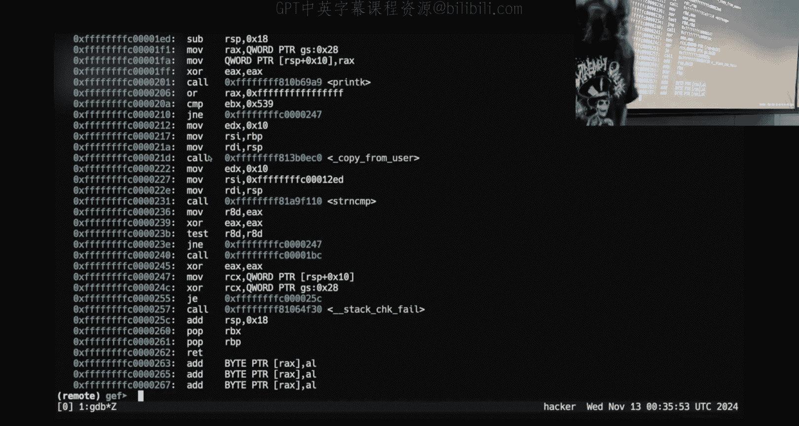

A way right， you can certainly do that that's still at a double break point。In this case。

 if I didn't know this fact right here， that that wouldn't work。Um。

 I hope people at this point can identify that factact and why that matters。

But that's that's a fair way of thinking about it is hopefully this program copies from user and you could break there。

 but you don't want to break in copy from user right and so if I does this work？😡。

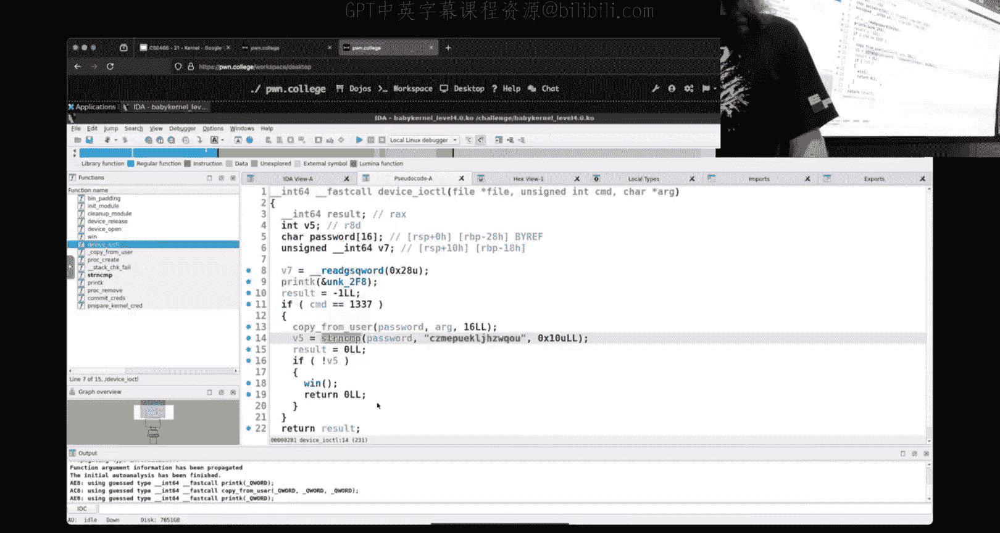

s trying to out together。不小。Nope， no love。Is that what it is？I mean that sort of shows you know。啊。

Okay， no I'm in underscore copy from user from inside copy from user inside。

I've gone down this rabbit hole of this is not where I want to be right and it had nothing to do if we look at the stack tracer and nowhere in here is my device Iocal。

 right？嗯。😊，I mean， no， this is userland， this is kernel。

 how do I know this is userland and this is current？Right the address。

 so if the highest order bit is set， then it's the kernel gets it all virtual memory is split in half like that。

😡，And so the transition reus way of the kernel is not going into this device iatto。😡，Right。

And so I do not think I am where I want to be。Did you just went up few instructions and the copy from me so you what really。

 you think I was in the right spot。All right， well Finnny。Finish should work。Yeah。

 we got a finish again。How many finishnies you want？I think you're wrong。

 I think we context switched and we're like somewhere completely unrelated。U。I'd be happy to be。

 be proven wrong here， though， because it's one of the。If the kernel can resolve all of this。

 then it clearly is not inside where we were I could finish all the way until this like go。

 we're not going to get where we want。Um。And so that that is one of the problems right is you may end up at the function you want。

 but you can no longer think about things in terms of like linear execution。

 it's not one thread of execution that's going I said a break point of a function that function could be called in 20 different processes right all of them are context switching and you don't know which process called that action to get you to that point in the current。

😡，And so that's a problem。And so I like。Having linear execution and setting breakpoint and using SI so that I just don't get lost there because once I go free。

 I release the curl and like come back whenever you get here， it very rarely does what I want。Um。

And so that is a source of trouble。Someone says there's an Easter egg if you panicked the kernel a thousand times。

 I don't know about this。

你Okay but。What is unique about kernel shell code， so this doesn't have shell code。

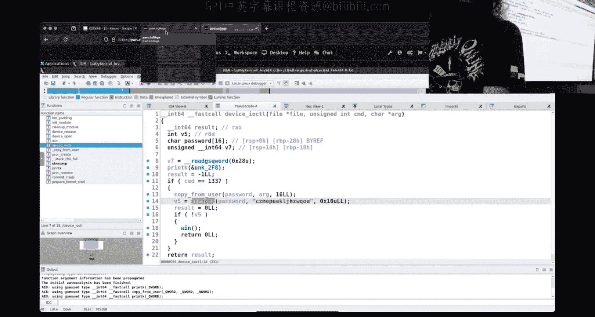

Got yan talked about a littleurgga like five minutes。We have a level here that has some shell code。

 six， six， six？Shell curved。All right。

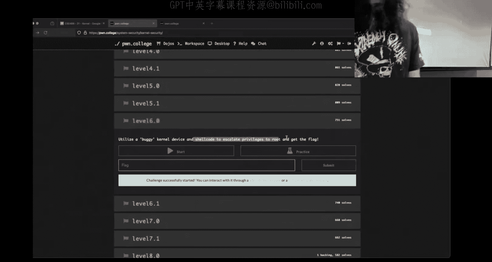

Let's see how messy this thing is。Development。I don't。

And just need to figure out how to get She code into this bad boy。

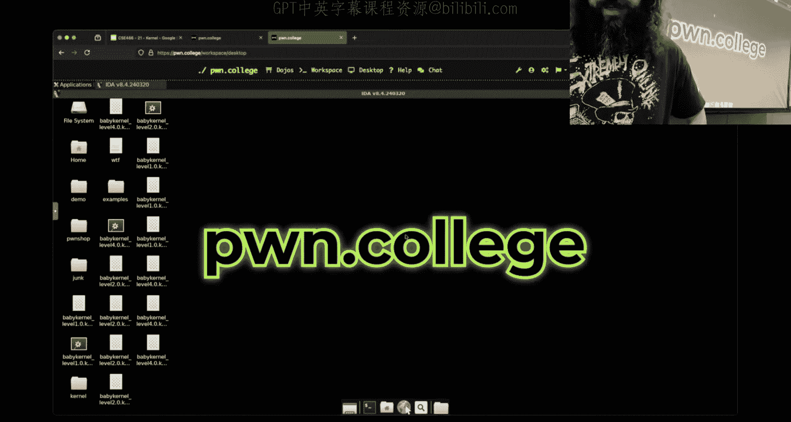

Because what's one of the things that's different there's some people that said yeah， level six。

 level seven， so clearly some people are trying to do it。

 what is different about chill code inside the kernel？You don't have this clothes。I'm sorry。

 you don't have cis call Okay， I don't have cis calls what can I do instead you can just call the cis okay。

 so instead of doing a cis call， you can call the underlying function inside the kernel that triggers that behavior。

😡，Now， I would suggest that you don't do that。😡，You can。Um。What what plan to ox your di。

What about pointing to an absolute address？AddsYeah， you can do that there was like。

 what if I like hypothetically here， if I'm inside。

Let me inside the Vm and then I wear a cat proc kol Sims and like one of the commands that I really like and you can similar you can definitely get away with some cheese。

But Janwn mentions it。 So it's fair game， right。Is run command。What if I wanted to call run command？

😡，Could I just put this constant value in RAX and then call RAX， the answer is yes。You totally can。

Right。Now you'll have a problem。If they have my shelf， the last line of my shell code is call RAX。

 what's going to happen。Yes， the statement was I need to wrap right so another problem that exists when you're executing shell code inside the kernel is you have to exit clean when we were in userland。

 we were like hey， who cares about Seg faults， who cares with sick ofboards later right doesn't matter。

😡，Well， if you lock up and crash the kernel。You're going to crash the V。

And so you want to cleanly return。And it suddenly this is an important part of what you're doing。

So if I wanted to call a run command， I want to call a run command。

 it's going to return to me and then I want to make sure that I return in the same manner to whatever called me。

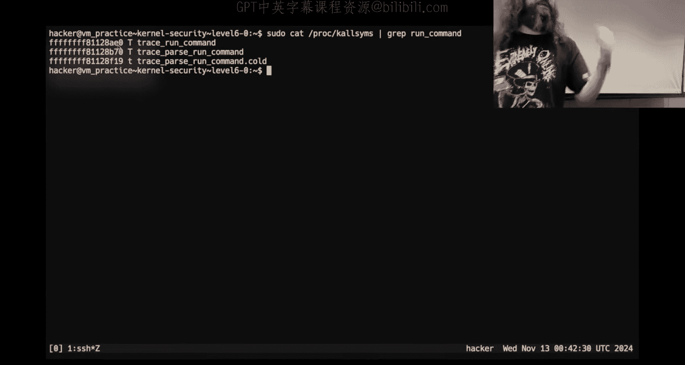

Now one of the things that if you just went in here and you went to Google and you said Colonel Shell code。

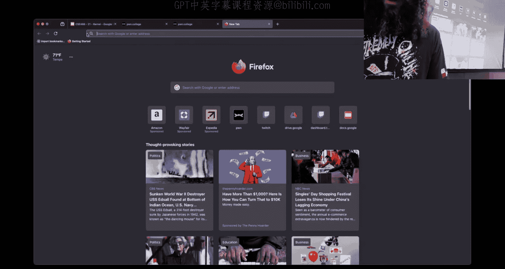

Because I'm sure if someone is doing this。あ。

I don't know。Well， you'll probably find something about SWAT Gs register and curl context with。

Just trust that the function you're in。It returns， right？So if your show code returns。

 let everything else do what it needs to do。All right。

 I'm not saying that you can't do any of this crazy stuff。

I don't know if this particular link has it， right， We're kind of blindly stumbling in here。诶。

But you don't need to do it is the point and so if you go down this crazy rabbit hole of stuff that we don't talk about。

 that is on you and that you're going to have a lot of problems。

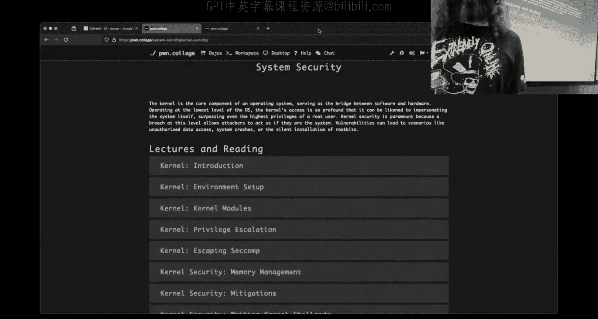

Just get your show code to return。And behave the same way as the kernel module would otherwise。

All right， I am going to run out of time before I can run some shell code。呃，去去去。Six here， though。

 what do I got， I this anything interesting？Device， right， got a buffer。Okay。

We print this buffer if the length is less than zero， we copy from the buffer into the shell code。

 and then we execute it。

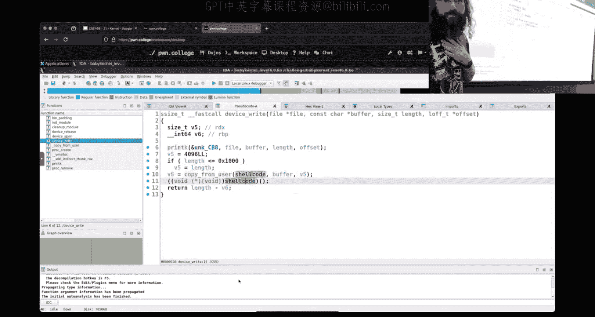

That's not that bad， right？So let's see if I can get my。Do a hybrid。To do something here。

 So what do I want to do if I want to execute some shell code in this guy。Where I need to change it？

你话快啲度位啊。I have my o Oh damn。Okay。Yeah my is。Yeah。I'm forgetting something， what is it？Conts orか that。

Oh。It's a good question， I don't know， let's run it and see that didn't work why。

We are not in yetI'm not inside the VM。It's。are so eight percent。今ス。Okay。

 so I got open and I got release。It must be string， not bites。有。

You have to specify in Python that you want this。Even then see。Whatcha。

 I think you have to do that even in seeing you're opening you have to specify if you're doing the right system then。

Okay， so now。What we saw here， was I opened it。We see that the right was triggered， it got one bite。

I imagine that my rent was that one bite。 I don't know how big rent is。And then it released。

We didn't crash， we didn't get like some crazy air。What if instead， I said。

 my buff is hellello world？Let's make it a light string too。 So that Python is happy。

Did I get the same happy output？Well， that's something。拜拜。So this is。I don't think Du be lock up。

We didn't lock up nice， so we just oops， the kernel is a piece of code that cannot fail。

Not that they literally cannot fail， but if the kernel fails your your entire computer is just locked up and frozen right and so there's a couple of ways when crazy stuff happens inside the kernel there's couple things that can happen you can get something like this which is a kernel oops and then the kernel will try and roll things back to make sure that we don't explode now as an effect of this did we get a lot of interesting information in leaks about the kernel。

😡，Yes。Keep that in mind for the future。The other thing that can happen depending upon how the kernel is configured is it can just completely lock up at which point you have to restart the VM but with that I'm out of time。

 we'll take a look at some task struck stuff a little bit later。

 but this should be enough to get you started on like the first half or so。😡。

With that， I'll leave you guys， goodbye， good luck， have fun， see you Thursday。

