# ASU《计算机系统安全｜ASU CSE466 Computer Systems Security 2024》中英字幕deepseek p24 -25-Kernel Security - CSE466 - Robert - 2024.11.14.zh_en -BV1spCGYZE9D_p24-

we are live， I have no slides， but hopefully we'll have some fun live demos。

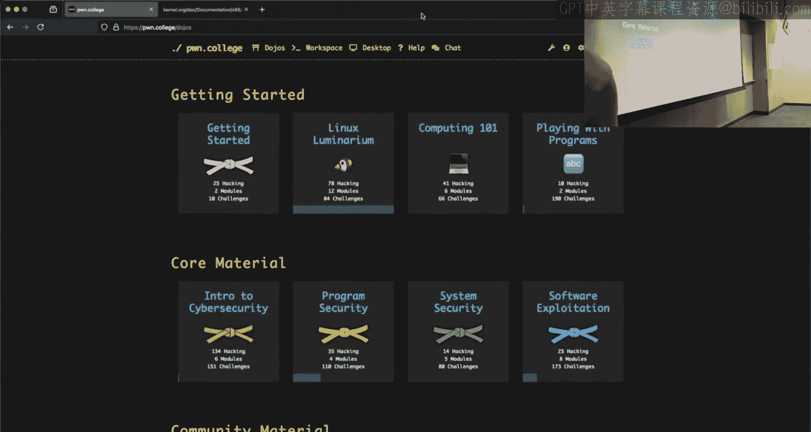

Give it a second for Twitch， let's see what OBS， what doesn't work on OBS today。

是实。Audio appears to work， you are moving the magic audio bar just so you know。

 whatever you're saying is is making its fine way over here on Twitch。

That suggest that you don't do that。All right cool so I have no slides。

 but we are here CSE 466 system security we're talking about kernel exploitation we had quite a bit of chit chat here before class from what。

Was said， people were interested in level， helps if I hit the right thing， kernel security。

 they are interested in level 11。

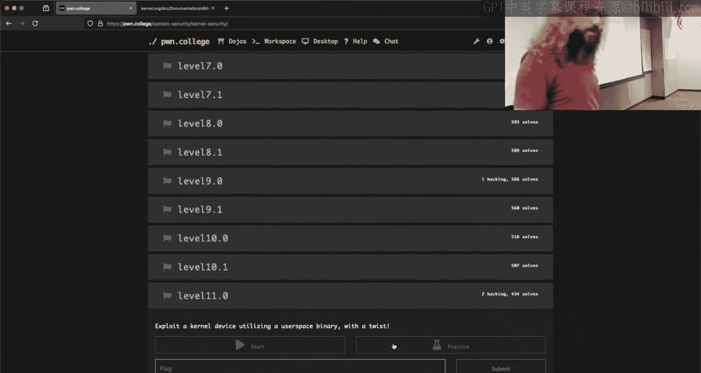

And we seem to be having some some discussion about level 11， level 12， how they。Relate， so。

We'll connect the old Dojo here。 I run level 11， it says， hey， give me some shell code。

 except it says， hey， we opened Praton College on F negative one and that means。

I know bad stuff happened。Now it says attempting to load the flag into memory。And all of a sudden。

 there is no flag。 right， So something， something not good happened here。

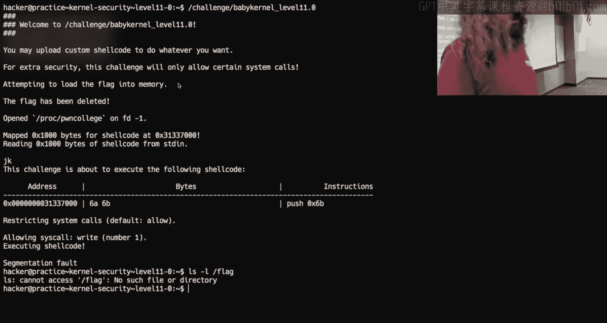

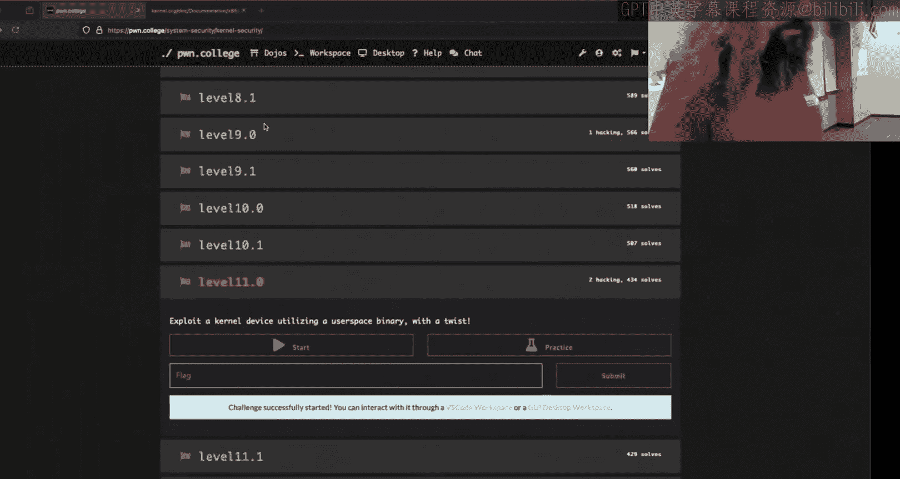

Anyone want to tell me what this challenge does？

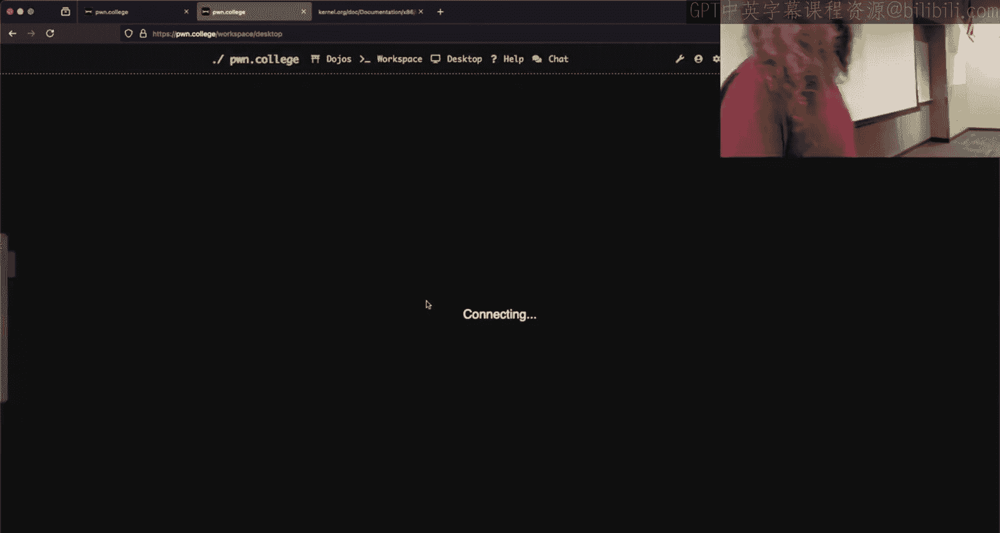

It linkss the flag it unlinks the flag， so this one is a little bit tricky。

Now， depending upon how you try and deal with。The problem。

 you can set yourself up for a bunch of pain， historically level 11 and level 12。

People think about it wrong and they constantly restart challenges like they think every time that something goes wrong。

 I need to restart the challenge， restart the VM then there's like this giant overhead to it。

There's some truth to love that when it comes to level 12 that is not necessary in level 11。

So if we take a quick look here， what this thing does is it's going to。

Load the flag and then unlink the flag。Now， if we look at load flag， what does this thing do？

It's going to call fork， it's going to open the flag file， it's going to read it into memory。

And then it is going to infinitely sleep。So this child process。

There's just an infinite loop then it should exist。

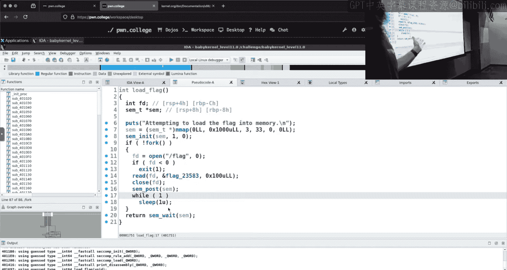

Now， since I ran it outside of the VM， I do need to restart it。

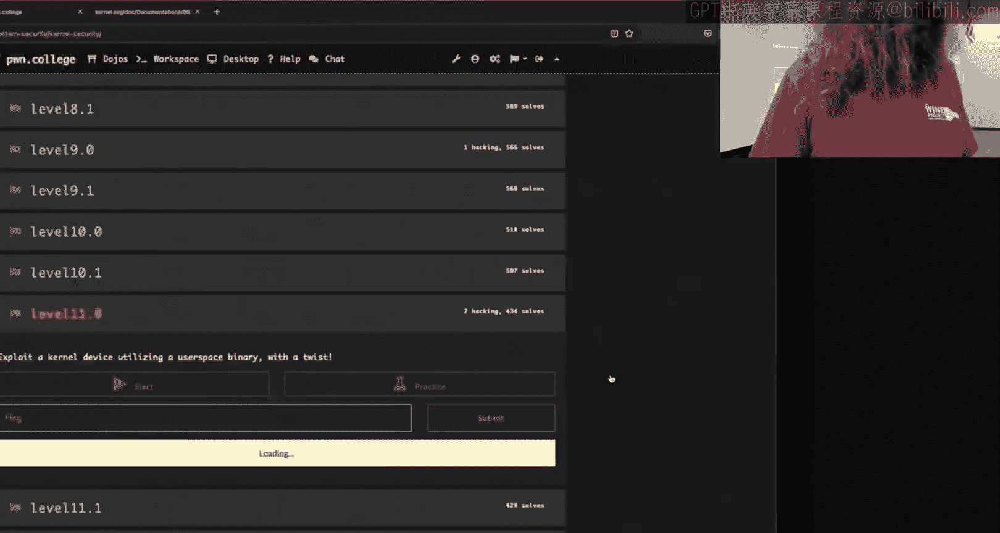

We'll see now I do have。A flag file。So if we VM connect。Yeah。PSAuxX。Let's grip。

For what is this thing called？Baby， please say you're next script， baby。

I got no baby We'll run the challenge。I'll give it some nonsense。 VPS A UX， regret baby。

 I got a baby。All right， so this pit exists。Now。If I try and run this challenge again。Why did this。

 why did this happen， why am I stuck now？But there's no flag， right。

 we said that every time I run the challenge， it tries to load the flag and then it forks off this child process and then unwins the flag file。

Do I need to restart my VM no， do I need to restart the challenge to create a flag file？😡，No。

If I want to try and iterate on this and think about what's going on。We see this child process。

Is long lived， I don't have to do anything。 It's just there。

 I've created the state that is going to be my exploit， but I need the current running。

Challenge binary。To just continue so I can do the other part of this exploit。

We can do that if we're in practice mode here。We can touch the flag， amen run it。Suddenly。

 I can do this and if we PSA U now I have two babies。All right。Which one am I interested in？

It does matter。你啦。Do you say175 is what I want？The earlier one， yes， so all of these。

 and if I were to keep doing this， right， I'm iterating on my my exploit here。

And it's just may I keep sag faulting， I don't know what's happening I don't know what's going on we'll see that every time I read this。

 I get more child processes that are just long loopbed hanging out here there is only one that is of interest and it is the first one。

Because every other one of these， sure， at four o'clock。

 it opened the flag file and it read it into memory。

But the only process that has the true flag value is going to be this guy right here。

 which is the first child because after that it was deleted。😡，Now。

Yng talks about something in the lecture video。 He talks about， I think dev Mem。

Which is kind of cool， right， it's a device that maps the memory。😡，对。

There's a similar thing inside of Prague。We were to go Prac， for instance， self。

We see that there is a。Proc self mem， there's a Proc1 mem， Proc2 mem。

 this is a way remember Proc is just this like made up file system this provides us a way to interact with a running process's memory。

 however we do need to be root to do this。Now this is somewhat giving away part of the goose。放来。

I if you didn't know that you could do this， I'm not sure how you would get there or choose to go this route。

 There are other ways to solve this for the record。 This is just one way that I think is pretty cool。

So I'm going to make a Python script， do I have a do dot Pi？I do， that's a shame。

I'll do it over here outside of the V M。 Well move do dot pi to be do dot old dot pi and make a new。

Do that by。So user bin N Python3 from。I don't want anything， I don't think I need any of that。呃。

I'm going to say with F or with open。Prorac， let's see what pit。

 There was one pit I was interested in。 Which one was it， you guys remember stuff more than me。16。

166， it is。So we'll open Pro 16，6 mem。I want to open this for reading and I want it。

To be accessed as a binary file， right， RB。Now， the way that you kind of interact with memory here。

Is you have to call seek。Everyone here know what See does on a file， yes。

 when we're interacting with the file we read things sequentially See allows you to just jump the cursor of where in the file you are so that way when you call read you're reading from that location in the file So this is not a real file it's a pseudo file we can use seek to seek to a specific address in memory so I can say F seek now the question is where do I want to seek to。

Well， I probably want to seek to wherever in memory this flag is。

Fortunately I restarted the challenge so we got a fire back up here。

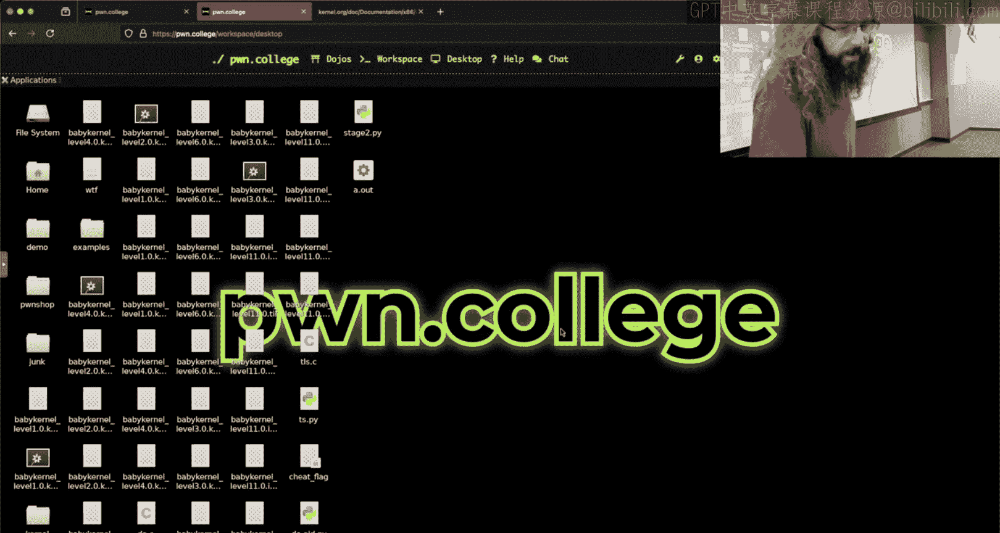

When we look at load flag， where does it reach to it， reached to this thing right here。

How do I figure out where in memory this is？I could G be it。We can get it from Ida here。

 I just double click on it we see that it is in the BSS at 404040。😡，是。

Now。An important thing to know。Does is this minus is this in the BSS does PIE matter？

DIE matters on the BSS。Because the BSS is part of the elf。So if the binary is PIE。

 then the elk would be randomized with ASLR and that value that we get from Ida would be in value。

Take a quick look here with check S， what do we see， we see that there is no PIE。

 so this address that we saw from static analysis will be correct。😡。

So I'm going to seek this to 40 40， 40。I'm going to say F read。And let's read。系。40 bytes。

And let's just see if we can print it out， see what happens。Go into my VM here。

 we'll C mod plus x my do dot pi， we'll run my do dot pi。And it tells me。Permission denied yes。

 I do need。To be routeed in order to access another。Process and if I am root， what do we see。

 I am able to read this out of the running memory of that process。Now。

 the reason we can do this is because there is a pitI。Right， because there is a。

Continuously running process that I can tap into its member。So if for this level。

 I were to somehow escalate my privileges and get myself so that I can execute in user Lamb。😡。

As root。I could use this as an exploitation factor。

It's pre asking and then we just pull know yank it right out of memory。

And this value that I needed to hard code was a constant。I didn't need to change this every time。Now。

 one of the problems that people have kind of said that they ran into and I don't know that they're trying to do exactly what I just did here。

 but they've made the comment that。I can't run my script。😡，From from the kernel。

 like I'm trying to call into Python from the kernel and I'm having having problems。

So if you use Run command to try and grab a Python script and execute it you're going to have some problems。

 Python will not be able to pull in imports because it's not going to know the Python path and where to find these libraries。

😡，You're also， if you try and print it out is standard out of this thing that the curl running。

 is that my guaranteed to be my screen no you're you won't get it。😡。

So you probably want to read it and then write it to a file that's on disk that you get or writeite to a file that you can later access from the shell and then cap that file after the fact you can in fact do this。

😡，I don't want to show that。A thing to keep in mind。Head， okay， if I had N one。

 because I tried this late last night。UAnd this was the beginning of my stage two。

 but the way that I called it was with an absolute path。So if you， for instance。

 were to try and call run command and say Python stage two。

We have to know what Python we're talking about and if you've gone down this rabb hole of which Python how does this？

😡，How does this get resolved， get results from the path？

Do you know what the path is when the kernel calls run command？No I don't know what it is all right。

 I know that it's messed up and things don't behave how they should。

 so let's just avoid this problem， let's specify an absolute path。😡。

Now you could chase down which Python， which Python， follow Simlinks or whatever。😡。

What you'll end up at。Is not here， but this is where I'd say to go user bin Python is asse link to Python 3。

 so then you'd say which Python3。😡，Whatever， okay， there is， I want an actual elf。

 I don't want a simlink， I don't want anything resolved in the path。

 I want this to be an absolute thing that is clearly on my system and is completely sane。

This user bin Python 3。8。😡，Is a 64 bit alpha is located on the path。 There is no confusion。

 there's no sibling resolution。 There is nothing。 If I specify this exact path。

 there is no confusion or misinterpretation about what it is I'm trying to execute。

And so I wouldn't say。Run home hacker stage2。 pi， I would say user bin Python 3。8 home hacker stage2。

5 This is what my working exploit does when it calls by stage two from the current。

There was a chance that it didn't work and like we broke something and I was like。

 I need to fact check this myself。I did it last night。Anyone have any questions there？Makes sense。

 super cool， what do we got？So it runs this script with。I bring zero permissions。 No， well。

Running command， we can go down this rabbit hole。 I've got down this rabbit hole before。

 and I still don't have。A good。

Explanation for this。So we would want to find。Where is run command in this thing？By run CM。

 is that what it is？Yeah。Reference defined， I don't like that。We'll go with it。Yeah。

 that's the right one。Okay。I said that the environment and the path is。Not what we would think。

We see that right here right we can pull up the implementation of Run command。

 the path is going to be this， so if I type Python I don't know what it's going to be to right we'd have to like empirically see what it is。

😡，If I reference something via whole iss going to start at root。

 it's not going to go to home hacker because from the context of the kernel。😡。

It isn't running as a user right this is just executing a task right it doesn't even like spin up a process if the kernel runs a command。

 is there a P？😡，No Ps are an abstraction the kernel provides to you people in userland the kernel just does what it wants and so here the kernel is just like yeah man we're we're going to do this and we're just going to go and so it's a lot harder to reason about what is going on。

😡，Is it running as？UI zero， I don't know， man， I just know it runs。ButLike it's unclear from here。

 right， we could go into call user Mo helper。😡，I wish I had a better。Apparently， this doesn't exist。

Rip。Let's just try an older version of the kernel。 Nope， bootland just does not want to。

Want to behave。 Let's see。There we go。😊，All right， it just says， hey， this thing exists somewhere。嗯。

嗯。It defined as a prototype， I in U oh， that's in the header。Where is this one？Yeah。

 but if you go on this rabbit hole what you'll find is it doesn't actually stand up a whole process and like expose pit and do all of that inside the kernel like there's a difference between a kernel thread and operating system thread and then like a PI and these terms are honestly kind of overloaded and convoluted when you start talking about the way Linux handles things because like a process is actually a process group and then a P isn't really a pit a P is the same as a tiD except for when it's not and you're just like I don't know man。

if you want to go down that rabbit， all you can。I would just say like make the bare minimum number of assumptions that are needed if you decide to go down that path。

😡，All right， the other thing that I think is worth discussing。

 which is what I wanted to kind of show， I don't， yeah， I can't do this on level 11。

Was I wanted to talk about the task。Task truck。Now some people already。

How many people use the task ining like earlier challenges？And they actually cleared set pump。

Gotta cu you， you know， I know you don't have to like when I originally did this， I didn't。

 I was just like， I't know what's going on here man， did you write it and see。You did Okay。

 see I personally do not like that。Concept that you like Janwn shows of like oh we're going to compile a module and we'll get these symbols and we'll write it and see and we'll go and kiss out like that that just is a recipe for something exploding to me right similarly Jan spend a decent amount of time showing how to build a kernel module right you don't need to do that。

😡，I don't trust the compiler to do what I want。And so what I wanted to show on Tuesday。

 but I didn't get time to。Um， was how we can reason about where the heck is this task struck in just assembly and if I want to just do things in raw shell code instead of using C。

Because one of the things Jan says exists。Is current。

Current is this magic variable that refers to the task dropped。And so it should exist。エンジリビ。

But it does not。And so we have this problem here。And。Reasonably it should exist， right。

 like if this GDPB setup had symbols and things were things were happy， but things aren't happy。Yeah。

 I think it's important that we think about how we can get around。So what do we know about the？

Task front。Do we know anything about it it's like an eight or something the task truck is eight bits。

bunch of information regarding the card or on a process right。

 so as like a TI that flags in in some other data numbers。

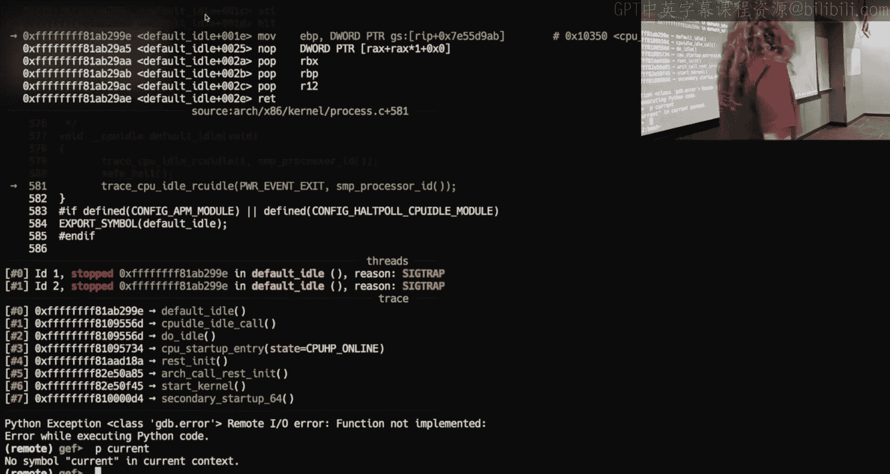

So the task the the concept of a task truck or a process structure is。Pretty much ubiquitous。

Across operating systems， they have different。Different names。But the task truck is actually huge。😡。

And it does have things such as。Where did I go？Pid。The P， the TD。

 I think what you were thinking of when you said an eight bit field was the set comp。嗯。

The value that has the setcom flag， which is attached to， the cred strunk。

And so you end up with there is a task structure that encompassed that the kernel has for every running process that contains all sorts of information the kernel wants to know about the current running process that includes file descriptors so like what is a file descriptor when you call opening you just get this number。

😡，Well， the kernel， if we look in here， let's see if I can find it。嗯嗯。哎有你 ready。

There is an FD table somewhere on this thing。😡，And that is the table of open file descriptors。

 So when you call like read on you pass it。Two， where you give it some number？

What the kernel does is it pulls up the task dropped it then looks for。

The file descriptor table that is linked into this there it is。😡，There's FD struck。

So this FDstruct this FS pointer is a pointer to the FSstruct which is a table of file descriptor numbers。

 so it's a file descriptor number and then what is the actual files contents right and so this is how that magic number gets mapped to a particular file right the kernel just internal internally tracks this for you。

😡，And that's part of the task structure， and there's a bunch of very specific things that the kernel needs to have that are unique to every single process。

😡，Yeah。Now。Where is this task struck reference， but I just said it's like referenced all over the place。

Where has Janon talked about it being referenced？So I want him to like where in memory is this bad boy。

 right？GS register all right， yeah Jan says the Gs register and this was this was my my trap I got stuck on Tuesday word class。

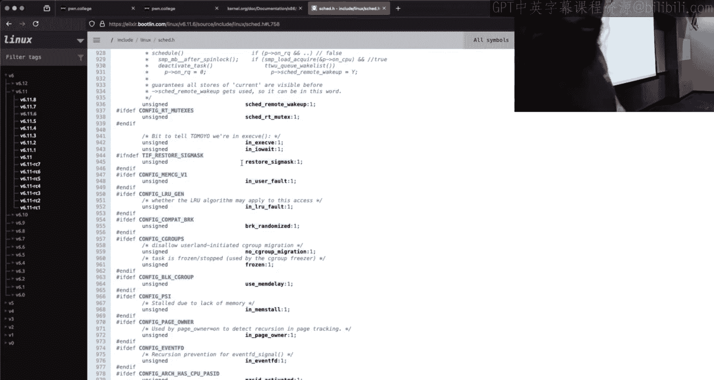

I was like， oh， I want to show how we can pull from the Gs register it segment register says it'll be super cool right Jan says the Gs register。

Now I'm here。On the curtain， we get inforedge。And we see that Gs is zero。

 does that mean it should address zero？Oh， we see Gs base is D000， is that where it is？Oh。

you think that。Fun GDP fact， I already showed you guys squigggles， right。

 how we can cast something and dereference it。So we could say， I want to print。Ha astruct taskstruct。

GS base。All right。Does this mean that this is a task truck？No。

 I just told G to start interpreting a task struck at this address。

So how do I know if this is correct or not， Well， let's look at like the P on this task truck that I just kind of said。

 yeah， GDP， pretend this is a task truck， the P is zero。

 Does that make sense though it's notsensical， the sta canary is zero， does that make sense No。

 that's nonsensical and just to prove that I can do this with like any address。

 we could just say yeah， pretend RP is a task truck and like GDP is just gonna happily go along right And even though it's just gonna cast that memory as this value and pretty printed for me it doesn't mean that's what it is。

So we need to somehow figure out， well， okay， it has something to do with GS。

 like you're correct there。

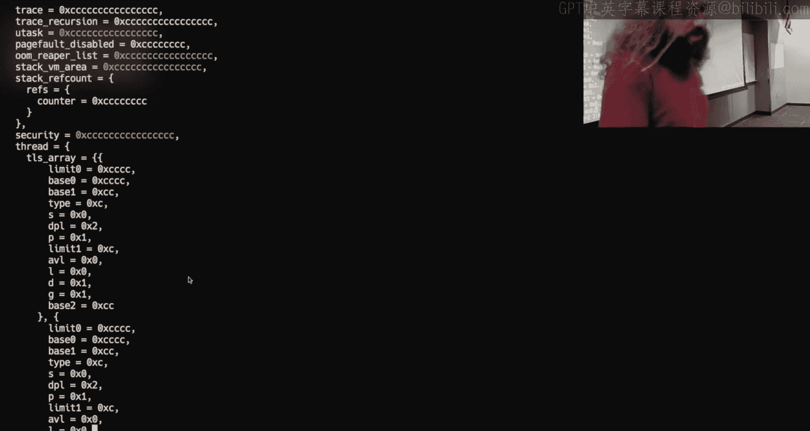

U but where， where in memory is this bad boy？And if you ask Cha ET it will lie to you。

 it'll tell you things it'll give you some constants， I don't remember what the constants were。

 but their lies if you' look it up online， you'll find that if had G register and find some constants。

For this kernel those will also be a lie， so it's like， how can we figure this out？

What do you want to do？I'm sorry， make a device write and just send something to that device。Okay。

 we can look at device right， Why do you want to look at device right？What's our thinking here？

You can go to the coffee from user where it actually copies your。上个诶。If it sets up the secondcom。

 it has to set the second flag and you can see where it settings sit。 Okay， so we know that the。

Setting of set comp， right happens。The flash in the other do co。 Yeah， Oh you got me。

I'm opening the userL binary。嗯，嗯。We will open。I' want to open I on a new instance。 New instance。

Take a look at the kernel。You look at device， right。I this is the path I was going to go。

 but I'm okay with it。You want to go into copy from user， what do I see？

But it sets the second flag the science binary and the module it it sets it somewhere so we can go in GDP and see how it's setting it and a reason about where the structure is from the G sub。

H。Dont con。 So you're。You're going down some， some crazy rabbit hole。 I'm not saying that it。

 I'm not saying that it doesn't work， but I， I don't follow the， the full logic there。

 So I know that there is for just from from Jan's lecture。 There is this commit cred。Bad boy， right？

And so if I look at the implementation。Of commitit creds。Hey， this is that current thing。

And that current thing should be my ta truck。There's this is what this is what makes sense to me I agree with you your like how you are getting there。

 but it's less intuitive to me。Okay， I look at this in GDP， yeah。

So I should be able to， for instance， examine 20 instructions at。Commit crreeds。And what I see here。

Is this assembly， so somewhere in here it's loading that current。And what's the constant that we see？

15 d0， zero Now the way this segment register kind of thing works。Is we take。

 if we wanted to look at or interpret this， what this is doing is it's moving the value that is at Gs base plus this offset into R 12。

😡，When I am going to prove it。 So we're going to let this run for a bit。 We found our。

 our magic number。😊，When I have a do two dot pie。This one， we're going to run inside the VM。

From Po importm star。We'll say open， I need some shell code， She code equals。AM， I need a context。

Someone says it's run Oh， oh， you're correcting me on a command yeah。

A little bit slow on the uptake there。All right， I want to call commit crrebs just because I want to execute。

 I don't expect this to actually do anything， I just want to verify my understanding of what's going on here。

So I'm inside the VM here。 we pseudo cat proc， KL Sims， we for。嗯。

I was too optimistic there I can make creds。I get the address。I'm going to move into RAX。

This value I'm going to call RAX。The other thing I'm going to do。Now， let's just do that。Yeah。

Then we're going to open Proc home College。Okay。With。Right binary。As F。F the right shell code。

For those of you that were saying like don't you're this Python， Python is cursed。

 now you just have to think about how buffered writing happens right when a file is closed on a buffered writer。

 it will get flush。😡，Since I'm using this with syntax， this will flush before the print statement。

Because when I leave this block of code， it's going to close that file descriptor。

Because I what I have to do in this challenge， I should probably understand what it does， right？嗯。

Okay， now it's a username binary that I pass shell code to， Okay， so let's not do that。Yes。这出。

The risk flushing was no longer an issue。You have to write to the phone。Oh no。

 you're going to make me do that。对。I'm not going to do that what you want that's run that's going to in user space and it's not going trigger。

 so instead I need to run a different level I need to run6 Can we do that like printed out since we have the base we have this Gs offset。

Okay， you just say， hey， can I print it out。 Yeah， yeah， All right， we can do that。 So if we know it。

 we can say let's print as astruct taskstruct。I want Gs base， where was my magic number？

SB or justI want GS base because I'm a believer。What was my magic number， 15 d00？嗯。Taskstr P， this。

Where am I GS base plus this。Where am I context？Default idle， yes， we have Gs base， right。

 This exists。No， it does not， Why does that not exist？Is this like a cap thing？It is。Okay。

Does this thing？Makes sense。 Oh see， Do I have a P that looks like a P。Nope。Dang。What happened。

The instruction that we look for it said G and that offset。I still think you're wrong。So。

What I did with this print statement was I said there is a。Task truck that is at this address。😡。

But it's not， there's a pointer to the taskstruct that's at this address。

 so I actually cast of it wrong。What I want。Is this？hich you could。Turn into。Gosh， dang it。Now。

 that's right。 The casting is good。 This look， this looks beautiful。 We just don't have a pit。

 because we're not。We're in a task， we're not in a。

A kernel task is not necessarily a running process。

 This is why if I were to do this same thing and beyond on。

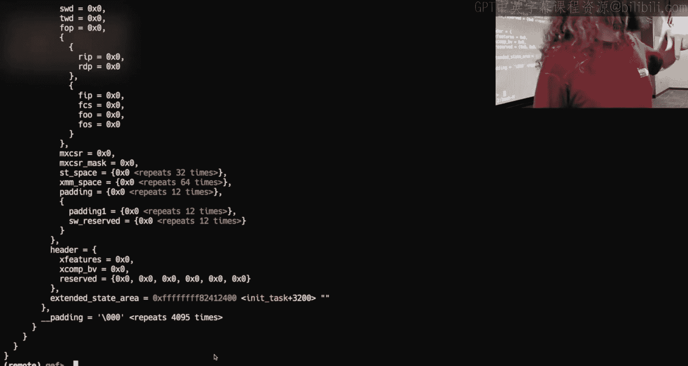

I think it's six is six the first level lets you run shell code I'm going to bail。

 I want to get that pit。 I want to show that I am in the kernel in that P with that task。

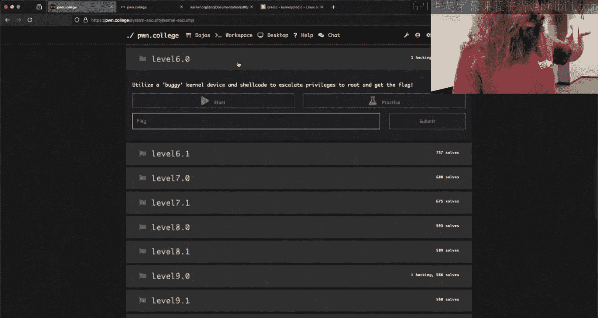

I believe I can。And while I'm refiing up here， is anyone of anything specific you wanted to hit me with？

嗯。After this， all right， you want to see the task。You're just along for the ride。O。

Wait for GDPb to freeze my Vm。My is happening there with my do dot pi， no， I need do2 dot pi。

I opened it up inside the Vm。Horrible them due to dot pi。And now this is level 6。0。别别这。Which level 6。

0。But it doest not have a binary image。YouOh， level 6。0， we write it to， lights， you know， gosh。

 thank it guys。With open。Cpped college。Right， binary has half。F。Right。嗯。All right， you got that。

Can I run due two， no， I didn't see it mod it。Do think it's still not going to workt you to？

is not set。I want to break at commit crds。Right， am I where I think I am。Yes do you think so。哦 said。

So if what was my total shell code here， move RAx。I don't think I hit the full。系啊。

I think you are in I'm incomement creds， but I'm not from the call stack。

 This is the problem with setting doing what I just did there。

 so we'll delete break one will'll continue。I have to get out of here， we have to get。From KL Sims。

 we'll Grep for viceb。We'll grab that。Well break at。I actually know let's be more clever than this。

We'll examine like 40 instructions。At that address so this is device right What I care about is where the shell code is called。

It happens at this indirect thk。Everyone know what a Tk is？Or whyhy we have indirect client。

 why does' this thing say call？It's like a directed junk。

I meanSo this this is something that were this exists because of micro architectitural exploitation。

So。This is a way， anytime that you have an indirect jump。

 which means that there's an address that's like in a register that specified themm going to jump to。

 you used to be able to do like what you do in shell code when I move RAX。

 some address and then I call RAX， right？😡，But because of micro architectitural exploits。

This causes a problem because micro architectitectural exploits have to do with things running ahead of where they are when we think about regular code because things actually don't run in sequence on the CPU。

😡，And so this indirect funk RAX is there specifically to make it difficult for the CPU to know where we're going。

 so it serves as a point where things do not speculate。😡，Which will get to。

Get to have some fun with here next week。Okay。H， we're going I do die pie。

 hopefully I get to that punk。Give planon in a sweet minute。Let I make it to the thk。

 we were at the thk， we S I， and when we go into this thk， it's going to be just some weird nonsense。

 right， generate thk。This is just here to make it。😡，And so that it is unclear where we're going。

Because it's also unclear what's happening when we're in GB， right？Okay， we end up where we were。

If we。Step and step， we should get the call。Yeah。嗯。Here's my push R 12。

 and then we get our move R 12。So R 12 has the pointer to the taskstruct。

 And so if we were to print as a。Sted。Task struck。A 12， I think that works。Here's my pi。Pid AF。Oh。

 I should have made Python print the P。啊。175。I don't have a good way to get that P。

But it's a reasonable number， right？Okay， I'm paused inside the kernel。

 right that's the problem with。あ。b m b。I was doing that。But the。Oh。Okay， but I can find。Crad。

This is what you're actually messing with when you start talking about overriding set comp right and so we could go from GS GS base plus what was it 1 d5000 whatever I type it find the offset between here。

 how do I find the offset from the beginning of the task struck to real cred you may have done it and see。

 but what if I want to do it in assembly？😡，We're just SOL。Like these are two locations in memory。

 right？We can offset them。So I have。R 12。And then I have。R 12。Real。Creb。

 that gives me the actual pointer that's there。 And if I put Am in front of that。

 I get the address of it。 So now I could subtract these two values。

 and I would know the offset from the beginning of the。Processstruct or taskstruct。

To where this pointer is located。😡，And so I could write this in assembly pretty easily right。

 I can move the address of the taskstruct into some register。

 I can calculate this constant right now， let's let's do that。😡，It's he 630。

 so I can move Gs base plus whatever that content was into Rx， and I'm going to add this constant。😡。

Plus x630 in the REX， we can dereference that and they would give me the pointer to the real cred。😡。

Here。Buts that real cr？We see that it has things so like your UI， your GI。

 what should this number be？Myend， is a decimal。1000 when when what is the UI of the hacker is your text 1000。

 this is how the current or not H 100 it is 1000 a tax 3 E8。😡，This is how the kernel。

Hands all of stuff， how you get those checks， Do you have the permissions Are you the right user right。

 It's all saved in something that is derived from that task truck。😡，And we can use GDP。

 we couldnt use C and compile and do that and trust the compiler to not。😡，Break us right。

 but what makes a lot more sense to me is to look at it。In memory。

 and just calculate what I need I could get to this。Cran truck。

And get to any member of the creditedstruct in like， I don't know，10 lines of assembly。

I'll bet you that's going to be cleaner than what the compiler will do。😡，I think it's kind of cool。

 especially when you start thinking about howstructs work offsetting and start navigating real data structures that。

😡，You know， are in the operating system。Sos a question the set comp black bits are stored inside this real cr structure。

 yes， the set comp bits are。In here。W is what I'm looking for。好啊。I would have to consult。Where is it？

I just take a quick look。Let's find it。

嗯。Ha we。S小。Name standss。Oh， I have to， I don't remember which one。Which where it is。

 we have to consult the yawn slides。

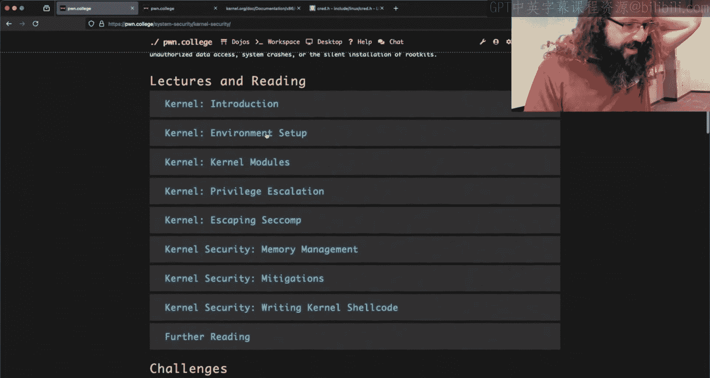

Yon tells us which one it is。Tasksstruct。Crad。Flags， oh。

 flags on thread info where thread info is a member of， okay。

Nor does he have that。嗯 during the song不对。This doesn't define it that way， doesn' it。

嗯。Yon has it is third info。

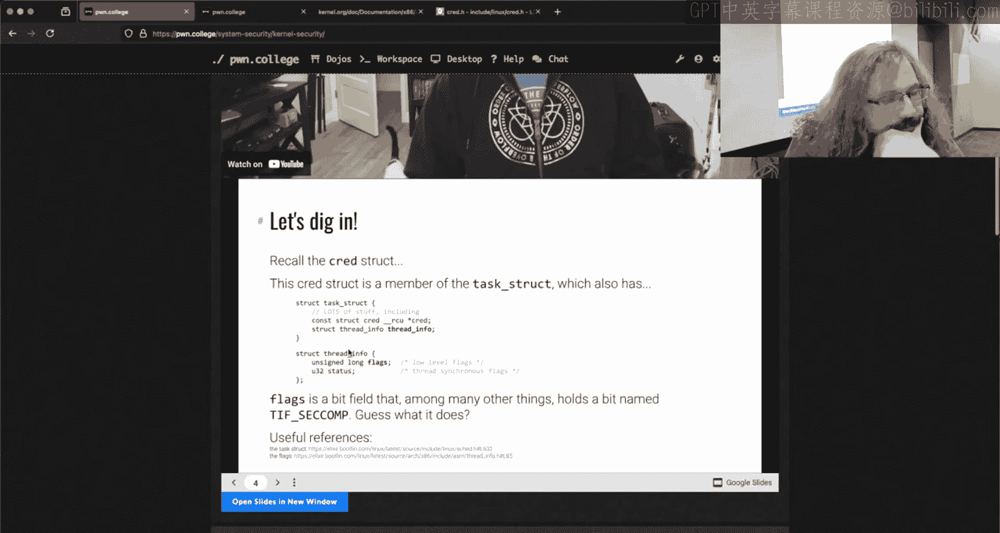

Which is part of task truck。 Did I go down the wrong thing。

 I thought that creds was the creds I wanted。

This， go back。We've rabbit hold， but I kind of want to find the answer thread。是嗯。Its to a key ring。嗯。

Very。Gosh， dang it。You did it， right？Where where's the seconds it's just in the current task。

 but which bit did you flip so you're saying that it's。

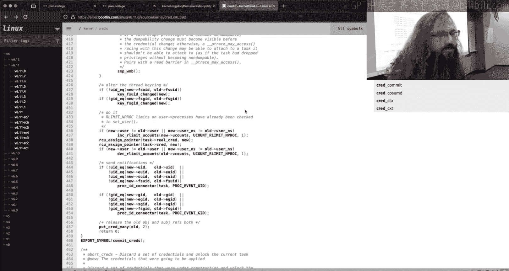

嗯。嗯。The first 8 bits of the cred。喺新嗰边你好。That would be。Oh there it is Okay。

 yeah I'm a liar da it yeah， yeah， yeah okay， so this was the task struck the first member of the task truck creds。

Cres was a pointer， but this thread info is astruct inside of thestruct so that we don't have to find a pointer。

 read it and then go to it instead it's this flags value of the thread So yeah you got you gotta catch me when I go down the wrong hole going so different about that's thought your was correct because it made all sense they made sense Yeah。

 it made sense it said creds， I got I got tripped by Y's Craiged statement。

No no it's this flags value here inside of thread info。

 which is the first member of the taskstruct Okay， the world makes sense all right， good。

And so you didn't even have to go and navigate astruct， but we could， all right？

We could do that if we wanted to， and it'd be way more fun。

 if you set 10 lines three you did it in three， you're like， yeah， it's way better。 All right。

 All right， that's fair。

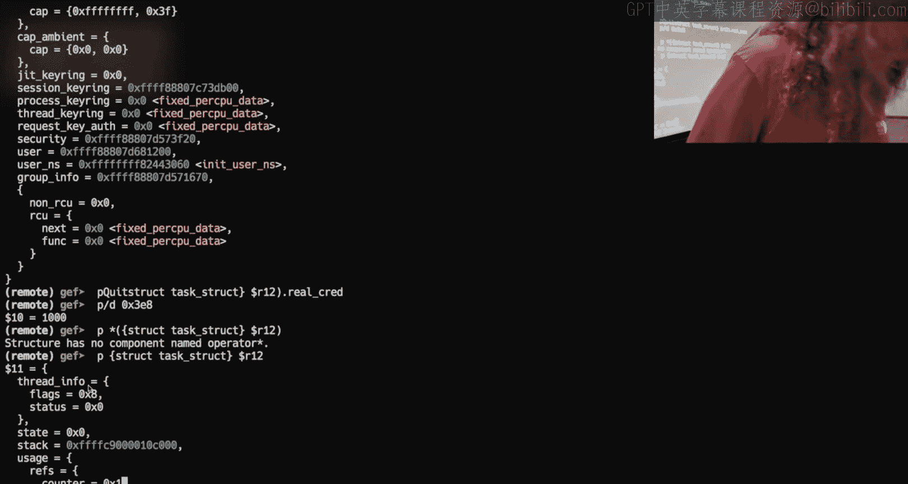

But I I think it's super cool that you can do this in GDP and you should be able to do this and it's a great way to figure out what happens。

 especially when you're talking about conflict target like the kernel because my kernel and your kernel are going to be compiled differently and if you look at the source code of this task truck there's lots of。

😊，I'm no longer looking at the task structure， but there's lots of pre compileilr。Um。

 flags here so like if something。Some setting is set then we compile with these additional values。

 otherwise we don't， and so these distances for where is something in memory。

 what is the offset into extractstruct is going to be like instant specific in a lot of cases。😡。

Because the odds are pretty good that the kernel is not compiled the same way as what you think it is。

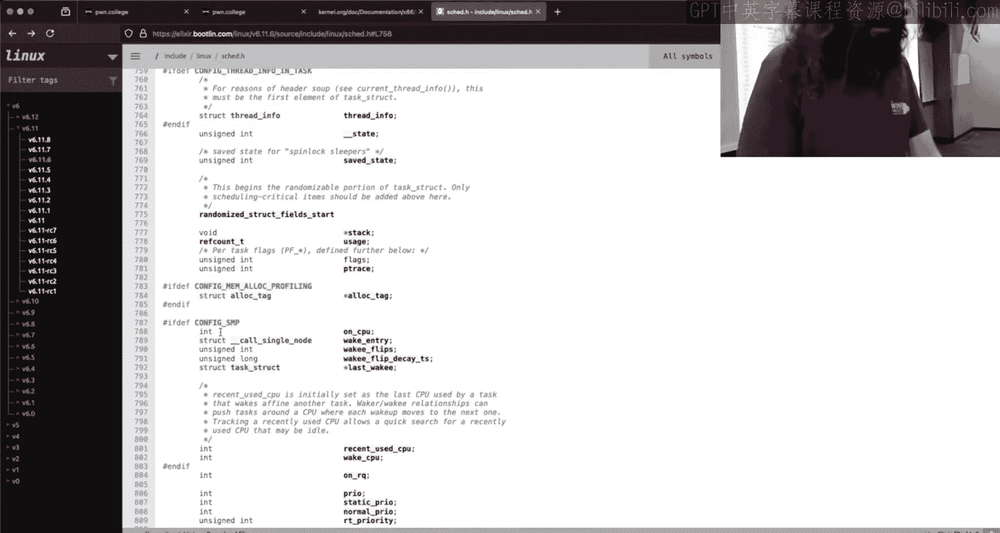

Anyways， that was my little ranch there。You said you had something， what do you want to hit me with？

It's almost if you want to go back， talk again about level 12 and like memory management。

 but we know that。The child like the child process loads the flag into memory， right？

And since we are able to execute chackled in the kernel。

That piece of the colonel has access to that piece of amendment。I I think。This is just the current。

 right？My question is， I don't formula lady well。How can we go through the paid offset or just put through the pace that process to access to see where the flag is that what and six stage pages it？

Okay。So I think I can eat 10 to 15 with this。So level 12 is very similar to level 11。

 and I showed a cool way to do level 11。12 says all right， we're going to load the flag new memory。

 we're going to delete it。Except that I do it again。 I did。 I'm not inside the V M。

It's good that you guys get to see that， right？somebodybody says how is how has the GDP started with the challenge。

 what is the best method of interacting with levels one through six？So using GDP。

 I am going finish your your question but I I realize I skipped that if the binary is a user land binary。

 which is what like this thing here is when we look at baby kernel level 12。

0 or challenge baby kernel12。0， this is a。😊，Usually an executable L file。

 we would use GDP inside the VM， so I'm inside VM practice。

 I'm going to call GDP on that challenge right Now if I want to debug the kernel。😡。

Somebody says is GDP the G debugger， the answer is yes。

If I want to debug the kernel and I want to see what's happening inside the kernel on the Dojo。

 you can run the command VM debug and this will load up G。

 but now I'm debugging the entire virtual machine。😡，That。Is running here。 So right now。

 GDP has this paused。 If I go over here and I start typing a bunch of keys on the left hand side。

 we see nothing happening。 Hopefully， you can hear me click。

Now when I hit continue over here in my VM debugger。

 all of a sudden all of that output shows up on the screen。

 that's because the G of the virtual machine when I'm debugging a kernel that is freezing the entire virtual machine。

And so you want to know。Am I trying to debug something in userland or something in the kernel one of the questions on Discord was if I'm debuing the kernel。

 how do I get to the memory of the running process？😡，The answer is you can。

But it's it's way more pain than it's worth and it makess way more sense。I two。Debug。

I have two G sessions， right like debug inside the Vm for userland while simultaneously debugging the entire Vm from the outside。

😡，要看。嗯。Get out of there。 So now I am inside the VM。We run level 12。

0 it does in fact behave correctly now， it says it opens a flag， it reads it into memory。

 the flag has been deleted， and then it lets me execute some Chcut。哎。Easy， right？

Do I have any babies？I got no babies。All right，' so。The question is， what do I do here？😡。

The observation was。That。The process is dead and so I can no longer access like PRc PD map， right。

 because the process isn't there。But if I'm in the kernel。Does the kernel still have access to that？

The answer is actually maybe like， oh， it has access， it has access to that。

 I'll say I'll say it this way， it has access to that memory address。

It does not necessarily have access to that in value。😡，So on Tuesday， I talked about something very。

 very briefly because I wasn't sure， and I'm never really sure of anything。

And it was the first thing I done。嗯。It's always something cool in GDP， right？

One of the first things I did was I said。Oh， I didn't see that。Because of the way PT dunk works。

 you do have to run this pseudo I said， hey， there's a whole lot more going on in memory here with this PT command。

 right？And this is where you're like， yeah， man， the kernel's got access to all this stuff somewhere in here has to be where that process' memory was。

But remember that all of this is this virtual or physical memory that I'm looking at。Yeah。

 even inside the curl， these are virtual memory addresses， right？The lie runs deep。

And so know a virtual memory address arbitrarily inside the kernel has no guarantee in it's extremely unlikely to be the exact same physical memory that that process had at that virtual memory address right let's say it was at I don't know that it is but let's say hypothetically that the flag was inside that child process at 4040 40 40 4040 is probably not even a valid memory address here。

😡。

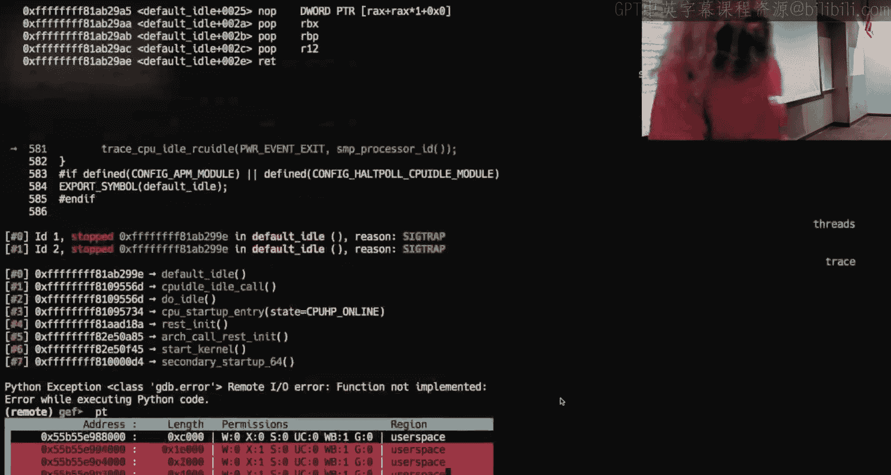

， now， maybe。Maybe it would be here。Um， but it very， very。

 very unlikely that it would have that it would result to that same physical memory address and have the supply。

 right？Now， I said there was something called Fizzmap。This thing right here。

Anyt remember what Fizzmap is？See every once in a while， I say something that's useful。

I try and hide it in all of the nonsense the actual on the in the memory Okay so so F mapap is a mapping of the actual physical memory addresses because it turns out virtual memory is way better than the amount of RA that you'll have physically in a CPU I think Jan talks about Amazon servers having terabytes of Ram that's fine have we have many terabytes of virtual memory right so so it's not going to be a one to one we can map all physical memory is accessible from right here。

So if I wanted to just scan all of physical memory， right。

 because virtual memory is backed by physical memory。I could。Access this memory address。

And start just checking。诶。Somewhere in there。Should be。The flag， now there's a caveat to this。

 and it's a big one。How does virtual memory work what happens when just randomly on the system。

 a new process starts？Yeah， well， when a process asks for new virtual memory。

 that virtual memory needs to get back by physical memory。

And so that means that while you are trying to scan this in the kernel。

Maybe that physical page gets reallocated and gets overwritten。Right。

 just because something happened to start up and it happened to get virtual memory that was mapped to that physical page。

And so I'm not going to say that it's a race， but there is an element of that to this。Yes。

 so for the physical map section of memory is is it quite literally the one to one addresses so those addresses I see in the bi map section are quite literally the physical addresses or you know so the question was is it quite literally that this number ending in 9900 aren't I that's not the first one ending in FFF 888 is the first physical address the answer is no doesn't look what it maps to is physical address zero。

So physical address zero going to be is mapped to virtual address F FF888。😡。

And then zeros in the current Okay， right， and so the size of FsAT is directly proportional to the amount of RA that is physically in your computer。

😡，RightBecause there is when the CPU is interacting with RA。

 there is literally a number that is like corresponds to a location on physical RAM right and so what we've done is we've said the physical location on the Ram that is zero corresponds to the beginning of F map so a section to virtual memory is correlated to all those012 v4 by6 yes so if for whatever reason you would as far as I'm aware you'd never be able to start from this point。

 but if I was like I want to know what is at。Physical RA at address 1337。

 I could take the beginning of FSMap and add Hex 1337 to it， pull that。

 and I would tell me what is at physical memory at Hex 1337。And this is a constant。

 It's almost like I had a feeling this was going to come up。 I had the。And this already up。

So if you Google， let's see， let's go back， Linux kernel memory mapping， right？

You'll get this and this is an official kernel doc。

It describes what is the memory layout of the kernel of these higher order bits right this is all user land because the highest order bid is in set。

 but this is all kernel space and there's some values。😡，That are known that are constant。

 And one of these somewhere here， it should say。If I can read。Fizmap。Here we go， boom。

It's that same address I just said， FFFF 8888。Theres 64 terabytes of space。

 a virtual memory that is assigned to a direct mapping of all physical memory。

 and that is just known。😡，That just is。Now， I thing to think about that is a gotcha since I've seen people try and tackle level 12。

As we said that。The physical memory that you're trying to access may get reallocated by a running process。

😡，Let's say I wrote an exploit。And I did it in Python。You think Python uses a lot of virtual memory？

Yeah， right， Python is a pretty big thing it has this whole。😊，Interpreted language。

 it's going to map Page's memory， it has to do some lift。

 there's a whole lot of stuff actually going on when you run Python code。😡。

So Python is going to ask for real physical memory quite a bit。And it adds in effect。

I not let's say you can't do it， but I've seen people try and write solutions。😡。

That in userland or running in Python and by virtue of the Python interpreter just using memory being a Python interpreter。

 they have a very hard time finding the flag in physical memory。😡。

So this is one we're writing it in C。Where you have direct control of memory and allocations is probably a better way to go。

😡，Because you're not going to be using that much virtual member。😡，And that's how I do it。对。Yeah。

 hit me， what do we got， have to search all 64  Do I have to search all 64 terabytes？Well。

 I don't think these computers have 64 terabytes of memory， I could be wrong I haven't looked。

 I think they all have a terabyte。😡，still slowchuck。Is it？

Computer science people just don't have a good grasp of numbers and like what is a big number？No。

 it's not you。I would start at zero and move forward。one of two things will happen。😡。

You'll find the value or it will blow up。And then this goes back to kind of like when we're thinking about sandboxing and this isn't like specific to sandboxing or oh my gosh。

 this problem， but just being a computer science person right computer science isn't about how to use a computer it's how to think computational。

😡，Do I need to chat every single by it navigate page wise Okay。

 so there's a statement about pages right what do we know about segmented pages right memory segmented in the pages？

😡，Do I had some idea of where into the page this flag is located could I reason about that into the page。

 how is all virtual memory allocated？😡，By the page right， so so when I looked at， for instance。

 level 11。I said that the flag was located at Haps 40，40， 40， right？

What is the offset of the page on that？😡，Is it 40。so the least three significant nibbles are the offset into the page。

😡，If everything is mapped at a page level， I don't need to iterate through every byte that's forshire。

😡，Allright。😊，I could you implement every eight pointss and just look for ASI。

 right like I could do that， but we could be smarter in how we search this。Now。

 if I start looking at pages and I know the offset into the page。

 I've drastically reduced my search base。😡，So again。

 it's like being clever and thinking about what you're doing and understanding how the machine works。

 right， leverage the computation or the mathematics of what's going on to your advantage。😡，You。

 you can。I'm not going to say like you can find a solution or you know。

 get the flag instantlyly every time， but you can get the flag reasonably quick。

 reasonably consistently with a well written solution Now the downside to level 12 is。

If you don't get it。😡，What do you have to do， Can I just re my exploit？Now you're curved。

 you restart the challenge， you restart at the Vm， you run it again。This is one of。

Probably the most unintentionally frustrating challenges because of that。

We do have other challenges that。Used to delete the flag or like could have deleted the flag and we specifically do something else。

😡，To give you like in equivalent handcuffs。But for this challenge in particular。😡。

There is no better way to like represent what's going on in the power of the kernel than doing exactly this。

关。Why couldn't you when you run the chant again， make a cl file and then delete it。

Could thatSo the thing was why when you run the challenge I write the flag file or I write the flag file then delete it so that would mean that the flag would have to be located either in the binary so you could pull it out loop。

Or it is located in some other file that is red and you can be like well。

 then you' use cryptography if you know like like that's a legitimate thought right one of the things that I thought was really cool in a grab。

I think it was a grad software exploitation course I took。

Was we did we had this this whole like module thing on hostile buyhs things that try and encrypt themselves and do other things where they reach out to a server to get a key to then decrypt themselves and there's some value and okay now you can't reverse it because it's not even an elf right and the answer is there's a way to all there is always a way around that right if the key the key would have to be located。

😡，On the computer。But then I have the key， then I can get the value。

The key could be located somewhere else， okay， now you can't get it， well it's over the network。😡。

I can sniff the network， I can get the key， I can undo this right it turns out like almost。

Anything that one could reasonably think of to try and do what you're saying can be outd。

At which point we'd introduce the challenge？Could be solved without actually doing the intended solution。

There's too many unintends that can go there by doing any type of thing that reintroduces to flag。Un。

It's it's a great question like like you would reasonably think unless you've gone down that rabbit hole like。

 oh， I could do。And then you'll get a butt and then you'll get it， but then I could。

 and then you get a butt and it turns out like all of it can be undone。

And for a reasonably determined hacker， especially someone who is particularly clever。

 they'll realize that the easier solution。😡，May not be the director。And that ruins a lot of fun。

Somebody says here， 42 is a big number， negative one is probably a bigger number， okay？

Maybe these are， these are deep truths。And then our last comment here from Twitch is I did brute force when I first solved 12。

 but now I'm trying to walk the page tables。Walking page tables。

There's something that everyone will get the pleasure of doing。In microorage。

W is why would we had to walk page tables？😡，When you can actually see them。That just sounds too easy。

And。Watten the page table as I'm thinking about that。

 the challenge there is the page tape page tables are process specific， right？😡。

And so because every process has its own page table。

 its own mapping from virtual memory to physical memory。

 So I'm not sure I'm not saying that it doesn't exist that the page table doesn't like happen to exist in physical memory。

 but your。😡，Kind of fighting yourself there because I would expect the page table to be the page table for that process to potentially be reallocated facing the same problem as well。

😡，U that you would phase in just like brute scanning memory and looking for the flag， right。

 that physical memory could be reallocated for another page table or for something else。

I'm not that intimately familiar with those mechanisms。

 but I would think that that is something that's possible that could stop you from walking the page tables as an approach to level 12 specifically。

All right， anyone got me laugh admit things I'm a couple minutes over。h， would tell him？哎。😮。

I'll take it。With that， I appreciate everyone hanging out Micro arts will launch on Friday and then we have a holiday I'm probably going to be relatively unavailable over the holiday just as an FYI so if you have troubles with micro arts try and ask them not over holiday break because I will try and not look at Discord goodbye good luck。

